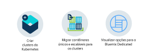

---

copyright:
  years: 2014, 2017
lastupdated: "2017-08-014"

---

{:new_window: target="_blank"}
{:shortdesc: .shortdesc}
{:screen: .screen}
{:pre: .pre}
{:table: .aria-labeledby="caption"}
{:codeblock: .codeblock}
{:tip: .tip} 
{:download: .download}

# Introdução ao {{site.data.keyword.containerlong_notm}}
{: #container_index}

Gerencie apps altamente disponíveis dentro de contêineres do Docker e de clusters do Kubernetes na nuvem da {{site.data.keyword.IBM}}. Um contêiner é uma maneira padrão de empacotar um app e todas as suas dependências para que o app possa ser movido entre ambientes e ser executado sem mudanças. Ao contrário de máquinas virtuais, os contêineres não empacotam o sistema operacional. Apenas o código de app, o tempo de execução, as ferramentas de sistema, as bibliotecas e
as configurações são empacotados dentro do contêiner, o que torna um contêiner mais leve, portátil e
eficiente do que uma máquina virtual.

Clique em uma opção para começar:

<map name="home_map" id="home_map">
<area href="#clusters" alt="Introdução aos clusters do Kubernetes no Bluemix" title="Introdução aos clusters do Kubernetes no Bluemix" shape="rect" coords="-7, -8, 108, 211" />
<area href="cs_classic.html#cs_classic" alt="Executando contêineres únicos e escaláveis no IBM Bluemix Container Service (Kraken)" title="Executando contêineres únicos e escaláveis no IBM Bluemix Container Service (Kraken)" shape="rect" coords="155, -1, 289, 210" />
<area href="cs_ov.html#dedicated_environment" alt="Ambiente de nuvem do Bluemix Dedicated" title="Ambiente de nuvem do Bluemix Dedicated" shape="rect" coords="326, -10, 448, 218" />
</map>

## Introdução aos clusters no {{site.data.keyword.Bluemix_notm}}
{: #clusters}

Kubernetes é uma ferramenta de orquestração para planejar contêineres de app em um cluster de
máquinas de cálculo. Com o Kubernetes, os desenvolvedores podem desenvolver rapidamente aplicativos altamente disponíveis usando o poder e a flexibilidade de contêineres.
{:shortdesc}

Antes de poder implementar um app usando o Kubernetes, inicie criando um cluster. Um cluster é um conjunto de nós do trabalhador organizados em uma rede. O propósito do cluster é definir um conjunto de recursos, nós, redes e dispositivos de armazenamento que mantenham os aplicativos altamente disponíveis.

Para criar um cluster lite:

1.  No [**catálogo** ](https://console.bluemix.net/catalog/?category=containers), na categoria **Contêineres**, clique em **Cluster do Kubernetes**.

2.  Insira os detalhes do cluster. O tipo de cluster padrão é lite, portanto, você tem apenas alguns campos para customizar. Na próxima vez, será possível criar um cluster padrão e definir customizações adicionais, como quantos
nós do trabalhador estão no cluster.
    1.  Insira um **Nome do cluster**.
    2.  Selecione um **Local** no qual implementar o cluster. Os locais que estão disponíveis dependem da região em que você está com login efetuado. Selecione a região fisicamente mais próxima de você para melhor desempenho.

    Os locais disponíveis são:

    <ul><li>Sul dos EUA<ul><li>dal10 [Dallas]</li><li>dal12 [Dallas]</li></ul></li><li>Sul do Reino Unido<ul><li>lon02 [Londres]</li><li>lon04 [London]</li></ul></li><li>UE Central<ul><li>ams03 [Amsterdã]</li><li>ra02 [Frankfurt]</li></ul></li><li>Sul da Ásia-Pacífico<ul><li>syd01 [Sydney]</li><li>syd04 [Sydney]</li></ul></li></ul>
        
3.  Clique em **Criar Cluster**. Os detalhes para o cluster são abertos, mas o nó do trabalhador no cluster leva alguns minutos para
provisão. É possível ver o status do nó do trabalhador na guia **Nós do trabalhador**. Quando o status atingir `Pronto`, seu nó do trabalhador estará pronto para ser usado.

Bom Trabalho! Você criou seu primeiro cluster!

*   O cluster lite tem um nó do trabalhador com 2 CPUs e 4 GB de memória disponíveis para seus apps usarem.
*   O nó do trabalhador é monitorado e gerenciado centralmente por um mestre do Kubernetes dedicado e altamente disponível pertencente à {{site.data.keyword.IBM_notm}} que controla e monitora todos os recursos do Kubernetes no cluster. É possível concentrar-se em seu nó do trabalhador e nos apps implementados nele sem se preocupar também com o gerenciamento desse mestre.
*   Os recursos necessários para executar o cluster, como VLANS e endereços IP, são gerenciados em uma conta do {{site.data.keyword.BluSoftlayer_full}} pertencente à {{site.data.keyword.IBM_notm}}. Ao
criar um cluster padrão, você gerencia esses recursos em sua própria conta do {{site.data.keyword.BluSoftlayer_notm}}. É possível aprender mais sobre esses
recursos quando você cria um cluster padrão.
*   **Dica:** os clusters lite criados com uma conta de avaliação grátis do {{site.data.keyword.Bluemix_notm}} são removidos automaticamente após o término do período de avaliação grátis, a menos que você [faça upgrade para uma {{site.data.keyword.Bluemix_notm}}conta de Pagamento por uso](/docs/pricing/billable.html#upgradetopayg).

**O que Vem a Seguir?**

Quando o cluster estiver ativo e em execução, será possível verificar as tarefas a seguir.

* [Instale as CLIs para iniciar o trabalho
com seu cluster.](cs_cli_install.html#cs_cli_install)
* [Implementar um app no cluster.](cs_apps.html#cs_apps_cli)
* [Crie um cluster padrão com múltiplos
nós para disponibilidade mais alta.](cs_cluster.html#cs_cluster_ui)
* [Configure seu próprio registro privado no {{site.data.keyword.Bluemix_notm}} para armazenar e compartilhar imagens do Docker com
outros usuários.](/docs/services/Registry/index.html)

## Introdução aos clusters no {{site.data.keyword.Bluemix_notm}} Dedicated (Beta encerrado)
{: #dedicated}

Kubernetes é uma ferramenta de orquestração para planejar contêineres de app em um cluster de
máquinas de cálculo. Com o Kubernetes, os desenvolvedores podem desenvolver rapidamente aplicativos altamente disponíveis usando o poder e a flexibilidade de contêineres em suas instâncias do {{site.data.keyword.Bluemix_notm}} Dedicated.
{:shortdesc}

Antes de iniciar, [configure seu ambiente do {{site.data.keyword.Bluemix_notm}} Dedicated](cs_ov.html#setup_dedicated). Em seguida, será
possível criar um cluster. Um cluster é um conjunto de nós do trabalhador organizados em uma rede. O propósito do cluster é definir um conjunto de recursos, nós, redes e dispositivos de armazenamento que mantenham os aplicativos altamente disponíveis. Depois que você tiver um cluster, será possível implementar seu app nele.

**Dica:** se a sua organização ainda não tiver um ambiente do {{site.data.keyword.Bluemix_notm}} Dedicated, talvez você não precise de um. [Tente primeiro um cluster padrão
dedicado no ambiente do {{site.data.keyword.Bluemix_notm}} Public.](cs_cluster.html#cs_cluster_ui)

Para implementar um cluster no {{site.data.keyword.Bluemix_notm}} Dedicated:

1.  Efetue login no console do {{site.data.keyword.Bluemix_notm}} Public ([https://console.bluemix.net ](https://console.bluemix.net/catalog/?category=containers)) com seu IBMid. Embora você deva solicitar um cluster do {{site.data.keyword.Bluemix_notm}} Public, ele está sendo implementado em sua conta do {{site.data.keyword.Bluemix_notm}} Dedicated.
2.  Se você tiver múltiplas contas, no menu de conta, selecione uma conta do {{site.data.keyword.Bluemix_notm}}.
3.  No catálogo, na categoria **Contêineres**, clique em **Cluster do Kubernetes**.
4.  Insira os detalhes do cluster.
    1.  Insira um **Nome do cluster**.
    2.  Selecione uma **Versão do Kubernetes** para usar nos nós do trabalhador. 
    3.  Selecione um **Tipo de máquina**. O tipo de máquina define a quantia de CPU e memória virtual que é configurada em cada nó do
trabalhador e que está disponível para todos os contêineres que você implementar em seus nós.
    4.  Escolha o **Número de nós do trabalhador** que você precisa. Selecione 3 para maior disponibilidade de seu cluster.
    
    O tipo de cluster, o local, a VLAN pública, a VLAN privada e os campos de hardware são
definidos durante o processo de criação da conta do {{site.data.keyword.Bluemix_notm}} Dedicated, portanto, não é possível ajustar
esses valores.
5.  Clique em **Criar Cluster**. Os detalhes para o cluster são abertos, mas os nós do trabalhador no cluster levam alguns minutos para
provisão. É possível ver o status dos nós do trabalhador na guia **Nós do
trabalhador**. Quando o status atingir `Pronto`, seus nós do trabalhador estarão prontos para serem usados.

    Os nós do trabalhador são monitorados e gerenciados centralmente por um mestre do Kubernetes dedicado e altamente disponível pertencente à {{site.data.keyword.IBM_notm}} que controla e monitora todos os recursos do Kubernetes no cluster. É possível concentrar-se nos nós do trabalhador e nos
apps implementados neles sem também se preocupar com o gerenciamento desse mestre.

Bom Trabalho! Você criou seu primeiro cluster!

**O que Vem a Seguir?**

Quando o cluster estiver ativo e em execução, será possível verificar as tarefas a seguir.

* [Instale as CLIs para iniciar o trabalho
com seu cluster.](cs_cli_install.html#cs_cli_install)
* [Implementar um app em seu cluster.](cs_apps.html#cs_apps_cli)
* [Incluir serviços do {{site.data.keyword.Bluemix_notm}} em seu cluster.](cs_cluster.html#binding_dedicated)
* [Saiba mais sobre as diferenças entre clusters no {{site.data.keyword.Bluemix_notm}} Dedicated e Public.](cs_ov.html#env_differences)

