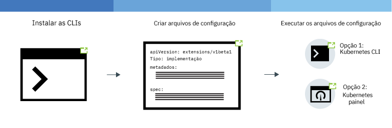
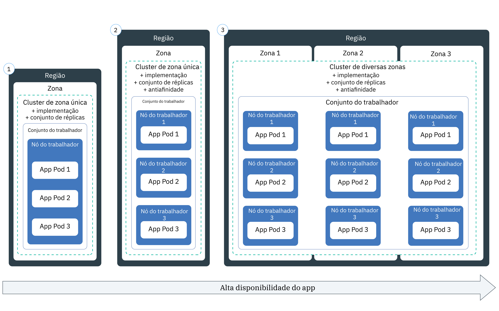

---

copyright:
  years: 2014, 2019
lastupdated: "2019-06-11"

keywords: kubernetes, iks, node.js, js, java, .net, go, flask, react, python, swift, rails, ruby, spring boot, angular

subcollection: containers

---

{:new_window: target="_blank"}
{:shortdesc: .shortdesc}
{:screen: .screen}
{:pre: .pre}
{:table: .aria-labeledby="caption"}
{:codeblock: .codeblock}
{:tip: .tip}
{:note: .note}
{:important: .important}
{:deprecated: .deprecated}
{:download: .download}
{:preview: .preview}


# Implementando apps nativos do Kubernetes em clusters
{: #app}

É possível usar técnicas do Kubernetes no {{site.data.keyword.containerlong}} para implementar apps em contêineres e assegurar que os apps estejam funcionando sempre. Por exemplo, é possível executar atualizações e recuperações contínuas sem tempo de inatividade para seus usuários. Como o Kubernetes é uma plataforma de orquestração de contêiner extensível que não exige um idioma ou um app específico, é possível executar várias cargas de trabalho, como apps stateless, stateful e de processamento de dados que são gravados no idioma de sua escolha.
{: shortdesc}

Aprenda as etapas gerais para implementar apps clicando em uma área da imagem a seguir. Deseja aprender o básico primeiro? Experimente o  [ tutorial de implementação de apps ](/docs/containers?topic=containers-cs_apps_tutorial#cs_apps_tutorial).


<map name="d62e18" id="d62e18">
<area href="/docs/containers?topic=containers-cs_cli_install" target="_blank" alt="Instalar as CLIs." title="Instalar as CLIs." shape="rect" coords="30, 69, 179, 209" />
<area href="https://kubernetes.io/docs/concepts/configuration/overview/" target="_blank" alt="Crie um arquivo de configuração para o seu app. Revise as melhores práticas do Kubernetes." title="Crie um arquivo de configuração para o seu app. Revise as melhores práticas do Kubernetes." shape="rect" coords="254, 64, 486, 231" />
<area href="#app_cli" target="_blank" alt="Opção 1: execute os arquivos de configuração da CLI do Kubernetes." title="Opção 1: execute os arquivos de configuração da CLI do Kubernetes." shape="rect" coords="544, 67, 730, 124" />
<area href="#cli_dashboard" target="_blank" alt="Opção 2: inicie o painel do Kubernetes localmente e execute os arquivos de configuração." title="Opção 2: inicie o painel do Kubernetes localmente e execute os arquivos de configuração." shape="rect" coords="544, 141, 728, 204" />
</map>

<br />


## Planejamento para executar apps em clusters
{: #plan_apps}

Antes de implementar um app em um cluster do {{site.data.keyword.containerlong_notm}}, decida como deseja configurar seu app para que ele possa ser acessado corretamente e integrado a outros serviços no {{site.data.keyword.Bluemix_notm}}.
{:shortdesc}

### Que tipo de objetos do Kubernetes posso fazer para meu app?
{: #object}

Ao preparar seu arquivo YAML do app, você tem muitas opções para aumentar a disponibilidade, o desempenho e a segurança do app. Por exemplo, em vez de um único pod, é possível usar um objeto de controlador do Kubernetes para gerenciar sua carga de trabalho, como um conjunto de réplicas, uma tarefa ou um conjunto de daemons. Para obter mais informações sobre pods e controladores, visualize a [documentação do Kubernetes ](https://kubernetes.io/docs/concepts/workloads/pods/pod-overview/). Uma implementação que gerencia um conjunto de réplicas de pods é um caso de uso comum para um app.
{: shortdesc}

Por exemplo, um objeto `kind: Deployment` é uma boa opção para implementar um pod de app porque, com ele, é possível especificar um conjunto de réplicas para obter mais disponibilidade para seus pods.

A tabela a seguir descreve por que é possível criar diferentes tipos de objetos de carga de trabalho do Kubernetes.

| Objeto | Descrição |
| --- | --- |
| [`Pod` ](https://kubernetes.io/docs/concepts/workloads/pods/pod/) | Um pod é a menor unidade implementável para suas cargas de trabalho e pode conter um ou mais contêineres. Semelhante a contêineres, os pods são projetados para serem descartáveis e são frequentemente usados para teste de unidade de recursos de app. Para evitar tempo de inatividade para seu app, considere a implementação de pods com um controlador do Kubernetes, como uma implementação. Uma implementação ajuda a gerenciar múltiplos pods, réplicas, ajuste de escala de pod, lançamentos e mais. |
| [`ReplicaSet` ](https://kubernetes.io/docs/concepts/workloads/controllers/replicaset/) | Um conjunto de réplicas assegura que múltiplas réplicas de seu pod estejam em execução e reagenda um pod se ele fica inativo. Você pode criar um conjunto de réplicas para testar como o planejamento de pod funciona, mas para gerenciar atualizações de aplicativo, lançamentos e ajuste de escala, crie uma implementação em seu lugar. |
| [`Deployment` ](https://kubernetes.io/docs/concepts/workloads/controllers/deployment/) | Uma implementação é um controlador que gerencia um pod ou um [conjunto de réplicas ](https://kubernetes.io/docs/concepts/workloads/controllers/replicaset/) de modelos de pod. É possível criar pods ou conjuntos de réplicas sem uma implementação para testar recursos de app. Para uma configuração de nível de produção, use implementações para gerenciar atualizações de app, lançamentos e ajuste de escala. |
| [`StatefulSet` ](https://kubernetes.io/docs/concepts/workloads/controllers/statefulset/) | Semelhante a implementações, um conjunto stateful é um controlador que gerencia um conjunto de réplicas de pods. Diferentemente de implementações, um conjunto stateful assegura que seu pod tenha uma identidade de rede exclusiva que mantém seu estado no reagendamento. Quando desejar executar as cargas de trabalho na nuvem, tente [projetar seu aplicativo para ser stateless](/docs/containers?topic=containers-strategy#cloud_workloads), para que suas instâncias de serviço sejam independentes umas das outras e possam falhar sem uma interrupção de serviço. No entanto, alguns aplicativos, como bancos de dados, devem ser stateful. Para esses casos, considere criar um conjunto stateful e usar o armazenamento de [arquivo](/docs/containers?topic=containers-file_storage#file_statefulset), [bloco](/docs/containers?topic=containers-block_storage#block_statefulset) ou [objeto](/docs/containers?topic=containers-object_storage#cos_statefulset) como o armazenamento persistente para seu conjunto stateful. Também é possível instalar o [Portworx](/docs/containers?topic=containers-portworx) na parte superior de seus nós do trabalhador bare metal e usar o Portworx como uma solução de armazenamento definida para software altamente disponível para gerenciar o armazenamento persistente para seu conjunto stateful. |
| [`DaemonSet` ](https://kubernetes.io/docs/concepts/workloads/controllers/daemonset/) | Use um conjunto de daemons quando tiver que executar o mesmo pod em cada nó do trabalhador em seu cluster. Os pods gerenciados por um conjunto de daemons são planejados automaticamente quando um nó do trabalhador é incluído em um cluster. Os casos de uso típicos incluem coletores de log, como `logstash` ou `prometheus`, que coletam logs de cada nó do trabalhador para fornecer insight sobre o funcionamento de um cluster ou um app. |
| [`Job` ](https://kubernetes.io/docs/concepts/workloads/controllers/jobs-run-to-completion/) | Uma tarefa assegura que um ou mais pods sejam executados com êxito até a conclusão. Você pode usar uma tarefa para filas ou tarefas em lote para suportar o processamento paralelo de itens de trabalho separados, porém relacionados, como um determinado número de quadros a serem renderizados, e-mails a serem enviados e arquivos a serem convertidos. Para planejar uma tarefa para ser executada em determinados momentos, use um [`CronJob` ](https://kubernetes.io/docs/concepts/workloads/controllers/cron-jobs/).|
{: caption="Tipos de objetos de carga de trabalho do Kubernetes que podem ser criados." caption-side="top"}

### Como posso incluir recursos em minha configuração do aplicativo do Kubernetes?
Veja [Especificando seus requisitos de app em seu arquivo YAML](#app_yaml) para obter descrições do que você pode incluir em uma implementação. O exemplo inclui:
* [ Conjuntos de réplicas ](#replicaset)
* [Identificadores](#label)
* [ Afinidade ](#affinity)
* [ Políticas de Imagem ](#image)
* [Portas](#port)
* [ Solicitações de recurso e limites ](#resourcereq)
* [ Análises de prontidão e prontidão ](#probe)
* [Serviços](#app-service) para expor o serviço de app em uma porta
* [ Configmaps ](#configmap)  para configurar variáveis de ambiente de contêiner
* [ Secrets ](#secret)  para configurar variáveis de ambiente de contêiner
* [Volumes persistentes](#pv) que são montados para o contêiner para armazenamento

### E se eu desejar que a configuração do app do Kubernetes use variáveis? Como incluí-las no YAML?
{: #variables}

Para incluir informações de variável em suas implementações em vez de codificar permanentemente os dados no arquivo YAML, é possível usar um [`ConfigMap` do Kubernetes ](https://kubernetes.io/docs/tasks/configure-pod-container/configure-pod-configmap/) ou um objeto [`Secret` ](https://kubernetes.io/docs/concepts/configuration/secret/).
{: shortdesc}

Para consumir um configmap ou segredo, é necessário montá-lo no pod. O configmap ou segredo é combinado com o pod exatamente antes de o pod ser executado. É possível reutilizar uma especificação de implementação e imagem em muitos apps, mas, em seguida, descarregar para a área de troca os configmaps e segredos customizados. Os segredos em particular podem ocupar muito armazenamento no nó local, portanto, planeje adequadamente.

Ambos os recursos definem os pares chave-valor, mas são usados para diferentes situações.

<dl>
<dt>Configmap</dt>
<dd>Forneça informações de configuração não confidenciais para cargas de trabalho que são especificadas em uma implementação. É possível usar configmaps de três maneiras principais.
<ul><li><strong>Sistema de Arquivos</strong>: É possível montar um arquivo inteiro ou um conjunto de variáveis para um pod. Um arquivo é criado para cada entrada com base nos conteúdos de nome da chave do arquivo que são configurados para o valor.</li>
<li><strong>Variável de ambiente</strong>: configure dinamicamente a variável de ambiente para uma especificação de contêiner.</li>
<li><strong>Argumento de linha de comandos</strong>: configure o argumento de linha de comandos que é usado em uma especificação de contêiner.</li></ul></dd>

<dt>Segredo</dt>
<dd>Forneça informações confidenciais para suas cargas de trabalho, como a seguir. Outros usuários do cluster podem ter acesso ao segredo, portanto, certifique-se de que você saiba que as informações secretas podem ser compartilhadas com esses usuários.
<ul><li><strong>Informações pessoalmente identificáveis (PII)</strong>: armazene informações confidenciais, como endereços de e-mail ou outros tipos de informações que são necessárias para conformidade de empresa ou regulamentação governamental em segredos.</li>
<li><strong>Credenciais</strong>: coloque credenciais, como senhas, chaves e tokens, em um segredo para reduzir o risco de exposição acidental. Por exemplo, quando você [liga um serviço](/docs/containers?topic=containers-service-binding#bind-services) a seu cluster, as credenciais são armazenadas em um segredo.</li></ul></dd>
</dl>

Deseja tornar seus segredos ainda mais seguros? Peça ao administrador do cluster para [ativar o {{site.data.keyword.keymanagementservicefull}}](/docs/containers?topic=containers-encryption#keyprotect) em seu cluster para criptografar segredos novos e existentes.
{: tip}

### Como posso incluir serviços da IBM em meu app, como o Watson?
Consulte  [ Incluindo serviços em apps ](/docs/containers?topic=containers-service-binding#adding_app).

### Como posso ter certeza de que meu app tem os recursos certos?
Quando você [especifica seu arquivo YAML do app](#app_yaml), é possível incluir funcionalidades do Kubernetes em sua configuração do aplicativo que ajudam seu app a obter os recursos certos. Em particular, [configure limites de recurso e solicitações ](https://kubernetes.io/docs/concepts/configuration/manage-compute-resources-container/) para cada contêiner que está definido em seu arquivo YAML.
{: shortdesc}

Além disso, seu administrador de cluster pode configurar controles de recurso que podem afetar a implementação do app, conforme a seguir.
*  [Cotas de recurso ](https://kubernetes.io/docs/concepts/policy/resource-quotas/)
*  [ Prioridade de Pod ](/docs/containers?topic=containers-pod_priority#pod_priority)

### Como posso acessar meu app?
É possível acessar seu app de forma privada dentro do cluster [usando um serviço `clusterIP`](/docs/containers?topic=containers-cs_network_planning#in-cluster).
{: shortdesc}

Se desejar expor publicamente seu app, você terá opções diferentes que dependem do tipo de cluster.
*  **Cluster grátis**: é possível expor seu app usando um [serviço NodePort](/docs/containers?topic=containers-nodeport#nodeport).
*  **Cluster padrão**: é possível expor seu app usando um [serviço NodePort, balanceador de carga ou Ingress](/docs/containers?topic=containers-cs_network_planning#external).
*  **Cluster que se torna privado usando o Calico**: é possível expor seu app usando um [serviço NodePort, balanceador de carga ou Ingress](/docs/containers?topic=containers-cs_network_planning#private_both_vlans). Deve-se também usar uma política de rede preDNAT do Calico para bloquear as portas de nó público.
*  **Cluster padrão somente de VLAN privada**: é possível expor seu app usando um [serviço NodePort, balanceador de carga ou Ingress](/docs/containers?topic=containers-cs_network_planning#plan_private_vlan). Deve-se também abrir a porta para o endereço IP privado do serviço em seu firewall.

### Depois de implementar meu app, como posso monitorar seu funcionamento?
É possível configurar [a criação de log e o monitoramento](/docs/containers?topic=containers-health#health) do {{site.data.keyword.Bluemix_notm}} para seu cluster. Também é possível escolher integrar a um [serviço de criação de log ou de monitoramento](/docs/containers?topic=containers-supported_integrations#health_services) de terceiros.
{: shortdesc}

### Como posso manter meu app atualizado?
Se desejar incluir e remover apps dinamicamente em resposta ao uso de carga de trabalho, veja [Escalando apps](/docs/containers?topic=containers-app#app_scaling).
{: shortdesc}

Se desejar gerenciar atualizações para seu app, veja [Gerenciando implementações contínuas](/docs/containers?topic=containers-app#app_rolling).

### Como posso controlar quem tem acesso às minhas implementações de app?
Os administradores de conta e de cluster podem controlar o acesso em muitos níveis diferentes: o cluster, o namespace do Kubernetes, o pod e o contêiner.
{: shortdesc}

Com o {{site.data.keyword.Bluemix_notm}} IAM, é possível designar permissões a usuários individuais, grupos ou contas de serviço no nível de instância de cluster.  É possível definir o escopo de acesso do cluster ainda mais, restringindo os usuários a namespaces específicos dentro do cluster. Para obter mais informações, veja [Designando acesso ao cluster](/docs/containers?topic=containers-users#users).

Para controlar o acesso no nível de pod, é possível [configurar políticas de segurança de pod com o RBAC do Kubernetes](/docs/containers?topic=containers-psp#psp).

Dentro do YAML de implementação do app, é possível configurar o contexto de segurança para um pod ou contêiner. Para obter mais informações, revise a [documentação do Kubernetes ](https://kubernetes.io/docs/tasks/configure-pod-container/security-context/).

Deseja controlar o acesso no nível do aplicativo? Para criar um fluxo de conexão que pode ser atualizado a qualquer momento sem mudar seu código de app, tente usar o [{{site.data.keyword.appid_long_notm}}](/docs/services/appid?topic=appid-getting-started).
{: tip}

<br />


## Planejando implementações altamente disponíveis
{: #highly_available_apps}

Quanto mais amplamente você distribui a configuração entre múltiplos nós do trabalhador e clusters, menos provável que os usuários tenham que experimentar tempo de inatividade com seu app.
{: shortdesc}

Revise as potenciais configurações de app a seguir que são ordenadas com graus crescentes de disponibilidade.



1.  Uma implementação com n+2 pods que são gerenciados por um conjunto de réplicas em um único nó em um cluster de zona única.
2.  Uma implementação com n+2 pods que são gerenciados por um conjunto de réplicas e difundidos em múltiplos nós (antiafinidade) em um cluster de zona única.
3.  Uma implementação com n+2 pods que são gerenciados por um conjunto de réplicas e difundidos entre múltiplos nós (antiafinidade) em um cluster de múltiplas zonas entre zonas.

Também é possível [conectar múltiplos clusters em regiões diferentes com um balanceador de carga global](/docs/containers?topic=containers-ha_clusters#multiple_clusters) para aumentar a alta disponibilidade.

### Aumentando a disponibilidade de seu app
{: #increase_availability}

Considere as opções a seguir para aumentar a disponibilidade de seu app.
{: shortdesc}

<dl>
  <dt>Usar implementações e conjuntos de réplicas para implementar seu app e suas dependências</dt>
    <dd><p>Uma implementação é um recurso do Kubernetes que pode ser usado para declarar todos os componentes de seu app e suas dependências. Com as implementações, não é necessário anotar todas as etapas e, em vez disso, é possível se concentrar no app.</p>
    <p>Ao implementar mais de um pod, um conjunto de réplicas é criado automaticamente para as suas implementações que monitora os pods e assegura que o número especificado de pods esteja em funcionamento em todos os momentos. Quando um pod fica inativo, o conjunto de réplicas substitui o pod não responsivo por um novo.</p>
    <p>É possível usar uma implementação para definir estratégias de atualização para seu app, incluindo o número de pods que você deseja incluir durante uma atualização contínua e o número de pods que podem estar indisponíveis por vez. Ao executar uma atualização contínua, a implementação verifica se a revisão está ou não funcionando e para o lançamento quando falhas são detectadas.</p>
    <p>Com as implementações, é possível implementar simultaneamente múltiplas revisões com diferentes sinalizações. Por exemplo, é possível testar uma implementação primeiro antes de decidir enviá-la por push para a produção.</p>
    <p>Usando Implementações, é possível manter o controle de quaisquer revisões implementadas. Será possível usar esse histórico para recuperar uma versão anterior se você descobrir que as suas atualizações não estão funcionando conforme o esperado.</p></dd>
  <dt>Incluir réplicas suficientes para a carga de trabalho de seu app, mais duas</dt>
    <dd>Para tornar seu app ainda mais altamente disponível e mais resiliente à falha, considere a inclusão de réplicas extras, além do mínimo, para manipular a carga de trabalho esperada. As réplicas extras podem manipular a carga de trabalho no caso de um pod travar e o conjunto de réplicas ainda não ter recuperado o pod travado. Para proteção contra duas falhas simultâneas, inclua duas réplicas extras. Essa configuração é um padrão N + 2, em que N é o número de réplicas para manipular a carga de trabalho recebida e + 2 são duas réplicas extras. Desde que seu cluster tenha espaço suficiente, será possível ter tantos pods quantos você quiser.</dd>
  <dt>Difundir pods em múltiplos nós (antiafinidade)</dt>
    <dd><p>Quando você cria a sua implementação, cada pod pode ser implementado no mesmo nó do trabalhador. Isso é conhecido como afinidade ou colocação. Para proteger seu app contra falha do nó do trabalhador, será possível configurar sua implementação para difundir os pods em múltiplos nós do trabalhador usando a opção <code>podAntiAffinity</code> com seus clusters padrão. É possível definir dois tipos de antiafinidade do pod: preferencial ou necessário.
      <p>Para obter mais informações, veja a documentação do Kubernetes no <a href="https://kubernetes.io/docs/concepts/configuration/assign-pod-node/" rel="external" target="_blank" title="(Abre em uma nova guia ou janela)">Designando pods aos nós</a>.</p>
      <p>Para obter um exemplo de afinidade em uma implementação de app, veja [Fazendo seu arquivo YAML de implementação de app](#app_yaml).</p>
      </dd>
    </dd>
<dt>Distribuir pods em múltiplas zonas ou regiões</dt>
  <dd><p>Para proteger seu app de uma falha de zona, é possível criar múltiplos clusters em zonas separadas ou incluir zonas em um conjunto de trabalhadores em um cluster de múltiplas zonas. Os clusters de múltiplas zonas estão disponíveis somente em [determinadas áreas metropolitanas](/docs/containers?topic=containers-regions-and-zones#zones), como Dallas. Se você cria múltiplos clusters em zonas separadas, deve-se [configurar um balanceador de carga global](/docs/containers?topic=containers-ha_clusters#multiple_clusters).</p>
  <p>Ao usar um conjunto de réplicas e especificar a antiafinidade do pod, o Kubernetes difunde seus pods de app entre os nós. Se os seus nós estiverem em múltiplas zonas, os pods serão difundidos pelas zonas, aumentando a disponibilidade do seu app. Se você desejar limitar seus apps para serem executados somente em uma zona, será possível configurar a afinidade de pod ou criar e rotular um conjunto de trabalhadores em uma zona. Para obter mais informações, consulte [Alta disponibilidade para clusters de múltiplas zonas](/docs/containers?topic=containers-ha_clusters#ha_clusters).</p>
  <p><strong>Em uma implementação de cluster de múltiplas zonas, meus pods de app são distribuídos uniformemente entre os nós?</strong></p>
  <p>Os pods são distribuídos uniformemente entre as zonas, mas nem sempre entre os nós. Por exemplo, se você tiver um cluster com um nó em cada uma das três zonas e implementar um conjunto de réplicas de seis pods, cada nó obterá dois pods. No entanto, se você tiver um cluster com dois nós em cada uma das três zonas e implementar um conjunto de réplicas de seis pods, cada zona planejará dois pods e poderá planejar um pod por nó ou não. Para obter mais controle sobre o planejamento, é possível [configurar a afinidade de pod ](https://kubernetes.io/docs/concepts/configuration/assign-pod-node).</p>
  <p><strong>Se uma zona ficar inativa, como os pods serão reprogramados para os nós restantes em outras zonas?</strong></br>Isso dependerá de sua política de planejamento usada na implementação. Se você incluiu a [afinidade de pod específica do nó ](https://kubernetes.io/docs/concepts/configuration/assign-pod-node/#node-affinity-beta-feature), seus pods não serão reprogramados. Se você não tiver feito isso, os pods serão criados em nós do trabalhador disponíveis em outras zonas, mas eles podem não ser balanceados. Por exemplo, os dois pods podem ser difundidos entre os dois nós disponíveis ou ambos podem ser planejados em um nó com capacidade disponível. Da mesma forma, quando a zona indisponível retornar, os pods não serão excluídos e rebalanceados automaticamente entre os nós. Se desejar que os pods sejam rebalanceados entre as zonas depois que a zona estiver de volta, considere usar o [Desplanejador do Kubernetes ](https://github.com/kubernetes-incubator/descheduler).</p>
  <p><strong>Dica</strong>: em clusters de multizona, tente manter sua capacidade de nó do trabalhador em 50% por zona, de forma que capacidade suficiente seja deixada para proteger seu cluster contra uma falha zonal.</p>
  <p><strong>E se eu desejar difundir meu aplicativo entre regiões?</strong></br>Para proteger seu aplicativo contra uma falha de região, crie um segundo cluster em outra região, [configure um balanceador de carga global](/docs/containers?topic=containers-ha_clusters#multiple_clusters) para conectar seus clusters e use um YAML de implementação para implementar um conjunto de réplicas duplicado com [antiafinidade de pod ](https://kubernetes.io/docs/concepts/configuration/assign-pod-node/) para seu aplicativo.</p>
  <p><strong>E se meus apps precisarem de armazenamento persistente?</strong></p>
  <p>Use um serviço de nuvem como o [{{site.data.keyword.cloudant_short_notm}}](/docs/services/Cloudant?topic=cloudant-getting-started#getting-started) ou o [{{site.data.keyword.cos_full_notm}}](/docs/services/cloud-object-storage?topic=cloud-object-storage-about).</p></dd>
</dl>

## Especificando os requisitos de app em seu arquivo YAML
{: #app_yaml}

Em Kubernetes, você descreve seu app em um arquivo YAML que declara a configuração do objeto do Kubernetes. O servidor de API do Kubernetes, então, processa o arquivo YAML e armazena a configuração e o estado necessário do objeto no armazenamento de dados etcd. O planejador do Kubernetes planeja suas cargas de trabalho nos nós do trabalhador dentro de seu cluster, levando em consideração a especificação em seu arquivo YAML, quaisquer políticas de cluster que o administrador configura e a capacidade disponível do cluster.
{: shortdesc}

Revise uma cópia do [arquivo YAML completo](https://raw.githubusercontent.com/IBM-Cloud/kube-samples/master/deploy-apps-clusters/deploy_wasliberty.yaml). Em seguida, revise as seções a seguir para entender como é possível aprimorar a implementação do app.

* [ Conjuntos de réplicas ](#replicaset)
* [Identificadores](#label)
* [ Afinidade ](#affinity)
* [ Políticas de Imagem ](#image)
* [Portas](#port)
* [ Solicitações de recurso e limites ](#resourcereq)
* [ Análises de prontidão e prontidão ](#probe)
* [Serviços](#app-service) para expor o serviço de app em uma porta
* [ Configmaps ](#configmap)  para configurar variáveis de ambiente de contêiner
* [ Secrets ](#secret)  para configurar variáveis de ambiente de contêiner
* [Volumes persistentes](#pv) que são montados para o contêiner para armazenamento
* [Etapas seguintes](#nextsteps)
* [ Exemplo Completo de YAML ](#yaml-example)

<dl>
<dt>Metadados de implementação básica</dt>
  <dd><p>Use a versão apropriada da API para o [tipo de objeto do Kubernetes](#object) que você implementa. A versão da API determina os recursos suportados para o objeto do Kubernetes que estão disponíveis para você. O nome fornecido nos metadados é o nome do objeto, não seu rótulo. Você usa o nome ao interagir com seu objeto, como `kubectl get deployment <name>`.</p>
  <p><pre class="codeblock"><code>apiVersion: apps/v1
Tipo: implementação
metadados:
  name: wasliberty</code></pre></p></dd>

<dt id="replicaset">Conjunto de réplicas</dt>
  <dd><p>Para aumentar a disponibilidade de seu app, é possível especificar um conjunto de réplicas em sua implementação. Em um conjunto de réplicas, são definidas quantas instâncias de seu app você deseja implementar. Os conjuntos de réplicas são gerenciados e monitorados por sua implementação do Kubernetes. Se uma instância do app fica inativa, o Kubernetes acelera automaticamente uma nova instância de seu app para manter o número especificado de instâncias do app.</p>
  <p><pre class="codeblock"><code> spec:
  replicas: 3</pre></code></p></dd>

<dt id="label">Identificadores</dt>
  <dd><p>Com [rótulos](/docs/containers?topic=containers-strategy#deploy_organize), é possível marcar diferentes tipos de recursos em seu cluster com o mesmo par `key: value`. Em seguida, é possível especificar o seletor para corresponder ao rótulo para que seja possível construir sobre esses outros recursos. Se você planeja expor seu app publicamente, deve-se usar um rótulo que corresponda ao seletor especificado no serviço. No exemplo, a especificação de implementação usa o modelo que corresponde ao rótulo `app: wasliberty`.</p>
  <p>É possível recuperar objetos que são rotulados em seu cluster, como para ver os componentes `staging` ou `production`. Por exemplo, liste todos os recursos com um rótulo `env: production` em todos os namespaces no cluster. <strong>Nota:</strong> você precisa de acesso a todos os namespaces para executar esse comando.<pre class="pre"><code> kubectl get all -l env=production -- all-namespaces </code></pre></p>
  <ul><li>Para obter mais informações sobre rótulos, veja a [documentação do Kubernetes ](https://kubernetes.io/docs/concepts/overview/working-with-objects/labels/).</li>
  <li>Para aplicar rótulos aos nós do trabalhador, [crie seu conjunto de trabalhadores](/docs/containers?topic=containers-add_workers#add_pool) com rótulos ou [atualize um conjunto de trabalhadores existente](/docs/containers?topic=containers-add_workers#worker_pool_labels).</li>
  <li>Para obter um exemplo mais detalhado, veja [Implementando apps em nós do trabalhador específicos usando rótulos](/docs/containers?topic=containers-app#node_affinity).</li></ul>
  <p><pre class="codeblock"><code> selector:
  matchLabels:
    app: wasliberty
:
  metadados:
    labels:
      app: wasliberty</pre></code></p></dd>

<dt id="affinity">Afinidade</dt>
  <dd><p>Especifique a afinidade (colocação) quando desejar obter mais controle sobre em quais nós do trabalhador os pods estão planejados. A afinidade afeta os pods somente no tempo de planejamento. Por exemplo, para difundir a implementação em nós do trabalhador em vez de permitir que os pods sejam planejados no mesmo nó, use a opção <code>podAntiAffinity</code> com seus clusters padrão. É possível definir dois tipos de antiafinidade do pod: preferencial ou necessário.</p>
  <p>Para obter mais informações, veja a documentação do Kubernetes no <a href="https://kubernetes.io/docs/concepts/configuration/assign-pod-node/" rel="external" target="_blank" title="(Abre em uma nova guia ou janela)">Designando pods aos nós</a>.</p>
  <ul><li><strong>Antiafinidade necessária</strong>: é possível implementar somente o número de réplicas para as quais você tem nós do trabalhador. Por exemplo, se você tiver três nós do trabalhador em seu cluster, mas definir cinco réplicas em seu arquivo YAML, somente três réplicas serão implementadas. Cada réplica mora em um nó de trabalhador diferente. As duas réplicas restantes continuarão pendentes. Se você incluir outro nó do trabalhador no cluster, uma das réplicas restantes será implementada no novo nó do trabalhador automaticamente. Se um nó do trabalhador falhar, o pod não reagendará porque a política de afinidade é necessária. Para obter um YAML de exemplo com necessário, veja <a href="https://github.com/IBM-Cloud/kube-samples/blob/master/deploy-apps-clusters/liberty_requiredAntiAffinity.yaml" rel="external" target="_blank" title="(Abre em uma nova guia ou janela)">App Liberty com antiafinidade de pod necessária</a>.</li>
  <li><strong>Antiafinidade preferencial</strong>: é possível implementar seus pods em nós com capacidade disponível, o que fornece mais flexibilidade para sua carga de trabalho. Quando possível, os pods são planejados em diferentes nós do trabalhador. Por exemplo, se você tiver três nós do trabalhador com capacidade suficiente em seu cluster, ele poderá planejar os cinco pods de réplica nos nós. No entanto, se você incluir mais dois nós do trabalhador em seu cluster, a regra de afinidade não forçará os dois pods extras que estão em execução nos nós existentes a serem reagendados no nó livre.</li>
  <li><strong>Afinidade do nó do trabalhador</strong>: é possível configurar a implementação para ser executada somente em determinados nós do trabalhador, como bare metal. Para obter mais informações, veja [Implementando apps em nós do trabalhador específicos usando rótulos](/docs/containers?topic=containers-app#node_affinity).</li></ul>
  <p>Exemplo para a antiafinidade preferencial:</p>
  <p><pre class="codeblock"><code> spec:
  affinity:
    podAntiAffinity:
      preferredDuringSchedulingIgnoredDuringExecution:
      - weight: 100
            podAffinityTerm:
              labelSelector:
                matchExpressions:
            - key: app
                  operator: In
                  values:
              - wasliberty
          topologyKey: kubernetes.io/hostname</pre></code></p></dd>

<dt id="image">Imagem do contêiner</dt>
  <dd>
  <p>Especifique a imagem que você deseja usar para seus contêineres, o local da imagem e a política de extração de imagem. Se você não especificar uma tag de imagem, por padrão, a imagem identificada como `latest` será puxada.</p>
  <p>**Atenção**: evite usar a tag mais recente para cargas de trabalho de produção. Você pode não ter testado sua carga de trabalho com a imagem mais recente se estiver usando um repositório público ou compartilhado, como o Docker Hub ou o {{site.data.keyword.registryshort_notm}}.</p>
  <p>Por exemplo, para listar as tags de imagens públicas da IBM:</p>
  <ol><li>Alterne para a região de registro global.<pre class="pre"><code>ibmcloud cr region-set global
</code></pre></li>
  <li>Liste as imagens IBM.<pre class="pre"><code> Imagens do ibmcloud cr -- include-ibm </code></pre></li></ol>
  <p>O `imagePullPolicy` padrão é configurado como `IfNotPresent`, que fará pull da imagem somente se ela não existir localmente. Se desejar que a imagem seja puxada toda vez que o contêiner for iniciado, especifique o `imagePullPolicy: Always`.</p>
  <p><pre class="codeblock"><code> contêineres:
- name: wasliberty
  image: icr.io/ibmliberty:webProfile8
  imagePullPolicy: Always</pre></code></p></dd>

<dt id="port">Porta para o serviço do app</dt>
  <dd><p>Selecione uma porta de contêiner na qual abrir os serviços do app. Para ver qual porta precisa ser aberta, consulte suas especificações de app ou o Dockerfile. A porta é acessível por meio da rede privada, mas não de uma conexão de rede pública. Para expor o app publicamente, deve-se criar um serviço NodePort, balanceador de carga ou Ingress. Você usa esse mesmo número da porta quando [cria um objeto `Service`](#app-service).</p>
  <p><pre class="codeblock"><code> portas:
- containerPort: 9080</pre></code></p></dd>

<dt id="resourcereq">Solicitações de recurso e limites</dt>
  <dd><p>Como um administrador de cluster, é possível certificar-se de que as equipes que compartilham um cluster não consumam mais do que seu compartilhamento justo de recursos de cálculo (memória e CPU) criando um objeto [<code>ResourceQuota</code> ](https://kubernetes.io/docs/concepts/policy/resource-quotas/) para cada namespace do Kubernetes no cluster. Se o administrador de cluster configurar uma cota de recurso de cálculo, cada contêiner dentro do modelo de implementação deverá especificar solicitações de recurso e limites para memória e CPU, caso contrário, a criação do pod falhará.</p>
  <p><ol><li>Verifique se uma cota de recurso está configurada para um namespace.<pre class="pre"><code> kubectl get quota -- namespace= < namespace> </code></pre></li>
  <li>Veja quais são os limites de cota.<pre class="pre"><code> kubectl describe quota < quota_name> -- namespace= < namespace> </code></pre></li></ol></p>
  <p>Mesmo que nenhuma cota de recurso seja configurada, é possível incluir solicitações de recurso e limites em sua implementação para melhorar o gerenciamento de recursos do nó do trabalhador.</p><p class="note">Se um contêiner exceder seu limite, o contêiner poderá ser reiniciado ou falhar. Se um contêiner exceder uma solicitação, seu pod poderá ser despejado se o nó do trabalhador ficar sem esse recurso que foi excedido. Para obter mais informações sobre resolução de problemas, consulte [Os pods falham repetidamente ao reiniciar ou são removidos inesperadamente](/docs/containers?topic=containers-cs_troubleshoot_clusters#pods_fail).</p>
  <p>**Solicitação**: a quantia mínima do recurso que o planejador reserva para que o contêiner use. Se a quantia for igual ao limite, a solicitação será garantida. Se a quantia for menor do que o limite, a solicitação ainda será garantida, mas o planejador poderá usar a diferença entre a solicitação e o limite para preencher os recursos de outros contêineres.</p>
  <p>**Limite**: a quantia máxima do recurso que o contêiner pode consumir. Se a quantia total de recursos que for usada nos contêineres exceder a quantia disponível no nó do trabalhador, os contêineres poderão ser despejados para liberar espaço. Para evitar o despejo, configure a solicitação de recurso igual ao limite do contêiner. Se nenhum limite for especificado, o padrão será a capacidade do nó do trabalhador.</p>
  <p>Para obter mais informações, consulte [a documentação do Kubernetes ](https://kubernetes.io/docs/concepts/configuration/manage-compute-resources-container/).</p>
  <p><pre class="codeblock"><code> recursos:
  requests:
    memory: "512Mi"
    cpu: "500m"
  limits:
    memória: "1024Mi"
    cpu: "1000m"</pre></code></p></dd>

<dt id="probe">Análises e sondas de prontidão</dt>
  <dd><p>Por padrão, o Kubernetes envia o tráfego para seus pods de app após todos os contêineres no pod serem iniciados e reinicia os contêineres quando eles travam. No entanto, é possível configurar verificações de funcionamento para melhorar a robustez do roteamento de tráfego de serviço. Por exemplo, seu app pode ter um atraso de inicialização. Os processos de app podem ser iniciados antes que o app inteiro esteja completamente pronto, o que pode afetar as respostas especialmente ao escalar para cima em muitas instâncias. Com as verificações de funcionamento, é possível permitir que seu sistema possa saber se o seu app está em execução e pronto para receber solicitações. Configurando essas análises, é possível também ajudar a evitar o tempo de inatividade ao executar uma [atualização contínua](#app_rolling) de seu app. É possível configurar dois tipos de verificações de funcionamento: análises de vivacidade e de prontidão.</p>
  <p>**Análise de vivacidade**: configure uma análise de vivacidade para verificar se o contêiner está em execução. Se a análise falha, o contêiner é reiniciado. Se o contêiner não especifica uma análise de vivacidade, a análise é bem-sucedida porque presume que o contêiner está ativo quando o contêiner está em um status **Em execução**.</p>
  <p>**Análise de prontidão**: configure uma análise de prontidão para verificar se o contêiner está pronto para receber solicitações e tráfego externo. Se a análise falhar, o endereço IP do pod será removido como um endereço IP utilizável para serviços que correspondem ao pod, mas o contêiner não será reiniciado. A configuração de uma análise de prontidão com um atraso inicial é especialmente importante se o seu app leva um tempo para ser inicializado. Antes do atraso inicial, a análise não é iniciada, fornecendo ao seu contêiner um tempo para ficar ativo. Se o contêiner não fornece uma análise de prontidão, a análise é bem-sucedida porque presume que o contêiner está ativo quando o contêiner está em um status **Em execução**.</p>
  <p>É possível configurar as análises como comandos, solicitações de HTTP ou soquetes TCP. O exemplo usa solicitações de HTTP. Dê ao sensor de vivacidade mais tempo do que à análise de prontidão. Para obter mais informações, consulte [a documentação do Kubernetes ](https://kubernetes.io/docs/tasks/configure-pod-container/configure-liveness-readiness-probes/).</p>
  <p><pre class="codeblock"><code> livenessProbe:
  httpGet:
    path: /
    port: 9080
  initialDelaySeconds: 300
  periodSeconds: 15
readinessProbe:
  httpGet:
    path: /
    port: 9080
  initialDelaySeconds: 45
  periodSeconds: 5</pre></code></p></dd>

<dt id="app-service">Expondo o serviço de app</dt>
  <dd><p>É possível criar um serviço que exponha seu app. Na seção `spec`, certifique-se de corresponder os valores de `port` e de rótulo aos que você usou na implementação. O serviço expõe objetos que correspondem ao rótulo, tal como `app: wasliberty` no exemplo a seguir.</p>
  <ul><li>Por padrão, um serviço usa [`ClusterIP ` ](https://kubernetes.io/docs/tutorials/kubernetes-basics/expose/expose-intro/), que torna o serviço acessível somente dentro do cluster, mas não fora do cluster.</li>
  <li>É possível criar um serviço NodePort, balanceador de carga ou Ingress para expor o app publicamente. Esses serviços têm dois IPs, um externo e um interno. Quando o tráfego é recebido no IP externo, ele é encaminhado para o IP do cluster interno. Em seguida, por meio do IP do cluster interno, o tráfego é roteado para o IP do contêiner do app.</li>
  <li>O exemplo usa `NodePort` para expor o serviço fora do cluster. Para obter mais informações sobre como configurar o acesso externo, consulte [Escolhendo um serviço NodePort, Ingress ou de balanceador de carga](/docs/containers?topic=containers-cs_network_planning#external).</li></ul>
  <p><pre class="codeblock"><code>apiVersion: v1
kind: Service
metadados:
  name: wasliberty
  labels:
    app: wasliberty
spec:
  ports:
  - port: 9080
  selector:
    app: wasliberty
  type: NodePort</pre></code></p></dd>

<dt id="configmap">Configmaps para variáveis de ambiente de contêiner</dt>
<dd><p>Os configmaps fornecem informações de configuração não confidenciais para suas cargas de trabalho de implementação. O exemplo a seguir mostra como é possível referenciar valores de seu configmap como variáveis de ambiente na seção de especificação de contêiner de seu YAML de implementação. Referenciando valores de seu configmap, é possível desacoplar essas informações de configuração de sua implementação para manter seu app conteinerizado móvel.<ul><li>[Ajude-me a decidir se deve ser usado um objeto do Kubernetes `ConfigMap` ou `Secret` para variáveis](#variables).</li>
<li>Para obter mais maneiras de usar configmaps, veja a [documentação do Kubernetes ](https://kubernetes.io/docs/tasks/configure-pod-container/configure-pod-configmap/).</li></ul></p>
<p><pre class="codeblock"><code>apiVersion: apps/v1
Tipo: implementação
metadados:
  name: wasliberty
spec:
  replicas: 3
  :
    ...
    spec:
      ...
      containers:
      - name: wasliberty ...
        env:
          - name: VERSION
            valueFrom:
              configMapKeyRef:
                name: wasliberty
                key: VERSION
          - name: LANGUAGE
            valueFrom:
              configMapKeyRef:
                name: wasliberty
                key: LANGUAGE
        ...
---
apiVersion: v1
kind: ConfigMap
metadata:
  name: wasliberty
  labels:
    app: wasliberty
data:
  VERSION: "1.0"
  LANGUAGE: en</pre></code></p></dd>

  <dt id="secret">Segredos para variáveis de ambiente de contêiner</dt>
  <dd><p>Os segredos fornecem informações confidenciais de configuração, como senhas para suas cargas de trabalho de implementação. O exemplo a seguir mostra como é possível referenciar valores de seu segredo como variáveis de ambiente na seção de especificação de contêiner de seu YAML de implementação. Também é possível montar o segredo como um volume. Referenciando valores de seu segredo, é possível desacoplar essas informações de configuração de sua implementação para manter seu app conteinerizado móvel.<ul><li>[Ajude-me a decidir se deve ser usado um ConfigMap ou Secret para variáveis](#variables).</li>
  <li>Para obter mais informações, veja [Entendendo quando usar segredos](/docs/containers?topic=containers-encryption#secrets).</li></ul></p>
  <p><pre class="codeblock"><code>apiVersion: apps/v1
  Tipo: implementação
  metadados:
    name: wasliberty
  spec:
    replicas: 3
    :
      ...
      spec:
        ...
        containers:
        - name: wasliberty ...
          env:
          - name: username
            valueFrom:
              secretKeyRef:
                name: wasliberty
                key: username
          - name: password
            valueFrom:
              secretKeyRef:
                name: wasliberty
                key: password
          ...
  ---
  apiVersion: v1
  kind: Secret
  metadata:
    name: wasliberty
    labels:
      app: wasliberty
  type: Opaque
  data:
    username: dXNlcm5hbWU=
    password: cGFzc3dvcmQ=</pre></code></p></dd>

<dt id="pv">Volumes Persistentes para Armazenamento de Contêiner</dt>
<dd><p>Os volumes persistentes (PVs) fazem interface com o armazenamento físico para fornecer armazenamento de dados persistentes para as cargas de trabalho do contêiner. O exemplo a seguir mostra como é possível incluir armazenamento persistente em seu app. Para provisionar o armazenamento persistente, crie uma solicitação de volume persistente (PVC) para descrever o tipo e o tamanho do armazenamento de arquivo que você deseja ter. Depois de criar a PVC, o volume persistente e o armazenamento físico são criados automaticamente usando o [provisionamento dinâmico](/docs/containers?topic=containers-kube_concepts#dynamic_provisioning). Referenciando o PVC em seu YAML de implementação, o armazenamento é montado automaticamente em seu pod de app. Quando o contêiner em seu pod grava dados no diretório de caminho de montagem `/test`, os dados são armazenados na instância de armazenamento de arquivo NFS.</p><ul><li>Para obter mais informações, veja [Entendendo os fundamentos básicos do armazenamento do Kubernetes](/docs/containers?topic=containers-kube_concepts#kube_concepts).</li><li>Para obter opções sobre outros tipos de armazenamento que é possível provisionar, veja [Planejando o armazenamento persistente altamente disponível](/docs/containers?topic=containers-storage_planning#storage_planning).</li></ul>
<p><pre class="codeblock"><code>apiVersion: apps/v1
Tipo: implementação
metadados:
  name: wasliberty
spec:
  replicas: 3
  :
    ...
    spec:
      ...
      containers:
      - name: wasliberty ...
        volumeMounts:
        - name: pvmount
          mountPath: /test
      volumes:
      - name: pvmount
        persistentVolumeClaim:
          claimName: wasliberty
        ...
---
apiVersion: v1
kind: PersistentVolumeClaim
metadata:
  name: wasliberty
  annotations:
    volume.beta.kubernetes.io/storage-class: "ibmc-file-bronze"
  labels:
    billingType: "hourly"
    app: wasliberty
spec:
  accessModes:
    - ReadWriteMany
         resources:
           requests:
             storage: 24Gi</pre></code></p></dd>

<dt id="nextsteps">Pronto para implementar um app?</dt>
<dd><ul><li>[Use uma cópia do YAML completo como um modelo para iniciar](https://raw.githubusercontent.com/IBM-Cloud/kube-samples/master/deploy-apps-clusters/deploy_wasliberty.yaml).</li>
<li>[Implemente um app por meio do painel do Kubernetes](/docs/containers?topic=containers-app#app_ui).</li>
<li>[ Implementar um app a partir da CLI ](/docs/containers?topic=containers-app#app_cli).</li></ul></dd>

</dl>

### YAML de implementação de exemplo completo
{: #yaml-example}

O exemplo a seguir é uma cópia do YAML de implementação que foi [discutido seção a seção anteriormente](#app_yaml). Também é possível [fazer download do YAML por meio do GitHub](https://raw.githubusercontent.com/IBM-Cloud/kube-samples/master/deploy-apps-clusters/deploy_wasliberty.yaml).
{: shortdesc}

Para aplicar o YAML:

```
kubectl apply -f file.yaml [-n <namespace>]
```
{: pre}

YAML de exemplo:

```yaml
apiVersion: apps/v1
kind: Deployment
metadata:
  name: wasliberty
spec:
  replicas: 3
  selector:
    matchLabels:
      app: wasliberty
  template:
    metadata:
      labels:
        app: wasliberty
    spec:
      affinity:
        podAntiAffinity:
          preferredDuringSchedulingIgnoredDuringExecution:
          - weight: 100
            podAffinityTerm:
              labelSelector:
                matchExpressions:
                - key: app
                  operator: In
                  values:
                  - wasliberty
              topologyKey: kubernetes.io/hostname
      containers:
      - name: wasliberty
        image: icr.io/ibmliberty
        env:
          - name: VERSION
            valueFrom:
              configMapKeyRef:
                name: wasliberty
                key: VERSION
          - name: LANGUAGE
            valueFrom:
              configMapKeyRef:
                name: wasliberty
                key: LANGUAGE
          - name: username
            valueFrom:
              secretKeyRef:
                name: wasliberty
                key: username
          - name: password
            valueFrom:
              secretKeyRef:
                name: wasliberty
                key: password
        ports:
          - containerPort: 9080
        resources:
          requests:
            memory: "512Mi"
            cpu: "500m"
          limits:
            memory: "1024Mi"
            cpu: "1000m"
        livenessProbe:
          httpGet:
            path: /
            port: 9080
          initialDelaySeconds: 300
          periodSeconds: 15
        readinessProbe:
          httpGet:
            path: /
            port: 9080
          initialDelaySeconds: 45
          periodSeconds: 5
        volumeMounts:
        - name: pvmount
          mountPath: /test
      volumes:
      - name: pvmount
        persistentVolumeClaim:
          claimName: wasliberty
---
apiVersion: v1
kind: Service
metadata:
  name: wasliberty
  labels:
    app: wasliberty
spec:
  ports:
  - port: 9080
  selector:
    app: wasliberty
  type: NodePort
---
apiVersion: v1
kind: ConfigMap
metadata:
  name: wasliberty
  labels:
    app: wasliberty
data:
  VERSION: "1.0"
  LANGUAGE: en
---
apiVersion: v1
kind: Secret
metadata:
  name: wasliberty
  labels:
    app: wasliberty
type: Opaque
data:
  username: dXNlcm5hbWU=
  password: cGFzc3dvcmQ=
---
apiVersion: v1
kind: PersistentVolumeClaim
metadata:
  name: wasliberty
  annotations:
    volume.beta.kubernetes.io/storage-class: "ibmc-file-bronze"
  labels:
    billingType: "hourly"
    app: wasliberty
spec:
  accessModes:
    - ReadWriteMany
  resources:
    requests:
      storage: 24Gi
```
{: codeblock}

<br />


## Gerenciando arquivos de configuração do Kubernetes para reutilização em múltiplos ambientes com o Kustomize
{: #kustomize}

Como parte de um app nativo em nuvem [twelve-factor ](https://12factor.net/), você deseja manter a paridade de desenvolvimento para produção configurando um desenvolvimento contínuo e um pipeline de entrega que usa uma origem de código base comum controlada por versão. Em seus repositórios de código base, você armazena seus arquivos manifest de configuração de recurso do Kubernetes, geralmente no formato YAML. É possível usar o projeto Kubernetes [Kustomize ](https://kustomize.io/) para padronizar e customizar suas implementações em múltiplos ambientes.
{: shortdesc}

Por exemplo, é possível configurar um YAML `kustomization` base para declarar objetos do Kubernetes, como implementações e PVCs, que são compartilhados em seus ambientes de desenvolvimento, teste e produção. Em seguida, é possível configurar YAMLs `kustomization` separados que tenham configurações customizadas para cada ambiente, como mais réplicas na produção do que no teste. Esses YAMLs customizados podem, então, sobrepor ou construir o YAML base compartilhado para que seja possível gerenciar ambientes que são geralmente idênticos, exceto algumas diferenças de configuração de sobreposição que você controla na origem. Para obter mais informações sobre o Kustomize, como um glossário e as perguntas mais frequentes, consulte os [docs do Kustomize ](https://github.com/kubernetes-sigs/kustomize/tree/master/docs).

Antes de iniciar:
*   [Crie](/docs/containers?topic=containers-clusters#clusters_ui) ou [atualize](/docs/containers?topic=containers-update) para um cluster que executa o Kubernetes versão 1.14 ou mais recente.
*   Certifique-se de que a [versão do `kubectl`](/docs/containers?topic=containers-cs_cli_install#kubectl) corresponda à sua versão do cluster.
*   [Efetue login em sua conta. Se aplicável, direcione o grupo de recursos apropriado. Configure o contexto para o seu cluster.](/docs/containers?topic=containers-cs_cli_install#cs_cli_configure)

Para configurar arquivos de configuração com o Kustomize:
1.  [Instale a ferramenta `kustomize` ](https://github.com/kubernetes-sigs/kustomize/blob/master/docs/INSTALL.md).
    *   Para MacOS, é possível usar o gerenciador de pacote `brew`.
        ```
        brew install kustomize
        ```
        {: pre}
    *   Para Windows, é possível usar o gerenciador de pacote `chocolatey`.
        ```
        choco install kustomize
        ```
        {: pre}
2.  Crie um diretório para seu app em um sistema de controle de versão, tal como Git.
    ```
    git init ~/<my_app>
    ```
    {: pre}
3.  Crie sua estrutura de repositório para o diretório `kustomize` [`base` ](https://github.com/kubernetes-sigs/kustomize/blob/master/docs/glossary.md#base), diretório [`overlay`](https://github.com/kubernetes-sigs/kustomize/blob/master/docs/glossary.md#overlay) e diretórios de ambiente, como staging e production. Nas etapas subsequentes, você configurará esses repositórios para uso com `kustomize`.
    ```
    mkdir -p ~/<my_app>/base &&
    mkdir -p ~/<my_app>/overlay &&
    mkdir -p ~/<my_app>/overlay/staging &&
    mkdir -p ~/<my_app>/overlay/prod
    ```
    {: pre}
    
    Exemplo de estrutura de repositório:
    ```
    .
    ├── base
    └── overlay
        ├── prod
        └── staging
    ```
    {: screen}
4.  Configure o repositório `base`.
    1.  Navegue para o repositório base.
        ```
        cd ~/<my_app>/base
        ```
        {: pre}
    2.  Crie um conjunto inicial de arquivos YAML de configuração do Kubernetes para a implementação do app. Você pode usar o [exemplo do YAML](#yaml-example) `wasliberty` para criar uma implementação, um serviço, um mapa de configuração e uma solicitação de volume persistente.
    3.  Crie um [arquivo `kustomization` ](https://github.com/kubernetes-sigs/kustomize/blob/master/docs/kustomization.yaml) que especifica a configuração base a ser aplicada em ambientes. O arquivo `kustomization` deve incluir a lista de YAMLs de configuração de recurso do Kubernetes que são armazenados no mesmo repositório `base`. No arquivo `kustomization`, também é possível incluir configurações que se aplicam a todos os YAMLs de recurso no repositório base, como um prefixo ou sufixo que é anexado a todos os nomes de recurso, um rótulo, o namespace existente em que todos os recursos são criados, segredos, configmaps e muito mais.
        ```
        apiVersion: kustomize.config.k8s.io/v1beta1
        kind: Kustomization
        namespace: wasliberty
        namePrefix: kustomtest-
        nameSuffix: -v2
        commonLabels:
          app: kustomized-wasliberty
        resources:
        - deployment.yaml
        - service.yaml
        - pvc.yaml
        - configmap.yaml
        - secret.yaml
        ```
        {: codeblock}
        
        Os nomes dos YAMLs `resources` devem corresponder aos nomes dos outros arquivos no repositório `base`. Você pode incluir múltiplas configurações no mesmo arquivo, mas, no exemplo, as configurações são arquivos separados, como `deployment.yaml`, `service.yaml` e `pvc.yaml`.
        
    4.  Construa seus arquivos YAML de recurso com as configurações que você definiu no arquivo YAML base `kustomization`. Os recursos são construídos combinando as configurações no `kustomization` e os YAMLs de recurso juntos. Os arquivos YAML combinados são retornados em `stdout` na saída de terminal. Use esse mesmo comando para construir quaisquer mudanças subsequentes que você fizer no YAML `kustomization`, incluindo um novo rótulo.
        ```
        kustomize build
        ```
        {: pre}
5.  Configure seu repositório de sobreposição com arquivos YAML `kustomization` exclusivos para cada um de seus ambientes, como preparação e produção.
    1.  No repositório de preparação, crie um arquivo `kustomization.yaml`. Inclua quaisquer configurações que sejam exclusivas para preparação, como um rótulo, tag de imagem ou YAML para um novo componente que você deseja testar.
        ```
        apiVersion: kustomize.config.k8s.io/v1beta1
        kind: Kustomization
        namePrefix: staging-
        commonLabels:
          env: staging
          owner: TeamA
        bases:
        - ../../base
        patchesStrategicMerge:
        - configmap.yaml
        - new_staging_resource.yaml
        resources:
        - new_staging_resource.yaml
        ```
        {: codeblock}
        <table summary="Uma tabela que descreve na Coluna 1 os campos do arquivo do YAML e na Coluna 2 como preencher esses campos.">
    <caption>Componentes do YAML</caption>
        <thead>
        <th colspan=2> entendendo os componentes de arquivo do YAML</th>
        </thead>
        <tbody>
        <tr>
        <td><code>namePrefix</code></td>
        <td>Especifique um prefixo para anexar ao nome de cada recurso que você deseja criar com seu arquivo `kustomization` de preparação, como `staging-`.</td>
        </tr>
        <tr>
        <td><code>commonLabels</code></td>
        <td>Inclua rótulos que sejam exclusivos para os objetos de preparação, como o ambiente de preparação e a equipe responsável.</td>
        </tr>
        <tr>
        <td><code>bases</code></td>
        <td>Inclua um caminho relativo para um diretório ou URL em um repositório remoto que contenha um arquivo `kustomization` base. Neste exemplo, o caminho relativo aponta para o arquivo `kustomization` base no repositório `base` que você criou anteriormente. Esse campo é necessário para um `kustomization` de sobreposição.</td>
        </tr>
        <tr>
        <td><code>patchesStrategicMerge</code></td>
        <td>Liste os arquivos YAML de configuração de recurso que você deseja mesclar com o `kustomization` base. Deve-se também incluir esses arquivos no mesmo repositório que o arquivo `kustomization`, como `overlay/staging`. Esses arquivos de configuração de recurso podem conter pequenas mudanças que são mescladas nos arquivos de configuração base com o mesmo nome que uma correção. O recurso obtém todos os componentes que estão no arquivo de configuração `base`, mais quaisquer componentes adicionais que você especifica no arquivo de configuração `overlay`.<br><br>Se a configuração é um novo arquivo que não está na base, deve-se também incluir o nome do arquivo no campo `resources`.</td>
        </tr>
        <tr>
        <td><code>de recursos</code></td>
        <td>Liste quaisquer arquivos YAML de configuração de recurso que sejam exclusivos para o repositório de preparação e não estejam incluídos no repositório base. Inclua esses arquivos no campo `patchesStrategicMerge` também e inclua-os no mesmo repositório que o arquivo `kustomization`, como `overlay/staging`.</td>
        </tr>
        <tr>
        <td>Outras configurações possíveis</td>
        <td>Para obter mais configurações que você pode incluir em seu arquivo, consulte o [`Exemplo YAML kustomization` ](https://github.com/kubernetes-sigs/kustomize/blob/master/docs/kustomization.yaml).</td>
        </tr>
        </tbody></table>
    2.  Construa seus arquivos de configuração de sobreposição de preparação.
        ```
        kustomize build overlay/staging
        ```
        {: pre}
    3.  Repita essas etapas para criar seu `kustomization` de sobreposição de produção e outros arquivos YAML de configuração. Por exemplo, você pode aumentar o número de réplicas em seu `deployment.yaml` para que seu ambiente de produção possa manipular mais solicitações do usuário.
    4.  Revise a estrutura do repositório `kustomize` para certificar-se de que ela inclua todos os arquivos de configuração YAML necessários. A estrutura pode ser semelhante ao exemplo a seguir.
        ```
        ├── base
        │   ├── configmap.yaml
        │ ├── deployment.yaml
        │ ├── kustomization.yaml
        │   ├── pvc.yaml
        │   ├── secret.yaml
        │   └── service.yaml
        └── overlay
            ├── prod
            │ ├── deployment.yaml
            │ ├── kustomization.yaml
            │   └── new_prod_resource.yaml
            └── staging
                ├── configmap.yaml
                ├── kustomization.yaml
                └── new_staging_resource.yaml
        ```
        {: screen}
6.  Aplique os recursos do Kubernetes para o ambiente que você deseja implementar. O exemplo a seguir usa o repositório de preparação.
    1.  Navegue até o diretório de sobreposição de preparação. Se você não construiu seus recursos na etapa anterior, crie-os agora.
        ```
        cd overlay/staging && kustomize build
        ```
        {: pre}
    2.  Aplique os recursos do Kubernetes ao seu cluster. Inclua a sinalização `-k` e o diretório no qual o arquivo `kustomization` está localizado. Por exemplo, se você já estiver no diretório de preparação, inclua `../staging` para marcar o caminho para o diretório.
        ```
        kubectl apply -k ../staging
        ```
        {: pre}
        Saída de exemplo:
        ```
        configmap/staging-kustomtest-configmap-v2 created
        secret/staging-kustomtest-secret-v2 created
        service/staging-kustomtest-service-v2 created
        deployment.apps/staging-kustomtest-deployment-v2 created
        job.batch/staging-pi created
        persistentvolumeclaim/staging-kustomtest-pvc-v2 created
        ```
    3.  Certificar-se de que as mudanças exclusivas de preparação sejam aplicadas. Por exemplo, se você incluiu um prefixo `staging-`, os pods e outros recursos que forem criados incluirão esse prefixo em seus nomes.
        ```
        kubectl get -k ../staging
        ```
        {: pre}
        Saída de exemplo:
        ```
        NAME                                        DATA   AGE
        configmap/staging-kustomtest-configmap-v2   2      90s

        NAME                                  TYPE     DATA   AGE
        secret/staging-kustomtest-secret-v2   Opaque   2      90s

        NAME                                    TYPE       CLUSTER-IP      EXTERNAL-IP   PORT(S)          AGE
        service/staging-kustomtest-service-v2   NodePort   172.21.xxx.xxx   <none>        9080:30200/TCP   90s

        NAME                                               READY   UP-TO-DATE   AVAILABLE   AGE
        deployment.apps/staging-kustomtest-deployment-v2   0/3     3            0           91s

        NAME                   COMPLETIONS   DURATION   AGE
        job.batch/staging-pi   1/1           41s        2m37s

        NAME                                              STATUS    VOLUME   CAPACITY   ACCESS MODES   STORAGECLASS       AGE
        persistentvolumeclaim/staging-kustomtest-pvc-v2   Pending                                      ibmc-file-bronze   90s
        ```
        {: screen}
    4.  Repita essas etapas para cada ambiente que você deseja construir.
7.  **Opcional**: limpe seu ambiente removendo todos os recursos que você aplicou com o Kustomize.
    ```
    kubectl delete -k <directory>
    ```
    {: pre}
    Saída de exemplo:
    ```
    configmap "staging-kustomtest-configmap-v2" deleted
    secret "staging-kustomtest-secret-v2" deleted
    service "staging-kustomtest-service-v2" deleted
    deployment.apps "staging-kustomtest-deployment-v2" deleted
    job.batch "staging-pi" deleted
    persistentvolumeclaim "staging-kustomtest-pvc-v2" deleted
    ```
    {: screen}

## Ativando o painel do Kubernetes
{: #cli_dashboard}

Abra um painel do Kubernetes em seu sistema local para visualizar informações sobre um cluster e seus nós do trabalhador. [No console {{site.data.keyword.Bluemix_notm}}](#db_gui), é possível acessar o painel com um botão de um clique conveniente. [Com a CLI](#db_cli), é possível acessar o painel ou usar as etapas em um processo de automação, como para um pipeline CI/CD.
{:shortdesc}

Você tem tantos recursos e usuários em seu cluster que o painel do Kubernetes está um pouco lento? Para clusters que executam o Kubernetes versão 1.12 ou mais recente, seu administrador de cluster pode escalar a implementação do `kubernetes-dashboard` executando `kubectl -n kube-system scale deploy kubernetes-dashboard --replicas=3`.
{: tip}

Antes de iniciar:
* Certifique-se de que você esteja designado a uma [função de serviço](/docs/containers?topic=containers-users#platform) que conceda a função RBAC apropriada do Kubernetes para que seja possível trabalhar com recursos do Kubernetes.
* Para [ativar o painel do Kubernetes por meio do console](#db_gui), deve-se ter uma [função da plataforma](/docs/containers?topic=containers-users#platform) designada. Se você estiver designado somente a uma função de serviço, mas nenhuma função da plataforma, [ative o painel do Kubernetes por meio da CLI](#db_cli).
* [Efetue login em sua conta. Se aplicável, direcione o grupo de recursos apropriado. Configure o contexto para o seu cluster.](/docs/containers?topic=containers-cs_cli_install#cs_cli_configure)

É possível usar a porta padrão ou configurar sua própria porta para ativar o painel do Kubernetes para um cluster.

**Ativando o painel do Kubernetes por meio do console do {{site.data.keyword.Bluemix_notm}}**
{: #db_gui}

1.  Efetue login no  [ console do {{site.data.keyword.Bluemix_notm}}  ](https://cloud.ibm.com/).
2.  Na barra de menus, selecione a conta que você deseja usar.
3.  No menu , clique em **Kubernetes**.
4.  Na página **Clusters**, clique no cluster que você deseja acessar.
5.  Na página de detalhes do cluster, clique no botão **Painel do Kubernetes**.

</br>
</br>

**Ativando o painel do Kubernetes por meio da CLI**
{: #db_cli}

1.  Obtenha suas credenciais para o Kubernetes.

    ```
    kubectl config view -o jsonpath='{.users[0].user.auth-provider.config.id-token}'
    ```
    {: pre}

2.  Copie o valor **id-token** que é mostrado na saída.

3.  Configure o proxy com o número da porta padrão.

    ```
    kubectl proxy
    ```
    {: pre}

    Saída de exemplo:

    ```
    Iniciando a entrega em 127.0.0.1:8001
    ```
    {: screen}

4.  Conecte-se ao painel.

  1.  Em seu navegador, navegue para a URL a seguir:

      ```
      http://localhost:8001/api/v1/namespaces/kube-system/services/https:kubernetes-dashboard:/proxy/
      ```
      {: codeblock}

  2.  Na página de conexão, selecione o método de autenticação **Token**.

  3.  Em seguida, cole o valor **id-token** que você copiou anteriormente no campo **Token** e clique em **CONECTAR**.

Quando estiver pronto com o painel do Kubernetes, use `CTRL+C` para sair do comando `proxy`. Depois de sair, o painel do Kubernetes não estará mais disponível. Execute o comando `proxy` para reiniciar o painel do Kubernetes.

[Em seguida, é possível executar um arquivo de configuração do painel.](#app_ui)

<br />


## Implementando apps com o painel do Kubernetes
{: #app_ui}

Ao implementar um app em seu cluster usando o painel do Kubernetes, um recurso de implementação cria, atualiza e gerencia automaticamente os pods em seu cluster. Para obter mais informações sobre como usar o painel, veja [os docs do Kubernetes ](https://kubernetes.io/docs/tasks/access-application-cluster/web-ui-dashboard/).
{:shortdesc}

Você tem tantos recursos e usuários em seu cluster que o painel do Kubernetes está um pouco lento? Para clusters que executam o Kubernetes versão 1.12 ou mais recente, seu administrador de cluster pode escalar a implementação do `kubernetes-dashboard` executando `kubectl -n kube-system scale deploy kubernetes-dashboard --replicas=3`.
{: tip}

Antes de iniciar:

-   [ Instale as CLIs necessárias ](/docs/containers?topic=containers-cs_cli_install#cs_cli_install).
-   [Efetue login em sua conta. Se aplicável, direcione o grupo de recursos apropriado. Configure o contexto para o seu cluster.](/docs/containers?topic=containers-cs_cli_install#cs_cli_configure)
-   Certifique-se de que você esteja designado a uma [função de serviço](/docs/containers?topic=containers-users#platform) que conceda a função RBAC apropriada do Kubernetes para que seja possível trabalhar com recursos do Kubernetes.
-   Para [ativar o painel do Kubernetes por meio do console](#db_gui), deve-se ter uma [função da plataforma](/docs/containers?topic=containers-users#platform) designada. Se você estiver designado somente a uma função de serviço, mas nenhuma função da plataforma, [ative o painel do Kubernetes por meio da CLI](#db_cli).

Para implementar seu app:

1.  Abra o [painel](#cli_dashboard) do Kubernetes e clique em **+ Criar**.
2.  Insira os detalhes do app em 1 de 2 maneiras.
  * Selecione **Especificar detalhes do app abaixo** e insira os detalhes.
  * Selecione **Fazer upload de um arquivo YAML ou JSON** para fazer upload do [arquivo de configuração de seu app ](https://kubernetes.io/docs/tasks/inject-data-application/define-environment-variable-container/).

  Precisa de ajuda com seu arquivo de configuração. Verifique este [arquivo YAML de exemplo ](https://github.com/IBM-Cloud/kube-samples/blob/master/deploy-apps-clusters/deploy-ibmliberty.yaml). Neste exemplo, um contêiner é implementado por meio da imagem **ibmliberty** na região sul dos EUA. Saiba mais sobre [como proteger suas informações pessoais](/docs/containers?topic=containers-security#pi) quando trabalhar com recursos do Kubernetes.
  {: tip}

3.  Verifique se você implementou com sucesso o seu app em uma das maneiras a seguir.
  * No painel do Kubernetes, clique em **Implementações**. Uma lista de implementações bem-sucedidas é exibida.
  * Se o seu app estiver [publicamente disponível](/docs/containers?topic=containers-cs_network_planning#public_access), navegue para a página de visão geral do cluster no painel do {{site.data.keyword.containerlong}}. Copie o subdomínio, que está localizado na seção de resumo do cluster e cole-o em um navegador para visualizar seu app.

<br />


## Implementando apps com a CLI
{: #app_cli}

Após um cluster ser criado, é possível implementar um app nesse cluster usando a CLI do Kubernetes.
{:shortdesc}

Antes de iniciar:

-   Instale as [CLIs](/docs/containers?topic=containers-cs_cli_install#cs_cli_install) necessárias.
-   [Efetue login em sua conta. Se aplicável, direcione o grupo de recursos apropriado. Configure o contexto para o seu cluster.](/docs/containers?topic=containers-cs_cli_install#cs_cli_configure)
-   Certifique-se de que você esteja designado a uma [função de serviço](/docs/containers?topic=containers-users#platform) que conceda a função RBAC apropriada do Kubernetes para que seja possível trabalhar com recursos do Kubernetes no namespace.

Para implementar seu app:

1.  Crie um arquivo de configuração com base nas [melhores práticas do Kubernetes ](https://kubernetes.io/docs/concepts/configuration/overview/). Geralmente, um arquivo de configuração contém detalhes de configuração para cada um dos recursos que você estiver criando no Kubernetes. Seu script pode incluir uma ou mais das seções a seguir:

    -   [Implementação ](https://kubernetes.io/docs/concepts/workloads/controllers/deployment/): define a criação de pods e conjuntos de réplicas. Um pod inclui um app conteinerizado individual e os conjuntos de réplicas controlam múltiplas instâncias de pods.

    -   [Serviço ](https://kubernetes.io/docs/concepts/services-networking/service/): fornece acesso de front-end para os pods usando um nó do trabalhador ou um endereço IP público do balanceador de carga ou uma rota pública do Ingresso.

    -   [Ingresso ](https://kubernetes.io/docs/concepts/services-networking/ingress/): especifica um tipo de balanceador de carga que fornece rotas para acessar seu app publicamente.

    Saiba mais sobre [como proteger suas informações pessoais](/docs/containers?topic=containers-security#pi) quando trabalhar com recursos do Kubernetes.

2.  Execute o arquivo de configuração no contexto de um cluster.

    ```
    Kubectl apply -f config.yaml
    ```
    {: pre}

3.  Se você disponibilizou o seu app publicamente usando um serviço de porta de nó, um serviço de balanceador de carga ou Ingresso, verifique se é possível acessar o app.

<br />


## Implementando apps em nós do trabalhador específicos usando rótulos
{: #node_affinity}

Ao implementar um app, os pods de app são implementados indiscriminadamente em vários nós do trabalhador em seu cluster. Em alguns casos, você pode desejar restringir os nós do trabalhador nos quais os pods de app são implementados. Por exemplo, você pode desejar que os pods de app sejam implementados somente em nós do trabalhador em um determinado conjunto de trabalhadores porque esses nós do trabalhador estão em máquinas bare metal. Para designar os nós do trabalhador nos quais os pods de app devem ser implementados, inclua uma regra de afinidade em sua implementação de app.
{:shortdesc}

Antes de iniciar:
*   [Efetue login em sua conta. Se aplicável, direcione o grupo de recursos apropriado. Configure o contexto para o seu cluster.](/docs/containers?topic=containers-cs_cli_install#cs_cli_configure)
*   Certifique-se de que você esteja designado a uma [função de serviço](/docs/containers?topic=containers-users#platform) que conceda a função RBAC apropriada do Kubernetes para que seja possível trabalhar com recursos do Kubernetes no namespace.

Para implementar apps em nós do trabalhador específicos:

1.  Obtenha o ID do conjunto de trabalhadores para o qual você deseja implementar os pods de app.
    ```
    ibmcloud ks worker-pools --cluster <cluster_name_or_ID>
    ```
    {: pre}

2.  Liste os nós do trabalhador que estão no conjunto de trabalhadores e anote um dos endereços **IP privado**.
    ```
    ibmcloud ks workers --cluster <cluster_name_or_ID> --worker-pool <worker_pool_name_or_ID>
    ```
    {: pre}

3.  Descreva o nó do trabalhador. Na saída **Rótulos**, anote o rótulo do ID do conjunto de trabalhadores, `ibm-cloud.kubernetes.io/worker-pool-id`.

    <p class="tip">As etapas neste tópico usam um ID do conjunto de trabalhadores para implementar pods de app apenas para nós do trabalhador dentro desse conjunto de trabalhadores. Para implementar os pods de app em nós do trabalhador específicos usando um rótulo diferente, anote esse rótulo. Por exemplo, para implementar os pods de app apenas para os nós do trabalhador em uma VLAN privada específica, use a etiqueta `privateVLAN=`.</p>

    ```
    kubectl descreve o nó < worker_node_private_IP>
    ```
    {: pre}

    Saída de exemplo:
    ```
    Name:               10.xxx.xx.xxx
    Roles:              <none>
    Labels:             arch=amd64
                        beta.kubernetes.io/arch=amd64
                        beta.kubernetes.io/instance-type=b3c.4x16.encrypted
                        beta.kubernetes.io/os=linux
                        failure-domain.beta.kubernetes.io/region=us-south
                        failure-domain.beta.kubernetes.io/zone=dal10
                        ibm-cloud.kubernetes.io/encrypted-docker-data=true
                        ibm-cloud.kubernetes.io/ha-worker=true
                        ibm-cloud.kubernetes.io/iaas-provider=softlayer
                        ibm-cloud.kubernetes.io/machine-type=b3c.4x16.encrypted
                        ibm-cloud.kubernetes.io/sgx-enabled=false
                        ibm-cloud.kubernetes.io/worker-pool-id=00a11aa1a11aa11a1111a1111aaa11aa-11a11a
                        ibm-cloud.kubernetes.io/worker-version=1.13.6_1534
                        kubernetes.io/hostname=10.xxx.xx.xxx
                        privateVLAN=1234567
                        publicVLAN=7654321
    Annotations:        node.alpha.kubernetes.io/ttl=0
    ...
    ```
    {: screen}

4. [Inclua uma regra de afinidade ](https://kubernetes.io/docs/concepts/configuration/assign-pod-node/#node-affinity-beta-feature) para o rótulo do ID do conjunto de trabalhadores para a implementação do app.

    YAML de exemplo:

    ```
    apiVersion: apps/v1 kind: Deployment metadata: name: with-node-affinity spec: template: spec: affinity: nodeAffinity: requiredDuringSchedulingIgnoredDuringExecution: nodeSelectorTerms:
                - matchExpressions:
                  - key: ibm-cloud.kubernetes.io/worker-pool-id
                    operator: In
                    values:
                    - < worker_pool_ID>...
    ```
    {: codeblock}

    Na seção **afinidade** do YAML de exemplo, `ibm-cloud.kubernetes.io/worker-pool-id` é a `key` e `<worker_pool_ID>` é o `value`.

5. Aplique o arquivo de configuração de implementação atualizado.
    ```
    Kubectl apply -f com-node-affinity.yaml
    ```
    {: pre}

6. Verifique se os pods de app foram implementados nos nós do trabalhador corretos.

    1. Liste os pods em seu cluster.
        ```
        kubectl get pods -o wide
        ```
        {: pre}

        Saída de exemplo:
        ```
        NAME                   READY     STATUS              RESTARTS   AGE       IP               NODE
        cf-py-d7b7d94db-vp8pq  1/1       Running             0          15d       172.30.xxx.xxx   10.176.48.78
        ```
        {: screen}

    2. Na saída, identifique um pod para seu app. Anote o endereço IP privado do **NODE** do nó do trabalhador no qual o pod está.

        Na saída de exemplo anterior, o pod de app `cf-py-d7b7d94db-vp8pq` está em um nó do trabalhador com o endereço IP `10.xxx.xx.xxx`.

    3. Liste os nós do trabalhador no conjunto de trabalhadores que você designou em sua implementação de app.

        ```
        ibmcloud ks workers --cluster <cluster_name_or_ID> --worker-pool <worker_pool_name_or_ID>
        ```
        {: pre}

        Saída de exemplo:

        ```
        ID                                                 Public IP       Private IP     Machine Type      State    Status  Zone    Version
        kube-dal10-crb20b637238bb471f8b4b8b881bbb4962-w7   169.xx.xxx.xxx  10.176.48.78   b3c.4x16          normal   Ready   dal10   1.8.6_1504
        kube-dal10-crb20b637238bb471f8b4b8b881bbb4962-w8   169.xx.xxx.xxx  10.176.48.83   b3c.4x16          normal   Ready   dal10   1.8.6_1504
        kube-dal12-crb20b637238bb471f8b4b8b881bbb4962-w9   169.xx.xxx.xxx  10.176.48.69   b3c.4x16          normal   Ready   dal12   1.8.6_1504
        ```
        {: screen}

        Se você criou uma regra de afinidade de app baseada em outro fator, obtenha esse valor no lugar. Por exemplo, para verificar se o pod de app foi implementado em um nó do trabalhador em uma VLAN específica, visualize a VLAN na qual o nó do trabalhador está, executando `ibmcloud ks worker-get --cluster <cluster_name_or_ID> --worker <worker_ID>`.
        {: tip}

    4. Na saída, verifique se o nó do trabalhador com o endereço IP privado que você identificou na etapa anterior está implementado nesse conjunto de trabalhadores.

<br />


## Implementando um app em uma máquina de GPU
{: #gpu_app}

Se você tem um [tipo de máquina de unidade de processamento de gráfico (GPU) bare metal](/docs/containers?topic=containers-planning_worker_nodes#planning_worker_nodes), é possível planejar cargas de trabalho matematicamente intensivas no nó do trabalhador. Por exemplo, você pode executar um app 3D que usa a plataforma Compute Unified Device Architecture (CUDA) para compartilhar a carga de processamento da GPU e CPU para aumentar o desempenho.
{:shortdesc}

Nas etapas a seguir, você aprenderá como implementar cargas de trabalho que requerem a GPU. Também é possível [implementar apps](#app_ui) que não precisam processar suas cargas de trabalho na GPU e CPU. Depois, você pode achar útil experimentar cargas de trabalho matematicamente intensivas, como a estrutura de aprendizado de máquina [TensorFlow ](https://www.tensorflow.org/) com [esta demo do Kubernetes ](https://github.com/pachyderm/pachyderm/tree/master/examples/ml/tensorflow).

Antes de iniciar:
* [Crie um tipo de máquina de GPU bare metal](/docs/containers?topic=containers-clusters#clusters_ui). Esse processo pode levar mais de um dia útil para ser concluído.
* Certifique-se de que você esteja designado a uma [função de serviço](/docs/containers?topic=containers-users#platform) que conceda a função RBAC apropriada do Kubernetes para que seja possível trabalhar com recursos do Kubernetes no namespace.

Para executar uma carga de trabalho em uma máquina de GPU:
1.  Crie um arquivo YAML. Neste exemplo, um `Job` YAML gerencia cargas de trabalho em lote, fazendo um pod de curta duração que é executado até que o comando planejado para ser concluído com êxito seja finalizado.

    Para cargas de trabalho GPU, deve-se sempre fornecer o campo `resources: limits: nvidia.com/gpu` na especificação YAML.
    {: note}

    ```yaml
    apiVersion: batch/v1
    kind: Job
    metadata:
      name: nvidia-smi
      labels:
        name: nvidia-smi
    spec:
      template:
        metadata:
          labels:
            name: nvidia-smi
        spec:
          containers:
          - name: nvidia-smi
            image: nvidia/cuda:9.1-base-ubuntu16.04
            command: [ "/usr/test/nvidia-smi" ]
            imagePullPolicy: IfNotPresent
            resources:
              limits:
                nvidia.com/gpu: 2
            volumeMounts:
            - mountPath: /usr/test
              name: nvidia0
          volumes:
            - name: nvidia0
              hostPath:
                path: /usr/bin
          restartPolicy: Never
    ```
    {: codeblock}

    <table summary="Uma tabela que descreve na Coluna 1 os campos do arquivo do YAML e na Coluna 2 como preencher esses campos.">
    <caption>Componentes do YAML</caption>
    <thead>
    <th colspan=2> entendendo os componentes de arquivo do YAML</th>
    </thead>
    <tbody>
    <tr>
    <td>Metadados e nomes de rótulo</td>
    <td>Dê um nome e um rótulo para a tarefa e use o mesmo nome nos metadados do arquivo e nos metadados de `spec template`. Por exemplo, `nvidia-smi`.</td>
    </tr>
    <tr>
    <td><code> containers.image </code></td>
    <td>Forneça a imagem da qual o contêiner é uma instância em execução. Neste exemplo, o valor é configurado para usar a imagem do DockerHub CUDA:<code>nvidia/cuda:9.1-base-ubuntu16.04</code></td>
    </tr>
    <tr>
    <td><code> containers.command </code></td>
    <td>Especifique um comando para ser executado no contêiner. Neste exemplo, o comando <code>[ "/usr/test/nvidia-smi" ]</code> refere-se a um arquivo binário que está na máquina GPU, portanto, deve-se também configurar uma montagem de volume.</td>
    </tr>
    <tr>
    <td><code> containers.imagePullPolicy </code></td>
    <td>Para puxar uma nova imagem somente se a imagem não estiver atualmente no nó do trabalhador, especifique <code>IfNotPresent</code>.</td>
    </tr>
    <tr>
    <td><code> resources.limits </code></td>
    <td>Para máquinas de GPU, deve-se especificar o limite de recurso. O [Plug-in do dispositivo](https://kubernetes.io/docs/concepts/cluster-administration/device-plugins/) do Kubernetes configura a solicitação de recurso padrão para corresponder ao limite.
    <ul><li>Deve-se especificar a chave como <code>nvidia.com/gpu</code>.</li>
    <li>Insira o número inteiro de GPUs que você solicitar, como <code>2</code>. <strong>Nota</strong>: os pods do contêiner não compartilham GPUs e as GPUs não podem estar supercomprometidas. Por exemplo, se você tem somente 1 máquina `mg1c.16x128`, então tem apenas 2 GPUs nessa máquina e pode especificar um máximo de `2`.</li></ul></td>
    </tr>
    <tr>
    <td><code>volumeMounts</code></td>
    <td>Nomeie o volume que está montado no contêiner, como <code>nvidia0</code>. Especifique o <code>mountPath</code> no contêiner para o volume. Neste exemplo, o caminho <code>/usr/test</code> corresponde ao caminho que é usado no comando do contêiner de tarefa.</td>
    </tr>
    <tr>
    <td><code>volumes</code></td>
    <td>Nomeie o volume de tarefa, como <code>nvidia0</code>. No <code>hostPath</code> do nó do trabalhador da GPU, especifique o <code>path</code> do volume no host, neste exemplo, <code>/usr/bin</code>. O contêiner <code>mountPath</code> é mapeado para o <code>path</code> do volume do host, que fornece esse acesso de tarefa aos binários do NVIDIA no nó do trabalhador da GPU para o comando de contêiner a ser executado.</td>
    </tr>
    </tbody></table>

2.  Aplique o arquivo YAML. Por exemplo:

    ```
    Kubectl apply -f nvidia-smi.yaml
    ```
    {: pre}

3.  Verifique o pod de tarefa filtrando os pods pelo rótulo `nvidia-sim`. Verifique se o **STATUS** é **Concluído**.

    ```
    kubectl get pod -a -l 'name in (nvidia-sim)'
    ```
    {: pre}

    Saída de exemplo:
    ```
    NAME                  READY     STATUS      RESTARTS   AGE
    nvidia-smi-ppkd4      0/1       Completed   0          36s
    ```
    {: screen}

4.  Descreva o pod para ver como o plug-in do dispositivo de GPU planejou o pod.
    * Nos campos `Limits` e `Requests`, veja se o limite de recurso que você especificou corresponde à solicitação que o plug-in do dispositivo configurou automaticamente.
    * Nos eventos, verifique se o pod está designado ao seu nó do trabalhador da GPU.

    ```
    Kubectl describe pod nvidia-smi-ppkd4
    ```
    {: pre}

    Saída de exemplo:
    ```
    Name:           nvidia-smi-ppkd4
    Namespace:      default
    ...
    Limits:
     nvidia.com/gpu:  2
    Requests:
     nvidia.com/gpu:  2
    ...
    Events:
    Type    Reason                 Age   From                     Message
    ----    ------                 ----  ----                     -------
    Normal  Scheduled              1m    default-scheduler        Successfully assigned nvidia-smi-ppkd4 to 10.xxx.xx.xxx
    ...
    ```
    {: screen}

5.  Para verificar se a tarefa usou a GPU para calcular sua carga de trabalho, é possível verificar os logs. O comando `[ "/usr/test/nvidia-smi" ]` da tarefa consultou o estado do dispositivo GPU no nó do trabalhador da GPU.

    ```
    Kubectl logs nvidia a simulação ppkd4
    ```
    {: pre}

    Saída de exemplo:
    ```
    +-----------------------------------------------------------------------------+
    | NVIDIA-SMI 390.12                 Driver Version: 390.12                    |
    |-------------------------------+----------------------+----------------------+
    | GPU  Name        Persistence-M| Bus-Id        Disp.A | Volatile Uncorr. ECC |
    | Fan  Temp  Perf  Pwr:Usage/Cap|         Memory-Usage | GPU-Util  Compute M. |
    |===============================+======================+======================|
    |   0  Tesla K80           Off  | 00000000:83:00.0 Off |                  Off |
    | N/A   37C    P0    57W / 149W |      0MiB / 12206MiB |      0%      Default |
    +-------------------------------+----------------------+----------------------+
    |   1  Tesla K80           Off  | 00000000:84:00.0 Off |                  Off |
    | N/A   32C    P0    63W / 149W |      0MiB / 12206MiB |      1%      Default |
    +-------------------------------+----------------------+----------------------+

    +-----------------------------------------------------------------------------+
    | Processes:                                                       GPU Memory |
    |  GPU       PID   Type   Process name                             Usage      |
    |=============================================================================|
    |  No running processes found                                                 |
    +-----------------------------------------------------------------------------+
    ```
    {: screen}

    Neste exemplo, você vê que ambas as GPUs foram usadas para executar a tarefa porque foram planejadas no nó do trabalhador. Se o limite for configurado como 1, somente 1 GPU será mostrada.

## Ajuste de escala de apps
{: #app_scaling}

Com o Kubernetes, é possível ativar o [ajuste automático de escala de pod horizontal ](https://kubernetes.io/docs/tasks/run-application/horizontal-pod-autoscale/) para aumentar ou diminuir automaticamente o número de instâncias de seus apps com base na CPU.
{:shortdesc}

Procurando informações sobre ajuste de escala de aplicativos Cloud Foundry? Confira [IBM Auto-Scaling for {{site.data.keyword.Bluemix_notm}}](/docs/services/Auto-Scaling?topic=Auto-Scaling%20-get-started). Deseja escalar seus nós do trabalhador em vez de seus pods? Efetue check-out do  [ cluster autoscaler ](/docs/containers?topic=containers-ca#ca).
{: tip}

Antes de iniciar:
- [Efetue login em sua conta. Se aplicável, direcione o grupo de recursos apropriado. Configure o contexto para o seu cluster.](/docs/containers?topic=containers-cs_cli_install#cs_cli_configure)
- O monitoramento Heapster deve ser implementado no cluster em que você deseja ajustar a escala automaticamente.
- Certifique-se de que você esteja designado a uma [função de serviço](/docs/containers?topic=containers-users#platform) que conceda a função RBAC apropriada do Kubernetes para que seja possível trabalhar com recursos do Kubernetes no namespace.

Etapas:

1.  Implemente seu app em um cluster por meio da CLI. Ao implementar seu app, deve-se solicitar a CPU.

    ```
    kubectl run <app_name> --image=<image> --requests=cpu=<cpu> --expose --port=<port_number>
    ```
    {: pre}

    <table summary="Uma tabela que descreve na Coluna 1 as opções de comando do Kubectl e na Coluna 2 como preencher essas opções.">
    <caption>Componentes de comando para  ` kubectl run `</caption>
    <thead>
    <th colspan=2> entendendo os componentes desse comando</th>
    </thead>
    <tbody>
    <tr>
    <td><code>--image</code></td>
    <td>O aplicativo que você deseja implementar.</td>
    </tr>
    <tr>
    <td><code>--request=cpu</code></td>
    <td>A CPU necessária para o contêiner, que é especificada em milinúcleos. Como um exemplo, <code>--requests=200m</code>.</td>
    </tr>
    <tr>
    <td><code>--expose</code></td>
    <td>Quando true, cria um serviço externo.</td>
    </tr>
    <tr>
    <td><code>--port</code></td>
    <td>A porta em que seu app está disponível externamente.</td>
    </tr></tbody></table>

    Para implementações mais complexas, você pode precisar criar um [arquivo de configuração](#app_cli).
    {: tip}

2.  Crie um ajustador automático de escala e defina sua política. Para obter mais informações sobre como trabalhar com o comando `kubectl autoscale`, consulte [a documentação do Kubernetes ](https://kubernetes.io/docs/reference/generated/kubectl/kubectl-commands#autoscale).

    ```
    kubectl autoscale deployment <deployment_name> --cpu-percent=<percentage> --min=<min_value> --max=<max_value>
    ```
    {: pre}

    <table summary="Uma tabela que descreve na Coluna 1 as opções de comando do Kubectl e na Coluna 2 como preencher essas opções.">
    <caption>Componentes de comando para  ` kubectl autoscale `</caption>
    <thead>
    <th colspan=2> entendendo os componentes desse comando</th>
    </thead>
    <tbody>
    <tr>
    <td><code>--cpu-percent</code></td>
    <td>A utilização média da CPU que é mantida pelo Escalador automático de ajuste de pod horizontal, que é especificada em porcentagem.</td>
    </tr>
    <tr>
    <td><code>--min</code></td>
    <td>O número mínimo de pods implementados que são usados para manter a porcentagem de utilização da CPU especificada.</td>
    </tr>
    <tr>
    <td><code>--max</code></td>
    <td>O número máximo de pods implementados que são usados para manter a porcentagem de utilização da CPU especificada.</td>
    </tr>
    </tbody></table>


<br />


## Gerenciando implementações contínuas para atualizar seus apps
{: #app_rolling}

É possível gerenciar o lançamento de suas mudanças de app em um modo automatizado e controlado para cargas de trabalho com um modelo de pod, como implementações. Se a sua apresentação não estiver indo de acordo com o plano, será possível recuperar a sua implementação para a revisão anterior.
{:shortdesc}

Deseja evitar o tempo de inatividade durante a atualização contínua? Certifique-se de especificar uma [análise de prontidão em sua implementação](#probe) para que o lançamento continue no próximo pod de app após o pod atualizado mais recentemente estar pronto.
{: tip}

Antes de iniciar:
*   [Efetue login em sua conta. Se aplicável, direcione o grupo de recursos apropriado. Configure o contexto para o seu cluster.](/docs/containers?topic=containers-cs_cli_install#cs_cli_configure)
*   Crie uma  [ implementação ](#app_cli).
*   Certifique-se de ter uma [função de serviço](/docs/containers?topic=containers-users#platform) que conceda a função de Kubernetes RBAC apropriada para que você possa trabalhar com recursos Kubernetes no espaço de nomes.

Para gerenciar atualizações contínuas para seus apps:
1.  Para certificar-se de que suas implementações sejam marcadas como prontas apenas quando o contêiner estiver em execução e pronto para solicitações de serviço, inclua [análises de atividade e prontidão em sua implementação](#probe).

2.  Atualize sua implementação para incluir uma estratégia de atualização contínua que especifique o aumento máximo e os pods indisponíveis ou a porcentagem de pods durante a atualização.

    ```
    apiVersion: apps/v1
    kind: Deployment
    metadata:  
      name: nginx-test
    spec:
      replicas: 10
      selector:
        matchLabels:
          service: http-server
      minReadySeconds: 5
      progressDeadlineSeconds: 600
      strategy: 
        type: RollingUpdate  
        rollingUpdate:    
          maxUnavailable: 50%
          maxSurge: 2
    ...
    ```
    {: codeblock}

    <table summary="Uma tabela que descreve na Coluna 1 os campos do arquivo do YAML e na Coluna 2 como preencher esses campos.">
    <caption>Componentes do YAML</caption>
    <thead>
    <th colspan=2> entendendo os componentes de arquivo do YAML</th>
    </thead>
    <tbody>
    <tr>
    <td><code>spec.minReadySeconds</code></td>
    <td>Por padrão, as implementações aguardam até que o pod seja marcado como `ready` para continuar com o lançamento. Se perceber que a implementação continua criando pods mesmo que seu aplicativo no pod mais recente ainda não esteja pronto, use esse campo para desacelerar o lançamento da implementação. Por exemplo, se você especificar `5`, a implementação aguardará por 5 segundos após o pod estar `ready` antes de criar o próximo pod.</td>
    </tr>
    <tr>
    <td><code>spec.progressDeadlineSeconds</code></td>
    <td>Configure um tempo limite, em segundos, antes de considerar que uma implementação falhou. Por exemplo, sem um tempo limite, se a sua nova versão do aplicativo tiver um erro e for interrompida imediatamente, o lançamento não poderá continuar porque o pod nunca atingirá um estado `ready`. Se você configurar esse tempo limite para `600` segundos e ocorrer uma falha na continuação de qualquer fase do lançamento por 10 minutos, a implementação será marcada como com falha e o lançamento será interrompido.</td>
    </tr>
    <tr>
    <td><code>spec.strategy.type</code></td>
    <td>Especifique o tipo de estratégia `RollingUpdate`.</td>
    </tr>
    <tr>
    <td><code>spec.strategy.rollingUpdate.maxUnavailable</code></td>
    <td>Configure o número máximo de pods que podem ficar indisponíveis durante uma atualização, como um número (`2`) ou uma porcentagem (`50%`). Use, de maneira geral, uma porcentagem para que não seja preciso se lembrar de atualizar o número caso você mude o número de réplicas posteriormente, a menos que queira limitar o lançamento para permitir que apenas um pod fique inativo por vez. Se não desejar ficar nunca abaixo de 100% de capacidade, configure esse valor para `0%` e especifique o parâmetro `spec.estrategy.type.rollingUpdate.maxSurge`.</td>
    </tr>
    <tr>
    <td><code>spec.strategy.rollingUpdate.maxSurge</code></td>
    <td>Configure quantos recursos extras a implementação pode usar durante o lançamento, como um número (`2`) ou porcentagem (`50%`). Por exemplo, se sua implementação especificar `10` réplicas e você configurar o `maxSurge` como `2`, então, durante o lançamento, duas novas réplicas serão criadas. Agora, você tem 12 réplicas (10 existentes, duas novas). Após as duas novas réplicas estarem prontas, a implementação reduzirá a escala das réplicas antigas para 8 para atender às 10 réplicas especificadas. Esse processo continua até a conclusão do lançamento e até que todas as 10 réplicas executem a nova versão.<p class="tip">Se desejar executar uma atualização de estilo de alternância instantânea azul-verde, configure o `maxSurge` para `100%`. A implementação cria todas as novas réplicas necessárias e, em seguida, reduz o dimensionamento das réplicas da versão antiga para 0.</p></td>
    </tr>
    </tbody></table>

3.  [Apresente ](https://kubernetes.io/docs/concepts/workloads/controllers/deployment/#updating-a-deployment) uma mudança. Por exemplo, talvez você queira mudar a imagem usada na implementação inicial.

    1.  Obtenha o nome da implementação.

        ```
        kubectl get deployments
        ```
        {: pre}

    2.  Obtenha o nome do pod.

        ```
        kubectl get pods
        ```
        {: pre}

    3.  Obtenha o nome do contêiner que está em execução no pod.

        ```
        kubectl describe pod <pod_name>
        ```
        {: pre}

    4.  Configure a nova imagem para a implementação para usar.

        ```
        kubectl set image deployment/<deployment_name><container_name>=<image_name>
        ```
        {: pre}

    Ao executar os comandos, a mudança é imediatamente aplicada e registrada no histórico de apresentação.

4.  Verifique o status de sua implementação.

    ```
    kubectl rollout status deployments/<deployment_name>
    ```
    {: pre}

    Se observar algo no status que queira acompanhar por um tempo, será possível pausar e continuar o lançamento com os comandos a seguir.

    ```
    kubectl rollout pause deployment <deployment_name>
    ```
    {: pre}

    ```
    kubectl rollout resume deployment <deployment_name>
    ```
    {: pre}

5.  Recupere uma mudança.
    1.  Visualize o histórico de apresentação da implementação e identifique o número da revisão de sua última implementação.

        ```
        kubectl rollout history deployment/<deployment_name>
        ```
        {: pre}

        **Dica:** para ver os detalhes de uma revisão específica, inclua o número da revisão.

        ```
        kubectl rollout history deployment/<deployment_name> --revision=<number>
        ```
        {: pre}

    2.  Recupere para a versão anterior ou especifique uma revisão. Para recuperar para a versão anterior, use o comando a seguir.

        ```
        kubectl rollout undo deployment/<depoyment_name> --to-revision=<number>
        ```
        {: pre}

<br />

