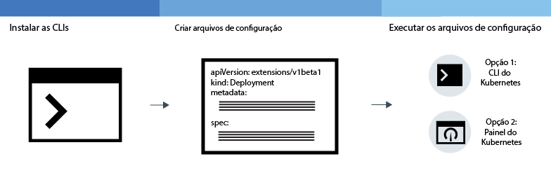
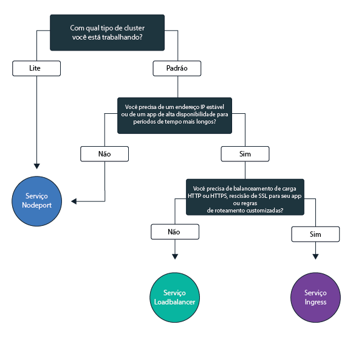

---

copyright: years: 2014, 2017 lastupdated: "2017-12-18"

---

{:new_window: target="_blank"}
{:shortdesc: .shortdesc}
{:screen: .screen}
{:pre: .pre}
{:table: .aria-labeledby="caption"}
{:codeblock: .codeblock}
{:tip: .tip}
{:download: .download}


# Implementando apps em clusters
{: #cs_apps}

É possível usar técnicas do Kubernetes para implementar apps e assegurar que seus aplicativos estejam funcionando em todos os momentos. Por exemplo, é possível executar atualizações e recuperações contínuas sem tempo de inatividade para seus usuários.
{:shortdesc}

Aprenda as etapas gerais para implementar apps clicando em uma área da imagem a seguir.


<map name="d62e18" id="d62e18">
<area href="cs_cli_install.html" target="_blank" alt="Instalar as CLIs." title="Instalar as CLIs." shape="rect" coords="30, 69, 179, 209" />
<area href="https://kubernetes.io/docs/concepts/configuration/overview/" target="_blank" alt="Crie um arquivo de configuração para o seu app. Revise as melhores práticas do Kubernetes." title="Crie um arquivo de configuração para o seu app. Revise as melhores práticas do Kubernetes." shape="rect" coords="254, 64, 486, 231" />
<area href="#cs_apps_cli" target="_blank" alt="Opção 1: execute os arquivos de configuração da CLI do Kubernetes." title="Opção 1: execute os arquivos de configuração da CLI do Kubernetes." shape="rect" coords="544, 67, 730, 124" />
<area href="#cs_cli_dashboard" target="_blank" alt="Opção 2: inicie o painel do Kubernetes localmente e execute os arquivos de configuração." title="Opção 2: inicie o painel do Kubernetes localmente e execute os arquivos de configuração." shape="rect" coords="544, 141, 728, 204" />
</map>


<br />


## Ativando o painel do Kubernetes
{: #cs_cli_dashboard}

Abra um painel do Kubernetes em seu sistema local para visualizar informações sobre um cluster e seus nós do trabalhador.
{:shortdesc}

Antes de iniciar, [destine sua CLI](cs_cli_install.html#cs_cli_configure) para seu cluster. Essa tarefa requer a [política de acesso de Administrador](cs_cluster.html#access_ov). Verifique sua [política de acesso](cs_cluster.html#view_access) atual.

É possível usar a porta padrão ou configurar sua própria porta para ativar o painel do Kubernetes para um cluster.

1.  Para clusters com uma versão mestre do Kubernetes de 1.7.4 ou anterior:

    1.  Configure o proxy com o número da porta padrão.

        ```
        kubectl proxy
        ```
        {: pre}

        Saída:

        ```
        Iniciando a entrega em 127.0.0.1:8001
        ```
        {: screen}

    2.  Abra o painel do Kubernetes em um navegador da web.

        ```
        http://localhost:8001/ui
        ```
        {: codeblock}

2.  Para clusters com uma versão mestre do Kubernetes de 1.8.2 ou mais recente:

    1.  Faça download de suas credenciais.

        ```
        bx cs cluster-config <cluster_name>
        ```
        {: codeblock}

    2.  Visualize as credenciais do cluster transferidas por download. Use o caminho de arquivo que é especificado na exportação na etapa anterior.

        Para Mac OS ou Linux:

        ```
        cat <filepath_to_cluster_credentials>
        ```
        {: codeblock}

        Para o Windows:

        ```
        type <filepath_to_cluster_credentials>
        ```
        {: codeblock}

    3.  Copie o token no campo **id-token**.

    4.  Configure o proxy com o número da porta padrão.

        ```
        kubectl proxy
        ```
        {: pre}

        Sua saída da CLI é semelhante à seguinte:

        ```
        Iniciando a entrega em 127.0.0.1:8001
        ```
        {: screen}

    6.  Conecte-se ao painel.

        1.  Copie esta URL em seu navegador.

            ```
            http://localhost:8001/api/v1/namespaces/kube-system/services/https:kubernetes-dashboard:/proxy/
            ```
            {: codeblock}

        2.  Na página de conexão, selecione o método de autenticação **Token**.

        3.  Em seguida, cole o valor **id-token** no campo **Token** e clique em **CONECTAR**.

[Em seguida, é possível executar um arquivo de configuração do painel.](#cs_apps_ui)

Quando estiver pronto com o painel do Kubernetes, use `CTRL+C` para sair do comando `proxy`. Depois de sair, o painel do Kubernetes não estará mais disponível. Execute o comando `proxy` para reiniciar o painel do Kubernetes.


<br />


## Criando segredos
{: #secrets}

Segredos do Kubernetes são uma maneira segura para armazenar informação confidencial, como nomes de usuário, senhas ou chaves.


<table>
<caption>Tabela. Os arquivos necessários que precisam ser armazenados em segredos por tarefa</caption>
<thead>
<th>Tarefas</th>
<th>Os arquivos necessários para armazenar em segredos</th>
</thead>
<tbody>
<tr>
<td>Incluir um serviço em um cluster</td>
<td>Nenhuma. Um segredo é criado quando você liga um serviço a um cluster.</td>
</tr>
<tr>
<td>Opcional: configure o serviço de Ingresso com TLS, se você não estiver usando o segredo do ingresso. <p><b>Nota</b>: o TLS já está ativado por padrão e um segredo já está criado pela Conexão TLS.

Para visualizar o segredo do TLS padrão:
<pre>
bx cs cluster-get &gt;CLUSTER-NAME&lt; | grep "Ingress secret"
</pre>
</p>
Para criar o seu próprio, conclua as etapas neste tópico.</td>
<td>Certificado e chave do servidor: <code>server.crt</code> e <code>server.key</code></td>
<tr>
<td>Crie a anotação de autenticação mútua.</td>
<td>Certificado de CA: <code>ca.crt</code></td>
</tr>
</tbody>
</table>

Para obter mais informações sobre o que é possível armazenar em segredos, veja a [documentação do Kubernetes](https://kubernetes.io/docs/concepts/configuration/secret/).


Para criar um segredo com um certificado:

1. Gere o certificado e a chave da autoridade de certificação (CA) de seu provedor de certificado. Se você tiver seu próprio domínio, compre um certificado TLS oficial para seu domínio. Para propósitos de teste, é possível gerar um certificado autoassinado.

 Importante: assegure-se de que o [CN](https://support.dnsimple.com/articles/what-is-common-name/) seja diferente para cada certificado.

 O certificado do cliente e a chave do cliente devem ser verificados até o certificado de raiz confiável que, neste caso, é o certificado de CA. Exemplo:

 ```
 Certificado do cliente: emitido pelo Certificado intermediário
 Certificado intermediário: emitido pelo Certificado raiz
 Certificado raiz: emitido por si mesmo
 ```
 {: codeblock}

2. Crie o certificado como um segredo do Kubernetes.

 ```
 kubectl create secret generic <secretName> --from-file=<cert_file>=<cert_file>
 ```
 {: pre}

 Exemplos:
 - Conexão TLS:

 ```
 kubectl create secret tls <secretName> --from-file=tls.crt=server.crt --from-file=tls.key=server.key
 ```
 {: pre}

 - Anotação de autenticação mútua:

 ```
 kubectl create secret generic <secretName> --from-file=ca.crt=ca.crt
 ```
 {: pre}

<br />


## Permitindo o acesso público a apps
{: #cs_apps_public}

Para tornar um app publicamente disponível na Internet, deve-se atualizar seu arquivo de configuração antes de implementar o app em um cluster.
{:shortdesc}

*Figura 1. Plano de dados do Kubernetes no {{site.data.keyword.containershort_notm}}*


O diagrama mostra como o Kubernetes transporta o tráfego de rede do usuário em {{site.data.keyword.containershort_notm}}. Dependendo de você ter criado um cluster lite ou padrão, existem maneiras diferentes de tornar seu app acessível na Internet.

<dl>
<dt><a href="#cs_apps_public_nodeport" target="_blank">serviço NodePort</a> (clusters lite e padrão)</dt>
<dd>
 <ul>
  <li>Exponha uma porta pública em cada nó do trabalhador e use o endereço IP público de qualquer nó do trabalhador para acessar publicamente seu serviço no cluster.</li>
  <li>Iptables é um recurso de kernel do Linux que faz o balanceamento de carga das solicitações dos Pods do aplicativo, fornece
roteamento de rede de alto desempenho e controle de acesso de rede.</li>
  <li>O endereço IP público do nó do trabalhador não é permanente. Quando um nó do trabalhador é removido ou recriado, um novo endereço IP público é designado ao
nó do trabalhador.</li>
  <li>O serviço NodePort é ótimo para testar o acesso público. Ele também pode ser usado se você precisa de acesso público somente por um curto tempo.</li>
 </ul>
</dd>
<dt><a href="#cs_apps_public_load_balancer" target="_blank">serviço LoadBalancer</a> (somente clusters padrão)</dt>
<dd>
 <ul>
  <li>Cada cluster padrão é provisionado com 4 endereços IP públicos móveis e 4 endereços IP privados móveis que podem ser usados para criar um balanceador de carga TCP/UDP externo para seu app.</li>
  <li>Iptables é um recurso de kernel do Linux que faz o balanceamento de carga das solicitações dos Pods do aplicativo, fornece
roteamento de rede de alto desempenho e controle de acesso de rede.</li>
  <li>O endereço IP público móvel que é designado para o balanceador de carga é permanente e não muda quando um nó do trabalhador é recriado no cluster.</li>
  <li>É possível customizar seu balanceador de carga expondo qualquer porta que seu app requer.</li></ul>
</dd>
<dt><a href="#cs_apps_public_ingress" target="_blank">Ingresso</a> (somente clusters padrão)</dt>
<dd>
 <ul>
  <li>Exponha múltiplos apps no cluster criando um balanceador de carga HTTP ou HTTPS externo que use um ponto de entrada público assegurado e exclusivo para rotear solicitações recebidas para seus apps.</li>
  <li>É possível usar uma rota pública para expor múltiplos apps em seu cluster como serviços.</li>
  <li>O Ingress consiste em três componentes principais, o recurso do Ingress, o controlador do Ingress e o balanceador de carga de aplicativo.
   <ul>
    <li>O recurso de Ingresso define as regras de como rotear e balancear a carga de solicitações recebidas para um app.</li>
    <li>O controlador do Ingress permite que o balanceador de carga de aplicativo, que atende o serviço HTTP ou HTTPS, solicite e encaminhe solicitações com base nas regras definidas para cada recurso do Ingress.</li>
    <li>O carregador do balanceador de carga do aplicativo balanceia solicitações em todos os pods dos apps.
   </ul>
  <li>Use Ingresso se desejar implementar seu próprio balanceador de carga com regras de roteamento customizadas e se precisar de finalização SSL para seus apps.</li>
 </ul>
</dd></dl>

Para escolher a melhor opção de rede para seu aplicativo, é possível seguir esta árvore de decisão:


<map name="networking_map" id="networking_map">
<area href="/docs/containers/cs_apps.html#cs_apps_public_nodeport" alt="Serviço Nodeport" shape="circle" coords="52, 283, 45"/>
<area href="/docs/containers/cs_apps.html#cs_apps_public_load_balancer" alt="Serviço Loadbalancer" shape="circle" coords="247, 419, 44"/>
<area href="/docs/containers/cs_apps.html#cs_apps_public_ingress" alt="Serviço Ingress" shape="circle" coords="445, 420, 45"/>
</map>


### Configurando o acesso público para um app usando o tipo de serviço NodePort
{: #cs_apps_public_nodeport}

Torne seu app disponível para acesso à Internet usando o endereço IP público de qualquer nó do trabalhador em um cluster e expondo uma porta do nó. Use essa opção para teste e acesso público de
curto prazo.

{:shortdesc}

É possível expor seu app como um serviço do Kubernetes NodePort para clusters lite ou padrão.

**Nota:** o endereço IP público de um nó do trabalhador não é permanente. Se o nó do trabalhador precisar ser recriado, um novo endereço IP público será designado ao nó do trabalhador. Se você precisar de um endereço IP público estável e mais disponibilidade para seu serviço, exponha seu app usando um [serviço LoadBalancer](#cs_apps_public_load_balancer) ou [Ingresso](#cs_apps_public_ingress).


1.  Defina uma seção de [serviço ](https://kubernetes.io/docs/concepts/services-networking/service/) no arquivo de configuração.
2.  Na seção `spec` do serviço, inclua o tipo NodePort.

    ```
    spec:
      type: NodePort
    ```
    {: codeblock}

3.  Opcional: na seção `ports`, inclua um NodePort no intervalo de 30.000 a 32.767. Não especifique um NodePort que já esteja em uso por outro serviço. Se estiver inseguro sobre quais NodePorts já estão em uso, não designe um. Se nenhum NodePort for designado, um aleatório será designado para você.

    ```
    ports:
      - port: 80
        nodePort: 31514
    ```
    {: codeblock}

    Se você desejar especificar um NodePort e desejar ver quais NodePorts já estão em uso, será possível executar o comando a seguir.

    ```
    kubectl get svc
    ```
    {: pre}

    Saída:

    ```
    NAME           CLUSTER-IP     EXTERNAL-IP   PORTS          AGE
    myapp          10.10.10.83    <nodes>       80:31513/TCP   28s
    redis-master   10.10.10.160   <none>        6379/TCP       28s
    redis-slave    10.10.10.194   <none>        6379/TCP       28s
    ```
    {: screen}

4.  Salve as alterações.
5.  Repita para criar um serviço para cada app.

    Exemplo:

    ```
    apiVersion: v1
    kind: Service
    metadata:
      name: my-nodeport-service
      labels:
        run: my-demo
    spec:
      selector:
        run: my-demo
      type: NodePort
      ports:
       - protocol: TCP
         port: 8081
         # nodePort: 31514

    ```
    {: codeblock}

**E agora?**

Quando o app for implementado, será possível usar o endereço IP público de qualquer nó do trabalhador e o NodePort para formar a URL pública para acessar o app em um navegador.

1.  Obtenha o endereço IP público para um nó do trabalhador no cluster.

    ```
    bx cs workers <cluster_name>
    ```
    {: pre}

    Saída:

    ```
    ID                                                Public IP   Private IP    Size     State    Status
    prod-dal10-pa215dcf5bbc0844a990fa6b0fcdbff286-w1  192.0.2.23  10.100.10.10  u2c.2x4  normal   Ready
    prod-dal10-pa215dcf5bbc0844a990fa6b0fcdbff286-w2  192.0.2.27  10.100.10.15  u2c.2x4  normal   Ready
    ```
    {: screen}

2.  Se um NodePort aleatório foi designado, descubra qual foi designado.

    ```
    kubectl describe service <service_name>
    ```
    {: pre}

    Saída:

    ```
    Name:                   <service_name>
    Namespace:              default
    Labels:                 run=<deployment_name>
    Selector:               run=<deployment_name>
    Type:                   NodePort
    IP:                     10.10.10.8
    Port:                   <unset> 8080/TCP
    NodePort:               <unset> 30872/TCP
    Endpoints:              172.30.171.87:8080
    Session Affinity:       None
    No events.
    ```
    {: screen}

    Neste exemplo, o NodePort é `30872`.

3.  Forme a URL com um dos endereços IP públicos do nó do trabalhador e o NodePort. Exemplo: `http://192.0.2.23:30872`

### Configurando o acesso a um app usando o tipo de serviço do balanceador de carga
{: #cs_apps_public_load_balancer}

Exponha uma porta e use um endereço IP móvel para o balanceador de carga para acessar o app. Use um endereço IP público para tornar um app acessível na internet ou um endereço IP privado para tornar um app acessível na sua infraestrutura de rede privada.

Diferente de um serviço NodePort, o endereço IP móvel do serviço de balanceador de carga não é dependente do nó do trabalhador em que o app está implementado. No entanto, um serviço do Kubernetes LoadBalancer também é um serviço NodePort. Um serviço LoadBalancer disponibiliza seu app por meio da porta e do endereço IP do balanceador de carga e por meio das portas do nó do serviço.

O endereço IP móvel do balanceador de carga é designado para você e não muda quando você inclui ou remove nós do trabalhador. Portanto, os serviços do balanceador de carga são mais altamente disponíveis do que os serviços NodePort. Os usuários podem selecionar qualquer porta para o balanceador de carga e não são limitados ao intervalo de portas NodePort. É possível usar serviços de balanceador de carga para os protocolos TCP e UDP.

**Nota:** os serviços do balanceador de carga não suportam finalização do TLS. Se seu app requerer a finalização do TLS, será possível expor seu app usando [Ingresso](#cs_apps_public_ingress) ou configurar seu app para gerenciar a finalização do TLS.

Antes de iniciar:

-   Este recurso está disponível somente para clusters padrão.
-   Deve-se ter um endereço IP público ou privado móvel disponível para designar ao serviço de balanceador de carga.
-   Um serviço de balanceador de carga com um endereço IP privado móvel ainda tem uma porta do nó público aberta em cada nó do trabalhador. Para incluir uma política de rede para evitar o tráfego público, consulte [Bloqueando tráfego recebido](cs_security.html#cs_block_ingress).

Para criar um serviço de balanceador de carga:

1.  [Implemente o seu app no cluster](#cs_apps_cli). Quando você implementa o seu app no cluster, são criados para você um ou mais pods que executam o seu app em um contêiner. Certifique-se de incluir um rótulo à sua implementação na seção de metadados de seu arquivo de configuração. Esse rótulo é necessário para identificar todos os pods nos quais o seu app está em execução para que eles possam ser incluídos no balanceamento de carga.
2.  Crie um serviço de balanceador de carga para o app que você deseja expor. Para tornar seu app disponível na Internet pública ou em uma rede privada, crie um serviço do Kubernetes para seu app. Configure seu serviço para incluir todos os pods que compõem o seu app no balanceamento de carga.
    1.  Crie um arquivo de configuração de serviço que seja chamado, por exemplo, de `myloadbalancer.yaml`.
    2.  Defina um serviço de balanceador de carga para o app que você deseja expor.
        - Se o seu cluster estiver em uma VLAN pública, um endereço IP móvel público será usado. A maioria dos clusters está em uma VLAN pública.
        - Se o seu cluster estiver disponível apenas em uma VLAN privada, então, um endereço IP móvel privado será usado.
        - É possível solicitar um endereço IP público ou privado móvel para um serviço LoadBalancer, incluindo uma anotação no arquivo de configuração.

        O serviço LoadBalancer que usa um endereço IP padrão:

        ```
        apiVersion: v1
        kind: Service
        metadata:
          name: <myservice>
        spec:
          type: LoadBalancer
          selector:
            <selectorkey>:<selectorvalue>
          ports:
           - protocol: TCP
             port: 8080
        ```
        {: codeblock}

        O serviço LoadBalancer que usa uma anotação para especificar um endereço IP privado ou público:

        ```
        apiVersion: v1
        kind: Service
        metadata:
          name: <myservice>
          annotations:
            service.kubernetes.io/ibm-load-balancer-cloud-provider-ip-type: <public_or_private>
        spec:
          type: LoadBalancer
          selector:
            <selectorkey>:<selectorvalue>
          ports:
           - protocol: TCP
             port: 8080
          loadBalancerIp: <private_ip_address>
        ```
        {: codeblock}

        <table>
        <thead>
        <th colspan=2> entendendo os componentes de arquivo do YAML</th>
        </thead>
        <tbody>
        <tr>
          <td><code>name</code></td>
          <td>Substitua <em>&lt;myservice&gt;</em> por um nome para o seu serviço de balanceador de carga.</td>
        </tr>
        <tr>
          <td><code>seletor</code></td>
          <td>Insira o par de chave de etiqueta (<em>&lt;selectorkey&gt;</em>) e valor (<em>&lt;selectorvalue&gt;</em>) que você deseja usar para destinar os pods nos quais seu app é executado. Por exemplo, se você usar o seletor <code>app: code</code> a seguir, todos os pods que tiverem esse rótulo em seus metadados serão incluídos no balanceamento de carga. Insira o mesmo rótulo que você usou quando implementou o seu app no cluster. </td>
        </tr>
        <tr>
          <td><code>port</code></td>
          <td>A porta na qual o serviço atende.</td>
        </tr>
        <tr>
          <td>`service.kubernetes.io/ibm-load-balancer-cloud-provider-ip-type:`
          <td>Anotação para especificar o tipo de LoadBalancer. Os valores são `private` e `public`. Ao criar um LoadBalancer público em clusters em VLANs públicas, essa anotação não é necessária.</td>
        </tr>
        <tr>
          <td><code>loadBalancerIp</code></td>
          <td>Ao criar um LoadBalancer privado, substitua <em>&lt;loadBalancerIp&gt;</em> pelo endereço IP que você deseja usar para o LoadBalancer.</td>
        </tr>
        </tbody></table>
    3.  Opcional: para usar um endereço IP móvel específico para o balanceador de carga que está disponível para seu cluster, é possível especificar esse endereço IP incluindo o `loadBalancerIP` na seção de especificação. Para obter mais informações, veja a [documentação do Kubernetes ](https://kubernetes.io/docs/concepts/services-networking/service/).
    4.  Opcional: configure um firewall especificando o `loadBalancerSourceRanges` na seção de especificação. Para obter mais informações, veja a [documentação do Kubernetes ](https://kubernetes.io/docs/tasks/access-application-cluster/configure-cloud-provider-firewall/).
    5.  Crie o serviço em seu cluster.

        ```
        kubectl apply -f myloadbalancer.yaml
        ```
        {: pre}

        Quando o serviço de balanceador de carga for criado, um endereço IP móvel será designado automaticamente ao balanceador de carga. Se nenhum endereço IP móvel estiver disponível, o serviço de balanceador de carga não poderá ser criado.
3.  Verifique se o serviço de balanceador de carga foi criado com êxito. Substitua _&lt;myservice&gt;_ pelo nome do serviço de balanceador de carga que você criou na etapa anterior.

    ```
    kubectl describe service <myservice>
    ```
    {: pre}

    **Nota:** pode levar alguns minutos para o serviço de balanceador de carga ser criado corretamente e para que o app fique disponível.

    Exemplo de saída da CLI:

    ```
    Name:                   <myservice>
    Namespace:              default
    Labels:                 <none>
    Selector:               <selectorkey>=<selectorvalue>
    Type:                   LoadBalancer
    IP:                     10.10.10.90
    LoadBalancer Ingress:   192.168.10.38
    Port:                   <unset> 8080/TCP
    NodePort:               <unset> 32040/TCP
    Endpoints:              172.30.171.87:8080
    Session Affinity:       None
    Events:
    FirstSeen LastSeen Count From   SubObjectPath Type  Reason   Message
      --------- -------- ----- ----   ------------- -------- ------   -------
      10s  10s  1 {service-controller }   Normal  CreatingLoadBalancer Creating load balancer
      10s  10s  1 {service-controller }   Normal  CreatedLoadBalancer Created load balancer
    ```
    {: screen}

    O endereço IP do **Ingresso de LoadBalancer** é o endereço IP móvel que foi designado ao seu serviço de balanceador de carga.
4.  Se você tiver criado um balanceador de carga público, acesse seu app pela Internet.
    1.  Abra seu navegador da web preferencial.
    2.  Insira o endereço IP público móvel do balanceador de carga e a porta. No exemplo acima, o endereço IP público móvel `192.168.10.38` foi designado ao serviço de balanceador de carga.

        ```
        http://192.168.10.38:8080
        ```
        {: codeblock}


### Configurando o acesso a um app usando Ingress
{: #cs_apps_public_ingress}

Exponha múltiplos apps em seu cluster criando recursos de Ingresso que são gerenciados pelo controlador de Ingresso fornecido pela IBM. O controlador do Ingress cria os recursos necessários para usar um balanceador de carga de aplicativo. Um balanceador de carga de aplicativo é um balanceador de carga HTTP ou HTTPS externo que usa um ponto de entrada público ou privado assegurado e exclusivo para rotear solicitações recebidas para seus apps dentro ou fora do cluster.

**Nota:** o Ingresso está disponível somente para clusters padrão e requer pelo menos dois nós do trabalhador no cluster para assegurar alta disponibilidade e que atualizações periódicas sejam aplicadas. Configurar o Ingresso requer uma [política de acesso de Administrador](cs_cluster.html#access_ov). Verifique sua [política de acesso](cs_cluster.html#view_access) atual.

Ao criar um cluster padrão, o controlador de Ingress automaticamente cria e ativa um balanceador de carga de aplicativo que é designado um endereço IP público móvel e uma rota pública. Um balanceador de carga de aplicativo que é designado a um endereço IP privado móvel e a uma rota privada também é criado automaticamente, mas não é ativado automaticamente. É possível configurar esses balanceadores de carga de aplicativo e definir regras de roteamento individuais para cada app que você expõe ao público ou às redes privadas. Cada app que é exposto ao público por meio do Ingresso é designado a um caminho exclusivo que é anexado à rota pública, para que seja possível usar uma URL exclusiva para acessar um app publicamente em seu cluster.

Para expor seu app ao público, é possível configurar o balanceador de carga de aplicativo público para os cenários a seguir.

-   [Usar o domínio fornecido pela IBM sem finalização TLS](#ibm_domain)
-   [Usar o domínio fornecido pela IBM com finalização TLS](#ibm_domain_cert)
-   [Usar um domínio customizado e certificado TLS para executar a finalização TLS](#custom_domain_cert)
-   [Usar o domínio fornecido pela IBM ou um customizado com finalização TLS para acessar apps fora de seu cluster](#external_endpoint)
-   [Abrir portas no balanceador de carga do Ingress](#opening_ingress_ports)
-   [Configurar protocolos SSL e cifras SSL no nível de HTTP](#ssl_protocols_ciphers)
-   [Customizar seu balanceador de carga do aplicativo com anotações](cs_annotations.html)
{: #ingress_annotation}

Para expor seu app a redes privadas, primeiro [ative o balanceador de carga do aplicativo privado](#private_ingress). É possível, em seguida, configurar o balanceador de carga de aplicativo privado para os cenários a seguir.

-   [Usar um domínio customizado sem finalização do TLS](#private_ingress_no_tls)
-   [Usar um domínio customizado e certificado TLS para executar a finalização do TLS](#private_ingress_tls)


Para escolher a melhor configuração para o Ingress, é possível seguir esta árvore de decisão:


<map name="ingress_map" id="ingress_map">
<area href="/docs/containers/cs_apps.html#private_ingress_no_tls" alt="Usando o controlador do Ingress com um domínio customizado." shape="rect" coords="25, 246, 187, 294"/>
<area href="/docs/containers/cs_apps.html#private_ingress_tls" alt="Usando o controlador privado do Ingress com um domínio customizado e um certificado TLS." shape="rect" coords="161, 337, 309, 385"/>
<area href="/docs/containers/cs_apps.html#external_endpoint" alt="Configurando o controlador público do Ingress para rotear o tráfego de rede para apps fora do cluster." shape="rect" coords="313, 229, 466, 282"/>
<area href="/docs/containers/cs_apps.html#custom_domain_cert" alt="Usando o controlador público do Ingress com um domínio customizado e certificado TLS." shape="rect" coords="365, 415, 518, 468"/>
<area href="/docs/containers/cs_apps.html#ibm_domain" alt="Usando o controlador público do Ingress com o domínio fornecido pela IBM" shape="rect" coords="414, 609, 569, 659"/>
<area href="/docs/containers/cs_apps.html#ibm_domain_cert" alt="Usando o controlador público do Ingress com o domínio fornecido pela IBM e o certificado TLS." shape="rect" coords="563, 681, 716, 734"/>
</map>

#### Usando o domínio fornecido pela IBM sem finalização TLS
{: #ibm_domain}

É possível configurar o balanceador de carga de aplicativo como um balanceador de carga de HTTP para os apps em seu cluster e usar o domínio fornecido pela IBM para acessar seus apps na Internet.

Antes de iniciar:

-   Se você não tiver nenhum ainda, [crie um cluster padrão](cs_cluster.html#cs_cluster_ui).
-   [Destine sua CLI](cs_cli_install.html#cs_cli_configure) para seu cluster para executar comandos `kubectl`.

Para configurar o balanceador de carga do aplicativo:

1.  [Implemente o seu app no cluster](#cs_apps_cli). Quando você implementa o seu app no cluster, são criados para você um ou mais pods que executam o seu app em um contêiner. Certifique-se de incluir um rótulo à sua implementação na seção de metadados de seu arquivo de configuração. Esse rótulo é necessário para identificar todos os pods nos quais o seu app está em execução, de modo que eles possam ser incluídos no balanceamento de carga do Ingresso.
2.  Crie um serviço do Kubernetes para o app a ser exposto. O controlador do Ingresso poderá incluir o seu app no balanceamento de carga do Ingresso somente se o seu app for exposto por meio de um serviço do Kubernetes dentro do cluster.
    1.  Abra o seu editor preferencial e crie um arquivo de configuração de serviço que seja denominado, por exemplo, `myservice.yaml`.
    2.  Defina um serviço para o app que você deseja expor para o público.

        ```
        apiVersion: v1
        kind: Service
        metadata:
          name: <myservice>
        spec:
          selector:
            <selectorkey>: <selectorvalue>
          ports:
           - protocol: TCP
             port: 8080
        ```
        {: codeblock}

        <table>
        <thead>
        <th colspan=2> entendendo os componentes de arquivo do YAML</th>
        </thead>
        <tbody>
        <tr>
        <td><code>name</code></td>
        <td>Substitua <em>&lt;myservice&gt;</em> por um nome para o seu serviço de balanceador de carga.</td>
        </tr>
        <tr>
        <td><code>seletor</code></td>
        <td>Insira o par de chave de etiqueta (<em>&lt;selectorkey&gt;</em>) e valor (<em>&lt;selectorvalue&gt;</em>) que você deseja usar para destinar os pods nos quais seu app é executado. Por exemplo, se você usar o seletor <code>app: code</code> a seguir, todos os pods que tiverem esse rótulo em seus metadados serão incluídos no balanceamento de carga. Insira o mesmo rótulo que você usou quando implementou o seu app no cluster. </td>
         </tr>
         <tr>
         <td><code>port</code></td>
         <td>A porta na qual o serviço atende.</td>
         </tr>
         </tbody></table>
    3.  Salve as suas mudanças.
    4.  Crie o serviço em seu cluster.

        ```
        kubectl apply -f myservice.yaml
        ```
        {: pre}
    5.  Repita essas etapas para cada app que você desejar expor para o público.
3.  Obtenha os detalhes de seu cluster para visualizar o domínio fornecido pela IBM. Substitua _&lt;mycluster&gt;_ pelo nome do cluster no qual o app está implementado que você deseja expor para o público.

    ```
    bx cs cluster-get <mycluster>
    ```
    {: pre}

    Sua saída de CLI é semelhante à seguinte.

    ```
    Retrieving cluster <mycluster>...
    OK
    Name:    <mycluster>
    ID:    b9c6b00dc0aa487f97123440b4895f2d
    Created:  2017-04-26T19:47:08+0000
    State:    normal
    Master URL:  https://169.57.40.165:1931
    Ingress subdomain:  <ibmdomain>
    Ingress secret:  <ibmtlssecret>
    Workers:  3
    ```
    {: screen}

    É possível ver o domínio fornecido pela IBM no campo **Subdomínio do Ingresso**.
4.  Crie um recurso do Ingresso. Recursos de ingresso definem as regras de roteamento para o serviço de Kubernetes que você criou para o seu aplicativo
e são usados pelo balanceador de carga do aplicativo para rotear o tráfego de rede recebido para o serviço. Será possível usar um recurso do Ingresso para definir regras de roteamento para múltiplos apps desde que cada app seja exposto por meio de um serviço do Kubernetes dentro do cluster.
    1.  Abra o seu editor preferencial e crie um arquivo de configuração Ingresso que seja denominado, por exemplo, `myingress.yaml`.
    2.  Defina um recurso do Ingresso em seu arquivo de configuração que usa o domínio fornecido pela IBM para rotear o tráfego de rede recebido para o serviço que você criou anteriormente.

        ```
        apiVersion: extensions/v1beta1
        kind: Ingress
        metadata:
          name: <myingressname>
        spec:
          rules:
          - host: <ibmdomain>
            http:
              paths:
              - path: /<myservicepath1>
                backend:
                  serviceName: <myservice1>
                  servicePort: 80
              - path: /<myservicepath2>
                backend:
                  serviceName: <myservice2>
                  servicePort: 80
        ```
        {: codeblock}

        <table>
        <thead>
        <th colspan=2> entendendo os componentes de arquivo do YAML</th>
        </thead>
        <tbody>
        <tr>
        <td><code>name</code></td>
        <td>Substitua <em>&lt;myingressname&gt;</em> por um nome para seu recurso de Ingresso.</td>
        </tr>
        <tr>
        <td><code>host</code></td>
        <td>Substitua <em>&lt;ibmdomain&gt;</em> pelo nome do <strong>Subdomínio do Ingresso</strong> fornecido pela IBM na etapa anterior.

        </br></br>
        <strong>Nota:</strong> não use * para o seu host ou deixe a propriedade do host vazia para evitar falhas durante a criação do Ingresso.</td>
        </tr>
        <tr>
        <td><code>path</code></td>
        <td>Substitua <em>&lt;myservicepath1&gt;</em> por uma barra ou pelo caminho exclusivo no qual seu app está atendendo, para que o tráfego de rede possa ser encaminhado para o app.

        </br>
        Para cada serviço do Kubernetes, é possível definir um caminho individual que seja anexado ao domínio fornecido pela IBM para criar um caminho exclusivo para seu app, por exemplo, <code>ingress_domain/myservicepath1</code>. Ao inserir essa rota em um navegador da web, o tráfego de rede é roteado para o balanceador de carga do aplicativo. O balanceador de carga do aplicativo consulta o serviço associado e envia o tráfego de rede para o serviço e para os Pods em
que o aplicativo está em execução usando o mesmo caminho. O app deve ser configurado para atender nesse caminho para receber o tráfego de rede de entrada.

        </br></br>
        Muitos apps não atendem em um caminho específico, mas usam o caminho raiz e uma porta específica. Nesse caso, defina o caminho raiz como <code>/</code> e não especifique um caminho individual para seu app.
        </br>
        Exemplos: <ul><li>Para <code>http://ingress_host_name/</code>, insira <code>/</code> como o caminho.</li><li>Para <code>http://ingress_host_name/myservicepath</code>, insira <code>/myservicepath</code> como o caminho.</li></ul>
        </br>
        <strong>Dica:</strong> se desejar configurar seu Ingresso para atender em um caminho que seja diferente daquele no qual seu app atende, será possível usar a [anotação de nova gravação](cs_annotations.html#rewrite-path) para estabelecer o roteamento adequado para seu app.</td>
        </tr>
        <tr>
        <td><code>serviceName</code></td>
        <td>Substitua <em>&lt;myservice1&gt;</em> pelo nome do serviço que você usou quando criou o serviço do Kubernetes para seu app.</td>
        </tr>
        <tr>
        <td><code>servicePort</code></td>
        <td>A porta na qual o serviço atende. Use a mesma porta que você definiu quando criou o serviço do Kubernetes para seu app.</td>
        </tr>
        </tbody></table>

    3.  Crie o recurso de Ingresso para seu cluster.

        ```
        kubectl apply -f myingress.yaml
        ```
        {: pre}

5.  Verifique se o recurso de Ingresso foi criado com êxito. Substitua _&lt;myingressname&gt;_ pelo nome do recurso de Ingresso que você criou anteriormente.

    ```
    kubectl describe ingress <myingressname>
    ```
    {: pre}

  **Nota:** pode levar alguns minutos para que o recurso de Ingresso seja criado e para que o app fique disponível na Internet pública.
6.  Em um navegador da web, insira a URL do serviço de app a ser acessado.

    ```
    http://<ibmdomain>/<myservicepath1>
    ```
    {: codeblock}


#### Usando o domínio fornecido pela IBM com finalização TLS
{: #ibm_domain_cert}

É possível configurar o balanceador de carga de aplicativo para gerenciar conexões TLS recebidas para seus apps, decriptografar o tráfego de rede usando o certificado TLS fornecido pela IBM e encaminhar a solicitação não criptografada para os apps expostos em seu cluster.

Antes de iniciar:

-   Se você não tiver nenhum ainda, [crie um cluster padrão](cs_cluster.html#cs_cluster_ui).
-   [Destine sua CLI](cs_cli_install.html#cs_cli_configure) para seu cluster para executar comandos `kubectl`.

Para configurar o balanceador de carga do aplicativo:

1.  [Implemente o seu app no cluster](#cs_apps_cli). Certifique-se de incluir um rótulo à sua implementação na seção de metadados de seu arquivo de configuração. Esse rótulo identifica todos os pods nos quais o app está em execução, para que sejam incluídos no balanceamento de carga do Ingresso.
2.  Crie um serviço do Kubernetes para o app a ser exposto. O balanceador de carga do aplicativo poderá incluir seu aplicativo no balanceamento de carga de Ingresso somente se o seu
aplicativo for exposto por meio de um serviço Kubernetes dentro do cluster.
    1.  Abra o seu editor preferencial e crie um arquivo de configuração de serviço que seja denominado, por exemplo, `myservice.yaml`.
    2.  Defina um serviço para o app que você deseja expor para o público.

        ```
        apiVersion: v1
        kind: Service
        metadata:
          name: <myservice>
        spec:
          selector:
            <selectorkey>: <selectorvalue>
          ports:
           - protocol: TCP
             port: 8080
        ```
        {: codeblock}

        <table>
        <thead>
        <th colspan=2> entendendo os componentes de arquivo do YAML</th>
        </thead>
        <tbody>
        <tr>
        <td><code>name</code></td>
        <td>Substitua <em>&lt;myservice&gt;</em> por um nome para o seu serviço do Kubernetes.</td>
        </tr>
        <tr>
        <td><code>seletor</code></td>
        <td>Insira o par de chave de etiqueta (<em>&lt;selectorkey&gt;</em>) e valor (<em>&lt;selectorvalue&gt;</em>) que você deseja usar para destinar os pods nos quais seu app é executado. Por exemplo, se você usar o seletor <code>app: code</code> a seguir, todos os pods que tiverem esse rótulo em seus metadados serão incluídos no balanceamento de carga. Insira o mesmo rótulo que você usou quando implementou o seu app no cluster. </td>
         </tr>
         <tr>
         <td><code>port</code></td>
         <td>A porta na qual o serviço atende.</td>
         </tr>
         </tbody></table>

    3.  Salve as suas mudanças.
    4.  Crie o serviço em seu cluster.

        ```
        kubectl apply -f myservice.yaml
        ```
        {: pre}

    5.  Repita essas etapas para cada app que você desejar expor para o público.

3.  Visualize o domínio fornecido pela IBM e o certificado TLS. Substitua _&lt;mycluster&gt;_ pelo nome do cluster no qual o app está implementado.

    ```
    bx cs cluster-get <mycluster>
    ```
    {: pre}

    Sua saída de CLI é semelhante à seguinte.

    ```
    bx cs cluster-get <mycluster>
    Retrieving cluster <mycluster>...
    OK
    Name:    <mycluster>
    ID:    b9c6b00dc0aa487f97123440b4895f2d
    Created:  2017-04-26T19:47:08+0000
    State:    normal
    Master URL:  https://169.57.40.165:1931
    Ingress subdomain:  <ibmdomain>
    Ingress secret:  <ibmtlssecret>
    Workers:  3
    ```
    {: screen}

    É possível ver o domínio fornecido pela IBM no **Subdomínio do Ingresso** e o certificado fornecido pela IBM no campo **Segredo do Ingresso**.

4.  Crie um recurso do Ingresso. Recursos de ingresso definem as regras de roteamento para o serviço de Kubernetes que você criou para o seu aplicativo
e são usados pelo balanceador de carga do aplicativo para rotear o tráfego de rede recebido para o serviço. Será possível usar um recurso do Ingresso para definir regras de roteamento para múltiplos apps desde que cada app seja exposto por meio de um serviço do Kubernetes dentro do cluster.
    1.  Abra o seu editor preferencial e crie um arquivo de configuração Ingresso que seja denominado, por exemplo, `myingress.yaml`.
    2.  Defina um recurso do Ingresso em seu arquivo de configuração que usa o domínio fornecido pela IBM para rotear o tráfego de rede recebido para seus serviços e o certificado fornecido pela IBM para gerenciar o encerramento do TLS para você. Para cada serviço, é possível definir um caminho individual que seja anexado ao domínio fornecido pela IBM para criar um caminho exclusivo para seu app, por exemplo, `https://ingress_domain/myapp`. Ao inserir essa rota em um navegador da web, o tráfego de rede é roteado para o balanceador de carga do aplicativo. O balanceador de carga do aplicativo consulta o serviço associado e envia o tráfego de rede para o serviço e também para
os Pods em que o aplicativo está em execução.

        **Nota:** seu app deve atender no caminho definido no recurso de Ingresso. Caso contrário, o tráfego de rede não poderá ser encaminhado para o app. A maioria dos apps não atende em um caminho específico, mas usa o caminho raiz e uma porta específica. Nesse caso, defina o caminho raiz como `/` e não especifique um caminho individual para seu app.

        ```
        apiVersion: extensions/v1beta1
        kind: Ingress
        metadata:
          name: <myingressname>
        spec:
          tls:
          - hosts:
            - <ibmdomain>
            secretName: <ibmtlssecret>
          rules:
          - host: <ibmdomain>
            http:
              paths:
              - path: /<myservicepath1>
                backend:
                  serviceName: <myservice1>
                  servicePort: 80
              - path: /<myservicepath2>
                backend:
                  serviceName: <myservice2>
                  servicePort: 80
        ```
        {: codeblock}

        <table>
        <thead>
        <th colspan=2> entendendo os componentes de arquivo do YAML</th>
        </thead>
        <tbody>
        <tr>
        <td><code>name</code></td>
        <td>Substitua <em>&lt;myingressname&gt;</em> por um nome para seu recurso de Ingresso.</td>
        </tr>
        <tr>
        <td><code>tls/hosts</code></td>
        <td>Substitua <em>&lt;ibmdomain&gt;</em> pelo nome do <strong>Subdomínio do Ingresso</strong> fornecido pela IBM na etapa anterior. Esse domínio é configurado para finalização TLS.

        </br></br>
        <strong>Nota:</strong> não use &ast; para o seu host ou deixe a propriedade do host vazia para evitar falhas durante a criação do Ingresso.</td>
        </tr>
        <tr>
        <td><code>tls/secretName</code></td>
        <td>Substitua <em>&lt;ibmtlssecret&gt;</em> pelo nome do <strong>Segredo do ingresso</strong> fornecido pela IBM da etapa anterior. Esse certificado gerencia a finalização do TLS.
        </tr>
        <tr>
        <td><code>host</code></td>
        <td>Substitua <em>&lt;ibmdomain&gt;</em> pelo nome do <strong>Subdomínio do Ingresso</strong> fornecido pela IBM na etapa anterior. Esse domínio é configurado para finalização TLS.

        </br></br>
        <strong>Nota:</strong> não use &ast; para o seu host ou deixe a propriedade do host vazia para evitar falhas durante a criação do Ingresso.</td>
        </tr>
        <tr>
        <td><code>path</code></td>
        <td>Substitua <em>&lt;myservicepath1&gt;</em> por uma barra ou pelo caminho exclusivo no qual seu app está atendendo, para que o tráfego de rede possa ser encaminhado para o app.

        </br>
        Para cada serviço do Kubernetes, é possível definir um caminho individual que seja anexado ao domínio fornecido pela IBM para criar um caminho exclusivo para seu app, por exemplo, <code>ingress_domain/myservicepath1</code>. Ao inserir essa rota em um navegador da web, o tráfego de rede é roteado para o balanceador de carga do aplicativo. O balanceador de carga do aplicativo consulta o serviço associado e envia o tráfego de rede para o serviço e para os Pods em
que o aplicativo está em execução usando o mesmo caminho. O app deve ser configurado para atender nesse caminho para receber o tráfego de rede de entrada.

        </br>
        Muitos apps não atendem em um caminho específico, mas usam o caminho raiz e uma porta específica. Nesse caso, defina o caminho raiz como <code>/</code> e não especifique um caminho individual para seu app.

        </br>
        Exemplos: <ul><li>Para <code>http://ingress_host_name/</code>, insira <code>/</code> como o caminho.</li><li>Para <code>http://ingress_host_name/myservicepath</code>, insira <code>/myservicepath</code> como o caminho.</li></ul>
        <strong>Dica:</strong> se desejar configurar seu Ingresso para atender em um caminho que seja diferente daquele no qual seu app atende, será possível usar a [anotação de nova gravação](cs_annotations.html#rewrite-path) para estabelecer o roteamento adequado para seu app.</td>
        </tr>
        <tr>
        <td><code>serviceName</code></td>
        <td>Substitua <em>&lt;myservice1&gt;</em> pelo nome do serviço que você usou quando criou o serviço do Kubernetes para seu app.</td>
        </tr>
        <tr>
        <td><code>servicePort</code></td>
        <td>A porta na qual o serviço atende. Use a mesma porta que você definiu quando criou o serviço do Kubernetes para seu app.</td>
        </tr>
        </tbody></table>

    3.  Crie o recurso de Ingresso para seu cluster.

        ```
        kubectl apply -f myingress.yaml
        ```
        {: pre}

5.  Verifique se o recurso de Ingresso foi criado com êxito. Substitua _&lt;myingressname&gt;_ pelo nome do recurso de Ingresso que você criou anteriormente.

    ```
    kubectl describe ingress <myingressname>
    ```
    {: pre}

    **Nota:** pode levar alguns minutos para que o recurso de Ingresso seja criado corretamente e para que o app fique disponível na Internet pública.
6.  Em um navegador da web, insira a URL do serviço de app a ser acessado.

    ```
    https://<ibmdomain>/<myservicepath1>
    ```
    {: codeblock}

#### Usando o balanceador de carga de aplicativo com um domínio customizado e um certificado TLS
{: #custom_domain_cert}

É possível configurar o balanceador de carga de aplicativo para rotear o tráfego de rede recebido para os apps em seu cluster e usar seu próprio certificado TLS para gerenciar a finalização do TLS, enquanto usa seu domínio customizado em vez do domínio fornecido pela IBM.
{:shortdesc}

Antes de iniciar:

-   Se você não tiver nenhum ainda, [crie um cluster padrão](cs_cluster.html#cs_cluster_ui).
-   [Destine sua CLI](cs_cli_install.html#cs_cli_configure) para seu cluster para executar comandos `kubectl`.

Para configurar o balanceador de carga do aplicativo:

1.  Crie um domínio customizado. Para criar um domínio customizado, trabalhe com seu provedor Domain Name Service (DNS) para registrar seu domínio customizado.
2.  Configure seu domínio para rotear o tráfego de rede recebido para o balanceador de carga de aplicativo fornecido pela IBM. Escolha entre estas opções:
    -   Defina um alias para seu domínio customizado especificando o domínio fornecido pela IBM como um registro de Nome Canônico (CNAME). Para localizar o domínio de Ingresso fornecido pela IBM, execute `bx cs cluster-get <mycluster>` e procure o campo **Subdomínio do Ingresso**.
    -   Mapeie o seu domínio customizado para o endereço IP público móvel do balanceador de carga de aplicativo fornecido pela IBM, incluindo o endereço IP como um registro. Para localizar o endereço IP público móvel do balanceador de carga de aplicativo, execute `bx cs alb-se <public_alb_ID>`.
3.  Crie um certificado e chave TLS para seu domínio que é codificado no formato PEM.
4.  Armazene o certificado e chave TLS em um segredo do Kubernetes.
    1.  Abra o seu editor preferencial e crie um arquivo de configuração de segredo do Kubernetes que seja chamado, por exemplo, de `mysecret.yaml`.
    2.  Defina um segredo que use seu certificado e chave do TLS. Substitua <em>&lt;mytlssecret&gt;</em> por um nome para o seu segredo do Kubernetes, <tls_key_filepath> com o caminho
para o seu arquivo-chave TLS customizado e <tls_cert_filepath> com o caminho para o seu arquivo de certificado TLS
customizado.

        ```
        kubectl create secret tls <mytlssecret> --key <tls_key_filepath> --cert <tls_cert_filepath>
        ```
        {: pre}

    3.  Salve seu arquivo de configuração.
    4.  Crie o segredo do TLS para seu cluster.

        ```
        kubectl apply -f mysecret.yaml
        ```
        {: pre}

5.  [Implemente o seu app no cluster](#cs_apps_cli). Quando você implementa o seu app no cluster, são criados para você um ou mais pods que executam o seu app em um contêiner. Certifique-se de incluir um rótulo à sua implementação na seção de metadados de seu arquivo de configuração. Esse rótulo é necessário para identificar todos os pods nos quais o seu app está em execução, de modo que eles possam ser incluídos no balanceamento de carga do Ingresso.

6.  Crie um serviço do Kubernetes para o app a ser exposto. O balanceador de carga do aplicativo poderá incluir seu aplicativo no balanceamento de carga de Ingresso somente se o seu
aplicativo for exposto por meio de um serviço Kubernetes dentro do cluster.

    1.  Abra o seu editor preferencial e crie um arquivo de configuração de serviço que seja denominado, por exemplo, `myservice.yaml`.
    2.  Defina um serviço para o app que você deseja expor para o público.

        ```
        apiVersion: v1
        kind: Service
        metadata:
          name: <myservice>
        spec:
          selector:
            <selectorkey>: <selectorvalue>
          ports:
           - protocol: TCP
             port: 8080
        ```
       {: codeblock}

        <table>
        <thead>
        <th colspan=2> entendendo os componentes de arquivo do YAML</th>
        </thead>
        <tbody>
        <tr>
        <td><code>name</code></td>
        <td>Substitua <em>&lt;myservice1&gt;</em> por um nome para seu serviço do Kubernetes.</td>
        </tr>
        <tr>
        <td><code>seletor</code></td>
        <td>Insira o par de chave de etiqueta (<em>&lt;selectorkey&gt;</em>) e valor (<em>&lt;selectorvalue&gt;</em>) que você deseja usar para destinar os pods nos quais seu app é executado. Por exemplo, se você usar o seletor <code>app: code</code> a seguir, todos os pods que tiverem esse rótulo em seus metadados serão incluídos no balanceamento de carga. Insira o mesmo rótulo que você usou quando implementou o seu app no cluster. </td>
         </tr>
         <td><code>port</code></td>
         <td>A porta na qual o serviço atende.</td>
         </tbody></table>

    3.  Salve as suas mudanças.
    4.  Crie o serviço em seu cluster.

        ```
        kubectl apply -f myservice.yaml
        ```
        {: pre}

    5.  Repita essas etapas para cada app que você desejar expor para o público.
7.  Crie um recurso do Ingresso. Recursos de ingresso definem as regras de roteamento para o serviço de Kubernetes que você criou para o seu aplicativo
e são usados pelo balanceador de carga do aplicativo para rotear o tráfego de rede recebido para o serviço. Será possível usar um recurso do Ingresso para definir regras de roteamento para múltiplos apps desde que cada app seja exposto por meio de um serviço do Kubernetes dentro do cluster.
    1.  Abra o seu editor preferencial e crie um arquivo de configuração Ingresso que seja denominado, por exemplo, `myingress.yaml`.
    2.  Defina um recurso do Ingresso em seu arquivo de configuração que use o domínio customizado para rotear o tráfego de rede recebido para seus serviços e o certificado customizado para gerenciar o encerramento do TLS. Para cada serviço, é possível definir um caminho individual que seja anexado ao domínio customizado para criar um caminho exclusivo para seu app, por exemplo, `https://mydomain/myapp`. Ao inserir essa rota em um navegador da web, o tráfego de rede é roteado para o balanceador de carga do aplicativo. O balanceador de carga do aplicativo consulta o serviço associado e envia o tráfego de rede para o serviço e também para
os Pods em que o aplicativo está em execução.

        **Nota:** é importante que o app atenda no caminho definido no recurso de Ingresso. Caso contrário, o tráfego de rede não poderá ser encaminhado para o app. A maioria dos apps não atende em um caminho específico, mas usa o caminho raiz e uma porta específica. Nesse caso, defina o caminho raiz como `/` e não especifique um caminho individual para seu app.

        ```
        apiVersion: extensions/v1beta1
        kind: Ingress
        metadata:
          name: <myingressname>
        spec:
          tls:
          - hosts:
            - <mycustomdomain>
            secretName: <mytlssecret>
          rules:
          - host: <mycustomdomain>
            http:
              paths:
              - path: /<myservicepath1>
                backend:
                  serviceName: <myservice1>
                  servicePort: 80
              - path: /<myservicepath2>
                backend:
                  serviceName: <myservice2>
                  servicePort: 80
        ```
        {: codeblock}

        <table>
        <thead>
        <th colspan=2> entendendo os componentes de arquivo do YAML</th>
        </thead>
        <tbody>
        <tr>
        <td><code>name</code></td>
        <td>Substitua <em>&lt;myingressname&gt;</em> por um nome para seu recurso de Ingresso.</td>
        </tr>
        <tr>
        <td><code>tls/hosts</code></td>
        <td>Substitua <em>&lt;mycustomdomain&gt;</em> pelo seu domínio customizado que você deseja configurar para finalização do TLS.

        </br></br>
        <strong>Nota:</strong> não use &ast; para o seu host ou deixe a propriedade do host vazia para evitar falhas durante a criação do Ingresso.</td>
        </tr>
        <tr>
        <td><code>tls/secretName</code></td>
        <td>Substitua <em>&lt;mytlssecret&gt;</em> pelo nome do segredo que você criou anteriormente e que retém o seu certificado e chave TLS customizados para gerenciar a finalização TLS para seu domínio customizado.
        </tr>
        <tr>
        <td><code>host</code></td>
        <td>Substitua <em>&lt;mycustomdomain&gt;</em> pelo seu domínio customizado que você deseja configurar para finalização do TLS.

        </br></br>
        <strong>Nota:</strong> não use &ast; para o seu host ou deixe a propriedade do host vazia para evitar falhas durante a criação do Ingresso.
        </td>
        </tr>
        <tr>
        <td><code>path</code></td>
        <td>Substitua <em>&lt;myservicepath1&gt;</em> por uma barra ou pelo caminho exclusivo no qual seu app está atendendo, para que o tráfego de rede possa ser encaminhado para o app.

        </br>
        Para cada serviço do Kubernetes, é possível definir um caminho individual que seja anexado ao domínio fornecido pela IBM para criar um caminho exclusivo para seu app, por exemplo, <code>ingress_domain/myservicepath1</code>. Ao inserir essa rota em um navegador da web, o tráfego de rede é roteado para o balanceador de carga do aplicativo. O balanceador de carga do aplicativo consulta o serviço associado e envia o tráfego de rede para o serviço e para os Pods em
que o aplicativo está em execução usando o mesmo caminho. O app deve ser configurado para atender nesse caminho para receber o tráfego de rede de entrada.

        </br>
        Muitos apps não atendem em um caminho específico, mas usam o caminho raiz e uma porta específica. Nesse caso, defina o caminho raiz como <code>/</code> e não especifique um caminho individual para seu app.

        </br></br>
        Exemplos: <ul><li>Para <code>https://mycustomdomain/</code>, insira <code>/</code> como o caminho.</li><li>Para <code>https://mycustomdomain/myservicepath</code>, insira <code>/myservicepath</code> como o caminho.</li></ul>
        <strong>Dica:</strong> se desejar configurar seu Ingresso para atender em um caminho que seja diferente daquele no qual seu app atende, será possível usar a [anotação de nova gravação](cs_annotations.html#rewrite-path) para estabelecer o roteamento adequado para seu app.
        </td>
        </tr>
        <tr>
        <td><code>serviceName</code></td>
        <td>Substitua <em>&lt;myservice1&gt;</em> pelo nome do serviço que você usou quando criou o serviço do Kubernetes para seu app.</td>
        </tr>
        <tr>
        <td><code>servicePort</code></td>
        <td>A porta na qual o serviço atende. Use a mesma porta que você definiu quando criou o serviço do Kubernetes para seu app.</td>
        </tr>
        </tbody></table>

    3.  Salve as suas mudanças.
    4.  Crie o recurso de Ingresso para seu cluster.

        ```
        kubectl apply -f myingress.yaml
        ```
        {: pre}

8.  Verifique se o recurso de Ingresso foi criado com êxito. Substitua _&lt;myingressname&gt;_ pelo nome do recurso de Ingresso que você criou anteriormente.

    ```
    kubectl describe ingress <myingressname>
    ```
    {: pre}

    **Nota:** pode levar alguns minutos para que o recurso de Ingresso seja criado corretamente e para que o app fique disponível na Internet pública.

9.  Acesse seu app na Internet.
    1.  Abra seu navegador da web preferencial.
    2.  Insira a URL do serviço de app que você deseja acessar.

        ```
        https://<mycustomdomain>/<myservicepath1>
        ```
        {: codeblock}


#### Configurando o balanceador de carga de aplicativo para rotear o tráfego de rede para apps fora do cluster
{: #external_endpoint}

É possível configurar o balanceador de carga de aplicativo para apps que estão localizados fora do cluster a serem incluídos no balanceamento de carga do cluster. As solicitações recebidas no domínio customizado ou fornecido pela IBM são encaminhadas automaticamente para o app externo.

Antes de iniciar:

-   Se você não tiver nenhum ainda, [crie um cluster padrão](cs_cluster.html#cs_cluster_ui).
-   [Destine sua CLI](cs_cli_install.html#cs_cli_configure) para seu cluster para executar comandos `kubectl`.
-   Assegure-se de que o app externo que você deseja incluir no balanceamento de carga do cluster possa ser acessado usando um endereço IP público.

É possível configurar o balanceador de carga de aplicativo para rotear o tráfego de rede recebido no domínio fornecido pela IBM para apps que estão localizados fora do cluster. Se desejar usar um domínio customizado e um certificado TLS como alternativa, substitua o domínio fornecido pela IBM e o certificado TLS pelo seu [domínio customizado e certificado TLS](#custom_domain_cert).

1.  Configure um terminal do Kubernetes que defina o local externo do app que você deseja incluir no balanceamento de carga do cluster.
    1.  Abra seu editor preferencial e crie um arquivo de configuração do terminal que é chamado, por exemplo, de `myexternalendpoint.yaml`.
    2.  Defina seu terminal externo. Inclua todos os endereços IP públicos e portas que podem ser usados para acessar seu app externo.

        ```
        kind: Endpoints
        apiVersion: v1
        metadata:
          name: <myendpointname>
        subsets:
          - addresses:
              - ip: <externalIP1>
              - ip: <externalIP2>
            ports:
              - port: <externalport>
        ```
        {: codeblock}

        <table>
        <thead>
        <th colspan=2> entendendo os componentes de arquivo do YAML</th>
        </thead>
        <tbody>
        <tr>
        <td><code>name</code></td>
        <td>Substitua <em>&lt;myendpointname&gt;</em> pelo nome de seu terminal do Kubernetes.</td>
        </tr>
        <tr>
        <td><code>IP</code></td>
        <td>Substitua <em>&lt;externalIP&gt;</em> pelos endereços IP públicos para se conectar ao app externo.</td>
         </tr>
         <td><code>port</code></td>
         <td>Substitua <em>&lt;externalport&gt;</em> pela porta na qual seu app externo atende.</td>
         </tbody></table>

    3.  Salve as suas mudanças.
    4.  Crie o terminal do Kubernetes para seu cluster.

        ```
        kubectl apply -f myexternalendpoint.yaml
        ```
        {: pre}

2.  Crie um serviço do Kubernetes para seu cluster e configure-o para encaminhar solicitações recebidas para o terminal externo que você criou anteriormente.
    1.  Abra seu editor preferencial e crie um arquivo de configuração de serviço que seja chamado, por exemplo, de `myexternalservice.yaml`.
    2.  Defina o serviço.

        ```
        apiVersion: v1
        kind: Service
        metadata:
          name: <myexternalservice>
          labels:
              name: <myendpointname>
        spec:
          ports:
           - protocol: TCP
             port: 8080
        ```
        {: codeblock}

        <table>
        <thead>
        <th colspan=2> entendendo os componentes de arquivo do YAML</th>
        </thead>
        <tbody>
        <tr>
        <td><code>metadata/name</code></td>
        <td>Substitua <em>&lt;myexternalservice&gt;</em> pelo nome de seu serviço do Kubernetes.</td>
        </tr>
        <tr>
        <td><code>labels/name</code></td>
        <td>Substitua <em>&lt;myendpointname&gt;</em> pelo nome do terminal do Kubernetes que você criou anteriormente.</td>
        </tr>
        <tr>
        <td><code>port</code></td>
        <td>A porta na qual o serviço atende.</td>
        </tr></tbody></table>

    3.  Salve as suas mudanças.
    4.  Crie o serviço do Kubernetes para seu cluster.

        ```
        kubectl apply -f myexternalservice.yaml
        ```
        {: pre}

3.  Visualize o domínio fornecido pela IBM e o certificado TLS. Substitua _&lt;mycluster&gt;_ pelo nome do cluster no qual o app está implementado.

    ```
    bx cs cluster-get <mycluster>
    ```
    {: pre}

    Sua saída de CLI é semelhante à seguinte.

    ```
    Retrieving cluster <mycluster>...
    OK
    Name:    <mycluster>
    ID:    b9c6b00dc0aa487f97123440b4895f2d
    Created:  2017-04-26T19:47:08+0000
    State:    normal
    Master URL:  https://169.57.40.165:1931
    Ingress subdomain:  <ibmdomain>
    Ingress secret:  <ibmtlssecret>
    Workers:  3
    ```
    {: screen}

    É possível ver o domínio fornecido pela IBM no **Subdomínio do Ingresso** e o certificado fornecido pela IBM no campo **Segredo do Ingresso**.

4.  Crie um recurso do Ingresso. Recursos de ingresso definem as regras de roteamento para o serviço de Kubernetes que você criou para o seu aplicativo
e são usados pelo balanceador de carga do aplicativo para rotear o tráfego de rede recebido para o serviço. Será possível usar um recurso do Ingresso para definir regras de roteamento para múltiplos apps externos desde que cada app seja exposto com o seu terminal externo por meio de um serviço do Kubernetes dentro do cluster.
    1.  Abra seu editor preferencial e crie um arquivo de configuração do Ingresso que seja chamado, por exemplo, de `myexternalingress.yaml`.
    2.  Defina um recurso do Ingresso em seu arquivo de configuração que usa o domínio fornecido pela IBM e o certificado TLS para rotear o tráfego de rede recebido para seu app externo usando o terminal externo que você definiu anteriormente. Para cada serviço, é possível definir um caminho individual que seja anexado ao domínio customizado ou fornecido pela IBM para criar um caminho exclusivo para seu app, por exemplo, `https://ingress_domain/myapp`. Ao inserir essa rota em um navegador da web, o tráfego de rede é roteado para o balanceador de carga do aplicativo. O balanceador de carga de aplicativo consulta o serviço associado e envia o tráfego de rede para o serviço e, além disso, para o app externo.

        **Nota:** é importante que o app atenda no caminho definido no recurso de Ingresso. Caso contrário, o tráfego de rede não poderá ser encaminhado para o app. A maioria dos apps não atende em um caminho específico, mas usa o caminho raiz e uma porta específica. Nesse caso, defina o caminho raiz como / e não especifique um caminho individual para seu app.

        ```
        apiVersion: extensions/v1beta1
        kind: Ingress
        metadata:
          name: <myingressname>
        spec:
          tls:
          - hosts:
            - <ibmdomain>
            secretName: <ibmtlssecret>
          rules:
          - host: <ibmdomain>
            http:
              paths:
              - path: /<myexternalservicepath1>
                backend:
                  serviceName: <myservice1>
                  servicePort: 80
              - path: /<myexternalservicepath2>
                backend:
                  serviceName: <myexternalservice2>
                  servicePort: 80
        ```
        {: codeblock}

        <table>
        <thead>
        <th colspan=2> entendendo os componentes de arquivo do YAML</th>
        </thead>
        <tbody>
        <tr>
        <td><code>name</code></td>
        <td>Substitua <em>&lt;myingressname&gt;</em> pelo nome do recurso de Ingresso.</td>
        </tr>
        <tr>
        <td><code>tls/hosts</code></td>
        <td>Substitua <em>&lt;ibmdomain&gt;</em> pelo nome do <strong>Subdomínio do Ingresso</strong> fornecido pela IBM na etapa anterior. Esse domínio é configurado para finalização TLS.

        </br></br>
        <strong>Nota:</strong> não use &ast; para o seu host ou deixe a propriedade do host vazia para evitar falhas durante a criação do Ingresso.</td>
        </tr>
        <tr>
        <td><code>tls/secretName</code></td>
        <td>Substitua <em>&lt;ibmtlssecret&gt;</em> pelo <strong>segredo do Ingresso</strong> fornecido pela IBM na etapa anterior. Esse certificado gerencia a finalização do TLS.</td>
        </tr>
        <tr>
        <td><code>rules/host</code></td>
        <td>Substitua <em>&lt;ibmdomain&gt;</em> pelo nome do <strong>Subdomínio do Ingresso</strong> fornecido pela IBM na etapa anterior. Esse domínio é configurado para finalização TLS.

        </br></br>
        <strong>Nota:</strong> não use &ast; para o seu host ou deixe a propriedade do host vazia para evitar falhas durante a criação do Ingresso.</td>
        </tr>
        <tr>
        <td><code>path</code></td>
        <td>Substitua <em>&lt;myexternalservicepath&gt;</em> por uma barra ou pelo caminho exclusivo no qual seu app externo está atendendo, para que o tráfego de rede possa ser encaminhado para o app.

        </br>
        Para cada serviço do Kubernetes, é possível definir um caminho individual que seja anexado ao domínio customizado para criar um caminho exclusivo para seu app, por exemplo, <code>https://ibmdomain/myservicepath1</code>. Ao inserir essa rota em um navegador da web, o tráfego de rede é roteado para o balanceador de carga do aplicativo. O balanceador de carga de aplicativo procura o serviço associado e envia tráfego de rede para o app externo usando o mesmo caminho. O app deve ser configurado para atender nesse caminho para receber o tráfego de rede de entrada.

        </br></br>
        Muitos apps não atendem em um caminho específico, mas usam o caminho raiz e uma porta específica. Nesse caso, defina o caminho raiz como <code>/</code> e não especifique um caminho individual para seu app.

        </br></br>
        <strong>Dica:</strong> se desejar configurar seu Ingresso para atender em um caminho que seja diferente daquele no qual seu app atende, será possível usar a [anotação de nova gravação](cs_annotations.html#rewrite-path) para estabelecer o roteamento adequado para seu app.</td>
        </tr>
        <tr>
        <td><code>serviceName</code></td>
        <td>Substitua <em>&lt;myexternalservice&gt;</em> pelo nome do serviço que você usou quando criou o serviço do Kubernetes para seu app externo.</td>
        </tr>
        <tr>
        <td><code>servicePort</code></td>
        <td>A porta na qual o serviço atende.</td>
        </tr>
        </tbody></table>

    3.  Salve as suas mudanças.
    4.  Crie o recurso de Ingresso para seu cluster.

        ```
        kubectl apply -f myexternalingress.yaml
        ```
        {: pre}

5.  Verifique se o recurso de Ingresso foi criado com êxito. Substitua _&lt;myingressname&gt;_ pelo nome do recurso de Ingresso que você criou anteriormente.

    ```
    kubectl describe ingress <myingressname>
    ```
    {: pre}

    **Nota:** pode levar alguns minutos para que o recurso de Ingresso seja criado corretamente e para que o app fique disponível na Internet pública.

6.  Acesse seu app externo.
    1.  Abra seu navegador da web preferencial.
    2.  Insira a URL para acessar seu app externo.

        ```
        https://<ibmdomain>/<myexternalservicepath>
        ```
        {: codeblock}


#### Abrindo portas no balanceador de carga do Ingresso
{: #opening_ingress_ports}

Por padrão, somente as portas 80 e 443 são expostas no balanceador de carga do Ingresso. Para expor outras portas, é possível editar o recurso de mapa de configuração ibm-cloud-provider-ingress-cm.

1.  Crie uma versão local do arquivo de configuração para o recurso de mapa de configuração ibm-cloud-provider-ingress-cm. Inclua uma seção <code>data</code> seção e especifique as portas públicas 80, 443 e quaisquer outras portas que você deseja incluir no arquivo de mapa de configuração separadas por um ponto e vírgula (;).

 Nota: ao especificar as portas, 80 e 443 também deverão ser incluídas para manter essas portas abertas. Qualquer porta não especificada será encerrada.

 ```
 apiVersion: v1
 data:
   public-ports: "80;443;<port3>"
 kind: ConfigMap
 metadata:
   name: ibm-cloud-provider-ingress-cm
   namespace: kube-system
 ```
 {: codeblock}

 Exemplo:
 ```
 apiVersion: v1
 data:
   public-ports: "80;443;9443"
 kind: ConfigMap
 metadata:
   name: ibm-cloud-provider-ingress-cm
   namespace: kube-system
 ```

2. Aplique o arquivo de configuração.

 ```
 kubectl apply -f <path/to/configmap.yaml>
 ```
 {: pre}

3. Verifique se o arquivo de configuração foi aplicado.

 ```
 kubectl describe cm ibm-cloud-provider-ingress-cm -n kube-system
 ```
 {: pre}

 Saída:
 ```
 Name:        ibm-cloud-provider-ingress-cm
 Namespace:    kube-system
 Labels:        <none>
 Annotations:    <none>

 Dados ====

  public-ports: "80;443;<port3>"
 ```
 {: codeblock}

Para obter mais informações sobre recursos de mapa de configuração, veja a [documentação do Kubernetes](https://kubernetes-v1-4.github.io/docs/user-guide/configmap/).


#### Configurando protocolos SSL e cifras SSL no nível de HTTP
{: #ssl_protocols_ciphers}

Ative os protocolos e cifras SSL no nível HTTP global editando o mapa de configuração `ibm-cloud-provider-ingress-cm`.

Por padrão, os valores a seguir são usados para ssl-protocols e ssl-ciphers:

```
ssl-protocols : "TLSv1 TLSv1.1 TLSv1.2"
ssl-ciphers : "HIGH:!aNULL:!MD5"
```
{: codeblock}

Para obter mais informações sobre esses parâmetros, veja a documentação do NGINX para [ssl-protocols ](http://nginx.org/en/docs/http/ngx_http_ssl_module.html#ssl_protocols) e [ssl-ciphers ](http://nginx.org/en/docs/http/ngx_http_ssl_module.html#ssl_ciphers).

Para mudar os valores padrão:
1. Crie uma versão local do arquivo de configuração para o recurso de mapa de configuração ibm-cloud-provider-ingress-cm

 ```
 apiVersion: v1
 data:
   ssl-protocols: "TLSv1 TLSv1.1 TLSv1.2"
   ssl-ciphers: "HIGH:!aNULL:!MD5"
 kind: ConfigMap
 metadata:
   name: ibm-cloud-provider-ingress-cm
   namespace: kube-system
 ```
 {: codeblock}

2. Aplique o arquivo de configuração.

 ```
 kubectl apply -f <path/to/configmap.yaml>
 ```
 {: pre}

3. Verifique se o arquivo de configuração é aplicado.

 ```
 kubectl describe cm ibm-cloud-provider-ingress-cm -n kube-system
 ```
 {: pre}

 Saída:
 ```
 Name:        ibm-cloud-provider-ingress-cm
 Namespace:    kube-system
 Labels:        <none>
 Annotations:    <none>

 Dados ====

  ssl-protocols: "TLSv1 TLSv1.1 TLSv1.2"
  ssl-ciphers: "HIGH:!aNULL:!MD5"
 ```
 {: screen}


#### Ativando o balanceador de carga de aplicativo privado
{: #private_ingress}

Ao criar um cluster padrão, o controlador do Ingress cria automaticamente um balanceador de carga de aplicativo privado, mas não o ativa automaticamente. Antes de poder usar o balanceador de carga de aplicativo privado, deve-se ativá-lo com o endereço IP privado pré-designado, móvel, fornecido pela IBM ou seu próprio endereço IP privado móvel. **Observação**: se você usou a sinalização `-- no-subnet` quando criou o cluster, então deve-se incluir uma sub-rede privada móvel ou uma sub-rede gerenciada pelo usuário antes de poder ativar o balanceador de carga de aplicativo privado. Para obter mais informações, veja [Solicitando sub-redes adicionais para seu cluster](cs_cluster.html#add_subnet).

Antes de iniciar:

-   Se você não tiver nenhum ainda, [crie um cluster padrão](cs_cluster.html#cs_cluster_ui).
-   [Destine sua CLI](cs_cli_install.html#cs_cli_configure) para seu cluster.

Para ativar o balanceador de carga do aplicativo privado usando o endereço IP privado móvel pré-designado e fornecido pela IBM:

1. Liste os balanceadores de carga de aplicativos disponíveis em seu cluster para obter o ID do balanceador de carga de aplicativo privado. Substitua <em>&lt;cluser_name&gt;</em> pelo nome do cluster no qual o app que você deseja expor está implementado.

    ```
    bx cs albs --cluster <my_cluster>
    ```
    {: pre}

    O campo **Status** para o balanceador de carga do aplicativo privado está _desativado_.
    ```
    ALB ID Enabled Status Type ALB IP private-cr6d779503319d419ea3b4ab171d12c3b8-alb1 false disabled private - public-cr6d779503319d419ea3b4ab171d12c3b8-alb1 true enabled public 169.46.63.150
    ```
    {: screen}

2. Ativar o balanceador de carga de aplicativo privado. Substitua <em>&lt;private_ALB_ID&gt;</em> pelo ID para o balanceador de carga de aplicativo privado da saída na etapa anterior.

   ```
   bx cs bx cs alb-configure --albID <private_ALB_ID> --enable
   ```
   {: pre}


Para ativar o balanceador de carga de aplicativo privado usando seu próprio endereço IP privado móvel:

1. Configure a sub-rede gerenciada pelo usuário de seu endereço IP escolhido para rotear o tráfego na VLAN privada do seu cluster. Substitua <em>&lt;cluser_name&gt;</em> pelo nome ou ID do cluster no qual o app que você deseja expor está implementado, <em>&lt;subnet_CIDR&gt;</em> pelo CIDR de sua sub-rede gerenciada pelo usuário e <em>&lt;private_VLAN&gt;</em> por um ID de VLAN privada disponível. É possível localizar o ID de uma VLAN privada disponível executando `bx cs vlans`.

   ```
   bx cs cluster-user-subnet-add <cluster_name> <subnet_CIDR> <private_VLAN>
   ```
   {: pre}

2. Liste os balanceadores de carga de aplicativos disponíveis em seu cluster para obter o ID de balanceador de carga de aplicativo privado.

    ```
    bx cs albs --cluster <my_cluster>
    ```
    {: pre}

    O campo **Status** para o balanceador de carga do aplicativo privado está _desativado_.
    ```
    ALB ID Enabled Status Type ALB IP private-cr6d779503319d419ea3b4ab171d12c3b8-alb1 false disabled private - public-cr6d779503319d419ea3b4ab171d12c3b8-alb1 true enabled public 169.46.63.150
    ```
    {: screen}

3. Ativar o balanceador de carga de aplicativo privado. Substitua <em>&lt;private_ALB_ID&gt;</em> pelo ID para o balanceador de carga de aplicativo privado da saída na etapa anterior e <em>&lt;user_ip&gt;</em> com o endereço IP de sua sub-rede gerenciada pelo usuário gerenciado que você deseja usar.

   ```
   bx cs bx cs alb-configure --albID <private_ALB_ID> --enable --user-ip <user_ip>
   ```
   {: pre}

#### Usando o balanceador de carga de aplicativo privado com um domínio customizado
{: #private_ingress_no_tls}

É possível configurar o balanceador de carga de aplicativo privado para rotear o tráfego de rede recebido para os apps em seu cluster usando um domínio customizado.
{:shortdesc}

Antes de iniciar, [ative o balanceador de carga do aplicativo privado](#private_ingress).

Para configurar o balanceador de carga de aplicativo privado:

1.  Crie um domínio customizado. Para criar um domínio customizado, trabalhe com seu provedor Domain Name Service (DNS) para registrar seu domínio customizado.

2.  Mapeie seu domínio customizado para o endereço IP privado móvel do balanceador de carga do aplicativo privado fornecido pela
IBM incluindo o endereço IP como um registro. Para localizar o endereço IP privado móvel do balanceador de carga do aplicativo privado, execute `bx cs albs --cluster <cluster_name>`.

3.  [Implemente o seu app no cluster](#cs_apps_cli). Quando você implementa o seu app no cluster, são criados para você um ou mais pods que executam o seu app em um contêiner. Certifique-se de incluir um rótulo à sua implementação na seção de metadados de seu arquivo de configuração. Esse rótulo é necessário para identificar todos os pods nos quais o seu app está em execução, de modo que eles possam ser incluídos no balanceamento de carga do Ingresso.

4.  Crie um serviço do Kubernetes para o app a ser exposto. O balanceador de carga do aplicativo privado poderá incluir seu aplicativo no balanceamento de carga de Ingresso somente se o seu
aplicativo for exposto por meio de um serviço Kubernetes dentro do cluster.

    1.  Abra o seu editor preferencial e crie um arquivo de configuração de serviço que seja denominado, por exemplo, `myservice.yaml`.
    2.  Defina um serviço para o app que você deseja expor para o público.

        ```
        apiVersion: v1
        kind: Service
        metadata:
          name: <myservice>
        spec:
          selector:
            <selectorkey>: <selectorvalue>
          ports:
           - protocol: TCP
             port: 8080
        ```
       {: codeblock}

        <table>
        <thead>
        <th colspan=2> entendendo os componentes de arquivo do YAML</th>
        </thead>
        <tbody>
        <tr>
        <td><code>name</code></td>
        <td>Substitua <em>&lt;myservice1&gt;</em> por um nome para seu serviço do Kubernetes.</td>
        </tr>
        <tr>
        <td><code>seletor</code></td>
        <td>Insira o par de chave de etiqueta (<em>&lt;selectorkey&gt;</em>) e valor (<em>&lt;selectorvalue&gt;</em>) que você deseja usar para destinar os pods nos quais seu app é executado. Por exemplo, se você usar o seletor <code>app: code</code> a seguir, todos os pods que tiverem esse rótulo em seus metadados serão incluídos no balanceamento de carga. Insira o mesmo rótulo que você usou quando implementou o seu app no cluster. </td>
         </tr>
         <td><code>port</code></td>
         <td>A porta na qual o serviço atende.</td>
         </tbody></table>

    3.  Salve as suas mudanças.
    4.  Crie o serviço em seu cluster.

        ```
        kubectl apply -f myservice.yaml
        ```
        {: pre}

    5.  Repita essas etapas para cada app que você desejar expor para a rede privada.
7.  Crie um recurso do Ingresso. Recursos de ingresso definem as regras de roteamento para o serviço de Kubernetes que você criou para o seu aplicativo
e são usados pelo balanceador de carga do aplicativo para rotear o tráfego de rede recebido para o serviço. Será possível usar um recurso do Ingresso para definir regras de roteamento para múltiplos apps desde que cada app seja exposto por meio de um serviço do Kubernetes dentro do cluster.
    1.  Abra o seu editor preferencial e crie um arquivo de configuração Ingresso que seja denominado, por exemplo, `myingress.yaml`.
    2.  Defina um recurso do Ingresso em seu arquivo de configuração que usa o domínio customizado para rotear o tráfego de rede recebido para seus serviços. Para cada serviço, é possível definir um caminho individual que seja anexado ao domínio customizado para criar um caminho exclusivo para seu app, por exemplo, `https://mydomain/myapp`. Ao inserir essa rota em um navegador da web, o tráfego de rede é roteado para o balanceador de carga do aplicativo. O balanceador de carga do aplicativo consulta o serviço associado e envia o tráfego de rede para o serviço e também para
os Pods em que o aplicativo está em execução.

        **Nota:** é importante que o app atenda no caminho definido no recurso de Ingresso. Caso contrário, o tráfego de rede não poderá ser encaminhado para o app. A maioria dos apps não atende em um caminho específico, mas usa o caminho raiz e uma porta específica. Nesse caso, defina o caminho raiz como `/` e não especifique um caminho individual para seu app.

        ```
        apiVersion: extensions/v1beta1
        kind: Ingress
        metadata:
          name: <myingressname>
          annotations:
            ingress.bluemix.net/ALB-ID: "<private_ALB_ID>"
        spec:
          rules:
          - host: <mycustomdomain>
            http:
              paths:
              - path: /<myservicepath1>
                backend:
                  serviceName: <myservice1>
                  servicePort: 80
              - path: /<myservicepath2>
                backend:
                  serviceName: <myservice2>
                  servicePort: 80
        ```
        {: codeblock}

        <table>
        <thead>
        <th colspan=2> entendendo os componentes de arquivo do YAML</th>
        </thead>
        <tbody>
        <tr>
        <td><code>name</code></td>
        <td>Substitua <em>&lt;myingressname&gt;</em> por um nome para seu recurso de Ingresso.</td>
        </tr>
        <tr>
        <td><code>ingress.bluemix.net/ALB-ID</code></td>
        <td>Substitua <em>&lt;private_ALB_ID&gt;</em> pelo ID do ALB para o seu controlador de Ingresso privado. Execute <code>bx cs albs --cluster <my_cluster></code> para localizar o ID do ALB. Para obter mais informações sobre essa anotação do Ingress, consulte [Balanceador de carga do aplicativo (ALB_ID)](cs_annotations.html#alb-id).</td>
        </tr>
        <td><code>host</code></td>
        <td>Substitua <em>&lt;mycustomdomain&gt;</em> pelo seu domínio customizado.

        </br></br>
        <strong>Nota:</strong> não use &ast; para o seu host ou deixe a propriedade do host vazia para evitar falhas durante a criação do Ingresso.
        </td>
        </tr>
        <tr>
        <td><code>path</code></td>
        <td>Substitua <em>&lt;myservicepath1&gt;</em> por uma barra ou pelo caminho exclusivo no qual seu app está atendendo, para que o tráfego de rede possa ser encaminhado para o app.

        </br>
        Para cada serviço do Kubernetes, é possível definir um caminho individual que seja anexado ao domínio customizado para criar um caminho exclusivo para seu app, por exemplo <code>custom_domain/myservicepath1</code>. Ao inserir essa rota em um navegador da web, o tráfego de rede é roteado para o balanceador de carga do aplicativo. O balanceador de carga do aplicativo consulta o serviço associado e envia o tráfego de rede para o serviço e para os Pods em
que o aplicativo está em execução usando o mesmo caminho. O app deve ser configurado para atender nesse caminho para receber o tráfego de rede de entrada.

        </br>
        Muitos apps não atendem em um caminho específico, mas usam o caminho raiz e uma porta específica. Nesse caso, defina o caminho raiz como <code>/</code> e não especifique um caminho individual para seu app.

        </br></br>
        Exemplos: <ul><li>Para <code>https://mycustomdomain/</code>, insira <code>/</code> como o caminho.</li><li>Para <code>https://mycustomdomain/myservicepath</code>, insira <code>/myservicepath</code> como o caminho.</li></ul>
        <strong>Dica:</strong> se desejar configurar seu Ingresso para atender em um caminho que seja diferente daquele no qual seu app atende, será possível usar a [anotação de nova gravação](cs_annotations.html#rewrite-path) para estabelecer o roteamento adequado para seu app.
        </td>
        </tr>
        <tr>
        <td><code>serviceName</code></td>
        <td>Substitua <em>&lt;myservice1&gt;</em> pelo nome do serviço que você usou quando criou o serviço do Kubernetes para seu app.</td>
        </tr>
        <tr>
        <td><code>servicePort</code></td>
        <td>A porta na qual o serviço atende. Use a mesma porta que você definiu quando criou o serviço do Kubernetes para seu app.</td>
        </tr>
        </tbody></table>

    3.  Salve as suas mudanças.
    4.  Crie o recurso de Ingresso para seu cluster.

        ```
        kubectl apply -f myingress.yaml
        ```
        {: pre}

8.  Verifique se o recurso de Ingresso foi criado com êxito. Substitua <em>&lt;myingressname&gt;</em> pelo nome do recurso de Ingresso que você criou na etapa anterior.

    ```
    kubectl describe ingress <myingressname>
    ```
    {: pre}

    **Nota:** pode levar alguns segundos para o recurso de Ingresso ser criado corretamente e para que o app fique disponível.

9.  Acesse seu app na Internet.
    1.  Abra seu navegador da web preferencial.
    2.  Insira a URL do serviço de app que você deseja acessar.

        ```
        http://<mycustomdomain>/<myservicepath1>
        ```
        {: codeblock}

#### Usando o balanceador de carga do aplicativo privado com um domínio customizado e um certificado TLS
{: #private_ingress_tls}

É possível configurar o balanceador de carga de aplicativo privado para rotear o tráfego de rede recebido para os apps em seu cluster e usar seu próprio certificado TLS para gerenciar a finalização do TLS, enquanto usa seu domínio customizado.
{:shortdesc}

Antes de iniciar, [ative o balanceador de carga do aplicativo privado](#private_ingress).

Para configurar o balanceador de carga do aplicativo:

1.  Crie um domínio customizado. Para criar um domínio customizado, trabalhe com seu provedor Domain Name Service (DNS) para registrar seu domínio customizado.

2.  Mapeie seu domínio customizado para o endereço IP privado móvel do balanceador de carga do aplicativo privado fornecido pela
IBM incluindo o endereço IP como um registro. Para localizar o endereço IP privado móvel do balanceador de carga do aplicativo privado, execute `bx cs albs --cluster <cluster_name>`.

3.  Crie um certificado e chave TLS para seu domínio que é codificado no formato PEM.

4.  Armazene o certificado e chave TLS em um segredo do Kubernetes.
    1.  Abra o seu editor preferencial e crie um arquivo de configuração de segredo do Kubernetes que seja chamado, por exemplo, de `mysecret.yaml`.
    2.  Defina um segredo que use seu certificado e chave do TLS. Substitua <em>&lt;mytlssecret&gt;</em> por um nome para o seu segredo do Kubernetes, <tls_key_filepath> com o caminho
para o seu arquivo-chave TLS customizado e <tls_cert_filepath> com o caminho para o seu arquivo de certificado TLS
customizado.

        ```
        kubectl create secret tls <mytlssecret> --key <tls_key_filepath> --cert <tls_cert_filepath>
        ```
        {: pre}

    3.  Salve seu arquivo de configuração.
    4.  Crie o segredo do TLS para seu cluster.

        ```
        kubectl apply -f mysecret.yaml
        ```
        {: pre}

5.  [Implemente o seu app no cluster](#cs_apps_cli). Quando você implementa o seu app no cluster, são criados para você um ou mais pods que executam o seu app em um contêiner. Certifique-se de incluir um rótulo à sua implementação na seção de metadados de seu arquivo de configuração. Esse rótulo é necessário para identificar todos os pods nos quais o seu app está em execução, de modo que eles possam ser incluídos no balanceamento de carga do Ingresso.

6.  Crie um serviço do Kubernetes para o app a ser exposto. O balanceador de carga do aplicativo privado poderá incluir seu aplicativo no balanceamento de carga de Ingresso somente se o seu
aplicativo for exposto por meio de um serviço Kubernetes dentro do cluster.

    1.  Abra o seu editor preferencial e crie um arquivo de configuração de serviço que seja denominado, por exemplo, `myservice.yaml`.
    2.  Defina um serviço para o app que você deseja expor para o público.

        ```
        apiVersion: v1
        kind: Service
        metadata:
          name: <myservice>
        spec:
          selector:
            <selectorkey>: <selectorvalue>
          ports:
           - protocol: TCP
             port: 8080
        ```
       {: codeblock}

        <table>
        <thead>
        <th colspan=2> entendendo os componentes de arquivo do YAML</th>
        </thead>
        <tbody>
        <tr>
        <td><code>name</code></td>
        <td>Substitua <em>&lt;myservice1&gt;</em> por um nome para seu serviço do Kubernetes.</td>
        </tr>
        <tr>
        <td><code>seletor</code></td>
        <td>Insira o par de chave de etiqueta (<em>&lt;selectorkey&gt;</em>) e valor (<em>&lt;selectorvalue&gt;</em>) que você deseja usar para destinar os pods nos quais seu app é executado. Por exemplo, se você usar o seletor <code>app: code</code> a seguir, todos os pods que tiverem esse rótulo em seus metadados serão incluídos no balanceamento de carga. Insira o mesmo rótulo que você usou quando implementou o seu app no cluster. </td>
         </tr>
         <td><code>port</code></td>
         <td>A porta na qual o serviço atende.</td>
         </tbody></table>

    3.  Salve as suas mudanças.
    4.  Crie o serviço em seu cluster.

        ```
        kubectl apply -f myservice.yaml
        ```
        {: pre}

    5.  Repita essas etapas para cada app que você deseja expor na rede privada.
7.  Crie um recurso do Ingresso. Recursos de ingresso definem as regras de roteamento para o serviço de Kubernetes que você criou para o seu aplicativo
e são usados pelo balanceador de carga do aplicativo para rotear o tráfego de rede recebido para o serviço. Será possível usar um recurso do Ingresso para definir regras de roteamento para múltiplos apps desde que cada app seja exposto por meio de um serviço do Kubernetes dentro do cluster.
    1.  Abra o seu editor preferencial e crie um arquivo de configuração Ingresso que seja denominado, por exemplo, `myingress.yaml`.
    2.  Defina um recurso do Ingresso em seu arquivo de configuração que use o domínio customizado para rotear o tráfego de rede recebido para seus serviços e o certificado customizado para gerenciar o encerramento do TLS. Para cada serviço, é possível definir um caminho individual que seja anexado ao domínio customizado para criar um caminho exclusivo para seu app, por exemplo, `https://mydomain/myapp`. Ao inserir essa rota em um navegador da web, o tráfego de rede é roteado para o balanceador de carga do aplicativo. O balanceador de carga do aplicativo consulta o serviço associado e envia o tráfego de rede para o serviço e também para
os Pods em que o aplicativo está em execução.

        **Nota:** é importante que o app atenda no caminho definido no recurso de Ingresso. Caso contrário, o tráfego de rede não poderá ser encaminhado para o app. A maioria dos apps não atende em um caminho específico, mas usa o caminho raiz e uma porta específica. Nesse caso, defina o caminho raiz como `/` e não especifique um caminho individual para seu app.

        ```
        apiVersion: extensions/v1beta1
        kind: Ingress
        metadata:
          name: <myingressname>
          annotations:
            ingress.bluemix.net/ALB-ID: "<private_ALB_ID>"
        spec:
          tls:
          - hosts:
            - <mycustomdomain>
            secretName: <mytlssecret>
          rules:
          - host: <mycustomdomain>
            http:
              paths:
              - path: /<myservicepath1>
                backend:
                  serviceName: <myservice1>
                  servicePort: 80
              - path: /<myservicepath2>
                backend:
                  serviceName: <myservice2>
                  servicePort: 80
        ```
        {: codeblock}

        <table>
        <thead>
        <th colspan=2> entendendo os componentes de arquivo do YAML</th>
        </thead>
        <tbody>
        <tr>
        <td><code>name</code></td>
        <td>Substitua <em>&lt;myingressname&gt;</em> por um nome para seu recurso de Ingresso.</td>
        </tr>
        <tr>
        <td><code>ingress.bluemix.net/ALB-ID</code></td>
        <td>Substitua <em>&lt;private_ALB_ID&gt;</em> pelo ID para o seu balanceador de carga de aplicativo privado. Execute <code>bx cs albs --cluster <my_cluster></code> para localizar o ID do balanceador de carga do aplicativo. Para obter mais informações sobre essa anotação do Ingress, consulte [Roteamento do balanceador de carga do aplicativo privado (ALB-ID)](cs_annotations.html#alb-id).</td>
        </tr>
        <tr>
        <td><code>tls/hosts</code></td>
        <td>Substitua <em>&lt;mycustomdomain&gt;</em> pelo seu domínio customizado que você deseja configurar para finalização do TLS.

        </br></br>
        <strong>Nota:</strong> não use &ast; para o seu host ou deixe a propriedade do host vazia para evitar falhas durante a criação do Ingresso.</td>
        </tr>
        <tr>
        <td><code>tls/secretName</code></td>
        <td>Substitua <em>&lt;mytlssecret&gt;</em> pelo nome do segredo que você criou anteriormente e que retém o seu certificado e chave TLS customizados para gerenciar a finalização TLS para seu domínio customizado.
        </tr>
        <tr>
        <td><code>host</code></td>
        <td>Substitua <em>&lt;mycustomdomain&gt;</em> pelo seu domínio customizado que você deseja configurar para finalização TLS.

        </br></br>
        <strong>Nota:</strong> não use &ast; para o seu host ou deixe a propriedade do host vazia para evitar falhas durante a criação do Ingresso.
        </td>
        </tr>
        <tr>
        <td><code>path</code></td>
        <td>Substitua <em>&lt;myservicepath1&gt;</em> por uma barra ou pelo caminho exclusivo no qual seu app está atendendo, para que o tráfego de rede possa ser encaminhado para o app.

        </br>
        Para cada serviço do Kubernetes, é possível definir um caminho individual que seja anexado ao domínio fornecido pela IBM para criar um caminho exclusivo para seu app, por exemplo, <code>ingress_domain/myservicepath1</code>. Ao inserir essa rota em um navegador da web, o tráfego de rede é roteado para o balanceador de carga do aplicativo. O balanceador de carga do aplicativo consulta o serviço associado e envia o tráfego de rede para o serviço e para os Pods em
que o aplicativo está em execução usando o mesmo caminho. O app deve ser configurado para atender nesse caminho para receber o tráfego de rede de entrada.

        </br>
        Muitos apps não atendem em um caminho específico, mas usam o caminho raiz e uma porta específica. Nesse caso, defina o caminho raiz como <code>/</code> e não especifique um caminho individual para seu app.

        </br></br>
        Exemplos: <ul><li>Para <code>https://mycustomdomain/</code>, insira <code>/</code> como o caminho.</li><li>Para <code>https://mycustomdomain/myservicepath</code>, insira <code>/myservicepath</code> como o caminho.</li></ul>
        <strong>Dica:</strong> se desejar configurar seu Ingresso para atender em um caminho que seja diferente daquele no qual seu app atende, será possível usar a [anotação de nova gravação](cs_annotations.html#rewrite-path) para estabelecer o roteamento adequado para seu app.
        </td>
        </tr>
        <tr>
        <td><code>serviceName</code></td>
        <td>Substitua <em>&lt;myservice1&gt;</em> pelo nome do serviço que você usou quando criou o serviço do Kubernetes para seu app.</td>
        </tr>
        <tr>
        <td><code>servicePort</code></td>
        <td>A porta na qual o serviço atende. Use a mesma porta que você definiu quando criou o serviço do Kubernetes para seu app.</td>
        </tr>
        </tbody></table>

    3.  Salve as suas mudanças.
    4.  Crie o recurso de Ingresso para seu cluster.

        ```
        kubectl apply -f myingress.yaml
        ```
        {: pre}

8.  Verifique se o recurso de Ingresso foi criado com êxito. Substitua <em>&lt;myingressname&gt;</em> pelo nome do recurso de Ingresso que você criou anteriormente.

    ```
    kubectl describe ingress <myingressname>
    ```
    {: pre}

    **Nota:** pode levar alguns segundos para o recurso de Ingresso ser criado corretamente e para que o app fique disponível.

9.  Acesse seu app na Internet.
    1.  Abra seu navegador da web preferencial.
    2.  Insira a URL do serviço de app que você deseja acessar.

        ```
        https://<mycustomdomain>/<myservicepath1>
        ```
        {: codeblock}

## Gerenciando endereços IP e sub-redes
{: #cs_cluster_ip_subnet}

É possível usar sub-redes e endereços IP públicos e privados móveis para expor apps em seu cluster e torná-los acessíveis na Internet ou em uma rede privada.
{:shortdesc}

No {{site.data.keyword.containershort_notm}}, é possível incluir IPs móveis estáveis para serviços do Kubernetes, incluindo sub-redes da rede no cluster. Ao criar um cluster padrão, o {{site.data.keyword.containershort_notm}} provisiona automaticamente uma sub-rede pública móvel com 5 endereços IP públicos móveis e uma sub-rede privada móvel com 5 endereços IP privados móveis. Os endereços IP móveis são estáticos e não mudam quando um nó do trabalhador ou, até mesmo o cluster, é removido.

 Dois dos endereços IP móveis, um público e um privado, são usados para os [Balanceadores de carga de aplicativo do Ingress](#cs_apps_public_ingress) que você pode usar para expor múltiplos apps em seu cluster. 4 endereços IP públicos móveis e 4 endereços IP privados móveis podem ser usados para expor apps [criando um serviço de balanceador de carga](#cs_apps_public_load_balancer).

**Nota:** os endereços IP públicos móveis são cobrados mensalmente. Se escolher remover os endereços IP públicos móveis depois que o cluster for provisionado, ainda assim terá que pagar o encargo mensal, mesmo se você os usou por um curto tempo.


1.  Crie um arquivo de configuração de serviço do Kubernetes que seja chamado `myservice.yaml` e defina um serviço do tipo `LoadBalancer` com um endereço IP do balanceador de carga simulado. O exemplo a seguir usa o endereço IP 1.1.1.1 como o endereço IP do balanceador de carga.

    ```
    apiVersion: v1
    kind: Service
    metadata:
      labels:
        run: myservice
      name: myservice
      namespace: default
    spec:
      ports:
      - port: 80
        protocol: TCP
        targetPort: 80
      selector:
        run: myservice
      sessionAffinity: None
      type: LoadBalancer
      loadBalancerIP: 1.1.1.1
    ```
    {: codeblock}

2.  Crie o serviço em seu cluster.

    ```
    kubectl apply -f myservice.yaml
    ```
    {: pre}

3.  Inspecione o serviço.

    ```
    kubectl describe service myservice
    ```
    {: pre}

    **Nota:** a criação desse serviço falha porque o mestre do Kubernetes não pode localizar o endereço IP do balanceador de carga especificado no mapa de configuração do Kubernetes. Quando você executa esse comando, é possível ver a mensagem de erro e a lista de endereços IP públicos disponíveis para o cluster.

    ```
    Error on cloud load balancer a8bfa26552e8511e7bee4324285f6a4a for service default/myservice with UID 8bfa2655-2e85-11e7-bee4-324285f6a4af: Requested cloud provider IP 1.1.1.1 is not available. Os IPs do provedor em nuvem a seguir estão disponíveis: <list_of_IP_addresses>
    ```
    {: screen}


1.  Crie um arquivo de configuração de serviço do Kubernetes que seja chamado `myservice.yaml` e defina um serviço do tipo `LoadBalancer` com um endereço IP do balanceador de carga simulado. O exemplo a seguir usa o endereço IP 1.1.1.1 como o endereço IP do balanceador de carga.

    ```
    apiVersion: v1
    kind: Service
    metadata:
      labels:
        run: myservice
      name: myservice
      namespace: default
    spec:
      ports:
      - port: 80
        protocol: TCP
        targetPort: 80
      selector:
        run: myservice
      sessionAffinity: None
      type: LoadBalancer
      loadBalancerIP: 1.1.1.1
    ```
    {: codeblock}

2.  Crie o serviço em seu cluster.

    ```
    kubectl apply -f myservice.yaml
    ```
    {: pre}

3.  Inspecione o serviço.

    ```
    kubectl describe service myservice
    ```
    {: pre}

    **Nota:** a criação desse serviço falha porque o mestre do Kubernetes não pode localizar o endereço IP do balanceador de carga especificado no mapa de configuração do Kubernetes. Quando você executa esse comando, é possível ver a mensagem de erro e a lista de endereços IP públicos disponíveis para o cluster.

    ```
    Error on cloud load balancer a8bfa26552e8511e7bee4324285f6a4a for service default/myservice with UID 8bfa2655-2e85-11e7-bee4-324285f6a4af: Requested cloud provider IP 1.1.1.1 is not available. Os IPs do provedor em nuvem a seguir estão disponíveis: <list_of_IP_addresses>
    ```
    {: screen}

</staging>

### Liberando os endereços IP usados
{: #freeup_ip}

É possível liberar um endereço IP móvel usado excluindo o serviço de balanceador de carga que está usando o endereço IP móvel.

[Antes de iniciar, configure o contexto para o cluster que você deseja usar.](cs_cli_install.html#cs_cli_configure)

1.  Liste os serviços disponíveis em seu cluster.

    ```
    kubectl get services
    ```
    {: pre}

2.  Remova o serviço de balanceador de carga que usa um endereço IP público ou privado.

    ```
    kubectl delete service <myservice>
    ```
    {: pre}

<br />


## Implementando apps com a GUI
{: #cs_apps_ui}

Ao implementar um app em seu cluster usando o painel do Kubernetes, um recurso de implementação que cria, atualiza e gerencia os pods em seu cluster, será automaticamente criado.
{:shortdesc}

Antes de iniciar:

-   Instale as [CLIs](cs_cli_install.html#cs_cli_install) necessárias.
-   [Destine sua CLI](cs_cli_install.html#cs_cli_configure) para seu cluster.

Para implementar seu app:

1.  [Abra o painel do Kubernetes](#cs_cli_dashboard).
2.  No painel do Kubernetes, clique em **+ Criar**.
3.  Selecione **Especificar detalhes do app abaixo** para inserir os detalhes do app na GUI ou **Fazer upload de um arquivo YAML ou JSON** para fazer upload do [arquivo de configuração do app ](https://kubernetes.io/docs/tasks/inject-data-application/define-environment-variable-container/). Use [este exemplo de arquivo YAML ](https://github.com/IBM-Bluemix/kube-samples/blob/master/deploy-apps-clusters/deploy-ibmliberty.yaml) para implementar um contêiner da imagem **ibmliberty** na região sul dos EUA.
4.  No painel do Kubernetes, clique em **Implementações** para verificar se a implementação foi criada.
5.  Se você disponibilizou o seu aplicativo publicamente usando um serviço de porta de nó, um serviço de balanceamento de carga ou Ingresso, verifique se você pode acessar o aplicativo.

<br />


## Implementando apps com a CLI
{: #cs_apps_cli}

Após um cluster ser criado, é possível implementar um app nesse cluster usando a CLI do Kubernetes.
{:shortdesc}

Antes de iniciar:

-   Instale as [CLIs](cs_cli_install.html#cs_cli_install) necessárias.
-   [Destine sua CLI](cs_cli_install.html#cs_cli_configure) para seu cluster.

Para implementar seu app:

1.  Crie um arquivo de configuração com base nas [melhores práticas do Kubernetes ](https://kubernetes.io/docs/concepts/configuration/overview/). Geralmente, um arquivo de configuração contém detalhes de configuração para cada um dos recursos que você estiver criando no Kubernetes. Seu script pode incluir uma ou mais das seções a seguir:

    -   [Implementação ](https://kubernetes.io/docs/concepts/workloads/controllers/deployment/): define a criação de pods e conjuntos de réplicas. Um pod inclui um app conteinerizado individual e os conjuntos de réplicas controlam múltiplas instâncias de pods.

    -   [Serviço ](https://kubernetes.io/docs/concepts/services-networking/service/): fornece acesso de front-end para os pods usando um nó do trabalhador ou um endereço IP público do balanceador de carga ou uma rota pública do Ingresso.

    -   [Ingresso ](https://kubernetes.io/docs/concepts/services-networking/ingress/): especifica um tipo de balanceador de carga que fornece rotas para acessar seu app publicamente.

2.  Execute o arquivo de configuração no contexto de um cluster.

    ```
    kubectl apply -f deployment_script_location
    ```
    {: pre}

3.  Se você disponibilizou o seu aplicativo publicamente usando um serviço de porta de nó, um serviço de balanceamento de carga ou Ingresso, verifique se você pode acessar o aplicativo.

<br />


## Ajuste de escala de apps
{: #cs_apps_scaling}

Implemente aplicativos em nuvem que respondam a mudanças em demanda para seus aplicativos e que usem recursos somente quando necessário. O Auto-scaling aumenta ou diminui automaticamente o número de instâncias de seus apps com base na CPU.
{:shortdesc}

Antes de iniciar, [destine sua CLI](cs_cli_install.html#cs_cli_configure) para seu cluster.

**Nota:** você está procurando informações sobre ajuste de escala de aplicativos Cloud Foundry? Confira [IBM Auto-Scaling for {{site.data.keyword.Bluemix_notm}}](/docs/services/Auto-Scaling/index.html).

Com o Kubernetes, é possível ativar o [Auto-scaling do pod horizontal ](https://kubernetes.io/docs/reference/generated/kubectl/kubectl-commands#autoscale) para escalar seus apps com base na CPU.

1.  Implemente seu app no cluster a partir da CLI. Ao implementar seu app, deve-se solicitar a CPU.

    ```
    kubectl run <name> --image=<image> --requests=cpu=<cpu> --expose --port=<port_number>
    ```
    {: pre}

    <table>
    <thead>
    <th colspan=2> entendendo os componentes desse comando</th>
    </thead>
    <tbody>
    <tr>
    <td><code>--image</code></td>
    <td>O aplicativo que você deseja implementar.</td>
    </tr>
    <tr>
    <td><code>--request=cpu</code></td>
    <td>A CPU necessária para o contêiner, que é especificada em milinúcleos. Como um exemplo, <code>--requests=200m</code>.</td>
    </tr>
    <tr>
    <td><code>--expose</code></td>
    <td>Quando true, cria um serviço externo.</td>
    </tr>
    <tr>
    <td><code>--port</code></td>
    <td>A porta em que seu app está disponível externamente.</td>
    </tr></tbody></table>

    **Nota:** para implementações mais complexas, pode ser necessário criar um [arquivo de configuração](#cs_apps_cli).
2.  Crie um Escalador automático de ajuste de pod horizontal e defina sua política. Para obter mais informações sobre como trabalhar com o comando `kubectl autoscale`, consulte [a documentação do Kubernetes ](https://kubernetes.io/docs/reference/generated/kubectl/kubectl-commands#autoscale).

    ```
    kubectl autoscale deployment <deployment_name> --cpu-percent=<percentage> --min=<min_value> --max=<max_value>
    ```
    {: pre}

    <table>
    <thead>
    <th colspan=2> entendendo os componentes desse comando</th>
    </thead>
    <tbody>
    <tr>
    <td><code>--cpu-percent</code></td>
    <td>A utilização média da CPU que é mantida pelo Escalador automático de ajuste de pod horizontal, que é especificada em porcentagem.</td>
    </tr>
    <tr>
    <td><code>--min</code></td>
    <td>O número mínimo de pods implementados que são usados para manter a porcentagem de utilização da CPU especificada.</td>
    </tr>
    <tr>
    <td><code>--max</code></td>
    <td>O número máximo de pods implementados que são usados para manter a porcentagem de utilização da CPU especificada.</td>
    </tr>
    </tbody></table>


<br />


## Gerenciando implementações de rolagem
{: #cs_apps_rolling}

É possível gerenciar o lançamento de suas mudanças de forma automatizada e controlada. Se a sua apresentação não estiver indo de acordo com o plano, será possível recuperar a sua implementação para a revisão anterior.
{:shortdesc}

Antes de iniciar, crie uma [implementação](#cs_apps_cli).

1.  [Apresente ](https://kubernetes.io/docs/reference/generated/kubectl/kubectl-commands#rollout) uma mudança. Por exemplo, talvez você queira mudar a imagem usada na implementação inicial.

    1.  Obtenha o nome da implementação.

        ```
        kubectl get deployments
        ```
        {: pre}

    2.  Obtenha o nome do pod.

        ```
        kubectl get pods
        ```
        {: pre}

    3.  Obtenha o nome do contêiner que está em execução no pod.

        ```
        kubectl describe pod <pod_name>
        ```
        {: pre}

    4.  Configure a nova imagem para a implementação para usar.

        ```
        kubectl set image deployment/<deployment_name><container_name>=<image_name>
        ```
        {: pre}

    Ao executar os comandos, a mudança é imediatamente aplicada e registrada no histórico de apresentação.

2.  Verifique o status de sua implementação.

    ```
    kubectl rollout status deployments/<deployment_name>
    ```
    {: pre}

3.  Recupere uma mudança.
    1.  Visualize o histórico de apresentação da implementação e identifique o número da revisão de sua última implementação.

        ```
        kubectl rollout history deployment/<deployment_name>
        ```
        {: pre}

        **Dica:** para ver os detalhes de uma revisão específica, inclua o número da revisão.

        ```
        kubectl rollout history deployment/<deployment_name> --revision=<number>
        ```
        {: pre}

    2.  Recupere para a versão anterior ou especifique uma revisão. Para recuperar para a versão anterior, use o comando a seguir.

        ```
        kubectl rollout undo deployment/<depoyment_name> --to-revision=<number>
        ```
        {: pre}

<br />


## Incluindo serviços do {{site.data.keyword.Bluemix_notm}}
{: #cs_apps_service}

Os segredos criptografados do Kubernetes são usados para armazenar detalhes e credenciais do serviço do {{site.data.keyword.Bluemix_notm}} e permitem a comunicação segura entre o serviço e o cluster. Como usuário do cluster, é possível acessar esse segredo montando-o como um volume em um pod.
{:shortdesc}

Antes de iniciar, [destine sua CLI](cs_cli_install.html#cs_cli_configure) para seu cluster. Certifique-se de que o serviço do {{site.data.keyword.Bluemix_notm}} que você deseja usar no app tenha sido [incluído no cluster](cs_cluster.html#cs_cluster_service) pelo administrador de cluster.

Segredos do Kubernetes são uma maneira segura para armazenar informação confidencial, como nomes de usuário, senhas ou chaves. Em vez de expor a informação confidencial por meio de variáveis de ambiente ou diretamente no Dockerfile, os segredos devem ser montados como um volume de segredo em um pod para serem acessíveis por um contêiner em execução em um pod.

Quando você monta um volume de segredo para o seu pod, um arquivo denominado ligação é armazenado no diretório de montagem do volume, incluindo todas as informações e credenciais necessárias para acessar o serviço do {{site.data.keyword.Bluemix_notm}}.

1.  Liste os segredos disponíveis em seu namespace do cluster.

    ```
    kubectl get secrets --namespace=<my_namespace>
    ```
    {: pre}

    Saída de exemplo:

    ```
    NAME                                    TYPE                                  DATA      AGE
    binding-<service_instance_name>         Opaque                                1         3m

    ```
    {: screen}

2.  Procure um segredo do tipo **Opaco** e anote o **nome** do segredo. Se existirem múltiplos segredos, entre em contato com o administrador de cluster para identificar o segredo do serviço correto.

3.  Abra seu editor preferencial.

4.  Crie um arquivo YAML para configurar um pod que possa acessar os detalhes do serviço por meio de um volume de segredo.

    ```
    apiVersion: extensions/v1beta1
    kind: Deployment
    metadata:
      labels:
        app: secret-test
      name: secret-test
      namespace: <my_namespace>
    spec:
      selector:
        matchLabels:
          app: secret-test
      replicas: 1
      template:
        metadata:
          labels:
            app: secret-test
        spec:
          containers:
          - image: nginx
            name: secret-test
            volumeMounts:
            - mountPath: /opt/service-bind
              name: service-bind-volume
          volumes:
          - name: service-bind-volume
            secret:
              defaultMode: 420
              secretName: binding-<service_instance_name>
    ```
    {: codeblock}

    <table>
    <thead>
    <th colspan=2> entendendo os componentes de arquivo do YAML</th>
    </thead>
    <tbody>
    <tr>
    <td><code>volumeMounts/mountPath</code></td>
    <td>O nome do volume de segredo que você deseja montar em seu contêiner.</td>
    </tr>
    <tr>
    <td><code>volumes/name</code></td>
    <td>Insira um nome para o volume de segredo que você deseja montar em seu contêiner.</td>
    </tr>
    <tr>
    <td><code>secret/defaultMode</code></td>
    <td>Configure as permissões somente leitura para o segredo do serviço.</td>
    </tr>
    <tr>
    <td><code>secret/secretName</code></td>
    <td>Insira o nome do segredo que você anotou anteriormente.</td>
    </tr></tbody></table>

5.  Crie o pod e monte o volume de segredo.

    ```
    kubectl apply -f <yaml_path>
    ```
    {: pre}

6.  Verifique se o pod foi criado.

    ```
    kubectl get pods --namespace=<my_namespace>
    ```
    {: pre}

    Exemplo de saída da CLI:

    ```
    NAME                           READY     STATUS    RESTARTS   AGE
    secret-test-1111454598-gfx32   1/1       Running   0          1m
    ```
    {: screen}

7.  Anote o **NOME** de seu pod.
8.  Obtenha os detalhes sobre o pod e procure o nome do segredo.

    ```
    kubectl describe pod <pod_name>
    ```
    {: pre}

    Saída:

    ```
    ...
    Volumes:
      service-bind-volume:
        Type:       Secret (a volume populated by a Secret)
        SecretName: binding-<service_instance_name>
    ...
    ```
    {: screen}

    

9.  Ao implementar seu app, configure-o para localizar o arquivo de segredo chamado **binding** no diretório de montagem, analise o conteúdo de JSON e determine a URL e as credenciais de serviço para acessar o serviço do {{site.data.keyword.Bluemix_notm}}.

Agora é possível acessar os detalhes e as credenciais de serviço do {{site.data.keyword.Bluemix_notm}}. Para trabalhar com o serviço do {{site.data.keyword.Bluemix_notm}}, certifique-se de que o seu app esteja configurado para localizar o arquivo de segredo de serviço no diretório de montagem, analise o conteúdo JSON e determine os detalhes do serviço.

<br />


## Criando armazenamento persistente
{: #cs_apps_volume_claim}

Crie uma solicitação de volume persistente (pvc) para provisionar o armazenamento de arquivo NFS para seu cluster. Em seguida, monte essa solicitação em uma implementação para assegurar que os dados estejam disponíveis mesmo que os pods travem ou sejam encerrados.
{:shortdesc}

O armazenamento de arquivo NFS que suporta o volume persistente é armazenado em cluster pela IBM para fornecer alta disponibilidade para seus dados.

1.  Revise as classes de armazenamento disponíveis. O {{site.data.keyword.containerlong}} fornece oito classes predefinidas de armazenamento para que o administrador de cluster não precise criar quaisquer classes de armazenamento. A classe de armazenamento `ibmc-file-bronze` é a mesmo que a classe de armazenamento `padrão`.

    ```
    kubectl get storageclasses
    ```
    {: pre}

    ```
    $ kubectl get storageclasses
    NAME                         TYPE
    default                      ibm.io/ibmc-file   
    ibmc-file-bronze (default)   ibm.io/ibmc-file   
    ibmc-file-custom             ibm.io/ibmc-file
    ibmc-file-gold               ibm.io/ibmc-file   
    ibmc-file-retain-bronze      ibm.io/ibmc-file   
    ibmc-file-retain-custom      ibm.io/ibmc-file   
    ibmc-file-retain-gold        ibm.io/ibmc-file   
    ibmc-file-retain-silver      ibm.io/ibmc-file   
    ibmc-file-silver             ibm.io/ibmc-file
    ```
    {: screen}

2.  Decida se você deseja salvar seus dados e o compartilhamento de arquivo NFS após você excluir o pvc. Se você desejar manter seus dados, escolha uma classe de armazenamento `retain`. Se desejar que os dados e seu compartilhamento de arquivo sejam excluídos na exclusão do pvc, escolha uma classe de armazenamento sem `retain`.

3.  Revise o IOPS de uma classe de armazenamento e os tamanhos de armazenamento disponíveis.

    - As classes de armazenamento bronze, prata e dourada usam o [Armazenamento de resistência ](https://knowledgelayer.softlayer.com/topic/endurance-storage) e têm um único IOPS definido por GB para cada classe. O IOPS total depende do tamanho do armazenamento. Por exemplo, 1000Gi pvc em 4 IOPS por GB possui um total de 4.000 IOPS.

      ```
      kubectl describe storageclasses ibmc-file-silver
      ```
      {: pre}

      O campo **Parâmetros** fornece o IOPS por GB associado à classe de armazenamento e os tamanhos disponíveis em gigabytes.

      ```
      Parâmetros:	iopsPerGB=4,sizeRange=20Gi,40Gi,80Gi,100Gi,250Gi,500Gi,1000Gi,2000Gi,4000Gi,8000Gi,12000Gi
      ```
      {: screen}

    - As classes de armazenamento customizadas usam o [Desempenho de armazenamento ](https://knowledgelayer.softlayer.com/topic/performance-storage) e possuem diferentes opções para o total do IOPS e o tamanho.

      ```
      kubectl describe storageclasses ibmc-file-retain-custom
      ```
      {: pre}

      O campo **parâmetros** fornece o IOPS associado à classe de armazenamento e os tamanhos disponíveis em gigabytes. Por exemplo, um 40Gi pvc pode selecionar o IOPS que é um múltiplo de 100 que está no intervalo de 100 a 2.000 IOPS.

      ```
      Parameters:	Note=IOPS value must be a multiple of 100,reclaimPolicy=Retain,sizeIOPSRange=20Gi:[100-1000],40Gi:[100-2000],80Gi:[100-4000],100Gi:[100-6000],1000Gi[100-6000],2000Gi:[200-6000],4000Gi:[300-6000],8000Gi:[500-6000],12000Gi:[1000-6000]
      ```
      {: screen}

4.  Crie um arquivo de configuração para definir sua solicitação de volume persistente e salve a configuração como um `.yaml`.

    Exemplo para classes bronze, prata, ouro:

    ```
    apiVersion: v1
    kind: PersistentVolumeClaim
    metadata:
      name: <pvc_name>
      annotations:
        volume.beta.kubernetes.io/storage-class: "ibmc-file-silver"
    spec:
      accessModes:
        - ReadWriteMany
      resources:
        requests:
          storage: 20Gi
    ```
    {: codeblock}

    Exemplo para classes customizadas:

    ```
    apiVersion: v1
    kind: PersistentVolumeClaim
    metadata:
      name: <pvc_name>
      annotations:
        volume.beta.kubernetes.io/storage-class: "ibmc-file-retain-custom"
    spec:
      accessModes:
        - ReadWriteMany
      resources:
        requests:
          storage: 40Gi
          iops: "500"
    ```
    {: codeblock}

    <table>
    <thead>
    <th colspan=2> entendendo os componentes de arquivo do YAML</th>
    </thead>
    <tbody>
    <tr>
    <td><code>metadata/name</code></td>
    <td>Insira o nome da solicitação de volume persistente.</td>
    </tr>
    <tr>
    <td><code>metadata/annotations</code></td>
    <td>Especifique a classe de armazenamento para o volume persistente:
      <ul>
      <li>ibmc-file-bronze / ibmc-file-retain-bronze : 2 IOPS por GB.</li>
      <li>ibmc-file-silver / ibmc-file-retain-silver: 4 IOPS por GB.</li>
      <li>ibmc-file-gold / ibmc-file-retain-gold: 10 IOPS por GB.</li>
      <li>ibmc-file-custom / ibmc-file-retain-custom: vários valores de IOPS disponíveis.

    </li> Se você não especificar uma classe de armazenamento, o volume persistente será criado com a classe de armazenamento bronze.</td>
    </tr>
    <tr>
    <td><code>spec/accessModes</code>
    <code>resources/requests/storage</code></td>
    <td>Se você escolher um tamanho diferente do listado, ele será arredondado. Se você selecionar um tamanho maior que o maior tamanho, então o tamanho será arredondado para baixo.</td>
    </tr>
    <tr>
    <td><code>spec/accessModes</code>
    <code>resources/requests/iops</code></td>
    <td>Esta opção é para ibmc-file-custom / ibmc-file-retain-custom apenas. Especifique o IOPS total para o armazenamento. Execute `kubectl describe storageclasses ibmc-file-custom` para ver todas as opções. Se você escolher um IOPS diferente de um que esteja listado, o IOPS será arredondado para cima.</td>
    </tr>
    </tbody></table>

5.  Crie a solicitação de volume persistente.

    ```
    kubectl apply -f <local_file_path>
    ```
    {: pre}

6.  Verifique se a sua solicitação de volume persistente foi criada e ligada ao volume persistente. Esse processo pode levar alguns minutos.

    ```
    kubectl describe pvc <pvc_name>
    ```
    {: pre}

    Sua saída é semelhante à mostrada a seguir.

    ```
    Name:  <pvc_name>
    Namespace: default
    StorageClass: ""
    Status:  Bound
    Volume:  pvc-0d787071-3a67-11e7-aafc-eef80dd2dea2
    Labels:  <none>
    Capacity: 20Gi
    Access Modes: RWX
    Events:
      FirstSeen LastSeen Count From        SubObjectPath Type  Reason   Message
      --------- -------- ----- ----        ------------- -------- ------   -------
      3m  3m  1 {ibm.io/ibmc-file 31898035-3011-11e7-a6a4-7a08779efd33 }   Normal  Provisioning  External provisioner is provisioning volume for claim "default/my-persistent-volume-claim"
      3m  1m  10 {persistentvolume-controller }       Normal  ExternalProvisioning cannot find provisioner "ibm.io/ibmc-file", expecting that a volume for the claim is provisioned either manually or via external software
      1m  1m  1 {ibm.io/ibmc-file 31898035-3011-11e7-a6a4-7a08779efd33 }   Normal  ProvisioningSucceeded Successfully provisioned volume pvc-0d787071-3a67-11e7-aafc-eef80dd2dea2

    ```
    {: screen}

6.  {: #cs_apps_volume_mount}Para montar a solicitação de volume persistente para sua implementação, crie um arquivo de configuração. Salve a configuração como um arquivo `.yaml`.

    ```
    apiVersion: extensions/v1beta1
    kind: Deployment
    metadata:
     name: <deployment_name>
    replicas: 1
    template:
     metadata:
       labels:
         app: <app_name>
    spec:
     containers:
     - image: <image_name>
       name: <container_name>
       volumeMounts:
       - mountPath: /<file_path>
         name: <volume_name>
     volumes:
     - name: <volume_name>
       persistentVolumeClaim:
         claimName: <pvc_name>
    ```
    {: codeblock}

    <table>
    <thead>
    <th colspan=2> entendendo os componentes de arquivo do YAML</th>
    </thead>
    <tbody>
    <tr>
    <td><code>metadata/name</code></td>
    <td>O nome da implementação.</td>
    </tr>
    <tr>
    <td><code>template/metadata/labels/app</code></td>
    <td>Um rótulo para a implementação.</td>
    </tr>
    <tr>
    <td><code>volumeMounts/mountPath</code></td>
    <td>O caminho absoluto do diretório no qual o volume está montado dentro da implementação.</td>
    </tr>
    <tr>
    <td><code>volumeMounts/name</code></td>
    <td>O nome do volume a montar para sua implementação.</td>
    </tr>
    <tr>
    <td><code>volumes/name</code></td>
    <td>O nome do volume a montar para sua implementação. Geralmente, esse nome é o mesmo que <code>volumeMounts/name</code>.</td>
    </tr>
    <tr>
    <td><code>volumes/name/persistentVolumeClaim</code></td>
    <td>O nome da solicitação de volume persistente que você deseja usar como seu volume. Ao montar o volume para a implementação, o Kubernetes identificará o volume persistente que está ligado à solicitação de volume persistente e permitirá que o usuário leia e grave no volume persistente.</td>
    </tr>
    </tbody></table>

8.  Crie a implementação e monte a solicitação de volume persistente.

    ```
    kubectl apply -f <local_yaml_path>
    ```
    {: pre}

9.  Verifique se o volume foi montado com sucesso.

    ```
    kubectl describe deployment <deployment_name>
    ```
    {: pre}

    O ponto de montagem está no campo **Montagens de volume** e o volume está no campo **Volumes**.

    ```
     Volume Mounts:
          /var/run/secrets/kubernetes.io/serviceaccount from default-token-tqp61 (ro)
          /volumemount from myvol (rw)
    ...
    Volumes:
      myvol:
        Type: PersistentVolumeClaim (a reference to a PersistentVolumeClaim in the same namespace)
        ClaimName: mypvc
        ReadOnly: false

    ```
    {: screen}

<br />


## Incluindo acesso de usuário não raiz no armazenamento persistente
{: #cs_apps_volumes_nonroot}

Os usuários não raiz não têm permissão de gravação no caminho de montagem do volume para armazenamento suportado por NFS. Para conceder permissão de gravação, deve-se editar o Dockerfile da imagem para criar um diretório no caminho de montagem com a permissão correta.
{:shortdesc}

Antes de iniciar, [destine sua CLI](cs_cli_install.html#cs_cli_configure) para seu cluster.

Se você estiver projetando um app com um usuário não raiz que requeira permissão de gravação para o volume, deverá incluir os processos a seguir no Dockerfile e no script de ponto de entrada:

-   Crie um usuário não raiz.
-   Inclua o usuário temporariamente no grupo raiz.
-   Crie um diretório no caminho de montagem do volume com as permissões de usuário corretas.

Para o {{site.data.keyword.containershort_notm}}, o proprietário padrão do caminho de montagem do volume é o proprietário `nobody`. Com o armazenamento NFS, se o proprietário não existir localmente no pod, o usuário `nobody` será criado. Os volumes são configurados para reconhecer o usuário raiz no contêiner que, para alguns apps, é o único usuário dentro de um contêiner. No entanto, muitos apps especificam um usuário não raiz diferente de `nobody` que grava no caminho de montagem do contêiner. Alguns apps especificam que o volume deve ser de propriedade do usuário raiz. Normalmente, os apps não usam o usuário raiz devido a interesses de segurança. No entanto, se o seu app requerer um usuário raiz, será possível contatar o [suporte do {{site.data.keyword.Bluemix_notm}}](/docs/support/index.html#contacting-support) para obter assistência.


1.  Crie um Dockerfile em um diretório local. Este exemplo de Dockerfile está criando um usuário não raiz chamado `myguest`.

    ```
    FROM registry.<region>.bluemix.net/ibmnode:latest

    # Create group and user with GID & UID 1010.
    # In this case your are creating a group and user named myguest.
    # The GUID and UID 1010 is unlikely to create a conflict with any existing user GUIDs or UIDs in the image.
    #The GUID and UID must be between 0 and 65536. Otherwise, container creation fails.
    RUN groupadd --gid 1010 myguest
    RUN useradd --uid 1010 --gid 1010 -m --shell /bin/bash myguest

    ENV MY_USER=myguest

    COPY entrypoint.sh /sbin/entrypoint.sh
    RUN chmod 755 /sbin/entrypoint.sh

    EXPOSE 22
    ENTRYPOINT ["/sbin/entrypoint.sh"]
    ```
    {: codeblock}

2.  Crie o script de ponto de entrada na mesma pasta local do Dockerfile. Este script de ponto de entrada de exemplo está especificando `/mnt/myvol` como o caminho de montagem do volume.

    ```
    #!/bin/bash
    set -e

    #This is the mount point for the shared volume.
    #By default the mount point is owned by the root user.
    MOUNTPATH="/mnt/myvol"
    MY_USER=${MY_USER:-"myguest"}

    # This function creates a subdirectory that is owned by
    # the non-root user under the shared volume mount path.
    create_data_dir() {
      #Add the non-root user to primary group of root user.
      usermod -aG root $MY_USER

      #Provide read-write-execute permission to the group for the shared volume mount path.
      chmod 775 $MOUNTPATH

      # Create a directory under the shared path owned by non-root user myguest.
      su -c "mkdir -p ${MOUNTPATH}/mydata" -l $MY_USER
      su -c "chmod 700 ${MOUNTPATH}/mydata" -l $MY_USER
      ls -al ${MOUNTPATH}

      #For security, remove the non-root user from root user group.
      deluser $MY_USER root

      #Change the shared volume mount path back to its original read-write-execute permission.
      chmod 755 $MOUNTPATH
      echo "Created Data directory..."
    }

    create_data_dir

    #This command creates a long-running process for the purpose of this example.
    tail -F /dev/null
    ```
    {: codeblock}

3.  Efetue login no {{site.data.keyword.registryshort_notm}}.

    ```
    bx cr login
    ```
    {: pre}

4.  Construa a imagem localmente. Lembre-se de substituir _&lt;my_namespace&gt;_ pelo namespace de seu registro de imagens privadas. Execute `bx cr namespace-get` se precisar localizar seu namespace.

    ```
    docker build -t registry.<region>.bluemix.net/<my_namespace>/nonroot .
    ```
    {: pre}

5.  Envie a imagem por push para o seu namespace no {{site.data.keyword.registryshort_notm}}.

    ```
    docker push registry.<region>.bluemix.net/<my_namespace>/nonroot
    ```
    {: pre}

6.  Crie uma solicitação de volume persistente criando um arquivo de configuração `.yaml`. Esse exemplo usa uma classe de armazenamento de desempenho inferior. Execute `kubectl get storageclasses` para ver as classes de armazenamento disponíveis.

    ```
    apiVersion: v1
    kind: PersistentVolumeClaim
    metadata:
      name: mypvc
      annotations:
        volume.beta.kubernetes.io/storage-class: "ibmc-file-bronze"
    spec:
      accessModes:
        - ReadWriteMany
      resources:
        requests:
          storage: 20Gi
    ```
    {: codeblock}

7.  Crie a solicitação de volume persistente.

    ```
    kubectl apply -f <local_file_path>
    ```
    {: pre}

8.  Crie um arquivo de configuração para montar o volume e execute o pod da imagem não raiz. O caminho de montagem do volume `/mnt/myvol` corresponde ao caminho de montagem especificado no Dockerfile. Salve a configuração como um arquivo `.yaml`.

    ```
    apiVersion: v1
    kind: Pod
    metadata:
     name: mypod
    spec:
     containers:
     - image: registry.<region>.bluemix.net/<my_namespace>/nonroot
       name: mycontainer
       volumeMounts:
       - mountPath: /mnt/myvol
         name: myvol
     volumes:
     - name: myvol
       persistentVolumeClaim:
         claimName: mypvc
    ```
    {: codeblock}

9.  Crie o pod e monte a solicitação de volume persistente em seu pod.

    ```
    kubectl apply -f <local_yaml_path>
    ```
    {: pre}

10. Verifique se o volume foi montado com êxito no pod.

    ```
    kubectl describe pod mypod
    ```
    {: pre}

    O ponto de montagem é listado no campo **Montagens de volume** e o volume é listado no campo **Volumes**.

    ```
     Volume Mounts:
          /var/run/secrets/kubernetes.io/serviceaccount from default-token-tqp61 (ro)
          /mnt/myvol from myvol (rw)
    ...
    Volumes:
      myvol:
        Type: PersistentVolumeClaim (a reference to a PersistentVolumeClaim in the same namespace)
        ClaimName: mypvc
        ReadOnly: false

    ```
    {: screen}

11. Efetue login no pod após a execução do pod.

    ```
    kubectl exec -it mypod /bin/bash
    ```
    {: pre}

12. Visualize permissões de seu caminho de montagem do volume.

    ```
    ls -al /mnt/myvol/
    ```
    {: pre}

    ```
    root@instance-006ff76b:/# ls -al /mnt/myvol/
    total 12
    drwxr-xr-x 3 root    root    4096 Jul 13 19:03 .
    drwxr-xr-x 3 root    root    4096 Jul 13 19:03 ..
    drwx------ 2 myguest myguest 4096 Jul 13 19:03 mydata
    ```
    {: screen}

    Essa saída mostra que a raiz possui permissões de leitura, gravação e execução no caminho de montagem do volume `mnt/myvol/`, mas o usuário myguest não raiz tem permissão para ler e gravar na pasta `mnt/myvol/mydata`. Por causa dessas permissões atualizadas, o usuário não raiz pode agora gravar dados no volume persistente.


