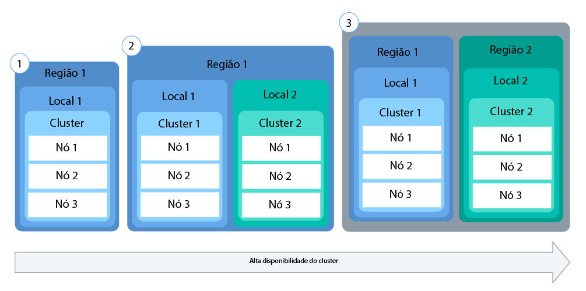
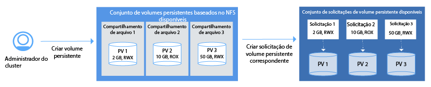

---

copyright:
  years: 2014, 2017
lastupdated: "2017-08-21"

---

{:new_window: target="_blank"}
{:shortdesc: .shortdesc}
{:screen: .screen}
{:pre: .pre}
{:codeblock: .codeblock}
{:table: .aria-labeledby="caption"}
{:codeblock: .codeblock}
{:tip: .tip} 
{:download: .download}


# Configurando clusters
{: #cs_cluster}

Projete sua configuração de cluster para máxima disponibilidade e capacidade.
{:shortdesc}

Antes de iniciar, revise as opções para [configurações de cluster altamente disponível](cs_planning.html#cs_planning_cluster_config).

](https://console.bluemix.net/docs/api/content/containers/images/cs_cluster_ha_roadmap.png)

## Criando clusters com a GUI
{: #cs_cluster_ui}

Um cluster do Kubernetes é um conjunto de nós do trabalhador organizados em uma rede. O propósito do cluster é definir um conjunto de recursos, nós, redes e dispositivos de armazenamento que mantenham os aplicativos altamente disponíveis. Para poder implementar um app, deve-se criar um cluster e configurar as definições para os nós do trabalhador nesse cluster.
{:shortdesc}

Para usuários do {{site.data.keyword.Bluemix_notm}} Dedicated, veja [Criando clusters do Kubernetes por meio da GUI no {{site.data.keyword.Bluemix_notm}} Dedicated (Beta encerrado)](#creating_cli_dedicated) como alternativa.

Para criar um cluster:
1.  No catálogo, selecione **Contêineres** e clique em **Cluster do Kubernetes**.

2.  Para o **Tipo de cluster**, selecione **Padrão**. Com um cluster padrão, você obtém recursos como múltiplos nós do trabalhador para um ambiente altamente disponível.
3.  Insira um **Nome do cluster**.
4.  Selecione uma **Versão do Kubernetes** para usar nos nós do trabalhador. 
5.  Selecione um {{site.data.keyword.Bluemix_notm}} **Local** no qual implementar o cluster. Os locais que estão disponíveis a você dependem da região do {{site.data.keyword.Bluemix_notm}} a que você está conectado. Selecione a região fisicamente mais próxima de você para melhor desempenho. Ao selecionar um local que está localizado fora de seu país, tenha em mente que você pode precisar de autorização legal para que os dados possam ser armazenados fisicamente em um país estrangeiro. A região do {{site.data.keyword.Bluemix_notm}} determina o registro de contêiner que pode ser usado e os serviços do {{site.data.keyword.Bluemix_notm}} que estão disponíveis para você.
6.  Selecione um **Tipo de máquina**. O tipo de máquina define a quantia de CPU e memória virtual que é configurada em cada nó do trabalhador e que está disponível para todos os contêineres que você implementar em seus nós.
    -   O tipo de máquina micro indica a menor opção.
    -   Um tipo de máquina balanceada tem uma quantia igual de memória designada a cada CPU, que otimiza o desempenho.
7.  Escolha o **Número de nós do trabalhador** que você precisa. Selecione 3 para maior disponibilidade de seu cluster.
8.  Selecione uma **VLAN privada** de sua conta do {{site.data.keyword.BluSoftlayer_full}}. Uma VLAN privada é usada para se comunicar entre os nós do trabalhador. É possível usar a mesma VLAN privada para múltiplos clusters.
9. Selecione uma **VLAN pública** de sua conta do {{site.data.keyword.BluSoftlayer_notm}}. Uma VLAN pública é usada para se comunicar entre os nós do trabalhador e o mestre do Kubernetes gerenciado pela IBM. É possível usar a mesma VLAN pública para múltiplos clusters. Se você escolher não selecionar uma VLAN pública, uma solução alternativa deverá ser configurada.
10. Para **Hardware**, escolha **Dedicado** ou **Compartilhado**. **Compartilhado** é uma opção suficiente para a maioria das situações.
    -   **Dedicado**: assegure isolamento completo de seus recursos físicos de outros clientes IBM.
    -   **Compartilhado**: permita que a IBM armazene seus recursos físicos no mesmo hardware de outros clientes IBM.
11. Clique em **Criar Cluster**. Os detalhes para o cluster são abertos, mas os nós do trabalhador no cluster levam alguns minutos para provisão. Na guia **Nós do trabalhador**, é possível ver o progresso da implementação do nó do trabalhador. Quando os nós do trabalhador estão prontos, o estado muda para **Pronto**.

    **Nota:** a cada nó do trabalhador é designado um ID de nó do trabalhador e um nome de domínio exclusivos que não devem ser mudados manualmente após a criação do cluster. Mudar o ID ou o nome do domínio evita que o mestre do Kubernetes gerencie o cluster.


**O que Vem a Seguir?**

Quando o cluster estiver funcionando, será possível verificar as tarefas a seguir:

-   [Instale as CLIs para iniciar o trabalho com seu cluster.](cs_cli_install.html#cs_cli_install)
-   [Implementar um app no cluster.](cs_apps.html#cs_apps_cli)
-   [Configure seu próprio registro privado no {{site.data.keyword.Bluemix_notm}} para armazenar e compartilhar imagens do Docker com outros usuários.](/docs/services/Registry/index.html)

### Criando clusters com a GUI no {{site.data.keyword.Bluemix_notm}} Dedicated (Beta encerrado)
{: #creating_ui_dedicated}

1.  Efetue login no console do {{site.data.keyword.Bluemix_notm}} Public ([https://console.bluemix.net ](https://console.bluemix.net)) com seu IBMid.
2.  No menu de conta, selecione a conta do {{site.data.keyword.Bluemix_notm}} Dedicated. O console é atualizado com os serviços e as informações de sua instância do {{site.data.keyword.Bluemix_notm}} Dedicated.
3.  No catálogo, selecione **Contêineres** e clique em **Cluster do Kubernetes**.
4.  Insira um **Nome do cluster**.
5.  Selecione uma **Versão do Kubernetes** para usar nos nós do trabalhador. 
6.  Selecione um **Tipo de máquina**. O tipo de máquina define a quantia de CPU e memória virtual que é configurada em cada nó do trabalhador e que está disponível para todos os contêineres que você implementar em seus nós.
    -   O tipo de máquina micro indica a menor opção.
    -   Um tipo de máquina balanceada tem uma quantia igual de memória designada a cada CPU, que otimiza o desempenho.
7.  Escolha o **Número de nós do trabalhador** que você precisa. Selecione 3 para assegurar alta disponibilidade de seu cluster.
8.  Clique em **Criar Cluster**. Os detalhes para o cluster são abertos, mas os nós do trabalhador no cluster levam alguns minutos para provisão. Na guia **Nós do trabalhador**, é possível ver o progresso da implementação do nó do trabalhador. Quando os nós do trabalhador estão prontos, o estado muda para **Pronto**.

**O que Vem a Seguir?**

Quando o cluster estiver funcionando, será possível verificar as tarefas a seguir:

-   [Instale as CLIs para iniciar o trabalho com seu cluster.](cs_cli_install.html#cs_cli_install)
-   [Implementar um app no cluster.](cs_apps.html#cs_apps_cli)
-   [Configure seu próprio registro privado no {{site.data.keyword.Bluemix_notm}} para armazenar e compartilhar imagens do Docker com outros usuários.](/docs/services/Registry/index.html)

## Criando clusters com a CLI
{: #cs_cluster_cli}

Um cluster é um conjunto de nós do trabalhador organizados em uma rede. O propósito do cluster é definir um conjunto de recursos, nós, redes e dispositivos de armazenamento que mantenham os aplicativos altamente disponíveis. Para poder implementar um app, deve-se criar um cluster e configurar as definições para os nós do trabalhador nesse cluster.
{:shortdesc}

Para usuários do {{site.data.keyword.Bluemix_notm}} Dedicated, veja [Criando clusters do Kubernetes por meio da CLI no {{site.data.keyword.Bluemix_notm}} Dedicated (Beta encerrado)](#creating_cli_dedicated) como alternativa.

Para criar um cluster:
1.  Instale a CLI do {{site.data.keyword.Bluemix_notm}} e o plug-in do [{{site.data.keyword.containershort_notm}}](cs_cli_install.html#cs_cli_install).
2.  Efetue login na CLI do {{site.data.keyword.Bluemix_notm}}. Insira suas credenciais do {{site.data.keyword.Bluemix_notm}} quando solicitadas.

    ```
    bx login
    ```
    {: pre}

      Para especificar uma região específica do {{site.data.keyword.Bluemix_notm}}, inclua o terminal de API. Se você tem imagens privadas do Docker que estão armazenadas no registro de contêiner de uma região específica do {{site.data.keyword.Bluemix_notm}} ou do serviço das instâncias de serviço do {{site.data.keyword.Bluemix_notm}} que você já criou, efetue login nessa região para acessar as suas imagens e serviços do {{site.data.keyword.Bluemix_notm}}.

      A região do {{site.data.keyword.Bluemix_notm}} na qual você efetuar login também determinará a região em que poderá criar seus clusters do Kubernetes, incluindo os data centers disponíveis. Se não especificar uma região, você será conectado automaticamente à região mais próxima de você.

       -  SUL dos EUA

           ```
           bx login -a api.ng.bluemix.net
           ```
           {: pre}
     
       -  Sydney

           ```
           bx login -a api.au-syd.bluemix.net
           ```
           {: pre}

       -  Alemanha

           ```
           bx login -a api.eu-de.bluemix.net
           ```
           {: pre}

       -  United Kingdom

           ```
           bx login -a api.eu-gb.bluemix.net
           ```
           {: pre}

      **Nota:** se você tiver um ID federado, use `bx login --sso` para efetuar login na CLI do {{site.data.keyword.Bluemix_notm}}. Insira seu nome do usuário e use a URL fornecida na saída da CLI para recuperar sua senha descartável. Você sabe que tem um ID federado quando o login falha sem a opção `--sso` e é bem-sucedido com a opção `--sso`.

3.  Se você estiver designado a múltiplas contas, organizações e espaços do {{site.data.keyword.Bluemix_notm}}, selecione a conta na qual deseja criar seu cluster do Kubernetes. Os clusters são específicos de uma conta e uma organização, mas são independentes de um espaço do {{site.data.keyword.Bluemix_notm}}. Portanto, se você tiver acesso a múltiplos espaços em sua organização, será possível selecionar qualquer espaço da lista.
4.  Opcional: se desejar criar ou acessar clusters do Kubernetes em uma região diferente da região do {{site.data.keyword.Bluemix_notm}} selecionada anteriormente, especifique essa região. Por exemplo, talvez você queira efetuar login em outra região do {{site.data.keyword.containershort_notm}} pelos motivos a seguir:

    -   Você criou serviços do {{site.data.keyword.Bluemix_notm}} ou imagens privadas do Docker em uma região e deseja utilizá-los com o {{site.data.keyword.containershort_notm}} em outra região.
    -   Você deseja acessar um cluster em uma região diferente da região padrão do {{site.data.keyword.Bluemix_notm}} a que está conectado.
    
    Escolha entre os terminais de API a seguir:

    -   Sul dos EUA:

        ```
        bx cs init --host https://us-south.containers.bluemix.net
        ```
        {: pre}

    -   Sul do Reino Unido:

        ```
        bx cs init --host https://uk-south.containers.bluemix.net
        ```
        {: pre}

    -   UE Central:

        ```
        bx cs init --host https://eu-central.containers.bluemix.net
        ```
        {: pre}

    -   Sul da Ásia-Pacífico:

        ```
        bx cs init --host https://ap-south.containers.bluemix.net
        ```
        {: pre}
    
6.  Crie um cluster.
    1.  Revise os locais que estão disponíveis. Os locais mostrados dependem da região do {{site.data.keyword.containershort_notm}} a que você está conectado.

        ```
        bx cs locations
        ```
        {: pre}

        A saída da CLI é semelhante à seguinte:

        -   Sul dos EUA:

            ```
            dal10
            dal12
            ```
            {: screen}

        -   Sul do Reino Unido:

            ```
            lon02
            lon04
            ```
            {: screen}

        -   UE Central:

            ```
            ams03
            fra02
            ```
            {: screen}

        -   Sul da Ásia-Pacífico

            ```
            syd01
            syd02
            ```
            {: screen}

    2.  Escolha um local e revise os tipos de máquina disponíveis nesse local. O tipo de máquina especifica os recursos de cálculo virtual que estão disponíveis para cada nó do trabalhador.

        ```
        bx cs machine-types <location>
        ```
        {: pre}

        ```
        Getting machine types list...
        OK
        Machine Types
        Name         Cores   Memory   Network Speed   OS             Storage   Server Type
        u1c.2x4      2       4GB      1000Mbps        UBUNTU_16_64   100GB     virtual
        b1c.4x16     4       16GB     1000Mbps        UBUNTU_16_64   100GB     virtual
        b1c.16x64    16      64GB     1000Mbps        UBUNTU_16_64   100GB     virtual
        b1c.32x128   32      128GB    1000Mbps        UBUNTU_16_64   100GB     virtual
        b1c.56x242   56      242GB    1000Mbps        UBUNTU_16_64   100GB     virtual
        ```
        {: screen}

    3.  Verifique se uma VLAN pública e privada já existe no {{site.data.keyword.BluSoftlayer_notm}} para essa conta.

        ```
        bx cs vlans <location>
        ```
        {: pre}

        ```
        ID        Name                Number   Type      Router  
        1519999   vlan   1355     private   bcr02a.dal10  
        1519898   vlan   1357     private   bcr02a.dal10 
        1518787   vlan   1252     public   fcr02a.dal10 
        1518888   vlan   1254     public    fcr02a.dal10 
        ```
        {: screen}

        Se uma VLAN pública e privada já existe, observe os roteadores correspondentes. Os roteadores de VLAN privada sempre iniciam com `bcr` (roteador de backend) e roteadores de VLAN pública sempre iniciam com `fcr` (roteador de front-end). A combinação de número e letra após esses prefixos deve corresponder para usar essas VLANs ao criar um cluster. Na saída de exemplo, quaisquer VLANs privadas podem ser usadas com quaisquer VLANs públicas porque todos os roteadores incluem `02a.dal10`.

    4.  Execute o comando `cluster-create`. É possível escolher entre um cluster lite, que inclui um nó do trabalhador configurado com 2vCPU e 4 GB de memória ou um cluster padrão, que pode incluir quantos nós do trabalhador você escolher em sua conta do {{site.data.keyword.BluSoftlayer_notm}}. Ao criar um cluster padrão, o hardware do nó do trabalhador, por padrão, é compartilhado por múltiplos clientes IBM e faturado por horas de uso. </b>Exemplo para um cluster padrão:

        ```
        bx cs cluster-create --location dal10; --public-vlan <public_vlan_id> --private-vlan <private_vlan_id> --machine-type u1c.2x4 --workers 3 --name <cluster_name>
        ```
        {: pre}

        Exemplo para um cluster lite:

        ```
        bx cs cluster-create --name my_cluster
        ```
        {: pre}

        <table>
        <caption>Tabela 1. Entendendo os componentes deste comando</caption>
        <thead>
        <th colspan=2> Entendendo os componentes deste comando</th>
        </thead>
        <tbody>
        <tr>
        <td><code> cluster-create</code></td>
        <td>O comando para criar um cluster na organização do {{site.data.keyword.Bluemix_notm}}.</td> 
        </tr>
        <tr>
        <td><code>--location <em>&lt;location&gt;</em></code></td>
        <td>Substitua <em>&lt;location&gt;</em> pelo ID do local do {{site.data.keyword.Bluemix_notm}} no qual você deseja criar seu cluster. Os locais que estão disponíveis para você dependem da região do {{site.data.keyword.containershort_notm}} em que o login foi efetuado. Os locais disponíveis são:<ul><li>Sul dos EUA<ul><li>dal10 [Dallas]</li><li>dal12 [Dallas]</li></ul></li><li>Sul do Reino Unido<ul><li>lon02 [Londres]</li><li>lon04 [London]</li></ul></li><li>UE Central<ul><li>ams03 [Amsterdã]</li><li>ra02 [Frankfurt]</li></ul></li><li>Sul da Ásia-Pacífico<ul><li>syd01 [Sydney]</li><li>syd04 [Sydney]</li></ul></li></ul></td> 
        </tr>
        <tr>
        <td><code>--machine-type <em>&lt;machine_type&gt;</em></code></td>
        <td>Se você estiver criando um cluster padrão, escolha um tipo de máquina. O tipo de máquina especifica os recursos de cálculo virtual que estão disponíveis para cada nó do trabalhador. Revise [Comparação de clusters lite e padrão do {{site.data.keyword.containershort_notm}}](cs_planning.html#cs_planning_cluster_type) para obter mais informações. Para clusters lite, não é necessário definir o tipo de máquina.</td> 
        </tr>
        <tr>
        <td><code>--public-vlan <em>&lt;public_vlan_id&gt;</em></code></td>
        <td><ul><li>Para clusters lite, não é necessário definir uma VLAN pública. Seu cluster lite é conectado automaticamente a uma VLAN pública pertencente à IBM.</li><li>Para um cluster padrão, se você já tiver uma VLAN pública configurada em sua conta do {{site.data.keyword.BluSoftlayer_notm}} para esse local, insira o ID da VLAN pública. Caso contrário, você não precisará especificar essa opção porque o {{site.data.keyword.containershort_notm}} criará uma VLAN pública automaticamente. <br/><br/><strong>Nota</strong>: as VLANs públicas e privadas especificadas com o comando create devem corresponder. Os roteadores de VLAN privada sempre iniciam com <code>bcr</code> (roteador de backend) e roteadores de VLAN pública sempre iniciam com <code>fcr</code> (roteador de front-end). A combinação de número e letra após esses prefixos deve corresponder para usar essas VLANs ao criar um cluster. Não use VLANs públicas e privadas que não correspondem para criar um cluster.</li></ul></td> 
        </tr>
        <tr>
        <td><code>--private-vlan <em>&lt;private_vlan_id&gt;</em></code></td>
        <td><ul><li>Para clusters lite, não é necessário definir uma VLAN privada. Seu cluster lite é conectado automaticamente a uma VLAN privada pertencente à IBM.</li><li>Para um cluster padrão, se você já tiver uma configuração de VLAN privada em sua conta do {{site.data.keyword.BluSoftlayer_notm}} para esse local, insira o ID da VLAN privada. Caso contrário, você não precisará especificar essa opção porque o {{site.data.keyword.containershort_notm}} criará uma VLAN privada automaticamente. <br/><br/><strong>Nota</strong>: as VLANs públicas e privadas especificadas com o comando create devem corresponder. Os roteadores de VLAN privada sempre iniciam com <code>bcr</code> (roteador de backend) e roteadores de VLAN pública sempre iniciam com <code>fcr</code> (roteador de front-end). A combinação de número e letra após esses prefixos deve corresponder para usar essas VLANs ao criar um cluster. Não use VLANs públicas e privadas que não correspondem para criar um cluster.</li></ul></td> 
        </tr>
        <tr>
        <td><code>--name <em>&lt;name&gt;</em></code></td>
        <td>Substitua <em>&lt;name&gt;</em> por um nome para seu cluster.</td> 
        </tr>
        <tr>
        <td><code>--workers <em>&lt;number&gt;</em></code></td>
        <td>O número de nós do trabalhador a serem incluídos no cluster. Se a opção <code>--workers</code> não for especificada, um nó do trabalhador será criado.</td> 
        </tr>
        </tbody></table>

7.  Verifique se a criação do cluster foi solicitada.

    ```
    bx cs clusters
    ```
    {: pre}

    **Nota:** pode levar até 15 minutos para que as máquinas do nó do trabalhador sejam ordenadas e para que o cluster seja configurado e provisionado em sua conta.

    Quando o fornecimento do cluster é concluído, o status do cluster muda para **implementado**.

    ```
    Name         ID                                   State      Created          Workers
    my_cluster   paf97e8843e29941b49c598f516de72101   deployed   20170201162433   1
    ```
    {: screen}

8.  Verifique o status dos nós do trabalhador.

    ```
    bx cs workers <cluster>
    ```
    {: pre}

    Quando os nós do trabalhador estiverem prontos, o estado mudará para **normal** e o status será **Pronto**. Quando o status do nó for **Pronto**, será possível, então, acessar o cluster.

    **Nota:** a cada nó do trabalhador é designado um ID de nó do trabalhador e um nome de domínio exclusivos que não devem ser mudados manualmente após a criação do cluster. Mudar o ID ou o nome do domínio evita que o mestre do Kubernetes gerencie o cluster.

    ```
    ID                                                  Public IP        Private IP     Machine Type   State      Status  
    prod-dal10-pa8dfcc5223804439c87489886dbbc9c07-w1   169.47.223.113   10.171.42.93   free           normal    Ready
    ```
    {: screen}

9. Configure o cluster criado como o contexto para esta sessão. Conclua estas etapas de configuração toda vez que você trabalhar com o seu cluster.
    1.  Obtenha o comando para configurar a variável de ambiente e fazer download dos arquivos de configuração do Kubernetes.

        ```
        bx cs cluster-config <cluster_name_or_id>
        ```
        {: pre}

        Quando o download dos arquivos de configuração estiver concluído, será exibido um comando que poderá ser usado para configurar o caminho para o seu arquivo de configuração local do Kubernetes como uma variável de ambiente.

        Exemplo para OS X:

        ```
        export KUBECONFIG=/Users/<user_name>/.bluemix/plugins/container-service/clusters/<cluster_name>/kube-config-prod-dal10-<cluster_name>.yml
        ```
        {: screen}

    2.  Copie e cole o comando que é exibido em seu terminal para configurar a variável de ambiente `KUBECONFIG`.
    3.  Verifique se a variável de ambiente `KUBECONFIG` está configurada corretamente.

        Exemplo para OS X:

        ```
        echo $KUBECONFIG
        ```
        {: pre}

        Saída:

        ```
        /Users/<user_name>/.bluemix/plugins/container-service/clusters/<cluster_name>/kube-config-prod-dal10-<cluster_name>.yml
        
        ```
        {: screen}

10. Ative seu painel do Kubernetes com a porta padrão 8001.
    1.  Configure o proxy com o número da porta padrão.

        ```
        kubectl proxy
        ```
        {: pre}

        ```
        Iniciando a entrega em 127.0.0.1:8001
        ```
        {: screen}

    2.  Abra a URL a seguir em um navegador da web para ver o painel do Kubernetes.

        ```
        http://localhost:8001/ui
        ```
        {: codeblock}


**O que Vem a Seguir?**

-   [Implementar um app no cluster.](cs_apps.html#cs_apps_cli)
-   [Gerenciar seu cluster com a linha de comandos de `kubectl`. ](https://kubernetes.io/docs/user-guide/kubectl/)
-   [Configure seu próprio registro privado no {{site.data.keyword.Bluemix_notm}} para armazenar e compartilhar imagens do Docker com outros usuários.](/docs/services/Registry/index.html)

### Criando clusters com a CLI no {{site.data.keyword.Bluemix_notm}} Dedicated (Beta encerrado)
{: #creating_cli_dedicated}

1.  Instale a CLI do {{site.data.keyword.Bluemix_notm}} e o plug-in do [{{site.data.keyword.containershort_notm}}](cs_cli_install.html#cs_cli_install).
2.  Efetue login no terminal público do {{site.data.keyword.containershort_notm}}. Insira suas credenciais do {{site.data.keyword.Bluemix_notm}} e selecione a conta do {{site.data.keyword.Bluemix_notm}} Dedicated quando solicitada.

    ```
    bx login -a api.<region>.bluemix.net
    ```
    {: pre}

    **Nota:** se você tiver um ID federado, use `bx login --sso` para efetuar login na CLI do {{site.data.keyword.Bluemix_notm}}. Insira seu nome do usuário e use a URL fornecida na saída da CLI para recuperar sua senha descartável. Você sabe que tem um ID federado quando o login falha sem a opção `--sso` e é bem-sucedido com a opção `--sso`.

3.  Crie um cluster com o comando `cluster-create`. Ao criar um cluster padrão, o hardware do nó do trabalhador é faturado por horas de uso.

    Exemplo

    ```
    bx cs cluster-create --machine-type <machine-type> --workers <number> --name <cluster_name>
    ```
    {: pre}
    
    <table>
    <caption>Tabela 2. Entendendo os componentes deste comando</caption>
    <thead>
    <th colspan=2> Entendendo os componentes deste comando</th>
    </thead>
    <tbody>
    <tr>
    <td><code> cluster-create</code></td>
    <td>O comando para criar um cluster na organização do {{site.data.keyword.Bluemix_notm}}.</td> 
    </tr>
    <tr>
    <td><code>--location <em>&lt;location&gt;</em></code></td>
    <td>Substitua &lt;location&gt; pelo ID do local do {{site.data.keyword.Bluemix_notm}} no qual você deseja criar seu cluster. Os locais que estão disponíveis para você dependem da região do {{site.data.keyword.containershort_notm}} em que o login foi efetuado. Os locais disponíveis são:<ul><li>Sul dos EUA<ul><li>dal10 [Dallas]</li><li>dal12 [Dallas]</li></ul></li><li>Sul do Reino Unido<ul><li>lon02 [Londres]</li><li>lon04 [London]</li></ul></li><li>UE Central<ul><li>ams03 [Amsterdã]</li><li>ra02 [Frankfurt]</li></ul></li><li>Sul da Ásia-Pacífico<ul><li>syd01 [Sydney]</li><li>syd04 [Sydney]</li></ul></li></ul></td> 
    </tr>
    <tr>
    <td><code>--machine-type <em>&lt;machine_type&gt;</em></code></td>
    <td>Se você estiver criando um cluster padrão, escolha um tipo de máquina. O tipo de máquina especifica os recursos de cálculo virtual que estão disponíveis para cada nó do trabalhador. Revise [Comparação de clusters lite e padrão do {{site.data.keyword.containershort_notm}}](cs_planning.html#cs_planning_cluster_type) para obter mais informações. Para clusters lite, não é necessário definir o tipo de máquina.</td> 
    </tr>
    <tr>
    <td><code>--name <em>&lt;name&gt;</em></code></td>
    <td>Substitua <em>&lt;name&gt;</em> por um nome para seu cluster.</td> 
    </tr>
    <tr>
    <td><code>--workers <em>&lt;number&gt;</em></code></td>
    <td>O número de nós do trabalhador a serem incluídos no cluster. Se a opção <code>--workers</code> não for especificada, um nó do trabalhador será criado.</td> 
    </tr>
    </tbody></table>

4.  Verifique se a criação do cluster foi solicitada.

    ```
    bx cs clusters
    ```
    {: pre}

    **Nota:** pode levar até 15 minutos para que as máquinas do nó do trabalhador sejam ordenadas e para que o cluster seja configurado e provisionado em sua conta.

    Quando o fornecimento do cluster é concluído, o status do cluster muda para **implementado**.

    ```
    Name         ID                                   State      Created          Workers   
    my_cluster   paf97e8843e29941b49c598f516de72101   deployed   20170201162433   1   
    ```
    {: screen}

5.  Verifique o status dos nós do trabalhador.

    ```
    bx cs workers <cluster>
    ```
    {: pre}

    Quando os nós do trabalhador estiverem prontos, o estado mudará para **normal** e o status será **Pronto**. Quando o status do nó for **Pronto**, será possível, então, acessar o cluster.

    ```
    ID                                                  Public IP        Private IP     Machine Type   State      Status  
    prod-dal10-pa8dfcc5223804439c87489886dbbc9c07-w1   169.47.223.113   10.171.42.93   free           normal    Ready
    ```
    {: screen}

6.  Configure o cluster criado como o contexto para esta sessão. Conclua estas etapas de configuração toda vez que você trabalhar com o seu cluster.

    1.  Obtenha o comando para configurar a variável de ambiente e fazer download dos arquivos de configuração do Kubernetes.

        ```
        bx cs cluster-config <cluster_name_or_id>
        ```
        {: pre}

        Quando o download dos arquivos de configuração estiver concluído, será exibido um comando que poderá ser usado para configurar o caminho para o seu arquivo de configuração local do Kubernetes como uma variável de ambiente.

        Exemplo para OS X:

        ```
        export KUBECONFIG=/Users/<user_name>/.bluemix/plugins/container-service/clusters/<cluster_name>/kube-config-prod-dal10-<cluster_name>.yml
        ```
        {: screen}

    2.  Copie e cole o comando que é exibido em seu terminal para configurar a variável de ambiente `KUBECONFIG`.
    3.  Verifique se a variável de ambiente `KUBECONFIG` está configurada corretamente.

        Exemplo para OS X:

        ```
        echo $KUBECONFIG
        ```
        {: pre}

        Saída:

        ```
        /Users/<user_name>/.bluemix/plugins/container-service/clusters/<cluster_name>/kube-config-prod-dal10-<cluster_name>.yml
        
        ```
        {: screen}

7.  Acesse seu painel do Kubernetes com a porta padrão 8001.
    1.  Configure o proxy com o número da porta padrão.

        ```
        kubectl proxy
        ```
        {: pre}

        ```
        Iniciando a entrega em 127.0.0.1:8001
        ```
        {: screen}

    2.  Abra a URL a seguir em um navegador da web para ver o painel do Kubernetes.

        ```
        http://localhost:8001/ui
        ```
        {: codeblock}


**O que Vem a Seguir?**

-   [Implementar um app no cluster.](cs_apps.html#cs_apps_cli)
-   [Gerenciar seu cluster com a linha de comandos de `kubectl`. ](https://kubernetes.io/docs/user-guide/kubectl/)
-   [Configure seu próprio registro privado no {{site.data.keyword.Bluemix_notm}} para armazenar e compartilhar imagens do Docker com outros usuários.](/docs/services/Registry/index.html)

## Usando registros de imagem privada e pública
{: #cs_apps_images}

Uma imagem do Docker é a base para cada contêiner que você cria. Uma imagem é criada por meio de um Dockerfile, que é um arquivo que contém instruções para construir a imagem. Um Dockerfile pode referenciar os artefatos de construção em suas instruções que são armazenadas separadamente, como um app, a configuração do app e suas dependências. As imagens geralmente são armazenadas em um registro que pode ser acessado pelo público (registro público) ou configurado com acesso limitado para um pequeno grupo de usuários (registro privado).
{:shortdesc}

Revise as opções a seguir para localizar informações sobre como configurar um registro de imagem e como usar uma imagem do registro.

-   [Acessando um namespace no {{site.data.keyword.registryshort_notm}} para trabalhar com imagens fornecidas pela IBM e com suas próprias imagens privadas do Docker](#bx_registry_default).
-   [Acessando imagens públicas do Docker Hub](#dockerhub).
-   [Acessando imagens privadas que são armazenadas em outros registros privados](#private_registry).

### Acessando um namespace no {{site.data.keyword.registryshort_notm}} para trabalhar com imagens fornecidas pela IBM e as suas próprias imagens privadas do Docker
{: #bx_registry_default}

É possível implementar contêineres em seu cluster de uma imagem pública fornecida pela IBM ou de uma imagem privada que é armazenada em seu namespace no {{site.data.keyword.registryshort_notm}}.

Antes de iniciar:

-   [Configure um namespace no {{site.data.keyword.registryshort_notm}} no {{site.data.keyword.Bluemix_notm}} Public ou {{site.data.keyword.Bluemix_notm}} Dedicated e envie imagens por push para esse namespace](/docs/services/Registry/registry_setup_cli_namespace.html#registry_namespace_add).
-   [Crie um cluster](#cs_cluster_cli).
-   [Destine sua CLI para seu cluster](cs_cli_install.html#cs_cli_configure).

Ao criar um cluster, um token de registro sem expiração será criado automaticamente para o cluster. Esse token é usado para autorizar acesso somente leitura a qualquer um dos namespaces que você configurar no {{site.data.keyword.registryshort_notm}} para que possa trabalhar com as imagens públicas fornecidas pela IBM e com suas próprias imagens privadas do Docker. Os tokens deverão ser armazenados em um `imagePullSecret` do Kubernetes para que fiquem acessíveis a um cluster do Kubernetes quando você implementar um app conteinerizado. Quando o cluster é criado, o {{site.data.keyword.containershort_notm}} armazena automaticamente esse token em um Kubernetes `imagePullSecret`. O `imagePullSecret` é incluído no namespace padrão do Kubernetes, na lista padrão de segredos na ServiceAccount para esse namespace e no namespace kube-system.

**Nota:** ao usar essa configuração inicial, será possível implementar contêineres de qualquer imagem que estiver disponível em um namespace na conta do {{site.data.keyword.Bluemix_notm}} no namespace **padrão** do cluster. Se você deseja implementar um contêiner em outros namespaces de seu cluster ou se deseja usar uma imagem que está armazenada em outra região do {{site.data.keyword.Bluemix_notm}} ou em outra conta do {{site.data.keyword.Bluemix_notm}}, deve-se [criar seu próprio imagePullSecret para o cluster](#bx_registry_other).

Para implementar um contêiner no namespace **padrão** de seu cluster, crie um script de configuração de implementação.

1.  Abra seu editor preferencial e crie um script de configuração de implementação que seja nomeado <em>mydeployment.yaml</em>.
2.  Defina a implementação e a imagem que você deseja usar por meio de seu namespace no {{site.data.keyword.registryshort_notm}}.

    Para usar uma imagem privada de um namespace no {{site.data.keyword.registryshort_notm}}:

    ```
    apiVersion: extensions/v1beta1
    kind: Deployment
    metadata:
      name: ibmliberty-deployment
    spec:
      replicas: 3
      template:
        metadata:
          labels:
            app: ibmliberty
        spec:
          containers:
          - name: ibmliberty
            image: registry.<region>.bluemix.net/<namespace>/<my_image>:<tag>
    ```
    {: codeblock}

    **Dica:** para recuperar informações de seu namespace, execute `bx cr namespace-list`.

3.  Crie a implementação em seu cluster.

    ```
    kubectl apply -f mydeployment.yaml
    ```
    {: pre}

    **Dica:** também é possível implementar um script de configuração existente, como uma das imagens públicas fornecidas pela IBM. Este exemplo usa a imagem **ibmliberty** na região sul dos EUA.

    ```
    kubectl apply -f https://raw.githubusercontent.com/IBM-{{site.data.keyword.Bluemix_notm}}/kube-samples/master/deploy-apps-clusters/deploy-ibmliberty.yaml
    ```
    {: pre}

### Implementando imagens em outros namespaces do Kubernetes ou acessando imagens em outras regiões e contas do {{site.data.keyword.Bluemix_notm}}
{: #bx_registry_other}

É possível implementar contêineres em outros namespaces do Kubernetes, usar imagens armazenadas em outras regiões ou contas do {{site.data.keyword.Bluemix_notm}} ou usar imagens armazenadas no {{site.data.keyword.Bluemix_notm}} Dedicated criando o seu próprio imagePullSecret.

Antes de iniciar:

1.  [Configure um namespace no {{site.data.keyword.registryshort_notm}} no {{site.data.keyword.Bluemix_notm}} Public ou {{site.data.keyword.Bluemix_notm}} Dedicated e envie imagens por push para esse namespace](/docs/services/Registry/registry_setup_cli_namespace.html#registry_namespace_add).
2.  [Crie um cluster](#cs_cluster_cli).
3.  [Destine sua CLI para seu cluster](cs_cli_install.html#cs_cli_configure).

Para criar seu próprio imagePullSecret:

**Nota:** os ImagePullSecrets são válidos apenas para os namespaces do Kubernetes para os quais foram criados. Repita essas etapas para cada namespace no qual você deseja implementar contêineres de uma imagem privada.

1.  Se você ainda não tiver um token, [crie um token para o registro que você deseja acessar.](/docs/services/Registry/registry_tokens.html#registry_tokens_create)
2.  Liste os tokens disponíveis em sua conta do {{site.data.keyword.Bluemix_notm}}.

    ```
    bx cr token-list
    ```
    {: pre}

3.  Anote o ID de token que você deseja usar.
4.  Recupere o valor para seu token. Substitua <token_id> pelo ID do token que você recuperou na etapa anterior.

    ```
    bx cr token-get <token_id>
    ```
    {: pre}

    Seu valor do token é exibido no campo **Token** de sua saída da CLI.

5.  Crie o segredo do Kubernetes para armazenar suas informações do token.

    ```
    kubectl --namespace <kubernetes_namespace> create secret docker-registry <secret_name>  --docker-server=<registry_url> --docker-username=token --docker-password=<token_value> --docker-email=<docker_email>
    ```
    {: pre}
    
    <table>
    <caption>Tabela 3. Entendendo os componentes deste comando</caption>
    <thead>
    <th colspan=2> Entendendo os componentes deste comando</th>
    </thead>
    <tbody>
    <tr>
    <td><code>--namespace <em>&lt;kubernetes_namespace&gt;</em></code></td>
    <td>Necessário. O namespace do Kubernetes do cluster no qual você deseja usar o segredo e implementar contêineres. Execute <code>kubectl get namespaces</code> para listar todos os namespaces em seu cluster.</td> 
    </tr>
    <tr>
    <td><code><em>&lt;secret_name&gt;</em></code></td>
    <td>Necessário. O nome que você deseja usar para seu imagePullSecret.</td> 
    </tr>
    <tr>
    <td><code>--docker-server <em>&lt;registry_url&gt;</em></code></td>
    <td>Necessário. A URL para o registro de imagem no qual o seu namespace está configurado.<ul><li>Para namespaces configurados no sul dos EUA registry.ng.bluemix.net</li><li>Para namespaces configurados no sul do Reino Unido registry.eu-gb.bluemix.net</li><li>Para namespaces configurados na UE Central (Frankfurt) registry.eu-de.bluemix.net</li><li>Para namespaces configurados na Austrália (Sydney) registry.au-syd.bluemix.net</li><li>Para namespaces configurados no registro do {{site.data.keyword.Bluemix_notm}} Dedicated.<em>&lt;dedicated_domain&gt;</em></li></ul></td> 
    </tr>
    <tr>
    <td><code>--docker-username <em>&lt;docker_username&gt;</em></code></td>
    <td>Necessário. O nome do usuário para efetuar login no seu registro privado.</td> 
    </tr>
    <tr>
    <td><code>--docker-password <em>&lt;token_value&gt;</em></code></td>
    <td>Necessário. O valor do token de registro que você recuperou anteriormente.</td> 
    </tr>
    <tr>
    <td><code>--docker-email <em>&lt;docker-email&gt;</em></code></td>
    <td>Necessário. Se você tiver um, insira seu endereço de e-mail do Docker. Se não tiver um, insira um endereço de e-mail fictício, por exemplo a@b.c. Esse e-mail é obrigatório para criar um segredo do Kubernetes, mas não é usado após a criação.</td> 
    </tr>
    </tbody></table>

6.  Verifique se o segredo foi criado com êxito. Substitua <em>&lt;kubernetes_namespace&gt;</em> pelo nome do namespace no qual você criou o imagePullSecret.

    ```
    kubectl get secrets --namespace <kubernetes_namespace>
    ```
    {: pre}

7.  Crie um pod que referencie o imagePullSecret.
    1.  Abra seu editor preferencial e crie um script de configuração de pod chamado mypod.yaml.
    2.  Defina o pod e o imagePullSecret que você deseja usar para acessar o registro privado do {{site.data.keyword.Bluemix_notm}}. Para usar uma imagem privada de um namespace:

        ```
        apiVersion: v1
        kind: Pod
        metadata:
          name: <pod_name>
        spec:
          containers:
            - name: <container_name>
              image: registry.<region>.bluemix.net/<my_namespace>/<my_image>:<tag>  
          imagePullSecrets:
            - name: <secret_name>
        ```
        {: codeblock}

        <table>
        <caption>Tabela 4. Entendendo os componentes de arquivo YAML</caption>
        <thead>
        <th colspan=2> Entendendo os componentes de arquivo YAML</th>
        </thead>
        <tbody>
        <tr>
        <td><code><em>&lt;container_name&gt;</em></code></td>
        <td>O nome do contêiner que você deseja implementar em seu cluster.</td> 
        </tr>
        <tr>
        <td><code><em>&lt;secret_name&gt;</em></code></td>
        <td>O namespace no qual sua imagem está armazenada. Para listar os namespaces disponíveis, execute `bx cr namespace-list`.</td> 
        </tr>
        <tr>
        <td><code><em>&lt;my_namespace&gt;</em></code></td>
        <td>O namespace no qual sua imagem está armazenada. Para listar os namespaces disponíveis, execute `bx cr namespace-list`.</td> 
        </tr>
        <tr>
        <td><code><em>&lt;my_image&gt;</em></code></td>
        <td>O nome da imagem que você deseja usar. Para listar as imagens disponíveis em uma conta do {{site.data.keyword.Bluemix_notm}}, execute `bx cr image-list`.</td> 
        </tr>
        <tr>
        <td><code><em>&lt;tag&gt;</em></code></td>
        <td>A versão da imagem que você deseja usar. Se nenhuma tag for especificada, a imagem identificada como <strong>mais recente</strong> será usada por padrão.</td> 
        </tr>
        <tr>
        <td><code><em>&lt;secret_name&gt;</em></code></td>
        <td>O nome do imagePullSecret que você criou anteriormente.</td> 
        </tr>
        </tbody></table>

   3.  Salve as suas mudanças.
   4.  Crie a implementação em seu cluster.

        ```
        kubectl apply -f mypod.yaml
        ```
        {: pre}


### Acessando imagens públicas do Docker Hub
{: #dockerhub}

É possível usar qualquer imagem pública que esteja armazenada no Docker Hub para implementar um contêiner em seu cluster sem nenhuma configuração adicional. Crie um arquivo de script de configuração de implementação ou implemente um existente.

Antes de iniciar:

1.  [Crie um cluster](#cs_cluster_cli).
2.  [Destine sua CLI para seu cluster](cs_cli_install.html#cs_cli_configure).

Crie um script de configuração de implementação.

1.  Abra seu editor preferencial e crie um script de configuração de implementação chamado mydeployment.yaml.
2.  Defina a implementação e a imagem pública do Docker Hub que você deseja usar. O script de configuração a seguir usa a imagem pública NGINX disponível no Docker Hub.

    ```
    apiVersion: extensions/v1beta1
    kind: Deployment
    metadata:
      name: nginx-deployment
    spec:
      replicas: 3
      template:
        metadata:
          labels:
            app: nginx
        spec:
          containers:
          - name: nginx
            image: nginx
    ```
    {: codeblock}

3.  Crie a implementação em seu cluster.

    ```
    kubectl apply -f mydeployment.yaml
    ```
    {: pre}

    **Dica:** como alternativa, implemente um script de configuração existente. O exemplo a seguir usa a mesma imagem NGINX pública, mas a aplica diretamente em seu cluster.

    ```
    kubectl apply -f https://raw.githubusercontent.com/IBM-{{site.data.keyword.Bluemix_notm}}/kube-samples/master/deploy-apps-clusters/deploy-nginx.yaml
    ```
    {: pre}


### Acessando imagens privadas que são armazenadas em outros registros privados
{: #private_registry}

Se você já tem um registro privado que deseja usar, deve-se armazenar as credenciais de registro em um imagePullSecret do Kubernetes e referenciar esse segredo em seu script de configuração.

Antes de iniciar:

1.  [Crie um cluster](#cs_cluster_cli).
2.  [Destine sua CLI para seu cluster](cs_cli_install.html#cs_cli_configure).

Para criar um imagePullSecret, siga estas etapas.

**Nota:** os ImagePullSecrets são válidos para os namespaces do Kubernetes para os quais foram criados. Repita essas etapas para cada namespace no qual você deseja implementar contêineres de uma imagem em um registro privado do {{site.data.keyword.Bluemix_notm}}.

1.  Crie o segredo do Kubernetes para armazenar suas credenciais de registro privado.

    ```
    kubectl --namespace <kubernetes_namespace> create secret docker-registry <secret_name>  --docker-server=<registry_url> --docker-username=<docker_username> --docker-password=<docker_password> --docker-email=<docker_email>
    ```
    {: pre}
    
    <table>
    <caption>Tabela 5. Entendendo os componentes deste comando</caption>
    <thead>
    <th colspan=2> Entendendo os componentes deste comando</th>
    </thead>
    <tbody>
    <tr>
    <td><code>--namespace <em>&lt;kubernetes_namespace&gt;</em></code></td>
    <td>Necessário. O namespace do Kubernetes do cluster no qual você deseja usar o segredo e implementar contêineres. Execute <code>kubectl get namespaces</code> para listar todos os namespaces em seu cluster.</td> 
    </tr>
    <tr>
    <td><code><em>&lt;secret_name&gt;</em></code></td>
    <td>Necessário. O nome que você deseja usar para seu imagePullSecret.</td> 
    </tr>
    <tr>
    <td><code>--docker-server <em>&lt;registry_url&gt;</em></code></td>
    <td>Necessário. A URL para o registro no qual as imagens privadas são armazenadas.</td> 
    </tr>
    <tr>
    <td><code>--docker-username <em>&lt;docker_username&gt;</em></code></td>
    <td>Necessário. O nome do usuário para efetuar login no seu registro privado.</td> 
    </tr>
    <tr>
    <td><code>--docker-password <em>&lt;token_value&gt;</em></code></td>
    <td>Necessário. O valor do token de registro que você recuperou anteriormente.</td> 
    </tr>
    <tr>
    <td><code>--docker-email <em>&lt;docker-email&gt;</em></code></td>
    <td>Necessário. Se você tiver um, insira seu endereço de e-mail do Docker. Se não tiver um, insira um endereço de e-mail fictício, por exemplo a@b.c. Esse e-mail é obrigatório para criar um segredo do Kubernetes, mas não é usado após a criação.</td> 
    </tr>
    </tbody></table>

2.  Verifique se o segredo foi criado com êxito. Substitua <em>&lt;kubernetes_namespace&gt;</em> pelo nome do namespace no qual você criou o imagePullSecret.

    ```
    kubectl get secrets --namespace <kubernetes_namespace>
    ```
    {: pre}

3.  Crie um pod que referencie o imagePullSecret.
    1.  Abra seu editor preferencial e crie um script de configuração de pod chamado mypod.yaml.
    2.  Defina o pod e o imagePullSecret que você deseja usar para acessar o registro privado do {{site.data.keyword.Bluemix_notm}}. Para usar uma imagem privada do seu registro privado:

        ```
        apiVersion: v1
        kind: Pod
        metadata:
          name: <pod_name>
        spec:
          containers:
            - name: <container_name>
              image: <my_image>:<tag>  
          imagePullSecrets:
            - name: <secret_name>
        ```
        {: codeblock}

        <table>
        <caption>Tabela 6. Entendendo os componentes de arquivo YAML</caption>
        <thead>
        <th colspan=2> Entendendo os componentes de arquivo YAML</th>
        </thead>
        <tbody>
        <tr>
        <td><code><em>&lt;pod_name&gt;</em></code></td>
        <td>O nome do pod que você deseja criar.</td> 
        </tr>
        <tr>
        <td><code><em>&lt;container_name&gt;</em></code></td>
        <td>O nome do contêiner que você deseja implementar em seu cluster.</td> 
        </tr>
        <tr>
        <td><code><em>&lt;my_image&gt;</em></code></td>
        <td>O caminho completo para a imagem em seu registro privado que você deseja usar.</td> 
        </tr>
        <tr>
        <td><code><em>&lt;tag&gt;</em></code></td>
        <td>A versão da imagem que você deseja usar. Se nenhuma tag for especificada, a imagem identificada como <strong>mais recente</strong> será usada por padrão.</td> 
        </tr>
        <tr>
        <td><code><em>&lt;secret_name&gt;</em></code></td>
        <td>O nome do imagePullSecret que você criou anteriormente.</td> 
        </tr>
        </tbody></table>

  3.  Salve as suas mudanças.
  4.  Crie a implementação em seu cluster.

        ```
        kubectl apply -f mypod.yaml
        ```
        {: pre}


## Incluindo serviços do {{site.data.keyword.Bluemix_notm}} nos clusters
{: #cs_cluster_service}

Incluindo uma instância de serviço existente do {{site.data.keyword.Bluemix_notm}} em seu cluster para permitir que os usuários do cluster acessem e usem o serviço do {{site.data.keyword.Bluemix_notm}} ao implementarem um app no cluster.
{:shortdesc}

Antes de iniciar:

-   [Destine sua CLI](cs_cli_install.html#cs_cli_configure) para seu cluster.
-   [Solicite uma instância do serviço do {{site.data.keyword.Bluemix_notm}}](/docs/services/reqnsi.html#req_instance) em seu espaço para incluir em seu cluster.
-   Para usuários do {{site.data.keyword.Bluemix_notm}} Dedicated, veja [Incluindo serviços do {{site.data.keyword.Bluemix_notm}} em clusters no {{site.data.keyword.Bluemix_notm}} Dedicated (Beta encerrado)](#binding_dedicated) como alternativa.

**Nota:** só será possível incluir serviços do {{site.data.keyword.Bluemix_notm}} que suportem chaves de serviço (role para a seção [Ativando apps externos para usar serviços do {{site.data.keyword.Bluemix_notm}}](/docs/services/reqnsi.html#req_instance)).

Para incluir um serviço:
2.  Liste todos os serviços existentes em seu espaço do {{site.data.keyword.Bluemix_notm}}.

    ```
    bx service list
    ```
    {: pre}

    Exemplo de saída da CLI:

    ```
    name                      service           plan    bound apps   last operation   
    <service_instance_name>   <service_name>    spark                create succeeded
    ```
    {: screen}

3.  Anote o **nome** da instância de serviço que você deseja incluir em seu cluster.
4.  Identifique o espaço de nomes de cluster que você deseja usar para incluir o seu serviço. Escolha entre as opções a seguir.
    -   Liste os namespaces existentes e escolha um namespace que você deseja usar.

        ```
        kubectl get namespaces
        ```
        {: pre}

    -   Crie um novo namespace no cluster.

        ```
        kubectl create namespace <namespace_name>
        ```
        {: pre}

5.  Inclua o serviço em seu cluster.

    ```
    bx cs cluster-service-bind <cluster_name_or_id> <namespace> <service_instance_name>
    ```
    {: pre}

    Quando o serviço é incluído com sucesso em seu cluster, é criado um segredo de cluster que contém as credenciais de sua instância de serviço. Exemplo de saída da CLI:

    ```
    bx cs cluster-service-bind mycluster mynamespace cleardb 
    Binding service instance to namespace...
    OK
    Namespace: mynamespace
    Secret name:     binding-<service_instance_name>
    ```
    {: screen}

6.  Verifique se o segredo foi criado no namespace do cluster.

    ```
    kubectl get secrets --namespace=<namespace>
    ```
    {: pre}


Para usar o serviço em um pod implementado no cluster, os usuários do cluster poderão acessar as credenciais de serviço do serviço do {{site.data.keyword.Bluemix_notm}} [montando o segredo do Kubernetes como um volume de segredo para um pod](cs_apps.html#cs_apps_service).

### Incluindo serviços do {{site.data.keyword.Bluemix_notm}} em clusters no {{site.data.keyword.Bluemix_notm}} Dedicated (Beta encerrado)
{: #binding_dedicated}

Antes de iniciar, [solicite uma instância do serviço do {{site.data.keyword.Bluemix_notm}}](/docs/services/reqnsi.html#req_instance) em seu espaço para incluir em seu cluster.

1.  Efetue login no ambiente do {{site.data.keyword.Bluemix_notm}} Dedicated no qual a instância de serviço foi criada.

    ```
    bx login -a api.<dedicated_domain>
    ```
    {: pre}

2.  Liste todos os serviços existentes em seu espaço do {{site.data.keyword.Bluemix_notm}}.

    ```
    bx service list
    ```
    {: pre}

    Exemplo de saída da CLI:

    ```
    name                      service           plan    bound apps   last operation   
    <service_instance_name>   <service_name>    spark                create succeeded
    ```
    {: screen}

3.  Crie uma chave de credenciais de serviço que contenha a informação confidencial sobre o serviço, como o nome do usuário, a senha e a URL.

    ```
    bx service key-create <service_name> <service_key_name>
    ```
    {: pre}

4.  Use a chave de credenciais de serviço para criar um arquivo JSON em seu computador que inclua a informação confidencial sobre o serviço.

    ```
    bx service key-show <service_name> <service_key_name>| sed -n '/{/,/}/'p >> /filepath/<dedicated-service-key>.json
    ```
    {: pre}

5.  Efetue login no terminal público do {{site.data.keyword.containershort_notm}} e direcione sua CLI para o cluster no ambiente do {{site.data.keyword.Bluemix_notm}} Dedicated.
    1.  Efetue login na conta usando o terminal público do {{site.data.keyword.containershort_notm}}. Insira suas credenciais do {{site.data.keyword.Bluemix_notm}} e selecione a conta do {{site.data.keyword.Bluemix_notm}} Dedicated quando solicitada.

        ```
        bx login -a api.ng.bluemix.net
        ```
        {: pre}

        **Nota:** se você tiver um ID federado, use `bx login --sso` para efetuar login na CLI do {{site.data.keyword.Bluemix_notm}}. Insira seu nome do usuário e use a URL fornecida na saída da CLI para recuperar sua senha descartável. Você sabe que tem um ID federado quando o login falha sem a opção `--sso` e é bem-sucedido com a opção `--sso`.

    2.  Obtenha uma lista de clusters disponíveis e identifique o nome do cluster a ser destinado em sua CLI.

        ```
        bx cs clusters
        ```
        {: pre}

    3.  Obtenha o comando para configurar a variável de ambiente e fazer download dos arquivos de configuração do Kubernetes.

        ```
        bx cs cluster-config <cluster_name_or_id>
        ```
        {: pre}

        Quando o download dos arquivos de configuração estiver concluído, será exibido um comando que poderá ser usado para configurar o caminho para o seu arquivo de configuração local do Kubernetes como uma variável de ambiente.

        Exemplo para OS X:

        ```
        export KUBECONFIG=/Users/<user_name>/.bluemix/plugins/container-service/clusters/<cluster_name>/kube-config-prod-dal10-<cluster_name>.yml
        ```
        {: screen}

    4.  Copie e cole o comando que é exibido em seu terminal para configurar a variável de ambiente `KUBECONFIG`.
6.  Crie um segredo do Kubernetes por meio do arquivo JSON de credenciais de serviço.

    ```
    kubectl create secret generic <secret_name> --from-file=/filepath/<dedicated-service-key>.json
    ```
    {: pre}

7.  Repita essas etapas para cada serviço do {{site.data.keyword.Bluemix_notm}} que desejar usar.

O serviço do {{site.data.keyword.Bluemix_notm}} é ligado ao cluster e poderá ser usado por qualquer pod implementado nesse cluster. Para usar o serviço em um pod, os usuários do cluster podem [montar o segredo do Kubernetes como um volume de segredo no pod](cs_apps.html#cs_apps_service) para acessar as credenciais de serviço do serviço do {{site.data.keyword.Bluemix_notm}}.


## Gerenciando o acesso ao cluster
{: #cs_cluster_user}

É possível conceder acesso a seu cluster para outros usuários, para que eles possam acessar o cluster, gerenciar o cluster e implementar apps no cluster.
{:shortdesc}

Cada usuário que trabalha com o {{site.data.keyword.containershort_notm}} deve ser designado a uma função de usuário específica do serviço no Identity and Access Management que determina quais ações esse usuário pode executar. O Identity and Access Management diferencia entre as permissões de acesso a seguir.

-   Políticas de acesso do {{site.data.keyword.containershort_notm}}

    As políticas de acesso determinam as ações de gerenciamento de cluster que é possível executar em um cluster, como criar ou remover clusters e incluir ou remover nós do trabalhador extras.

<!-- If you want to prevent a user from deploying apps to a cluster or creating other Kubernetes resources, you must create RBAC policies for the cluster. -->

-   Funções do Cloud Foundry

    Cada usuário deve ser designado a uma função de usuário do Cloud Foundry. Essa função determina as ações que o usuário pode executar na conta do {{site.data.keyword.Bluemix_notm}}, como convidar outros usuários ou visualizar o uso de cota. Para revisar as permissões de cada função, veja [Funções do Cloud Foundry](/docs/iam/users_roles.html#cfroles).

-   Funções do RBAC

    Cada usuário que é designado a uma política de acesso do {{site.data.keyword.containershort_notm}} é designado automaticamente a uma função RBAC. As funções RBAC determinam as ações que é possível executar em recursos do Kubernetes dentro do cluster. As funções RBAC são configuradas somente para o namespace padrão. O administrador de cluster pode incluir funções RBAC para outros namespaces no cluster. Veja [Usando a autorização RBAC ](https://kubernetes.io/docs/admin/authorization/rbac/#api-overview) na documentação do Kubernetes para obter mais informações.


Escolha entre as ações a seguir para continuar:

-   [Visualizar políticas e permissões de acesso necessárias para trabalhar com clusters](#access_ov).
-   [Visualizar sua política de acesso atual](#view_access).
-   [Mudar a política de acesso de um usuário existente](#change_access).
-   [Incluir usuários adicionais na conta do {{site.data.keyword.Bluemix_notm}}](#add_users).

### Visão geral de políticas e permissões de acesso necessárias do {{site.data.keyword.containershort_notm}}
{: #access_ov}

Revise as políticas e permissões de acesso que é possível conceder aos usuários em sua conta do {{site.data.keyword.Bluemix_notm}}.

|Política de acesso|Permissões de gerenciamento de cluster|Permissões de recurso do Kubernetes|
|-------------|------------------------------|-------------------------------|
|<ul><li>Função: Administrador</li><li>Instâncias de serviço: todas as instâncias de serviço atuais</li></ul>|<ul><li>Criar um cluster lite ou padrão</li><li>Configurar credenciais para uma conta do {{site.data.keyword.Bluemix_notm}} para acessar o portfólio do {{site.data.keyword.BluSoftlayer_notm}}</li><li>Remover um Cluster</li><li>Designar e mudar as políticas de acesso do {{site.data.keyword.containershort_notm}} para outros usuários existentes nessa conta.</li></ul><br/>Essa função herda permissões do Editor, do Operador e funções do Visualizador para todos os clusters nessa conta.|<ul><li>Função RBAC: cluster-admin</li><li>Acesso de leitura/gravação para recursos em cada namespace</li><li>Criar funções dentro de um namespace</li></ul>|
|<ul><li>Função: Administrador</li><li>Instâncias de serviço: um ID de cluster específico</li></ul>|<ul><li>Remover um cluster específico.</li></ul><br/>Essa função herda permissões do Editor, do Operador e funções Visualizador para o cluster selecionado.|<ul><li>Função RBAC: cluster-admin</li><li>Acesso de leitura/gravação para recursos em cada namespace</li><li>Criar funções dentro de um namespace</li><li>Acessar o painel do Kubernetes</li></ul>|
|<ul><li>Função: Operador</li><li>Instâncias de serviço: todas as instâncias de serviço atuais/um ID do cluster específico</li></ul>|<ul><li>Incluir nós do trabalhador adicionais em um cluster</li><li>Remover nós do trabalhador de um cluster</li><li>Reinicializar um nó do trabalhador</li><li>Recarregar um nó do trabalhador</li><li>Incluir uma sub-rede em um cluster</li></ul>|<ul><li>Função do RBAC: administrador</li><li>Acesso de leitura/gravação para recursos dentro do namespace padrão, mas não no próprio namespace</li><li>Criar funções dentro de um namespace</li></ul>|
|<ul><li>Função: editor</li><li>Instâncias de serviço: todas as instâncias de serviço atuais/um ID do cluster específico</li></ul>|<ul><li>Ligar um serviço do {{site.data.keyword.Bluemix_notm}} a um cluster.</li><li>Desvincular um serviço do {{site.data.keyword.Bluemix_notm}} para um cluster.</li><li>Criar um webhook.</li></ul><br/>Use essa função para seus desenvolvedores de aplicativo.|<ul><li>Funções RBAC: editar</li><li>Acesso de leitura/gravação para recursos dentro do namespace padrão</li></ul>|
|<ul><li>Função: visualizador</li><li>Instâncias de serviço: todas as instâncias de serviço atuais/um ID do cluster específico</li></ul>|<ul><li>Listar um cluster</li><li>Visualizar detalhes para um cluster</li></ul>|<ul><li>Funções RBAC: visualização</li><li>Acesso de leitura para recursos dentro do namespace padrão</li><li>Nenhum acesso de leitura para segredos do Kubernetes</li></ul>|
|<ul><li>Função de organização do Cloud Foundry: gerenciador</li></ul>|<ul><li>Incluir usuários adicionais em uma conta do {{site.data.keyword.Bluemix_notm}}</li></ul>||
|<ul><li>Função de espaço do Cloud Foundry: desenvolvedor</li></ul>|<ul><li>Criar {{site.data.keyword.Bluemix_notm}} instâncias de serviço/li><li>Ligar instâncias de serviço do {{site.data.keyword.Bluemix_notm}} a clusters</li></ul>||
{: caption="Tabela 7. Visão geral de políticas e permissões de acesso necessárias do IBM Bluemix Container Service" caption-side="top"}

### Verificando sua política de acesso do {{site.data.keyword.containershort_notm}}
{: #view_access}

É possível revisar e verificar sua política de acesso designada para o {{site.data.keyword.containershort_notm}}. A política de acesso determina as ações de gerenciamento de cluster que é possível executar.

1.  Selecione a conta do {{site.data.keyword.Bluemix_notm}} na qual você deseja verificar sua política de acesso do {{site.data.keyword.containershort_notm}}.
2.  Na barra de menus, clique em **Gerenciar** > **Segurança** > **Identidade e acesso**. A janela **Usuários** exibe uma lista de usuários com seus endereços de e-mail e status atual para a conta selecionada.
3.  Selecione o usuário para o qual você deseja verificar a política de acesso.
4.  Na seção **Políticas de serviço**, revise a política de acesso para o usuário. Para localizar informações detalhadas sobre as ações que podem ser executadas com essa função, veja [Visão Geral de políticas e permissões de acesso necessárias do {{site.data.keyword.containershort_notm}}](#access_ov).
5.  Opcional: [Mude sua política de acesso atual](#change_access).

    **Nota:** apenas usuários com uma política de serviço de Administrador designada para todos os recursos no {{site.data.keyword.containershort_notm}} pode mudar a política de acesso para um usuário existente. Para incluir usuários adicionais em uma conta do {{site.data.keyword.Bluemix_notm}}, deve-se ter a função de Gerenciador do Cloud Foundry para a conta. Para localizar o ID do proprietário da conta do {{site.data.keyword.Bluemix_notm}}, execute `bx iam accounts` e procure o **ID do usuário do proprietário**.


### Mudando a política de acesso do {{site.data.keyword.containershort_notm}} para um usuário existente
{: #change_access}

É possível mudar a política de acesso para um usuário existente para conceder permissões de gerenciamento de cluster para um cluster em sua conta do {{site.data.keyword.Bluemix_notm}}.

Antes de iniciar, [verifique se você foi designado à política de acesso de Administrador](#view_access) para todos os recursos no {{site.data.keyword.containershort_notm}}.

1.  Selecione a conta do {{site.data.keyword.Bluemix_notm}} na qual você deseja mudar a política de acesso do {{site.data.keyword.containershort_notm}} para um usuário existente.
2.  Na barra de menus, clique em **Gerenciar** > **Segurança** > **Identidade e acesso**. A janela **Usuários** exibe uma lista de usuários com seus endereços de e-mail e status atual para a conta selecionada.
3.  Localize o usuário para quem você deseja mudar a política de acesso. Se você não localizar o usuário que está procurando, [convide esse usuário para a conta do {{site.data.keyword.Bluemix_notm}}](#add_users).
4.  Na guia **Ações**, clique em **Designar política**.
5.  Na lista suspensa **Serviço**, selecione **{{site.data.keyword.containershort_notm}}**.
6.  Na lista suspensa **Funções**, selecione a política de acesso que deseja designar. Selecionar uma função sem limitações em uma região ou um cluster específico aplica automaticamente essa política de acesso a todos os clusters que foram criados nessa conta. Se você deseja limitar o acesso a um determinado cluster ou região, selecione-os na lista suspensa **Instância de serviço** e **Região**. Para localizar uma lista de ações suportadas por política de acesso, veja [Visão geral das políticas de acesso e permissões necessárias do {{site.data.keyword.containershort_notm}}](#access_ov). Para localizar o ID de um cluster específico, execute `bx cs clusters`.
7.  Clique em **Designar política** para salvar suas mudanças.

### Incluindo usuários em uma conta do {{site.data.keyword.Bluemix_notm}}
{: #add_users}

É possível incluir usuários adicionais em uma conta {{site.data.keyword.Bluemix_notm}} para conceder acesso aos seus clusters.

Antes de iniciar, verifique se você foi designado à função Gerenciador do Cloud Foundry para uma conta do {{site.data.keyword.Bluemix_notm}}.

1.  Selecione a conta do {{site.data.keyword.Bluemix_notm}} na qual deseja incluir usuários.
2.  Na barra de menus, clique em **Gerenciar** > **Segurança** > **Identidade e acesso**. A janela Usuários exibe uma lista de usuários com seus endereços de e-mail e o status atual para a conta selecionada.
3.  Clique em **Convidar usuários**.
4.  No **Endereço de e-mail ou IBMid existente**, insira o endereço de e-mail do usuário que você deseja incluir na conta do {{site.data.keyword.Bluemix_notm}}.
5.  Na seção **Acesso**, expanda **Serviços ativados por identidade e acesso**.
6.  Na lista suspensa **Serviços**, selecione **{{site.data.keyword.containershort_notm}}**.
7.  Na lista suspensa **Funções**, selecione a política de acesso que você deseja designar. Selecionar uma função sem limitações em uma região ou cluster específico automaticamente aplica essa política de acesso a todos os clusters que foram criados nessa conta. Se você deseja limitar o acesso a um determinado cluster ou região, selecione-os na lista suspensa **Instância de serviço** e **Região**. Para localizar uma lista de ações suportadas por política de acesso, veja [Visão geral das políticas de acesso e permissões necessárias do {{site.data.keyword.containershort_notm}}](#access_ov). Para localizar o ID de um cluster específico, execute `bx cs clusters`.
8.  Expanda a seção **Acesso ao Cloud Foundry** e selecione a organização do {{site.data.keyword.Bluemix_notm}} na lista suspensa **Organização** na qual você deseja incluir o usuário.
9.  Na lista suspensa **Funções de espaço**, selecione qualquer função. Os clusters do Kubernetes são independentes de espaços do {{site.data.keyword.Bluemix_notm}}. Para permitir que esse usuário inclua usuários adicionais em uma conta do {{site.data.keyword.Bluemix_notm}}, deve-se designar ao usuário uma **Função de organização** do Cloud Foundry. No entanto, é possível designar funções de organização do Cloud Foundry somente em uma etapa posterior.
10. Clique em **Convidar usuários**.
11. Opcional: na visão geral **Usuários**, na guia **Ações**, selecione **Gerenciar usuário**.
12. Opcional: na seção **Funções do Cloud Foundry**, localize a função de organização do Cloud Foundry que foi concedida ao usuário incluído nas etapas anteriores.
13. Opcional: na guia **Ações**, selecione **Editar função de organização**.
14. Opcional: na lista suspensa **Funções de organização**, selecione **Gerenciador**.
15. Opcional: clique em **Salvar função**.

## Incluindo sub-redes nos clusters
{: #cs_cluster_subnet}

Mude o conjunto de endereços IP públicos móveis disponíveis, incluindo sub-redes em seu cluster.
{:shortdesc}

No {{site.data.keyword.containershort_notm}}, é possível incluir IPs móveis estáveis para serviços do Kubernetes, incluindo sub-redes da rede no cluster. Ao criar um cluster padrão, o {{site.data.keyword.containershort_notm}} provisiona automaticamente uma sub-rede e 5 endereços IP públicos móveis. Os endereços IP públicos móveis são estáticos e não mudam quando um nó do trabalhador ou até mesmo o cluster, é removido.

Um dos endereços IP públicos móveis é usado para o [Controlador de ingresso](cs_apps.html#cs_apps_public_ingress), que pode ser usado para expor múltiplos apps em seu cluster usando uma rota pública. Os outros 4 endereços IP públicos móveis podem ser usados para expor apps únicos ao público [criando um serviço de balanceador de carga](cs_apps.html#cs_apps_public_load_balancer).

**Nota:** os endereços IP públicos móveis são cobrados mensalmente. Se escolher remover os endereços IP públicos móveis depois que o cluster for provisionado, ainda assim terá que pagar o encargo mensal, mesmo se você os usou por um curto tempo.

### Solicitando sub-redes adicionais para seu cluster
{: #add_subnet}

É possível incluir IPs públicos móveis estáveis no cluster designando sub-redes para o cluster.

Para usuários do {{site.data.keyword.Bluemix_notm}} Dedicated, em vez de usar essa tarefa, deve-se [abrir um chamado de suporte](/docs/support/index.html#contacting-support) para criar a sub-rede e, em seguida, usar o comando [`bx cs cluster-subnet-add`](cs_cli_reference.html#cs_cluster_subnet_add) para incluir a sub-rede no cluster.

Antes de iniciar, certifique-se de que é possível acessar o portfólio do {{site.data.keyword.BluSoftlayer_notm}} por meio da GUI do {{site.data.keyword.Bluemix_notm}}. Para acessar o portfólio, deve-se configurar ou usar uma conta Pay-As-You-Go existente do {{site.data.keyword.Bluemix_notm}}.

1.  No catálogo, na seção **Infraestrutura**, selecione **Rede**.
2.  Selecione **Sub-rede/IPs** e clique em **Criar**.
3.  No menu suspenso **Selecionar o tipo de sub-rede para incluir nesta conta**, selecione **Público móvel**.
4.  Selecione o número de endereços IP que você deseja incluir de sua sub-rede móvel.

    **Nota:** quando você inclui endereços IP públicos móveis para sua sub-rede, 3 endereços IP são usados para estabelecer a rede interna do cluster, para que não seja possível utilizá-los para o controlador de Ingresso ou para criar um serviço de balanceador de carga. Por exemplo, se você solicitar 8 endereços IP públicos móveis, será possível usar 5 deles para expor os seus apps ao público.

5.  Selecione a VLAN pública para a qual você deseja rotear os endereços IP públicos móveis. Deve-se selecionar a VLAN pública à qual um nó do trabalhador existente está conectado. Revise a VLAN pública de um nó do trabalhador.

    ```
    bx cs worker-get <worker_id>
    ```
    {: pre}

6.  Preencha o questionário e clique em **Fazer pedido**.

    **Nota:** os endereços IP públicos móveis são cobrados mensalmente. Se você escolher remover os endereços IP públicos móveis após criá-los, ainda assim deve-se pagar o encargo mensal, mesmo se os tiver usado somente parte do mês.
<!-- removed conref to test bx login -->
7.  Após a sub-rede ser provisionada, torne a sub-rede disponível para seu cluster do Kubernetes.
    1.  No painel Infraestrutura, selecione a sub-rede criada e anote o ID da sub-rede.
    2.  Efetue login na CLI do {{site.data.keyword.Bluemix_notm}}.

        ```
        bx login
        ```
        {: pre}

        Para especificar uma região específica do {{site.data.keyword.Bluemix_notm}}, escolha um dos terminais de API a seguir:

       -  SUL dos EUA

           ```
           bx login -a api.ng.bluemix.net
           ```
           {: pre}
     
       -  Sydney

           ```
           bx login -a api.au-syd.bluemix.net
           ```
           {: pre}

       -  Alemanha

           ```
           bx login -a api.eu-de.bluemix.net
           ```
           {: pre}

       -  United Kingdom

           ```
           bx login -a api.eu-gb.bluemix.net
           ```
           {: pre}

    3.  Liste todos os clusters em sua conta e anote o ID do cluster no qual você deseja tornar sua sub-rede disponível.

        ```
        bx cs clusters
        ```
        {: pre}

    4.  Inclua a sub-rede em seu cluster. Quando você disponibiliza uma sub-rede para um cluster, é criado um mapa de configuração do Kubernetes para você que inclui todos os endereços IP públicos móveis disponíveis que podem ser usados. Se não existir nenhum controlador de Ingresso para o cluster, um endereço IP público móvel será usado automaticamente para criar o controlador de Ingresso. Todos os outros endereços IP públicos móveis podem ser usados para criar serviços de balanceador de carga para os seus apps.

        ```
        bx cs cluster-subnet-add <cluster name or id> <subnet id>
        ```
        {: pre}

8.  Verifique se a sub-rede foi incluída com êxito em seu cluster. O ID do cluster é listado na coluna **Cluster de limite**.

    ```
    bx cs subnets
    ```
    {: pre}

### Incluindo sub-redes customizadas e existentes nos clusters do Kubernetes
{: #custom_subnet}

É possível incluir sub-redes públicas móveis existentes no cluster do Kubernetes.

Antes de iniciar, [destine sua CLI](cs_cli_install.html#cs_cli_configure) para seu cluster.

Se você tiver uma sub-rede existente no portfólio do {{site.data.keyword.BluSoftlayer_notm}} com regras de firewall customizadas ou endereços IP disponíveis que queira usar, crie um cluster sem sub-rede e disponibilize sua sub-rede existente para o cluster quando ele provisionar.

1.  Identifique a sub-rede a ser usada. Observe o ID da sub-rede e o ID da VLAN. Neste exemplo, o ID da sub-rede é 807861 e o ID da VLAN é 1901230.

    ```
    bx cs subnets
    ```
    {: pre}

    ```
    Getting subnet list...
    OK
    ID        Network                                      Gateway                                   VLAN ID   Type      Bound Cluster   
    553242    203.0.113.0/24                               10.87.15.00                               1565280   private      
    807861    192.0.2.0/24                                 10.121.167.180                            1901230   public      
    
    ```
    {: screen}

2.  Confirme a localização da VLAN. Neste exemplo, o local é dal10.

    ```
    bx cs vlans dal10
    ```
    {: pre}

    ```
    Getting VLAN list...
    OK
    ID        Name                  Number   Type      Router   
    1900403   vlan                    1391     private   bcr01a.dal10   
    1901230   vlan                    1180     public   fcr02a.dal10 
    ```
    {: screen}

3.  Crie um cluster usando o local e o ID da VLAN identificados. Inclua a sinalização `--no-subnet` para evitar que uma nova sub-rede IP pública móvel seja criada automaticamente.

    ```
    bx cs cluster-create --location dal10 --machine-type u1c.2x4 --no-subnet --public-vlan 1901230 --private-vlan 1900403 --workers 3 --name my_cluster 
    ```
    {: pre}

4.  Verifique se a criação do cluster foi solicitada.

    ```
    bx cs clusters
    ```
    {: pre}

    **Nota:** pode levar até 15 minutos para que as máquinas do nó do trabalhador sejam ordenadas e para que o cluster seja configurado e provisionado em sua conta.

    Quando o fornecimento do cluster é concluído, o status do cluster muda para **implementado**.

    ```
    Name         ID                                   State      Created          Workers   
    my_cluster   paf97e8843e29941b49c598f516de72101   deployed   20170201162433   3   
    ```
    {: screen}

5.  Verifique o status dos nós do trabalhador.

    ```
    bx cs workers <cluster>
    ```
    {: pre}

    Quando os nós do trabalhador estiverem prontos, o estado mudará para **normal** e o status será **Pronto**. Quando o status do nó for **Pronto**, será possível, então, acessar o cluster.

    ```
    ID                                                  Public IP        Private IP     Machine Type   State      Status  
    prod-dal10-pa8dfcc5223804439c87489886dbbc9c07-w1   169.47.223.113   10.171.42.93   free           normal    Ready
    ```
    {: screen}

6.  Inclua a sub-rede em seu cluster especificando o ID da sub-rede. Quando você disponibiliza uma sub-rede para um cluster, é criado um mapa de configuração do Kubernetes para você que inclui todos os endereços IP públicos móveis disponíveis que podem ser usados. Se nenhum controlador do Ingresso já existir para o seu cluster, um endereço IP público móvel será automaticamente usado para criar o controlador do Ingresso. Todos os outros endereços IP públicos móveis podem ser usados para criar serviços de balanceador de carga para os seus apps.

    ```
    bx cs cluster-subnet-add mycluster 807861
    ```
    {: pre}


## Usando compartilhamentos de arquivo NFS existentes em clusters
{: #cs_cluster_volume_create}

Se você já tem compartilhamentos de arquivo NFS existentes em sua conta do {{site.data.keyword.BluSoftlayer_notm}} que deseja usar com o Kubernetes, é possível fazer isso criando volumes persistentes em seu compartilhamento de arquivo NFS existente. Um volume persistente é uma parte de hardware real que serve como um recurso de cluster do Kubernetes e pode ser consumido pelo usuário do cluster.
{:shortdesc}

Antes de iniciar, certifique-se de que você tenha um compartilhamento de arquivo NFS existente que seja possível usar para criar seu volume persistente.

[](https://console.bluemix.net/docs/api/content/containers/images/cs_cluster_pv_pvc.png)

O Kubernetes diferencia entre volumes persistentes que representam o hardware real e as solicitações de volume persistente que são solicitações para armazenamento geralmente iniciado pelo usuário do cluster. Quando você deseja permitir que os compartilhamentos de arquivo NFS existentes sejam usados com o Kubernetes, deve-se criar volumes persistentes com um determinado tamanho e modo de acesso e criar uma solicitação de volume persistente que corresponda à especificação de volume persistente. Se o volume persistente e a solicitação de volume persistente correspondem, eles estão ligados entre si. Somente as solicitações de volume persistente ligadas podem ser usadas pelo usuário do cluster para montar o volume em um pod. Esse processo é referido como fornecimento estático de armazenamento persistente.

**Nota:** o fornecimento estático de armazenamento persistente se aplica somente a compartilhamentos de arquivo NFS existentes. Se você não tem compartilhamentos de arquivo NFS existentes, os usuários do cluster podem usar o processo de [fornecimento dinâmico](cs_apps.html#cs_apps_volume_claim) para incluir volumes persistentes.

Para criar um volume persistente e uma solicitação de volume persistente correspondente, siga estas etapas.

1.  Em sua conta do {{site.data.keyword.BluSoftlayer_notm}}, consulte o ID e o caminho do compartilhamento de arquivo NFS no qual você deseja criar seu objeto de volume persistente.
    1.  Efetue login em sua conta do {{site.data.keyword.BluSoftlayer_notm}}.
    2.  Clique em **Armazenamento**.
    3.  Clique em **Armazenamento de arquivo** e anote o ID e o caminho do compartilhamento de arquivo NFS que você deseja usar.
2.  Abra seu editor preferencial.
3.  Crie um script de configuração de armazenamento para seu volume persistente.

    ```
    apiVersion: v1
    kind: PersistentVolume
    metadata:
     name: mypv
    spec:
     capacity:
       storage: "20Gi"
     accessModes:
       - ReadWriteMany
     nfs:
       server: "nfslon0410b-fz.service.softlayer.com"
       path: "/IBM01SEV8491247_0908"
    ```
    {: codeblock}

    <table>
    <caption>Tabela 8. Entendendo os componentes de arquivo YAML</caption>
    <thead>
    <th colspan=2> Entendendo os componentes de arquivo YAML</th>
    </thead>
    <tbody>
    <tr>
    <td><code>name</code></td>
    <td>Insira o nome do objeto de volume persistente que você deseja criar.</td> 
    </tr>
    <tr>
    <td><code>storage</code></td>
    <td>Insira o tamanho de armazenamento do compartilhamento de arquivo NFS existente. O tamanho de armazenamento deve ser gravado em gigabytes, por exemplo, 20Gi (20 GB) ou 1000Gi (1 TB), e o tamanho deve corresponder ao tamanho do compartilhamento de arquivo existente.</td> 
    </tr>
    <tr>
    <td><code>accessMode</code></td>
    <td>Os modos de acesso definem a maneira como a solicitação de volume persistente pode ser montada em um nó do trabalhador.<ul><li>ReadWriteOnce (RWO): o volume persistente pode ser montado em pods somente em um único nó do trabalhador. Os pods que são montados nesse volume persistente pode ler e gravar no volume.</li><li>ReadOnlyMany (ROX): o volume persistente pode ser montado em pods que estão hospedados em múltiplos nós do trabalhador. Os pods que são montados nesse volume persistente podem ler somente no volume.</li><li>ReadWriteMany (RWX): esse volume persistente pode ser montado em pods que estão hospedados em múltiplos nós do trabalhador. Os pods que são montados nesse volume persistente pode ler e gravar no volume.</li></ul></td> 
    </tr>
    <tr>
    <td><code>server</code></td>
    <td>Insira o ID do servidor de compartilhamento de arquivo NFS.</td> 
    </tr>
    <tr>
    <td><code>path</code></td>
    <td>Insira o caminho para o compartilhamento de arquivo NFS no qual você deseja criar o objeto de volume persistente.</td> 
    </tr>
    </tbody></table>

4.  Crie o objeto de volume persistente em seu cluster.

    ```
    kubectl apply -f <yaml_path>
    ```
    {: pre}

    Exemplo

    ```
    kubectl apply -f deploy/kube-config/pv.yaml
    ```
    {: pre}

5.  Verifique se o volume persistente é criado.

    ```
    kubectl get pv
    ```
    {: pre}

6.  Crie outro script de configuração para criar sua solicitação de volume persistente. Para que a solicitação de volume persistente corresponda ao objeto de volume persistente que você criou anteriormente, deve-se escolher o mesmo valor para `storage` e `accessMode`. O campo `storage-class` deve estar vazio. Se algum desses campos não corresponder ao volume persistente, um novo volume persistente será criado automaticamente no lugar.

    ```
    kind: PersistentVolumeClaim
    apiVersion: v1
    metadata:
     name: mypvc
     annotations:
       volume.beta.kubernetes.io/storage-class: ""
    spec:
     accessModes:
       - ReadWriteMany
     resources:
       requests:
         storage: "20Gi"
    ```
    {: codeblock}

7.  Crie sua solicitação de volume persistente.

    ```
    kubectl apply -f deploy/kube-config/mypvc.yaml
    ```
    {: pre}

8.  Verifique se a sua solicitação de volume persistente foi criada e ligada ao objeto de volume persistente. Esse processo pode levar alguns minutos.

    ```
    kubectl describe pvc mypvc
    ```
    {: pre}

    Sua saída é semelhante à mostrada a seguir.

    ```
    Name: mypvc
    Namespace: default
    StorageClass: ""
    Status: Bound
    Volume: pvc-0d787071-3a67-11e7-aafc-eef80dd2dea2
    Labels: <none>
    Capacity: 20Gi
    Access Modes: RWX
    Events:
      FirstSeen LastSeen Count From        SubObjectPath Type Reason Message
      --------- -------- ----- ----        ------------- -------- ------ -------
      3m 3m 1 {ibm.io/ibmc-file 31898035-3011-11e7-a6a4-7a08779efd33 } Normal Provisioning External provisioner is provisioning volume for claim "default/my-persistent-volume-claim"
      3m 1m  10 {persistentvolume-controller } Normal ExternalProvisioning cannot find provisioner "ibm.io/ibmc-file", expecting that a volume for the claim is provisioned either manually or via external software
      1m 1m 1 {ibm.io/ibmc-file 31898035-3011-11e7-a6a4-7a08779efd33 } Normal ProvisioningSucceeded Successfully provisioned volume pvc-0d787071-3a67-11e7-aafc-eef80dd2dea2
    ```
    {: screen}


Você criou com êxito um objeto de volume persistente e o ligou a uma solicitação de volume persistente. Os usuários do cluster agora podem [montar a solicitação de volume persistente](cs_apps.html#cs_apps_volume_mount) para seu pod e começar a ler e gravar no objeto de volume persistente.

## Visualizando recursos de cluster do Kubernetes
{: #cs_weavescope}

O Weave Scope fornece um diagrama visual de seus recursos dentro de um cluster do Kubernetes, incluindo serviços, pods, contêineres, processos, nós e muito mais. O Weave Scope fornece métricas interativas para CPU e memória e também fornece ferramentas para uso de tail e executável em um contêiner.
{:shortdesc}

Antes de iniciar:

-   Lembre-se de não expor as suas informações do cluster na Internet pública. Conclua estas etapas para implementar o Weave Scope com segurança e acessá-lo por meio de um navegador da web localmente.
-   Se você não tiver nenhum ainda, [crie um cluster padrão](#cs_cluster_ui). O Weave Scope pode ser pesado na CPU, especialmente o app. Execute o Weave Scope com clusters padrão maiores, não clusters lite.
-   [Destine sua CLI](cs_cli_install.html#cs_cli_configure) para seu cluster para executar comandos `kubectl`.


Para usar o Weave Scope com um cluster:
2.  Implemente um dos arquivos de configuração de permissões do RBAC no cluster.

    Para ativar permissões de leitura/gravação:

    ```
    kubectl apply -f "https://raw.githubusercontent.com/IBM-{{site.data.keyword.Bluemix_notm}}/kube-samples/master/weave-scope/weave-scope-rbac.yaml"
    ```
    {: pre}

    Para ativar permissões somente leitura:

    ```
    kubectl apply -f "https://raw.githubusercontent.com/IBM-{{site.data.keyword.Bluemix_notm}}/kube-samples/master/weave-scope/weave-scope-rbac-readonly.yaml"
    ```
    {: pre}

    Saída:

    ```
    clusterrole "weave-scope-mgr" created
    clusterrolebinding "weave-scope-mgr-role-binding" created
    ```
    {: screen}

3.  Implemente o serviço do Weave Scope, que é particularmente acessível pelo endereço IP de cluster.

    <pre class="pre">
    <code>kubectl apply --namespace kube-system -f "https://cloud.weave.works/k8s/scope.yaml?k8s-version=$(kubectl version | base64 | tr -d '&bsol;n')"</code>
    </pre>

    Saída:

    ```
    serviceaccount "weave-scope" created
    deployment "weave-scope-app" created
    service "weave-scope-app" created
    daemonset "weave-scope-agent" created
    ```
    {: screen}

4.  Execute um comando de encaminhamento de porta para exibir o serviço em seu computador. Agora que o Weave Scope está configurado com o cluster, para acessar o Weave Scope da próxima vez, será possível executar esse comando de encaminhamento sem concluir as etapas de configuração anteriores novamente.

    ```
    kubectl port-forward -n kube-system "$(kubectl get -n kube-system pod --selector=weave-scope-component=app -o jsonpath='{.items..metadata.name}')" 4040
    ```
    {: pre}

    Saída:

    ```
    Forwarding from 127.0.0.1:4040 -> 4040
    Forwarding from [::1]:4040 -> 4040
    Handling connection for 4040
    ```
    {: screen}

5.  Abra seu navegador da web para `http://localhost:4040`. Escolha visualizar diagramas de topologia ou tabelas dos recursos do Kubernetes no cluster.

      


[Saiba mais sobre os recursos do Weave Scope ](https://www.weave.works/docs/scope/latest/features/).

## Removendo Clusters
{: #cs_cluster_remove}

Quando tiver concluído com um cluster, será possível removê-lo para que o cluster não consuma mais recursos.
{:shortdesc}

Os clusters lite e padrão criados com uma conta padrão ou de Pagamento por uso do {{site.data.keyword.Bluemix_notm}} deverão ser removidos manualmente pelo usuário quando não forem mais necessários. Os clusters Lite criados com uma conta de avaliação grátis são removidos automaticamente após o término do período de avaliação grátis.

Ao excluir um cluster, você também estará excluindo recursos no cluster, incluindo contêineres, pods, serviços ligados e segredos. Se você não excluir seu armazenamento quando excluir o cluster, será possível excluí-lo por meio do painel do {{site.data.keyword.BluSoftlayer_notm}} na GUI do {{site.data.keyword.Bluemix_notm}}. Devido ao ciclo de faturamento mensal, uma solicitação de volume persistente não pode ser excluída no último dia de um mês. Se você excluir a solicitação de volume persistente no último dia do mês, a exclusão permanecerá pendente até o início do mês seguinte.

**Aviso:** não são criados backups de seu cluster ou de seus dados em seu armazenamento persistente. A exclusão de um cluster é permanente e não pode ser desfeita.

-   Por meio da GUI do {{site.data.keyword.Bluemix_notm}}
    1.  Selecione seu cluster e clique em **Excluir** no menu **Mais ações...**.
-   No {{site.data.keyword.Bluemix_notm}} CLI
    1.  Liste os clusters disponíveis.

        ```
        bx cs clusters
        ```
        {: pre}

    2.  Exclua o cluster.

        ```
        bx cs cluster-rm my_cluster
        ```
        {: pre}

    3.  Siga os prompts e escolha se deseja excluir recursos de cluster.

Quando você remover um cluster, as sub-redes móveis públicas e privadas não serão removidas automaticamente. As sub-redes são usadas para designar endereços IP públicos móveis para serviços de balanceador de carga ou para seu controlador de Ingresso. É possível escolher excluir manualmente as sub-redes ou reutilizá-las em um novo cluster.

