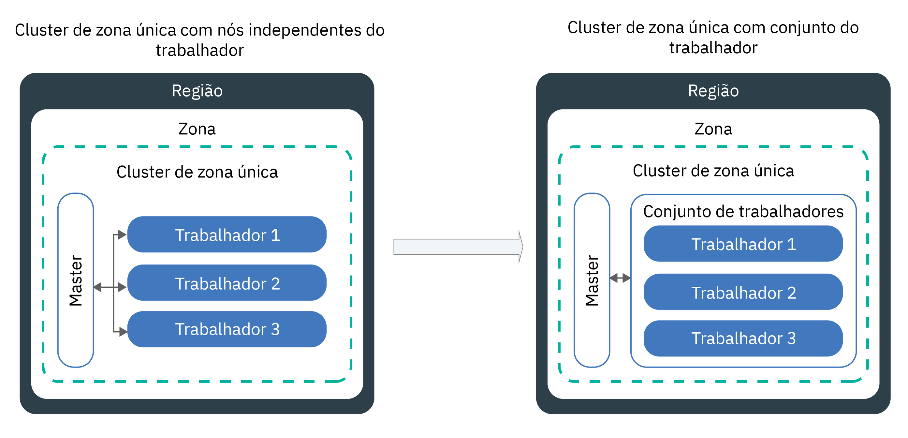

---

copyright:
  years: 2014, 2018
lastupdated: "2018-10-25"

---

{:new_window: target="_blank"}
{:shortdesc: .shortdesc}
{:screen: .screen}
{:pre: .pre}
{:table: .aria-labeledby="caption"}
{:codeblock: .codeblock}
{:tip: .tip}
{:download: .download}


# Atualizando clusters, nós do trabalhador e complementos
{: #update}

É possível instalar atualizações para manter seus clusters do Kubernetes atualizados no {{site.data.keyword.containerlong}}.
{:shortdesc}

## Atualizando o mestre do Kubernetes
{: #master}

Periodicamente, o Kubernetes libera [atualizações principais, secundárias ou de correção](cs_versions.html#version_types). As atualizações podem afetar a versão do servidor da API do Kubernetes ou outros componentes em seu mestre do Kubernetes. A IBM atualiza a versão da correção, mas deve-se atualizar as versões principal e secundária.
{:shortdesc}

**Como saber quando atualizar o mestre?**</br>
Você é notificado na GUI e na CLI quando as atualizações estão disponíveis e também pode verificar nossa página [versões suportadas](cs_versions.html).

**Quantas versões atrás da mais recente o mestre pode ser?**</br>
A IBM geralmente suporta 3 versões do Kubernetes em um determinado momento. É possível atualizar o servidor da API do Kubernetes não mais que 2 versões à frente de sua versão atual.

Por exemplo, se sua versão atual do servidor de API do Kubernetes é 1.7 e você deseja atualizar para 1.10, deve-se primeiro atualizar para 1.9. É possível forçar para que ocorra a atualização, mas a atualização de três ou mais versões secundárias pode causar resultados inesperados ou falha.

Se o seu cluster está executando uma versão do Kubernetes não suportada, você pode ter que forçar a atualização. Portanto, mantenha seu cluster atualizado para evitar impacto operacional.

**Meus nós do trabalhador podem ser executados em uma versão mais recente do que o mestre?**</br>
Não. Primeiro, [atualize seu mestre](#update_master) para a versão mais recente do Kubernetes. Em seguida, [atualize os nós do trabalhador](#worker_node) em seu cluster. Diferentemente do mestre, deve-se atualizar seus trabalhadores para cada versão de correção.

**O que acontece durante a atualização do mestre?**</br>
Quando você atualiza o servidor da API do Kubernetes, o servidor da API fica inativo por cerca de 5 a 10 minutos. Durante a atualização, não é possível acessar nem mudar o cluster. No entanto, os nós do trabalhador, apps e recursos que os usuários do cluster implementaram não serão modificados e continuarão a executar.

** Posso retroceder a atualização? **</br>
Não, não é possível retroceder um cluster para uma versão anterior depois que o processo de atualização ocorre. Certifique-se de usar um cluster de teste e siga as instruções para direcionar problemas potenciais antes de atualizar o mestre de produção.

**Qual processo posso seguir para atualizar o mestre?**</br>
O diagrama a seguir mostra o processo que você pode usar para atualizar seu mestre.


Figura 1. Atualizando o diagrama do processo de mestre do Kubernetes

{: #update_master}
Para atualizar a versão _principal_ ou _secundária_ do mestre do Kubernetes:

1.  Revise as [mudanças do Kubernetes](cs_versions.html) e faça as atualizações marcadas como _Atualizar antes do mestre_.

2.  Atualize seu servidor da API do Kubernetes e os componentes principais do Kubernetes associados usando a GUI ou executando o [comando](cs_cli_reference.html#cs_cluster_update) da CLI `ibmcloud ks cluster-update`.

3.  Aguarde alguns minutos e, em seguida, confirme se a atualização está concluída. Revise a versão do servidor da API do Kubernetes no Painel do {{site.data.keyword.Bluemix_notm}} ou execute `ibmcloud ks clusters`.

4.  Instale a versão do [`kubectl cli`](cs_cli_install.html#kubectl) que corresponde à versão do servidor da API do Kubernetes que é executada no mestre do Kubernetes.

Quando a atualização do servidor da API do Kubernetes for concluída, será possível atualizar seus nós do trabalhador.

<br />


## Atualizando nós do trabalhador
{: #worker_node}

Você recebeu uma notificação para atualizar seus nós do trabalhador. O que isso significa? À medida que as atualizações e correções de segurança são introduzidas para o servidor da API do Kubernetes e outros componentes principais do Kubernetes, deve-se ter certeza de que os nós do trabalhador permanecem em sincronização.
{: shortdesc}

Antes de iniciar:
- [Efetue login em sua conta. Destine a região apropriada e, se aplicável, o grupo de recursos. Configure o contexto para seu cluster](cs_cli_install.html#cs_cli_configure).
- [ Atualize o mestre do Kubernetes ](#master). A versão do Kubernetes do nó do trabalhador não pode ser maior que a versão do servidor da API do Kubernetes que é executada em seu mestre do Kubernetes.
- Faça quaisquer mudanças marcadas com _Atualizar após o mestre_ em [Mudanças do Kubernetes](cs_versions.html).
- Se desejar aplicar uma atualização de correção, revise o [log de mudanças de versão do Kubernetes](cs_versions_changelog.html#changelog). </br>

**Atenção**: as atualizações para os nós do trabalhador podem causar tempo de inatividade para seus apps e serviços. Os dados serão excluídos se não [armazenados fora do pod](cs_storage_planning.html#persistent_storage_overview).


**O que acontece com meus apps durante uma atualização?**</br>
Se executar apps como parte de uma implementação em nós do trabalhador que você atualizar, os apps serão reprogramados em outros nós do trabalhador no cluster. Esses nós do trabalhador podem estar em um conjunto de trabalhadores diferente ou, se você tiver nós do trabalhador independentes, os apps poderão estar planejados em nós do trabalhador independentes. Para evitar tempo de inatividade para seu app, deve-se assegurar que você tenha capacidade suficiente no cluster para transportar a carga de trabalho.

**Como posso controlar quantos nós do trabalhador ficam inativos em um determinado momento durante a atualização?**
Se você precisar que todos os nós do trabalhador estejam funcionando, considere [redimensionar seu conjunto de trabalhadores](cs_cli_reference.html#cs_worker_pool_resize) ou [incluir nós do trabalhador independentes](cs_cli_reference.html#cs_worker_add) para incluir mais nós do trabalhador. Será possível remover os nós do trabalhador adicionais depois que a atualização for concluída.

Além disso, é possível criar um mapa de configuração do Kubernetes que especifique o número máximo de nós do trabalhador que podem ficar indisponíveis em um horário durante a atualização. Os nós do trabalhador são identificados pelos rótulos de nó do trabalhador. É possível usar rótulos fornecidos pela IBM ou rótulos customizados que você incluiu no nó do trabalhador.

**E se eu escolher não definir um mapa de configuração?**</br>
Quando o mapa de configuração não está definido, o padrão é usado. Por padrão, um máximo de 20% de todos os nós do trabalhador em cada cluster pode ficar indisponível durante o processo de atualização.

Para criar um mapa de configuração e atualizar nós do trabalhador:

1.  Liste os nós do trabalhador disponíveis e anote o seu endereço IP privado.

    ```
    ibmcloud ks workers <cluster_name_or_ID>
    ```
    {: pre}

2. Visualizar os rótulos de um nó do trabalhador. É possível localizar os rótulos de nó do trabalhador na seção **Rótulos** de sua saída da CLI. Cada rótulo consiste em um `NodeSelectorKey` e um `NodeSelectorValue`.
   ```
   kubectl describe node <private_worker_IP>
   ```
   {: pre}

   Saída de exemplo:
   ```
   Name:               10.184.58.3
   Roles:              <none>
   Labels:             arch=amd64
                    beta.kubernetes.io/arch=amd64
                    beta.kubernetes.io/os=linux
                    failure-domain.beta.kubernetes.io/region=us-south
                    failure-domain.beta.kubernetes.io/zone=dal12
                    ibm-cloud.kubernetes.io/encrypted-docker-data=true
                    ibm-cloud.kubernetes.io/iaas-provider=softlayer
                    ibm-cloud.kubernetes.io/machine-type=u2c.2x4.encrypted
                    kubernetes.io/hostname=10.123.45.3
                    privateVLAN=2299001
                    publicVLAN=2299012
   Annotations:        node.alpha.kubernetes.io/ttl=0
                    volumes.kubernetes.io/controller-managed-attach-detach=true
   CreationTimestamp:  Tue, 03 Apr 2018 15:26:17 -0400
   Taints:             <none>
   Unschedulable:      false
   ```
   {: screen}

3. Crie um mapa de configuração e defina as regras de indisponibilidade para seus nós do trabalhador. O exemplo a seguir mostra 4 verificações, `zonecheck.json`, `regioncheck.json`, `defaultcheck.json` e um modelo de verificação. É possível usar essas verificações de exemplo para definir regras para nós do trabalhador em uma zona específica (`zonecheck.json`), região (`regioncheck.json`) ou para todos os nós do trabalhador que não correspondem a nenhuma das verificações definidas no mapa de configuração (` defaultcheck.json`). Use o modelo de verificação para criar sua própria verificação. Para cada verificação, para identificar um nó do trabalhador, deve-se escolher um dos rótulos de nó do trabalhador que você recuperou na etapa anterior.  

   **Nota:** para cada verificação, é possível configurar somente um valor para <code>NodeSelectorKey</code> e <code>NodeSelectorValue</code>. Se você desejar configurar regras para mais de uma região, zona ou outros rótulos de nó do trabalhador, crie uma nova verificação. Defina até 10 verificações em um mapa de configuração. Se você incluir mais verificações, elas serão ignoradas.

   Exemplo:
   ```
   apiVersion: v1
    kind: ConfigMap
    metadata:
      name: ibm-cluster-update-configuration
      namespace: kube-system
    data:
     drain_timeout_seconds: "120"
     zonecheck.json: |
       {
        "MaxUnavailablePercentage": 30,
        "NodeSelectorKey": "failure-domain.beta.kubernetes.io/zone",
        "NodeSelectorValue": "dal13"
      }
    regioncheck.json: |
       {
        "MaxUnavailablePercentage": 20,
        "NodeSelectorKey": "failure-domain.beta.kubernetes.io/region",
        "NodeSelectorValue": "us-south"
      }
    defaultcheck.json: |
       {
        "MaxUnavailablePercentage": 20
      }
    <check_name>: |
      {
        "MaxUnavailablePercentage": <value_in_percentage>,
        "NodeSelectorKey": "<node_selector_key>",
        "NodeSelectorValue": "<node_selector_value>"
      }
   ```
   {:pre}

   <table summary="A primeira linha na tabela abrange ambas as colunas. O resto das linhas deve ser lido da esquerda para a direita, com o parâmetro na coluna um e a descrição que corresponde na coluna dois.">
   <caption>Componentes ConfigMap</caption>
    <thead>
      <th colspan=2> Entendendo os componentes </th>
    </thead>
    <tbody>
      <tr>
        <td><code>drain_timeout_seconds</code></td>
        <td> Opcional: o tempo limite em segundos para aguardar o [dreno ](https://kubernetes.io/docs/tasks/administer-cluster/safely-drain-node/) ser concluído. A drenagem de um nó do trabalhador remove com segurança todos os pods existentes do nó do trabalhador e reagenda os pods em outros nós do trabalhador no cluster. Os valores aceitos são números inteiros de 1 a 180. O valor padrão é 30.</td>
      </tr>
      <tr>
        <td><code>zonecheck.json</code></br><code>regioncheck.json</code></td>
        <td>Duas verificações que definem uma regra para um conjunto de nós do trabalhador que é possível identificar com o <code>NodeSelectorKey</code> e o <code>NodeSelectorValue</code> especificados. O <code>zonecheck.json</code> identifica os nós do trabalhador com base em seu rótulo de zona e o <code>regioncheck.json</code> usa o rótulo de região que é incluído em cada nó do trabalhador durante o fornecimento. No exemplo, 30% de todos os nós do trabalhador que têm <code>dal13</code> como seu rótulo de zona e 20% de todos os nós do trabalhador em <code>us-south</code> podem ficar indisponíveis durante a atualização.</td>
      </tr>
      <tr>
        <td><code>defaultcheck.json</code></td>
        <td>Se você não criar um mapa de configuração ou o mapa estiver configurado incorretamente, o padrão do Kubernetes será aplicado. Por padrão, somente 20% dos nós do trabalhador no cluster podem estar indisponíveis em um determinado momento. É possível substituir o valor padrão, incluindo a verificação padrão em seu mapa de configuração. No exemplo, cada nó do trabalhador que não é especificado nas verificações de zona e região (<code>dal13</code> ou <code>us-south</code>) pode estar indisponível durante a atualização. </td>
      </tr>
      <tr>
        <td><code>MaxUnavailablePercentage</code></td>
        <td>A quantia máxima de nós que podem ficar indisponíveis para uma chave e um valor de rótulo especificados, como uma porcentagem. Um nó do trabalhador fica indisponível quando ele está no processo de implementação, recarregamento ou fornecimento. Os nós do trabalhador enfileirados são bloqueados de atualização se excedem qualquer porcentagem máxima indisponível definida. </td>
      </tr>
      <tr>
        <td><code>NodeSelectorKey</code></td>
        <td>A chave de rótulo do nó do trabalhador para o qual você deseja configurar uma regra. É possível configurar regras para os rótulos padrão fornecidos pela IBM, bem como os rótulos de nó do trabalhador que você criou. <ul><li>Se você deseja incluir uma regra para nós do trabalhador que pertencem a um conjunto de trabalhadores, é possível usar o rótulo <code>ibm-cloud.kubernetes.io/machine-type</code>. </li><li> Se você tiver mais de um conjunto de trabalhadores com o mesmo tipo de máquina, use um rótulo customizado. </li></ul></td>
      </tr>
      <tr>
        <td><code>NodeSelectorValue</code></td>
        <td>O valor do rótulo que o nó do trabalhador deve ter para ser considerado para a regra que você define. </td>
      </tr>
    </tbody>
   </table>

4. Crie o mapa de configuração em seu cluster.
   ```
   kubectl apply -f <filepath/configmap.yaml>
   ```
   {: pre}

5. Verifique se o mapa de configuração foi criado.
   ```
   kubectl get configmap -- namespace kube-system
   ```
   {: pre}

6.  Atualize os nós do trabalhador.

    ```
    ibmcloud ks worker-update <cluster_name_or_ID> <worker_node1_ID> <worker_node2_ID>
    ```
    {: pre}

7. Opcional: verifique os eventos que são acionados pelo mapa de configuração e quaisquer erros de validação que ocorrem. Os eventos podem ser revisados na seção **Eventos** de sua saída da CLI.
   ```
   kubectl describe -n kube-system cm ibm-cluster-update-configuration
   ```
   {: pre}

8. Confirme se a atualização está concluída, revisando a versão do Kubernetes de seus nós do trabalhador.  
   ```
   kubectl get nodes
   ```
   {: pre}

9. Verifique se você não tem nós do trabalhador duplicados. Em alguns casos, clusters mais velhos podem listar nós do trabalhador duplicados com um status de **NotReady** após uma atualização. Para remover duplicatas, consulte [Resolução de problemas](cs_troubleshoot_clusters.html#cs_duplicate_nodes).

Próximas etapas:
  - Repita o processo de atualização com outros conjuntos de trabalhadores.
  - Informe aos desenvolvedores que trabalham no cluster para atualizar sua CLI `kubectl` para a versão do mestre do Kubernetes.
  - Se o painel do Kubernetes não exibir gráficos de utilização, [exclua o pod `kube-dashboard`](cs_troubleshoot_health.html#cs_dashboard_graphs).

<br />


## Atualizando tipos de máquina
{: #machine_type}

É possível atualizar os tipos de máquina de seus nós do trabalhador, incluindo novos nós do trabalhador e removendo os antigos. Por exemplo, se você têm nós do trabalhador virtual em tipos de máquina descontinuada com `u1c` ou `b1c` nos nomes, crie nós do trabalhador que usam tipos de máquina com `u2c` ou `b2c` nos nomes.
{: shortdesc}

Antes de iniciar:
- [Efetue login em sua conta. Destine a região apropriada e, se aplicável, o grupo de recursos. Configure o contexto para seu cluster](cs_cli_install.html#cs_cli_configure).
- Se você armazenar dados em seu nó do trabalhador, os dados serão excluídos se não [armazenados fora do nó do trabalhador](cs_storage_planning.html#persistent_storage_overview).


**Atenção**: as atualizações para os nós do trabalhador podem causar tempo de inatividade para seus apps e serviços. Os dados serão excluídos se não [armazenados fora do pod](cs_storage_planning.html#persistent_storage_overview).

1. Liste os nós do trabalhador disponíveis e anote o seu endereço IP privado.
   - **Para nós do trabalhador em um conjunto de trabalhadores**:
     1. Liste os conjuntos de trabalhadores disponíveis em seu cluster.
        ```
        ibmcloud ks worker-pools --cluster <cluster_name_or_ID>
        ```
        {: pre}

     2. Liste os nós do trabalhador no conjunto de trabalhadores.
        ```
        ibmcloud ks workers <cluster_name_or_ID> --worker-pool <pool_name>
        ```
        {: pre}

     3. Obtenha os detalhes para um nó do trabalhador e anote a zona, o ID de VLAN privada e pública.
        ```
        ibmcloud ks worker-get <cluster_name_or_ID> <worker_ID>
        ```
        {: pre}

   - **Descontinuado: para nós do trabalhador independentes**:
     1. Liste os nós do trabalhador disponíveis.
        ```
        ibmcloud ks workers <cluster_name_or_ID>
        ```
        {: pre}

     2. Obtenha os detalhes para um nó do trabalhador e anote a zona, o ID de VLAN privada e pública.
        ```
        ibmcloud ks worker-get <cluster_name_or_ID> <worker_ID>
        ```
        {: pre}

2. Liste os tipos de máquina disponíveis na zona.
   ```
   ibmcloud ks machine-types <zone>
   ```
   {: pre}

3. Crie um nó do trabalhador com o novo tipo de máquina.
   - **Para nós do trabalhador em um conjunto de trabalhadores**:
     1. Crie um conjunto de trabalhadores com o número de nós do trabalhador que você deseja substituir.
        ```
        ibmcloud ks worker-pool-create --name <pool_name> --cluster <cluster_name_or_ID> --machine-type <machine_type> --size-per-zone <number_of_workers_per_zone>
        ```
        {: pre}

     2. Verifique se o conjunto de trabalhadores foi criado.
        ```
        ibmcloud ks worker-pools --cluster <cluster_name_or_ID>
        ```
        {: pre}

     3. Inclua a zona em seu conjunto de trabalhadores que você recuperou anteriormente. Ao incluir uma zona, os nós do trabalhador que estão definidos em seu conjunto de trabalhadores são provisionados na zona e considerados para planejamento futuro de carga de trabalho. Se você desejar difundir os nós do trabalhador em múltiplas zonas, escolha uma [zona com capacidade para múltiplas zonas](cs_regions.html#zones).
        ```
        ibmcloud ks zone-add --zone <zone> --cluster <cluster_name_or_ID> --worker-pools <pool_name> --private-vlan <private_VLAN_ID> --public-vlan <public_VLAN_ID>
        ```
        {: pre}

   - **Descontinuado: para nós do trabalhador independentes**:
       ```
       ibmcloud ks worker-add --cluster <cluster_name> --machine-type <machine_type> --number <number_of_worker_nodes> --private-vlan <private_VLAN_ID> --public-vlan <public_VLAN_ID>
       ```
       {: pre}

4. Aguarde até que os nós do trabalhador sejam implementados.
   ```
   ibmcloud ks workers <cluster_name_or_ID>
   ```
   {: pre}

   Quando o estado do nó do trabalhador muda para **Normal**, a implementação está concluída.

5. Remova o nó do trabalhador antigo. **Nota**: se estiver removendo um tipo de máquina que seja faturado mensalmente (como bare metal), você será cobrado pelo mês inteiro.
   - **Para nós do trabalhador em um conjunto de trabalhadores**:
     1. Remova o conjunto de trabalhadores com o tipo de máquina antigo. A remoção de um conjunto de trabalhadores remove todos os nós do trabalhador no conjunto em todas as zonas. Esse processo pode levar alguns minutos para ser concluído.
        ```
        ibmcloud ks worker-pool-rm --worker-pool <pool_name> --cluster <cluster_name_or_ID>
        ```
        {: pre}

     2. Verifique se o conjunto de trabalhadores foi removido.
        ```
        ibmcloud ks worker-pools --cluster <cluster_name_or_ID>
        ```
        {: pre}

   - **Descontinuado: para nós do trabalhador independentes**:
      ```
      ibmcloud ks worker-rm <cluster_name> <worker_node>
      ```
      {: pre}

6. Verifique se os nós do trabalhador foram removidos de seu cluster.
   ```
   ibmcloud ks workers <cluster_name_or_ID>
   ```
   {: pre}

7. Repita essas etapas para atualizar outros conjuntos de trabalhadores ou nós do trabalhador independentes para diferentes tipos de máquina.

## Atualizando complementos de cluster
{: #addons}

Seu cluster do {{site.data.keyword.containerlong_notm}} é fornecido com **complementos**, como Fluentd para criação de log, que são instalados automaticamente quando você provisiona o cluster. Esses complementos devem ser atualizados separadamente dos nós principal e do trabalhador.
{: shortdesc}

**Quais complementos padrão eu tenho que atualizar separadamente do cluster?**
* [ Fluentd para criação de log ](#logging)

**Existem complementos que eu não preciso atualizar e não posso mudar?**</br>
Sim, o seu cluster é implementado com os complementos gerenciados a seguir e recursos associados que não podem ser mudados. Se você tentar mudar um desses complementos de implementação, suas configurações originais serão restauradas em um intervalo regular.

* `heapster`
* `ibm-file-plugin`
* ` ibm-storage-watcher `
* ` ibm-keepalived-watcher `
* ` kube-dns-amd64 `
* ` kube-dns-autoscaler `
* `kubernetes-painel`
* ` vpn `

É possível visualizar esses recursos usando o rótulo `addonmanager.kubernetes.io/mode: Reconcile`. Por exemplo:

```
kubectl get deployments -- all-namespaces -l addonmanager.kubernetes.io/mode=Reconcile
```
{: pre}

**Posso instalar outros complementos além do padrão?**</br>
Sim. O {{site.data.keyword.containerlong_notm}} fornece outros complementos dentro os quais é possível escolher para incluir recursos em seu cluster. Por exemplo, você pode desejar [usar gráficos Helm](cs_integrations.html#helm) para instalar o [plug-in de armazenamento de bloco](cs_storage_block.html#install_block), o [Istio](cs_tutorials_istio.html#istio_tutorial) ou a [VPN strongSwan](cs_vpn.html#vpn-setup). Deve-se atualizar cada complemento separadamente seguindo as instruções para atualizar os gráficos Helm.

### Fluentd para criação de log
{: #logging}

Para fazer mudanças em suas configurações de criação de log ou de filtro, o complemento Fluentd deve estar na versão mais recente. Por padrão, as atualizações automáticas para o complemento são ativadas.
{: shortdesc}

É possível verificar se as atualizações automáticas estão ativadas executando o [comando](cs_cli_reference.html#cs_log_autoupdate_get) `ibmcloud ks logging-autoupdate-get --cluster <cluster_name_or_ID>`.

Para desativar as atualizações automáticas, execute o [comando](cs_cli_reference.html#cs_log_autoupdate_disable) `ibmcloud ks logging-autoupdate-disable`.

Se as atualizações automáticas estiverem desativadas, mas for necessário fazer uma mudança em sua configuração, você terá duas opções.

*  Ativar as atualizações automáticas para os seus pods do Fluentd.

    ```
    ibmcloud ks logging-autoupdate-enable --cluster <cluster_name_or_ID>
    ```
    {: pre}

*  Forçar uma atualização única quando usar um comando de criação de log que inclua a opção `--force-update`. **Nota**: seus pods atualizam para a versão mais recente do complemento Fluentd, mas o Fluentd não atualiza automaticamente daí para a frente.

    Exemplo de comando:

    ```
    ibmcloud ks logging-config-update --cluster <cluster_name_or_ID> --id <log_config_ID> --type <log_type> --force-update
    ```
    {: pre}

## Atualizando de nós do trabalhador independentes para conjuntos de trabalhadores
{: #standalone_to_workerpool}

Com a introdução de clusters de múltiplas zonas, os nós do trabalhador com a mesma configuração, como o tipo de máquina, são agrupados em conjuntos de trabalhadores. Ao criar um novo cluster, um conjunto de trabalhadores denominado `default` é criado automaticamente para você.
{: shortdesc}

É possível usar conjuntos de trabalhadores para difundir os nós do trabalhador uniformemente entre as zonas e construir um cluster balanceado. Os clusters balanceados estão mais disponíveis e resilientes a falhas. Se um nó do trabalhador é removido de uma zona, é possível rebalancear o conjunto de trabalhadores e provisionar automaticamente novos nós do trabalhador para essa zona. Os conjuntos de trabalhadores também são usados para instalar as atualizações de versão do Kubernetes para todos os seus nós do trabalhador.  

**Importante:** se você criou clusters antes de os clusters de múltiplas zonas se tornarem disponíveis, seus nós do trabalhador ainda serão independentes e não serão agrupados automaticamente em conjuntos de trabalhadores. Deve-se atualizar esses clusters para usar conjuntos de trabalhadores. Se não atualizados, não será possível mudar seu cluster de zona única para um cluster de múltiplas zonas.

Revise a imagem a seguir para ver como sua configuração de cluster muda quando você move de nós do trabalhador independentes para conjuntos de trabalhadores.



Antes de iniciar: [Efetue login em sua conta. Destine a região apropriada e, se aplicável, o grupo de recursos. Configure o contexto para seu cluster](cs_cli_install.html#cs_cli_configure).

1. Liste os nós do trabalhador independentes existentes em seu cluster e anote o **ID**, o **Tipo de máquina** e o **IP privado**.
   ```
   ibmcloud ks workers <cluster_name_or_ID>
   ```
   {: pre}

2. Crie um conjunto de trabalhadores e decida sobre o tipo de máquina e o número de nós do trabalhador que você deseja incluir no conjunto.
   ```
   ibmcloud ks worker-pool-create --name <pool_name> --cluster <cluster_name_or_ID> --machine-type <machine_type> --size-per-zone <number_of_workers_per_zone>
   ```
   {: pre}

3. Liste as zonas disponíveis e decida onde você deseja provisionar os nós do trabalhador em seu conjunto de trabalhadores. Para visualizar a zona na qual os nós do trabalhador independentes estão provisionados, execute `ibmcloud ks cluster-get <cluster_name_or_ID>`. Se você desejar difundir os nós do trabalhador em múltiplas zonas, escolha uma [zona com capacidade para múltiplas zonas](cs_regions.html#zones).
   ```
   ibmcloud ks zones
   ```
   {: pre}

4. Liste as VLANs disponíveis para a zona que você escolheu na etapa anterior. Se você ainda não tiver uma VLAN nessa zona, a VLAN será criada automaticamente quando a zona for incluída no conjunto de trabalhadores.
   ```
   ibmcloud ks vlans <zone>
   ```
   {: pre}

5. Inclua a zona em seu conjunto de trabalhadores. Ao incluir uma zona em um conjunto de trabalhadores, os nós do trabalhador que estão definidos em seu conjunto de trabalhadores são provisionados na zona e considerados para planejamento futuro de carga de trabalho. O {{site.data.keyword.containerlong}} inclui automaticamente o rótulo `failure-domain.beta.kubernetes.io/region` para a região e o rótulo `failure-domain.beta.kubernetes.io/zone` para a zona em cada nó do trabalhador. O planejador do Kubernetes usa esses rótulos para difundir pods ao longo de zonas dentro da mesma região.
   1. **Para incluir uma zona em um conjunto de trabalhadores**: substitua `<pool_name>` pelo nome de seu conjunto de trabalhadores e preencha o ID do cluster, a zona e as VLANs com as informações que você recuperou anteriormente. Se você não tiver uma VLAN privada e uma pública nessa zona, não especifique essa opção. Uma VLAN privada e uma pública são criadas automaticamente para você.

      Se você desejar usar VLANs diferentes para diferentes conjuntos de trabalhadores, repita este comando para cada VLAN e os seus conjuntos de trabalhadores correspondentes. Todos os novos nós do trabalhador são incluídos nas VLANs especificadas, mas as VLANs para quaisquer nós do trabalhador existentes não mudam.
      ```
      ibmcloud ks zone-add --zone <zone> --cluster <cluster_name_or_ID> --worker-pools <pool_name> --private-vlan <private_VLAN_ID> --public-vlan <public_VLAN_ID>
      ```
      {: pre}

   2. **Para incluir a zona em múltiplos conjuntos de trabalhadores**: inclua múltiplos conjuntos de trabalhadores no comando `ibmcloud ks zone-add`. Para incluir múltiplos conjuntos de trabalhadores em uma zona, deve-se ter uma VLAN privada e uma pública existente nessa zona. Se não houver uma VLAN pública e privada nessa zona, considere incluir a zona em um conjunto de trabalhadores primeiro para que uma VLAN privada e uma pública sejam criadas para você. Em seguida, é possível incluir a zona em outros conjuntos de trabalhadores. </br></br>É importante que os nós do trabalhador em todos os seus conjuntos de trabalhadores sejam provisionados em todas as zonas para assegurar que o cluster esteja balanceado entre as zonas. Se deseja usar VLANs diferentes para conjuntos de trabalhadores diferentes, repita esse comando com a VLAN que você deseja usar para o seu conjunto de trabalhadores. Se você tem múltiplas VLANs para um cluster, múltiplas sub-redes na mesma VLAN ou um cluster multizona, deve-se ativar o [VLAN Spanning](/docs/infrastructure/vlans/vlan-spanning.html#vlan-spanning) para sua conta de infraestrutura do IBM Cloud (SoftLayer) para que os nós do trabalhador possam se comunicar entre si na rede privada. Para executar essa ação, você precisa da [permissão de infraestrutura](cs_users.html#infra_access) **Rede > Gerenciar rede VLAN Spanning** ou é possível solicitar ao proprietário da conta para ativá-la. Para verificar se o VLAN Spanning já está ativado, use o [comando](/docs/containers/cs_cli_reference.html#cs_vlan_spanning_get) `ibmcloud ks vlan-spanning-get`. Se você está usando o {{site.data.keyword.BluDirectLink}}, deve-se usar um [ Virtual Router Function (VRF)](/docs/infrastructure/direct-link/subnet-configuration.html#more-about-using-vrf). Para ativar o VRF, entre em contato com o representante de conta da infraestrutura do IBM Cloud (SoftLayer).
      ```
      ibmcloud ks zone-add --zone <zone> --cluster <cluster_name_or_ID> --worker-pools <pool_name1,pool_name2,pool_name3> --private-vlan <private_VLAN_ID> --public-vlan <public_VLAN_ID>
      ```
      {: pre}

   3. **Para incluir múltiplas zonas em seus conjuntos de trabalhadores**: repita o comando `ibmcloud ks zone-add` com uma zona diferente e especifique os conjuntos de trabalhadores que você deseja provisionar nessa zona. Incluindo mais zonas em seu cluster, você muda o seu cluster de um cluster de zona única para um [cluster de múltiplas zonas](cs_clusters_planning.html#multizone).

6. Espere os nós do trabalhador serem implementados em cada zona.
   ```
   ibmcloud ks workers <cluster_name_or_ID>
   ```
   {: pre}
   Quando o estado do nó do trabalhador muda para **Normal**, a implementação é concluída.

7. Remova seus nós do trabalhador independentes. Se você tiver múltiplos nós do trabalhador independentes, remova um de cada vez.
   1. Liste os nós do trabalhador em seu cluster e compare o endereço IP privado desse comando com o endereço IP privado que você recuperou no início para localizar os nós do trabalhador independentes.
      ```
      kubectl get nodes
      ```
      {: pre}
   2. Marque o nó do trabalhador como não programável em um processo conhecido como bloqueio. Ao bloquear um nó do trabalhador, ele fica indisponível para planejamento futuro do pod. Use o `name` que é retornado no comando `kubectl get nodes`.
      ```
      kubectl cordon <worker_name>
      ```
      {: pre}
   3. Verifique se o planejamento do pod está desativado para seu nó do trabalhador.
      ```
      kubectl get nodes
      ```
      {: pre}
      O nó do trabalhador ficará desativado para planejamento do pod se o status exibir **SchedulingDisabled**.
   4. Force os pods a serem removidos de seu nó do trabalhador independente e reprogramados para os nós do trabalhador independentes não bloqueados restantes e nós do trabalhador do seu conjunto de trabalhadores.
      ```
      kubectl drain < worker_name> -- ignore-daemonsets
      ```
      {: pre}
      Esse processo pode levar alguns minutos.

   5. Remova seu nó do trabalhador independente. Use o ID do nó do trabalhador que você recuperou com o comando `ibmcloud ks workers <cluster_name_or_ID>`.
      ```
      ibmcloud ks worker-rm <cluster_name_or_ID> <worker_ID>
      ```
      {: pre}
   6. Repita essas etapas até que os seus nós do trabalhador independentes sejam removidos.


**O que vem a seguir?** </br>
Agora que você atualizou seu cluster para usar conjuntos de trabalhadores, é possível melhorar a disponibilidade incluindo mais zonas em seu cluster. A inclusão de mais zonas em seu cluster muda seu cluster de um cluster de zona única para um [cluster de múltiplas zonas](cs_clusters_planning.html#ha_clusters). Quando você muda seu cluster de zona única para um cluster de múltiplas zonas, seu domínio do Ingresso muda de `<cluster_name>.<region>.containers.mybluemix.net` para `<cluster_name>.<region_or_zone>.containers.appdomain.cloud`. O domínio do Ingresso existente ainda é válido e pode ser usado para enviar solicitações para seus apps.
