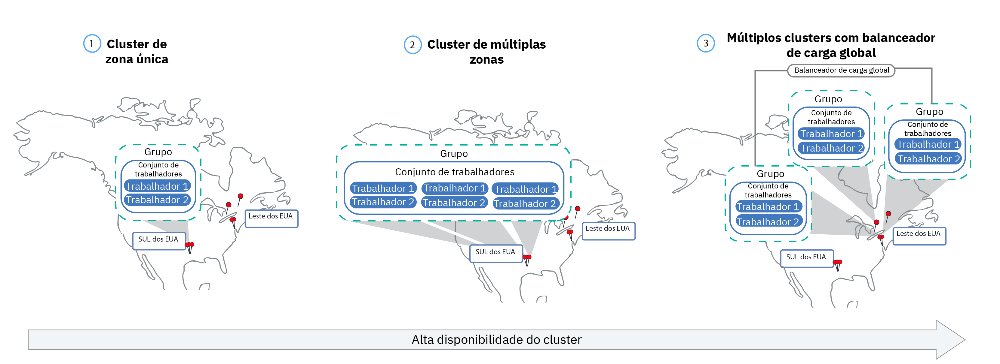
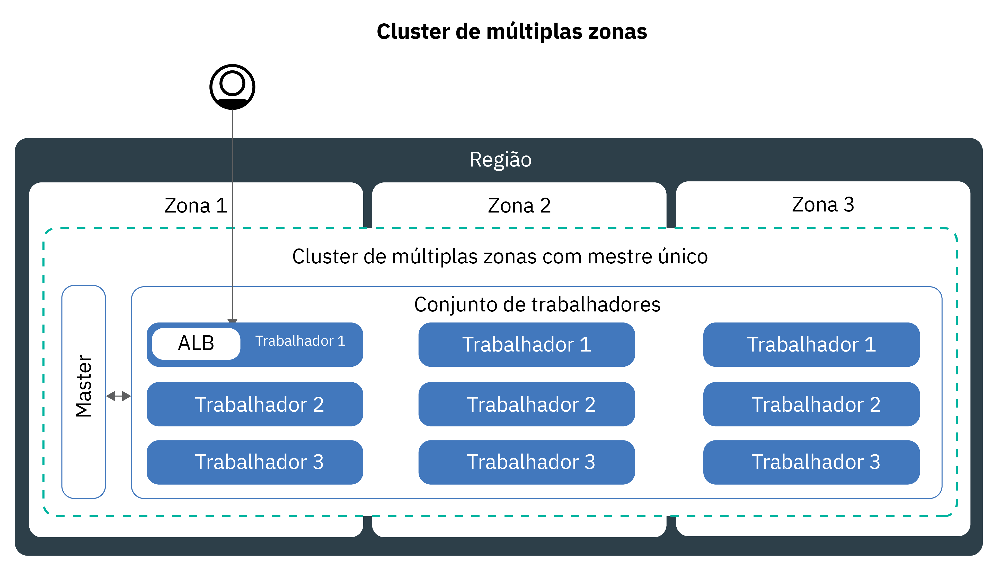
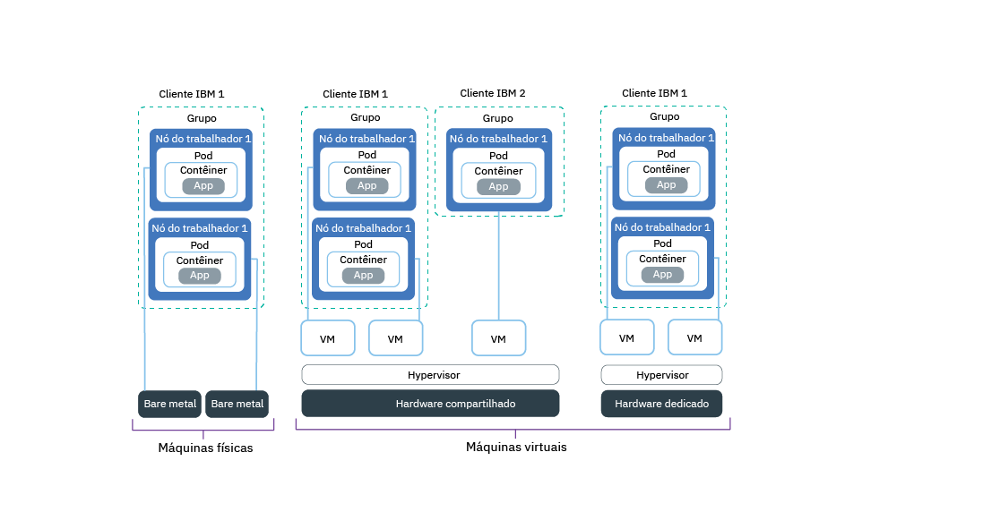

---

copyright:
  years: 2014, 2018
lastupdated: "2018-08-06"

---

{:new_window: target="_blank"}
{:shortdesc: .shortdesc}
{:screen: .screen}
{:pre: .pre}
{:table: .aria-labeledby="caption"}
{:codeblock: .codeblock}
{:tip: .tip}
{:download: .download}


# Configurando clusters
{: #clusters}

Projete sua configuração de cluster do Kubernetes para obter disponibilidade máxima do contêiner e a capacidade do cluster com o {{site.data.keyword.containerlong}}. Ainda está sendo iniciado? Experimente o [tutorial de criação de um cluster do Kubernetes](cs_tutorials.html#cs_cluster_tutorial).
{:shortdesc}

## Criando clusters multizona no  {{site.data.keyword.containershort_notm}}
{: #multizone}

Com o  {{site.data.keyword.containerlong}}, é possível criar clusters multizona. Seus usuários são menos propensos a experienciar o tempo de inatividade quando você distribui seus apps em múltiplos nós do trabalhador e zonas usando um conjunto de trabalhadores. Os recursos integrados, como balanceamento de carga e isolamento, aumentam a resiliência com relação a falhas potenciais de zona com hosts, redes ou apps. Se os recursos em uma zona ficam inativos, as cargas de trabalho do cluster ainda operam nas outras zonas.
{: shortdesc}

### Espere, o que é toda essa conversa sobre zonas e conjuntos? O que mudou?
{: #mz_changed}

**Zonas**, anteriormente chamadas de locais, são data centers nos quais é possível criar recursos do IBM Cloud.

Os clusters agora têm um recurso chamado **conjunto de trabalhadores**, que é uma coleção de nós do trabalhador com o mesmo tipo, como tipo de máquina, CPU e memória. Use os novos comandos `ibmcloud ks worker-pool` para fazer mudanças em seu cluster, como incluir zonas, incluir nós do trabalhador ou atualizar nós do trabalhador.

A configuração de cluster anterior de nós do trabalhador independentes é suportada, mas descontinuada. Certifique-se de [incluir um conjunto de trabalhadores em seu cluster](cs_clusters.html#add_pool) e, em seguida, [migrar para usar os conjuntos de trabalhadores](cs_cluster_update.html#standalone_to_workerpool) para organizar os nós do trabalhador em vez de nós do trabalhador independentes.

### O que eu preciso saber antes de começar?
{: #general_reqs}

Antes de chegar muito longe, é necessário cuidar de alguns itens de administrador para assegurar que os clusters de múltiplas zonas estejam prontos para cargas de trabalho.

<dl>
<dt>VLANs necessárias</dt>
  <dd><p>Ao incluir uma zona em um conjunto de trabalhadores, deve-se definir uma VLAN privada e uma pública à qual seus nós do trabalhador se conectam.</p><ul><li>Para verificar se você tem VLANs existentes nessa zona que podem ser usadas, execute `ibmcloud ks vlans <zone>`. Observe os IDs de VLAN e use-os quando você incluir uma zona em um conjunto de trabalhadores. </li>
  <li>Se não houver VLANs nessa zona, uma VLAN privada e uma pública serão criadas automaticamente para você. Você não precisa especificar uma VLAN privada e uma pública. </li></ul>
  </dd>
<dt>Ativar o VLAN Spanning ou VRF</dt>
  <dd><p>Os nós do trabalhador devem se comunicar entre si na rede privada entre zonas. Você tem duas opções:</p>
  <ol><li>[Ativar o VLAN Spanning](/docs/infrastructure/vlans/vlan-spanning.html#vlan-spanning) em sua conta de infraestrutura do IBM Cloud (SoftLayer). Para ativar o VLAN Spanning, deve-se ter a [permissão de infraestrutura](/docs/iam/infrastructureaccess.html#infrapermission) <strong>Rede > Gerenciar VLAN Spanning de rede</strong> ou é possível solicitar que o proprietário da conta ative-o.</li>
  <li>Ou, use uma conta de infraestrutura do IBM Cloud (SoftLayer) ativada pelo Virtual Router Function (VRF). Para obter uma conta do VRF, entre em contato com o suporte de infraestrutura do IBM Cloud (SoftLayer).</li></ol></dd>
<dt>Preparar volumes persistentes existentes</dt>
  <dd><p>Os volumes persistentes podem ser usados somente na zona na qual o dispositivo de armazenamento real está localizado. Para evitar erros inesperados do app em um cluster de múltiplas zonas, deve-se aplicar rótulos de região e zona a volumes persistentes existentes. Esses rótulos ajudam o kube-scheduler a determinar onde planejar um app que usa o volume persistente. Execute o comando a seguir e substitua <code>&lt;mycluster&gt;</code> pelo nome do cluster:</p>
  <pre class="pre"><code> bash < (curl -Ls https://raw.githubusercontent.com/IBM-Cloud/kube-samples/master/file-pv-labels/apply_pv_pv_labels.sh) < mycluster > </code></pre></dd>
<dt>Somente clusters de zona única estão disponíveis para as instâncias do {{site.data.keyword.Bluemix_dedicated_notm}}.</dt>
    <dd>Com um {{site.data.keyword.Bluemix_dedicated_notm}}, é possível criar apenas [clusters de zona única](cs_clusters.html#single_zone). A zona disponível foi predefinida quando o ambiente do {{site.data.keyword.Bluemix_dedicated_notm}} foi configurado. Por padrão, um cluster de zona única é configurado com um conjunto de trabalhadores denominado `default`. O conjunto de trabalhadores agrupa nós do trabalhador com a mesma configuração, tal como o tipo de máquina, que você definiu durante a criação do cluster. É possível incluir mais nós do trabalhador em seu cluster [redimensionando um conjunto de trabalhadores existente](cs_clusters.html#resize_pool) ou [incluindo um novo conjunto de trabalhadores](cs_clusters.html#add_pool). Ao incluir um conjunto de trabalhadores, deve-se incluir a zona disponível no conjunto de trabalhadores para que os trabalhadores possam implementar na zona. No entanto, não é possível incluir outras zonas em seus conjuntos de trabalhadores.</dd>
</dl>

### Estou pronto para fazer um cluster de múltiplas zonas. Como posso começar?
{: #mz_gs}

Inicie hoje no [console do {{site.data.keyword.containershort_notm}}](https://console.bluemix.net/containers-kubernetes/clusters) clicando em **Criar cluster**.

É possível criar um cluster em uma das [cidades de múltiplas zonas](cs_regions.html#zones):
* Dallas na região sul dos EUA: dal10, dal12, dal13
* Washington DC na região leste dos EUA: wdc04, wdc06, wdc07
* Frankfurt na região central da UE: fra02, fra04, fra05
* Londres na região sul do Reino Unido: lon02, lon04, lon06

** Incluir zonas em um cluster existente **:

Se você tiver um cluster em uma cidade de múltiplas zonas, será possível incluir um conjunto de trabalhadores no cluster e, em seguida, incluir uma zona nesse conjunto de trabalhadores usando a GUI ou CLI. Para obter uma lista completa de etapas, consulte [Atualizando de nós do trabalhador independentes para conjuntos de trabalhadores](cs_cluster_update.html#standalone_to_workerpool).

### Seguindo em frente, quais são algumas mudanças em como eu gerencio atualmente os meus clusters?
{: #mz_new_ways}

Com a introdução de conjuntos de trabalhadores, é possível usar um novo conjunto de APIs e comandos para gerenciar seu cluster. É possível ver esses novos comandos na [página de documentação da CLI](cs_cli_reference.html#cs_cli_reference) ou em seu terminal executando `ibmcloud ks help`.

A tabela a seguir compara os métodos antigos e novos para algumas ações comuns de gerenciamento de cluster.
<table summary="A tabela mostra a descrição da nova maneira de executar comandos de múltiplas zonas. As linhas devem ser lidas da esquerda para a direita, com a descrição na coluna um, a maneira antiga na coluna dois e a maneira nova de múltiplas zonas na coluna três.">
<caption>Novos métodos para comandos do conjunto de trabalhadores de múltiplas zonas.</caption>
  <thead>
  <th>Descrição</th>
  <th>Nós do trabalhador independente antigo</th>
  <th>Novos conjuntos de trabalhadores multizados</th>
  </thead>
  <tbody>
    <tr>
    <td>Inclua nós do trabalhador no cluster.</td>
    <td><strong>Descontinuado</strong>: <code>ibmcloud ks worker-add</code> para incluir nós do trabalhador independentes.</td>
    <td><ul><li>Para incluir tipos de máquina diferentes de seu conjunto existente, crie um novo conjunto de trabalhadores: [comando](cs_cli_reference.html#cs_worker_pool_create) <code>ibmcloud ks worker-pool-create</code>.</li>
    <li>Para incluir nós do trabalhador em um conjunto existente, redimensione o número de nós por zona no conjunto: [comando](cs_cli_reference.html#cs_worker_pool_resize) <code>ibmcloud ks worker-pool-resize</code>.</li></ul></td>
    </tr>
    <tr>
    <td>Remover nós do trabalhador do cluster.</td>
    <td><code>ibmcloud ks worker-rm</code>, que ainda é possível usar para excluir um nó do trabalhador problemático de seu cluster.</td>
    <td><ul><li>Se o seu conjunto de trabalhadores estiver desbalanceado, por exemplo, depois de remover um nó do trabalhador, rebalance-o: [comando](cs_cli_reference.html#cs_rebalance) <code>ibmcloud ks worker-pool-rebalance</code>.</li>
    <li>Para reduzir o número de nós do trabalhador em um conjunto, redimensione o número por zona (valor mínimo de 1): [comando](cs_cli_reference.html#cs_worker_pool_resize) <code>ibmcloud ks worker-pool-resize</code>.</li></ul></td>
    </tr>
    <tr>
    <td>Use uma nova VLAN para os nós do trabalhador.</td>
    <td><strong>Descontinuado</strong>: inclua um novo nó do trabalhador que use a nova VLAN privada ou pública: <code>ibmcloud ks worker-add</code>.</td>
    <td>Configure o conjunto de trabalhadores para usar uma VLAN pública ou privada diferente do que ele usou anteriormente: [comando](cs_cli_reference.html#cs_zone_network_set) <code>ibmcloud ks zone-network-network-set</code>.</td>
    </tr>
  </tbody>
  </table>

### Como posso aprender mais sobre os clusters de múltiplas zonas?
{: #learn_more}

A documentação inteira foi atualizada para múltiplas zonas. Em particular, você pode estar interessado nos tópicos a seguir que foram mudados um pouco com a introdução de clusters de múltiplas zonas:
* [ Configurando clusters altamente disponíveis ](#ha_clusters)
* [ Planejando implementações de app altamente disponíveis ](cs_app.html#highly_available_apps)
* [Expondo apps com LoadBalancers para clusters de múltiplas zonas](cs_loadbalancer.html#multi_zone_config)
* [Expondo apps com o Ingress](cs_ingress.html#ingress)
* Para o armazenamento persistente altamente disponível, use um serviço de nuvem como o [{{site.data.keyword.cloudant_short_notm}}](/docs/services/Cloudant/getting-started.html#getting-started-with-cloudant) ou [{{site.data.keyword.cos_full_notm}}](/docs/services/cloud-object-storage/about-cos.html#about-ibm-cloud-object-storage).

## Configurando clusters altamente disponíveis
{: #ha_clusters}
Projete seu cluster padrão para máxima disponibilidade e capacidade para seu app com o {{site.data.keyword.containerlong}}.

Seus usuários são menos propensos a experienciar o tempo de inatividade quando você distribui seus apps em múltiplos nós do trabalhador, zonas e clusters. Recursos integrados, como balanceamento de carga e isolamento, aumentam a resiliência com relação a potenciais
falhas com hosts, redes ou apps.

Revise estas potenciais configurações de cluster que são ordenadas com graus crescentes de disponibilidade.



1. Um [cluster de zona única](#single_zone) com múltiplos nós do trabalhador em um conjunto de trabalhadores.
2. Um [cluster de múltiplas zonas](#multi_zone) que difunde nós do trabalhador em zonas dentro de uma região.
3. [Múltiplos clusters](#multiple_clusters) que são configurados em zonas ou regiões e que são conectados por meio de um balanceador de carga global.

### Cluster de zona única
{: #single_zone}

Para melhorar a disponibilidade para seu app e para permitir o failover para o caso de um nó do trabalhador não estar disponível em seu cluster, inclua nós do trabalhador adicionais em seu cluster de zona única.
{: shortdesc}


Por padrão, seu cluster de zona única está configurado com um conjunto de trabalhadores denominado `default`. O conjunto de trabalhadores agrupa nós do trabalhador com a mesma configuração, tal como o tipo de máquina, que você definiu durante a criação do cluster. É possível incluir mais nós do trabalhador em seu cluster [redimensionando um conjunto de trabalhadores existente](#resize_pool) ou [incluindo um novo conjunto de trabalhadores](#add_pool).

Ao incluir mais nós do trabalhador, as instâncias do app podem ser distribuídas entre múltiplos nós do trabalhador. Se um nó do trabalhador ficar inativo, as instâncias do app em nós do trabalhador disponíveis continuarão a ser executadas. O Kubernetes reagenda automaticamente os pods de nós do trabalhador indisponíveis para assegurar desempenho e capacidade para seu app. Para assegurar que os seus pods sejam distribuídos de maneira uniforme entre os nós do trabalhador, implemente a [afinidade de pod](https://kubernetes.io/docs/concepts/configuration/assign-pod-node/#inter-pod-affinity-and-anti-affinity-beta-feature).

**Posso converter o meu cluster de zona única em um cluster de múltiplas zonas?**
Às vezes. Se seu cluster de zona única estiver em uma [cidade metropolitana de múltiplas zonas](cs_regions.html#zones), será possível converter o cluster de zona única em um cluster de múltiplas zonas. Para converter em um cluster de zonas múltiplas, [inclua uma zona](#add_zone) no conjunto de trabalhadores de seu cluster. Se você tiver múltiplos conjuntos de trabalhadores, inclua a zona em todos os conjuntos para que os nós do trabalhador permaneçam balanceados no cluster.

**Eu tenho que usar clusters de múltiplas zonas?**
Não. É possível criar tantos clusters de zona única quantos você desejar. De fato, você pode preferir clusters de zona única para gerenciamento simplificado ou se o seu cluster deve residir em uma [cidade de zona única](cs_regions.html#zones) específica.

### Cluster de múltiplas zonas
{: #multi_zone}

Para proteger seu cluster com relação a uma única falha de zona, é possível difundir seu cluster entre zonas em uma região.
{: shortdesc}



É possível incluir zonas adicionais em seu cluster para replicar os nós do trabalhador em seus conjuntos de trabalhadores em múltiplas zonas dentro de uma região. Os clusters de múltiplas zonas são projetados para planejar uniformemente os pods em nós do trabalhador e zonas para assegurar disponibilidade e recuperação de falha. Se os nós do trabalhador não forem difundidos uniformemente entre as zonas ou se houver capacidade insuficiente em uma das zonas, o planejador do Kubernetes poderá falhar ao planejar todos os pods solicitados. Como resultado, os pods podem entrar no estado **Pendente** até que capacidade suficiente esteja disponível. Se você desejar mudar o comportamento padrão para fazer o planejador do Kubernetes distribuir os pods entre zonas em uma melhor distribuição de esforço, use a [política de afinidade de pod](https://kubernetes.io/docs/concepts/configuration/assign-pod-node/#inter-pod-affinity-and-anti-affinity-beta-feature) `preferredDuringSchedulingIgnoredDuringExecution`.

**Por que eu preciso de nós do trabalhador em 3 zonas?** </br>
Distribuir sua carga de trabalho em 3 zonas assegura alta disponibilidade para seu app no caso de uma ou duas zonas não estarem disponíveis, mas também torna sua configuração de cluster mais eficiente em termos de custo. Por que isso, você pergunta? Aqui está um exemplo.

Vamos dizer que você precisa de um nó do trabalhador com 6 núcleos para manipular a carga de trabalho para seu app. Para tornar seu cluster mais disponível, você tem as opções a seguir:

- **Duplicar seus recursos em outra zona:** essa opção deixa você com 2 nós do trabalhador, cada um com 6 núcleos em cada zona, totalizando 12 núcleos. </br>
- **Distribuir recursos em 3 zonas:** com essa opção, você implementa 3 núcleos por zona, deixando-o uma capacidade total de 9 núcleos. Para manipular a sua carga de trabalho, duas zonas devem estar ativas por vez. Se uma zona estiver indisponível, as outras duas zonas poderão manipular sua carga de trabalho. Se duas zonas estiverem indisponíveis, os 3 núcleos restantes estarão ativos para manipular sua carga de trabalho. A implementação de 3 núcleos por zona significa máquinas menores e, portanto, um custo reduzido para você.</br>

**Como eu aumento a disponibilidade para meu mestre do Kubernetes?** </br>
Um cluster de múltiplas zonas é configurado com um único mestre do Kubernetes que é provisionado na mesma área metropolitana que os trabalhadores. Por exemplo, se os trabalhadores estiverem em uma ou múltiplas zonas `dal10`, `dal12` ou `dal13`, o mestre estará localizado na cidade metropolitana de Dallas.

**O que acontece se o mestre do Kubernetes se torna indisponível?** </br>
Não é possível acessar ou mudar seu cluster enquanto o mestre do Kubernetes está indisponível. No entanto, os nós do trabalhador, apps e recursos que você implementou não são modificados e continuam a ser executados. Para proteger seu cluster com relação a uma falha do mestre do Kubernetes ou em regiões onde os clusters de múltiplas zonas não estão disponíveis, é possível [configurar múltiplos clusters e conectá-los a um balanceador de carga global](#multiple_clusters).

**Como permitir que meus usuários acessem meu app por meio da Internet pública?**</br>
É possível expor seus apps usando um balanceador de carga do aplicativo (ALB) do Ingresso ou um serviço de balanceador de carga. Por padrão, os ALBs públicos são criados e ativados automaticamente em cada zona em seu cluster. Um multizone load balancer (MZLB) para seu cluster também é criado e ativado automaticamente. O funcionamento do MZLB verifica os ALBs em cada zona de seu cluster e mantém os resultados de consulta do DNS atualizados com base nessas verificações de funcionamento. Para obter mais informações, consulte os [serviços do Ingress](cs_ingress.html#planning) altamente disponíveis.

Os serviços de balanceador de carga são configurados somente em uma zona. As solicitações recebidas para seu app são roteadas dessa zona para todas as instâncias do app em outras zonas. Se essa zona se tornar indisponível, seu app poderá não ser acessível por meio da Internet. É possível configurar serviços adicionais de balanceador de carga em outras zonas para considerar uma falha de zona única. Para obter mais informações, consulte [serviços de balanceador de carga](cs_loadbalancer.html#multi_zone_config) altamente disponíveis.

** Eu criei meu cluster multizone. Por que ainda há somente uma zona? Como incluir zonas em meu cluster?**</br>
Se você [cria seu cluster de múltiplas zonas com a CLI](#clusters_cli), o cluster é criado, mas deve-se incluir zonas no conjunto de trabalhadores para concluir o processo. Para abranger múltiplas zonas, seu cluster deve estar em uma [cidade metropolitana de múltiplas zonas](cs_regions.html#zones). Para incluir uma zona em seu cluster e difundir os nós do trabalhador entre as zonas, consulte [Incluindo uma zona em seu cluster](#add_zone).

### Múltiplos clusters conectados a um balanceador de carga global
{: #multiple_clusters}

Para proteger o seu app de uma falha do mestre do Kubernetes ou para regiões nas quais clusters de múltiplas zonas não estão disponíveis, é possível criar múltiplos clusters em zonas diferentes dentro de uma região e conectá-los a um balanceador de carga global.
{: shortdesc}


Para balancear sua carga de trabalho entre múltiplos clusters, deve-se configurar um balanceador de carga global e incluir os endereços IP de seus balanceadores de carga do aplicativo (ALBs) ou serviços de balanceador de carga em seu domínio. Incluindo esses endereços IP, é possível rotear o tráfego recebido entre os seus clusters. Para que o balanceador de carga global detecte se um de seus clusters está indisponível, considere incluir uma verificação de funcionamento baseada em ping em cada endereço IP. Ao configurar essa verificação, seu provedor DNS faz regularmente os pings dos endereços IP que você incluiu em seu domínio. Se um endereço IP se tornar indisponível, o tráfego não será mais enviado para esse endereço IP. No entanto, o Kubernetes não reinicializa automaticamente os pods do cluster indisponível nos nós do trabalhador em clusters disponíveis. Se você deseja que o Kubernetes reinicie automaticamente os pods em clusters disponíveis, considere configurar um [cluster de múltiplas zonas](#multi_zone).

**Por que eu preciso de 3 clusters em 3 zonas?** </br>
Semelhante ao uso de [3 zonas em um cluster de múltiplas zonas](#multi_zone), é possível fornecer mais disponibilidade para o seu app configurando 3 clusters entre zonas. Também é possível reduzir os custos, comprando máquinas menores para manipular sua carga de trabalho.

**E se eu desejar configurar múltiplos clusters entre regiões?** </br>
É possível configurar múltiplos clusters em diferentes regiões de uma localização geográfica (como o Sul dos EUA e o Leste dos EUA) ou entre as localizações geográficas (como o Sul dos EUA e a Central da UE). Ambas as configurações oferecem o mesmo nível de disponibilidade para seu app, mas também incluem a complexidade quando se trata de compartilhamento de dados e replicação de dados. Para a maioria dos casos, permanecer dentro da mesma localização geográfica é suficiente. Mas se você tiver usuários ao redor do mundo, poderá ser melhor configurar um cluster no local em que os seus usuários estiverem, de maneira que os usuários não experienciem tempos de espera longos quando enviarem uma solicitação ao seu app.

**Para configurar um balanceador de carga global para múltiplos clusters:**

1. [Crie clusters](cs_clusters.html#clusters) em múltiplas zonas ou regiões.
2. Ative a [ampliação da VLAN](/docs/infrastructure/vlans/vlan-spanning.html#vlan-spanning) para a sua conta de infraestrutura do IBM Cloud (SoftLayer) para que os nós do trabalhador possam se comunicar entre si na rede privada. Para executar essa ação, você precisa da [permissão de infraestrutura](cs_users.html#infra_access) **Rede > Gerenciar rede VLAN Spanning** ou é possível solicitar ao proprietário da conta para ativá-la. Como uma alternativa à VLAN ampliada, será possível usar um Virtual Router Function (VRF) se ele estiver ativado em sua conta de infraestrutura do IBM Cloud (SoftLayer).
3. Em cada cluster, exponha seu app usando um [balanceador de carga do aplicativo (ALB)](cs_ingress.html#ingress_expose_public) ou um [serviço de balanceador de carga](cs_loadbalancer.html#config).
4. Para cada cluster, liste os endereços IP públicos para os seus ALBs ou serviços de balanceador de carga.
   - Para listar o endereço IP de todos os ALBs ativados públicos em seu cluster:
     ```
     ibmcloud ks albs --cluster <cluster_name_or_id>
     ```
     {: pre}

   - Para listar o endereço IP para o seu serviço de balanceador de carga:
     ```
     kubectl describe service <myservice>
     ```
     {: pre}

     O endereço IP do **Ingresso do balanceador de carga** é o endereço IP móvel que foi designado a seu serviço de balanceador de carga.
4. Configure um balanceador de carga global usando o {{site.data.keyword.Bluemix_notm}} Internet Services (CIS) ou configure seu próprio balanceador de carga global.
    * Para usar um balanceador de carga global do CIS:
        1. Configure o serviço seguindo as etapas 1 - 4 em [Introdução ao {{site.data.keyword.Bluemix_notm}} Internet Services (CIS)](/docs/infrastructure/cis/getting-started.html#getting-started-with-ibm-cloud-internet-services-cis-).
            * As etapas 1 a 3 guiam você passo a passo pelo fornecimento da instância de serviço, incluindo seu domínio do app e configurando seus servidores de nomes.
            * A etapa 4 guia você passo a passo pela criação de registros do DNS. Crie um registro de DNS para cada ALB ou endereço IP do balanceador de carga que você coletou. Esses registros do DNS mapeiam seu domínio de app para todos os ALBs ou balanceadores de carga do cluster e asseguram que as solicitações para seu domínio de app sejam encaminhadas para seus clusters em um ciclo round-robin.
        2. [Inclua verificações de funcionamento](/docs/infrastructure/cis/glb-setup.html#add-a-health-check) para os ALBs ou balanceadores de carga. É possível usar a mesma verificação de funcionamento para os ALBs ou balanceadores de carga em todos os seus clusters ou criar verificações de funcionamento específicas para usar para clusters específicos.
        3. [Inclua um conjunto de origem](/docs/infrastructure/cis/glb-setup.html#add-a-pool) para cada cluster incluindo os IPs do ALB ou do balanceador de carga do cluster. Por exemplo, se você tiver 3 clusters que cada um tenha 2 ALBs, crie 3 conjuntos de origem que cada um tenha 2 endereços IP de ALB. Inclua uma verificação de funcionamento em cada conjunto de origem que você criar.
        4. [ Inclua um balanceador de carga global ](/docs/infrastructure/cis/glb-setup.html#set-up-and-configure-your-load-balancers).
    * Para usar seu próprio balanceador de carga global:
        1. Configure seu domínio para rotear o tráfego recebido para seu ALB ou serviços de balanceador de carga, incluindo os endereços IP de todos os ALBs ativados públicos e serviços de balanceador de carga para seu domínio.
        2. Para cada endereço IP, ative uma verificação de funcionamento baseada em ping para que seu provedor DNS possa detectar endereços IP não funcionais. Se um endereço IP não funcional for detectado, o tráfego não será mais roteado para esse endereço IP.

## Planejamento de configuração de nó do trabalhador
{: #planning_worker_nodes}

Um cluster do Kubernetes consiste em nós do trabalhador que são agrupados em conjuntos de nós do trabalhador e são monitorados e gerenciados centralmente pelo mestre do Kubernetes. Os administradores de cluster decidem como configurar o cluster de nós do trabalhador para assegurar que os usuários do cluster tenham todos os recursos para implementar e executar apps no cluster.
{:shortdesc}

Ao criar um cluster padrão, os nós do trabalhador da mesma configuração são ordenados na infraestrutura do IBM Cloud (SoftLayer) em seu nome e incluídos no conjunto de nós do trabalhador padrão em seu cluster. A cada nó do trabalhador é designado
um ID de nó do trabalhador e um nome de domínio exclusivos que não devem ser mudados após a criação do cluster.

É possível escolher entre servidores virtuais ou físicos (bare metal). Dependendo do nível de isolamento de hardware escolhido, os nós do trabalhador virtual podem ser configurados como nós compartilhados ou dedicados. Também é possível escolher se você deseja que os nós do trabalhador se conectem a uma VLAN pública e VLAN privada ou somente a uma VLAN privada. Cada
nó do trabalhador é provisionado com um tipo específico de máquina que determina o número de vCPUs, memória
e espaço em disco que estão disponíveis para os contêineres que são implementados no nó do trabalhador. O Kubernetes limita o número máximo de nós do trabalhador que você pode ter em um cluster. Revise [cotas de nó do trabalhador e de pod ](https://kubernetes.io/docs/setup/cluster-large/) para obter mais informações.

### Conjuntos de trabalhadores
{: #worker_pools}

Cada cluster é configurado com um conjunto de trabalhadores padrão que agrupa nós do trabalhador com a mesma configuração que você definiu durante a criação do cluster, como o tipo de máquina. Se você provisionar um cluster por meio da UI, será possível selecionar múltiplas zonas ao mesmo tempo. Os clusters que forem criados por meio da CLI serão inicialmente provisionados com um conjunto de trabalhadores somente em uma zona. Será possível incluir mais zonas em seu conjunto de trabalhadores depois que o cluster for provisionado para replicar os nós do trabalhador uniformemente entre as zonas. Por exemplo, se você incluir uma segunda zona em um conjunto de trabalhadores que consiste em 3 nós do trabalhador, então, 3 nós do trabalhador serão provisionados para a segunda zona, o que o deixará com um cluster de 6 nós do trabalhador no total.

Para ativar a comunicação na rede privada entre os trabalhadores que estiverem em zonas diferentes, deve-se ativar a [ampliação de VLAN](/docs/infrastructure/vlans/vlan-spanning.html#vlan-spanning). Para incluir tipos diferentes de tipos de máquina em seu cluster, [crie outro conjunto de trabalhadores](cs_cli_reference.html#cs_worker_pool_create).

### Hardware para nós do trabalhador
{: #shared_dedicated_node}

Ao criar um cluster padrão no {{site.data.keyword.Bluemix_notm}}, você escolhe provisionar seus nós do trabalhador como máquinas físicas (bare metal) ou como máquinas virtuais executadas no hardware físico. Ao criar um cluster grátis, seu nó do trabalhador é provisionado automaticamente como um nó virtual compartilhado na conta de infraestrutura do IBM Cloud (SoftLayer).
{:shortdesc}



Revise as informações a seguir para decidir qual tipo de conjuntos de trabalhadores você deseja. Conforme você planejar, considere o [limite mínimo do limite de nós do trabalhador](#resource_limit_node) de 10% de capacidade de memória total.

<dl>
<dt>Por que eu usaria máquinas físicas (bare metal)?</dt>
<dd><p><strong>Mais recursos de cálculo</strong>: é possível provisionar o nó do trabalhador como um servidor físico de único locatário, também referido como bare metal. O bare metal dá acesso direto aos recursos físicos na máquina, como a memória ou CPU. Essa configuração elimina o hypervisor da máquina virtual que aloca recursos físicos para máquinas virtuais executadas no host. Em vez disso, todos os recursos de uma máquina bare metal são dedicados exclusivamente ao trabalhador, portanto, você não precisará se preocupar com "vizinhos barulhentos" compartilhando recursos ou diminuindo o desempenho. Os tipos de máquina física têm mais armazenamento local do que virtual e alguns têm RAID para fazer backup de dados locais.</p>
<p><strong>Faturamento mensal</strong>: os servidores bare metal são mais caros do que servidores virtuais e são mais adequados para apps de alto desempenho que precisem de mais recursos e controle do host. Os servidores bare metal são faturados mensalmente. Se você cancelar um servidor bare metal antes do final do mês, será cobrado até o final do mês. Ordenar e cancelar servidores bare metal é um processo manual por meio da sua conta de infraestrutura (SoftLayer) do IBM Cloud. Pode levar mais de um dia útil para serem concluídos.</p>
<p><strong>Opção para ativar o Cálculo confiável</strong>: ative o Cálculo confiável para verificar os seus nós do trabalhador com relação a violações. Se você não ativar a confiança durante a criação do cluster, mas desejar posteriormente, será possível usar o comando `ibmcloud ks feature-enable` [](cs_cli_reference.html#cs_cluster_feature_enable). Depois de ativar a confiança, não é possível desativá-la posteriormente. É possível fazer um novo cluster sem confiança. Para obter mais informações sobre como a confiança funciona durante o processo de inicialização do nó, veja [{{site.data.keyword.containershort_notm}} com Cálculo confiável](cs_secure.html#trusted_compute). O Cálculo confiável está disponível em clusters que executam o Kubernetes versão 1.9 ou mais recente e têm determinados tipos de máquina bare metal. Quando você executa o [comando](cs_cli_reference.html#cs_machine_types) `ibmcloud ks machine-types <zone>`, é possível ver quais máquinas suportam confiança revisando o campo **Confiável**. Por exemplo, os tipos GPU `mgXc` não suportam o Cálculo confiável.</p></dd>
<dt>Por que usar máquinas virtuais.</dt>
<dd><p>Com as VMs, você tem maior flexibilidade, tempos de fornecimento mais rápidos e recursos de escalabilidade mais automáticos do que o bare metal, com custo reduzido. É possível usar as VMs para casos de uso de propósitos mais gerais, como ambientes de teste e desenvolvimento, ambientes de preparação e produção, microsserviços e apps de negócios. No entanto, há alternativas no desempenho. Se precisar de cálculo de alto desempenho para cargas de trabalho com uso intensivo de RAM, dados ou GPU, use bare metal.</p>
<p><strong>Decidir entre ocupação única ou múltipla</strong>: ao criar um cluster virtual padrão, deve-se escolher se deseja que o hardware subjacente seja compartilhado por múltiplos clientes {{site.data.keyword.IBM_notm}} (ocupação múltipla) ou seja dedicado somente a você (ocupação única).</p>
<p>Em uma configuração de diversos locatários, os recursos físicos, como CPU e memória, são compartilhados entre todas as
máquinas virtuais implementadas no mesmo hardware físico. Para assegurar que cada máquina
virtual possa ser executada independentemente, um monitor de máquina virtual, também referido como hypervisor,
segmenta os recursos físicos em entidades isoladas e aloca como recursos dedicados para
uma máquina virtual (isolamento de hypervisor).</p>
<p>Em uma configuração de locatário único, todos os recursos físicos são dedicados somente a você. É possível implementar
múltiplos nós do trabalhador como máquinas virtuais no mesmo host físico. Semelhante à configuração de diversos locatários,
o hypervisor assegura que cada nó do trabalhador obtenha seu compartilhamento dos recursos físicos
disponíveis.</p>
<p>Os nós compartilhados são geralmente menos dispendiosos que os nós dedicados porque os custos para o hardware subjacente são compartilhados entre múltiplos clientes. No entanto, ao decidir entre nós compartilhados
e dedicados, você pode desejar verificar com seu departamento jurídico para discutir o nível de isolamento
e conformidade de infraestrutura que seu ambiente de app requer.</p>
<p><strong>Tipos de máquinas virtuais `u2c` ou `b2c`</strong>: essas máquinas usam disco local, em vez de storage area networking (SAN), para confiabilidade. Os benefícios de confiabilidade incluem maior rendimento ao serializar bytes para o disco local e a degradação do sistema de arquivos reduzido devido a falhas de rede. Esses tipos de máquina contêm armazenamento em disco local primário de 25 GB para o sistema de arquivos do S.O. e 100 GB de armazenamento em disco local secundário para dados como o tempo de execução do contêiner e o kubelet.</p>
<p><strong>E se eu tiver descontinuado os tipos de máquina `u1c` ou `b1c`?</strong> Para começar a usar os tipos de máquina `u2c` e `b2c`, [atualize os tipos de máquina incluindo nós do trabalhador](cs_cluster_update.html#machine_type).</p></dd>
<dt>De quais tipos de máquinas virtuais e físicas posso escolher?</dt>
<dd><p>Muitos! Selecione o tipo de máquina que for melhor para seu caso de uso. Lembre-se de que um conjunto de trabalhadores consiste em máquinas do mesmo tipo. Se desejar uma combinação de tipos de máquina no cluster, crie conjuntos de trabalhadores separados para cada tipo.</p>
<p>Tipos de máquina variam por zona. Para ver os tipos de máquina disponíveis em sua zona, execute `ibmcloud ks machine-types <zone_name>`.</p>
<p><table>
<caption>Tipos disponíveis de máquinas físicas (bare metal) e virtuais no {{site.data.keyword.containershort_notm}}.</caption>
<thead>
<th>Caso Nome e uso</th>
<th>Núcleos / Memória</th>
<th>Disco Primário / Secundário</th>
<th>Velocidade</th>
</thead>
<tbody>
<tr>
<td><strong>Virtual, u2c.2x4</strong>: use essa VM de menor tamanho para teste rápido, provas de conceito e outras cargas de trabalho leves.</td>
<td>2 / 4GB</td>
<td>25GB / 100GB</td>
<td>1000Mbps</td>
</tr>
<tr>
<td><strong>Virtual, b2c.4x16</strong>: selecione essa VM balanceada para teste e desenvolvimento e outras cargas de trabalho leves.</td>
<td>4 / 16GB</td>
<td>25GB / 100GB</td>
<td>1000Mbps</td>
</tr>
<tr>
<td><strong>Virtual, b2c.16x64</strong>: selecione essa VM balanceada para cargas de trabalho de médio porte.</td></td>
<td>16 / 64GB</td>
<td>25GB / 100GB</td>
<td>1000Mbps</td>
</tr>
<tr>
<td><strong>Virtual, b2c.32x128</strong>: selecione essa VM balanceada para cargas de trabalho de médio a grande porte, como um banco de dados e um website dinâmico com vários usuários simultâneos.</td></td>
<td>32 / 128GB</td>
<td>25GB / 100GB</td>
<td>1000Mbps</td>
</tr>
<tr>
<td><strong>Virtual, b2c.56x242</strong>: selecione essa VM balanceada para cargas de trabalho grandes, como um banco de dados e múltiplos apps com muitos usuários simultâneos.</td></td>
<td>56 / 242GB</td>
<td>25GB / 100GB</td>
<td>1000Mbps</td>
</tr>
<tr>
<td><strong>Bare metal com uso intensivo de RAM, mr1c.28x512</strong>: maximize a RAM disponível para os nós do trabalhador.</td>
<td>28 / 512GB</td>
<td>2TB SATA / 960GB SSD</td>
<td>10000Mbps</td>
</tr>
<tr>
<td><strong>Bare metal GPU, mg1c.16x128</strong>: escolha esse tipo para cargas de trabalho matematicamente intensivas, como aplicativos de cálculo de alto desempenho, aprendizado de máquina ou 3D. Esse tipo tem 1 cartão físico Tesla K80 com 2 unidades de processamento de gráfico (GPUs) por cartão para um total de 2 GPUs.</td>
<td>16 / 128GB</td>
<td>2TB SATA / 960GB SSD</td>
<td>10000Mbps</td>
</tr>
<tr>
<td><strong>Bare metal GPU, mg1c.28x256</strong>: escolha esse tipo para cargas de trabalho matematicamente intensivas, como aplicativos de cálculo de alto desempenho, aprendizado de máquina ou 3D. Esse tipo tem 2 cartões físicos Tesla K80 com 2 GPUs por cartão para um total de 4 GPUs.</td>
<td>28 / 256GB</td>
<td>2TB SATA / 960GB SSD</td>
<td>10000Mbps</td>
</tr>
<tr>
<td><strong>Bare metal com uso intensivo de dados, md1c.16x64.4x4tb</strong>: para uma quantia significativa de armazenamento em disco local, incluindo RAID para fazer backup de dados que são armazenados localmente na máquina. Use para casos como sistemas de arquivo distribuído, bancos de dados grandes e cargas de trabalho de análise de Big Data.</td>
<td>16 / 64GB</td>
<td>2x2TB RAID1 / 4x4TB SATA RAID10</td>
<td>10000Mbps</td>
</tr>
<tr>
<td><strong>Bare metal com uso intensivo de dados, md1c.28x512.4x4tb</strong>: para uma quantia significativa de armazenamento em disco local, incluindo RAID para fazer backup de dados que são armazenados localmente na máquina. Use para casos como sistemas de arquivo distribuído, bancos de dados grandes e cargas de trabalho de análise de Big Data.</td>
<td>28 / 512 GB</td>
<td>2x2TB RAID1 / 4x4TB SATA RAID10</td>
<td>10000Mbps</td>
</tr>
<tr>
<td><strong>Bare metal balanceado, mb1c.4x32</strong>: use para cargas de trabalho balanceadas que requerem mais recursos de cálculo do que as máquinas virtuais oferecem.</td>
<td>4 / 32GB</td>
<td>2TB SATA / 2TB SATA</td>
<td>10000Mbps</td>
</tr>
<tr>
<td><strong>Bare metal balanceado, mb1c.16x64</strong>: use para cargas de trabalho balanceadas que requerem mais recursos de cálculo do que as máquinas virtuais oferecem.</td>
<td>16 / 64GB</td>
<td>2TB SATA / 960GB SSD</td>
<td>10000Mbps</td>
</tr>
</tbody>
</table>
</p>
</dd>
</dl>


É possível implementar clusters usando a [UI do console](#clusters_ui) ou a [CLI](#clusters_cli).

### Conexão VLAN para nós do trabalhador
{: #worker_vlan_connection}

Ao criar um cluster, cada cluster é conectado automaticamente a uma VLAN de sua conta de infraestrutura do IBM Cloud (SoftLayer).
{:shortdesc}

Uma VLAN configura um grupo de
nós do trabalhador e pods como se eles estivessem conectados à mesma ligação física.
* A VLAN pública tem duas sub-redes provisionadas automaticamente nela. A sub-rede pública primária determina o endereço IP público que é designado a um nó do trabalhador durante a criação de cluster e a sub-rede pública móvel fornece endereços IP públicos para os serviços de rede de Ingresso e de balanceador de carga.
* A VLAN privada também tem duas sub-redes provisionadas automaticamente nela. A sub-rede privada primária determina o endereço IP privado que é designado a um nó do trabalhador durante a criação de cluster e a sub-rede privada móvel fornece endereços IP privados para os serviços de rede de Ingresso e de balanceador de carga.

Para clusters grátis, os nós do trabalhador do cluster são conectados a uma VLAN pública e VLAN privada pertencentes à IBM por padrão durante a criação de cluster.

Para clusters padrão, na primeira vez que um cluster é criado em uma zona, uma VLAN pública e uma VLAN privada são provisionadas automaticamente para você. Para cada cluster subsequente criado nessa zona, você escolhe as VLANs que deseja usar. É possível conectar seus nós do trabalhador a uma VLAN pública e à VLAN privada ou somente à VLAN privada. Se você deseja conectar seus nós do trabalhador somente a uma VLAN privada, é possível usar o ID de uma VLAN privada existente ou [crie uma VLAN privada](/docs/cli/reference/softlayer/index.html#sl_vlan_create) e usar o ID durante a criação de cluster. Se os nós do trabalhador são configurados somente com uma VLAN privada, deve-se configurar uma solução alternativa para conectividade de rede, como um [Virtual Router Appliance](cs_vpn.html#vyatta), para que os nós do trabalhador possam se comunicar com o principal.

**Nota**: se você tem múltiplas VLANs para um cluster ou múltiplas redes na mesma VLAN, deve-se ativar a ampliação da VLAN para que seus nós do trabalhador possam se comunicar uns com os outros na rede privada. Para obter instruções, veja [Ativar ou desativar a ampliação de VLAN](/docs/infrastructure/vlans/vlan-spanning.html#vlan-spanning).

### Limites de memória do nó do trabalhador
{: #resource_limit_node}

O {{site.data.keyword.containershort_notm}} configura um limite de memória em cada nó do trabalhador. Quando os pods que estão em execução no nó do trabalhador excedem esse limite de memória, os pods são removidos. No Kubernetes, esse limite é chamado de [limite máximo de despejo ](https://kubernetes.io/docs/tasks/administer-cluster/out-of-resource/#hard-eviction-thresholds).
{:shortdesc}

Se os pods são removidos frequentemente, inclua mais nós do trabalhador em seu cluster ou configure [limites de recursos ](https://kubernetes.io/docs/concepts/configuration/manage-compute-resources-container/#resource-requests-and-limits-of-pod-and-container) em seu pods.

**Cada máquina tem um limite mínimo que equivale a 10% de sua capacidade de memória total**. Quando há menos memória disponível no nó do trabalhador do que o limite mínimo que é permitido, o Kubernetes remove imediatamente o pod. O pod reagenda em outro nó do trabalhador se um nó do trabalhador está disponível. Por exemplo, se você tem uma máquina virtual `b2c.4x16`, sua capacidade de memória total é 16 GB. Se menos que 1600 MB (10%) de memória estiver disponível, novos pods não poderão ser planejados nesse nó do trabalhador, mas, como alternativa, serão planejados em outro nó do trabalhador. Se nenhum outro nó do trabalhador estiver disponível, os novos pods permanecerão não planejados.

Para revisar quanta memória é usada em seu nó do trabalhador, execute [kubectl top node ](https://kubernetes.io/docs/reference/kubectl/overview/#top).

### Recuperação automática para seus nós do trabalhador
`Docker`, `kubelet`, `kube-proxy` e `calico` são componentes críticos que devem ser funcionais para ter um nó do trabalhador do Kubernetes funcional. Com o tempo, esses componentes podem se dividir e podem deixar o nó do trabalhador em um estado não funcional. Os nós do trabalhador não funcionais diminuem a capacidade total do cluster e podem resultar em tempo de inatividade para seu app.

É possível [configurar verificações de funcionamento para seu nó do trabalhador e ativar a Recuperação automática](cs_health.html#autorecovery). Se a Recuperação automática detecta um nó do trabalhador não funcional com base nas verificações configuradas, a Recuperação automática aciona uma ação corretiva como um recarregamento do S.O. no nó do trabalhador. Para obter mais informações sobre como a Recuperação automática funciona, veja o [blog de Recuperação automática ](https://www.ibm.com/blogs/bluemix/2017/12/autorecovery-utilizes-consistent-hashing-high-availability/).

<br />


## Criando clusters com a GUI
{: #clusters_ui}

O propósito do cluster do Kubernetes é definir um conjunto de recursos, nós, redes e dispositivos de armazenamento que mantêm os apps altamente disponíveis. Para poder implementar um app, deve-se criar um cluster e configurar as definições para os nós do trabalhador nesse cluster.
{:shortdesc}

**Antes de começar**

Deve-se ter uma conta para Teste, pré-paga ou de Assinatura do [{{site.data.keyword.Bluemix_notm}}](https://console.bluemix.net/registration/).

Para customizar completamente os clusters com sua opção de isolamento de hardware, zona, versão da API e mais, crie um cluster padrão.
{: tip}

** Para criar um cluster grátis **

É possível usar 1 cluster grátis para se familiarizar com o funcionamento do {{site.data.keyword.containershort_notm}}. Com clusters grátis, é possível aprender a terminologia, concluir um tutorial e orientar-se antes de dar o salto para os clusters padrão de nível de produção. Não se preocupe, você ainda terá um cluster grátis, mesmo que tenha uma conta Pré-paga ou de Assinatura. **Nota**: os clusters grátis têm um tempo de vida de 21 dias. Após esse tempo, o cluster expira e o cluster e seus dados são excluídos. Os dados excluídos não são submetidos a backup pelo {{site.data.keyword.Bluemix_notm}} e não podem ser restaurados. Certifique-se de fazer backup de quaisquer dados importantes.

1. No catálogo, selecione **{{site.data.keyword.containershort_notm}}**.

2. Selecione uma região no qual implementar o cluster.

3. Selecione o plano de cluster  ** Grátis ** .

4. Forneça um nome ao seu cluster. O nome deve iniciar com uma letra, pode conter letras, números e hífen (-) e deve ter 35 caracteres ou menos. O nome do cluster e a região na qual o cluster está implementado formam o nome completo do domínio para o subdomínio do Ingress. Para assegurar que o subdomínio do Ingress seja exclusivo dentro de uma região, o nome do cluster pode ser truncado e anexado com um valor aleatório dentro do nome de domínio do Ingress.


5. Clique em **Criar cluster**. Por padrão, um conjunto de trabalhadores com um nó do trabalhador é criado. É possível ver o progresso da implementação do nó do trabalhador na guia **Nós do trabalhador**. Quando a implementação está pronta, é possível ver que seu cluster está pronto na guia **Visão geral**.

    Mudar o ID exclusivo ou o nome de domínio que é designado durante a criação bloqueia o mestre do Kubernetes de gerenciar o seu cluster.
    {: tip}

</br>

** Para criar um cluster padrão **

1. No catálogo, selecione **{{site.data.keyword.containershort_notm}}**.

2. Selecione uma região no qual implementar o cluster. Para obter o melhor desempenho, selecione a região que está fisicamente mais próxima de você. Lembre-se de que se você selecionar uma zona que está fora de seu país, poderá requerer autorização legal antes de os dados serem armazenados.

3. Selecione o plano de cluster  ** Padrão ** . Com um cluster padrão, você tem acesso a recursos como múltiplos nós do trabalhador para um ambiente altamente disponível.

4. Insira os detalhes da zona.

    1. Selecione a disponibilidade  ** Zona única **  ou  ** Multizona ** . Em um cluster de múltiplas zonas, o nó principal é implementado em uma zona com capacidade para múltiplas zonas e os recursos de seu cluster são difundidos entre múltiplas zonas. Suas opções podem ser limitadas por região.

    2. Selecione as zonas específicas nas quais você deseja hospedar seu cluster. Deve-se selecionar pelo menos 1 zona, mas é possível selecionar quantas você desejar. Se você selecionar mais de 1 zona, os nós do trabalhador serão difundidos entre as zonas que você escolher, o que fornece disponibilidade mais alta. Se você selecionar somente 1 zona, será possível [incluir zonas em seu cluster](#add_zone) após ele ser criado.

    3. Selecione uma VLAN pública (opcional) e uma VLAN privada (obrigatório) de sua conta de infraestrutura do IBM Cloud (SoftLayer). Os nós do trabalhador se comunicam uns com os outros usando a VLAN privada. Para se comunicar com o mestre do Kubernetes, deve-se configurar a conectividade pública para o seu nó do trabalhador. Se você não tiver uma VLAN pública ou privada nessa zona, deixe-a em branco. Uma VLAN pública e uma privada são criadas automaticamente para você. Se você tiver VLANs existentes e não especificar uma VLAN pública, considere configurar um firewall, como um [Virtual Router Appliance](/docs/infrastructure/virtual-router-appliance/about.html#about). É possível usar a mesma VLAN para múltiplos clusters. Para ativar a comunicação na rede privada entre os trabalhadores que estiverem em zonas diferentes, deve-se ativar a [ampliação de VLAN](/docs/infrastructure/vlans/vlan-spanning.html#vlan-spanning).
        **Nota**: se os nós do trabalhador estiverem configurados com apenas uma VLAN privada, será necessário configurar uma solução alternativa para conectividade de rede.

5. Configure seu conjunto de trabalhadores padrão. Os conjuntos de trabalhadores são grupos de nós do trabalhador que compartilham a mesma configuração. É possível sempre incluir mais conjuntos de trabalhadores em seu cluster posteriormente.

    1. Selecione um tipo de isolamento de hardware. Virtual é faturado por hora e bare metal é faturado mensalmente.

        - **Virtual - Dedicado**: os seus nós do trabalhador são hospedados na infraestrutura que é dedicada à sua conta. Os seus recursos físicos estão completamente isolados.

        - **Virtual - Compartilhado**: os recursos de infraestrutura, como o hypervisor e hardware físico, são compartilhados entre você e outros clientes IBM, mas cada nó do trabalhador é acessível somente por você. Embora essa opção seja menos cara e suficiente na maioria dos casos, você pode desejar verificar suas necessidades de desempenho e infraestrutura com suas políticas da empresa.

        - **Bare metal**: faturados mensalmente, os servidores bare metal são provisionados pela interação manual com a infraestrutura do IBM Cloud (SoftLayer) e podem levar mais de um dia útil para serem concluídos. Bare metal é mais adequado para aplicativos de alto desempenho que precisam de mais recursos e controle do host. Para clusters que executam o Kubernetes versão 1.9 ou mais recente, também é possível escolher ativar o [Cálculo confiável](cs_secure.html#trusted_compute) para verificar seus nós do trabalhador com relação à violação. O Cálculo confiável está disponível para selecionar tipos de máquina bare metal. Por exemplo, os tipos GPU `mgXc` não suportam o Cálculo confiável. Se você não ativar a confiança durante a criação do cluster, mas desejar posteriormente, será possível usar o comando `ibmcloud ks feature-enable` [](cs_cli_reference.html#cs_cluster_feature_enable). Depois de ativar a confiança, não é possível desativá-la posteriormente.

        Certifique-se de que deseja provisionar uma máquina bare metal. Como o faturamento é mensal, se ele for cancelado imediatamente após uma ordem por engano, você ainda será cobrado pelo mês integral.
        {:tip}

    2. Selecione um tipo de máquina. O tipo de máquina define a quantia de CPU virtual, memória e espaço em disco que é configurada em cada nó do trabalhador e disponibilizada para os contêineres. Os tipos de bare metal e máquinas virtuais disponíveis variam de acordo com a zona na qual você implementa o cluster. Depois de criar seu cluster, é possível incluir diferentes tipos de máquina incluindo um trabalhador ou um conjunto no cluster.

    3. Especifique o número de nós do trabalhador que você precisa no cluster. O número de trabalhadores que você insere é replicado em todo o número de zonas que você selecionou. Isso significa que se você tiver 2 zonas e selecionar 3 nós do trabalhador, 6 nós serão provisionados e 3 nós residirão em cada zona.

6. Forneça seu cluster um nome exclusivo. **Nota**: mudar o ID exclusivo ou nome de domínio que é designado durante a criação bloqueia o mestre do Kubernetes de gerenciar seu cluster.

7. Escolha a versão do servidor da API do Kubernetes para o nó principal do cluster.

8. Clique em **Criar cluster**. Um conjunto de trabalhadores é criado com o número de trabalhadores que você especificou. É possível ver o progresso da implementação do nó do trabalhador na guia **Nós do trabalhador**. Quando a implementação está pronta, é possível ver que seu cluster está pronto na guia **Visão geral**.

**O que vem a seguir?**

Quando o cluster estiver funcionando, será possível verificar as tarefas a seguir:

-   Espalhe nós do trabalhador ao longo de múltiplas zonas [incluindo uma zona em seu cluster](#add_zone).
-   [Instale as CLIs para iniciar o trabalho com seu cluster.](cs_cli_install.html#cs_cli_install)
-   [Implementar um app no cluster.](cs_app.html#app_cli)
-   [Configure seu próprio registro privado no {{site.data.keyword.Bluemix_notm}} para armazenar e compartilhar imagens do Docker com outros usuários.](/docs/services/Registry/index.html)
- Se você tem múltiplas VLANs para um cluster ou múltiplas sub-redes na mesma VLAN, deve-se [ativar a ampliação de VLAN](/docs/infrastructure/vlans/vlan-spanning.html#vlan-spanning) para que os nós do trabalhador possam se comunicar entre si na rede privada.
- Se você tiver um firewall, poderá ser necessário [abrir as portas necessárias](cs_firewall.html#firewall) para usar os comandos `ibmcloud`, `kubectl` ou `calicotl`, para permitir o tráfego de saída de seu cluster ou para permitir o tráfego de entrada para serviços de rede.
-  Clusters com o Kubernetes versão 1.10 ou mais recente: controle quem pode criar pods em seu cluster com [políticas de segurança de pod](cs_psp.html).

<br />


## Criando clusters com a CLI
{: #clusters_cli}

O propósito do cluster do Kubernetes é definir um conjunto de recursos, nós, redes e dispositivos de armazenamento que mantêm os apps altamente disponíveis. Para poder implementar um app, deve-se criar um cluster e configurar as definições para os nós do trabalhador nesse cluster.
{:shortdesc}

Antes de iniciar:
- Deve-se ter uma [conta do {{site.data.keyword.Bluemix_notm}}](https://console.bluemix.net/registration/) pré-paga ou de Assinatura que é configurada para [acessar o portfólio de infraestrutura do IBM Cloud (SoftLayer)](cs_troubleshoot_clusters.html#cs_credentials). É possível criar 1 cluster grátis para testar alguns dos recursos por 30 dias ou criar clusters padrão totalmente customizáveis com sua opção de isolamento de hardware.
- [Certifique-se de que você tenha as permissões mínimas necessárias na infraestrutura do IBM Cloud (SoftLayer) para provisionar um cluster padrão](cs_users.html#infra_access).
- Instale a CLI do {{site.data.keyword.Bluemix_notm}} e o plug-in do [{{site.data.keyword.containershort_notm}}](cs_cli_install.html#cs_cli_install).
- Se você tem múltiplas VLANs para um cluster ou múltiplas sub-redes na mesma VLAN, deve-se [ativar a ampliação de VLAN](/docs/infrastructure/vlans/vlan-spanning.html#vlan-spanning) para que os nós do trabalhador possam se comunicar entre si na rede privada.

Para criar um cluster:

1.  Efetue login na CLI do {{site.data.keyword.Bluemix_notm}}.

    1.  Efetue login e insira suas credenciais do {{site.data.keyword.Bluemix_notm}} quando solicitado.

        ```
        ibmcloud login
        ```
        {: pre}

        **Nota:** se você tiver um ID federado, use `ibmcloud login --sso` para efetuar login na CLI do {{site.data.keyword.Bluemix_notm}}. Insira seu nome do usuário e use a URL fornecida na saída da CLI para recuperar sua senha descartável. Você sabe que tem um ID federado quando o login falha sem a opção `--sso` e é bem-sucedido com a opção `--sso`.

    2. Se você tiver várias contas do {{site.data.keyword.Bluemix_notm}}, selecione a conta na qual deseja criar seu cluster do Kubernetes.

    3.  Se você deseja criar ou acessar clusters do Kubernetes em uma região diferente da região do {{site.data.keyword.Bluemix_notm}} selecionada anteriormente, execute `ibmcloud ks region-set`.

3.  Crie um cluster.

    1.  **Clusters padrão**: revise as zonas que estão disponíveis. As zonas que são mostradas dependem da região do {{site.data.keyword.containershort_notm}} na qual você efetuou login.

        **Nota**: para abranger seu cluster entre as zonas, deve-se criar o cluster em uma [zona com capacidade para múltiplas zonas](cs_regions.html#zones).

        ```
        ibmcloud ks zones
        ```
        {: pre}

    2.  **Clusters padrão**: escolha uma zona e revise os tipos de máquina disponíveis nessa zona. O tipo de máquina especifica os hosts de cálculo virtual ou físico que estão disponíveis para cada nó do trabalhador.

        -  Visualize o campo **Tipo de servidor** para escolher máquinas virtuais ou físicas (bare metal).
        -  **Virtual**: faturadas por hora, as máquinas virtuais são provisionadas em hardware compartilhado ou dedicado.
        -  **Físico**: faturados mensalmente, os servidores bare metal são provisionados pela interação manual com a infraestrutura do IBM Cloud (SoftLayer) e podem levar mais de um dia útil para serem concluídos. Bare metal é mais adequado para aplicativos de alto desempenho que precisam de mais recursos e controle do host.
        - **Máquinas físicas com Cálculo confiável**: para clusters bare metal que executam o Kubernetes versão 1.9 ou mais recente, também é possível escolher ativar o [Cálculo confiável](cs_secure.html#trusted_compute) para verificar seus nós do trabalhador bare metal com relação à violação. O Cálculo confiável está disponível para selecionar tipos de máquina bare metal. Por exemplo, os tipos GPU `mgXc` não suportam o Cálculo confiável. Se você não ativar a confiança durante a criação do cluster, mas desejar posteriormente, será possível usar o comando `ibmcloud ks feature-enable` [](cs_cli_reference.html#cs_cluster_feature_enable). Depois de ativar a confiança, não é possível desativá-la posteriormente.
        -  **Tipos de máquina**: para decidir qual tipo de máquina implementar, revise as combinações de núcleo, memória e armazenamento do [hardware do nó do trabalhador disponível](#shared_dedicated_node). Depois de criar seu cluster, é possível incluir diferentes tipos de máquina física ou virtual [incluindo um conjunto de trabalhadores](#add_pool).

           Certifique-se de que deseja provisionar uma máquina bare metal. Como o faturamento é mensal, se ele for cancelado imediatamente após uma ordem por engano, você ainda será cobrado pelo mês integral.
           {:tip}

        ```
        ibmcloud ks machine-types <zone>
        ```
        {: pre}

    3.  **Clusters padrão**: verifique se uma VLAN pública e privada já existe na infraestrutura do IBM Cloud (SoftLayer) para esta conta.

        ```
        ibmcloud ks vlans <zone>
        ```
        {: pre}

        ```
        ID        Name                Number   Type      Router  
        1519999   vlan   1355     private   bcr02a.dal10  
        1519898   vlan   1357     private   bcr02a.dal10 
        1518787   vlan   1252     public   fcr02a.dal10 
        1518888   vlan   1254     public    fcr02a.dal10
        ```
        {: screen}

        Se uma VLAN pública e privada já existe, observe os roteadores correspondentes. Os roteadores de VLAN privada sempre iniciam com <code>bcr</code> (roteador de backend) e roteadores de VLAN pública sempre iniciam com <code>fcr</code> (roteador de front-end). Ao criar um cluster e especificar as VLANs públicas e privadas, o número e a combinação de letras após esses prefixos devem corresponder. Na saída de exemplo, quaisquer VLANs privadas podem ser usadas com quaisquer VLANs públicas porque todos os roteadores incluem `02a.dal10`.

        Deve-se conectar os nós do trabalhador a uma VLAN privada e, opcionalmente, é possível conectá-los a uma VLAN pública. **Nota**: se os nós do trabalhador estiverem configurados com apenas uma VLAN privada, será necessário configurar uma solução alternativa para conectividade de rede.

    4.  **Clusters grátis e padrão**: execute o comando `cluster-create`. É possível escolher entre um cluster grátis, que inclui um nó do trabalhador configurado com 2vCPU e 4 GB de memória e é excluído automaticamente após 30 dias. Ao criar um cluster padrão, por padrão, os discos do nó do trabalhador são criptografados, seu hardware é compartilhado por múltiplos clientes da IBM e são faturados por horas de uso. </br>Exemplo para um cluster padrão. Especifique as opções do cluster:

        ```
        ibmcloud ks cluster-create --zone dal10 --machine-type b2c.4x16 --hardware <shared_or_dedicated> --public-vlan <public_VLAN_ID> --private-vlan <private_VLAN_ID> --workers 3 --name <cluster_name> --kube-version <major.minor.patch> [--disable-disk-encrypt][--trusted]
        ```
        {: pre}

        Exemplo para um cluster grátis. Especifique o nome do cluster:

        ```
        ibmcloud ks cluster-create --name my_cluster
        ```
        {: pre}

        <table>
        <caption>Os componentes de criação de cluster</caption>
        <thead>
        <th colspan=2> entendendo os componentes desse comando</th>
        </thead>
        <tbody>
        <tr>
        <td><code>cluster-create</code></td>
        <td>O comando para criar um cluster na organização do {{site.data.keyword.Bluemix_notm}}.</td>
        </tr>
        <tr>
        <td><code>--zone <em>&lt;zone&gt;</em></code></td>
        <td>**Clusters padrão**: substitua <em>&lt;zone&gt;</em> pelo ID de zona do {{site.data.keyword.Bluemix_notm}} no qual você deseja criar o seu cluster. As zonas disponíveis dependem da região do {{site.data.keyword.containershort_notm}} na qual você efetuou login.<br></br>**Nota**: os nós do trabalhador do cluster são implementados nessa zona. Para abranger seu cluster entre zonas, deve-se criar o cluster em uma [zona com capacidade para múltiplas zonas](cs_regions.html#zones). Após o cluster ser criado, é possível [incluir uma zona no cluster](#add_zone).</td>
        </tr>
        <tr>
        <td><code>--machine-type <em>&lt;machine_type&gt;</em></code></td>
        <td>**Clusters padrão**: escolha um tipo de máquina. É possível implementar os nós do trabalhador como máquinas virtuais em hardware compartilhado ou dedicado ou como máquinas físicas no bare metal. Os tipos de máquinas físicas e virtuais disponíveis variam de acordo com a zona na qual você implementa o cluster. Para obter mais informações, consulte a documentação para o comando `ibmcloud ks machine-type` [](cs_cli_reference.html#cs_machine_types). Para clusters livres, não é necessário definir o tipo de máquina.</td>
        </tr>
        <tr>
        <td><code>--hardware <em>&lt;shared_or_dedicated&gt;</em></code></td>
        <td>**Somente clusters padrão virtuais**: o nível de isolamento de hardware para seu nó do trabalhador. Use dedicado para disponibilizar recursos físicos disponíveis apenas para você ou compartilhado para permitir que os recursos físicos sejam compartilhados com outros clientes da IBM. O padrão é shared. Esse valor é opcional para clusters padrão e não está disponível para clusters livres.</td>
        </tr>
        <tr>
        <td><code>--public-vlan <em>&lt;public_vlan_id&gt;</em></code></td>
        <td><ul>
          <li>**Clusters grátis**: você não precisa definir uma VLAN pública. O cluster grátis é conectado automaticamente a uma VLAN pública que é de propriedade da IBM.</li>
          <li>**Clusters padrão**: se você já tiver uma VLAN pública configurada em sua conta de infraestrutura do IBM Cloud (SoftLayer) para essa zona, insira o ID da VLAN pública. Se você deseja conectar seus nós do trabalhador somente a uma VLAN privada, não especifique esta opção. **Nota**: se os nós do trabalhador estiverem configurados com apenas uma VLAN privada, será necessário configurar uma solução alternativa para conectividade de rede.<br/><br/>
          <strong>Nota</strong>: os roteadores de VLAN privada sempre iniciam com <code>bcr</code> (roteador backend) e os roteadores de VLAN pública sempre iniciam com <code>fcr</code> (roteador frontend). Ao criar um cluster e especificar as VLANs públicas e privadas, o número e a combinação de letras após esses prefixos devem corresponder.</li>
        </ul></td>
        </tr>
        <tr>
        <td><code>--private-vlan <em>&lt;private_vlan_id&gt;</em></code></td>
        <td><ul><li>**Clusters grátis**: você não precisa definir uma VLAN privada. O cluster grátis é conectado automaticamente a uma VLAN privada que é de propriedade da IBM.</li><li>**Clusters padrão**: se você já tiver uma VLAN privada configurada em sua conta de infraestrutura do IBM Cloud (SoftLayer) para essa zona, insira o ID da VLAN privada. Se você não tem uma VLAN privada em sua conta, não especifique esta opção. O {{site.data.keyword.containershort_notm}} cria automaticamente uma VLAN privada para você.<br/><br/><strong>Nota</strong>: os roteadores de VLAN privada sempre iniciam com <code>bcr</code> (roteador backend) e os roteadores de VLAN pública sempre iniciam com <code>fcr</code> (roteador frontend). Ao criar um cluster e especificar as VLANs públicas e privadas, o número e a combinação de letras após esses prefixos devem corresponder.</li></ul></td>
        </tr>
        <tr>
        <td><code>--name <em>&lt;name&gt;</em></code></td>
        <td>**Clusters grátis e padrão**: substitua <em>&lt;name&gt;</em> por um nome para seu cluster. O nome deve iniciar com uma letra, pode conter letras, números e hífen (-) e deve ter 35 caracteres ou menos. O nome do cluster e a região na qual o cluster está implementado formam o nome completo do domínio para o subdomínio do Ingress. Para assegurar que o subdomínio do Ingress seja exclusivo dentro de uma região, o nome do cluster pode ser truncado e anexado com um valor aleatório dentro do nome de domínio do Ingress.
</td>
        </tr>
        <tr>
        <td><code>--workers <em>&lt;number&gt;</em></code></td>
        <td>**Clusters padrão**: o número de nós do trabalhador para incluir no cluster. Se a opção <code>--workers</code> não for especificada, um nó do trabalhador será criado.</td>
        </tr>
        <tr>
          <td><code>--kube-version <em>&lt;major.minor.patch&gt;</em></code></td>
          <td>**Clusters padrão**: a versão do Kubernetes para o nó principal do cluster. Esse valor é opcional. Quando a versão não for especificada, o cluster será criado com o padrão de versões do Kubernetes suportadas. Para ver as versões disponíveis, execute <code>ibmcloud ks kube-versions</code>.
</td>
        </tr>
        <tr>
        <td><code>--disable-disk-encrypt</code></td>
        <td>**Clusters grátis e padrão**: os nós do trabalhador apresentam criptografia de disco por padrão; [saiba mais](cs_secure.html#encrypted_disk). Se desejar desativar a criptografia, inclua esta opção.</td>
        </tr>
        <tr>
        <td><code>--trusted</code></td>
        <td>**Clusters bare metal padrão**: ative [Cálculo confiável](cs_secure.html#trusted_compute) para verificar seus nós do trabalhador bare metal com relação à violação. O Cálculo confiável está disponível para selecionar tipos de máquina bare metal. Por exemplo, os tipos GPU `mgXc` não suportam o Cálculo confiável. Se você não ativar a confiança durante a criação do cluster, mas desejar posteriormente, será possível usar o comando `ibmcloud ks feature-enable` [](cs_cli_reference.html#cs_cluster_feature_enable). Depois de ativar a confiança, não é possível desativá-la posteriormente.</td>
        </tr>
        </tbody></table>

4.  Verifique se a criação do cluster foi solicitada.

    ```
    ibmcloud ks clusters
    ```
    {: pre}

    **Nota:** para máquinas virtuais, pode levar alguns minutos para as máquinas do nó do trabalhador serem pedidas e para o cluster ser configurado e provisionado em sua conta. As máquinas físicas bare metal são provisionadas pela interação manual com a infraestrutura do IBM Cloud (SoftLayer) e podem levar mais de um dia útil para serem concluídas.

    Quando o fornecimento do cluster é concluído, o status do cluster muda para **implementado**.

    ```
    Name ID State Created Workers Zone Version my_cluster paf97e8843e29941b49c598f516de72101 deployed 20170201162433 1 mil01 1.10.5
    ```
    {: screen}

5.  Verifique o status dos nós do trabalhador.

    ```
    ibmcloud ks workers <cluster_name_or_ID>
    ```
    {: pre}

    Quando os nós do trabalhador estiverem prontos, o estado mudará para **normal** e o status será **Pronto**. Quando o status do nó for **Pronto**, será possível, então, acessar o cluster.

    **Nota:** a cada nó do trabalhador é designado um ID de nó do trabalhador e um nome de domínio exclusivos que não devem ser mudados manualmente após a criação do cluster. Mudar o ID ou o nome do domínio evita que o mestre do Kubernetes gerencie o cluster.

    ```
    ID Public IP Private IP Machine Type State Status Zone Version kube-mil01-paf97e8843e29941b49c598f516de72101-w1 169.xx.xxx.xxx 10.xxx.xx.xxx free normal Ready mil01 1.10.5
    ```
    {: screen}

6.  Configure o cluster criado como o contexto para esta sessão. Conclua estas etapas de configuração toda vez que você trabalhar com o seu cluster.
    1.  Obtenha o comando para configurar a variável de ambiente e fazer download dos arquivos de configuração do Kubernetes.

        ```
        ibmcloud ks cluster-config <cluster_name_or_ID>
        ```
        {: pre}

        Quando o download dos arquivos de configuração estiver concluído, será exibido um comando que poderá ser usado para configurar o caminho para o seu arquivo de configuração local do Kubernetes como uma variável de ambiente.

        Exemplo para OS X:

        ```
        export KUBECONFIG=/Users/<user_name>/.bluemix/plugins/container-service/clusters/mycluster/kube-config-prod-dal10-mycluster.yml
        ```
        {: screen}

    2.  Copie e cole o comando que é exibido em seu terminal para configurar a variável de ambiente `KUBECONFIG`.
    3.  Verifique se a variável de ambiente `KUBECONFIG` está configurada corretamente.

        Exemplo para OS X:

        ```
        echo $KUBECONFIG
        ```
        {: pre}

        Saída:

        ```
        /Users/<user_name>/.bluemix/plugins/container-service/clusters/mycluster/kube-config-prod-dal10-mycluster.yml

        ```
        {: screen}

7.  Ative seu painel do Kubernetes com a porta padrão `8001`.
    1.  Configure o proxy com o número da porta padrão.

        ```
        kubectl proxy
        ```
        {: pre}

        ```
        Iniciando a entrega em 127.0.0.1:8001
        ```
        {: screen}

    2.  Abra a URL a seguir em um navegador da web para ver o painel do Kubernetes.

        ```
        http://localhost:8001/ui
        ```
        {: codeblock}


**O que vem a seguir?**

-   Espalhe nós do trabalhador ao longo de múltiplas zonas [incluindo uma zona em seu cluster](#add_zone).
-   [Implementar um app no cluster.](cs_app.html#app_cli)
-   [Gerenciar seu cluster com a linha de comandos de `kubectl`. ](https://kubernetes.io/docs/reference/kubectl/overview/)
-   [Configure seu próprio registro privado no {{site.data.keyword.Bluemix_notm}} para armazenar e compartilhar imagens do Docker com outros usuários.](/docs/services/Registry/index.html)
- Se você tiver um firewall, poderá ser necessário [abrir as portas necessárias](cs_firewall.html#firewall) para usar os comandos `ibmcloud`, `kubectl` ou `calicotl`, para permitir o tráfego de saída de seu cluster ou para permitir o tráfego de entrada para serviços de rede.
-  Clusters com o Kubernetes versão 1.10 ou mais recente: controle quem pode criar pods em seu cluster com [políticas de segurança de pod](cs_psp.html).

<br />


## Incluindo nós do trabalhador e zonas em clusters
{: #add_workers}

Para aumentar a disponibilidade de seus apps, é possível incluir nós do trabalhador em uma zona existente ou em múltiplas zonas existentes em seu cluster. Para ajudar a proteger seus apps contra falhas de zona, é possível incluir zonas em seu cluster.
{:shortdesc}

Quando você cria um cluster, os nós do trabalhador são provisionados em um conjunto de trabalhadores. Após a criação do cluster, é possível incluir mais nós do trabalhador em um conjunto, redimensionando-o ou incluindo mais conjuntos de trabalhadores. Por padrão, o conjunto de trabalhadores existe em uma zona. Os clusters que têm um conjunto de trabalhadores em somente uma zona são chamados de clusters de zona única. Quando você incluir mais zonas no cluster, o conjunto de trabalhadores existirá entre as zonas. Os clusters que têm um conjunto de trabalhadores que é difundido em mais de uma zona são chamados de clusters de múltiplas zonas.

Se você tiver um cluster de múltiplas zonas, mantenha seus recursos do nó do trabalhador balanceados. Certifique-se de que todos os conjuntos de trabalhadores estejam difundidos pelas mesmas zonas e inclua ou remova os trabalhadores redimensionando os conjuntos em vez de incluir nós individuais.
{: tip}

As seções a seguir mostram como:
  * [Incluir nós do trabalhador redimensionando um conjunto de trabalhadores existente em seu cluster](#resize_pool)
  * [Incluir nós do trabalhador incluindo um conjunto de trabalhadores em seu cluster](#add_pool)
  * [Incluir uma zona em seu cluster e replicar os nós do trabalhador em seus conjuntos de trabalhadores em múltiplas zonas](#add_zone)
  * [Descontinuado: incluir um nó do trabalhador independente em um cluster](#standalone)


### Incluindo nós do trabalhador redimensionando um conjunto de trabalhadores existente
{: #resize_pool}

É possível incluir ou reduzir o número de nós do trabalhador em seu cluster, redimensionando um conjunto de trabalhadores existente, independentemente de se o conjunto de trabalhadores está em uma zona ou difundido entre múltiplas zonas.
{: shortdesc}

Por exemplo, considere um cluster com um conjunto de trabalhadores que tenha três nós do trabalhador por zona.
* Se o cluster for uma zona única e existir em `dal10`, o conjunto de trabalhadores terá três nós do trabalhador em `dal10`. O cluster tem um total de três nós do trabalhador.
* Se o cluster for de múltiplas zonas e existir em `dal10` e `dal12`, o conjunto de trabalhadores terá três nós do trabalhador em `dal10` e três nós do trabalhador em `dal12`. O cluster terá um total de seis nós do trabalhador.

Para conjuntos de trabalhadores bare metal, tenha em mente que o faturamento é mensal. Se você redimensionar para cima ou para baixo, isso impactará os seus custos para o mês.
{: tip}

Para redimensionar o conjunto de trabalhadores, mude o número de nós do trabalhador que o conjunto de trabalhadores implementa em cada zona:

1. Obtenha o nome do conjunto de trabalhadores que você deseja redimensionar.
    ```
    ibmcloud ks worker-pools --cluster <cluster_name_or_ID>
    ```
    {: pre}

2. Redimensione o conjunto de trabalhadores designando o número de nós do trabalhador que você deseja implementar em cada zona. O valor mínimo é 1.
    ```
    ibmcloud ks worker-pool-resize --cluster <cluster_name_or_ID> --worker-pool <pool_name>  --size-per-zone <number_of_workers_per_zone>
    ```
    {: pre}

3. Verifique se o conjunto de trabalhadores está redimensionado.
    ```
    ibmcloud ks workers <cluster_name_or_ID> --worker-pool <pool_name>
    ```
    {: pre}

    Saída de exemplo para um conjunto de trabalhadores que está em duas zonas, `dal10` e `dal12`, e é redimensionado para dois nós do trabalhador por zona:
    ```
    ID                                                 Public IP        Private IP      Machine Type      State    Status  Zone    Version
    kube-dal10-crb20b637238ea471f8d4a8b881aae4962-w7   169.xx.xxx.xxx   10.xxx.xx.xxx   b2c.4x16          normal   Ready   dal10   1.8.6_1504
    kube-dal10-crb20b637238ea471f8d4a8b881aae4962-w8   169.xx.xxx.xxx   10.xxx.xx.xxx   b2c.4x16          normal   Ready   dal10   1.8.6_1504
    kube-dal12-crb20b637238ea471f8d4a8b881aae4962-w9   169.xx.xxx.xxx   10.xxx.xx.xxx   b2c.4x16          normal   Ready   dal12   1.8.6_1504
    kube-dal12-crb20b637238ea471f8d4a8b881aae4962-w10  169.xx.xxx.xxx   10.xxx.xx.xxx   b2c.4x16          normal   Ready   dal12   1.8.6_1504
    ```
    {: screen}

### Incluindo nós do trabalhador criando um novo conjunto de trabalhadores
{: #add_pool}

É possível incluir nós do trabalhador em seu cluster, criando um novo conjunto de trabalhadores.
{:shortdesc}

1. Liste as zonas disponíveis e escolha a zona na qual você deseja implementar os nós do trabalhador em seu conjunto de trabalhadores. Se você planeja difundir seus nós do trabalhador em múltiplas zonas, escolha uma [zona com capacidade para múltiplas zonas](cs_regions.html#zones).
   ```
   ibmcloud ks zones
   ```
   {: pre}

2. Para cada zona, liste as VLANs privadas e públicas disponíveis. Observe a VLAN privada e a VLAN pública que você deseja usar. Se você não tiver uma VLAN privada ou pública, ela será criada automaticamente quando você incluir uma zona em seu conjunto de trabalhadores.
   ```
   ibmcloud ks vlans <zone>
   ```
   {: pre}

3. Crie um conjunto de trabalhadores. Para opções de tipo de máquina, revise a documentação do [comando `machine-types`](cs_cli_reference.html#cs_machine_types).
   ```
   ibmcloud ks worker-pool-create --name <pool_name> --cluster <cluster_name_or_ID> --machine-type <machine_type> --size-per-zone <number_of_workers_per_zone>
   ```
   {: pre}

4. Verifique se o conjunto de trabalhadores foi criado.
   ```
   ibmcloud ks worker-pools --cluster <cluster_name_or_ID>
   ```
   {: pre}

5. Por padrão, incluir um conjunto de trabalhadores cria um conjunto sem zonas. Para implementar nós do trabalhador em uma zona, deve-se incluir zonas no conjunto de trabalhadores. Se você deseja difundir os nós do trabalhador em múltiplas zonas, repita esse comando com uma zona com capacidade para múltiplas zonas.  
   ```
   ibmcloud ks zone-add --zone <zone> --cluster <cluster_name_or_ID> --worker-pools <pool_name> --private-vlan <private_VLAN_ID> --public-vlan <public_VLAN_ID>
   ```
   {: pre}

6. Verifique se os nós do trabalhador são provisionados na zona que você incluiu.
   ```
   ibmcloud ks workers <cluster_name_or_ID> --worker-pool <pool_name>
   ```
   {: pre}

   Saída de exemplo:
   ```
   ID                                                 Public IP        Private IP      Machine Type      State    Status  Zone    Version
   kube-dal10-crb20b637238ea471f8d4a8b881aae4962-w7   169.xx.xxx.xxx   10.xxx.xx.xxx   b2c.4x16          normal   Ready   dal10   1.8.6_1504
   kube-dal10-crb20b637238ea471f8d4a8b881aae4962-w8   169.xx.xxx.xxx   10.xxx.xx.xxx   b2c.4x16          normal   Ready   dal10   1.8.6_1504
   ```
   {: screen}

### Incluindo nós do trabalhador incluindo uma zona em um conjunto de trabalhadores
{: #add_zone}

É possível estender seu cluster entre múltiplas zonas em uma região incluindo uma zona em seu conjunto de trabalhadores existente.
{:shortdesc}

Quando você inclui uma zona em um conjunto de trabalhadores, os nós do trabalhador que estão definidos em seu conjunto de trabalhadores são provisionados na nova zona e considerados para planejamento futuro de carga de trabalho. O {{site.data.keyword.containerlong_notm}} inclui automaticamente o rótulo `failure-domain.beta.kubernetes.io/region` para a região e o rótulo `failure-domain.beta.kubernetes.io/zone` para a zona em cada nó do trabalhador. O planejador do Kubernetes usa esses rótulos para difundir pods ao longo de zonas dentro da mesma região.

**Nota**: se você tiver múltiplos conjuntos de trabalhadores em seu cluster, inclua a zona em todos eles para que os nós do trabalhador sejam difundidos uniformemente em seu cluster.

Antes de iniciar:
*  Para incluir uma zona em seu conjunto de trabalhadores, o conjunto de trabalhadores deve estar em uma [zona com capacidade de múltiplas zonas](cs_regions.html#zones). Se o seu conjunto de trabalhadores não estiver em uma zona com capacidade de múltiplas zonas, considere [criar um novo conjunto de trabalhadores](#add_pool).
*  Ative a [ampliação da VLAN](/docs/infrastructure/vlans/vlan-spanning.html#vlan-spanning) para a sua conta de infraestrutura do IBM Cloud (SoftLayer) para que os nós do trabalhador possam se comunicar entre si na rede privada. Para executar essa ação, você precisa da [permissão de infraestrutura](cs_users.html#infra_access) **Rede > Gerenciar rede VLAN Spanning** ou é possível solicitar ao proprietário da conta para ativá-la. Como uma alternativa à VLAN ampliada, será possível usar um Virtual Router Function (VRF) se ele estiver ativado em sua conta de infraestrutura do IBM Cloud (SoftLayer).

Para incluir uma zona com nós do trabalhador em seu conjunto de trabalhadores:

1. Liste as zonas disponíveis e escolha a zona que você deseja incluir em seu conjunto de trabalhadores. A zona que você escolhe deve ser uma zona com capacidade para múltiplas zonas.
   ```
   ibmcloud ks zones
   ```
   {: pre}

2. Listar VLANs disponíveis nessa zona. Se você não tiver uma VLAN privada ou pública, ela será criada automaticamente quando você incluir uma zona em seu conjunto de trabalhadores.
   ```
   ibmcloud ks vlans <zone>
   ```
   {: pre}

3. Liste os conjuntos de trabalhadores em seu cluster e anote seus nomes.
   ```
   ibmcloud ks worker-pools --cluster <cluster_name_or_ID>
   ```
   {: pre}

4. Inclua a zona em seu conjunto de trabalhadores. Se você tiver múltiplos conjuntos de trabalhadores, inclua a zona em todos os seus conjuntos de trabalhadores para que o seu cluster seja balanceado em todas as zonas. Substitua `<pool1_id_or_name,pool2_id_or_name,...>` pelos nomes de todos os conjuntos de trabalhadores em uma lista separada por vírgula. </br>**Nota:** uma VLAN privada e uma pública devem existir antes que seja possível incluir uma zona em múltiplos conjuntos de trabalhadores. Se não houver uma VLAN privada e uma pública nessa zona, inclua a zona em um conjunto de trabalhadores primeiro para que uma VLAN privada e uma pública sejam criadas para você. Em seguida, é possível incluir a zona em outros conjuntos de trabalhadores especificando a VLAN privada e a pública que foram criadas para você.

   Se você desejar usar VLANs diferentes para diferentes conjuntos de trabalhadores, repita este comando para cada VLAN e os seus conjuntos de trabalhadores correspondentes. Todos os novos nós do trabalhador são incluídos nas VLANs especificadas, mas as VLANs para quaisquer nós do trabalhador existentes não mudam.
   {: tip}
   ```
   ibmcloud ks zone-add --zone <zone> --cluster <cluster_name_or_ID> --worker-pools <pool1_name,pool2_name,...> --private-vlan <private_VLAN_ID> --public-vlan <public_VLAN_ID>
   ```
   {: pre}

5. Verifique se a zona foi incluída em seu cluster. Procure a zona incluída no campo **Zonas do trabalhador** da saída. Observe que o número total de trabalhadores no campo **Trabalhadores** aumentou porque novos nós do trabalhador são provisionados na zona incluída.
    ```
    ibmcloud ks cluster-get <cluster_name_or_ID>
    ```
    {: pre}

    Saída de exemplo:
    ```
    Name:               mycluster
    ID:                 a20a637238aa471f8d4a8b881aaa4988
    State:              normal
    Created:            2018-04-19T01:49:22+0000
    Master zone:    us-south
    Worker zones:       dal10,dal12
    Master URL:         https://169.xx.xxx.xxx:21111
    Ingress subdomain:  ...
    Ingress secret:     ...
    Workers:            6
    Version:            1.8.6_1504
    ```
    {: screen}  

### Descontinuado: Incluindo nós do trabalhador independentes
{: #standalone}

Se você tem um cluster que foi criado antes de os conjuntos de trabalhadores serem introduzidos, é possível usar os comandos descontinuados para incluir nós do trabalhador independentes.
{: shortdesc}

**Nota:** se você tem um cluster que foi criado depois que os conjuntos de trabalhadores foram introduzidos, não é possível incluir nós do trabalhador independentes. Como alternativa, é possível [criar um conjunto de trabalhadores](#add_pool), [redimensionar um conjunto de trabalhadores existente](#resize_pool) ou [incluir uma zona em um conjunto de trabalhadores](#add_zone) para incluir nós do trabalhador em seu cluster.

1. Liste as zonas disponíveis e escolha a zona na qual você deseja incluir nós do trabalhador.
   ```
   ibmcloud ks zones
   ```
   {: pre}

2. Liste as VLANs disponíveis nessa zona e anote seus IDs.
   ```
   ibmcloud ks vlans <zone>
   ```
   {: pre}

3. Liste os tipos de máquina disponíveis nessa zona.
   ```
   ibmcloud ks machine-types <zone>
   ```
   {: pre}

4. Inclua nós do trabalhador independentes no cluster.
   ```
   ibmcloud ks worker-add --cluster <cluster_name_or_ID> --number <number_of_worker_nodes> --public-vlan <public_VLAN_ID> --private-vlan <private_VLAN_ID> --machine-type <machine_type> --hardware <shared_or_dedicated>
   ```
   {: pre}

5. Verifique se os nós do trabalhador estão criados.
   ```
   ibmcloud ks workers <cluster_name_or_ID>
   ```
   {: pre}


## Visualizando estados do cluster
{: #states}

Revise o estado de um cluster do Kubernetes para obter informações sobre a disponibilidade e a capacidade do cluster, além de problemas em potencial que possam ter ocorrido.
{:shortdesc}

Para visualizar informações sobre um cluster específico, como suas zonas, URL principal, subdomínio do Ingresso, versão, proprietário e painel de monitoramento, use o [comando](cs_cli_reference.html#cs_cluster_get) `ibmcloud ks cluster-get <cluster_name_or_ID>`. Inclua a sinalização `--showResources` para visualizar mais recursos de cluster, como complementos para os pods de armazenamento ou VLANs de sub-rede para IPs públicos e privados.

É possível visualizar o estado do cluster atual, executando o comando `ibmcloud ks clusters` e localizando o campo **Estado**. Para solucionar problemas de seu cluster e nós do trabalhador, veja [Resolução de problemas de clusters](cs_troubleshoot.html#debug_clusters).

<table summary="Cada linha da tabela deve ser lida da esquerda para a direita, com o estado do cluster na coluna um e uma descrição na coluna dois.">
<caption>Estados do cluster</caption>
   <thead>
   <th>Estado do cluster</th>
   <th>Descrição</th>
   </thead>
   <tbody>
<tr>
   <td>Interrompido</td>
   <td>A exclusão do cluster é solicitada pelo usuário antes da implementação do mestre do Kubernetes. Depois que a exclusão do cluster é concluída, o cluster é removido do painel. Se o seu cluster estiver preso nesse estado por muito tempo, abra um chamado de suporte do [{{site.data.keyword.Bluemix_notm}}](cs_troubleshoot.html#ts_getting_help).</td>
   </tr>
 <tr>
     <td>Crítico</td>
     <td>O mestre do Kubernetes não pode ser atingido ou todos os nós do trabalhador no cluster estão inativos. </td>
    </tr>
   <tr>
     <td>Exclusão com falha</td>
     <td>O mestre do Kubernetes ou pelo menos um nó do trabalhador não pode ser excluído.  </td>
   </tr>
   <tr>
     <td>Excluído</td>
     <td>O cluster foi excluído, mas ainda não foi removido de seu painel. Se o seu cluster estiver preso nesse estado por muito tempo, abra um chamado de suporte do [{{site.data.keyword.Bluemix_notm}}](cs_troubleshoot.html#ts_getting_help). </td>
   </tr>
   <tr>
   <td>Exclusão</td>
   <td>O cluster está sendo excluído e a infraestrutura de cluster está sendo desmantelada. Não é possível acessar o cluster.  </td>
   </tr>
   <tr>
     <td>Implementação com falha</td>
     <td>A implementação do mestre do Kubernetes não pôde ser concluída. Não é possível resolver esse estado. Entre em contato com o suporte do IBM Cloud abrindo um chamado de suporte do [{{site.data.keyword.Bluemix_notm}}](cs_troubleshoot.html#ts_getting_help).</td>
   </tr>
     <tr>
       <td>Implementando</td>
       <td>O mestre do Kubernetes não está totalmente implementado ainda. Não é possível acessar seu cluster. Aguarde até que seu cluster seja totalmente implementado para revisar seu funcionamento.</td>
      </tr>
      <tr>
       <td>Normal</td>
       <td>Todos os nós do trabalhador em um cluster estão funcionando. É possível acessar o cluster e implementar apps no cluster. Esse estado é considerado funcional e não requer uma ação sua. **Nota**: embora os nós do trabalhador possam ser normais, outros recursos de infraestrutura, como [redes](cs_troubleshoot_network.html) e [armazenamento](cs_troubleshoot_storage.html), ainda podem precisar de atenção.</td>
    </tr>
      <tr>
       <td>Pendente</td>
       <td>O mestre do Kubernetes foi implementado. Os nós do trabalhador estão sendo provisionados e ainda não estão disponíveis no cluster. É possível acessar o cluster, mas não é possível implementar apps no cluster.  </td>
     </tr>
   <tr>
     <td>Solicitado</td>
     <td>Uma solicitação para criar o cluster e pedir a infraestrutura para os nós principal e do trabalhador do Kubernetes é enviada. Quando a implementação do cluster é iniciada, o estado do cluster muda para <code>Deploying</code>. Se o seu cluster estiver preso no estado <code>Requested</code> por muito tempo, abra um chamado de suporte do [{{site.data.keyword.Bluemix_notm}}](cs_troubleshoot.html#ts_getting_help). </td>
   </tr>
   <tr>
     <td>Atualizando</td>
     <td>O servidor da API do Kubernetes executado no mestre do Kubernetes está sendo atualizado para uma nova versão de API do Kubernetes. Durante a atualização, não é possível acessar nem mudar o cluster. Nós do trabalhador, apps e recursos implementados pelo usuário não são modificados e continuarão a ser executados. Aguarde a atualização ser concluída para revisar o funcionamento de seu cluster. </td>
   </tr>
    <tr>
       <td>Avisar</td>
       <td>Pelo menos um nó do trabalhador no cluster não está disponível, mas outros nós do trabalhador estão disponíveis e podem assumir o controle da carga de trabalho. </td>
    </tr>
   </tbody>
 </table>


<br />


## Removendo Clusters
{: #remove}

Os clusters grátis e padrão criados com uma conta pré-paga deverão ser removidos manualmente quando não forem mais necessários, para que não consumam mais recursos.
{:shortdesc}

**Aviso:
**
  - Nenhum backup é criado de seu cluster ou dos dados no armazenamento persistente. A exclusão de um cluster ou do armazenamento persistente é permanente e não pode ser desfeita.
  - Ao remover um cluster, você também remove quaisquer sub-redes que foram provisionadas automaticamente ao criar o cluster e que foram criadas usando o comando `ibmcloud ks cluster-subnet-create`. No entanto, se você incluiu manualmente as sub-redes existentes em seu cluster usando o comando `ibmcloud ks cluster-subnet-subnet-add`, essas sub-redes não são removidas de sua conta de infraestrutura do IBM Cloud (SoftLayer) e é possível reutilizá-las em outros clusters.

Antes de iniciar:
* Anote o ID do cluster. Você pode precisar do ID do cluster para investigar e remover os recursos da infraestrutura do IBM Cloud (SoftLayer) relacionados que não são excluídos automaticamente com seu cluster.
* Se você desejar excluir os dados em seu armazenamento persistente, [entenda as opções de exclusão](cs_storage_remove.html#cleanup).

Para remover um cluster:

-   Por meio da GUI do {{site.data.keyword.Bluemix_notm}}
    1.  Selecione seu cluster e clique em **Excluir** no menu **Mais ações...**.

-   No {{site.data.keyword.Bluemix_notm}} CLI
    1.  Liste os clusters disponíveis.

        ```
        ibmcloud ks clusters
        ```
        {: pre}

    2.  Exclua o cluster.

        ```
        ibmcloud ks cluster-rm <cluster_name_or_ID>
        ```
        {: pre}

    3.  Siga os prompts e escolha se deseja excluir recursos de cluster, que inclui contêineres, pods, serviços de limite, armazenamento persistente e segredos.
      - **Armazenamento persistente**: o armazenamento persistente fornece alta disponibilidade para seus dados. Se você criou uma solicitação de volume persistente usando um [compartilhamento de arquivo existente](cs_storage_file.html#existing_file), não será possível excluir o compartilhamento de arquivo quando excluir o cluster. Deve-se excluir manualmente o compartilhamento de arquivo posteriormente de seu portfólio de infraestrutura do IBM Cloud (SoftLayer).

          **Nota**: devido ao ciclo de faturamento mensal, uma solicitação de volume persistente não pode ser excluída no último dia de um mês. Se você excluir a solicitação de volume persistente no último dia do mês, a exclusão permanecerá pendente até o início do mês seguinte.

Próximas etapas:
- Depois que ele não estiver mais listado na lista de clusters disponíveis quando você executar o comando `ibmcloud ks clusters`, será possível reutilizar o nome de um cluster removido.
- Se você tiver mantido as sub-redes, será possível [reutilizá-las em um novo cluster](cs_subnets.html#custom) ou excluí-las manualmente mais tarde de seu portfólio de infraestrutura do IBM Cloud (SoftLayer).
- Se você manteve o armazenamento persistente, será possível [excluir seu armazenamento](cs_storage_remove.html#cleanup) posteriormente por meio do painel de infraestrutura do IBM Cloud (SoftLayer) na GUI do {{site.data.keyword.Bluemix_notm}}.
