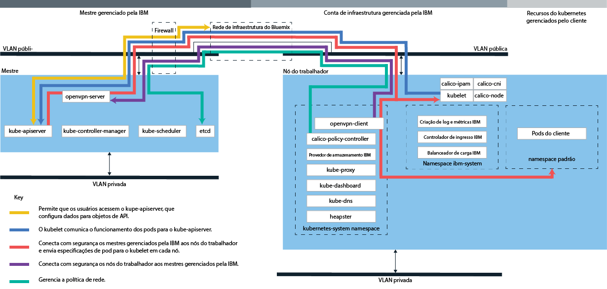

---

copyright:
  years: 2014, 2019
lastupdated: "2019-06-07"

keywords: kubernetes, iks

subcollection: containers

---

{:new_window: target="blank"}
{:shortdesc: .shortdesc}
{:screen: .screen}
{:pre: .pre}
{:table: .aria-labeledby="caption"}
{:codeblock: .codeblock}
{:tip: .tip}
{:note: .note}
{:important: .important}
{:deprecated: .deprecated}
{:download: .download}
{:preview: .preview}


# Descontinuado: nuvem dedicada
{: #dedicated}

O {{site.data.keyword.containerlong}} no {{site.data.keyword.Bluemix_dedicated_notm}} foi descontinuado. Não é possível criar clusters em um ambiente do {{site.data.keyword.Bluemix_dedicated_notm}}. Para criar clusters no {{site.data.keyword.Bluemix_notm}} Public, consulte [Introdução ao {{site.data.keyword.containerlong_notm}}](/docs/containers?topic=containers-getting-started).
{: deprecated}

Se tiver uma conta do {{site.data.keyword.Bluemix_dedicated_notm}}, será possível implementar clusters Kubernetes em um ambiente de nuvem dedicada (`https://<my-dedicated-cloud-instance>.bluemix.net`) e se conectar a serviços previamente selecionados do {{site.data.keyword.Bluemix_notm}} que também estejam em execução nesse ambiente.
{:shortdesc}

Se você não tiver uma conta do {{site.data.keyword.Bluemix_dedicated_notm}}, será possível [iniciar com {{site.data.keyword.containerlong_notm}}](/docs/containers?topic=containers-getting-started) em uma conta pública do {{site.data.keyword.Bluemix_notm}}.

## Sobre o ambiente de nuvem dedicada
{: #dedicated_environment}

Com uma conta do {{site.data.keyword.Bluemix_dedicated_notm}}, os recursos físicos disponíveis são dedicados somente ao seu cluster e não são compartilhados com clusters de outros clientes da {{site.data.keyword.IBM_notm}}. Você pode escolher configurar um ambiente do {{site.data.keyword.Bluemix_dedicated_notm}} quando deseja isolamento para seu cluster e requer isolamento para os outros serviços do {{site.data.keyword.Bluemix_notm}} usados. Se você não tem uma conta dedicada, é possível [criar clusters com hardware dedicado no {{site.data.keyword.Bluemix_notm}} público](/docs/containers?topic=containers-clusters#clusters_ui).
{: shortdesc}

Com o {{site.data.keyword.Bluemix_dedicated_notm}}, é possível criar clusters usando o catálogo no console dedicado ou usando a CLI do {{site.data.keyword.containerlong_notm}}. Para usar o console Dedicated, você efetua login nas contas Dedicated e pública simultaneamente usando seu IBMid. É possível usar o login dual para acessar seus clusters públicos usando seu console Dedicated. Para usar a CLI, efetue login usando seu terminal Dedicado (`api.<my-dedicated-cloud-instance>.bluemix.net.`). Em seguida, destine o terminal de API do {{site.data.keyword.containerlong_notm}} da região pública que está associada ao ambiente Dedicated.

As diferenças mais significativas entre o {{site.data.keyword.Bluemix_notm}} público e dedicado são as seguintes.

*   No {{site.data.keyword.Bluemix_dedicated_notm}}, o {{site.data.keyword.IBM_notm}} possui e gerencia a conta de infraestrutura do IBM Cloud (SoftLayer) nos quais os nós do trabalhador, VLANs e sub-redes são implementados. No {{site.data.keyword.Bluemix_notm}} público, você possui a conta de infraestrutura do IBM Cloud (SoftLayer).
*   No {{site.data.keyword.Bluemix_dedicated_notm}}, as especificações para as VLANs e sub-redes na conta de infraestrutura do IBM Cloud (SoftLayer) gerenciada pelo {{site.data.keyword.IBM_notm}} são determinadas quando o ambiente Dedicado é ativado. No {{site.data.keyword.Bluemix_notm}} público, as especificações para as VLANs e sub-redes são determinadas quando o cluster é criado.

### Diferenças no gerenciamento de cluster entre os ambientes de nuvem
{: #dedicated_env_differences}

<table>
<caption>Diferenças no gerenciamento de cluster</caption>
<col width="20%">
<col width="40%">
<col width="40%">
 <thead>
 <th>Áreas</th>
 <th>{{site.data.keyword.Bluemix_notm}} público</th>
 <th>{{site.data.keyword.Bluemix_dedicated_notm}}</th>
 </thead>
 <tbody>
 <tr>
 <td>Criação do cluster</td>
 <td>Crie um cluster grátis ou um cluster padrão.</td>
 <td>Crie um cluster padrão.</td>
 </tr>
 <tr>
 <td>Hardware de cluster e propriedade</td>
 <td>Em clusters padrão, o hardware pode ser compartilhado por outros clientes {{site.data.keyword.IBM_notm}} ou dedicado somente a você. As VLANs públicas e privadas são pertencentes e gerenciadas por você em sua conta de infraestrutura do IBM Cloud (SoftLayer).</td>
 <td>Em clusters no {{site.data.keyword.Bluemix_dedicated_notm}}, o hardware é sempre dedicado. As VLANs públicas e privadas disponíveis para criação de cluster são predefinidas quando o ambiente do {{site.data.keyword.Bluemix_dedicated_notm}} é configurado e pertencem e são gerenciadas pela IBM para você. A zona que está disponível durante a criação de cluster também é predefinida para o ambiente do {{site.data.keyword.Bluemix_notm}}.</td>
 </tr>
 <tr>
 <td>Balanceador de carga e rede de Ingresso</td>
 <td>Durante o fornecimento de clusters padrão, as ações a seguir ocorrem automaticamente.<ul><li>Uma sub-rede pública móvel e uma sub-rede privada móvel são ligadas ao seu cluster e designadas à sua conta do IBM Cloud infrastructure (SoftLayer). Mais sub-redes podem ser solicitadas por meio de sua conta de infraestrutura do IBM Cloud (SoftLayer).</li></li><li>Um endereço IP público móvel é usado para um balanceador de carga do aplicativo (ALB) altamente disponível do Ingress e uma rota pública exclusiva é designada no formato <code>&lt;cluster_name&gt;. Containers.appdomain.cloud</code>. É possível usar essa rota para expor múltiplos apps ao público. Um endereço IP privado móvel será usado para um ALB privado.</li><li>Quatro endereços IP públicos móveis e quatro endereços IP privados móveis são designados ao cluster que pode ser usado para serviços de balanceador de carga.</ul></td>
 <td>Quando você cria sua conta dedicada, você toma uma decisão de conectividade sobre como deseja expor e acessar seus serviços de cluster. Para usar seus próprios intervalos de IP corporativos (IPs gerenciados pelo usuário), deve-se fornecê-los ao [configurar um ambiente do {{site.data.keyword.Bluemix_dedicated_notm}}](/docs/dedicated?topic=dedicated-dedicated#setupdedicated). <ul><li>Por padrão, nenhuma sub-rede pública é ligada aos clusters que você cria em sua conta dedicada. Em vez disso, você tem a flexibilidade de escolher o modelo de conectividade que melhor combina com sua empresa.</li><li>Depois de criar o cluster, você escolhe o tipo de sub-rede que você deseja ligar e usar com seu cluster para a conectividade do balanceador de carga ou do Ingress.<ul><li>Para sub-redes móveis públicas ou privadas, é possível [incluir sub-redes nos clusters](/docs/containers?topic=containers-subnets#subnets)</li><li>Para endereços IP gerenciados pelo usuário que você forneceu à IBM na migração do dedicado, é possível [incluir sub-redes gerenciadas por usuário nos clusters](#dedicated_byoip_subnets).</li></ul></li><li>Depois que você ligar uma sub-rede ao cluster, o ALB do Ingress será criado. Uma rota pública do Ingress será criada somente se você usar uma sub-rede pública móvel.</li></ul></td>
 </tr>
 <tr>
 <td>Rede de NodePort</td>
 <td>Exponha uma porta pública em seu nó do trabalhador e use o endereço IP público do nó do trabalhador
para acessar publicamente seu serviço no cluster.</td>
 <td>Todos os endereços IP públicos dos nós do trabalhador são bloqueados por um firewall. No entanto, para serviços do {{site.data.keyword.Bluemix_notm}} que são incluídos no cluster, o NodePort pode ser acessado por meio de um endereço IP público ou um endereço IP privado.</td>
 </tr>
 <tr>
 <td>Armazenamento persistente</td>
 <td>Use o [fornecimento
dinâmico](/docs/containers?topic=containers-kube_concepts#dynamic_provisioning) ou o [fornecimento
estático](/docs/containers?topic=containers-kube_concepts#static_provisioning) de volumes.</td>
 <td>Use [fornecimento dinâmico](/docs/containers?topic=containers-kube_concepts#dynamic_provisioning) de volumes. [Abra um caso de suporte](/docs/get-support?topic=get-support-getting-customer-support) para solicitar um backup para seus volumes, solicite uma restauração por meio de seus volumes e execute outras funções de armazenamento.</li></ul></td>
 </tr>
 <tr>
 <td>URL do registro de imagem no {{site.data.keyword.registryshort_notm}}</td>
 <td><ul><li>Sul e Leste dos EUA: <code>registry.ng bluemix.net</code></li><li>Sul do Reino Unido: <code>registry.eu-gb.bluemix.net</code></li><li>UE Central (Frankfurt): <code>registry.eu-de.bluemix.net</code></li><li>Austrália (Sydney): <code>registry.au-syd.bluemix.net</code></li></ul></td>
 <td><ul><li>Para novos namespaces, use os mesmos registros baseados em região que são definidos para o {{site.data.keyword.Bluemix_notm}} público.</li><li>Para namespaces que foram configurados para contêineres únicos e escaláveis no {{site.data.keyword.Bluemix_dedicated_notm}}, use <code>registro.&lt;dedicated_domain&gt;</code></li></ul></td>
 </tr>
 <tr>
 <td>Acessando o registro</td>
 <td>Consulte as opções em [Usando registros de imagem privada e pública com o {{site.data.keyword.containerlong_notm}}](/docs/containers?topic=containers-images).</td>
 <td><ul><li>Para novos namespaces, veja as opções em [Usando registros de imagem privada e pública com o {{site.data.keyword.containerlong_notm}}](/docs/containers?topic=containers-images).</li><li>Para namespaces que tenham sido configurados para grupos únicos e escaláveis, [use um token e crie um segredo do
Kubernetes](#cs_dedicated_tokens) para autenticação.</li></ul></td>
 </tr>
 <tr>
 <td>Clusters de múltiplas zonas</td>
 <td>Crie [clusters de múltiplas zonas](/docs/containers?topic=containers-ha_clusters#multizone) incluindo mais zonas em seus conjuntos de trabalhadores.</td>
 <td>Crie  [ clusters de zona única ](/docs/containers?topic=containers-ha_clusters#single_zone). A zona disponível foi predefinida quando o ambiente do {{site.data.keyword.Bluemix_dedicated_notm}} foi configurado. Por padrão, um cluster de zona única é configurado com um conjunto de trabalhadores denominado `default`. O conjunto de trabalhadores agrupa nós do trabalhador com a mesma configuração, tal como o tipo de máquina, que você definiu durante a criação do cluster. É possível incluir mais nós do trabalhador em seu cluster [redimensionando um conjunto de trabalhadores existente](/docs/containers?topic=containers-add_workers#resize_pool) ou [incluindo um novo conjunto de trabalhadores](/docs/containers?topic=containers-add_workers#add_pool). Ao incluir um conjunto de trabalhadores, deve-se incluir a zona disponível no conjunto de trabalhadores para que os trabalhadores possam implementar na zona. No entanto, não é possível incluir outras zonas em seus conjuntos de trabalhadores.</td>
 </tr>
</tbody></table>
{: caption="Diferenças de recursos entre o {{site.data.keyword.Bluemix_notm}} público e o {{site.data.keyword.Bluemix_dedicated_notm}}" caption-side="top"}

<br />


### Arquitetura de serviço
{: #dedicated_ov_architecture}

Cada nó do trabalhador é configurado com recursos de cálculo, rede e serviço de volume separados.
{:shortdesc}

Recursos de segurança integrados fornecem isolamento, capacidades de gerenciamento de recurso e conformidade de segurança do nó do trabalhador. O nó do trabalhador se comunica com o mestre usando certificados TLS seguros e conexão OpenVPN.


*Arquitetura e rede do Kubernetes no {{site.data.keyword.Bluemix_dedicated_notm}}*



<br />


## Configurando o  {{site.data.keyword.containerlong_notm}}  no Dedicated
{: #dedicated_setup}

Cada ambiente do {{site.data.keyword.Bluemix_dedicated_notm}} tem uma conta corporativa pública, de propriedade do cliente, no {{site.data.keyword.Bluemix_notm}}. Para que os usuários no ambiente Dedicado criem clusters, o administrador deve incluir os usuários em uma conta corporativa pública.
{:shortdesc}

Antes de iniciar:
  * [Configure um ambiente do {{site.data.keyword.Bluemix_dedicated_notm}}](/docs/dedicated?topic=dedicated-dedicated#setupdedicated).
  * Caso o seu sistema local ou sua rede corporativa controle os terminais de Internet pública usando proxies ou firewalls, deve-se [abrir portas e endereços IP requeridos em seu firewall](/docs/containers?topic=containers-firewall#firewall).
  * [Download da CLI do Cloud Foundry](https://github.com/cloudfoundry/cli/releases).

Para permitir que os usuários do {{site.data.keyword.Bluemix_dedicated_notm}} acessem clusters:

1.  O proprietário de sua conta pública do {{site.data.keyword.Bluemix_notm}} deve gerar uma chave API.
    1.  Efetue login no endpoint para a sua instância do {{site.data.keyword.Bluemix_dedicated_notm}}. Insira as credenciais do {{site.data.keyword.Bluemix_notm}} para o proprietário da conta pública e selecione a conta quando solicitado.

        ```
        ibmcloud login -a api.<my-dedicated-cloud-instance>.<region>.bluemix.net
        ```
        {: pre}

        Se tiver um ID federado, use `ibmcloud login -a api.<my-dedicated-cloud-instance>.<region>.bluemix.net --sso` para efetuar login na CLI do {{site.data.keyword.Bluemix_notm}}. Insira seu nome do usuário e use a URL fornecida na saída da CLI para recuperar sua senha descartável. Você sabe que tem um ID federado quando o login falha sem o `--sso` e é bem-sucedido com a opção `--sso`.
        {: tip}

    2.  Gere uma chave API para convidar usuários para a conta pública. Anote o valor da chave API, que o administrador da conta Dedicated deve usar na próxima etapa.

        ```
        ibmcloud iam api-key-create <key_name> -d "Key to invite users to <dedicated_account_name>"
        ```
        {: pre}

    3.  Anote o GUID da organização da conta pública para a qual você deseja convidar usuários, que o administrador da conta Dedicated deve usar na próxima etapa.

        ```
        orgs de contas ibmcloud
        ```
        {: pre}

2.  O proprietário de sua conta do {{site.data.keyword.Bluemix_dedicated_notm}} pode convidar um único usuário ou vários para sua conta pública.
    1.  Efetue login no endpoint para a sua instância do {{site.data.keyword.Bluemix_dedicated_notm}}. Insira as credenciais do {{site.data.keyword.Bluemix_notm}} para o proprietário da conta dedicada e selecione a conta quando solicitado.

        ```
        ibmcloud login -a api.<my-dedicated-cloud-instance>.<region>.bluemix.net
        ```
        {: pre}

        Se tiver um ID federado, use `ibmcloud login -a api.<my-dedicated-cloud-instance>.<region>.bluemix.net --sso` para efetuar login na CLI do {{site.data.keyword.Bluemix_notm}}. Insira seu nome do usuário e use a URL fornecida na saída da CLI para recuperar sua senha descartável. Você sabe que tem um ID federado quando o login falha sem o `--sso` e é bem-sucedido com a opção `--sso`.
        {: tip}

    2.  Convide os usuários para a conta pública.
        * Para convidar um único usuário:

            ```
            ibmcloud cf bluemix-admin invite-users-to-public -userid=<user_email> -apikey=<public_API_key> -public_org_id=<public_org_ID>
            ```
            {: pre}

            Substitua <em>&lt;user_IBMid&gt;</em> pelo e-mail do usuário que você deseja convidar, <em>&lt;public_API_key&gt;</em> pela chave API gerada na etapa anterior e <em>&lt;public_org_ID&gt;</em> pelo GUID da organização da conta pública. 

        * Para convidar todos os usuários atualmente em uma organização de conta dedicada:

            ```
            ibmcloud cf bluemix-admin invite-users-to-public -organization=<dedicated_org_ID> -apikey=<public_API_key> -public_org_id=<public_org_ID>
            ```

            Substitua <em>&lt;dedicated_org_ID&gt;</em> pelo ID da organização da conta dedicada, <em>&lt;public_API_key&gt;</em> pela chave API gerada na etapa anterior e <em>&lt;public_org_ID&gt;</em> pelo GUID da organização da conta pública. 

    3.  Se um IBMid existe para um usuário, o usuário é automaticamente incluído na organização especificada na conta pública. Se um IBMid não existe para um usuário, um convite é enviado para o endereço de e-mail do usuário. Depois que o usuário aceita o convite, um IBMid é criado para o usuário e o usuário é incluído na organização especificada na conta pública.

    4.  Verifique se os usuários foram incluídos na conta.

        ```
        ibmcloud cf bluemix-admin invite-users-status -apikey=<public_API_key>
        ```
        {: pre}

        Os usuários convidados que têm um IBMid existente têm o status `ACTIVE`. Os usuários convidados que não têm um IBMid existente têm o status `PENDING` antes de aceitarem o convite e o status `ACTIVE` depois de aceitarem o convite.

3.  Se qualquer usuário precisa de privilégios de criação de cluster, deve-se conceder a função de Administrador para esse usuário.

    1.  Na barra de menus no console público, clique em **Gerenciar > Segurança > Identidade e acesso** e, em seguida, clique em **Usuários**.

    2.  Na linha para o usuário designar acesso, selecione o menu **Ações** e, em seguida, clique em **Designar acesso**.

    3.  Selecione **Designar acesso a recursos**.

    4.  Na lista **Serviços** , selecione **{{site.data.keyword.containerlong}}**.

    5.  Na lista **Região**, selecione **Todas as regiões atuais** ou uma região específica, se solicitado.

    6. Em **Selecionar funções**, selecione Administrador.

    7. Clique em **Designar**.

4.  Os usuários podem agora efetuar login no terminal de conta dedicada para iniciar a criação de clusters.

    1.  Efetue login no endpoint para a sua instância do {{site.data.keyword.Bluemix_dedicated_notm}}. Insira seu IBMid quando solicitado.

        ```
        ibmcloud login -a api.<my-dedicated-cloud-instance>.<region>.bluemix.net
        ```
        {: pre}

        Se tiver um ID federado, use `ibmcloud login -a api.<my-dedicated-cloud-instance>.<region>.bluemix.net --sso` para efetuar login na CLI do {{site.data.keyword.Bluemix_notm}}. Insira seu nome do usuário e use a URL fornecida na saída da CLI para recuperar sua senha descartável. Você sabe que tem um ID federado quando o login falha sem o `--sso` e é bem-sucedido com a opção `--sso`.
        {: tip}

    2.  Se você estiver efetuando login pela primeira vez, forneça seu ID do usuário dedicado e senha quando solicitado. Sua conta Dedicated é autenticada e as contas Dedicated e pública são vinculadas. Toda vez que efetua login após essa primeira vez, você usa somente o seu IBMid para efetuar login. Para obter mais informações, veja [Conectando um ID dedicado ao seu IBMid público](/docs/iam?topic=iam-connect_dedicated_id#connect_dedicated_id).

        Deve-se efetuar login na sua conta do Dedicated e na sua conta pública para criar clusters. Se você desejar efetuar login somente na sua conta Dedicated, use a sinalização `--no-iam` quando efetuar login no terminal Dedicated.
        {: note}

    3.  Para criar ou acessar clusters no ambiente dedicado, deve-se configurar a região que está associada a esse ambiente. **Nota**: não é possível criar clusters em grupos de recursos diferentes de `default`.

        ```
        ibmcloud ks region-set
        ```
        {: pre}

5.  Se desejar desvincular suas contas, será possível desconectar seu IBMid do seu ID do usuário dedicado. Para obter mais informações, veja [Desconectar o seu ID dedicado do IBMid público](/docs/iam?topic=iam-connect_dedicated_id#disconnect_id).

    ```
    ibmcloud iam UNK-id-disconnect
    ```
    {: pre}

<br />


## Criando clusters
{: #dedicated_administering}

Projete sua configuração de cluster do {{site.data.keyword.Bluemix_dedicated_notm}} para máxima disponibilidade e capacidade.
{:shortdesc}

### Criando clusters com o console do {{site.data.keyword.Bluemix_notm}}
{: #dedicated_creating_ui}

1. Abra seu console Dedicado: `https://<my-dedicated-cloud-instance>.bluemix.net`.

2. Marque a caixa de seleção **Efetuar login também no {{site.data.keyword.Bluemix_notm}} Público** e clique em **Efetuar login**.

3. Siga os prompts para efetuar login com seu IBMid. Se você está efetuando login em sua conta Dedicated pela primeira vez, siga os prompts para efetuar login no {{site.data.keyword.Bluemix_dedicated_notm}}.

4. No catálogo, selecione **Contêineres** e clique em **Cluster do Kubernetes**.

5. Configure os detalhes do seu cluster.

    1. Insira um **Nome do cluster**. O nome deve iniciar com uma letra, pode conter letras, números e hífen (-) e deve ter 35 caracteres ou menos. Use um nome que seja exclusivo entre as regiões. O nome do cluster e a região na qual o cluster está implementado formam o nome completo do domínio para o subdomínio do Ingress. Para assegurar que o subdomínio do Ingress seja exclusivo dentro de uma região, o nome do cluster pode ser truncado e anexado com um valor aleatório dentro do nome de domínio do Ingress.

    2. Selecione a **Zona** na qual implementar seu cluster. A zona disponível foi predefinida quando o ambiente do {{site.data.keyword.Bluemix_dedicated_notm}} foi configurado.

    3. Escolha a versão do servidor da API do Kubernetes para o nó principal do cluster.

    4. Selecione um tipo de isolamento de hardware. Virtual é faturado por hora e bare metal é faturado mensalmente.

        - **Virtual - Dedicado**: os seus nós do trabalhador são hospedados na infraestrutura que é dedicada à sua conta. Os seus recursos físicos estão completamente isolados.

        - **Bare Metal**: os servidores bare metal faturados mensalmente são provisionados manualmente pela infraestrutura do IBM Cloud (SoftLayer) após o pedido e podem levar mais de um dia útil para serem concluídos. Bare metal é mais adequado para aplicativos de alto desempenho que precisam de mais recursos e controle do host. Para selecionar tipos de máquina, também é possível escolher ativar [Trusted Compute](/docs/containers?topic=containers-security#trusted_compute) para verificar os nós do trabalhador contra a violação. Se você não ativar a confiança durante a criação do cluster, mas desejar fazer isso posteriormente, será possível usar o [comando](/docs/containers?topic=containers-cli-plugin-kubernetes-service-cli#cs_cluster_feature_enable) `ibmcloud ks feature-enable`. Depois de ativar a confiança, não é possível desativá-la posteriormente.

        Certifique-se de que deseja provisionar uma máquina bare metal. Como o faturamento é mensal, se ele for cancelado imediatamente após uma ordem por engano, você ainda será cobrado pelo mês integral.
        {:tip}

    5. Selecione um **Tipo de máquina**. O tipo de máquina define a quantia de CPU virtual, memória e espaço em disco que é configurada em cada nó do trabalhador e disponibilizada para os contêineres. Os tipos de bare metal e máquinas virtuais disponíveis variam de acordo com a zona na qual você implementa o cluster. Para obter mais informações, consulte a documentação do [comando](/docs/containers?topic=containers-cli-plugin-kubernetes-service-cli#cs_machine_types) `ibmcloud ks machine-type`. Depois de criar seu cluster, é possível incluir tipos de máquinas diferentes, incluindo um nó do trabalhador no cluster.

    6. Escolha o **Número de nós do trabalhador** que você precisa. Selecione `3` para assegurar a alta disponibilidade de seu cluster.

    7. Selecione uma **VLAN pública** (opcional) e uma **VLAN privada** (necessário). As VLANs pública e privada disponíveis são predefinidas quando o ambiente do {{site.data.keyword.Bluemix_dedicated_notm}} é configurado. Ambas as VLANs se comunicam entre os nós do trabalhador, mas a VLAN pública também se comunica com o mestre do Kubernetes gerenciado pela IBM. É possível usar a mesma VLAN para múltiplos clusters.
        Se os nós do trabalhador estão configurados somente com uma VLAN privada, deve-se permitir que os nós do trabalhador e o cluster mestre se comuniquem [ativando o terminal em serviço privado](/docs/containers?topic=containers-cs_network_cluster#set-up-private-se) ou [configurando um dispositivo de gateway](/docs/containers?topic=containers-plan_clusters#workeruser-master).
        {: note}

    8. Por padrão, **Criptografar disco local** é selecionado. Se você escolher limpar a caixa de seleção, os dados de tempo de execução do contêiner do host não serão criptografados. [ Saiba mais sobre a criptografia ](/docs/containers?topic=containers-security#encrypted_disk).

6. Clique em **Criar cluster**. É possível ver o progresso da implementação do nó do trabalhador na guia **Nós do trabalhador**. Quando a implementação é feita, é possível ver que seu cluster está pronto na guia **Visão geral**.
    A cada nó do trabalhador é designado um ID de nó do trabalhador e um nome de domínio exclusivos que não devem ser
mudados manualmente após a criação do cluster. Mudar o ID ou o nome do domínio evita que o
mestre do Kubernetes gerencie o cluster.
    {: important}

### Criando clusters com a CLI
{: #dedicated_creating_cli}

1.  Instale a CLI do {{site.data.keyword.Bluemix_notm}} e o [plug-in do {{site.data.keyword.containerlong_notm}}](/docs/containers?topic=containers-cs_cli_install#cs_cli_install).
2.  Efetue login no endpoint para a sua instância do {{site.data.keyword.Bluemix_dedicated_notm}}. Insira suas credenciais do {{site.data.keyword.Bluemix_notm}} e selecione sua conta quando solicitado.

    ```
    ibmcloud login -a api.<my-dedicated-cloud-instance>.<region>.bluemix.net
    ```
    {: pre}

    Se tiver um ID federado, use `ibmcloud login -a api.<my-dedicated-cloud-instance>.<region>.bluemix.net --sso` para efetuar login na CLI do {{site.data.keyword.Bluemix_notm}}. Insira seu nome do usuário e use a URL fornecida na saída da CLI para recuperar sua senha descartável. Você sabe que tem um ID federado quando o login falha sem o `--sso` e é bem-sucedido com a opção `--sso`.
    {: tip}

3.  Tenha como destino um terminal regional. Os terminais regionais a seguir são suportados:
  * Dallas (Sul dos EUA, us-south): `https://us-south.containers.cloud.ibm.com`
  * Frankfurt (UE Central, eu-de): `https://eu-de.containers.cloud.ibm.com`
  * Londres (Sul do Reino Unido, eu-gb): `https://eu-gb.containers.cloud.ibm.com`
  * Sydney (Sul da Ásia-Pacífico, au-syd): `https://au-syd.containers.cloud.ibm.com`
  * Tóquio (Norte da Ásia-Pacífico, jp-tok): `https://jp-tok.containers.cloud.ibm.com`
  * Washington, D.C. (Leste dos EUA, us-east): `https://us-east.containers.cloud.ibm.com`
  ```
  ibmcloud ks init --host <endpoint>
  ```
  {: pre}
  Não é possível usar o terminal global, `https://containers.cloud.ibm.com`. Deve-se ter como destino um terminal regional para criar ou trabalhar com clusters nessa região.
  {: important}

4.  Crie um cluster com o comando `cluster-create`. Ao criar um cluster padrão, o hardware do nó do trabalhador é faturado por horas de uso.

    Exemplo:

    ```
    ibmcloud ks cluster-create --zone <zone> --machine-type <machine_type> --name <cluster_name> --workers <number>
    ```
    {: pre}

    <table>
    <caption>Entendendo os componentes deste comando</caption>
    <thead>
    <th colspan=2> entendendo os componentes desse comando</th>
    </thead>
    <tbody>
    <tr>
    <td><code>cluster-create</code></td>
    <td>O comando para criar um cluster na organização do {{site.data.keyword.Bluemix_notm}}.</td>
    </tr>
    <tr>
    <td><code>--zone <em>&lt;zone&gt;</em></code></td>
    <td>Insira o ID de zona do {{site.data.keyword.Bluemix_notm}} que seu ambiente do Dedicated está configurado para usar.</td>
    </tr>
    <tr>
    <td><code>--machine-type <em>&lt;machine_type&gt;</em></code></td>
    <td>Insira um tipo de máquina. É possível implementar os nós do trabalhador como máquinas virtuais no hardware dedicado ou como máquinas físicas no bare metal. Os tipos de máquinas físicas e virtuais disponíveis variam de acordo com a zona na qual você implementa o cluster. Para obter mais informações, consulte a documentação do [comando](/docs/containers?topic=containers-cli-plugin-kubernetes-service-cli#cs_machine_types) `ibmcloud ks machine-type`.</td>
    </tr>
    <tr>
    <td><code>--public-vlan <em>&lt;machine_type&gt;</em></code></td>
    <td>Insira o ID da VLAN pública que seu ambiente dedicado está configurado para usar. Se você deseja conectar seus nós do trabalhador somente a uma VLAN privada, não especifique esta opção.<p class="note">Se os nós do trabalhador estão configurados somente com uma VLAN privada, deve-se permitir que os nós do trabalhador e o cluster mestre se comuniquem [ativando o terminal em serviço privado](/docs/containers?topic=containers-cs_network_cluster#set-up-private-se) ou [configurando um dispositivo de gateway](/docs/containers?topic=containers-plan_clusters#workeruser-master).</p></td>
    </tr>
    <tr>
    <td><code>--private-vlan <em>&lt;machine_type&gt;</em></code></td>
    <td>Insira o ID da VLAN privada que seu ambiente dedicado está configurado para usar.</td>
    </tr>  
    <tr>
    <td><code>--name <em>&lt;name&gt;</em></code></td>
    <td>Insira um nome para seu cluster. O nome deve iniciar com uma letra, pode conter letras, números e hífen (-) e deve ter 35 caracteres ou menos. Use um nome que seja exclusivo entre as regiões. O nome do cluster e a região na qual o cluster está implementado formam o nome completo do domínio para o subdomínio do Ingress. Para assegurar que o subdomínio do Ingress seja exclusivo dentro de uma região, o nome do cluster pode ser truncado e anexado com um valor aleatório dentro do nome de domínio do Ingress.
</td>
    </tr>
    <tr>
    <td><code>--workers <em>&lt;number&gt;</em></code></td>
    <td>Insira o número de nós do trabalhador a serem incluídos no cluster. Se a opção <code>--workers</code> não for especificada, um nó do trabalhador será criado.</td>
    </tr>
    <tr>
    <td><code>--kube-version <em>&lt;major.minor.patch&gt;</em></code></td>
    <td>A versão do Kubernetes para o nó principal do cluster. Esse valor é opcional. Quando a versão não for especificada, o cluster será criado com o padrão de versões do Kubernetes suportadas. Para ver as versões disponíveis, execute <code>ibmcloud ks versions</code>.
</td>
    </tr>
    <tr>
    <td><code>--disable-disk-encrypt</code></td>
    <td>Os nós do trabalhador apresentam a [criptografia de disco](/docs/containers?topic=containers-security#encrypted_disk) do AES de 256 bits por padrão. Se desejar desativar a criptografia, inclua esta opção.</td>
    </tr>
    <tr>
    <td><code>--trusted</code></td>
    <td>Ative [Cálculo confiável](/docs/containers?topic=containers-security#trusted_compute) para verificar os nós do trabalhador do bare metal com relação à violação. Se você não ativar a confiança durante a criação do cluster, mas desejar fazer isso posteriormente, será possível usar o [comando](/docs/containers?topic=containers-cli-plugin-kubernetes-service-cli#cs_cluster_feature_enable) `ibmcloud ks feature-enable`. Depois de ativar a confiança, não é possível desativá-la posteriormente.</td>
    </tr>
    </tbody></table>

5.  Verifique se a criação do cluster foi solicitada.

    ```
    ibmcloud ks clusters
    ```
    {: pre}

    * Para máquinas virtuais, pode levar alguns minutos para que as máquinas do nó do trabalhador sejam ordenadas e para que o cluster seja configurado e provisionado em sua conta. As máquinas físicas bare metal são provisionadas pela interação manual com a infraestrutura do IBM Cloud (SoftLayer) e podem levar mais de um dia útil para serem concluídas.
    * Se você vir a mensagem de erro a seguir, [abra um caso de suporte](/docs/get-support?topic=get-support-getting-customer-support).
        ```
        Exceção de infraestrutura do {{site.data.keyword.Bluemix_notm}}: não foi possível fazer a ordem. Há recursos insuficientes atrás do roteador 'router_name' para preencher a solicitação para os convidados a seguir: 'worker_id'.
        ```

    Quando o provisionamento de seu cluster for concluído, o status de seu cluster mudará para **implementado**.

    ```
    Name ID State Created Workers Zone Version Resource Group Name my_cluster paf97e8843e29941b49c598f516de72101 deployed 20170201162433 1 mil01 1.13.6 Default
    ```
    {: screen}

6.  Verifique o status dos nós do trabalhador.

    ```
    ibmcloud ks workers --cluster <cluster_name_or_ID>
    ```
    {: pre}

    Quando os nós do trabalhador estiverem prontos, o estado mudará para **normal** e o status será **Pronto**. Quando o status do nó for **Pronto**, será possível, então, acessar o cluster.

    A cada nó do trabalhador é designado um ID do nó do trabalhador e um nome de domínio exclusivos que não devem ser mudados manualmente após a criação do cluster. Mudar o ID ou o nome do domínio evita que o
mestre do Kubernetes gerencie o cluster.
    {: important}

    ```
    ID                                                 Public IP       Private IP       Machine Type   State    Status   Zone   Version
    kube-mil01-paf97e8843e29941b49c598f516de72101-w1   169.xx.xxx.xxx  10.xxx.xx.xxx    free           normal   Ready    mil01      1.13.6
    ```
    {: screen}

7.  Configure o cluster que você criou como o contexto para essa sessão. Conclua estas etapas de configuração toda vez que você trabalhar com o seu cluster.

    1.  Obtenha o comando para configurar a variável de ambiente e fazer download dos arquivos de configuração do Kubernetes.

        ```
        ibmcloud ks cluster-config --cluster <cluster_name_or_ID>
        ```
        {: pre}

        Quando o download dos arquivos de configuração estiver concluído, será exibido um comando que poderá ser usado para configurar o caminho para o seu arquivo de configuração local do Kubernetes como uma variável de ambiente.

        Exemplo para OS X:

        ```
        export KUBECONFIG=/Users/<user_name>/.bluemix/plugins/container-service/clusters/<cluster_name>/kube-config-prod-dal10-<cluster_name>.yml
        ```
        {: screen}

    2.  Copie e cole o comando na saída para configurar a variável de ambiente `KUBECONFIG`.
    3.  Verifique se a variável de ambiente `KUBECONFIG` está configurada corretamente.

        Exemplo para OS X:

        ```
        echo $KUBECONFIG
        ```
        {: pre}

        Saída:

        ```
        /Users/<user_name>/.bluemix/plugins/container-service/clusters/<cluster_name>/kube-config-prod-dal10-<cluster_name>.yml

        ```
        {: screen}

8.  Acesse seu painel do Kubernetes com a porta padrão 8001.
    1.  Configure o proxy com o número da porta padrão.

        ```
        kubectl proxy
        ```
        {: pre}

        ```
        Iniciando a entrega em 127.0.0.1:8001
        ```
        {: screen}

    2.  Abra a URL a seguir em um navegador da web para ver o painel do Kubernetes.

        ```
        http://localhost:8001/ui
        ```
        {: codeblock}

### Incluindo nós do trabalhador
{: #add_workers_dedicated}

Com um {{site.data.keyword.Bluemix_dedicated_notm}}, é possível criar somente [clusters de zona única](/docs/containers?topic=containers-ha_clusters#single_zone). Por padrão, um cluster de zona única é configurado com um conjunto de trabalhadores denominado `default`. O conjunto de trabalhadores agrupa nós do trabalhador com a mesma configuração, tal como o tipo de máquina, que você definiu durante a criação do cluster. É possível incluir mais nós do trabalhador em seu cluster [redimensionando um conjunto de trabalhadores existente](/docs/containers?topic=containers-add_workers#resize_pool) ou [incluindo um novo conjunto de trabalhadores](/docs/containers?topic=containers-add_workers#add_pool). Ao incluir um conjunto de trabalhadores, deve-se incluir a zona disponível no conjunto de trabalhadores para que os trabalhadores possam implementar na zona. No entanto, não é possível incluir outras zonas em seus conjuntos de trabalhadores.
{: shortdesc}

### Usando registros de imagem privada e pública
{: #dedicated_images}

Saiba mais sobre [como proteger suas informações pessoais](/docs/containers?topic=containers-security#pi) quando trabalhar com imagens de contêiner.

Para novos namespaces, veja as opções em [Usando registros de imagem privada e pública com o {{site.data.keyword.containerlong_notm}}](/docs/containers?topic=containers-images). Para namespaces que tenham sido configurados para grupos únicos e escaláveis, [use um token e crie um segredo do
Kubernetes](#cs_dedicated_tokens) para autenticação.

### Incluindo sub-redes nos clusters
{: #dedicated_cluster_subnet}

Mude o conjunto de endereços IP públicos móveis disponíveis, incluindo sub-redes em seu cluster. Para obter mais informações, consulte [Incluindo sub-redes nos clusters](/docs/containers?topic=containers-subnets#subnets). Revise as diferenças a seguir para incluir sub-redes nos clusters dedicados.
{: shortdesc}

#### Incluindo mais sub-redes gerenciadas pelo usuário e endereços IP em seus clusters do Kubernetes
{: #dedicated_byoip_subnets}

Forneça mais de suas próprias sub-redes por meio de uma rede no local que você deseja usar para acessar o {{site.data.keyword.containerlong_notm}}. É possível incluir endereços IP privados dessas sub-redes nos serviços Ingress e de balanceamento de carga em seu cluster do Kubernetes. Sub-redes gerenciadas pelos usuários são configuradas de uma das duas maneiras, dependendo do formato da sub-rede que você deseja usar.
{: shortdesc}

Requisitos:
- Sub-redes gerenciadas pelo usuário podem ser incluídas em VLANs privadas apenas.
- O limite de comprimento de prefixo de sub-rede é /24 para /30. Por exemplo, `203.0.113.0/24` especifica 253 endereços IP privados utilizáveis, enquanto `203.0.113.0/30` especifica 1 endereço IP privado utilizável.
- O primeiro endereço IP na sub-rede deve ser usado como o gateway para a sub-rede.

Antes de iniciar: configure o roteamento de tráfego de rede dentro e fora de sua rede corporativa para a rede do {{site.data.keyword.Bluemix_dedicated_notm}} que utilizará a sub-rede gerenciada pelo usuário.

1. Para usar sua própria sub-rede, [abra um caso de suporte](/docs/get-support?topic=get-support-getting-customer-support) e forneça a lista de CIDRs de sub-rede que você deseja usar. **Observação**: a forma com que o ALB e os balanceadores de carga são gerenciados para conectividade de conta local e interna difere, dependendo do formato da sub-rede CIDR. Consulte a etapa final para ver as diferenças de configuração.

2. Após a {{site.data.keyword.IBM_notm}} provisionar as sub-redes gerenciadas pelo usuário, torne a sub-rede disponível para seu cluster do Kubernetes.

    ```
    ibmcloud ks cluster-user-subnet-add --cluster <cluster_name> --subnet-cidr <subnet_CIDR> --private-vlan <private_VLAN>
    ```
    {: pre}
    Substitua <em>&lt;cluster_name&gt;</em> pelo nome ou ID de seu cluster, <em>&lt;subnet_CIDR&gt;</em> por um dos CIDRs de sub-rede que você forneceu no caso de suporte e <em>&lt;private_VLAN&gt;</em> com um ID de VLAN privada disponível. É possível localizar o ID de uma VLAN privada disponível, executando `ibmcloud ks vlans`.

3. Verifique se as sub-redes foram incluídas em seu cluster. O campo **Gerenciado pelo usuário** para sub-redes fornecidas pelo usuário é _`true`_.

    ```
    ibmcloud ks cluster-get --showResources <cluster_name>
    ```
    {: pre}

    ```
    Subnet VLANs
    VLAN ID   Subnet CIDR         Public       User-managed
    1555503   169.xx.xxx.xxx/24   true         false
    1555505   10.xxx.xx.xxx/24    false        false
    1555505   10.xxx.xx.xxx/24    false        true
    ```
    {: screen}

4. **Importante**: se você tiver várias VLANs para um cluster, várias sub-redes na mesma VLAN ou em um cluster de múltiplas zonas, deverá ativar um [Virtual Router Function (VRF)](/docs/infrastructure/direct-link?topic=direct-link-overview-of-virtual-routing-and-forwarding-vrf-on-ibm-cloud#overview-of-virtual-routing-and-forwarding-vrf-on-ibm-cloud) para sua conta de infraestrutura do IBM Cloud (SoftLayer) para que seus nós do trabalhador possam se comunicar entre si na rede privada. Para ativar o VRF, [entre em contato com o representante de conta da infraestrutura do IBM Cloud (SoftLayer)](/docs/infrastructure/direct-link?topic=direct-link-overview-of-virtual-routing-and-forwarding-vrf-on-ibm-cloud#how-you-can-initiate-the-conversion). Se não for possível ou você não desejar ativar o VRF, ative o [VLAN Spanning](/docs/infrastructure/vlans?topic=vlans-vlan-spanning#vlan-spanning). Para executar essa ação, você precisa da [permissão de infraestrutura](/docs/containers?topic=containers-users#infra_access) **Rede > Gerenciar a rede VLAN Spanning** ou é possível solicitar ao proprietário da conta para ativá-la. Para verificar se o VLAN Spanning já está ativado, use o [comando](/docs/containers?topic=containers-cli-plugin-kubernetes-service-cli#cs_vlan_spanning_get) `ibmcloud ks vlan-spanning-get --region<region>`.

5. Para configurar a conectividade de conta local e interna, escolha entre estas opções:
  - Se você usou um intervalo de endereços IP privados 10.x.x.x para a sub-rede, use os IPs válidos desse intervalo para configurar a conectividade de conta local e interna com o Ingress e um balanceador de carga. Para obter mais informações, consulte [Planejando a rede com o NodePort, o balanceador de carga ou os serviços do Ingress](/docs/containers?topic=containers-cs_network_planning#external).
  - Se você não usou um intervalo de endereços IP privados 10.x.x.x para a sub-rede, use os IPs válidos desse intervalo para configurar a conectividade local com o Ingress e um balanceador de carga. Para obter mais informações, consulte [Planejando a rede com o NodePort, o balanceador de carga ou os serviços do Ingress](/docs/containers?topic=containers-cs_network_planning#external). No entanto, deve-se usar uma sub-rede privada móvel de infraestrutura do IBM Cloud (SoftLayer) para configurar a conectividade de conta interna entre o seu cluster e outros serviços baseados no Cloud Foundry. É possível criar uma sub-rede privada móvel com o comando [`ibmcloud ks cluster-subnet-add`](/docs/containers?topic=containers-cli-plugin-kubernetes-service-cli#cs_cluster_subnet_add). Para este cenário, seu cluster tem tanto uma sub-rede gerenciada pelo usuário para conectividade local quanto uma sub-rede privada móvel de infraestrutura do IBM Cloud (SoftLayer) para conectividade de conta interna.

### Outras configurações de cluster
{: #dedicated_other}

Revise as opções a seguir para outras configurações de cluster:
  * [Gerenciando o acesso ao cluster](/docs/containers?topic=containers-users#access_policies)
  * [Atualizando o mestre do Kubernetes](/docs/containers?topic=containers-update#master)
  * [Atualizando nós do trabalhador](/docs/containers?topic=containers-update#worker_node)
  * [Configurando a criação de log do cluster](/docs/containers?topic=containers-health#logging). A ativação do log não é suportada pelo terminal Dedicado. Deve-se efetuar login no terminal público do {{site.data.keyword.cloud_notm}} e destinar sua organização e espaço públicos para ativar o encaminhamento de log.
  * [Configurando o monitoramento de cluster](/docs/containers?topic=containers-health#view_metrics). Um cluster `ibm-monitoring` existe dentro de cada conta do {{site.data.keyword.Bluemix_dedicated_notm}}. Esse cluster monitora continuamente o funcionamento do {{site.data.keyword.containerlong_notm}} no ambiente dedicado, verificando a estabilidade e a conectividade do ambiente. Não remova esse cluster do ambiente.
  * [Removendo clusters](/docs/containers?topic=containers-remove)

<br />


## Implementando apps em clusters
{: #dedicated_apps}

É possível usar técnicas do Kubernetes para implementar apps em clusters do {{site.data.keyword.Bluemix_dedicated_notm}} e para assegurar que seus apps estejam sempre funcionando.
{:shortdesc}

Para implementar apps em clusters, é possível seguir as instruções para [implementar apps em clusters públicos do {{site.data.keyword.Bluemix_notm}}](/docs/containers?topic=containers-app#app). Revise as diferenças a seguir para clusters do {{site.data.keyword.Bluemix_dedicated_notm}}.

Saiba mais sobre [como proteger suas informações pessoais](/docs/containers?topic=containers-security#pi) quando trabalhar com recursos do Kubernetes.

### Permitindo o acesso público a apps
{: #dedicated_apps_public}

Para ambientes do {{site.data.keyword.Bluemix_dedicated_notm}}, os endereços IP primários públicos são bloqueadas por um firewall. Para tornar um app disponível publicamente, use um [serviço de balanceador de carga](#dedicated_apps_public_load_balancer) ou [Ingress](#dedicated_apps_public_ingress) em vez de um serviço NodePort. Se você requerer acesso a um serviço de balanceador de carga ou Ingress para esses endereços IP públicos móveis, forneça uma lista de desbloqueio de firewall corporativo para a IBM no tempo de onboarding do serviço.
{: shortdesc}

#### Configurando o acesso a um app usando o tipo de serviço do balanceador de carga
{: #dedicated_apps_public_load_balancer}

Se você desejar usar endereços IP públicos para o balanceador de carga, assegure-se de que uma lista de desbloqueio de firewall corporativo tenha sido fornecida para a IBM ou [abra um caso de suporte](/docs/get-support?topic=get-support-getting-customer-support) para configurar a lista de desbloqueio de firewall. Em seguida, siga as etapas em [Balanceamento de carga básico e DSR com balanceadores de carga de rede (NLB)](/docs/containers?topic=containers-loadbalancer).
{: shortdesc}

#### Configurando o acesso público a um app usando o Ingress
{: #dedicated_apps_public_ingress}

Se você desejar usar endereços IP públicos para o ALB do Ingress, assegure-se de que uma lista de desbloqueio de firewall corporativo tenha sido fornecida para a IBM ou [abra um caso de suporte](/docs/get-support?topic=get-support-getting-customer-support) para configurar a lista de desbloqueio de firewall. Em seguida, siga as etapas em [Expondo apps ao público](/docs/containers?topic=containers-ingress#ingress_expose_public).
{: shortdesc}

### Criando armazenamento persistente
{: #dedicated_apps_volume_claim}

Para revisar opções para criar armazenamento persistente, consulte [Opções de armazenamento de dados persistentes para alta disponibilidade](/docs/containers?topic=containers-storage_planning#persistent_storage_overview). Para solicitar um backup de seus volumes, uma restauração de seus volumes, uma exclusão de volumes ou uma captura instantânea periódica do armazenamento de arquivo, deve-se [abrir um caso de suporte](/docs/get-support?topic=get-support-getting-customer-support).
{: shortdesc}

Se você escolher provisionar o [armazenamento de arquivo](/docs/containers?topic=containers-file_storage#file_predefined_storageclass), escolha as classes de armazenamento não retidas. Escolher classes de armazenamento sem retenção ajuda a evitar instâncias de armazenamento persistente órfãs na infraestrutura do IBM Cloud (SoftLayer) que você pode remover apenas abrindo um caso de suporte.

## Criando um token do {{site.data.keyword.registryshort_notm}} para um registro de imagem do {{site.data.keyword.Bluemix_dedicated_notm}}
{: #cs_dedicated_tokens}

Crie um token sem expiração para um registro de imagem que você usou para grupos únicos e escaláveis com clusters no {{site.data.keyword.containerlong}}.
{:shortdesc}

1.  Solicite um token de registro permanente para a sessão atual. Esse token concede acesso às imagens no namespace atual.
    ```
    ibmcloud cr token-add --description "<description>" --non-expiring -q
    ```
    {: pre}

2.  Verifique o segredo do Kubernetes.

    ```
    kubectl describe secrets
    ```
    {: pre}

    É possível usar esse segredo para trabalhar com o {{site.data.keyword.containerlong}}.

3.  Crie o segredo do Kubernetes para armazenar suas informações do token.

    ```
    kubectl --namespace <kubernetes_namespace> create secret docker-registry <secret_name>  --docker-server=<registry_url> --docker-username=token --docker-password=<token_value> --docker-email=<docker_email>
    ```
    {: pre}

    <table>
    <caption>Entendendo os componentes deste comando</caption>
    <thead>
    <th colspan=2> entendendo os componentes desse comando</th>
    </thead>
    <tbody>
    <tr>
    <td><code>--namespace &lt;kubernetes_namespace&gt;</code></td>
    <td>Necessário. O namespace do Kubernetes do cluster no qual você deseja usar o segredo e implementar contêineres. Execute <code>kubectl get namespaces</code> para listar todos os namespaces em seu cluster.</td>
    </tr>
    <tr>
    <td><code>&lt;secret_name&gt;</code></td>
    <td>Necessário. O nome que você deseja usar para seu segredo de extração de imagem.</td>
    </tr>
    <tr>
    <td><code>--docker-server=&lt;registry_url&gt;</code></td>
    <td>Necessário. A URL para o registro de imagem no qual seu namespace está configurado: <code>registry.&lt;dedicated_domain&gt;</code></li></ul></td>
    </tr>
    <tr>
    <td><code> --docker-username=token </code></td>
    <td>Necessário. Não mude esse valor.</td>
    </tr>
    <tr>
    <td><code> --docker-password= &lt;token_value&gt; </code></td>
    <td>Necessário. O valor do token de registro que você recuperou anteriormente.</td>
    </tr>
    <tr>
    <td><code> --docker-email= &lt;docker-email&gt; </code></td>
    <td>Necessário. Se você tiver um, insira seu endereço de e-mail do Docker. Se não tiver um, insira um endereço de e-mail fictício, por exemplo a@b.c. Esse e-mail é obrigatório para criar um segredo do Kubernetes, mas não é usado após a criação.</td>
    </tr>
    </tbody></table>

4.  Crie um pod que faça referência ao segredo de extração de imagem.

    1.  Abra seu editor de texto preferencial e crie um script de configuração de pod denominado `mypod.yaml`.
    2.  Defina o pod e o segredo de extração da imagem que você deseja usar para acessar o registro. Para usar uma imagem privada de um namespace:

        ```
        apiVersion: v1
        kind: Pod
        metadata:
          name: <pod_name>
        spec:
          containers:
            - name: <container_name>
              image: registry.<dedicated_domain>/<my_namespace>/<my_image>:<tag>
          imagePullSecrets:
            - name: <secret_name>
        ```
        {: codeblock}

        <table>
        <caption>Entendendo os componentes de arquivo YAML</caption>
        <thead>
        <th colspan=2> entendendo os componentes de arquivo do YAML</th>
        </thead>
        <tbody>
        <tr>
        <td><code>&lt;pod_name&gt;</code></td>
        <td>O nome do pod que você deseja criar.</td>
        </tr>
        <tr>
        <td><code>&lt;container_name&gt;</code></td>
        <td>O nome do contêiner que você deseja implementar em seu cluster.</td>
        </tr>
        <tr>
        <td><code>&lt;my_namespace&gt;</code></td>
        <td>O namespace no qual sua imagem está armazenada. Para listar os namespaces disponíveis, execute `ibmcloud cr namespace-list`.</td>
        </tr>
        <td><code>&lt;my_image&gt;</code></td>
        <td>O nome da imagem que você deseja usar. Para listar as imagens disponíveis em uma conta do {{site.data.keyword.Bluemix_notm}}, execute <code>ibmcloud cr image-list</code>.</td>
        </tr>
        <tr>
        <td><code>&lt;tag&gt;</code></td>
        <td>A versão da imagem que você deseja usar. Se nenhuma tag for especificada, a imagem identificada como <strong>mais recente</strong> será usada por padrão.</td>
        </tr>
        <tr>
        <td><code>&lt;secret_name&gt;</code></td>
        <td>O nome do segredo de extração de imagem que você criou anteriormente.</td>
        </tr>
        </tbody></table>

    3.  Salve as suas mudanças.

    4.  Crie a implementação em seu cluster.

          ```
          kubectl apply -f mypod.yaml -n <namespace>
          ```
          {: pre}
