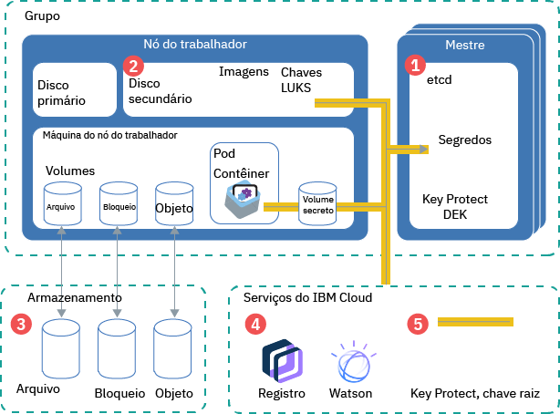

---

copyright:
  years: 2014, 2019
lastupdated: "2019-05-31"

keywords: kubernetes, iks

subcollection: containers

---

{:new_window: target="_blank"}
{:shortdesc: .shortdesc}
{:screen: .screen}
{:pre: .pre}
{:table: .aria-labeledby="caption"}
{:codeblock: .codeblock}
{:tip: .tip}
{:note: .note}
{:important: .important}
{:deprecated: .deprecated}
{:download: .download}
{:preview: .preview}


# Protegendo informações sensíveis em seu cluster
{: #encryption}

Proteja as informações confidenciais do cluster para assegurar a integridade de dados e para evitar que seus dados sejam expostos a usuários não autorizados.
{: shortdesc}

É possível criar dados sensíveis em níveis diferentes em seu cluster que cada um requer proteção apropriada.
- **Nível do cluster:** os dados de configuração do cluster são armazenados no componente etcd de seu mestre do Kubernetes. Os dados em etcd são armazenados no disco local do principal do Kubernetes e são submetidos a backup no {{site.data.keyword.cos_full_notm}}. Os dados são criptografados durante o trânsito para o {{site.data.keyword.cos_full_notm}} e em repouso. É possível escolher ativar a criptografia para os seus dados etcd no disco local de seu mestre do Kubernetes [ativando a criptografia do {{site.data.keyword.keymanagementservicelong_notm}}](/docs/containers?topic=containers-encryption#encryption) para o seu cluster. Os dados etcd para clusters que executam uma versão anterior do Kubernetes são armazenados em um disco criptografado gerenciado pela IBM e submetidos a backup diariamente.
- **Nível de app:** quando você implementar seu app, não armazene informações confidenciais, como credenciais ou chaves, no arquivo de configuração YAML, configmaps ou scripts. Em vez disso, use [Segredos do Kubernetes ](https://kubernetes.io/docs/concepts/configuration/secret/). Também é possível [criptografar dados em segredos do Kubernetes](#keyprotect) para evitar que usuários não autorizados acessem informações confidenciais do cluster.

Para obter mais informações sobre como proteger seu cluster, veja [Segurança para o {{site.data.keyword.containerlong_notm}}](/docs/containers?topic=containers-security#security).



_Figura: visão geral da criptografia de dados em um cluster_

1.  **etcd**: etcd é o componente do mestre que armazena os dados dos recursos do Kubernetes, como arquivos `.yaml` de configuração de objeto e segredos. Os dados em etcd são armazenados no disco local do principal do Kubernetes e são submetidos a backup no {{site.data.keyword.cos_full_notm}}. Os dados são criptografados durante o trânsito para o {{site.data.keyword.cos_full_notm}} e em repouso. Será possível optar por ativar a criptografia de seus dados etcd no disco local de seu mestre do Kubernetes [ativando a criptografia do {{site.data.keyword.keymanagementservicelong_notm}}](#keyprotect) para seu cluster. Os dados etcd em clusters que executam uma versão anterior do Kubernetes são armazenados em um disco criptografado que é gerenciado pela IBM e submetido a backup diariamente. Quando os dados etcd são enviados para um pod, eles são criptografados por meio de TLS para assegurar a proteção de dados e a integridade.
2.  **Disco secundário do nó do trabalhador**: o disco secundário do seu nó do trabalhador é onde o sistema de arquivos de contêiner e imagens puxadas localmente são armazenados. O disco é criptografado com AES de 256 bits com uma chave de criptografia LUKS que é exclusiva para o nó do trabalhador e armazenada como um segredo em etcd, gerenciado pela IBM. Ao recarregar ou atualizar os nós do trabalhador, as chaves LUKS serão giradas.
3.  **Armazenamento**: é possível optar por armazenar dados [configurando o armazenamento persistente de arquivo, de bloco ou de objeto](/docs/containers?topic=containers-storage_planning#persistent_storage_overview). As instâncias de armazenamento de infraestrutura do IBM Cloud (SoftLayer) salvam os dados em discos criptografados, portanto, seus dados em repouso são criptografados. Além disso, se você escolher armazenamento de objeto, seus dados em trânsito também serão criptografados.
4.  **Serviços do {{site.data.keyword.Bluemix_notm}}**: é possível [integrar serviços do {{site.data.keyword.Bluemix_notm}}](/docs/containers?topic=containers-service-binding#bind-services), como {{site.data.keyword.registryshort_notm}} ou {{site.data.keyword.watson}}, com seu cluster. As credenciais de serviço são armazenadas em um segredo que é salvo no etcd, que seu app pode acessar montando o segredo como um volume ou especificando-o como uma variável de ambiente em [sua implementação](/docs/containers?topic=containers-app#secret).
5.  **{{site.data.keyword.keymanagementserviceshort}}**: quando você [ativa o {{site.data.keyword.keymanagementserviceshort}}](#keyprotect) em seu cluster, uma chave de criptografia de dados agrupada (DEK) é armazenada em etcd. O DEK criptografa os segredos em seu cluster, incluindo as credenciais de serviço e a chave LUKS. Como a chave raiz está em sua instância do {{site.data.keyword.keymanagementserviceshort}}, você controla o acesso a seus segredos criptografados. As chaves do {{site.data.keyword.keymanagementserviceshort}} são protegidas por módulos de segurança de hardware certificados por FIPS 140-2 Nível 2, baseados em nuvem, que protegem contra roubo de informações. Para obter mais informações sobre como a criptografia do {{site.data.keyword.keymanagementserviceshort}} funciona, consulte [Criptografia do Envelope](/docs/services/key-protect/concepts?topic=key-protect-envelope-encryption#envelope-encryption).

## Entendendo Quando Usar Segredos
{: #secrets}

Segredos do Kubernetes são uma maneira segura para armazenar informação confidencial, como nomes de usuário, senhas ou chaves. Se você precisar de informações confidenciais criptografadas, [ative o {{site.data.keyword.keymanagementserviceshort}}](#keyprotect) para criptografar os segredos. Para obter mais informações sobre o que é possível armazenar em segredos, consulte a [documentação do Kubernetes ](https://kubernetes.io/docs/concepts/configuration/secret/).
{:shortdesc}

Revise as tarefas a seguir que requerem segredos.

### Incluindo um serviço em um cluster
{: #secrets_service}

Quando você liga um serviço a um cluster, não é necessário criar um segredo para armazenar suas credenciais de serviço. Um segredo é criado automaticamente para você. Para obter mais informações, consulte [Incluindo serviços do {{site.data.keyword.Bluemix_notm}} em clusters](/docs/containers?topic=containers-service-binding#bind-services).
{: shortdesc}

### Criptografando o tráfego para seus apps com segredos do TLS
{: #secrets_tls}

O ALB faz o balanceamento de carga do tráfego de rede HTTP para os apps no cluster. Para também balancear a carga de conexões HTTPS recebidas, será possível configurar o ALB para decriptografar o tráfego de rede e encaminhar a solicitação decriptografada para os apps expostos no cluster. Para obter mais informações, veja a [documentação de configuração do Ingress](/docs/containers?topic=containers-ingress#public_inside_3).
{: shortdesc}

Além disso, se você tiver apps que requerem o protocolo HTTPS e precisar que o tráfego permaneça criptografado, será possível usar segredos de autenticação unidirecional ou mútua com a anotação `ssl-services`. Para obter mais informações, veja a [documentação de anotações do Ingress](/docs/containers?topic=containers-ingress_annotation#ssl-services).

### Acessando seu registro com credenciais armazenadas em um segredo de extração de imagem do Kubernetes
{: #imagepullsecret}

Ao criar um cluster, os segredos para suas credenciais do {{site.data.keyword.registrylong}} são criados automaticamente no namespace do Kubernetes `default`. No entanto, deve-se [criar seu próprio segredo de extração de imagem para seu cluster](/docs/containers?topic=containers-images#other) se você desejar implementar um contêiner nas situações a seguir.
* Em uma imagem em seu registro do {{site.data.keyword.registryshort_notm}} para um namespace do Kubernetes diferente de `default`.
* Em uma imagem em seu registro do {{site.data.keyword.registryshort_notm}} que está armazenada em uma região do {{site.data.keyword.Bluemix_notm}} ou em uma conta do {{site.data.keyword.Bluemix_notm}} diferente.
* Em uma imagem que é armazenada em um registro privado externo.

<br />


## Criptografando o disco local e os segredos do mestre do Kubernetes usando o {{site.data.keyword.keymanagementserviceshort}} (beta)
{: #keyprotect}

É possível proteger o componente etcd em seu principal do Kubernetes e segredos do Kubernetes usando o [{{site.data.keyword.keymanagementservicefull}} ](/docs/services/key-protect?topic=key-protect-getting-started-tutorial) como um provedor [Key Management Service (KMS) do Kubernetes ](https://kubernetes.io/docs/tasks/administer-cluster/kms-provider/) em seu cluster. O provedor KMS é um recurso alfa no Kubernetes versão 1.11, o que torna a integração do {{site.data.keyword.keymanagementserviceshort}} uma liberação beta no {{site.data.keyword.containerlong_notm}}.
{: shortdesc}

Por padrão, os segredos da configuração do cluster e do Kubernetes são armazenados no componente etcd do mestre do Kubernetes gerenciado pela IBM. Os nós do trabalhador também têm discos secundários que são criptografados por chaves LUKS gerenciadas pela IBM que são armazenadas como segredos em etcd. Os dados em etcd são armazenados no disco local do principal do Kubernetes e são submetidos a backup no {{site.data.keyword.cos_full_notm}}. Os dados são criptografados durante o trânsito para o {{site.data.keyword.cos_full_notm}} e em repouso. No entanto, os dados em seu componente etcd no disco local de seu mestre do Kubernetes não são criptografados automaticamente até que você ative a criptografia do {{site.data.keyword.keymanagementserviceshort}} para seu cluster. Os dados etcd para clusters que executam uma versão anterior do Kubernetes são armazenados em um disco criptografado gerenciado pela IBM e submetidos a backup diariamente.

Quando você ativa o {{site.data.keyword.keymanagementserviceshort}} em seu cluster, sua própria chave raiz é usada para criptografar dados em etcd, incluindo os segredos do LUKS. Você obtém mais controle sobre seus dados sensíveis criptografando os segredos com sua chave raiz. O uso de sua própria criptografia inclui uma camada de segurança nos dados de etcd e nos segredos do Kubernetes e fornece um controle mais granular de quem pode acessar informações confidenciais do cluster. Se você precisar remover irreversivelmente o acesso para etcd ou seus segredos, será possível excluir a chave raiz.

Não exclua chaves raiz em sua instância do {{site.data.keyword.keymanagementserviceshort}}. Não exclua chaves mesmo se você girar para usar uma nova chave. Não será possível acessar ou remover os dados em etcd ou os dados dos segredos em seu cluster se você excluir uma chave raiz.
{: important}

Antes de iniciar:
* [Efetue login em sua conta. Se aplicável, direcione o grupo de recursos apropriado. Configure o contexto para o seu cluster.](/docs/containers?topic=containers-cs_cli_install#cs_cli_configure)
* Verifique se o seu cluster executa o Kubernetes versão 1.11.3_1521 ou mais recente executando `ibmcloud ks cluster-get --cluster <cluster_name_or_ID>` e verificando o campo **Versão**.
* Assegure-se de que você tenha a [função da plataforma **Administrador** do {{site.data.keyword.Bluemix_notm}} IAM](/docs/containers?topic=containers-users#platform) para o cluster.
* Certifique-se de que a chave API que está configurada para a região em que seu cluster está tenha autorização para usar o Key Protect. Para verificar o proprietário da chave de API cujas credenciais são armazenadas para a região, execute `ibmcloud ks api-key-info --cluster <cluster_name_or_ID>`.

Para ativar o {{site.data.keyword.keymanagementserviceshort}} ou para atualizar a instância ou a chave raiz que criptografa segredos no cluster:

1.  [ Crie uma  {{site.data.keyword.keymanagementserviceshort}}  instância ](/docs/services/key-protect?topic=key-protect-provision#provision).

2.  Obtenha o ID da instância de serviço.

    ```
    ibmcloud resource service-instance <kp_instance_name> | grep GUID
    ```
    {: pre}

3.  [ Crie uma chave raiz ](/docs/services/key-protect?topic=key-protect-create-root-keys#create-root-keys). Por padrão, a chave raiz é criada sem uma data de expiração.

    É necessário configurar uma data de expiração para obedecer às políticas de segurança interna? [Crie a chave raiz usando a API](/docs/services/key-protect?topic=key-protect-create-root-keys#create-root-key-api) e inclua o parâmetro `expirationDate`. **Importante**: antes que sua chave raiz expire, deve-se repetir estas etapas para atualizar seu cluster para usar uma nova chave raiz. Caso contrário, não será possível decriptografar seus segredos.
    {: tip}

4.  Anote a  [ chave raiz  ** ID ** ](/docs/services/key-protect?topic=key-protect-view-keys#view-keys-gui).

5.  Obtenha o [terminal do {{site.data.keyword.keymanagementserviceshort}}](/docs/services/key-protect?topic=key-protect-regions#service-endpoints) de sua instância.

6.  Obtenha o nome do cluster para o qual você deseja ativar o {{site.data.keyword.keymanagementserviceshort}}.

    ```
    ibmcloud ks clusters
    ```
    {: pre}

7.  Ative  {{site.data.keyword.keymanagementserviceshort}}  em seu cluster. Preencha as sinalizações com as informações que você recuperou anteriormente. O processo de ativação pode levar algum tempo para ser concluído.

    ```
    ibmcloud ks key-protect-enable --cluster <cluster_name_or_ID> --key-protect-url <kp_endpoint> --key-protect-instance <kp_instance_ID> --crk <kp_root_key_ID>
    ```
    {: pre}

8.  Durante a ativação, você pode não conseguir acessar o mestre Kubernetes, tal como atualizar configurações YAML para implementações. Na saída do comando a seguir, verifique se o **Status do mestre** é **Pronto**.
    ```
    ibmcloud ks cluster-get --cluster <cluster_name_or_ID>
    ```
    {: pre}

    Saída de exemplo quando a ativação está em andamento:
    ```
    Name: <cluster_name>   
    ID: <cluster_ID>   
    ...
    Master Status:          Key Protect feature enablement in progress.  
    ```
    {: screen}

    Saída de exemplo quando o mestre está pronto:
    ```
    Name: <cluster_name>   
    ID: <cluster_ID>   
    ...
    Master Status:          Ready (1 min ago)   
    ```
    {: screen}

    Após o {{site.data.keyword.keymanagementserviceshort}} ser ativado no cluster, os dados no `etcd`, os segredos existentes e os novos segredos que são criados no cluster são criptografados automaticamente usando a sua chave raiz do {{site.data.keyword.keymanagementserviceshort}}.

9.  Opcional: para girar sua chave, repita essas etapas com um novo ID de chave raiz. A nova chave raiz é incluída na configuração do cluster com a chave raiz anterior para que os dados criptografados existentes ainda permaneçam protegidos.

Não exclua chaves raiz em sua instância do {{site.data.keyword.keymanagementserviceshort}}. Não exclua chaves mesmo se você girar para usar uma nova chave. Não será possível acessar ou remover os dados em etcd ou os dados dos segredos em seu cluster se você excluir uma chave raiz.
{: important}


## Criptografando dados usando o IBM Cloud Data Shield (Beta)
{: #datashield}

O {{site.data.keyword.datashield_short}} está integrado às tecnologias Intel® Software Guard Extensions (SGX) e Fortanix® para que seu código de carga de trabalho de contêiner do {{site.data.keyword.Bluemix_notm}} e os dados sejam protegidos em uso. O código do app e os dados são executados em enclaves reforçados pela CPU, que são áreas confiáveis de memória no nó do trabalhador que protegem os aspectos críticos do app, o que ajuda a manter o código e os dados confidenciais e não modificados.
{: shortdesc}

Quando se trata de proteger seus dados, a criptografia é um dos controles mais populares e efetivos. Mas os dados devem ser criptografados em cada etapa de seu ciclo de vida. Os dados passam por três fases durante seu ciclo de vida: dados em repouso, dados em movimento e dados em uso. Os dados em repouso e em movimento são comumente utilizados para proteger os dados quando são armazenados e quando são transportados. Levando essa proteção um passo adiante, agora é possível criptografar dados em uso.

Se você ou sua empresa requer sensibilidade de dados devido a políticas internas, regulamentações governamentais ou requisitos de conformidade da indústria, essa solução pode ajudá-lo a mover-se para a nuvem. As soluções de exemplo incluem instituições financeiras e de assistência médica ou países com políticas governamentais que requerem soluções de nuvem no local.

Para iniciar, forneça um cluster do trabalhador bare metal ativado para SGX com tipo de máquina: mb2c.4x32 e consulte [os docs do {{site.data.keyword.datashield_short}}](/docs/services/data-shield?topic=data-shield-getting-started#getting-started).
