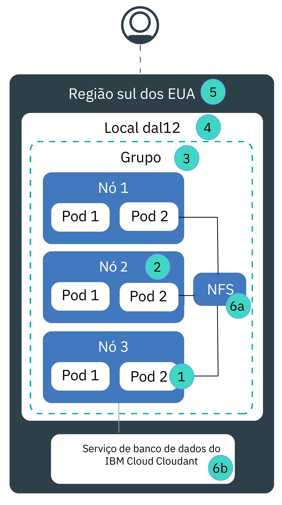

---

copyright:
  years: 2014, 2018
lastupdated: "2018-4-20"

---

{:new_window: target="_blank"}
{:shortdesc: .shortdesc}
{:screen: .screen}
{:pre: .pre}
{:table: .aria-labeledby="caption"}
{:codeblock: .codeblock}
{:tip: .tip}
{:download: .download}

# Alta disponibilidade para o {{site.data.keyword.containerlong_notm}}
{: #ha}

Use os recursos Kubernetes e {{site.data.keyword.containerlong}} integrados para tornar seu cluster mais altamente disponível e para proteger seu app de tempo de inatividade quando um componente em seu cluster falha.
{: shortdesc}

A alta disponibilidade é uma disciplina principal em uma infraestrutura de TI para manter seus apps funcionando, mesmo após uma falha de site parcial ou integral. O principal propósito de alta disponibilidade é eliminar pontos potenciais de falhas em uma infraestrutura de TI. Por exemplo, é possível se preparar para a falha de um sistema incluindo redundância e configurando mecanismos de failover.

É possível obter alta disponibilidade em diferentes níveis em sua infraestrutura de TI e em diferentes componentes de seu cluster. O nível de disponibilidade que é certo para você depende de vários fatores, como seus requisitos de negócios, os Acordos de Nível de Serviço que você tem com seus clientes e o dinheiro que deseja-se gastar.

## Visão geral de pontos potenciais de falha no {{site.data.keyword.containerlong_notm}}
{: #fault_domains} 

A arquitetura e a infraestrutura do {{site.data.keyword.containerlong_notm}} são projetadas para assegurar a confiabilidade, a latência de processamento baixo e um tempo de atividade máximo do serviço. No entanto, falhas podem acontecer. Dependendo do serviço hospedado no {{site.data.keyword.Bluemix_notm}}, você pode não ser capaz de tolerar falhas, mesmo se as falhas duram somente alguns minutos.
{: shortdesc}

O {{site.data.keyword.containershort_notm}} fornece várias abordagens para incluir mais disponibilidade para seu cluster incluindo redundância e antiafinidade. Revise a imagem a seguir para aprender sobre pontos potenciais de falha e como eliminá-los.

<table summary="A tabela mostra pontos de falha no {{site.data.keyword.containershort_notm}}. As linhas devem ser lidas da esquerda para a direita, com o número do ponto de falha na coluna um, o título do ponto de falha na coluna dois, uma descrição na coluna três e um link para a documentação na coluna quatro.">
<col width="3%">
<col width="10%">
<col width="70%">
<col width="17%">
  <thead>
  <th>#</th>
  <th>Ponto de falha</th>
  <th>Descrição</th>
  <th>Link para docs</th>
  </thead>
  <tbody>
    <tr>
      <td>1</td>
      <td>Falha de contêiner ou pod</td>
      <td>Os contêineres e os pods são, pelo design, de curta duração e podem falhar inesperadamente. Por exemplo, um contêiner ou pod pode travar se um erro ocorre em seu app. Para tornar seu app altamente disponível, deve-se assegurar que você tenha instâncias suficientes do seu app para manipular a carga de trabalho mais as instâncias adicionais no caso de uma falha. Idealmente, essas instâncias são distribuídas entre múltiplos nós do trabalhador para proteger o seu app de uma falha do nó do trabalhador.</td>
      <td>[Implementando apps altamente disponíveis.](cs_app.html#highly_available_apps)</td>
  </tr>
  <tr>
    <td>2</td>
    <td>Falha do nó do trabalhador</td>
    <td>Um nó do trabalhador é uma VM executada no topo de um hardware físico. As falhas do nó do trabalhador incluem indisponibilidades de hardware, como energia, resfriamento ou rede, e problemas na VM em si. É possível considerar uma falha do nó do trabalhador configurando múltiplos nós do trabalhador em seu cluster.   <strong>Nota:</strong> não é garantido que os nós do trabalhador em um local estejam em hosts de cálculo físico separados. Por exemplo, você pode ter um cluster com 3 nós do trabalhador, mas todos os 3 nós do trabalhador foram criados no mesmo host de cálculo físico no local IBM. Se este host de cálculo físico fica inativo, todos os nós do trabalhador ficam inativos. Para se proteger contra essa falha, deve-se configurar um segundo cluster em outro local.</td>
    <td>[Criando clusters com múltiplos nós do trabalhador.](cs_cli_reference.html#cs_cluster_create)</td>
  </tr>
  <tr>
    <td>3</td>
    <td>Falha de cluster</td>
    <td>O mestre do Kubernetes é o componente principal que mantém seu cluster funcionando. O mestre armazena todos os dados do cluster no banco de dados etcd que serve como o ponto único de verdade para seu cluster. Uma falha de cluster ocorre quando o mestre não pode ser atingido devido a uma falha de rede ou quando os dados em seu banco de dados etcd são corrompidos. É possível criar múltiplos clusters em um local para proteger seus apps de uma falha do mestre do Kubernetes ou do etcd. Para balancear a carga entre os clusters, deve-se configurar um balanceador de carga externo.   <strong>Nota:</strong> configurar múltiplos clusters em um local não garante que seus nós do trabalhador sejam implementados em hosts de cálculo físico separados. Para se proteger contra essa falha, deve-se configurar um segundo cluster em outro local.</td>
    <td>[Configurando clusters altamente disponíveis.](cs_clusters.html#planning_clusters)</td>
  </tr>
  <tr>
    <td>4</td>
    <td>Falha de local</td>
    <td>Uma falha de local afeta todos os hosts de cálculo físico e armazenamento NFS. As falhas incluem energia, resfriamento, rede ou indisponibilidades de armazenamento e desastres naturais, como inundações, terremotos e furacões. Para proteger contra uma falha de local, deve-se ter clusters em dois locais diferentes que tenham carga balanceada por um balanceador de carga externo.</td>
    <td>[Configurando clusters altamente disponíveis.](cs_clusters.html#planning_clusters)</td>
  </tr>
  <tr>
    <td>5</td>
    <td>Falha de região</td>
    <td>Cada região é configurada com um balanceador de carga altamente disponível que seja acessível por meio do terminal de API específico da região. O balanceador de carga roteia solicitações de entrada e de saída para clusters em locais regionais. A probabilidade de uma falha regional integral é baixa. No entanto, se você deseja considerar essa falha, é possível configurar múltiplos clusters em diferentes regiões e conectá-los usando um balanceador de carga externo. No caso de uma região inteira falhar, o cluster na outra região pode assumir o controle da carga de trabalho.   <strong>Nota:</strong> um cluster multiregion requer vários recursos em nuvem e, dependendo do seu app, pode ser complexo e caro. Verifique se você precisa de uma configuração multiregion ou se pode acomodar uma interrupção de serviço em potencial. Se você desejar configurar um cluster multiregion, certifique-se de que o seu app e os dados possam ser hospedados em outra região e de que o seu app possa manipular a replicação de dados globais.</td>
    <td>[Configurando clusters altamente disponíveis.](cs_clusters.html#planning_clusters)</td>
  </tr>
  <tr>
    <td>6a, 6b</td>
    <td>Falha de armazenamento</td>
    <td>Em um app stateful, os dados têm um papel importante para manter seu app funcionando. Você deseja certificar-se de que seus dados são altamente disponíveis para que seja possível recuperar de uma falha em potencial. No {{site.data.keyword.containershort_notm}}, é possível escolher entre várias opções para persistir seus dados. Por exemplo, é possível provisionar o armazenamento NFS usando volumes persistentes nativos do Kubernetes ou armazenar seus dados usando um serviço de banco de dados do {{site.data.keyword.Bluemix_notm}}.</td>
    <td>[Planejando dados altamente disponíveis.](cs_storage.html#planning)</td>
  </tr>
  </tbody>
  </table>

