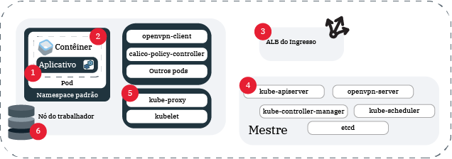

---

copyright:
  years: 2014, 2019
lastupdated: "2019-06-11"

keywords: kubernetes, iks, logmet, logs, metrics

subcollection: containers

---

{:new_window: target="_blank"}
{:shortdesc: .shortdesc}
{:screen: .screen}
{:pre: .pre}
{:table: .aria-labeledby="caption"}
{:codeblock: .codeblock}
{:tip: .tip}
{:note: .note}
{:important: .important}
{:deprecated: .deprecated}
{:download: .download}
{:preview: .preview}


# Criação de log e monitoramento
{: #health}

Configure a criação de log e o monitoramento no {{site.data.keyword.containerlong}} para ajudá-lo a solucionar problemas e melhorar o funcionamento e o desempenho de seus clusters e apps do Kubernetes.
{: shortdesc}

O monitoramento e a criação de log contínuos são a chave para detectar ataques em seu cluster e questões de resolução de problemas à medida que eles surgem. Monitoramento continuamente seu cluster, você é capaz de entender melhor a capacidade do cluster e a disponibilidade de recursos que estão disponíveis para seu app. Com esse insight, é possível se preparar para proteger seus apps com relação ao tempo de inatividade. **Nota**: para configurar a criação de log e o monitoramento, deve-se usar um cluster padrão no {{site.data.keyword.containerlong_notm}}.

## Escolhendo uma solução de criação de log
{: #logging_overview}

Por padrão, os logs são gerados e gravados localmente para todos os seguintes componentes de cluster do {{site.data.keyword.containerlong_notm}}: nós do trabalhador, contêineres, aplicativos, armazenamento persistente, balanceador de carga do aplicativo Ingress, API do Kubernetes e o namespace `kube-system`. Várias soluções de criação de log estão disponíveis para coletar, encaminhar e visualizar esses logs.
{: shortdesc}

É possível escolher sua solução de criação de log com base em quais componentes de cluster você precisa para coletar logs. Uma implementação comum é escolher um serviço de criação de log que você prefira com base em seus recursos de análise e interface, como o {{site.data.keyword.loganalysisfull}}, o {{site.data.keyword.la_full}} ou um serviço de terceiro. Em seguida, é possível usar o {{site.data.keyword.cloudaccesstrailfull}} para auditar a atividade do usuário no cluster e fazer backup de logs do cluster mestre no {{site.data.keyword.cos_full}}. **Nota**: Para configurar a criação de log, você deve ter um cluster Kubernetes padrão.

<dl>

<dt>{{site.data.keyword.la_full_notm}}</dt>
<dd>Gerenciar logs de contêiner de pod implementando o LogDNA como um serviço de terceiro em seu cluster. Para usar o {{site.data.keyword.la_full_notm}}, deve-se implementar um agente de criação de log para cada nó do trabalhador em seu cluster. Esse agente coleta logs com a extensão `*.log ` e arquivos sem extensão que são armazenados no diretório `/var/log` de seu pod de todos os namespaces, incluindo `kube-system` Em seguida, o agente encaminha os logs para o serviço {{site.data.keyword.la_full_notm}}. Para obter mais informações sobre o serviço, consulte a documentação do [{{site.data.keyword.la_full_notm}}](/docs/services/Log-Analysis-with-LogDNA?topic=LogDNA-about). Para iniciar, consulte [Gerenciando logs do cluster Kubernetes {{site.data.keyword.loganalysisfull_notm}} com LogDNA](/docs/services/Log-Analysis-with-LogDNA/tutorials?topic=LogDNA-kube#kube).
</dd>

<dt>Fluentd com o {{site.data.keyword.loganalysisfull_notm}}</dt>
<dd><p class="deprecated">Anteriormente, você poderia criar uma configuração de criação de log para encaminhar logs que são coletados pelo componente de cluster Fluentd para o {{site.data.keyword.loganalysisfull_notm}}. A partir de 30 de abril de 2019, não é possível provisionar novas instâncias do {{site.data.keyword.loganalysisshort_notm}} e todas as instâncias do plano Lite são excluídas. As instâncias de plano premium existentes são suportadas até 30 de setembro de 2019. Para continuar a coleta de logs para seu cluster, deve-se configurar o {{site.data.keyword.la_full_notm}} ou mudar sua configuração para encaminhar logs para um servidor externo.</p>
</dd>

<dt>Fluentd com um servidor externo</dt>
<dd>Para coletar, encaminhar e visualizar logs para um componente de cluster, é possível criar uma configuração de criação de log usando o Fluentd. Quando você cria uma configuração de criação de log, o componente do cluster [Fluentd ](https://www.fluentd.org/) coleta logs dos caminhos para uma origem especificada. O Fluentd pode encaminhar esses logs para um servidor externo que aceita um protocolo syslog. Para iniciar, consulte [Entendendo o encaminhamento de log de cluster e app para o syslog](#logging).
</dd>

<dt>{{site.data.keyword.cloudaccesstrailfull_notm}}</dt>
<dd>Para monitorar a atividade administrativa iniciada pelo usuário feita em seu cluster, é possível coletar e encaminhar logs de auditoria para o {{site.data.keyword.cloudaccesstrailfull_notm}}. Clusters geram dois tipos de {{site.data.keyword.cloudaccesstrailshort}} eventos.
<ul><li>Os eventos de gerenciamento de cluster são gerados automaticamente e encaminhados para o {{site.data.keyword.cloudaccesstrailshort}}.</li>
<li>Os eventos de auditoria do servidor da API do Kubernetes são gerados automaticamente, mas deve-se [criar uma configuração de criação de log](#api_forward) para que o Fluentd possa encaminhar esses logs para o {{site.data.keyword.cloudaccesstrailshort}}.</li></ul>
Para obter mais informações sobre os tipos de eventos do {{site.data.keyword.containerlong_notm}} que podem ser rastreados, consulte [Eventos do Activity Tracker](/docs/containers?topic=containers-at_events). Para obter mais informações sobre o serviço, consulte a documentação do [Activity Tracker](/docs/services/cloud-activity-tracker?topic=cloud-activity-tracker-getting-started).
<p class="note">O {{site.data.keyword.containerlong_notm}} atualmente não está configurado para usar o {{site.data.keyword.at_full}}. Para gerenciar os eventos de gerenciamento de cluster e os logs de auditoria da API do Kubernetes, continue usando o {{site.data.keyword.cloudaccesstrailfull_notm}} com o LogAnalysis.</p>
</dd>

<dt>{{site.data.keyword.cos_full_notm}}</dt>
<dd>Para coletar, encaminhar e visualizar logs para o mestre do Kubernetes do cluster, é possível obter uma captura instantânea dos logs do mestre em qualquer momento para coletar em um depósito do {{site.data.keyword.cos_full_notm}}. A captura instantânea inclui qualquer coisa que é enviada por meio do servidor de API, como planejamento de pod, implementações ou políticas RBAC. Para iniciar, consulte [Coletando logs do mestre](#collect_master).</dd>

<dt>Serviços de terceiros</dt>
<dd>Se você tiver requisitos especiais, será possível configurar sua própria solução de criação de log. Confira os serviços de criação de log de terceiros que podem ser incluídos em seu cluster em [Integrações de criação de log e monitoramento](/docs/containers?topic=containers-supported_integrations#health_services). É possível coletar logs de contêiner por meio do caminho `/var/log/pods/`.</dd>

</dl>

<br />


## Encaminhando logs de cluster e de app para o {{site.data.keyword.la_full_notm}}
{: #logdna}

Gerenciar logs de contêiner de pod implementando o LogDNA como um serviço de terceiro em seu cluster.
{: shortdesc}

Para usar o {{site.data.keyword.la_full_notm}}, deve-se implementar um agente de criação de log para cada nó do trabalhador em seu cluster. Esse agente coleta logs com a extensão `*.log ` e arquivos sem extensão que são armazenados no diretório `/var/log` de seu pod de todos os namespaces, incluindo `kube-system` Em seguida, o agente encaminha os logs para o serviço {{site.data.keyword.la_full_notm}}. Para obter mais informações sobre o serviço, consulte a documentação do [{{site.data.keyword.la_full_notm}}](/docs/services/Log-Analysis-with-LogDNA?topic=LogDNA-about). Para iniciar, consulte [Gerenciando logs do cluster Kubernetes {{site.data.keyword.loganalysisfull_notm}} com LogDNA](/docs/services/Log-Analysis-with-LogDNA/tutorials?topic=LogDNA-kube#kube).

<br />


## Descontinuado: encaminhando logs de auditoria do cluster, do app e da API do Kubernetes para o {{site.data.keyword.loganalysisfull_notm}}
{: #loga}

Anteriormente, você poderia criar uma configuração de criação de log para encaminhar logs que são coletados pelo componente de cluster Fluentd para o {{site.data.keyword.loganalysisfull_notm}}. A partir de 30 de abril de 2019, o {{site.data.keyword.loganalysisfull_notm}} foi descontinuado. Não é possível provisionar novas instâncias do {{site.data.keyword.loganalysisshort_notm}} e todas as instâncias do plano Lite são excluídas. As instâncias de plano premium existentes são suportadas até 30 de setembro de 2019.
{: deprecated}

Para continuar a coleta de logs para seu cluster, você tem as opções a seguir:
* Configure o {{site.data.keyword.la_full_notm}}. Para obter mais informações, consulte [Executando a transição para o {{site.data.keyword.la_full_notm}}](/docs/services/CloudLogAnalysis?topic=cloudloganalysis-transition).
* [Mude sua configuração para encaminhar logs para um servidor externo](#configuring).

Para obter mais informações sobre as instâncias existentes do {{site.data.keyword.loganalysisshort_notm}}, consulte a [documentação do {{site.data.keyword.loganalysisshort_notm}}](/docs/services/CloudLogAnalysis?topic=cloudloganalysis-containers_kube_other_logs).

<br />


## Encaminhando logs de auditoria do cluster, do app e da API do Kubernetes para um servidor externo
{: #configuring}

Configure o encaminhamento de log para clusters padrão do {{site.data.keyword.containerlong_notm}} para um servidor externo.
{: shortdesc}

### Entendendo o encaminhamento de log para um servidor externo
{: #logging}

Por padrão, os logs são coletados pelo complemento [Fluentd ](https://www.fluentd.org/) em seu cluster. Quando você cria uma configuração de criação de log para uma origem em seu cluster, como um contêiner, os logs que o Fluentd coleta por meio dos caminhos dessa origem são encaminhados para um servidor externo. O tráfego da origem para o serviço de criação de log na porta de entrada está criptografado.
{: shortdesc}

**Quais são as origens para as quais eu posso configurar o encaminhamento de log?**

Na imagem a seguir, é possível ver o local das origens para as quais é possível configurar a criação de log.



1. `worker`: informações que são específicas para a configuração de infraestrutura que você tem para o nó do trabalhador. Os logs do trabalhador são capturados no syslog e contêm eventos do sistema operacional. Em `auth.log`, é possível localizar informações sobre as solicitações de autenticação realizadas para o S.O.</br>**Caminhos**:
    * ` /var/log/syslog `
    * ` /var/log/auth.log `

2. `container`: informações que são registradas por um contêiner em execução.</br>**Caminhos**: qualquer coisa que seja gravada em `STDOUT` ou `STDERR`.

3. `application`: informações sobre eventos que ocorrem no nível do aplicativo. Isso pode ser uma notificação de que um evento ocorreu, como um login bem-sucedido, um aviso sobre armazenamento ou outras operações que podem ser executadas no nível do app.</br>**Caminhos**: é possível configurar os caminhos para os quais seus logs são encaminhados. No entanto, para que os logs sejam enviados, é necessário usar um caminho absoluto em sua configuração de criação de log ou os logs não podem ser lidos. Se o seu caminho estiver montado em seu nó do trabalhador, ele poderá ter criado um link simbólico. Exemplo: se o caminho especificado for `/usr/local/spark/work/app-0546/0/stderr`, mas os logs forem realmente para `/usr/local/spark-1.0-hadoop-1.2/work/app-0546/0/stderr`, os logs não poderão ser lidos.

4. `storage`: informações sobre o armazenamento persistente que está configurado em seu cluster. Os logs de armazenamento podem ajudar a configurar painéis e alertas de determinação de problemas como parte de seu pipeline DevOps e liberações de produção. **Nota**: os caminhos `/var/log/kubelet.log` e `/var/log/syslog` também contêm logs de armazenamento, mas eles são coletados pelas origens de log `kubernetes` e `worker`.</br>**Caminhos**:
    * `/var/log/ibmc-s3fs.log`
    * `/var/log/ibmc-block.log`

  **Pods**:
    * `portworx-***`
    * `ibmcloud-block-storage-attacher-***`
    * `ibmcloud-block-storage-driver-***`
    * `ibmcloud-block-storage-plugin-***`
    * `ibmcloud-object-storage-plugin-***`

5. `kubernetes`: informações do kubelet, do kube-proxy e de outros eventos do Kubernetes que ocorrem no namespace kube-system do nó do trabalhador.</br>**Caminhos**:
    * ` /var/log/kubelet.log `
    * ` /var/log/kube-proxy.log `
    * ` /var/log/event-exporter/1 .. log `

6. `kube-audit`: informações sobre ações relacionadas ao cluster que são enviadas para o servidor de API do Kubernetes, incluindo o horário, o usuário e o recurso afetado.

7. `ingress`: informações sobre o tráfego de rede recebido em um cluster por meio do ALB do Ingress.</br>**Caminhos**:
    * ` /var/log/alb/ids/* .log `
    * ` /var/log/alb/ids/* .err `
    * `/var/log/alb/customerlogs/*.log`
    * ` /var/log/alb/customerlogs/* .err `

</br>

**Quais opções de configuração eu tenho?**

A tabela a seguir mostra as diferentes opções que você tem ao configurar a criação de log e suas descrições.

<table>
<caption> Entendendo as opções de configuração de criação</caption>
  <thead>
    <th>Opção</th>
    <th>Descrição</th>
  </thead>
  <tbody>
    <tr>
      <td><code><em>&lt;cluster_name_or_ID&gt;</em></code></td>
      <td>O nome ou ID do cluster.</td>
    </tr>
    <tr>
      <td><code> <em> -- log_source </em> </code></td>
      <td>A origem da qual você deseja encaminhar logs. Os valores aceitos são <code>container</code>, <code>application</code>, <code>worker</code>, <code>kubernetes</code>, <code>ingress</code>, <code>storage</code> e <code>kube-audit</code>. Esse argumento suporta uma lista separada por vírgula de origens de log para aplicar à configuração. Se você não fornecer uma origem de log, configurações de criação de log serão criadas para as origens de log <code>container</code> e <code>ingress</code>.</td>
    </tr>
    <tr>
      <td><code><em>--type syslog</em></code></td>
      <td>O valor <code>syslog</code> encaminha seus logs para um servidor externo.</p>
      </dd></td>
    </tr>
    <tr>
      <td><code> <em> -- namespace </em> </code></td>
      <td>Opcional: o namespace do Kubernetes do qual você deseja encaminhar logs. O encaminhamento de log não é suportado para os namespaces do Kubernetes <code>ibm-system</code> e <code>kube-system</code>. Esse valor é válido somente para a origem de log do <code>container</code>. Se você não especificar um namespace, todos os namespaces no cluster usarão essa configuração.</td>
    </tr>
    <tr>
      <td><code> <em> -- hostname </em> </code></td>
      <td><p>Para {{site.data.keyword.loganalysisshort_notm}}, use a [URL de ingestão](/docs/services/CloudLogAnalysis?topic=cloudloganalysis-log_ingestion#log_ingestion_urls). Se não especificar uma URL de ingestão, o terminal para a região na qual você criou o seu cluster será usado.</p>
      <p>Para syslog, especifique o nome do host ou o endereço IP do serviço do coletor do log.</p></td>
    </tr>
    <tr>
      <td><code><em>--port</em></code></td>
      <td>A porta de ingestão. Se você não especificar uma porta, a porta padrão <code>9091</code> será usada.
      <p>Para syslog, especifique a porta do servidor do coletor do log. Se você não especificar uma porta, a porta padrão <code>514</code> será usada.</td>
    </tr>
    <tr>
      <td><code><em>--app-containers</em></code></td>
      <td>Opcional: para encaminhar logs por meio de apps, é possível especificar o nome do contêiner que contém o seu app. É possível especificar mais de um contêiner usando uma lista separada por vírgula. Se nenhum contêiner é especificado, os logs são encaminhados de todos os contêineres que contêm os caminhos que você forneceu.</td>
    </tr>
    <tr>
      <td><code><em>--app-paths</em></code></td>
      <td>O caminho em um contêiner no qual os apps são registrados. Para encaminhar logs com tipo de origem <code>application</code>, deve-se fornecer um caminho. Para especificar mais de um caminho, use uma lista separada por vírgula. Exemplo: <code>/var/log/myApp1/*,/var/log/myApp2/*</code></td>
    </tr>
    <tr>
      <td><code><em>-- syslog-protocol</em></code></td>
      <td>Quando o tipo de criação de log é <code>syslog</code>, o protocolo de camada de transporte. É possível usar os protocolos a seguir: `udp`, `tls` ou `tcp`. Ao encaminhar para um servidor rsyslog com o protocolo <code>udp</code>, os logs que têm mais de 1 KB são truncados.</td>
    </tr>
    <tr>
      <td><code> <em> -- ca-cert </em> </code></td>
      <td>Necessário: quando o tipo de criação de log for <code>syslog</code> e o protocolo for <code>tls</code>, o nome do segredo do Kubernetes que contém o certificado de Autoridade de certificação.</td>
    </tr>
    <tr>
      <td><code> <em> -- verify-mode </em> </code></td>
      <td>Quando o tipo de criação de log for <code>syslog</code> e o protocolo for <code>tls</code>, o modo de verificação. Os valores suportados são <code>verify-peer</code> e o padrão <code>verify-none</code>.</td>
    </tr>
    <tr>
      <td><code><em>--skip-validation</em></code></td>
      <td>Opcional: ignore a validação dos nomes de organização e espaço quando forem especificados. Ignorar a validação diminui o tempo de processamento, mas uma configuração de criação de log inválida não encaminhará os logs corretamente.</td>
    </tr>
  </tbody>
</table>

**Sou responsável por manter o Fluentd atualizado?**

Para mudar as configurações de criação de log ou de filtro, o complemento de criação de log Fluentd deve estar na versão mais recente. Por padrão, as atualizações automáticas para o complemento são ativadas. Para desativar atualizações automáticas, consulte [Atualizando complementos do cluster: Fluentd para criação de log](/docs/containers?topic=containers-update#logging-up).

**É possível encaminhar alguns logs, mas não outros, de uma origem no meu cluster?**

Sim. Por exemplo, se você tiver um pod particularmente ativo, talvez você queira evitar que os logs desse pod ocupem o espaço de armazenamento de log, enquanto ainda permite que logs de outros pods sejam encaminhados. Para evitar que os logs de um pod específico sejam encaminhados, consulte [Filtrando logs](#filter-logs).

<br />


### Encaminhando logs de cluster e de app
{: #enable-forwarding}

Crie uma configuração para a criação de log de cluster e de app. É possível diferenciar entre as diferentes opções de criação de log usando sinalizações.
{: shortdesc}

**Encaminhando logs para seu próprio servidor sobre os protocolos `udp` ou `tcp`**

1. Assegure-se de que você tenha a [função da plataforma **Editor** ou **Administrador** do {{site.data.keyword.Bluemix_notm}} IAM](/docs/containers?topic=containers-users#platform).

2. Para o cluster no qual a origem de log está localizada: [Efetue login em sua conta. Se aplicável, direcione o grupo de recursos apropriado. Configure o contexto para o seu cluster.](/docs/containers?topic=containers-cs_cli_install#cs_cli_configure)

3. Configure um servidor que aceite um protocolo syslog em 1 de 2 maneiras:
  * Configure e gerencie seu próprio servidor ou faça com que um provedor gerencie-o para você. Se um provedor gerenciar o servidor para você, obtenha o terminal de criação de log do provedor de criação de log.

  * Execute syslog por meio de um contêiner. Por exemplo, é possível usar esse [arquivo .yaml de implementação ](https://github.com/IBM-Cloud/kube-samples/blob/master/deploy-apps-clusters/deploy-syslog-from-kube.yaml) para buscar uma imagem pública do Docker que executa um contêiner em seu cluster. A imagem publica a porta `514` no endereço IP do cluster público e usa esse endereço IP do cluster público para configurar o host do syslog.

  É possível ver seus logs como JSON válido removendo prefixos de syslog. Para isso, inclua o código a seguir na parte superior de seu arquivo <code>etc/rsyslog.conf</code>, no qual seu servidor rsyslog está em execução: <code>$template customFormat,"%msg%\n"</br>$ActionFileDefaultTemplate customFormat</code>
  {: tip}

4. Crie uma configuração de encaminhamento de log.
    ```
    ibmcloud ks logging-config-create --cluster <cluster_name_or_ID> --logsource <log_source> --namespace <kubernetes_namespace> --hostname <log_server_hostname_or_IP> --port <log_server_port> --type syslog --app-containers <containers> --app-paths <paths_to_logs> --syslog-protocol <protocol> --skip-validation
    ```
    {: pre}

</br></br>

**Encaminhando logs para o seu próprio servidor sobre o protocolo `tls`**

As etapas a seguir são instruções gerais. Antes de usar o contêiner em um ambiente de produção, certifique-se de que quaisquer requisitos de segurança necessários sejam atendidos.
{: tip}

1. Assegure-se de que tenha as [funções do IAM do {{site.data.keyword.Bluemix_notm}}](/docs/containers?topic=containers-users#platform) a seguir:
    * A função da plataforma **Editor** ou **Administrador** para o cluster
    * Função de serviço **Gravador** ou **Gerenciador** para o namespace `kube-system`

2. Para o cluster no qual a origem de log está localizada: [Efetue login em sua conta. Se aplicável, direcione o grupo de recursos apropriado. Configure o contexto para o seu cluster.](/docs/containers?topic=containers-cs_cli_install#cs_cli_configure)

3. Configure um servidor que aceite um protocolo syslog em 1 de 2 maneiras:
  * Configure e gerencie seu próprio servidor ou faça com que um provedor gerencie-o para você. Se um provedor gerenciar o servidor para você, obtenha o terminal de criação de log do provedor de criação de log.

  * Execute syslog por meio de um contêiner. Por exemplo, é possível usar esse [arquivo .yaml de implementação ](https://github.com/IBM-Cloud/kube-samples/blob/master/deploy-apps-clusters/deploy-syslog-from-kube.yaml) para buscar uma imagem pública do Docker que executa um contêiner em seu cluster. A imagem publica a porta `514` no endereço IP do cluster público e usa esse endereço IP do cluster público para configurar o host do syslog. É necessário injetar os certificados relevantes de Autoridade de Certificação e do lado do servidor e atualizar o `syslog.conf` para ativar o `tls` em seu servidor.

4. Salve seu certificado de Autoridade de certificação em um arquivo denominado `ca-cert`. Deve ser esse nome exato.

5. Crie um segredo no namespace `kube-system` para o arquivo `ca-cert`. Quando você criar sua configuração de criação de log, use o nome secreto para a sinalização `--ca-cert`.
    ```
    kubectl -n kube-system create secret generic --from-file=ca-cert
    ```
    {: pre}

6. Crie uma configuração de encaminhamento de log.
    ```
    ibmcloud ks logging-config-create --cluster <cluster name or id> --logsource <log source> --type syslog --syslog-protocol tls --hostname <ip address of syslog server> --port <port for syslog server, 514 is default> --ca-cert <secret name> --verify-mode <defaults to verify-none>
    ```
    {: pre}

### Encaminhando logs de auditoria da API do Kubernetes
{: #audit_enable}

Para auditar quaisquer eventos que são passados por meio do servidor da API do Kubernetes, é possível criar uma configuração para encaminhar eventos para seu servidor externo.
{: shortdesc}

Para obter mais informações sobre logs de auditoria do Kubernetes, consulte o <a href="https://kubernetes.io/docs/tasks/debug-application-cluster/audit/" target="blank">tópico de auditoria</a> na documentação do Kubernetes.

* Atualmente, uma política de auditoria padrão é usada para todos os clusters com essa configuração de criação de log.
* Atualmente, os filtros não são suportados.
* Pode haver somente uma configuração `kube-audit` por cluster, mas é possível encaminhar logs para o {{site.data.keyword.cloudaccesstrailshort}} e um servidor externo criando uma configuração de criação de log e um webhook.
* Deve-se ter a [função de plataforma **Administrador** do IAM do {{site.data.keyword.Bluemix_notm}}](/docs/containers?topic=containers-users#platform) para o cluster.

**Antes de começar**

1. Configure um servidor de criação de log remoto para o qual é possível encaminhar os logs. Por exemplo, é possível [usar Logstash com o Kubernetes ](https://kubernetes.io/docs/tasks/debug-application-cluster/audit/#use-logstash-to-collect-and-distribute-audit-events-from-webhook-backend) para coletar eventos de auditoria.

2. Para o cluster do qual você deseja coletar logs de auditoria do servidor de API: [Efetue login em sua conta. Se aplicável, direcione o grupo de recursos apropriado. Configure o contexto para o seu cluster.](/docs/containers?topic=containers-cs_cli_install#cs_cli_configure)

Para encaminhar logs de auditoria da API do Kubernetes:

1. Configure o webhook. Se você não fornecer nenhuma informação nas sinalizações, uma configuração padrão será usada.

    ```
    ibmcloud ks apiserver-config-set audit-webhook <cluster_name_or_ID> --remoteServer <server_URL_or_IP> --caCert <CA_cert_path> --clientCert <client_cert_path> --clientKey <client_key_path>
    ```
    {: pre}

  <table>
  <caption>Entendendo os componentes deste comando</caption>
    <thead>
      <th colspan=2> entendendo os componentes desse comando</th>
    </thead>
    <tbody>
      <tr>
        <td><code><em>&lt;cluster_name_or_ID&gt;</em></code></td>
        <td>O nome ou ID do cluster.</td>
      </tr>
      <tr>
        <td><code><em>&lt;server_URL&gt;</em></code></td>
        <td>A URL ou o endereço IP para o serviço de criação de log remoto para o qual você deseja enviar logs. Os certificados serão ignorados se você fornecer uma URL não segura do servidor.</td>
      </tr>
      <tr>
        <td><code><em>&lt;CA_cert_path&gt;</em></code></td>
        <td>O caminho de arquivo para o certificado de CA que é usado para verificar o serviço de criação de log remoto.</td>
      </tr>
      <tr>
        <td><code><em>&lt;client_cert_path&gt;</em></code></td>
        <td>O caminho de arquivo para o certificado de cliente que é usado para autenticar com relação ao serviço de criação de log remoto.</td>
      </tr>
      <tr>
        <td><code><em>&lt;client_key_path&gt;</em></code></td>
        <td>O caminho de arquivo para a chave do cliente correspondente que é usada para se conectar ao serviço de criação de log remoto.</td>
      </tr>
    </tbody>
  </table>

2. Verifique se o encaminhamento de log foi ativado visualizando a URL para o serviço de criação de log remoto.

    ```
    ibmcloud ks apiserver-config-get audit-webhook <cluster_name_or_ID>
    ```
    {: pre}

    Saída de exemplo:
    ```
    OK
    Server:			https://8.8.8.8
    ```
    {: screen}

3. Aplique a atualização de configuração reiniciando o mestre dos Kubernetes.

    ```
    ibmcloud ks apiserver-refresh --cluster <cluster_name_or_ID>
    ```
    {: pre}

4. Opcional: se você desejar parar o encaminhamento de logs de auditoria, será possível desativar sua configuração.
    1. Para o cluster do qual você deseja parar a coleta de logs de auditoria do servidor de API: [Efetue login em sua conta. Se aplicável, direcione o grupo de recursos apropriado. Configure o contexto para o seu cluster.](/docs/containers?topic=containers-cs_cli_install#cs_cli_configure)
    2. Desative a configuração de backend de webhook para o servidor de API do cluster.

        ```
        ibmcloud ks apiserver-config-unset audit-webhook <cluster_name_or_ID>
        ```
        {: pre}

    3. Aplique a atualização de configuração reiniciando o mestre dos Kubernetes.

        ```
        ibmcloud ks apiserver-refresh --cluster <cluster_name_or_ID>
        ```
        {: pre}

### Filtrando logs que são encaminhados
{: #filter-logs}

É possível escolher quais logs encaminhar para seu servidor externo, filtrando logs específicos por um período de tempo. É possível diferenciar entre as diferentes opções de filtragem usando sinalizações.
{: shortdesc}

<table>
<caption>Entendendo as opções para filtragem de log</caption>
  <thead>
    <th colspan=2>  Entendendo as opções de filtragem de log</th>
  </thead>
  <tbody>
    <tr>
      <td>&lt;cluster_name_or_ID&gt;</td>
      <td>Necessário: o nome ou ID do cluster para o qual você deseja filtrar os logs.</td>
    </tr>
    <tr>
      <td><code>&lt;log_type&gt;</code></td>
      <td>O tipo de logs nos quais você deseja aplicar o filtro. Atualmente <code>all</code>, <code>container</code> e <code>host</code> são suportados.</td>
    </tr>
    <tr>
      <td><code>&lt;configs&gt;</code></td>
      <td>Opcional: uma lista separada por vírgula de seus IDs de configuração de criação de log. Se não fornecido, o filtro será aplicado a todas as configurações de criação de log de cluster que forem passadas para o filtro. É possível visualizar as configurações de log que correspondem ao filtro usando a opção <code>--show-matching-configs</code>.</td>
    </tr>
    <tr>
      <td><code>&lt;kubernetes_namespace&gt;</code></td>
      <td>Opcional: o namespace do Kubernetes do qual você deseja encaminhar logs. Essa sinalização se aplicará apenas quando você estiver usando o tipo de log <code>container</code>.</td>
    </tr>
    <tr>
      <td><code>&lt;container_name&gt;</code></td>
      <td>Opcional: o nome do contêiner por meio do qual você deseja filtrar os logs.</td>
    </tr>
    <tr>
      <td><code>&lt;logging_level&gt;</code></td>
      <td>Opcional: filtrará os logs que estiverem no nível especificado e menos. Os valores aceitáveis na ordem canônica são <code>fatal</code>, <code>error</code>, <code>warn/warning</code>, <code>info</code>, <code>debug</code> e <code>trace</code>. Como um exemplo, se você filtrou logs no nível <code>info</code>, <code>debug</code> e <code>trace</code> também serão filtrados. **Nota**: é possível usar essa sinalização apenas quando as mensagens de log estiverem em formato JSON e contiverem um campo de nível. Para exibir suas mensagens em JSON, anexe a sinalização <code>--json</code> ao comando.</td>
    </tr>
    <tr>
      <td><code>&lt;message&gt;</code></td>
      <td>Opcional: filtra os logs que contêm uma mensagem especificada que é gravada como uma expressão regular.</td>
    </tr>
    <tr>
      <td><code>&lt;filter_ID&gt;</code></td>
      <td>Opcional: o ID do filtro de log.</td>
    </tr>
    <tr>
      <td><code>--show-matching-configs</code></td>
      <td>Opcional: mostre as configurações de criação de log às quais cada filtro se aplica.</td>
    </tr>
    <tr>
      <td><code>--all</code></td>
      <td>Opcional: exclua todos os seus filtros de encaminhamento de log.</td>
    </tr>
  </tbody>
</table>

1. Crie um filtro de criação de log.
  ```
  ibmcloud ks logging-filter-create --cluster <cluster_name_or_ID> --type <log_type> --logging-configs <configs> --namespace <kubernetes_namespace> --container <container_name> --level <logging_level> --regex-message <message>
  ```
  {: pre}

2. Visualize o filtro de log que você criou.

  ```
  ibmcloud ks logging-filter-get --cluster <cluster_name_or_ID> --id <filter_ID> --show-matching-configs
  ```
  {: pre}

3. Atualize o filtro de log que você criou.
  ```
  ibmcloud ks logging-filter-update --cluster <cluster_name_or_ID> --id <filter_ID> --type <server_type> --logging-configs <configs> --namespace <kubernetes_namespace --container <container_name> --level <logging_level> --regex-message <message>
  ```
  {: pre}

4. Exclua um filtro de log que você criou.

  ```
  ibmcloud ks logging-filter-rm --cluster <cluster_name_or_ID> --id <filter_ID> [--all]
  ```
  {: pre}

### Verificando, atualizando e excluindo o encaminhamento de log
{: #verifying-log-forwarding}

**Verificando**</br>
É possível verificar se a configuração está definida corretamente de 1 de 2 maneiras:

* Para listar todas as configurações de criação de log em um cluster:
  ```
  ibmcloud ks logging-config-get --cluster <cluster_name_or_ID>
  ```
  {: pre}

* Para listar as configurações de criação de log para um tipo de origem de log:
  ```
  ibmcloud ks logging-config-get --cluster <cluster_name_or_ID> --logsource <source>
  ```
  {: pre}

**Atualizando**</br>
É possível atualizar uma configuração de criação de log que você já criou:
```
ibmcloud ks logging-config-update --cluster <cluster_name_or_ID> --id <log_config_id> --namespace <namespace> --type <server_type> --syslog-protocol <protocol> --logsource <source> --hostname <hostname_or_ingestion_URL> --port <port> --space <cluster_space> --org <cluster_org> --app-containers <containers> --app-paths <paths_to_logs>
```
{: pre}

**Excluindo**</br>
É possível parar o encaminhamento de logs em uma ou todas as configurações de criação de log para um cluster:

* Para excluir uma configuração de criação de log:
  ```
  ibmcloud ks logging-config-rm --cluster <cluster_name_or_ID> --id <log_config_ID>
  ```
  {: pre}

* Para excluir todas as configurações de criação de log:
  ```
  ibmcloud ks logging-config-rm --cluster <my_cluster> --all
  ```
  {: pre}

<br />


## Encaminhando logs de auditoria da API do Kubernetes para o {{site.data.keyword.cloudaccesstrailfull_notm}}
{: #api_forward}

O Kubernetes audita automaticamente qualquer evento passado por meio de seu servidor de API do Kubernetes. É possível encaminhar os eventos para o {{site.data.keyword.cloudaccesstrailfull_notm}}.
{: shortdesc}

Para obter mais informações sobre logs de auditoria do Kubernetes, consulte o <a href="https://kubernetes.io/docs/tasks/debug-application-cluster/audit/" target="blank">tópico de auditoria</a> na documentação do Kubernetes.

* Atualmente, uma política de auditoria padrão é usada para todos os clusters com essa configuração de criação de log.
* Atualmente, os filtros não são suportados.
* Pode haver somente uma configuração `kube-audit` por cluster, mas é possível encaminhar logs para o {{site.data.keyword.cloudaccesstrailshort}} e um servidor externo criando uma configuração de criação de log e um webhook.
* Deve-se ter a [função de plataforma **Administrador** do IAM do {{site.data.keyword.Bluemix_notm}}](/docs/containers?topic=containers-users#platform) para o cluster.

O {{site.data.keyword.containerlong_notm}} atualmente não está configurado para usar o {{site.data.keyword.at_full}}. Para gerenciar os logs de auditoria da API do Kubernetes, continue a usar o {{site.data.keyword.cloudaccesstrailfull_notm}} com LogAnalysis.
{: note}

**Antes de começar**

1. Verifique as permissões. Se um espaço foi especificado na criação do cluster, o proprietário da conta e da chave do {{site.data.keyword.containerlong_notm}} devem ter permissões de Gerenciador, Desenvolvedor ou Auditor nesse espaço.

2. Para o cluster do qual você deseja coletar logs de auditoria do servidor de API: [Efetue login em sua conta. Se aplicável, direcione o grupo de recursos apropriado. Configure o contexto para o seu cluster.](/docs/containers?topic=containers-cs_cli_install#cs_cli_configure)

**Encaminhando logs**

1. Crie uma configuração de criação de log.

    ```
    ibmcloud ks logging-config-create --cluster <cluster_name_or_ID> --logsource kube-audit --space <cluster_space> --org <cluster_org> --hostname <ingestion_URL> --type ibm
    ```
    {: pre}

    Exemplo de comando e saída:

    ```
    ibmcloud ks logging-config-create --cluster myCluster --logsource kube-audit
    Creating logging configuration for kube-audit logs in cluster myCluster...
    OK
    Id                                     Source      Namespace   Host                                   Port     Org    Space   Server Type   Protocol  Application Containers   Paths
    14ca6a0c-5bc8-499a-b1bd-cedcf40ab850   kube-audit    -         ingest-au-syd.logging.bluemix.net✣    9091✣     -       -         ibm          -              -                  -

    ✣ Indicates the default endpoint for the {{site.data.keyword.loganalysisshort_notm}} service.

    ```
    {: screen}

    <table>
    <caption>Entendendo os componentes deste comando</caption>
      <thead>
        <th colspan=2> entendendo os componentes desse comando</th>
      </thead>
      <tbody>
        <tr>
          <td><code><em>&lt;cluster_name_or_ID&gt;</em></code></td>
          <td>O nome ou ID do cluster.</td>
        </tr>
        <tr>
          <td><code><em>&lt;ingestion_URL&gt;</em></code></td>
          <td>O terminal no qual você deseja encaminhar logs. Se você não especificar uma [URL de ingestão](/docs/services/CloudLogAnalysis?topic=cloudloganalysis-log_ingestion#log_ingestion_urls), o terminal para a região na qual você criou o seu cluster será usado.</td>
        </tr>
        <tr>
          <td><code><em>&lt;cluster_space&gt;</em></code></td>
          <td>Opcional: o nome do espaço do Cloud Foundry para o qual você deseja enviar logs. Ao encaminhar logs para o {{site.data.keyword.loganalysisshort_notm}}, o espaço e a organização são especificados no ponto de ingestão. Se você não especificar um espaço, os logs serão enviados para o nível de conta.</td>
        </tr>
        <tr>
          <td><code><em>&lt;cluster_org&gt;</em></code></td>
          <td>O nome da organização do Cloud Foundry em que o espaço está. Esse valor é necessário se você especificou um espaço.</td>
        </tr>
      </tbody>
    </table>

2. Visualize sua configuração de criação de log de cluster para verificar se ela foi implementada da maneira desejada.

    ```
    ibmcloud ks logging-config-get --cluster <cluster_name_or_ID>
    ```
    {: pre}

    Exemplo de comando e saída:
    ```
    ibmcloud ks logging-config-get --cluster myCluster
    Retrieving cluster myCluster logging configurations...
    OK
    Id                                     Source        Namespace   Host                                 Port    Org   Space   Server Type  Protocol  Application Containers   Paths
    a550d2ba-6a02-4d4d-83ef-68f7a113325c   container     *           ingest-au-syd.logging.bluemix.net✣  9091✣   -     -         ibm           -          -              -
    14ca6a0c-5bc8-499a-b1bd-cedcf40ab850   kube-audit    -           ingest-au-syd.logging.bluemix.net✣  9091✣   -     -         ibm           -          -              -       
    ```
    {: screen}

3. Para visualizar os eventos de auditoria da API do Kubernetes que você encaminha:
  1. Efetue login em sua conta do  {{site.data.keyword.Bluemix_notm}} .
  2. No catálogo, provisione uma instância do serviço {{site.data.keyword.cloudaccesstrailshort}} na mesma conta que sua instância do {{site.data.keyword.containerlong_notm}}.
  3. Na guia **Gerenciar** do painel do {{site.data.keyword.cloudaccesstrailshort}}, selecione o domínio de conta ou de espaço.
    * **Logs de conta**: os eventos de gerenciamento de cluster e os eventos de auditoria do servidor de API do Kubernetes estão disponíveis no **domínio de contas** para a região do {{site.data.keyword.Bluemix_notm}} em que os eventos são gerados.
    * **Logs de espaço**: se você especificou um espaço quando definiu a configuração de criação de log na etapa 2, esses eventos estarão disponíveis no **domínio de espaço** que está associado ao espaço do Cloud Foundry em que o serviço {{site.data.keyword.cloudaccesstrailshort}} é provisionado.
  4. Clique em  ** Visualizar no Kibana **.
  5. Configure o prazo durante o qual deseja visualizar os logs. O padrão é 24 horas.
  6. Para limitar sua procura, é possível clicar no ícone de edição para `ActivityTracker_Account_Search_in_24h` e incluir campos na coluna **Campos disponíveis**.

  Para permitir que outros usuários visualizem eventos de conta e espaço, consulte [Concedendo permissões para ver eventos de conta](/docs/services/cloud-activity-tracker/how-to?topic=cloud-activity-tracker-grant_permissions#grant_permissions).
  {: tip}

<br />


## Coletando logs principais em um depósito do {{site.data.keyword.cos_full_notm}}
{: #collect_master}

Com o {{site.data.keyword.containerlong_notm}}, é possível tomar uma captura instantânea de seus logs principais em qualquer momento para coleta em um bucket do {{site.data.keyword.cos_full_notm}}. A captura instantânea inclui qualquer coisa que é enviada por meio do servidor de API, como planejamento de pod, implementações ou políticas RBAC.
{: shortdesc}

Como os logs do servidor de API do Kubernetes são transmitidos automaticamente, eles também são excluídos automaticamente para liberar espaço para os novos logs que estão chegando. Mantendo uma captura instantânea de logs em um momento específico, é possível solucionar melhor os problemas, examinar as diferenças de uso e localizar padrões para ajudar a manter os aplicativos mais seguros.

**Antes de começar**

* [Provisione uma instância](/docs/services/cloud-object-storage/basics?topic=cloud-object-storage-gs-dev) do {{site.data.keyword.cos_short}} por meio do catálogo do {{site.data.keyword.Bluemix_notm}}.
* Assegure-se de que você tenha a [função da plataforma **Administrador** do {{site.data.keyword.Bluemix_notm}} IAM](/docs/containers?topic=containers-users#platform) para o cluster.

** Criando uma Captura Instantânea

1. Crie um depósito de Object Storage por meio do console do {{site.data.keyword.Bluemix_notm}}, seguindo [este tutorial de introdução](/docs/services/cloud-object-storage?topic=cloud-object-storage-getting-started#gs-create-buckets).

2. Gere [credenciais de serviço HMAC](/docs/services/cloud-object-storage/iam?topic=cloud-object-storage-service-credentials) no bucket que você criou.
  1. Na guia **Credenciais de serviço** do painel do {{site.data.keyword.cos_short}}, clique em **Nova credencial**.
  2. Forneça às credenciais HMAC a função de serviço `Writer`.
  3. No campo **Incluir parâmetros de configuração sequenciais**, especifique `{"HMAC":true}`.

3. Por meio da CLI, faça uma solicitação para uma captura instantânea de seus logs principais.

  ```
  ibmcloud ks logging-collect --cluster <cluster name or ID> --cos-bucket <COS_bucket_name> --cos-endpoint <location_of_COS_bucket> --hmac-key-id <HMAC_access_key_ID> --hmac-key <HMAC_access_key>
  ```
  {: pre}

  <table>
  <caption>Entendendo os componentes deste comando</caption>
    <thead>
      <th colspan=2> entendendo os componentes desse comando</th>
    </thead>
    <tbody>
      <tr>
        <td><code>--cluster <em>&lt;cluster_name_or_ID&gt;</em></code></td>
        <td>O nome ou ID do cluster.</td>
      </tr>
      <tr>
        <td><code>--cos-bucket <em>&lt;COS_bucket_name&gt;</em></code></td>
        <td>O nome do bucket do {{site.data.keyword.cos_short}} no qual você deseja armazenar os logs.</td>
      </tr>
      <tr>
        <td><code>--cos-endpoint <em>&lt;location_of_COS_bucket&gt;</em></code></td>
        <td>O terminal do data center regional, entre regionais ou único do {{site.data.keyword.cos_short}} do depósito no qual você está armazenando seus logs. Para obter os terminais disponíveis, consulte [Terminais e locais de armazenamento](/docs/services/cloud-object-storage/basics?topic=cloud-object-storage-endpoints) na documentação do {{site.data.keyword.cos_short}}.</td>
      </tr>
      <tr>
        <td><code>--hmac-key-id <em>&lt;HMAC_access_key_ID&gt;</em></code></td>
        <td>O ID exclusivo para suas credenciais HMAC de sua instância do {{site.data.keyword.cos_short}}.</td>
      </tr>
      <tr>
        <td><code>--hmac-key <em>&lt;HMAC_access_key&gt;</em></code></td>
        <td>A chave HMAC para sua instância do  {{site.data.keyword.cos_short}} .</td>
      </tr>
    </tbody>
  </table>

  Exemplo de comando e resposta:

  ```
  ibmcloud ks logging-collect --cluster mycluster --cos-bucket mybucket --cos-endpoint s3-api.us-geo.objectstorage.softlayer.net --hmac-key-id e2e7f5c9fo0144563c418dlhi3545m86 --hmac-key c485b9b9fo4376722f692b63743e65e1705301ab051em96j
  There is no specified log type. O mestre padrão será usado.
  Enviando a solicitação de coleção de logs para logs principais para o cluster mycluster... OK A solicitação de coleção de logs foi enviada com êxito. Para visualizar o status da solicitação, execute ibmcloud ks logging-collect-status mycluster.
  ```
  {: screen}

4. Verifique o status de sua solicitação. Pode levar algum tempo para que a captura instantânea seja concluída, mas é possível verificar se a solicitação está sendo concluída com êxito ou não. É possível localizar o nome do arquivo que contém os logs principais na resposta e usar o console do {{site.data.keyword.Bluemix_notm}} para fazer download do arquivo.

  ```
  ibmcloud ks logging-collect-status --cluster <cluster_name_or_ID>
  ```
  {: pre}

  Saída de exemplo:

  ```
  ibmcloud ks logging-collect-status --cluster mycluster
  Getting the status of the last log collection request for cluster mycluster...
  OK
  State     Start Time             Error   Log URLs
  success   2018-09-18 16:49 PDT   - s3-api.us-geo.objectstorage.softlayer.net/mybucket/master-0-0862ae70a9ae6c19845ba3pc0a2a6o56-1297318756.tgz
  s3-api.us-geo.objectstorage.softlayer.net/mybucket/master-1-0862ae70a9ae6c19845ba3pc0a2a6o56-1297318756.tgz
  s3-api.us-geo.objectstorage.softlayer.net/mybucket/master-2-0862ae70a9ae6c19845ba3pc0a2a6o56-1297318756.tgz
  ```
  {: screen}

<br />


## Escolhendo uma solução de monitoramento
{: #view_metrics}

As métricas ajudam a monitorar o funcionamento e o desempenho de seus clusters. É possível usar os recursos padrão do Kubernetes e do tempo de execução do contêiner para monitorar o funcionamento de seus clusters e apps. **Nota**: o monitoramento é suportado somente para clusters padrão.
{:shortdesc}

**A IBM monitora o meu cluster?**

Cada mestre do Kubernetes é monitorado continuamente pela IBM. O {{site.data.keyword.containerlong_notm}} varre automaticamente cada nó no qual o mestre do Kubernetes é implementado para vulnerabilidades localizadas em correções de segurança específicas do Kubernetes e do S.O. Se vulnerabilidades forem localizadas, o {{site.data.keyword.containerlong_notm}} aplicará automaticamente as correções e resolverá as vulnerabilidades em nome do usuário para assegurar proteção do nó principal. Você é responsável por monitorar e analisar os logs para o restante de seus componentes de cluster.

Para evitar conflitos ao usar serviços de métricas, certifique-se de que os clusters entre os grupos de recursos e regiões tenham nomes exclusivos.
{: tip}

<dl>
  <dt>{{site.data.keyword.mon_full_notm}}</dt>
    <dd>Obtenha visibilidade operacional para o desempenho e o funcionamento de seus apps implementando o Sysdig como um serviço de terceiro para os nós do trabalhador para encaminhar métricas para o {{site.data.keyword.monitoringlong}}. Para obter mais informações, consulte [Analisando métricas para um app implementado em um cluster do Kubernetes](/docs/services/Monitoring-with-Sysdig/tutorials?topic=Sysdig-kubernetes_cluster#kubernetes_cluster).</dd>

  <dt>Painel do Kubernetes</dt>
    <dd>O painel do Kubernetes é uma interface administrativa da web na qual é possível revisar o funcionamento de seus nós do trabalhador, localizar recursos do Kubernetes, implementar apps conteinerizados e solucionar problemas de apps com informações de criação de log e de monitoramento. Para obter mais informações sobre como acessar o painel do Kubernetes, veja [Ativando o painel do Kubernetes para o {{site.data.keyword.containerlong_notm}}](/docs/containers?topic=containers-app#cli_dashboard).</dd>

  <dt>Descontinuado: painel Métricas na página de visão geral do cluster do console do {{site.data.keyword.Bluemix_notm}} e saída de <code>ibmcloud ks cluster-get</code></dt>
    <dd>O {{site.data.keyword.containerlong_notm}} fornece informações sobre o
funcionamento e a capacidade do cluster e o uso dos recursos de cluster. É possível usar esse console para ampliar a escala do cluster, trabalhar com seu armazenamento persistente e incluir mais recursos no cluster por meio da ligação de serviços do {{site.data.keyword.Bluemix_notm}}. Para visualizar métricas, acesse o painel **Kubernetes** > **Clusters**, selecione um cluster e clique no link **Métricas**.
  <p class="deprecated">O link para o painel de métricas na página de visão geral do cluster do console do {{site.data.keyword.Bluemix_notm}} e na saída de `ibmcloud ks cluster-get` foi descontinuado. Os clusters que forem criados após 03 de maio de 2019 não serão criados com o link do painel de métricas. Os clusters que forem criados em ou antes de 03 de maio de 2019 continuarão a ter o link para o painel de métricas.</p></dd>

  <dt>{{site.data.keyword.monitoringlong_notm}}</dt>
    <dd><p>As métricas para clusters padrão estão localizadas na conta do {{site.data.keyword.Bluemix_notm}} para a qual o login foi efetuado quando o cluster do Kubernetes foi criado. Se você especificou um espaço do {{site.data.keyword.Bluemix_notm}} quando criou o cluster, as métricas estão localizadas nesse espaço. As métricas do contêiner são coletadas automaticamente para todos os contêineres que são implementados em um cluster. Essas métricas são enviadas e disponibilizadas por meio de Grafana. Para obter mais informações sobre métricas, veja [Monitoramento para o {{site.data.keyword.containerlong_notm}}](/docs/services/cloud-monitoring/containers?topic=cloud-monitoring-monitoring_bmx_containers_ov#monitoring_bmx_containers_ov).</p>
    <p>Para acessar o painel Grafana, acesse uma das URLs a seguir e selecione a conta ou o espaço do {{site.data.keyword.Bluemix_notm}} no qual você criou o cluster.</p>
    <table summary="A primeira linha na tabela abrange ambas as colunas. O restante das linhas deve ser lido da esquerda para a direita, com a zona do servidor na coluna um e os endereços IP para corresponder na coluna dois.">
    <caption>Endereços IP a serem abertos para o tráfego de monitoramento</caption>
            <thead>
            <th>Região do {{site.data.keyword.containerlong_notm}}</th>
            <th>Endereço de monitoramento</th>
            <th>Monitorando sub-redes</th>
            </thead>
          <tbody>
            <tr>
             <td>União Europeia Central</td>
             <td><code>Metrics.eu-de.bluemix.net</code></td>
             <td><code>158.177.65.80/30</code></td>
            </tr>
            <tr>
             <td>Sul do Reino Unido</td>
             <td><code>Metrics.eu-gb.bluemix.net</code></td>
             <td><code>169.50.196.136/29</code></td>
            </tr>
            <tr>
              <td>Leste dos EUA, Sul dos EUA, AP Norte, AP Sul</td>
              <td><code>Metrics.ng.bluemix.net</code></td>
              <td><code>169.47.204.128/29</code></td>
             </tr>
            </tbody>
          </table> </dd>
</dl>

### Outras ferramentas de monitoramento de funcionamento
{: #health_tools}

É possível configurar outras ferramentas para mais recursos de monitoramento.
<dl>
  <dt>Prometheus</dt>
    <dd>Prometheus é uma ferramenta de monitoramento, criação de log e alerta de software livre que foi projetada para o Kubernetes. A ferramenta recupera informações detalhadas sobre o cluster, os nós do trabalhador e o funcionamento de implementação com base nas informações de criação de log do Kubernetes. Para obter informações adicionais sobre a configuração, consulte as [Instruções do CoreOS ](https://github.com/coreos/prometheus-operator/tree/master/contrib/kube-prometheus).</dd>
</dl>

<br />


## Visualizando estados do cluster
{: #states}

Revise o estado de um cluster Kubernetes para obter informações sobre a disponibilidade e a capacidade do cluster e os potenciais problemas que podem ocorrer.
{:shortdesc}

Para visualizar informações sobre um cluster específico, como suas zonas, URLs de terminal em serviço, subdomínio do Ingress, versão e proprietário, use o [comando](/docs/containers?topic=containers-cli-plugin-kubernetes-service-cli#cs_cluster_get) `ibmcloud ks cluster-get --cluster <cluster_name_or_ID>`. Inclua a sinalização `--showResources` para visualizar mais recursos de cluster, como complementos para os pods de armazenamento ou VLANs de sub-rede para IPs públicos e privados.

É possível revisar informações sobre o cluster geral, o principal gerenciado pela IBM e seus nós do trabalhador. Para solucionar problemas de seu cluster e nós do trabalhador, veja [Resolução de problemas de clusters](/docs/containers?topic=containers-cs_troubleshoot#debug_clusters).

### Estados do cluster
{: #states_cluster}

É possível visualizar o estado do cluster atual, executando o comando `ibmcloud ks clusters` e localizando o campo **Estado**. 
{: shortdesc}

<table summary="Cada linha da tabela deve ser lida da esquerda para a direita, com o estado do cluster na coluna um e uma descrição na coluna dois.">
<caption>Estados do cluster</caption>
   <thead>
   <th>Estado do cluster</th>
   <th>Descrição</th>
   </thead>
   <tbody>
<tr>
   <td>`Interrompido`</td>
   <td>A exclusão do cluster é solicitada pelo usuário antes da implementação do mestre do Kubernetes. Depois que a exclusão do cluster é concluída, o cluster é removido do painel. Se o seu cluster estiver preso nesse estado por um longo tempo, abra um [caso de suporte do {{site.data.keyword.Bluemix_notm}}](/docs/containers?topic=containers-cs_troubleshoot#ts_getting_help).</td>
   </tr>
 <tr>
     <td>`Crítico`</td>
     <td>O mestre do Kubernetes não pode ser atingido ou todos os nós do trabalhador no cluster estão inativos. </td>
    </tr>
   <tr>
     <td>`Exclusão com falha`</td>
     <td>O mestre do Kubernetes ou pelo menos um nó do trabalhador não pode ser excluído.  </td>
   </tr>
   <tr>
     <td>`Excluído`</td>
     <td>O cluster foi excluído, mas ainda não foi removido de seu painel. Se o seu cluster estiver preso nesse estado por um longo tempo, abra um [caso de suporte do {{site.data.keyword.Bluemix_notm}}](/docs/containers?topic=containers-cs_troubleshoot#ts_getting_help). </td>
   </tr>
   <tr>
   <td>`Exclusão`</td>
   <td>O cluster está sendo excluído e a infraestrutura de cluster está sendo desmantelada. Não é possível acessar o cluster.  </td>
   </tr>
   <tr>
     <td>`Implementação com falha`</td>
     <td>A implementação do mestre do Kubernetes não pôde ser concluída. Não é possível resolver esse estado. Entre em contato com o suporte do IBM Cloud abrindo um [caso de suporte do {{site.data.keyword.Bluemix_notm}}](/docs/containers?topic=containers-cs_troubleshoot#ts_getting_help).</td>
   </tr>
     <tr>
       <td>`Implementando`</td>
       <td>O mestre do Kubernetes não está totalmente implementado ainda. Não é possível acessar seu cluster. Aguarde até que seu cluster seja totalmente implementado para revisar seu funcionamento.</td>
      </tr>
      <tr>
       <td>`Normal`</td>
       <td>Todos os nós do trabalhador em um cluster estão funcionando. É possível acessar o cluster e implementar apps no cluster. Esse estado é considerado funcional e não requer uma ação sua.<p class="note">Embora os nós do trabalhador possam ser normais, outros recursos de infraestrutura, como a [rede](/docs/containers?topic=containers-cs_troubleshoot_network) e o [armazenamento](/docs/containers?topic=containers-cs_troubleshoot_storage), ainda podem precisar de atenção. Se você acabou de criar o cluster, algumas partes do cluster que são usadas por outros serviços, como segredos do Ingress ou segredos de extração de imagem de registro, podem ainda estar em processo.</p></td>
    </tr>
      <tr>
       <td>`Pendente`</td>
       <td>O mestre do Kubernetes foi implementado. Os nós do trabalhador estão sendo provisionados e ainda não estão disponíveis no cluster. É possível acessar o cluster, mas não é possível implementar apps no cluster.  </td>
     </tr>
   <tr>
     <td>`Solicitado`</td>
     <td>Uma solicitação para criar o cluster e pedir a infraestrutura para os nós principal e do trabalhador do Kubernetes é enviada. Quando a implementação do cluster é iniciada, o estado do cluster muda para <code>Deploying</code>. Se o seu cluster estiver preso no estado <code>Requested</code> por um longo tempo, abra um [caso de suporte do {{site.data.keyword.Bluemix_notm}}](/docs/containers?topic=containers-cs_troubleshoot#ts_getting_help). </td>
   </tr>
   <tr>
     <td>`Atualizando`</td>
     <td>O servidor da API do Kubernetes executado no mestre do Kubernetes está sendo atualizado para uma nova versão de API do Kubernetes. Durante a atualização, não é possível acessar nem mudar o cluster. Nós do trabalhador, apps e recursos implementados pelo usuário não são modificados e continuarão a ser executados. Aguarde a atualização ser concluída para revisar o funcionamento de seu cluster. </td>
   </tr>
   <tr>
    <td>`Unsupported`</td>
    <td>A [versão do Kubernetes](/docs/containers?topic=containers-cs_versions#cs_versions) executada pelo cluster não é mais suportada. O funcionamento do seu cluster não é mais monitorado ou relatado ativamente. Além disso, não é possível incluir ou recarregar nós do trabalhador. Para continuar recebendo atualizações de segurança importantes e suporte, deve-se atualizar seu cluster. Revise as [ações de preparação de atualização da versão](/docs/containers?topic=containers-cs_versions#prep-up) e, em seguida, [atualize seu cluster](/docs/containers?topic=containers-update#update) para uma versão suportada do Kubernetes.<br><br><p class="note">Clusters com três ou mais versões atrás da versão suportada mais antiga não podem ser atualizados. Para evitar essa situação, é possível atualizar o cluster para uma versão do Kubernetes menor que três à frente da versão atual, como 1.12 a 1.14. Além disso, caso o cluster execute a versão 1.5, 1.7 ou 1.8, a versão está muito atrasada para ser atualizada. Em vez disso, deve-se [criar um cluster](/docs/containers?topic=containers-clusters#clusters) e [implementar seus apps](/docs/containers?topic=containers-app#app) no cluster.</p></td>
   </tr>
    <tr>
       <td>`Avisar`</td>
       <td>Pelo menos um nó do trabalhador no cluster não está disponível, mas outros nós do trabalhador estão disponíveis e podem assumir o controle da carga de trabalho. </td>
    </tr>
   </tbody>
 </table>


### Estados dos mestres
{: #states_master}

Seu {{site.data.keyword.containerlong_notm}} inclui um mestre gerenciado pela IBM com réplicas altamente disponíveis, aplicações de atualizações de correção de segurança automáticas e automação adequada para recuperação em caso de um incidente. É possível verificar o funcionamento, o status e o estado do cluster principal executando `ibmcloud ks cluster-get --cluster <cluster_name_or_ID>`.
{: shortdesc} 

**Funcionamento do mestre**<br>
O **Funcionamento do mestre** reflete o estado dos componentes do mestre e enviará uma notificação para você se algo precisar de sua atenção. O funcionamento pode ser um dos seguintes:
*   `error`: o mestre não está operacional. A IBM é notificada automaticamente e toma medidas para resolver esse problema. É possível continuar monitorando o funcionamento até que o mestre seja `normal`.
*   `normal`: o mestre está operacional e funcional. Nenhuma ação é necessária.
*   `unavailable`: o mestre pode não estar acessível, o que significa que algumas ações, como o redimensionamento de um conjunto de trabalhadores, estão temporariamente indisponíveis. A IBM é notificada automaticamente e toma medidas para resolver esse problema. É possível continuar monitorando o funcionamento até que o mestre seja `normal`. 
*   `unsupported`: o mestre executa uma versão não suportada do Kubernetes. Deve-se [atualizar seu cluster](/docs/containers?topic=containers-update) para retornar o mestre para o funcionamento `normal`.

**Status e estado do mestre**<br>
O **Status do mestre** fornece detalhes sobre qual operação do estado do mestre está em andamento. O status inclui um registro de data e hora de quanto tempo o mestre está no mesmo estado, tal como `Ready (1 month ago)`. O **Estado do mestre** reflete o ciclo de vida de possíveis operações que podem ser executadas no mestre, como implementação, atualização e exclusão. Cada estado é descrito na tabela a seguir.

<table summary="Cada linha da tabela deve ser lida da esquerda para a direita, com o estado do mestre na coluna um e uma descrição na coluna dois.">
<caption>Estados dos mestres</caption>
   <thead>
   <th>Estado do mestre</th>
   <th>Descrição</th>
   </thead>
   <tbody>
<tr>
   <td>`deployed`</td>
   <td>O mestre foi implementado com sucesso. Verifique se o status do mestre é `Ready` ou veja se há uma atualização disponível.</td>
   </tr>
 <tr>
     <td>`deploying`</td>
     <td>O mestre está sendo implementado atualmente. Aguarde até que o estado se torne `deployed` antes de trabalhar com seu cluster, como incluir nós do trabalhador.</td>
    </tr>
   <tr>
     <td>`deploy_failed`</td>
     <td>O mestre falhou ao ser implementado. O Suporte IBM é notificado e trabalha para resolver o problema. Verifique o campo **Status do mestre** para obter mais informações ou aguarde até que o estado se torne `deployed`.</td>
   </tr>
   <tr>
   <td>`deleting`</td>
   <td>O mestre está sendo excluído atualmente porque você excluiu o cluster. Não é possível desfazer uma exclusão. Após a exclusão do cluster, não é mais possível verificar o estado do mestre porque o cluster foi completamente removido.</td>
   </tr>
     <tr>
       <td>`delete_failed`</td>
       <td>O mestre falhou ao ser excluído. O Suporte IBM é notificado e trabalha para resolver o problema. Não é possível resolver o problema tentando excluir o cluster novamente. Em vez disso, verifique o campo **Status do metre** para obter mais informações ou aguarde até que o cluster seja excluído.</td>
      </tr>
      <tr>
       <td>`atualizando`</td>
       <td>O mestre está atualizando sua versão do Kubernetes. A atualização pode ser uma atualização de correção aplicada automaticamente ou uma versão secundária ou principal aplicada ao atualizar o cluster. Durante a atualização, seu mestre altamente disponível pode continuar o processamento de solicitações e suas cargas de trabalho do app e nós do trabalhador continuam a ser executados. Depois que a atualização do mestre for concluída, será possível [atualizar seus nós do trabalhador](/docs/containers?topic=containers-update#worker_node).<br><br>
       Se a atualização for malsucedida, o mestre retornará para um estado `deployed` e continuará executando a versão anterior. O Suporte IBM é notificado e trabalha para resolver o problema. É possível verificar se a atualização falhou no campo **Status do mestre**.</td>
    </tr>
   </tbody>
 </table>


### Estados do nó do trabalhador
{: #states_workers}

É possível visualizar o estado do nó do trabalhador atual executando o comando `ibmcloud ks workers --cluster <cluster_name_or_ID` e localizando os campos **Estado** e **Status**.
{: shortdesc}

<table summary="Cada linha da tabela deve ser lida da esquerda para a direita, com o estado do cluster na coluna um e uma descrição na coluna dois.">
<caption>Estados do nó do trabalhador</caption>
  <thead>
  <th>Estado do nó do trabalhador</th>
  <th>Descrição</th>
  </thead>
  <tbody>
<tr>
    <td>`Crítico`</td>
    <td>Um nó do trabalhador pode entrar em um estado Crítico por muitas razões: <ul><li>Você iniciou uma reinicialização para seu nó do trabalhador sem bloquear e drenar seu nó do trabalhador. Reinicializar um nó do trabalhador pode causar distorção de dados em <code>containerd</code>, <code>kubelet</code>, <code>kube-proxy</code> e <code>calico</code>. </li>
    <li>Os pods que são implementados em seu nó do trabalhador não usam os limites de recurso para [memória ](https://kubernetes.io/docs/tasks/configure-pod-container/assign-memory-resource/) e [CPU ](https://kubernetes.io/docs/tasks/configure-pod-container/assign-cpu-resource/). Sem limites de recurso, os pods podem consumir todos os recursos disponíveis, sem deixar recursos para outros pods executarem nesse nó do trabalhador. Esse supercomprometimento de carga de trabalho faz com que o nó do trabalhador falhe. </li>
    <li>O <code>containerd</code>, <code>kubelet</code> ou <code>calico</code> entrou em um estado irrecuperável depois que ele executou centenas ou milhares de contêineres ao longo do tempo. </li>
    <li>Você configurou um Virtual Router Appliance para seu nó do trabalhador que ficou inativo e cortou a comunicação entre o seu nó do trabalhador e o mestre do Kubernetes. </li><li> Problemas da rede atual no {{site.data.keyword.containerlong_notm}} ou na infraestrutura do IBM Cloud (SoftLayer) que fazem com que a comunicação entre o nó do trabalhador e o mestre do Kubernetes falhe.</li>
    <li>O nó do trabalhador ficou sem capacidade. Verifique o <strong>Status</strong> do nó do trabalhador para ver se ele mostra <strong>Sem disco</strong> ou <strong>Sem memória</strong>. Se o nó do trabalhador está fora de capacidade, considere reduzir a carga de trabalho em seu nó do trabalhador ou incluir um nó do trabalhador em seu cluster para ajudar no balanceamento de carga da carga de trabalho.</li>
    <li>O dispositivo foi desligado por meio da lista de recursos do console do [{{site.data.keyword.Bluemix_notm}} ](https://cloud.ibm.com/resources). Abra a lista de recursos e localize o ID do nó do trabalhador na lista **Dispositivos**. No menu Ação, clique em **Ligar**.</li></ul>
    Em muitos casos, [recarregar](/docs/containers?topic=containers-cli-plugin-kubernetes-service-cli#cs_worker_reload) seu nó do trabalhador pode resolver o problema. Ao
recarregar o nó do trabalhador, a [versão de correção](/docs/containers?topic=containers-cs_versions#version_types) mais recente é aplicada ao nó do trabalhador. As versões principal e secundária não mudam. Antes de recarregar seu nó do trabalhador, certifique-se de encadeá-lo e drená-lo para garantir que os pods existentes sejam finalizados normalmente e reprogramados para os nós do trabalhador restantes. </br></br> Se o recarregamento do nó do trabalhador não resolver o problema, acesse a próxima etapa para continuar a resolução de problemas de seu nó do trabalhador. </br></br><strong>Dica:</strong> é possível [configurar verificações de funcionamento para seu nó do trabalhador e ativar a Recuperação automática](/docs/containers?topic=containers-health#autorecovery). Se a Recuperação automática detecta um nó do trabalhador não funcional com base nas verificações configuradas, a Recuperação automática aciona uma ação corretiva como um recarregamento do S.O. no nó do trabalhador. Para obter mais informações sobre como a Recuperação automática funciona, veja o [blog de Recuperação automática ](https://www.ibm.com/blogs/bluemix/2017/12/autorecovery-utilizes-consistent-hashing-high-availability/).
    </td>
   </tr>
   <tr>
   <td>`Implementado`</td>
   <td>As atualizações são implementadas com êxito em seu nó do trabalhador. Após as atualizações serem implementadas, o {{site.data.keyword.containerlong_notm}} inicia uma verificação de funcionamento no nó do trabalhador. Depois que a verificação de funcionamento é bem-sucedida, o nó do trabalhador entra em um estado <code>Normal</code>. Os nós do trabalhador em um estado <code>Deployed</code> geralmente estão prontos para receber cargas de trabalho, que é possível verificar executando <code>kubectl get nodes</code> e confirmando se o estado mostra <code>Normal</code>. </td>
   </tr>
    <tr>
      <td>`Implementando`</td>
      <td>Quando você atualiza a versão do Kubernetes do nó do trabalhador, seu nó do trabalhador é reimplementado para instalar as atualizações. Se você recarregar ou reinicializar o nó do trabalhador, o nó do trabalhador será reimplementado para instalar automaticamente a versão de correção mais recente. Se o nó do trabalhador está preso nesse estado por muito tempo, continue com a próxima etapa para ver se um problema ocorreu durante a implementação. </td>
   </tr>
      <tr>
      <td>`Normal`</td>
      <td>O nó do trabalhador está totalmente provisionado e pronto para ser usado no cluster. Esse estado é considerado funcional e não requer uma ação do usuário. **Nota**: embora os nós do trabalhador possam ser normais, outros recursos de infraestrutura, como [redes](/docs/containers?topic=containers-cs_troubleshoot_network) e [armazenamento](/docs/containers?topic=containers-cs_troubleshoot_storage), ainda podem precisar de atenção.</td>
   </tr>
 <tr>
      <td>`Provisionando`</td>
      <td>O nó do trabalhador está sendo provisionado e ainda não está disponível no cluster. É possível monitorar o processo de fornecimento na coluna <strong>Status</strong> da saída da CLI. Se o nó do trabalhador está preso nesse estado por muito tempo, continue com a próxima etapa para ver se um problema ocorreu durante o fornecimento.</td>
    </tr>
    <tr>
      <td>`Provision_failed`</td>
      <td>O nó do trabalhador não pôde ser provisionado. Continue com a próxima etapa para localizar os detalhes da falha.</td>
    </tr>
 <tr>
      <td>`Recarregando`</td>
      <td>O nó do trabalhador está sendo recarregado e não está disponível no cluster. É possível monitorar o processo de recarregamento na coluna <strong>Status</strong> da saída da CLI. Se o nó do trabalhador está preso nesse estado por muito tempo, continue com a próxima etapa para ver se um problema ocorreu durante o recarregamento.</td>
     </tr>
     <tr>
      <td>`Reloading_failed `</td>
      <td>O nó do trabalhador não pôde ser recarregado. Continue com a próxima etapa para localizar os detalhes da falha.</td>
    </tr>
    <tr>
      <td>`Reload_pending `</td>
      <td>Uma solicitação para recarregar ou atualizar a versão do Kubernetes do nó do trabalhador é enviada. Quando o nó do trabalhador está sendo recarregado, o estado muda para <code>Reloading</code>. </td>
    </tr>
    <tr>
     <td>`Desconhecido`</td>
     <td>O mestre do Kubernetes não está acessível por um dos motivos a seguir:<ul><li>Você solicitou uma atualização do mestre do Kubernetes. O estado do nó do trabalhador não pode ser recuperado durante a atualização. Se o nó do trabalhador permanecer nesse estado por um período de tempo estendido mesmo depois que o mestre do Kubernetes for atualizado com sucesso, tente [recarregar](/docs/containers?topic=containers-cli-plugin-kubernetes-service-cli#cs_worker_reload) o nó do trabalhador.</li><li>Você pode ter outro firewall que está protegendo seus nós do trabalhador ou mudado as configurações de firewall recentemente. O {{site.data.keyword.containerlong_notm}} requer que determinados endereços IP e portas sejam abertos para permitir a comunicação do nó do trabalhador com o mestre do Kubernetes e vice-versa. Para obter mais informações, veja [O firewall evita que os nós do trabalhador se conectem](/docs/containers?topic=containers-cs_troubleshoot_clusters#cs_firewall).</li><li>O mestre do Kubernetes está inativo. Entre em contato com o suporte do {{site.data.keyword.Bluemix_notm}} abrindo um [caso de suporte do {{site.data.keyword.Bluemix_notm}}](/docs/containers?topic=containers-cs_troubleshoot#ts_getting_help).</li></ul></td>
</tr>
   <tr>
      <td>`Avisar`</td>
      <td>O nó do trabalhador está atingindo o limite para memória ou espaço em disco. Será possível reduzir a carga de trabalho em seu nó do trabalhador ou incluir um nó do trabalhador em seu cluster para ajudar no balanceamento de carga da carga de trabalho.</td>
</tr>
  </tbody>
</table>


## Configurando o monitoramento de funcionamento para os nós do trabalhador com Recuperação automática
{: #autorecovery}

O sistema de Recuperação automática usa várias verificações para consultar o status de funcionamento do nó do trabalhador. Se a Recuperação automática detecta um nó do trabalhador não funcional com base nas verificações configuradas, a Recuperação automática aciona uma ação corretiva como um recarregamento do S.O. no nó do trabalhador. Somente um nó do trabalhador é submetido a uma ação corretiva por vez. O nó do trabalhador deve concluir com êxito a ação corretiva antes que qualquer nó do trabalhador seja submetido a uma ação corretiva. Para obter mais informações, consulte esta [postagem do blog automática ](https://www.ibm.com/blogs/bluemix/2017/12/autorecovery-utilizes-consistent-hashing-high-availability/).
{: shortdesc}

A recuperação automática requer pelo menos um nó funcional para funcionar corretamente. Configure a Recuperação automática com verificações ativas somente em clusters com dois ou mais nós do trabalhador.
{: note}

Antes de iniciar:
- Assegure-se de que tenha as [funções do IAM do {{site.data.keyword.Bluemix_notm}}](/docs/containers?topic=containers-users#platform) a seguir:
    - Função de plataforma ** Administrador **  para o cluster
    - Função de serviço **Gravador** ou **Gerenciador** para o namespace `kube-system`
- [Efetue login em sua conta. Se aplicável, direcione o grupo de recursos apropriado. Configure o contexto para o seu cluster.](/docs/containers?topic=containers-cs_cli_install#cs_cli_configure)

Para configurar a Autorização Automática:

1.  [Siga as instruções](/docs/containers?topic=containers-helm#public_helm_install) para instalar o cliente Helm em sua máquina local, instale o servidor Helm (tiller) com uma conta do serviço e inclua o repositório Helm do {{site.data.keyword.Bluemix_notm}}.

2.  Verifique se o tiller está instalado com uma conta do serviço.
    ```
    kubectl get serviceaccount -n kube-system | grep tiller
    ```
    {: pre}

    Saída de exemplo:
    ```
    NAME SECRETS AGE tiller 1 2m
    ```
    {: screen}

3. Crie um arquivo de mapa de configuração que define suas verificações no formato JSON. Por exemplo, o arquivo YAML a seguir define três verificações: uma verificação de HTTP e duas verificações do servidor da API do Kubernetes. Consulte as tabelas após o arquivo YAML de exemplo para obter informações sobre os três tipos de verificações e informações sobre os componentes individuais das verificações.
</br>
   **Dica:** defina cada verificação como uma chave exclusiva na seção `data` do mapa de configuração.

   ```
   kind: ConfigMap
   apiVersion: v1
   metadata:
     name: ibm-worker-recovery-checks
     namespace: kube-system
   data:
     checknode.json: |
       {
         "Check":"KUBEAPI",
          "Resource":"NODE",
          "FailureThreshold":3,
          "CorrectiveAction":"RELOAD",
          "CooloffSeconds":1800,
          "IntervalSeconds":180,
          "TimeoutSeconds":10,
          "Enabled":true
        }
      checkpod.json: |
        {
         "Check":"KUBEAPI",
         "Resource":"POD",
         "PodFailureThresholdPercent":50,
         "FailureThreshold":3,
         "CorrectiveAction":"RELOAD",
         "CooloffSeconds":1800,
         "IntervalSeconds":180,
         "TimeoutSeconds":10,
         "Enabled":true
       }
     checkhttp.json: |
       {
         "Check":"HTTP",
         "FailureThreshold":3,
         "CorrectiveAction":"REBOOT",
         "CooloffSeconds":1800,
         "IntervalSeconds":180,
         "TimeoutSeconds":10,
         "Port":80,
         "ExpectedStatus":200,
         "Route":"/myhealth",
         "Enabled":false
       }
   ```
   {:codeblock}

   <table summary="Entendendo os componentes do configmap">
   <caption>Entendendo os componentes do configmap</caption>
   <thead>
   <th colspan=2>Entendendo os componentes do configmap</th>
   </thead>
   <tbody>
   <tr>
   <td><code>name</code></td>
   <td>O nome de configuração <code>ibm-worker-recovery-checks</code> é uma constante e não pode ser mudado.</td>
   </tr>
   <tr>
   <td><code> namespace</code></td>
   <td>O namespace <code>kube-system</code> é uma constante e não pode ser mudado.</td>
   </tr>
   <tr>
   <td><code>checknode.json</code></td>
   <td>Define uma verificação de nó da API do Kubernetes que verifica se cada nó do trabalhador está no estado <code>Ready</code>. A verificação de um nó do trabalhador específico será considerada uma falha se o nó do trabalhador não estiver no estado <code>Ready</code>. A verificação no YAML de exemplo é executada a cada 3 minutos. Se ele falhar três vezes consecutivas, o nó do trabalhador será recarregado. Essa ação é equivalente a executar o <code>ibmcloud ks worker-reload</code>.<br></br>A verificação do nó permanece ativada até que você configure o campo <b>Ativado</b> para <code>false</code> ou a remova.</td>
   </tr>
   <tr>
   <td><code>checkpod.json</code></td>
   <td>
   Define uma verificação de pod da API do Kubernetes que verifica a porcentagem total de pods <code>NotReady</code> em um nó do trabalhador com base no total de pods designados a esse nó do trabalhador. A verificação de um nó do trabalhador específico será considerada uma falha se a porcentagem total de pods <code>NotReady</code> for maior que o <code>PodFailureThresholdPercent</code> definido. A verificação no YAML de exemplo é executada a cada 3 minutos. Se ele falhar três vezes consecutivas, o nó do trabalhador será recarregado. Essa ação é equivalente a executar o <code>ibmcloud ks worker-reload</code>. Por exemplo, o <code>PodFailureThresholdPercent</code> padrão é 50%. Se a porcentagem de pods <code>NotReady</code> for maior que 50% por três vezes consecutivas, o nó do trabalhador será recarregado. <br></br>Por padrão, os pods em todos os namespaces são verificados. Para restringir a verificação somente a pods em um namespace especificado, inclua o campo <code>Namespace</code> na verificação. A verificação de pod é ativada até que você configure o campo <b>Ativado</b> para <code>false</code> ou remova a verificação.
   </td>
   </tr>
   <tr>
   <td><code>checkhttp.json</code></td>
   <td>Define uma verificação de HTTP que verifica se um servidor HTTP executado em seu nó do trabalhador está funcional. Para usar essa verificação, deve-se implementar um servidor HTTP em cada nó do trabalhador em seu cluster usando um [conjunto de daemons ](https://kubernetes.io/docs/concepts/workloads/controllers/daemonset/). Deve-se implementar uma verificação de funcionamento que está disponível no caminho <code>/myhealth</code> e que pode verificar se o servidor HTTP é funcional. É possível definir outros caminhos mudando o parâmetro <code>Route</code>. Se o servidor HTTP estiver funcional, deve-se retornar o código de resposta HTTP definido em <code>ExpectedStatus</code>. O servidor HTTP deve ser configurado para atender no endereço IP privado do nó do trabalhador. É possível localizar o endereço IP privado executando <code>kubectl get nodes</code>.<br></br>
   Por exemplo, considere dois nós em um cluster que tenha os endereços IP privados 10.10.10.1 e 10.10.10.2. Nesse exemplo, duas rotas são verificadas para uma resposta HTTP 200: <code>http://10.10.10.1:80/myhealth</code> e <code>http://10.10.10.2:80/myhealth</code>.
   A verificação no YAML de exemplo é executada a cada 3 minutos. Se ela falhar três vezes consecutivas, o nó do trabalhador será reinicializado. Essa ação é equivalente a executar <code>ibmcloud ks worker-reboot</code>.<br></br>A verificação HTTP permanece desativada até que você configure o campo <b>Ativado</b> para <code>true</code>.</td>
   </tr>
   </tbody>
   </table>

   <table summary="Understanding individual components of checks">
   <caption>Entendendo os componentes individuais de verificações</caption>
   <thead>
   <th colspan=2>Entendendo os componentes individuais de verificações </th>
   </thead>
   <tbody>
   <tr>
   <td><code>Check</code></td>
   <td>Insira o tipo de verificação que você deseja que a Recuperação automática use. <ul><li><code>HTTP</code>: a Recuperação automática chama os servidores HTTP que são executados em cada nó para determinar se os nós estão sendo executados de forma adequada.</li><li><code>KUBEAPI</code>: a Recuperação automática chama o servidor da API do Kubernetes e lê os dados de status de funcionamento relatados pelos nós do trabalhador.</li></ul></td>
   </tr>
   <tr>
   <td><code>Recurso</code></td>
   <td>Quando o tipo de verificação é <code>KUBEAPI</code>, insira o tipo de recurso que você deseja que a Recuperação automática verifique. Os valores aceitos são <code>NODE</code> ou <code>POD</code>.</td>
   </tr>
   <tr>
   <td><code>FailureThreshold</code></td>
   <td>Insira o limite para o número de verificações de falhas consecutivas. Quando esse limite é atendido, a Recuperação automática aciona a ação corretiva especificada. Por exemplo, se o valor é 3 e a Recuperação automática falha uma verificação configurada três vezes consecutivas, a Recuperação automática aciona a ação corretiva que está associada à verificação.</td>
   </tr>
   <tr>
   <td><code>PodFailureThresholdPercent</code></td>
   <td>Quando o tipo de recurso for <code>POD</code>, insira o limite para a porcentagem de pods em um nó do trabalhador que pode estar em um estado [<strong><code>NotReady </code></strong> ](https://kubernetes.io/docs/tasks/configure-pod-container/configure-liveness-readiness-probes/#define-readiness-probes). Essa porcentagem é baseada no número total de pods que estão planejados para um nó do trabalhador. Quando uma verificação determina que a porcentagem de pods não funcionais é maior que o limite, a verificação conta como uma falha.</td>
   </tr>
   <tr>
   <td><code>CorrectiveAction</code></td>
   <td>Insira a ação a ser executada quando o limite de falha for atendido. Uma ação corretiva é executada somente enquanto nenhum outro trabalhador está sendo reparado e quando esse nó do trabalhador não está em um período de bloqueio de uma ação anterior. <ul><li><code>REBOOT</code>: reinicializa o nó do trabalhador.</li><li><code>RELOAD</code>: recarrega todas as configurações necessárias para o nó do trabalhador de um S.O. limpo.</li></ul></td>
   </tr>
   <tr>
   <td><code>CooloffSeconds</code></td>
   <td>Insira o número de segundos que a Recuperação automática deve esperar para emitir outra ação corretiva para um nó em que uma ação corretiva já foi emitida. O período de esfriamento se inicia no momento em que uma ação corretiva é emitida.</td>
   </tr>
   <tr>
   <td><code>IntervalSeconds</code></td>
   <td>Insira o número de segundos entre verificações consecutivas. Por exemplo, se o valor é 180, a Recuperação automática executa a verificação em cada nó a cada 3 minutos.</td>
   </tr>
   <tr>
   <td><code>TimeoutSeconds</code></td>
   <td>Insira o número máximo de segundos que leva uma chamada de verificação para o banco de dados antes de a Recuperação automática terminar a operação de chamada. O valor para <code>TimeoutSeconds</code> deve ser menor que o valor para <code>IntervalSeconds</code>.</td>
   </tr>
   <tr>
   <td><code>Porta</code></td>
   <td>Quando o tipo de verificação é <code>HTTP</code>, insira a porta à qual o servidor HTTP deve ser ligado em nós do trabalhador. Essa porta deve ser exposta no IP de cada nó do trabalhador no cluster. A Recuperação automática requer um número de porta constante em todos os nós para verificar servidores. Use [conjuntos de daemons ](https://kubernetes.io/docs/concepts/workloads/controllers/daemonset/) ao implementar um servidor customizado em um cluster.</td>
   </tr>
   <tr>
   <td><code>ExpectedStatus</code></td>
   <td>Quando o tipo de verificação for <code>HTTP</code>, insira o status de servidor HTTP que você espera que seja retornado da verificação. Por exemplo, um valor de 200 indica que você espera uma resposta <code>OK</code> do servidor.</td>
   </tr>
   <tr>
   <td><code>Rota</code></td>
   <td>Quando o tipo de verificação é <code>HTTP</code>, insira o caminho que é solicitado do servidor HTTP. Esse valor é geralmente o caminho de métricas para o servidor que está em execução em todos os nós do trabalhador.</td>
   </tr>
   <tr>
   <td><code>Ativado</code></td>
   <td>Insira <code>true</code> para ativar a verificação ou <code>false</code> para desativar a verificação.</td>
   </tr>
   <tr>
   <td><code> Namespace </code></td>
   <td> Opcional: para restringir <code>checkpod.json</code> a verificar somente os pods em um namespace, inclua o campo <code>Namespace</code> e insira o namespace.</td>
   </tr>
   </tbody>
   </table>

4. Crie o mapa de configuração em seu cluster.
    ```
    Kubectl apply -f ibm-worker-recovery-checks.yaml
    ```
    {: pre}

5. Verifique se você criou o mapa de configuração com o nome `ibm-worker-recovery-checks` no namespace `kube-system` com as verificações adequadas.
    ```
    kubectl -n kube-system get cm ibm-worker-recovery-checks -o yaml
    ```
    {: pre}

6. Implemente a Recuperação automática em seu cluster instalando o gráfico Helm `ibm-worker-recovery`.
    ```
    helm install --name ibm-worker-recovery iks-charts/ibm-worker-recovery  --namespace kube-system
    ```
    {: pre}

7. Após alguns minutos, é possível verificar a seção `Events` na saída do comando a seguir para ver a atividade na implementação de Recuperação automática.
    ```
    kubectl -n kube-system describe deployment ibm-worker-recovery
    ```
    {: pre}

8. Se você não vir atividades na implementação da Recuperação automática, será possível verificar a implementação do Helm executando os testes incluídos na definição do gráfico da Recuperação automática.
    ```
    Helm test ibm-worker-recovery
    ```
    {: pre}
