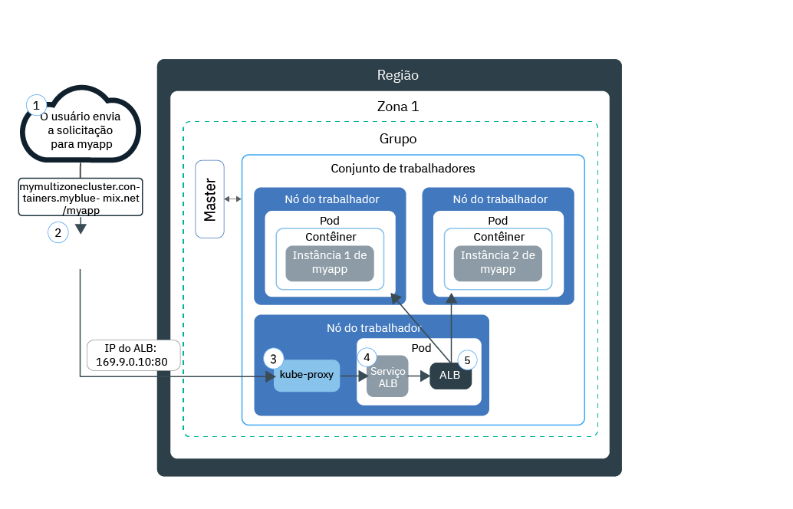
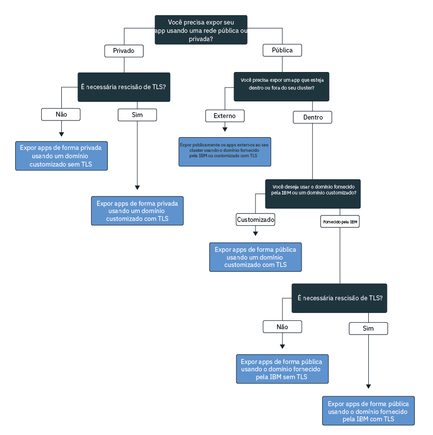

---

copyright:
  years: 2014, 2018
lastupdated: "2018-4-20"

---

{:new_window: target="_blank"}
{:shortdesc: .shortdesc}
{:screen: .screen}
{:pre: .pre}
{:table: .aria-labeledby="caption"}
{:codeblock: .codeblock}
{:tip: .tip}
{:download: .download}


# Expondo apps com o Ingress
{: #ingress}

Exponha múltiplos apps em seu cluster do Kubernetes criando recursos de Ingresso que são gerenciados pelo balanceador de carga de aplicativo fornecido pela IBM no {{site.data.keyword.containerlong}}.
{:shortdesc}

## Gerenciando o tráfego de rede usando o Ingress
{: #planning}

Ingress é um serviço do Kubernetes que equilibra cargas de trabalho do tráfego de rede em seu cluster encaminhando solicitações públicas ou privadas para seus apps. É possível usar o Ingress para expor múltiplos serviços de app ao público ou a uma rede privada usando uma rota público ou privada exclusiva.
{:shortdesc}

O Ingress consiste em dois componentes:
<dl>
<dt>Balanceador de carga de aplicativo</dt>
<dd>O balanceador de carga de aplicativo (ALB) é um balanceador de carga externo que atende solicitações de HTTP, HTTPS, TCP ou UDP recebidas e encaminha as solicitações para o pod de app apropriado. Ao criar um cluster padrão, o {{site.data.keyword.containershort_notm}} cria automaticamente um ALB altamente disponível para seu cluster e designa uma rota pública exclusiva para ele. A rota pública está vinculada a um endereço IP público móvel que é provisionado em sua conta de infraestrutura do IBM Cloud (SoftLayer) durante a criação do cluster. Um ALB privado padrão também é criado automaticamente, mas não é ativado automaticamente.</dd>
<dt>Recurso do Ingress</dt>
<dd>Para expor um app usando o Ingress, deve-se criar um serviço do Kubernetes para seu app e registrar esse serviço com o ALB definindo um recurso do Ingress. O recurso do Ingress é um recurso do Kubernetes que define as regras de como rotear solicitações recebidas para um app. O recurso do Ingress também especifica o caminho para o serviço de seu app, que é anexado à rota pública para formar uma URL exclusiva do app, como `mycluster.us-south.containers.mybluemix.net/myapp`.</dd>
</dl>

O diagrama a seguir mostra como o Ingresso direciona a comunicação da internet para um app:



1. Um usuário envia uma solicitação para seu app acessando a URL do app. Essa URL é a URL pública para seu app exposto com o caminho do recurso de Ingresso anexado a ela, como `mycluster.us-south.containers.mybluemix.net/myapp`.

2. Um serviço do sistema DNS que age como o balanceador de carga global resolve a URL para o endereço IP público móvel do ALB público padrão no cluster.

3. `kube-proxy` roteia a solicitação para o serviço ALB do Kubernetes para o app.

4. O serviço Kubernetes roteia a solicitação para o ALB.

5. O ALB verifica se uma regra de roteamento para o caminho `myapp` existe no cluster. Se uma regra de correspondência é localizada, a solicitação é encaminhada de acordo com as regras que você definiu no recurso de Ingresso para o pod no qual o app está implementado. Se múltiplas instâncias do app são implementadas no cluster, o ALB balanceia a carga de solicitações entre os pods de app.


**Nota:** o Ingresso está disponível somente para clusters padrão e requer pelo menos dois nós do trabalhador no cluster para assegurar alta disponibilidade e que atualizações periódicas sejam aplicadas. Configurar o Ingresso requer uma [política de acesso de Administrador](cs_users.html#access_policies). Verifique sua [política de acesso](cs_users.html#infra_access) atual.

Para escolher a melhor configuração para o Ingress, é possível seguir esta árvore de decisão:


<map name="ingress_map" id="ingress_map">
<area href="/docs/containers/cs_ingress.html#private_ingress_no_tls" alt="Expor apps de forma privada usando um domínio customizado sem TLS" shape="rect" coords="25, 246, 187, 294"/>
<area href="/docs/containers/cs_ingress.html#private_ingress_tls" alt="Expor apps de forma privada usando um domínio customizado com TLS" shape="rect" coords="161, 337, 309, 385"/>
<area href="/docs/containers/cs_ingress.html#external_endpoint" alt="Expondo apps de forma pública que estão fora de seu cluster usando o domínio fornecido pela IBM ou um customizado com TLS" shape="rect" coords="313, 229, 466, 282"/>
<area href="/docs/containers/cs_ingress.html#custom_domain_cert" alt="Expondo apps de forma pública usando um domínio customizado com TLS" shape="rect" coords="365, 415, 518, 468"/>
<area href="/docs/containers/cs_ingress.html#ibm_domain" alt="Expondo apps de forma pública usando o domínio fornecido pela IBM sem TLS" shape="rect" coords="414, 629, 569, 679"/>
<area href="/docs/containers/cs_ingress.html#ibm_domain_cert" alt="Expondo apps de forma pública usando o domínio fornecido pela IBM com TLS" shape="rect" coords="563, 711, 716, 764"/>
</map>

<br />


## Expondo apps ao público
{: #ingress_expose_public}

Ao criar um cluster padrão, um application load balancer (ALB) fornecido pela IBM é ativado automaticamente e é designado um endereço IP público móvel e uma rota pública.
{:shortdesc}

Cada app que é exposto ao público por meio do Ingresso é designado a um caminho exclusivo que é anexado à rota pública, para que seja possível usar uma URL exclusiva para acessar um app publicamente em seu cluster. Para expor seu app ao público, é possível configurar o Ingresso para os cenários a seguir.

-   [Expor apps de forma pública usando o domínio fornecido pela IBM sem TLS](#ibm_domain)
-   [Expor apps de forma pública usando o domínio fornecido pela IBM com TLS](#ibm_domain_cert)
-   [Expor apps de forma pública usando um domínio customizado com TLS](#custom_domain_cert)
-   [Expor apps de forma pública que estão fora de seu cluster usando o domínio fornecido pela IBM ou um customizado com TLS](#external_endpoint)

### Expor apps de forma pública usando o domínio fornecido pela IBM sem TLS
{: #ibm_domain}

É possível configurar o ALB para balancear a carga do tráfego de rede HTTP recebido para os apps em seu cluster e usar o domínio fornecido pela IBM para acessar seus apps na Internet.
{:shortdesc}

Antes de iniciar:

-   Se você não tiver nenhum ainda, [crie um cluster padrão](cs_clusters.html#clusters_ui).
-   [Destine sua CLI](cs_cli_install.html#cs_cli_configure) para seu cluster para executar comandos `kubectl`.

Para expor um app usando o domínio fornecido pela IBM:

1.  [Implemente o seu app no cluster](cs_app.html#app_cli). Assegure-se de incluir um rótulo em sua implementação na seção de metadados de seu arquivo de configuração, como `app: code`. Esse rótulo é necessário para identificar todos os pods nos quais o seu app está em execução para que os pods possam ser incluídos no balanceamento de carga do Ingress.

2.   Crie um serviço do Kubernetes para o app que você deseja expor. O seu app deve ser exposto por um serviço do Kubernetes a ser incluído pelo ALB de cluster no balanceamento de carga do Ingress.
      1.  Abra o seu editor preferencial e crie um arquivo de configuração de serviço que seja denominado, por exemplo, `myalbservice.yaml`.
      2.  Defina um serviço para o app que o ALB exporá para o público.

          ```
          apiVersion: v1 kind: Service metadata: name: myalbservice spec: selector: <selector_key>: <selector_value> ports: - protocol: TCP port: 8080
          ```
          {: codeblock}

          <table>
          <caption>Entendendo os componentes de arquivo de serviço do ALB</caption>
          <thead>
          <th colspan=2> entendendo os componentes de arquivo do YAML</th>
          </thead>
          <tbody>
          <tr>
          <td><code>seletor</code></td>
          <td>Insira a chave de etiqueta (<em>&lt;selector_key&gt;</em>) e o par de valores (<em>&lt;selector_value&gt;</em>) que você deseja usar para destinar os pods nos quais o seu app é executado. Para direcionar os seus pods e incluí-los no balanceamento de carga de serviço, certifique-se de que a <em>&lt;selector_key&gt;</em> e o <em>&lt;selector_value&gt;</em> sejam os mesmos que o par de chave/valor que você usou na seção <code>spec.template.metadata.labels</code> de seu yaml de implementação.</td>
           </tr>
           <tr>
           <td><code>port</code></td>
           <td>A porta na qual o serviço atende.</td>
           </tr>
           </tbody></table>
      3.  Salve as suas mudanças.
      4.  Crie o serviço em seu cluster.

          ```
          kubectl apply -f myalbservice.yaml
          ```
          {: pre}
      5.  Repita essas etapas para cada app que você desejar expor para o público.

3. Obtenha os detalhes de seu cluster para visualizar o domínio fornecido pela IBM. Substitua _&lt;cluster_name_or_ID&gt;_ pelo nome do cluster que você deseja expor para o público no qual o app está implementado.

    ```
    bx cs cluster-get <cluster_name_or_ID>
    ```
    {: pre}

    Saída de exemplo:

    ```
    Name:                   mycluster
    ID:                     18a61a63c6a94b658596ca93d087aad9
    State:                  normal
    Created:                2018-01-12T18:33:35+0000
    Location:               dal10
    Master URL:             https://169.xx.xxx.xxx:26268
    Ingress Subdomain:      mycluster-12345.us-south.containers.mybluemix.net
    Ingress Secret:         <tls_secret>
    Workers:                3
    Version:                1.8.11
    Owner Email:            owner@email.com
    Monitoring Dashboard:   <dashboard_URL>
    ```
    {: screen}

    É possível ver o domínio fornecido pela IBM no campo **Subdomínio do Ingresso**.
4.  Crie um recurso do Ingresso. Os recursos do Ingresso definem as regras de roteamento para o serviço do Kubernetes criado para o seu app e são usados pelo ALB para rotear o tráfego de rede recebido para o serviço. Deve-se usar um recurso do Ingresso para definir regras de roteamento para múltiplos apps se cada app é exposto por meio de um serviço do Kubernetes dentro do cluster.
    1.  Abra o seu editor preferencial e crie um arquivo de configuração do Ingress que seja denominado, por exemplo, `myingressresource.yaml`.
    2.  Defina um recurso do Ingress em seu arquivo de configuração que usa o domínio fornecido pela IBM para rotear o tráfego de rede recebido para os serviços que você criou anteriormente.

        ```
        apiVersion: extensions/v1beta1
        kind: Ingress
        metadata:
          name: myingressresource
        spec:
          rules:
          - host: <ibm_domain>
            http:
              paths:
              - path: /<service1_path>
                backend:
                  serviceName: <service1>
                  servicePort: 80
              - path: /<service2_path>
                backend:
                  serviceName: <service2>
                  servicePort: 80
        ```
        {: codeblock}

        <table>
        <thead>
        <th colspan=2> entendendo os componentes de arquivo do YAML</th>
        </thead>
        <tbody>
        <tr>
        <td><code>host</code></td>
        <td>Substitua <em>&lt;ibm_domain&gt;</em> pelo nome do <strong>subdomínio do Ingress</strong> fornecido pela IBM por meio da etapa prévia.

        </br></br>
        <strong>Nota:</strong> não use * para o seu host ou deixe a propriedade do host vazia para evitar falhas durante a criação do Ingresso.</td>
        </tr>
        <tr>
        <td><code>path</code></td>
        <td>Substitua <em>&lt;service1_path&gt;</em> por uma barra ou pelo caminho exclusivo no qual o seu app está atendendo para que o tráfego de rede possa ser encaminhado para o app.

        </br>
        Para cada serviço do Kubernetes, é possível definir um caminho individual que é anexado ao domínio fornecido pela IBM para criar um caminho exclusivo para seu app; por exemplo, <code>ibm_domain/service1_path</code>. Quando você insere essa rota em um navegador da web, o tráfego de rede é roteado para o ALB. O ALB consulta o serviço associado e envia o tráfego de rede para o serviço. O serviço, então, encaminha o tráfego para os pods nos quais o app está em execução. O app deve ser configurado para atender nesse caminho para receber o tráfego de rede recebido.

        </br></br>
        Muitos apps não atendem em um caminho específico, mas usam o caminho raiz e uma porta específica. Nesse caso, defina o caminho raiz como <code>/</code> e não especifique um caminho individual para seu app.
        </br>
        Exemplos: <ul><li>Para <code>http://ibm_domain/</code>, insira <code>/</code> como o caminho.</li><li>Para <code>http://ibm_domain/service1_path</code>, insira <code>/service1_path</code> como o caminho.</li></ul>
        </br>
        <strong>Dica:</strong> para configurar o Ingresso para atender em um caminho que seja diferente do caminho no qual seu app atende, será possível usar a [nova gravação de anotação](cs_annotations.html#rewrite-path) para estabelecer o roteamento adequado para o app.</td>
        </tr>
        <tr>
        <td><code>serviceName</code></td>
        <td>Substitua <em>&lt;service1&gt;</em> pelo nome do serviço que você usou quando criou o serviço do Kubernetes para o seu app.</td>
        </tr>
        <tr>
        <td><code>servicePort</code></td>
        <td>A porta na qual o serviço atende. Use a mesma porta que você definiu quando criou o serviço do Kubernetes para seu app.</td>
        </tr>
        </tbody></table>

    3.  Crie o recurso de Ingresso para seu cluster.

        ```
        kubectl apply -f myingressresource.yaml
        ```
        {: pre}
5.   Verifique se o recurso de Ingresso foi criado com êxito.

      ```
      kubectl describe ingress myingressresource
      ```
      {: pre}

      1. Se as mensagens nos eventos descreverem um erro na configuração do recurso, mude os valores no arquivo de recursos e reaplique o arquivo para o recurso.

6.   Em um navegador da web, insira a URL do serviço de app a ser acessado.

      ```
      https://<ibm_domain>/<service1_path>
      ```
      {: codeblock}


<br />


### Expor apps publicamente usando o domínio fornecido pela IBM com TLS
{: #ibm_domain_cert}

É possível configurar o ALB de Ingresso para gerenciar conexões TLS recebidas para seus apps, decriptografar o tráfego de rede usando o certificado TLS fornecido pela IBM e encaminhar a solicitação decriptografada para os apps expostos em seu cluster.
{:shortdesc}

Antes de iniciar:

-   Se você não tiver nenhum ainda, [crie um cluster padrão](cs_clusters.html#clusters_ui).
-   [Destine sua CLI](cs_cli_install.html#cs_cli_configure) para seu cluster para executar comandos `kubectl`.

Para expor um app usando o domínio fornecido pela IBM com TLS:

1.  [Implemente o seu app no cluster](cs_app.html#app_cli). Assegure-se de incluir um rótulo em sua implementação na seção de metadados de seu arquivo de configuração, como `app: code`. Esse rótulo é necessário para identificar todos os pods nos quais o seu app está em execução para que os pods possam ser incluídos no balanceamento de carga do Ingress.

2.   Crie um serviço do Kubernetes para o app que você deseja expor. O seu app deve ser exposto por um serviço do Kubernetes a ser incluído pelo ALB de cluster no balanceamento de carga do Ingress.
      1.  Abra o seu editor preferencial e crie um arquivo de configuração de serviço que seja denominado, por exemplo, `myalbservice.yaml`.
      2.  Defina um serviço para o app que o ALB exporá para o público.

          ```
          apiVersion: v1 kind: Service metadata: name: myalbservice spec: selector: <selector_key>: <selector_value> ports: - protocol: TCP port: 8080
          ```
          {: codeblock}

          <table>
          <caption>Entendendo os componentes de arquivo de serviço do ALB</caption>
          <thead>
          <th colspan=2> entendendo os componentes de arquivo do YAML</th>
          </thead>
          <tbody>
          <tr>
          <td><code>seletor</code></td>
          <td>Insira a chave de etiqueta (<em>&lt;selector_key&gt;</em>) e o par de valores (<em>&lt;selector_value&gt;</em>) que você deseja usar para destinar os pods nos quais o seu app é executado. Para direcionar os seus pods e incluí-los no balanceamento de carga de serviço, certifique-se de que a <em>&lt;selector_key&gt;</em> e o <em>&lt;selector_value&gt;</em> sejam os mesmos que o par de chave/valor que você usou na seção <code>spec.template.metadata.labels</code> de seu yaml de implementação.</td>
           </tr>
           <tr>
           <td><code>port</code></td>
           <td>A porta na qual o serviço atende.</td>
           </tr>
           </tbody></table>
      3.  Salve as suas mudanças.
      4.  Crie o serviço em seu cluster.

          ```
          kubectl apply -f myalbservice.yaml
          ```
          {: pre}
      5.  Repita essas etapas para cada app que você desejar expor para o público.

3.   Visualize o domínio fornecido pela IBM e o certificado TLS. Substitua _&lt;cluster_name_or_ID&gt;_ pelo nome do cluster no qual o app está implementado.

      ```
      bx cs cluster-get <cluster_name_or_ID>
      ```
      {: pre}

      Saída de exemplo:

      ```
      Name:                   mycluster
      ID:                     18a61a63c6a94b658596ca93d087aad9
      State:                  normal
      Created:                2018-01-12T18:33:35+0000
      Location:               dal10
      Master URL:             https://169.xx.xxx.xxx:26268
      Ingress Subdomain:      mycluster-12345.us-south.containers.mybluemix.net
      Ingress Secret:         <ibm_tls_secret>
      Workers:                3
      Version:                1.8.11
      Owner Email:            owner@email.com
      Monitoring Dashboard:   <dashboard_URL>
      ```
      {: screen}

      Você pode ver o domínio fornecido pela IBM no **Subdomínio do Ingress** e o certificado fornecido pela IBM nos campos de **Segredo do Ingress**.

4.  Crie um recurso do Ingresso. Os recursos do Ingresso definem as regras de roteamento para o serviço do Kubernetes criado para o seu app e são usados pelo ALB para rotear o tráfego de rede recebido para o serviço. Deve-se usar um recurso do Ingresso para definir regras de roteamento para múltiplos apps se cada app é exposto por meio de um serviço do Kubernetes dentro do cluster.
    1.  Abra o seu editor preferencial e crie um arquivo de configuração do Ingress que seja denominado, por exemplo, `myingressresource.yaml`.
    2.  Defina um recurso do Ingress em seu arquivo de configuração que usa o domínio fornecido pela IBM para rotear o tráfego de rede recebido para os serviços que você criou anteriormente e o seu certificado customizado para gerenciar a finalização TLS.

        ```
        apiVersion: extensions/v1beta1
        kind: Ingress
        metadata:
          name: myingressresource
        spec:
          tls:
          - hosts:
            - <ibm_domain>
            secretName: <ibm_tls_secret>
          rules:
          - host: <ibm_domain>
            http:
              paths:
              - path: /<service1_path>
                backend:
                  serviceName: <service1>
                  servicePort: 80
              - path: /<service2_path>
                backend:
                  serviceName: <service2>
                  servicePort: 80
        ```
        {: codeblock}

        <table>
        <thead>
        <th colspan=2> entendendo os componentes de arquivo do YAML</th>
        </thead>
        <tbody>
        <tr>
        <td><code>tls/hosts</code></td>
        <td>Substitua <em>&lt;ibm_domain&gt;</em> pelo nome do <strong>subdomínio do Ingress</strong> fornecido pela IBM por meio da etapa prévia. Esse domínio é configurado para finalização TLS.

        </br></br>
        <strong>Nota:</strong> não use &ast; para o seu host ou deixe a propriedade do host vazia para evitar falhas durante a criação do Ingresso.</td>
        </tr>
        <tr>
        <td><code>tls/secretName</code></td>
        <td>Substitua <em>&lt;<ibm_tls_secret>&gt;</em> pelo nome do <strong>segredo do Ingress</strong> fornecido pela IBM da etapa anterior. Esse certificado gerencia a finalização do TLS.
        </tr>
        <tr>
        <td><code>host</code></td>
        <td>Substitua <em>&lt;ibm_domain&gt;</em> pelo nome do <strong>subdomínio do Ingress</strong> fornecido pela IBM por meio da etapa prévia. Esse domínio é configurado para finalização TLS.

        </br></br>
        <strong>Nota:</strong> não use &ast; para o seu host ou deixe a propriedade do host vazia para evitar falhas durante a criação do Ingresso.</td>
        </tr>
        <tr>
        <td><code>path</code></td>
        <td>Substitua <em>&lt;service1_path&gt;</em> por uma barra ou pelo caminho exclusivo no qual o seu app está atendendo para que o tráfego de rede possa ser encaminhado para o app.

        </br>
        Para cada serviço do Kubernetes, é possível definir um caminho individual que é anexado ao domínio fornecido pela IBM para criar um caminho exclusivo para seu app. Quando você insere essa rota em um navegador da web, o tráfego de rede é roteado para o ALB. O ALB consulta o serviço associado e envia o tráfego de rede para o serviço. O serviço, então, encaminha o tráfego para os pods nos quais o app está em execução. O app deve ser configurado para atender nesse caminho para receber o tráfego de rede recebido.

        </br>
        Muitos apps não atendem em um caminho específico, mas usam o caminho raiz e uma porta específica. Nesse caso, defina o caminho raiz como <code>/</code> e não especifique um caminho individual para seu app.

        </br>
        Exemplos: <ul><li>Para <code>http://ibm_domain/</code>, insira <code>/</code> como o caminho.</li><li>Para <code>http://ibm_domain/service1_path</code>, insira <code>/service1_path</code> como o caminho.</li></ul>
        <strong>Dica:</strong> para configurar o Ingresso para atender em um caminho que seja diferente do caminho no qual seu app atende, será possível usar a [nova gravação de anotação](cs_annotations.html#rewrite-path) para estabelecer o roteamento adequado para o app.</td>
        </tr>
        <tr>
        <td><code>serviceName</code></td>
        <td>Substitua <em>&lt;service1&gt;</em> pelo nome do serviço que você usou quando criou o serviço do Kubernetes para o seu app.</td>
        </tr>
        <tr>
        <td><code>servicePort</code></td>
        <td>A porta na qual o serviço atende. Use a mesma porta que você definiu quando criou o serviço do Kubernetes para seu app.</td>
        </tr>
        </tbody></table>

    3.  Crie o recurso de Ingresso para seu cluster.

        ```
        kubectl apply -f myingressresource.yaml
        ```
        {: pre}
5.   Verifique se o recurso de Ingresso foi criado com êxito.

      ```
      kubectl describe ingress myingressresource
      ```
      {: pre}

      1. Se as mensagens nos eventos descreverem um erro na configuração do recurso, mude os valores no arquivo de recursos e reaplique o arquivo para o recurso.

6.   Em um navegador da web, insira a URL do serviço de app a ser acessado.

      ```
      https://<ibm_domain>/<service1_path>
      ```
      {: codeblock}


<br />


### Expor apps de forma pública usando um domínio customizado com TLS
{: #custom_domain_cert}

É possível configurar o ALB para rotear o tráfego de rede recebido para os apps em seu cluster e usar seu próprio certificado TLS para gerenciar a finalização do TLS, enquanto usa seu domínio customizado em vez do domínio fornecido pela IBM.
{:shortdesc}

Antes de iniciar:

-   Se você não tiver nenhum ainda, [crie um cluster padrão](cs_clusters.html#clusters_ui).
-   [Destine sua CLI](cs_cli_install.html#cs_cli_configure) para seu cluster para executar comandos `kubectl`.

Para expor um app usando um domínio customizado com TLS:

1.  Crie um domínio customizado. Para criar um domínio customizado, trabalhe com seu provedor Domain Name Service (DNS) ou com o [{{site.data.keyword.Bluemix_notm}}](/docs/infrastructure/dns/getting-started.html#getting-started-with-dns) para registrar seu domínio customizado.
2.  Configure seu domínio para rotear o tráfego de rede recebido para o ALB fornecido pela IBM. Escolha entre estas opções:
    -   Defina um alias para seu domínio customizado especificando o domínio fornecido pela IBM como um registro de Nome Canônico (CNAME). Para localizar o domínio de Ingresso fornecido pela IBM, execute `bx cs cluster-get <cluster_name>` e procure o campo **Subdomínio do Ingresso**.
    -   Mapeie o seu domínio customizado para o endereço IP público móvel do ALB fornecido pela IBM incluindo o endereço IP como um registro. Para localizar o endereço IP público móvel do ALB, execute `bx cs alb-get <public_alb_ID>`.
3.  Importe ou crie um certificado TLS e a chave secreta.
    * Se um certificado TLS é armazenado no {{site.data.keyword.cloudcerts_long_notm}} que você deseja usar, é possível importar seu segredo associado para o cluster executando o comando a seguir:

      ```
      bx cs alb-cert-deploy --secret-name <secret_name> --cluster <cluster_name_or_ID> --cert-crn <certificate_crn>
      ```
      {: pre}

    * Se você não tiver um certificado TLS pronto, siga estas etapas:
        1. Crie um certificado e chave TLS para seu domínio que é codificado no formato PEM.
        2. Crie um segredo que use seu certificado e chave do TLS. Substitua <em>&lt;tls_secret_name&gt;</em> pelo nome para o seu segredo do Kubernetes, <em>&lt;tls_key_filepath&gt;</em> pelo caminho para o seu arquivo-chave do TLS customizado e <em>&lt;tls_cert_filepath&gt;</em> pelo caminho para o seu arquivo de certificado do TLS customizado.

            ```
            kubectl create secret tls <tls_secret_name> --key <tls_key_filepath> --cert <tls_cert_filepath>
            ```
            {: pre}
4.  [Implemente o seu app no cluster](cs_app.html#app_cli). Assegure-se de incluir um rótulo em sua implementação na seção de metadados de seu arquivo de configuração, como `app: code`. Esse rótulo é necessário para identificar todos os pods nos quais o seu app está em execução para que os pods possam ser incluídos no balanceamento de carga do Ingress.

5.   Crie um serviço do Kubernetes para o app que você deseja expor. O seu app deve ser exposto por um serviço do Kubernetes a ser incluído pelo ALB de cluster no balanceamento de carga do Ingress.
      1.  Abra o seu editor preferencial e crie um arquivo de configuração de serviço que seja denominado, por exemplo, `myalbservice.yaml`.
      2.  Defina um serviço para o app que o ALB exporá para o público.

          ```
          apiVersion: v1 kind: Service metadata: name: myalbservice spec: selector: <selector_key>: <selector_value> ports: - protocol: TCP port: 8080
          ```
          {: codeblock}

          <table>
          <caption>Entendendo os componentes de arquivo de serviço do ALB</caption>
          <thead>
          <th colspan=2> entendendo os componentes de arquivo do YAML</th>
          </thead>
          <tbody>
          <tr>
          <td><code>seletor</code></td>
          <td>Insira a chave de etiqueta (<em>&lt;selector_key&gt;</em>) e o par de valores (<em>&lt;selector_value&gt;</em>) que você deseja usar para destinar os pods nos quais o seu app é executado. Para direcionar os seus pods e incluí-los no balanceamento de carga de serviço, certifique-se de que a <em>&lt;selector_key&gt;</em> e o <em>&lt;selector_value&gt;</em> sejam os mesmos que o par de chave/valor que você usou na seção <code>spec.template.metadata.labels</code> de seu yaml de implementação.</td>
           </tr>
           <tr>
           <td><code>port</code></td>
           <td>A porta na qual o serviço atende.</td>
           </tr>
           </tbody></table>
      3.  Salve as suas mudanças.
      4.  Crie o serviço em seu cluster.

          ```
          kubectl apply -f myalbservice.yaml
          ```
          {: pre}
      5.  Repita essas etapas para cada app que você desejar expor para o público.

6.  Crie um recurso do Ingresso. Os recursos do Ingresso definem as regras de roteamento para o serviço do Kubernetes criado para o seu app e são usados pelo ALB para rotear o tráfego de rede recebido para o serviço. Deve-se usar um recurso do Ingresso para definir regras de roteamento para múltiplos apps se cada app é exposto por meio de um serviço do Kubernetes dentro do cluster.
    1.  Abra o seu editor preferencial e crie um arquivo de configuração do Ingress que seja denominado, por exemplo, `myingressresource.yaml`.
    2.  Defina um recurso do Ingresso em seu arquivo de configuração que use o domínio customizado para rotear o tráfego de rede recebido para seus serviços e o certificado customizado para gerenciar o encerramento do TLS.

        ```
        apiVersion: extensions/v1beta1
        kind: Ingress
        metadata:
          name: myingressresource
        spec:
          tls:
          - hosts:
            - <custom_domain>
            secretName: <tls_secret_name>
          rules:
          - host: <custom_domain>
            http:
              paths:
              - path: /<service1_path>
                backend:
                  serviceName: <service1>
                  servicePort: 80
              - path: /<service2_path>
                backend:
                  serviceName: <service2>
                  servicePort: 80
        ```
        {: codeblock}

        <table>
        <thead>
        <th colspan=2> entendendo os componentes de arquivo do YAML</th>
        </thead>
        <tbody>
        <tr>
        <td><code>tls/hosts</code></td>
        <td>Substitua <em>&lt;custom_domain&gt;</em> pelo domínio customizado que você deseja configurar para a finalização do TLS.

        </br></br>
        <strong>Nota:</strong> não use &ast; para o seu host ou deixe a propriedade do host vazia para evitar falhas durante a criação do Ingresso.</td>
        </tr>
        <tr>
        <td><code>tls/secretName</code></td>
        <td>Substitua <em>&lt;tls_secret_name&gt;</em> pelo nome do segredo que você criou anteriormente que contém seu certificado e chave TLS customizados. Se você tiver importado um certificado do {{site.data.keyword.cloudcerts_short}}, será possível executar <code>bx cs alb-cert-get --cluster <cluster_name_or_ID> --cert-crn <certificate_crn></code> para ver os segredos associados a um certificado TLS.
        </tr>
        <tr>
        <td><code>host</code></td>
        <td>Substitua <em>&lt;custom_domain&gt;</em> pelo domínio customizado que você deseja configurar para a finalização do TLS.

        </br></br>
        <strong>Nota:</strong> não use &ast; para o seu host ou deixe a propriedade do host vazia para evitar falhas durante a criação do Ingresso.
        </td>
        </tr>
        <tr>
        <td><code>path</code></td>
        <td>Substitua <em>&lt;service1_path&gt;</em> por uma barra ou pelo caminho exclusivo no qual o seu app está atendendo para que o tráfego de rede possa ser encaminhado para o app.

        </br>
        Para cada serviço, é possível definir um caminho individual que é anexado ao seu domínio customizado para criar um caminho exclusivo para o seu app. Quando você insere essa rota em um navegador da web, o tráfego de rede é roteado para o ALB. O ALB consulta o serviço associado e envia o tráfego de rede para o serviço. O serviço, então, encaminha o tráfego para os pods nos quais o app está em execução. O app deve ser configurado para atender nesse caminho para receber o tráfego de rede recebido.

        </br>
        Muitos apps não atendem em um caminho específico, mas usam o caminho raiz e uma porta específica. Nesse caso, defina o caminho raiz como <code>/</code> e não especifique um caminho individual para seu app.

        </br></br>
        Exemplos: <ul><li>Para <code>https://custom_domain/</code>, insira <code>/</code> como o caminho. </li><li>Para <code>https://custom_domain/service1_path</code>, insira <code>/service1_path</code> como o caminho.</li></ul>
        <strong>Dica:</strong> para configurar o Ingresso para atender em um caminho que seja diferente do caminho no qual seu app atende, será possível usar a [nova gravação de anotação](cs_annotations.html#rewrite-path) para estabelecer o roteamento adequado para o app.
        </td>
        </tr>
        <tr>
        <td><code>serviceName</code></td>
        <td>Substitua <em>&lt;service1&gt;</em> pelo nome do serviço que você usou quando criou o serviço do Kubernetes para o seu app.</td>
        </tr>
        <tr>
        <td><code>servicePort</code></td>
        <td>A porta na qual o serviço atende. Use a mesma porta que você definiu quando criou o serviço do Kubernetes para seu app.</td>
        </tr>
        </tbody></table>

    3.  Salve as suas mudanças.
    4.  Crie o recurso de Ingresso para seu cluster.

        ```
        kubectl apply -f myingressresource.yaml
        ```
        {: pre}
7.   Verifique se o recurso de Ingresso foi criado com êxito.

      ```
      kubectl describe ingress myingressresource
      ```
      {: pre}

      1. Se as mensagens nos eventos descreverem um erro na configuração do recurso, mude os valores no arquivo de recursos e reaplique o arquivo para o recurso.

8.   Em um navegador da web, insira a URL do serviço de app a ser acessado.

      ```
      https://<custom_domain>/<service1_path>
      ```
      {: codeblock}


<br />


### Expor apps de forma pública que estão fora de seu cluster usando o domínio fornecido pela IBM ou um customizado com TLS
{: #external_endpoint}

É possível configurar o ALB para incluir apps que estão localizados fora do cluster. As solicitações recebidas no domínio customizado ou fornecido pela IBM
são encaminhadas automaticamente para o app externo.
{:shortdesc}

Antes de iniciar:

-   Se você não tiver nenhum ainda, [crie um cluster padrão](cs_clusters.html#clusters_ui).
-   [Destine sua CLI](cs_cli_install.html#cs_cli_configure) para seu cluster para executar comandos `kubectl`.
-   Assegure-se de que o app externo que você deseja incluir no balanceamento de carga do cluster possa ser acessado usando um endereço IP público.

É possível rotear o tráfego de rede recebido no domínio fornecido pela IBM para apps que estão localizados fora do cluster. Se desejar usar um domínio customizado e um certificado TLS como alternativa, substitua o domínio fornecido pela IBM e o certificado TLS pelo seu [domínio customizado e certificado TLS](#custom_domain_cert).

1.  Crie um serviço do Kubernetes para seu cluster que encaminhará solicitações recebidas para um terminal externo que você criará.
    1.  Abra seu editor preferencial e crie um arquivo de configuração de serviço que seja chamado, por exemplo, de `myexternalservice.yaml`.
    2.  Defina o serviço ALB.

        ```
        apiVersion: v1
        kind: Service
        metadata:
          name: myexternalservice
        spec:
          ports:
           - protocol: TCP
             port: 8080
        ```
        {: codeblock}

        <table>
        <caption>Entendendo os componentes de arquivo de serviço do ALB</caption>
        <thead>
        <th colspan=2> entendendo os componentes de arquivo do YAML</th>
        </thead>
        <tbody>
        <tr>
        <td><code>metadata/name</code></td>
        <td>Substitua <em>&lt;myexternalservice&gt;</em> por um nome de seu serviço.</td>
        </tr>
        <tr>
        <td><code>port</code></td>
        <td>A porta na qual o serviço atende.</td>
        </tr></tbody></table>

    3.  Salve as suas mudanças.
    4.  Crie o serviço do Kubernetes para seu cluster.

        ```
        kubectl apply -f myexternalservice.yaml
        ```
        {: pre}
2.  Configure um terminal do Kubernetes que defina o local externo do app que você deseja incluir no balanceamento de carga do cluster.
    1.  Abra seu editor preferencial e crie um arquivo de configuração do terminal que é chamado, por exemplo, de `myexternalendpoint.yaml`.
    2.  Defina seu terminal externo. Inclua todos os endereços IP públicos e portas que podem ser usados para acessar seu app externo.

        ```
        kind: Endpoints
        apiVersion: v1
        metadata:
          name: myexternalendpoint
        subsets:
          - addresses:
              - ip: <external_IP1>
              - ip: <external_IP2>
            ports:
              - port: <external_port>
        ```
        {: codeblock}

        <table>
        <thead>
        <th colspan=2> entendendo os componentes de arquivo do YAML</th>
        </thead>
        <tbody>
        <tr>
        <td><code>name</code></td>
        <td>Substitua <em>&lt;myexternalendpoint&gt;</em> pelo nome do serviço do Kubernetes que você criou anteriormente.</td>
        </tr>
        <tr>
        <td><code>IP</code></td>
        <td>Substitua <em>&lt;external_IP&gt;</em> pelos endereços IP públicos para se conectar ao app externo.</td>
         </tr>
         <td><code>port</code></td>
         <td>Substitua <em>&lt;external_port&gt;</em> pela porta em que seu app externo atende.</td>
         </tbody></table>

    3.  Salve as suas mudanças.
    4.  Crie o terminal do Kubernetes para seu cluster.

        ```
        kubectl apply -f myexternalendpoint.yaml
        ```
        {: pre}
3.   Visualize o domínio fornecido pela IBM e o certificado TLS. Substitua _&lt;cluster_name_or_ID&gt;_ pelo nome do cluster no qual o app está implementado.

      ```
      bx cs cluster-get <cluster_name_or_ID>
      ```
      {: pre}

      Saída de exemplo:

      ```
      Name:                   mycluster
      ID:                     18a61a63c6a94b658596ca93d087aad9
      State:                  normal
      Created:                2018-01-12T18:33:35+0000
      Location:               dal10
      Master URL:             https://169.xx.xxx.xxx:26268
      Ingress Subdomain:      mycluster-12345.us-south.containers.mybluemix.net
      Ingress Secret:         <ibm_tls_secret>
      Workers:                3
      Version:                1.8.11
      Owner Email:            owner@email.com
      Monitoring Dashboard:   <dashboard_URL>
      ```
      {: screen}

      Você pode ver o domínio fornecido pela IBM no **Subdomínio do Ingress** e o certificado fornecido pela IBM nos campos de **Segredo do Ingress**.

4.  Crie um recurso do Ingresso. Os recursos do Ingresso definem as regras de roteamento para o serviço do Kubernetes criado para o seu app e são usados pelo ALB para rotear o tráfego de rede recebido para o serviço. Será possível usar um recurso do Ingresso para definir regras de roteamento para múltiplos apps externos desde que cada app seja exposto com o seu terminal externo por meio de um serviço do Kubernetes dentro do cluster.
    1.  Abra seu editor preferencial e crie um arquivo de configuração do Ingresso que seja chamado, por exemplo, de `myexternalingress.yaml`.
    2.  Defina um recurso do Ingresso em seu arquivo de configuração que usa o domínio fornecido pela IBM e o certificado TLS para rotear o tráfego de rede recebido para seu app externo usando o terminal externo que você definiu anteriormente.

        ```
        apiVersion: extensions/v1beta1
        kind: Ingress
        metadata:
          name: myexternalingress
        spec:
          tls:
          - hosts:
            - <ibm_domain>
            secretName: <ibm_tls_secret>
          rules:
          - host: <ibm_domain>
            http:
              paths:
              - path: /<external_service1_path>
                backend:
                  serviceName: <external_service1>
                  servicePort: 80
              - path: /<external_service2_path>
                backend:
                  serviceName: <external_service2>
                  servicePort: 80
        ```
        {: codeblock}

        <table>
        <thead>
        <th colspan=2> entendendo os componentes de arquivo do YAML</th>
        </thead>
        <tbody>
        <tr>
        <td><code>tls/hosts</code></td>
        <td>Substitua <em>&lt;ibm_domain&gt;</em> pelo nome do <strong>subdomínio do Ingress</strong> fornecido pela IBM por meio da etapa prévia. Esse domínio é configurado para finalização TLS.

        </br></br>
        <strong>Nota:</strong> não use &ast; para o seu host ou deixe a propriedade do host vazia para evitar falhas durante a criação do Ingresso.</td>
        </tr>
        <tr>
        <td><code>tls/secretName</code></td>
        <td>Substitua <em>&lt;ibm_tls_secret&gt;</em> pelo <strong>segredo do Ingress</strong> fornecido pela IBM na etapa anterior. Esse certificado gerencia a finalização do TLS.</td>
        </tr>
        <tr>
        <td><code>rules/host</code></td>
        <td>Substitua <em>&lt;ibm_domain&gt;</em> pelo nome do <strong>subdomínio do Ingress</strong> fornecido pela IBM por meio da etapa prévia. Esse domínio é configurado para finalização TLS.

        </br></br>
        <strong>Nota:</strong> não use &ast; para o seu host ou deixe a propriedade do host vazia para evitar falhas durante a criação do Ingresso.</td>
        </tr>
        <tr>
        <td><code>path</code></td>
        <td>Substitua <em>&lt;external_service_path&gt;</em> por uma barra ou pelo caminho exclusivo no qual seu app externo está atendendo, para que o tráfego de rede possa ser encaminhado para o app.

        </br>
        Para cada serviço, é possível definir um caminho individual que é anexado ao domínio customizado ou fornecido pela IBM para criar um caminho exclusivo para seu app, por exemplo, <code>http://ibm_domain/external_service_path</code> ou <code>http://custom_domain/</code>. Quando você insere essa rota em um navegador da web, o tráfego de rede é roteado para o ALB. O ALB consulta o serviço associado e envia o tráfego de rede para o serviço. O serviço encaminha o tráfego para o app externo. O app deve ser configurado para atender nesse caminho para receber o tráfego de rede recebido.

        </br></br>
        Muitos apps não atendem em um caminho específico, mas usam o caminho raiz e uma porta específica. Nesse caso, defina o caminho raiz como <code>/</code> e não especifique um caminho individual para seu app.

        </br></br>
        <strong>Dica:</strong> para configurar o Ingresso para atender em um caminho que seja diferente do caminho no qual seu app atende, será possível usar a [nova gravação de anotação](cs_annotations.html#rewrite-path) para estabelecer o roteamento adequado para o app.</td>
        </tr>
        <tr>
        <td><code>serviceName</code></td>
        <td>Substitua <em>&lt;external_service&gt;</em> pelo nome do serviço que você usou quando criou o serviço do Kubernetes para seu app externo.</td>
        </tr>
        <tr>
        <td><code>servicePort</code></td>
        <td>A porta na qual o serviço atende.</td>
        </tr>
        </tbody></table>

    3.  Salve as suas mudanças.
    4.  Crie o recurso de Ingresso para seu cluster.

        ```
        kubectl apply -f myexternalingress.yaml
        ```
        {: pre}
5.   Verifique se o recurso de Ingresso foi criado com êxito.

      ```
      kubectl describe ingress myingressresource
      ```
      {: pre}

      1. Se as mensagens nos eventos descreverem um erro na configuração do recurso, mude os valores no arquivo de recursos e reaplique o arquivo para o recurso.

6.   Em um navegador da web, insira a URL do serviço de app a ser acessado.

      ```
      https://<ibm_domain>/<service1_path>
      ```
      {: codeblock}


<br />


## Expondo apps para uma rede privada
{: #ingress_expose_private}

Ao criar um cluster padrão, um application load balancer (ALB) fornecido pela IBM é criado e designado a um endereço IP privado móvel e uma rota privada. No entanto, o ALB privado padrão não é ativado automaticamente.
{:shortdesc}

Para expor seu app a redes privadas, primeiro [ative o balanceador de carga de aplicativo privado padrão](#private_ingress).

É possível então configurar o Ingresso para os cenários a seguir.
-   [Expor apps de forma privada usando um domínio customizado sem TLS usando um provedor DNS externo](#private_ingress_no_tls)
-   [Expor apps de forma privada usando um domínio customizado com TLS usando um provedor DNS externo](#private_ingress_tls)
-   [Expor apps de forma privada usando um serviço DNS local](#private_ingress_onprem_dns)

### Ativando o balanceador de carga de aplicativo privado padrão
{: #private_ingress}

Antes de poder usar o ALB privado padrão, deve-se ativá-lo com o endereço IP privado móvel fornecido pela IBM ou seu próprio endereço IP privado móvel.
{:shortdesc}

**Nota**: se você usou a sinalização `--no-subnet` quando criou o cluster, deve-se incluir uma sub-rede privada móvel ou uma sub-rede gerenciada pelo usuário antes de poder ativar o ALB privado. Para obter mais informações, veja [Solicitando sub-redes adicionais para seu cluster](cs_subnets.html#request).

Antes de iniciar:

-   Se você não tiver nenhum ainda, [crie um cluster padrão](cs_clusters.html#clusters_ui).
-   [Destine sua CLI](cs_cli_install.html#cs_cli_configure) para seu cluster.

Para ativar o ALB privado usando o endereço IP privado móvel, fornecido pela IBM, pré-designado:

1. Liste os ALBs disponíveis em seu cluster para obter o ID do ALB privado. Substitua <em>&lt;cluser_name&gt;</em> pelo nome do cluster no qual o app que você deseja expor está implementado.

    ```
    bx cs albs --cluster <cluser_name>
    ```
    {: pre}

    O campo **Status** para o ALB privado está _desativado_.
    ```
    ALB ID Enabled Status Type ALB IP private-cr6d779503319d419ea3b4ab171d12c3b8-alb1 false disabled private - public-cr6d779503319d419ea3b4ab171d12c3b8-alb1 true enabled public 169.xx.xxx.xxx
    ```
    {: screen}

2. Ative o ALB privado. Substitua <em>&lt;private_ALB_ID&gt;</em> pelo ID de ALB privado da saída na etapa anterior.

   ```
   bx cs alb-configure --albID <private_ALB_ID> --enable
   ```
   {: pre}


Para ativar o ALB privado usando seu próprio endereço IP privado móvel:

1. Configure a sub-rede gerenciada pelo usuário de seu endereço IP escolhido para rotear o tráfego na VLAN privada do seu cluster. Substitua <em>&lt;cluser_name&gt;</em> pelo nome ou ID do cluster no qual o app que você deseja expor está implementado, <em>&lt;subnet_CIDR&gt;</em> pelo CIDR de sua sub-rede gerenciada pelo usuário e <em>&lt;private_VLAN_ID&gt;</em> por um ID de VLAN privada disponível. É possível localizar o ID de uma VLAN privada disponível executando `bx cs vlans`.

   ```
   bx cs cluster-user-subnet-add <cluster_name> <subnet_CIDR> <private_VLAN_ID>
   ```
   {: pre}

2. Liste os ALBs disponíveis em seu cluster para obter o ID de ALB privado.

    ```
    bx cs albs --cluster <cluster_name>
    ```
    {: pre}

    O campo **Status** para o ALB privado está _desativado_.
    ```
    ALB ID Enabled Status Type ALB IP private-cr6d779503319d419ea3b4ab171d12c3b8-alb1 false disabled private - public-cr6d779503319d419ea3b4ab171d12c3b8-alb1 true enabled public 169.xx.xxx.xxx
    ```
    {: screen}

3. Ative o ALB privado. Substitua <em>&lt;private_ALB_ID&gt;</em> pelo ID do ALB privado da saída na etapa anterior e <em>&lt;user_IP&gt;</em> pelo endereço IP de sua sub-rede gerenciada pelo usuário que você deseja usar.

   ```
   bx cs alb-configure --albID <private_ALB_ID> --enable --user-ip <user_IP>
   ```
   {: pre}

<br />


### Expor apps de forma privada usando um domínio customizado sem TLS usando um provedor DNS externo
{: #private_ingress_no_tls}

É possível configurar o ALB privado para rotear o tráfego de rede recebido para os apps em seu cluster usando um domínio customizado.
{:shortdesc}

Antes de iniciar:
* [Ative o balanceador de carga do aplicativo privado](#private_ingress).
* Se você tiver nós do trabalhador privados e desejar usar um provedor do DNS externo, será necessário [configurar os nós da borda com acesso público](cs_edge.html#edge) e [configurar um Dispositivo de gateway do Vyatta ](https://www.ibm.com/blogs/bluemix/2017/07/kubernetes-and-bluemix-container-based-workloads-part4/). Se você desejar permanecer apenas em uma rede privada, veja [Expor apps de forma privada usando um serviço do DNS no local](#private_ingress_onprem_dns) em vez disso.

Expor um app de forma privada usando um domínio customizado sem TLS usando um provedor DNS externo:

1.  Crie um domínio customizado. Para criar um domínio customizado, trabalhe com seu provedor Domain Name Service (DNS) ou com o [{{site.data.keyword.Bluemix_notm}}](/docs/infrastructure/dns/getting-started.html#getting-started-with-dns) para registrar seu domínio customizado.
2.  Mapeie o seu domínio customizado para o endereço IP privado móvel do ALB privado fornecido pela IBM, incluindo o endereço IP como um registro. Para localizar o endereço IP privado móvel do ALB privado, execute `bx cs albs --cluster <cluster_name>`.
3.  [Implemente o seu app no cluster](cs_app.html#app_cli). Assegure-se de incluir um rótulo em sua implementação na seção de metadados de seu arquivo de configuração, como `app: code`. Esse rótulo é necessário para identificar todos os pods nos quais o seu app está em execução para que os pods possam ser incluídos no balanceamento de carga do Ingress.

4.   Crie um serviço do Kubernetes para o app que você deseja expor. O seu app deve ser exposto por um serviço do Kubernetes a ser incluído pelo ALB de cluster no balanceamento de carga do Ingress.
      1.  Abra o seu editor preferencial e crie um arquivo de configuração de serviço que seja denominado, por exemplo, `myalbservice.yaml`.
      2.  Defina um serviço para o app que o ALB exporá para a rede privada.

          ```
          apiVersion: v1 kind: Service metadata: name: myalbservice spec: selector: <selector_key>: <selector_value> ports: - protocol: TCP port: 8080
          ```
          {: codeblock}

          <table>
          <caption>Entendendo os componentes de arquivo de serviço do ALB</caption>
          <thead>
          <th colspan=2> entendendo os componentes de arquivo do YAML</th>
          </thead>
          <tbody>
          <tr>
          <td><code>seletor</code></td>
          <td>Insira a chave de etiqueta (<em>&lt;selector_key&gt;</em>) e o par de valores (<em>&lt;selector_value&gt;</em>) que você deseja usar para destinar os pods nos quais o seu app é executado. Para direcionar os seus pods e incluí-los no balanceamento de carga de serviço, certifique-se de que a <em>&lt;selector_key&gt;</em> e o <em>&lt;selector_value&gt;</em> sejam os mesmos que o par de chave/valor que você usou na seção <code>spec.template.metadata.labels</code> de seu yaml de implementação.</td>
           </tr>
           <tr>
           <td><code>port</code></td>
           <td>A porta na qual o serviço atende.</td>
           </tr>
           </tbody></table>
      3.  Salve as suas mudanças.
      4.  Crie o serviço em seu cluster.

          ```
          kubectl apply -f myalbservice.yaml
          ```
          {: pre}
      5.  Repita essas etapas para cada app que você desejar expor para a rede privada.

5.  Crie um recurso do Ingresso. Os recursos do Ingresso definem as regras de roteamento para o serviço do Kubernetes criado para o seu app e são usados pelo ALB para rotear o tráfego de rede recebido para o serviço. Deve-se usar um recurso do Ingresso para definir regras de roteamento para múltiplos apps se cada app é exposto por meio de um serviço do Kubernetes dentro do cluster.
    1.  Abra o seu editor preferencial e crie um arquivo de configuração do Ingress que seja denominado, por exemplo, `myingressresource.yaml`.
    2.  Defina um recurso do Ingresso em seu arquivo de configuração que usa o domínio customizado para rotear o tráfego de rede recebido para seus serviços.

        ```
        apiVersion: extensions/v1beta1
        kind: Ingress
        metadata:
          name: myingressresource
          annotations:
            ingress.bluemix.net/ALB-ID: "<private_ALB_ID>"
        spec:
          rules:
          - host: <custom_domain>
            http:
              paths:
              - path: /<service1_path>
                backend:
                  serviceName: <service1>
                  servicePort: 80
              - path: /<service2_path>
                backend:
                  serviceName: <service2>
                  servicePort: 80
        ```
        {: codeblock}

        <table>
        <thead>
        <th colspan=2> entendendo os componentes de arquivo do YAML</th>
        </thead>
        <tbody>
        <tr>
        <td><code>ingress.bluemix.net/ALB-ID</code></td>
        <td>Substitua <em>&lt;private_ALB_ID&gt;</em> pelo ID de seu ALB privado. Execute <code>bx cs albs --cluster <my_cluster></code> para localizar o ID do ALB. Para obter mais informações sobre essa anotação de Ingresso, veja [Roteamento do balanceador de carga de aplicativo privado](cs_annotations.html#alb-id).</td>
        </tr>
        <td><code>host</code></td>
        <td>Substitua <em>&lt;custom_domain&gt;</em> por seu domínio customizado.

        </br></br>
        <strong>Nota:</strong> não use &ast; para o seu host ou deixe a propriedade do host vazia para evitar falhas durante a criação do Ingresso.
        </td>
        </tr>
        <tr>
        <td><code>path</code></td>
        <td>Substitua <em>&lt;service1_path&gt;</em> por uma barra ou pelo caminho exclusivo no qual o seu app está atendendo para que o tráfego de rede possa ser encaminhado para o app.

        </br>

        Para cada serviço, é possível definir um caminho individual que é anexado ao seu domínio customizado para criar um caminho exclusivo para o seu app. Quando você insere essa rota em um navegador da web, o tráfego de rede é roteado para o ALB. O ALB consulta o serviço associado e envia o tráfego de rede para o serviço. O serviço, então, encaminha o tráfego para os pods nos quais o app está em execução. O app deve ser configurado para atender nesse caminho para receber o tráfego de rede recebido.

        </br>
        Muitos apps não atendem em um caminho específico, mas usam o caminho raiz e uma porta específica. Nesse caso, defina o caminho raiz como <code>/</code> e não especifique um caminho individual para seu app.

        </br></br>
        Exemplos: <ul><li>Para <code>https://custom_domain/</code>, insira <code>/</code> como o caminho.</li><li>Para <code>https://custom_domain/service1_path</code>, insira <code>/service1_path</code> como o caminho.</li></ul>
        <strong>Dica:</strong> para configurar o Ingresso para atender em um caminho que seja diferente do caminho no qual seu app atende, será possível usar a [nova gravação de anotação](cs_annotations.html#rewrite-path) para estabelecer o roteamento adequado para o app.
        </td>
        </tr>
        <tr>
        <td><code>serviceName</code></td>
        <td>Substitua <em>&lt;service1&gt;</em> pelo nome do serviço que você usou quando criou o serviço do Kubernetes para o seu app.</td>
        </tr>
        <tr>
        <td><code>servicePort</code></td>
        <td>A porta na qual o serviço atende. Use a mesma porta que você definiu quando criou o serviço do Kubernetes para seu app.</td>
        </tr>
        </tbody></table>

    3.  Salve as suas mudanças.
    4.  Crie o recurso de Ingresso para seu cluster.

        ```
        kubectl apply -f myingressresource.yaml
        ```
        {: pre}
6.   Verifique se o recurso de Ingresso foi criado com êxito.

      ```
      kubectl describe ingress myingressresource
      ```
      {: pre}

      1. Se as mensagens nos eventos descreverem um erro na configuração do recurso, mude os valores no arquivo de recursos e reaplique o arquivo para o recurso.

7.   Em um navegador da web, insira a URL do serviço de app a ser acessado.

      ```
      https://<custom_domain>/<service1_path>
      ```
      {: codeblock}


<br />


### Expor apps de forma privada usando um domínio customizado com TLS usando um provedor DNS externo
{: #private_ingress_tls}

É possível usar ALBs privados para rotear o tráfego de rede recebido para apps em seu cluster. Além disso, use seu próprio certificado TLS para gerenciar a finalização de TLS enquanto usa seu domínio customizado.
{:shortdesc}

Antes de iniciar:
* [Ative o balanceador de carga do aplicativo privado](#private_ingress).
* Se você tiver nós do trabalhador privados e desejar usar um provedor do DNS externo, será necessário [configurar os nós da borda com acesso público](cs_edge.html#edge) e [configurar um Dispositivo de gateway do Vyatta ](https://www.ibm.com/blogs/bluemix/2017/07/kubernetes-and-bluemix-container-based-workloads-part4/). Se você desejar permanecer apenas em uma rede privada, veja [Expor apps de forma privada usando um serviço do DNS no local](#private_ingress_onprem_dns) em vez disso.

Expor um app de forma privada usando um domínio customizado com TLS usando um provedor DNS externo:

1.  Crie um domínio customizado. Para criar um domínio customizado, trabalhe com seu provedor Domain Name Service (DNS) ou com o [{{site.data.keyword.Bluemix_notm}}](/docs/infrastructure/dns/getting-started.html#getting-started-with-dns) para registrar seu domínio customizado.
2.  Mapeie o seu domínio customizado para o endereço IP privado móvel do ALB privado fornecido pela IBM, incluindo o endereço IP como um registro. Para localizar o endereço IP privado móvel do ALB privado, execute `bx cs albs --cluster <cluster_name>`.
3.  Importe ou crie um certificado TLS e a chave secreta.
    * Se um certificado TLS é armazenado no {{site.data.keyword.cloudcerts_long_notm}} que você deseja usar, é possível importar seu segredo associado para o cluster executando `bx cs alb-cert-deploy --secret-name <secret_name> --cluster <cluster_name_or_ID> --cert-crn <certificate_crn>`.
    * Se você não tiver um certificado TLS pronto, siga estas etapas:
        1. Crie um certificado e chave TLS para seu domínio que é codificado no formato PEM.
        2. Crie um segredo que use seu certificado e chave do TLS. Substitua <em>&lt;tls_secret_name&gt;</em> pelo nome para o seu segredo do Kubernetes, <em>&lt;tls_key_filepath&gt;</em> pelo caminho para o seu arquivo-chave do TLS customizado e <em>&lt;tls_cert_filepath&gt;</em> pelo caminho para o seu arquivo de certificado do TLS customizado.

            ```
            kubectl create secret tls <tls_secret_name> --key <tls_key_filepath> --cert <tls_cert_filepath>
            ```
            {: pre}
4.  [Implemente o seu app no cluster](cs_app.html#app_cli). Assegure-se de incluir um rótulo em sua implementação na seção de metadados de seu arquivo de configuração, como `app: code`. Esse rótulo é necessário para identificar todos os pods nos quais o seu app está em execução para que os pods possam ser incluídos no balanceamento de carga do Ingress.

5.   Crie um serviço do Kubernetes para o app que você deseja expor. O seu app deve ser exposto por um serviço do Kubernetes a ser incluído pelo ALB de cluster no balanceamento de carga do Ingress.
      1.  Abra o seu editor preferencial e crie um arquivo de configuração de serviço que seja denominado, por exemplo, `myalbservice.yaml`.
      2.  Defina um serviço para o app que o ALB exporá para a rede privada.

          ```
          apiVersion: v1 kind: Service metadata: name: myalbservice spec: selector: <selector_key>: <selector_value> ports: - protocol: TCP port: 8080
          ```
          {: codeblock}

          <table>
          <caption>Entendendo os componentes de arquivo de serviço do ALB</caption>
          <thead>
          <th colspan=2> entendendo os componentes de arquivo do YAML</th>
          </thead>
          <tbody>
          <tr>
          <td><code>seletor</code></td>
          <td>Insira a chave de etiqueta (<em>&lt;selector_key&gt;</em>) e o par de valores (<em>&lt;selector_value&gt;</em>) que você deseja usar para destinar os pods nos quais o seu app é executado. Para direcionar os seus pods e incluí-los no balanceamento de carga de serviço, certifique-se de que a <em>&lt;selector_key&gt;</em> e o <em>&lt;selector_value&gt;</em> sejam os mesmos que o par de chave/valor que você usou na seção <code>spec.template.metadata.labels</code> de seu yaml de implementação.</td>
           </tr>
           <tr>
           <td><code>port</code></td>
           <td>A porta na qual o serviço atende.</td>
           </tr>
           </tbody></table>
      3.  Salve as suas mudanças.
      4.  Crie o serviço em seu cluster.

          ```
          kubectl apply -f myalbservice.yaml
          ```
          {: pre}
      5.  Repita essas etapas para cada app que você desejar expor para a rede privada.

6.  Crie um recurso do Ingresso. Os recursos do Ingresso definem as regras de roteamento para o serviço do Kubernetes criado para o seu app e são usados pelo ALB para rotear o tráfego de rede recebido para o serviço. Deve-se usar um recurso do Ingresso para definir regras de roteamento para múltiplos apps se cada app é exposto por meio de um serviço do Kubernetes dentro do cluster.
    1.  Abra o seu editor preferencial e crie um arquivo de configuração do Ingress que seja denominado, por exemplo, `myingressresource.yaml`.
    2.  Defina um recurso do Ingresso em seu arquivo de configuração que use o domínio customizado para rotear o tráfego de rede recebido para seus serviços e o certificado customizado para gerenciar o encerramento do TLS.

          ```
          apiVersion: extensions/v1beta1 kind: Ingress metadata: name: myingressresource annotations: ingress.bluemix.net/ALB-ID: "<private_ALB_ID>" spec: tls: - hosts: - <custom_domain> secretName: <tls_secret_name> rules: - host: <custom_domain> http: paths: - path: /<service1_path> backend: serviceName: <service1> servicePort: 80 - path: /<service2_path> backend: serviceName: <service2> servicePort: 80
           ```
           {: pre}

           <table>
          <thead>
          <th colspan=2> entendendo os componentes de arquivo do YAML</th>
          </thead>
          <tbody>
          <tr>
          <td><code>ingress.bluemix.net/ALB-ID</code></td>
          <td>Substitua <em>&lt;private_ALB_ID&gt;</em> pelo ID de seu ALB privado. Execute <code>bx cs albs --cluster <cluster_name></code> para localizar o ID do ALB. Para obter mais informações sobre essa anotação do Ingress, consulte [Roteamento do balanceador de carga do aplicativo privado (ALB-ID)](cs_annotations.html#alb-id).</td>
          </tr>
          <tr>
          <td><code>tls/hosts</code></td>
          <td>Substitua <em>&lt;custom_domain&gt;</em> pelo domínio customizado que você deseja configurar para a finalização do TLS.

          </br></br>
          <strong>Nota:</strong> não use &ast; para o seu host ou deixe a propriedade do host vazia para evitar falhas durante a criação do Ingresso.</td>
          </tr>
          <tr>
          <td><code>tls/secretName</code></td>
          <td>Substitua <em>&lt;tls_secret_name&gt;</em> pelo nome do segredo que você criou anteriormente e que contém o seu certificado e chave TLS customizados. Se você tiver importado um certificado do {{site.data.keyword.cloudcerts_short}}, será possível executar <code>bx cs alb-cert-get --cluster <cluster_name_or_ID> --cert-crn <certificate_crn></code> para ver os segredos associados a um certificado TLS.
          </tr>
          <tr>
          <td><code>host</code></td>
          <td>Substitua <em>&lt;custom_domain&gt;</em> pelo domínio customizado que você deseja configurar para a finalização do TLS.

          </br></br>
          <strong>Nota:</strong> não use &ast; para o seu host ou deixe a propriedade do host vazia para evitar falhas durante a criação do Ingresso.
          </td>
          </tr>
          <tr>
          <td><code>path</code></td>
          <td>Substitua <em>&lt;service1_path&gt;</em> por uma barra ou pelo caminho exclusivo no qual o seu app está atendendo para que o tráfego de rede possa ser encaminhado para o app.

          </br>
          Para cada serviço, é possível definir um caminho individual que é anexado ao seu domínio customizado para criar um caminho exclusivo para o seu app. Quando você insere essa rota em um navegador da web, o tráfego de rede é roteado para o ALB. O ALB consulta o serviço associado e envia o tráfego de rede para o serviço e para os pods nos quais o app está em execução usando o mesmo caminho. O app deve ser configurado para atender nesse caminho para receber o tráfego de rede recebido.

          </br>
          Muitos apps não atendem em um caminho específico, mas usam o caminho raiz e uma porta específica. Nesse caso, defina o caminho raiz como <code>/</code> e não especifique um caminho individual para seu app.

          </br></br>
          Exemplos: <ul><li>Para <code>https://custom_domain/</code>, insira <code>/</code> como o caminho.</li><li>Para <code>https://custom_domain/service1_path</code>, insira <code>/service1_path</code> como o caminho.</li></ul>
          <strong>Dica:</strong> para configurar o Ingresso para atender em um caminho que seja diferente do caminho no qual seu app atende, será possível usar a [nova gravação de anotação](cs_annotations.html#rewrite-path) para estabelecer o roteamento adequado para o app.
          </td>
          </tr>
          <tr>
          <td><code>serviceName</code></td>
          <td>Substitua <em>&lt;service1&gt;</em> pelo nome do serviço que você usou quando criou o serviço do Kubernetes para o seu app.</td>
          </tr>
          <tr>
          <td><code>servicePort</code></td>
          <td>A porta na qual o serviço atende. Use a mesma porta que você definiu quando criou o serviço do Kubernetes para seu app.</td>
          </tr>
           </tbody></table>

    3.  Salve as suas mudanças.
    4.  Crie o recurso de Ingresso para seu cluster.

        ```
        kubectl apply -f myingressresource.yaml
        ```
        {: pre}
7.   Verifique se o recurso de Ingresso foi criado com êxito.

      ```
      kubectl describe ingress myingressresource
      ```
      {: pre}

      1. Se as mensagens nos eventos descreverem um erro na configuração do recurso, mude os valores no arquivo de recursos e reaplique o arquivo para o recurso.

8.   Em um navegador da web, insira a URL do serviço de app a ser acessado.

      ```
      https://<custom_domain>/<service1_path>
      ```
      {: codeblock}


Para obter um tutorial abrangente sobre como assegurar a comunicação de microsserviço-para-microsserviço em seus clusters usando o ALB privado com TLS, veja [esta postagem do blog ]](https://medium.com/ibm-cloud/secure-microservice-to-microservice-communication-across-kubernetes-clusters-using-a-private-ecbe2a8d4fe2).

<br />


### Expor apps de forma privada usando um serviço DNS local
{: #private_ingress_onprem_dns}

É possível configurar o ALB privado para rotear o tráfego de rede recebido para os apps em seu cluster usando um domínio customizado. Quando você tiver nós do trabalhador privados e quiser permanecer em uma rede privada apenas, será possível usar um DNS local privado para resolver solicitações de URL para seus apps.
{:shortdesc}

1. [Ative o balanceador de carga do aplicativo privado](#private_ingress).
2. Para permitir que seus nós do trabalhador privados se comuniquem com o mestre do Kubernetes, [configure a conectividade de VPN](cs_vpn.html).
3. [Configure seu serviço DNS ](https://kubernetes.io/docs/tasks/administer-cluster/dns-custom-nameservers/).
4. Crie um domínio customizado e registre-o com o serviço DNS.
5.  Mapeie o seu domínio customizado para o endereço IP privado móvel do ALB privado fornecido pela IBM, incluindo o endereço IP como um registro. Para localizar o endereço IP privado móvel do ALB privado, execute `bx cs albs --cluster <cluster_name>`.
6.  [Implemente o seu app no cluster](cs_app.html#app_cli). Assegure-se de incluir um rótulo em sua implementação na seção de metadados de seu arquivo de configuração, como `app: code`. Esse rótulo é necessário para identificar todos os pods nos quais o seu app está em execução para que os pods possam ser incluídos no balanceamento de carga do Ingress.

7.   Crie um serviço do Kubernetes para o app que você deseja expor. O seu app deve ser exposto por um serviço do Kubernetes a ser incluído pelo ALB de cluster no balanceamento de carga do Ingress.
      1.  Abra o seu editor preferencial e crie um arquivo de configuração de serviço que seja denominado, por exemplo, `myalbservice.yaml`.
      2.  Defina um serviço para o app que o ALB exporá para a rede privada.

          ```
          apiVersion: v1 kind: Service metadata: name: myalbservice spec: selector: <selector_key>: <selector_value> ports: - protocol: TCP port: 8080
          ```
          {: codeblock}

          <table>
          <caption>Entendendo os componentes de arquivo de serviço do ALB</caption>
          <thead>
          <th colspan=2> entendendo os componentes de arquivo do YAML</th>
          </thead>
          <tbody>
          <tr>
          <td><code>seletor</code></td>
          <td>Insira a chave de etiqueta (<em>&lt;selector_key&gt;</em>) e o par de valores (<em>&lt;selector_value&gt;</em>) que você deseja usar para destinar os pods nos quais o seu app é executado. Para direcionar os seus pods e incluí-los no balanceamento de carga de serviço, certifique-se de que a <em>&lt;selector_key&gt;</em> e o <em>&lt;selector_value&gt;</em> sejam os mesmos que o par de chave/valor que você usou na seção <code>spec.template.metadata.labels</code> de seu yaml de implementação.</td>
           </tr>
           <tr>
           <td><code>port</code></td>
           <td>A porta na qual o serviço atende.</td>
           </tr>
           </tbody></table>
      3.  Salve as suas mudanças.
      4.  Crie o serviço em seu cluster.

          ```
          kubectl apply -f myalbservice.yaml
          ```
          {: pre}
      5.  Repita essas etapas para cada app que você desejar expor para a rede privada.

8.  Crie um recurso do Ingresso. Os recursos do Ingresso definem as regras de roteamento para o serviço do Kubernetes criado para o seu app e são usados pelo ALB para rotear o tráfego de rede recebido para o serviço. Deve-se usar um recurso do Ingresso para definir regras de roteamento para múltiplos apps se cada app é exposto por meio de um serviço do Kubernetes dentro do cluster.
  1.  Abra o seu editor preferencial e crie um arquivo de configuração do Ingress que seja denominado, por exemplo, `myingressresource.yaml`.
  2.  Defina um recurso do Ingresso em seu arquivo de configuração que usa o domínio customizado para rotear o tráfego de rede recebido para seus serviços.

    **Nota**: se você não quiser usar TLS, remova a seção `tls` do exemplo a seguir.

    ```
    apiVersion: extensions/v1beta1 kind: Ingress metadata: name: myingressresource annotations: ingress.bluemix.net/ALB-ID: "<private_ALB_ID>" spec: tls: - hosts: - <custom_domain> secretName: <tls_secret_name> rules: - host: <custom_domain> http: paths: - path: /<service1_path> backend: serviceName: <service1> servicePort: 80 - path: /<service2_path> backend: serviceName: <service2> servicePort: 80
     ```
     {: codeblock}

    <table>
    <thead>
    <th colspan=2> entendendo os componentes de arquivo do YAML</th>
    </thead>
    <tbody>
    <tr>
    <td><code>ingress.bluemix.net/ALB-ID</code></td>
    <td>Substitua <em>&lt;private_ALB_ID&gt;</em> pelo ID de seu ALB privado. Execute <code>bx cs albs --cluster <my_cluster></code> para localizar o ID do ALB. Para obter mais informações sobre essa anotação do Ingress, consulte [Roteamento do balanceador de carga do aplicativo privado (ALB-ID)](cs_annotations.html#alb-id).</td>
    </tr>
    <tr>
    <td><code>tls/hosts</code></td>
    <td>Se você estiver usando a seção `tls`, substitua <em>&lt;custom_domain&gt;</em> pelo nosso domínio customizado que você deseja configurar para finalização TLS.
    </br></br>
    <strong>Nota:</strong> não use &ast; para o seu host ou deixe a propriedade do host vazia para evitar falhas durante a criação do Ingresso. </td>
    </tr>
    <tr>
    <td><code>tls/secretName</code></td>
    <td>Se você estiver usando a seção `tls`, substitua <em>&lt;tls_secret_name&gt;</em> pelo nome do segredo que você criou anteriormente e que contém o seu certificado e chave TLS customizados. Se você tiver importado um certificado do {{site.data.keyword.cloudcerts_short}}, será possível executar <code>bx cs alb-cert-get --cluster <cluster_name_or_ID> --cert-crn <certificate_crn></code> para ver os segredos associados a um certificado TLS.
    </tr>
    <tr>
    <td><code>host</code></td>
    <td>Substitua <em>&lt;custom_domain&gt;</em> pelo domínio customizado que você deseja configurar para a finalização do TLS.
    </br></br>
    <strong>Nota:</strong> não use &ast; para o seu host ou deixe a propriedade do host vazia para evitar falhas durante a criação do Ingresso.
    </td>
    </tr>
    <tr>
    <td><code>path</code></td>
    <td>Substitua <em>&lt;service1_path&gt;</em> por uma barra ou pelo caminho exclusivo no qual o seu app está atendendo para que o tráfego de rede possa ser encaminhado para o app.
    </br>
    Para cada serviço, é possível definir um caminho individual que é anexado ao seu domínio customizado para criar um caminho exclusivo para o seu app. Quando você insere essa rota em um navegador da web, o tráfego de rede é roteado para o ALB. O ALB consulta o serviço associado e envia o tráfego de rede para o serviço e para os pods nos quais o app está em execução usando o mesmo caminho. O app deve ser configurado para atender nesse caminho para receber o tráfego de rede recebido.
    </br>
    Muitos apps não atendem em um caminho específico, mas usam o caminho raiz e uma porta específica. Nesse caso, defina o caminho raiz como <code>/</code> e não especifique um caminho individual para seu app.
    </br></br>
    Exemplos: <ul><li>Para <code>https://custom_domain/</code>, insira <code>/</code> como o caminho.</li><li>Para <code>https://custom_domain/service1_path</code>, insira <code>/service1_path</code> como o caminho.</li></ul>
    <strong>Dica:</strong> para configurar o Ingresso para atender em um caminho que seja diferente do caminho no qual seu app atende, será possível usar a [nova gravação de anotação](cs_annotations.html#rewrite-path) para estabelecer o roteamento adequado para o app.
    </td>
    </tr>
    <tr>
    <td><code>serviceName</code></td>
    <td>Substitua <em>&lt;service1&gt;</em> pelo nome do serviço que você usou quando criou o serviço do Kubernetes para o seu app.</td>
    </tr>
    <tr>
    <td><code>servicePort</code></td>
    <td>A porta na qual o serviço atende. Use a mesma porta que você definiu quando criou o serviço do Kubernetes para seu app.</td>
    </tr>
    </tbody></table>

  3.  Salve as suas mudanças.
  4.  Crie o recurso de Ingresso para seu cluster.

      ```
      kubectl apply -f myingressresource.yaml
      ```
      {: pre}
9.   Verifique se o recurso de Ingresso foi criado com êxito.

      ```
      kubectl describe ingress myingressresource
      ```
      {: pre}

      1. Se as mensagens nos eventos descreverem um erro na configuração do recurso, mude os valores no arquivo de recursos e reaplique o arquivo para o recurso.

10.   Em um navegador da web, insira a URL do serviço de app a ser acessado.

      ```
      https://<custom_domain>/<service1_path>
      ```
      {: codeblock}


<br />


## Configurações opcionais do balanceador de carga de aplicativo
{: #configure_alb}

É possível configurar ainda mais um balanceador de carga de aplicativo com as opções a seguir.

-   [Abrindo portas no balanceador de carga de aplicativo de Ingresso](#opening_ingress_ports)
-   [Configurar protocolos SSL e cifras SSL no nível de HTTP](#ssl_protocols_ciphers)
-   [Customizando o formato de log do Ingress](#ingress_log_format)
-   [Customizando o seu balanceador de carga de aplicativo com anotações](cs_annotations.html)
{: #ingress_annotation}


### Abrindo portas no balanceador de carga de aplicativo de Ingresso
{: #opening_ingress_ports}

Por padrão, somente as portas 80 e 443 são expostas no ALB de Ingresso. Para expor outras portas, é possível editar o recurso configmpa `ibm-cloud-provider-ingress-cm`.
{:shortdesc}

1. Crie e abra uma versão local do arquivo de configuração para o recurso configmap `ibm-cloud-provider-ingress-cm`.

    ```
    kubectl edit cm ibm-cloud-provider-ingress-cm -n kube-system
    ```
    {: pre}

2. Inclua uma seção <code>dados</code> e especifique as portas públicas `80`, `443` e quaisquer outras portas que você deseja expor separados por um ponto e vírgula (;).

    **Nota**: ao especificar as portas, 80 e 443 também deverão ser incluídas para manter essas portas abertas. Qualquer porta que não esteja especificada é encerrada.

    ```
    apiVersion: v1
 data:
   public-ports: "80;443;<port3>"
 kind: ConfigMap
 metadata:
   name: ibm-cloud-provider-ingress-cm
   namespace: kube-system
    ```
    {: codeblock}

    Exemplo:
    ```
    apiVersion: v1
 data:
   public-ports: "80;443;9443"
 kind: ConfigMap
 metadata:
   name: ibm-cloud-provider-ingress-cm
   namespace: kube-system
    ```
    {: screen}

3. Salve o arquivo de configuração.

4. Verifique se as mudanças de configmap foram aplicadas.

 ```
 kubectl get cm ibm-cloud-provider-ingress-cm -n kube-system -o yaml
 ```
 {: pre}

 Saída:
 ```
 Name:        ibm-cloud-provider-ingress-cm
 Namespace:    kube-system
 Labels:        <none>
 Annotations:    <none>

 Dados ====

  Public-ports: "80; 443; 9443"
 ```
 {: screen}

Para obter mais informações sobre os recursos configmap, veja a [documentação do Kubernetes](https://kubernetes-v1-4.github.io/docs/user-guide/configmap/).

### Configurando protocolos SSL e cifras SSL no nível de HTTP
{: #ssl_protocols_ciphers}

Ative os protocolos e cifras SSL no nível HTTP global editando o configmap `ibm-cloud-provider-ingress-cm`.
{:shortdesc}


**Nota**: quando você especifica os protocolos ativados para todos os hosts, os parâmetros TLSv1.1 e TLSv1.2 (1.1.13, 1.0.12) funcionam somente quando o OpenSSL 1.0.1 ou superior é usado. O parâmetro TLSv1.3 (1.13.0) funciona somente quando o OpenSSL 1.1.1 construído com o suporte TLSv1.3 é usado.

Para editar o configmap para ativar protocolos e cifras SSL:

1. Crie e abra uma versão local do arquivo de configuração para o recurso configmap `ibm-cloud-provider-ingress-cm`.

    ```
    kubectl edit cm ibm-cloud-provider-ingress-cm -n kube-system
    ```
    {: pre}

2. Inclua os protocolos e cifras SSL. Formate as cifras de acordo com o [Formato de lista de cifras da biblioteca OpenSSL ](https://www.openssl.org/docs/man1.0.2/apps/ciphers.html).

   ```
   apiVersion: v1
 data:
   ssl-protocols: "TLSv1 TLSv1.1 TLSv1.2"
   ssl-ciphers: "HIGH:!aNULL:!MD5"
 kind: ConfigMap
 metadata:
   name: ibm-cloud-provider-ingress-cm
   namespace: kube-system
   ```
   {: codeblock}

3. Salve o arquivo de configuração.

4. Verifique se as mudanças de configmap foram aplicadas.

   ```
   kubectl get cm ibm-cloud-provider-ingress-cm -n kube-system -o yaml
   ```
   {: pre}

   Saída:
   ```
   Name:        ibm-cloud-provider-ingress-cm
 Namespace:    kube-system
 Labels:        <none>
 Annotations:    <none>

   Dados ====

    ssl-protocols: "TLSv1 TLSv1.1 TLSv1.2"
  ssl-ciphers: "HIGH:!aNULL:!MD5"
   ```
   {: screen}

### Customizando o conteúdo e o formato de log do Ingress
{: #ingress_log_format}

É possível customizar o conteúdo e o formato de logs que são coletados para o ALB do Ingress.
{:shortdesc}

Por padrão, os logs do Ingress são formatados em JSON e exibem campos de log comuns. No entanto, também é possível criar um formato de log customizado. Para escolher quais componentes de log são encaminhados e como são organizados na saída de log:

1. Crie e abra uma versão local do arquivo de configuração para o recurso configmap `ibm-cloud-provider-ingress-cm`.

    ```
    kubectl edit cm ibm-cloud-provider-ingress-cm -n kube-system
    ```
    {: pre}

2. Inclua um <code>dados</code> seção. Inclua o campo `log-format` e, opcionalmente, o campo `log-format-escape-json`.

    ```
    apiVersion: v1
    data:
      log-format: '{<key1>: <log_variable1>, <key2>: <log_variable2>, <key3>: <log_variable3>}'
      log-format-escape-json: "true"
    kind: ConfigMap
    metadata:
      name: ibm-cloud-provider-ingress-cm
      namespace: kube-system
    ```
    {: pre}

    <table>
    <thead>
    <th colspan=2> Entendendo a configuração de formato de log</th>
    </thead>
    <tbody>
    <tr>
    <td><code>log-format</code></td>
    <td>Substitua <code>&lt;key&gt;</code> pelo nome do componente de log e <code>&lt;log_variable&gt;</code> por uma variável para o componente de log que você deseja coletar em entradas de log. É possível incluir texto e pontuação que você deseja que a entrada de log contenha, como aspas em torno de valores de sequência e vírgulas para separar os componentes de log. Por exemplo, formatar um componente como <code>request: "$request",</code> gera o seguinte em uma entrada de log: <code>request: "GET / HTTP/1.1",</code>. Para obter uma lista de todas as variáveis que você pode usar, veja o <a href="http://nginx.org/en/docs/varindex.html">Índice de variável Nginx</a>.<br><br>Para registrar um cabeçalho adicional como <em>x-custom-ID</em>, inclua o par chave-valor a seguir no conteúdo de log customizado: <br><pre class="pre"><code>customID: $http_x_custom_id</code></pre> <br>Observe que hifens (<code>-</code>) são convertidos em sublinhados (<code>_</code>) e que <code>$http_</code> deve ser pré-anexado ao nome do cabeçalho customizado.</td>
    </tr>
    <tr>
    <td><code>log-format-escape-json</code></td>
    <td>Opcional: por padrão, os logs são gerados em formato de texto. Para gerar logs no formato JSON, inclua o campo <code>log-format-escape-json</code> e use o valor <code>true</code>.</td>
    </tr>
    </tbody></table>
    </dd>
    </dl>

    Por exemplo, seu formato de log pode conter as variáveis a seguir:
    ```
    apiVersion: v1
    data:
      log-format: '{remote_address: $remote_addr, remote_user: "$remote_user",
                    time_date: [$time_local], request: "$request",
                    status: $status, http_referer: "$http_referer",
                    http_user_agent: "$http_user_agent",
                    request_id: $request_id}'
    kind: ConfigMap
    metadata:
      name: ibm-cloud-provider-ingress-cm
      namespace: kube-system
    ```
    {: screen}

    Uma entrada de log de acordo com esse formato tem a aparência a seguir:
    ```
    remote_address: 127.0.0.1, remote_user: "dbmanager", time_date: [30/Mar/2018:18:52:17 +0000], request: "GET / HTTP/1.1", status: 401, http_referer: "-", http_user_agent: "Mozilla/5.0 (X11; Ubuntu; Linux x86_64; rv:47.0) Gecko/20100101 Firefox/47.0", request_id: a02b2dea9cf06344a25611c1d7ad72db
    ```
    {: screen}

    Se quiser criar um formato de log customizado que se baseia no formato padrão para logs ALB, será possível incluir a seção a seguir no configmap e modificá-la conforme necessário:
    ```
    apiVersion: v1
    data:
      log-format: '{"time_date": "$time_iso8601", "client": "$remote_addr",
                    "host": "$http_host", "scheme": "$scheme",
                    "request_method": "$request_method", "request_uri": "$uri",
                    "request_id": "$request_id", "status": $status,
                    "upstream_addr": "$upstream_addr", "upstream_status":
                    $upstream_status, "request_time": $request_time,
                    "upstream_response_time": $upstream_response_time,
                    "upstream_connect_time": $upstream_connect_time,
                    "upstream_header_time": $upstream_header_time}'
      log-format-escape-json: "true"
    kind: ConfigMap
    metadata:
      name: ibm-cloud-provider-ingress-cm
      namespace: kube-system
    ```
    {: codeblock}

4. Salve o arquivo de configuração.

5. Verifique se as mudanças de configmap foram aplicadas.

 ```
 kubectl get cm ibm-cloud-provider-ingress-cm -n kube-system -o yaml
 ```
 {: pre}

 Saída de exemplo:
 ```
 Name:        ibm-cloud-provider-ingress-cm
 Namespace:    kube-system
 Labels:        <none>
 Annotations:    <none>

 Dados ====

  log-format: '{remote_address: $remote_addr, remote_user: "$remote_user", time_date: [$time_local], request: "$request", status: $status, http_referer: "$http_referer", http_user_agent: "$http_user_agent", request_id: $request_id}'
  log-format-escape-json: "true"
 ```
 {: screen}

4. Para visualizar os logs de ALB do Ingress, [crie uma configuração de criação de log para o serviço Ingress](cs_health.html#logging) em seu cluster.

<br />


