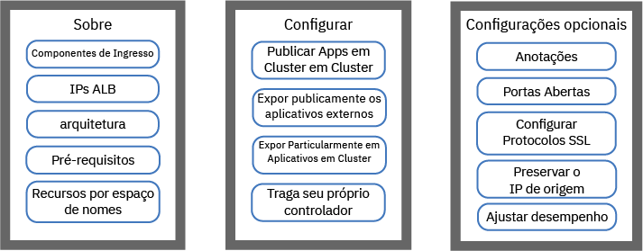
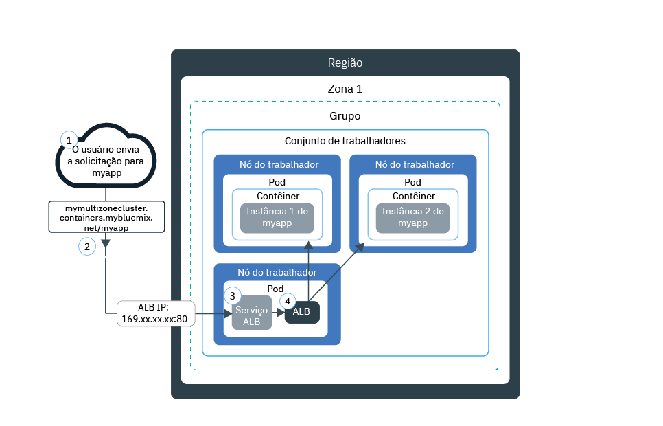
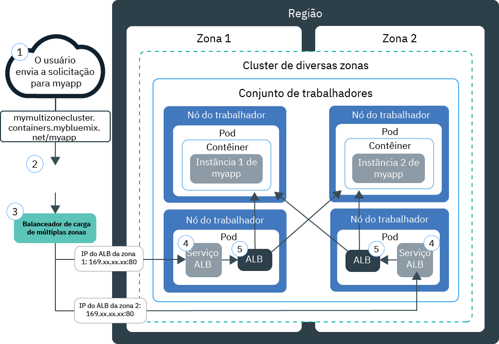
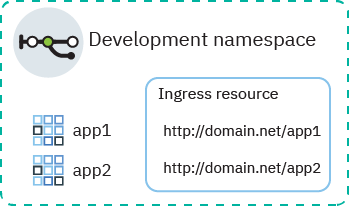
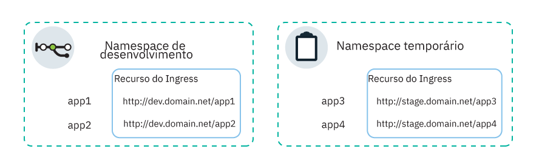
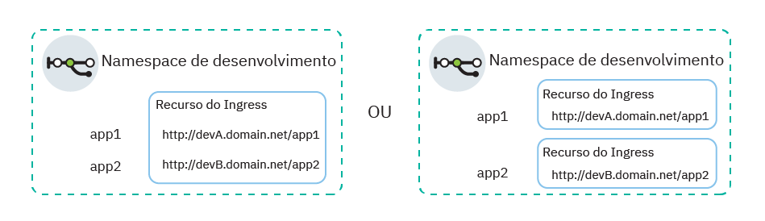

---

copyright:
  years: 2014, 2019
lastupdated: "2019-06-12"

keywords: kubernetes, iks, nginx, ingress controller

subcollection: containers

---

{:new_window: target="_blank"}
{:shortdesc: .shortdesc}
{:screen: .screen}
{:pre: .pre}
{:table: .aria-labeledby="caption"}
{:codeblock: .codeblock}
{:tip: .tip}
{:note: .note}
{:important: .important}
{:deprecated: .deprecated}
{:download: .download}
{:preview: .preview}


# Balanceamento de carga HTTPS com balanceadores de carga do aplicativo (ALB) Ingress
{: #ingress}

Exponha múltiplos apps em seu cluster do Kubernetes criando recursos de Ingresso que são gerenciados pelo balanceador de carga de aplicativo fornecido pela IBM no {{site.data.keyword.containerlong}}.
{:shortdesc}



<map name="image-map">
    <area target="" alt="Componentes do Ingress" title="Componentes do Ingress" href="#ingress_components" coords="28,42,172,69" shape="rect">
    <area target="" alt="IPs do ALB" title="IPs do ALB" href="#ips" coords="27,79,171,104" shape="rect">
    <area target="" alt="Arquitetura" title="Arquitetura" href="#architecture-single" coords="31,114,171,140" shape="rect">
    <area target="" alt="Pré-requisitos" title="Pré-requisitos" href="#config_prereqs" coords="28,151,171,176" shape="rect">
    <area target="" alt="Planejamento de rede para namespaces múltiplos e únicos" title="Planejamento de rede para namespaces múltiplos e únicos" href="#multiple_namespaces" coords="31,191,172,229" shape="rect">
    <area target="" alt="Expondo apps que estão dentro de seu cluster ao público" title="Expondo apps que estão dentro de seu cluster ao público" href="#ingress_expose_public" coords="275,43,418,78" shape="rect">
    <area target="" alt="Expondo publicamente apps que estão fora do seu cluster" title="Expondo publicamente apps que estão fora do seu cluster" href="#external_endpoint" coords="275,94,419,128" shape="rect">
    <area target="" alt="Expondo apps para uma rede privada" title="Expondo apps para uma rede privada" href="#ingress_expose_private" coords="277,141,418,177" shape="rect">
    <area target="" alt="Trazendo seu próprio controlador do Ingress" title="Trazendo seu próprio controlador do Ingress" href="#user_managed" coords="278,192,416,228" shape="rect">
    <area target="" alt="Customizando um recurso do Ingress com anotações" title="Customizando um recurso do Ingress com anotações" href="#annotations" coords="523,44,670,73" shape="rect">
    <area target="" alt="Abrindo as portas no Ingress ALB" title="Abrindo as portas no Ingress ALB" href="#opening_ingress_ports" coords="521,83,669,105" shape="rect">
    <area target="" alt="Configurado protocolos SSL e cifras SSL no nível de HTTP" title="Configurado protocolos SSL e cifras SSL no nível de HTTP" href="#ssl_protocols_ciphers" coords="523,116,669,158" shape="rect">
    <area target="" alt="Preservando o endereço IP de origem" title="Preservando o endereço IP de origem" href="#preserve_source_ip" coords="522,167,671,202" shape="rect">
    <area target="" alt="Ajustando desempenho do ALB" title="Ajustando desempenho do ALB" href="#perf_tuning" coords="524,213,669,237" shape="rect">
</map>

## YAMLs de amostra
{: #sample_ingress}

Use esses arquivos YAML de amostra para começar rapidamente com a especificação do recurso Ingress.
{: shortdesc}

**Recurso do Ingress para expor publicamente um app**</br>

Você já concluiu o seguinte?
- Implementar app
- Criar serviço de app
- Selecione o nome de domínio e o segredo do TLS

É possível usar o YAML de implementação a seguir para criar um recurso Ingress:

```
apiVersion: extensions/v1beta1
kind: Ingress
metadata:
  name: myingressresource
spec:
  tls:
  - hosts:
    - <domain>
    secretName: <tls_secret_name>
  rules:
  - host: <domain>
    http:
      paths:
      - path: /<app1_path>
        backend:
          serviceName: <app1_service>
          servicePort: 80
      - path: /<app2_path>
        backend:
          serviceName: <app2_service>
          servicePort: 80
```
{: codeblock}

</br>

**Recurso do Ingress para expor privadamente um app**</br>

Você já concluiu o seguinte?
- Ativar ALB privado
- Implementar app
- Criar serviço de app
- Registrar nome de domínio customizado e segredo do TLS

É possível usar o YAML de implementação a seguir para criar um recurso Ingress:

```
apiVersion: extensions/v1beta1
kind: Ingress
metadata:
  name: myingressresource
  annotations:
    ingress.bluemix.net/ALB-ID: "<private_ALB_ID_1>;<private_ALB_ID_2>"
spec:
  tls:
  - hosts:
    - <domain>
    secretName: <tls_secret_name>
  rules:
  - host: <domain>
    http:
      paths:
      - path: /<app1_path>
        backend:
          serviceName: <app1_service>
          servicePort: 80
      - path: /<app2_path>
        backend:
          serviceName: <app2_service>
          servicePort: 80
```
{: codeblock}

<br />


## O que é Ingresso?
{: #planning}

Ingress é um serviço do Kubernetes que equilibra cargas de trabalho do tráfego de rede em seu cluster encaminhando solicitações públicas ou privadas para seus apps. É possível usar o Ingress para expor múltiplos serviços de app ao público ou a uma rede privada usando uma rota público ou privada exclusiva.
{:shortdesc}

### O que vem com o Ingresso?
{: #ingress_components}

O Ingresso consiste em três componentes:
<dl>
<dt>Recurso do Ingress</dt>
<dd>Para expor um app usando o Ingresso, deve-se criar um serviço do Kubernetes para seu app e registrar esse serviço com o Ingresso ao definir um recurso Ingresso. O Ingresso é um recurso do Kubernetes que define as regras sobre como rotear as solicitações recebidas para apps. O recurso Ingresso também especifica o caminho para seus serviços de app, que são anexados à rota pública para formar uma URL de app exclusiva, como `mycluster.us-south.containers.appdomain.cloud/myapp1`.<p class="note">A partir de 24 de maio de 2018, o formato de subdomínio Ingress mudou para novos clusters. O nome da região ou zona incluído no novo formato de subdomínio é gerado com base na zona na qual o cluster foi criado. Se você tiver dependências de pipeline em nomes de domínio de app consistentes, será possível usar seu próprio domínio customizado em vez do subdomínio do Ingresso fornecido pela IBM.<ul><li>Todos os clusters criados após 24 de maio de 2018 são designados a um subdomínio no novo formato, <code>&lt;cluster_name&gt;.&lt;region_or_zone&gt;.containers.appdomain.cloud</code>.</li><li>Os clusters de zona única criados antes de 24 de maio de 2018 continuam a usar o subdomínio designado no formato antigo, <code>&lt;cluster_name&gt;.&lt;region&gt;.containers.mybluemix.net</code>.</li><li>Se você mudar um cluster de zona única criado antes de 24 de maio de 2018 para múltiplas zonas [incluindo uma zona no cluster](/docs/containers?topic=containers-add_workers#add_zone) pela primeira vez, o cluster continuará usando o subdomínio designado no formato antigo,
<code>&lt;cluster_name&gt;.&lt;region&gt;.containers.mybluemix.net</code> e também será designado a um subdomínio no novo formato, <code>&lt;cluster_name&gt;.&lt;region_or_zone&gt;.containers.appdomain.cloud</code>. O subdomínio pode ser usado.</li></ul></p>**Clusters de múltiplas zonas**: o recurso Ingresso é global, e é necessário somente um por namespace para um cluster de múltiplas zonas.</dd>
<dt>Balanceador de carga de aplicativo (ALB)</dt>
<dd>O balanceador de carga de aplicativo (ALB) é um balanceador de carga externo que atende as solicitações de serviço HTTP, HTTPS ou TCP recebidas. O ALB então encaminha as solicitações para o pod de app apropriado de acordo com as regras definidas no recurso Ingresso. Quando você cria um cluster padrão, o {{site.data.keyword.containerlong_notm}} cria automaticamente um ALB altamente disponível para seu cluster e designa uma rota pública exclusiva a ele. A rota pública está vinculada a um endereço IP público móvel que é provisionado em sua conta de infraestrutura do IBM Cloud (SoftLayer) durante a criação do cluster. Um ALB privado padrão também é criado automaticamente, mas não é ativado automaticamente.<br></br>**Clusters de múltiplas zonas**: quando você inclui uma zona em seu cluster, uma sub-rede pública móvel é incluída e um novo ALB público é criado e ativado automaticamente na sub-rede nessa zona. Todos os ALBs públicos padrão em seu cluster compartilham uma rota pública, mas têm endereços IP diferentes. Um ALB privado padrão também é criado automaticamente em cada zona, mas não é ativado automaticamente.</dd>
<dt>Balanceador de Carga Multizona (MZLB)</dt>
<dd><p>**Clusters de múltiplas zonas**: sempre que você cria um cluster de múltiplas zonas ou [inclui uma zona em um cluster de zona única](/docs/containers?topic=containers-add_workers#add_zone), um multizone load balancer (MZLB) do Cloudflare é criado e implementado automaticamente para que exista 1 MZLB para cada região. O MZLB coloca os endereços IP de seus ALBs atrás do mesmo subdomínio e ativa as verificações de funcionamento nesses endereços IP para determinar se eles estão disponíveis ou não. Por exemplo, se você tiver nós do trabalhador em 3 zonas na região Leste dos EUA, o subdomínio `yourcluster.us-east.containers.appdomain.cloud` terá 3 endereços IP de ALB. O funcionamento do MZLB verifica o IP do ALB público em cada zona de uma região e mantém os resultados de consulta de DNS atualizados com base nessas verificações de funcionamento. Por exemplo, se seus ALBs tiverem endereços IP `1.1.1.1`, `2.2.2.2` e `3.3.3.3`, uma consulta de DNS de operação normal de seu subdomínio do Ingress retornará todos os 3 IPs, 1 dos quais o cliente acessa aleatoriamente. Se o ALB com endereço IP `3.3.3.3` se tornar indisponível por qualquer motivo, como devido à falha de zona em que a verificação de funcionamento para essa zona falhará, o MZLB removerá o IP com falha do subdomínio e a consulta de DNS retornará somente os IPs do ALB `1.1.1.1` e `2.2.2.2` funcionais. O subdomínio tem um tempo de vida (TTL) de 30 segundos, portanto, após 30 segundos, os novos aplicativos do cliente poderão acessar somente um dos IPs do ALB funcionais e disponíveis.</p><p>Em casos raros, alguns resolvedores de DNS ou aplicativos do cliente podem continuar a usar o IP do ALB não funcional após o TTL de 30 segundos. Esses aplicativos do cliente podem experimentar um tempo de carregamento mais longo até que o aplicativo do cliente abandone o IP `3.3.3.3` e tente se conectar ao `1.1.1.1` ou `2.2.2.2`. Dependendo das configurações do navegador do cliente ou do aplicativo do cliente, o atraso pode variar de alguns segundos a um tempo limite de TCP integral.</p>
<p>A carga do MZLB é balanceada para ALBs públicos que usam somente o subdomínio do Ingresso fornecido pela IBM. Se você usa somente ALBs privados, deve-se verificar manualmente o funcionamento dos ALBs e atualizar os resultados da consulta de DNS. Se você usar ALBs públicos que usam um domínio customizado, será possível incluir os ALBs no balanceamento de carga do MZLB criando um CNAME em sua entrada do DNS para encaminhar as solicitações de seu domínio customizado para o subdomínio do Ingresso fornecido pela IBM para seu cluster.</p>
<p class="note">Se você usar políticas de rede pré-DNAT do Calico para bloquear todo o tráfego de entrada para serviços do Ingress, também deverá desbloquear os <a href="https://www.cloudflare.com/ips/">IPs IPv4 do Cloudflare </a> que são usados para verificar o funcionamento de seus ALBs. Para obter as etapas sobre como criar uma política pré-DNAT do Calico para incluir na lista de desbloqueio esses IPs, consulte a Lição 3 do <a href="/docs/containers?topic=containers-policy_tutorial#lesson3">Tutorial de política de rede do Calico</a>.</p></dd>
</dl>

### Como os IPs são designados aos ALBs do Ingress?
{: #ips}

Ao criar um cluster padrão, o {{site.data.keyword.containerlong_notm}} provisiona automaticamente uma sub-rede pública móvel e uma sub-rede privada móvel. Por padrão, o cluster usa automaticamente:
* 1 endereço IP público móvel da sub-rede pública móvel para o ALB do Ingress público padrão.
* Um endereço IP privado móvel da sub-rede privada móvel para o ALB do Ingress privado padrão.
{: shortdesc}

Se você tiver um cluster de múltiplas zonas, um ALB público padrão e um ALB privado padrão serão criados automaticamente em cada zona. Os endereços IP de seus ALBs públicos padrão estão todos atrás do mesmo subdomínio fornecido pela IBM para seu cluster.

Os endereços IP públicos e privados móveis são IPs flutuantes estáticos e não mudam quando um nó do trabalhador é removido. Se o nó do trabalhador for removido, um daemon `Keepalived` que monitora constantemente o IP reprogramará automaticamente os pods do ALB que estavam nesse trabalhador para outro nó do trabalhador nessa zona. Os pods do ALB reprogramados retêm o mesmo endereço IP estático. Para a duração do cluster, o endereço IP do ALB em cada zona não muda. Se você remover uma zona de um cluster, o endereço IP do ALB para essa zona será removido.

Para ver os IPs designados a seus ALBs, é possível executar o comando a seguir.
```
ibmcloud ks albs --cluster <cluster_name_or_id>
```
{: pre}

Para obter mais informações sobre o que acontece com o ALB IPs no caso de uma falha de zona, consulte a definição para o [componente do balanceador de carga multizone](#ingress_components).


### Como uma solicitação chega ao meu app com o Ingress em um cluster de zona única?
{: #architecture-single}


O diagrama a seguir mostra como o Ingresso direciona a comunicação da Internet para um app em um cluster de zona única:



1. Um usuário envia uma solicitação para seu app acessando a URL do app. Essa URL é a URL pública para o seu app exposto anexada ao caminho de recurso de Ingresso, como `mycluster.us-south.containers.appdomain.cloud/myapp`.

2. Um serviço de sistema DNS resolve o subdomínio na URL para o endereço IP público móvel do balanceador de carga que expõe o ALB em seu cluster.

3. Com base no endereço IP resolvido, o cliente envia a solicitação para o serviço de balanceador de carga que expõe o ALB.

4. O serviço do balanceador de carga roteia a solicitação para o ALB.

5. O ALB verifica se uma regra de roteamento para o caminho `myapp` existe no cluster. Se uma regra de correspondência é localizada, a solicitação é encaminhada de acordo com as regras que você definiu no recurso de Ingresso para o pod no qual o app está implementado. O endereço IP de origem do pacote é mudado para o endereço IP do endereço IP público do nó do trabalhador no qual o pod de app está em execução. Se múltiplas instâncias do app são implementadas no cluster, o ALB balanceia a carga de solicitações entre os pods de app.

### Como uma solicitação chega ao meu app com o Ingress em um cluster de múltiplas zonas?
{: #architecture-multi}

O diagrama a seguir mostra como o Ingresso direciona a comunicação da Internet para um app em um cluster de múltiplas zonas:



1. Um usuário envia uma solicitação para seu app acessando a URL do app. Essa URL é a URL pública para o seu app exposto anexada ao caminho de recurso de Ingresso, como `mycluster.us-south.containers.appdomain.cloud/myapp`.

2. Um serviço do sistema DNS, que age como o balanceador de carga global, resolve o subdomínio na URL para um endereço IP disponível que foi relatado como funcional pelo MZLB. O MZLB verifica continuamente os endereços IP públicos móveis dos serviços de balanceador de carga que expõem ALBs públicos em cada zona em seu cluster. Os endereços IP são resolvidos em um ciclo round-robin, assegurando que as solicitações tenham igualmente a carga balanceada entre os ALBs funcionais em várias zonas.

3. O cliente envia a solicitação para o endereço IP do serviço de balanceador de carga que expõe um ALB.

4. O serviço do balanceador de carga roteia a solicitação para o ALB.

5. O ALB verifica se uma regra de roteamento para o caminho `myapp` existe no cluster. Se uma regra de correspondência é localizada, a solicitação é encaminhada de acordo com as regras que você definiu no recurso de Ingresso para o pod no qual o app está implementado. O endereço IP de origem do pacote é mudado para o endereço IP público do nó do trabalhador no qual o pod de app está em execução. Se múltiplas instâncias de app são implementadas no cluster, a carga do ALB balanceia as solicitações entre os pods de app em todas as zonas.

<br />


## Pré-requisitos
{: #config_prereqs}

Antes de começar com o Ingresso, revise os pré-requisitos a seguir.
{:shortdesc}

**Pré-requisitos para todas as configurações de Ingresso:**
- O Ingresso está disponível somente para clusters padrão e requer pelo menos dois nós do trabalhador por zona para assegurar alta disponibilidade e que as atualizações periódicas sejam aplicadas. Se você tiver apenas um trabalhador em uma zona, o ALB não poderá receber atualizações automáticas. Quando as atualizações automáticas são apresentadas aos pods do ALB, o pod é recarregado. No entanto, os pods do ALB possuem regras de antiafinidade para assegurar que apenas um pod seja planejado para cada nó do trabalhador para alta disponibilidade. Como há apenas um pod do ALB em um trabalhador, o pod não é reiniciado para que o tráfego não seja interrompido. O pod do ALB somente será atualizado para a versão mais recente quando você excluir o pod antigo manualmente para que o novo e atualizado possa ser planejado.
- A configuração de Ingress requer as [funções do {{site.data.keyword.Bluemix_notm}} IAM](/docs/containers?topic=containers-users#platform) a seguir:
    - Função de plataforma ** Administrador **  para o cluster
    - Função de serviço ** Manager **  em todos os namespaces

**Pré-requisitos para usar o Ingresso em clusters de múltiplas zonas**:
 - Se você restringir o tráfego de rede para os [ nós do trabalhador de borda](/docs/containers?topic=containers-edge), pelo menos 2 nós do trabalhador de borda deverão ser ativados em cada zona para alta disponibilidade de pods do Ingress. [Crie um conjunto de trabalhadores de nó de borda](/docs/containers?topic=containers-add_workers#add_pool) que abranja todas as zonas em seu cluster e tenha pelo menos 2 nós do trabalhador por zona.
 - Se você tem múltiplas VLANs para um cluster, múltiplas sub-redes na mesma VLAN ou um cluster de múltiplas zonas, deve-se ativar um [Virtual Router Function (VRF)](/docs/infrastructure/direct-link?topic=direct-link-overview-of-virtual-routing-and-forwarding-vrf-on-ibm-cloud#overview-of-virtual-routing-and-forwarding-vrf-on-ibm-cloud) para sua conta de infraestrutura do IBM Cloud (SoftLayer) para que seus nós do trabalhador possam se comunicar entre si na rede privada. Para ativar o VRF, [entre em contato com o representante de conta da infraestrutura do IBM Cloud (SoftLayer)](/docs/infrastructure/direct-link?topic=direct-link-overview-of-virtual-routing-and-forwarding-vrf-on-ibm-cloud#how-you-can-initiate-the-conversion). Se não for possível ou você não desejar ativar o VRF, ative o [VLAN Spanning](/docs/infrastructure/vlans?topic=vlans-vlan-spanning#vlan-spanning). Para executar essa ação, você precisa da [permissão de infraestrutura](/docs/containers?topic=containers-users#infra_access) **Rede > Gerenciar a rede VLAN Spanning** ou é possível solicitar ao proprietário da conta para ativá-la. Para verificar se o VLAN Spanning já está ativado, use o [comando](/docs/containers?topic=containers-cli-plugin-kubernetes-service-cli#cs_vlan_spanning_get) `ibmcloud ks vlan-spanning-get --region<region>`.
 - Se uma zona falhar, você poderá ver falhas intermitentes em solicitações para o ALB do Ingress nessa zona.

<br />


## Planejando a rede para um único ou múltiplos namespaces
{: #multiple_namespaces}

Um recurso Ingress é necessário por namespace no qual você tem apps que deseja expor.
{:shortdesc}

### Todos os apps estão em um namespace
{: #one-ns}

Se os apps em seu cluster estão todos no mesmo namespace, um recurso Ingress é necessário para definir as regras de roteamento para os apps que são expostos lá. Por exemplo, se você tem o `app1` e o `app2` expostos por serviços em um espaço de desenvolvimento, é possível criar um recurso de Ingresso no namespace. O recurso especifica `domain.net` como o host e registra os caminhos em que cada app atende com `domain.net`.
{: shortdesc}



### Os apps estão em múltiplos namespaces
{: #multi-ns}

Se os apps em seu cluster estão em namespaces diferentes, deve-se criar um recurso por namespace para definir regras para os apps que são expostos lá.
{: shortdesc}

No entanto, é possível definir um nome do host em apenas um recurso. Não é possível definir o mesmo nome do host em múltiplos recursos. Para registrar múltiplos recursos do Ingress com o mesmo nome do host, deve-se usar um domínio curinga. Quando um domínio curinga, como `*.domain.net`, é registrado, vários subdomínios podem ser todos resolvidos para o mesmo host. Em seguida, é possível criar um recurso de Ingresso em cada namespace e especificar um subdomínio diferente em cada recurso de Ingresso.

Por exemplo, considere o seguinte cenário:
* Você tem duas versões do mesmo app, `app1` e `app3`, para propósitos de teste.
* Você implementa os apps em dois namespaces diferentes dentro do mesmo cluster: `app1` no namespace de desenvolvimento e `app3` no namespace temporário.

Para usar o mesmo ALB do cluster para gerenciar o tráfego para esses apps, você cria os serviços e recursos a seguir:
* Um serviço do Kubernetes no namespace de desenvolvimento para expor `app1`.
* Um recurso Ingresso no namespace de desenvolvimento que especifica o host como `dev.domain.net`.
* Um serviço do Kubernetes no namespace temporário para expor `app3`.
* Um recurso Ingresso no namespace de preparação que especifica o host como `stage.domain.net`.
</br>



Agora, ambas as URLs são resolvidas para o mesmo domínio e são, portanto, ambas atendidas pelo mesmo ALB. No entanto, como o recurso no namespace de preparação é registrado com o subdomínio `stage`, o ALB do Ingress roteia corretamente as solicitações da URL `stage.domain.net/app3` para somente `app3`.

{: #wildcard_tls}
O IBM fornecido pelo subdomínio de Ingresso curinga, `*.<cluster_name>.<region>.containers.appdomain.cloud`, é registrado por padrão para seu cluster. O certificado TLS fornecido pela IBM é um certificado curinga e pode ser usado para o subdomínio curinga. Se deseja usar um domínio customizado, deve-se registrá-lo como um domínio curinga, como `*.custom_domain.net`. Para usar o TLS, deve-se obter um certificado curinga.
{: note}

### Vários domínios dentro de um namespace
{: #multi-domains}

Em um namespace individual, é possível usar um domínio para acessar todos os apps no namespace. Se você deseja usar domínios diferentes para os apps dentro de um namespace individual, use um domínio curinga. Quando um domínio curinga como `*.mycluster.us-south.containers.appdomain.cloud` for registrado, múltiplos subdomínios serão todos resolvidos no mesmo host. Em seguida, é possível usar um recurso para especificar múltiplos hosts de subdomínio dentro desse recurso. Como alternativa, é possível criar múltiplos recursos de Ingresso no namespace e especificar um subdomínio diferente em cada recurso de Ingresso.
{: shortdesc}



O IBM fornecido pelo subdomínio de Ingresso curinga, `*.<cluster_name>.<region>.containers.appdomain.cloud`, é registrado por padrão para seu cluster. O certificado TLS fornecido pela IBM é um certificado curinga e pode ser usado para o subdomínio curinga. Se deseja usar um domínio customizado, deve-se registrá-lo como um domínio curinga, como `*.custom_domain.net`. Para usar o TLS, deve-se obter um certificado curinga.
{: note}

<br />


## Expondo apps que estão dentro de seu cluster para o público
{: #ingress_expose_public}

Exponha apps que estão dentro de seu cluster para o público usando o ALB de Ingresso público.
{:shortdesc}

Antes de iniciar:

* Revise o Ingresso [pré-requisitos](#config_prereqs).
* [Efetue login em sua conta. Se aplicável, direcione o grupo de recursos apropriado. Configure o contexto para o seu cluster.](/docs/containers?topic=containers-cs_cli_install#cs_cli_configure)

### Etapa 1: Implementar apps e criar serviços de app
{: #public_inside_1}

Inicie implementando seus apps e criando serviços do Kubernetes para expô-los.
{: shortdesc}

1.  [Implemente o seu app no cluster](/docs/containers?topic=containers-app#app_cli). Assegure-se de incluir um rótulo em sua implementação na seção de metadados de seu arquivo de configuração, como `app: code`. Esse rótulo é necessário para identificar todos os pods nos quais o seu app está em execução para que os pods possam ser incluídos no balanceamento de carga do Ingress.

2.   Crie um serviço do Kubernetes para cada app que se deseja expor. O seu app deve ser exposto por um serviço do Kubernetes a ser incluído pelo ALB de cluster no balanceamento de carga do Ingress.
      1.  Abra o seu editor preferencial e crie um arquivo de configuração de serviço que seja denominado, por exemplo, `myappservice.yaml`.
      2.  Defina um serviço para o app que o ALB exporá.

          ```
          apiVersion: v1 kind: Service metadata: name: myappservice spec: selector: <selector_key>: <selector_value> ports:
             - protocol: TCP port: 8080
          ```
          {: codeblock}

          <table>
          <thead>
          <th colspan=2> Entendendo os componentes do arquivo YAML do serviço ALB</th>
          </thead>
          <tbody>
          <tr>
          <td><code>seletor</code></td>
          <td>Insira a chave de etiqueta (<em>&lt;selector_key&gt;</em>) e o par de valores (<em>&lt;selector_value&gt;</em>) que você deseja usar para destinar os pods nos quais o seu app é executado. Para destinar seus pods e incluí-los no balanceamento de carga de serviço, assegure-se de que o <em>&lt;selector_key&gt;</em> e o <em>&lt;selector_value&gt;</em> sejam os mesmos que o par chave/valor na seção <code>spec.template.metadata.labels</code> de seu YAML de implementação.</td>
           </tr>
           <tr>
           <td><code>port</code></td>
           <td>A porta na qual o serviço atende.</td>
           </tr>
           </tbody></table>
      3.  Salve as suas mudanças.
      4.  Crie o serviço em seu cluster. Se os apps forem implementados em múltiplos namespaces no cluster, assegure-se de que o serviço seja implementado no mesmo namespace que o app que se deseja expor.

          ```
          kubectl apply -f myappservice.yaml [-n <namespace>]
          ```
          {: pre}
      5.  Repita essas etapas para cada app que desejar expor.


### Etapa 2: Selecionar um domínio de app
{: #public_inside_2}

Ao configurar o ALB público, você escolhe o domínio por meio do qual seus apps serão acessíveis.
{: shortdesc}

É possível usar o domínio fornecido pela IBM, como `mycluster-12345.us-south.containers.appdomain.cloud/myapp`, para acessar seu app na Internet. Para usar um domínio customizado em vez disso, é possível configurar um registro CNAME para mapear o seu domínio customizado para o domínio fornecido pela IBM ou configurar um registro A com o seu provedor do DNS usando o endereço IP público do ALB.

** Para usar o domínio do Ingress fornecido pela IBM: **

Obtenha o domínio fornecido pela IBM. Substitua `<cluster_name_or_ID>` pelo nome do cluster no qual o aplicativo está implementado.
```
ibmcloud ks cluster-get --cluster <cluster_name_or_ID> | grep Ingress
```
{: pre}

Saída de exemplo:
```
Ingress Subdomain:      mycluster-12345.us-south.containers.appdomain.cloud
Ingress Secret:         <tls_secret>
```
{: screen}

** Para usar um domínio customizado: **
1.    Crie um domínio customizado. Para registrar seu domínio customizado, trabalhe com seu provedor Domain Name Service (DNS) ou com o [DNS do {{site.data.keyword.Bluemix_notm}}](/docs/infrastructure/dns?topic=dns-getting-started).
      * Se os apps que você deseja que o Ingress exponha estiverem em namespaces diferentes em um cluster, registre o domínio customizado como um domínio curinga, como `*.custom_domain.net`.

2.  Configure seu domínio para rotear o tráfego de rede recebido para o ALB fornecido pela IBM. Escolha entre estas opções:
    -   Defina um alias para seu domínio customizado especificando o domínio fornecido pela IBM como um registro de Nome Canônico (CNAME). Para localizar o domínio do Ingress fornecido pela IBM, execute `ibmcloud ks cluster-get --cluster <cluster_name>` e procure o campo **Subdomínio do Ingress**. O uso de um CNAME é preferencial porque a IBM fornece verificações de funcionamento automáticas no subdomínio IBM e remove os IPs com falha da resposta de DNS.
    -   Mapeie o seu domínio customizado para o endereço IP público móvel do ALB fornecido pela IBM incluindo o endereço IP como um registro. Para localizar o endereço IP público móvel do ALB, execute `ibmcloud ks alb-get --albID  <public_alb_ID>`.

### Etapa 3: Selecionar finalização de TLS
{: #public_inside_3}

Depois de escolher o domínio do app, você escolhe se deseja usar a finalização do TLS.
{: shortdesc}

O ALB faz o balanceamento de carga do tráfego de rede HTTP para os apps no cluster. Para também balancear a carga de conexões HTTPS recebidas, será possível configurar o ALB para decriptografar o tráfego de rede e encaminhar a solicitação decriptografada para os apps expostos no cluster.

* Se você usar o subdomínio do Ingress fornecido pela IBM, será possível usar o certificado do TLS fornecido pela IBM. Os certificados do TLS fornecidos pela IBM são assinados por LetsEncrypt e são totalmente gerenciados pela IBM. Os certificados expiram a cada 90 dias e são renovados automaticamente 37 dias antes de expirarem. Para obter informações sobre a certificação do TLS curinga, consulte [esta nota](#wildcard_tls).
* Se você usar um domínio customizado, será possível usar o seu próprio certificado do TLS para gerenciar a rescisão do TLS. O ALB primeiro verifica se há um segredo no namespace no qual o app está, em seguida, em `default` e, finalmente, em `ibm-cert-store`. Se você tiver apps apenas em um namespace, será possível importar ou criar um segredo do TLS para o certificado nesse mesmo namespace. Se você tiver apps em vários namespaces, importe ou crie um segredo do TLS para o certificado no namespace `default` para que o ALB possa acessar e usar o certificado em cada namespace. Nos recursos Ingress que você define para cada namespace, especifique o nome do segredo que está no namespace padrão. Para obter informações sobre a certificação do TLS curinga, consulte [esta nota](#wildcard_tls). **Nota**: os certificados TLS que contêm chaves pré-compartilhadas (TLS-PSK) não são suportados.

**Se você usar o domínio do Ingress fornecido pela IBM:**

Obtenha o segredo do TLS fornecido pela IBM para seu cluster.
```
ibmcloud ks cluster-get --cluster <cluster_name_or_ID> | grep Ingress
```
{: pre}

Saída de exemplo:
```
Ingress Subdomain:      mycluster-12345.us-south.containers.appdomain.cloud
Ingress Secret:         <tls_secret>
```
{: screen}
</br>

** Se você usar um domínio customizado: **

Se um certificado TLS é armazenado no {{site.data.keyword.cloudcerts_long_notm}} que você deseja usar, é possível importar seu segredo associado para o cluster executando o comando a seguir:

```
ibmcloud ks alb-cert-deploy --secret-name <secret_name> --cluster <cluster_name_or_ID> --cert-crn <certificate_crn>
```
{: pre}

Certifique-se de que você não crie o segredo com o mesmo nome que o segredo de Ingress fornecido pela IBM. É possível obter o nome do segredo do Ingress fornecido pela IBM executando `ibmcloud ks cluster-get --cluster <cluster_name_or_ID> | grep Ingress`.
{: note}

Quando você importa um certificado com esse comando, o segredo do certificado é criado em um namespace chamado `ibm-cert-store`. Uma referência a esse segredo é, então, criada no namespace `default`, que qualquer recurso Ingress em qualquer namespace pode acessar. Quando o ALB está processando solicitações, ele segue essa referência para selecionar e usar o segredo do certificado por meio do namespace `ibm-cert-store`.

</br>

Se você não tiver um certificado TLS pronto, siga estas etapas:
1. Gere um certificado de autoridade de certificação (CA) e a chave por meio do provedor de certificado. Se você tiver seu próprio domínio, compre um certificado TLS oficial para seu domínio. Certifique-se de que o [CN ](https://support.dnsimple.com/articles/what-is-common-name/) seja diferente para cada certificado.
2. Converta o certificado e a chave na base 64.
   1. Codifique o certificado e a chave na base 64 e salve o valor codificado na base 64 em um novo arquivo.
      ```
      openssl base64 -in tls.key -out tls.key.base64
      ```
      {: pre}

   2. Visualize o valor codificado com base 64 para seu certificado e chave.
      ```
      cat tls.key.base64
      ```
      {: pre}

3. Crie um arquivo YAML secreto usando o certificado e a chave.
     ```
     apiVersion: v1
     kind: Secret
     metadata:
       name: ssl-my-test
     type: Opaque
     data:
       tls.crt: <client_certificate>
       tls.key: <client_key>
     ```
     {: codeblock}

4. Crie o certificado como um segredo do Kubernetes.
     ```
     kubectl create -f ssl-my-test
     ```
     {: pre}
     Certifique-se de que você não crie o segredo com o mesmo nome que o segredo de Ingress fornecido pela IBM. É possível obter o nome do segredo do Ingress fornecido pela IBM executando `ibmcloud ks cluster-get --cluster <cluster_name_or_ID> | grep Ingress`.
     {: note}


### Etapa 4: Criar o Recurso do Ingresso
{: #public_inside_4}

Os recursos do Ingress definem as regras de roteamento que o ALB usa para rotear tráfego para seu serviço de app.
{: shortdesc}

Se o seu cluster tiver múltiplos namespaces em que os apps são expostos, um recurso do Ingress será necessário por namespace. No entanto, cada namespace deve usar um host diferente. Deve-se registrar um domínio curinga e especificar um subdomínio diferente em cada recurso. Para obter mais informações, veja [Planejando a rede para namespaces únicos ou múltiplos](#multiple_namespaces).
{: note}

1. Abra o seu editor preferencial e crie um arquivo de configuração do Ingress que seja denominado, por exemplo, `myingressresource.yaml`.

2. Defina um recurso do Ingress em seu arquivo de configuração que use o domínio fornecido pela IBM ou seu domínio customizado para rotear o tráfego de rede recebido para os serviços criados anteriormente.

    YAML de exemplo que não usa TLS:
    ```
    apiVersion: extensions/v1beta1
    kind: Ingress
    metadata:
      name: myingressresource
    spec:
      rules:
      - host: <domain> http: paths:
          - path: /<app1_path> backend: serviceName: <app1_service> servicePort: 80
          - path: /<app2_path> backend: serviceName: <app2_service> servicePort: 80
    ```
    {: codeblock}

    Exemplo YAML que usa TLS:
    ```
    apiVersion: extensions/v1beta1
    kind: Ingress
    metadata:
      name: myingressresource
    spec:
      tls:
      - System z:
        - <domain> secretName: <tls_secret_name> rules:
      - host: <domain> http: paths:
          - path: /<app1_path> backend: serviceName: <app1_service> servicePort: 80
          - path: /<app2_path> backend: serviceName: <app2_service> servicePort: 80
    ```
    {: codeblock}

    <table>
    <thead>
    <th colspan=2> entendendo os componentes de arquivo do YAML</th>
    </thead>
    <tbody>
    <tr>
    <td><code> tls.hosts </code></td>
    <td>Para usar o TLS, substitua <em>&lt;domain&gt;</em> pelo subdomínio do Ingress fornecido pela IBM ou seu domínio customizado.

    </br></br>
    <strong>Nota:</strong><ul><li>Se os seus apps forem expostos por serviços em namespaces diferentes em um cluster, anexe um subdomínio curinga ao início do domínio, como `subdomain1.custom_domain.net` ou `subdomain1.mycluster.us-south.containers.appdomain.cloud`. Use um subdomínio exclusivo para cada recurso criado no cluster.</li><li>Não usar &ast; para o host ou deixar a propriedade do host vazia para evitar falhas durante a criação do Ingress.</li></ul></td>
    </tr>
    <tr>
    <td><code> tls.secretName </code></td>
    <td><ul><li>Se você usar o domínio do Ingress fornecido pela IBM, substitua <em>&lt;tls_secret_name&gt;</em> pelo nome do segredo do Ingress fornecido pela IBM.</li><li>Se você usar um domínio customizado, substitua <em>&lt;tls_secret_name&gt;</em> pelo segredo que você criou anteriormente, que contém o seu certificado e chave do TLS customizados. Se você importou um certificado do {{site.data.keyword.cloudcerts_short}}, será possível executar <code>ibmcloud ks alb-cert-get --cluster <cluster_name_or_ID> --cert-crn <certificate_crn></code> para ver os segredos que estiverem associados a um certificado do TLS.</li><ul><td>
    </tr>
    <tr>
    <td><code>host</code></td>
    <td>Substitua <em>&lt;domain&gt;</em> pelo subdomínio do Ingress fornecido pela IBM ou por seu domínio customizado.

    </br></br>
    <strong>Nota:</strong><ul><li>Se os seus apps forem expostos por serviços em namespaces diferentes em um cluster, anexe um subdomínio curinga ao início do domínio, como `subdomain1.custom_domain.net` ou `subdomain1.mycluster.us-south.containers.appdomain.cloud`. Use um subdomínio exclusivo para cada recurso criado no cluster.</li><li>Não usar &ast; para o host ou deixar a propriedade do host vazia para evitar falhas durante a criação do Ingress.</li></ul></td>
    </tr>
    <tr>
    <td><code>path</code></td>
    <td>Substitua <em>&lt;app_path&gt;</em> por uma barra ou pelo caminho em que seu app está atendendo. O caminho é anexado ao domínio fornecido pela IBM ou ao seu domínio customizado para criar uma rota exclusiva para o app. Quando você insere essa rota em um navegador da web, o tráfego de rede é roteado para o ALB. O ALB consulta o serviço associado e envia o tráfego de rede para o serviço. Em seguida, o serviço encaminha o tráfego aos pods nos quais o aplicativo está sendo executado.
    </br></br>
    Muitos apps não atendem em um caminho específico, mas usam o caminho raiz e uma porta específica. Nesse caso, defina o caminho raiz como <code>/</code> e não especifique um caminho individual para seu app. Exemplos: <ul><li>Para <code>http://domain/</code>, insira <code>/</code> como o caminho.</li><li>Para <code>http://domain/app1_path</code>, insira <code>/app1_path</code> como o caminho.</li></ul>
    </br>
    <strong>Dica:</strong> para configurar o Ingress para atender em um caminho diferente do caminho no qual seu app atende, será possível usar [gravar novamente a anotação](/docs/containers?topic=containers-ingress_annotation#rewrite-path).</td>
    </tr>
    <tr>
    <td><code>serviceName</code></td>
    <td>Substitua <em>&lt;app1_service&gt;</em> e <em>&lt;app2_service&gt;</em> e assim por diante, pelo nome dos serviços criados para expor seus apps. Se os seus apps forem expostos por serviços em namespaces diferentes no cluster, inclua apenas serviços de app que estejam no mesmo namespace. Deve-se criar um recurso do Ingress para cada namespace que contenha apps que se deseja expor.</td>
    </tr>
    <tr>
    <td><code>servicePort</code></td>
    <td>A porta na qual o serviço atende. Use a mesma porta que você definiu quando criou o serviço do Kubernetes para seu app.</td>
    </tr>
    </tbody></table>

3.  Crie o recurso de Ingresso para seu cluster. Assegure-se de que o recurso seja implementado no mesmo namespace que os serviços de app especificados no recurso.

    ```
    kubectl apply -f myingressresource.yaml -n <namespace>
    ```
    {: pre}
4.   Verifique se o recurso de Ingresso foi criado com êxito.

      ```
      kubectl describe ingress myingressresource
      ```
      {: pre}

      1. Se as mensagens nos eventos descreverem um erro na configuração do recurso, mude os valores no arquivo de recursos e reaplique o arquivo para o recurso.


O recurso do Ingress é criado no mesmo namespace que os serviços de app. Seus apps nesse namespace são registrados com o ALB do Ingress do cluster.

### Etapa 5: acessar seu app por meio da Internet
{: #public_inside_5}

Em um navegador da web, insira a URL do serviço de app a ser acessado.
{: shortdesc}

```
https://<domain>/<app1_path>
```
{: codeblock}

Se tiver exposto múltiplos apps, acesse-os mudando o caminho anexado à URL.

```
https://<domain>/<app2_path>
```
{: codeblock}

Se você usar um domínio curinga para expor apps em namespaces diferentes, acesse esses apps com seus próprios subdomínios.

```
http://<subdomain1>.<domain>/<app1_path>
```
{: codeblock}

```
http://<subdomain2>.<domain>/<app1_path>
```
{: codeblock}


Tendo problemas de conexão com seu app por meio do Ingress? Tente  [ Depurging Ingress ](/docs/containers?topic=containers-cs_troubleshoot_debug_ingress).
{: tip}

<br />


## Expondo apps que estão fora de seu cluster para o público
{: #external_endpoint}

Expor apps que estão fora de seu cluster para o público, incluindo-os no balanceamento de carga do ALB de Ingresso público. As solicitações públicas recebidas no domínio customizado ou fornecido pela IBM são encaminhadas automaticamente para o app externo.
{: shortdesc}

Antes de iniciar:

* Revise o Ingresso [pré-requisitos](#config_prereqs).
* Assegure-se de que o app externo que você deseja incluir no balanceamento de carga do cluster possa ser acessado usando um endereço IP público.
* [Efetue login em sua conta. Se aplicável, direcione o grupo de recursos apropriado. Configure o contexto para o seu cluster.](/docs/containers?topic=containers-cs_cli_install#cs_cli_configure)

Para expor os apps que estão fora de seu cluster para o público:

1.  Crie um serviço do Kubernetes para o seu cluster que encaminhará as solicitações recebidas para um terminal externo que você criará.
    1.  Abra seu editor preferencial e crie um arquivo de configuração de serviço que seja chamado, por exemplo, de `myexternalservice.yaml`.
    2.  Defina um serviço para o app que o ALB exporá.

        ```
        apiVersion: v1
        kind: Service
        metadata:
          name: myexternalservice
        spec:
          ports:
           - protocol: TCP port: 8080
        ```
        {: codeblock}

        <table>
        <caption>Entendendo os componentes de arquivo de serviço do ALB</caption>
        <thead>
        <th colspan=2> entendendo os componentes de arquivo do YAML</th>
        </thead>
        <tbody>
        <tr>
        <td><code>metadata.name</code></td>
        <td>Substitua <em><code>&lt;myexternalservice&gt;</code></em> por um nome de seu serviço.<p>Saiba mais sobre [como proteger suas informações pessoais](/docs/containers?topic=containers-security#pi) quando trabalhar com recursos do Kubernetes.</p></td>
        </tr>
        <tr>
        <td><code>port</code></td>
        <td>A porta na qual o serviço atende.</td>
        </tr></tbody></table>

    3.  Salve as suas mudanças.
    4.  Crie o serviço do Kubernetes para seu cluster.

        ```
        kubectl apply -f myexternalservice.yaml
        ```
        {: pre}
2.  Configure um terminal do Kubernetes que defina o local externo do app que você deseja incluir no balanceamento de carga do cluster.
    1.  Abra seu editor preferencial e crie um arquivo de configuração do terminal que é chamado, por exemplo, de `myexternalendpoint.yaml`.
    2.  Defina seu terminal externo. Inclua todos os endereços IP públicos e portas que podem ser usados para acessar seu app externo.

        ```
        kind: Endpoints
        apiVersion: v1
        metadata:
          name: myexternalendpoint
        subsets:
          - addresses:
              - ip: <external_IP1>
              - ip: <external_IP2>
            ports:
              - port: <external_port>
        ```
        {: codeblock}

        <table>
        <thead>
        <th colspan=2> entendendo os componentes de arquivo do YAML</th>
        </thead>
        <tbody>
        <tr>
        <td><code>name</code></td>
        <td>Substitua <em><code>&lt;myexternalendpoint&gt;</code></em> pelo nome do serviço do Kubernetes que você criou anteriormente.</td>
        </tr>
        <tr>
        <td><code>IP</code></td>
        <td>Substitua <em>&lt;external_IP&gt;</em> pelos endereços IP públicos para se conectar ao app externo.</td>
         </tr>
         <td><code>port</code></td>
         <td>Substitua <em>&lt;external_port&gt;</em> pela porta em que seu app externo atende.</td>
         </tbody></table>

    3.  Salve as suas mudanças.
    4.  Crie o terminal do Kubernetes para seu cluster.

        ```
        kubectl apply -f myexternalendpoint.yaml
        ```
        {: pre}

3. Continue com as etapas em "Expondo apps que estão dentro de seu cluster para o público", [Etapa 2: selecionar um domínio de app](#public_inside_2).

<br />


## Expondo apps para uma rede privada
{: #ingress_expose_private}

Exponha apps para uma rede privada usando o ALB de Ingresso privado.
{:shortdesc}

Para usar um ALB privado, deve-se primeiro ativar o ALB privado. Como os clusters somente de VLAN privada não são designados a um subdomínio do Ingress fornecido pela IBM, nenhum segredo do Ingress é criado durante a configuração do cluster. Para expor seus apps à rede privada, deve-se registrar seu ALB com um domínio customizado e, opcionalmente, importar seu próprio certificado TLS.

Antes de iniciar:
* Revise o Ingresso [pré-requisitos](#config_prereqs).
* Revise as opções para planejar o acesso privado aos apps quando os nós do trabalhador forem conectados a [uma VLAN pública e uma privada](/docs/containers?topic=containers-cs_network_planning#private_both_vlans) ou a [somente a uma VLAN privada](/docs/containers?topic=containers-cs_network_planning#plan_private_vlan).
    * Se os seus nós do trabalhador estão conectados somente a uma VLAN privada, deve-se configurar um [serviço do DNS do que esteja disponível na rede privada ](https://kubernetes.io/docs/tasks/administer-cluster/dns-custom-nameservers/).

### Etapa 1: Implementar apps e criar serviços de app
{: #private_1}

Inicie implementando seus apps e criando serviços do Kubernetes para expô-los.
{: shortdesc}

1.  [Implemente o seu app no cluster](/docs/containers?topic=containers-app#app_cli). Assegure-se de incluir um rótulo em sua implementação na seção de metadados de seu arquivo de configuração, como `app: code`. Esse rótulo é necessário para identificar todos os pods nos quais o seu app está em execução para que os pods possam ser incluídos no balanceamento de carga do Ingress.

2.   Crie um serviço do Kubernetes para cada app que se deseja expor. O seu app deve ser exposto por um serviço do Kubernetes a ser incluído pelo ALB de cluster no balanceamento de carga do Ingress.
      1.  Abra o seu editor preferencial e crie um arquivo de configuração de serviço que seja denominado, por exemplo, `myappservice.yaml`.
      2.  Defina um serviço para o app que o ALB exporá.

          ```
          apiVersion: v1 kind: Service metadata: name: myappservice spec: selector: <selector_key>: <selector_value> ports:
             - protocol: TCP port: 8080
          ```
          {: codeblock}

          <table>
          <thead>
          <th colspan=2> Entendendo os componentes do arquivo YAML do serviço ALB</th>
          </thead>
          <tbody>
          <tr>
          <td><code>seletor</code></td>
          <td>Insira a chave de etiqueta (<em>&lt;selector_key&gt;</em>) e o par de valores (<em>&lt;selector_value&gt;</em>) que você deseja usar para destinar os pods nos quais o seu app é executado. Para destinar seus pods e incluí-los no balanceamento de carga de serviço, assegure-se de que o <em>&lt;selector_key&gt;</em> e o <em>&lt;selector_value&gt;</em> sejam os mesmos que o par chave/valor na seção <code>spec.template.metadata.labels</code> de seu YAML de implementação.</td>
           </tr>
           <tr>
           <td><code>port</code></td>
           <td>A porta na qual o serviço atende.</td>
           </tr>
           </tbody></table>
      3.  Salve as suas mudanças.
      4.  Crie o serviço em seu cluster. Se os apps forem implementados em múltiplos namespaces no cluster, assegure-se de que o serviço seja implementado no mesmo namespace que o app que se deseja expor.

          ```
          kubectl apply -f myappservice.yaml [-n <namespace>]
          ```
          {: pre}
      5.  Repita essas etapas para cada app que desejar expor.


### Etapa 2: ativar o ALB privado padrão
{: #private_ingress}

Ao criar um cluster padrão, um balanceador de carga do aplicativo (ALB) privado fornecido pela IBM é criado em cada zona que você tem nós do trabalhador e designado a um endereço IP privado móvel e uma rota privada. No entanto, o ALB privado padrão em cada zona não é ativado automaticamente. Para usar o ALB privado padrão para balancear a carga do tráfego de rede privada para seus apps, deve-se primeiro ativá-lo com o endereço IP privado móvel fornecido pela IBM ou seu próprio endereço IP privado móvel.
{:shortdesc}

Se você usou a sinalização `--no-subnet` quando criou o cluster, deverá incluir uma sub-rede privada móvel ou uma sub-rede gerenciada pelo usuário antes de ser possível ativar o ALB privado. Para obter mais informações, veja [Solicitando sub-redes adicionais para seu cluster](/docs/containers?topic=containers-subnets#request).
{: note}

**Para ativar um ALB privado padrão usando o endereço IP privado móvel fornecido pela IBM pré-designado:**

1. Obtenha o ID do ALB privado padrão que você deseja ativar. Substitua <em>&lt;cluster_name&gt;</em> pelo nome do cluster no qual o app que você deseja expor está implementado.

    ```
    ibmcloud ks albs --cluster <cluster_name>
    ```
    {: pre}

    O campo **Status** para os ALBs privados é _disabled_.
    ```
    ALB ID Enabled Status Type ALB IP Zone Build ALB VLAN ID private-crdf253b6025d64944ab99ed63bb4567b6-alb1 false disabled private - dal10 ingress:411/ingress-auth:315 2234947 public-crdf253b6025d64944ab99ed63bb4567b6-alb1 true enabled public 169.xx.xxx.xxx dal10 ingress:411/ingress-auth:315 2234945
    ```
    {: screen}
    Em clusters de múltiplas zonas, o sufixo numerado no ID de ALB indica a ordem em que o ALB foi incluído.
    * Por exemplo, o sufixo `-alb1` no ALB `private-cr6d779503319d419aa3b4ab171d12c3b8-alb1` indica que ele foi o primeiro ALB privado padrão criado. Ele existe na zona em que você criou o cluster. No exemplo acima, o cluster foi criado em `dal10`.
    * O sufixo `-alb2` no ALB `private-crb2f60e9735254ac8b20b9c1e38b649a5-alb2` indica que ele foi o segundo ALB privado padrão criado. Ele existe na segunda zona que você incluiu em seu cluster. No exemplo acima, a segunda zona é `dal12`.

2. Ative o ALB privado. Substitua <em>&lt;private_ALB_ID&gt;</em> pelo ID de ALB privado da saída na etapa anterior.

   ```
   ibmcloud ks alb-configure -- albID < private_ALB_ID> -- enable
   ```
   {: pre}

3. **Clusters multizona**: para alta disponibilidade, repita as etapas acima para o ALB privado em cada zona.

<br>
**Para ativar o ALB privado usando seu próprio endereço IP privado móvel:**

1. Configure a sub-rede gerenciada pelo usuário de seu endereço IP escolhido para rotear o tráfego na VLAN privada do seu cluster.

   ```
   ibmcloud ks cluster-user-subnet-add --cluster <cluster_name> --subnet-cidr <subnet_CIDR> --private-vlan <private_VLAN>
   ```
   {: pre}

   <table>
   <thead>
   <th colspan=2>Entendendo os componentes do comando</th>
   </thead>
   <tbody>
   <tr>
   <td><code> &lt;cluster_name&gt; </code></td>
   <td>O nome ou ID do cluster no qual o app que você deseja expor está implementado.</td>
   </tr>
   <tr>
   <td><code>&lt;subnet_CIDR&gt;</code></td>
   <td>O CIDR de sua sub-rede gerenciada pelo usuário.</td>
   </tr>
   <tr>
   <td><code>&lt;private_VLAN_ID&gt;</code></td>
   <td>Um ID de VLAN privada disponível. É possível localizar o ID de uma VLAN privada disponível, executando `ibmcloud ks vlans`.</td>
   </tr>
   </tbody></table>

2. Liste os ALBs disponíveis em seu cluster para obter o ID de ALB privado.

    ```
    ibmcloud ks albs --cluster <cluster_name>
    ```
    {: pre}

    O campo **Status** para o ALB privado está _desativado_.
    ```
    ALB ID Enabled Status Type ALB IP Zone Build ALB VLAN ID private-crdf253b6025d64944ab99ed63bb4567b6-alb1 false disabled private - dal10 ingress:411/ingress-auth:315 2234947 public-crdf253b6025d64944ab99ed63bb4567b6-alb1 true enabled public 169.xx.xxx.xxx dal10 ingress:411/ingress-auth:315 2234945
    ```
    {: screen}

3. Ative o ALB privado. Substitua <em>&lt;private_ALB_ID&gt;</em> pelo ID do ALB privado da saída na etapa anterior e <em>&lt;user_IP&gt;</em> pelo endereço IP de sua sub-rede gerenciada pelo usuário que você deseja usar.

   ```
   ibmcloud ks alb-configure --albID <private_ALB_ID> --enable --user-ip <user_IP>
   ```
   {: pre}

4. **Clusters multizona**: para alta disponibilidade, repita as etapas acima para o ALB privado em cada zona.

### Etapa 3: mapear seu domínio customizado
{: #private_3}

Os clusters de VLAN privada somente não são designados a um subdomínio do Ingress fornecido pela IBM. Quando você configura o ALB privado, expõe seus apps usando um domínio customizado.
{: shortdesc}

**Clusters privados de VLAN privada:**

1. Se os nós do trabalhador estiverem conectados somente a uma VLAN privada, você deverá configurar seu próprio [serviço DNS que está disponível em sua rede privada ](https://kubernetes.io/docs/tasks/administer-cluster/dns-custom-nameservers/).
2. Crie um domínio customizado por meio de seu provedor DNS. Se os aplicativos que você deseja que Ingress exponham estão em namespaces diferentes em um cluster, registre o domínio customizado como um domínio curinga, como *.custom_domain.net `.
3. Usando seu serviço DNS privado, mapeie seu domínio customizado para os endereços IP privados móveis dos ALBs incluindo os endereços IP como registros A. Para localizar os endereços IP privados móveis dos ALBs, execute `ibmcloud ks alb-get --albID <private_alb_ID>` para cada ALB.

** Clusters VLAN privada e pública: **

1.    Crie um domínio customizado. Para registrar seu domínio customizado, trabalhe com seu provedor Domain Name Service (DNS) ou com o [DNS do {{site.data.keyword.Bluemix_notm}}](/docs/infrastructure/dns?topic=dns-getting-started).
      * Se os apps que você deseja que o Ingress exponha estiverem em namespaces diferentes em um cluster, registre o domínio customizado como um domínio curinga, como `*.custom_domain.net`.

2.  Mapeie seu domínio customizado para os endereços IP privados móveis dos ALBs incluindo os endereços IP como registros A. Para localizar os endereços IP privados móveis dos ALBs, execute `ibmcloud ks alb-get --albID <private_alb_ID>` para cada ALB.

### Etapa 4: Selecionar finalização de TLS
{: #private_4}

Depois de mapear seu domínio customizado, escolha se deseja usar a finalização do TLS.
{: shortdesc}

O ALB faz o balanceamento de carga do tráfego de rede HTTP para os apps no cluster. Para também balancear a carga de conexões HTTPS recebidas, será possível configurar o ALB para decriptografar o tráfego de rede e encaminhar a solicitação decriptografada para os apps expostos no cluster.

Como os clusters somente de VLAN privada não são designados a um domínio do Ingress fornecido pela IBM, nenhum segredo do Ingress é criado durante a configuração do cluster. É possível usar seu próprio certificado TLS para gerenciar a finalização do TLS.  O ALB primeiro verifica se há um segredo no namespace no qual o app está, em seguida, em `default` e, finalmente, em `ibm-cert-store`. Se você tiver apps apenas em um namespace, será possível importar ou criar um segredo do TLS para o certificado nesse mesmo namespace. Se você tiver apps em vários namespaces, importe ou crie um segredo do TLS para o certificado no namespace `default` para que o ALB possa acessar e usar o certificado em cada namespace. Nos recursos Ingress que você define para cada namespace, especifique o nome do segredo que está no namespace padrão. Para obter informações sobre a certificação do TLS curinga, consulte [esta nota](#wildcard_tls). **Nota**: os certificados TLS que contêm chaves pré-compartilhadas (TLS-PSK) não são suportados.

Se um certificado TLS é armazenado no {{site.data.keyword.cloudcerts_long_notm}} que você deseja usar, é possível importar seu segredo associado para o cluster executando o comando a seguir:

```
ibmcloud ks alb-cert-deploy --secret-name <secret_name> --cluster <cluster_name_or_ID> --cert-crn <certificate_crn>
```
{: pre}

Quando você importa um certificado com esse comando, o segredo do certificado é criado em um namespace chamado `ibm-cert-store`. Uma referência a esse segredo é, então, criada no namespace `default`, que qualquer recurso Ingress em qualquer namespace pode acessar. Quando o ALB está processando solicitações, ele segue essa referência para selecionar e usar o segredo do certificado por meio do namespace `ibm-cert-store`.

### Etapa 5: Criar o recurso Ingress
{: #private_5}

Os recursos do Ingress definem as regras de roteamento que o ALB usa para rotear tráfego para seu serviço de app.
{: shortdesc}

Se o seu cluster tiver múltiplos namespaces em que os apps são expostos, um recurso do Ingress será necessário por namespace. No entanto, cada namespace deve usar um host diferente. Deve-se registrar um domínio curinga e especificar um subdomínio diferente em cada recurso. Para obter mais informações, veja [Planejando a rede para namespaces únicos ou múltiplos](#multiple_namespaces).
{: note}

1. Abra o seu editor preferencial e crie um arquivo de configuração do Ingress que seja denominado, por exemplo, `myingressresource.yaml`.

2.  Defina um recurso de Ingresso em seu arquivo de configuração que use o seu domínio customizado para rotear o tráfego de rede recebido para os serviços que você criou anteriormente.

    YAML de exemplo que não usa TLS:
    ```
    apiVersion: extensions/v1beta1
    kind: Ingress
    metadata:
      name: myingressresource
      annotations:
        ingress.bluemix.net/ALB-ID: "<private_ALB_ID_1>;<private_ALB_ID_2>"
    spec:
      rules:
      - host: <domain> http: paths:
          - path: /<app1_path> backend: serviceName: <app1_service> servicePort: 80
          - path: /<app2_path> backend: serviceName: <app2_service> servicePort: 80
    ```
    {: codeblock}

    Exemplo YAML que usa TLS:
    ```
    apiVersion: extensions/v1beta1
    kind: Ingress
    metadata:
      name: myingressresource
      annotations:
        ingress.bluemix.net/ALB-ID: "<private_ALB_ID_1>;<private_ALB_ID_2>"
    spec:
      tls:
      - System z:
        - <domain> secretName: <tls_secret_name> rules:
      - host: <domain> http: paths:
          - path: /<app1_path> backend: serviceName: <app1_service> servicePort: 80
          - path: /<app2_path> backend: serviceName: <app2_service> servicePort: 80
    ```
    {: codeblock}

    <table>
    <thead>
    <th colspan=2> entendendo os componentes de arquivo do YAML</th>
    </thead>
    <tbody>
    <tr>
    <td><code>ingress.bluemix.net/ALB-ID</code></td>
    <td>Substitua <em>&lt;private_ALB_ID&gt;</em> pelo ID de seu ALB privado. Se você tiver um cluster de múltiplas zonas e tiver ativado múltiplos ALBs privados, inclua o ID de cada ALB. Execute <code>ibmcloud ks albs -- cluster < my_cluster ></code> para localizar os IDs de ALB. Para obter mais informações sobre essa anotação de Ingresso, veja [Roteamento do balanceador de carga de aplicativo privado](/docs/containers?topic=containers-ingress_annotation#alb-id).</td>
    </tr>
    <tr>
    <td><code> tls.hosts </code></td>
    <td>Para usar o TLS, substitua <em>&lt;domain&gt;</em> por seu domínio customizado.</br></br><strong>Nota:</strong><ul><li>Se os seus apps forem expostos por serviços em namespaces diferentes em um cluster, anexe um subdomínio curinga ao início do domínio, como `subdomain1.custom_domain.net`. Use um subdomínio exclusivo para cada recurso criado no cluster.</li><li>Não usar &ast; para o host ou deixar a propriedade do host vazia para evitar falhas durante a criação do Ingress.</li></ul></td>
    </tr>
    <tr>
    <td><code> tls.secretName </code></td>
    <td>Substitua <em>&lt;tls_secret_name&gt;</em> pelo nome do segredo que você criou anteriormente e que contém o seu certificado e chave TLS customizados. Se você importou um certificado do {{site.data.keyword.cloudcerts_short}}, será possível executar <code>ibmcloud ks alb-cert-get --cluster <cluster_name_or_ID> --cert-crn <certificate_crn></code> para ver os segredos que estiverem associados a um certificado do TLS.
    </tr>
    <tr>
    <td><code>host</code></td>
    <td>Substitua <em>&lt;domain&gt;</em> por seu domínio customizado.
    </br></br>
    <strong>Nota:</strong><ul><li>Se os seus apps forem expostos por serviços em namespaces diferentes em um cluster, anexe um subdomínio curinga ao início do domínio, como `subdomain1.custom_domain.net`. Use um subdomínio exclusivo para cada recurso criado no cluster.</li><li>Não usar &ast; para o host ou deixar a propriedade do host vazia para evitar falhas durante a criação do Ingress.</li></ul></td>
    </td>
    </tr>
    <tr>
    <td><code>path</code></td>
    <td>Substitua <em>&lt;app_path&gt;</em> por uma barra ou pelo caminho em que seu app está atendendo. O caminho é anexado ao seu domínio customizado para criar uma rota exclusiva para seu app. Quando você insere essa rota em um navegador da web, o tráfego de rede é roteado para o ALB. O ALB consulta o serviço associado e envia o tráfego de rede para o serviço. Em seguida, o serviço encaminha o tráfego aos pods nos quais o aplicativo está sendo executado.
    </br></br>
    Muitos apps não atendem em um caminho específico, mas usam o caminho raiz e uma porta específica. Nesse caso, defina o caminho raiz como <code>/</code> e não especifique um caminho individual para seu app. Exemplos: <ul><li>Para <code>http://domain/</code>, insira <code>/</code> como o caminho.</li><li>Para <code>http://domain/app1_path</code>, insira <code>/app1_path</code> como o caminho.</li></ul>
    </br>
    <strong>Dica:</strong> para configurar o Ingress para atender em um caminho diferente do caminho no qual seu app atende, será possível usar [gravar novamente a anotação](/docs/containers?topic=containers-ingress_annotation#rewrite-path).</td>
    </tr>
    <tr>
    <td><code>serviceName</code></td>
    <td>Substitua <em>&lt;app1_service&gt;</em> e <em>&lt;app2_service&gt;</em> e assim por diante, pelo nome dos serviços criados para expor seus apps. Se os seus apps forem expostos por serviços em namespaces diferentes no cluster, inclua apenas serviços de app que estejam no mesmo namespace. Deve-se criar um recurso do Ingress para cada namespace que contenha apps que se deseja expor.</td>
    </tr>
    <tr>
    <td><code>servicePort</code></td>
    <td>A porta na qual o serviço atende. Use a mesma porta que você definiu quando criou o serviço do Kubernetes para seu app.</td>
    </tr>
    </tbody></table>

3.  Crie o recurso de Ingresso para seu cluster. Assegure-se de que o recurso seja implementado no mesmo namespace que os serviços de app especificados no recurso.

    ```
    kubectl apply -f myingressresource.yaml -n <namespace>
    ```
    {: pre}
4.   Verifique se o recurso de Ingresso foi criado com êxito.

      ```
      kubectl describe ingress myingressresource
      ```
      {: pre}

      1. Se as mensagens nos eventos descreverem um erro na configuração do recurso, mude os valores no arquivo de recursos e reaplique o arquivo para o recurso.


O recurso do Ingress é criado no mesmo namespace que os serviços de app. Seus apps nesse namespace são registrados com o ALB do Ingress do cluster.

### Etapa 6: acessar seu app por meio de sua rede privada
{: #private_6}

1. Antes de poder acessar seu app, certifique-se de que seja possível acessar um serviço DNS.
  * VLAN pública e privada: para usar o provedor do DNS externo padrão, deve-se [configurar nós de borda com acesso público](/docs/containers?topic=containers-edge#edge) e [configurar um Virtual Router Appliance ](https://www.ibm.com/blogs/bluemix/2017/07/kubernetes-and-bluemix-container-based-workloads-part4/).
  * Apenas VLAN privada: deve-se configurar um [serviço do DNS que está disponível na rede privada ](https://kubernetes.io/docs/tasks/administer-cluster/dns-custom-nameservers/).

2. De dentro de seu firewall de rede privada, insira a URL do serviço de app em um navegador da web.

```
https://<domain>/<app1_path>
```
{: codeblock}

Se tiver exposto múltiplos apps, acesse-os mudando o caminho anexado à URL.

```
https://<domain>/<app2_path>
```
{: codeblock}

Se você usar um domínio curinga para expor apps em namespaces diferentes, acesse esses apps com seus próprios subdomínios.

```
http://<subdomain1>.<domain>/<app1_path>
```
{: codeblock}

```
http://<subdomain2>.<domain>/<app1_path>
```
{: codeblock}


Para obter um tutorial abrangente sobre como assegurar a comunicação de microsserviço-para-microsserviço em seus clusters usando o ALB privado com TLS, veja [esta postagem do blog ](https://medium.com/ibm-cloud/secure-microservice-to-microservice-communication-across-kubernetes-clusters-using-a-private-ecbe2a8d4fe2).
{: tip}

<br />


## Customizando um Recurso de Ingresso com Anotações
{: #annotations}

Para incluir recursos em seu balanceador de carga do aplicativo (ALB) do Ingress, é possível incluir as anotações específicas da IBM como metadados em um recurso Ingress.
{: shortdesc}

Introdução a algumas das anotações mais comumente usadas.
* [redirect-to-https](/docs/containers?topic=containers-ingress_annotation#redirect-to-https): converta solicitações do cliente HTTP não seguras para HTTPS.
* [rewrite-path](/docs/containers?topic=containers-ingress_annotation#rewrite-path): roteie o tráfego de rede recebido para um caminho diferente no qual seu aplicativo back-end atenda.
* [ssl-services](/docs/containers?topic=containers-ingress_annotation#ssl-services): use TLS para criptografar o tráfego para seus apps de envio de dados que requerem HTTPS.
* [appid-auth](/docs/containers?topic=containers-ingress_annotation#appid-auth): use o {{site.data.keyword.appid_full_notm}} para autenticar com seu aplicativo.
* [client-max-body-size ](/docs/containers?topic=containers-ingress_annotation#client-max-body-size): configure o tamanho máximo do corpo que o cliente pode enviar como parte de uma solicitação.

Somente são suportadas anotações no formato `ingress.bluemix.net/<annotation>`. Para obter a lista integral de anotações suportadas, consulte [Customizando o Ingresso com anotações](/docs/containers?topic=containers-ingress_annotation). Não são suportadas anotações nos formatos `ingress.kubernetes.io/<annotation>`, `kubernetes.io/<annotation>` e `nginx.ingress.kubernetes.io/<annotation>`.
{: note}

<br />


## Abrindo portas no ALB do Ingress
{: #opening_ingress_ports}

Por padrão, somente as portas 80 e 443 são expostas no ALB de Ingresso. Para expor outras portas, é possível editar o recurso configmpa `ibm-cloud-provider-ingress-cm`.
{:shortdesc}

1. Edite o arquivo de configuração para o recurso configmap `ibm-cloud-provider-ingress-cm`.

    ```
    kubectl edit cm ibm-cloud-provider-ingress-cm -n kube-system
    ```
    {: pre}

2. Inclua uma seção <code>dados</code> e especifique as portas públicas `80`, `443` e quaisquer outras portas que você deseja expor separados por um ponto e vírgula (;).

    Por padrão, as portas 80 e 443 ficam abertas. Se você deseja manter a 80 e a 443 abertas, deve-se também incluí-las além de quaisquer outras portas especificadas no campo `public-ports`. Qualquer porta que não esteja especificada é encerrada. Se você ativou um ALB privado, deve-se também especificar quaisquer portas que você deseja manter abertas no campo `private-ports`.
    {: important}

    ```
    apiVersion: v1
    data:
      public-ports: "80;443;<port3>"
      private-ports: "80;443;<port4>"
    kind: ConfigMap
    metadata:
      name: ibm-cloud-provider-ingress-cm
      namespace: kube-system
    ```
    {: codeblock}

    Exemplo que mantém as portas `80`, `443` e `9443` abertas:
    ```
    apiVersion: v1
 data:
   public-ports: "80;443;9443"
 kind: ConfigMap
 metadata:
   name: ibm-cloud-provider-ingress-cm
   namespace: kube-system
    ```
    {: screen}

3. Salve o arquivo de configuração.

4. Verifique se as mudanças de configmap foram aplicadas.
  ```
  kubectl get cm ibm-cloud-provider-ingress-cm -n kube-system -o yaml
  ```
  {: pre}

5. Opcional:
  * Acesse um app por meio de uma porta TCP não padrão que você abriu usando a anotação [`tcp-ports`](/docs/containers?topic=containers-ingress_annotation#tcp-ports).
  * Mude as portas padrão para o tráfego de rede HTTP (porta 80) e HTTPS (porta 443) para uma porta que você abriu usando a anotação [`custom-port`](/docs/containers?topic=containers-ingress_annotation#custom-port).

Para obter mais informações sobre os recursos configmap, veja a [documentação do Kubernetes](https://kubernetes.io/docs/tasks/configure-pod-container/configure-pod-configmap/).

<br />


## Preservando o endereço IP de origem
{: #preserve_source_ip}

Por padrão, o endereço IP de origem da solicitação do cliente não é preservado. Quando uma solicitação do cliente para o seu app for enviada para o seu cluster, a solicitação será roteada para um pod para o serviço do balanceador de carga que expõe o ALB. Se nenhum pod de app existir no mesmo nó do trabalhador que o pod de serviço de balanceador de carga, o balanceador de carga encaminhará a solicitação para um pod de app em um nó do trabalhador diferente. O endereço IP de origem do pacote é mudado para o endereço IP público do nó do trabalhador no qual o pod de app está em execução.
{: shortdesc}

Para preservar o endereço IP de origem original da solicitação do cliente, é possível [ativar a preservação de IP de origem ](https://kubernetes.io/docs/tutorials/services/source-ip/#source-ip-for-services-with-typeloadbalancer). Preservar o IP do cliente é útil, por exemplo, quando os servidores de app precisam aplicar as políticas de segurança e de controle de acesso.

Se você [desativar um ALB](/docs/containers?topic=containers-cli-plugin-kubernetes-service-cli#cs_alb_configure), quaisquer mudanças de IP de origem feitas no serviço de balanceador de carga expondo o ALB serão perdidas. Quando você reativa o ALB, deve-se ativar o IP de origem novamente.
{: note}

Para ativar a preservação de IP de origem, edite o serviço de balanceador de carga que expõe um ALB do Ingress:

1. Ative a preservação de IP de origem para um único ALB ou para todos os ALBs em seu cluster.
    * Para configurar a preservação de IP de origem para um único ALB:
        1. Obtenha o ID do ALB para o qual você deseja ativar o IP de origem. Os serviços ALB têm um formato semelhante a `public-cr18e61e63c6e94b658596ca93d087eed9-alb1` para um ALB público ou `private-cr18e61e63c6e94b658596ca93d087eed9-alb1` para um ALB privado.
            ```
            kubectl get svc -n kube-system | grep alb
            ```
            {: pre}

        2. Abra o YAML para o serviço de balanceador de carga que expõe o ALB.
            ```
            kubectl edit svc <ALB_ID> -n kube-system
            ```
            {: pre}

        3. Em **`spec`**, mude o valor de **`externalTrafficPolicy`** de `Cluster` para `Local`.

        4. Salve e feche o arquivo de configuração. A saída é semelhante à seguinte:

            ```
            service "public-cr18e61e63c6e94b658596ca93d087eed9-alb1" edited
            ```
            {: screen}
    * Para configurar a preservação de IP de origem para todos os ALBs públicos em seu cluster, execute o comando a seguir:
        ```
        kubectl get svc -n kube-system | grep alb | awk '{print $1}' | grep "^public" | while read alb; do kubectl patch svc $alb -n kube-system -p '{"spec":{"externalTrafficPolicy":"Local"}}'; done
        ```
        {: pre}

        Saída de exemplo:
        ```
        "public-cr18e61e63c6e94b658596ca93d087eed9-alb1", "public-cr17e61e63c6e94b6e94b658596ca92d087eed9-alb2" patched
        ```
        {: screen}

    * Para configurar a preservação de IP de origem para todos os ALBs privados em seu cluster, execute o comando a seguir:
        ```
        kubectl get svc -n kube-system | grep alb | awk '{print $1}' | grep "^private" | while read alb; do kubectl patch svc $alb -n kube-system -p '{"spec":{"externalTrafficPolicy":"Local"}}'; done
        ```
        {: pre}

        Saída de exemplo:
        ```
        "private-cr18e61e63c6e94b658596ca93d087eed9-alb1", "private-cr17e61e63c6e94b6e94b658596ca92d087eed9-alb2" patched
        ```
        {: screen}

2. Verifique se o IP de origem está sendo preservado em seus logs de pods do ALB.
    1. Obtenha o ID de um pod para o ALB que você modificou.
        ```
        kubectl get pods -n kube-system | grep alb
        ```
        {: pre}

    2. Abra os logs para esse pod do ALB. Verifique se o endereço IP para o campo `client` é o endereço IP de solicitação do cliente em vez do endereço IP do serviço de balanceador de carga.
        ```
        kubectl logs <ALB_pod_ID> nginx-ingress -n kube-system
        ```
        {: pre}

3. Agora, quando você vir os cabeçalhos para as solicitações enviadas para seu aplicativo back-end, será possível ver o endereço IP do cliente no cabeçalho `x-sent-for`.

4. Se você não desejar mais preservar o IP de origem, será possível reverter as mudanças feitas no serviço.
    * Para reverter a preservação do IP de origem para seus ALBs públicos:
        ```
        kubectl get svc -n kube-system | grep alb | awk '{print $1}' | grep "^public" | while read alb; do kubectl patch svc $alb -n kube-system -p '{"spec":{"externalTrafficPolicy":"Cluster"}}'; done
        ```
        {: pre}
    * Para reverter a preservação do IP de origem para seus ALBs privados:
        ```
        kubectl get svc -n kube-system | grep alb | awk '{print $1}' | grep "^private" | while read alb; do kubectl patch svc $alb -n kube-system -p '{"spec":{"externalTrafficPolicy":"Cluster"}}'; done
        ```
        {: pre}

<br />


## Configurando protocolos SSL e cifras SSL no nível de HTTP
{: #ssl_protocols_ciphers}

Ative os protocolos e cifras SSL no nível HTTP global editando o configmap `ibm-cloud-provider-ingress-cm`.
{:shortdesc}

Para estar em conformidade com o mandato do Conselho de Padrões de Segurança do PCI, o serviço Ingress desativa o TLS 1.0 e 1.1, por padrão, com a atualização da versão futura dos pods do ALB do Ingress em 23 de janeiro de 2019. A atualização é recuperada automaticamente para todos os {{site.data.keyword.containerlong_notm}} clusters que não tenham optado por atualizações automáticas do ALB. Se os clientes que se conectarem a seus apps suportarem TLS 1.2, nenhuma ação será necessária. Se você ainda tiver clientes anteriores que requerem suporte do TLS 1.0 ou 1.1, deverá ativar manualmente as versões do TLS necessárias. É possível substituir a configuração padrão para usar os protocolos TLS 1.1 ou 1.0 seguindo as etapas nesta seção. Para obter mais informações sobre como ver as versões do TLS que seus clientes usam para acessar seus apps, consulte esta [postagem do blog do {{site.data.keyword.Bluemix_notm}}](https://www.ibm.com/blogs/bluemix/2018/11/ibm-cloud-kubernetes-service-alb-update-tls-1-0-and-1-1-disabled-by-default/).
{: important}

Quando você especifica os protocolos ativados para todos os hosts, os parâmetros TLSv1.1 e TLSv1.2 (1.1.13, 1.0.12) funcionam somente quando o OpenSSL 1.0.1 ou superior é usado. O parâmetro TLSv1.3 (1.13.0) funciona somente quando o OpenSSL 1.1.1 construído com o suporte TLSv1.3 é usado.
{: note}

Para editar o configmap para ativar protocolos e cifras SSL:

1. Edite o arquivo de configuração para o recurso configmap `ibm-cloud-provider-ingress-cm`.

    ```
    kubectl edit cm ibm-cloud-provider-ingress-cm -n kube-system
    ```
    {: pre}

2. Inclua os protocolos e cifras SSL. Formate as cifras de acordo com o [Formato de lista de cifras da biblioteca OpenSSL ](https://www.openssl.org/docs/man1.0.2/apps/ciphers.html).

   ```
   apiVersion: v1
 data:
   ssl-protocols: "TLSv1 TLSv1.1 TLSv1.2"
   ssl-ciphers: "HIGH:!aNULL:!MD5"
 kind: ConfigMap
 metadata:
   name: ibm-cloud-provider-ingress-cm
   namespace: kube-system
   ```
   {: codeblock}

3. Salve o arquivo de configuração.

4. Verifique se as mudanças de configmap foram aplicadas.

   ```
   kubectl get cm ibm-cloud-provider-ingress-cm -n kube-system -o yaml
   ```
   {: pre}

<br />


## Ajustando o desempenho do ALB
{: #perf_tuning}

Para otimizar o desempenho de seus ALBs do Ingress, é possível mudar as configurações padrão de acordo com suas necessidades.
{: shortdesc}


### Escalando ALBs
{: #scale_albs}

Ao criar um cluster padrão, um ALB público e um privado é criado em cada zona em que você tem nós do trabalhador. Cada ALB pode manipular 32.768 conexões por segundo. No entanto, se mais de 32.768 conexões por segundo deverão ser processadas, será possível aumentar a escala de seus ALBs criando mais ALBs.
{: shortdesc}

Por exemplo, se você tiver nós do trabalhador em `dal10`, um ALB público padrão existirá em `dal10`. Esse ALB público padrão é implementado como dois pods em dois nós do trabalhador nessa zona. No entanto, para manipular mais conexões por segundo, você deseja aumentar o número de ALBs em `dal10`. É possível criar um segundo ALB público em `dal10`. Esse ALB também é implementado como dois pods em dois nós do trabalhador em `dal10`. Todos os ALBs públicos em seu cluster compartilham o mesmo subdomínio do Ingress designado pela IBM, portanto, o endereço IP do novo ALB é incluído automaticamente em seu subdomínio do Ingress. Não é necessário mudar seus arquivos de recursos do Ingress.

Também é possível aumentar a escala de seus ALBs em mais zonas. Ao criar um cluster de multizona, um ALB público padrão é criado em cada zona em que você tem nós do trabalhador. No entanto, os ALBs públicos padrão são criados em somente até 3 zonas. Se, por exemplo, você remover posteriormente uma dessas 3 zonas originais e incluir trabalhadores em uma zona diferente, um ALB público padrão não será criado nessa nova zona. É possível criar manualmente um ALB para processar conexões nessa nova zona.
{: tip}

1. Em cada zona em que você tiver nós do trabalhador, crie um ALB.
  ```
  ibmcloud ks alb-create --cluster <cluster_name_or_ID> --type <public_or_private> --zone <zone> --vlan <VLAN_ID> [--user-ip <IP_address>]
  ```
  {: pre}

  <table>
  <caption>Entendendo os componentes deste comando</caption>
  <thead>
  <th colspan=2> entendendo os componentes desse comando</th>
  </thead>
  <tbody>
  <tr>
  <td><code>--cluster &lt;cluster_name_or_ID&gt;</code></td>
  <td>O nome ou ID do cluster.</td>
  </tr>
  <tr>
  <td><code>--type &lt;public_or_private&gt;</code></td>
  <td>O tipo de ALB: <code>public</code> ou <code>private</code>.</td>
  </tr>
  <tr>
  <td><code>--zone &lt;zone&gt;</code></td>
  <td>A zona na qual você deseja criar o ALB.</td>
  </tr>
  <tr>
  <td><code>--vlan &lt;VLAN_ID&gt;</code></td>
  <td>Essa VLAN deve corresponder ao <code>type</code> público ou privado do ALB e deve estar na mesma <code>zone</code> que o ALB que você deseja criar. Para ver suas VLANs disponíveis para uma zona, execute <code>ibmcloud ks worker-get --cluster &lt;cluster_name_or_ID&gt; --worker &lt;worker_id&gt;</code> e anote o ID para a VLAN pública ou privada.</td>
  </tr>
  <tr>
  <td><code>--user-ip &lt;IP_address&gt;</code></td>
  <td>Opcional: um endereço IP a ser designado ao ALB. Esse IP deve estar na <code>vlan</code> especificada e deve estar na mesma <code>zone</code> que o ALB que você deseja criar. Para obter mais informações, consulte [Visualizando endereços IP públicos móveis disponíveis](/docs/containers?topic=containers-subnets#managing_ips).</td>
  </tr>
  </tbody>
  </table>

2. Verifique se os ALBs que você criou em cada zona têm um **Status** de `enabled` e se um **IP do ALB** está designado.
    ```
    ibmcloud ks albs --cluster <cluster_name_or_ID>
    ```
    {: pre}

    Saída de exemplo para um cluster no qual novos ALBs públicos com IDs de `public-crdf253b6025d64944ab99ed63bb4567b6-alb3` e `public-crdf253b6025d64944ab99ed63bb4567b6-alb4` são criados em `dal10` e `dal12`:
    ```
    ALB ID                                            Enabled   Status     Type      ALB IP          Zone    Build                          ALB VLAN ID
    private-crdf253b6025d64944ab99ed63bb4567b6-alb1   false     disabled   private   -               dal12   ingress:411/ingress-auth:315   2294021
    private-crdf253b6025d64944ab99ed63bb4567b6-alb2   false     disabled   private   -               dal10   ingress:411/ingress-auth:315   2234947
    public-crdf253b6025d64944ab99ed63bb4567b6-alb1    true      enabled    public    169.48.228.78   dal12   ingress:411/ingress-auth:315   2294019
    public-crdf253b6025d64944ab99ed63bb4567b6-alb2    true      enabled    public    169.46.17.6     dal10   ingress:411/ingress-auth:315   2234945
    public-crdf253b6025d64944ab99ed63bb4567b6-alb3    true      enabled    public    169.49.28.09    dal12   ingress:411/ingress-auth:315   2294019
    public-crdf253b6025d64944ab99ed63bb4567b6-alb4    true      enabled    public    169.50.35.62    dal10   ingress:411/ingress-auth:315   2234945
    ```
    {: screen}

3. Opcional para ALBs públicos: usando os IPs dos novos ALBs, verifique se os novos ALBs estão listados sob o subdomínio do Ingress fornecido pela IBM para seu cluster. É possível localizar esse subdomínio executando `ibmcloud ks cluster-get --cluster <cluster_name_or_ID>`.
  ```
  nslookup <Ingress_subdomain>
  ```
  {: pre}

  Saída de exemplo:
  ```
  Non-authoritative answer:
  Name:    mycluster.us-south.containers.appdomain.cloud
  Addresses:  169.48.228.78
            169.46.17.6
            169.49.28.09
            169.50.35.62
  ```
  {: screen}

4. Se você decidir posteriormente reduzir a escala de seus ALBs, será possível desativar um ALB. Por exemplo, você pode desejar desativar um ALB para usar menos recursos de cálculo em seus nós do trabalhador. O ALB é desativado e não roteará o tráfego em seu cluster. É possível reativar um ALB a qualquer momento, executando `ibmcloud ks alb-configure --albID <ALB_ID> --enable`.
    ```
    ibmcloud ks alb-configure -- albID < ALB_ID> --disable
    ```
    {: pre}


### Ativando o buffer de buffer e o tempo limite de flush
{: #access-log}

Por padrão, o ALB do Ingress registra cada solicitação conforme ela chega. Se você tem um ambiente que é intensamente usado, a criação de log de cada solicitação à medida que ela chega pode aumentar significativamente a utilização de E/S do disco. Para evitar E/S de disco contínuo, é possível ativar o armazenamento em buffer do log e limpar o tempo limite para o ALB editando o configmap do Ingress `ibm-cloud-provider-ingress-cm`. Quando o armazenamento em buffer está ativado, em vez de executar uma operação de gravação separada para cada entrada de log, o ALB armazena em buffer uma série de entradas e as grava em um arquivo em uma única operação.
{: shortdesc}

1. Crie e edite o arquivo de configuração para o recurso configmap `ibm-cloud-provider-ingress-cm`.

    ```
    kubectl edit cm ibm-cloud-provider-ingress-cm -n kube-system
    ```
    {: pre}

2. Edite o configmap.
    1. Ative o armazenamento em buffer do log incluindo o campo `access-log-buffering` e configurando-o como `"true"`.

    2. Configure o limite para quando o ALB deve gravar conteúdos do buffer no log.
        * Intervalo de tempo: inclua o campo `flush-interval` e configure-o com que frequência o ALB deve gravar no log. Por exemplo, se o valor padrão de `5m` for usado, o ALB gravará conteúdos do buffer no log uma vez a cada 5 minutos.
        * Tamanho do buffer: inclua o campo `buffer-size` e configure-o para a quantia de memória de log que pode ser retida no buffer antes que o ALB grave os conteúdos do buffer no log. Por exemplo, se o valor padrão de `100KB` for usado, o ALB gravará os conteúdos do buffer no log toda vez que o buffer atingir 100 Kb de conteúdo de log.
        * Intervalo de tempo ou tamanho do buffer: quando `flush-interval` e `buffer-size` estão configurados, o ALB grava o conteúdo do buffer no log com base no parâmetro de limite que é atendido primeiro.

    ```
    apiVersion: v1
    kind: ConfigMap
    data:
      access-log-buffering: "true"
      flush-interval: "5m"
      buffer-size: "100KB"
    metadata:
      name: ibm-cloud-provider-ingress-cm
      ...
    ```
   {: codeblock}

3. Salve o arquivo de configuração.

4. Verifique se o ALB está configurado com as mudanças de log de acesso.

   ```
   kubectl logs -n kube-system <ALB_ID> -c nginx-ingress
   ```
   {: pre}

### Mudando o número ou a duração de conexões keep-alive
{: #keepalive_time}

As conexões keep-alive podem ter um grande impacto no desempenho reduzindo o uso de CPU e de rede que é necessário para abrir e fechar conexões. Para otimizar o desempenho de seus ALBs, é possível mudar o número máximo de conexões keep-alive entre o ALB e o cliente e por quanto tempo as conexões keep-alive podem durar.
{: shortdesc}

1. Edite o arquivo de configuração para o recurso configmap `ibm-cloud-provider-ingress-cm`.

    ```
    kubectl edit cm ibm-cloud-provider-ingress-cm -n kube-system
    ```
    {: pre}

2. Mude os valores de `keep-alive-requests` e `keep-alive`.
    * `keep-alive-requests`: o número de conexões do cliente keep-alive que podem permanecer abertas para o ALB do Ingress. O padrão é  ` 4096 `.
    * `keep-alive`: o tempo limite, em segundos, durante o qual a conexão do cliente keep-alive permanece aberta para o ALB do Ingress. O padrão é `8s`.
   ```
   apiVersion: v1
   data:
     keep-alive-requests: "4096"
     keep-alive: "8s"
   kind: ConfigMap
   metadata:
     name: ibm-cloud-provider-ingress-cm
     namespace: kube-system
   ```
   {: codeblock}

3. Salve o arquivo de configuração.

4. Verifique se as mudanças de configmap foram aplicadas.

   ```
   kubectl get cm ibm-cloud-provider-ingress-cm -n kube-system -o yaml
   ```
   {: pre}


### Alterando a lista não processada de conexões pendentes
{: #backlog}

É possível diminuir a configuração de lista não processada padrão para quantas conexões pendentes podem esperar na fila do servidor.
{: shortdesc}

No configmap do Ingress `ibm-cloud-provider-ingress-cm`, o campo `backlog` configura o número máximo de conexões pendentes que podem esperar na fila do servidor. Por padrão, `backlog` está configurado como `32768`. É possível substituir o padrão editando o configmap do Ingress.

1. Edite o arquivo de configuração para o recurso configmap `ibm-cloud-provider-ingress-cm`.

    ```
    kubectl edit cm ibm-cloud-provider-ingress-cm -n kube-system
    ```
    {: pre}

2. Mude o valor de `backlog` de `32768` para um valor inferior. O valor deve ser igual ou menor que 32768.

   ```
   apiVersion: v1
   data:
     backlog: "32768"
   kind: ConfigMap
   metadata:
     name: ibm-cloud-provider-ingress-cm
     namespace: kube-system
   ```
   {: codeblock}

3. Salve o arquivo de configuração.

4. Verifique se as mudanças de configmap foram aplicadas.

   ```
   kubectl get cm ibm-cloud-provider-ingress-cm -n kube-system -o yaml
   ```
   {: pre}


### Ajustando o desempenho do kernel
{: #ingress_kernel}

Para otimizar o desempenho de seus ALBs do Ingress, também é possível [mudar os parâmetros `sysctl` do kernel do Linux em nós do trabalhador](/docs/containers?topic=containers-kernel). Os nós do trabalhador são provisionados automaticamente com o ajuste de kernel otimizado, portanto, mude essas configurações somente se você tiver requisitos de otimização de desempenho específicos.
{: shortdesc}

<br />


## Movendo ALBs entre VLANs
{: #migrate-alb-vlan}

Quando você [muda as conexões VLAN do nó do trabalhador](/docs/containers?topic=containers-cs_network_cluster#change-vlans), os nós do trabalhador são conectados à nova VLAN e designados a novos endereços IP públicos ou privados. No entanto, os ALBs não podem migrar automaticamente para a nova VLAN porque eles são designados a um endereço IP público ou privado móvel, estável, por meio de uma sub-rede que pertence à VLAN antiga. Quando seus nós do trabalhador e os ALBs são conectados a VLANs diferentes, os ALBs não podem encaminhar o tráfego de rede de entrada para os pods de app para seus nós do trabalhador. Para mover seus ALBs para uma VLAN diferente, deve-se criar um ALB na nova VLAN e desativar o ALB na VLAN antiga.
{: shortdesc}

Observe que todos os ALBs públicos em seu cluster compartilham o mesmo subdomínio do Ingress designado pela IBM. Quando você cria novos ALBs, não é necessário mudar seus arquivos de recursos do Ingress.

1. Obtenha a nova VLAN pública ou privada para a qual você mudou as conexões do nó do trabalhador em cada zona.
  1. Liste os detalhes para um trabalhador em uma zona.
    ```
    ibmcloud ks worker-get --cluster <cluster_name_or_ID> --worker <worker_id>
    ```
    {: pre}

  2. Na saída, anote o **ID** para a VLAN pública ou privada.
    * Para criar ALBs públicos, anote o ID da VLAN pública.
    * Para criar ALBs privados, anote o ID da VLAN privada.

  3. Repita as etapas **a** e **b** para um trabalhador em cada zona para que você tenha os IDs para a nova VLAN pública ou privada em cada zona.

2. Em cada zona, crie um ALB na nova VLAN.
  ```
  ibmcloud ks alb-create --cluster <cluster_name_or_ID> --type <public_or_private> --zone <zone> --vlan <VLAN_ID> [--user-ip <IP_address>]
  ```
  {: pre}

  <table>
  <caption>Entendendo os componentes deste comando</caption>
  <thead>
  <th colspan=2> entendendo os componentes desse comando</th>
  </thead>
  <tbody>
  <tr>
  <td><code>--cluster &lt;cluster_name_or_ID&gt;</code></td>
  <td>O nome ou ID do cluster.</td>
  </tr>
  <tr>
  <td><code>--type &lt;public_or_private&gt;</code></td>
  <td>O tipo de ALB: <code>public</code> ou <code>private</code>.</td>
  </tr>
  <tr>
  <td><code>--zone &lt;zone&gt;</code></td>
  <td>A zona na qual você deseja criar o ALB.</td>
  </tr>
  <tr>
  <td><code>--vlan &lt;VLAN_ID&gt;</code></td>
  <td>Essa VLAN deve corresponder ao <code>type</code> do ALB público ou privado e deve estar na mesma <code>zone</code> que o ALB que você deseja criar.</td>
  </tr>
  <tr>
  <td><code>--user-ip &lt;IP_address&gt;</code></td>
  <td>Opcional: um endereço IP a ser designado ao ALB. Esse IP deve estar na <code>vlan</code> especificada e deve estar na mesma <code>zone</code> que o ALB que você deseja criar. Para obter mais informações, consulte [Visualizando endereços IP públicos móveis disponíveis](/docs/containers?topic=containers-subnets#managing_ips).</td>
  </tr>
  </tbody>
  </table>

3. Verifique se os ALBs que você criou nas novas VLANs em cada zona têm um **Status** de `enabled` e se um endereço **IP do ALB** está designado.
    ```
    ibmcloud ks albs --cluster <cluster_name_or_ID>
    ```
    {: pre}

    Saída de exemplo para um cluster no qual novos ALBs públicos são criados na VLAN `2294030` em `dal12` e `2234940` em `dal10`:
    ```
    ALB ID                                            Enabled   Status     Type      ALB IP          Zone    Build                          ALB VLAN ID
    private-crdf253b6025d64944ab99ed63bb4567b6-alb1   false     disabled   private   -               dal12   ingress:411/ingress-auth:315   2294021
    private-crdf253b6025d64944ab99ed63bb4567b6-alb2   false     disabled   private   -               dal10   ingress:411/ingress-auth:315   2234947
    public-crdf253b6025d64944ab99ed63bb4567b6-alb1    true      enabled    public    169.48.228.78   dal12   ingress:411/ingress-auth:315   2294019
    public-crdf253b6025d64944ab99ed63bb4567b6-alb2    true      enabled    public    169.46.17.6     dal10   ingress:411/ingress-auth:315   2234945
    public-crdf253b6025d64944ab99ed63bb4567b6-alb3    true      enabled    public    169.49.28.09    dal12   ingress:411/ingress-auth:315   2294030
    public-crdf253b6025d64944ab99ed63bb4567b6-alb4    true      enabled    public    169.50.35.62    dal10   ingress:411/ingress-auth:315   2234940
    ```
    {: screen}

4. Desative cada ALB que está conectado às VLANs antigas.
  ```
  ibmcloud ks alb-configure --albID <old_ALB_ID> --disable
  ```
  {: pre}

5. Verifique se cada ALB que está conectado às VLANs antigas tem um **Status** de `disabled`. Somente os ALBs que estão conectados às novas VLANs recebem tráfego de rede de entrada e se comunicam com os seus pods de app.
    ```
    ibmcloud ks albs --cluster <cluster_name_or_ID>
    ```
    {: pre}

    Saída de exemplo para um cluster no qual os ALBs públicos padrão na VLAN `2294019` em `dal12` e `2234945` em `dal10` estão desativados:
    ```
    ALB ID                                            Enabled   Status     Type      ALB IP          Zone    Build
    private-crdf253b6025d64944ab99ed63bb4567b6-alb1   false     disabled   private   -               dal12   ingress:411/ingress-auth:315   2294021
    private-crdf253b6025d64944ab99ed63bb4567b6-alb2   false     disabled   private   -               dal10   ingress:411/ingress-auth:315   2234947
    public-crdf253b6025d64944ab99ed63bb4567b6-alb1    false     disabled   public    169.48.228.78   dal12   ingress:411/ingress-auth:315   2294019
    public-crdf253b6025d64944ab99ed63bb4567b6-alb2    false     disabled   public    169.46.17.6     dal10   ingress:411/ingress-auth:315   2234945
    public-crdf253b6025d64944ab99ed63bb4567b6-alb3    true      enabled    public    169.49.28.09    dal12   ingress:411/ingress-auth:315   2294030
    public-crdf253b6025d64944ab99ed63bb4567b6-alb4    true      enabled    public    169.50.35.62    dal10   ingress:411/ingress-auth:315   2234940
    ```
    {: screen}

7. Opcional para ALBs públicos: verifique se os IPs dos novos ALBs são listados sob o subdomínio do Ingress fornecido pela IBM para seu cluster. É possível localizar esse subdomínio executando `ibmcloud ks cluster-get --cluster <cluster_name_or_ID>`.
  ```
  nslookup <Ingress_subdomain>
  ```
  {: pre}

  Saída de exemplo:
  ```
  Non-authoritative answer:
  Name:    mycluster.us-south.containers.appdomain.cloud
  Addresses:  169.49.28.09
            169.50.35.62
  ```
  {: screen}

<br />


## Trazendo seu próprio controlador do Ingresso
{: #user_managed}

Traga seu próprio controlador do Ingress para ser executado no {{site.data.keyword.Bluemix_notm}} e alavancar um nome do host fornecido pela IBM e um certificado TLS.
{: shortdesc}

Os balanceadores de carga do aplicativo (ALBs) do Ingress fornecidos pela IBM são baseados em controladores NGINX que podem ser configurados usando [anotações customizadas do {{site.data.keyword.Bluemix_notm}}](/docs/containers?topic=containers-ingress_annotation). Dependendo do que seu app requer, você talvez deseje configurar seu próprio controlador do Ingress customizado. Ao trazer seu próprio controlador do Ingress em vez de usar o ALB do Ingress fornecido pela IBM, você é responsável por fornecer a imagem do controlador, manter o controlador, atualizando o controlador e quaisquer atualizações relacionadas à segurança para manter seu controlador do Ingress livre de vulnerabilidades. **Nota**: a inclusão de seu próprio controlador do Ingress é suportada apenas para fornecer acesso externo público aos seus aplicativos e não para fornecer acesso externo privado.

Você tem duas opções para trazer seu próprio controlador do Ingress:
* [Crie um balanceador de carga de rede (NLB) para expor sua implementação do controlador do Ingress customizado e, em seguida, crie um nome do host para o endereço IP do NLB](#user_managed_nlb). O {{site.data.keyword.Bluemix_notm}} fornece o nome do host e cuida da geração e manutenção de um certificado SSL curinga para o nome do host. Para obter mais informações sobre nomes do host do DNS do NLB fornecidos pela IBM, consulte [Registrando um nome do host do NLB](/docs/containers?topic=containers-loadbalancer#loadbalancer_hostname).
* [Desative a implementação do ALB fornecido pela IBM e use o serviço de balanceador de carga que expôs o ALB e o registro DNS para o subdomínio do Ingress fornecido pela IBM](#user_managed_alb). Essa opção permite alavancar o subdomínio do Ingress e o certificado TLS que já estão designados ao seu cluster.

### Expor seu controlador do Ingress criando um NLB e um nome do host
{: #user_managed_nlb}

Crie um balanceador de carga de rede (NLB) para expor sua implementação do controlador do Ingress customizado e, em seguida, crie um nome do host para o endereço IP do NLB.
{: shortdesc}

1. Deixe o arquivo de configuração para o seu controlador de ingresso pronto. Por exemplo, é possível usar o [controlador Ingress da comunidade NGINX da nuvem genérica ](https://github.com/kubernetes/ingress-nginx/tree/master/deploy/cloud-generic). Se você usar o controlador da comunidade, edite o arquivo `kustomization.yaml` seguindo estas etapas.
  1. Substitua o `namespace: ingress-nginx` por `namespace: kube-system`.
  2. Na seção `commonLabels`, substitua os rótulos `app.kubernetes.io/name: ingress-nginx` e `app.kubernetes.io/part-of: ingress-nginx` por um rótulo `app: ingress-nginx`.

2. Implemente seu próprio controlador de Ingresso. Por exemplo, para usar o controlador Ingress da comunidade NGINX da nuvem genérica, execute o comando a seguir.
    ```
    kubectl apply --kustomize. -n kube-system
    ```
    {: pre}

3. Defina um balanceador de carga para expor sua implementação customizada do Ingress.
    ```
    apiVersion: v1
    kind: Service
    metadata:
      name: my-lb-svc
    spec:
      type: LoadBalancer
      selector:
        app: ingress-nginx
      ports:
       - protocol: TCP port: 8080 externalTrafficPolicy: Local
    ```
    {: codeblock}

4. Crie o serviço em seu cluster.
    ```
    kubectl apply -f my-lb-svc.yaml
    ```
    {: pre}

5. Obtenha o endereço **EXTERNAL-IP** para o balanceador de carga.
    ```
    kubectl get svc my-lb-svc -n kube-system
    ```
    {: pre}

    Na saída de exemplo a seguir, o **EXTERNAL-IP** é `168.1.1.1`.
    ```
    NAME         TYPE           CLUSTER-IP       EXTERNAL-IP      PORT(S)            AGE
    my-lb-svc    LoadBalancer   172.21.xxx.xxx   168.1.1.1        80:30104/TCP       2m
    ```
    {: screen}

6. Registre o endereço IP do balanceador de carga criando um nome do host do DNS.
    ```
    ibmcloud ks nlb-dns-create --cluster <cluster_name_or_id> --ip <LB_IP>
    ```
    {: pre}

7. Verifique se o nome do host foi criado.
  ```
  ibmcloud ks nlb-dnss --cluster <cluster_name_or_id>
  ```
  {: pre}

  Saída de exemplo:
  ```
  Hostname                                                                                IP(s)              Health Monitor   SSL Cert Status           SSL Cert Secret Name
  mycluster-a1b2cdef345678g9hi012j3kl4567890-0001.us-south.containers.appdomain.cloud     ["168.1.1.1"]      None             created                   <certificate>
  ```
  {: screen}

8. Opcional: [ative verificações de funcionamento no nome do host criando um monitor de funcionamento](/docs/containers?topic=containers-loadbalancer#loadbalancer_hostname_monitor).

9. Implemente quaisquer outros recursos que forem necessários para o controlador de ingresso customizado, como o configmap.

10. Crie recursos do Ingress para seus apps. É possível usar a documentação do Kubernetes para criar [um arquivo de recursos do Ingress ](https://kubernetes.io/docs/concepts/services-networking/ingress/) e usar [anotações ](https://kubernetes.github.io/ingress-nginx/user-guide/nginx-configuration/annotations/).
  <p class="tip">Se você continuar a usar ALBs fornecidos pela IBM simultaneamente com seu controlador do Ingress customizado em um cluster, será possível criar recursos do Ingress separados para seus ALBs e o controlador customizado. No [Recurso de Ingresso que você cria para aplicar somente aos ALBs da IBM](/docs/containers?topic=containers-ingress#ingress_expose_public), inclua a anotação <code>kubernetes.io/ingress.class: "iks-nginx"</code>.</p>

11. Acesse seu app usando o nome do host do balanceador de carga que foi localizado na etapa 7 e o caminho em que seu app atende que foi especificado no arquivo de recursos do Ingress.
  ```
  https://<load_blanacer_host_name>/<app_path>
  ```
  {: codeblock}

### Exponha seu controlador do Ingress usando o balanceador de carga existente e o subdomínio do Ingress
{: #user_managed_alb}

Desative a implementação do ALB fornecido pela IBM e use o serviço de balanceador de carga que expôs o ALB e o registro DNS para o subdomínio do Ingress fornecido pela IBM.
{: shortdesc}

1. Obtenha o ID do ALB público padrão. O ALB público tem um formato semelhante a `public-cr18e61e63c6e94b658596ca93d087eed9-alb1`.
    ```
    kubectl get svc -n kube-system | grep alb
    ```
    {: pre}

2. Desative o ALB público padrão. A sinalização `--disable-deployment` desativa a implementação do ALB fornecido pela IBM, mas não remove o registro do DNS para o subdomínio do Ingresso fornecido pela IBM ou o serviço de balanceador de carga usado para expor o controlador de ingresso.
    ```
    ibmcloud ks alb-configure -- albID < ALB_ID> --disable-deployment
    ```
    {: pre}

3. Deixe o arquivo de configuração para o seu controlador de ingresso pronto. Por exemplo, é possível usar o [controlador Ingress da comunidade NGINX da nuvem genérica ](https://github.com/kubernetes/ingress-nginx/tree/master/deploy/cloud-generic). Se você usar o controlador da comunidade, edite o arquivo `kustomization.yaml` seguindo estas etapas.
  1. Substitua o `namespace: ingress-nginx` por `namespace: kube-system`.
  2. Na seção `commonLabels`, substitua os rótulos `app.kubernetes.io/name: ingress-nginx` e `app.kubernetes.io/part-of: ingress-nginx` por um rótulo `app: ingress-nginx`.
  3. Na variável `SERVICE_NAME`, substitua `name: ingress-nginx` por `name: <ALB_ID>`. Por exemplo, o ID do ALB da etapa 1 pode ser semelhante a `name: public-cr18e61e63c6e94b658596ca93d087eed9-alb1`.

4. Implemente seu próprio controlador de Ingresso. Por exemplo, para usar o controlador Ingress da comunidade NGINX da nuvem genérica, execute o comando a seguir. **Importante**: para continuar a usar o serviço de balanceador de carga expondo o controlador e o subdomínio do Ingresso fornecido pela IBM, seu controlador deve ser implementado no namespace `kube-system`.
    ```
    kubectl apply --kustomize. -n kube-system
    ```
    {: pre}

5. Obtenha o rótulo em sua implementação customizada do Ingresso.
    ```
    kubectl get deploy <ingress-controller-name> -n kube-system --show-labels
    ```
    {: pre}

    Na saída de exemplo a seguir, o valor do rótulo é `ingress-nginx`:
    ```
    NAME                       DESIRED   CURRENT   UP-TO-DATE   AVAILABLE   AGE       LABELS
    nginx-ingress-controller   1         1         1            1           1m        app=ingress-nginx
    ```
    {: screen}

6. Usando o ID do ALB que você tem na etapa 1, abra o serviço do balanceador de carga que expõe o ALB da IBM.
    ```
    kubectl edit svc <ALB_ID> -n kube-system
    ```
    {: pre}

7. Atualize o serviço de balanceador de carga para apontar para a sua implementação customizada do Ingress. Em `spec/selector`, remova o ID de ALB do rótulo `app` e inclua o rótulo para seu próprio controlador de ingresso que você obteve na etapa 5.
    ```
    apiVersion: v1
    kind: Service
    metadata:
      ...
    spec:
      clusterIP: 172.21.xxx.xxx
      externalTrafficPolicy: Cluster
      loadBalancerIP: 169.xx.xxx.xxx
      ports:
      - name: http
        nodePort: 31070
        port: 80
        protocol: TCP
        targetPort: 80
      - name: https
        nodePort: 31854
        port: 443
        protocol: TCP
        targetPort: 443
      selector:
        app: <custom_controller_label>
      ...
    ```
    {: codeblock}
    1. Opcional: por padrão, o serviço de balanceador de carga permite o tráfego na porta 80 e 443. Se o seu controlador de ingresso customizado requer um conjunto diferente de portas, inclua essas portas na seção `ports`.

8. Salve e feche o arquivo de configuração. A saída é semelhante à seguinte:
    ```
    service "public-cr18e61e63c6e94b658596ca93d087eed9-alb1" edited
    ```
    {: screen}

9. Verifique se o `Selector` do ALB agora aponta para o seu controlador.
    ```
    kubectl describe svc < ALB_ID> -n kube-system
    ```
    {: pre}

    Saída de exemplo:
    ```
    Name:                     public-cre58bff97659a4f41bc927362d5a8ee7a-alb1
    Namespace:                kube-system
    Labels:                   app=public-cre58bff97659a4f41bc927362d5a8ee7a-alb1
    Annotations:              service.kubernetes.io/ibm-ingress-controller-public=169.xx.xxx.xxx
                              service.kubernetes.io/ibm-load-balancer-cloud-provider-zone=wdc07
    Selector:                 app=ingress-nginx
    Type:                     LoadBalancer
    IP:                       172.21.xxx.xxx
    IP:                       169.xx.xxx.xxx
    LoadBalancer Ingress:     169.xx.xxx.xxx
    Port:                     port-443  443/TCP
    TargetPort:               443/TCP
    NodePort:                 port-443  30087/TCP
    Endpoints:                172.30.xxx.xxx:443
    Port:                     port-80  80/TCP
    TargetPort:               80/TCP
    NodePort:                 port-80  31865/TCP
    Endpoints:                172.30.xxx.xxx:80
    Session Affinity:         None
    External Traffic Policy:  Cluster
    Events:                   <none>
    ```
    {: screen}

10. Implemente quaisquer outros recursos que forem necessários para o controlador de ingresso customizado, como o configmap.

11. Se você tiver um cluster de múltiplas zonas, repita estas etapas para cada ALB.

12. Se você tem um cluster de multizona, deve-se configurar uma verificação de funcionamento. O terminal de verificação de funcionamento do DNS do Cloudflare, `albhealth.<clustername>.<region>.containers.appdomain.com`, espera uma resposta `200` com um corpo de `healthy` na resposta. Se nenhuma verificação de funcionamento estiver configurada para retornar `200` e `healthy`, a verificação de funcionamento removerá quaisquer endereços IP do ALB do conjunto DNS. É possível editar o recurso de verificação de funcionamento existente ou criar o seu próprio.
  * Para editar o recurso de verificação de funcionamento existente:
      1. Abra o recurso `alb-health`.
        ```
        kubectl edit ingress alb-health --namespace kube-system
        ```
        {: pre}
      2. Na seção `metadata.annotations`, mude o nome da anotação `ingress.bluemix.net/server-snippets` para a anotação que o controlador suporta. Por exemplo, é possível usar a anotação `nginx.ingress.kubernetes.io/server-snippet`. Não mude o conteúdo do fragmento do servidor.
      3. Salve e feche o arquivo. Suas mudanças são aplicadas automaticamente.
  * Para criar seu próprio recurso de verificação de funcionamento, assegure-se de que o fragmento a seguir seja retornado ao Cloudflare:
    ```
    { return 200 'healthy'; add_header Content-Type text/plain; }
    ```
    {: codeblock}

13. Crie recursos do Ingresso para seus apps seguindo as etapas em [Expondo apps que estão dentro de seu cluster para o público](#ingress_expose_public).

Seus apps agora são expostos pelo controlador de ingresso customizado. Para restaurar a implementação do ALB fornecido pela IBM, reative o ALB. O ALB é reimplementado e o serviço de balanceador de carga é reconfigurado automaticamente para apontar para o ALB.

```
ibmcloud ks alb-configure --albID <alb ID> --enable
```
{: pre}
