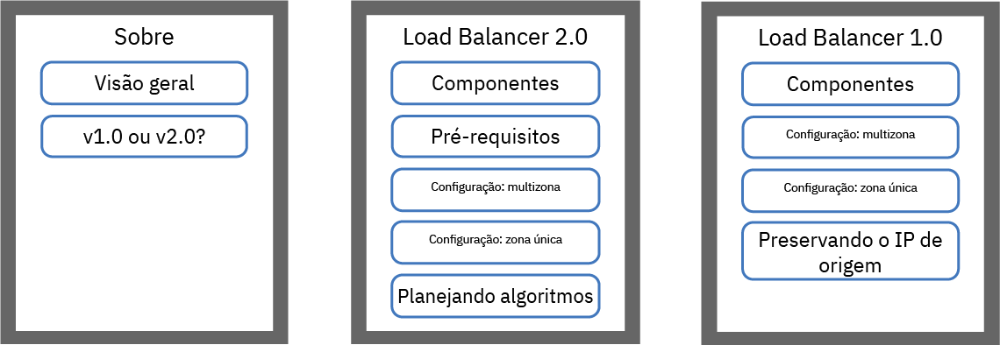

---

copyright:
  years: 2014, 2019
lastupdated: "2019-03-21"

keywords: kubernetes, iks, lb2.0, nlb

subcollection: containers

---

{:new_window: target="_blank"}
{:shortdesc: .shortdesc}
{:screen: .screen}
{:pre: .pre}
{:table: .aria-labeledby="caption"}
{:codeblock: .codeblock}
{:tip: .tip}
{:note: .note}
{:important: .important}
{:deprecated: .deprecated}
{:download: .download}


# Expondo apps com balanceadores de carga
{: #loadbalancer}

Exponha uma porta e use um endereço IP móvel para um balanceador de carga da Camada 4 para acessar um app conteinerizado.
{:shortdesc}

Os serviços de balanceador de carga estão disponíveis somente para clusters padrão e não suportam a finalização do TLS. Se seu app requerer a finalização do TLS, será possível expor seu app usando [Ingresso](/docs/containers?topic=containers-ingress) ou configurar seu app para gerenciar a finalização do TLS.
{: note}

Escolha uma das opções a seguir para iniciar:



<map name="image-map-1">
    <area target="" alt="Visão geral" title="Visão geral" href="#lb_overview" coords="35,44,175,72" shape="rect">
    <area target="" alt="Comparação de balanceadores de carga da versão 1.0 e 2.0" title="Comparação de balanceadores de carga da versão 1.0 e 2.0" href="#comparison" coords="34,83,173,108" shape="rect">
    <area target="" alt="v2.0: Componentes e arquitetura (Beta)" title="v2.0: Componentes e arquitetura (Beta)" href="#planning_ipvs" coords="273,45,420,72" shape="rect">
    <area target="" alt="v2.0: Pré-requisitos" title="v2.0: Pré-requisitos" href="#ipvs_provision" coords="277,85,417,108" shape="rect">
    <area target="" alt="v2.0: Configurando um balanceador de carga 2.0 em um cluster de múltiplas zonas" title="v2.0: Configurando um balanceador de carga 2.0 em um cluster de múltiplas zonas" href="#ipvs_multi_zone_config" coords="276,122,417,147" shape="rect">
    <area target="" alt="v2.0: Configurando um balanceador de carga 2.0 em um cluster de zona única" title="v2.0: Configurando um balanceador de carga 2.0 em um cluster de zona única" href="#ipvs_single_zone_config" coords="277,156,419,184" shape="rect">
    <area target="" alt="v2.0: Planejando os algoritmos" title="v2.0: Planejando os algoritmos" href="#scheduling" coords="276,196,419,220" shape="rect">
    <area target="" alt="v1.0: Componentes e arquitetura" title="v1.0: Componentes e arquitetura" href="#v1_planning" coords="519,47,668,74" shape="rect">
    <area target="" alt="v1.0: Configurando um balanceador de carga 1.0 em um cluster multizona" title="v1.0: Configurando um balanceador de carga 1.0 em um cluster multizona" href="#multi_zone_config" coords="520,85,667,110" shape="rect">
    <area target="" alt="v1.0: Configurando um balanceador de carga 1.0 em um cluster de zona única" title="v1.0: Configurando um balanceador de carga 1.0 em um cluster de zona única" href="#lb_config" coords="520,122,667,146" shape="rect">
    <area target="" alt="v1.0: Ativando a preservação de IP de origem" title="v1.0: Ativaando a preservação de IP de origem" href="#node_affinity_tolerations" coords="519,157,667,194" shape="rect">
</map>


## YAMLs de amostra
{: #sample}

Revise os seguintes arquivos YAML de amostra para começar rapidamente com a especificação do serviço de balanceador de carga.
{: shortdesc}

** Balanceador de carga 2.0 **</br>

Você já tem os [pré-requisitos para um balanceador de carga 2.0](#ipvs_provision) concluídos? É possível usar o YAML de implementação a seguir para criar um balanceador de carga 2.0:

```
apiVersion: v1
kind: Service
metadata:
  name: myloadbalancer
  annotations:
    service.kubernetes.io/ibm-load-balancer-cloud-provider-ip-type: <public_or_private>
    service.kubernetes.io/ibm-load-balancer-cloud-provider-zone: "<zone>"
    service.kubernetes.io/ibm-load-balancer-cloud-provider-vlan: "<vlan_id>"
    service.kubernetes.io/ibm-load-balancer-cloud-provider-enable-features: "ipvs"
    service.kubernetes.io/ibm-load-balancer-cloud-provider-scheduler: "<algorithm>"
spec:
  type: LoadBalancer
  selector:
    <selector_key>: <selector_value>
  ports:
   - protocol: TCP
     port: 8080
  loadBalancerIP: <IP_address>
  externalTrafficPolicy: Local
```
{: codeblock}

** Balanceador de carga 1.0 **</br>

Use a seguinte implementação YAML para criar um balanceador de carga 1.0:

```
apiVersion: v1
tipo: Serviço
metadados:
 nome: myloadbalancer
 Anotações:
   service.kubernetes.io/ibm-load-balancer-cloud-provider-ip-type: < public_or_private>
   service.kubernetes.io/ibm-load-balancer-cloud-provider-zone: "< zone>"
   service.kubernetes.io/ibm-load-balancer-cloud-provider-vlan: "< vlan_id>"
spec:
 tipo: LoadBalancer
 seletor:
   < selector_key>: < selector_value>
 Portas:
  -protocolo: TCP
    porta: 8080
 loadBalancerIP: < IP_address>
```
{: codeblock}

<br />


## Visão geral
{: #lb_overview}

Ao criar um cluster padrão, o {{site.data.keyword.containerlong}} provisiona automaticamente uma sub-rede pública móvel e uma sub-rede privada móvel.
{: shortdesc}

* A sub-rede pública móvel fornece cinco endereços IP utilizáveis. Um endereço IP público móvel é usado pelo [ALB do Ingress público](/docs/containers?topic=containers-ingress) padrão. Os quatro endereços IP públicos móveis restantes podem ser usados para expor apps únicos à Internet, criando serviços do balanceador de carga público.
* A sub-rede privada móvel fornece cinco endereços IP utilizáveis. 1 endereço IP privado móvel é usado pelo [ALB do Ingress privado](/docs/containers?topic=containers-ingress#private_ingress) padrão. Os outros quatro endereços IP privados móveis podem ser usados para expor apps únicos a uma rede privada, criando serviços de balanceador de carga privado.

Os endereços IP públicos e privados móveis são IPs flutuantes estáticos e não mudam quando um nó do trabalhador é removido. Se o nó do trabalhador no qual o endereço IP do balanceador de carga está for removido, um daemon Keepalived que monitora constantemente o IP moverá automaticamente o IP para outro nó do trabalhador. É possível designar qualquer porta para o balanceador de carga. O serviço de balanceador de carga serve como o ponto de entrada externo para solicitações recebidas para o app. Para acessar o serviço do balanceador de carga na Internet, é possível usar o endereço IP público de seu balanceador de carga e a porta designada no formato `<IP_address>:<port>`.

Quando você expõe um app com um serviço de balanceador de carga, seu app é disponibilizado automaticamente por meio dos NodePorts do serviço também. Os [NodePorts](/docs/containers?topic=containers-nodeport) são acessíveis em cada endereço IP público e privado de cada nó do trabalhador dentro do cluster. Para bloquear o tráfego para NodePorts enquanto você está usando um serviço de balanceador de carga, consulte [Controlando o tráfego de entrada para os serviços de balanceador de carga ou do NodePort](/docs/containers?topic=containers-network_policies#block_ingress).

<br />


## Comparação dos balanceadores de carga da versão 1.0 e 2.0
{: #comparison}

Quando você cria um balanceador de carga, é possível escolher um balanceador de carga versão 1.0 ou 2.0. Observe que os balanceadores de carga versão 2.0 estão em beta.
{: shortdesc}

**Como os balanceadores de carga da versão 1.0 e 2.0 são semelhantes?**

Os balanceadores de carga da versão 1.0 e 2.0 são balanceadores de carga da Camada 4 que vivem somente no espaço do kernel Linux. Ambas as versões são executadas dentro do cluster e usam os recursos do nó do trabalhador. Portanto, a capacidade disponível dos balanceadores de carga é sempre dedicada a seu próprio cluster. Além disso, a versão dos balanceadores de carga não finaliza a conexão. Em vez disso, eles encaminham conexões para um pod de app.

**Como os balanceadores de carga da versão 1.0 e 2.0 são diferentes?**

Quando um cliente envia uma solicitação para seu app, o balanceador de carga roteia os pacotes de solicitações para o endereço IP do nó do trabalhador no qual um pod de app existe. Os balanceadores de carga da versão 1.0 usam a conversão de endereço de rede (NAT) para regravar o endereço IP de origem do pacote de solicitação para o IP do nó do trabalhador no qual um pod do balanceador de carga existe. Quando o nó do trabalhador retorna o pacote de resposta do app, ele usa esse IP do nó do trabalhador no qual o balanceador de carga existe. O balanceador de carga deve então enviar o pacote de resposta ao cliente. Para evitar que o endereço IP seja reescrito, é possível [ativar a preservação de IP de origem](#node_affinity_tolerations). No entanto, a preservação de IP de origem requer que os pods do balanceador de carga e os pods de app sejam executados no mesmo trabalhador para que a solicitação não tenha que ser encaminhada para outro trabalhador. Deve-se incluir afinidade de nó e tolerâncias nos pods do app.

Ao contrário dos balanceadores de carga versão 1.0, os balanceadores de carga da versão 2.0 não usam o NAT ao encaminhar solicitações para os pods de app em outros trabalhadores. Quando um balanceador de carga 2.0 roteia uma solicitação do cliente, ele usa IP por IP (IPIP) para encapsular o pacote de solicitações original em outro pacote novo. Esse pacote de IPIP de encapsulamento tem um IP de origem do nó do trabalhador no qual o pod do balanceador de carga está, que permite que o pacote de solicitações original preserve o IP do cliente como seu endereço IP de origem. O nó do trabalhador então usa o retorno de retorno do servidor direto (DSR) para enviar o pacote de resposta do app para o IP do cliente. O pacote de resposta ignora o balanceador de carga e é enviado diretamente para o cliente, diminuindo a quantia de tráfego que o balanceador de carga deve manipular.

<br />


## v2.0: Componentes e Arquitetura (beta)
{: #planning_ipvs}

Os recursos do balanceador de carga 2.0 estão em beta. Para usar um balanceador de carga versão 2.0, deve-se [atualizar os nós principal e do trabalhador do cluster](/docs/containers?topic=containers-update) para o Kubernetes versão 1.12 ou mais recente.
{: note}

O balanceador de carga 2.0 é um balanceador de carga da Camada 4 que usa o IP Virtual Server (IPVS) do kernel Linux. O balanceador de carga 2.0 suporta TCP e UDP, é executado na frente de múltiplos nós do trabalhador e usa o tunelamento IP sobre IP (IPIP) para distribuir o tráfego que chega a um único endereço IP do balanceador de carga entre esses nós do trabalhador.

Deseja mais detalhes sobre os padrões de implementação de balanceamento de carga que estão disponíveis no {{site.data.keyword.containerlong_notm}}? Verifiqe esta [postagem do blog](https://www.ibm.com/blogs/bluemix/2018/10/ibm-cloud-kubernetes-service-deployment-patterns-for-maximizing-throughput-and-availability/).
{: tip}

### Fluxo de tráfego em um cluster de zona única
{: #ipvs_single}

O diagrama a seguir mostra como um balanceador de carga 2.0 direciona a comunicação da Internet para um app em um cluster de zona única.
{: shortdesc}


1. Uma solicitação do cliente para seu app usa o endereço IP público de seu balanceador de carga e a porta designada no nó do trabalhador. Neste exemplo, o balanceador de carga tem um endereço IP virtual de 169.61.23.130, que está atualmente no trabalhador 10.73.14.25.

2. O balanceador de carga encapsula o pacote de solicitações do cliente (rotulado como "CR" na imagem) dentro de um pacote IPIP (rotulado como "IPIP"). O pacote de solicitação do cliente retém o IP do cliente como seu endereço IP de origem. O pacote de encapsulamento do IPIP usa o IP 10.73.14.25 IP como seu endereço IP de origem.

3. O balanceador de carga roteia o pacote IPIP para um trabalhador no qual um pod de app está, 10.73.14.26. Se múltiplas instâncias do app são implementadas no cluster, o balanceador de carga roteia as solicitações entre os trabalhadores nos quais os pods de app são implementados.

4. O trabalhador 10.73.14.26 descompacta o pacote de encapsulamento do IPIP e, em seguida, descompacta o pacote de solicitações do cliente. O pacote de solicitações do cliente é encaminhado para o pod de app nesse nó do trabalhador.

5. O trabalhador 10.73.14.26 usa o endereço IP de origem do pacote de solicitações original, o IP do cliente, para retornar o pacote de resposta do pod do app diretamente para o cliente.

### Fluxo de tráfego em um cluster de múltiplas zonas
{: #ipvs_multi}

O fluxo de tráfego por meio de um cluster de várias zonas segue o mesmo caminho que o [tráfego por meio de um cluster de zona única](#ipvs_single). Em um cluster de várias zonas, o balanceador de carga roteia solicitações para as instâncias do app em sua própria zona e para as instâncias do app em outras zonas. O diagrama a seguir mostra como os balanceadores de carga da versão 2.0 em cada zona direcionam o tráfego da Internet para um app em um cluster de várias zonas.
{: shortdesc}


Por padrão, cada balanceador de carga versão 2.0 é configurado em uma zona somente. É possível obter maior disponibilidade implementando um balanceador de carga versão 2.0 em cada zona na qual você tem instâncias de app.

<br />


## v2.0: Pré-requisitos
{: #ipvs_provision}

Não é possível atualizar um balanceador de carga da versão 1.0 existente para 2.0. Deve-se criar um novo balanceador de carga da versão 2.0. Observe que é possível executar balanceadores de carga versão 1.0 e 2.0 simultaneamente em um cluster.
{: shortdesc}

Antes de criar um balanceador de carga versão 2.0, deve-se concluir as etapas de pré-requisito a seguir.

1. [Atualize os nós do cluster mestre e do trabalhador](/docs/containers?topic=containers-update) para o Kubernetes versão 1.12 ou mais recente.

2. Para permitir que o balanceador de carga 2.0 encaminhe solicitações para pods do app em múltiplas zonas, abra um caso de suporte para solicitar uma definição de configuração para suas VLANs. **Importante**: deve-se solicitar essa configuração para todas as VLANs públicas. Se você solicitar uma nova VLAN associada, deverá abrir outro chamado para essa VLAN.
    1. Efetue login no  [ console do {{site.data.keyword.Bluemix_notm}}  ](https://cloud.ibm.com/).
    2. Na barra de menus, clique em **Suporte**, clique na guia **Gerenciar casos** e clique em **Criar novo caso**.
    3. Nos campos de caso, insira o seguinte:
       * Para o tipo de suporte, selecione  ** Técnico **.
       * Para categoria, selecione  ** VLAN Spanning **.
       * Para o assunto, insira **Pergunta de rede de VLAN pública.**
    4. Inclua as informações a seguir na descrição: "Configure a rede para permitir a agregação de capacidade nas VLANs públicas associadas à minha conta. O chamado de referência para essa solicitação é: https://control.softlayer.com/support/tickets/63859145".
    5. Clique em **Enviar**.

3. Se a ampliação do VLAN estiver desativada, ative a [ampliação de VLAN](/docs/infrastructure/vlans?topic=vlans-vlan-spanning#vlan-spanning) para sua conta de infraestrutura do IBM Cloud (SoftLayer). Quando a ampliação de VLAN está ativada, o balanceador de carga versão 2.0 pode rotear pacotes para várias sub-redes na conta. É possível ver se a ampliação do VLAN está ativada, executando `ibmcloud ks vlan-spanning-get`.

4. Se você usar as [Políticas de rede pré-DNAT do Calico](/docs/containers?topic=containers-network_policies#block_ingress) para gerenciar o tráfego para o endereço IP de um balanceador de carga versão 2.0, deverá incluir os campos `applyOnForward: true` e `doNotTrack: true` e remover o `preDNAT: true` da seção `spec` nas políticas. `applyOnForward: true` assegura que a política do Calico seja aplicada ao tráfego conforme ele é encapsulado e encaminhado. `doNotTrack: true` assegura que os nós do trabalhador possam usar o DSR para retornar um pacote de resposta diretamente para o cliente sem precisar que a conexão seja rastreada. Por exemplo, se você usar uma política do Calico para o tráfego de lista de desbloqueio somente de endereços IP específicos para o endereço IP do balanceador de carga, a política será semelhante à seguinte:
    ```
    apiVersion: projectcalico.org/v3 kind: GlobalNetworkPolicy metadata: name: whitelist spec: applyOnForward: true doNotTrack: true ingress:
      - action: Allow
        destination:
          nets:
          - <loadbalancer_IP>/32 portas:
          - 80 protocol: TCP source: nets:
          - <client_address>/32 selector: ibm.role=='worker_public' order: 500 types:
      - Entrada
    ```
    {: screen}

Em seguida, é possível seguir as etapas em [Configurando um balanceador de carga 2.0 em um cluster de várias zonas](#ipvs_multi_zone_config) ou [em um cluster de zona única](#ipvs_single_zone_config).

<br />


## v2.0: configurando um balanceador de carga 2.0 em um cluster de múltiplas zonas
{: #ipvs_multi_zone_config}

** Antes de iniciar **:

* **Importante**: conclua os [pré-requisitos do balanceador de carga 2.0](#ipvs_provision).
* Para criar balanceadores de carga públicos em múltiplas zonas, pelo menos uma VLAN pública deve ter sub-redes móveis disponíveis em cada zona. Para criar balanceadores de carga privados em múltiplas zonas, pelo menos uma VLAN privada deve ter sub-redes móveis disponíveis em cada zona. É possível incluir sub-redes seguindo as etapas em [Configurando sub-redes para clusters](/docs/containers?topic=containers-subnets).
* Se você restringir o tráfego de rede para os nós do trabalhador de borda, assegure-se de que pelo menos 2 [nós do trabalhador de borda](/docs/containers?topic=containers-edge#edge) estejam ativados em cada zona para que os balanceadores de carga sejam implementados uniformemente.
* Assegure-se de que você tenha a [função de **Gravador** ou **Gerenciador** do serviço {{site.data.keyword.Bluemix_notm}} IAM](/docs/containers?topic=containers-users#platform) para o namespace `default`.


Para configurar um balanceador de carga 2.0 em um cluster de várias zonas:
1.  [Implemente o seu app no cluster](/docs/containers?topic=containers-app#app_cli). Certifique-se de incluir um rótulo à sua implementação na seção de metadados de seu arquivo de configuração. Esse rótulo é necessário para identificar todos os pods nos quais seu app está sendo executado para que eles possam ser incluídos no balanceamento de carga.

2.  Crie um serviço de balanceador de carga para o app que você deseja expor para a Internet pública ou uma rede privada.
  1. Crie um arquivo de configuração de serviço que seja chamado, por exemplo, de `myloadbalancer.yaml`.
  2. Defina um serviço de balanceador de carga para o app que você deseja expor. É possível especificar uma zona, uma VLAN e um endereço IP.

      ```
      apiVersion: v1
      kind: Service
      metadata:
        name: myloadbalancer
        annotations:
          service.kubernetes.io/ibm-load-balancer-cloud-provider-ip-type: <public_or_private>
          service.kubernetes.io/ibm-load-balancer-cloud-provider-zone: "<zone>"
          service.kubernetes.io/ibm-load-balancer-cloud-provider-vlan: "<vlan_id>"
          service.kubernetes.io/ibm-load-balancer-cloud-provider-enable-features: "ipvs"
          service.kubernetes.io/ibm-load-balancer-cloud-provider-scheduler: "<algorithm>"
      spec:
        type: LoadBalancer
        selector:
          <selector_key>: <selector_value>
        ports:
         - protocol: TCP port: 8080 loadBalancerIP: <IP_address> externalTrafficPolicy: Local
      ```
      {: codeblock}

      <table>
      <caption>Entendendo os componentes de arquivo YAML</caption>
      <thead>
      <th colspan=2> entendendo os componentes de arquivo do YAML</th>
      </thead>
      <tbody>
      <tr>
        <td><code>service.kubernetes.io/ibm-load-balancer-cloud-provider-ip-type:</code>
        <td>Anotação para especificar um balanceador de carga <code>private</code> ou <code>public</code>.</td>
      </tr>
      <tr>
        <td><code>service.kubernetes.io/ibm-load-balancer-cloud-provider-zone:</code>
        <td>Anotação para especificar a zona na qual o serviço de balanceador de carga é implementado. Para ver zonas, execute <code>ibmcloud ks zones</code>.</td>
      </tr>
      <tr>
        <td>`service.kubernetes.io/ibm-load-balancer-cloud-provider-vlan:`
        <td>Anotação para especificar uma VLAN na qual o serviço de balanceador de carga é implementado. Para ver VLANs, execute <code>ibmcloud ks vlans --zone <zone></code>.</td>
      </tr>
      <tr>
        <td><code> service.kubernetes.io/ibm-load-balancer-cloud-provider-enable-features: "ipvs" </code>
        <td>Anotação para especificar um balanceador de carga da versão 2.0.</td>
      </tr>
      <tr>
        <td><code>service.kubernetes.io/ibm-load-balancer-cloud-provider-scheduler:</code>
        <td>Opcional: anotação para especificar o algoritmo de planejamento. Os valores aceitos são <code>"rr"</code> para Round Robin (padrão) ou <code>"sh"</code> para Hashing de origem. Para obter mais informações, consulte [2.0: planejando algoritmos](#scheduling).</td>
      </tr>
      <tr>
        <td><code>seletor</code></td>
        <td>A chave de rótulo (<em>&lt;selector_key&gt;</em>) e o valor (<em>&lt;selector_value&gt;</em>) que você usou na seção <code>spec.template.metadata.labels</code> de seu YAML de implementação de app.</td>
      </tr>
      <tr>
        <td><code>port</code></td>
        <td>A porta na qual o serviço atende.</td>
      </tr>
      <tr>
        <td><code>loadBalancerIP</code></td>
        <td>Opcional: para criar um balanceador de carga privado ou para usar um endereço IP móvel específico para um balanceador de carga público, especifique o endereço IP que você deseja usar. O endereço IP deve estar na zona e na VLAN que você especificar nas anotações. Se você não especificar um endereço IP:<ul><li>Se o seu cluster estiver em uma VLAN pública, um endereço IP móvel público será usado. A maioria dos clusters está em uma VLAN pública.</li><li>Se seu cluster estiver somente em uma VLAN privada, um endereço IP privado móvel será usado.</li></ul></td>
      </tr>
      <tr>
        <td><code>externalTrafficPolicy: Local</code></td>
        <td>Configure como <code>Local</code>.</td>
      </tr>
      </tbody></table>

      Exemplo de arquivo de configuração para criar um serviço do balanceador de carga 2.0 no `dal12` que usa o algoritmo de planejamento Round Robin:

      ```
      apiVersion: v1
      kind: Service
      metadata:
        name: myloadbalancer
        annotations:
          service.kubernetes.io/ibm-load-balancer-cloud-provider-zone: "dal12"
          service.kubernetes.io/ibm-load-balancer-cloud-provider-enable-features: "ipvs"
          service.kubernetes.io/ibm-load-balancer-cloud-provider-scheduler: "rr"
      spec:
        type: LoadBalancer
        selector:
          app: nginx
        ports:
         - protocol: TCP port: 8080 externalTrafficPolicy: Local
      ```
      {: codeblock}

  3. Opcional: torne seu serviço de balanceador de carga disponível somente para um intervalo limitado de endereços IP, especificando os IPs no campo `spec.loadBalancerSourceRanges`.  `loadBalancerSourceRanges` é implementado por `kube-proxy` em seu cluster por meio de regras de Iptables nos nós do trabalhador. Para obter mais informações, consulte [a documentação do Kubernetes ](https://kubernetes.io/docs/tasks/access-application-cluster/configure-cloud-provider-firewall/).

  4. Crie o serviço em seu cluster.

      ```
      kubectl apply -f myloadbalancer.yaml
      ```
      {: pre}

3. Verifique se o serviço de balanceador de carga foi criado com êxito. Pode levar alguns minutos para que o serviço de balanceador de carga seja criado corretamente e para que o app fique disponível.

    ```
    Kubectl describe myloadbalancer de serviço
    ```
    {: pre}

    Exemplo de saída da CLI:

    ```
    Name:                   myloadbalancer
    Namespace:              default
    Labels:                 <none>
    Selector:               app=liberty
    Type:                   LoadBalancer
    Zone:                   dal10
    IP:                     172.21.xxx.xxx
    LoadBalancer Ingress:   169.xx.xxx.xxx
    Port:                   <unset> 8080/TCP
    NodePort:               <unset> 32040/TCP
    Endpoints:              172.30.xxx.xxx:8080
    Session Affinity:       None
    Events:
      FirstSeen	LastSeen	Count	From			SubObjectPath	Type	 Reason			          Message
      ---------	--------	-----	----			-------------	----	 ------			          -------
      10s		 10s		 1	 {service-controller }	 Normal CreatingLoadBalancer	Creating load balancer 10s		 10s		 1	 {service-controller }		Normal CreatedLoadBalancer	Created load balancer
    ```
    {: screen}

    O endereço IP do **Ingresso de LoadBalancer** é o endereço IP móvel que foi designado ao seu serviço de balanceador de carga.

4.  Se você tiver criado um balanceador de carga público, acesse seu app pela Internet.
    1.  Abra seu navegador da web preferencial.
    2.  Insira o endereço IP público móvel do balanceador de carga e a porta.

        ```
        Http://169.xx.xxx.xxx:8080
        ```
        {: codeblock}

5. Para alcançar alta disponibilidade, repita as etapas de 2 a 4 para incluir um balanceador de carga 2.0 em cada zona em que você tem instâncias de app.

6. Opcional: um serviço do balanceador de carga também disponibiliza o seu app sobre as NodePorts do serviço. [NodePorts](/docs/containers?topic=containers-nodeport) são acessíveis em cada endereço IP público e privado para cada nó dentro do cluster. Para bloquear o tráfego para NodePorts enquanto você está usando um serviço de balanceador de carga, consulte [Controlando o tráfego de entrada para os serviços de balanceador de carga ou do NodePort](/docs/containers?topic=containers-network_policies#block_ingress).


## v2.0: configurando um balanceador de carga 2.0 em um cluster de zona única
{: #ipvs_single_zone_config}

** Antes de iniciar **:

* **Importante**: conclua os [pré-requisitos do balanceador de carga 2.0](#ipvs_provision).
* Deve-se ter um endereço IP público ou privado móvel disponível para designar ao serviço de balanceador de carga. Para obter mais informações, consulte [Configurando sub-redes para clusters](/docs/containers?topic=containers-subnets).
* Assegure-se de que você tenha a [função de **Gravador** ou **Gerenciador** do serviço {{site.data.keyword.Bluemix_notm}} IAM](/docs/containers?topic=containers-users#platform) para o namespace `default`.

Para criar um serviço do balanceador de carga 2.0 em um cluster de zona única:

1.  [Implemente o seu app no cluster](/docs/containers?topic=containers-app#app_cli). Certifique-se de incluir um rótulo à sua implementação na seção de metadados de seu arquivo de configuração. Esse rótulo é necessário para identificar todos os pods nos quais o seu app está em execução para que eles possam ser incluídos no balanceamento de carga.
2.  Crie um serviço de balanceador de carga para o app que você deseja expor para a Internet pública ou uma rede privada.
    1.  Crie um arquivo de configuração de serviço que seja chamado, por exemplo, de `myloadbalancer.yaml`.

    2.  Defina um serviço de balanceador de carga 2.0 para o app que você deseja expor.
        ```
        apiVersion: v1
        kind: Service
        metadata:
          name: myloadbalancer
          annotations:
            service.kubernetes.io/ibm-load-balancer-cloud-provider-ip-type: <public_or_private>
            service.kubernetes.io/ibm-load-balancer-cloud-provider-vlan: "<vlan_id>"
            service.kubernetes.io/ibm-load-balancer-cloud-provider-enable-features: "ipvs"
            service.kubernetes.io/ibm-load-balancer-cloud-provider-scheduler: "<algorithm>"
        spec:
          type: LoadBalancer
          selector:
            <selector_key>: <selector_value>
          ports:
           - protocol: TCP port: 8080 loadBalancerIP: <IP_address> externalTrafficPolicy: Local
        ```
        {: codeblock}

        <table>
        <caption>Entendendo os componentes de arquivo YAML</caption>
        <thead>
        <th colspan=2> entendendo os componentes de arquivo do YAML</th>
        </thead>
        <tbody>
        <tr>
          <td>`service.kubernetes.io/ibm-load-balancer-cloud-provider-ip-type:`
          <td>Anotação para especificar um balanceador de carga <code>private</code> ou <code>public</code>.</td>
        </tr>
        <tr>
          <td>`service.kubernetes.io/ibm-load-balancer-cloud-provider-vlan:`
          <td>Opcional: anotação para especificar uma VLAN para a qual o serviço do balanceador de carga implementa. Para ver VLANs, execute <code>ibmcloud ks vlans --zone <zone></code>.</td>
        </tr>
        <tr>
          <td><code> service.kubernetes.io/ibm-load-balancer-cloud-provider-enable-features: "ipvs" </code>
          <td>Anotação para especificar um balanceador de carga 2.0.</td>
        </tr>
        <tr>
          <td><code>service.kubernetes.io/ibm-load-balancer-cloud-provider-scheduler:</code>
          <td>Opcional: anotação para especificar um algoritmo de planejamento. Os valores aceitos são <code>"rr"</code> para Round Robin (padrão) ou <code>"sh"</code> para Hashing de origem. Para obter mais informações, consulte [2.0: planejando algoritmos](#scheduling).</td>
        </tr>
        <tr>
          <td><code>seletor</code></td>
          <td>A chave de rótulo (<em>&lt;selector_key&gt;</em>) e o valor (<em>&lt;selector_value&gt;</em>) que você usou na seção <code>spec.template.metadata.labels</code> de seu YAML de implementação de app.</td>
        </tr>
        <tr>
          <td><code>port</code></td>
          <td>A porta na qual o serviço atende.</td>
        </tr>
        <tr>
          <td><code>loadBalancerIP</code></td>
          <td>Opcional: para criar um balanceador de carga privado ou para usar um endereço IP móvel específico para um balanceador de carga público, especifique o endereço IP que você deseja usar. O endereço IP deve estar na VLAN que você especifica nas anotações. Se você não especificar um endereço IP:<ul><li>Se o seu cluster estiver em uma VLAN pública, um endereço IP móvel público será usado. A maioria dos clusters está em uma VLAN pública.</li><li>Se seu cluster estiver somente em uma VLAN privada, um endereço IP privado móvel será usado.</li></ul></td>
        </tr>
        <tr>
          <td><code>externalTrafficPolicy: Local</code></td>
          <td>Configure como <code>Local</code>.</td>
        </tr>
        </tbody></table>

    3.  Opcional: torne seu serviço de balanceador de carga disponível somente para um intervalo limitado de endereços IP, especificando os IPs no campo `spec.loadBalancerSourceRanges`. `loadBalancerSourceRanges` é implementado por `kube-proxy` em seu cluster por meio de regras de Iptables nos nós do trabalhador. Para obter mais informações, consulte [a documentação do Kubernetes ](https://kubernetes.io/docs/tasks/access-application-cluster/configure-cloud-provider-firewall/).

    4.  Crie o serviço em seu cluster.

        ```
        kubectl apply -f myloadbalancer.yaml
        ```
        {: pre}

3.  Verifique se o serviço de balanceador de carga foi criado com êxito. Pode levar alguns minutos para que o serviço seja criado e para que o app fique disponível.

    ```
    Kubectl describe myloadbalancer de serviço
    ```
    {: pre}

    Exemplo de saída da CLI:

    ```
    Name: myloadbalancer Namespace: default Labels: <none> Selector: app=liberty Type: LoadBalancer Location: dal10 IP: 172.21.xxx.xxx LoadBalancer Ingress: 169.xx.xxx.xxx Port: <unset> 8080/TCP NodePort: <unset> 32040/TCP Endpoints: 172.30.xxx.xxx:8080 Session Affinity: None Events: FirstSeen	LastSeen	Count	From			SubObjectPath	Type	 Reason			 Message
      ---------	--------	-----	----			-------------	----	 ------			          -------
      10s		 10s		 1	 {service-controller }	 Normal CreatingLoadBalancer	Creating load balancer 10s		 10s		 1	 {service-controller }		Normal CreatedLoadBalancer	Created load balancer
    ```
    {: screen}

    O endereço IP do **Ingresso de LoadBalancer** é o endereço IP móvel que foi designado ao seu serviço de balanceador de carga.

4.  Se você tiver criado um balanceador de carga público, acesse seu app pela Internet.
    1.  Abra seu navegador da web preferencial.
    2.  Insira o endereço IP público móvel do balanceador de carga e a porta.

        ```
        Http://169.xx.xxx.xxx:8080
        ```
        {: codeblock}

5. Opcional: um serviço do balanceador de carga também disponibiliza o seu app sobre as NodePorts do serviço. [NodePorts](/docs/containers?topic=containers-nodeport) são acessíveis em cada endereço IP público e privado para cada nó dentro do cluster. Para bloquear o tráfego para NodePorts enquanto você está usando um serviço de balanceador de carga, consulte [Controlando o tráfego de entrada para os serviços de balanceador de carga ou do NodePort](/docs/containers?topic=containers-network_policies#block_ingress).


<br />


## v2.0: Algoritmos de Planejamento
{: #scheduling}

Os algoritmos de planejamento determinam como um balanceador de carga da versão 2.0 designa conexões de rede aos seus pods de app. À medida que as solicitações do cliente chegam ao seu cluster, o balanceador de carga roteia os pacotes de solicitações para os nós do trabalhador com base no algoritmo de planejamento. Para usar um algoritmo de planejamento, especifique seu nome abreviado Keepalived na anotação do planejador do seu arquivo de configuração de serviço do balanceador de carga: `service.kubernetes.io/ibm-load-balancer-cloud-provider-scheduler: "rr"`. Verifique as listas a seguir para ver quais algoritmos de planejamento são suportados no {{site.data.keyword.containerlong_notm}}. Se você não especificar um algoritmo de planejamento, o algoritmo Round Robin será usado por padrão. Para obter mais informações, consulte a [Documentação com keep-alive ](http://www.Keepalived.org/doc/scheduling_algorithms.html).
{: shortdesc}

### Algoritmos de planejamento suportados
{: #scheduling_supported}

<dl>
<dt>Round Robin (<code>rr</code>)</dt>
<dd>O balanceador de carga percorre a lista de pods de app ao rotear conexões para nós do trabalhador, tratando cada pod de app igualmente. Round Robin é o algoritmo de planejamento padrão para os balanceadores de carga versão 2.0.</dd>
<dt>Hashing de origem (<code>sh</code>)</dt>
<dd>O balanceador de carga gera uma chave de hash com base no endereço IP de origem do pacote de solicitação do cliente. O balanceador de carga consulta a chave de hash em uma tabela hash designada estaticamente e roteia a solicitação para o pod de app que manipula os hashes desse intervalo. Esse algoritmo assegura que as solicitações de um determinado cliente sejam sempre direcionadas para o mesmo pod do app.</br>**Nota**: o Kubernetes usa regras Iptables, que fazem com que as solicitações sejam enviadas para um pod aleatório no trabalhador. Para usar esse algoritmo de planejamento, deve-se assegurar que não mais que um pod de seu app seja implementado por nó do trabalhador. Por exemplo, se cada pod tiver o rótulo <code>run=&lt;app_name&gt;</code>, inclua a regra de antiafinidade a seguir na seção <code>spec</code> de sua implementação de app:</br>
<pre class="codeblock">
<code>
    spec:
      affinity:
        podAntiAffinity:
          preferredDuringSchedulingIgnoredDuringExecution:
          - weight: 100
            podAffinityTerm:
              labelSelector:
                matchExpressions:
                - key: run
                  operator: In
                  values:
                  - <APP_NAME>
              topologyKey: kubernetes.io/hostname</code></pre>

É possível localizar o exemplo completo neste [blog de padrão de implementação do IBM Cloud ](https://www.ibm.com/blogs/bluemix/2018/10/ibm-cloud-kubernetes-service-deployment-patterns-4-multi-zone-cluster-app-exposed-via-loadbalancer-aggregating-whole-region-capacity/).</dd>
</dl>

### Algoritmos de planejamento não suportados
{: #scheduling_unsupported}

<dl>
<dt>Hashing de destino (<code>dh</code>)</dt>
<dd>O destino do pacote, que é o endereço IP do balanceador de carga e a porta, é usado para determinar qual nó do trabalhador manipula a solicitação recebida. No entanto, o endereço IP e a porta para balanceadores de carga no {{site.data.keyword.containerlong_notm}} não mudam. O balanceador de carga é forçado a manter a solicitação dentro do mesmo nó do trabalhador no qual ele está, portanto, somente os pods de app em um trabalhador manipulam todas as solicitações recebidas.</dd>
<dt>Algoritmos de contagem de conexão dinâmica</dt>
<dd>Os algoritmos a seguir dependem da contagem dinâmica de conexões entre clientes e balanceadores de carga. No entanto, como o direct service return (DSR) evita que os pods do balanceador de carga 2.0 estejam no caminho do pacote de retorno, os balanceadores de carga não mantêm o controle de conexões estabelecidas.<ul>
<li>Least Connection (<code>lc</code>)</li>
<li>Locality-Based Least Connection (<code>lblc</code>)</li>
<li>Locality-Based Least Connection with Replication (<code>lblcr</code>)</li>
<li>Never Queue (<code>nq</code>)</li>
<li>Shortest Expected Delay (<code>seq</code>)</li></ul></dd>
<dt>Algoritmos de pod ponderados</dt>
<dd>Os algoritmos a seguir dependem de pods de app ponderados. No entanto, no {{site.data.keyword.containerlong_notm}}, todos os pods de app são designados a igual peso para balanceamento de carga.<ul>
<li>Weighted Least Connection (<code>wlc</code>)</li>
<li>Weighted Round Robin (<code>wrr</code>)</li></ul></dd></dl>

<br />


## v1.0: Componentes e Arquitetura
{: #v1_planning}

O balanceador de carga TCP/UDP 1.0 usa os Iptables, um recurso de kernel do Linux, para carregar solicitações de balanceamento em pods de um app.
{: shortdesc}

### Fluxo de tráfego em um cluster de zona única
{: #v1_single}

O diagrama a seguir mostra como um balanceador de carga 1.0 direciona a comunicação da Internet para um app em um cluster de zona única.
{: shortdesc}


1. Uma solicitação para seu app usa o endereço IP público de seu balanceador de carga e a porta designada no nó do trabalhador.

2. A solicitação é encaminhada automaticamente para o endereço IP e porta do cluster interno do serviço de balanceador de carga. O endereço IP do cluster interno é acessível somente dentro do cluster.

3. `kube-proxy` roteia a solicitação para o serviço de balanceador de carga do Kubernetes para o app.

4. A solicitação é encaminhada para o endereço IP privado do pod de app. O endereço IP de origem do pacote de solicitação é mudado para o endereço IP público do nó do trabalhador no qual o pod de app está em execução. Se múltiplas instâncias do app são implementadas no cluster, o balanceador de carga roteia as solicitações entre os pods de app.

### Fluxo de tráfego em um cluster de múltiplas zonas
{: #v1_multi}

O diagrama a seguir mostra como um balanceador de carga 1.0 direciona a comunicação da Internet para um app em um cluster de várias zonas.
{: shortdesc}


Por padrão, cada balanceador de carga 1.0 é configurado em uma zona somente. Para alcançar alta disponibilidade, deve-se implementar um balanceador de carga 1.0 em cada zona na qual você tem instâncias do app. As solicitações são manipuladas pelos balanceadores de carga em várias zonas em um ciclo round-robin. Além disso, cada balanceador de carga roteia solicitações para as instâncias do app em sua própria zona e para instâncias do app em outras zonas.

<br />


## v1.0: configurando um balanceador de carga 1.0 em um cluster com múltiplas zonas
{: #multi_zone_config}

** Antes de iniciar **:
* Para criar balanceadores de carga públicos em múltiplas zonas, pelo menos uma VLAN pública deve ter sub-redes móveis disponíveis em cada zona. Para criar balanceadores de carga privados em múltiplas zonas, pelo menos uma VLAN privada deve ter sub-redes móveis disponíveis em cada zona. É possível incluir sub-redes seguindo as etapas em [Configurando sub-redes para clusters](/docs/containers?topic=containers-subnets).
* Se você restringir o tráfego de rede para os nós do trabalhador de borda, assegure-se de que pelo menos 2 [nós do trabalhador de borda](/docs/containers?topic=containers-edge#edge) estejam ativados em cada zona para que os balanceadores de carga sejam implementados uniformemente.
* Ative a [ampliação de VLAN](/docs/infrastructure/vlans?topic=vlans-vlan-spanning#vlan-spanning) para sua conta de infraestrutura do IBM Cloud (SoftLayer) para que seus nós do trabalhador possam se comunicar entre si na rede privada. Para executar essa ação, você precisa da [permissão de infraestrutura](/docs/containers?topic=containers-users#infra_access) **Rede > Gerenciar a rede VLAN Spanning** ou é possível solicitar ao proprietário da conta para ativá-la. Para verificar se o VLAN Spanning já está ativado, use o [comando](/docs/containers?topic=containers-cs_cli_reference#cs_vlan_spanning_get) `ibmcloud ks vlan-spanning-get`.
* Assegure-se de que você tenha a [função de **Gravador** ou **Gerenciador** do serviço {{site.data.keyword.Bluemix_notm}} IAM](/docs/containers?topic=containers-users#platform) para o namespace `default`.


Para configurar um serviço do balanceador de carga 1.0 em um cluster de várias zonas:
1.  [Implemente o seu app no cluster](/docs/containers?topic=containers-app#app_cli). Certifique-se de incluir um rótulo à sua implementação na seção de metadados de seu arquivo de configuração. Esse rótulo é necessário para identificar todos os pods nos quais seu app está sendo executado para que eles possam ser incluídos no balanceamento de carga.

2.  Crie um serviço de balanceador de carga para o app que você deseja expor para a Internet pública ou uma rede privada.
  1. Crie um arquivo de configuração de serviço que seja chamado, por exemplo, de `myloadbalancer.yaml`.
  2. Defina um serviço de balanceador de carga para o app que você deseja expor. É possível especificar uma zona, uma VLAN e um endereço IP.

      ```
      apiVersion: v1
      kind: Service
      metadata:
        name: myloadbalancer
        annotations:
          service.kubernetes.io/ibm-load-balancer-cloud-provider-ip-type: <public_or_private>
          service.kubernetes.io/ibm-load-balancer-cloud-provider-zone: "<zone>"
          service.kubernetes.io/ibm-load-balancer-cloud-provider-vlan: "<vlan_id>"
      spec:
        type: LoadBalancer
        selector:
          <selector_key>: <selector_value>
        ports:
         - protocol: TCP
             port: 8080
          loadBalancerIP: <IP_address>
      ```
      {: codeblock}

      <table>
      <caption>Entendendo os componentes de arquivo YAML</caption>
      <thead>
      <th colspan=2> entendendo os componentes de arquivo do YAML</th>
      </thead>
      <tbody>
      <tr>
        <td><code>service.kubernetes.io/ibm-load-balancer-cloud-provider-ip-type:</code>
        <td>Anotação para especificar um balanceador de carga <code>private</code> ou <code>public</code>.</td>
      </tr>
      <tr>
        <td><code>service.kubernetes.io/ibm-load-balancer-cloud-provider-zone:</code>
        <td>Anotação para especificar a zona na qual o serviço de balanceador de carga é implementado. Para ver zonas, execute <code>ibmcloud ks zones</code>.</td>
      </tr>
      <tr>
        <td>`service.kubernetes.io/ibm-load-balancer-cloud-provider-vlan:`
        <td>Anotação para especificar uma VLAN na qual o serviço de balanceador de carga é implementado. Para ver VLANs, execute <code>ibmcloud ks vlans --zone <zone></code>.</td>
      </tr>
      <tr>
        <td><code>seletor</code></td>
        <td>A chave de rótulo (<em>&lt;selector_key&gt;</em>) e o valor (<em>&lt;selector_value&gt;</em>) que você usou na seção <code>spec.template.metadata.labels</code> de seu YAML de implementação de app.</td>
      </tr>
      <tr>
        <td><code>port</code></td>
        <td>A porta na qual o serviço atende.</td>
      </tr>
      <tr>
        <td><code>loadBalancerIP</code></td>
        <td>Opcional: para criar um balanceador de carga privado ou para usar um endereço IP móvel específico para um balanceador de carga público, especifique o endereço IP que você deseja usar. O endereço IP deve estar na VLAN e na zona que você especificar nas anotações. Se você não especificar um endereço IP:<ul><li>Se o seu cluster estiver em uma VLAN pública, um endereço IP móvel público será usado. A maioria dos clusters está em uma VLAN pública.</li><li>Se seu cluster estiver somente em uma VLAN privada, um endereço IP privado móvel será usado.</li></ul></td>
      </tr>
      </tbody></table>

      Exemplo de arquivo de configuração para criar um serviço de balanceador de carga privado 1.0 que usa um endereço IP especificado na VLAN privada `2234945` em `dal12`:

      ```
      apiVersion: v1
      kind: Service
      metadata:
        name: myloadbalancer
        annotations:
          service.kubernetes.io/ibm-load-balancer-cloud-provider-ip-type: private
          service.kubernetes.io/ibm-load-balancer-cloud-provider-zone: "dal12"
          service.kubernetes.io/ibm-load-balancer-cloud-provider-vlan: "2234945"
      spec:
        type: LoadBalancer
        selector:
          app: nginx
        ports:
         - protocol: TCP port: 8080 loadBalancerIP: 172.21.xxx.xxx
      ```
      {: codeblock}

  3. Opcional: torne seu serviço de balanceador de carga disponível somente para um intervalo limitado de endereços IP, especificando os IPs no campo `spec.loadBalancerSourceRanges`. `loadBalancerSourceRanges` é implementado por `kube-proxy` em seu cluster por meio de regras de Iptables nos nós do trabalhador. Para obter mais informações, consulte [a documentação do Kubernetes ](https://kubernetes.io/docs/tasks/access-application-cluster/configure-cloud-provider-firewall/).

  4. Crie o serviço em seu cluster.

      ```
      kubectl apply -f myloadbalancer.yaml
      ```
      {: pre}

3. Verifique se o serviço de balanceador de carga foi criado com êxito. Pode levar alguns minutos para que o serviço seja criado e para que o app fique disponível.

    ```
    Kubectl describe myloadbalancer de serviço
    ```
    {: pre}

    Exemplo de saída da CLI:

    ```
    Name:                   myloadbalancer
    Namespace:              default
    Labels:                 <none>
    Selector:               app=liberty
    Type:                   LoadBalancer
    Zone:                   dal10
    IP:                     172.21.xxx.xxx
    LoadBalancer Ingress:   169.xx.xxx.xxx
    Port:                   <unset> 8080/TCP
    NodePort:               <unset> 32040/TCP
    Endpoints:              172.30.xxx.xxx:8080
    Session Affinity:       None
    Events:
      FirstSeen	LastSeen	Count	From			SubObjectPath	Type	 Reason			          Message
      ---------	--------	-----	----			-------------	----	 ------			          -------
      10s		 10s		 1	 {service-controller }	 Normal CreatingLoadBalancer	Creating load balancer 10s		 10s		 1	 {service-controller }		Normal CreatedLoadBalancer	Created load balancer
    ```
    {: screen}

    O endereço IP do **Ingresso de LoadBalancer** é o endereço IP móvel que foi designado ao seu serviço de balanceador de carga.

4.  Se você tiver criado um balanceador de carga público, acesse seu app pela Internet.
    1.  Abra seu navegador da web preferencial.
    2.  Insira o endereço IP público móvel do balanceador de carga e a porta.

        ```
        Http://169.xx.xxx.xxx:8080
        ```
        {: codeblock}    

5. Repita as etapas de 2 a 4 para incluir um balanceador de carga da versão 1.0 em cada zona.    

6. Se você escolher [ativar a preservação do IP de origem para um serviço de balanceador de carga da versão 1.0](#node_affinity_tolerations), assegure-se de que os pods de app sejam planejados nos nós do trabalhador de borda [incluindo a afinidade do nó de borda com os pods de app](#edge_nodes). Os pods do app devem ser planejados nos nós de borda para obter solicitações recebidas.

7. Opcional: um serviço do balanceador de carga também disponibiliza o seu app sobre as NodePorts do serviço. [NodePorts](/docs/containers?topic=containers-nodeport) são acessíveis em cada endereço IP público e privado para cada nó dentro do cluster. Para bloquear o tráfego para NodePorts enquanto você está usando um serviço de balanceador de carga, consulte [Controlando o tráfego de entrada para os serviços de balanceador de carga ou do NodePort](/docs/containers?topic=containers-network_policies#block_ingress).


## v1.0: Configurando um balanceador de carga 1.0 em um cluster de zona única
{: #lb_config}

** Antes de iniciar **:
* Deve-se ter um endereço IP público ou privado móvel disponível para designar ao serviço de balanceador de carga. Para obter mais informações, consulte [Configurando sub-redes para clusters](/docs/containers?topic=containers-subnets).
* Assegure-se de que você tenha a [função de **Gravador** ou **Gerenciador** do serviço {{site.data.keyword.Bluemix_notm}} IAM](/docs/containers?topic=containers-users#platform) para o namespace `default`.

Para criar um serviço de balanceador de carga 1.0 em um cluster de zona única:

1.  [Implemente o seu app no cluster](/docs/containers?topic=containers-app#app_cli). Certifique-se de incluir um rótulo à sua implementação na seção de metadados de seu arquivo de configuração. Esse rótulo é necessário para identificar todos os pods nos quais o seu app está em execução para que eles possam ser incluídos no balanceamento de carga.
2.  Crie um serviço de balanceador de carga para o app que você deseja expor para a Internet pública ou uma rede privada.
    1.  Crie um arquivo de configuração de serviço que seja chamado, por exemplo, de `myloadbalancer.yaml`.

    2.  Defina um serviço de balanceador de carga para o app que você deseja expor.
        ```
        apiVersion: v1
        kind: Service
        metadata:
          name: myloadbalancer
          annotations:
            service.kubernetes.io/ibm-load-balancer-cloud-provider-ip-type: <public_or_private>
            service.kubernetes.io/ibm-load-balancer-cloud-provider-vlan: "<vlan_id>"
        spec:
          type: LoadBalancer
          selector:
            <selector_key>: <selector_value>
          ports:
           - protocol: TCP port: 8080 loadBalancerIP: <IP_address> externalTrafficPolicy: Local
        ```
        {: codeblock}

        <table>
        <caption>Entendendo os componentes de arquivo YAML</caption>
        <thead>
        <th colspan=2> entendendo os componentes de arquivo do YAML</th>
        </thead>
        <tbody>
        <tr>
          <td>`service.kubernetes.io/ibm-load-balancer-cloud-provider-ip-type:`
          <td>Anotação para especificar um balanceador de carga <code>private</code> ou <code>public</code>.</td>
        </tr>
        <tr>
          <td>`service.kubernetes.io/ibm-load-balancer-cloud-provider-vlan:`
          <td>Anotação para especificar uma VLAN na qual o serviço de balanceador de carga é implementado. Para ver VLANs, execute <code>ibmcloud ks vlans --zone <zone></code>.</td>
        </tr>
        <tr>
          <td><code>seletor</code></td>
          <td>A chave de rótulo (<em>&lt;selector_key&gt;</em>) e o valor (<em>&lt;selector_value&gt;</em>) que você usou na seção <code>spec.template.metadata.labels</code> de seu YAML de implementação de app.</td>
        </tr>
        <tr>
          <td><code>port</code></td>
          <td>A porta na qual o serviço atende.</td>
        </tr>
        <tr>
          <td><code>loadBalancerIP</code></td>
          <td>Opcional: para criar um balanceador de carga privado ou para usar um endereço IP móvel específico para um balanceador de carga público, especifique o endereço IP que você deseja usar. O endereço IP deve estar na VLAN que você especifica nas anotações. Se você não especificar um endereço IP:<ul><li>Se o seu cluster estiver em uma VLAN pública, um endereço IP móvel público será usado. A maioria dos clusters está em uma VLAN pública.</li><li>Se seu cluster estiver somente em uma VLAN privada, um endereço IP privado móvel será usado.</li></ul></td>
        </tr>
        </tbody></table>

        Exemplo de arquivo de configuração para criar um serviço de balanceador de carga privado 1.0 que usa um endereço IP especificado na VLAN privada `2234945`:

        ```
        apiVersion: v1
        kind: Service
        metadata:
          name: myloadbalancer
          annotations:
            service.kubernetes.io/ibm-load-balancer-cloud-provider-ip-type: private
            service.kubernetes.io/ibm-load-balancer-cloud-provider-vlan: "2234945"
        spec:
          type: LoadBalancer
          selector:
            app: nginx
          ports:
           - protocol: TCP port: 8080 loadBalancerIP: 172.21.xxx.xxx
        ```
        {: codeblock}

    3. Opcional: torne seu serviço de balanceador de carga disponível somente para um intervalo limitado de endereços IP, especificando os IPs no campo `spec.loadBalancerSourceRanges`. `loadBalancerSourceRanges` é implementado por `kube-proxy` em seu cluster por meio de regras de Iptables nos nós do trabalhador. Para obter mais informações, consulte [a documentação do Kubernetes ](https://kubernetes.io/docs/tasks/access-application-cluster/configure-cloud-provider-firewall/).

    4.  Crie o serviço em seu cluster.

        ```
        kubectl apply -f myloadbalancer.yaml
        ```
        {: pre}

3.  Verifique se o serviço de balanceador de carga foi criado com êxito. Pode levar alguns minutos para que o serviço seja criado e para que o app fique disponível.

    ```
    Kubectl describe myloadbalancer de serviço
    ```
    {: pre}

    Exemplo de saída da CLI:

    ```
    Name: myloadbalancer Namespace: default Labels: <none> Selector: app=liberty Type: LoadBalancer Location: dal10 IP: 172.21.xxx.xxx LoadBalancer Ingress: 169.xx.xxx.xxx Port: <unset> 8080/TCP NodePort: <unset> 32040/TCP Endpoints: 172.30.xxx.xxx:8080 Session Affinity: None Events: FirstSeen	LastSeen	Count	From			SubObjectPath	Type	 Reason			 Message
      ---------	--------	-----	----			-------------	----	 ------			          -------
      10s		 10s		 1	 {service-controller }	 Normal CreatingLoadBalancer	Creating load balancer 10s		 10s		 1	 {service-controller }		Normal CreatedLoadBalancer	Created load balancer
    ```
    {: screen}

    O endereço IP do **Ingresso de LoadBalancer** é o endereço IP móvel que foi designado ao seu serviço de balanceador de carga.

4.  Se você tiver criado um balanceador de carga público, acesse seu app pela Internet.
    1.  Abra seu navegador da web preferencial.
    2.  Insira o endereço IP público móvel do balanceador de carga e a porta.

        ```
        Http://169.xx.xxx.xxx:8080
        ```
        {: codeblock}

5. Se você escolher [ativar a preservação do IP de origem para um serviço de balanceador de carga da versão 1.0](#node_affinity_tolerations), assegure-se de que os pods de app sejam planejados nos nós do trabalhador de borda [incluindo a afinidade do nó de borda com os pods de app](#edge_nodes). Os pods do app devem ser planejados nos nós de borda para obter solicitações recebidas.

6. Opcional: um serviço do balanceador de carga também disponibiliza o seu app sobre as NodePorts do serviço. [NodePorts](/docs/containers?topic=containers-nodeport) são acessíveis em cada endereço IP público e privado para cada nó dentro do cluster. Para bloquear o tráfego para NodePorts enquanto você está usando um serviço de balanceador de carga, consulte [Controlando o tráfego de entrada para os serviços de balanceador de carga ou do NodePort](/docs/containers?topic=containers-network_policies#block_ingress).


<br />


## v1.0: Ativando a preservação de IP de origem
{: #node_affinity_tolerations}

Esse recurso é somente para balanceadores de carga da versão 1.0. O endereço IP de origem de solicitações do cliente é preservado por padrão nos balanceadores de carga da versão 2.0.
{: note}

Quando uma solicitação do cliente para seu app é enviada para seu cluster, um pod de serviço de balanceador de carga recebe a solicitação. Se nenhum pod de app existir no mesmo nó do trabalhador que o pod de serviço de balanceador de carga, o balanceador de carga encaminhará a solicitação para um pod de app em um nó do trabalhador diferente. O endereço IP de origem do pacote é mudado para o endereço IP público do nó do trabalhador no qual o pod de serviço de balanceador de carga está em execução.
{: shortdesc}

Para preservar o endereço IP de origem original da solicitação do cliente, é possível [ativar o IP de origem ](https://kubernetes.io/docs/tasks/access-application-cluster/create-external-load-balancer/#preserving-the-client-source-ip) para os serviços de balanceador de carga. A conexão TCP continua todo o caminho para os pods de app para que o app possa ver o endereço IP de origem real do inicializador. Preservar o IP do cliente é útil, por exemplo, quando os servidores de app precisam aplicar as políticas de segurança e de controle de acesso.

Após a ativação do IP de origem, os pods do serviço de balanceador de carga devem encaminhar solicitações para pods do app que são implementados no mesmo nó do trabalhador somente. Geralmente, os pods de serviço de balanceador de carga também são implementados para os nós do trabalhador nos quais os pods de app são implementados. No entanto, existem algumas situações em que os pods do balanceador de carga e os pods do app podem não ser planejados no mesmo nó do trabalhador:

* Você tem nós de borda que estão contaminados para que somente pods do serviço de balanceador de carga possam ser implementados neles. Pods do app não podem ser implementados nesses nós.
* O seu cluster está conectado a múltiplas VLANs públicas ou privadas e os pods de seu app podem ser implementados em nós do trabalhador conectados apenas a uma VLAN. Os pods do serviço de balanceador de carga podem não ser implementados nesses nós do trabalhador porque o endereço IP do balanceador de carga está conectado a uma VLAN diferente daquela dos nós do trabalhador.

Para forçar seu app a ser implementado em nós do trabalhador específicos nos quais os pods de serviço de balanceador de carga também podem ser implementados, deve-se incluir regras de afinidade e tolerâncias em sua implementação do app.

### Incluindo regras de afinidade e tolerâncias do nó de borda
{: #edge_nodes}

Quando você [rotula os nós do trabalhador como nós de borda](/docs/containers?topic=containers-edge#edge_nodes) e também [contamina os nós de borda](/docs/containers?topic=containers-edge#edge_workloads), os pods do serviço de balanceador de carga são implementados somente nesses nós de borda e os pods de app não podem ser implementados nos nós de borda. Quando o IP de origem for ativado para o serviço de balanceador de carga, os pods do balanceador de carga nos nós de borda não poderão encaminhar solicitações recebidas para seus pods de app em outros nós do trabalhador.
{:shortdesc}

Para forçar a implementação dos pods de app nos nós de borda, inclua uma [regra de afinidade ](https://kubernetes.io/docs/concepts/configuration/assign-pod-node/#node-affinity-beta-feature) e uma [tolerância ](https://kubernetes.io/docs/concepts/configuration/taint-and-toleration/#concepts) do nó de borda na implementação do app.

Exemplo de arquivo YAML de implementação com afinidade de nó de borda e tolerância do nó de borda:

```
apiVersion: apps/v1
kind: Deployment
metadata:
  name: with-node-affinity
spec:
  template:
    spec:
      affinity:
        nodeAffinity:
          requiredDuringSchedulingIgnoredDuringExecution:
            nodeSelectorTerms:
            - matchExpressions:
              - key: dedicated
                operator: In
                values:
                - edge
      tolerations:
        - key: dedicated
          value: edge
...
```
{: codeblock}

As seções **affinity** e **tolerations** têm `dedicated` como o `key` e `edge` como o `value`.

### Incluindo regras de afinidade para múltiplas VLANs públicas ou privadas
{: #edge_nodes_multiple_vlans}

Quando o cluster está conectado a múltiplas VLANs públicas ou privadas, os pods do app podem ser implementados nos nós do trabalhador que são conectados apenas a uma VLAN. Se o endereço IP do balanceador de carga estiver conectado a uma VLAN diferente desses nós do trabalhador, os pods do serviço de balanceador de carga não serão implementados nesses nós do trabalhador.
{:shortdesc}

Quando o IP de origem for ativado, planeje os pods de app nos nós do trabalhador que forem a mesma VLAN que o endereço IP do balanceador de carga, incluindo uma regra de afinidade na implementação do app.

Antes de iniciar: [Efetue login em sua conta. Destine a região apropriada e, se aplicável, o grupo de recursos. Configure o contexto para seu cluster](/docs/containers?topic=containers-cs_cli_install#cs_cli_configure).

1. Obtenha o endereço IP do serviço de balanceador de carga. Procure o endereço IP no campo **Ingress do LoadBalancer**.
    ```
    kubectl describe service <loadbalancer_service_name>
    ```
    {: pre}

2. Recupere o ID da VLAN a que o serviço de balanceador de carga está conectado.

    1. Liste as VLANs públicas móveis para seu cluster.
        ```
        ibmcloud ks cluster-get -- cluster < cluster_name_or_ID> -- showResources
        ```
        {: pre}

        Saída de exemplo:
        ```
        ...

        Subnet VLANs
        VLAN ID   Subnet CIDR       Public   User-managed
        2234947   10.xxx.xx.xxx/29  false    false
        2234945   169.36.5.xxx/29   true     false
        ```
        {: screen}

    2. Na saída sob **VLANs da sub-rede**, procure o CIDR de sub-rede que corresponde ao endereço IP do balanceador de carga recuperado anteriormente e anote o ID da VLAN.

        Por exemplo, se o endereço IP do serviço de balanceador de carga for `169.36.5.xxx`, a sub-rede correspondente na saída de exemplo da etapa anterior será `169.36.5.xxx/ 29`. O ID da VLAN ao qual a sub-rede está conectada é `2234945`.

3. [Inclua uma regra de afinidade ](https://kubernetes.io/docs/concepts/configuration/assign-pod-node/#node-affinity-beta-feature) na implementação do app para o ID da VLAN que você anotou na etapa anterior.

    Por exemplo, se você tiver múltiplas VLANs, mas quiser que os pods de seu app sejam implementados nos nós do trabalhador somente na VLAN pública `2234945`:

    ```
    apiVersion: apps/v1 kind: Deployment metadata: name: with-node-affinity spec: template: spec: affinity: nodeAffinity: requiredDuringSchedulingIgnoredDuringExecution: nodeSelectorTerms:
                - matchExpressions:
                  - key: publicVLAN
                    operator: In
                    values:
                    - "2234945"
    ...
    ```
    {: codeblock}

    No YAML de exemplo, a seção **affinity** tem `publicVLAN` como `key` e `"2234945"` como `value`.

4. Aplique o arquivo de configuração de implementação atualizado.
    ```
    Kubectl apply -f com-node-affinity.yaml
    ```
    {: pre}

5. Verifique se os pods do app implementados nos nós do trabalhador estão conectados à VLAN designada.

    1. Liste os pods em seu cluster. Substitua `<selector>` pelo rótulo que você usou para o app.
        ```
        kubectl get pods -o wide app=<selector>
        ```
        {: pre}

        Saída de exemplo:
        ```
        NAME                   READY     STATUS              RESTARTS   AGE       IP               NODE
        cf-py-d7b7d94db-vp8pq  1/1       Running             0          15d       172.30.xxx.xxx   10.176.48.78
        ```
        {: screen}

    2. Na saída, identifique um pod para seu app. Observe o ID de **NÓ** do nó do trabalhador em que o pod está.

        Na saída de exemplo da etapa anterior, o pod de app `cf-py-d7b7d94db-vp8pq` está no nó do trabalhador `10.176.48.78`.

    3. Liste os detalhes para o nó do trabalhador.

        ```
        kubectl describe node <worker_node_ID>
        ```
        {: pre}

        Saída de exemplo:

        ```
        Name:                   10.xxx.xx.xxx
        Role:
        Labels:                 arch=amd64
                                beta.kubernetes.io/arch=amd64
                                beta.kubernetes.io/os=linux
                                failure-domain.beta.kubernetes.io/region=us-south
                                failure-domain.beta.kubernetes.io/zone=dal10
                                ibm-cloud.kubernetes.io/encrypted-docker-data=true
                                kubernetes.io/hostname=10.xxx.xx.xxx
                                privateVLAN=2234945
                                publicVLAN=2234967
        ...
        ```
        {: screen}

    4. Na seção **Rótulos** da saída, verifique se a VLAN pública ou privada é a VLAN que você designou nas etapas anteriores.


