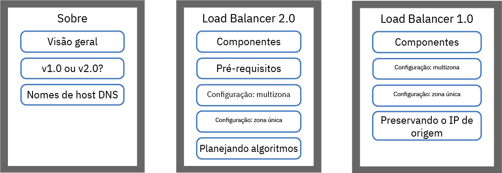
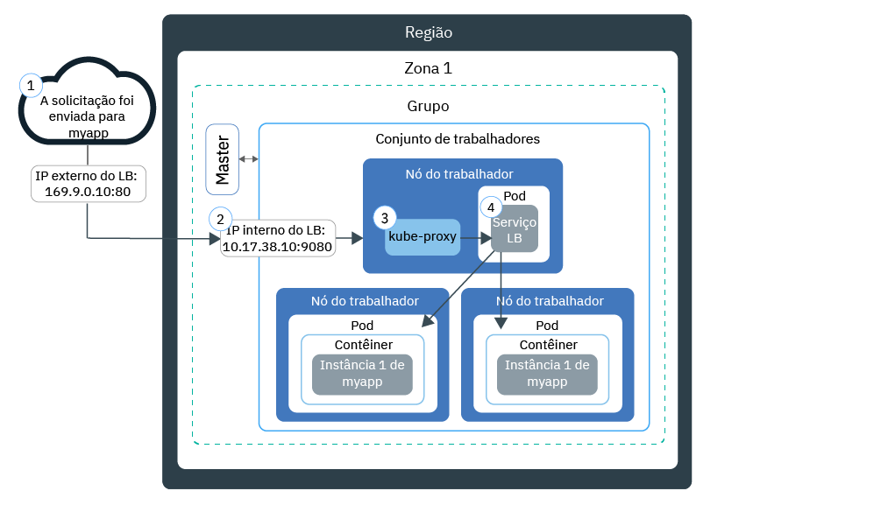
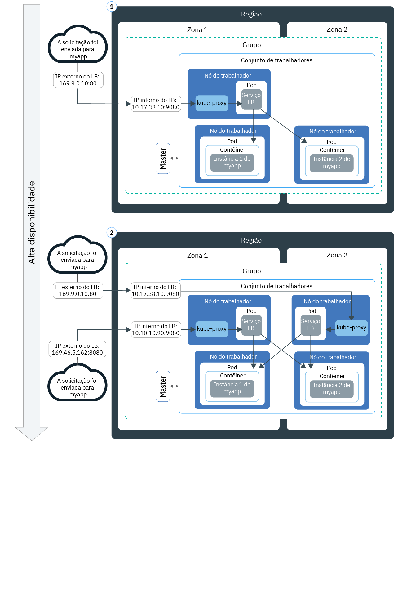
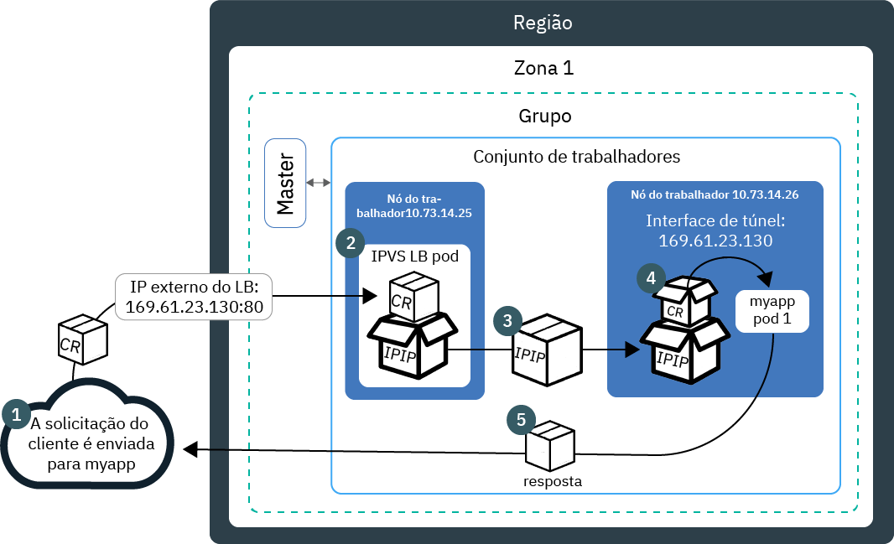
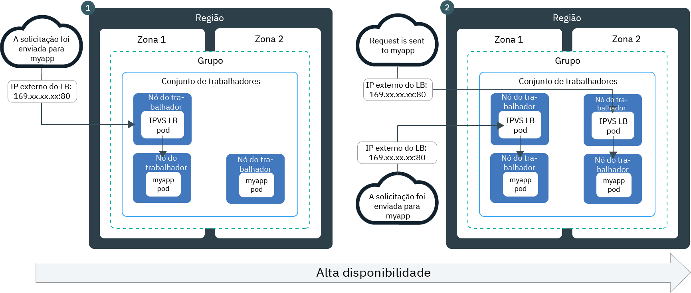

---

copyright:
  years: 2014, 2019
lastupdated: "2019-06-05"

keywords: kubernetes, iks, lb2.0, nlb, health check

subcollection: containers

---

{:new_window: target="_blank"}
{:shortdesc: .shortdesc}
{:screen: .screen}
{:pre: .pre}
{:table: .aria-labeledby="caption"}
{:codeblock: .codeblock}
{:tip: .tip}
{:note: .note}
{:important: .important}
{:deprecated: .deprecated}
{:download: .download}
{:preview: .preview}


# Balanceamento de carga básico e DSR com balanceadores de carga de rede (NLB)
{: #loadbalancer}

Exponha uma porta e use um endereço IP móvel para que um balanceador de carga de rede (NLB) de Camada 4 acesse um aplicativo conteinerizado.
{:shortdesc}

Escolha uma das opções a seguir para iniciar:


<map name="image-map">
    <area target="" alt="Visão geral" title="Visão geral" href="#lb_overview" coords="35,44,175,72" shape="rect">
    <area target="" alt="Comparação de balanceadores de carga da versão 1.0 e 2.0" title="Comparação de balanceadores de carga da versão 1.0 e 2.0" href="#comparison" coords="34,83,173,108" shape="rect">
    <area target="" alt="Registrando um nome de host de balanceador de carga" title="Registrando um nome de host de balanceador de carga" href="#loadbalancer_hostname" coords="33,119,174,146" shape="rect">
    <area target="" alt="v2.0: Componentes e arquitetura (Beta)" title="v2.0: Componentes e arquitetura (Beta)" href="#planning_ipvs" coords="273,45,420,72" shape="rect">
    <area target="" alt="v2.0: Pré-requisitos" title="v2.0: Pré-requisitos" href="#ipvs_provision" coords="277,85,417,108" shape="rect">
    <area target="" alt="v2.0: Configurando um balanceador de carga 2.0 em um cluster de múltiplas zonas" title="v2.0: Configurando um balanceador de carga 2.0 em um cluster de múltiplas zonas" href="#ipvs_multi_zone_config" coords="276,122,417,147" shape="rect">
    <area target="" alt="v2.0: Configurando um balanceador de carga 2.0 em um cluster de zona única" title="v2.0: Configurando um balanceador de carga 2.0 em um cluster de zona única" href="#ipvs_single_zone_config" coords="277,156,419,184" shape="rect">
    <area target="" alt="v2.0: Planejando os algoritmos" title="v2.0: Planejando os algoritmos" href="#scheduling" coords="276,196,419,220" shape="rect">
    <area target="" alt="v1.0: Componentes e arquitetura" title="v1.0: Componentes e arquitetura" href="#v1_planning" coords="519,47,668,74" shape="rect">
    <area target="" alt="v1.0: Configurando um balanceador de carga 1.0 em um cluster multizona" title="v1.0: Configurando um balanceador de carga 1.0 em um cluster multizona" href="#multi_zone_config" coords="520,85,667,110" shape="rect">
    <area target="" alt="v1.0: Configurando um balanceador de carga 1.0 em um cluster de zona única" title="v1.0: Configurando um balanceador de carga 1.0 em um cluster de zona única" href="#lb_config" coords="520,122,667,146" shape="rect">
    <area target="" alt="v1.0: Ativando a preservação de IP de origem" title="v1.0: Ativaando a preservação de IP de origem" href="#node_affinity_tolerations" coords="519,157,667,194" shape="rect">
</map>
</br>

Para começar rapidamente, é possível executar o comando a seguir para criar um balanceador de carga 1.0:
```
kubectl expose deploy my-app --port=80 --target-port=8080 --type=LoadBalancer --name my-lb-svc
```
{: pre}

## Visão geral
{: #lb_overview}

Ao criar um cluster padrão, o {{site.data.keyword.containerlong}} provisiona automaticamente uma sub-rede pública móvel e uma sub-rede privada móvel.
{: shortdesc}

* A sub-rede pública móvel fornece cinco endereços IP utilizáveis. Um endereço IP público móvel é usado pelo [ALB do Ingress público](/docs/containers?topic=containers-ingress) padrão. Os 4 endereços IP públicos móveis restantes podem ser usados para expor aplicativos únicos à Internet, criando serviços de balanceador de carga de rede pública ou NLBs.
* A sub-rede privada móvel fornece cinco endereços IP utilizáveis. Um endereço IP privado móvel é usado pelo [ALB do Ingress privado](/docs/containers?topic=containers-ingress#private_ingress) padrão. Os 4 endereços IP privados móveis restantes podem ser usados para expor aplicativos únicos a uma rede privada, criando serviços de balanceador de carga privado ou NLBs.

Os endereços IP públicos e privados móveis são IPs flutuantes estáticos e não mudam quando um nó do trabalhador é removido. Se o nó do trabalhador no qual o endereço IP do NLB está for removido, um daemon Keepalived que monitora constantemente o IP o moverá automaticamente para outro nó do trabalhador. É possível designar qualquer porta para seu NLB. O NLB atua como o ponto de entrada externo para solicitações recebidas para o aplicativo. Para acessar o NLB por meio da Internet, é possível usar o endereço IP público de seu NLB e a porta designada no formato `<IP_address>:<port>`. Também é possível criar entradas DNS para NLBs registrando os endereços IP do NLB com nomes de host.

Quando você expõe um aplicativo com um serviço NLB, ele é disponibilizado automaticamente por meio do NodePorts do serviço também. Os [NodePorts](/docs/containers?topic=containers-nodeport) são acessíveis em cada endereço IP público e privado de cada nó do trabalhador dentro do cluster. Para bloquear o tráfego para NodePorts enquanto estiver usando um NLB, consulte [Controlando o tráfego de entrada para o balanceador de carga de rede (NLB) ou os serviços NodePort](/docs/containers?topic=containers-network_policies#block_ingress).

<br />


## Comparação do balanceamento de carga básico e DSR nos NLBs da versão 1.0 e 2.0
{: #comparison}

Quando você cria um NLB, é possível escolher um NLB da versão 1.0, que executa o balanceamento de carga básico, ou um NLB da versão 2.0, que executa o balanceamento de carga do direct server return (DSR). Observe que os NLBs da versão 2.0 estão em beta.
{: shortdesc}

**Qual a semelhança entre os NLBs das versões 1.0 e 2.0?**

Os NLBs das versões 1.0 e 2.0 são balanceadores de carga de Camada 4 que permanecem ativos apenas no espaço de kernel do Linux. Ambas as versões são executadas dentro do cluster e usam os recursos do nó do trabalhador. Portanto, a capacidade disponível dos NLBs é sempre dedicada a seu próprio cluster. Além disso, ambas as versões dos NLBs não finalizam a conexão. Em vez disso, eles encaminham conexões para um pod de app.

**Quais as diferenças entre os NLBs das versões 1.0 e 2.0?**

Quando um cliente envia uma solicitação ao seu aplicativo, o NLB roteia pacotes de solicitações para o endereço IP do nó do trabalhador no qual um pod de aplicativo existe. Os NLBs da versão 1.0 usam a conversão de endereço de rede (NAT) para regravar o endereço IP de origem do pacote de solicitações para o IP do nó do trabalhador no qual um pod do balanceador de carga existe. Quando o nó do trabalhador retorna o pacote de resposta do aplicativo, usa esse IP do nó do trabalhador no qual o NLB existe. Em seguida, o NLB deve enviar o pacote de resposta para o cliente. Para evitar que o endereço IP seja reescrito, é possível [ativar a preservação de IP de origem](#node_affinity_tolerations). No entanto, a preservação de IP de origem requer que os pods do balanceador de carga e os pods de app sejam executados no mesmo trabalhador para que a solicitação não tenha que ser encaminhada para outro trabalhador. Deve-se incluir afinidade de nó e tolerâncias nos pods do app. Para obter mais informações sobre o balanceamento de carga básico com NLBs da versão 1.0, consulte [v1.0: componentes e arquitetura do balanceamento de carga básico](#v1_planning).

Ao contrário dos NLBs da versão 1.0, os da versão 2.0 não usam o NAT ao encaminhar solicitações para os pods de aplicativo em outros trabalhadores. Quando um NLB 2.0 roteia uma solicitação do cliente, usa IP sobre IP (IPIP) para encapsular o pacote de solicitações original em outro pacote novo. Esse pacote de IPIP de encapsulamento tem um IP de origem do nó do trabalhador no qual o pod do balanceador de carga está, que permite que o pacote de solicitações original preserve o IP do cliente como seu endereço IP de origem. O nó do trabalhador então usa o retorno de retorno do servidor direto (DSR) para enviar o pacote de resposta do app para o IP do cliente. O pacote de resposta ignora o NLB e é enviado diretamente ao cliente, diminuindo a quantidade de tráfego que deve ser manipulada pelo NLB. Para obter informações adicionais sobre o balanceamento de carga do DSR com NLBs da versão 2.0, consulte [v2.0: componentes e arquitetura do balanceamento de carga do DSR](#planning_ipvs).

<br />


## v1.0: componentes e arquitetura do balanceamento de carga básico
{: #v1_planning}

O balanceador de carga de rede (NLB) 1.0 de TCP/UDP usa Iptables, um recurso de kernel do Linux, para carregar solicitações de balanceamento em pods de um aplicativo.
{: shortdesc}

### Fluxo de tráfego em um cluster de zona única
{: #v1_single}

O diagrama a seguir mostra como um NLB 1.0 direciona a comunicação da Internet para um aplicativo em um cluster de zona única.
{: shortdesc}



1. Uma solicitação para seu aplicativo usa o endereço IP público de seu NLB e a porta designada no nó do trabalhador.

2. A solicitação é encaminhada automaticamente para o endereço IP e a porta do cluster interno do serviço NLB. O endereço IP do cluster interno é acessível somente dentro do cluster.

3. `kube-proxy` roteia para o aplicativo a solicitação para o serviço NLB.

4. A solicitação é encaminhada para o endereço IP privado do pod de app. O endereço IP de origem do pacote de solicitação é mudado para o endereço IP público do nó do trabalhador no qual o pod de app está em execução. Se diversas instâncias de aplicativo forem implementadas no cluster, o NLB roteará as solicitações entre os pods do aplicativo.

### Fluxo de tráfego em um cluster de múltiplas zonas
{: #v1_multi}

O diagrama a seguir mostra como um balanceador de carga de rede (NLB) 1.0 direciona a comunicação da Internet para um aplicativo em um cluster multizona.
{: shortdesc}



Por padrão, cada NLB 1.0 é configurado em apenas uma zona. Para alcançar alta disponibilidade, deve-se implementar um NLB 1.0 em cada zona na qual haja instâncias do aplicativo. As solicitações são manipuladas pelos NLBs em diversas zonas em um ciclo round-robin. Além disso, cada NLB roteia solicitações para as instâncias do aplicativo em sua própria zona e em outras zonas.

<br />


## v1.0: configurando um NLB 1.0 em um cluster multizona
{: #multi_zone_config}

** Antes de iniciar **:
* Para criar balanceadores de carga de rede (NLBs) pública em diversas zonas, pelo menos uma VLAN pública deve ter sub-redes móveis disponíveis em cada zona. Para criar NLBs privados em múltiplas zonas, pelo menos uma VLAN privada deverá ter sub-redes portáteis disponíveis em cada zona. É possível incluir sub-redes seguindo as etapas em [Configurando sub-redes para clusters](/docs/containers?topic=containers-subnets).
* Se você restringir o tráfego de rede para nós do trabalhador de borda, assegure-se de que pelo menos 2 [nós do trabalhador de borda](/docs/containers?topic=containers-edge#edge) estejam ativados em cada zona para que os NLBs sejam implementados uniformemente.
* Ative a [ampliação de VLAN](/docs/infrastructure/vlans?topic=vlans-vlan-spanning#vlan-spanning) para sua conta de infraestrutura do IBM Cloud (SoftLayer) para que os nós do trabalhador possam se comunicar entre si na rede privada. Para executar essa ação, você precisa da [permissão de infraestrutura](/docs/containers?topic=containers-users#infra_access) **Rede > Gerenciar a rede VLAN Spanning** ou é possível solicitar ao proprietário da conta para ativá-la. Para verificar se o VLAN Spanning já está ativado, use o [comando](/docs/containers?topic=containers-cli-plugin-kubernetes-service-cli#cs_vlan_spanning_get) `ibmcloud ks vlan-spanning-get --region<region>`.
* Assegure-se de que você tenha a [função de **Gravador** ou **Gerenciador** do serviço {{site.data.keyword.Bluemix_notm}} IAM](/docs/containers?topic=containers-users#platform) para o namespace `default`.


Para configurar um serviço NLB 1.0 em um cluster multizona:
1.  [Implemente o seu app no cluster](/docs/containers?topic=containers-app#app_cli). Certifique-se de incluir um rótulo à sua implementação na seção de metadados de seu arquivo de configuração. Esse rótulo é necessário para identificar todos os pods nos quais seu app está sendo executado para que eles possam ser incluídos no balanceamento de carga.

2.  Crie um serviço de balanceador de carga para o app que você deseja expor para a Internet pública ou uma rede privada.
  1. Crie um arquivo de configuração de serviço que seja chamado, por exemplo, de `myloadbalancer.yaml`.
  2. Defina um serviço de balanceador de carga para o app que você deseja expor. É possível especificar uma zona, uma VLAN e um endereço IP.

      ```
      apiVersion: v1
      kind: Service
      metadata:
        name: myloadbalancer
        annotations:
          service.kubernetes.io/ibm-load-balancer-cloud-provider-ip-type: <public_or_private>
          service.kubernetes.io/ibm-load-balancer-cloud-provider-zone: "<zone>"
          service.kubernetes.io/ibm-load-balancer-cloud-provider-vlan: "<vlan_id>"
      spec:
        type: LoadBalancer
        selector:
          <selector_key>: <selector_value>
        ports:
         - protocol: TCP
             port: 8080
          loadBalancerIP: <IP_address>
      ```
      {: codeblock}

      <table>
      <caption>Entendendo os componentes de arquivo YAML</caption>
      <thead>
      <th colspan=2> entendendo os componentes de arquivo do YAML</th>
      </thead>
      <tbody>
      <tr>
        <td><code>service.kubernetes.io/ibm-load-balancer-cloud-provider-ip-type:</code>
        <td>Anotação para especificar um balanceador de carga <code>private</code> ou <code>public</code>.</td>
      </tr>
      <tr>
        <td><code>service.kubernetes.io/ibm-load-balancer-cloud-provider-zone:</code>
        <td>Anotação para especificar a zona na qual o serviço de balanceador de carga é implementado. Para ver zonas, execute <code>ibmcloud ks zones</code>.</td>
      </tr>
      <tr>
        <td>`service.kubernetes.io/ibm-load-balancer-cloud-provider-vlan:`
        <td>Anotação para especificar uma VLAN na qual o serviço de balanceador de carga é implementado. Para ver VLANs, execute <code>ibmcloud ks vlans --zone <zone></code>.</td>
      </tr>
      <tr>
        <td><code>seletor</code></td>
        <td>A chave de rótulo (<em>&lt;selector_key&gt;</em>) e o valor (<em>&lt;selector_value&gt;</em>) que você usou na seção <code>spec.template.metadata.labels</code> de seu YAML de implementação de app.</td>
      </tr>
      <tr>
        <td><code>port</code></td>
        <td>A porta na qual o serviço atende.</td>
      </tr>
      <tr>
        <td><code>loadBalancerIP</code></td>
        <td>Opcional: para criar um balanceador de carga privado ou para usar um endereço IP móvel específico para um balanceador de carga público, especifique o endereço IP que você deseja usar. O endereço IP deve estar na VLAN e na zona que você especificar nas anotações. Se você não especificar um endereço IP:<ul><li>Se o seu cluster estiver em uma VLAN pública, um endereço IP móvel público será usado. A maioria dos clusters está em uma VLAN pública.</li><li>Se seu cluster estiver somente em uma VLAN privada, um endereço IP privado móvel será usado.</li></ul></td>
      </tr>
      </tbody></table>

      Exemplo de arquivo de configuração para criar um serviço NLB 1.0 privado que usa um endereço IP especificado na VLAN privada `2234945` em `dal12`:

      ```
      apiVersion: v1
      kind: Service
      metadata:
        name: myloadbalancer
        annotations:
          service.kubernetes.io/ibm-load-balancer-cloud-provider-ip-type: private
          service.kubernetes.io/ibm-load-balancer-cloud-provider-zone: "dal12"
          service.kubernetes.io/ibm-load-balancer-cloud-provider-vlan: "2234945"
      spec:
        type: LoadBalancer
        selector:
          app: nginx
        ports:
         - protocol: TCP port: 8080 loadBalancerIP: 172.21.xxx.xxx
      ```
      {: codeblock}

  3. Opcional: torne o seu serviço do NLB disponível apenas para um intervalo limitado de endereços IP, especificando os IPs no campo `spec.loadBalancerSourceRanges`. `loadBalancerSourceRanges` é implementado por `kube-proxy` em seu cluster por meio de regras de Iptables nos nós do trabalhador. Para obter mais informações, consulte [a documentação do Kubernetes ](https://kubernetes.io/docs/tasks/access-application-cluster/configure-cloud-provider-firewall/).

  4. Crie o serviço em seu cluster.

      ```
      kubectl apply -f myloadbalancer.yaml
      ```
      {: pre}

3. Verifique se o serviço do NLB foi criado com êxito. Pode levar alguns minutos para que o serviço seja criado e para que o app fique disponível.

    ```
    Kubectl describe myloadbalancer de serviço
    ```
    {: pre}

    Exemplo de saída da CLI:

    ```
    Name:                   myloadbalancer
    Namespace:              default
    Labels:                 <none>
    Selector:               app=liberty
    Type:                   LoadBalancer
    Zone:                   dal10
    IP:                     172.21.xxx.xxx
    LoadBalancer Ingress:   169.xx.xxx.xxx
    Port:                   <unset> 8080/TCP
    NodePort:               <unset> 32040/TCP
    Endpoints:              172.30.xxx.xxx:8080
    Session Affinity:       None
    Events:
      FirstSeen	LastSeen	Count	From			SubObjectPath	Type	 Reason			          Message
      ---------	--------	-----	----			-------------	----	 ------			          -------
      10s		 10s		 1	 {service-controller }	 Normal CreatingLoadBalancer	Creating load balancer 10s		 10s		 1	 {service-controller }		Normal CreatedLoadBalancer	Created load balancer
    ```
    {: screen}

    O endereço IP do **LoadBalancer Ingress** é o endereço IP móvel que foi designado para o seu serviço do NLB.

4.  Se você criou um NLB público, acesse o seu app por meio da Internet.
    1.  Abra seu navegador da web preferencial.
    2.  Insira o endereço IP público móvel do NLB e da porta.

        ```
        Http://169.xx.xxx.xxx:8080
        ```
        {: codeblock}    

5. Repita as etapas de 2 a 4 para incluir um NLB da versão 1.0 em cada zona.    

6. Se você escolher [ativar a preservação de IP de origem para um NLB 1.0](#node_affinity_tolerations), assegure-se de que os pods do app sejam planejados nos nós do trabalhador de borda [incluindo a afinidade do nó de borda em pods do app](#lb_edge_nodes). Os pods do app devem ser planejados nos nós de borda para obter solicitações recebidas.

7. Opcional: um serviço do balanceador de carga também disponibiliza o seu app sobre as NodePorts do serviço. [NodePorts](/docs/containers?topic=containers-nodeport) são acessíveis em cada endereço IP público e privado para cada nó dentro do cluster. Para bloquear o tráfego para NodePorts enquanto você estiver usando um serviço do NLB, consulte [Controlando o tráfego de entrada para os serviços do balanceador de carga de rede (NLB) ou do NodePort](/docs/containers?topic=containers-network_policies#block_ingress).

Em seguida, é possível [registrar um nome do host do NLB](#loadbalancer_hostname).

<br />


## v1.0: configurando um NLB 1.0 em um cluster de zona única
{: #lb_config}

** Antes de iniciar **:
* Deve-se ter um endereço IP público ou privado móvel disponível para designar ao serviço de balanceador de carga de rede (NLB). Para obter mais informações, consulte [Configurando sub-redes para clusters](/docs/containers?topic=containers-subnets).
* Assegure-se de que você tenha a [função de **Gravador** ou **Gerenciador** do serviço {{site.data.keyword.Bluemix_notm}} IAM](/docs/containers?topic=containers-users#platform) para o namespace `default`.

Para criar um serviço NLB 1.0 em um cluster de zona única:

1.  [Implemente o seu app no cluster](/docs/containers?topic=containers-app#app_cli). Certifique-se de incluir um rótulo à sua implementação na seção de metadados de seu arquivo de configuração. Esse rótulo é necessário para identificar todos os pods nos quais o seu app está em execução para que eles possam ser incluídos no balanceamento de carga.
2.  Crie um serviço de balanceador de carga para o app que você deseja expor para a Internet pública ou uma rede privada.
    1.  Crie um arquivo de configuração de serviço que seja chamado, por exemplo, de `myloadbalancer.yaml`.

    2.  Defina um serviço de balanceador de carga para o app que você deseja expor.
        ```
        apiVersion: v1
        kind: Service
        metadata:
          name: myloadbalancer
          annotations:
            service.kubernetes.io/ibm-load-balancer-cloud-provider-ip-type: <public_or_private>
            service.kubernetes.io/ibm-load-balancer-cloud-provider-vlan: "<vlan_id>"
        spec:
          type: LoadBalancer
          selector:
            <selector_key>: <selector_value>
          ports:
           - protocol: TCP port: 8080 loadBalancerIP: <IP_address> externalTrafficPolicy: Local
        ```
        {: codeblock}

        <table>
        <caption>Entendendo os componentes de arquivo YAML</caption>
        <thead>
        <th colspan=2> entendendo os componentes de arquivo do YAML</th>
        </thead>
        <tbody>
        <tr>
          <td>`service.kubernetes.io/ibm-load-balancer-cloud-provider-ip-type:`
          <td>Anotação para especificar um balanceador de carga <code>private</code> ou <code>public</code>.</td>
        </tr>
        <tr>
          <td>`service.kubernetes.io/ibm-load-balancer-cloud-provider-vlan:`
        <td>Anotação para especificar uma VLAN na qual o serviço de balanceador de carga é implementado. Para ver VLANs, execute <code>ibmcloud ks vlans --zone <zone></code>.</td>
        </tr>
        <tr>
          <td><code>seletor</code></td>
          <td>A chave de rótulo (<em>&lt;selector_key&gt;</em>) e o valor (<em>&lt;selector_value&gt;</em>) que você usou na seção <code>spec.template.metadata.labels</code> de seu YAML de implementação de app.</td>
        </tr>
        <tr>
          <td><code>port</code></td>
          <td>A porta na qual o serviço atende.</td>
        </tr>
        <tr>
          <td><code>loadBalancerIP</code></td>
          <td>Opcional: para criar um balanceador de carga privado ou para usar um endereço IP móvel específico para um balanceador de carga público, especifique o endereço IP que você deseja usar. O endereço IP deve estar na VLAN que você especifica nas anotações. Se você não especificar um endereço IP:<ul><li>Se o seu cluster estiver em uma VLAN pública, um endereço IP móvel público será usado. A maioria dos clusters está em uma VLAN pública.</li><li>Se seu cluster estiver somente em uma VLAN privada, um endereço IP privado móvel será usado.</li></ul></td>
        </tr>
        </tbody></table>

        Exemplo de arquivo de configuração para criar um serviço NLB 1.0 privado que usa um endereço IP especificado na VLAN privada `2234945`:

        ```
        apiVersion: v1
        kind: Service
        metadata:
          name: myloadbalancer
          annotations:
            service.kubernetes.io/ibm-load-balancer-cloud-provider-ip-type: private
            service.kubernetes.io/ibm-load-balancer-cloud-provider-vlan: "2234945"
        spec:
          type: LoadBalancer
          selector:
            app: nginx
          ports:
           - protocol: TCP port: 8080 loadBalancerIP: 172.21.xxx.xxx
        ```
        {: codeblock}

    3. Opcional: torne o seu serviço do NLB disponível apenas para um intervalo limitado de endereços IP, especificando os IPs no campo `spec.loadBalancerSourceRanges`. `loadBalancerSourceRanges` é implementado por `kube-proxy` em seu cluster por meio de regras de Iptables nos nós do trabalhador. Para obter mais informações, consulte [a documentação do Kubernetes ](https://kubernetes.io/docs/tasks/access-application-cluster/configure-cloud-provider-firewall/).

    4.  Crie o serviço em seu cluster.

        ```
        kubectl apply -f myloadbalancer.yaml
        ```
        {: pre}

3.  Verifique se o serviço do NLB foi criado com êxito. Pode levar alguns minutos para que o serviço seja criado e para que o app fique disponível.

    ```
    Kubectl describe myloadbalancer de serviço
    ```
    {: pre}

    Exemplo de saída da CLI:

    ```
    Name: myloadbalancer Namespace: default Labels: <none> Selector: app=liberty Type: LoadBalancer Location: dal10 IP: 172.21.xxx.xxx LoadBalancer Ingress: 169.xx.xxx.xxx Port: <unset> 8080/TCP NodePort: <unset> 32040/TCP Endpoints: 172.30.xxx.xxx:8080 Session Affinity: None Events: FirstSeen	LastSeen	Count	From			SubObjectPath	Type	 Reason			 Message
      ---------	--------	-----	----			-------------	----	 ------			          -------
      10s		 10s		 1	 {service-controller }	 Normal CreatingLoadBalancer	Creating load balancer 10s		 10s		 1	 {service-controller }		Normal CreatedLoadBalancer	Created load balancer
    ```
    {: screen}

    O endereço IP do **LoadBalancer Ingress** é o endereço IP móvel que foi designado para o seu serviço do NLB.

4.  Se você criou um NLB público, acesse o seu app por meio da Internet.
    1.  Abra seu navegador da web preferencial.
    2.  Insira o endereço IP público móvel do NLB e da porta.

        ```
        Http://169.xx.xxx.xxx:8080
        ```
        {: codeblock}

5. Se você escolher [ativar a preservação de IP de origem para um NLB 1.0](#node_affinity_tolerations), assegure-se de que os pods do app sejam planejados nos nós do trabalhador de borda [incluindo a afinidade do nó de borda em pods do app](#lb_edge_nodes). Os pods do app devem ser planejados nos nós de borda para obter solicitações recebidas.

6. Opcional: um serviço do balanceador de carga também disponibiliza o seu app sobre as NodePorts do serviço. [NodePorts](/docs/containers?topic=containers-nodeport) são acessíveis em cada endereço IP público e privado para cada nó dentro do cluster. Para bloquear o tráfego para NodePorts enquanto você estiver usando um serviço do NLB, consulte [Controlando o tráfego de entrada para os serviços do balanceador de carga de rede (NLB) ou do NodePort](/docs/containers?topic=containers-network_policies#block_ingress).

Em seguida, é possível [registrar um nome do host do NLB](#loadbalancer_hostname).

<br />


## v1.0: Ativando a preservação de IP de origem
{: #node_affinity_tolerations}

Esse recurso destina-se somente a balanceadores de carga de rede (NLBs) da versão 1.0. O endereço IP de origem de solicitações do cliente é preservado por padrão em NLBs da versão 2.0.
{: note}

Quando uma solicitação do cliente para seu app é enviada para seu cluster, um pod de serviço de balanceador de carga recebe a solicitação. Se não existir nenhum pod de aplicativo no mesmo nó do trabalhador que o pod de serviço do balanceador de carga, o NLB encaminhará a solicitação para um pod de aplicativo em um nó do trabalhador diferente. O endereço IP de origem do pacote é mudado para o endereço IP público do nó do trabalhador no qual o pod de serviço de balanceador de carga está em execução.
{: shortdesc}

Para preservar o endereço IP de origem original da solicitação do cliente, é possível [ativar o IP de origem ](https://kubernetes.io/docs/tasks/access-application-cluster/create-external-load-balancer/#preserving-the-client-source-ip) para os serviços de balanceador de carga. A conexão TCP continua todo o caminho para os pods de app para que o app possa ver o endereço IP de origem real do inicializador. Preservar o IP do cliente é útil, por exemplo, quando os servidores de app precisam aplicar as políticas de segurança e de controle de acesso.

Após a ativação do IP de origem, os pods do serviço de balanceador de carga devem encaminhar solicitações para pods do app que são implementados no mesmo nó do trabalhador somente. Geralmente, os pods de serviço de balanceador de carga também são implementados para os nós do trabalhador nos quais os pods de app são implementados. No entanto, existem algumas situações em que os pods do balanceador de carga e os pods do app podem não ser planejados no mesmo nó do trabalhador:

* Você tem nós de borda que estão contaminados para que somente pods do serviço de balanceador de carga possam ser implementados neles. Pods do app não podem ser implementados nesses nós.
* O seu cluster está conectado a múltiplas VLANs públicas ou privadas e os pods de seu app podem ser implementados em nós do trabalhador conectados apenas a uma VLAN. Os pods de serviço do balanceador de carga podem não ser implementados nesses nós do trabalhador porque o endereço IP do NLB está conectado a uma VLAN diferente do que os nós do trabalhador.

Para forçar seu app a ser implementado em nós do trabalhador específicos nos quais os pods de serviço de balanceador de carga também podem ser implementados, deve-se incluir regras de afinidade e tolerâncias em sua implementação do app.

### Incluindo regras de afinidade e tolerâncias do nó de borda
{: #lb_edge_nodes}

Quando você [rotula os nós do trabalhador como nós de borda](/docs/containers?topic=containers-edge#edge_nodes) e também [contamina os nós de borda](/docs/containers?topic=containers-edge#edge_workloads), os pods do serviço de balanceador de carga são implementados somente nesses nós de borda e os pods de app não podem ser implementados nos nós de borda. Quando o IP de origem está ativado para o serviço NLB, os pods do balanceador de carga nos nós de borda não podem encaminhar solicitações recebidas para seus pods de aplicativo em outros nós do trabalhador.
{:shortdesc}

Para forçar a implementação dos pods de app nos nós de borda, inclua uma [regra de afinidade ](https://kubernetes.io/docs/concepts/configuration/assign-pod-node/#node-affinity-beta-feature) e uma [tolerância ](https://kubernetes.io/docs/concepts/configuration/taint-and-toleration/#concepts) do nó de borda na implementação do app.

Exemplo de arquivo YAML de implementação com afinidade de nó de borda e tolerância do nó de borda:

```
apiVersion: apps/v1
kind: Deployment
metadata:
  name: with-node-affinity
spec:
  selector:
    matchLabels:
      <label_name>: <label_value>
  template:
    spec:
      affinity:
        nodeAffinity:
          requiredDuringSchedulingIgnoredDuringExecution:
            nodeSelectorTerms:
            - matchExpressions:
              - key: dedicated
                operator: In
                values:
                - edge
      tolerations:
        - key: dedicated
          value: edge
...
```
{: codeblock}

As seções **affinity** e **tolerations** têm `dedicated` como o `key` e `edge` como o `value`.

### Incluindo regras de afinidade para múltiplas VLANs públicas ou privadas
{: #edge_nodes_multiple_vlans}

Quando o cluster está conectado a múltiplas VLANs públicas ou privadas, os pods do app podem ser implementados nos nós do trabalhador que são conectados apenas a uma VLAN. Se o endereço IP do NLB estiver conectado a uma VLAN diferente do que esses nós do trabalhador, os pods do serviço do balanceador de carga não serão implementados nesses nós do trabalhador.
{:shortdesc}

Quando o IP de origem estiver ativado, planeje os pods de aplicativo em nós do trabalhador que estejam na mesma VLAN que o endereço IP do NLB incluindo uma regra de afinidade na implementação do app.

Antes de iniciar: [Efetue login em sua conta. Se aplicável, direcione o grupo de recursos apropriado. Configure o contexto para o seu cluster.](/docs/containers?topic=containers-cs_cli_install#cs_cli_configure)

1. Obtenha o endereço IP do serviço NLB. Procure o endereço IP no campo **Ingress do LoadBalancer**.
    ```
    kubectl describe service <loadbalancer_service_name>
    ```
    {: pre}

2. Recupere o ID da VLAN à qual seu serviço NLB está conectado.

    1. Liste as VLANs públicas móveis para seu cluster.
        ```
        ibmcloud ks cluster-get -- cluster < cluster_name_or_ID> -- showResources
        ```
        {: pre}

        Saída de exemplo:
        ```
        ...

        Subnet VLANs
        VLAN ID   Subnet CIDR       Public   User-managed
        2234947   10.xxx.xx.xxx/29  false    false
        2234945   169.36.5.xxx/29   true     false
        ```
        {: screen}

    2. Na saída em **VLANs de sub-rede**, procure o CIDR de sub-rede que corresponda ao endereço IP do NLB recuperado anteriormente e anote o ID da VLAN.

        Por exemplo, se o endereço IP do serviço NLB for `169.36.5.xxx`, a sub-rede correspondente na saída de exemplo da etapa anterior será `169.36.5.xxx/29`. O ID da VLAN ao qual a sub-rede está conectada é `2234945`.

3. [Inclua uma regra de afinidade ](https://kubernetes.io/docs/concepts/configuration/assign-pod-node/#node-affinity-beta-feature) na implementação do app para o ID da VLAN que você anotou na etapa anterior.

    Por exemplo, se você tiver múltiplas VLANs, mas quiser que os pods de seu app sejam implementados nos nós do trabalhador somente na VLAN pública `2234945`:

    ```
    apiVersion: apps/v1
    kind: Deployment
    metadata:
      name: with-node-affinity
    spec:
      selector:
        matchLabels:
          <label_name>: <label_value>
      template:
        spec:
          affinity:
            nodeAffinity:
              requiredDuringSchedulingIgnoredDuringExecution:
                nodeSelectorTerms:
                - matchExpressions:
                  - key: publicVLAN
                    operator: In
                    values:
                    - "2234945"
    ...
    ```
    {: codeblock}

    No YAML de exemplo, a seção **affinity** tem `publicVLAN` como `key` e `"2234945"` como `value`.

4. Aplique o arquivo de configuração de implementação atualizado.
    ```
    Kubectl apply -f com-node-affinity.yaml
    ```
    {: pre}

5. Verifique se os pods do app implementados nos nós do trabalhador estão conectados à VLAN designada.

    1. Liste os pods em seu cluster. Substitua `<selector>` pelo rótulo usado para o aplicativo.
        ```
        kubectl get pods -o wide app=<selector>
        ```
        {: pre}

        Saída de exemplo:
        ```
        NAME                   READY     STATUS              RESTARTS   AGE       IP               NODE
        cf-py-d7b7d94db-vp8pq  1/1       Running             0          15d       172.30.xxx.xxx   10.176.48.78
        ```
        {: screen}

    2. Na saída, identifique um pod para seu app. Observe o ID de **NÓ** do nó do trabalhador em que o pod está.

        Na saída de exemplo da etapa anterior, o pod de app `cf-py-d7b7d94db-vp8pq` está no nó do trabalhador `10.176.48.78`.

    3. Liste os detalhes para o nó do trabalhador.

        ```
        kubectl describe node <worker_node_ID>
        ```
        {: pre}

        Saída de exemplo:

        ```
        Name:                   10.xxx.xx.xxx
        Role:
        Labels:                 arch=amd64
                                beta.kubernetes.io/arch=amd64
                                beta.kubernetes.io/os=linux
                                failure-domain.beta.kubernetes.io/region=us-south
                                failure-domain.beta.kubernetes.io/zone=dal10
                                ibm-cloud.kubernetes.io/encrypted-docker-data=true
                                kubernetes.io/hostname=10.xxx.xx.xxx
                                privateVLAN=2234945
                                publicVLAN=2234967
        ...
        ```
        {: screen}

    4. Na seção **Rótulos** da saída, verifique se a VLAN pública ou privada é a VLAN que você designou nas etapas anteriores.

<br />


## v2.0: Componentes e Arquitetura (beta)
{: #planning_ipvs}

Os recursos do balanceador de carga de rede (NLB) 2.0 estão em beta. Para usar um NLB 2.0, deve-se [atualizar os nós principal e do trabalhador do cluster](/docs/containers?topic=containers-update) para o Kubernetes versão 1.12 ou mais recente.
{: note}

O NLB 2.0 é um balanceador de carga de Camada 4 que usa o IP Virtual Server (IPVS) do kernel do Linux. O NLB 2.0 suporta TCP e UDP, é executado na frente de diversos nós do trabalhador e usa o tunelamento IP sobre IP (IPIP) para distribuir o tráfego que chega a um único endereço IP do NLB em todos esses nós do trabalhador.

Deseja mais detalhes sobre os padrões de implementação de balanceamento de carga que estão disponíveis no {{site.data.keyword.containerlong_notm}}? Verifiqe esta [postagem do blog](https://www.ibm.com/blogs/bluemix/2018/10/ibm-cloud-kubernetes-service-deployment-patterns-for-maximizing-throughput-and-availability/).
{: tip}

### Fluxo de tráfego em um cluster de zona única
{: #ipvs_single}

O diagrama a seguir mostra como um NLB 2.0 direciona a comunicação da Internet para um aplicativo em um cluster de zona única.
{: shortdesc}



1. Uma solicitação do cliente para seu aplicativo usa o endereço IP público de seu NLB e a porta designada no nó do trabalhador. Neste exemplo, o NLB tem um endereço IP virtual de 169.61.23.130, que está atualmente no trabalhador 10.73.14.25.

2. O NLB encapsula o pacote de solicitações do cliente (rotulado como "CR" na imagem) dentro de um pacote IPIP (rotulado como "IPIP"). O pacote de solicitação do cliente retém o IP do cliente como seu endereço IP de origem. O pacote de encapsulamento do IPIP usa o IP 10.73.14.25 IP como seu endereço IP de origem.

3. O NLB roteia o pacote IPIP para um trabalhador no qual um pod de aplicativo está, 10.73.14.26. Se diversas instâncias de aplicativo forem implementadas no cluster, o NLB roteará as solicitações entre os trabalhadores nos quais os pods do aplicativo estão implementados.

4. O trabalhador 10.73.14.26 descompacta o pacote de encapsulamento do IPIP e, em seguida, descompacta o pacote de solicitações do cliente. O pacote de solicitações do cliente é encaminhado para o pod de app nesse nó do trabalhador.

5. O trabalhador 10.73.14.26 usa o endereço IP de origem do pacote de solicitações original, o IP do cliente, para retornar o pacote de resposta do pod do app diretamente para o cliente.

### Fluxo de tráfego em um cluster de múltiplas zonas
{: #ipvs_multi}

O fluxo de tráfego por meio de um cluster de várias zonas segue o mesmo caminho que o [tráfego por meio de um cluster de zona única](#ipvs_single). Em um cluster multizona, o NLB roteia solicitações para as instâncias do aplicativo em sua própria zona e em outras zonas. O diagrama a seguir mostra como os NLBs da versão 2.0 direcionam o tráfego da Internet em cada zona para um aplicativo em um cluster multizona.
{: shortdesc}



Por padrão, cada NLB versão 2.0 é configurado em apenas uma zona. É possível obter maior disponibilidade implementando um NLB na versão 2.0 em cada zona na qual há instâncias de aplicativo.

<br />


## v2.0: Pré-requisitos
{: #ipvs_provision}

Não é possível atualizar um NLB existente da versão 1.0 para a 2.0. Deve-se criar um novo NLB 2.0. Observe que é possível executar os NLBs da versão 1.0 e 2.0 simultaneamente em um cluster.
{: shortdesc}

Antes de criar um NLB 2.0, deve-se concluir as etapas de pré-requisito a seguir.

1. [Atualize os nós do cluster mestre e do trabalhador](/docs/containers?topic=containers-update) para o Kubernetes versão 1.12 ou mais recente.

2. Para permitir que seu NLB 2.0 encaminhe solicitações para os pods de app em múltiplas zonas, abra um caso de suporte para solicitar a agregação de capacidade para suas VLANs. Essa definição de configuração não causa interrupções de rede ou indisponibilidades.
    1. Efetue login no  [ console do {{site.data.keyword.Bluemix_notm}}  ](https://cloud.ibm.com/).
    2. Na barra de menus, clique em **Suporte**, clique na guia **Gerenciar casos** e clique em **Criar novo caso**.
    3. Nos campos de caso, insira o seguinte:
       * Para o tipo de suporte, selecione  ** Técnico **.
       * Para categoria, selecione  ** VLAN Spanning **.
       * Para o assunto, insira **Pergunta de rede de VLAN pública.**
    4. Inclua as informações a seguir na descrição: "Configure a rede para permitir a agregação de capacidade nas VLANs públicas associadas à minha conta. O chamado de referência para essa solicitação é: https://control.softlayer.com/support/tickets/63859145". Observe que, se você deseja permitir a agregação de capacidade em VLANs específicas, como as VLANs públicas para somente um cluster, é possível especificar esses IDs da VLAN na descrição.
    5. Clique em **Enviar**.

3. Ative uma [Virtual Router Function (VRF)](/docs/infrastructure/direct-link?topic=direct-link-overview-of-virtual-routing-and-forwarding-vrf-on-ibm-cloud#overview-of-virtual-routing-and-forwarding-vrf-on-ibm-cloud) para sua conta da infraestrutura do IBM Cloud (SoftLayer). Para ativar o VRF, [entre em contato com o representante de conta da infraestrutura do IBM Cloud (SoftLayer)](/docs/infrastructure/direct-link?topic=direct-link-overview-of-virtual-routing-and-forwarding-vrf-on-ibm-cloud#how-you-can-initiate-the-conversion). Se não for possível ou você não desejar ativar o VRF, ative o [VLAN Spanning](/docs/infrastructure/vlans?topic=vlans-vlan-spanning#vlan-spanning). Quando um VRF ou um VLAN Spanning está ativado, o NLB 2.0 pode rotear pacotes para diversas sub-redes na conta.

4. Se você usar as [políticas de rede pré-DNAT do Calico](/docs/containers?topic=containers-network_policies#block_ingress) para gerenciar o tráfego para o endereço IP de um NLB 2.0, deverá incluir os campos `applyOnForward: true` e `doNotTrack: true` e remover o `preDNAT: true` da seção `spec` nas políticas. `applyOnForward: true` assegura que a política do Calico seja aplicada ao tráfego conforme ele é encapsulado e encaminhado. `doNotTrack: true` assegura que os nós do trabalhador possam usar o DSR para retornar um pacote de resposta diretamente para o cliente sem precisar que a conexão seja rastreada. Por exemplo, se você usar uma política do Calico para incluir na lista de desbloqueio apenas o tráfego de endereços IP específicos para o endereço IP do seu NLB, a política será semelhante à seguinte:
    ```
    apiVersion: projectcalico.org/v3 kind: GlobalNetworkPolicy metadata: name: whitelist spec: applyOnForward: true doNotTrack: true ingress:
      - action: Allow
        destination:
          nets:
          - <loadbalancer_IP>/32 portas:
          - 80 protocol: TCP source: nets:
          - <client_address>/32 selector: ibm.role=='worker_public' order: 500 types:
      - Entrada
    ```
    {: screen}

Em seguida, será possível seguir as etapas em [Configurando um NLB 2.0 em um cluster multizona](#ipvs_multi_zone_config) ou [em um cluster de zona única](#ipvs_single_zone_config).

<br />


## v2.0: configurando um NLB 2.0 em um cluster multizona
{: #ipvs_multi_zone_config}

** Antes de iniciar **:

* **Importante**: conclua os [pré-requisitos do NLB 2.0](#ipvs_provision).
* Para criar NLBs públicos em diversas zonas, pelo menos uma VLAN pública deve ter sub-redes móveis disponíveis em cada zona. Para criar NLBs privados em múltiplas zonas, pelo menos uma VLAN privada deverá ter sub-redes portáteis disponíveis em cada zona. É possível incluir sub-redes seguindo as etapas em [Configurando sub-redes para clusters](/docs/containers?topic=containers-subnets).
* Se você restringir o tráfego de rede para nós do trabalhador de borda, assegure-se de que pelo menos 2 [nós do trabalhador de borda](/docs/containers?topic=containers-edge#edge) estejam ativados em cada zona para que os NLBs sejam implementados uniformemente.
* Assegure-se de que você tenha a [função de **Gravador** ou **Gerenciador** do serviço {{site.data.keyword.Bluemix_notm}} IAM](/docs/containers?topic=containers-users#platform) para o namespace `default`.


Para configurar um NLB 2.0 em um cluster multizona:
1.  [Implemente o seu app no cluster](/docs/containers?topic=containers-app#app_cli). Certifique-se de incluir um rótulo à sua implementação na seção de metadados de seu arquivo de configuração. Esse rótulo é necessário para identificar todos os pods nos quais seu app está sendo executado para que eles possam ser incluídos no balanceamento de carga.

2.  Crie um serviço de balanceador de carga para o app que você deseja expor para a Internet pública ou uma rede privada.
  1. Crie um arquivo de configuração de serviço que seja chamado, por exemplo, de `myloadbalancer.yaml`.
  2. Defina um serviço de balanceador de carga para o app que você deseja expor. É possível especificar uma zona, uma VLAN e um endereço IP.

      ```
      apiVersion: v1
      kind: Service
      metadata:
        name: myloadbalancer
        annotations:
          service.kubernetes.io/ibm-load-balancer-cloud-provider-ip-type: <public_or_private>
          service.kubernetes.io/ibm-load-balancer-cloud-provider-zone: "<zone>"
          service.kubernetes.io/ibm-load-balancer-cloud-provider-vlan: "<vlan_id>"
          service.kubernetes.io/ibm-load-balancer-cloud-provider-enable-features: "ipvs"
          service.kubernetes.io/ibm-load-balancer-cloud-provider-scheduler: "<algorithm>"
      spec:
        type: LoadBalancer
        selector:
          <selector_key>: <selector_value>
        ports:
         - protocol: TCP port: 8080 loadBalancerIP: <IP_address> externalTrafficPolicy: Local
      ```
      {: codeblock}

      <table>
      <caption>Entendendo os componentes de arquivo YAML</caption>
      <thead>
      <th colspan=2> entendendo os componentes de arquivo do YAML</th>
      </thead>
      <tbody>
      <tr>
        <td><code>service.kubernetes.io/ibm-load-balancer-cloud-provider-ip-type:</code>
        <td>Anotação para especificar um balanceador de carga <code>private</code> ou <code>public</code>.</td>
      </tr>
      <tr>
        <td><code>service.kubernetes.io/ibm-load-balancer-cloud-provider-zone:</code>
        <td>Anotação para especificar a zona na qual o serviço de balanceador de carga é implementado. Para ver zonas, execute <code>ibmcloud ks zones</code>.</td>
      </tr>
      <tr>
        <td>`service.kubernetes.io/ibm-load-balancer-cloud-provider-vlan:`
        <td>Anotação para especificar uma VLAN na qual o serviço de balanceador de carga é implementado. Para ver VLANs, execute <code>ibmcloud ks vlans --zone <zone></code>.</td>
      </tr>
      <tr>
        <td><code> service.kubernetes.io/ibm-load-balancer-cloud-provider-enable-features: "ipvs" </code>
        <td>Anotação para especificar um balanceador de carga da versão 2.0.</td>
      </tr>
      <tr>
        <td><code>service.kubernetes.io/ibm-load-balancer-cloud-provider-scheduler:</code>
        <td>Opcional: anotação para especificar o algoritmo de planejamento. Os valores aceitos são <code>"rr"</code> para Round Robin (padrão) ou <code>"sh"</code> para Hashing de origem. Para obter mais informações, consulte [2.0: planejando algoritmos](#scheduling).</td>
      </tr>
      <tr>
        <td><code>seletor</code></td>
        <td>A chave de rótulo (<em>&lt;selector_key&gt;</em>) e o valor (<em>&lt;selector_value&gt;</em>) que você usou na seção <code>spec.template.metadata.labels</code> de seu YAML de implementação de app.</td>
      </tr>
      <tr>
        <td><code>port</code></td>
        <td>A porta na qual o serviço atende.</td>
      </tr>
      <tr>
        <td><code>loadBalancerIP</code></td>
        <td>Opcional: para criar um NLB privado ou para usar um endereço IP móvel específico para um NLB público, especifique o endereço IP que você deseja usar. O endereço IP deve estar na zona e na VLAN que você especificar nas anotações. Se você não especificar um endereço IP:<ul><li>Se o seu cluster estiver em uma VLAN pública, um endereço IP móvel público será usado. A maioria dos clusters está em uma VLAN pública.</li><li>Se seu cluster estiver somente em uma VLAN privada, um endereço IP privado móvel será usado.</li></ul></td>
      </tr>
      <tr>
        <td><code>externalTrafficPolicy: Local</code></td>
        <td>Configure como <code>Local</code>.</td>
      </tr>
      </tbody></table>

      Exemplo de arquivo de configuração para criar um serviço NLB 2.0 em `dal12` que usa o algoritmo de planejamento Round Robin:

      ```
      apiVersion: v1
      kind: Service
      metadata:
        name: myloadbalancer
        annotations:
          service.kubernetes.io/ibm-load-balancer-cloud-provider-zone: "dal12"
          service.kubernetes.io/ibm-load-balancer-cloud-provider-enable-features: "ipvs"
          service.kubernetes.io/ibm-load-balancer-cloud-provider-scheduler: "rr"
      spec:
        type: LoadBalancer
        selector:
          app: nginx
        ports:
         - protocol: TCP port: 8080 externalTrafficPolicy: Local
      ```
      {: codeblock}

  3. Opcional: torne o seu serviço do NLB disponível apenas para um intervalo limitado de endereços IP, especificando os IPs no campo `spec.loadBalancerSourceRanges`.  `loadBalancerSourceRanges` é implementado por `kube-proxy` em seu cluster por meio de regras de Iptables nos nós do trabalhador. Para obter mais informações, consulte [a documentação do Kubernetes ](https://kubernetes.io/docs/tasks/access-application-cluster/configure-cloud-provider-firewall/).

  4. Crie o serviço em seu cluster.

      ```
      kubectl apply -f myloadbalancer.yaml
      ```
      {: pre}

3. Verifique se o serviço do NLB foi criado com êxito. Pode levar alguns minutos para que o serviço NLB seja criado corretamente e o aplicativo fique disponível.

    ```
    Kubectl describe myloadbalancer de serviço
    ```
    {: pre}

    Exemplo de saída da CLI:

    ```
    Name:                   myloadbalancer
    Namespace:              default
    Labels:                 <none>
    Selector:               app=liberty
    Type:                   LoadBalancer
    Zone:                   dal10
    IP:                     172.21.xxx.xxx
    LoadBalancer Ingress:   169.xx.xxx.xxx
    Port:                   <unset> 8080/TCP
    NodePort:               <unset> 32040/TCP
    Endpoints:              172.30.xxx.xxx:8080
    Session Affinity:       None
    Events:
      FirstSeen	LastSeen	Count	From			SubObjectPath	Type	 Reason			          Message
      ---------	--------	-----	----			-------------	----	 ------			          -------
      10s		 10s		 1	 {service-controller }	 Normal CreatingLoadBalancer	Creating load balancer 10s		 10s		 1	 {service-controller }		Normal CreatedLoadBalancer	Created load balancer
    ```
    {: screen}

    O endereço IP do **LoadBalancer Ingress** é o endereço IP móvel que foi designado para o seu serviço do NLB.

4.  Se você criou um NLB público, acesse o seu app por meio da Internet.
    1.  Abra seu navegador da web preferencial.
    2.  Insira o endereço IP público móvel do NLB e da porta.

        ```
        Http://169.xx.xxx.xxx:8080
        ```
        {: codeblock}

5. Para alcançar a alta disponibilidade, repita as etapas de 2 a 4 para incluir um NLB 2.0 em cada zona na qual você tenha instâncias de aplicativo.

6. Opcional: um serviço do NLB também torna o seu app disponível por meio dos NodePorts do serviço. [NodePorts](/docs/containers?topic=containers-nodeport) são acessíveis em cada endereço IP público e privado para cada nó dentro do cluster. Para bloquear o tráfego para NodePorts enquanto você estiver usando um serviço do NLB, consulte [Controlando o tráfego de entrada para os serviços do balanceador de carga de rede (NLB) ou do NodePort](/docs/containers?topic=containers-network_policies#block_ingress).

Em seguida, é possível [registrar um nome do host do NLB](#loadbalancer_hostname).

<br />


## v2.0: configurando um NLB 2.0 em um cluster de zona única
{: #ipvs_single_zone_config}

** Antes de iniciar **:

* **Importante**: conclua os [pré-requisitos do NLB 2.0](#ipvs_provision).
* Deve-se ter um endereço IP público ou privado móvel disponível para designar ao serviço NLB. Para obter mais informações, consulte [Configurando sub-redes para clusters](/docs/containers?topic=containers-subnets).
* Assegure-se de que você tenha a [função de **Gravador** ou **Gerenciador** do serviço {{site.data.keyword.Bluemix_notm}} IAM](/docs/containers?topic=containers-users#platform) para o namespace `default`.

Para criar um serviço NLB 2.0 em um cluster de zona única:

1.  [Implemente o seu app no cluster](/docs/containers?topic=containers-app#app_cli). Certifique-se de incluir um rótulo à sua implementação na seção de metadados de seu arquivo de configuração. Esse rótulo é necessário para identificar todos os pods nos quais o seu app está em execução para que eles possam ser incluídos no balanceamento de carga.
2.  Crie um serviço de balanceador de carga para o app que você deseja expor para a Internet pública ou uma rede privada.
    1.  Crie um arquivo de configuração de serviço que seja chamado, por exemplo, de `myloadbalancer.yaml`.

    2.  Defina um serviço de balanceador de carga 2.0 para o app que você deseja expor.
        ```
        apiVersion: v1
        kind: Service
        metadata:
          name: myloadbalancer
          annotations:
            service.kubernetes.io/ibm-load-balancer-cloud-provider-ip-type: <public_or_private>
            service.kubernetes.io/ibm-load-balancer-cloud-provider-vlan: "<vlan_id>"
            service.kubernetes.io/ibm-load-balancer-cloud-provider-enable-features: "ipvs"
            service.kubernetes.io/ibm-load-balancer-cloud-provider-scheduler: "<algorithm>"
        spec:
          type: LoadBalancer
          selector:
            <selector_key>: <selector_value>
          ports:
           - protocol: TCP port: 8080 loadBalancerIP: <IP_address> externalTrafficPolicy: Local
        ```
        {: codeblock}

        <table>
        <caption>Entendendo os componentes de arquivo YAML</caption>
        <thead>
        <th colspan=2> entendendo os componentes de arquivo do YAML</th>
        </thead>
        <tbody>
        <tr>
          <td>`service.kubernetes.io/ibm-load-balancer-cloud-provider-ip-type:`
          <td>Anotação para especificar um balanceador de carga <code>private</code> ou <code>public</code>.</td>
        </tr>
        <tr>
          <td>`service.kubernetes.io/ibm-load-balancer-cloud-provider-vlan:`
        <td>Opcional: anotação para especificar uma VLAN para a qual o serviço do balanceador de carga implementa. Para ver VLANs, execute <code>ibmcloud ks vlans --zone <zone></code>.</td>
        </tr>
        <tr>
          <td><code> service.kubernetes.io/ibm-load-balancer-cloud-provider-enable-features: "ipvs" </code>
        <td>Anotação para especificar um balanceador de carga 2.0.</td>
        </tr>
        <tr>
          <td><code>service.kubernetes.io/ibm-load-balancer-cloud-provider-scheduler:</code>
        <td>Opcional: anotação para especificar um algoritmo de planejamento. Os valores aceitos são <code>"rr"</code> para Round Robin (padrão) ou <code>"sh"</code> para Hashing de origem. Para obter mais informações, consulte [2.0: planejando algoritmos](#scheduling).</td>
        </tr>
        <tr>
          <td><code>seletor</code></td>
          <td>A chave de rótulo (<em>&lt;selector_key&gt;</em>) e o valor (<em>&lt;selector_value&gt;</em>) que você usou na seção <code>spec.template.metadata.labels</code> de seu YAML de implementação de app.</td>
        </tr>
        <tr>
          <td><code>port</code></td>
          <td>A porta na qual o serviço atende.</td>
        </tr>
        <tr>
          <td><code>loadBalancerIP</code></td>
          <td>Opcional: para criar um NLB privado ou para usar um endereço IP móvel específico para um NLB público, especifique o endereço IP que você deseja usar. O endereço IP deve estar na VLAN que você especifica nas anotações. Se você não especificar um endereço IP:<ul><li>Se o seu cluster estiver em uma VLAN pública, um endereço IP móvel público será usado. A maioria dos clusters está em uma VLAN pública.</li><li>Se seu cluster estiver somente em uma VLAN privada, um endereço IP privado móvel será usado.</li></ul></td>
        </tr>
        <tr>
          <td><code>externalTrafficPolicy: Local</code></td>
          <td>Configure como <code>Local</code>.</td>
        </tr>
        </tbody></table>

    3.  Opcional: torne o seu serviço do NLB disponível apenas para um intervalo limitado de endereços IP, especificando os IPs no campo `spec.loadBalancerSourceRanges`. `loadBalancerSourceRanges` é implementado por `kube-proxy` em seu cluster por meio de regras de Iptables nos nós do trabalhador. Para obter mais informações, consulte [a documentação do Kubernetes ](https://kubernetes.io/docs/tasks/access-application-cluster/configure-cloud-provider-firewall/).

    4.  Crie o serviço em seu cluster.

        ```
        kubectl apply -f myloadbalancer.yaml
        ```
        {: pre}

3.  Verifique se o serviço do NLB foi criado com êxito. Pode levar alguns minutos para que o serviço seja criado e para que o app fique disponível.

    ```
    Kubectl describe myloadbalancer de serviço
    ```
    {: pre}

    Exemplo de saída da CLI:

    ```
    Name: myloadbalancer Namespace: default Labels: <none> Selector: app=liberty Type: LoadBalancer Location: dal10 IP: 172.21.xxx.xxx LoadBalancer Ingress: 169.xx.xxx.xxx Port: <unset> 8080/TCP NodePort: <unset> 32040/TCP Endpoints: 172.30.xxx.xxx:8080 Session Affinity: None Events: FirstSeen	LastSeen	Count	From			SubObjectPath	Type	 Reason			 Message
      ---------	--------	-----	----			-------------	----	 ------			          -------
      10s		 10s		 1	 {service-controller }	 Normal CreatingLoadBalancer	Creating load balancer 10s		 10s		 1	 {service-controller }		Normal CreatedLoadBalancer	Created load balancer
    ```
    {: screen}

    O endereço IP do **LoadBalancer Ingress** é o endereço IP móvel que foi designado para o seu serviço do NLB.

4.  Se você criou um NLB público, acesse o seu app por meio da Internet.
    1.  Abra seu navegador da web preferencial.
    2.  Insira o endereço IP público móvel do NLB e da porta.

        ```
        Http://169.xx.xxx.xxx:8080
        ```
        {: codeblock}

5. Opcional: um serviço do NLB também torna o seu app disponível por meio dos NodePorts do serviço. [NodePorts](/docs/containers?topic=containers-nodeport) são acessíveis em cada endereço IP público e privado para cada nó dentro do cluster. Para bloquear o tráfego para NodePorts enquanto você estiver usando um serviço do NLB, consulte [Controlando o tráfego de entrada para os serviços do balanceador de carga de rede (NLB) ou do NodePort](/docs/containers?topic=containers-network_policies#block_ingress).

Em seguida, é possível [registrar um nome do host do NLB](#loadbalancer_hostname).

<br />


## v2.0: Algoritmos de Planejamento
{: #scheduling}

Os algoritmos de planejamento determinam como um NLB 2.0 designa conexões de rede para os pods de seu aplicativo. À medida que as solicitações do cliente são recebidas por seu cluster, o NLB roteia os pacotes de solicitações para nós do trabalhador com base no algoritmo de planejamento. Para usar um algoritmo de planejamento, especifique seu nome abreviado Keepalived na anotação do planejador do arquivo de configuração de seu serviço NLB: `service.kubernetes.io/ibm-load-balancer-cloud-provider-scheduler: "rr"`. Verifique as listas a seguir para ver quais algoritmos de planejamento são suportados no {{site.data.keyword.containerlong_notm}}. Se você não especificar um algoritmo de planejamento, o algoritmo Round Robin será usado por padrão. Para obter mais informações, consulte a [Documentação com keep-alive ](http://www.Keepalived.org/doc/scheduling_algorithms.html).
{: shortdesc}

### Algoritmos de planejamento suportados
{: #scheduling_supported}

<dl>
<dt>Round Robin (<code>rr</code>)</dt>
<dd>O NLB percorre a lista de pods de aplicativo ao rotear conexões para nós do trabalhador, tratando todos os pods de aplicativo igualmente. Round Robin é o algoritmo de planejamento padrão para NLBs da versão 2.0.</dd>
<dt>Hashing de origem (<code>sh</code>)</dt>
<dd>O NLB gera uma chave de hash com base no endereço IP de origem do pacote de solicitações do cliente. O NLB, em seguida, consulta a chave de hash em uma hashtable designada estaticamente e roteia a solicitação para o pod do aplicativo que manipula as hashes desse intervalo. Esse algoritmo garante que as solicitações de um determinado cliente sejam sempre direcionadas para o mesmo pod de aplicativo.</br>**Nota**: o Kubernetes usa regras Iptables, que fazem com que solicitações sejam enviadas para um pod aleatório no trabalhador. Para usar esse algoritmo de planejamento, deve-se assegurar que não mais que um pod de seu app seja implementado por nó do trabalhador. Por exemplo, se cada pod tiver o rótulo <code>run=&lt;app_name&gt;</code>, inclua a regra de antiafinidade a seguir na seção <code>spec</code> de sua implementação do app:</br>
<pre class="codeblock">
<code>
    spec:
      affinity:
        podAntiAffinity:
          preferredDuringSchedulingIgnoredDuringExecution:
          - weight: 100
            podAffinityTerm:
              labelSelector:
                matchExpressions:
                - key: run
                  operator: In
                  values:
                  - <APP_NAME>
              topologyKey: kubernetes.io/hostname</code></pre>

É possível localizar o exemplo completo neste [blog de padrão de implementação do IBM Cloud ](https://www.ibm.com/blogs/bluemix/2018/10/ibm-cloud-kubernetes-service-deployment-patterns-4-multi-zone-cluster-app-exposed-via-loadbalancer-aggregating-whole-region-capacity/).</dd>
</dl>

### Algoritmos de planejamento não suportados
{: #scheduling_unsupported}

<dl>
<dt>Hashing de destino (<code>dh</code>)</dt>
<dd>O destino do pacote, que é o endereço IP e a porta do NLB, é usado para determinar qual nó do trabalhador manipula a solicitação recebida. No entanto, o endereço IP e a porta para NLBs no {{site.data.keyword.containerlong_notm}} não mudam. O NLB é forçado a manter a solicitação dentro do mesmo nó do trabalhador no qual ele está, portanto, apenas pods de aplicativo que estão em um único trabalhador manipulam todas as solicitações recebidas.</dd>
<dt>Algoritmos de contagem de conexão dinâmica</dt>
<dd>Os algoritmos a seguir dependem da contagem dinâmica de conexões entre clientes e NLBs. No entanto, como o retorno de serviço direto (DSR) evita que os pods do NLB 2.0 estejam no caminho do pacote de retorno, os NLBs não controlam as conexões estabelecidas.<ul>
<li>Least Connection (<code>lc</code>)</li>
<li>Locality-Based Least Connection (<code>lblc</code>)</li>
<li>Locality-Based Least Connection with Replication (<code>lblcr</code>)</li>
<li>Never Queue (<code>nq</code>)</li>
<li>Shortest Expected Delay (<code>seq</code>)</li></ul></dd>
<dt>Algoritmos de pod ponderados</dt>
<dd>Os algoritmos a seguir dependem de pods de app ponderados. No entanto, no {{site.data.keyword.containerlong_notm}}, todos os pods de app são designados a igual peso para balanceamento de carga.<ul>
<li>Weighted Least Connection (<code>wlc</code>)</li>
<li>Weighted Round Robin (<code>wrr</code>)</li></ul></dd></dl>

<br />


## Registrando um nome de host de NLB
{: #loadbalancer_hostname}

Depois de configurar balanceadores de carga de rede (NLBs), será possível criar entradas DNS para os IPs do NLB criando nomes de host. Também é possível configurar monitores TCP/HTTP(S) para verificar o funcionamento dos endereços IP do NLB atrás de cada nome do host.
{: shortdesc}

<dl>
<dt>Nome de host</dt>
<dd>Ao criar um NLB público em um cluster de zona única ou multizona, é possível expor seu aplicativo à Internet criando um nome de host para o endereço IP do NLB. Além disso, o {{site.data.keyword.Bluemix_notm}} é responsável por gerar e manter o certificado SSL curinga para o nome de host.
<p>Em clusters multizona, é possível criar um nome de host e incluir o endereço IP do NLB em cada zona para a entrada DNS desse nome de host. Por exemplo, se você implementou NLBs para seu aplicativo em 3 zonas no Sul dos EUA, será possível criar o nome de host `mycluster-a1b2cdef345678g9hi012j3kl4567890-0001.us-south.containers.appdomain.cloud` para os 3 endereços IP do NLB. Quando um usuário acessa o seu nome do host do app, o cliente acessa um desses IPs aleatoriamente e a solicitação é enviada para esse NLB.</p>
Observe que atualmente não é possível criar nomes de host para NLBs privados.</dd>
<dt>Monitor de verificação de funcionamento</dt>
<dd>Ative as verificações de funcionamento nos endereços IP do NLB atrás de um nome de host único para determinar se elas estão disponíveis ou não. Quando você ativa um monitor para seu nome de host, o monitor verifica o funcionamento de cada IP do NLB e mantém os resultados da consulta de DNS atualizados com base nessas verificações de funcionamento. Por exemplo, se seus NLBs tiverem endereços IP `1.1.1.1`, `2.2.2.2` e `3.3.3.3`, uma consulta de DNS de operação normal retornará todos os 3 IPs, um dos quais será acessado pelo cliente de maneira aleatória. Se o NLB com o endereço IP `3.3.3.3` se tornar indisponível por algum motivo, como devido à falha de zona, a verificação de funcionamento para esse IP falhará, o monitor removerá o IP com falha do nome de host e a consulta de DNS retornará somente os IPs `1.1.1.1` e `2.2.2.2` funcionais.</dd>
</dl>

É possível ver todos os nomes de host registrados para IPs do NLB em seu cluster executando o comando a seguir.
```
ibmcloud ks nlb-dnss --cluster <cluster_name_or_id>
```
{: pre}

</br>

### Registrando IPs do NLB com um nome de host de DNS
{: #loadbalancer_hostname_dns}

Exponha seu aplicativo à Internet pública criando um nome de host para o endereço IP do balanceador de carga de rede (NLB).
{: shortdesc}

Antes de iniciar:
* Revise as considerações e limitações a seguir.
  * É possível criar nomes de host para os NLBs públicos da versão 1.0 e 2.0.
  * Atualmente, não é possível criar nomes de host para NLBs privados.
  * É possível registrar até 128 nomes de host. Esse limite pode ser aumentado solicitando um [caso de suporte](/docs/get-support?topic=get-support-getting-customer-support).
* [Crie um NLB para seu aplicativo em um cluster de zona única](#lb_config) ou [crie NLBs em cada zona de um cluster multizona](#multi_zone_config).

Para criar um nome de host para um ou mais endereços IP do NLB:

1. Obtenha o endereço **EXTERNAL-IP** para seu NLB. Se tiver NLBs em cada zona de um cluster multizona que exponham um aplicativo, obtenha os IPs para cada NLB.
  ```
  kubectl get svc
  ```
  {: pre}

  Na saída de exemplo a seguir, os **EXTERNAL-IP** do NLB são `168.2.4.5` e `88.2.4.5`.
  ```
  NAME             TYPE           CLUSTER-IP       EXTERNAL-IP       PORT(S)                AGE
  lb-myapp-dal10   LoadBalancer   172.21.xxx.xxx   168.2.4.5         1883:30303/TCP         6d
  lb-myapp-dal12   LoadBalancer   172.21.xxx.xxx   88.2.4.5          1883:31303/TCP         6d
  ```
  {: screen}

2. Registre o IP criando um nome de host do DNS. Observe que é possível criar inicialmente o nome do host com apenas um endereço IP.
  ```
  ibmcloud ks nlb-dns-create --cluster <cluster_name_or_id> --ip <NLB_IP>
  ```
  {: pre}

3. Verifique se o nome do host foi criado.
  ```
  ibmcloud ks nlb-dnss --cluster <cluster_name_or_id>
  ```
  {: pre}

  Saída de exemplo:
  ```
  Hostname                                                                                IP(s)              Health Monitor   SSL Cert Status           SSL Cert Secret Name
  mycluster-a1b2cdef345678g9hi012j3kl4567890-0001.us-south.containers.appdomain.cloud     ["168.2.4.5"]      None             created                   <certificate>
  ```
  {: screen}

4. Se tiver NLBs em cada zona de um cluster multizona que exponham um aplicativo, inclua os IPs de outros NLBs no nome de host. Observe que é necessário executar o comando a seguir para cada endereço IP que você deseja incluir.
  ```
  ibmcloud ks nlb-dns-add --cluster <cluster_name_or_id> --ip <IP_address> --nlb-host <host_name>
  ```
  {: pre}

5. Opcional: verifique se os IPs estão registrados com seu nome de host executando um `host` ou `ns lookup`.
  Exemplo de comando:
  ```
  host mycluster-a1b2cdef345678g9hi012j3kl4567890-0001.us-south.containers.appdomain.cloud
  ```
  {: pre}

  Saída de exemplo:
  ```
  mycluster-a1b2cdef345678g9hi012j3kl4567890-0001.us-south.containers.appdomain.cloud has address 88.2.4.5  
  mycluster-a1b2cdef345678g9hi012j3kl4567890-0001.us-south.containers.appdomain.cloud has address 168.2.4.5
  ```
  {: screen}

6. Em um navegador da web, insira a URL para acessar seu aplicativo por meio do nome de host criado.

Em seguida, é possível [ativar verificações de funcionamento no nome de host criando um monitor de funcionamento](#loadbalancer_hostname_monitor).

</br>

### Entendendo o formato do nome de host
{: #loadbalancer_hostname_format}

Nomes de host para NLBs seguem o formato `<cluster_name>-<globally_unique_account_HASH>-0001.<region>.containers.appdomain.cloud`.
{: shortdesc}

Por exemplo, um nome de host criado para um NLB pode ser semelhante a `mycluster-a1b2cdef345678g9hi012j3kl4567890-0001.us-south.containers.appdomain.cloud`. A tabela a seguir descreve cada componente do nome de host.

<table>
<thead>
<th colspan=2> Entendendo o formato do nome de host do LB</th>
</thead>
<tbody>
<tr>
<td><code> &lt;cluster_name&gt; </code></td>
<td>O nome de seu cluster.
<ul><li>Se o nome do cluster contiver 26 caracteres ou menos, todo ele será incluído e não será modificado: <code>myclustername</code>.</li>
<li>Se o nome do cluster contiver 26 caracteres ou mais e for exclusivo nessa região, somente seus primeiros 24 caracteres serão usados: <code>myveryverylongclusternam</code>.</li>
<li>Se o nome do cluster contiver 26 caracteres ou mais e houver um cluster existente com o mesmo nome nessa região, somente seus primeiros 17 caracteres serão usados e um traço com 6 caracteres aleatórios será incluído: <code>myveryveryverylongclu-ABC123</code>.</li></ul>
</td>
</tr>
<tr>
<td><code>&lt;globally_unique_account_HASH&gt;</code></td>
<td>Um HASH exclusivo globalmente é criado para sua conta do {{site.data.keyword.Bluemix_notm}}. Todos os nomes de host criados para NLBs em clusters de sua conta usam esse HASH exclusivo globalmente.</td>
</tr>
<tr>
<td><code>0001</code></td>
<td>
O primeiro e o segundo caracteres, <code>00</code>, indicam um nome de host público. O terceiro e o quarto caracteres, como <code>01</code> ou outro número, atuam como um contador para cada nome de host criado.</td>
</tr>
<tr>
<td><code>&lt;região&gt;</code></td>
<td>A região de criação do cluster.</td>
</tr>
<tr>
<td><code>containers.appdomain.cloud</code></td>
<td>O subdomínio para nomes de host do {{site.data.keyword.containerlong_notm}}.</td>
</tr>
</tbody>
</table>

</br>

### Permitir verificações de funcionamento em um nome de host por meio da criação de um monitor de funcionamento
{: #loadbalancer_hostname_monitor}

Ative as verificações de funcionamento nos endereços IP do NLB atrás de um nome de host único para determinar se elas estão disponíveis ou não.
{: shortdesc}

Antes de começar, [registre IPs do NLB com um nome de host de DNS](#loadbalancer_hostname_dns).

1. Obtenha o nome de seu nome de host. Na saída, observe que o host tem um monitor **Status** de `Unconfigured`.
  ```
  ibmcloud ks nlb-dns-monitor-ls --cluster <cluster_name_or_id>
  ```
  {: pre}

  Saída de exemplo:
  ```
  Hostname                                                                                   Status         Type    Port   Path
  mycluster-a1b2cdef345678g9hi012j3kl4567890-0001.us-south.containers.appdomain.cloud        Unconfigured   N/A     0      N/A
  ```
  {: screen}

2. Crie um monitor de verificação de funcionamento para o nome de host. Se você não incluir um parâmetro de configuração, o valor padrão será usado.
  ```
  ibmcloud ks nlb-dns-monitor-configure --cluster <cluster_name_or_id> --nlb-host <host_name> --enable --desc <description> --type <type> --method <method> --path <path> --timeout <timeout> --retries <retries> --interval <interval> --port <port> --expected-body <expected-body> --expected-codes <expected-codes> --follows-redirects <true> --allows-insecure <true>
  ```
  {: pre}

  <table>
  <caption>Entendendo os componentes deste comando</caption>
  <thead>
  <th colspan=2> entendendo os componentes desse comando</th>
  </thead>
  <tbody>
  <tr>
  <td><code>--cluster &lt;cluster_name_or_ID&gt;</code></td>
  <td>Necessário: o nome ou ID do cluster no qual o nome de host está registrado.</td>
  </tr>
  <tr>
  <td><code>--nlb-host &lt;host_name&gt;</code></td>
  <td>Necessário: o nome de host para o qual ativar um monitor de verificação de funcionamento.</td>
  </tr>
  <tr>
  <td><code>--enable</code></td>
  <td>Necessário: ativar o monitor de verificação de funcionamento para o nome de host.</td>
  </tr>
  <tr>
  <td><code>--description &lt;description&gt;</code></td>
  <td>Uma descrição do monitor de funcionamento.</td>
  </tr>
  <tr>
  <td><code>--type &lt;type&gt;</code></td>
  <td>O protocolo a ser usado para a verificação de funcionamento: <code>HTTP</code>, <code>HTTPS</code> ou <code>TCP</code>. Padrão: <code>HTTP</code></td>
  </tr>
  <tr>
  <td><code>--method &lt;method&gt;</code></td>
  <td>O método a ser usado para a verificação de funcionamento. Padrão para <code>type</code> <code>HTTP</code> e <code>HTTPS</code>: <code>GET</code>. Padrão para <code>type</code> <code>TCP</code>: <code>connection_established</code></td>
  </tr>
  <tr>
  <td><code>--path &lt;path&gt;</code></td>
  <td>Quando <code>type</code> for <code>HTTPS</code>: o caminho de terminal com relação ao qual será feita a verificação de funcionamento. Padrão: <code>/</code></td>
  </tr>
  <tr>
  <td><code>--timeout &lt;timeout&gt;</code></td>
  <td>O tempo limite, em segundos, antes que o IP seja considerado não funcional. Padrão: <code>5</code></td>
  </tr>
  <tr>
  <td><code>--retries &lt;retries&gt;</code></td>
  <td>Quando ocorrer um tempo limite, o número de novas tentativas para tentar antes do IP será considerado não funcional. Novas tentativas são tentadas imediatamente. Padrão: <code>2</code></td>
  </tr>
  <tr>
  <td><code>--interval &lt;interval&gt;</code></td>
  <td>O intervalo, em segundos, entre cada verificação de funcionamento. Intervalos curtos podem melhorar o tempo de failover, mas aumentar o carregamento nos IPs. Padrão: <code>60</code></td>
  </tr>
  <tr>
  <td><code>--port &lt;port&gt;</code></td>
  <td>O número da porta à qual se conectar para a verificação de funcionamento. Quando <code>type</code> for <code>TCP</code>, esse parâmetro será necessário. Quando <code>type</code> for <code>HTTP</code> ou <code>HTTPS</code>, defina a porta somente se você usar uma porta diferente de 80 para HTTP ou 443 para HTTPS. Padrão para TCP: <code>0</code>. Padrão para HTTP: <code>80</code>. Padrão para HTTPS: <code>443</code>.</td>
  </tr>
  <tr>
  <td><code>--expected-body &lt;expected-body&gt;</code></td>
  <td>Quando <code>type</code> for <code>HTTP</code> ou <code>HTTPS</code>: uma subsequência sem distinção entre maiúsculas e minúsculas que a verificação de funcionamento procurará no corpo de resposta. Se essa sequência não for localizada, o IP será considerado não funcional.</td>
  </tr>
  <tr>
  <td><code>--expected-codes &lt;expected-codes&gt;</code></td>
  <td>Quando <code>type</code> for <code>HTTP</code> ou <code>HTTPS</code>: códigos de HTTP que a verificação de funcionamento procurará na resposta. Se o código de HTTP não for localizado, o IP será considerado não funcional. Padrão: <code>2xx</code></td>
  </tr>
  <tr>
  <td><code>--allows-insecure &lt;true&gt;</code></td>
  <td>Quando <code>type</code> for <code>HTTP</code> ou <code>HTTPS</code>: configure como <code>true</code> para não validar o certificado.</td>
  </tr>
  <tr>
  <td><code>--follows-redirects &lt;true&gt;</code></td>
  <td>Quando <code>type</code> for <code>HTTP</code> ou <code>HTTPS</code>: configure como <code>true</code> para seguir quaisquer redirecionamentos que forem retornados pelo IP.</td>
  </tr>
  </tbody>
  </table>

  Exemplo de comando:
  ```
  ibmcloud ks nlb-dns-monitor-configure --cluster mycluster --nlb-host mycluster-a1b2cdef345678g9hi012j3kl4567890-0001.us-south.containers.appdomain.cloud --enable --desc "Login page monitor" --type HTTPS --method GET --path / --timeout 5 --retries 2 --interval 60 --expected-body "healthy" --expected-codes 2xx --follows-redirects true
  ```
  {: pre}

3. Verifique se o monitor de verificação de funcionamento está definido com as configurações corretas.
  ```
  ibmcloud ks nlb-dns-monitor-get --cluster <cluster_name_or_id> --nlb-host <host_name>
  ```
  {: pre}

  Saída de exemplo:
  ```
  <placeholder - still want to test this one>
  ```
  {: screen}

4. Visualize o status de verificação de funcionamento dos IPs do NLB que estão atrás de seu nome de host.
  ```
  ibmcloud ks nlb-dns-monitor-status --cluster <cluster_name_or_id> --nlb-host <host_name>
  ```
  {: pre}

  Saída de exemplo:
  ```
  Hostname                                                                                IP          Health Monitor   H.Monitor Status
  mycluster-a1b2cdef345678g9hi012j3kl4567890-0001.us-south.containers.appdomain.cloud     168.2.4.5   Enabled          Healthy
  mycluster-a1b2cdef345678g9hi012j3kl4567890-0001.us-south.containers.appdomain.cloud     88.2.4.5    Enabled          Healthy
  ```
  {: screen}

</br>

### Atualizando e removendo IPs e monitores de nomes de host
{: #loadbalancer_hostname_delete}

É possível incluir e remover endereços IP do NLB dos nomes de host gerados. Também é possível desativar e ativar monitores de verificação de funcionamento para nomes de host, conforme necessário.
{: shortdesc}

**IPs de NLB**

Se você posteriormente incluir mais NLBs em outras zonas de seu cluster para expor o mesmo aplicativo, será possível incluir os IPs do NLB no nome de host existente. Observe que é necessário executar o comando a seguir para cada endereço IP que você deseja incluir.
```
ibmcloud ks nlb-dns-add --cluster <cluster_name_or_id> --ip <IP_address> --nlb-host <host_name>
```
{: pre}

Também é possível remover endereços IP de NLBs que você não deseja que sejam mais registrados com um nome de host. Observe que se deve executar o comando a seguir para cada endereço IP que você deseja remover. Se você remover todos os IPs de um nome do host, o nome do host ainda existirá, mas nenhum IP será associado a ele.
```
ibmcloud ks nlb-dns-rm --cluster <cluster_name_or_id> --ip <ip1,ip2> --nlb-host <host_name>
```
{: pre}

</br>

**Monitores de verificação de funcionamento**

Se for necessário mudar a configuração do monitor de funcionamento, será possível mudar as configurações específicas. Inclua apenas os sinalizadores para as configurações que deseja mudar.
```
ibmcloud ks nlb-dns-monitor-configure --cluster <cluster_name_or_id> --nlb-host <host_name> --desc <description> --type <type> --method <method> --path <path> --timeout <timeout> --retries <retries> --interval <interval> --port <port> --expected-body <expected-body> --expected-codes <expected-codes> --follows-redirects <true> --allows-insecure <true>
```
{: pre}

É possível desativar o monitor de verificação de funcionamento para um nome de host a qualquer momento executando o comando a seguir:
```
ibmcloud ks nlb-dns-monitor-disable --cluster <cluster_name_or_id> --nlb-host <host_name>
```
{: pre}

Para ativar novamente um monitor para um nome de host, execute o comando a seguir:
```
ibmcloud ks nlb-dns-monitor-enable --cluster <cluster_name_or_id> --nlb-host <host_name>
```
{: pre}
