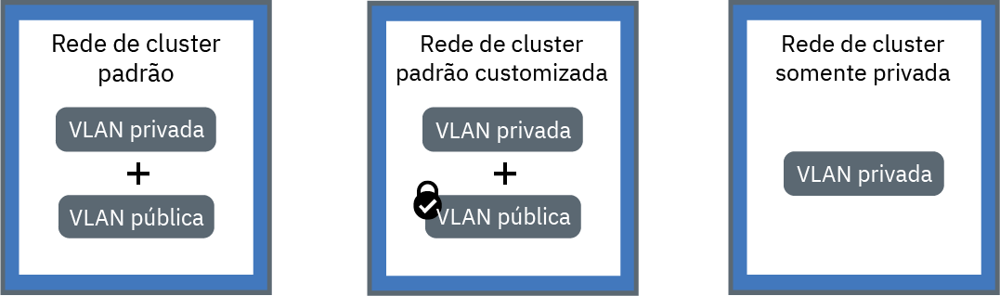

---

copyright:
  years: 2014, 2018
lastupdated: "2018-09-10"

---

{:new_window: target="_blank"}
{:shortdesc: .shortdesc}
{:screen: .screen}
{:pre: .pre}
{:table: .aria-labeledby="caption"}
{:codeblock: .codeblock}
{:tip: .tip}
{:download: .download}

# Planejando a rede em cluster e privada
{: #planning}

Planeje uma configuração de rede para seu cluster do {{site.data.keyword.containerlong}}.
{: shortdesc}

## Entendendo a rede em cluster
{: #in-cluster}

Todos os pods que são implementados em um nó do trabalhador são designados a um endereço IP privado no intervalo 172.30.0.0/16 e são roteados somente entre os nós do trabalhador. Para evitar conflitos, não use esse intervalo de IPs em quaisquer nós que se comunicam com os nós do trabalhador. Os nós do trabalhador e os pods podem se comunicar com segurança na rede privada usando endereços IP privados. No entanto, quando um pod trava ou um nó do trabalhador precisa ser recriado, um novo endereço IP privado
é designado.

Por padrão, é difícil rastrear a mudança de endereços IP privados para apps que devem estar altamente disponíveis. Em vez disso, é possível usar os recursos de descoberta de serviço do Kubernetes integrados para expor apps como serviços IP do cluster na rede privada. Um serviço do Kubernetes agrupa um conjunto de pods e fornece uma conexão de rede para esses pods. Essa conexão fornece conectividade a outros serviços no cluster sem expor o endereço IP privado real de cada pod. Os serviços são designados a um endereço IP em cluster que é acessível somente dentro do cluster.
* Clusters mais antigos: em clusters que foram criados antes de fevereiro de 2018 na zona dal13 ou antes de outubro de 2017 em qualquer outra zona, os serviços são designados a um IP de um dos 254 IPs no intervalo 10.10.10.0/24. Se você atinge o limite de 254 serviços e precisa de mais serviços, deve-se criar um novo cluster.
* Clusters mais recentes: em clusters que foram criados após fevereiro de 2018 na zona dal13 ou depois de outubro de 2017 em qualquer outra zona, os serviços são designados a um IP de um dos 65.000 IPs no intervalo 172.21.0.0/16.

Para evitar conflitos, não use esse intervalo de IPs em quaisquer nós que se comunicam com os nós do trabalhador. Uma entrada de consulta de DNS também é criada para o serviço e armazenada no componente `kube-dns` do cluster. A entrada de DNS contém o nome do serviço, o namespace no qual o serviço foi criado e o link para o endereço IP no cluster designado.

Para acessar um pod atrás de um serviço de cluster, os apps podem usar o endereço IP em cluster do serviço ou enviar uma solicitação usando o nome do serviço. Quando você usa o nome do serviço, o nome é consultado no componente `kube-dns` e roteado para o endereço IP em cluster do serviço. Quando uma solicitação atinge o serviço, o serviço encaminha solicitações para os pods igualmente, independentemente dos endereços IP no cluster e do nó do trabalhador no qual eles estão implementados.

 

## Entendendo conexões de VLAN e interfaces de rede
{: #interfaces}

O {{site.data.keyword.containerlong_notm}} fornece as VLANs de infraestrutura do IBM Cloud (SoftLayer) que asseguram desempenho de rede de qualidade e isolamento de rede para nós do trabalhador. Uma VLAN configura um grupo de
nós do trabalhador e pods como se eles estivessem conectados à mesma ligação física. As VLANs são dedicadas à sua conta do {{site.data.keyword.Bluemix_notm}} e não são compartilhadas entre clientes IBM.

Por padrão, todos os clusters são conectados a uma VLAN privada. A VLAN privada determina o endereço IP privado que é designado a cada nó do trabalhador. Seus trabalhadores têm uma interface de rede privada e são acessíveis por meio da rede privada. Quando você cria um cluster que também está conectado a uma VLAN pública, seu cluster tem uma interface de rede pública também. A VLAN pública permite que os nós do trabalhador se conectem de forma automática e segura ao mestre. Para obter mais informações sobre as VLANs padrão para seu cluster, consulte [VLANs padrão, sub-redes e IPs para clusters](cs_subnets.html#default_vlans_subnets).

As configurações de rede de cluster podem ser definidas pelas interfaces de rede do cluster:

* **Rede de cluster padrão**: um cluster com uma interface de rede privada e pública
* **Rede de cluster padrão customizado**: um cluster com uma interface de rede privada e pública e políticas de rede do Calico para bloquear o tráfego público recebido
* **Rede de cluster somente privada**: um cluster com somente uma interface de rede privada

Clique em uma das configurações a seguir para planejar a rede para seu cluster:

<map name="home_map" id="home_map">
<area href="#both_vlans" alt="Planejando a rede de cluster padrão" title="Planejando a rede de cluster padrão" shape="rect" coords="-7, -8, 149, 211" />
<area href="#both_vlans_private" alt="Planejando a rede de cluster padrão customizada" title="Planejando a rede de cluster padrão customizada" shape="rect" coords="196, -1, 362, 210" />
<area href="#private_vlan" alt="Planejando a rede de cluster somente privada" title="Planejando a rede de cluster somente privada" shape="rect" coords="409, -10, 572, 218" />
</map>

 

## Planejando a rede de cluster padrão
{: #both_vlans}

Por padrão, o {{site.data.keyword.containerlong_notm}} configura seu cluster com acesso a uma VLAN pública e a uma VLAN privada.
{:shortdesc}

**O que meu cluster obtém com essa configuração?**
* Um endereço IP público para cada nó do trabalhador, que fornece aos nós do trabalhador uma interface de rede pública
* Um endereço IP privado para cada nó do trabalhador, que fornece aos nós do trabalhador uma interface de rede privada
* Uma conexão OpenVPN automática e segura entre todos os nós do trabalhador e o mestre

** Por que posso usar essa configuração? **

* Você tem um app que deve ser acessível para a Internet pública em um cluster de zona única.
* Você tem um app que deve ser acessível para a Internet pública em um cluster de múltiplas zonas. Como é necessário ativar o [VLAN Spanning](cs_subnets.html#subnet-routing) para criar um cluster de múltiplas zonas, o cluster pode se comunicar com outros sistemas que estão conectados a qualquer VLAN privada na mesma conta do IBM Cloud. **Nota**: para isolar seu cluster de múltiplas zonas na rede privada, use [Políticas de rede do Calico](cs_network_policy.html#isolate_workers).

**Quais são as minhas opções para gerenciar o acesso público e privado ao meu cluster?**
 As seções a seguir descrevem os recursos no {{site.data.keyword.containerlong_notm}} que podem ser usados para configurar a rede para clusters que estão conectados a uma VLAN pública e uma privada.

### Expor seus apps com serviços de rede
{: #both_vlans_services}

A interface de rede pública para os nós do trabalhador é protegida por [configurações de política de rede do Calico predefinidas](cs_network_policy.html#default_policy) que são configuradas em cada nó do trabalhador durante a criação do cluster. Por padrão, todo o tráfego de rede de saída é permitido para todos os nós do trabalhador. O tráfego de rede de entrada está bloqueado, exceto para algumas portas. Essas portas são abertas para que a IBM possa monitorar o tráfego de rede e instalar automaticamente atualizações de segurança para o mestre do Kubernetes.

Se você desejar expor seus apps para a rede pública ou privada, será possível criar os serviços NodePort, LoadBalancer ou Ingress públicos ou privados. Para obter mais informações sobre cada serviço, veja [Escolhendo um serviço NodePort, LoadBalancer ou Ingress](cs_network_planning.html#external).

### Opcional: isolar as cargas de trabalho de rede para os nós do trabalhador de borda
{: #both_vlans_edge}

Os nós do trabalhador de borda podem melhorar a segurança de seu cluster, permitindo que menos nós do trabalhador sejam acessados externamente e isolando a carga de trabalho de rede. Para assegurar que os pods do Ingresso e do balanceador de carga sejam implementados somente para os nós do trabalhador especificados, [rotule os nós do trabalhador como nós de borda](cs_edge.html#edge_nodes). Para também evitar que outras cargas de trabalho sejam executadas em nós de borda, [contamine os nós de borda](cs_edge.html#edge_workloads).

### Opcional: conecte-se a uma rede no local ou ao IBM Cloud Private usando a VPN strongSwan
{: #both_vlans_vpn}

Para conectar com segurança seus nós do trabalhador e apps a uma rede no local, é possível configurar um [serviço de VPN IPSec strongSwan ](https://www.strongswan.org/about.html). O serviço de VPN do IPSec do strongSwan fornece um canal de comunicação seguro de ponta a ponta sobre a Internet que é baseado no conjunto de protocolos padrão de mercado da Internet Protocol Security (IPSec).
* Para configurar uma conexão segura entre seu cluster e uma rede no local, [configure e implemente o serviço VPN IPSec do strongSwan](cs_vpn.html#vpn-setup) diretamente em um pod no cluster.
* Para configurar uma conexão segura entre seu cluster e uma instância privada do IBM Cloud, veja [Conectando sua nuvem pública e privada com a VPN strongSwan](cs_hybrid.html#hybrid_vpn).

 

## Planejando a rede de cluster padrão customizado
{: #both_vlans_private}

Por padrão, o {{site.data.keyword.containerlong_notm}} configura seu cluster com acesso a uma VLAN pública e a uma VLAN privada. No entanto, é possível customizar a configuração de rede padrão usando políticas de rede para bloquear o acesso público.
{:shortdesc}

**O que meu cluster obtém com essa configuração?**
* Um endereço IP público para cada nó do trabalhador, que fornece aos nós do trabalhador uma interface de rede pública
* Um endereço IP privado para cada nó do trabalhador, que fornece aos nós do trabalhador uma interface de rede privada
* Uma conexão OpenVPN automática e segura entre todos os nós do trabalhador e o mestre

** Por que posso usar essa configuração? **

* Você tem um app em um cluster de zona única. Você deseja expor o app somente aos pods dentro do cluster ou em outros clusters que estão conectados à mesma VLAN privada.
* Você tem um app em um cluster de múltiplas zonas. Você deseja expor o app somente aos pods dentro do cluster ou em outros clusters que estão conectados às mesmas VLANs privadas que o seu cluster. 

**Quais são as minhas opções para gerenciar o acesso público e privado ao meu cluster?** As seções a seguir descrevem os recursos no {{site.data.keyword.containerlong_notm}} que podem ser usados para configurar a rede somente privada e bloquear a rede pública para clusters que estão conectados a uma VLAN pública e uma privada.

### Expor seus apps com serviços de rede privada e proteger seu cluster do acesso público às políticas de rede do Calico
{: #both_vlans_private_services}

A interface de rede pública para os nós do trabalhador é protegida por [configurações de política de rede do Calico predefinidas](cs_network_policy.html#default_policy) que são configuradas em cada nó do trabalhador durante a criação do cluster. Por padrão, todo o tráfego de rede de saída é permitido para todos os nós do trabalhador. O tráfego de rede de entrada está bloqueado, exceto para algumas portas. Essas portas são abertas para que a IBM possa monitorar o tráfego de rede e instalar automaticamente atualizações de segurança para o mestre do Kubernetes.

Se você desejar expor os seus apps somente em uma rede privada, será possível criar os serviços privados NodePort, LoadBalancer ou Ingress. Para obter mais informações sobre como planejar a rede privada, consulte [Planejando a rede privada para uma configuração de VLAN pública e privada](cs_network_planning.html#private_both_vlans).

No entanto, as políticas de rede padrão do Calico também permitem o tráfego de rede pública de entrada da Internet para esses serviços. É possível criar políticas do Calico para, em vez disso, bloquear todo o tráfego público para os serviços. Por exemplo, um serviço NodePort abre uma porta em um nó trabalhador por meio do endereço IP privado e público do nó do trabalhador. Um serviço de balanceador de carga com um endereço IP privado móvel abre um NodePort público aberto em cada nó do trabalhador. Deve-se criar uma [política de rede preDNAT do Calico](cs_network_policy.html#block_ingress) para bloquear os NodePorts públicos.

Como um exemplo, vamos supor que você criou um serviço de balanceador de carga privado. Você também criou uma política preDNAT do Calico para bloquear o tráfego público de atingir os NodePorts públicos abertos pelo balanceador de carga. Esse balanceador de carga privado pode ser acessado por:
* [ Qualquer pod no mesmo cluster ](#in-cluster)
* Qualquer pod em qualquer cluster que esteja conectado à mesma VLAN privada
* Se você tiver o [VLAN Spanning ativado](cs_subnets.html#subnet-routing), qualquer sistema que esteja conectado a qualquer uma das VLANs privadas na mesma conta do IBM Cloud
* Se você não estiver na conta do IBM Cloud, mas ainda estiver atrás do firewall da empresa, qualquer sistema por meio de uma conexão VPN com a sub-rede em que o IP do balanceador de carga está ativo
* Se você estiver em uma conta do IBM Cloud diferente, qualquer sistema por meio de uma conexão VPN com a sub-rede em que o IP do balanceador de carga está ativo

### Isolar seu cluster na rede privada
{: #isolate}

Se você tem um cluster multizona, múltiplas VLANs para um cluster de zona única ou múltiplas sub-redes na mesma VLAN, deve-se [ativar o VLAN Spanning](/docs/infrastructure/vlans/vlan-spanning.html#vlan-spanning) para que seus nós do trabalhador possam se comunicar entre si na rede privada. No entanto, quando o VLAN estiver ativado, qualquer sistema que estiver conectado a qualquer uma das VLANs privadas na mesma conta do IBM Cloud poderá acessar os seus trabalhadores. É possível isolar o cluster de múltiplas zonas de outros sistemas na rede privada usando [políticas de rede do Calico](cs_network_policy.html#isolate_workers). Essas políticas também permitem ingresso e egresso para os intervalos de IP privado e portas que você abriu em seu firewall privado.

### Opcional: isolar as cargas de trabalho de rede para os nós do trabalhador de borda
{: #both_vlans_private_edge}

Os nós do trabalhador de borda podem melhorar a segurança de seu cluster, permitindo que menos nós do trabalhador sejam acessados externamente e isolando a carga de trabalho de rede. Para assegurar que os pods do Ingresso e do balanceador de carga sejam implementados somente para os nós do trabalhador especificados, [rotule os nós do trabalhador como nós de borda](cs_edge.html#edge_nodes). Para também evitar que outras cargas de trabalho sejam executadas em nós de borda, [contamine os nós de borda](cs_edge.html#edge_workloads).

Em seguida, use uma [política de rede preDNAT do Calico](cs_network_policy.html#block_ingress) para bloquear o tráfego para NodePorts públicos em clusters que estão executando os nós do trabalhador de borda. Bloquear as portas de nós assegura que os nós do trabalhador de borda sejam os únicos nós do trabalhador que manipulam o tráfego recebido.

### Opcional: conecte-se a uma rede no local ou ao IBM Cloud Private usando a VPN strongSwan
{: #both_vlans_private_vpn}

Para conectar com segurança seus nós do trabalhador e apps a uma rede no local, é possível configurar um [serviço de VPN IPSec strongSwan ](https://www.strongswan.org/about.html). O serviço de VPN do IPSec do strongSwan fornece um canal de comunicação seguro de ponta a ponta sobre a Internet que é baseado no conjunto de protocolos padrão de mercado da Internet Protocol Security (IPSec).
* Para configurar uma conexão segura entre seu cluster e uma rede no local, [configure e implemente o serviço VPN IPSec do strongSwan](cs_vpn.html#vpn-setup) diretamente em um pod no cluster.
* Para configurar uma conexão segura entre seu cluster e uma instância privada do IBM Cloud, veja [Conectando sua nuvem pública e privada com a VPN strongSwan](cs_hybrid.html#hybrid_vpn).

 

## Planejando a rede de cluster somente privada
{: #private_vlan}

É possível escolher [criar um cluster somente de VLAN privada](cs_clusters.html#clusters_cli), incluindo a sinalização `--private-only` na CLI. Quando os nós do trabalhador estão conectados somente a uma VLAN privada, os nós do trabalhador não podem se conectar automaticamente ao mestre. Deve-se usar um dispositivo de gateway para conectar os nós do trabalhador ao mestre. Também é possível usar o dispositivo de gateway como um firewall para proteger seu cluster contra acesso indesejado.
{:shortdesc}

**O que meu cluster obtém com essa configuração?**
* Um endereço IP privado para cada nó do trabalhador, que fornece aos nós do trabalhador uma interface de rede privada

**O que meu cluster não obtém com essa configuração?**
* Um endereço IP público para cada nó do trabalhador, que fornece aos nós do trabalhador uma interface de rede pública. O cluster nunca está disponível para o público.
* Uma conexão automática entre todos os nós do trabalhador e o mestre. Deve-se fornecer essa conexão [configurando um dispositivo de gateway](#private_vlan_gateway).

** Por que posso usar essa configuração? **
 Você tem requisitos de segurança específicos ou precisa criar políticas de rede e regras de roteamento customizadas para fornecer segurança de rede dedicada. **Nota**: usar um dispositivo de gateway incorre em custos separados. Para obter detalhes, consulte a  [ documentação ](/docs/infrastructure/fortigate-10g/explore-firewalls.html).

**Quais são as minhas opções para gerenciar o acesso público e privado ao meu cluster?**
 As seções a seguir descrevem os recursos no {{site.data.keyword.containerlong_notm}} que podem ser usados para configurar a rede para clusters que estão conectados somente a uma VLAN privada.

### Configurar um dispositivo de gateway
{: #private_vlan_gateway}

Se os nós do trabalhador estão configurados somente com uma VLAN privada, deve-se configurar uma solução alternativa para conectividade de rede entre os nós do trabalhador e o mestre. É possível configurar um firewall com políticas de rede customizadas para fornecer segurança de rede dedicada para seu cluster padrão e para detectar e corrigir a intrusão de rede. Por exemplo, você pode escolher configurar um [Virtual Router Appliance](/docs/infrastructure/virtual-router-appliance/about.html) ou um [Fortigate Security Appliance](/docs/infrastructure/fortigate-10g/about.html) para agir como seu firewall e bloquear o tráfego indesejado. Ao configurar um firewall, deve-se também [abrir as portas e os endereços IP necessários](cs_firewall.html#firewall_outbound) para cada região para que o mestre e os nós do trabalhador possam se comunicar.

**Nota**: se você tiver um dispositivo de roteador existente e, em seguida, incluir um cluster, as novas sub-redes móveis que forem pedidas para o cluster não serão configuradas no dispositivo do roteador. Para usar os serviços de rede, deve-se ativar o roteamento entre as sub-redes na mesma VLAN [ativando o VLAN Spanning](cs_subnets.html#vra-routing).

Para verificar se o VLAN Spanning já está ativado, use o [comando](cs_cli_reference.html#cs_vlan_spanning_get) `ibmcloud ks vlan-spanning-get`.
{: tip}

### Expor seus apps com serviços de rede privada
{: #private_vlan_services}

Para tornar seu app acessível por meio de uma rede privada, é possível usar os serviços privados NodePort, LoadBalancer ou Ingress. Como os nós do trabalhador não estão conectados a uma VLAN pública, nenhum tráfego público é roteado para esses serviços. Deve-se também [abrir as portas e os endereços IP necessários](cs_firewall.html#firewall_inbound) para permitir o tráfego de entrada para esses serviços.

Para obter mais informações sobre cada serviço, veja [Escolhendo um serviço NodePort, LoadBalancer ou Ingress](cs_network_planning.html#external).

### Opcional: conectar-se a um banco de dados no local usando o dispositivo de gateway
{: #private_vlan_vpn}

Para conectar com segurança os nós do trabalhador e apps a uma rede no local, deve-se configurar um gateway de VPN. É possível usar o VRA ou o FSA que você configurou anteriormente para também configurar um terminal de VPN IPSec. Para configurar um VRA, consulte [Configurando a conectividade de VPN com um VRA](cs_vpn.html#vyatta).
