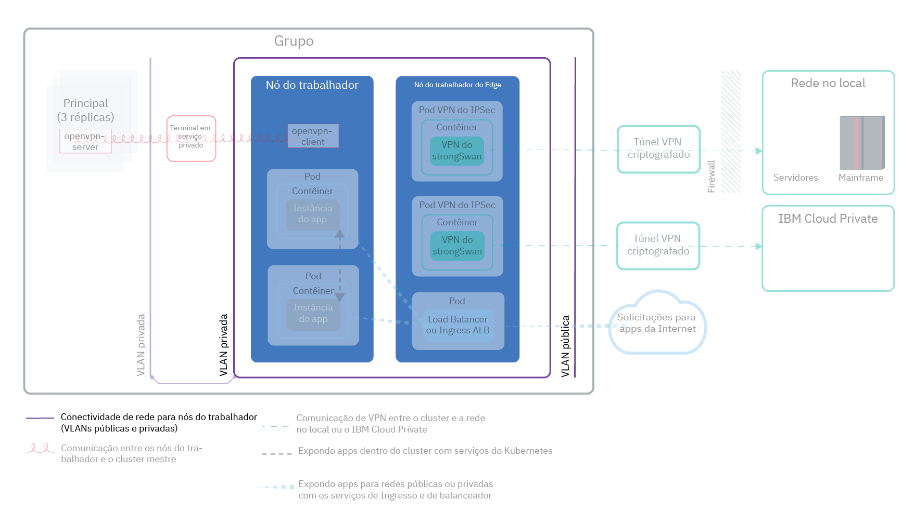
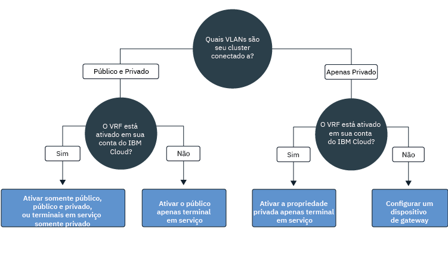
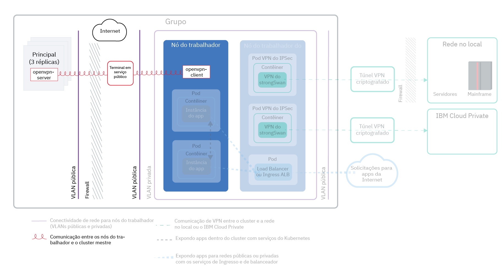
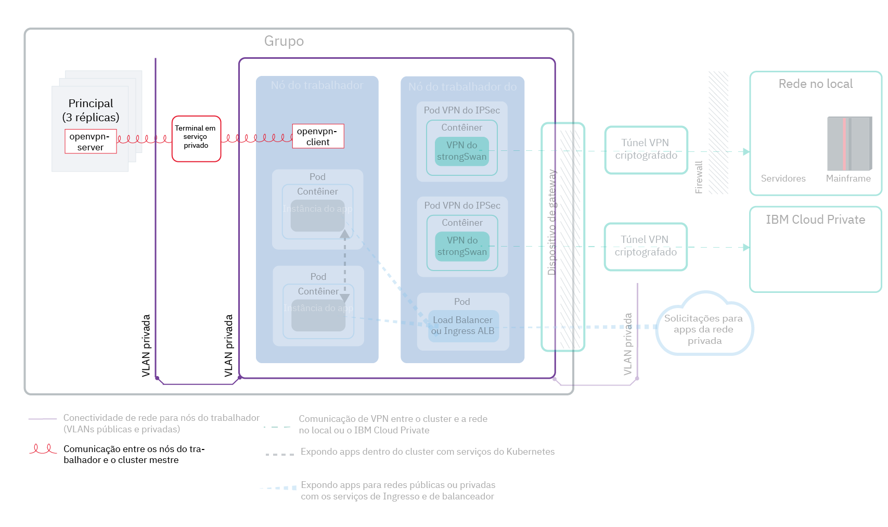
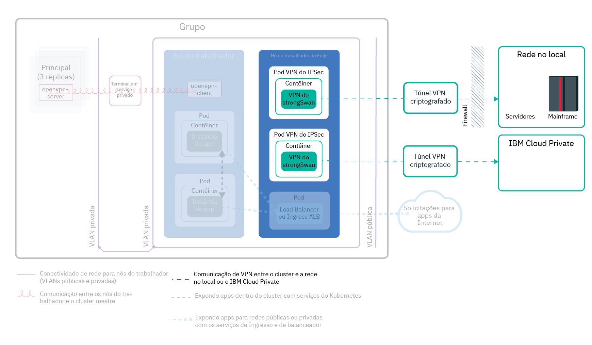
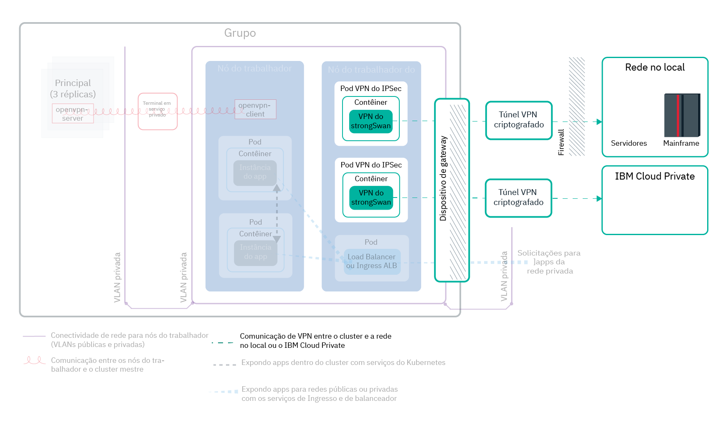

---

copyright:
  years: 2014, 2019
lastupdated: "2019-04-15"

---

{:new_window: target="_blank"}
{:shortdesc: .shortdesc}
{:screen: .screen}
{:pre: .pre}
{:table: .aria-labeledby="caption"}
{:codeblock: .codeblock}
{:tip: .tip}
{:note: .note}
{:important: .important}
{:deprecated: .deprecated}
{:download: .download}

# Planejando sua rede de cluster
{: #cs_network_ov}

Planeje uma configuração de rede para seu cluster do {{site.data.keyword.containerlong}}.
{: shortdesc}

Essa página ajuda a configurar a configuração de rede do seu cluster. Procurando informações sobre como configurar a rede para seu app? Consulte [Planejando para expor seus apps com rede externa e no cluster](/docs/containers?topic=containers-cs_network_planning).
{: tip}

## Entendendo os Básicos de Rede do  {{site.data.keyword.containerlong_notm}}
{: #cs_network_ov_basics}

Antes de iniciar a configuração de sua rede de cluster, é importante entender os conceitos básicos de rede em {{site.data.keyword.containerlong_notm}} clusters.
{: shortdesc}

### Quais componentes de cluster devem se comunicar uns com os outros?
{: #cs_network_ov_basics_components}

Ao criar seu cluster, deve-se escolher uma configuração de rede para que determinados componentes de cluster possam se comunicar uns com os outros.
{: shortdesc}

* Todos os nós do trabalhador devem ser conectados a uma VLAN para se comunicarem uns com os outros e com o mestre do Kubernetes. Para escolher VLANs, consulte [Planejando a comunicação de trabalhador para o trabalhador](#cs_network_ov_worker).
* A comunicação deve ser permitida em múltiplas VLANs privadas para permitir que os trabalhadores se conectem entre si e com o mestre. Para ativar um Virtual Router Function (VRF) ou uma ampliação de VLAN, consulte [Como as VLANs e as sub-redes são configuradas para assegurar a segmentação de rede?](#cs_network_ov_basics_segmentation).
* Seus trabalhadores podem se comunicar com o mestre do Kubernetes de forma segura com a rede pública ou por meio da rede privada. Para escolher o seu canal de comunicação de trabalhador para mestre, consulte [Planejando a comunicação de mestre para trabalhador](#cs_network_ov_master).

### Como o trabalho de rede funciona no {{site.data.keyword.containerlong_notm}}?
{: #cs_network_ov_basics_vlans}

O {{site.data.keyword.containerlong_notm}} usa VLANs, sub-redes e endereços IP para fornecer conectividade de rede de componentes do cluster.
{: shortdesc}

** O que são VLANs? Quais tipos de VLANs  {{site.data.keyword.containerlong_notm}}  oferecem? ** 

Quando você cria um cluster, os nós do trabalhador do cluster são conectados automaticamente a uma VLAN. Uma VLAN configura um grupo de nós do trabalhador e pods como se eles estivessem conectados à mesma ligação física e fornece um canal para conectividade entre os trabalhadores e os pods.
{: shortdesc}

<dl>
<dt>VLANs para clusters grátis</dt>
<dd>Em clusters grátis, os nós do trabalhador do cluster são conectados a uma VLAN pública e uma VLAN privada de propriedade da IBM por padrão. Como a IBM controla as VLANs, as sub-redes e os endereços IP, não é possível criar clusters de múltiplas zonas ou incluir sub-redes em seu cluster e é possível usar somente serviços NodePort para expor seu app.</dd>
<dt>VLANs para clusters padrão</dt>
<dd>Em clusters padrão, na primeira vez que você criar um cluster em uma zona, uma VLAN pública e uma VLAN privada nessa zona serão provisionadas automaticamente para você em sua conta de infraestrutura do IBM Cloud (SoftLayer). Para cada cluster subsequente que você criar nessa zona, deverá ser especificado o par de VLAN que você deseja usar nessa zona. É possível reutilizar as mesmas VLANs públicas e privadas que foram criadas para você porque diversos clusters podem compartilhar VLANs. 
 É possível conectar seus nós do trabalhador a uma VLAN pública e à VLAN privada ou somente à VLAN privada. Se você deseja conectar seus nós do trabalhador somente a uma VLAN privada, é possível usar o ID de uma VLAN privada existente ou [criar uma VLAN privada](/docs/cli/reference/ibmcloud?topic=cloud-cli-manage-classic-vlans#sl_vlan_create) e usar o ID durante a criação do cluster.</dd></dl>

Para ver as VLANs provisionadas em cada zona para sua conta, execute `ibmcloud ks vlans --zone <zone>.` Para ver as VLANs nas quais um cluster está provisionado, execute `ibmcloud ks cluster-get --cluster <cluster_name_or_ID> --showResources` e procure a seção **VLANs de sub-rede**.

A infraestrutura do IBM Cloud (SoftLayer) gerencia as VLANs que são provisionadas automaticamente quando você cria seu primeiro cluster em uma zona. Se você deixar que uma VLAN se torne inutilizável, como removendo todos os nós do trabalhador de uma VLAN, a infraestrutura do IBM Cloud (SoftLayer) recuperará a VLAN. Em seguida, se precisar de uma nova VLAN, [entre em contato com o suporte do {{site.data.keyword.Bluemix_notm}}](/docs/infrastructure/vlans?topic=vlans-ordering-premium-vlans#ordering-premium-vlans).

**Como a minha escolha de VLANs afeta meu cluster?** 

Sua opção de conexões VLAN determina como os nós do mestre e do trabalhador do Kubernetes podem se comunicar entre si em seu cluster. Para obter mais informações, consulte [Planejando a comunicação entre os nós do trabalhador e o mestre do Kubernetes](/docs/containers?topic=containers-cs_network_ov#cs_network_ov_master).

Sua opção de conexões VLAN também determina a conectividade de rede para seus apps. Para obter mais informações, consulte [Planejando para expor seus apps com rede externa e no cluster](/docs/containers?topic=containers-cs_network_planning).

### O que são sub-redes? Que tipos de sub-redes o  {{site.data.keyword.containerlong_notm}}  oferece?
{: #cs_network_ov_basics_subnets}

Além dos nós do trabalhador e dos pods, as sub-redes também são provisionadas automaticamente em VLANs. As sub-redes fornecem conectividade de rede para seus componentes do cluster designando endereços IP a eles.
{: shortdesc}

As sub-redes a seguir são provisionadas automaticamente nas VLANs públicas e privadas padrão:

** Sub-redes Public VLAN **
* A sub-rede pública primária determina os endereços IP públicos que são designados aos nós do trabalhador durante a criação do cluster. Vários clusters na mesma VLAN podem compartilhar uma sub-rede pública primária.
* A sub-rede pública móvel é ligada a somente um cluster e fornece o cluster com 8 endereços IP públicos. 3 IPs são reservados para as funções de infraestrutura do IBM Cloud (SoftLayer). Um IP é usado pelo ALB padrão público do Ingress e 4 IPs podem ser usados para criar serviços de balanceador de carga de rede (NLB) pública. IPs públicos móveis são endereços IP fixos e permanentes que podem ser usados para acessar NLBs pela Internet. Se precisar de mais de 4 IPs para os NLBs, consulte [Incluindo endereços IP móveis](/docs/containers?topic=containers-subnets#adding_ips).

** Sub-redes de VLAN privada **
* A sub-rede privada primária determina os endereços IP privados que são designados aos nós do trabalhador durante a criação do cluster. Múltiplos clusters na mesma VLAN podem compartilhar uma sub-rede privada primária.
* A sub-rede privada móvel é ligada a somente um cluster e fornece o cluster com 8 endereços IP privados. 3 IPs são reservados para as funções de infraestrutura do IBM Cloud (SoftLayer). Um IP é usado pelo ALB padrão privado do Ingress e 4 IPs podem ser usados para criar serviços de balanceador de carga de rede (NLB) privada. IPs privados móveis são endereços IP fixos e permanentes que podem ser usados para acessar NLBs por uma rede privada. Se precisar de mais de 4 IPs para os NLBs privados, consulte [Incluindo endereços IP móveis](/docs/containers?topic=containers-subnets#adding_ips).

Para ver todas as sub-redes provisionadas em sua conta, execute `ibmcloud ks subnets`. Para ver as sub-redes públicas e privadas móveis que estão ligadas a um cluster, é possível executar `ibmcloud ks cluster-get --cluster <cluster_name_or_ID> --showResources` e procurar a seção **VLANs de sub-rede**.

No {{site.data.keyword.containerlong_notm}}, as VLANs têm um limite de 40 sub-redes. Se você atingir esse limite, primeiro verifique se é possível [reutilizar sub-redes na VLAN para criar novos clusters](/docs/containers?topic=containers-subnets#subnets_custom). Se você precisar de uma nova VLAN, peça uma [contatando o suporte do {{site.data.keyword.Bluemix_notm}}](/docs/infrastructure/vlans?topic=vlans-ordering-premium-vlans#ordering-premium-vlans). Em seguida, [crie um cluster](/docs/containers?topic=containers-cs_cli_reference#cs_cluster_create) que usa essa nova VLAN.
{: note}

### Como as VLANs e as sub-redes são configuradas para assegurar a segmentação de rede?
{: #cs_network_ov_basics_segmentation}

A segmentação de rede descreve a abordagem para dividir uma rede em múltiplas sub-redes. Os apps que são executados em uma sub-rede não podem ver ou acessar apps em outra sub-rede. Para obter mais informações sobre as opções de segmentação de rede e como elas se relacionam com VLANs, consulte [este tópico de segurança de cluster](/docs/containers?topic=containers-security#network_segmentation).
{: shortdesc}

No entanto, em várias situações, os componentes em seu cluster devem ter permissão para se comunicar por meio de múltiplas VLANs privadas. Por exemplo, se você desejar criar um cluster de múltiplas zonas, se você tiver múltiplas VLANs para um cluster ou se tiver múltiplas sub-redes na mesma VLAN, os nós do trabalhador em sub-redes diferentes na mesma VLAN ou em VLANs diferentes não poderão se comunicar automaticamente entre si. Deve-se ativar um Virtual Router Function (VRF) ou uma ampliação de VLAN para a sua conta de infraestrutura do IBM Cloud (SoftLayer).

**O que são Virtual Router Functions (VRF) e a ampliação de VLAN?** 

<dl>
<dt>[ Virtual Router Function (VRF) ](/docs/infrastructure/direct-link?topic=direct-link-overview-of-virtual-routing-and-forwarding-vrf-on-ibm-cloud#overview-of-virtual-routing-and-forwarding-vrf-on-ibm-cloud)</dt>
<dd>Um VRF permite que todas as VLANs e sub-redes em sua conta de infraestrutura se comuniquem umas com as outras. Além disso, um VRF é necessário para permitir que seus trabalhadores e o mestre se comuniquem por meio do terminal em serviço privado. Para ativar o VRF, [entre em contato com o representante de conta da infraestrutura do IBM Cloud (SoftLayer)](/docs/infrastructure/direct-link?topic=direct-link-overview-of-virtual-routing-and-forwarding-vrf-on-ibm-cloud#how-you-can-initiate-the-conversion). Observe que o VRF elimina a opção Ampliação de VLAN para a sua conta porque todas as VLANs são capazes de se comunicar, a menos que você configure um dispositivo de gateway para gerenciar o tráfego.</dd>
<dt>[ VLAN Spanning ](/docs/infrastructure/vlans?topic=vlans-vlan-spanning#vlan-spanning)</dt>
<dd>Se não for possível ou você não desejar ativar o VRF, ative o VLAN Spanning. Para executar essa ação, você precisa da [permissão de infraestrutura](/docs/containers?topic=containers-users#infra_access) **Rede > Gerenciar a rede VLAN Spanning** ou é possível solicitar ao proprietário da conta para ativá-la. Para verificar se o VLAN Spanning já está ativado, use o [comando](/docs/containers?topic=containers-cs_cli_reference#cs_vlan_spanning_get) `ibmcloud ks vlan-spanning-get`. Observe que não é possível ativar o terminal em serviço privado se você optar por ativar a ampliação de VLAN em vez de um VRF.</dd>
</dl>

**Como o VRF ou a ampliação de VLAN afeta a segmentação de rede?** 

Quando o VRF ou a ampliação de VLAN estiver ativada, qualquer sistema que esteja conectado a qualquer uma das VLANs privadas na mesma conta do {{site.data.keyword.Bluemix_notm}} poderá se comunicar com os trabalhadores. É possível isolar seu cluster de outros sistemas na rede privada, aplicando [políticas de rede privada do Calico](/docs/containers?topic=containers-network_policies#isolate_workers). O {{site.data.keyword.containerlong_notm}} também é compatível com todas as [ofertas de firewall da infraestrutura do IBM Cloud (SoftLayer) ](https://www.ibm.com/cloud-computing/bluemix/network-security). É possível configurar um firewall, como um [Virtual Router Appliance](/docs/infrastructure/virtual-router-appliance?topic=virtual-router-appliance-about-the-vra), com políticas de rede customizadas para fornecer segurança de rede dedicada para seu cluster padrão e para detectar e remediar intrusão de rede.

 

## Planejando a Comunicação do Trabalhador para o Trabalhador
{: #cs_network_ov_worker}

Todos os nós do trabalhador devem ser conectados a uma VLAN a fim de ter uma interface de rede. Essa interface de rede permite que cada nó do trabalhador envie e receba informações para outros nós do trabalhador.
{: shortdesc}

### Quais são minhas opções para conectividade de VLAN do nó do trabalhador?
{: #cs_network_ov_worker_options}

Quando você cria seu cluster, é possível conectar seus nós do trabalhador a uma VLAN pública e a uma VLAN privada ou a uma VLAN somente privada.
{: shortdesc}

**Por que eu posso conectar meu cluster a uma VLAN pública e privada?** 

Para a maioria dos casos, é possível alcançar a flexibilidade de rede criando um cluster que esteja conectado a uma VLAN pública e privada. Por exemplo:
* Você tem um app que deve ser acessível para a Internet pública.
* Você tem um app que deseja expor apenas para os pods dentro do cluster ou em outros clusters que estão conectados à mesma VLAN privada. Diversas opções estão disponíveis para proteger seu app por meio da interface pública, como usar políticas de rede do Calico ou isolar a carga de trabalho de rede externa para os nós do trabalhador de borda.

A imagem a seguir mostra a conectividade de rede para os nós do trabalhador que estão conectados a uma VLAN pública e privada.

<figure>
 
 <figcaption>Conectividade de rede para os nós do trabalhador estão conectados a uma VLAN pública e privada</figcaption>
</figure>

Se você desejar criar um cluster de múltiplas zonas, se tiver múltiplas VLANs para um cluster ou se tiver múltiplas sub-redes na mesma VLAN, os nós do trabalhador em sub-redes diferentes na mesma VLAN ou em VLANs diferentes não poderão se comunicar automaticamente entre si. Deve-se ativar o [VRF ou VLAN Spanning](#cs_network_ov_basics_segmentation) para sua conta de infraestrutura do IBM Cloud (SoftLayer). Escolha VRF para ativar o [terminal em serviço privado para comunicação entre o principal e o trabalhador](#cs_network_ov_master_private). Se não for possível ou você não desejar ativar o VRF, ative o VLAN Spanning.

**Por que eu posso conectar meu cluster a uma VLAN somente privada?** 

Crie um cluster de VLAN somente privada se você tiver requisitos de segurança específicos ou precisar criar políticas de rede customizadas e regras de roteamento para fornecer segurança de rede dedicada.
{: shortdesc}

A imagem a seguir mostra a conectividade de rede para os nós do trabalhador que estão conectados a uma VLAN somente privada.

<figure>
 
 <figcaption>Conectividade de rede para nós do trabalhador em uma configuração de rede privada</figcaption>
</figure>

Se você desejar criar um cluster de múltiplas zonas, se tiver múltiplas VLANs para um cluster ou se tiver múltiplas sub-redes na mesma VLAN, os nós do trabalhador em sub-redes diferentes na mesma VLAN ou em VLANs diferentes não poderão se comunicar automaticamente entre si. Deve-se ativar o [VRF ou VLAN Spanning](#cs_network_ov_basics_segmentation) para sua conta de infraestrutura do IBM Cloud (SoftLayer). Escolha VRF para ativar o [terminal em serviço privado para comunicação entre o principal e o trabalhador](#cs_network_ov_master_private). Se não for possível ou não desejar ativar o VRF, você deverá ativar a ampliação de VLAN e também configurar um dispositivo de gateway para a comunicação de mestre para trabalhador.

### Eu fiz minha escolha para conexões VLAN. Como eu os configuro?
{: #cs_network_ov_worker_setup}

É possível seguir as etapas em [Configurando a rede de cluster com uma VLAN pública e uma privada](/docs/containers?topic=containers-cs_network_cluster#both_vlans) ou [Configurando a rede de cluster com uma VLAN privada apenas](/docs/containers?topic=containers-cs_network_cluster#setup_private_vlan).
{: shortdesc}

### Posso mudar minha decisão da VLAN mais tarde? Os endereços IP do meu nó do trabalhador mudam?
{: #cs_network_ov_worker_change}

É possível alterar a configuração de VLAN modificando os conjuntos de trabalhadores em seu cluster. Para obter mais informações, consulte [Mudando as conexões VLAN do nó do trabalhador](/docs/containers?topic=containers-cs_network_cluster#change-vlans).
{: shortdesc}

Um endereço IP é designado ao seu nó do trabalhador nas VLANs públicas ou privadas que são usadas por seu cluster. Depois que o nó do trabalhador é provisionado, os endereços IP não mudam. Por exemplo, os endereços IP do nó do trabalhador persistem nas operações `reload`, `reboot` e `update`. Além disso, o endereço IP privado do nó do trabalhador é usado para sua identidade na maioria dos comandos `kubectl`. Se você mudar as VLANs que o conjunto do trabalhador usa, novos nós do trabalhador provisionados nesse conjunto usarão as novas VLANs para seus endereços IP. Os endereços IP do nó do trabalhador existente não são mudados, mas é possível optar por remover os nós do trabalhador que usam VLANs antigas.

 

## Planejando a comunicação de mestre para trabalhador
{: #cs_network_ov_master}

Ao criar seu cluster, você deve escolher como os nós do trabalhador e o mestre de Kubernetes se comunicam para orquestrar as configurações do cluster.
{: shortdesc}

Um canal de comunicação deve ser configurado de modo que o mestre do Kubernetes possa gerenciar seus nós do trabalhador. Essa configuração de comunicação depende de como você configura sua conectividade de VLAN. Você pode ser capaz de permitir que seus nós do trabalhador e o mestre do Kubernetes se comuniquem ativando os terminais em serviço somente públicos, públicos e privados ou somente privados. Para determinar se é possível usar os terminais em serviço, siga esta árvore de decisão.

<map name="dt-image-map" id="dt-image-map">
  <area alt="Rede padrão com terminais em serviço públicos, públicos e privados ou privados" title="Rede padrão com terminais em serviço públicos, públicos e privados ou privados" href="#cs_network_ov_master_both" coords="0,296,195,354" shape="rect" />
  <area alt="Rede padrão com um terminal em serviço público somente" title="Rede padrão com um terminal em serviço público somente" href="#cs_network_ov_master_public" coords="220,295,353,352" shape="rect" />
  <area alt="Rede privada com um terminal em serviço privado somente" title="Rede privada com um terminal em serviço privado somente" href="#cs_network_ov_master_private" coords="393,294,524,356" shape="rect" />
  <area alt="Private networking with a gateway appliance" title="Private networking with a gateway appliance" href="#cs_network_ov_master_gateway" coords="579,294,697,354" shape="rect" />
</map>

Consulte as seções a seguir para obter mais informações sobre cada configuração.

### Somente terminal em serviço público
{: #cs_network_ov_master_public}

Se os nós do trabalhador estiverem configurados com uma VLAN privada e uma pública, os nós do trabalhador poderão se conectar automaticamente ao mestre sobre a rede pública por meio do terminal em serviço público. Um VRF não é necessário em sua conta do {{site.data.keyword.Bluemix_notm}}.
{: shortdesc}

A imagem a seguir mostra a comunicação entre os nós de trabalhadores e o mestre do Kubernetes por meio de um terminal em serviço público.

<figure>
 
 <figcaption>Comunicação entre os nós de trabalhadores e os Kubernetes master por meio de um terminal em serviço público</figcaption>
</figure>

**Comunicação entre o principal e os nós do trabalhador** 
A comunicação é estabelecida com segurança pela rede pública por meio do terminal de serviço público. Os trabalhadores conversam com segurança com o principal por meio de certificados TLS, e as conversas principais com os trabalhadores por meio de uma conexão OpenVPN.

**Acesso ao principal** 
O principal é acessível publicamente aos usuários de cluster autorizados por meio do terminal de serviço público. Os usuários do cluster podem acessar com segurança seu mestre do Kubernetes na Internet para executar os comandos `kubectl`, por exemplo.

Para configurar o terminal em serviço somente público durante ou após a criação do cluster, siga as etapas em [Configurando o terminal em serviço público](/docs/containers?topic=containers-cs_network_cluster#set-up-public-se).

### Somente terminal em serviço privado
{: #cs_network_ov_master_private}

Para tornar seu mestre acessível apenas privadamente, é possível ativar o terminal em serviço privado em clusters que executam o Kubernetes versão 1.11 ou mais recente. Um VRF é necessário em sua conta do {{site.data.keyword.Bluemix_notm}}. Quando seu cluster está conectado a uma VLAN somente privada, um terminal em serviço privado evita a necessidade de um dispositivo de gateway para a conexão segura com o mestre.
{: shortdesc}

A imagem a seguir mostra a comunicação entre os nós de trabalhadores e o mestre do Kubernetes por meio de um terminal em serviço privado.

<figure>
 
 <figcaption>Comunicação entre os nós de trabalhadores e os Kubernetes master por meio de um terminal em serviço privado</figcaption>
</figure>

**Comunicação entre o principal e os nós do trabalhador** 
A comunicação é estabelecida pela rede privada por meio do terminal de serviço privado.

**Acesso ao principal** 
Os usuários do seu cluster devem estar em sua rede privada do {{site.data.keyword.Bluemix_notm}} ou se conectar à rede privada por meio de uma conexão VPN para acessar o principal.

Para configurar o terminal em serviço somente privado durante ou após a criação do cluster, siga as etapas em [Configurando o terminal em serviço privado](/docs/containers?topic=containers-cs_network_cluster#set-up-private-se).

### Terminais de serviço públicos e privados
{: #cs_network_ov_master_both}

Para tornar seu mestre acessível de maneira pública ou privada aos usuários do cluster, é possível ativar os terminais em serviço público e privado em clusters que executam o Kubernetes versão 1.11 ou mais recente. Um VRF é necessário em sua conta do {{site.data.keyword.Bluemix_notm}}.
{: shortdesc}

**Comunicação entre o principal e os nós do trabalhador** 
A comunicação é estabelecida pela rede privada por meio do terminal de serviço privado e pela rede pública por meio do terminal de serviço público. Ao rotear metade do tráfego do trabalhador para o principal pelo terminal público e metade pelo terminal privado, a comunicação entre eles é protegida contra possíveis indisponibilidades da rede pública ou da rede privada.

**Acesso ao principal** 
O principal será acessível privadamente por meio do terminal de serviço privado se os usuários autorizados do cluster estiverem em sua rede privada do {{site.data.keyword.Bluemix_notm}} ou conectados à rede privada por meio de uma conexão VPN. Caso contrário, o mestre será publicamente acessível aos usuários de cluster autorizados por meio do terminal em serviço público.

Para configurar os terminais em serviço público e privado durante a criação do cluster, siga as etapas em [Configurando o terminal em serviço privado](/docs/containers?topic=containers-cs_network_cluster#set-up-private-se). Após a criação do cluster, é possível ativar o terminal em serviço [público](/docs/containers?topic=containers-cs_network_cluster#set-up-public-se) ou [privado](/docs/containers?topic=containers-cs_network_cluster#set-up-private-se) individualmente.

### Rede privada com um dispositivo de gateway
{: #cs_network_ov_master_gateway}

Se os nós do trabalhador forem configurados com uma VLAN somente privada e o VRF não estiver ativado em sua conta do {{site.data.keyword.Bluemix_notm}}, você deverá configurar uma solução alternativa para a conectividade de rede entre os nós do trabalhador e o mestre. É possível configurar um firewall com políticas de rede customizadas para fornecer segurança de rede dedicada para seu cluster padrão e para detectar e corrigir a intrusão de rede. Por exemplo, você pode escolher configurar um [Virtual Router Appliance](/docs/infrastructure/virtual-router-appliance?topic=virtual-router-appliance-about-the-vra) ou um [Fortigate Security Appliance](/docs/services/vmwaresolutions/services?topic=vmware-solutions-fsa_considerations) para agir como seu firewall e bloquear o tráfego indesejado. Ao configurar um firewall, deve-se também [abrir as portas e os endereços IP necessários](/docs/containers?topic=containers-firewall#firewall_outbound) para cada região para que o mestre e os nós do trabalhador possam se comunicar.
{: shortdesc}

Se você tiver um dispositivo roteador existente e, em seguida, incluir um cluster, as novas sub-redes móveis que são pedidas para o cluster não serão configuradas no dispositivo roteador. Para usar os serviços de rede, deve-se ativar o roteamento entre as sub-redes na mesma VLAN [ativando o VLAN Spanning](/docs/containers?topic=containers-subnets#vra-routing).
{: important}

## Planejando o cluster para a rede no local ou a comunicação do {{site.data.keyword.icpfull_notm}}
{: #cs_network_ov_vpn}

Conecte com segurança seus nós do trabalhador e apps a uma rede no local ou {{site.data.keyword.icpfull_notm}} configurando um serviço de conexão VPN de strongSwan em seu cluster.
{: shortdesc}

### Configurando uma conexão VPN para uma configuração de VLAN pública e privada
{: #cs_network_ov_vpn_public}

<figure>
 
 <figcaption>Comunicação VPN entre um cluster e uma rede no local ou {{site.data.keyword.icpfull_notm}} em uma configuração de rede padrão</figcaption>
</figure>

Para conectar de forma segura seus nós do trabalhador e apps a uma rede no local, é possível configurar um [serviço de VPN IPSec do strongSwan ](https://www.strongswan.org/about.html) diretamente em seu cluster. O serviço de VPN do IPSec do strongSwan fornece um canal de comunicação seguro de ponta a ponta sobre a Internet que é baseado no conjunto de protocolos padrão de mercado da Internet Protocol Security (IPSec).
* Para configurar uma conexão segura entre seu cluster e uma rede no local, [configure e implemente o serviço VPN IPSec do strongSwan](/docs/containers?topic=containers-vpn#vpn-setup) diretamente em um pod no cluster.
* Para configurar uma conexão segura entre o seu cluster e uma instância do {{site.data.keyword.icpfull_notm}}, consulte [Conectando sua nuvem pública e privada com a VPN do strongSwan](/docs/containers?topic=containers-hybrid_iks_icp#hybrid_vpn).

### Configurando uma conexão VPN para uma configuração de VLAN somente privada
{: #cs_network_ov_vpn_private}

Se seu cluster estiver conectado somente a uma VLAN privada, você deverá configurar um terminal de VPN do IPSec em um dispositivo de gateway VRA (Vyatta) ou FSA. Em seguida, é possível [configurar e implementar o serviço de VPN IPSec do strongSwan](/docs/containers?topic=containers-vpn#vpn-setup) em seu cluster para usar o terminal VPN em seu gateway. Se você não desejar usar o strongSwan, será possível [configurar a conectividade VPN diretamente com o VRA](/docs/containers?topic=containers-vpn#vyatta).
{: shortdesc}

<figure>
 
 <figcaption>Comunicação VPN entre um cluster e uma rede no local ou {{site.data.keyword.icpfull_notm}} por meio de um dispositivo de gateway em uma configuração de rede privada</figcaption>
</figure>

