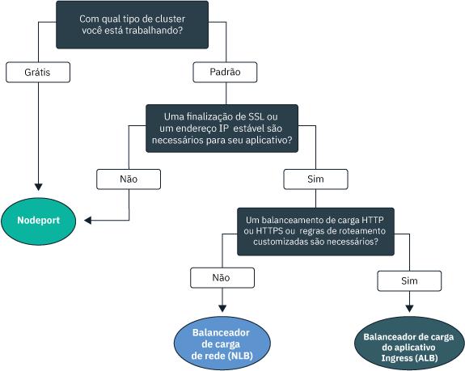
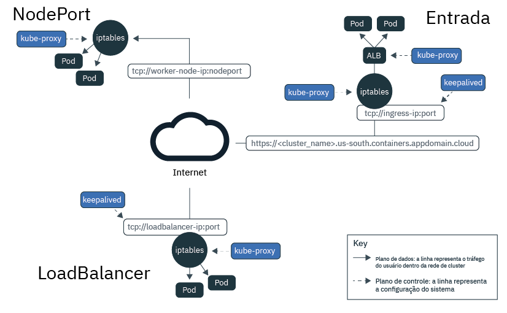
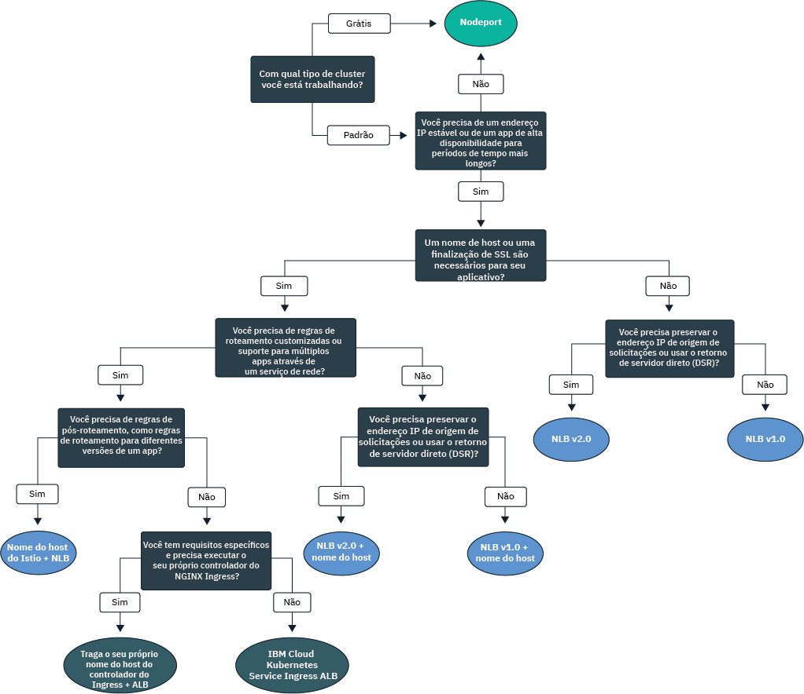

---

copyright:
  years: 2014, 2019
lastupdated: "2019-06-05"

keywords: kubernetes, iks

subcollection: containers

---

{:new_window: target="_blank"}
{:shortdesc: .shortdesc}
{:screen: .screen}
{:pre: .pre}
{:table: .aria-labeledby="caption"}
{:codeblock: .codeblock}
{:tip: .tip}
{:note: .note}
{:important: .important}
{:deprecated: .deprecated}
{:download: .download}
{:preview: .preview}

# Planejando a rede no cluster e externa para apps
{: #cs_network_planning}

Com o {{site.data.keyword.containerlong}}, é possível gerenciar a rede no cluster e a externa, tornando os apps públicos ou privados acessíveis.
{: shortdesc}

Para começar rapidamente com a rede de aplicativos, siga esta árvore de decisão e clique em uma opção para ver seus documentos de configuração:

<map name="networking_map" id="networking_map">
<area target="" href="/docs/containers?topic=containers-nodeport" alt="Serviço NodePort" coords="52,254,78,260,93,270,101,285,92,302,72,314,49,318,19,309,0,281,18,263" shape="poly">
<area target="" href="/docs/containers?topic=containers-loadbalancer" alt="Serviço de balanceador de carga de rede (NLB)" coords="288,405,324,414,348,434,350,455,327,471,295,477,246,471,222,446,237,417" shape="poly">
<area target="" href="/docs/containers?topic=containers-ingress" alt="Serviço de balanceador de carga do aplicativo (ALB) Ingress" coords="532,405,568,410,593,427,600,448,582,468,554,477,508,476,467,463,454,441,474,419" shape="poly">
</map>

## Entendendo o balanceamento de carga para aplicativos por meio da descoberta de serviços do Kubernetes
{: #in-cluster}

A descoberta de serviço do Kubernetes fornece aplicativos com uma conexão de rede por meio de serviços de rede e de um proxy local do Kubernetes.
{: shortdesc}

**Serviços** 
Todos os pods que são implementados em um nó do trabalhador têm um endereço IP privado designado a eles no intervalo 172.30.0.0/16 e são roteados somente entre nós do trabalhador. Para evitar conflitos, não use esse intervalo de IPs em quaisquer nós que se comunicam com os nós do trabalhador. Os nós do trabalhador e os pods podem se comunicar com segurança na rede privada usando endereços IP privados. No entanto, quando um pod trava ou um nó do trabalhador precisa ser recriado, um novo endereço IP privado
é designado.

Em vez de tentar rastrear a mudança de endereços IP privados para aplicativos que devem estar altamente disponíveis, é possível usar recursos de descoberta de serviço integrados do Kubernetes para expor aplicativos como serviços. Um serviço do Kubernetes agrupa um conjunto de pods e fornece uma conexão de rede para esses pods. O serviço seleciona os pods de destino para os quais roteia o tráfego por meio de rótulos.

Um serviço fornece conectividade entre seus pods de aplicativo e outros serviços no cluster sem expor o endereço IP privado real de cada pod. Um endereço IP dentro do cluster é designado aos serviços, o `clusterIP`, que é acessível somente dentro do cluster. Esse endereço IP é vinculado ao serviço por seu tempo de vida inteiro e não muda enquanto o serviço existe.
* Clusters mais recentes: em clusters criados após fevereiro de 2018 na zona dal13 ou após outubro de 2017 em qualquer outra zona, um IP é designado aos serviços de um dos 65.000 IPs no intervalo de 172.21.0.0/16.
* Clusters mais antigos: em clusters criados antes de fevereiro de 2018 na zona dal13 ou antes de outubro de 2017 em qualquer outra zona, um IP é designado aos serviços de um de 254 IPs no intervalo 10.10.10.0/24. Se você atinge o limite de 254 serviços e precisa de mais serviços, deve-se criar um novo cluster.

Para evitar conflitos, não use esse intervalo de IPs em quaisquer nós que se comunicam com os nós do trabalhador. Uma entrada de consulta de DNS também é criada para o serviço e armazenada no componente `kube-dns` do cluster. A entrada de DNS contém o nome do serviço, o namespace no qual o serviço foi criado e o link para o endereço IP no cluster designado.

**`kube-proxy`** 
Para fornecer o balanceamento de carga básico de todo o tráfego de rede TCP e UDP para serviços, um proxy de rede local do Kubernetes, `kube-proxy`, é executado como um daemon em cada nó do trabalhador no namespace `kube-system`. `kube-proxy` usa regras Iptables, um recurso de kernel do Linux, para direcionar solicitações para o pod por trás de um serviço igualmente, independente dos endereços IP dentro do cluster dos pods e do nó do trabalhador no qual eles são implementados.

Por exemplo, aplicativos dentro do cluster podem acessar um pod atrás de um serviço de cluster usando o IP dentro do cluster do serviço ou enviando uma solicitação para o nome do serviço. Quando você usa o nome do serviço, o `kube-proxy` consulta o nome no provedor DNS do cluster e roteia a solicitação para o endereço IP dentro do cluster do serviço.

Se você usar um serviço que forneça um endereço IP interno do cluster e um endereço IP externo, os clientes fora do cluster poderão enviar solicitações para o endereço IP público ou privado externo do serviço. O `kube-proxy` encaminha as solicitações para o endereço IP dentro do cluster do serviço e balanceia a carga entre os pods de aplicativo atrás do serviço.

A imagem a seguir demonstra como o Kubernetes encaminha o tráfego de rede pública por meio `kube-proxy` e de serviços NodePort, LoadBalancer ou Ingress no {{site.data.keyword.containerlong_notm}}.

<figure>
  <figcaption>Como o Kubernetes encaminha o tráfego de rede pública por meio dos serviços NodePort, LoadBalancer e Ingress no {{site.data.keyword.containerlong_notm}}</figcaption>
</figure>

 

## Entendendo os tipos de serviço do Kubernetes
{: #external}

O Kubernetes suporta quatro tipos básicos de serviços de rede: `ClusterIP`, `NodePort`, `LoadBalancer` e `Ingress`. Os serviços `ClusterIP` tornam seus aplicativos acessíveis internamente para permitir a comunicação somente entre os pods em seu cluster. Os serviços `NodePort`, `LoadBalancer` e `Ingress` tornam seus aplicativos acessíveis externamente por meio de uma Internet pública ou de uma rede privada.
{: shortdesc}

<dl>
<dt>[ClusterIP](https://kubernetes.io/docs/concepts/services-networking/service/#defining-a-service)</dt>
<dd>É possível expor aplicativos somente como serviços de IP de cluster na rede privada. Um serviço `clusterIP` fornece um endereço IP dentro do cluster acessível por outros pods e serviços somente dentro do cluster. Nenhum endereço IP externo é criado para o aplicativo. Para acessar um pod atrás de um serviço de cluster, outros aplicativos no cluster podem usar o endereço IP dentro do cluster do serviço ou enviar uma solicitação usando o nome do serviço. Quando uma solicitação atinge o serviço, o serviço encaminha solicitações para os pods igualmente, independentemente dos endereços IP no cluster e do nó do trabalhador no qual eles estão implementados. Observe que, se você não especificar um `type` em um arquivo de configuração YAML do serviço, o tipo `ClusterIP` será criado por padrão.</dd>

<dt>[ NodePort ](/docs/containers?topic=containers-nodeport)</dt>
<dd>Quando você expõe aplicativos com um serviço NodePort, um NodePort no intervalo de 30000 a 32767 e um endereço IP interno do cluster são designados ao serviço. Para acessar o serviço de fora do cluster, você usa o endereço IP público ou privado de qualquer nó do trabalhador e o NodePort no formato <code>&lt;IP_address&gt;:&lt;nodeport&gt;</code>. No entanto, os endereços IP públicos e privados do nó do trabalhador não são permanentes. Quando um nó do trabalhador é removido ou recriado, um novo endereço IP público e um privado são designados ao nó do trabalhador. NodePorts são ideais para testar o acesso público ou privado ou fornecer acesso apenas por um curto período de tempo.</dd>

<dt>[LoadBalancer (NLB)](/docs/containers?topic=containers-loadbalancer)</dt>
<dd>Cada cluster padrão é provisionado com quatro endereços IP públicos e privados móveis que podem ser usados para criar um balanceador de carga de rede TCP/UDP (NLB) de camada 4 para seu aplicativo. É possível customizar seu NLB expondo qualquer porta necessária ao seu aplicativo. Os endereços IP públicos e privados móveis designados ao NLB são permanentes e não mudam quando um nó do trabalhador é recriado no cluster. É possível criar um nome de host para seu aplicativo, que registra os endereços IP do NLB público com uma entrada DNS. Também é possível ativar monitores de verificação de funcionamento nos IPs do NLB para cada nome de host.</dd>

<dt>[Ingress (ALB)](/docs/containers?topic=containers-ingress)</dt>
<dd>Exponha diversos aplicativos em um cluster criando um balanceador de carga do aplicativo (ALB) Ingress de HTTP, HTTPS ou TCP de camada 7. O ALB usa um ponto de entrada público ou privado protegido e exclusivo, um subdomínio do Ingress, para rotear as solicitações recebidas para seus apps. É possível usar uma rota para expor múltiplos apps em seu cluster como serviços. O Ingresso consiste em três componentes:<ul>
  <li>O recurso de Ingresso define as regras de como rotear e balancear a carga de solicitações recebidas para um app.</li>
  <li>O ALB atende às solicitações de serviço HTTP, HTTPS ou TCP recebidas. Ele encaminha as solicitações em pods dos apps com base nas regras que você definiu no recurso de Ingresso.</li>
  <li>O multizone load balancer (MZLB) manipula todas as solicitações recebidas para seus apps e balanceia a carga das solicitações entre os ALBs em várias zonas. Ele também permite verificações de funcionamento no endereço IP do ALB em cada zona.</li></ul></dd>
</dl>

 
A tabela a seguir compara os recursos de cada tipo de serviço de rede.

|Características|ClusterIP|NodePort|LoadBalancer (NLB)|Ingress (ALB)|
|---------------|---------|--------|------------|-------|
|Clusters grátis||| | |
|Clusters padrão|||||
|Acessível externamente| ||||
|IP externo estável| | |||
|Nome de host externo| | |||
|Finalização de SSL| | |||
|Balanceamento de carga de HTTP(S)| | | ||
|Regras de roteamento customizadas| | | ||
|Diversos aplicativos por serviço| | | ||
{: caption="Características de tipos de serviço de rede do Kubernetes" caption-side="top"}

Para escolher um padrão de implementação de balanceamento de carga com base em um ou mais desses serviços de rede, consulte [Escolhendo um padrão de implementação para o balanceamento de carga externa público](#pattern_public) ou [Escolhendo um padrão de implementação para o balanceamento de carga externa privado](#private_access).

 

## Planejando o balanceamento de carga externa público
{: #public_access}

Exponha publicamente um aplicativo em seu cluster para a Internet.
{: shortdesc}

Quando você cria um cluster do Kubernetes no {{site.data.keyword.containerlong_notm}}, é possível conectar o cluster a uma VLAN pública. A VLAN pública determina o endereço IP público que é designado a cada nó do trabalhador, que fornece a cada nó do trabalhador uma interface de rede pública. Os serviços de rede pública se conectam a essa interface de rede pública, fornecendo ao seu aplicativo um endereço IP público e, opcionalmente, uma URL pública. Quando um aplicativo é publicamente exposto, qualquer pessoa que tenha o endereço IP de serviço público ou a URL configurada para ele pode enviar uma solicitação para seu aplicativo. Por isso, exponha o número mínimo possível de aplicativos. Somente exponha um aplicativo ao público quando estiver pronto para aceitar o tráfego de clientes ou usuários externos da web.

A interface de rede pública para os nós do trabalhador é protegida por [configurações de política de rede do Calico predefinidas](/docs/containers?topic=containers-network_policies#default_policy) que são configuradas em cada nó do trabalhador durante a criação do cluster. Por padrão, todo o tráfego de rede de saída é permitido para todos os nós do trabalhador. O tráfego de rede de entrada está bloqueado, exceto para algumas portas. Essas portas são abertas para que a IBM possa monitorar o tráfego de rede e instalar automaticamente as atualizações de segurança para o mestre do Kubernetes e para que as conexões possam ser estabelecidas para os serviços NodePort, LoadBalancer e Ingress. Para obter mais informações sobre essas políticas, incluindo como modificá-las, veja [Políticas de rede](/docs/containers?topic=containers-network_policies#network_policies).

Para tornar um aplicativo publicamente disponível para a Internet, escolha um padrão de implementação de balanceamento de carga para ele criar serviços públicos NodePort, LoadBalancer ou Ingress.

### Escolhendo um padrão de implementação para o balanceamento de carga externa público
{: #pattern_public}

Para expor um aplicativo com um serviço de rede, você tem diversas opções para padrões de implementação. Para começar rapidamente, siga a árvore de decisão para escolher um padrão de implementação. Para obter mais informações sobre cada padrão de implementação, seus motivos de uso e sua configuração, consulte a tabela após a árvore de decisão. Para obter informações básicas sobre os serviços de rede que esses padrões de implementação usam, consulte [Entendendo os tipos de serviço do Kubernetes](#external).
{: shortdesc}

<figure>
  
  <figcaption>Use essa árvore de decisão para escolher o melhor padrão de implementação de rede para seu aplicativo. Consulte a tabela a seguir para obter informações sobre cada padrão de implementação.</figcaption>
</figure>

<table summary="Essa tabela lê da esquerda para a direita sobre o nome, as características, os casos de uso e as etapas de implementação de padrões de implementação de rede pública.">
<caption>Características de padrões de implementação de rede pública no Serviço IBM Cloud Kubernetes</caption>
<col width="10%">
<col width="25%">
<col width="25%">
<thead>
<th>Nome</th>
<th>Método de balanceamento de carga</th>
<th>Caso de uso</th>
<th>Implementação</th>
</thead>
<tbody>
<tr>
<td>NodePort</td>
<td>Porta em um nó do trabalhador que expõe o aplicativo no endereço IP público do trabalhador</td>
<td>Teste o acesso público a um aplicativo ou forneça acesso apenas por um curto período de tempo.</td>
<td>[Crie um serviço NodePort público](/docs/containers?topic=containers-nodeport#nodeport_config).</td>
</tr><tr>
<td>NLB v1.0 (+ nome de host)</td>
<td>Balanceamento de carga básico que expõe o aplicativo com um endereço IP ou nome de host</td>
<td>Exponha rapidamente um aplicativo para o público com um endereço IP ou um nome de host que suporte a finalização de SSL.</td>
<td><ol><li>Crie um balanceador de carga de rede (NLB) pública 1.0 em um cluster [de zona única](/docs/containers?topic=containers-loadbalancer#lb_config) ou [multizona](/docs/containers?topic=containers-loadbalancer#multi_zone_config).</li><li>Opcionalmente, [registre](/docs/containers?topic=containers-loadbalancer#loadbalancer_hostname) um nome do host e verificações de funcionamento.</li></ol></td>
</tr><tr>
<td>NLB v2.0 (+ nome de host)</td>
<td>Balanceamento de carga DSR que expõe o aplicativo com um endereço IP ou nome de host</td>
<td>Exponha um aplicativo que possa receber altos níveis de tráfego para o público com um endereço IP ou nome de host que suporte a finalização de SSL.</td>
<td><ol><li>Atenda aos [pré-requisitos](/docs/containers?topic=containers-loadbalancer#ipvs_provision).</li><li>Crie um NLB 2.0 público em um cluster [de zona única](/docs/containers?topic=containers-loadbalancer#ipvs_single_zone_config) ou [multizona](/docs/containers?topic=containers-loadbalancer#ipvs_multi_zone_config).</li><li>Opcionalmente, [registre](/docs/containers?topic=containers-loadbalancer#loadbalancer_hostname) um nome do host e verificações de funcionamento.</li></ol></td>
</tr><tr>
<td>Nome do host do Istio + NLB</td>
<td>Balanceamento de carga básico que expõe o aplicativo com um nome de host e usa regras de roteamento do Istio</td>
<td>Implemente regras de pós-roteamento do Istio, como regras para diferentes versões de um microsserviço de aplicativo, e exponha um aplicativo gerenciado pelo Istio com um nome de host público.</li></ol></td>
<td><ol><li>Instale o [complemento gerenciado do Istio](/docs/containers?topic=containers-istio#istio_install).</li><li>Inclua seu aplicativo na [malha de serviços do Istio](/docs/containers?topic=containers-istio#istio_sidecar).</li><li>Registre o balanceador de carga padrão do Istio com [um nome de host](/docs/containers?topic=containers-istio#istio_expose_link).</li></ol></td>
</tr><tr>
<td>ALB do Ingress</td>
<td>Balanceamento de carga do HTTPS que expõe o app com um nome de host e usa regras de roteamento customizadas</td>
<td>Implemente regras de roteamento customizadas e finalização de SSL para múltiplos apps.</td>
<td><ol><li>Crie um [Serviço do Ingress](/docs/containers?topic=containers-ingress#ingress_expose_public) para o ALB público.</li><li>Customize regras de roteamento do ALB com [anotações](/docs/containers?topic=containers-ingress_annotation).</li></ol></td>
</tr><tr>
<td>Traga o seu próprio nome do host do controlador do Ingress + ALB</td>
<td>Balanceamento de carga HTTPS com um controlador customizado do Ingress que expõe o aplicativo com o nome de host de ALB fornecido pela IBM e usa regras de roteamento customizadas</td>
<td>Implemente regras de roteamento customizadas ou outros requisitos específicos para ajustar diversos aplicativos de forma customizada.</td>
<td>[Implemente seu controlador do Ingress e utilize o nome de host de ALB fornecido pela IBM](/docs/containers?topic=containers-ingress#user_managed).</td>
</tr>
</tbody>
</table>

Ainda deseja obter mais detalhes sobre os padrões de implementação de balanceamento de carga disponíveis no {{site.data.keyword.containerlong_notm}}? Verifiqe esta [postagem do blog](https://www.ibm.com/blogs/bluemix/2018/10/ibm-cloud-kubernetes-service-deployment-patterns-for-maximizing-throughput-and-availability/).
{: tip}

 

## Planejando o balanceamento de carga externa privado
{: #private_access}

Exponha de forma privada um aplicativo em seu cluster somente para a rede privada.
{: shortdesc}

Quando você implementa um aplicativo em um cluster Kubernetes no {{site.data.keyword.containerlong_notm}}, é possível que você deseje torná-lo acessível somente para usuários e serviços na mesma rede privada que seu cluster. O balanceamento de carga privado é ideal para tornar seu aplicativo disponível para solicitações de fora do cluster sem o expor ao público em geral. Também é possível usar o balanceamento de carga privado para testar o acesso, o roteamento de solicitação e outras configurações para seu aplicativo antes de ele ser exposto posteriormente para o público com serviços de rede pública.

Como um exemplo, suponha que você crie um NLB privado para seu aplicativo. Esse NLB privado poderá ser acessado por:
* Qualquer pod no mesmo cluster.
* Qualquer pod em qualquer cluster na mesma conta do {{site.data.keyword.Bluemix_notm}}.
* Se você tiver o [VRF ou VLAN Spanning](/docs/containers?topic=containers-subnets#basics_segmentation) ativado, qualquer sistema que esteja conectado a qualquer uma das VLANs privadas na mesma conta do {{site.data.keyword.Bluemix_notm}}.
* Se não estiver na conta do {{site.data.keyword.Bluemix_notm}}, mas ainda estiver atrás do firewall da empresa, qualquer sistema por meio de uma conexão VPN com a sub-rede na qual o IP do NLB está.
* Se estiver em uma conta diferente do {{site.data.keyword.Bluemix_notm}}, qualquer sistema por meio de uma conexão VPN com a sub-rede na qual o IP do NLB está.

Para tornar um aplicativo disponível apenas em uma rede privada, escolha um padrão de implementação de balanceamento de carga com base na configuração de VLAN de seu cluster:
* [Configuração de VLAN pública e privada](#private_both_vlans)
* [Configuração somente de VLAN privada](#plan_private_vlan)

### Configurando o balanceamento de carga privado em uma configuração de VLAN pública e privada
{: #private_both_vlans}

Quando os seus nós do trabalhador são conectados a ambas, uma VLAN pública e uma privada, é possível tornar o seu app acessível somente por meio de uma rede privada criando os serviços privados NodePort, LoadBalancer ou Ingress. Em seguida, é possível criar políticas do Calico para bloquear o tráfego público para os serviços.
{: shortdesc}

A interface de rede pública para os nós do trabalhador é protegida por [configurações de política de rede do Calico predefinidas](/docs/containers?topic=containers-network_policies#default_policy) que são configuradas em cada nó do trabalhador durante a criação do cluster. Por padrão, todo o tráfego de rede de saída é permitido para todos os nós do trabalhador. O tráfego de rede de entrada está bloqueado, exceto para algumas portas. Essas portas são abertas para que a IBM possa monitorar o tráfego de rede e instalar automaticamente as atualizações de segurança para o mestre do Kubernetes e para que as conexões possam ser estabelecidas para os serviços NodePort, LoadBalancer e Ingress.

Como as políticas de rede padrão do Calico permitem o tráfego público de entrada para esses serviços, é possível criar políticas do Calico para, em vez disso, bloquear todo o tráfego público para os serviços. Por exemplo, um serviço NodePort abre uma porta em um nó trabalhador por meio do endereço IP privado e público do nó do trabalhador. Um serviço NLB com um endereço IP privado móvel abre um NodePort público em cada nó trabalhador. Deve-se criar uma [política de rede preDNAT do Calico](/docs/containers?topic=containers-network_policies#block_ingress) para bloquear os NodePorts públicos.

Efetue check-out dos padrões de implementação de balanceamento de carga a seguir para rede privada:

|Nome|Método de balanceamento de carga|Caso de uso|Implementação|
|----|---------------------|--------|--------------|
|NodePort|Porta em um nó do trabalhador que expõe o app no endereço IP privado do trabalhador|Teste o acesso privado a um app ou forneça acesso por apenas um curto período de tempo.|<ol><li>[Crie um serviço NodePort](/docs/containers?topic=containers-nodeport).</li><li>Um serviço NodePort abre uma porta em um nó do trabalhador sobre o endereço IP privado e público do nó do trabalhador. Deve-se usar uma [política de rede preDNAT do Calico](/docs/containers?topic=containers-network_policies#block_ingress) para bloquear o tráfego para os NodePorts públicos.</li></ol>|
|NLB v1.0|Balanceamento de carga básico que expõe o app com um endereço IP privado|Exponha rapidamente um app a uma rede privada com um endereço IP privado.|<ol><li>[Crie um serviço do NLB privado](/docs/containers?topic=containers-loadbalancer).</li><li>Um NLB com um endereço IP privado móvel ainda tem uma porta de nó público aberta em cada nó do trabalhador. Crie uma [política de rede preDNAT do Calico](/docs/containers?topic=containers-network_policies#block_ingress) para bloquear o tráfego para os NodePorts públicos.</li></ol>|
|NLB v2.0|Balanceamento de carga do DSR que expõe o app com um endereço IP privado|Exponha um app que possa receber altos níveis de tráfego para uma rede privada com um endereço IP.|<ol><li>[Crie um serviço do NLB privado](/docs/containers?topic=containers-loadbalancer).</li><li>Um NLB com um endereço IP privado móvel ainda tem uma porta de nó público aberta em cada nó do trabalhador. Crie uma [política de rede preDNAT do Calico](/docs/containers?topic=containers-network_policies#block_ingress) para bloquear o tráfego para os NodePorts públicos.</li></ol>|
|ALB do Ingress|Balanceamento de carga do HTTPS que expõe o app com um nome de host e usa regras de roteamento customizadas|Implemente regras de roteamento customizadas e finalização de SSL para múltiplos apps.|<ol><li>[Desative o ALB público.](/docs/containers?topic=containers-cli-plugin-kubernetes-service-cli#cs_alb_configure)</li><li>[Ative o ALB privado e crie um recurso do Ingress](/docs/containers?topic=containers-ingress#ingress_expose_private).</li><li>Customize regras de roteamento do ALB com [anotações](/docs/containers?topic=containers-ingress_annotation).</li></ol>|
{: caption="Características de padrões de implementação de rede para uma configuração de VLAN pública e privada" caption-side="top"}

 

### Configurando o balanceamento de carga privado para uma configuração somente de VLAN privada
{: #plan_private_vlan}

Quando os nós do trabalhador são conectados somente a uma VLAN privada, é possível tornar seu aplicativo externamente acessível somente por meio de uma rede privada criando serviços privados NodePort, LoadBalancer ou Ingress.
{: shortdesc}

Se o seu cluster estiver conectado somente a uma VLAN privada e você ativar os nós principal e do trabalhador para se comunicar por meio de um terminal de serviço somente privado, não será possível expor automaticamente seus aplicativos a uma rede privada. Deve-se configurar um dispositivo de gateway, como um [VRA (Vyatta)](/docs/infrastructure/virtual-router-appliance?topic=virtual-router-appliance-about-the-vra) ou um [FSA](/docs/services/vmwaresolutions/services?topic=vmware-solutions-fsa_considerations) para agir como o firewall e bloquear ou permitir o tráfego. Como os nós do trabalhador não estão conectados a uma VLAN pública, nenhum tráfego público será roteado para os serviços NodePort, LoadBalancer ou Ingress. No entanto, deve-se abrir as portas necessárias e os endereços IP no firewall do dispositivo de gateway para permitir o tráfego de entrada para esses serviços.

Efetue check-out dos padrões de implementação de balanceamento de carga a seguir para rede privada:

|Nome|Método de balanceamento de carga|Caso de uso|Implementação|
|----|---------------------|--------|--------------|
|NodePort|Porta em um nó do trabalhador que expõe o app no endereço IP privado do trabalhador|Teste o acesso privado a um app ou forneça acesso por apenas um curto período de tempo.|<ol><li>[Crie um serviço NodePort](/docs/containers?topic=containers-nodeport).</li><li>Em seu firewall privado, abra a porta que você configurou quando implementou o serviço nos endereços IP privados para todos os nós do trabalhador para os quais permitir o tráfego. Para localizar a porta, execute `kubectl get svc`. A porta está no intervalo de 20000 a 32000.</li></ol>|
|NLB v1.0|Balanceamento de carga básico que expõe o app com um endereço IP privado|Exponha rapidamente um app a uma rede privada com um endereço IP privado.|<ol><li>[Crie um serviço do NLB privado](/docs/containers?topic=containers-loadbalancer).</li><li>Em seu firewall privado, abra a porta que você configurou quando implementou o serviço para o endereço IP privado do NLB.</li></ol>|
|NLB v2.0|Balanceamento de carga do DSR que expõe o app com um endereço IP privado|Exponha um app que possa receber altos níveis de tráfego para uma rede privada com um endereço IP.|<ol><li>[Crie um serviço do NLB privado](/docs/containers?topic=containers-loadbalancer).</li><li>Em seu firewall privado, abra a porta que você configurou quando implementou o serviço para o endereço IP privado do NLB.</li></ol>|
|ALB do Ingress|Balanceamento de carga do HTTPS que expõe o app com um nome de host e usa regras de roteamento customizadas|Implemente regras de roteamento customizadas e finalização de SSL para múltiplos apps.|<ol><li>Configure um [serviço DNS que esteja disponível na rede privada ](https://kubernetes.io/docs/tasks/administer-cluster/dns-custom-nameservers/).</li><li>[Ative o ALB privado e crie um recurso do Ingress](/docs/containers?topic=containers-ingress#private_ingress).</li><li>Em seu firewall privado, abra a porta 80 para HTTP ou a porta 443 para HTTPS para o endereço IP para o ALB privado.</li><li>Customize regras de roteamento do ALB com [anotações](/docs/containers?topic=containers-ingress_annotation).</li></ol>|
{: caption="Características de padrões de implementação de rede para uma configuração somente de VLAN privada" caption-side="top"}
