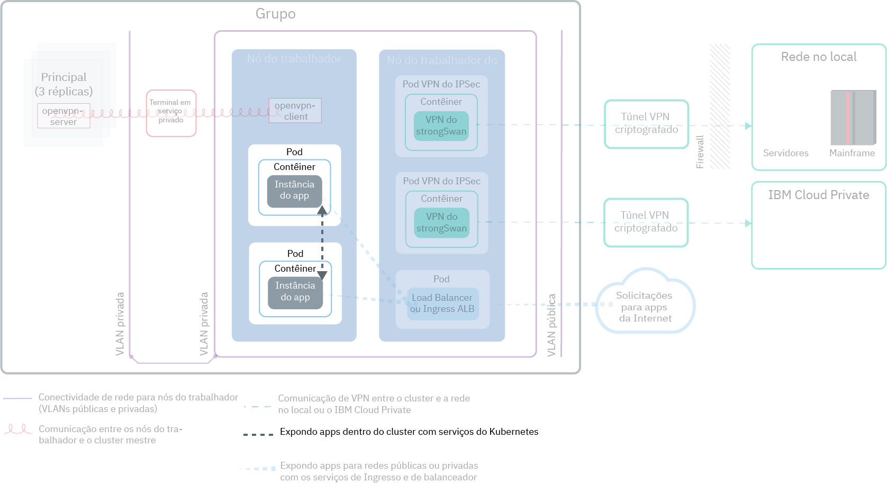
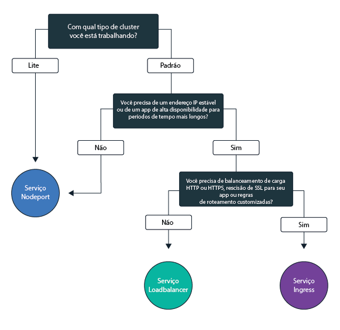
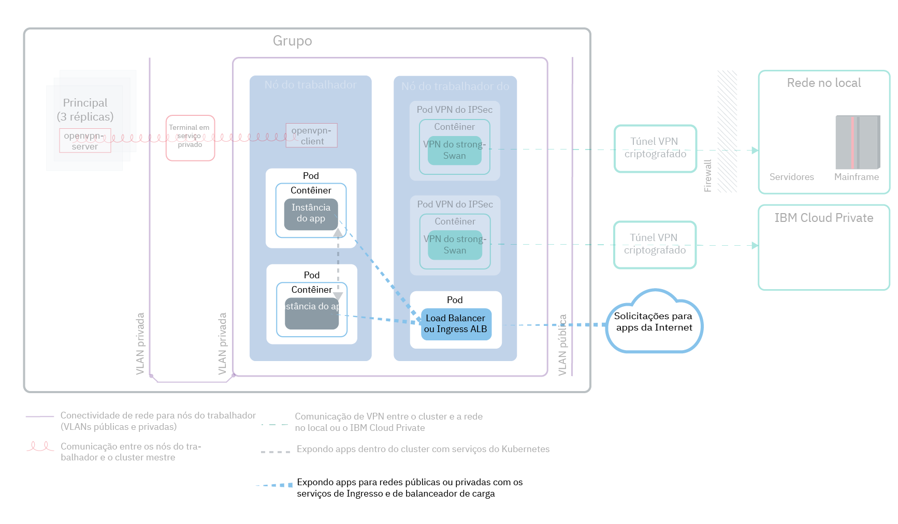
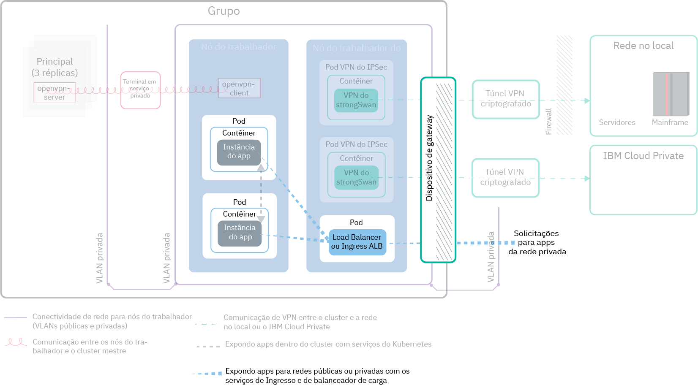

---

copyright:
  years: 2014, 2019
lastupdated: "2019-03-21"

keywords: kubernetes, iks

subcollection: containers

---

{:new_window: target="_blank"}
{:shortdesc: .shortdesc}
{:screen: .screen}
{:pre: .pre}
{:table: .aria-labeledby="caption"}
{:codeblock: .codeblock}
{:tip: .tip}
{:note: .note}
{:important: .important}
{:deprecated: .deprecated}
{:download: .download}

# Planejando expor seus apps com rede no cluster e externa
{: #cs_network_planning}

Com o {{site.data.keyword.containerlong}}, é possível gerenciar a rede no cluster e a externa, tornando os apps públicos ou privados acessíveis.
{: shortdesc}

Esta página ajuda a planejar a rede no cluster e externa para seus apps. Para obter informações sobre como configurar seu cluster para rede, consulte [Configurando a sua rede de cluster](/docs/containers?topic=containers-cs_network_cluster).
{: tip}

## Expondo apps ao tráfego dentro do cluster por meio de serviços do Kubernetes
{: #in-cluster}

Crie serviços de descoberta do Kubernetes para permitir a comunicação entre os pods em seu cluster.
{: shortdesc}

<figure>
 
 <figcaption>Expondo apps dentro do cluster com os serviços Kubernetes</figcaption>
</figure>

Todos os pods que são implementados em um nó do trabalhador são designados a um endereço IP privado no intervalo 172.30.0.0/16 e são roteados somente entre os nós do trabalhador. Para evitar conflitos, não use esse intervalo de IPs em quaisquer nós que se comunicam com os nós do trabalhador. Os nós do trabalhador e os pods podem se comunicar com segurança na rede privada usando endereços IP privados. No entanto, quando um pod trava ou um nó do trabalhador precisa ser recriado, um novo endereço IP privado
é designado.

Por padrão, é difícil rastrear a mudança de endereços IP privados para apps que devem estar altamente disponíveis. Em vez disso, é possível usar os recursos de descoberta de serviço do Kubernetes integrados para expor apps como serviços IP do cluster na rede privada. Um serviço do Kubernetes agrupa um conjunto de pods e fornece uma conexão de rede para esses pods. Essa conexão fornece conectividade a outros serviços no cluster sem expor o endereço IP privado real de cada pod. Os serviços são designados a um endereço IP em cluster que é acessível somente dentro do cluster.
* Clusters mais antigos: em clusters que foram criados antes de fevereiro de 2018 na zona dal13 ou antes de outubro de 2017 em qualquer outra zona, os serviços são designados a um IP de um dos 254 IPs no intervalo 10.10.10.0/24. Se você atinge o limite de 254 serviços e precisa de mais serviços, deve-se criar um novo cluster.
* Clusters mais recentes: em clusters que foram criados após fevereiro de 2018 na zona dal13 ou depois de outubro de 2017 em qualquer outra zona, os serviços são designados a um IP de um dos 65.000 IPs no intervalo 172.21.0.0/16.

Para evitar conflitos, não use esse intervalo de IPs em quaisquer nós que se comunicam com os nós do trabalhador. Uma entrada de consulta de DNS também é criada para o serviço e armazenada no componente `kube-dns` do cluster. A entrada de DNS contém o nome do serviço, o namespace no qual o serviço foi criado e o link para o endereço IP no cluster designado.

Para acessar um pod atrás de um serviço de cluster, os apps podem usar o endereço IP em cluster do serviço ou enviar uma solicitação usando o nome do serviço. Quando você usa o nome do serviço, o nome é consultado no componente `kube-dns` e roteado para o endereço IP em cluster do serviço. Quando uma solicitação atinge o serviço, o serviço encaminha solicitações para os pods igualmente, independentemente dos endereços IP no cluster e do nó do trabalhador no qual eles estão implementados.

 

## Escolhendo um serviço NodePort, LoadBalancer ou Ingress para expor apps ao tráfego fora do cluster
{: #external}

Para tornar seus apps externamente acessíveis por meio da Internet pública ou de uma rede privada, o {{site.data.keyword.containerlong_notm}} suporta três serviços de rede.
{:shortdesc}

**[Serviço NodePort](/docs/containers?topic=containers-nodeport)** (clusters grátis e padrão)
* Exponha uma porta em cada nó do trabalhador e use o endereço IP público ou privado de qualquer nó do trabalhador para acessar seu serviço no cluster.
* Iptables é um recurso de kernel Linux que balanceia a carga de solicitações nos pods do app, fornece roteamento de rede de alto desempenho e fornece controle de acesso à rede.
* Os endereços IP público e privado do nó do trabalhador não são permanentes. Quando um nó do trabalhador é removido ou recriado, um novo endereço IP público e um privado são designados ao nó do trabalhador.
* O serviço NodePort é ótimo para testar o acesso público ou privado. Ele também poderá ser usado se você precisar de acesso público ou privado por somente um curto período.

**[Serviço LoadBalancer](/docs/containers?topic=containers-loadbalancer)** (somente clusters padrão)
* Cada cluster padrão é provisionado com quatro endereços IP públicos móveis e quatro privados móveis que podem ser usados para criar um balanceador de carga TCP/UDP externo para seu app. É possível customizar seu balanceador de carga expondo qualquer porta que seu app requer.
* Iptables é um recurso de kernel Linux que balanceia a carga de solicitações nos pods do app, fornece roteamento de rede de alto desempenho e fornece controle de acesso à rede.
* Os endereços IP públicos e privados móveis que são designados ao balanceador de carga são permanentes e não mudam quando um nó do trabalhador é recriado no cluster.
* É possível criar um nome do host para seu app que registra os endereços IP do balanceador de carga pública com uma entrada DNS. Também é possível ativar os monitores de verificação de funcionamento nos IPs do balanceador de carga para cada nome do host.

**[Ingresso](/docs/containers?topic=containers-ingress)** (somente clusters padrão)
* Exponha múltiplos apps em um cluster criando um balanceador de carga de aplicativo HTTP, HTTPS ou TCP externo (ALB). O ALB usa um ponto de entrada público ou privado protegido e exclusivo, um subdomínio do Ingress, para rotear as solicitações recebidas para seus apps.
* É possível usar uma rota para expor múltiplos apps em seu cluster como serviços.
* O Ingresso consiste em três componentes:
  * O recurso de Ingresso define as regras de como rotear e balancear a carga de solicitações recebidas para um app.
  * O ALB atende às solicitações de serviço HTTP, HTTPS ou TCP recebidas. Ele encaminha as solicitações em pods dos apps com base nas regras que você definiu no recurso de Ingresso.
  * O multizone load balancer (MZLB) manipula todas as solicitações recebidas para seus apps e balanceia a carga das solicitações entre os ALBs em várias zonas. Ele também permite verificações de funcionamento no endereço IP do ALB em cada zona.
* Use o Ingress se for necessário implementar seu próprio ALB com regras de roteamento customizadas e precisar de terminação SSL para seus apps.

Para escolher o melhor serviço de rede para seu app, é possível seguir essa árvore de decisão e clicar em uma das opções para iniciar.

<map name="networking_map" id="networking_map">
<area href="/docs/containers?topic=containers-nodeport" alt="Serviço Nodeport" shape="circle" coords="52, 283, 45"/>
<area href="/docs/containers?topic=containers-loadbalancer" alt="Serviço LoadBalancer" shape="circle" coords="247, 419, 44"/>
<area href="/docs/containers?topic=containers-ingress" alt="Serviço Ingress" shape="circle" coords="445, 420, 45"/>
</map>

Deseja mais detalhes sobre os padrões de implementação de balanceamento de carga que estão disponíveis no {{site.data.keyword.containerlong_notm}}? Verifiqe esta [postagem do blog](https://www.ibm.com/blogs/bluemix/2018/10/ibm-cloud-kubernetes-service-deployment-patterns-for-maximizing-throughput-and-availability/).
{: tip}

 

## Planejando a rede pública externa para uma configuração de VLAN pública e privada
{: #public_access}

Quando você cria um cluster do Kubernetes no {{site.data.keyword.containerlong_notm}}, é possível conectar o cluster a uma VLAN pública. A VLAN pública determina o endereço IP público que é designado a cada nó do trabalhador, que fornece a cada nó do trabalhador uma interface de rede pública.
{:shortdesc}

<figure>
 
 <figcaption>Expondo apps para uma rede pública em uma configuração de rede padrão</figcaption>
</figure>

A interface de rede pública para os nós do trabalhador é protegida por [configurações de política de rede do Calico predefinidas](/docs/containers?topic=containers-network_policies#default_policy) que são configuradas em cada nó do trabalhador durante a criação do cluster.

Por padrão, todo o tráfego de rede de saída é permitido para todos os nós do trabalhador. O tráfego de rede de entrada está bloqueado, exceto para algumas portas. Essas portas são abertas para que a IBM possa monitorar o tráfego de rede e instalar automaticamente as atualizações de segurança para o mestre do Kubernetes e para que as conexões possam ser estabelecidas para os serviços NodePort, LoadBalancer e Ingress. Para obter mais informações sobre essas políticas, incluindo como modificá-las, veja [Políticas de rede](/docs/containers?topic=containers-network_policies#network_policies).

Para tornar um app publicamente disponível para a Internet, é possível criar um serviço NodePort, LoadBalancer ou Ingress. Para comparar cada serviço, consulte [Escolhendo um serviço NodePort, LoadBalancer ou Ingress](#external).

O diagrama a seguir mostra como o Kubernetes encaminha o tráfego de rede pública no {{site.data.keyword.containerlong_notm}}.

 

## Planejando a rede externa privada para uma configuração de VLAN pública e privada
{: #private_both_vlans}

Quando os seus nós do trabalhador são conectados a ambas, uma VLAN pública e uma privada, é possível tornar o seu app acessível somente por meio de uma rede privada criando os serviços privados NodePort, LoadBalancer ou Ingress. Em seguida, é possível criar políticas do Calico para bloquear o tráfego público para os serviços.
{: shortdesc}

A interface de rede pública para os nós do trabalhador é protegida por [configurações de política de rede do Calico predefinidas](/docs/containers?topic=containers-network_policies#default_policy) que são configuradas em cada nó do trabalhador durante a criação do cluster. Por padrão, todo o tráfego de rede de saída é permitido para todos os nós do trabalhador. O tráfego de rede de entrada está bloqueado, exceto para algumas portas. Essas portas são abertas para que a IBM possa monitorar o tráfego de rede e instalar automaticamente as atualizações de segurança para o mestre do Kubernetes e para que as conexões possam ser estabelecidas para os serviços NodePort, LoadBalancer e Ingress.

Se você desejar expor os seus apps somente em uma rede privada, será possível criar os serviços privados NodePort, LoadBalancer ou Ingress.

** NodePort **
* [Crie um serviço NodePort](/docs/containers?topic=containers-nodeport). Além do endereço IP público, um serviço NodePort está disponível durante o endereço IP privado de um nó do trabalhador.
* Um serviço NodePort abre uma porta em um nó do trabalhador sobre o endereço IP privado e público do nó do trabalhador. Deve-se usar uma [política de rede preDNAT do Calico](/docs/containers?topic=containers-network_policies#block_ingress) para bloquear os NodePorts públicos.

**LoadBalancer**
* [Crie um serviço do LoadBalancer privado](/docs/containers?topic=containers-loadbalancer).
* Um serviço de balanceador de carga com um endereço IP privado móvel ainda tem uma porta do nó público aberta em cada nó do trabalhador. Deve-se usar uma [política de rede preDNAT do Calico](/docs/containers?topic=containers-network_policies#block_ingress) para bloquear as portas de nó público nele.

**Entrada
    **
* Ao criar um cluster, um balanceador de carga do aplicativo (ALB) de ingresso público e um privado são criados automaticamente. Como o ALB público está ativado e o ALB privado está desativado por padrão, deve-se [desativar o ALB público](/docs/containers?topic=containers-cs_cli_reference#cs_alb_configure) e [ativar o ALB privado](/docs/containers?topic=containers-ingress#private_ingress).
* Em seguida,  [ crie um serviço de Ingresso privado ](/docs/containers?topic=containers-ingress#ingress_expose_private).

Como as políticas de rede padrão do Calico permitem o tráfego público de entrada para esses serviços, é possível criar políticas do Calico para, em vez disso, bloquear todo o tráfego público para os serviços. Por exemplo, um serviço NodePort abre uma porta em um nó trabalhador por meio do endereço IP privado e público do nó do trabalhador. Um serviço de balanceador de carga com um endereço IP privado móvel abre um NodePort público em cada nó do trabalhador. Deve-se criar uma [política de rede preDNAT do Calico](/docs/containers?topic=containers-network_policies#block_ingress) para bloquear NodePorts públicos.

Como um exemplo, vamos supor que você criou um serviço de balanceador de carga privado. Você também criou uma política preDNAT do Calico para bloquear o tráfego público de atingir os NodePorts públicos abertos pelo balanceador de carga. Esse balanceador de carga privado pode ser acessado por:
* Qualquer pod no mesmo cluster
* Qualquer pod em qualquer cluster na mesma conta do {{site.data.keyword.Bluemix_notm}}
* Se você tiver a [ampliação de VLAN ativada](/docs/containers?topic=containers-subnets#subnet-routing), qualquer sistema que esteja conectado a qualquer uma das VLANs privadas na mesma conta do {{site.data.keyword.Bluemix_notm}}
* Se você não estiver na conta do {{site.data.keyword.Bluemix_notm}}, mas ainda estiver atrás do firewall da empresa, qualquer sistema por meio de uma conexão VPN com a sub-rede em que o IP do balanceador de carga estiver
* Se você estiver em uma conta {{site.data.keyword.Bluemix_notm}} diferente, qualquer sistema por meio de uma conexão VPN com a sub-rede em que o IP do balanceador de carga estiver.

 

## Planejando a rede externa privada para uma configuração somente de VLAN privada
{: #plan_private_vlan}

Quando os nós do trabalhador são conectados a uma VLAN somente privada e você permite que os nós principal e do trabalhador se comuniquem por meio de [um dispositivo de gateway](/docs/containers?topic=containers-cs_network_ov#cs_network_ov_master_gateway), é possível tornar seu app acessível por meio de uma rede somente privada criando serviços privados de NodePort, LoadBalancer ou Ingress.
{: shortdesc}

<figure>
 
 <figcaption>Expondo apps para uma rede privada em uma configuração de rede privada</figcaption>
</figure>

Como os nós do trabalhador não estão conectados a uma VLAN pública, nenhum tráfego público é roteado para esses serviços. Também deve-se [abrir as portas e os endereços IP necessários](/docs/containers?topic=containers-firewall#firewall_inbound) em seu firewall de dispositivo de gateway para permitir o tráfego de entrada para esses serviços.

** NodePort **:
* [ Criar um serviço NodePort privado ](/docs/containers?topic=containers-nodeport). O serviço está disponível por meio do endereço IP privado de um nó do trabalhador.
* Em seu firewall privado, abra a porta que você configurou quando implementou o serviço nos endereços IP privados para todos os nós do trabalhador para os quais permitir o tráfego. Para localizar a porta, execute `kubectl get svc`. A porta está no intervalo de 20000 a 32000.

**LoadBalancer**
* [Crie um serviço do LoadBalancer privado](/docs/containers?topic=containers-loadbalancer). Se o seu cluster está disponível somente em uma VLAN privada, um dos quatro endereços IP privados móveis disponíveis é usado.
* Em seu firewall privado, abra a porta que você configurou quando implementou o serviço para o endereço IP privado do serviço de balanceador de carga.

** Ingresso **:
* Deve-se configurar um [serviço DNS que está disponível na rede privada ](https://kubernetes.io/docs/tasks/administer-cluster/dns-custom-nameservers/).
* Ao criar um cluster, um balanceador de carga do aplicativo (ALB) de ingresso privado é criado automaticamente, mas não é ativado por padrão. Você deve  [ ativar o ALB privado ](/docs/containers?topic=containers-ingress#private_ingress).
* Em seguida,  [ crie um serviço de Ingresso privado ](/docs/containers?topic=containers-ingress#ingress_expose_private).
* Em seu firewall privado, abra a porta 80 para HTTP ou a porta 443 para HTTPS para o endereço IP para o ALB privado.

Se o seu cluster estiver conectado a uma VLAN somente privada e você ativar os nós do mestre e do trabalhador para se comunicarem por meio de um terminal em serviço somente privado, não será possível expor seus apps a uma rede privada. Deve-se configurar um dispositivo de gateway, como um [VRA](/docs/infrastructure/virtual-router-appliance?topic=virtual-router-appliance-about-the-vra) ou um [FSA](/docs/services/vmwaresolutions/services?topic=vmware-solutions-fsa_considerations) para agir como seu firewall e bloquear o tráfego indesejado. Se você não desejar configurar um dispositivo de gateway, será possível [criar um conjunto de trabalhadores](/docs/containers?topic=containers-clusters#add_pool) que esteja conectado a VLANs públicas e privadas. Em seguida, é possível rotular esses nós do trabalhador como nós de borda e usar políticas do Calico para bloquear todo o tráfego público indesejado. Para obter mais informações, consulte [Isolar as cargas de trabalho de rede para os nós do trabalhador de borda](/docs/containers?topic=containers-cs_network_planning#both_vlans_private_edge).
{: note}

 

## Opcional: Isolando cargas de trabalho de rede para nós do trabalhador de borda
{: #both_vlans_private_edge}

Os nós do trabalhador de borda podem melhorar a segurança de seu cluster, permitindo que menos nós do trabalhador sejam acessados externamente e isolando a carga de trabalho de rede. Para assegurar que os pods do Ingresso e do balanceador de carga sejam implementados somente para os nós do trabalhador especificados, [rotule os nós do trabalhador como nós de borda](/docs/containers?topic=containers-edge#edge_nodes). Para também evitar que outras cargas de trabalho sejam executadas em nós de borda, [contamine os nós de borda](/docs/containers?topic=containers-edge#edge_workloads).
{: shortdesc}

Se o seu cluster estiver conectado a uma VLAN pública, mas você desejar bloquear o tráfego para NodePorts públicos em nós do trabalhador de borda, também será possível usar uma [política de rede preDNAT do Calico](/docs/containers?topic=containers-network_policies#block_ingress). Bloquear as portas de nós assegura que os nós do trabalhador de borda sejam os únicos nós do trabalhador que manipulam o tráfego recebido.

## Opcional: Isolando seu cluster na rede privada
{: #isolate}

Se você tiver um cluster de múltiplas zonas, múltiplas VLANs para um cluster de zona única ou múltiplas sub-redes na mesma VLAN, deverá [ativar a ampliação de VLAN](/docs/infrastructure/vlans?topic=vlans-vlan-spanning#vlan-spanning) ou o [VRF](/docs/infrastructure/direct-link?topic=direct-link-overview-of-virtual-routing-and-forwarding-vrf-on-ibm-cloud#customer-vrf-overview) para que seus nós do trabalhador possam se comunicar uns com os outros na rede privada. No entanto, quando a ampliação de VLAN ou o VRF está ativado, qualquer sistema que esteja conectado a qualquer uma das VLANs privadas na mesma conta do IBM Cloud poderá acessar seus trabalhadores. É possível isolar seu cluster de múltiplas zonas de outros sistemas na rede privada usando [Políticas de rede do Calico](/docs/containers?topic=containers-network_policies#isolate_workers). Essas políticas também permitem ingresso e egresso para os intervalos de IP privado e portas que você abriu em seu firewall privado.
{: shortdesc}
