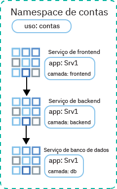
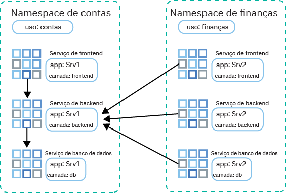

---

copyright:
  years: 2014, 2019
lastupdated: "2019-06-11"

keywords: kubernetes, iks

subcollection: containers

---

{:new_window: target="_blank"}
{:shortdesc: .shortdesc}
{:screen: .screen}
{:pre: .pre}
{:table: .aria-labeledby="caption"}
{:codeblock: .codeblock}
{:tip: .tip}
{:note: .note}
{:important: .important}
{:deprecated: .deprecated}
{:download: .download}
{:preview: .preview}


# Controlando o tráfego com políticas de rede
{: #network_policies}

Cada cluster do Kubernetes é configurado com um plug-in de rede chamado Calico. As políticas de rede padrão são configuradas para assegurar a interface de rede pública de cada nó do trabalhador no {{site.data.keyword.containerlong}}.
{: shortdesc}

Se você tiver requisitos de segurança exclusivos ou tiver um cluster de múltiplas zonas com o VLAN Spanning ativado, será possível usar o Calico e o Kubernetes para criar políticas de rede para um cluster. Com políticas de rede do Kubernetes, é possível especificar o tráfego de rede que você deseja permitir ou bloquear para/de um pod em um cluster. Para configurar políticas de rede mais avançadas, como o bloqueio do tráfego de entrada (ingresso) para serviços de balanceador de carga de rede (NLB), use as políticas de rede do Calico.

<ul>
  <li>
  [Políticas de rede do Kubernetes ](https://kubernetes.io/docs/concepts/services-networking/network-policies/): essas políticas especificam como os pods podem se comunicar com outros pods e com terminais externos. Desde o Kubernetes versão 1.8, ambos os tráfegos, recebido e de saída, podem ser permitidos ou bloqueados com base no protocolo, na porta e nos endereços IP de origem ou de destino. O tráfego também pode ser filtrado com base nos rótulos de pod e de namespace. As políticas de rede do Kubernetes são aplicadas usando comandos `kubectl` ou as APIs do Kubernetes. Quando essas políticas são aplicadas, elas são convertidas automaticamente em políticas de rede do Calico e o Calico cumpre essas políticas.
  </li>
  <li>
  [Políticas de rede do Calico ](https://docs.projectcalico.org/v3.3/getting-started/bare-metal/policy/): Essas políticas são um superconjunto das políticas de rede do Kubernetes e são aplicadas usando os comandos `calicoctl`. As políticas do Calico incluir os recursos a seguir.
    <ul>
    <li>Permitir ou bloquear tráfego de rede em interfaces de rede específicas independentemente do endereço IP de origem ou destino do pod do Kubernetes ou CIDR.</li>
    <li>Permitir ou bloquear tráfego de rede para os pods em namespaces.</li>
    <li>[Bloquear tráfego de entrada (ingresso) para os serviços LoadBalancer ou NodePort do Kubernetes](#block_ingress).</li>
    </ul>
  </li>
  </ul>

O Calico cumpre essas políticas, incluindo quaisquer políticas de rede do Kubernetes que são convertidas automaticamente em políticas do Calico, configurando regras Iptables do Linux nos nós do trabalhador do Kubernetes. As regras de Iptables servem como um firewall para o nó do trabalhador para definir as características que o tráfego de rede deve atender para ser encaminhado para o recurso de destino.

Para usar os serviços do balanceador de carga de rede (NLB) e do balanceador de carga do aplicativo (ALB) Ingress, use as políticas do Calico e do Kubernetes para gerenciar o tráfego de rede dentro e fora do cluster. Não use os [grupos de segurança](/docs/infrastructure/security-groups?topic=security-groups-about-ibm-security-groups#about-ibm-security-groups) da infraestrutura do IBM Cloud (SoftLayer). Os grupos de segurança da infraestrutura do IBM Cloud (SoftLayer) são aplicados à interface de rede de um único servidor virtual para filtrar o tráfego no nível do hypervisor. No entanto, os grupos de segurança não suportam o protocolo VRRP, que é usado pelo {{site.data.keyword.containerlong_notm}} para gerenciar os endereços IP do ALB e do NLB. Se o protocolo VRRP não estiver presente para gerenciar o IP, os serviços ALB e NLB não funcionarão corretamente.
{: tip}

<br />


## Políticas de rede padrão do Calico e do Kubernetes
{: #default_policy}

Quando um cluster com uma VLAN pública é criado, um recurso `HostEndpoint` com o rótulo `ibm.role: worker_public` é criado automaticamente para cada nó do trabalhador e sua interface de rede pública. Para proteger a interface de rede pública de um nó do trabalhador, as políticas padrão do Calico são aplicadas a qualquer terminal de host com o rótulo `ibm.role: worker_public`.
{:shortdesc}

Essas políticas de host padrão do Calico permitem todo o tráfego de rede de saída e o tráfego de entrada para componentes específicos de cluster, como serviços NodePort, LoadBalancer e Ingress do Kubernetes. Qualquer outro tráfego de rede de entrada da Internet para os nós do trabalhador que não está especificado nas políticas padrão é bloqueado. As políticas padrão não afetam o tráfego de pod para pod.

Revise as políticas de host padrão do Calico a seguir que são aplicadas automaticamente ao seu cluster.

Não remova políticas que são aplicadas a um terminal de host, a menos que você entenda completamente a política. Certifique-se de que você não precise do tráfego que está sendo permitido pela política.
{: important}

 <table summary="A primeira linha na tabela abrange ambas as colunas. Leia o restante das linhas da esquerda para a direita, com a zona do servidor na coluna um e os endereços IP para corresponder na coluna dois.">
 <caption>Políticas de host padrão do Calico para cada cluster</caption>
  <thead>
  <th colspan=2> Políticas de host padrão do Calico para cada cluster</th>
  </thead>
  <tbody>
    <tr>
      <td><code>allow-all-outbound</code></td>
      <td>Permite todo o tráfego de saída.</td>
    </tr>
    <tr>
      <td><code> allow-bigfix-port </code></td>
      <td>Permite o tráfego recebido na porta 52311 para o app BigFix para permitir as atualizações necessárias do nó do trabalhador.</td>
    </tr>
    <tr>
      <td><code>allow-icmp</code></td>
      <td>Permite pacotes ICMP recebidas (pings).</td>
     </tr>
    <tr>
      <td><code>allow-node-port-dnat</code></td>
      <td>Permite o tráfego dos serviços de balanceador de carga de rede (NLB) de entrada, de balanceador de carga do aplicativo (ALB) Ingress e NodePort para os pods expostos por eles. <strong>Nota</strong>: você não precisa especificar as portas expostas porque o Kubernetes usa a conversão de endereço de rede de destino (DNAT) para encaminhar as solicitações de serviço para os pods corretos. Esse redirecionamento ocorre antes que as políticas de terminal de host sejam aplicadas em Iptables.</td>
   </tr>
   <tr>
      <td><code>allow-sys-mgmt</code></td>
      <td>Permite conexões recebidas para sistemas específicos da infraestrutura do IBM Cloud (SoftLayer) que são usados para gerenciar os nós do trabalhador.</td>
   </tr>
   <tr>
    <td><code>allow-vrrp</code></td>
    <td>Permitir pacotes VRRP, que são usados para monitorar e mover endereços IP virtuais entre os nós do trabalhador.</td>
   </tr>
  </tbody>
</table>

Uma política padrão do Kubernetes que limita o acesso ao Painel do Kubernetes também é criada. As políticas do Kubernetes não se aplicam ao terminal de host, mas ao pod `kube-dashboard`. Essa política se aplica a clusters conectados somente a uma VLAN privada e a clusters conectados a uma VLAN pública e privada.

<table>
<caption>Políticas padrão para cada cluster do Kubernetes</caption>
<thead>
<th colspan=2> Políticas padrão do Kubernetes para cada cluster</th>
</thead>
<tbody>
 <tr>
  <td><code>kubernetes-painel</code></td>
  <td>Fornecido no namespace <code>kube-system</code>: bloqueia o acesso de todos os pods ao Painel do Kubernetes. Essa política não impactará o acesso ao painel por meio do console do {{site.data.keyword.Bluemix_notm}} ou usando o <code>kubectl proxy</code>. Se um pod requer acesso ao painel, implemente o pod em um namespace que tenha o rótulo <code>kubernetes-dashboard-policy: allow</code>.</td>
 </tr>
</tbody>
</table>

<br />


## Instalando e Configurando o CLI do Calico
{: #cli_install}

Para visualizar, gerenciar e incluir políticas do Calico, instale e configure a CLI do Calico.
{:shortdesc}

1. [Efetue login em sua conta. Se aplicável, direcione o grupo de recursos apropriado. Configure o contexto para seu cluster.](/docs/containers?topic=containers-cs_cli_install#cs_cli_configure) Inclua as opções `--admin` e `--network` com o comando `ibmcloud ks cluster-config`. `--admin` faz download das chaves para acessar seu portfólio de infraestrutura e executar comandos do Calico em seus nós do trabalhador. `--network` faz download do arquivo de configuração do Calico para executar todos os comandos do Calico.

  ```
  ibmcloud ks cluster-config --cluster <cluster_name_or_ID> --admin --network
  ```
  {: pre}

3. Para usuários do OS X e Linux, conclua as etapas a seguir.
    1. Crie o diretório `/etc/calico`.
        ```
        sudo mkdir /etc/calico
        ```
        {: pre}

    2. Mova o arquivo de configuração do Calico que você transferiu por download anteriormente para o diretório.
        ```
        sudo mv /Users/<user>/.bluemix/plugins/container-service/clusters/<cluster_name>-admin/calicoctl.cfg /etc/calico
        ```
        {: pre}

4. [Faça download da CLI do Calico ](https://github.com/projectcalico/calicoctl/releases).

    Se você estiver usando o OS X, faça download da versão `-darwin-amd64`. Se estiver usando o Windows, instale a CLI do Calico no mesmo diretório que a CLI do {{site.data.keyword.Bluemix_notm}}. Essa configuração economiza algumas mudanças de caminho de arquivo ao executar comandos posteriormente. Certifique-se de salvar o arquivo como `calicoctl.exe`.
    {: tip}

5. Para usuários do OS X e Linux, conclua as etapas a seguir.
    1. Mova o arquivo executável para o diretório _/usr/local/bin_.
        - Linux:

          ```
          Mv filepath /calicoctl /usr/local/bin/calicoctl
          ```
          {: pre}

        - OS X:

          ```
          Mv filepath/calicoctl-darwin-amd64 /usr/local/bin/calicoctl
          ```
          {: pre}

    2. Torne o arquivo um arquivo executável.

        ```
        chmod +x /usr/local/bin/calicoctl
        ```
        {: pre}

6. Se as políticas de rede corporativa usam proxies ou firewalls para evitar o acesso de seu sistema local a terminais públicos, [permita o acesso TCP para comandos do Calico](/docs/containers?topic=containers-firewall#firewall).

7. Verifique se a configuração do Calico está funcionando
corretamente.

    - Linux e OS X:

      ```
      calicoctl get nodes
      ```
      {: pre}

    - Windows: use o sinalizador `--config` para apontar para o arquivo de configuração de rede que você obteve na etapa 1. Inclua esse sinalizador toda vez que você executar um comando `calicoctl`.

      ```
      calicoctl get nodes --config=filepath/calicoctl.cfg
      ```
      {: pre}

      Saída:

      ```
      NAME
              kube-dal10-crc21191ee3997497ca90c8173bbdaf560-w1.cloud.ibm
              kube-dal10-crc21191ee3997497ca90c8173bbdaf560-w2.cloud.ibm
              kube-dal10-crc21191ee3997497ca90c8173bbdaf560-w3.cloud.ibm
      ```
      {: screen}

<br />


## Visualizando políticas de rede
{: #view_policies}

Visualize os detalhes para políticas padrão e quaisquer políticas de rede incluídas que são aplicadas a seu cluster.
{:shortdesc}

Antes de iniciar:
1. [Instale e configure o CLI do Calico.](#cli_install)
2. [Efetue login em sua conta. Se aplicável, direcione o grupo de recursos apropriado. Configure o contexto para seu cluster.](/docs/containers?topic=containers-cs_cli_install#cs_cli_configure) Inclua as opções `--admin` e `--network` com o comando `ibmcloud ks cluster-config`. `--admin` faz download das chaves para acessar seu portfólio de infraestrutura e executar comandos do Calico em seus nós do trabalhador. `--network` faz download do arquivo de configuração do Calico para executar todos os comandos do Calico.

  ```
  ibmcloud ks cluster-config --cluster <cluster_name_or_ID> --admin --network
  ```
  {: pre}

** Para visualizar políticas de rede em clusters **:

Os usuários do Linux e Mac não precisam incluir a sinalização `--config=filepath/calicoctl.cfg` em comandos `calicoctl`.
{: tip}

1. Visualize o terminal de host do Calico.

    ```
    calicoctl get hostendpoint -o yaml --config=filepath/calicoctl.cfg
    ```
    {: pre}

2. Visualize todas as políticas de rede do Calico e do Kubernetes que foram criadas para o cluster. Essa lista inclui políticas que podem não estar aplicadas a quaisquer pods ou hosts ainda. Para que uma política de rede seja aplicada, deverá ser localizado um recurso do Kubernetes que corresponda ao seletor definido na política de rede do Calico.

    [As políticas de rede ](https://docs.projectcalico.org/v3.3/reference/calicoctl/resources/networkpolicy) estão com escopo definido para namespaces específicos:
    ```
    calicoctl get NetworkPolicy --all-namespaces -o wide --config=filepath/calicoctl.cfg
    ```
    {:pre}

    [As políticas de rede global ](https://docs.projectcalico.org/v3.3/reference/calicoctl/resources/globalnetworkpolicy) não estão com escopo definido para namespaces específicos:
    ```
    calicoctl get GlobalNetworkPolicy -o wide -- config=filepath/calicoctl.cfg
    ```
    {: pre}

3. Visualize detalhes para uma política de rede.

    ```
    calicoctl get NetworkPolicy -o yaml <policy_name> --namespace <policy_namespace> --config=filepath/calicoctl.cfg
    ```
    {: pre}

4. Visualize os detalhes de todas as políticas de rede global para o cluster.

    ```
    calicoctl get GlobalNetworkPolicy -o yaml --config=filepath/calicoctl.cfg
    ```
    {: pre}

<br />


## Incluindo políticas de rede
{: #adding_network_policies}

Na maioria dos casos, as políticas padrão não precisam ser mudadas. Somente cenários avançados podem requerer mudanças. É possível criar suas próprias políticas de rede quando você acha necessário fazer mudanças.
{:shortdesc}

Para criar políticas de rede do Kubernetes, veja a [documentação de política de rede do Kubernetes ](https://kubernetes.io/docs/concepts/services-networking/network-policies/).

Para criar políticas do Calico, use as etapas a seguir.

1. [Instale e configure o CLI do Calico.](#cli_install)
2. [Efetue login em sua conta. Se aplicável, direcione o grupo de recursos apropriado. Configure o contexto para seu cluster.](/docs/containers?topic=containers-cs_cli_install#cs_cli_configure) Inclua as opções `--admin` e `--network` com o comando `ibmcloud ks cluster-config`. `--admin` faz download das chaves para acessar seu portfólio de infraestrutura e executar comandos do Calico em seus nós do trabalhador. `--network` faz download do arquivo de configuração do Calico para executar todos os comandos do Calico.

  ```
  ibmcloud ks cluster-config --cluster <cluster_name_or_ID> --admin --network
  ```
  {: pre}

3. Defina sua [política de rede ](https://docs.projectcalico.org/v3.3/reference/calicoctl/resources/networkpolicy) ou [política de rede global ](https://docs.projectcalico.org/v3.3/reference/calicoctl/resources/globalnetworkpolicy) do Calico criando um script de configuração (`.yaml`) com a sintaxe de política do Calico v3. Esses arquivos de configuração incluem os seletores que descrevem a quais pods, namespaces ou hosts essas políticas se aplicam. Consulte essas [Políticas de amostra do Calico ](http://docs.projectcalico.org/v3.3/getting-started/kubernetes/tutorials/advanced-policy) para ajudá-lo a criar a sua própria.

4. Aplique as políticas ao cluster.
    - Linux e OS X:

      ```
      Policy.yaml calicoctl apply -f
      ```
      {: pre}

    - Windows:

      ```
      Filepath/policy.yaml apply -f calicoctl -- config=filepath/calicoctl.cfg
      ```
      {: pre}

<br />


## Controlando o tráfego de entrada para serviços NLB ou NodePort
{: #block_ingress}

[Por padrão](#default_policy), os serviços NodePort e LoadBalancer do Kubernetes são projetados para tornar seu app disponível em todas as interfaces de cluster público e privado. No entanto, é possível usar políticas do Calico para bloquear o tráfego recebido para os seus serviços com base na origem ou no destino do tráfego.
{:shortdesc}

As políticas padrão do Kubernetes e do Calico são difíceis de aplicar para proteger os serviços do Kubernetes NodePort e LoadBalancer devido às regras de Iptables de DNAT geradas para esses serviços. No entanto, as políticas pré-DNAT impedem o tráfego especificado de alcançar seus apps porque eles geram e aplicam regras de Iptables antes que o Kubernetes use DNAT regular para encaminhar o tráfego para os pods.

Alguns usos comuns para políticas de rede pré-DNAT do Calico:

  - Bloquear o tráfego para portas de nó público de um serviço de balanceador de carga de rede (NLB) privada: um serviço NLB disponibiliza seu aplicativo pelo endereço IP e pela porta e, também, pelas portas do nó do serviço. As portas de nó são acessíveis em cada endereço IP (público e privado) para cada nó no cluster.
  - Bloquear tráfego para portas de nó público em clusters que estão executando [nós do trabalhador de borda](/docs/containers?topic=containers-edge#edge): bloquear as portas do nó assegura que os nós do trabalhador de borda sejam os únicos nós do trabalhador que manipulam o tráfego recebido.
  - Bloquear tráfego de determinados endereços IP de origem ou CIDRs (listagem negra)
  - Permitir o tráfego somente de determinados endereços IP de origem ou CIDRs (whitelisting) e bloquear todo outro tráfego

Para ver como incluir na lista de desbloqueio ou lista de bloqueio os endereços IP de origem, tente o [tutorial Usando políticas de rede do Calico para bloquear o tráfego](/docs/containers?topic=containers-policy_tutorial#policy_tutorial). Para obter mais políticas de rede do Calico de exemplo que controlam o tráfego para e por meio do seu cluster, é possível efetuar check-out da [demo de política de estrelas ](https://docs.projectcalico.org/v3.3/getting-started/kubernetes/tutorials/stars-policy/) e da [política de rede avançada ](https://docs.projectcalico.org/v3.3/getting-started/kubernetes/tutorials/advanced-policy).
{: tip}

Antes de iniciar:
1. [Instale e configure o CLI do Calico.](#cli_install)
2. [Efetue login em sua conta. Se aplicável, direcione o grupo de recursos apropriado. Configure o contexto para seu cluster.](/docs/containers?topic=containers-cs_cli_install#cs_cli_configure) Inclua as opções `--admin` e `--network` com o comando `ibmcloud ks cluster-config`. `--admin` faz download das chaves para acessar seu portfólio de infraestrutura e executar comandos do Calico em seus nós do trabalhador. `--network` faz download do arquivo de configuração do Calico para executar todos os comandos do Calico.

  ```
  ibmcloud ks cluster-config --cluster <cluster_name_or_ID> --admin --network
  ```
  {: pre}

Para criar uma política pré-DNAT:

1. Defina uma política de rede pré-DNAT do Calico para acesso de ingresso (tráfego de entrada) aos serviços do Kubernetes.
    * Use [a sintaxe de política do Calico v3 ](https://docs.projectcalico.org/v3.3/reference/calicoctl/resources/networkpolicy).
    * Se você gerenciar o tráfego para um [NLB 2.0](/docs/containers?topic=containers-loadbalancer#planning_ipvs), deverá incluir os campos `applyOnForward: true` e `doNotTrack: true` na seção `spec` da política.

        Recurso de exemplo que bloqueia todas as portas de nó:

        ```
        apiVersion: projectcalico.org/v3
        kind: GlobalNetworkPolicy
        metadata:
          name: deny-nodeports
        spec:
          applyOnForward: true
          preDNAT: true
          ingress:
          - action: Deny destination: ports:
              - 30000:32767
            protocol: TCP
            source: {}
          - action: Deny destination: ports:
              - 30000:32767
        protocol: UDP
        source: {}
      selector: ibm.role=='worker_public'
      order: 1100
      types:
          - Entrada
        ```
        {: codeblock}

        Recurso de exemplo que inclui na lista de desbloqueio o tráfego de apenas um CIDR de origem especificado para um NLB 2.0:

        ```
        apiVersion: projectcalico.org/v3 kind: GlobalNetworkPolicy metadata: name: whitelist spec: applyOnForward: true doNotTrack: true ingress:
          - action: Allow
        destination:
          nets:
              - <loadbalancer_IP>/32 portas:
              - 80 protocol: TCP source: nets:
              - <client_address>/32 selector: ibm.role=='worker_public' order: 500 types:
          - Entrada
        ```
        {: codeblock}

        Recurso de exemplo que inclui na lista de desbloqueio o tráfego de apenas um CIDR de origem especificado para um NLB 1.0:

        ```
        apiVersion: projectcalico.org/v3
        kind: GlobalNetworkPolicy
        metadata:
          name: whitelist
        spec:
          applyOnForward: true
          preDNAT: true
          ingress:
          - action: Allow
        destination:
          nets:
              - <loadbalancer_IP>/32 portas:
              - 80 protocol: TCP source: nets:
              - <client_address>/32 selector: ibm.role=='worker_public' order: 500 types:
          - Entrada
        ```
        {: codeblock}

2. Aplique a política de rede Calico preDNAT. Leva aproximadamente 1 minuto para as mudanças de política serem aplicadas em todo o cluster.

  - Linux e OS X:

    ```
    calicoctl apply -f deny-nodeports.yaml
    ```
    {: pre}

  - Windows:

    ```
    calicoctl apply -f filepath/deny-nodeports.yaml -- config=filepath/calicoctl.cfg
    ```
    {: pre}

3. Opcional: em clusters de múltiplas zonas, uma verificação de funcionamento do balanceador de carga de múltiplas zonas (MZLB) verifica os balanceadores de carga de aplicativo (ALBs) do Ingress em cada zona de seu cluster e mantém os resultados de consulta de DNS atualizados com base nessas verificações de funcionamento. Se você usa políticas pré-DNAT para bloquear todo o tráfego recebido para serviços Ingress, deve-se também incluir na lista de desbloqueio os [IPs IPv4 do Cloudflare ](https://www.cloudflare.com/ips/) que são usados para verificar o funcionamento de seus ALBs. Para obter as etapas sobre como criar uma política pré-DNAT do Calico para incluir na lista de desbloqueio esses IPs, consulte a Lição 3 do [Tutorial de política de rede do Calico](/docs/containers?topic=containers-policy_tutorial#lesson3).

## Isolando clusters na rede privada
{: #isolate_workers}

Se você tem um cluster de multizona, múltiplas VLANs para um cluster de zona única ou múltiplas sub-redes na mesma VLAN, deve-se ativar um VRF ou um VLAN Spanning para que seus nós do trabalhador possam se comunicar entre si na rede privada. No entanto, quando o VRF ou o VLAN Spanning estiver ativado, qualquer sistema que estiver conectado a qualquer uma das VLANs privadas na mesma conta do {{site.data.keyword.Bluemix_notm}} poderá se comunicar com os trabalhadores.
{: shortdesc}

É possível isolar seu cluster de outros sistemas na rede privada aplicando [políticas de rede privada do Calico ](https://github.com/IBM-Cloud/kube-samples/tree/master/calico-policies/private-network-isolation). Esse conjunto de políticas do Calico e terminais de host isola o tráfego de rede privada de um cluster de outros recursos na rede privada da conta.

As políticas visam a interface privada do nó do trabalhador (eth0) e a rede de pod de um cluster.

**Nós do trabalhador**

* O egresso de interface privada é permitido somente para IPs de pod, trabalhadores nesse cluster e a porta UPD/TCP 53 para acesso de DNS, a porta 2049 para comunicação com servidores de arquivos NFS e as portas 443 e 3260 para comunicação com armazenamento de bloco.
* O ingresso de interface privada é permitido somente de trabalhadores no cluster e somente para DNS, kubelet, ICMP e VRRP.

**Pods**

* Todos os ingressos para pods são permitidos de trabalhadores no cluster.
* O egresso de pods é restrito somente a IPs públicos, DNS, kubelet e outros pods no cluster.

Antes de iniciar:
1. [Instale e configure o CLI do Calico.](#cli_install)
2. [Efetue login em sua conta. Se aplicável, direcione o grupo de recursos apropriado. Configure o contexto para seu cluster.](/docs/containers?topic=containers-cs_cli_install#cs_cli_configure) Inclua as opções `--admin` e `--network` com o comando `ibmcloud ks cluster-config`. `--admin` faz download das chaves para acessar seu portfólio de infraestrutura e executar comandos do Calico em seus nós do trabalhador. `--network` faz download do arquivo de configuração do Calico para executar todos os comandos do Calico.

  ```
  ibmcloud ks cluster-config --cluster <cluster_name_or_ID> --admin --network
  ```
  {: pre}

Para isolar seu cluster na rede privada usando políticas do Calico:

1. Clone o repositório  ` IBM-Cloud/kube-samples ` .
    ```
    git clone https://github.com/IBM-Cloud/kube-samples.git
    ```
    {: pre}

2. Navegue para o diretório de política privada para a versão do Calico com a qual a versão do cluster é compatível.
   ```
   cd < filepath> /IBM-Cloud/kube-samples/calico-policies/private-network-isolation/calico-v3
   ```
   {: pre}

3. Configure uma política para o terminal de host privado.
    1. Abra a política  ` generic-privatehostendpoint.yaml ` .
    2. Substitua `<worker_name>` pelo nome de um nó do trabalhador. **Importante**: alguns nós do trabalhador devem seguir uma estrutura de nomenclatura diferente para as políticas do Calico. Deve-se usar o nome de um nó do trabalhador no formato que é retornado pelo comando a seguir.
      ```
      calicoctl get nodes --config==filepath/calicoctl.cfg
      ```
      {: pre}
    3. Substitua `<worker-node-private-ip>` pelo endereço IP privado para o nó do trabalhador. Para ver os IPs privados de seu nó do trabalhador, execute `ibmcloud ks workers --cluster <my_cluster>`.
    4. Repita esse conjunto de etapas em uma nova seção para cada nó do trabalhador em seu cluster. **Nota**: cada vez que você inclui um nó do trabalhador em um cluster, deve-se atualizar o arquivo de terminais de host com as novas entradas.

4. Aplique todas as políticas a seu cluster.
    - Linux e OS X:

      ```
      calicoctl apply -f allow-all-workers-private.yaml
      calicoctl apply -f allow-ibm-ports-private.yaml
      calicoctl apply -f allow-egress-pods.yaml
      calicoctl apply -f allow-icmp-private.yaml
      calicoctl apply -f allow-vrrp-private.yaml
      calicoctl apply -f generic-privatehostendpoint.yaml
      ```
      {: pre}

    - Windows:

      ```
      calicoctl apply -f allow-all-workers-private.yaml --config=filepath/calicoctl.cfg
      calicoctl apply -f allow-ibm-ports-private.yaml --config=filepath/calicoctl.cfg
      calicoctl apply -f allow-egress-pods.yaml --config=filepath/calicoctl.cfg
      calicoctl apply -f allow-icmp-private.yaml --config=filepath/calicoctl.cfg
      calicoctl apply -f allow-vrrp-private.yaml --config=filepath/calicoctl.cfg
      calicoctl apply -f generic-privatehostendpoint.yaml --config=filepath/calicoctl.cfg
      ```
      {: pre}

## Controlando o tráfego entre os pods
{: #isolate_services}

As políticas do Kubernetes protegem os pods do tráfego de rede interna. É possível criar políticas de rede simples do Kubernetes para isolar microsserviços de app uns dos outros em um namespace ou entre namespaces.
{: shortdesc}

Para obter mais informações sobre como as políticas de rede do Kubernetes controlam o tráfego de pod para pod e para obter mais políticas de exemplo, consulte a [documentação do Kubernetes ](https://kubernetes.io/docs/concepts/services-networking/network-policies/).
{: tip}

### Isolar serviços de app em um namespace
{: #services_one_ns}

O cenário a seguir demonstra como gerenciar o tráfego entre microsserviços de app em um namespace.

Uma equipe de Contas implementa múltiplos serviços de app em um namespace, mas eles precisam de isolamento para permitir somente a comunicação necessária entre os microsserviços por meio da rede pública. Para o aplicativo `Srv1`, a equipe tem serviços de front-end, de back-end e de banco de dados. Eles identificam cada serviço com o rótulo `app: Srv1` e o rótulo `tier: frontend`, `tier: backend` ou `tier: db`.



A equipe de Contas deseja permitir que o tráfego do front-end para o backend e do backend para o banco de dados. Eles usam rótulos em suas políticas de rede para designar quais fluxos de tráfego são permitidos entre microsserviços.

Primeiro, eles criam uma política de rede do Kubernetes que permite o tráfego do front-end para o back-end:

```
kind: NetworkPolicy
apiVersion: networking.k8s.io/v1
metadata:
  name: backend-allow
spec:
  podSelector:
    matchLabels:
      app: Srv1
      tier: backend
  ingress:
  - from:
    - podSelector:
        matchLabels:
          app: Srv1
          Tier: frontend
```
{: codeblock}

A seção `spec.podSelector.matchLabels` lista os rótulos para o serviço de back-end do Srv1 para que a política se aplique somente _a_ esses pods. A seção `spec.ingress.from.podSelector.matchLabels` lista os rótulos para o serviço de front-end do Srv1 para que o ingresso seja permitido apenas _por meio_ desses pods.

Em seguida, eles criam uma política de rede semelhante à do Kubernetes que permite o tráfego de back-end para o banco de dados:

```
kind: NetworkPolicy
apiVersion: networking.k8s.io/v1
metadata:
  name: db-allow
spec:
  podSelector:
    matchLabels:
      app: Srv1
      tier: db
  ingress:
  - from:
    - podSelector:
        matchLabels:
          app: Srv1
          Tier: backend
  ```
  {: codeblock}

A seção `spec.podSelector.matchLabels` lista os rótulos para o serviço de banco de dados Srv1 para que a política se aplique somente _a_ esses pods. A seção `spec.ingress.from.podSelector.matchLabels` lista os rótulos para o serviço de back-end do Srv1 para que o ingresso seja permitido apenas _por meio_ desses pods.

Agora, o tráfego pode agora fluir do front-end para o back-end e do back-end para o banco de dados. O banco de dados pode responder ao back-end e o back-end pode responder ao front-end, mas nenhuma conexão de tráfego reverso pode ser estabelecida.

### Isolar serviços de app entre namespaces
{: #services_across_ns}

O cenário a seguir demonstra como gerenciar o tráfego entre microsserviços de app em múltiplos namespaces.

Os serviços pertencentes a diferentes subequipes precisam se comunicar, mas os serviços são implementados em diferentes namespaces dentro do mesmo cluster. A equipe de Contas implementa os serviços de front-end, de back-end e de banco de dados para o app Srv1 no namespace de contas. A equipe de Finanças implementa os serviços de front-end, de back-end e de banco de dados para o app Srv2 no namespace financeiro. Ambas as equipes identificam cada serviço com o rótulo `app: Srv1` ou `app: Srv2` e o rótulo `tier: frontend`, `tier: backend` ou `tier: db`. Elas também rotulam os namespaces com o rótulo `usage: accounts` ou `usage: finance`.



O Srv2 da equipe de Finanças precisa chamar as informações do back-end do Srv1 da equipe de Contas. Assim, a equipe de Contas cria uma política de rede Kubernetes que usa rótulos para permitir que todo o tráfego do namespace financeiro para o servidor Srv1 seja back end no namespace de contas. A equipe também especifica a porta 3111 para isolar o acesso somente por meio dessa porta.

```
kind: NetworkPolicy
apiVersion: networking.k8s.io/v1
metadata:
  Namespace: accounts
  name: accounts-allow
spec:
  podSelector:
    matchLabels:
      app: Srv1
      Tier: backend
  ingress:
  - from:
    - NamespaceSelector:
        matchLabels:
          usage: finance
      ports:
        port: 3111
```
{: codeblock}

A seção `spec.podSelector.matchLabels` lista os rótulos para o serviço de back-end do Srv1 para que a política se aplique somente _a_ esses pods. A seção `spec.ingress.from.NamespaceSelector.matchLabels` lista o rótulo para o namespace de finanças para que o ingresso seja permitido somente _por meio de_ serviços nesse namespace.

Agora, o tráfego pode fluir dos microsserviços de finanças para o back-end Srv1 de contas. O back-end do Srv1 de contas pode responder aos microsserviços de finanças, mas não é possível estabelecer uma conexão de tráfego reverso.

Neste exemplo, todo o tráfego de todos os microsserviços no namespace de finanças é permitido. Não é possível permitir o tráfego de pods de app específicos em outro namespace porque `podSelector` e `namespaceSelector` não podem ser combinados.

<br />


## Registrando o tráfego negado
{: #log_denied}

Para registrar as solicitações de tráfego negado para determinados pods em seu cluster, é possível criar uma política de rede de log do Calico.
{: shortdesc}

Quando você configura políticas de rede para limitar o tráfego para os pods de app, as solicitações de tráfego que não são permitidas por essas políticas são negadas e eliminadas. Em alguns cenários, você pode desejar obter mais informações sobre solicitações de tráfego negado. Por exemplo, você pode observar algum tráfego incomum que está continuamente sendo negado por uma de suas políticas de rede. Para monitorar a potencial ameaça de segurança, é possível configurar a criação de log para registrar cada vez que a política nega uma tentativa de ação em pods de app especificados.

Essa seção mostra como registrar o tráfego negado por uma política de rede do Kubernetes. Para registrar o tráfego negado por uma política de rede do Calico, consulte a [Lição 5 do tutorial de política de rede do Calico](/docs/containers?topic=containers-policy_tutorial#lesson5).
{: tip}

Antes de iniciar:
1. [Instale e configure o CLI do Calico.](#cli_install)
2. [Destine a CLI do Kubernetes para o cluster](/docs/containers?topic=containers-cs_cli_install#cs_cli_configure). Inclua a opção `--admin` com o comando `ibmcloud ks cluster-config`, que é usado para fazer download dos certificados e dos arquivos de permissão. Esse download também inclui as chaves para acessar seu portfólio de infraestrutura e executar os comandos do Calico em seus nós do trabalhador.
    ```
    ibmcloud ks cluster-config -- cluster < cluster_name>-- admin
    ```
    {: pre}

Para registrar o tráfego negado:

1. Crie ou use uma política de rede existente do Kubernetes que bloqueie ou limite o tráfego recebido.
  1. Crie uma política de rede do Kubernetes. Por exemplo, para controlar o tráfego entre os pods, é possível usar a política de exemplo do Kubernetes a seguir chamada `access-nginx` que limita o acesso a um app NGINX. O tráfego recebido para os pods que são rotulados "run=nginx" é permitido somente de pods com o rótulo "run=access". Todos os outros tráfegos recebidos para os pods de app "run=nginx" são bloqueados.
    ```
    kind: NetworkPolicy
    apiVersion: networking.k8s.io/v1
    metadata:
      name: access-nginx
    spec:
      podSelector:
        matchLabels:
          run: nginx
      ingress:
        - de:
          - podSelector:
              matchLabels:
                run: access
    ```
    {: codeblock}

  2. Aplique a política.
    ```
    kubectl apply -f < policy_name> .yaml
    ```
    {: pre}

  3. A política do Kubernetes é convertida automaticamente para um Calico NetworkPolicy para que o Calico possa aplicá-lo como regras de Iptables. Revise a sintaxe da política do Calico criada automaticamente e copie o valor do campo `spec.selector`.
    ```
    calicoctl get policy -o yaml <policy_name> --config=<filepath>/calicoctl.cfg
    ```
    {: pre}

    Por exemplo, depois que a política do Kubernetes é aplicada e convertida em uma NetworkPolicy do Calico, a política `access-nginx` terá a sintaxe do Calico v3 a seguir. O campo `spec.selector` tem o valor `projectcalico.org/orchestrator == 'k8s' && run == 'nginx'`.
    ```
    apiVersion: projectcalico.org/v3
    kind: NetworkPolicy
    metadata:
      name: access-nginx
    spec:
      ingress:
      - action: Allow
        destination: {}
        source:
          selector: projectcalico.org/orchestrator == 'k8s' && run == 'access'
      order: 1000
      selector: projectcalico.org/orchestrator == 'k8s' && run == 'nginx'
      types:
      - Entrada
    ```
    {: screen}

2. Para registrar todo o tráfego negado pela política criada na etapa anterior, crie uma NetworkPolicy do Calico denominada `log-denied-packets`. Por exemplo, a política de log a seguir usa o mesmo seletor de pod como a política de exemplo `access-nginx` do Kubernetes descrita na etapa 1, que inclui essa política na cadeia de regras Iptables do Calico. Usando um número de ordem mais alto, como `3000`, é possível assegurar que essa regra seja incluída no final da cadeia de regras de Iptables. Qualquer pacote de solicitações do pod rotulado por `run=access` que corresponda a regra de política `access-nginx` é aceito pelos pods rotulados por `run=nginx`. No entanto, quando os pacotes de qualquer outra origem tentam corresponder à regra de política `access-nginx` de baixa ordem, eles são negados. Esses pacotes tentam, então, corresponder à regra de política `log-denied-packets` de alta ordem. `log-denied-packets` registra quaisquer pacotes recebidos, portanto, apenas pacotes negados pelos pods rotulados por `run=nginx` serão registrados. Após o registro das tentativas dos pacotes, os pacotes são eliminados.
  ```
  apiVersion: projectcalico.org/v3
  kind: NetworkPolicy
  metadata:
    name: log-denied-packets
  spec:
    types:
    - Ingress
    ingress:
    - action: Log
      destination: {}
      source: {}
    selector: projectcalico.org/orchestrator == 'k8s' && run == 'nginx'
    order: 3000
  ```
  {: codeblock}

  <table>
  <caption>Entendendo os componentes de YAML da política de log</caption>
  <thead>
  <th colspan=2> Entendendo os componentes de YAML da política de log</th>
  </thead>
  <tbody>
  <tr>
   <td><code> types </code></td>
   <td>Esta política de <code>Ingress</code> se aplica a todas as solicitações de tráfego recebidas. O valor <code>Ingress</code> é um termo geral para todo o tráfego recebido e não se refere ao tráfego somente por meio do ALB do IBM Ingress.</td>
  </tr>
   <tr>
    <td><code>ingress</code></td>
    <td><ul><li><code>action</code>: a ação <code>Log</code> grava uma entrada de log para quaisquer solicitações que correspondam a essa política para o caminho `/var/log/syslog` no nó do trabalhador.</li><li><code>destination</code>: nenhum destino é especificado porque o <code>selector</code> aplica essa política a todos os pods com um determinado rótulo.</li><li><code>source</code>: essa política se aplica a solicitações de qualquer origem.</li></ul></td>
   </tr>
   <tr>
    <td><code>seletor</code></td>
    <td>Substitua &lt;selector&gt; pelo mesmo seletor no campo `spec.selector` usado em sua política da etapa 1. Por exemplo, usando o seletor <code>selector: projectcalico.org/orchestrator == 'k8s' && run == 'nginx'</code>, a regra dessa política é incluída na mesma cadeia Iptables que a regra de política de rede de amostra do Kubernetes <code>access-nginx</code> na etapa 1. Essa política se aplica apenas ao tráfego de rede recebido para pods que usam o mesmo rótulo de seletor.</td>
   </tr>
   <tr>
    <td><code> order </code></td>
    <td>As políticas do Calico têm ordens que determinam quando elas são aplicadas a pacotes de solicitações recebidas. As políticas com ordens mais baixas, como <code>1000</code>, são aplicadas primeiro. As políticas com ordens mais altas são aplicadas após as políticas de ordem mais baixa. Por exemplo, uma política com uma ordem muito alta, como <code>3000</code>, é efetivamente aplicada por último, após a aplicação de todas as políticas de ordem inferior.</br></br>Os pacotes de solicitações recebidos passam pela cadeia de regras Iptables e tentam corresponder primeiro a regras de políticas de ordem inferior. Se um pacote corresponder a qualquer regra, o pacote será aceito. No entanto, se um pacote não corresponder a nenhuma regra, ele chegará à última regra na cadeia de regras de Iptables com a ordem mais alta. Para certificar-se de que essa seja a última política na cadeia, use uma ordem muito mais alta, como <code>3000</code>, do que a política criada na etapa 1.</td>
   </tr>
  </tbody>
  </table>

3. Aplique a política.
  ```
  calicoctl apply -f log-denied-packets.yaml --config=<filepath>/calicoctl.cfg
  ```
  {: pre}

4. Gere entradas de log enviando solicitações não permitidas pela política criada na etapa 1. Por exemplo, tente executar ping do pod protegido pela política de rede por meio de um pod ou de um endereço IP não permitido.

5. Verifique as entradas de log que são gravadas no caminho `/var/log/syslog`. Observe que os endereços IP de DST (destino) ou SRC (origem) na entrada de log podem ser diferentes do esperado devido a proxies, à Conversão de Endereço de Rede (NAT) e a outros processos de rede. A entrada de log é semelhante à seguinte.
  ```
  Sep 5 14:34:40 <worker_hostname> kernel: [158271.044316] calico-packet: IN=eth1 OUT= MAC=08:00:27:d5:4e:57:0a:00:27:00:00:00:08:00 SRC=192.XXX.XX.X DST=192.XXX.XX.XX LEN=60 TOS=0x00 PREC=0x00 TTL=64 ID=52866 DF PROTO=TCP SPT=42962 DPT=22 WINDOW=29200 RES=0x00 SYN URGP=0
  ```
  {: screen}

6. Opcional: [encaminhe os logs](/docs/containers?topic=containers-health#configuring) de `/var/log/syslog` para um servidor syslog externo.
