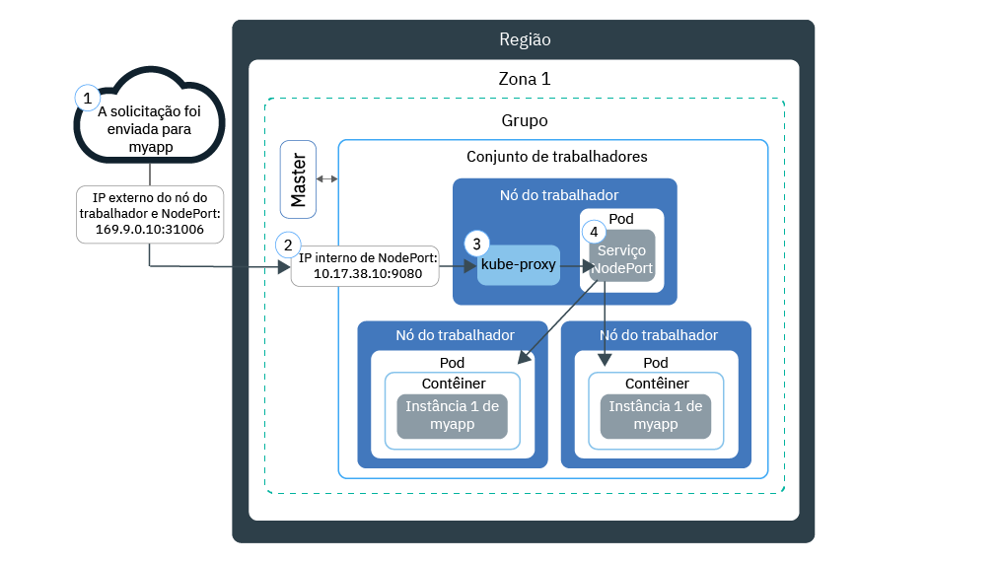

---

copyright:
  years: 2014, 2019
lastupdated: "2019-05-31"

keywords: kubernetes, iks

subcollection: containers

---

{:new_window: target="_blank"}
{:shortdesc: .shortdesc}
{:screen: .screen}
{:pre: .pre}
{:table: .aria-labeledby="caption"}
{:codeblock: .codeblock}
{:tip: .tip}
{:note: .note}
{:important: .important}
{:deprecated: .deprecated}
{:download: .download}
{:preview: .preview}


# Testando o acesso aos aplicativos com NodePorts
{: #nodeport}

Disponibilize seu app conteinerizado para acesso à Internet usando o endereço IP público de qualquer nó do trabalhador em um cluster do Kubernetes e expondo um NodePort. Use essa opção para teste no {{site.data.keyword.containerlong}} e para acesso público de curto prazo.
{:shortdesc}

## Gerenciando o tráfego de rede usando NodePorts
{: #nodeport_planning}

Exponha uma porta pública em seu nó do trabalhador e use o endereço IP público do nó do trabalhador para acessar seu serviço no cluster publicamente por meio da Internet.
{:shortdesc}

Ao expor seu app criando um serviço do Kubernetes do tipo NodePort, um NodePort no intervalo de 30.000 a 32.767 e um endereço IP interno do cluster são designados ao serviço. O serviço NodePort serve como o ponto de entrada externo para solicitações recebidas para seu app. O NodePort designado é exposto publicamente nas configurações de `kubeproxy` de cada nó do trabalhador no cluster. Cada nó do trabalhador inicia o atendimento no NodePort designado para solicitações recebidas para o
serviço. Para acessar o serviço por meio da Internet, é possível usar o endereço IP público de qualquer nó do trabalhador designado durante a criação do cluster e o NodePort no formato `<IP_address>:<nodeport>`. Se você desejar acessar o serviço na rede privada, use o endereço IP privado de qualquer nó do trabalhador em vez do endereço IP público.

O diagrama a seguir mostra como a comunicação é direcionada da Internet para um app quando um serviço NodePort está configurado:



1. Uma solicitação é enviada para seu app usando o endereço IP público do seu nó do trabalhador e o NodePort no nó do trabalhador.

2. A solicitação é encaminhada automaticamente para o endereço IP e a porta do cluster interno do serviço NodePort. O endereço IP do cluster interno é acessível somente dentro do cluster.

3. `kube-proxy` roteia a solicitação para o serviço NodePort do Kubernetes para o app.

4. A solicitação é encaminhada para o endereço IP privado do pod no qual o app é implementado. Se múltiplas instâncias do app são implementadas no cluster, o serviço NodePort roteia as solicitações entre os pods de app.

O endereço IP público do nó do trabalhador não é permanente. Quando um nó do trabalhador é removido ou recriado, um novo endereço IP público é designado ao
nó do trabalhador. É possível usar o serviço do NodePort para testar o acesso público para o seu aplicativo ou quando o acesso público for necessário apenas para uma quantia pequena de tempo. Quando precisar de um endereço IP público estável e mais disponibilidade para seu serviço, exponha seu aplicativo usando um [serviço de balanceador de carga de rede (NLB)](/docs/containers?topic=containers-loadbalancer) ou o [Ingress](/docs/containers?topic=containers-ingress).
{: note}

<br />


## Ativando o acesso a um app usando um serviço NodePort
{: #nodeport_config}

É possível expor seu app como um serviço NodePort do Kubernetes para clusters grátis ou padrão.
{:shortdesc}

Se você ainda não tem um app pronto, é possível usar um app de exemplo do Kubernetes chamado [Guestbook ](https://github.com/kubernetes/examples/blob/master/guestbook/all-in-one/guestbook-all-in-one.yaml).

1.  No arquivo de configuração para seu app, defina uma seção de [serviço ](https://kubernetes.io/docs/concepts/services-networking/service/).

    Para o exemplo Guestbook, uma seção de serviço de front-end existe no arquivo de configuração. Para disponibilizar o app Guestbook externamente, inclua o tipo NodePort e uma NodePort no intervalo de 30000 a 32767 na seção de serviço de front-end.
    {: tip}

    Exemplo:

    ```
    apiVersion: v1
    kind: Service
    metadata:
      name: <my-nodeport-service>
      labels:
        <my-label-key>: <my-label-value>
    spec:
      selector:
        <my-selector-key>: <my-selector-value>
      type: NodePort
      ports:
       - port: <8081>
         # nodePort: <31514>

    ```
    {: codeblock}

    <table>
    <caption>Entendendo os componentes de serviço NodePort</caption>
    <thead>
    <th colspan=2> Entendendo os componentes de seção do serviço NodePort</th>
    </thead>
    <tbody>
    <tr>
    <td><code>metadata.name</code></td>
    <td>Substitua <code><em>&lt;my-nodeport-service&gt;</em></code> por um nome para seu serviço NodePort.<p>Saiba mais sobre [como proteger suas informações pessoais](/docs/containers?topic=containers-security#pi) quando trabalhar com recursos do Kubernetes.</p></td>
    </tr>
    <tr>
    <td><code>metadata.labels</code></td>
    <td>Substitua <code><em>&lt;my-label-key&gt;</em></code> e <code><em>&lt;my-label-value&gt;</em></code> pelo rótulo que você deseja usar para o serviço.</td>
    </tr>
    <tr>
      <td><code>spec.selector</code></td>
      <td>Substitua <code><em>&lt;my-selector-key&gt;</em></code> e <code><em>&lt;my-selector-value&gt;</em></code> pelo par chave/valor que você usou na seção <code>spec.template.metadata.labels</code> do YAML da implementação. Para associar o serviço com a implementação, o seletor deve corresponder aos rótulos de implementação.
      </tr>
    <tr>
    <td><code>ports.port</code></td>
    <td>Substitua <code><em>&lt;8081&gt;</em></code> pela porta em que seu serviço atende. </td>
     </tr>
     <tr>
     <td><code>ports.nodePort</code></td>
     <td>Opcional: substitua <code><em>&lt;31514&gt;</em></code> por um NodePort no intervalo de 30000 a 32767. Não especifique um NodePort que já esteja em uso por outro serviço. Se nenhum NodePort for designado, um aleatório será designado para você.<br><br>Para especificar um NodePort e ver quais NodePorts já estão em uso, execute o comando a seguir: <pre class="pre"><code>kubectl get svc</code></pre><p>Os NodePorts em uso aparecem sob o campo **Portas**.</p></td>
     </tr>
     </tbody></table>

2.  Salve o arquivo de configuração atualizado.

3.  Repita essas etapas para criar um serviço NodePort para cada app que você deseja expor para a Internet.

**E agora?**

Quando o app for implementado, será possível usar o endereço IP público de qualquer nó do trabalhador e o NodePort
para formar a URL pública para acessar o app em um navegador. Se os nós do trabalhador estão conectados somente a uma VLAN privada, um serviço NodePort privado foi criado e pode ser acessado por meio de um endereço IP privado do nó do trabalhador.

1.  Obtenha o endereço IP público para um nó do trabalhador no cluster. Se desejar acessar o nó do trabalhador em uma rede privada, obtenha o endereço IP privado no lugar.

    ```
    ibmcloud ks workers --cluster <cluster_name>
    ```
    {: pre}

    Saída:

    ```
    ID                                                Public IP   Private IP    Size     State    Status
    prod-dal10-pa215dcf5bbc0844a990fa6b0fcdbff286-w1  192.0.2.23  10.100.10.10  u3c.2x4  normal   Ready
    prod-dal10-pa215dcf5bbc0844a990fa6b0fcdbff286-w2  192.0.2.27  10.100.10.15  u3c.2x4  normal   Ready
    ```
    {: screen}

2.  Se um NodePort aleatório foi designado, descubra qual foi designado.

    ```
    kubectl describe service <service_name>
    ```
    {: pre}

    Saída:

    ```
    Name:                   <service_name>
    Namespace:              default
    Labels:                 run=<deployment_name>
    Selector:               run=<deployment_name>
    Type:                   NodePort
    IP:                     10.10.10.8
    Port:                   <unset> 8080/TCP
    NodePort:               <unset> 30872/TCP
    Endpoints:              172.30.171.87:8080
    Session Affinity:       None
    No events.
    ```
    {: screen}

    Neste exemplo, o NodePort é `30872`.

    Se a seção **Terminais** exibir `<none>`, verifique o `<selectorkey>` e o `<selectorvalue>` usados na seção `spec.selector` do serviço NodePort. Assegure-se de que ele seja o mesmo que o par _chave/valor_ que você usou na seção `spec.template.metadata.labels` do YAML da implementação.
    {: note}

3.  Forme a URL com um dos endereços IP do nó do trabalhador e o NodePort. Exemplo: `http://192.0.2.23:30872`
