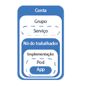
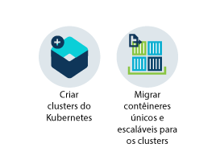
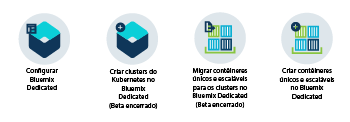
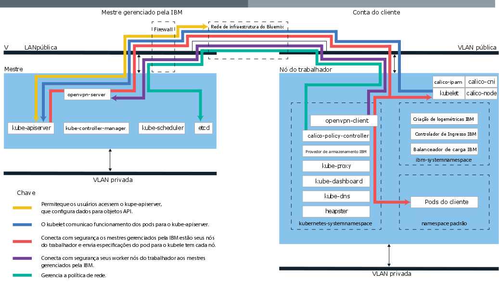

---

copyright:
  years: 2014, 2017
lastupdated: "2017-08-14"

---

{:new_window: target="_blank"}
{:shortdesc: .shortdesc}
{:screen: .screen}
{:pre: .pre}
{:table: .aria-labeledby="caption"}
{:codeblock: .codeblock}
{:tip: .tip} 
{:download: .download}

# Sobre o {{site.data.keyword.containerlong_notm}}
{: #cs_ov}

O {{site.data.keyword.containershort}} combina o Docker e o
Kubernetes para entregar ferramentas poderosas, uma experiência intuitiva do usuário e a segurança e o
isolamento integrados para automatizar a implementação, operação, ajuste de escala e monitoramento de apps conteinerizados por
um cluster de hosts de cálculo independente usando as APIs do Kubernetes.
{:shortdesc}

## Conceitos básicos do Kubernetes
{: #kubernetes_basics}

O Kubernetes foi desenvolvido pelo Google como parte do projeto Borg e entregue à comunidade de software livre
em 2014. O Kubernetes combina mais de 15 anos de pesquisa do Google na execução de uma infraestrutura conteinerizada com cargas de trabalho de produção, contribuições de software livre e ferramentas de gerenciamento de contêiner do Docker para fornecer uma plataforma de app isolada e segura que seja móvel, extensível e com capacidade de recuperação automática em caso de failovers.
{:shortdesc}

Saiba mais sobre os conceitos básicos de como o Kubernetes funciona com um pouco de terminologia. 

<dl>
<dt>Grupo</dt>
<dd>Um cluster do Kubernetes consiste em uma ou mais máquinas virtuais que são chamadas nós do
trabalhador. Cada
nó do trabalhador representa um host de cálculo no qual é possível implementar, executar e gerenciar apps conteinerizados. Os nós do trabalhador são gerenciados por um mestre do Kubernetes que controla e monitora centralmente todos os recursos
do Kubernetes no cluster. Quando você implementa um app conteinerizado, o mestre do Kubernetes decide onde implementar o app, levando em consideração os requisitos de implementação e a capacidade disponível no cluster.</dd>
<dt>Pod</dt>
<dd>Cada app conteinerizado que é implementado em um cluster do Kubernetes é implementado, executado e gerenciado
por um pod. Os pods representam as menores unidades implementáveis em um cluster do Kubernetes e são usados para agrupar contêineres que devem ser tratados como uma unidade única. Na maioria dos casos, um contêiner é implementado em
seu próprio pod. No entanto, um app pode requerer que um contêiner e outros contêineres auxiliares sejam implementados em um pod para que esses contêineres possam ser direcionados usando o mesmo endereço IP privado.</dd>
<dt>Implementação</dt>
<dd>Uma implementação é um recurso do Kubernetes no qual é possível especificar seus contêineres e outros recursos
do Kubernetes que são necessários para executar seu app, como armazenamento persistente, serviços ou anotações. As implementações são documentadas em um script de implementação do Kubernetes. Quando você executa uma implementação, o mestre do Kubernetes implementa os contêineres especificados nos pods levando em consideração a capacidade disponível nos nós do trabalhador do cluster. Outros recursos do Kubernetes são criados e configurados
como especificado no script de implementação.

  
É possível usar uma implementação para definir estratégias de atualização para seu app, que inclui o número de pods que você deseja incluir durante uma atualização contínua e o número de pods que podem estar indisponíveis de cada vez. Quando você executa uma atualização contínua, a implementação verifica se a revisão está funcionando e para o lançamento quando falhas são detectadas.</dd>
<dt>Serviço</dt>
<dd>Um serviço do Kubernetes agrupa um conjunto
de pods e fornece conexão de rede a esses pods para outros serviços no cluster sem
expor o endereço IP privado real de cada pod. É possível
usar um serviço para tornar seu app disponível no cluster ou na Internet pública.

  
Para saber mais sobre a terminologia do Kubernetes, tente o <a href="https://kubernetes.io/docs/tutorials/kubernetes-basics/" target="_blank">Tutorial de conceitos básicos do Kubernetes</a>.</dd>
</dl>

## Benefícios do uso de clusters
{: #cs_ov_benefits}

Cada cluster é implementado em máquinas virtuais compartilhadas ou dedicadas que fornecem Kubernetes nativos e recursos incluídos da {{site.data.keyword.IBM_notm}}.{:shortdesc}

|Benefício|Descrição|
|-------|-----------|
|Clusters do Kubernetes de locatário único com isolamento de infraestrutura de cálculo, de rede e de armazenamento|<ul><li>Crie sua própria infraestrutura customizada que atenda ao requisito de seu ambiente de negócios e
de desenvolvimento.</li><li>Provisione um mestre do Kubernetes, nós do trabalhador, redes virtuais e armazenamento dedicados e assegurados usando os recursos fornecidos pelo {{site.data.keyword.BluSoftlayer_full}}.</li><li>Armazene dados persistentes, compartilhar dados entre pods do Kubernetes e restaure dados quando necessário com o
serviço de volume integrado e seguro.</li><li>Mestre do Kubernetes totalmente gerenciado que é altamente disponível e continuamente monitorado pela {{site.data.keyword.IBM_notm}}.</li><li>Benefício do suporte integral para todas as APIs nativas do Kubernetes.</li></ul>|
|Conformidade de segurança de imagem com o Vulnerability Advisor|<ul><li>Configure seu próprio registro de imagem privada assegurada do Docker no qual as imagens são armazenadas e compartilhadas por todos
os usuários na organização.</li><li>Benefício de varredura automática de imagens em seu registro privado do {{site.data.keyword.Bluemix_notm}}.</li><li>Revise as recomendações específicas para o sistema operacional usado na imagem para corrigir potenciais
vulnerabilidades.</li></ul>|
|Ajuste automático de escala de apps|<ul><li>Defina políticas customizadas para aumentar e reduzir a capacidade de apps com base no consumo de CPU e memória.</li></ul>|
|Monitoramento contínuo do funcionamento do cluster|<ul><li>Use o painel de cluster para ver e gerenciar rapidamente o funcionamento de seu cluster, os nós do trabalhador
e as implementações de contêiner.</li><li>Localize métricas detalhadas de consumo usando o {{site.data.keyword.monitoringlong}} e expanda rapidamente o seu cluster para atender cargas de trabalho.</li><li>Revise as informações de criação de log usando o {{site.data.keyword.loganalysislong}} para ver atividades detalhadas do cluster.</li></ul>|
|Recuperação automática de contêineres não saudáveis|<ul><li>Verificações contínuas de funcionamento em contêineres implementados em um nó do trabalhador.</li><li>A recriação automática de contêineres em caso de falhas.</li></ul>|
|Descoberta de serviço e gerenciamento de serviço|<ul><li>Registre centralmente os serviços de app para torná-los disponíveis para outros apps em seu cluster sem
expô-los publicamente.</li><li>Descubra os serviços registrados sem manter o controle da mudança de endereços IP ou IDs de contêiner e
beneficie-se do roteamento automático para instâncias disponíveis.</li></ul>|
|Exposição segura de serviços ao público|<ul><li>As redes de sobreposição privada com balanceador de carga integral e suporte de Ingresso para tornar os seus apps publicamente
disponíveis e balancear as cargas de trabalho em múltiplos nós do trabalhador sem manter o controle da mudança de
endereços IP dentro de seu cluster.</li><li>Escolha entre um endereço IP público, uma rota fornecida pela {{site.data.keyword.IBM_notm}} ou seu próprio domínio customizado para acessar serviços em seu cluster por meio da Internet.</li></ul>|
|Integração de serviço do {{site.data.keyword.Bluemix_notm}}|<ul><li>Inclua recursos extras em seu app por meio da integração de serviços do {{site.data.keyword.Bluemix_notm}}, como APIs do Watson, Blockchain, serviços de dados ou Internet das Coisas e ajude os usuários do cluster a simplificarem o desenvolvimento de apps e processos de gerenciamento de contêiner.</li></ul>|
{: caption="Tabela 1. Benefícios do uso de clusters com o {{site.data.keyword.containerlong_notm}}" caption-side="top"}

## Ambientes de nuvem
{: #cs_ov_environments}

É possível escolher o ambiente de nuvem do {{site.data.keyword.Bluemix_notm}} no qual implementar clusters e contêineres.
{:shortdesc}

###{{site.data.keyword.Bluemix_notm}} Public
{: #public_environment}

Implemente clusters no ambiente de nuvem pública ([https://console.bluemix.net ](https://console.bluemix.net)) e conecte-se a qualquer serviço no catálogo do {{site.data.keyword.Bluemix_notm}}.

Com clusters no
{{site.data.keyword.Bluemix_notm}} Public, é possível escolher o nível de isolamento de hardware para os nós do trabalhador no cluster. Use hardware dedicado para que os recursos físicos disponíveis sejam dedicados somente ao seu cluster ou hardware compartilhado para permitir que os recursos físicos sejam compartilhados com clusters de outros clientes {{site.data.keyword.IBM_notm}}. Será possível escolher um cluster dedicado no ambiente do {{site.data.keyword.Bluemix_notm}} Public
quando você desejar isolamento para seu cluster, mas esse isolamento não será requerido para os
outros serviços usados do {{site.data.keyword.Bluemix_notm}}.

Clique em uma das opções a seguir para começar:

    <map name="public_options" id="public_options">
    <area href="container_index.html#clusters" alt="Introdução aos clusters do Kubernetes no Bluemix" title="Introdução aos clusters do Kubernetes no Bluemix" shape="rect" coords="-5, -6, 123, 154" />
<area href="cs_classic.html#cs_classic" alt="Executando contêineres únicos e escaláveis no IBM Bluemix Container Service (Kraken)" title="Executando contêineres únicos e escaláveis no IBM Bluemix Container Service (Kraken)" shape="rect" coords="181, -5, 320, 161" />
</map>

### {{site.data.keyword.Bluemix_notm}} Dedicated
{: #dedicated_environment}

Implemente clusters (Beta encerrado) ou contêineres únicos e escaláveis em um ambiente de nuvem dedicado (`https://<my-dedicated-cloud-instance>.bluemix.net`) e conecte-se aos serviços pré-selecionados do {{site.data.keyword.Bluemix_notm}} que também estão em execução aí.

Clusters com o {{site.data.keyword.Bluemix_notm}} Dedicated são equivalentes aos
clusters criados com hardware dedicado no {{site.data.keyword.Bluemix_notm}} Public. Os recursos físicos disponíveis são dedicados somente ao seu cluster e não são compartilhados com clusters de outros clientes {{site.data.keyword.IBM_notm}}. Tanto para Public como para Dedicated, o terminal de API
público é usado para criar clusters. No entanto, com o {{site.data.keyword.Bluemix_notm}} Dedicated, as diferenças
mais significativas são como a seguir.

*   A {{site.data.keyword.IBM_notm}} possui e gerencia a conta do {{site.data.keyword.BluSoftlayer_notm}} na qual os nós do trabalhador, as VLANs e as sub-redes são implementados, em vez de em uma conta pertencente a você.
*   As especificações para essas VLANs e sub-redes são determinadas quando o ambiente Dedicado é
criado, não quando o cluster é criado.

Será possível escolher configurar um ambiente do {{site.data.keyword.Bluemix_notm}} Dedicated quando você
desejar isolamento para seu cluster e esse isolamento também será requerido para os outros serviços usados do {{site.data.keyword.Bluemix_notm}}.

Clique em uma das opções a seguir para começar:

    <map name="dedicated_options" id="dedicated_options">
    <area href="#setup_dedicated" alt="Configurando o IBM Bluemix Container Service no Bluemix Dedicated (Beta encerrado)" title="Configurando o IBM Bluemix Container Service no Bluemix Dedicated (Beta encerrado)" shape="rect" coords="-5, -15, 100, 153" />
    <area href="container_index.html#dedicated" alt="Introdução aos clusters do Kubernetes no Bluemix Dedicated (Beta encerrado)" title="Introdução aos clusters do Kubernetes no Bluemix Dedicated (Beta encerrado)" shape="rect" coords="153, -10, 276, 182" />
    <area href="cs_classic.html#cs_classic" alt="Executando contêineres únicos e escaláveis no IBM Bluemix Container Service (Kraken)" title="Executando contêineres únicos e escaláveis no IBM Bluemix Container Service (Kraken)" shape="rect" coords="317, -11, 436, 188" />
<area href="container_ha.html#container_group_ui" alt="Executando serviços a longo prazo como grupos de contêineres por meio da GUI do Bluemix" title="Executando serviços a longo prazo como grupos de contêineres por meio da GUI do Bluemix" shape="rect" coords="485, -1, 600, 173" />     </map>

### Diferenças no gerenciamento de cluster entre os ambientes de nuvem
{: #env_differences}

|Áreas|{{site.data.keyword.Bluemix_notm}} Public|{{site.data.keyword.Bluemix_notm}} Dedicated (Beta encerrado)|
|--|--------------|--------------------------------|
|Criação do cluster|Crie um cluster lite ou especifique os detalhes a seguir para um cluster padrão:<ul><li>Tipo de cluster</li><li>Nome</li><li>Versão do Kubernetes</li><li>Localização</li><li>Machine type</li><li>Número de nós do trabalhador</li><li>VLAN pública</li><li>VLAN privada</li><li>Hardware</li></ul>|Especifique os detalhes a seguir para um cluster padrão:<ul><li>Nome</li><li>Versão do Kubernetes</li><li>Machine type</li><li>Número de nós do trabalhador</li></ul>
**Nota:** as configurações de VLANs e de Hardware são predefinidas durante a criação do ambiente do {{site.data.keyword.Bluemix_notm}}.
|
|Hardware de cluster e propriedade|Em clusters padrão, o hardware pode ser compartilhado por outros clientes {{site.data.keyword.IBM_notm}} ou dedicado somente a você. As VLANs públicas e privadas pertencem e são gerenciadas por você na conta do {{site.data.keyword.BluSoftlayer_notm}}.|Em clusters no {{site.data.keyword.Bluemix_notm}}
Dedicated, o hardware é sempre dedicado. As VLANs públicas e privadas pertencem e são gerenciadas pela IBM para você. O local é predefinido para o ambiente do {{site.data.keyword.Bluemix_notm}}.|
|Ligação de serviços a um cluster|Use o comando [bx cs cluster-service-bind](cs_cluster.html#cs_cluster_service) para ligar um segredo do Kubernetes ao cluster.|Crie um [arquivo-chave JSON](cs_cluster.html#binding_dedicated) para as credenciais de serviço e, em seguida, crie o segredo do Kubernetes por meio desse arquivo
para ligar ao cluster.|
|Balanceador de carga e rede de Ingresso|Durante o fornecimento de clusters padrão, as ações a seguir ocorrem automaticamente.<ul><li>Uma sub-rede móvel pública é ligada ao cluster e designada à sua conta do {{site.data.keyword.BluSoftlayer_notm}}.</li><li>Um endereço IP público móvel é usado para um controlador de Ingresso altamente disponível e uma rota pública exclusiva é designada no formato &lt;cluster_name&gt;.containers.mybluemix.net. É possível usar essa rota para expor múltiplos apps ao público.</li><li>Quatro endereços IP públicos móveis são designados ao cluster, podendo ser usados para expor apps ao público por meio de serviços do balanceador de carga. Sub-redes adicionais podem ser solicitadas por meio de sua conta do {{site.data.keyword.BluSoftlayer_notm}}.</li></ul>|Quando você cria sua conta do Dedicated, você toma as decisões a seguir:<ul><li>Quantas sub-redes você deseja</li><li>O tipo de sub-redes desejado, seja balanceador de carga ou Ingresso. A {{site.data.keyword.IBM_notm}} cria as sub-redes e executa as tarefas de gerenciamento de rede para você. Dependendo de suas seleções, um controlador de Ingresso pode ser criado e uma
rota pública pode ser designada. Sub-redes adicionais podem ser solicitadas [abrindo-se um chamado de suporte](/docs/support/index.html#contacting-support) para criar a sub-rede e, em seguida, usar o comando [`bx cs cluster-subnet-add`](cs_cli_reference.html#cs_cluster_subnet_add) para incluir a sub-rede no cluster.|
|Rede de NodePort|Exponha uma porta pública em seu nó do trabalhador e use o endereço IP público do nó do trabalhador
para acessar publicamente seu serviço no cluster.|Todos os endereços IP públicos dos nós do trabalhador são bloqueados por um firewall. No entanto, para serviços do {{site.data.keyword.Bluemix_notm}} incluídos no cluster, a porta de nó pode ser acessada por meio de um endereço IP público ou de um endereço IP privado.|
|Armazenamento persistente|Use o [fornecimento
dinâmico](cs_apps.html#cs_apps_volume_claim) ou o [fornecimento
estático](cs_cluster.html#cs_cluster_volume_create) de volumes.|Use o [fornecimento
dinâmico](cs_apps.html) de volumes.</li></ul>|
|URL do registro de imagem no {{site.data.keyword.registryshort_notm}}|<ul><li>Sul dos EUA: <code>registry.ng bluemix.net</code></li><li>Sul do Reino Unido: <code>registry.eu-gb.bluemix.net</code></li><li>UE Central (Frankfurt): <code>registry.eu-de.bluemix.net</code></li><li>Austrália (Sydney): <code>registry.au-syd.bluemix.net</code></li></ul>||<ul><li>Para novos namespaces, use os mesmos registros baseados em região que são definidos para o {{site.data.keyword.Bluemix_notm}} Public.</li><li>Para namespaces que tenham sido configurados para contêineres únicos e escaláveis no {{site.data.keyword.Bluemix_notm}} Dedicated, use <code>registry.&lt;dedicated_domain&gt;</code></li></ul>|
|Acessando o registro|Veja as opções em [Usando registros de imagem privada e pública com o {{site.data.keyword.containershort_notm}}](cs_cluster.html#cs_apps_images).|<ul><li>Para novos namespaces, veja as opções em [Usando registros de imagem privada e pública com o {{site.data.keyword.containershort_notm}}](cs_cluster.html#cs_apps_images).</li><li>Para namespaces que tenham sido configurados para grupos únicos e escaláveis, [use um token e crie um segredo do
Kubernetes](cs_dedicated_tokens.html#cs_dedicated_tokens) para autenticação.</li></ul>|
{: caption="Tabela 2. Diferenças de recursos entre o {{site.data.keyword.Bluemix_notm}} Public e o {{site.data.keyword.Bluemix_notm}} Dedicated" caption-side="top"}

### Configurando o {{site.data.keyword.containershort_notm}} no {{site.data.keyword.Bluemix_notm}} Dedicated (Beta encerrado)
{: #setup_dedicated}

Os administradores devem incluir o ID de administrador IBM e os usuários de sua organização no ambiente do Dedicated.

Antes de iniciar, [configure um ambiente do {{site.data.keyword.Bluemix_notm}} Dedicated](/docs/dedicated/index.html#setupdedicated).

Para configurar o ambiente do Dedicated para usar clusters:

1.  Inclua o ID de administrador IBM fornecido no ambiente.
    1.  Selecione sua conta do {{site.data.keyword.Bluemix_notm}}
Dedicated.
    2.  Na barra de menus, clique em
**Gerenciar>Segurança>Identidade e
acesso**. A janela Usuários exibe uma lista de usuários com seus endereços de e-mail e o status da conta selecionada.
    3.  Clique em **Convidar usuários**.
    4.  Em **Endereço de e-mail ou IBMid existente**, insira o endereço de e-mail a seguir:
`cfsdl@us.ibm.com`.
    5.  Na seção **Acesso**, expanda **Serviços ativados
por identidade e acesso**.
    6.  Na lista suspensa **Serviços**, selecione **{{site.data.keyword.containershort_notm}}**.
    7.  Na lista suspensa **Funções**, selecione
**Administrador**.
    8.  Clique em **Convidar usuários**.
2.  [Crie IBMids para os usuários finais de sua conta do {{site.data.keyword.Bluemix_notm}}. ](https://www.ibm.com/account/us-en/signup/register.html)
3.  [Inclua os usuários da etapa anterior em sua conta do {{site.data.keyword.Bluemix_notm}}.](cs_cluster.html#add_users)
4.  Acesse sua conta do {{site.data.keyword.Bluemix_notm}}
Dedicated por meio do console do Public e inicie a criação de clusters.

    1.  Efetue login no console do {{site.data.keyword.Bluemix_notm}} Public ([https://console.bluemix.net ](https://console.bluemix.net)) com seu IBMid.
    2.  No menu de conta, selecione a conta do {{site.data.keyword.Bluemix_notm}} Dedicated. O console
é atualizado com os serviços e as informações de sua instância do {{site.data.keyword.Bluemix_notm}} Dedicated.
    3.  No catálogo da instância do {{site.data.keyword.Bluemix_notm}}
Dedicated, selecione **Contêineres** e clique em **Cluster do
Kubernetes**.

Em seguida, para obter mais informações sobre como criar um cluster, veja [Criando clusters do Kubernetes por meio da GUI no {{site.data.keyword.Bluemix_notm}} Dedicated (Beta encerrado)](cs_cluster.html#creating_ui_dedicated).

## Como os clusters do Kubernetes funcionam 
{: #cs_ov_architecture}

Um cluster do Kubernetes consiste em uma ou mais máquinas físicas ou virtuais, também conhecidas como
nós do trabalhador, que são fracamente acoplados, extensíveis e monitorados e gerenciados centralmente pelo
mestre do Kubernetes. Para cada conta do cliente, o mestre do Kubernetes é gerenciado pela IBM e é altamente resiliente
e altamente disponível.
{:shortdesc}

Cada nó do trabalhador é configurado com um mecanismo de Docker gerenciado pela {{site.data.keyword.IBM_notm}}, recursos de cálculo separados, rede e serviço de volume, bem como recursos de segurança integrados que fornecem isolamento, capacidades de gerenciamento de recurso e conformidade de segurança do nó do trabalhador. O nó do trabalhador comunica-se com o mestre usando certificados TLS seguros e conexão openVPN.

*Figura 1. Arquitetura e rede do Kubernetes no IBM Bluemix Container Service*

## Contêineres do Docker
{: #cs_ov_docker}

Docker é um projeto de software livre que foi liberado pelo dotCloud em 2013. Construído sobre os
recursos da tecnologia de contêiner do Linux (LXC) existente, Docker se tornou uma plataforma de software que é possível usar
para construir, testar, implementar e escalar apps rapidamente. O Docker empacota o software em unidades padronizadas
que são chamadas de contêineres que incluem todos os elementos que um app precisa executar.
{:shortdesc}

Revise esses conceitos para aprender sobre os conceitos básicos do Docker.

<dl>
<dt>Contêiner</dt>
<dd>Um contêiner é uma maneira padrão de empacotar um app e todas as suas dependências para que o app possa ser movido entre ambientes e ser executado sem mudanças. Ao contrário de máquinas virtuais, os contêineres não virtualizam um dispositivo, seu sistema operacional e o hardware subjacente. Somente o código de app, o tempo de execução,
as ferramentas de sistema, as bibliotecas e as configurações são empacotadas dentro do contêiner. Os contêineres são executados como processos
isolados no host de cálculo em que eles estão implementados e compartilham o sistema operacional do host e seus
recursos de hardware. Essa abordagem torna um contêiner mais leve, móvel e eficiente do que
uma máquina virtual.</dd>
<dt>Image</dt>
<dd>Cada contêiner é baseado em uma imagem do Docker e é considerado uma instância de uma imagem. Uma
imagem é construída por meio de um Dockerfile, que é um arquivo que contém instruções sobre como construir a imagem
e quaisquer artefatos de construção, como um app, a configuração do app e suas dependências.</dd>
<dt>Registro</dt>
<dd>Um registro de imagem é um lugar em que você armazena, recupera e compartilha imagens do Docker. As imagens que são armazenadas em um registro podem estar publicamente disponíveis (registro
público) ou acessíveis somente por um pequeno grupo de usuários (registro privado). O {{site.data.keyword.containershort_notm}} oferece imagens públicas, como o ibmliberty, que pode ser usada para começar a utilização do Docker e do Kubernetes para criar seu primeiro app conteinerizado em um cluster. Quando se tratar de aplicativos corporativos, use um registro privado como aquele fornecido no {{site.data.keyword.Bluemix_notm}} para proteger suas imagens de serem usadas e mudadas por usuários não autorizados.

  
Quando você deseja implementar um contêiner de uma imagem, deve-se certificar de que a
imagem esteja armazenada em um registro de imagem pública ou privada.</dd>
</dl>

### Benefícios chave do uso de contêineres
{: #container_benefits}

<dl>
<dt>Contêineres são ágeis</dt>
<dd>Os contêineres simplificam a administração do sistema fornecendo
ambientes padronizados para equipes de desenvolvimento e produção. O tempo de execução leve do mecanismo permite aumentar e diminuir a capacidade rapidamente em
resposta às mudanças em demanda. Eles
ajudam a remover a complexidade do gerenciamento de diferentes plataformas de
sistema operacional e infraestrutura subjacente. Os contêineres ajudam a implementar
e executar qualquer app em qualquer infraestrutura, de modo rápido e confiável.</dd>
<dt>Contêineres são pequenos</dt>
<dd>É possível ajustar mais contêineres na quantia de espaço que uma máquina virtual única requer.</dd>
<dt>Contêineres são móveis</dt>
<dd>Construa uma imagem para outro contêiner usando outra imagem como base. Deixe que outra pessoa execute a
o trabalho em massa em uma imagem e ajuste isso para seu uso. Também é possível migrar código do app de um
ambiente temporário para um ambiente de produção rapidamente. O processo de migração pode ser automatizado com ferramentas
como o Delivery Pipeline ou UrbanCode Deploy.</dd>
</dl>

## Abuso de contêineres
{: #cs_terms}

Os clientes não podem fazer uso inadequado do {{site.data.keyword.containershort_notm}}.
{:shortdesc}

Uso inadequado inclui:

*   Qualquer atividade ilegal
*   Distribuição ou execução de malware
*   Prejudicar o {{site.data.keyword.containershort_notm}} ou interferir no
uso de alguém do {{site.data.keyword.containershort_notm}}
*   Prejudicar ou interferir no uso de alguém de qualquer outro serviço ou sistema
*   Acesso não autorizado a qualquer serviço ou sistema
*   Modificação não autorizada de qualquer serviço ou sistema
*   Violação dos direitos de outros

Veja [Termos dos serviços
de nuvem](/docs/navigation/notices.html#terms) para obter os termos gerais de uso.
