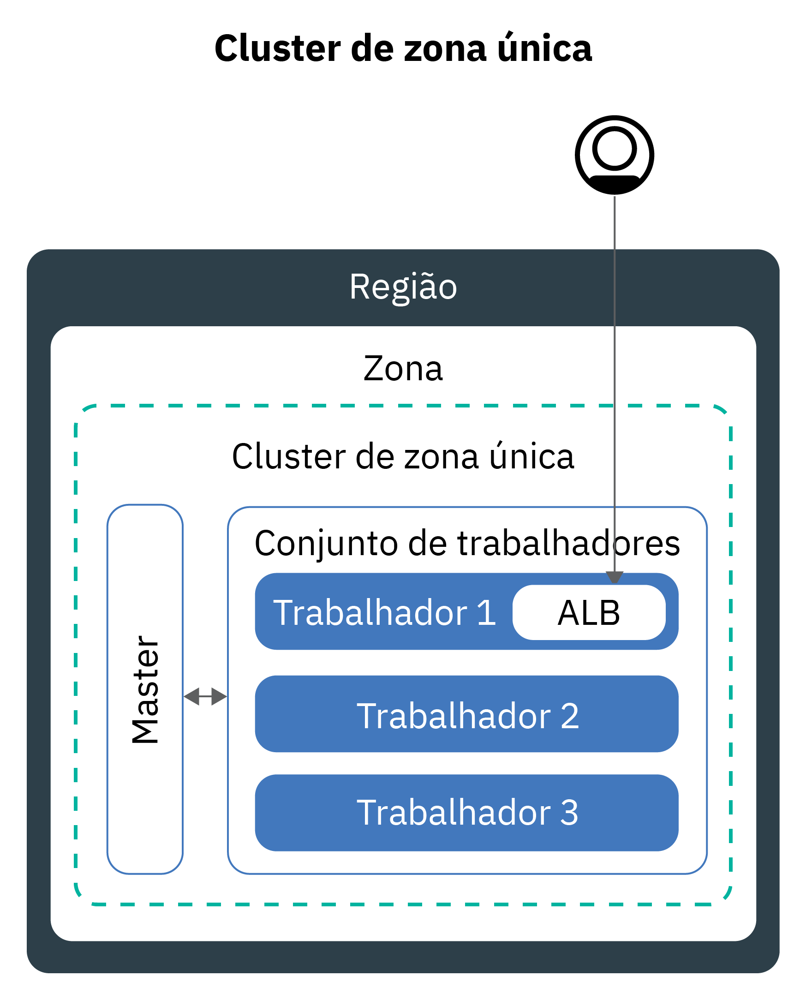
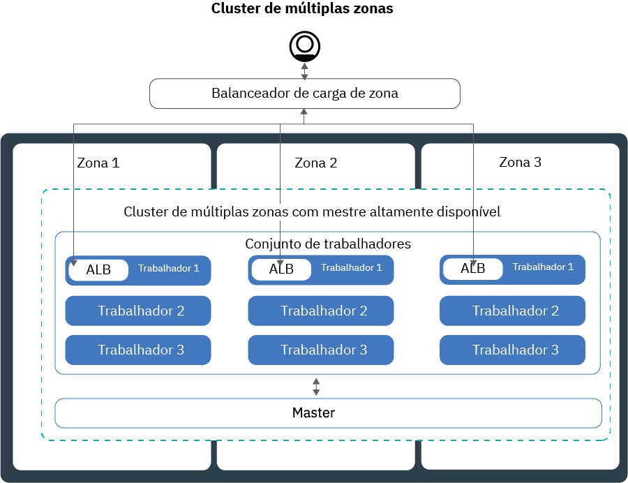
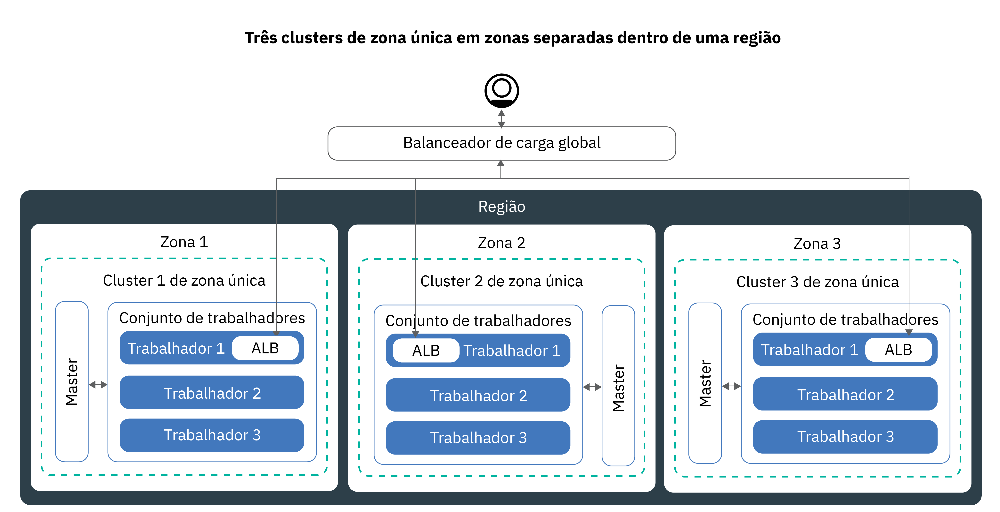

---

copyright:
  years: 2014, 2019
lastupdated: "2019-06-11"

keywords: kubernetes, iks, multi az, multi-az, szr, mzr

subcollection: containers

---

{:new_window: target="_blank"}
{:shortdesc: .shortdesc}
{:screen: .screen}
{:pre: .pre}
{:table: .aria-labeledby="caption"}
{:codeblock: .codeblock}
{:tip: .tip}
{:note: .note}
{:important: .important}
{:deprecated: .deprecated}
{:download: .download}
{:preview: .preview}


# Planejando seu cluster para alta disponibilidade
{: #ha_clusters}

Projete seu cluster padrão para máxima disponibilidade e capacidade para seu app com o {{site.data.keyword.containerlong}}.
{: shortdesc}

Seus usuários são menos propensos a experienciar o tempo de inatividade quando você distribui seus apps em múltiplos nós do trabalhador, zonas e clusters. Recursos integrados, como balanceamento de carga e isolamento, aumentam a resiliência com relação a potenciais
falhas com hosts, redes ou apps. Revise estas potenciais configurações de cluster que são ordenadas com graus crescentes de disponibilidade.


1. Um [cluster de zona única](#single_zone) com múltiplos nós do trabalhador em um conjunto de trabalhadores.
2. Um [cluster de múltiplas zonas](#multizone) que difunde nós do trabalhador em zonas dentro de uma região.
3. **Clusters que estão conectados somente a VLANs públicas e privadas**: [múltiplos clusters](#multiple_clusters) que são configurados em zonas ou regiões e que são conectados por meio de um balanceador de carga global.

## Cluster de zona única
{: #single_zone}

Para melhorar a disponibilidade para seu app e para permitir o failover para o caso de um nó do trabalhador não estar disponível em seu cluster, inclua nós do trabalhador adicionais em seu cluster de zona única.
{: shortdesc}



Por padrão, seu cluster de zona única está configurado com um conjunto de trabalhadores denominado `default`. O conjunto de trabalhadores agrupa nós do trabalhador com a mesma configuração, tal como o tipo de máquina, que você definiu durante a criação do cluster. É possível incluir mais nós do trabalhador em seu cluster [redimensionando um conjunto de trabalhadores existente](/docs/containers?topic=containers-add_workers#resize_pool) ou [incluindo um novo conjunto de trabalhadores](/docs/containers?topic=containers-add_workers#add_pool).

Ao incluir mais nós do trabalhador, as instâncias do app podem ser distribuídas entre múltiplos nós do trabalhador. Se um nó do trabalhador ficar inativo, as instâncias do app em nós do trabalhador disponíveis continuarão a ser executadas. O Kubernetes reagenda automaticamente os pods de nós do trabalhador indisponíveis para assegurar desempenho e capacidade para seu app. Para assegurar que os seus pods sejam distribuídos de maneira uniforme entre os nós do trabalhador, implemente a [afinidade de pod](https://kubernetes.io/docs/concepts/configuration/assign-pod-node/#inter-pod-affinity-and-anti-affinity-beta-feature).

**Posso converter meu cluster de zona única em um cluster multizona?**</br>
Se o cluster estiver em um dos [locais de metro de múltiplas zonas suportados](/docs/containers?topic=containers-regions-and-zones#zones), sim. Veja [Atualizando de nós do trabalhador independentes para conjuntos de trabalhadores](/docs/containers?topic=containers-update#standalone_to_workerpool).


**Eu tenho que usar clusters de múltiplas zonas?**</br>
Não. É possível criar tantos clusters de zona única quantos você desejar. De fato, você pode preferir clusters de zona única para gerenciamento simplificado ou se o seu cluster deve residir em uma [cidade de zona única](/docs/containers?topic=containers-regions-and-zones#zones) específica.

**Posso ter um principal altamente disponível em uma única zona?**</br>
Sim. Em uma única zona, o seu mestre está altamente disponível e inclui réplicas em hosts físicos separados para seu servidor de API do Kubernetes, um etcd, um planejador e um gerenciador de controlador para proteger contra uma indisponibilidade, como durante uma atualização principal. Para proteger contra uma falha zonal, é possível:
* [criar um cluster em uma zona com capacidade para várias zonas](#multizone), em que o mestre seja distribuído entre zonas.
* [criar múltiplos clusters que estão conectados a VLANs públicas e privadas](#multiple_clusters) e conectá-las a um balanceador de carga global.

## Cluster de múltiplas zonas
{: #multizone}

Com o  {{site.data.keyword.containerlong_notm}}, é possível criar clusters multizona. Seus usuários são menos propensos a experienciar o tempo de inatividade quando você distribui seus apps em múltiplos nós do trabalhador e zonas usando um conjunto de trabalhadores. Os recursos integrados, como balanceamento de carga, aumentam a resiliência com relação a falhas potenciais de zona com hosts, redes ou apps. Se os recursos em uma zona ficam inativos, as cargas de trabalho do cluster ainda operam nas outras zonas.
{: shortdesc}

**O que é um conjunto do trabalhador?**</br>
Um conjunto de trabalhadores é uma coleção de nós do trabalhador com o mesmo tipo, como o tipo de máquina, a CPU e a memória. Quando você cria um cluster, um conjunto de trabalhadores padrão é criado automaticamente. Para difundir os nós do trabalhador em seu conjunto nas zonas, incluir nós do trabalhador no conjunto ou atualizar nós do trabalhador, é possível usar os novos comandos `ibmcloud ks worker-pool`.

**Ainda posso usar nós do trabalhador independentes?**</br>
A configuração de cluster anterior de nós do trabalhador independentes é suportada, mas descontinuada. Certifique-se de [incluir um conjunto de trabalhadores em seu cluster](/docs/containers?topic=containers-planning_worker_nodes#add_pool) e, em seguida, [usar os conjuntos de trabalhadores](/docs/containers?topic=containers-update#standalone_to_workerpool) para organizar os nós do trabalhador em vez de nós do trabalhador independentes.

**Posso converter meu cluster de zona única em um cluster multizona?**</br>
Se o cluster estiver em um dos [locais de metro de múltiplas zonas suportados](/docs/containers?topic=containers-regions-and-zones#zones), sim. Veja [Atualizando de nós do trabalhador independentes para conjuntos de trabalhadores](/docs/containers?topic=containers-update#standalone_to_workerpool).


### Conte-me mais sobre a configuração do cluster de múltiplas zonas
{: #mz_setup}



É possível incluir zonas adicionais em seu cluster para replicar os nós do trabalhador em seus conjuntos de trabalhadores em múltiplas zonas dentro de uma região. Os clusters de múltiplas zonas são projetados para planejar uniformemente os pods em nós do trabalhador e zonas para assegurar disponibilidade e recuperação de falha. Se os nós do trabalhador não forem distribuídos uniformemente entre as zonas ou a capacidade for insuficiente em uma delas, o planejador do Kubernetes poderá falhar ao planejar todos os pods solicitados. Como resultado, os pods podem entrar em um estado **Pendente** até que capacidade suficiente esteja disponível. Se você desejar mudar o comportamento padrão para fazer o planejador do Kubernetes distribuir os pods entre zonas em uma melhor distribuição de esforço, use a [política de afinidade de pod](https://kubernetes.io/docs/concepts/configuration/assign-pod-node/#inter-pod-affinity-and-anti-affinity-beta-feature) `preferredDuringSchedulingIgnoredDuringExecution`.

**Por que eu preciso de nós do trabalhador em três zonas?**</br>
A distribuição de sua carga de trabalho em três zonas assegura a alta disponibilidade para seu app no caso de uma ou duas zonas não estarem disponíveis, mas também torna sua configuração de cluster mais eficiente em termos de custo. Por que isso, você pergunta? Aqui está um exemplo.

Vamos supor que você precise de um nó do trabalhador com seis núcleos para manipular a carga de trabalho para seu app. Para tornar seu cluster mais disponível, você tem as opções a seguir:

- **Duplicar seus recursos em outra zona:** essa opção deixa você com dois nós do trabalhador, cada um com seis núcleos em cada zona para um total de 12 núcleos. </br>
- **Distribuir recursos em três zonas:** com essa opção, você implementa três núcleos por zona, o que deixa você com uma capacidade total de nove núcleos. Para manipular a sua carga de trabalho, duas zonas devem estar ativas por vez. Se uma zona estiver indisponível, as outras duas zonas poderão manipular sua carga de trabalho. Se duas zonas estiverem indisponíveis, os três núcleos restantes estarão ativos para manipular sua carga de trabalho. Implementar três núcleos por zona significa máquinas menores e, portanto, um custo reduzido para você.</br>

**Como meu mestre do Kubernetes está configurado?** </br>
Quando você cria um cluster em um [local metro multizona](/docs/containers?topic=containers-regions-and-zones#zones), um principal do Kubernetes altamente disponível é implementado automaticamente e três réplicas são difundidas pelas zonas do metro. Por exemplo, se o cluster estiver nas zonas `dal10`, `dal12`ou `dal13`, as réplicas do mestre Kubernetes serão difundidas em cada zona no metropolitano de Dallas multizone.

**O que acontece se o mestre do Kubernetes se torna indisponível?** </br>
O [Mestre do Kubernetes](/docs/containers?topic=containers-ibm-cloud-kubernetes-service-technology#architecture) é o componente principal que mantém seu cluster funcionando. O mestre armazena recursos de cluster e suas configurações no banco de dados etcd que serve como o ponto único de verdade para seu cluster. O servidor da API do Kubernetes é o ponto de entrada principal para todas as solicitações de gerenciamento de cluster dos nós do trabalhador para o principal ou quando você deseja interagir com os recursos de cluster.<br><br>Se ocorrer uma falha do mestre, suas cargas de trabalho continuarão a ser executadas nos nós do trabalhador, mas não será possível usar os comandos `kubectl` para trabalhar com seus recursos de cluster ou visualizar o funcionamento do cluster até que o servidor da API do Kubernetes no mestre esteja novamente ativo. Se um pod ficar inativo durante a indisponibilidade do mestre, o pod não poderá ser reprogramado até que o nó do trabalhador possa atingir o servidor da API do Kubernetes novamente.<br><br>Durante uma indisponibilidade do mestre, ainda é possível executar os comandos `ibmcloud ks` com relação à API do {{site.data.keyword.containerlong_notm}} para trabalhar com seus recursos de infraestrutura, como nós do trabalhador ou VLANs. Se você mudar a configuração de cluster atual incluindo ou removendo nós do trabalhador no cluster, suas mudanças não ocorrerão até que o mestre esteja ativo novamente.

Não reinicie ou reinicialize um nó do trabalhador durante uma indisponibilidade do mestre. Essa ação remove os pods de seu nó do trabalhador. Como o servidor da API do Kubernetes está indisponível, os pods não podem ser reprogramados em outros nós do trabalhador no cluster.
{: important}


Para proteger seu cluster contra uma falha do principal do Kubernetes ou em regiões em que os clusters de multizona não estão disponíveis, é possível [configurar múltiplos clusters que estão conectados a VLANs públicas e privadas e conectá-los a um balanceador de carga global](#multiple_clusters).

**Preciso fazer algo para que o principal possa se comunicar com os trabalhadores nas zonas?**</br>
Sim. Se você tem múltiplas VLANs para um cluster, múltiplas sub-redes na mesma VLAN ou um cluster de múltiplas zonas, deve-se ativar um [Virtual Router Function (VRF)](/docs/infrastructure/direct-link?topic=direct-link-overview-of-virtual-routing-and-forwarding-vrf-on-ibm-cloud#overview-of-virtual-routing-and-forwarding-vrf-on-ibm-cloud) para sua conta de infraestrutura do IBM Cloud (SoftLayer) para que seus nós do trabalhador possam se comunicar entre si na rede privada. Para ativar o VRF, [entre em contato com o representante de conta da infraestrutura do IBM Cloud (SoftLayer)](/docs/infrastructure/direct-link?topic=direct-link-overview-of-virtual-routing-and-forwarding-vrf-on-ibm-cloud#how-you-can-initiate-the-conversion). Se não for possível ou você não desejar ativar o VRF, ative o [VLAN Spanning](/docs/infrastructure/vlans?topic=vlans-vlan-spanning#vlan-spanning). Para executar essa ação, você precisa da [permissão de infraestrutura](/docs/containers?topic=containers-users#infra_access) **Rede > Gerenciar a rede VLAN Spanning** ou é possível solicitar ao proprietário da conta para ativá-la. Para verificar se o VLAN Spanning já está ativado, use o [comando](/docs/containers?topic=containers-cli-plugin-kubernetes-service-cli#cs_vlan_spanning_get) `ibmcloud ks vlan-spanning-get --region<region>`.

**Como posso permitir que meus usuários acessem meu aplicativo por meio da Internet pública?**</br>
É possível expor seus apps usando um balanceador de carga do aplicativo (ALB) do Ingress ou um serviço de balanceador de carga.

- **Balanceador de carga do aplicativo (ALB) do Ingress** Por padrão, os ALBs públicos são automaticamente criados e ativados em cada zona em seu cluster. Um multizone load balancer (MZLB) do Cloudflare para seu cluster também é criado e implementado automaticamente para que exista 1 MZLB para cada região. O MZLB coloca os endereços IP de seus ALBs atrás do mesmo nome do host e ativa as verificações de funcionamento nesses endereços IP para determinar se eles estão disponíveis ou não. Por exemplo, se você tiver nós do trabalhador em 3 zonas na região Leste dos EUA, o nome do host `yourcluster.us-east.containers.appdomain.cloud` terá 3 endereços IP de ALB. O funcionamento do MZLB verifica o IP do ALB público em cada zona de uma região e mantém os resultados de consulta de DNS atualizados com base nessas verificações de funcionamento. Para obter mais informações, consulte [Componentes e arquitetura do Ingress](/docs/containers?topic=containers-ingress#planning).

- **Serviços do balanceador de carga:** os serviços do balanceador de carga são configurados em somente uma zona. As solicitações recebidas para seu app são roteadas dessa zona para todas as instâncias do app em outras zonas. Se essa zona se tornar indisponível, seu app poderá não ser acessível por meio da Internet. É possível configurar serviços adicionais de balanceador de carga em outras zonas para considerar uma falha de zona única. Para obter mais informações, consulte [serviços de balanceador de carga](/docs/containers?topic=containers-loadbalancer#multi_zone_config) altamente disponíveis.

**Posso configurar o armazenamento persistente para meu cluster multizona?**</br>
Para o armazenamento persistente altamente disponível, use um serviço de nuvem como o [{{site.data.keyword.cloudant_short_notm}}](/docs/services/Cloudant?topic=cloudant-getting-started#getting-started) ou [{{site.data.keyword.cos_full_notm}}](/docs/services/cloud-object-storage?topic=cloud-object-storage-about). Também é possível tentar uma solução de armazenamento definida por software (SDS), como a [Portworx](/docs/containers?topic=containers-portworx#portworx), que usa [máquinas SDS](/docs/containers?topic=containers-planning_worker_nodes#sds). Para obter mais informações, consulte [Comparação de opções de armazenamento persistente para clusters de múltiplas zonas](/docs/containers?topic=containers-storage_planning#persistent_storage_overview).

O arquivo NFS e o armazenamento de bloco não são compartilháveis entre as zonas. Os volumes persistentes podem ser usados somente na zona na qual o dispositivo de armazenamento real está localizado. Se você tem armazenamento de arquivo ou de bloco do NFS existente em seu cluster que deseja continuar a usar, deve-se aplicar rótulos de região e zona aos volumes persistentes existentes. Esses rótulos ajudam o kube-scheduler a determinar onde planejar um app que usa o volume persistente. Execute o comando a seguir e substitua `<mycluster>` pelo nome do seu cluster.

```
bash <(curl -Ls https://raw.githubusercontent.com/IBM-Cloud/kube-samples/master/file-pv-labels/apply_pv_labels.sh) <mycluster>
```
{: pre}

** Eu criei meu cluster multizone. Por que ainda há somente uma zona? Como incluo zonas no meu cluster?**</br>
Se você [cria seu cluster de múltiplas zonas com a CLI](/docs/containers?topic=containers-clusters#clusters_ui), o cluster é criado, mas deve-se incluir zonas no conjunto de trabalhadores para concluir o processo. Para abranger diversas zonas, seu cluster deve estar em um [local metro multizona](/docs/containers?topic=containers-regions-and-zones#zones). Para incluir uma zona em seu cluster e difundir os nós do trabalhador entre as zonas, consulte [Incluindo uma zona em seu cluster](/docs/containers?topic=containers-add_workers#add_zone).

### Quais são algumas mudanças de como eu gerencio atualmente meus clusters?
{: #mz_new_ways}

Com a introdução de conjuntos de trabalhadores, é possível usar um novo conjunto de APIs e comandos para gerenciar seu cluster. É possível ver esses novos comandos na [página de documentação da CLI](/docs/containers?topic=containers-cli-plugin-kubernetes-service-cli) ou em seu terminal executando `ibmcloud ks help`.
{: shortdesc}

A tabela a seguir compara os métodos antigos e novos para algumas ações comuns de gerenciamento de cluster.
<table summary="A tabela mostra a descrição da nova maneira de executar comandos de múltiplas zonas. As linhas devem ser lidas da esquerda para a direita, com a descrição na coluna um, a maneira antiga na coluna dois e a maneira nova de múltiplas zonas na coluna três.">
<caption>Novos métodos para comandos do conjunto de trabalhadores de múltiplas zonas.</caption>
  <thead>
  <th>Descrição</th>
  <th>Nós do trabalhador independente antigo</th>
  <th>Novos conjuntos de trabalhadores multizados</th>
  </thead>
  <tbody>
    <tr>
    <td>Inclua nós do trabalhador no cluster.</td>
    <td><p class="deprecated"><code>ibmcloud ks worker-add</code> para incluir nós do trabalhador independentes.</p></td>
    <td><ul><li>Para incluir tipos de máquina diferentes do seu conjunto existente, crie um novo conjunto de trabalhadores: [comando](/docs/containers?topic=containers-cli-plugin-kubernetes-service-cli#cs_worker_pool_create) <code>ibmcloud ks worker-pool-create</code>.</li>
    <li>Para incluir nós do trabalhador em um conjunto existente, redimensiona o número de nós por zona no conjunto: [comando](/docs/containers?topic=containers-cli-plugin-kubernetes-service-cli#cs_worker_pool_resize) <code>ibmcloud ks worker-pool-resize</code>.</li></ul></td>
    </tr>
    <tr>
    <td>Remover nós do trabalhador do cluster.</td>
    <td><code>ibmcloud ks worker-rm</code>, que ainda é possível usar para excluir um nó do trabalhador problemático de seu cluster.</td>
    <td><ul><li>Se o seu conjunto de trabalhadores estiver desbalanceado, por exemplo, depois de remover um nó do trabalhador), rebalance-o: [comando](/docs/containers?topic=containers-cli-plugin-kubernetes-service-cli#cs_rebalance) <code>ibmcloud ks worker-pool-rebalance</code>.</li>
    <li>Para reduzir o número de nós do trabalhador em um conjunto, redimensione o número por zona (valor mínimo de `1`): [comando](/docs/containers?topic=containers-cli-plugin-kubernetes-service-cli#cs_worker_pool_resize) <code>ibmcloud ks worker-pool-resize</code>.</li></ul></td>
    </tr>
    <tr>
    <td>Use uma nova VLAN para os nós do trabalhador.</td>
    <td><p class="deprecated">Inclua um novo nó do trabalhador que use a nova VLAN privada ou pública: <code>ibmcloud ks worker-add</code>.</p></td>
    <td>Configure o conjunto de trabalhadores para usar uma VLAN pública ou privada diferente do que ele usou anteriormente: [comando](/docs/containers?topic=containers-cli-plugin-kubernetes-service-cli#cs_zone_network_set) <code>ibmcloud ks zone-network-set</code>.</td>
    </tr>
  </tbody>
  </table>

## Múltiplos clusters públicos conectados a um balanceador de carga global
{: #multiple_clusters}

Para proteger o seu app de uma falha do mestre do Kubernetes ou para regiões nas quais clusters de múltiplas zonas não estão disponíveis, é possível criar múltiplos clusters em zonas diferentes dentro de uma região e conectá-los a um balanceador de carga global.
{: shortdesc}

Para conectar múltiplos clusters a um balanceador de carga global, os clusters devem ser conectados a VLANs públicas e privadas.
{: note}



Para balancear sua carga de trabalho entre múltiplos clusters, deve-se configurar um balanceador de carga global e incluir os endereços IP públicos de seus balanceadores de carga do aplicativo (ALBs) ou serviços de balanceador de carga em seu domínio. Incluindo esses endereços IP, é possível rotear o tráfego recebido entre os seus clusters. Para que o balanceador de carga global detecte se um de seus clusters está indisponível, considere incluir uma verificação de funcionamento baseada em ping em cada endereço IP. Ao configurar essa verificação, seu provedor DNS faz regularmente os pings dos endereços IP que você incluiu em seu domínio. Se um endereço IP se tornar indisponível, o tráfego não será mais enviado para esse endereço IP. No entanto, o Kubernetes não reinicializa automaticamente os pods do cluster indisponível nos nós do trabalhador em clusters disponíveis. Se você deseja que o Kubernetes reinicie automaticamente os pods em clusters disponíveis, considere configurar um [cluster de múltiplas zonas](#multizone).

**Por que eu preciso de 3 clusters em três zonas?** </br>
Semelhante ao uso de [3 zonas em clusters de multizona](#multizone), é possível fornecer mais disponibilidade para seu app configurando três clusters em zonas. Também é possível reduzir os custos, comprando máquinas menores para manipular sua carga de trabalho.

**E se eu desejar configurar múltiplos clusters entre regiões?** </br>
É possível configurar múltiplos clusters em diferentes regiões de uma localização geográfica (como o Sul dos EUA e o Leste dos EUA) ou entre as localizações geográficas (como o Sul dos EUA e a Central da UE). Ambas as configurações oferecem o mesmo nível de disponibilidade para seu app, mas também incluem a complexidade quando se trata de compartilhamento de dados e replicação de dados. Para a maioria dos casos, permanecer dentro da mesma localização geográfica é suficiente. Mas, se você tiver usuários no mundo inteiro, poderá ser melhor configurar um cluster no qual seus usuários estão para que seus usuários não enfrentem tempos de espera longos quando enviarem uma solicitação para seu app.

**Para configurar um balanceador de carga global para múltiplos clusters:**

1. [Crie clusters](/docs/containers?topic=containers-clusters#clusters) em múltiplas zonas ou regiões.
2. Se você tem múltiplas VLANs para um cluster, múltiplas sub-redes na mesma VLAN ou um cluster de múltiplas zonas, deve-se ativar um [Virtual Router Function (VRF)](/docs/infrastructure/direct-link?topic=direct-link-overview-of-virtual-routing-and-forwarding-vrf-on-ibm-cloud#overview-of-virtual-routing-and-forwarding-vrf-on-ibm-cloud) para sua conta de infraestrutura do IBM Cloud (SoftLayer) para que seus nós do trabalhador possam se comunicar entre si na rede privada. Para ativar o VRF, [entre em contato com o representante de conta da infraestrutura do IBM Cloud (SoftLayer)](/docs/infrastructure/direct-link?topic=direct-link-overview-of-virtual-routing-and-forwarding-vrf-on-ibm-cloud#how-you-can-initiate-the-conversion). Se não for possível ou você não desejar ativar o VRF, ative o [VLAN Spanning](/docs/infrastructure/vlans?topic=vlans-vlan-spanning#vlan-spanning). Para executar essa ação, você precisa da [permissão de infraestrutura](/docs/containers?topic=containers-users#infra_access) **Rede > Gerenciar a rede VLAN Spanning** ou é possível solicitar ao proprietário da conta para ativá-la. Para verificar se o VLAN Spanning já está ativado, use o [comando](/docs/containers?topic=containers-cli-plugin-kubernetes-service-cli#cs_vlan_spanning_get) `ibmcloud ks vlan-spanning-get --region<region>`.
3. Em cada cluster, exponha seu app usando um [balanceador de carga do aplicativo (ALB)](/docs/containers?topic=containers-ingress#ingress_expose_public) ou um [serviço de balanceador de carga](/docs/containers?topic=containers-loadbalancer).
4. Para cada cluster, liste os endereços IP públicos para os seus ALBs ou serviços de balanceador de carga.
   - Para listar o endereço IP de todos os ALBs ativados públicos em seu cluster:
     ```
     ibmcloud ks albs --cluster <cluster_name_or_id>
     ```
     {: pre}

   - Para listar o endereço IP para o seu serviço de balanceador de carga:
     ```
     kubectl describe service <myservice>
     ```
     {: pre}

     O endereço IP do **Ingresso do balanceador de carga** é o endereço IP móvel que foi designado a seu serviço de balanceador de carga.

4.  Configure um balanceador de carga global usando o {{site.data.keyword.Bluemix_notm}} Internet Services (CIS) ou configure seu próprio balanceador de carga global.

    **Para usar um balanceador de carga global do CIS**:
    1.  Configure o serviço seguindo as etapas de 1 a 5 em [Introdução ao {{site.data.keyword.Bluemix_notm}} Internet Services (CIS)](/docs/infrastructure/cis?topic=cis-getting-started#getting-started). Essas etapas o guiam pelo fornecimento da instância de serviço, incluindo seu domínio do app, configurando seus servidores de nomes e criando registros DNS. Crie um registro de DNS para cada ALB ou endereço IP do balanceador de carga que você coletou. Esses registros do DNS mapeiam seu domínio de app para todos os ALBs ou balanceadores de carga do cluster e asseguram que as solicitações para seu domínio de app sejam encaminhadas para seus clusters em um ciclo round-robin.
    2. [Inclua verificações de funcionamento](/docs/infrastructure/cis?topic=cis-set-up-and-configure-your-load-balancers#add-a-health-check) para os ALBs ou balanceadores de carga. É possível usar a mesma verificação de funcionamento para os ALBs ou balanceadores de carga em todos os seus clusters ou criar verificações de funcionamento específicas para usar para clusters específicos.
    3. [Inclua um conjunto de origem](/docs/infrastructure/cis?topic=cis-set-up-and-configure-your-load-balancers#add-a-pool) para cada cluster incluindo os IPs do ALB ou do balanceador de carga do cluster. Por exemplo, se você tiver 3 clusters que cada um tenha dois ALBs, crie três conjuntos de origem que cada um tenha dois endereços IP do ALB. Inclua uma verificação de funcionamento em cada conjunto de origem que você criar.
    4. [ Inclua um balanceador de carga global ](/docs/infrastructure/cis?topic=cis-set-up-and-configure-your-load-balancers#set-up-and-configure-your-load-balancers).

    **Para usar seu próprio balanceador de carga global**:
    1. Configure seu domínio para rotear o tráfego recebido para seu ALB ou serviços de balanceador de carga, incluindo os endereços IP de todos os ALBs ativados públicos e serviços de balanceador de carga para seu domínio.
    2. Para cada endereço IP, ative uma verificação de funcionamento baseada em ping para que seu provedor DNS possa detectar endereços IP não funcionais. Se um endereço IP não funcional for detectado, o tráfego não será mais roteado para esse endereço IP.
