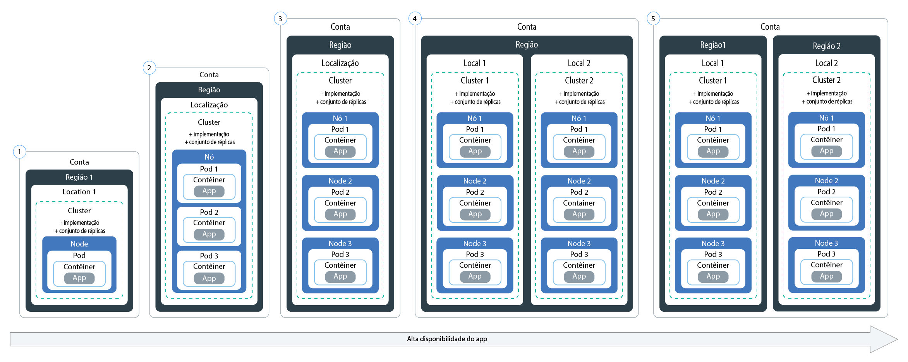
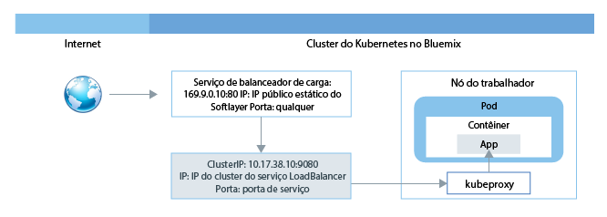
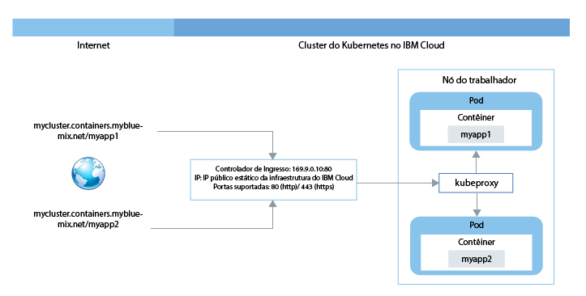
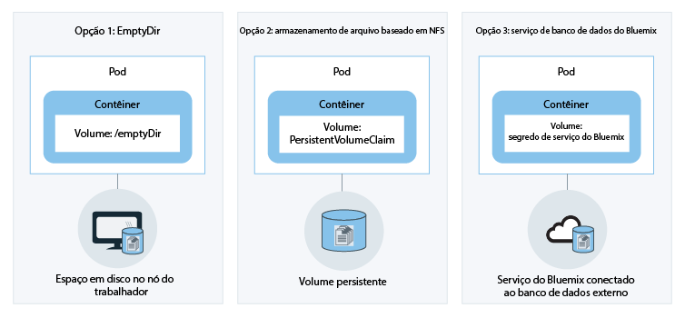

---

copyright: years: 2014, 2017 lastupdated: "2017-12-13"

---

{:new_window: target="_blank"}
{:shortdesc: .shortdesc}
{:screen: .screen}
{:pre: .pre}
{:table: .aria-labeledby="caption"}
{:codeblock: .codeblock}
{:tip: .tip}
{:download: .download}


# Planejando clusters e apps
{: #cs_planning}

Tenha uma ideia das decisões que você pode fazer para configurar e customizar clusters do Kubernetes no {{site.data.keyword.containershort_notm}}. Algumas dessas configurações não podem ser mudadas depois que um cluster é
criado. Conhecer essas configurações com antecedência pode assegurar que recursos, como memória, espaço em disco e endereços IP, estejam disponíveis para suas equipes de desenvolvimento, conforme necessário.
{:shortdesc}

<br />


## Comparação de clusters lite e padrão
{: #cs_planning_cluster_type}

É possível criar clusters Lite ou padrão. Experimente clusters Lite para familiarizar-se e testar alguns recursos do Kubernetes ou criar clusters padrão para usar os recursos completos do Kubernetes para implementar apps.
{:shortdesc}

|Características|Clusters lite|Clusters padrão|
|---------------|-------------|-----------------|
|[Disponível no {{site.data.keyword.Bluemix_notm}}](cs_ov.html#cs_ov)|||
|[Rede em cluster](#cs_planning_private_network)|||
|[Acesso ao app de rede pública por um serviço NodePort](#cs_nodeport)|||
|[Gerenciamento de acesso do usuário](cs_cluster.html#cs_cluster_user)|||
|[Acesso ao serviço do {{site.data.keyword.Bluemix_notm}} por meio do cluster e de apps](cs_cluster.html#cs_cluster_service)|||
|[Espaço em disco no nó do trabalhador para armazenamento](#cs_planning_apps_storage)|||
|[Armazenamento persistente baseado em arquivo NFS com volumes](#cs_planning_apps_storage)| ||
|[Acesso ao app de rede pública ou privada por um serviço de balanceador de carga](#cs_loadbalancer)| ||
|[Acesso ao app de rede pública por um serviço de Ingresso](#cs_ingress)| ||
|[Endereços IP públicos móveis](cs_apps.html#cs_cluster_ip_subnet)| ||
|[Criando log e monitorando](cs_cluster.html#cs_logging)| ||
|[Disponível no {{site.data.keyword.Bluemix_dedicated_notm}}](cs_dedicated.html#dedicated_environment)| ||
{: caption="Tabela 1. Diferenças entre clusters lite e padrão" caption-side="top"}

<br />


## Configuração de Cluster
{: #cs_planning_cluster_config}

Use clusters padrão para aumentar a disponibilidade do app. É menos provável que seus usuários
experimentem tempo de inatividade quando você distribuir a configuração entre múltiplos nós do trabalhador e clusters. Recursos integrados, como balanceamento de carga e isolamento, aumentam a resiliência com relação a potenciais
falhas com hosts, redes ou apps.
{:shortdesc}

Revise estas potenciais configurações de cluster que são ordenadas com graus crescentes de
disponibilidade:


1.  Um cluster com múltiplos nós do trabalhador
2.  Dois clusters que são executados em diferentes locais na mesma região, cada um com
múltiplos nós do trabalhador
3.  Dois clusters que são executados em diferentes regiões, cada um com múltiplos nós do trabalhador

Aumente a disponibilidade de seu cluster com estas técnicas:

<dl>
<dt>Difundir apps pelos nós do trabalhador</dt>
<dd>Permita que os desenvolvedores difundam seus apps em contêineres em múltiplos nós do trabalhador por cluster. Uma instância de aplicativo em cada um dos três nós do trabalhador permite o tempo de inatividade de um nó do trabalhador, sem interromper o uso do aplicativo. É possível especificar quantos nós do trabalhador incluir ao criar um cluster por meio da [GUI do {{site.data.keyword.Bluemix_notm}}](cs_cluster.html#cs_cluster_ui) ou da [CLI](cs_cluster.html#cs_cluster_cli). O Kubernetes limita o número máximo de nós do trabalhador que você pode ter em um cluster, portanto, lembre-se do [nó do trabalhador e das cotas de pod ](https://kubernetes.io/docs/admin/cluster-large/).
<pre class="codeblock">
<code>bx cs cluster-create --location &lt;dal10&gt; --workers 3 --public-vlan &lt;my_public_vlan_id&gt; --private-vlan &lt;my_private_vlan_id&gt; --machine-type &lt;u2c.2x4&gt; --name &lt;my_cluster&gt;</code>
</pre>
</dd>
<dt>Difundir apps entre clusters</dt>
<dd>Crie múltiplos clusters, cada um com múltiplos nós do trabalhador. Se uma indisponibilidade ocorrer com o
cluster, ainda assim os usuários poderão acessar um app que também esteja implementado em outro cluster.
<p>Cluster
1:</p>
<pre class="codeblock">
<code>bx cs cluster-create --location &lt;dal10&gt; --workers 3 --public-vlan &lt;my_public_vlan_id&gt; --private-vlan &lt;my_private_vlan_id&gt; --machine-type &lt;u2c.2x4&gt; --name &lt;my_cluster1&gt;</code>
</pre>
<p>Cluster
2:</p>
<pre class="codeblock">
<code>bx cs cluster-create --location &lt;dal12&gt; --workers 3 --public-vlan &lt;my_public_vlan_id&gt; --private-vlan &lt;my_private_vlan_id&gt; --machine-type &lt;u2c.2x4&gt;  --name &lt;my_cluster2&gt;</code>
</pre>
</dd>
<dt>Difundir apps entre clusters em diferentes regiões</dt>
<dd>Ao difundir aplicativos entre clusters em diferentes regiões, será possível permitir que o balanceamento de carga ocorra com base na região em que o usuário está. Se o cluster, hardware ou até mesmo um local inteiro em
uma região ficar inativo, o tráfego será roteado para o contêiner que estiver implementado em outro local.
<p><strong>Importante:</strong> depois de configurar um domínio customizado, você poderá usar esses comandos para criar os clusters.</p>
<p>Local 1:</p>
<pre class="codeblock">
<code>bx cs cluster-create --location &lt;dal10&gt; --workers 3 --public-vlan &lt;my_public_vlan_id&gt; --private-vlan &lt;my_private_vlan_id&gt; --machine-type &lt;u2c.2x4&gt; --name &lt;my_cluster1&gt;</code>
</pre>
<p>Local 2:</p>
<pre class="codeblock">
<code>bx cs cluster-create --location &lt;ams03&gt; --workers 3 --public-vlan &lt;my_public_vlan_id&gt; --private-vlan &lt;my_private_vlan_id&gt; --machine-type &lt;u2c.2x4&gt; --name &lt;my_cluster2&gt;</code>
</pre>
</dd>
</dl>

<br />


## Configuração do nó do trabalhador
{: #cs_planning_worker_nodes}

Um cluster do Kubernetes consiste em nós do trabalhador e é monitorado e gerenciado centralmente pelo mestre do Kubernetes. Os administradores de cluster decidem como configurar o cluster de nós do trabalhador para assegurar que os usuários do cluster tenham todos os recursos para implementar e executar apps no cluster.
{:shortdesc}

Ao criar um cluster padrão, os nós do trabalhador são pedidos na infraestrutura do IBM Cloud (SoftLayer) em seu nome e configurados no {{site.data.keyword.Bluemix_notm}}. A cada nó do trabalhador é designado
um ID de nó do trabalhador e um nome de domínio exclusivos que não devem ser mudados após a criação do cluster. Dependendo do nível de
isolamento de hardware escolhido, os nós do trabalhador podem ser configurados como nós compartilhados ou dedicados. Cada
nó do trabalhador é provisionado com um tipo específico de máquina que determina o número de vCPUs, memória
e espaço em disco que estão disponíveis para os contêineres que são implementados no nó do trabalhador. O Kubernetes limita o número máximo de nós do trabalhador que você pode ter em um cluster. Revise [cotas de nó do trabalhador e de pod ](https://kubernetes.io/docs/admin/cluster-large/) para obter mais informações.


### Hardware para nós do trabalhador
{: #shared_dedicated_node}

Cada nó do trabalhador é configurado como uma máquina virtual no hardware físico. Quando você cria um cluster padrão no {{site.data.keyword.Bluemix_notm}}, deve-se escolher se deseja que o hardware subjacente seja compartilhado por múltiplos clientes do {{site.data.keyword.IBM_notm}} (multiocupação) ou seja dedicado somente a você (ocupação única).
{:shortdesc}

Em uma configuração de diversos locatários, os recursos físicos, como CPU e memória, são compartilhados entre todas as
máquinas virtuais implementadas no mesmo hardware físico. Para assegurar que cada máquina
virtual possa ser executada independentemente, um monitor de máquina virtual, também referido como hypervisor,
segmenta os recursos físicos em entidades isoladas e aloca como recursos dedicados para
uma máquina virtual (isolamento de hypervisor).

Em uma configuração de locatário único, todos os recursos físicos são dedicados somente a você. É possível implementar
múltiplos nós do trabalhador como máquinas virtuais no mesmo host físico. Semelhante à configuração de diversos locatários,
o hypervisor assegura que cada nó do trabalhador obtenha seu compartilhamento dos recursos físicos
disponíveis.

Os nós compartilhados são geralmente mais baratos do que os nós dedicados porque os custos para o hardware
subjacente são compartilhados entre múltiplos clientes. No entanto, ao decidir entre nós compartilhados
e dedicados, você pode desejar verificar com seu departamento jurídico para discutir o nível de isolamento
e conformidade de infraestrutura que seu ambiente de app requer.

Ao criar um cluster lite, seu nó do trabalhador é provisionado automaticamente como um nó compartilhado na conta de infraestrutura do IBM Cloud (SoftLayer).

<br />


### Limites de memória do nó do trabalhador
{: #resource_limit_node}

O {{site.data.keyword.containershort_notm}} configura um limite de memória em cada nó do trabalhador. Quando os pods que estão em execução no nó do trabalhador excedem esse limite de memória, os pods são removidos. No Kubernetes, esse limite é chamado de [limite máximo de despejo ](https://kubernetes.io/docs/tasks/administer-cluster/out-of-resource/#hard-eviction-thresholds).

Se os pods são removidos frequentemente, inclua mais nós do trabalhador em seu cluster ou configure [limites de recursos ](https://kubernetes.io/docs/concepts/configuration/manage-compute-resources-container/#resource-requests-and-limits-of-pod-and-container) em seu pods.

Cada tipo de máquina tem uma capacidade de memória diferente. Quando há menos memória disponível no nó do trabalhador do que o limite mínimo que é permitido, o Kubernetes remove imediatamente o pod. O pod reagenda em outro nó do trabalhador se um nó do trabalhador está disponível.

|Capacidade de memória do nó do trabalhador|Limite mínimo de memória de um nó do trabalhador|
|---------------------------|------------|
|4 GB  | 256 MB |
|16 GB | 1024 MB |
|64 GB | 4096 MB |
|128 GB| 4096 MB |
|242 GB| 4096 MB |

Para revisar quanta memória é usada em seu nó do trabalhador, execute [kubectl top node ](https://kubernetes.io/docs/reference/generated/kubectl/kubectl-commands#top).


## Responsabilidades de gerenciamento de cluster
{: #responsibilities}

Revise as responsabilidades que você compartilha com a IBM para gerenciar seus clusters.
{:shortdesc}

**A IBM é responsável por:**

- Implementar o mestre, os nós do trabalhador e componentes de gerenciamento dentro do cluster, como o controlador do Ingresso, no momento da criação do cluster
- Gerenciar as atualizações, o monitoramento e a recuperação do mestre do Kubernetes para o cluster
- Monitorar o funcionamento dos nós do trabalhador e fornecer automação para a atualização e a recuperação dos nós do trabalhador
- Executar tarefas de automação em sua conta de infraestrutura, incluindo adicionar nós do trabalhador, remover nós do trabalhador e criar uma sub-rede padrão
- Gerenciar, atualizar e recuperar componentes operacionais dentro do cluster, como o controlador do Ingresso e o plug-in de armazenamento
- Provisionar volumes de armazenamento quando solicitado pelas solicitações de volume persistente
- Fornecer configurações de segurança em todos os nós do trabalhador

<br />
**Você é responsável por:**

- [Implementar e gerenciar recursos do Kubernetes, como pods, serviços e implementações no cluster](cs_apps.html#cs_apps_cli)
- [Usar os recursos do serviço e o Kubernetes para assegurar a alta disponibilidade de apps](cs_planning.html#highly_available_apps)
- [Incluir ou remover capacidade usando a CLI para incluir ou remover nós do trabalhador](cs_cli_reference.html#cs_worker_add)
- [Criar VLANs públicas e privadas na infraestrutura do IBM Cloud (SoftLayer) para isolamento da rede de seu cluster ](https://knowledgelayer.softlayer.com/topic/vlans)
- [Assegurar que todos os nós do trabalhador tenham conectividade de rede com a URL do mestre](cs_security.html#opening_ports) <p>**Nota**: se um nó do trabalhador possuir duas VLANs públicas e privadas, a conectividade de rede será configurada. Se o nó do trabalhador tiver somente uma VLAN privada configurada, então um Vyatta é necessário para fornecer conectividade de rede.</p>
- [Atualizar o mestre kube-apiserver e os nós do trabalhador quando atualizações de versão principal ou secundária do Kubernetes estão disponíveis](cs_cluster.html#cs_cluster_update)
- [Executar ações para recuperar nós do trabalhador problemáticos executando comandos `kubectl`, como `cordon` ou `drain` e executando comandos `bx cs`, como `reboot`, `reload` ou `delete`](cs_cli_reference.html#cs_worker_reboot)
- [Incluir ou remover sub-redes adicionais na infraestrutura do IBM Cloud (SoftLayer) conforme necessário](cs_cluster.html#cs_cluster_subnet)
- [Fazer backup e restaurar dados no armazenamento persistente na infraestrutura do IBM Cloud (SoftLayer) ](../services/RegistryImages/ibm-backup-restore/index.html#ibmbackup_restore_starter)

<br />


## Implementações
{: #highly_available_apps}

Quanto mais amplamente você distribui a configuração entre múltiplos nós do trabalhador e clusters,
menos provável que os usuários tenham que experimentar tempo de inatividade com seu app.
{:shortdesc}

Revise estas configurações de app em potencial que são ordenadas com graus crescentes de
disponibilidade:



1.  Uma implementação com n + 2 pods que são gerenciados por um conjunto de réplicas.
2.  Uma implementação com n + 2 pods que são gerenciados por um conjunto de réplicas e difundidos em múltiplos nós
(antiafinidade) no mesmo local.
3.  Uma implementação com n+2 pods que são gerenciados por um conjunto de réplicas e difundidos em
múltiplos nós (antiafinidade) em diferentes locais.
4.  Uma implementação com n + 2 pods que são gerenciados por um conjunto de réplicas e difundidos em
múltiplos nós (antiafinidade) em diferentes regiões.

Saiba mais sobre as técnicas para aumentar a disponibilidade de seu app:

<dl>
<dt>Usar implementações e conjuntos de réplicas para implementar seu app e suas dependências</dt>
<dd>Uma implementação é um recurso do Kubernetes que pode ser usado para declarar todos os componentes do app e
suas dependências. Descrever os componentes únicos em vez de escrever todas as etapas necessárias
e a ordem para criá-las, é possível se concentrar em como o app deve se parecer quando estiver
em execução.
</br></br>
Ao implementar mais de um pod, um conjunto de réplicas é criado automaticamente para as suas
implementações e monitora os pods e assegura que o número desejado de pods esteja ativo e em execução
sempre. Quando um pod fica inativo, o conjunto de réplicas substitui o pod não responsivo por um novo.
</br></br>
É possível usar uma implementação para definir estratégias de atualização para seu app incluindo o número de
módulos que você deseja incluir durante uma atualização contínua e o número de pods que podem estar indisponíveis
por vez. Ao executar uma atualização contínua, a implementação verifica se a revisão está ou não
funcionando e para o lançamento quando falhas são detectadas.
</br></br>
As implementações também fornecem a possibilidade
de implementar simultaneamente múltiplas revisões com diferentes sinalizações, portanto é possível, por exemplo, testar uma
implementação primeiro antes de decidir enviá-la por push para a produção.
</br></br>
Cada implementação mantém o controle
das revisões que foram implementadas. É possível usar esse histórico de revisões para retroceder para uma versão
anterior quando encontrar que as atualizações não estão funcionando conforme o esperado.</dd>
<dt>Incluir réplicas suficientes para a carga de trabalho de seu app, mais duas</dt>
<dd>Para tornar seu app ainda mais altamente disponível e mais resiliente à falha, considere a inclusão
de réplicas extras, além do mínimo, para manipular a carga de trabalho esperada. As réplicas extras podem manipular a
carga de trabalho no caso de um pod travar e o conjunto de réplicas ainda não tiver recuperado o pod travado. Para
proteção contra duas falhas simultâneas, inclua duas réplicas extras. Essa configuração é um padrão
N + 2, em que N é o número de réplicas para manipular a carga de trabalho recebida e + 2 são duas
réplicas extras. É possível ter quantos pods você desejar em um cluster, contanto que o cluster tenha espaço suficiente para eles.</dd>
<dt>Difundir pods em múltiplos nós (antiafinidade)</dt>
<dd>Ao criar sua implementação, cada pod pode ser implementado no mesmo nó do trabalhador. Essa configuração
na qual os pods existem no mesmo nó do trabalhador é conhecida como afinidade ou colocação. Para proteger o app
de uma falha do nó do trabalhador, é possível impingir a implementação para difundir os pods em múltiplos
nós do trabalhador usando a opção <strong>podAntiAffinity</strong>. Essa opção está disponível
somente para clusters padrão.

</br></br>
<strong>Nota:</strong> o arquivo YAML a seguir garante que cada pod seja implementado em um nó do trabalhador diferente. Quando você tem mais réplicas definidas do que tem nós do trabalhador disponíveis
no cluster, somente o número de réplicas que podem cumprir o requisito de antiafinidade
é implementado. Quaisquer réplicas adicionais permanecem em um estado pendente até que os nós do trabalhador adicionais sejam
incluídos no cluster.

<pre class="codeblock">
<code>apiVersion: extensions/v1beta1
kind: Deployment
metadados:
  name: wasliberty
spec:
  replicas: 3
  :
    metadados:
      labels:
        app: wasliberty
    spec:
      affinity:
        podAntiAffinity:
          preferredDuringSchedulingIgnoredDuringExecution:
          - weight: 100
            podAffinityTerm:
              labelSelector:
                matchExpressions:
                - key: app
                  operator: In
                  values:
                  - wasliberty
              topologyKey: kubernetes.io/hostname
      containers:
      - name: wasliberty
        image: registry.&lt;region&gt;.bluemix.net/ibmliberty
        ports:
        - containerPort: 9080
---
apiVersion: v1
kind: Service
metadata:
  name: wasliberty
  labels:
    app: wasliberty
spec:
  ports:
    # the port that this service should serve on
  - port: 9080
  selector:
    app: wasliberty
  type: NodePort</code></pre>

</dd>
<dt>Distribuir pods em múltiplos locais ou regiões</dt>
<dd>Para proteger o app contra uma falha de local ou de região, será possível criar um segundo cluster em outro local ou região e usar um YAML de implementação para implementar um conjunto de réplicas duplicadas para o seu app. Incluindo uma rota e um balanceador de carga compartilhados na frente de seus clusters, é possível difundir a
carga de trabalho entre os locais e regiões. Para obter mais informações sobre compartilhamento de uma rota entre clusters, veja <a href="cs_cluster.html#cs_cluster" target="_blank">Alta disponibilidade de clusters</a>.

Para obter mais detalhes, revise as opções para <a href="cs_planning.html#cs_planning_cluster_config" target="_blank">implementações altamente disponíveis</a>.</dd>
</dl>


### Implementação de app mínimo
{: #minimal_app_deployment}

Uma implementação básica do app em um cluster lite ou padrão pode incluir os componentes a seguir.
{:shortdesc}


Para implementar os componentes para um app mínimo conforme descrito no diagrama, você usa um arquivo de configuração semelhante ao exemplo a seguir:
```
apiVersion: extensions/v1beta1
kind: Deployment
metadata:
  name: ibmliberty
spec:
  replicas: 1
  template:
    metadata:
      labels:
        app: ibmliberty
    spec:
      containers:
      - name: ibmliberty
        image: registry.<region>.bluemix.net/ibmliberty:latest
---
apiVersion: v1
kind: Service
metadata:
  name: ibmliberty-service
  labels:
    app: ibmliberty
spec:
  selector:
    run: ibmliberty
  type: NodePort
  ports:
   - protocol: TCP
     port: 9080
```
{: codeblock}

Para aprender mais sobre cada componente, revise os [Conceitos básicos do Kubernetes](cs_ov.html#kubernetes_basics).

<br />


## Rede em cluster
{: #cs_planning_private_network}

A comunicação de rede segura em cluster entre os nós do trabalhador e os pods é realizada com redes locais virtuais privadas (VLANs). Uma VLAN configura um grupo de
nós do trabalhador e pods como se eles estivessem conectados à mesma ligação física.
{:shortdesc}

Ao criar um cluster, cada cluster é conectado automaticamente a uma VLAN privada. A VLAN privada
determina o endereço IP privado que é designado a um nó do trabalhador durante a criação de cluster.

|Tipo de cluster|Gerenciador da VLAN privada para o cluster|
|------------|-------------------------------------------|
|Clusters Lite em {{site.data.keyword.Bluemix_notm}}|{{site.data.keyword.IBM_notm}}|
|Clusters padrão no {{site.data.keyword.Bluemix_notm}}|Você em sua conta de infraestrutura do IBM Cloud (SoftLayer) <p>**Dica:** para ter acesso a todas as VLANs em sua conta, ative a [Ampliação de VLAN ](https://knowledgelayer.softlayer.com/procedure/enable-or-disable-vlan-spanning).</p>|
{: caption="Tabela 2. Responsabilidades de gerenciamento da VLAN privada" caption-side="top"}

Todos os pods implementados em um nó do trabalhador também são designados a um endereço IP privado. Os pods são
designados a um IP na variação de endereços privados 172.30.0.0/16 e são roteados somente entre os nós do trabalhador. Para evitar conflitos, não use esse intervalo de IPs em nós que se comunicarão com seus nós do
trabalhador. Os nós do trabalhador e os pods podem se comunicar com segurança na rede privada usando os endereços IP
privados. No entanto, quando um pod trava ou um nó do trabalhador precisa ser recriado, um novo endereço IP privado
é designado.

Visto que é difícil rastrear a mudança de endereços IP privados para apps que devem ser altamente disponíveis, é possível usar os recursos integrados de descoberta de serviço do Kubernetes e expor os apps como serviços IP do cluster na rede privada no cluster. Um serviço do Kubernetes agrupa um conjunto
de pods e fornece conexão de rede a esses pods para outros serviços no cluster sem
expor o endereço IP privado real de cada pod. Ao criar um serviço IP do cluster, um endereço IP privado é designado a esse serviço do intervalo de endereços privados 10.10.10.0/24. Como ocorre com a variação de endereços
privados do pod, não use esse intervalo de IP em nós que se comunicarão com seus nós do trabalhador. Esse endereço IP é acessível somente dentro do cluster. Não
é possível acessar esse endereço IP na Internet. Ao mesmo tempo, uma entrada de consulta de DNS é criada para
o serviço e armazenada no componente kube-dns do cluster. A entrada DNS contém o nome do
serviço, o namespace no qual o serviço foi criado e o link para o endereço IP do cluster privado
designado.

Se um app no cluster precisar acessar um pod que esteja atrás de um serviço IP do cluster, ele poderá usar o endereço IP do cluster privado que foi designado ao serviço ou enviar uma solicitação usando o nome do serviço. Ao usar o nome do serviço, o nome é consultado no
componente kube-dns e roteado para o endereço IP do cluster privado do serviço. Quando uma solicitação
atinge o serviço, o serviço assegura que todas as solicitações sejam igualmente encaminhadas para os pods,
independentemente de seus endereços IP privados e o nó do trabalhador no qual eles estão implementados.

Para obter mais informações sobre como criar um serviço do tipo IP do cluster, veja [Serviços do Kubernetes ](https://kubernetes.io/docs/concepts/services-networking/service/#publishing-services---service-types).

<br />


## Rede pública
{: #cs_planning_public_network}

Ao criar um cluster, cada cluster deve ser conectado a uma VLAN pública. A VLAN pública
determina o endereço IP público que é designado a um nó do trabalhador durante a criação de cluster.
{:shortdesc}

A interface de rede pública para os nós do trabalhador em ambos os clusters lite e padrão é protegida por políticas de rede do Calico. Essas políticas bloqueiam a maior parte do tráfego de entrada por padrão. No entanto, o tráfego de entrada que é necessário para o Kubernetes funcionar é permitida, assim como conexões NodePort, Loadbalancer e os serviços do Ingresso. Para obter mais informações sobre essas políticas, incluindo como modificá-las, consulte [Políticas de rede](cs_security.html#cs_security_network_policies).

|Tipo de cluster|Gerenciador da VLAN pública para o cluster|
|------------|------------------------------------------|
|Clusters Lite em {{site.data.keyword.Bluemix_notm}}|{{site.data.keyword.IBM_notm}}|
|Clusters padrão no {{site.data.keyword.Bluemix_notm}}|Você em sua conta de infraestrutura do IBM Cloud (SoftLayer)|
{: caption="Tabela 3. Responsabilidades de gerenciamento da VLAN" caption-side="top"}

Dependendo de você ter criado um cluster lite ou padrão, será possível escolher entre as opções a seguir para expor um app ao público.

-   [Serviço NodePort](#cs_nodeport) (clusters lite e padrão)
-   [Serviço LoadBalancer](#cs_loadbalancer) (somente clusters padrão)
-   [Ingresso](#cs_ingress) (somente
clusters padrão)


### Exponha um app à Internet usando um serviço NodePort
{: #cs_nodeport}

Exponha uma porta pública em seu nó do trabalhador e use o endereço IP público do nó do trabalhador para acessar seu serviço no cluster publicamente por meio da Internet.
{:shortdesc}

Ao expor seu app criando um serviço do Kubernetes do tipo NodePort, um NodePort no intervalo de 30.000 a 32.767 e um endereço IP interno do cluster são designados ao serviço. O serviço NodePort serve como o ponto de entrada externo para solicitações recebidas para seu app. O NodePort designado é exposto publicamente nas configurações kubeproxy de cada nó do trabalhador no cluster. Cada nó do trabalhador inicia o atendimento no NodePort designado para solicitações recebidas para o
serviço. Para acessar o serviço por meio da Internet, será possível usar o endereço IP público de qualquer nó do trabalhador que tenha sido designado durante a criação do cluster e o NodePort no formato `<ip_address>:<nodeport>`. Além do endereço IP público, um serviço NodePort está disponível durante o endereço IP privado de um nó do trabalhador.

O diagrama a seguir mostra como a comunicação é direcionada da Internet para um app quando um serviço NodePort está configurado.


Conforme descrito no diagrama, quando uma solicitação chega ao serviço NodePort, ela é encaminhada automaticamente para o IP de cluster interno do serviço e encaminhada posteriormente do componente `kube-proxy` componente para o endereço IP privado do pod no qual o app está implementado. O IP do cluster é
acessível somente dentro do cluster. Se você tiver múltiplas réplicas de seu app em execução em diferentes pods, o componente `kube-proxy` equilibrará a carga das solicitações recebidas entre todas as réplicas.

**Nota:** o endereço IP público do nó do trabalhador não é permanente. Quando um nó do trabalhador é removido ou recriado, um novo endereço IP público é designado ao
nó do trabalhador. É possível usar o serviço do NodePort para testar o acesso público para o seu aplicativo ou quando o acesso público for necessário apenas para uma quantia pequena de tempo. Ao requerer um endereço IP público estável e mais disponibilidade para seu serviço, exponha seu app usando um [serviço LoadBalancer](#cs_loadbalancer) ou [Ingresso](#cs_ingress).

Para obter mais informações sobre como criar um serviço do tipo NodePort com o {{site.data.keyword.containershort_notm}}, veja [Configurando o acesso público a um app usando o tipo de serviço NodePort](cs_apps.html#cs_apps_public_nodeport).


### Exponha um app à Internet usando um serviço LoadBalancer
{: #cs_loadbalancer}

Exponha uma porta e use o endereço IP público ou privado para que o balanceador de carga acesse o app.
{:shortdesc}


Ao criar um cluster padrão, o {{site.data.keyword.containershort_notm}} solicita automaticamente cinco endereços IP móveis públicos e cinco endereços IP móveis privados e os provisiona em sua conta de infraestrutura do IBM Cloud (SoftLayer) durante a criação do cluster. Dois dos endereços IP móveis, um público e um privado, são usados para [Balanceadores de carga de aplicativo do Ingress](#cs_ingress). Quatro endereços IP móveis públicos e quatro endereços IP móveis privados podem ser usados para expor apps criando um serviço LoadBalancer.

Ao criar um serviço do Kubernetes LoadBalancer em um cluster em uma VLAN pública, um balanceador de carga externo é criado. Um dos quatro endereços IP públicos disponíveis é designado ao balanceador de carga. Se nenhum endereço
IP público móvel estiver disponível, a criação de seu serviço LoadBalancer falhará. O serviço LoadBalancer serve como o ponto de entrada externo para solicitações recebidas para o app. Diferente dos serviços NodePort, é possível designar qualquer porta a seu balanceador de carga e não ser limitado a um determinado intervalo de portas. O endereço IP público móvel que é designado ao seu serviço LoadBalancer é permanente e não muda quando um nó do trabalhador é removido ou recriado. Portanto, o serviço LoadBalancer é mais disponível do que o serviço NodePort. Para acessar o serviço LoadBalancer por meio da Internet, use o endereço IP público do balanceador de carga e a porta designada no formato `<ip_address>:<port>`.

O diagrama a seguir mostra como o LoadBalancer direciona a comunicação da Internet para um app:



Conforme descrito no diagrama, quando uma solicitação chega ao serviço LoadBalancer, a solicitação é encaminhada automaticamente para o endereço IP do cluster interno que é designado ao serviço LoadBalancer durante a criação de serviço. O endereço IP do cluster é acessível somente dentro do cluster. No endereço IP do cluster, as solicitações recebidas são encaminhadas adicionalmente ao componente `kube-proxy` de seu nó do trabalhador. Então, as solicitações são encaminhadas ao endereço IP privado do pod no qual o app está implementado. Se você tiver múltiplas réplicas de seu app em execução em diferentes pods, o componente `kube-proxy` equilibrará a carga das solicitações recebidas entre todas as réplicas.

Se você usar um serviço LoadBalancer, uma porta de nó também estará disponível em cada endereço IP de qualquer nó do trabalhador. Para bloquear o acesso à porta de nó enquanto você estiver usando um serviço LoadBalancer, consulte [Bloqueando tráfego recebido](cs_security.html#cs_block_ingress).

Suas opções para endereços IP quando você cria um serviço LoadBalancer são como a seguir:

- Se o seu cluster estiver em uma VLAN pública, um endereço IP móvel público será usado.
- Se o seu cluster estiver disponível apenas em uma VLAN privada, então, um endereço IP móvel privado será usado.
- É possível solicitar um endereço IP público ou privado móvel para um serviço LoadBalancer, incluindo uma anotação no arquivo de configuração: `service.kubernetes.io/ibm-load-balancer-cloud-provider-ip-type: <public_or_private>`.

Para obter mais informações sobre como criar um serviço LoadBalancer com {{site.data.keyword.containershort_notm}}, consulte [Configurando o acesso público a um app usando o tipo de serviço de balanceador de carga](cs_apps.html#cs_apps_public_load_balancer).

### Expor um app à Internet com Ingresso
{: #cs_ingress}

O Ingresso permite expor múltiplos serviços em seu cluster e torná-los publicamente disponíveis usando um ponto de entrada público único.
{:shortdesc}

Em vez de criar um serviço de balanceador de carga para cada app que você desejar expor ao público, o Ingresso fornece uma rota pública exclusiva que permite encaminhar solicitações públicas para apps dentro e fora do seu cluster com base em seus caminhos individuais. O ingresso consiste em dois componentes principais. O
recurso de Ingresso define as regras de como rotear solicitações recebidas para um app. Todos os recursos de Ingresso devem ser registrados com o controlador de Ingresso que atende a solicitações de serviço HTTP ou HTTPS recebidas e encaminha solicitações com base nas regras definidas para cada recurso de Ingresso.

Quando você cria um cluster padrão, o {{site.data.keyword.containershort_notm}} cria automaticamente um controlador do Ingresso altamente disponível para seu cluster e designa uma rota pública exclusiva com o formato `<cluster_name>.<region>.containers.mybluemix.net` a ele. A rota pública está vinculada a um endereço IP público móvel que é provisionado em sua conta de infraestrutura do IBM Cloud (SoftLayer) durante a criação do cluster.

O diagrama a seguir mostra como o Ingresso direciona a comunicação da internet para um app:



Para expor um app por meio de Ingresso, deve-se criar um serviço Kubernetes para seu app e registrá-lo
com o controlador de Ingresso definindo um recurso de Ingresso. O recurso de Ingresso especifica o caminho que você deseja anexar à rota pública para formar uma URL exclusiva para seu app exposto, como por exemplo: `mycluster.us-south.containers.mybluemix.net/myapp`. Quando você insere essa rota em seu navegador da web, conforme descrito no diagrama, a solicitação é enviada ao endereço IP público móvel vinculado do controlador de Ingresso. O controlador de Ingresso verifica se existe uma regra de roteamento para o caminho `myapp` no
cluster `mycluster`. Se uma regra de correspondência for localizada, a solicitação incluindo
o caminho individual será encaminhada para o pod no qual o app está implementado, considerando as regras que
foram definidas no objeto de recurso de Ingresso original. Para que o app processe solicitações
recebidas, certifique-se de que seu app atenda no caminho individual que você definiu no recurso de
Ingresso.

É possível configurar o controlador de Ingresso para gerenciar o tráfego de rede recebido para seus apps para os
cenários a seguir:

-   Usar o domínio fornecido pela IBM sem finalização TLS
-   Usar o domínio fornecido pela IBM e o certificado TLS com finalização TLS
-   Usar seu domínio customizado e certificado TLS para executar a finalização TLS
-   Usar o domínio fornecido pela IBM ou um customizado e os certificados TLS para acessar apps fora do seu
cluster
-   Inclua recursos em seu controlador do Ingresso usando anotações

Para obter mais informações sobre como usar o Ingresso com o {{site.data.keyword.containershort_notm}}, veja [Configurando o acesso público a um app usando o controlador de Ingresso](cs_apps.html#cs_apps_public_ingress).

<br />


## Gerenciamento de acesso do usuário
{: #cs_planning_cluster_user}

É possível conceder acesso a um cluster para outros usuários em sua organização para assegurar que
somente os usuários autorizados possam trabalhar com o cluster e implementar apps no cluster.
{:shortdesc}

Para obter mais informações, veja [Gerenciando usuários e o acesso a um cluster no {{site.data.keyword.containershort_notm}}](cs_cluster.html#cs_cluster_user).

<br />


## Registros de imagem
{: #cs_planning_images}

Uma imagem do Docker é a base para cada contêiner que você cria. Uma imagem é criada por meio de um Dockerfile, que é um arquivo que contém instruções para construir a imagem. Um Dockerfile pode
referenciar os artefatos de construção em suas instruções que são armazenadas separadamente, como um app, a configuração
do app e suas dependências.
{:shortdesc}

As imagens geralmente são armazenadas em um registro que pode ser acessado pelo público (registro público) ou configurado com acesso
limitado para um pequeno grupo de usuários (registro privado). Os registros
públicos, como Docker Hub, podem ser usados na introdução ao Docker e Kubernetes para criar seu
primeiro app conteinerizado em um cluster. Mas quando se trata de aplicativos corporativos, use um registro
privado como aquele fornecido no {{site.data.keyword.registryshort_notm}} para proteger suas imagens de serem usadas
e mudadas por usuários não autorizados. Os registros
privados devem ser configurados pelo administrador de cluster para assegurar que as credenciais para acessar o registro
privado estejam disponíveis para os usuários do cluster.

É possível usar múltiplos registros com o {{site.data.keyword.containershort_notm}} para implementar apps em seu cluster.

|Registro|Descrição|Benefício|
|--------|-----------|-------|
|[{{site.data.keyword.registryshort_notm}}](/docs/services/Registry/index.html)|Com essa opção, é possível configurar o seu próprio repositório de imagem do Docker seguro no {{site.data.keyword.registryshort_notm}} no qual é possível armazenar e compartilhar as imagens com segurança entre
usuários do cluster.|<ul><li>Gerencie o acesso a imagens em sua conta.</li><li>Use imagens e apps de amostra fornecidos pela {{site.data.keyword.IBM_notm}}, como o {{site.data.keyword.IBM_notm}} Liberty, como uma imagem pai e inclua seu próprio código de app nela.</li><li>Varredura automática de imagens para potenciais vulnerabilidades pelo Vulnerability Advisor, incluindo
recomendações específicas do S.O. para corrigi-las.</li></ul>|
|Qualquer outro registro privado|Conecte qualquer registro privado existente a seu cluster criando um [imagePullSecret ](https://kubernetes.io/docs/concepts/containers/images/). O segredo é usado para salvar com segurança sua URL de registro e credenciais em um
segredo do Kubernetes.|<ul><li>Use os registros privados existentes independentemente de sua origem (Docker Hub, registros pertencentes
à organização ou outros registros de Nuvem privada).</li></ul>|
|Docker Hub público|Use essa opção para usar imagens públicas existentes diretamente do Docker Hub quando nenhuma mudança
do Dockerfile for necessária. <p>**Nota:** lembre-se de que essa opção poderá não atender aos requisitos de segurança de sua organização, como gerenciamento de acesso, varredura de vulnerabilidade ou privacidade de app.</p>|<ul><li>Nenhuma configuração adicional é necessária para seu cluster.</li><li>Inclui uma variedade de aplicativos de software livre.</li></ul>|
{: caption="Tabela 4. Opções de registro de imagem pública e privada" caption-side="top"}

Depois de configurar um registro de imagem, os usuários do cluster podem usar as imagens para suas implementações de app
no cluster.

Para obter mais informações sobre como acessar um registro público ou privado e usar uma imagem para criar seu contêiner, veja [Usando registros de imagem privada e pública com o {{site.data.keyword.containershort_notm}}](cs_cluster.html#cs_apps_images).

<br />


## Armazenamento de dados persistentes
{: #cs_planning_apps_storage}

Um contêiner é, por design, de curta duração. No entanto, conforme mostrado no diagrama a seguir, é possível escolher entre várias opções para persistir dados para o caso de um failover de contêiner e para compartilhar dados entre contêineres.

**Observação**: se você tiver um firewall, [permita acesso de saída](cs_security.html#opening_ports) para os intervalos de IP da infraestrutura do IBM Cloud (SoftLayer) dos locais (centros de dados) em que seus clusters estão, para que seja possível criar solicitações de volume persistentes.
{:shortdesc}



|Opção|Descrição|
|------|-----------|
|Opção 1: usar `/emptyDir` para persistir dados usando o espaço em disco disponível
no nó do trabalhador<p>Esse recurso está disponível para clusters lite e padrão.</p>|Com essa opção, é possível criar um volume vazio no espaço em disco do nó do trabalhador que
está designado a um pod. O contêiner nesse pod pode ler e gravar nesse volume. Como o
volume está designado a um pod específico, os dados não podem ser compartilhados com outros pods em um conjunto de réplicas.<p>Um volume `/emptyDir` e seus dados são removidos quando o pod designado é
excluído permanentemente do nó do trabalhador.</p><p>**Nota:** se o contêiner dentro do pod travar, os dados no volume ainda ficarão disponíveis no nó do trabalhador.</p><p>Para obter mais informações, veja [Volumes do Kubernetes ](https://kubernetes.io/docs/concepts/storage/volumes/).</p>|
|Opção 2: criar uma solicitação de volume persistente para provisionar armazenamento persistente baseado no NFS para sua implementação<p>Este recurso está disponível somente para clusters padrão.</p>|<p>Com essa opção, é possível ter armazenamento persistente de dados do app e do contêiner por meio de volumes persistentes. Os volumes são hospedados no [Resistência e Desempenho do armazenamento de arquivo baseado em NFS](https://www.ibm.com/cloud/file-storage/details). O armazenamento de arquivo é criptografado em repouso e é possível criar réplicas dos dados armazenados.</p> <p>Você cria uma [solicitação de volume persistente](cs_apps.html) para iniciar uma solicitação para o armazenamento de arquivos baseado em NFS. O {{site.data.keyword.containershort_notm}} fornece classes de armazenamento predefinidas que definem o intervalo de tamanhos do armazenamento, o IOPS, a política de exclusão e as permissões de leitura e gravação para o volume. É possível
escolher entre essas classes de armazenamento ao criar sua solicitação de volume persistente. Depois de enviar uma solicitação de volume persistente, o {{site.data.keyword.containershort_notm}} provisiona dinamicamente um volume persistente que está hospedado no armazenamento de arquivo baseado em NFS. [É possível montar a solicitação de volume persistente](cs_apps.html#cs_apps_volume_claim) como um volume para a sua implementação para permitir que os contêineres leiam e gravem no volume. Os volumes persistentes podem ser compartilhados entre o mesmo conjunto de réplicas ou com outras implementações no mesmo cluster.</p><p>Quando um contêiner trava ou um pod é removido de um nó do trabalhador, os dados não são removidos e ainda podem ser acessados por outras implementações que montam o volume. As solicitações de volume persistente são hospedadas no armazenamento persistente, mas não possuem backups. Se você requerer um backup dos dados, crie um backup manual.</p><p>**Nota:** o armazenamento de compartilhamento de arquivo NFS é cobrado mensalmente. Se você provisionar o armazenamento persistente para seu cluster e removê-lo imediatamente, ainda pagará o encargo mensal para o armazenamento persistente, mesmo que você o tenha usado somente por um curto tempo.</p>|
|Opção 3: ligar um serviço de banco de dados {{site.data.keyword.Bluemix_notm}} ao seu pod<p>Esse recurso está disponível para clusters lite e padrão.</p>|Com essa opção, é possível persistir e acessar dados usando um serviço de nuvem de banco de dados {{site.data.keyword.Bluemix_notm}}. Ao ligar
o serviço do {{site.data.keyword.Bluemix_notm}} a um namespace em
seu cluster, um segredo do Kubernetes é criado. O segredo do Kubernetes retém a informação confidencial
sobre o serviço, como a URL para o serviço, seu nome do usuário e a senha. É possível montar o
segredo como um volume de segredo em seu pod e acessar o serviço usando as credenciais no segredo. Montando o volume de segredo em outros pods, também é possível compartilhar dados entre os pods.<p>Quando um
contêiner trava ou um pod é removido de um nó do trabalhador, os dados não são removidos e ainda podem ser
acessados por outros pods que montam o volume de segredo.</p><p>A maioria dos serviços de banco de dados do {{site.data.keyword.Bluemix_notm}} fornecem espaço em disco para
uma pequena quantia de dados sem custo, para que você possa testar seus recursos.</p><p>Para obter mais informações sobre como ligar um serviço do {{site.data.keyword.Bluemix_notm}} a um pod, veja [Incluindo os serviços do {{site.data.keyword.Bluemix_notm}} para apps no {{site.data.keyword.containershort_notm}}](cs_apps.html#cs_apps_service).</p>|
{: caption="Tabela 5. Opções de armazenamento de dados persistentes para implementações em clusters do Kubernetes" caption-side="top"}

<br />


## Integrações
{: #cs_planning_integrations}

É possível usar vários serviços externos e serviços no Catálogo do {{site.data.keyword.Bluemix_notm}} com um cluster padrão no {{site.data.keyword.containershort_notm}}.
{:shortdesc}

<table summary="Resumo para acessibilidade">
<caption>Tabela 6. Opções de integração para clusters e apps no Kubernetes</caption>
<thead>
<tr>
<th>Serviço</th>
<th>Descrição</th>
</tr>
</thead>
<tbody>
<tr>
<td>Blockchain</td>
<td>Implementar um ambiente de desenvolvimento publicamente disponível para o IBM Blockchain para um cluster do Kubernetes no {{site.data.keyword.containerlong_notm}}. Use esse ambiente para desenvolver e customizar sua própria rede de blockchain para implementar apps que compartilham um livro razão imutável para registrar o histórico de transações. Para obter mais informações, veja <a href="https://ibm-blockchain.github.io" target="_blank">Desenvolver em um ambiente de simulação de nuvem
IBM Blockchain Platform </a>. </td>
</tr>
<tr>
<td>Entrega Contínua</td>
<td>Automatize as construções de app e as implementações do contêiner para clusters do Kubernetes usando uma cadeia de ferramentas. Para obter informações de configuração, consulte o blog <a href="https://developer.ibm.com/recipes/tutorials/deploy-kubernetes-pods-to-the-bluemix-container-service-using-devops-pipelines/" target="_blank">Implementar pods do Kubernetes no {{site.data.keyword.containerlong_notm}} usando DevOps Pipelines </a>. </td>
</tr>
<tr>
<td>Helm</td>
<td> <a href="https://helm.sh/" target="_blank">O Helm </a> é um gerenciador de pacote do Kubernetes. Crie Gráficos do Helm para definir, instalar e atualizar aplicativos complexos do Kubernetes em execução nos clusters do {{site.data.keyword.containerlong_notm}}. Saiba mais sobre como é possível <a href="https://developer.ibm.com/recipes/tutorials/increase-deployment-velocity-with-kubernetes-helm-charts/" target="_blank">aumentar a velocidade de implementação com os Gráficos do Helm do Kubernetes </a>. </td>
</tr>
<tr>
<td>Instana</td>
<td> O <a href="https://www.instana.com/" target="_blank">Instana </a> fornece monitoramento de desempenho de infraestrutura e app com uma GUI que descobre automaticamente e mapeia seus apps. Além disso, o Istana captura cada solicitação para seus apps, que permite solucionar problemas e executar análise de causa raiz para evitar que os problemas aconteçam novamente. Confira a postagem do blog sobre <a href="https://www.instana.com/blog/precise-visibility-applications-ibm-bluemix-container-service/" target="_blank">implementando o Istana no {{site.data.keyword.containershort_notm}} </a> para saber mais.</td>
</tr>
<tr>
<td>Istio</td>
<td>O <a href="https://www.ibm.com/cloud/info/istio" target="_blank">Istio</a> é um serviço de software livre que fornece aos desenvolvedores uma maneira de conectar, proteger, gerenciar e monitorar uma rede de microsserviços, também conhecida como rede de serviços, em plataformas de orquestração de nuvem como o Kubernetes. Confira a postagem do blog sobre <a href="https://developer.ibm.com/dwblog/2017/istio/" target="_blank">como a IBM cofundou e lançou o Istio</a> para descobrir mais sobre o projeto de software livre. Para instalar o Istio em seu cluster do Kubernetes no {{site.data.keyword.containershort_notm}} e começar com um aplicativo de amostra, consulte [Tutorial: Gerenciando microsserviços com o Istio](cs_tutorials_istio.html#istio_tutorial).</td>
</tr>
<tr>
<td>Prometheus</td>
<td>Prometheus é uma ferramenta de monitoramento, criação de log e alerta de software livre que foi projetada
especificamente para o Kubernetes para recuperar informações detalhadas sobre o cluster, os nós do trabalhador e
o funcionamento de implementação com base nas informações de criação de log do Kubernetes. A atividade de CPU, memória, E/S e rede
de todos os contêineres em execução em um cluster é coletada e pode ser usada em consultas ou alertas customizados
para monitorar o desempenho e as cargas de trabalho em seu cluster.
<p>Para usar o Prometheus.</p>
<ol>
<li>Instale o Prometheus seguindo <a href="https://github.com/coreos/prometheus-operator/tree/master/contrib/kube-prometheus" target="_blank">as instruções do CoreOS </a>.
<ol>
<li>Ao executar o comando de exportação, use seu namespace kube-system. <p><code>export NAMESPACE=kube-system hack/cluster-monitoring/deploy</code></p></li>
</ol>
</li>
<li>Após o Prometheus ser implementado em seu cluster, edite a origem de dados do Orometheus no Grafana para
se referir a <code>prometheus.kube-system:30900</code>.</li>
</ol>
</td>
</tr>
<tr>
<td>{{site.data.keyword.bpshort}}</td>
<td>{{site.data.keyword.bplong}} é uma ferramenta de automação que usa o Terraform para implementar sua infraestrutura como código. Ao implementar sua infraestrutura como uma única unidade, é possível reutilizar essas definições de recurso em nuvem em qualquer número de ambientes. Para definir um cluster do Kubernetes como um recurso com {site.data.keyword.bpshort}}, tente criar um ambiente com o [modelo de cluster de contêiner](https://console.bluemix.net/schematics/templates/details/Cloud-Schematics%2Fcontainer-cluster). Para obter mais informações sobre diagramas, consulte [Sobre o {{site.data.keyword.bplong_notm}}](/docs/services/schematics/schematics_overview.html#about).</td>
</tr>
<tr>
<td>Weave Scope</td>
<td>O Weave Scope fornece um diagrama visual de seus recursos dentro de um cluster do Kubernetes, incluindo serviços, pods, contêineres, processos, nós e muito mais. O Weave Scope fornece métricas interativas para CPU e memória e também fornece ferramentas para uso de tail e executável em um contêiner.<p>Para obter mais informações, veja [Visualizando os recursos de cluster do Kubernetes com o Weave Scope e o {{site.data.keyword.containershort_notm}}](cs_cluster.html#cs_weavescope).</p></li></ol>
</td>
</tr>
</tbody>
</table>

<br />


## Acessar o portfólio de infraestrutura do IBM Cloud (SoftLayer)
{: #cs_planning_unify_accounts}

Para criar um cluster do Kubernetes padrão, deve-se ter acesso ao portfólio de infraestrutura do IBM Cloud (SoftLayer). Esse acesso é necessário para
solicitar recursos de infraestrutura pagos, como nós do trabalhador, endereços IP públicos móveis ou
armazenamento persistente para seu cluster.
{:shortdesc}

As contas {{site.data.keyword.Bluemix_notm}} Pay-As-You-Go que foram criadas depois que a vinculação de conta automática foi ativada já estão configuradas com acesso ao portfólio de infraestrutura do IBM Cloud (SoftLayer), para que seja possa comprar recursos de infraestrutura para seu cluster sem configuração adicional.

Os usuários com outros tipos de contas do {{site.data.keyword.Bluemix_notm}} ou usuários que possuem uma conta de infraestrutura do IBM Cloud existente (SoftLayer) que não está vinculada a sua conta do {{site.data.keyword.Bluemix_notm}} devem configurar suas contas para criar clusters padrão.

Revise a tabela a seguir para localizar opções disponíveis para cada tipo de conta.

|Tipo de conta|Descrição|Opções disponíveis para criar um cluster padrão|
|------------|-----------|----------------------------------------------|
|Contas Lite|Contas Lite não podem provisionar clusters.|<ul><li>[Faça upgrade da sua conta Lite para uma conta Pay-As-You-Go do {{site.data.keyword.Bluemix_notm}}](/docs/pricing/billable.html#upgradetopayg) que esteja configurada com acesso ao portfólio de infraestrutura do IBM Cloud (SoftLayer).</li></ul>|
|Contas Pay-As-You-Go|As contas Pay-As-You-Go que foram criadas antes de a vinculação de conta automática estar disponível não vieram com acesso ao portfólio de infraestrutura do IBM Cloud (SoftLayer).<p>Se você tiver uma conta de infraestrutura do IBM Cloud existente (SoftLayer), não será possível vincular essa conta a uma conta Pay-As-You-Go mais antiga.</p>|<ul><li>Opção 1: [Criar uma nova conta Pay-As-You-Go](/docs/pricing/billable.html#billable) que estiver configurada com acesso ao portfólio de infraestrutura do IBM Cloud (SoftLayer). Ao escolher essa opção,
você tem duas contas e faturamentos separados do
{{site.data.keyword.Bluemix_notm}}.<p>Se você desejar continuar usando a sua antiga conta Pay-As-You-Go para criar clusters padrão, será possível usar sua nova conta Pay-As-You-Go para gerar uma chave API para acessar o portfólio de infraestrutura do IBM Cloud (SoftLayer). Em seguida, deve-se configurar a chave API
para sua conta Pay-As-You-Go antiga. Para obter mais informações, veja [Gerando
uma chave API para contas Pay-As-You-Go e de Assinatura antigas](#old_account). Mantenha em mente que os recursos de infraestrutura do IBM Cloud (SoftLayer) são cobrados através de sua nova conta Pay-As-You-Go.</p></li><li>Opção 2: se você já tiver uma conta de infraestrutura do IBM Cloud existente (SoftLayer) que você desejar usar, será possível [configurar as suas credenciais](cs_cli_reference.html#cs_credentials_set) para a sua conta do {{site.data.keyword.Bluemix_notm}}.<p>Nota: a conta de infraestrutura do IBM Cloud (SoftLayer) que você usar com a sua conta do {{site.data.keyword.Bluemix_notm}} deverá ser configurada com permissões de Superusuário.</p></li></ul>|
|Contas de assinatura|As contas de assinatura não são configuradas com acesso ao portfólio de infraestrutura do IBM Cloud (SoftLayer).|<ul><li>Opção 1: [Criar uma nova conta Pay-As-You-Go](/docs/pricing/billable.html#billable) que estiver configurada com acesso ao portfólio de infraestrutura do IBM Cloud (SoftLayer). Ao escolher essa opção,
você tem duas contas e faturamentos separados do
{{site.data.keyword.Bluemix_notm}}.<p>Se você desejar continuar usando a sua conta de Assinatura para criar clusters padrão, será possível usar a sua nova conta Pay-As-You-Go para gerar uma chave API para acessar o portfólio de infraestrutura do IBM Cloud (SoftLayer). Em seguida, deve-se configurar a chave API
para sua conta de Assinatura. Para obter mais informações, veja [Gerando
uma chave API para contas Pay-As-You-Go e de Assinatura antigas](#old_account). Mantenha em mente que os recursos de infraestrutura do IBM Cloud (SoftLayer) são cobrados através de sua nova conta Pay-As-You-Go.</p></li><li>Opção 2: se você já tiver uma conta de infraestrutura do IBM Cloud existente (SoftLayer) que você desejar usar, será possível [configurar as suas credenciais](cs_cli_reference.html#cs_credentials_set) para a sua conta do {{site.data.keyword.Bluemix_notm}}.<p>Nota: a conta de infraestrutura do IBM Cloud (SoftLayer) que você usar com a sua conta do {{site.data.keyword.Bluemix_notm}} deverá ser configurada com permissões de Superusuário.</p></li></ul>|
|Contas de infraestrutura do IBM Cloud (SoftLayer), nenhuma conta do {{site.data.keyword.Bluemix_notm}}|Para criar um cluster padrão, deve-se ter uma conta do {{site.data.keyword.Bluemix_notm}}.|<ul><li>[Criar uma nova conta Pay-As-You-Go](/docs/pricing/billable.html#billable) que esteja configurada com acesso ao portfólio de infraestrutura do IBM Cloud (SoftLayer). Ao escolher essa opção, uma infraestrutura IBM Cloud (SoftLayer) será criada para você. Você tem duas contas de infraestrutura do IBM Cloud (SoftLayer) separadas e faturamento.</li></ul>|
{: caption="Tabela 7. As opções disponíveis para criar clusters padrão com contas que não estão vinculadas a uma conta de infraestrutura do IBM Cloud (SoftLayer)" caption-side="top"}


### Gerando uma chave API da infraestrutura do IBM Cloud (SoftLayer) para usar com contas do {{site.data.keyword.Bluemix_notm}}
{: #old_account}

Se desejar continuar usando a sua conta Pay-As-You-Go ou de Assinatura antiga para criar
clusters padrão, deverá gerar uma chave API com sua nova conta Pay-As-You-Go e configurar a
chave API para sua conta antiga.
{:shortdesc}

Antes de iniciar, crie uma conta {{site.data.keyword.Bluemix_notm}} Pay-As-You-Go que seja configurada automaticamente com acesso ao portfólio da infraestrutura do IBM Cloud (SoftLayer).

1.  Efetue login no [portal de infraestrutura do IBM Cloud (SoftLayer)](https://control.softlayer.com/) usando o {{site.data.keyword.ibmid}} e a senha que você criou para a sua nova conta Pay-As-You-Go.
2.  Selecione **Conta** e, em seguida, **Usuários**.
3.  Clique em **Gerar** para gerar uma chave API de infraestrutura do IBM Cloud (SoftLayer) para sua nova conta Pay-As-You-Go.
4.  Copie a chave API.
5.  Na CLI, efetue login no {{site.data.keyword.Bluemix_notm}} usando o {{site.data.keyword.ibmid}} e a senha de sua conta de Pagamento por uso ou de Assinatura antiga.

  ```
  bx login
  ```
  {: pre}

6.  Configure a chave API gerada anteriormente para acessar o portfólio de infraestrutura do IBM Cloud (SoftLayer). Substitua `<API_KEY>` pela chave API e `<USERNAME>` pelo {{site.data.keyword.ibmid}} de sua nova conta de Pagamento por uso.

  ```
  bx cs credentials-set --infrastructure-api-key <API_KEY> --infrastructure-username <USERNAME>
  ```
  {: pre}

7.  Inicie a [criação de clusters padrão](cs_cluster.html#cs_cluster_cli).

**Nota:** para revisar sua chave API depois de ela ter sido gerada, siga as etapas 1 e 2 e, em seguida, na seção **Chave API**, clique em **Visualizar** para ver a chave API de seu ID do usuário.
