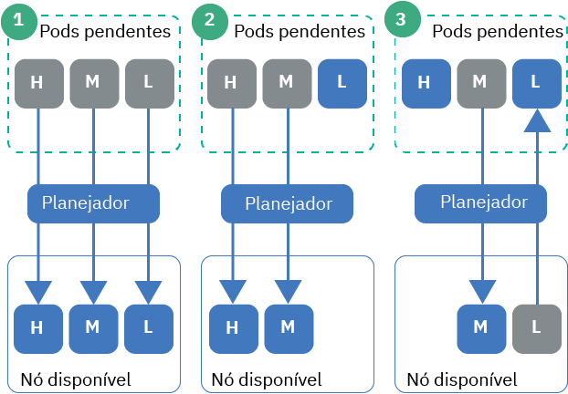

---

copyright:
  years: 2014, 2019
lastupdated: "2019-05-31"

keywords: kubernetes, iks

subcollection: containers

---

{:new_window: target="_blank"}
{:shortdesc: .shortdesc}
{:screen: .screen}
{:pre: .pre}
{:table: .aria-labeledby="caption"}
{:codeblock: .codeblock}
{:tip: .tip}
{:note: .note}
{:important: .important}
{:deprecated: .deprecated}
{:download: .download}
{:preview: .preview}


# Configurando a prioridade do pod
{: #pod_priority}

Com a prioridade e a preempção do pod do Kubernetes, é possível configurar classes de prioridade para indicar a prioridade relativa de um pod. O planejador do Kubernetes leva em consideração a prioridade de um pod e pode até mesmo priorizar (remover) pods com prioridade mais baixa para deixar espaço em um nó do trabalhador para os pods de prioridade mais alta. Os clusters do {{site.data.keyword.containerlong}} que executam o Kubernetes versão 1.11.2 ou mais recente suportam o controlador de admissão `Priority` que cumpre essas classes.
{: shortdesc}

**Por que configuro a prioridade de pod?**</br>
Como um administrador de cluster, você deseja controlar quais pods são mais críticos para a carga de trabalho do cluster. As classes de prioridade podem ajudar a controlar as decisões do planejador do Kubernetes para favorecer os pods de prioridade mais alta sobre os pods de prioridade mais baixa. O planejador pode até mesmo priorizar (remover) pods de prioridade mais baixa que estão em execução para que os pods de prioridade mais alta pendentes possam ser planejados.

Configurando a prioridade do pod, é possível ajudar a evitar que cargas de trabalho de prioridade mais baixa impactem cargas de trabalho críticas em seu cluster, especialmente nos casos em que o cluster começa a atingir a sua capacidade de recurso.

Certifique-se de que você tenha [configurado o acesso de usuário adequado](/docs/containers?topic=containers-users#users) para seu cluster e, se aplicável, [políticas de segurança do pod](/docs/containers?topic=containers-psp#psp). Políticas de segurança de acesso e pod podem ajudar a evitar que usuários não confiáveis implementem pods de alta prioridade que evitam que outros pods sejam planejados.
{: tip}

{: #priority_scheduling}
**Como a preempção e o planejamento de prioridade funcionam?**</br>
Em geral, os pods pendentes que têm uma prioridade mais alta são planejados antes dos pods priorizados mais baixos. Se você não tiver recursos suficientes nos nós do trabalhador, o planejador poderá priorizar (remover) os pods para liberar recursos suficientes para os pods priorizados mais altos serem planejados. A preempção é afetada também por períodos de finalização harmoniosa, orçamentos de interrupção do pod e afinidade do nó do trabalhador.

Se você não especificar uma prioridade para a implementação do pod, o padrão será configurado para a classe de prioridade que é configurada como o `globalDefault`. Se você não tiver uma classe de prioridade `globalDefault`, a prioridade padrão para todos os pods será zero (`0`). Por padrão, o {{site.data.keyword.containerlong_notm}} não configura um `globalDefault`, portanto, a prioridade padrão do pod é zero.

Para entender como a prioridade do pod e o planejador trabalham juntos, considere os cenários na figura a seguir. Deve-se colocar os pods priorizados nos nós do trabalhador com recursos disponíveis. Caso contrário, os pods de alta prioridade em seu cluster podem permanecer pendentes, ao mesmo tempo que os pods existentes são removidos, como no Cenário 3.

_ Figura: Cenários de Prioridade do Pod _


1.  Três pods com prioridade alta, média e baixa estão pendentes de planejamento. O planejador localiza um nó do trabalhador disponível com espaço para todos os 3 pods e planeja-os em ordem de prioridade, com o pod de prioridade mais alta planejado primeiro.
2.  Três pods com prioridade alta, média e baixa estão pendentes de planejamento. O planejador localiza um nó do trabalhador disponível, mas o nó do trabalhador tem recursos suficientes somente para suportar os pods de prioridade alta e média. O pod de baixa prioridade não está planejado e permanece pendente.
3.  Dois pods com prioridade alta e média estão pendentes de planejamento. Existe um terceiro pod com baixa prioridade em um nó do trabalhador disponível. No entanto, o nó do trabalhador não tem recursos suficientes para planejar qualquer um dos pods pendentes. O planejador prioriza ou remove o pod de baixa prioridade, que retorna o pod para um estado pendente. Em seguida, o planejador tenta planejar o pod de alta prioridade. No entanto, o nó do trabalhador não tem recursos suficientes para planejar o pod de alta prioridade e, em vez disso, o planejador planeja o pod de prioridade média.

**Para obter mais informações**: consulte a documentação do Kubernetes sobre [prioridade do pod e preempção ](https://kubernetes.io/docs/concepts/configuration/pod-priority-preemption/).

**Posso desativar o controlador de admissão de prioridade de pod?**</br>
Não. Se você não desejar usar a prioridade do pod, não configure um `globalDefault` ou inclua uma classe de prioridade em suas implementações de pod. Cada pod é padronizado para zero, exceto para os pods críticos do cluster que a IBM implementa com as [classes de prioridade padrão](#default_priority_class). Como a prioridade do pod é relativa, essa configuração básica assegura que os pods críticos do cluster sejam priorizados para recursos e planeja quaisquer outros pods seguindo as políticas de planejamento existentes que você tem no local.

**Como as cotas de recurso afetam a prioridade de pod?**</br>
É possível usar a prioridade do pod em combinação com cotas de recurso, incluindo [escopos de cota ](https://kubernetes.io/docs/concepts/policy/resource-quotas/#quota-scopes) para clusters que executam o Kubernetes 1.12 ou mais recente. Com os escopos de cota, é possível configurar suas cotas de recurso para considerar a prioridade do pod. Os pods de prioridade mais alta podem consumir recursos do sistema que são limitados pela cota de recurso antes dos pods de prioridade mais baixa.

## Entendendo classes de prioridade padrão
{: #default_priority_class}

Seus clusters do {{site.data.keyword.containerlong_notm}} vêm com algumas classes de prioridade por padrão.
{: shortdesc}

Não modifique as classes padrão, que são usadas para gerenciar adequadamente seu cluster. É possível usar essas classes em suas implementações de app ou [criar suas próprias classes de prioridade](#create_priority_class).
{: important}

A tabela a seguir descreve as classes de prioridade que estão em seu cluster por padrão e por que elas são usadas.

| Nome | Configurado por | Valor de Prioridade | Propósito |
|---|---|---|
| `system-node-critical` | Kubernetes | 2000001000 | Selecione os pods que são implementados no namespace `kube-system` ao criar o cluster e use essa classe de prioridade para proteger a funcionalidade crítica para nós do trabalhador, como para rede, armazenamento, criação de log, monitoramento e pods de métricas. |
| `system-cluster-critical` | Kubernetes | 2000000000 | Selecione os pods que são implementados no namespace `kube-system` ao criar o cluster e use essa classe de prioridade para proteger a funcionalidade crítica para clusters, como para redes, armazenamento, criação de log, monitoramento e pods de métricas. |
| `ibm-app-cluster-critical` | IBM | 900000000 | Selecione os pods que são implementados no namespace `ibm-system` ao criar o cluster e use essa classe de prioridade para proteger a funcionalidade crítica para apps, como os pods do balanceador de carga. |
{: caption="Classes de prioridade padrão que não devem ser modificadas" caption-side="top"}

É possível verificar quais pods usam as classes de prioridade, executando o comando a seguir.

```
kubectl get pods -- all-namespaces -o custom-columns=NAME: .metadata.name, PRIORITY: .spec.priorityClassName
```
{: pre}

## Criando uma classe de prioridade
{: #create_priority_class}

Para configurar a prioridade do pod, é necessário usar uma classe de prioridade.
{: shortdesc}

Antes de iniciar:
* [Efetue login em sua conta. Se aplicável, direcione o grupo de recursos apropriado. Configure o contexto para o seu cluster.](/docs/containers?topic=containers-cs_cli_install#cs_cli_configure)
* Assegure-se de que você tenha a [função de **Gravador** ou **Gerenciador** do serviço {{site.data.keyword.Bluemix_notm}} IAM](/docs/containers?topic=containers-users#platform) para o namespace `default`.
* [Crie](/docs/containers?topic=containers-clusters#clusters_ui) ou [atualize](/docs/containers?topic=containers-update#update) seu cluster para o Kubernetes versão 1.11 ou mais recente.

Para usar uma classe de prioridade:

1.  Opcional: use uma classe de prioridade existente como um modelo para a nova classe.

    1.  Liste as classes de prioridade existentes.

        ```
        kubectl get priorityclasses
        ```
        {: pre}

    2.  Escolha a classe de prioridade que você deseja copiar e crie um arquivo YAML local.

        ```
        kubectl get priorityclass <priority_class> -o yaml > Downloads/priorityclass.yaml
        ```
        {: pre}

2.  Faça seu arquivo YAML de classe de prioridade.

    ```yaml
    apiVersion: scheduling.k8s.io/v1alpha1
    kind: PriorityClass
    metadata:
      name: <priority_class_name>
    value: <1000000>
    globalDefault: <false>
    description: "Use this class for XYZ service pods only."
    ```
    {: codeblock}

    <table>
    <caption>Entendendo os componentes de arquivo YAML</caption>
    <thead>
    <th colspan=2> entendendo os componentes de arquivo do YAML</th>
    </thead>
    <tbody>
    <tr>
    <td><code>metadata.name</code></td>
    <td>Necessário: o nome da classe de prioridade que você deseja criar.</td>
    </tr>
    <tr>
    <td><code>value</code></td>
    <td>Necessário: insira um número inteiro menor ou igual a 1 bilhão (1000000000). Quanto maior o valor, maior a prioridade. Os valores são relativos aos valores de outras classes de prioridade no cluster. Reserve números muito altos para os pods críticos do sistema que você não deseja que sejam priorizados (removidos). </br></br>Por exemplo, o valor do intervalo de [classes padrão de prioridade crítica para cluster](#default_priority_class) é de 900000000 a 2000001000, portanto, insira um valor menor que esses números para novas classes de prioridade, para que nada seja priorizado acima desses pods.</td>
    </tr>
    <tr>
    <td><code>globalDefault</code></td>
    <td>Opcional: configure o campo como `true` para tornar essa classe de prioridade o padrão global que é aplicado a cada pod que está planejado sem um valor `priorityClassName`. Somente 1 classe de prioridade em seu cluster pode ser configurada como o padrão global. Se não houver nenhum padrão global, os pods sem `priorityClassName` especificado terão uma prioridade de zero (`0`).</br></br>
    As [classes de prioridade padrão](#default_priority_class) não configuram um `globalDefault`. Se outras classes de prioridade foram criadas em seu cluster, será possível garantir que elas não configurem um `globalDefault` executando `kubectl describe priorityclass <name>`.</td>
    </tr>
    <tr>
    <td><code>description</code></td>
    <td>Opcional: diga aos usuários por que usar essa classe de prioridade. Coloque a sequência entre aspas (`""`).</td>
    </tr></tbody></table>

3.  Crie a classe de prioridade em seu cluster.

    ```
    kubectl apply -f filepath/priorityclass.yaml
    ```
    {: pre}

4.  Verifique se a classe de prioridade foi criada.

    ```
    kubectl get priorityclasses
    ```
    {: pre}

Ótimo! Você criou uma classe de prioridade. Deixe a sua equipe saber sobre a classe de prioridade e qual classe de prioridade, se houver, que ela deve usar para as suas implementações de pod.  

## Designando prioridade a seus pods
{: #prioritize}

Designe uma classe de prioridade à sua especificação de pod para configurar a prioridade do pod no seu cluster do {{site.data.keyword.containerlong_notm}}. Se os seus pods existiam antes das classes de prioridade serem disponibilizadas com o Kubernetes versão 1.11, deve-se editar os arquivos YAML de pod para designar uma prioridade aos pods.
{: shortdesc}

Antes de iniciar:
* [Efetue login em sua conta. Se aplicável, direcione o grupo de recursos apropriado. Configure o contexto para o seu cluster.](/docs/containers?topic=containers-cs_cli_install#cs_cli_configure)
* Assegure-se de que você tenha [a função de serviço **Gravador** ou **Gerenciador** do {{site.data.keyword.Bluemix_notm}} IAM](/docs/containers?topic=containers-users#platform) no namespace no qual deseja implementar os pods.
* [Crie](/docs/containers?topic=containers-clusters#clusters_ui) ou [atualize](/docs/containers?topic=containers-update#update) seu cluster para o Kubernetes versão 1.11 ou mais recente.
* [Entenda como o planejamento de prioridade funciona](#priority_scheduling), pois a prioridade pode priorizar os pods existentes e afetar como os recursos de seu cluster são consumidos.

Para designar prioridade a seus pods:

1.  Verifique a importância de outros pods implementados para que seja possível escolher a classe de prioridade correta para seus pods em relação ao que já está implementado.

    1.  Visualize as classes de prioridade que outros pods no namespace usam.

        ```
        kubectl get pods -n <namespace> -o custom-columns=NAME:.metadata.name,PRIORITY:.spec.priorityClassName
        ```
        {: pre}

    2.  Obtenha os detalhes da classe de prioridade e anote o número do **valor**. Os pods com números mais altos são priorizados antes dos pods com números mais baixos. Repita essa etapa para cada classe de prioridade que deseja revisar.

        ```
        kubectl describe priorityclass <priorityclass_name>
        ```
        {: pre}

2.  Obtenha a classe de prioridade que você deseja usar ou [crie sua própria classe de prioridade](#create_priority_class).

    ```
    kubectl get priorityclasses
    ```
    {: pre}

3.  Em sua especificação de pod, inclua o campo `priorityClassName` com o nome da classe de prioridade que você recuperou na etapa anterior.

    ```yaml
    apiVersion: apps/v1
    kind: Deployment
    metadata:
      name: ibmliberty
    spec:
      replicas: 1
      selector:
        matchLabels:
          app: ibmliberty
      template:
        metadata:
          labels:
            app: ibmliberty
        spec:
          containers:
          - name: ibmliberty
            image: icr.io/ibmliberty:latest
            ports:
            - containerPort: 9080
          priorityClassName: <priorityclass_name>
    ```
    {: codeblock}

4.  Crie seus pods priorizados no namespace em que você deseja implementá-los.

    ```
    kubectl apply -f filepath/pod-deployment.yaml
    ```
    {: pre}
