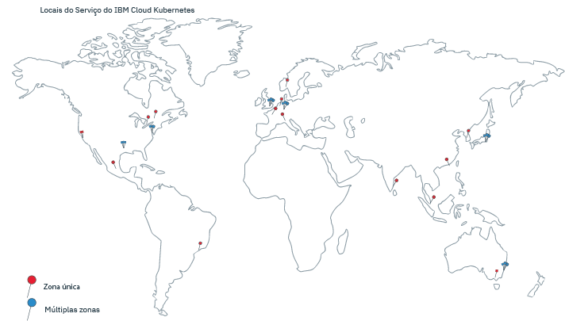

---

copyright:
  years: 2014, 2019
lastupdated: "2019-06-06"

keywords: kubernetes, iks

subcollection: containers

---

{:new_window: target="_blank"}
{:shortdesc: .shortdesc}
{:screen: .screen}
{:pre: .pre}
{:table: .aria-labeledby="caption"}
{:codeblock: .codeblock}
{:tip: .tip}
{:note: .note}
{:important: .important}
{:deprecated: .deprecated}
{:download: .download}
{:preview: .preview}

# Localidades
{: #regions-and-zones}

É possível implementar clusters do {{site.data.keyword.containerlong}} em todo o mundo. Ao criar um cluster Kubernetes, seus recursos permanecem no local para o qual você implementa o cluster. É possível acessar o {{site.data.keyword.containerlong_notm}} por meio de um terminal de API global para trabalhar com seu cluster.
{:shortdesc}



_{{site.data.keyword.containerlong_notm}} locais_

Recursos do {{site.data.keyword.Bluemix_notm}} usados para serem organizados em regiões que foram acessadas por meio de [terminais específicos da região](#bluemix_regions). Em vez disso, use o [terminal global](#endpoint).
{: deprecated}

## Locais do {{site.data.keyword.containerlong_notm}}
{: #locations}

Os recursos do {{site.data.keyword.Bluemix_notm}} são organizados em uma hierarquia de locais geográficos. O {{site.data.keyword.containerlong_notm}} está disponível em um subconjunto desses locais, incluindo todas as seis regiões mundiais com capacidade de multizona. Os clusters grátis estão disponíveis somente em locais selecionados. Outros serviços do {{site.data.keyword.Bluemix_notm}} podem estar disponíveis globalmente ou em um local específico.
{: shortdesc}

### Locais disponíveis
{: #available-locations}

Para listar os locais do {{site.data.keyword.containerlong_notm}} disponíveis, use o comando `ibmcloud ks supported-locations`.
{: shortdesc}

A imagem a seguir é usada como um exemplo para explicar como os locais do {{site.data.keyword.containerlong_notm}} são organizados.


<table summary="A tabela mostra a organização de locais do {{site.data.keyword.containerlong_notm}}. As linhas devem ser lidas da esquerda para a direita, com o tipo de local na coluna um, um exemplo do tipo na coluna dois, e a descrição na coluna três.">
<caption>Organização de locais do {{site.data.keyword.containerlong_notm}}.</caption>
  <thead>
  <th>Tipo</th>
  <th>Exemplo</th>
  <th>Descrição</th>
  </thead>
  <tbody>
    <tr>
      <td>Geografia</td>
      <td>América do Norte (`na`)</td>
      <td>Um agrupamento organizacional que é baseado em continentes geográficos.</td>
    </tr>
    <tr>
      <td>Country</td>
      <td>Canadá (`ca`)</td>
      <td>O país do local dentro da geografia.</td>
    </tr>
    <tr>
      <td>Metro</td>
      <td>Cidade do México (`mex-cty`), Dallas (`dal`)</td>
      <td>O nome de uma cidade em que 1 ou mais data centers (zonas) estão localizados. Uma área metropolitana pode ter capacidade de multizona e ter data centers com capacidade de multizona, como Dallas, ou pode ter somente data centers de zona única, como a Cidade do México. Se você criar um cluster em uma área metropolitana com capacidade de multizona, o principal do Kubernetes e os nós do trabalhador poderão ser difundidos entre as zonas para alta disponibilidade.</td>
    </tr>
    <tr>
      <td>Data center (zona)</td>
      <td>Dallas 12 (`dal12`)</td>
      <td>Um local físico da infraestrutura de cálculo, de rede e de armazenamento e do resfriamento e energia relacionados que hospedam os serviços e aplicativos de nuvem. Os clusters podem ser distribuídos entre data centers ou zonas em uma arquitetura de multizona para alta disponibilidade. As zonas são isoladas umas das outras, o que assegura nenhum ponto único de falha compartilhado.</td>
    </tr>
  </tbody>
  </table>

### Locais de zona única e de multizona no {{site.data.keyword.containerlong_notm}}
{: #zones}

As tabelas a seguir listam os locais únicos e de multizona disponíveis no {{site.data.keyword.containerlong_notm}}. Observe que em determinadas áreas metropolitanas, é possível provisionar um cluster como uma zona única ou um cluster de multizona. Além disso, os clusters grátis estão disponíveis somente em geografias selecionadas somente como clusters de zona única com um nó do trabalhador.
{: shortdesc}

* **Multizona**: se você criar um cluster em um local de área metropolitana de multizona, as réplicas de seu principal do Kubernetes altamente disponível serão difundidas automaticamente entre as zonas. Você tem a opção de difundir os nós do trabalhador por meio de zonas para proteger seus apps de uma falha de zona.
* **Zona única**: se você criar um cluster em um único local de data center, será possível criar múltiplos nós do trabalhador, mas não será possível difundi-los entre as zonas. O mestre altamente disponível inclui três réplicas em hosts separados, mas não se difunde entre zonas.

Para determinar rapidamente se uma zona tem capacidade de multizona, é possível executar `ibmcloud ks supported-locations` e procurar o valor na coluna `Multizone Metro`.
{: tip}


Recursos do {{site.data.keyword.Bluemix_notm}} usados para serem organizados em regiões que foram acessadas por meio de [terminais específicos da região](#bluemix_regions). As tabelas listam as regiões anteriores para propósitos informacionais. A partir de agora, é possível usar o [terminal global](#endpoint) para mover-se em direção a uma arquitetura sem região.
{: deprecated}

**Locais de área metropolitana de multizona**

<table summary="A tabela mostra os locais de área metropolitana de multizona disponíveis no {{site.data.keyword.containerlong_notm}}. As linhas devem ser lidas da esquerda para a direita. A coluna um é a geografia em que o local está, a coluna dois é o país do local, a coluna três é a área metropolitana do local, a coluna quatro é o data center e a coluna cinco é a região descontinuada que o local usou para organização.">
<caption>Locais de área metropolitana de multizona disponíveis no {{site.data.keyword.containerlong_notm}}.</caption>
  <thead>
  <th>Geografia</th>
  <th>Country</th>
  <th>Metro</th>
  <th>Datacenter</th>
  <th>Região descontinuada</th>
  </thead>
  <tbody>
    <tr>
      <td>Ásia-Pacífico</td>
      <td>Australia</td>
      <td>Sydney</td>
      <td>syd01, syd04, syd05</td>
      <td>Sul da Ásia-Pacífico (`ap-south`, `au-syd`)</td>
    </tr>
    <tr>
      <td>Ásia-Pacífico</td>
      <td>Japão</td>
      <td>Tóquio</td>
      <td>tok02, tok04, tok05</td>
      <td>Norte da Ásia-Pacífico (`ap-north`, `jp-tok`)</td>
    </tr>
    <tr>
      <td>Europa</td>
      <td>Alemanha</td>
      <td>Frankfurt</td>
      <td>fra02, fra04, fra05</td>
      <td>UE Central (`eu-central`, `eu-de`)</td>
    </tr>
    <tr>
      <td>Europa</td>
      <td>United Kingdom</td>
      <td>Londres</td>
      <td>lon04, lon05`*`, lon06</td>
      <td>Sul do Reino Unido (`uk-south`, `eu-gb`)</td>
    </tr>
    <tr>
      <td>América do Norte</td>
      <td>Estados Unidos</td>
      <td>Dallas</td>
      <td>dal10, dal12, dal13</td>
      <td>Sul dos EUA (`us-south`)</td>
    </tr>
    <tr>
      <td>América do Norte</td>
      <td>Estados Unidos</td>
      <td>Washington, D.C.</td>
      <td>wdc04, wdc06, wdc07</td>
      <td>Leste dos EUA (`us-east`)</td>
    </tr>
  </tbody>
  </table>

**Locais do data center de zona única**

<table summary="A tabela mostra os locais de data center de zona única disponíveis no {{site.data.keyword.containerlong_notm}}. As linhas devem ser lidas da esquerda para a direita. A coluna um é a geografia em que o local está, a coluna dois é o país do local, a coluna três é a área metropolitana do local, a coluna quatro é o data center e a coluna cinco é a região descontinuada que o local usou para organização.">
<caption>Locais de zona única disponíveis no {{site.data.keyword.containerlong_notm}}.</caption>
  <thead>
  <th>Geografia</th>
  <th>Country</th>
  <th>Metro</th>
  <th>Datacenter</th>
  <th>Região descontinuada</th>
  </thead>
  <tbody>
    <tr>
      <td>Ásia-Pacífico</td>
      <td>Australia</td>
      <td>Melbourne</td>
      <td>mel01</td>
      <td>Sul da Ásia-Pacífico (`ap-south`, `au-syd`)</td>
    </tr>
    <tr>
      <td>Ásia-Pacífico</td>
      <td>Australia</td>
      <td>Sydney</td>
      <td>syd01, syd04, syd05</td>
      <td>Sul da Ásia-Pacífico (`ap-south`, `au-syd`)</td>
    </tr>
    <tr>
      <td>Ásia-Pacífico</td>
      <td>China</td>
      <td>Hong Kong<br>SAR do PRC</td>
      <td>hkg02</td>
      <td>Norte da Ásia-Pacífico (`ap-north`, `jp-tok`)</td>
    </tr>
    <tr>
      <td>Ásia-Pacífico</td>
      <td>Índia</td>
      <td>Chennai</td>
      <td>che01</td>
      <td>Norte da Ásia-Pacífico (`ap-north`, `jp-tok`)</td>
    </tr>
    <tr>
      <td>Ásia-Pacífico</td>
      <td>Japão</td>
      <td>Tóquio</td>
      <td>tok02, tok04, tok05</td>
      <td>Norte da Ásia-Pacífico (`ap-north`, `jp-tok`)</td>
    </tr>
    <tr>
      <td>Ásia-Pacífico</td>
      <td>Coreia</td>
      <td>Seul</td>
      <td>seo01</td>
      <td>Norte da Ásia-Pacífico (`ap-north`, `jp-tok`)</td>
    </tr>
    <tr>
      <td>Ásia-Pacífico</td>
      <td>Singapura</td>
      <td>Singapura</td>
      <td>sng01</td>
      <td>Norte da Ásia-Pacífico (`ap-north`, `jp-tok`)</td>
    </tr>
    <tr>
      <td>Europa</td>
      <td>França</td>
      <td>Paris</td>
      <td>par01</td>
      <td>UE Central (`eu-central`, `eu-de`)</td>
    </tr>
    <tr>
      <td>Europa</td>
      <td>Alemanha</td>
      <td>Frankfurt</td>
      <td>fra02, fra04, fra05</td>
      <td>UE Central (`eu-central`, `eu-de`)</td>
    </tr>
    <tr>
      <td>Europa</td>
      <td>Itália</td>
      <td>Milão</td>
      <td>mil01</td>
      <td>UE Central (`eu-central`, `eu-de`)</td>
    </tr>
    <tr>
      <td>Europa</td>
      <td>Países Baixos</td>
      <td>Amsterdã</td>
      <td>ams03</td>
      <td>UE Central (`eu-central`, `eu-de`)</td>
    </tr>
    <tr>
      <td>Europa</td>
      <td>Noruega</td>
      <td>Oslo</td>
      <td>osl</td>
      <td>UE Central (`eu-central`, `eu-de`)</td>
    </tr>
    <tr>
      <td>Europa</td>
      <td>United Kingdom</td>
      <td>Londres</td>
      <td>lon02`*`, lon04, lon05`*`, lon06</td>
      <td>Sul do Reino Unido (`uk-south`, `eu-gb`)</td>
    </tr>
    <tr>
      <td>América do Norte</td>
      <td>Canadá</td>
      <td>Montreal</td>
      <td>mon01</td>
      <td>Leste dos EUA (`us-east`)</td>
    </tr>
    <tr>
      <td>América do Norte</td>
      <td>Canadá</td>
      <td>Toronto</td>
      <td>tor01</td>
      <td>Leste dos EUA (`us-east`)</td>
    </tr>
    <tr>
      <td>América do Norte</td>
      <td>México</td>
      <td>Cidade do México</td>
      <td>mex01</td>
      <td>Sul dos EUA (`us-south`)</td>
    </tr>
    <tr>
      <td>América do Norte</td>
      <td>Estados Unidos</td>
      <td>Dallas</td>
      <td>dal10, dal12, dal13</td>
      <td>Sul dos EUA (`us-south`)</td>
    </tr>
    <tr>
      <td>América do Norte</td>
      <td>Estados Unidos</td>
      <td>São José</td>
      <td>sjc03, sjc04</td>
      <td>Sul dos EUA (`us-south`)</td>
    </tr>
    <tr>
      <td>América do Norte</td>
      <td>Estados Unidos</td>
      <td>Washington, D.C.</td>
      <td>wdc04, wdc06, wdc07</td>
      <td>Leste dos EUA (`us-east`)</td>
    </tr>
    <tr>
      <td>América
do Sul</td>
      <td>Brasil</td>
      <td>São Paulo</td>
      <td>sao01</td>
      <td>Sul dos EUA (`us-south`)</td>
    </tr>
  </tbody>
  </table>

` * `  lon05 substitui lon02. Os novos clusters devem usar lon05 e somente lon05 suporta difusão de mestres altamente disponíveis entre zonas.
{: note}

### Clusters de zona única
{: #regions_single_zone}

Em um cluster de zona única, os recursos de cluster permanecem na zona em que o cluster é implementado. A imagem a seguir destaca o relacionamento de componentes do cluster de zona única com um exemplo do local de Toronto, Canadá `tor01`.
{: shortdesc}


_Entendendo onde seus recursos de cluster de zona única residem._

1.  Os recursos do seu cluster, incluindo os nós principal e do trabalhador, estão no mesmo data center no qual você implementou o cluster. Quando você inicia ações de orquestração de contêiner local, como comandos `kubectl`, as informações são trocadas entre os nós principal e do trabalhador dentro da mesma zona.

2.  Se você configurar outros recursos de cluster, como armazenamento, rede, cálculo ou apps em execução em pods, os recursos e seus dados permanecerão na zona na qual você implementou o cluster.

3.  Quando você inicia ações de gerenciamento de cluster, como usar comandos `ibmcloud ks`, as informações básicas sobre o cluster (como nome, ID, usuário, o comando) são roteadas por meio de um terminal regional por via do terminal global. Os terminais regionais estão localizados na região de área metropolitana de multizona mais próxima. Neste exemplo, a região de área metropolitana é Washington, D.C.

### Clusters de múltiplas zonas
{: #regions_multizone}

Em um cluster de multizona, os recursos de seu cluster são difundidos entre múltiplas zonas para maior disponibilidade.
{: shortdesc}

1.  Os nós do trabalhador são distribuídos em múltiplas zonas no local de área metropolitana para fornecer mais disponibilidade para seu cluster. As réplicas do principal do Kubernetes também são difundidas entre as zonas. Quando você inicia as ações de orquestração de contêiner local, como comandos `kubectl`, as informações são trocadas entre os nós principal e do trabalhador por meio do terminal global.

2.  Outros recursos de cluster, como armazenamento, rede, cálculo ou apps em execução em pods, variam em como são implementados nas zonas em seu cluster de múltiplas zonas. Para obter mais informações, revise estes tópicos:
    *   Configurando o [armazenamento de arquivo](/docs/containers?topic=containers-file_storage#add_file) e o [armazenamento de bloco](/docs/containers?topic=containers-block_storage#add_block) em clusters de multizona ou [escolhendo uma solução de armazenamento persistente de multizona](/docs/containers?topic=containers-storage_planning#persistent_storage_overview).
    *   [Ativando o acesso público ou privado a um app usando um serviço de balanceador de carga de rede (NLB) em um cluster de multizona](/docs/containers?topic=containers-loadbalancer#multi_zone_config).
    *   [Gerenciando o tráfego de rede usando o Ingress](/docs/containers?topic=containers-ingress#planning).
    *   [Aumentando a disponibilidade de seu app](/docs/containers?topic=containers-app#increase_availability).

3.  Quando você inicia ações de gerenciamento de cluster, como usar [comandos `ibmcloud ks`](/docs/containers?topic=containers-cli-plugin-kubernetes-service-cli), as informações básicas sobre o cluster (como nome, ID, usuário, o comando) são roteadas por meio do terminal global.

### Clusters grátis
{: #regions_free}

Os clusters grátis são limitados a locais específicos.
{: shortdesc}

**Criando um cluster grátis na CLI**: antes de criar um cluster grátis, deve-se ter uma região como destino executando `ibmcloud ks region-set`. Seu cluster é criado em uma área metropolitana dentro da região que você tem como destino: a área metropolitana de Sydney em `ap-south`, a área metropolitana de Frankfurt em `eu-central`, a área metropolitana de Londres em `uk-south` ou a área metropolitana de Dallas em `us-south`. Observe que não é possível especificar uma zona dentro da área metropolitana.

**Criando um cluster grátis no console do {{site.data.keyword.Bluemix_notm}}**: ao usar o console, é possível selecionar uma geografia e um local de área metropolitana na geografia. É possível selecionar a área metropolitana de Dallas na América do Norte, as áreas metropolitanas de Frankfurt ou Londres na Europa ou a área metropolitana de Sydney na Ásia-Pacífico. Seu cluster é criado em uma zona dentro da área metropolitana que você escolhe.

<br />


## Acessando o terminal global
{: #endpoint}

É possível organizar seus recursos em serviços do {{site.data.keyword.Bluemix_notm}} usando locais do {{site.data.keyword.Bluemix_notm}} (anteriormente chamados de regiões). Por exemplo, é possível criar um cluster do Kubernetes usando uma imagem privada do Docker que é armazenada em seu {{site.data.keyword.registryshort_notm}} do mesmo local. Para acessar esses recursos, é possível usar os terminais globais e filtrar por local.
{:shortdesc}

### Efetuando login no {{site.data.keyword.Bluemix_notm}}
{: #login-ic}

Quando você efetua login na linha de comandos do {{site.data.keyword.Bluemix_notm}} (`ibmcloud`), é solicitado que selecione uma região. No entanto, essa região não afeta o terminal do plug-in do {{site.data.keyword.containerlong_notm}} (`ibmcloud ks`), que ainda usa o terminal global. Observe que ainda é necessário ter como destino o grupo de recursos em que seu cluster está, caso ele não esteja no grupo de recursos padrão.
{: shortdesc}

Para efetuar login no terminal de API global do {{site.data.keyword.Bluemix_notm}} e ter como destino o grupo de recursos em que seu cluster está:
```
ibmcloud login -a https://cloud.ibm.com -g <nondefault_resource_group_name>
```
{: pre}

### Efetuando login no {{site.data.keyword.containerlong_notm}}
{: #login-iks}

Quando você efetua login no {{site.data.keyword.Bluemix_notm}}, é possível acessar o {{site.data.keyword.containershort_notm}}. Para ajudá-lo a iniciar, consulte os recursos a seguir para usar a CLI e a API do {{site.data.keyword.containerlong_notm}}.
{: shortdesc}

**CLI do {{site.data.keyword.containerlong_notm}}**:
* [Configure sua CLI para usar o plug-in `ibmcloud ks`](/docs/containers?topic=containers-cs_cli_install#cs_cli_install).
* [Configure sua CLI para se conectar a um cluster específico e execute os comandos `kubectl`](/docs/containers?topic=containers-cs_cli_install#cs_cli_configure).

Por padrão, você está com login efetuado no terminal global do {{site.data.keyword.containerlong_notm}}, `https://containers.cloud.ibm.com`.

Ao usar a nova funcionalidade global na CLI do {{site.data.keyword.containerlong_notm}}, considere as mudanças a seguir da funcionalidade baseada em região anterior.

* Listando recursos:
  * Quando você lista recursos, como com os comandos `ibmcloud ks cluster`, `ibmcloud ks subnets` ou `ibmcloud ks zones`, os recursos em todos os locais são retornados. Para filtrar recursos por um local específico, determinados comandos incluem uma sinalização `--locations`. Por exemplo, se você filtrar clusters do metro `dal`, serão retornados clusters de diversas zonas nesse metro e clusters de zona única em data centers (zonas) dentro desse metro. Se você filtrar clusters para o data center `dal10` (zona), serão retornados clusters de diversas zonas que tiverem um nó do trabalhador nessa zona e clusters de zona única nessa zona. Observe que é possível passar um local ou uma lista de locais separada por vírgula.
    Exemplo para filtrar por local:
    ```
    ibmcloud ks clusters --locations dal
    ```
    {: pre}
  * Outros comandos não retornam recursos em todos os locais. Para executar os comandos `credential-set/unset/get`, `api-key-reset` e `vlan-spanning-get`, deve-se especificar uma região em `--region`.

* Trabalhando com recursos:
  * Ao usar o terminal global, será possível trabalhar com recursos aos quais você tem permissões de acesso em qualquer local, mesmo se configurar uma região executando `ibmcloud ks region-set` e o recurso com o qual desejar trabalhar estiver em outra região.
  * Se você tiver clusters com o mesmo nome em regiões diferentes, será possível usar o ID do cluster quando executar comandos ou configurar uma região com o comando `ibmcloud ks region-set` e usar o nome do cluster quando executar comandos.

* Funcionalidade anterior:
  * Se você precisar listar e trabalhar com recursos somente de uma região, será possível usar o [comando](/docs/containers?topic=containers-cli-plugin-kubernetes-service-cli#cs_init) `ibmcloud ks init` para ter como destino um terminal regional em vez do terminal global.
    Exemplo para que o terminal regional do Sul dos EUA seja o destino:
    ```
    ibmcloud ks init --host https://us-south.containers.cloud.ibm.com
    ```
    {: pre}
  * Para usar a funcionalidade global, é possível usar o comando `ibmcloud ks init` novamente para ter o terminal global como destino. Exemplo para destinar o terminal global novamente:
    ```
    ibmcloud ks init --host https://containers.cloud.ibm.com
    ```
    {: pre}

</br></br>
**API do {{site.data.keyword.containerlong_notm}}**:
* [Introdução à API](/docs/containers?topic=containers-cs_cli_install#cs_api).
* [Visualizar documentação sobre os comandos da API](https://containers.cloud.ibm.com/global/swagger-global-api/).
* Gere um cliente da API para usar na automação usando a [API `swagger.json`](https://containers.cloud.ibm.com/global/swagger-global-api/swagger.json).

Para interagir com a API global do {{site.data.keyword.containerlong_notm}}, insira o tipo de comando e anexe `global/v1/command` ao terminal.

Exemplo da API global `GET /clusters`:
```
GET https://containers.cloud.ibm.com/global/v1/clusters
```
{: codeblock}

</br>

Se for necessário especificar uma região em uma chamada da API, remova o parâmetro `/global` do caminho e passe o nome da região no cabeçalho `X-Region`. Para listar as regiões disponíveis, execute `ibmcloud ks regions`.

<br />


## Descontinuado: estrutura de região e zona do {{site.data.keyword.Bluemix_notm}} anterior
{: #bluemix_regions}

Anteriormente, seus recursos do {{site.data.keyword.Bluemix_notm}} eram organizados em regiões. As regiões são uma ferramenta conceitual para organizar zonas e podem incluir zonas (data centers) em diferentes países e geografias. A tabela a seguir mapeia as regiões do {{site.data.keyword.Bluemix_notm}}, regiões do {{site.data.keyword.containerlong_notm}} e zonas do {{site.data.keyword.containerlong_notm}} anteriores. As zonas com capacidade para diversas zonas estão em negrito.
{: shortdesc}

Os terminais específicos da região foram descontinuados. Em vez disso, use o [terminal global](#endpoint). Se tiver que usar os terminais regionais, [configure a variável de ambiente `IKS_BETA_VERSION` no plug-in do {{site.data.keyword.containerlong_notm}} para `0.2`](/docs/containers-cli-plugin?topic=containers-cli-plugin-kubernetes-service-cli#cs_beta).
{: deprecated}

| Região do {{site.data.keyword.containerlong_notm}} | Regiões correspondentes do {{site.data.keyword.Bluemix_notm}} | Zonas disponíveis na região |
| --- | --- | --- |
| AP Norte (somente clusters padrão) | Tóquio | che01, hkg02, seo01, sng01, **tok02, tok04, tok05** |
| AP Sul | Sydney | mel01, **syd01, syd04, syd05** |
| União Europeia Central | Frankfurt | ams03, **fra02, fra04, fra05**, mil01, osl01, par01 |
| Sul do Reino Unido | Londres | lon02, **lon04, lon05, lon06** |
| Leste dos EUA (somente clusters padrão) | Washington DC | mon01, tor01, **wdc04, wdc06, wdc07** |
| SUL dos EUA | Dallas | **dal10, dal12, dal13**, mex01, sjc03, sjc04, sao01 |
{: caption="Regiões do {{site.data.keyword.containershort_notm}} e do {{site.data.keyword.Bluemix_notm}} correspondentes, com zonas. As zonas com capacidade para diversas zonas estão em negrito." caption-side="top"}

Usando regiões do {{site.data.keyword.containerlong_notm}}, é possível criar ou acessar clusters do Kubernetes em uma região diferente da região do {{site.data.keyword.Bluemix_notm}} que você está com login efetuado. Os terminais de região do {{site.data.keyword.containerlong_notm}} referem-se especificamente ao {{site.data.keyword.containerlong_notm}}, não ao {{site.data.keyword.Bluemix_notm}} como um todo.

Talvez queira efetuar login em outra região do {{site.data.keyword.containerlong_notm}} pelas razões a seguir:
  * Você criou serviços do {{site.data.keyword.Bluemix_notm}} ou imagens privadas do Docker em uma região e deseja utilizá-los com o {{site.data.keyword.containerlong_notm}} em outra região.
  * Você deseja acessar um cluster em uma região que é diferente da região padrão do {{site.data.keyword.Bluemix_notm}} à qual está conectado.

Para alternar regiões rapidamente, use o [comando](/docs/containers?topic=containers-cli-plugin-kubernetes-service-cli#cs_region-set) `ibmcloud ks region-set`.
