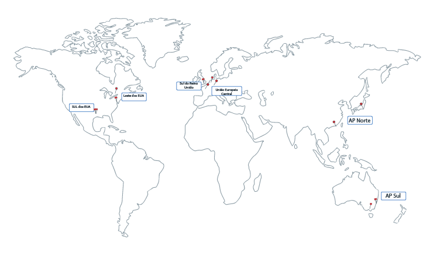

---

copyright:
  years: 2014, 2018
lastupdated: "2018-01-24"

---

{:new_window: target="_blank"}
{:shortdesc: .shortdesc}
{:screen: .screen}
{:pre: .pre}
{:table: .aria-labeledby="caption"}
{:codeblock: .codeblock}
{:tip: .tip}
{:download: .download}

# Regiões e locais
{{site.data.keyword.Bluemix}} é hospedado no mundo todo. Uma região é uma área geográfica que é acessada por um terminal. Os locais são data centers na região. Os serviços no {{site.data.keyword.Bluemix_notm}} podem ficar disponíveis globalmente ou dentro de uma região específica.
{:shortdesc}

Regiões do [{{site.data.keyword.Bluemix_notm}} ](#bluemix_regions) diferem de regiões do [{{site.data.keyword.containershort_notm}} ](#container_regions).



Figura 1. Regiões e data centers do {{site.data.keyword.containershort_notm}}

Regiões do {{site.data.keyword.containershort_notm}} suportadas:
  * AP Norte
  * AP Sul
  * União Europeia Central
  * Sul do Reino Unido
  * Leste dos EUA
  * SUL dos EUA


## Terminais de API de região do {{site.data.keyword.Bluemix_notm}}
{: #bluemix_regions}

É possível organizar seus recursos em serviços do {{site.data.keyword.Bluemix_notm}} usando regiões do {{site.data.keyword.Bluemix_notm}}. Por exemplo, é possível criar um cluster do Kubernetes usando uma imagem do Docker privada que é armazenada em seu {{site.data.keyword.registryshort_notm}} da mesma região.
{:shortdesc}

Para verificar qual região do {{site.data.keyword.Bluemix_notm}} em que você está atualmente, execute `bx info` e revise o campo **Região**.

As regiões do {{site.data.keyword.Bluemix_notm}} podem ser acessadas especificando o terminal de API ao efetuar login. Se não especificar uma região, você será conectado automaticamente à região mais próxima de você.

Terminais de API de região do {{site.data.keyword.Bluemix_notm}} com comandos de login de exemplo:

  * Sul dos EUA e Leste dos EUA
      ```
      bx login -a api.ng.bluemix.net
      ```
      {: pre}

  * Sydney e Norte AP
      ```
      bx login -a api.au-syd.bluemix.net
      ```
      {: pre}

  * Alemanha
      ```
      bx login -a api.eu-de.bluemix.net
      ```
      {: pre}

  * United Kingdom
      ```
      bx login -a api.eu-gb.bluemix.net
      ```
      {: pre}


<br />


## Terminais e locais de API de região do {{site.data.keyword.containershort_notm}}
{: #container_regions}

Usando regiões do {{site.data.keyword.containershort_notm}}, é possível criar ou acessar clusters do Kubernetes em uma região diferente da região do {{site.data.keyword.Bluemix_notm}} que você está com login efetuado. Os terminais de região do {{site.data.keyword.containershort_notm}} referem-se especificamente ao {{site.data.keyword.containershort_notm}}, não ao {{site.data.keyword.Bluemix_notm}} como um todo.
{:shortdesc}

É possível acessar o {{site.data.keyword.containershort_notm}} por meio de um terminal global: `https://containers.bluemix.net/`.
* Para verificar em qual região do {{site.data.keyword.containershort_notm}} você está atualmente, execute `bx cs region`.
* Para recuperar uma lista de regiões disponíveis e seus terminais, execute `bx cs regions`.

Para usar a API com o terminal global, em todas as suas solicitações, passe o nome da região em um cabeçalho `X-Region`.
{: tip}

### Efetuando login em uma região de serviço de contêiner diferente
{: #container_login_endpoints}

Talvez queira efetuar login em outra região do {{site.data.keyword.containershort_notm}} pelas razões a seguir:
  * Você criou serviços do {{site.data.keyword.Bluemix_notm}} ou imagens privadas do Docker em uma região e deseja utilizá-los com o {{site.data.keyword.containershort_notm}} em outra região.
  * Você deseja acessar um cluster em uma região diferente da região padrão do {{site.data.keyword.Bluemix_notm}} a que está conectado.

</br>

Para alternar rapidamente regiões, execute `bx cs region-set`.

### Locais disponíveis para o serviço de contêiner
{: #locations}

Os locais são data centers que estão disponíveis em uma região.

  | Região | Localização | Cidade |
  |--------|----------|------|
  | AP Norte | hkg02, seo01, sng01, tok02 | Hong Kong, Seul, Singapura, Tóquio |
  | AP Sul     | mel01, syd01, syd04        | Melbourne, Sydney |
  | União Europeia Central     | ams03, fra02, mil01, par01        | Amsterdam, Frankfurt, Milan, Paris |
  | Sul do Reino Unido      | lon02, lon04         | Londres |
  | Leste dos EUA      | mon01, tor01, wdc06, wdc07        | Montreal, Toronto, Washington DC |
  | SUL dos EUA     | dal10, dal12, dal13, sao01       | Dallas, São Paulo |

**Nota**: Milão (mil01) está disponível somente para clusters grátis.

### Usando comandos da API do serviço de contêiner
{: #container_api}

Para interagir com a API do {{site.data.keyword.containershort_notm}}, insira o tipo de comando e anexe `/v1/command` no terminal global.

Exemplo da API `GET /clusters`:
  ```
  GET https://containers.bluemix.net/v1/clusters
  ```
  {: codeblock}

</br>

Para usar a API com o terminal global, em todas as suas solicitações, passe o nome da região em um cabeçalho `X-Region`. Para listar as regiões disponíveis, execute `bx cs regions`.
{: tip}

Para visualizar a documentação nos comandos da API, visualize [https://containers.bluemix.net/swagger-api/](https://containers.bluemix.net/swagger-api/).
