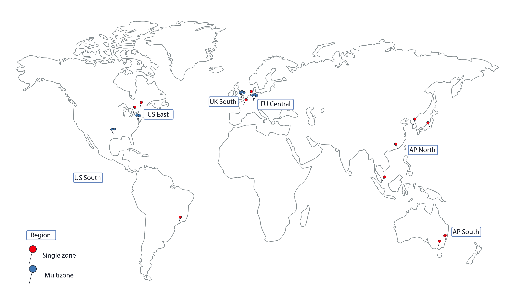

---

copyright:
  years: 2014, 2018
lastupdated: "2018-10-10"

---

{:new_window: target="_blank"}
{:shortdesc: .shortdesc}
{:screen: .screen}
{:pre: .pre}
{:table: .aria-labeledby="caption"}
{:codeblock: .codeblock}
{:tip: .tip}
{:download: .download}

# Regiões e Zonas

Uma região é uma localização geográfica específica na qual é possível implementar apps, serviços e outros recursos do {{site.data.keyword.Bluemix}}. [ {{site.data.keyword.Bluemix_notm}}  regiões ](#bluemix_regions)  diferem de  [ {{site.data.keyword.containerlong}}  regiões ](#container_regions). As regiões consistem em uma ou mais zonas, que são data centers físicos que hospedam os recursos de cálculo, rede e armazenamento e o resfriamento e energia relacionados que hospedam serviços e aplicativos. As zonas são isoladas umas das outras, o que assegura nenhum ponto único de falha compartilhado.
{:shortdesc}

{{site.data.keyword.Bluemix_notm}} é hospedado no mundo todo. Os serviços no {{site.data.keyword.Bluemix_notm}} podem ficar disponíveis globalmente ou dentro de uma região específica. Ao criar um cluster do Kubernetes no {{site.data.keyword.containerlong_notm}}, seus recursos permanecem na região na qual você implementa o cluster.

**Nota**: é possível criar clusters padrão em cada região suportada do {{site.data.keyword.containerlong_notm}}. Os clusters grátis estão disponíveis somente em regiões selecionadas.



_Regiões e zonas do {{site.data.keyword.containerlong_notm}}_

Suportado {{site.data.keyword.containerlong_notm}} regiões são os seguintes:
* AP Norte (somente clusters padrão)
* AP Sul
* União Europeia Central
* Sul do Reino Unido
* Leste dos EUA (somente clusters padrão)
* SUL dos EUA

<br />


## Regiões no  {{site.data.keyword.Bluemix_notm}}
{: #bluemix_regions}

É possível organizar seus recursos em serviços do {{site.data.keyword.Bluemix_notm}} usando regiões do {{site.data.keyword.Bluemix_notm}}. Por exemplo, é possível criar um cluster do Kubernetes usando uma imagem do Docker privada que é armazenada em seu {{site.data.keyword.registryshort_notm}} da mesma região.
{:shortdesc}

Para verificar em qual região do {{site.data.keyword.Bluemix_notm}} você está atualmente, execute `ibmcloud info` e revise o campo **Região**.

As regiões do {{site.data.keyword.Bluemix_notm}} podem ser acessadas especificando o terminal de API ao efetuar login. Se não especificar uma região, você será conectado automaticamente à região mais próxima de você.

Por exemplo, é possível usar os comandos a seguir para efetuar login nos terminais de API da região do {{site.data.keyword.Bluemix_notm}}:

  * SUL dos EUA
      ```
      ibmcloud login -a api.ng.bluemix.net
      ```
      {: pre}

  * Leste dos EUA
      ```
      ibmcloud login -a api.us-east.bluemix.net
      ```
      {: pre}

  * Sydney e Tóquio
      ```
      ibmcloud login -a api.au-syd.bluemix.net
      ```
      {: pre}

  * Alemanha
      ```
      ibmcloud login -a api.eu-de.bluemix.net
      ```
      {: pre}

  * United Kingdom
      ```
      ibmcloud login -a api.eu-gb.bluemix.net
      ```
      {: pre}

<br />


## Regiões no  {{site.data.keyword.containerlong_notm}}
{: #container_regions}

Usando regiões do {{site.data.keyword.containerlong_notm}}, é possível criar ou acessar clusters do Kubernetes em uma região diferente da região do {{site.data.keyword.Bluemix_notm}} que você está com login efetuado. Os terminais de região do {{site.data.keyword.containerlong_notm}} referem-se especificamente ao {{site.data.keyword.containerlong_notm}}, não ao {{site.data.keyword.Bluemix_notm}} como um todo.
{:shortdesc}

**Nota**: é possível criar clusters padrão em cada região suportada do {{site.data.keyword.containerlong_notm}}. Os clusters grátis estão disponíveis somente em regiões selecionadas.

Regiões do {{site.data.keyword.containerlong_notm}} suportadas:
  * AP Norte (somente clusters padrão)
  * AP Sul
  * União Europeia Central
  * Sul do Reino Unido
  * Leste dos EUA (somente clusters padrão)
  * SUL dos EUA

É possível acessar o {{site.data.keyword.containerlong_notm}} por meio de um terminal global: ` https://containers.bluemix.net/v1`.
* Para verificar em qual região do {{site.data.keyword.containerlong_notm}} você está atualmente, execute `ibmcloud ks region`.
* Para recuperar uma lista de regiões disponíveis e os seus terminais, execute `ibmcloud ks regions`.

Para usar a API com o terminal global em todas as suas solicitações, passe o nome da região no cabeçalho `X-Region`.
{: tip}

### Efetuando login em uma região  {{site.data.keyword.containerlong_notm}}  diferente
{: #container_login_endpoints}

É possível mudar regiões usando a CLI do {{site.data.keyword.containerlong_notm}}.
{:shortdesc}

Talvez queira efetuar login em outra região do {{site.data.keyword.containerlong_notm}} pelas razões a seguir:
  * Você criou serviços do {{site.data.keyword.Bluemix_notm}} ou imagens privadas do Docker em uma região e deseja utilizá-los com o {{site.data.keyword.containerlong_notm}} em outra região.
  * Você deseja acessar um cluster em uma região que é diferente da região padrão do {{site.data.keyword.Bluemix_notm}} à qual está conectado.

Para alternar regiões rapidamente, execute [`ibmcloud ks region-set`](cs_cli_reference.html#cs_region-set).

### Usando comandos da API {{site.data.keyword.containerlong_notm}}
{: #containers_api}

Para interagir com a API do {{site.data.keyword.containerlong_notm}}, insira o tipo de comando e anexe `/v1/command` no terminal global.
{:shortdesc}

Exemplo da API `GET /clusters`:
  ```
  GET https://containers.bluemix.net/v1/clusters
  ```
  {: codeblock}

</br>

Para usar a API com o terminal global em todas as suas solicitações, passe o nome da região no cabeçalho `X-Region`. Para listar as regiões disponíveis, execute `ibmcloud ks regions`.
{: tip}

Para visualizar a documentação nos comandos da API, visualize [https://containers.bluemix.net/swagger-api/](https://containers.bluemix.net/swagger-api/).

## Zonas no  {{site.data.keyword.containerlong_notm}}
{: #zones}

Zonas são data centers físicos que estão disponíveis em uma região do {{site.data.keyword.Bluemix_notm}}. Regiões são uma ferramenta conceitual para organizar zonas e podem incluir zonas (data centers) em diferentes países. A tabela a seguir exibe as zonas disponíveis por região.
{:shortdesc}

* **Cidade metropolitana de múltiplas zonas**: os nós do trabalhador em clusters que são criados em uma cidade metropolitana de múltiplas zonas podem ser difundidos entre as zonas.
* **Cidade de zona única**: os nós do trabalhador em clusters que são criados em uma cidade de zona única permanecem dentro de uma zona. Não é possível difundir nós do trabalhador em múltiplas zonas.

<table summary="A tabela mostra as zonas disponíveis por regiões. As linhas devem ser lidas da esquerda para a direita, com a região na coluna um, as cidades metropolitanas de múltiplas zonas na coluna dois e as cidades de zona única na coluna três.">
<caption>Disponível e multisona disponível por região.</caption>
  <thead>
  <th>Região</th>
  <th>Cidade metropolitana de múltiplas zonas</th>
  <th>Zona única da zona</th>
  </thead>
  <tbody>
    <tr>
      <td>AP Norte</td>
      <td>Tóquio: tok02, tok04, tok05</td>
      <td><p>Hong Kong S.A.R. of the PRC: hkg02</p>
      <p>Seul: seo01</p>
      <p>Singapura: sng01</p></td>
    </tr>
    <tr>
      <td>AP Sul</td>
      <td>Nenhuma</td>
      <td><p>Sydney: syd01, syd04</p>
      <p>Melbourne: mel01</p></td>
    </tr>
    <tr>
      <td>União Europeia Central</td>
      <td>Frankfurt: fra02, fra04, fra05</td>
      <td><p>Amsterdã: ams03</p>
      <p>Milão: mil01</p>
      <p>Oslo: osl01</p>
      <p>Paris: par01</p>
      </td>
    </tr>
    <tr>
      <td>Sul do Reino Unido</td>
      <td>Londres: lon02, lon04, lon06</td>
      <td></td>
    </tr>
    <tr>
      <td>Leste dos EUA</td>
      <td>Washington DC: wdc04, wdc06, wdc07</td>
      <td><p>Montreal: mon01</p>
      <p>Toronto: tor01</p></td>
    </tr>
    <tr>
      <td>SUL dos EUA</td>
      <td>Dallas: dal10, dal12, dal13</td>
      <td><p>San Jose: sjc03, sjc04</p>
      <p>São Paulo: sao01</p></td>
    </tr>
  </tbody>
</table>

### Clusters de zona única
{: #single_zone}

Em um cluster de zona única, os recursos de seu cluster permanecem na zona na qual o cluster é implementado. A imagem a seguir destaca o relacionamento de componentes de cluster de zona única em uma região de exemplo do Leste dos EUA:


_Entendendo em que local estão os seus recursos de cluster de zona única._

1.  Os recursos de seu cluster, incluindo os nós principal e do trabalhador, estão na mesma zona na qual você implementou o cluster. Quando você inicia ações de orquestração de contêiner local, como comandos `kubectl`, as informações são trocadas entre os nós principal e do trabalhador dentro da mesma zona.

2.  Se você configurar outros recursos de cluster, como armazenamento, rede, cálculo ou apps em execução em pods, os recursos e seus dados permanecerão na zona na qual você implementou o cluster.

3.  Ao iniciar as ações de gerenciamento de cluster, como usar comandos `ibmcloud ks`, as informações básicas sobre o cluster (como nome, ID, usuário, o comando) serão roteadas por meio de um terminal regional.

### Clusters de múltiplas zonas
{: #multizone}

Em um cluster de múltiplas zonas, o nó principal é implementado em uma zona com capacidade de múltiplas zonas e os recursos de seu cluster são difundidos entre múltiplas zonas.

1.  Os nós do trabalhador são difundidos em múltiplas zonas em uma região para fornecer mais disponibilidade para seu cluster. O mestre permanece na mesma zona com capacidade de múltiplas zonas na qual você implementou o cluster. Quando você inicia as ações de orquestração de contêiner local, como comandos `kubectl`, as informações são trocadas entre os nós principal e do trabalhador por meio de um terminal regional.

2.  Outros recursos de cluster, como armazenamento, rede, cálculo ou apps em execução em pods, variam em como são implementados nas zonas em seu cluster de múltiplas zonas. Para obter mais informações, revise estes tópicos:
    * Configurando o [armazenamento de arquivo](cs_storage_file.html#add_file) e o [armazenamento de bloco](cs_storage_block.html#add_block) em clusters de múltiplas zonas
    * [ Ativando o acesso público ou privado a um app usando um serviço LoadBalancer em um cluster de múltiplas zonas](cs_loadbalancer.html#multi_zone_config)
    * [ Gerenciando o tráfego de rede usando o Ingresso ](cs_ingress.html#planning)
    * [Aumentando a disponibilidade de seu app](cs_app.html#increase_availability)

3.  Ao iniciar as ações de gerenciamento de cluster, como usar comandos [`ibmcloud ks`](cs_cli_reference.html#cs_cli_reference), as informações básicas sobre o cluster (como nome, ID, usuário, o comando) serão roteadas por meio de um terminal regional.
