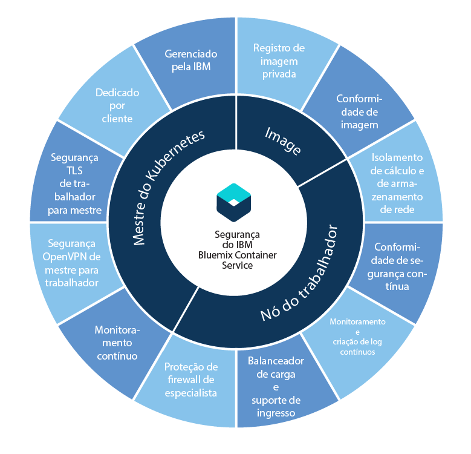

---

copyright:
  years: 2014, 2018
lastupdated: "2018-01-11"

---

{:new_window: target="_blank"}
{:shortdesc: .shortdesc}
{:screen: .screen}
{:pre: .pre}
{:table: .aria-labeledby="caption"}
{:codeblock: .codeblock}
{:tip: .tip}
{:download: .download}

# Segurança para o {{site.data.keyword.containerlong_notm}}
{: #security}

É possível usar recursos de segurança integrados para análise de risco e proteção de segurança. Esses recursos ajudam você a proteger a sua infraestrutura de cluster e a comunicação de rede, a isolar os seus recursos de cálculo e a assegurar a conformidade de segurança em seus componentes de infraestrutura e implementações de contêiner.
{: shortdesc}

## Segurança por componente de cluster
{: #cluster}

Cada cluster do {{site.data.keyword.containerlong_notm}} tem recursos de segurança que são construídos em seus nós [principal](#master) e [trabalhador](#worker). Se você tiver um firewall, será necessário acessar o balanceamento de carga de fora do cluster ou desejar executar os comandos `kubectl` de seu sistema local quando as políticas de rede corporativa impedirem o acesso aos terminais de Internet pública, [abra portas em seu firewall](cs_firewall.html#firewall). Se você deseja conectar os apps em seu cluster a uma rede no local ou a outros apps externos para seu cluster, [configure a conectividade da VPN](cs_vpn.html#vpn).
{: shortdesc}

No diagrama a seguir, é possível ver recursos de segurança que são agrupados por mestre do Kubernetes, nós do trabalhador e imagens de contêiner.

  <table summary="A primeira linha na tabela abrange ambas as colunas. As linhas restantes devem ser lidas da esquerda para a direita, com o local do servidor na coluna um e endereços IP para corresponder na coluna dois.">
  <thead>
  <th colspan=2> Configurações de segurança de cluster integrado no {{site.data.keyword.containershort_notm}}</th>
  </thead>
  <tbody>
    <tr>
      <td>Mestre do Kubernetes</td>
      <td>O mestre do Kubernetes em cada cluster é gerenciado pela IBM e é altamente disponível. Ele inclui configurações de segurança do {{site.data.keyword.containershort_notm}} que asseguram conformidade de segurança e comunicação segura para e dos nós do trabalhador. As atualizações são executadas pela IBM conforme necessário. O mestre do Kubernetes dedicado controla e monitora centralmente todos os recursos do Kubernetes no cluster. Com base nos requisitos de implementação e na capacidade no cluster, o mestre do Kubernetes planeja automaticamente os seus apps conteinerizados para implementar ao longo de nós do trabalhador disponíveis. Para obter mais informações, veja [Segurança do
mestre do Kubernetes](#master).</td>
    </tr>
    <tr>
      <td>Nó do trabalhador</td>
      <td>Os contêineres são implementados em nós do trabalhador que são dedicados a um cluster e que asseguram o isolamento de cálculo, de rede e de armazenamento para os clientes IBM. O {{site.data.keyword.containershort_notm}} fornece recursos de segurança integrados para manter os nós do trabalhador seguros nas redes privada e pública e para assegurar a conformidade de segurança do nó do trabalhador. Para obter mais informações, veja [Segurança do nó do trabalhador](#worker). Além disso, é possível incluir [políticas de rede Calico](cs_network_policy.html#network_policies) para especificar melhor o tráfego de rede que você deseja permitir ou bloquear para/de um pod em um nó do trabalhador. </td>
     </tr>
     <tr>
      <td>Imagens</td>
      <td>Como administrador de cluster, é possível configurar o seu próprio repositório de imagem do Docker seguro no {{site.data.keyword.registryshort_notm}} no qual é possível armazenar e compartilhar imagens do Docker entre os seus usuários de cluster. Para assegurar implementações seguras de contêiner, cada imagem em seu registro privado é varrida pelo Vulnerability Advisor. O Vulnerability Advisor é um componente do {{site.data.keyword.registryshort_notm}} que varre para obter potenciais vulnerabilidades, faz recomendações de segurança e fornece instruções para resolver vulnerabilidades. Para obter mais informações, veja [Segurança da imagem no {{site.data.keyword.containershort_notm}}](#images).</td>
    </tr>
  </tbody>
</table>

 

## Mestre do Kubernetes
{: #master}

Revise os recursos de segurança integrados do mestre do Kubernetes para proteger o mestre do Kubernetes e para assegurar a comunicação de rede de cluster.
{: shortdesc}

<dl>
  <dt>Mestre do Kubernetes totalmente gerenciado e dedicado</dt>
    <dd>Cada cluster do Kubernetes no {{site.data.keyword.containershort_notm}} é controlado por um mestre do Kubernetes dedicado que é gerenciado pela IBM em uma conta de infraestrutura do IBM Cloud (SoftLayer) pertencente à IBM. O mestre do Kubernetes é configurado com os componentes dedicados a seguir que não são compartilhados com outros clientes IBM.
    <ul><li>Armazenamento de dados etcd: armazena todos os recursos do Kubernetes de um cluster, como Serviços, Implementações e Pods. Os ConfigMaps e Segredos do Kubernetes são dados do app armazenados como pares de valores de chave para que eles possam ser usados por um app que é executado em um pod. Os dados no etcd são armazenados em um disco criptografado
gerenciado pela IBM e são criptografados por TLS quando enviados a um pod para assegurar a proteção e integridade
de dados.</li>
    <li>kube-apiserver: serve como o ponto de entrada principal para todas as solicitações do nó do trabalhador para o mestre do Kubernetes. O kube-apiserver valida e processa solicitações e pode ler e gravar
no armazenamento de dados etcd.</li>
    <li>kube-scheduler: decida onde implementar pods, levando em consideração a capacidade da conta e as necessidades
de desempenho, as restrições de política de hardware e software, as especificações de antiafinidade e os requisitos
de carga de trabalho. Se não puder ser localizado nenhum nó do trabalhador que corresponda aos requisitos, o pod não será implementado
no cluster.</li>
    <li>kube-controller-manager: responsável por monitorar os conjuntos de réplicas e criar pods correspondentes
para atingir o estado desejado.</li>
    <li>OpenVPN: o componente específico do {{site.data.keyword.containershort_notm}} para fornecer conectividade de rede segura para toda comunicação do mestre do Kubernetes com o nó do trabalhador.</li></ul></dd>
  <dt>Conectividade de rede assegurada TLS para toda comunicação do nó do trabalhador com o mestre do Kubernetes</dt>
    <dd>Para assegurar a comunicação de rede com o mestre do Kubernetes, o {{site.data.keyword.containershort_notm}} gera certificados TLS que criptografam a comunicação para e a partir dos componentes kube-apiserver e armazenamento de dados etcd para cada cluster. Esses certificados nunca são compartilhados entre clusters ou entre os componentes do mestre do Kubernetes.</dd>
  <dt>Conectividade de rede segura OpenVPN para toda comunicação do mestre do Kubernetes com o nó do trabalhador</dt>
    <dd>Embora o Kubernetes assegure a comunicação entre o mestre do Kubernetes e os nós do trabalhador usando o protocolo `https`, nenhuma autenticação é fornecida no nó do trabalhador por padrão. Para assegurar essa comunicação, o {{site.data.keyword.containershort_notm}} configura automaticamente uma conexão OpenVPN entre o mestre do Kubernetes e o nó do trabalhador quando o cluster é criado.</dd>
  <dt>Monitoramento contínuo de rede do mestre do Kubernetes</dt>
    <dd>Cada mestre do Kubernetes é monitorado continuamente pela IBM para controlar e corrigir os ataques de Negação de Serviço (DOS) de nível de processo.</dd>
  <dt>Conformidade de segurança do nó do mestre do Kubernetes</dt>
    <dd>O {{site.data.keyword.containershort_notm}} varre automaticamente cada nó em que o mestre do Kubernetes é implementado em busca de vulnerabilidades localizadas em correções de segurança do Kubernetes e específicas do S.O. que precisam ser aplicadas para assegurar proteção do nó principal. Se vulnerabilidades forem localizadas, o {{site.data.keyword.containershort_notm}} aplicará automaticamente as correções e resolverá as vulnerabilidades em nome do usuário.</dd>
</dl>

 

## Nós do trabalhador
{: #worker}

Revise os recursos integrados de segurança do nó do trabalhador para proteger o ambiente do nó do trabalhador e assegurar o isolamento de recurso, rede e armazenamento.
{: shortdesc}

<dl>
  <dt>Isolamento de infraestrutura de cálculo, rede e armazenamento</dt>
    <dd>Ao criar um cluster, as máquinas virtuais são provisionadas como nós do trabalhador na conta de infraestrutura do IBM Cloud (SoftLayer) do cliente ou na conta de infraestrutura dedicada do IBM Cloud (SoftLayer) pela IBM. Os nós do trabalhador são dedicados a um cluster e não hospedam cargas de outros clusters.
 Cada conta do {{site.data.keyword.Bluemix_notm}} é configurada com VLANs de infraestrutura do IBM Cloud (SoftLayer) para assegurar o desempenho e o isolamento da rede de qualidade nos nós do trabalhador.
 
Para persistir dados em seu cluster, é possível provisionar armazenamento de arquivo baseado em NFS dedicado da infraestrutura do IBM Cloud (SoftLayer) e alavancar os recursos de segurança de dados integrados dessa plataforma.
</dd>
  <dt>Configuração de nó do trabalhador seguro</dt>
    <dd>Cada nó do trabalhador é configurado com um sistema operacional Ubuntu que não pode ser mudado pelo usuário. Para proteger o sistema operacional dos nós do trabalhador de potenciais ataques, cada nó do trabalhador é definido com configurações de firewall de especialista que são impingidas por regras iptable do Linux.
 Todos os contêineres que são executados no Kubernetes são protegidos pelas configurações de política de rede Calico que são configuradas em cada nó do trabalhador durante a criação de cluster. Essa configuração assegura a comunicação de rede segura entre os nós do trabalhador e os pods. Para restringir ainda mais as ações que um contêiner pode executar no nó do trabalhador, os usuários podem escolher configurar [políticas de AppArmor ](https://kubernetes.io/docs/tutorials/clusters/apparmor/) nos nós do trabalhador.

 Acesso SSH é desativado no nó do trabalhador. Se desejar instalar recursos adicionais no nó do trabalhador, será possível usar [conjuntos de daemons do Kubernetes ](https://kubernetes.io/docs/concepts/workloads/controllers/daemonset) para tudo o que você desejar executar em cada nó do trabalhador ou [tarefas do Kubernetes ](https://kubernetes.io/docs/concepts/workloads/controllers/jobs-run-to-completion/) para qualquer ação única que precisar ser executada.
</dd>
  <dt>Conformidade de segurança do nó do trabalhador do Kubernetes</dt>
    <dd>A IBM trabalha com as equipes consultivas de segurança interna e externa para resolver vulnerabilidades de conformidade de segurança em potencial. A IBM mantém o acesso aos nós do trabalhador para implementar atualizações e correções de segurança para o sistema operacional.
 <b>Importante</b>: reinicialize os nós do trabalhador regularmente para assegurar a instalação das atualizações e correções de segurança que são implementadas automaticamente no sistema operacional. A IBM não reinicializa seus nós do trabalhador.
</dd>
  <dt id="encrypted_disks">Disco criptografado</dt>
  <dd>Por padrão, o {{site.data.keyword.containershort_notm}} fornece duas partições de dados criptografados de SSD local para todos os nós do trabalhador quando os nós do trabalhador são provisionados. A primeira partição não é criptografada e a segunda partição montada em _/var/lib/docker_ é desbloqueada usando chaves de criptografia LUKS. Cada trabalhador em cada cluster do Kubernetes tem sua própria chave de criptografia LUKS exclusiva, gerenciada pelo {{site.data.keyword.containershort_notm}}. Ao criar um cluster ou incluir um nó do trabalhador em um cluster existente, as chaves são obtidas de forma segura e, depois, descartadas após o disco criptografado ser desbloqueado.
  
<b>Observação</b>: a criptografia pode impactar o desempenho de E/S do disco. Para cargas de trabalho que requerem E/S de disco de alto desempenho, teste um cluster com criptografia ativada e desativada para ajudá-lo a decidir se deseja desativar a criptografia.

  </dd>
  <dt>Suporte para firewalls de rede da infraestrutura do IBM Cloud (SoftLayer)</dt>
    <dd>O {{site.data.keyword.containershort_notm}} é compatível com todas as [ofertas de firewall do IBM Cloud (SoftLayer) ](https://www.ibm.com/cloud-computing/bluemix/network-security). No {{site.data.keyword.Bluemix_notm}} Public, é possível configurar um firewall com políticas de rede customizadas para fornecer segurança de rede dedicada para seu cluster e para detectar e corrigir intrusão de rede. Por exemplo, é possível optar por configurar um [Vyatta ](https://knowledgelayer.softlayer.com/topic/vyatta-1) para agir como seu firewall e bloquear tráfego indesejado. Ao configurar um firewall, [deve-se também abrir as portas e os endereços IP necessários](cs_firewall.html#firewall) para cada região para que o mestre e os nós do trabalhador possam se comunicar.</dd>
  <dt>Manter os serviços privados ou expor os serviços e apps seletivamente para a Internet pública</dt>
    <dd>É possível escolher manter seus serviços e apps privados e alavancar os recursos de segurança integrados descritos neste tópico para assegurar uma comunicação segura entre os nós do trabalhador e os pods. Para expor os serviços e apps para a Internet pública, é possível alavancar o suporte do Ingresso e do balanceador de carga para tornar os seus serviços publicamente disponíveis com segurança.</dd>
  <dt>Conecte com segurança seus nós do trabalhador e apps a um data center local</dt>
  <dd>Para conectar seus nós do trabalhador e apps a um data center no local, é possível configurar um terminal de VPN IPSec com um serviço Strongswan ou com um dispositivo de gateway Vyatta ou um dispositivo Fortigate. <ul><li><b>Serviço VPN do Strongswan IPSec</b>: é possível configurar um [Serviço VPN do Strongswan IPSec ](https://www.strongswan.org/) que conecta de forma segura seu cluster do Kubernetes a uma rede no local. O serviço VPN do Strongswan IPSec fornece um canal de comunicação seguro de ponta a ponta na Internet, que é baseado no conjunto de protocolo padrão de mercado Internet Protocol Security (IPsec). Para configurar uma conexão segura entre seu cluster e uma rede no local, deve-se ter um gateway da VPN IPsec ou um servidor de infraestrutura do IBM Cloud (SoftLayer) instalado em seu datacenter no local. Então, é possível [configurar e implementar o serviço VPN do Strongswan IPSec](cs_vpn.html#vpn) em um pod do Kubernetes.</li><li><b>Dispositivo de gateway Vyatta ou dispositivo Fortigate</b>: se você tiver um cluster maior, será possível escolher configurar um Dispositivo de gateway Vyatta ou um Dispositivo Fortigate para configurar um terminal de VPN IPSec. Para obter mais informações, consulte esta postagem do blog em [Conectando um cluster a um data center local](https://www.ibm.com/blogs/bluemix/2017/07/kubernetes-and-bluemix-container-based-workloads-part4/).</li></ul></dd>
  <dt>Monitoramento contínuo e criação de log de atividade do cluster</dt>
    <dd>Para clusters padrão, todos os eventos relacionados ao cluster, como incluir um nó do trabalhador, atualizar continuamente o progresso ou as informações de uso de capacidade podem ser registrados e monitorados pelo {{site.data.keyword.containershort_notm}} e enviados para {{site.data.keyword.loganalysislong_notm}} e o {{site.data.keyword.monitoringlong_notm}}. Para obter informações sobre como configurara criação de log e o monitoramento, consulte [Configurando clusters de log](/docs/containers/cs_health.html#logging) e [Configurando o monitoramento de cluster](/docs/containers/cs_health.html#monitoring).</dd>
</dl>

 

## Imagens
{: #images}

Gerencie a segurança e integridade de suas imagens com recursos de segurança integrada.
{: shortdesc}

<dl>
<dt>Repositório seguro de imagem privada do Docker no {{site.data.keyword.registryshort_notm}}</dt>
<dd>É possível configurar o seu próprio repositório de imagem do Docker em um registro de imagem privada de múltiplos locatários, altamente disponível e escalável que é hospedado pela IBM para construir, armazenar com segurança e compartilhar imagens do Docker entre usuários de cluster.</dd>

<dt>Conformidade de segurança de imagem</dt>
<dd>Quando você usar o {{site.data.keyword.registryshort_notm}}, será possível alavancar a varredura de segurança integrada que é fornecida pelo Vulnerability Advisor. Cada imagem enviada por push para o seu namespace é varrida automaticamente para obter vulnerabilidades com relação a um banco de dados de problemas conhecidos do CentOS, Debian, Red Hat e Ubuntu. Se vulnerabilidades forem localizadas, o Vulnerability Advisor fornecerá instruções de como resolvê-las para assegurar a integridade e segurança da imagem.</dd>
</dl>

Para visualizar a avaliação de vulnerabilidade para suas imagens, [revise a documentação do Vulnerability Advisor](/docs/services/va/va_index.html#va_registry_cli).

 

## Rede em cluster
{: #in_cluster_network}

A comunicação de rede segura em cluster entre os nós do trabalhador e os pods é realizada com redes locais virtuais privadas (VLANs). Uma VLAN configura um grupo de
nós do trabalhador e pods como se eles estivessem conectados à mesma ligação física.
{:shortdesc}

Ao criar um cluster, cada cluster é conectado automaticamente a uma VLAN privada. A VLAN privada
determina o endereço IP privado que é designado a um nó do trabalhador durante a criação de cluster.

|Tipo de cluster|Gerenciador da VLAN privada para o cluster|
|------------|-------------------------------------------|
|Clusters Lite em {{site.data.keyword.Bluemix_notm}}|{{site.data.keyword.IBM_notm}}|
|Clusters padrão no {{site.data.keyword.Bluemix_notm}}|Você em sua conta de infraestrutura do IBM Cloud (SoftLayer) 
**Dica:** para ter acesso a todas as VLANs em sua conta, ative a [Ampliação de VLAN ](https://knowledgelayer.softlayer.com/procedure/enable-or-disable-vlan-spanning).
|

Todos os pods implementados em um nó do trabalhador também são designados a um endereço IP privado. Os pods são
designados a um IP na variação de endereços privados 172.30.0.0/16 e são roteados somente entre os nós do trabalhador. Para evitar conflitos, não use esse intervalo de IPs em nós que se comunicarão com seus nós do
trabalhador. Os nós do trabalhador e os pods podem se comunicar com segurança na rede privada usando os endereços IP
privados. No entanto, quando um pod trava ou um nó do trabalhador precisa ser recriado, um novo endereço IP privado
é designado.

Visto que é difícil rastrear a mudança de endereços IP privados para apps que devem ser altamente disponíveis, é possível usar os recursos integrados de descoberta de serviço do Kubernetes e expor os apps como serviços IP do cluster na rede privada no cluster. Um serviço do Kubernetes agrupa um conjunto
de pods e fornece conexão de rede a esses pods para outros serviços no cluster sem
expor o endereço IP privado real de cada pod. Ao criar um serviço IP do cluster, um endereço IP privado é designado a esse serviço do intervalo de endereços privados 10.10.10.0/24. Como ocorre com a variação de endereços
privados do pod, não use esse intervalo de IP em nós que se comunicarão com seus nós do trabalhador. Esse endereço IP é acessível somente dentro do cluster. Não
é possível acessar esse endereço IP na Internet. Ao mesmo tempo, uma entrada de consulta de DNS é criada para
o serviço e armazenada no componente kube-dns do cluster. A entrada DNS contém o nome do
serviço, o namespace no qual o serviço foi criado e o link para o endereço IP do cluster privado
designado.

Se um app no cluster precisar acessar um pod que esteja atrás de um serviço IP do cluster, ele poderá usar o endereço IP do cluster privado que foi designado ao serviço ou enviar uma solicitação usando o nome do serviço. Ao usar o nome do serviço, o nome é consultado no
componente kube-dns e roteado para o endereço IP do cluster privado do serviço. Quando uma solicitação
atinge o serviço, o serviço assegura que todas as solicitações sejam igualmente encaminhadas para os pods,
independentemente de seus endereços IP privados e o nó do trabalhador no qual eles estão implementados.

Para obter mais informações sobre como criar um serviço do tipo IP do cluster, veja [Serviços do Kubernetes ](https://kubernetes.io/docs/concepts/services-networking/service/#publishing-services---service-types).
