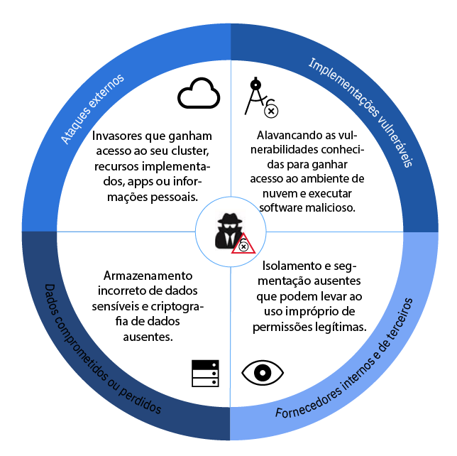
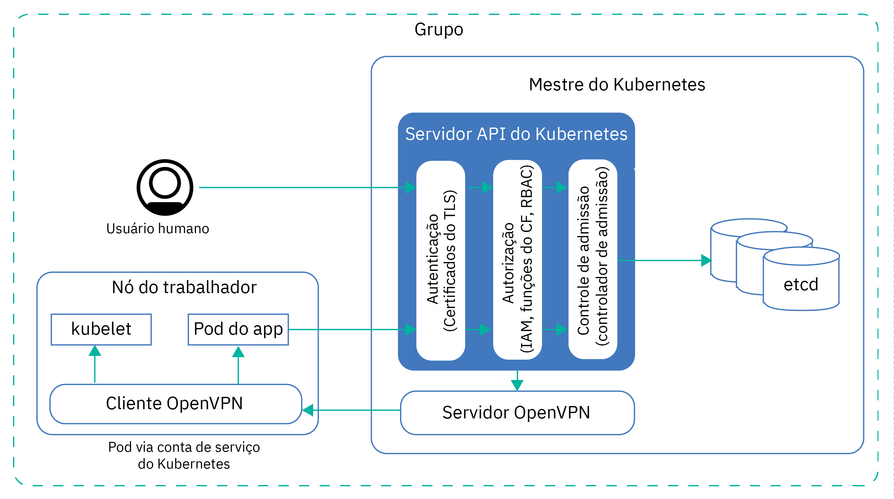
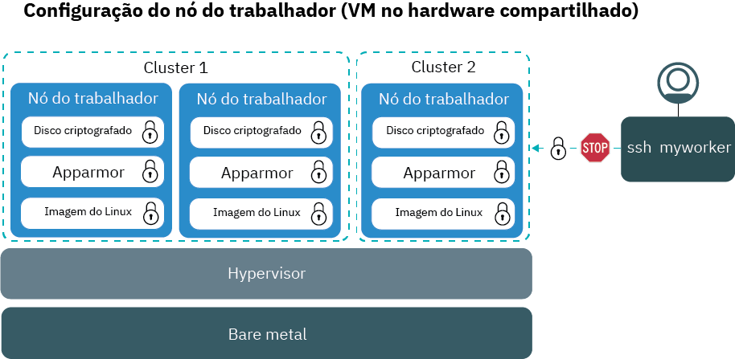
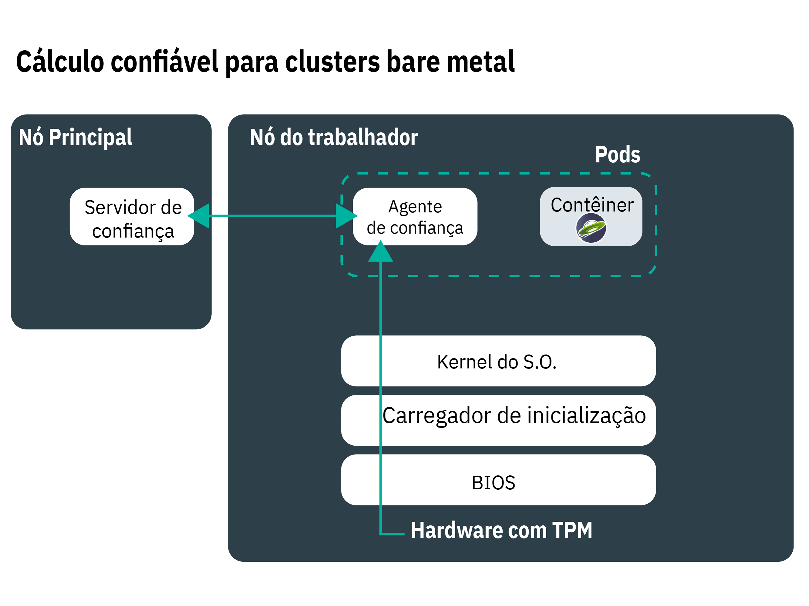
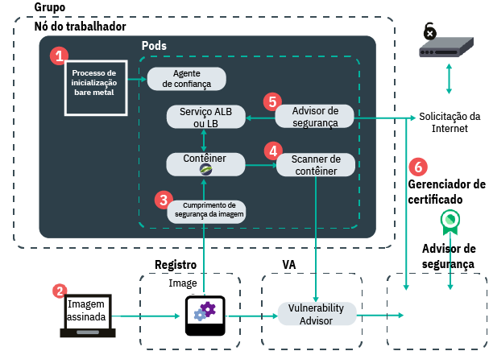
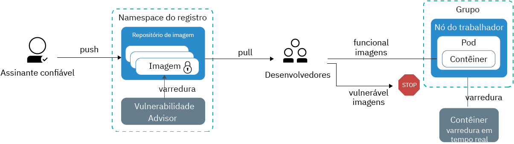
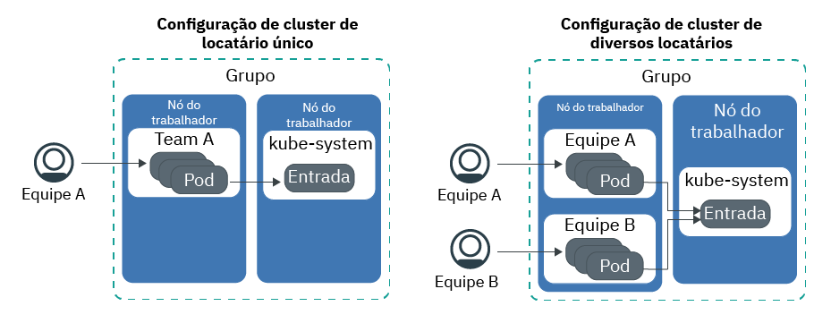

---

copyright:
  years: 2014, 2019
lastupdated: "2019-06-05"

keywords: kubernetes, iks

subcollection: containers

---

{:new_window: target="_blank"}
{:shortdesc: .shortdesc}
{:screen: .screen}
{:pre: .pre}
{:table: .aria-labeledby="caption"}
{:codeblock: .codeblock}
{:tip: .tip}
{:note: .note}
{:important: .important}
{:deprecated: .deprecated}
{:download: .download}
{:preview: .preview}

# Segurança para o {{site.data.keyword.containerlong_notm}}
{: #security}

É possível usar recursos de segurança integrada no {{site.data.keyword.containerlong}} para análise de risco e proteção de segurança. Esses recursos ajudam você a proteger sua infraestrutura de cluster do Kubernetes e a comunicação de rede, isolar seus recursos de cálculo e a assegurar a conformidade de segurança em seus componentes de infraestrutura e implementações de contêiner.
{: shortdesc}

## Visão geral de ameaças de segurança para seu cluster
{: #threats}

Para proteger seu cluster de ser comprometido, deve-se entender as potenciais ameaças de segurança para seu cluster e o que é possível fazer para reduzir a exposição a vulnerabilidades.
{: shortdesc}

A segurança de nuvem e a proteção de seus sistemas, infraestrutura e dados contra ataques se tornaram muito importantes nos últimos dois anos, pois as empresas continuam a mover suas cargas de trabalho para a nuvem pública. Um cluster consiste em vários componentes que cada um pode colocar seu ambiente em risco de ataques maliciosos. Para proteger seu cluster com relação a essas ameaças de segurança, deve-se assegurar que você aplique os recursos e as atualizações de segurança mais recentes do {{site.data.keyword.containerlong_notm}} e do Kubernetes em todos os componentes do cluster.

Estes componentes incluem:
- [Servidor de API do Kubernetes e armazenamento de dados etcd](#apiserver)
- [Nós do trabalhador](#workernodes)
- [Rede](#network)
- [Armazenamento persistente](#storage)
- [Monitoramento e criação de log](#monitoring_logging)
- [ Imagens e registro do contêiner ](#images_registry)
- [ Isolamento e segurança do contêiner ](#container)
- [ Informações pessoais ](#pi)

 

## Servidor de API do Kubernetes e etcd
{: #apiserver}

O servidor de API do Kubernetes e o etcd são os componentes mais vulneráveis que são executados em seu mestre do Kubernetes. Se um usuário ou sistema não autorizado obtém acesso ao seu servidor de API do Kubernetes, o usuário ou sistema pode mudar as configurações, manipular ou assumir o controle de seu cluster, o que coloca seu cluster em risco de ataques maliciosos.
{: shortdesc}

Para proteger seu servidor de API do Kubernetes e o armazenamento de dados etcd, deve-se proteger e limitar o acesso ao seu servidor de API do Kubernetes para os usuários e as contas de serviço do Kubernetes.

**Como o acesso ao meu servidor da API do Kubernetes é concedido?**  
Por padrão, o Kubernetes requer que cada solicitação passe por diversos estágios antes que o acesso ao servidor de API seja concedido:

<ol><li><strong>Autenticação: </strong>valida a identidade de uma conta de serviço ou de usuário registrado.</li><li><strong>Autorização: </strong>limita as permissões de usuários autenticados e contas de serviço para assegurar que eles possam acessar e operar somente os componentes do cluster que você deseja.</li><li><strong>Controle de admissão: </strong>valida ou muda as solicitações antes que elas sejam processadas pelo servidor de API do Kubernetes. Muitos recursos do Kubernetes requerem controladores de admissão para que funcionem corretamente.</li></ol>

**O que o {{site.data.keyword.containerlong_notm}} faz para proteger o servidor da API do Kubernetes e o armazenamento de dados etcd?**  
A imagem a seguir mostra as configurações de segurança de cluster padrão que tratam de autenticação, autorização, controle de admissão e conectividade segura entre os nós do mestre e do trabalhador do Kubernetes.

<table>
<caption>Servidor de API do Kubernetes e segurança etcd</caption>
  <thead>
  <th>Recurso de segurança</th>
  <th>Descrição</th>
  </thead>
  <tbody>
    <tr>
      <td>Mestre do Kubernetes totalmente gerenciado e dedicado</td>
      <td>
Cada cluster do Kubernetes no {{site.data.keyword.containerlong_notm}} é controlado por um mestre do Kubernetes dedicado que é gerenciado pela IBM em uma conta de infraestrutura do IBM Cloud (SoftLayer) pertencente à IBM. O mestre do Kubernetes é configurado com os componentes dedicados a seguir que não são compartilhados com outros clientes IBM.

        <ul><li><strong>Armazenamento de dados etcd:</strong> armazena todos os recursos do Kubernetes de um cluster, como `Services`, `Deployments` e `Pods`. O `ConfigMaps` e o `Secrets` do Kubernetes são dados do aplicativo armazenados como pares chave-valor para que eles possam ser usados por um app que é executado em um pod. Os dados em etcd são armazenados no disco local do principal do Kubernetes e são submetidos a backup no {{site.data.keyword.cos_full_notm}}. Os dados são criptografados durante o trânsito para o {{site.data.keyword.cos_full_notm}} e em repouso. É possível escolher ativar a criptografia para os seus dados etcd no disco local de seu mestre do Kubernetes [ativando a criptografia do {{site.data.keyword.keymanagementservicelong_notm}}](/docs/containers?topic=containers-encryption#encryption) para o seu cluster. Os dados etcd para clusters que executam uma versão anterior do Kubernetes são armazenados em um disco criptografado gerenciado pela IBM e submetidos a backup diariamente. Quando os dados etcd são enviados para um pod, eles são criptografados por meio de TLS para assegurar a proteção de dados e a integridade.</li>
          <li><strong>kube-apiserver:</strong> serve como o ponto de entrada principal para todas as solicitações de gerenciamento de cluster do nó do trabalhador para o mestre do Kubernetes. O kube-apiserver valida e processa solicitações e pode ler e gravar
no armazenamento de dados etcd.</li>
          <li><strong>kube-scheduler:</strong> decide onde implementar os pods, considerando as necessidades de capacidade e desempenho, as restrições de política de hardware e software, as especificações de antiafinidade e os requisitos de carga de trabalho. Se não puder ser localizado nenhum nó do trabalhador que corresponda aos requisitos, o pod não será implementado
no cluster.</li>
          <li><strong>kube-controller-manager:</strong> responsável pelo monitoramento de conjuntos de réplicas e a criação de pods correspondentes para atingir o estado especificado.</li>
          <li><strong>OpenVPN:</strong> o componente específico do {{site.data.keyword.containerlong_notm}} para fornecer conectividade de rede segura para toda comunicação do mestre do Kubernetes com o nó do trabalhador. A comunicação do mestre do Kubernetes com o nó do trabalhador é iniciada pelo usuário e inclui comandos <code>kubectl</code>, como <code>logs</code>, <code>attach</code>, <code>exec</code> e <code>top</code>.</li></ul></td>
    </tr>
    <tr>
    <td>Monitoramento contínuo por IBM Site Reliability Engineers (SREs)</td>
    <td>O mestre do Kubernetes, incluindo todos os componentes principais, cálculo, rede e recursos de armazenamento, é monitorado continuamente pelos IBM Site Reliability Engineers (SREs). Os SREs aplicam os padrões de segurança mais recentes, detectam e corrigem atividades maliciosas e trabalham para assegurar a confiabilidade e disponibilidade do {{site.data.keyword.containerlong_notm}}. </td>
    </tr>
    <tr>
      <td>Comunicação segura por meio de TLS</td>
      <td>Para usar o {{site.data.keyword.containerlong_notm}}, deve-se autenticar com o serviço usando suas credenciais. Quando você é autenticado, o {{site.data.keyword.containerlong_notm}} gera certificados TLS que criptografam a comunicação para e do servidor de API do Kubernetes e armazenamento de dados etcd para assegurar uma comunicação de ponta a ponta segura entre os nós do trabalhador e o mestre do Kubernetes. Esses certificados nunca são compartilhados entre clusters ou entre os componentes do mestre do Kubernetes. </td>
    </tr>
    <tr>
      <td>Conectividade OpenVPN para nós do trabalhador</td>
      <td>Embora o Kubernetes assegure a comunicação entre o mestre do Kubernetes e os nós do trabalhador usando o protocolo <code>https</code>, nenhuma autenticação é fornecida no nó do trabalhador por padrão. Para assegurar essa comunicação, o {{site.data.keyword.containerlong_notm}} configura automaticamente uma conexão OpenVPN entre o mestre do Kubernetes e o nó do trabalhador quando o cluster é criado.</td>
    </tr>
    <tr>
      <td>Controle de acesso de baixa granularidade</td>
      <td>Como o administrador de conta, é possível [conceder acesso a outros usuários para o {{site.data.keyword.containerlong_notm}}](/docs/containers?topic=containers-users#users) usando o {{site.data.keyword.Bluemix_notm}} Identity and Access Management (IAM). O {{site.data.keyword.Bluemix_notm}} IAM fornece autenticação segura com a plataforma {{site.data.keyword.Bluemix_notm}}, o {{site.data.keyword.containerlong_notm}} e todos os recursos em sua conta. A configuração de funções e permissões de usuário adequadas é a chave para limitar quem pode acessar seus recursos e para limitar os danos que um usuário pode fazer quando as permissões legítimas são usadas indevidamente.   É possível selecionar dentre as funções de usuário predefinidas a seguir que determinam o conjunto de ações que o usuário pode executar: <ul><li><strong>Funções de plataforma:</strong> determine as ações relacionadas ao cluster e nó do trabalhador que um usuário pode executar no {{site.data.keyword.containerlong_notm}}.</li><li><strong>Funções de infraestrutura:</strong> determine as permissões para pedir, atualizar ou remover recursos de infraestrutura, como nós do trabalhador, VLANs ou sub-redes.</li><li><strong>Funções RBAC do Kubernetes:</strong> determine os comandos `kubectl` que os usuários podem executar quando estão autorizados a acessar um cluster. As funções RBAC são configuradas automaticamente para o namespace padrão de um cluster. Para usar as mesmas funções RBAC em outros namespaces, é possível copiar funções RBAC do namespace padrão.  </li></ul>   Em vez de usar as funções de usuário predefinidas, é possível escolher [customizar permissões de infraestrutura](/docs/containers?topic=containers-users#infra_access) ou [configurar suas próprias funções RBAC](/docs/containers?topic=containers-users#rbac) para incluir um controle de acesso de granularidade mais baixa. </td>
    </tr>
    <tr>
      <td>Controladores de Admissão</td>
      <td>Os controladores de admissões são implementados para recursos específicos no Kubernetes e {{site.data.keyword.containerlong_notm}}. Com os controladores de admissão, é possível configurar políticas em seu cluster que determinam se uma ação específica no cluster é permitida ou não. Na política, é possível especificar condições quando um usuário não pode executar uma ação, mesmo que essa ação faça parte das permissões gerais que você designou ao usuário usando RBAC. Portanto, os controladores de admissão podem fornecer uma camada adicional de segurança para seu cluster antes que uma solicitação de API seja processada pelo servidor de API do Kubernetes.    Quando você cria um cluster, o {{site.data.keyword.containerlong_notm}} instala automaticamente os [controladores de admissão do Kubernetes a seguir ](https://kubernetes.io/docs/admin/admission-controllers/) no master do Kubernetes, que não pode ser mudado pelo usuário: <ul>
      <li>`DefaultTolerationSeconds`</li>
      <li>`Classe DefaultStorageClass`</li>
      <li>`GenericAdmissionWebhook`</li>
      <li>`Inicializadores` (Kubernetes 1.13 ou anterior)</li>
      <li>`LimitRanger`</li>
      <li>`MutatingAdmissionWebhook`</li>
      <li>`NamespaceLifecycle`</li>
      <li>`NodeRestriction` (Kubernetes 1.14 ou mais recente)</li>
      <li>`PersistentVolumeLabel`</li>
      <li>[`PodSecurityPolicy`](/docs/containers?topic=containers-psp#ibm_psp)</li>
      <li>[`Priority`](/docs/containers?topic=containers-pod_priority#pod_priority) (Kubernetes 1.11 ou mais recente)</li>
      <li>`ResourceQuota`</li>
      <li>`ServiceAccount`</li>
      <li>`StorageObjectInUseProtection`</li>
      <li>`TaintNodesByCondition` (Kubernetes 1.12 ou mais recente)</li>
      <li>`ValidatingAdmissionWebhook`</li></ul> 
      É possível [instalar seus próprios controladores de admissão no cluster ](https://kubernetes.io/docs/reference/access-authn-authz/extensible-admission-controllers/#admission-webhooks) ou escolher dentre os controladores de admissão opcionais que o {{site.data.keyword.containerlong_notm}} fornece: <ul><li><strong>[Executor de segurança de imagem de contêiner](/docs/services/Registry?topic=registry-security_enforce#security_enforce):</strong> use esse controlador de admissão para cumprir as políticas do Vulnerability Advisor em seu cluster para bloquear implementações de imagens vulneráveis.</li></ul> 
Se você instalou manualmente os controladores de admissão e não desejar usá-los mais, certifique-se de removê-los completamente. Se os controladores de admissão não forem completamente removidos, eles poderão bloquear todas as ações que você deseja executar no cluster.
</td>
    </tr>
  </tbody>
</table>

**O que mais posso fazer para proteger meu servidor de API do Kubernetes?** 

Se o seu cluster estiver conectado a uma VLAN privada e pública, o {{site.data.keyword.containerlong_notm}} configurará automaticamente uma conexão segura do OpenVPN entre os nós principal do cluster e do trabalhador por meio de um terminal em serviço público. Se o VRF estiver ativado em sua conta do {{site.data.keyword.Bluemix_notm}}, será possível permitir que o cluster mestre e os nós do trabalhador se comuniquem sobre uma rede privada por meio de um terminal em serviço privado.

Terminais de serviço determinam como os nós do trabalhador e os usuários do cluster podem acessar o cluster mestre.
* Terminal em serviço público apenas: uma conexão segura do OpenVPN entre o cluster mestre e os nós do trabalhador é estabelecida por meio da rede pública. O mestre é publicamente acessível aos seus usuários do cluster.
* Terminais em serviço público e privado: a comunicação é estabelecida pela rede privada por meio do terminal em serviço privado e pela rede pública por meio do terminal em serviço público. Ao rotear metade do tráfego do trabalhador para o principal pelo terminal público e metade pelo terminal privado, a comunicação entre eles é protegida contra possíveis indisponibilidades da rede pública ou da rede privada. O mestre será acessível privadamente por meio do terminal em serviço privado se os usuários de cluster autorizados estiverem em sua rede privada do {{site.data.keyword.Bluemix_notm}} ou conectados à rede privada por meio de uma conexão VPN. Caso contrário, o mestre será publicamente acessível aos usuários de cluster autorizados por meio do terminal em serviço público.
* Somente terminal em serviço privado: a comunicação entre o mestre e os nós do trabalhador é estabelecida por meio da rede privada. Seus usuários do cluster devem estar em sua rede privada do {{site.data.keyword.Bluemix_notm}} ou conectar-se à rede privada por meio de uma conexão VPN para acessar o principal.

Para obter mais informações sobre os terminais em serviço, consulte [Comunicação de trabalhador para principal e de usuário para principal](/docs/containers?topic=containers-plan_clusters#workeruser-master).

 

## Nó do trabalhador
{: #workernodes}

Os nós do trabalhador transportam as implementações e os serviços que compõem seu app. Ao hospedar cargas de trabalho na nuvem pública, você deseja assegurar que seu app esteja protegido contra o acesso, mudança ou monitoramento por um usuário ou software não autorizado.
{: shortdesc}

**Quem possui o nó do trabalhador e eu sou responsável por protegê-lo?**  
A propriedade de um nó do trabalhador depende do tipo de cluster que você cria. Os nós do trabalhador em clusters grátis são provisionados para a conta de infraestrutura do IBM Cloud (SoftLayer) que é de propriedade da IBM. É possível implementar apps no nó do trabalhador, mas não é possível mudar as configurações ou instalar software adicional no nó do trabalhador. Devido à capacidade limitada e aos recursos limitados do {{site.data.keyword.containerlong_notm}}, não execute cargas de trabalho de produção em clusters grátis. Considere usar clusters padrão para suas cargas de trabalho de produção.

Os nós do trabalhador nos clusters padrão são provisionados para a conta de infraestrutura do IBM Cloud (SoftLayer) que está associada à sua conta pública ou dedicada do {{site.data.keyword.Bluemix_notm}}. Os nós do trabalhador são dedicados à sua conta e você é responsável por solicitar atualizações oportunas aos nós do trabalhador para assegurar que o S.O. do nó do trabalhador e os componentes do {{site.data.keyword.containerlong_notm}} apliquem as atualizações e correções de segurança mais recentes.

Use o [comando](/docs/containers?topic=containers-cli-plugin-kubernetes-service-cli#cs_worker_update) `ibmcloud ks worker-update` regularmente (tal como mensalmente) para implementar atualizações e correções de segurança no sistema operacional e para atualizar a versão do Kubernetes. Quando as atualizações estiverem disponíveis, você será notificado ao visualizar informações sobre os nós principal e do trabalhador no console ou na CLI do {{site.data.keyword.Bluemix_notm}}, como com os comandos `ibmcloud ks clusters` ou `ibmcloud ks workers --cluster <cluster_name>`. As atualizações do nó do trabalhador são fornecidas pela IBM como uma imagem de nó do trabalhador integral que inclui as correções de segurança mais recentes. Para aplicar as atualizações, o nó do trabalhador deve ser reformulado e recarregado com a nova imagem. As chaves para o usuário raiz são giradas automaticamente quando o nó do trabalhador é recarregado.
{: important}

**Qual é a aparência da configuração do meu nó do trabalhador?** 
A imagem a seguir mostra os componentes que são configurados para cada nó do trabalhador para proteger seu nó do trabalhador de ataques maliciosos.

A imagem não inclui componentes que asseguram a comunicação segura de ponta a ponta para e por meio do nó do trabalhador. Consulte  [ segurança de rede ](#network)  para obter mais informações.
{: note}

<table>
<caption>Configuração de Segurança do Nó do Trabalhador</caption>
  <thead>
  <th>Recurso de segurança</th>
  <th>Descrição</th>
  </thead>
  <tbody>
    <tr><td>Imagem Linux compatível com o CIS</td><td>Cada nó do trabalhador é configurado com um sistema operacional Ubuntu que implementa as referências que são publicadas pelo Center of Internet Security (CIS). O sistema operacional Ubuntu não pode ser mudado pelo usuário ou pelo proprietário da máquina. Para revisar a versão atual do Ubuntu, execute <code>kubectl get nodes -o wide</code>. A IBM trabalha com as equipes consultivas de segurança interna e externa para resolver vulnerabilidades de conformidade de segurança em potencial. As atualizações e correções de segurança para o sistema operacional são disponibilizadas por meio do {{site.data.keyword.containerlong_notm}} e devem ser instaladas pelo usuário para manter o nó do trabalhador seguro.
O {{site.data.keyword.containerlong_notm}} usa um kernel do Ubuntu Linux para nós do trabalhador. É possível executar contêineres com base em qualquer distribuição do Linux no {{site.data.keyword.containerlong_notm}}. Verifique com seu fornecedor de imagem de contêiner se ele suporta a imagem de contêiner para ser executada em kernels do Ubuntu Linux.
</td></tr>
    <tr>
    <td>Monitoramento contínuo por Site Reliability Engineers (SREs) </td>
    <td>A imagem do Linux que está instalada em seus nós do trabalhador é monitorada continuamente pelos IBM Site Reliability Engineers (SREs) para detectar vulnerabilidades e problemas de conformidade de segurança. Para tratar das vulnerabilidades, os SREs criam correções de segurança e fix packs para seus nós do trabalhador. Certifique-se de aplicar essas correções quando elas estiverem disponíveis para garantir um ambiente seguro para seus nós do trabalhador e os apps que você executa em cima deles.</td>
    </tr>
    <tr>
  <td>Isolamento de cálculo</td>
  <td>Os nós do trabalhador são dedicados a um cluster e não hospedam cargas de outros clusters. Ao criar um cluster padrão, é possível escolher provisionar seus nós do trabalhador como [máquinas físicas (bare metal) ou como máquinas virtuais](/docs/containers?topic=containers-planning_worker_nodes#planning_worker_nodes) que são executadas em hardware físico compartilhado ou dedicado. O nó do trabalhador em um cluster grátis é provisionado automaticamente como um nó virtual compartilhado na conta de infraestrutura do IBM Cloud (SoftLayer) que é de propriedade da IBM.</td>
</tr>
<tr>
<td>Opção para implementar bare metal</td>
<td>Se escolhe provisionar seus nós do trabalhador em servidores físicos bare metal (em vez de instâncias do servidor virtual), você tem controle adicional sobre o host de cálculo, como a memória ou CPU. Essa configuração elimina o hypervisor da máquina virtual que aloca recursos físicos para máquinas virtuais executadas no host. Em vez disso, todos os recursos de uma máquina bare metal são dedicados exclusivamente ao trabalhador, portanto, você não precisará se preocupar com "vizinhos barulhentos" compartilhando recursos ou diminuindo o desempenho. Os servidores bare metal são dedicados a você, com todos os seus recursos disponíveis para uso de cluster.</td>
</tr>
<tr>
  <td id="trusted_compute">Opção para Computação Confiável</td>
    <td>Ao implementar seu cluster no bare metal que suporta Trusted Compute, é possível [ativar a confiança](/docs/containers?topic=containers-cli-plugin-kubernetes-service-cli#cs_cluster_feature_enable). O chip Trusted Platform Module (TPM) é ativado em cada nó do trabalhador bare metal no cluster que suporta Cálculo confiável (incluindo nós futuros que você incluir no cluster). Portanto, depois de ativar a confiança, não será possível desativá-la posteriormente para o cluster. Um servidor de confiança é implementado no nó principal e um agente de confiança é implementado como um pod no nó do trabalhador. Quando seu nó do trabalhador é inicializado, o pod de agente de confiança monitora cada estágio do processo.
O hardware é na raiz de confiança, que envia as medidas usando o TPM. O TPM gera chaves de criptografia que são usadas para assegurar a transmissão dos dados de medida durante o processo. O agente de confiança passa junto com o servidor de confiança a medição de cada componente no processo de inicialização: do firmware do BIOS que interage com o hardware do TPM ao carregador de inicialização e kernel do S.O. Em seguida, o agente confiável compara essas medidas com os valores esperados no servidor confiável para atestar se a inicialização era válida. O processo de cálculo confiável não monitora outros pods em seus nós do trabalhador, como aplicativos.

Por exemplo, se um usuário não autorizado obtém acesso ao seu sistema e modifica o kernel do S.O. com lógica extra para coletar dados, o agente de confiança detecta essa mudança e marca o nó como não confiável. Com o cálculo confiável, é possível verificar seus nós do trabalhador com relação à violação.

    
O Cálculo confiável está disponível para selecionar tipos de máquina bare metal. Por exemplo, os tipos GPU `mgXc` não suportam o Cálculo confiável.

    

</td>
  </tr>
    <tr>
  <td id="encrypted_disk">Discos criptografados</td>
    <td>Por padrão, cada nó do trabalhador é fornecido com duas SSD locais, partições de dados criptografados AES de 256 bits. A primeira partição contém a imagem do kernel que é usada para inicializar o nó do trabalhador e não está criptografada. A segunda partição contém o sistema de arquivos de contêiner e é desbloqueada usando chaves de criptografia LUKS. Cada nó do trabalhador em cada cluster do Kubernetes tem sua própria chave de criptografia LUKS exclusiva, gerenciada pelo {{site.data.keyword.containerlong_notm}}. Ao criar um cluster ou incluir um nó do trabalhador em um cluster existente, as chaves são obtidas de forma segura e, depois, descartadas após o disco criptografado ser desbloqueado. 
A criptografia pode impactar o desempenho de E/S do disco. Para cargas de trabalho que requerem E/S de disco de alto desempenho, teste um cluster com criptografia ativada e desativada para ajudá-lo a decidir se deseja desativar a criptografia.
</td>
      </tr>
    <tr>
      <td>Políticas do Expert AppArmor</td>
      <td>Cada nó do trabalhador é configurado com políticas de segurança e acesso que são cumpridas por perfis [AppArmor ](https://wiki.ubuntu.com/AppArmor) que são carregados no nó do trabalhador durante a autoinicialização. Os perfis AppArmor não podem ser mudados pelo usuário ou proprietário da máquina. </td>
    </tr>
    <tr>
      <td>SSH desativado</td>
      <td>Por padrão, o acesso SSH é desativado no nó do trabalhador para proteger seu cluster de ataques maliciosos. Quando o acesso SSH está desativado, o acesso ao cluster é forçado por meio do servidor de API do Kubernetes. O servidor de API do Kubernetes requer que cada solicitação seja verificada com relação às políticas configuradas no módulo de autenticação, autorização e controle de admissão antes que a solicitação seja executada no cluster.     Se você tiver um cluster padrão e desejar instalar mais recursos em seu nó do trabalhador, será possível escolher entre os complementos que são fornecidos pelo {{site.data.keyword.containerlong_notm}} ou usar [conjuntos de daemons do Kubernetes ](https://kubernetes.io/docs/concepts/workloads/controllers/daemonset/) para tudo o que você deseja executar em cada nó do trabalhador. Para qualquer ação única que se deve executar, use [tarefas do Kubernetes ](https://kubernetes.io/docs/concepts/workloads/controllers/jobs-run-to-completion/).</td>
    </tr>
  </tbody>
  </table>

 

## Rede
{: #network}
A abordagem clássica para proteger a rede de uma empresa é configurar um firewall e bloquear qualquer tráfego indesejado de rede para seus apps. Embora isso ainda seja verdadeiro, a pesquisa mostra que muitos ataques maliciosos vêm de internos ou usuários autorizados que usam indevidamente suas permissões designadas.
{: shortdesc}

Para proteger sua rede e limitar o intervalo de danos que um usuário pode fazer quando o acesso a uma rede é concedido, deve-se assegurar que suas cargas de trabalho estejam tão isoladas quanto possível e que você limite o número de apps e nós do trabalhador que são expostos publicamente.

**Qual tráfego de rede é permitido por padrão para o meu cluster?** 
Todos os contêineres são protegidos pelas [configurações de política de rede predefinidas do Calico](/docs/containers?topic=containers-network_policies#default_policy) que são configuradas em cada nó do trabalhador durante a criação do cluster. Por padrão, todo o tráfego de rede de saída é permitido para todos os nós do trabalhador. O tráfego de rede de entrada está bloqueado, exceto algumas portas que são abertas para que o tráfego de rede possa ser monitorado pela IBM e para a IBM instalar automaticamente as atualizações de segurança para o mestre do Kubernetes. O acesso do mestre do Kubernetes ao kubelet do nó do trabalhador é protegido por um túnel OpenVPN. Para obter mais informações, consulte a [arquitetura do {{site.data.keyword.containerlong_notm}}](/docs/containers?topic=containers-ibm-cloud-kubernetes-service-technology).

Se você quiser permitir o tráfego de rede recebido da Internet, deverá expor os aplicativos com um [serviço NodePort, um balanceador de carga de rede (NLB) ou um balanceador de carga do aplicativo (ALB) Ingress](/docs/containers?topic=containers-cs_network_planning#external).  

{: #network_segmentation}
**O que é segmentação de rede e como posso configurá-la para um cluster?**  
A segmentação de rede descreve a abordagem para dividir uma rede em múltiplas sub-redes. É possível agrupar apps e dados relacionados para serem acessados por um grupo específico em sua organização. Os apps que são executados em uma sub-rede não podem ver ou acessar apps em outra sub-rede. A segmentação de rede também limita o acesso que é fornecido a um software interno ou de terceiro e pode limitar o intervalo de atividades maliciosas.   

O {{site.data.keyword.containerlong_notm}} fornece as VLANs de infraestrutura do IBM Cloud (SoftLayer) que asseguram desempenho de rede de qualidade e isolamento de rede para nós do trabalhador. Uma VLAN configura um grupo de
nós do trabalhador e pods como se eles estivessem conectados à mesma ligação física. As VLANs são dedicadas à sua conta do {{site.data.keyword.Bluemix_notm}} e não são compartilhadas entre clientes IBM. Se você tem múltiplas VLANs para um cluster, múltiplas sub-redes na mesma VLAN ou um cluster de múltiplas zonas, deve-se ativar um [Virtual Router Function (VRF)](/docs/infrastructure/direct-link?topic=direct-link-overview-of-virtual-routing-and-forwarding-vrf-on-ibm-cloud#overview-of-virtual-routing-and-forwarding-vrf-on-ibm-cloud) para sua conta de infraestrutura do IBM Cloud (SoftLayer) para que seus nós do trabalhador possam se comunicar entre si na rede privada. Para ativar o VRF, [entre em contato com o representante de conta da infraestrutura do IBM Cloud (SoftLayer)](/docs/infrastructure/direct-link?topic=direct-link-overview-of-virtual-routing-and-forwarding-vrf-on-ibm-cloud#how-you-can-initiate-the-conversion). Se não for possível ou você não desejar ativar o VRF, ative o [VLAN Spanning](/docs/infrastructure/vlans?topic=vlans-vlan-spanning#vlan-spanning). Para executar essa ação, você precisa da [permissão de infraestrutura](/docs/containers?topic=containers-users#infra_access) **Rede > Gerenciar a rede VLAN Spanning** ou é possível solicitar ao proprietário da conta para ativá-la. Para verificar se o VLAN Spanning já está ativado, use o [comando](/docs/containers?topic=containers-cli-plugin-kubernetes-service-cli#cs_vlan_spanning_get) `ibmcloud ks vlan-spanning-get --region<region>`.

Quando você ativa o VRF ou a ampliação de VLAN para a sua conta, a segmentação de rede é removida para seus clusters.

Revise a tabela a seguir para ver suas opções de como alcançar a segmentação de rede quando ativar o VRF ou a ampliação de VLAN para a sua conta.

|Recurso de segurança|Descrição|
|-------|----------------------------------|
|Configurar políticas de rede customizadas com o Calico|É possível usar a interface integrada do Calico para [configurar políticas de rede customizadas do Calico](/docs/containers?topic=containers-network_policies#network_policies) para os seus nós do trabalhador. Por exemplo, é possível permitir ou bloquear o tráfego de rede em interfaces de rede específicas, para pods específicos ou serviços. Para configurar políticas de rede customizada, deve-se [instalar a CLI <code>calicoctl</code>](/docs/containers?topic=containers-network_policies#cli_install).|
|Suporte para firewalls de rede da infraestrutura do IBM Cloud (SoftLayer)|O {{site.data.keyword.containerlong_notm}} é compatível com todas as [ofertas de firewall da infraestrutura do IBM Cloud (SoftLayer) ](https://www.ibm.com/cloud-computing/bluemix/network-security). No {{site.data.keyword.Bluemix_notm}} Public, é possível configurar um firewall com políticas de rede customizada para fornecer segurança de rede dedicada para seu cluster padrão e para detectar e corrigir intrusão de rede. Por exemplo, você pode escolher configurar um [Virtual Router Appliance](/docs/infrastructure/virtual-router-appliance?topic=virtual-router-appliance-about-the-vra) para agir como seu firewall e bloquear tráfego indesejado. Ao configurar um firewall, [deve-se também abrir as portas e os endereços IP necessários](/docs/containers?topic=containers-firewall#firewall) para cada região para que o mestre e os nós do trabalhador possam se comunicar.|
{: caption="Opções de segmentação de rede" caption-side="top"}

**O que mais posso fazer para reduzir a possibilidade de ataques externos?** 
Quanto mais apps ou nós do trabalhador você expõe publicamente, mais etapas devem ser executadas para evitar ataques maliciosos externos. Revise a tabela a seguir para localizar opções sobre como manter apps e nós do trabalhador privados.

|Recurso de segurança|Descrição|
|-------|----------------------------------|
|Limitar o número de apps expostos|Por padrão, os seus apps e serviços que são executados dentro do cluster não são acessíveis na Internet pública. É possível escolher se você deseja expor seus apps ao público ou se deseja que seus apps e serviços sejam acessíveis somente na rede privada. Quando você mantém seus apps e serviços privados, é possível alavancar os recursos de segurança integrados para assegurar a comunicação protegida entre os nós do trabalhador e os pods. Para expor serviços e aplicativos à Internet pública, é possível utilizar o [Suporte ao NLB e ao ALB do Ingress](/docs/containers?topic=containers-cs_network_planning#external) para tornar os serviços publicamente disponíveis de forma segura. Assegure-se de que somente os serviços necessários estejam expostos e revisite a lista de apps expostos em uma base regular para assegurar que eles ainda sejam válidos. |
|Manter nós do trabalhador privados|Ao criar um cluster, cada cluster é conectado automaticamente a uma VLAN privada. A VLAN privada determina o endereço IP privado que é designado a um nó do trabalhador. É possível escolher manter seus nós do trabalhador privados conectando-os somente a uma VLAN privada. As VLANs privadas em clusters grátis são gerenciadas pela IBM e as VLANs privadas em clusters padrão são gerenciadas por você em sua conta de infraestrutura do IBM Cloud (SoftLayer).   <strong>Atenção:</strong> tenha em mente que, para se comunicar com o mestre do Kubernetes e para o {{site.data.keyword.containerlong_notm}} funcionar corretamente, deve-se configurar a conectividade pública para [URLs e endereços IP específicos](/docs/containers?topic=containers-firewall#firewall_outbound). Para configurar essa conectividade pública, é possível configurar um firewall, como um [Virtual Router Appliance](/docs/infrastructure/virtual-router-appliance?topic=virtual-router-appliance-about-the-vra), na frente de seus nós do trabalhador e ativar o tráfego de rede para essas URLs e endereços IP.|
|Limitar a conectividade de Internet pública com nós de borda|Por padrão, cada nó do trabalhador é configurado para aceitar pods de app e balanceador de carga associado ou pods de ingresso. É possível identificar os nós do trabalhador como [nós de borda](/docs/containers?topic=containers-edge#edge) para forçar pods de balanceador de carga e de ingresso a serem implementados somente nesses nós do trabalhador. Além disso, é possível [contaminar seus nós do trabalhador](/docs/containers?topic=containers-edge#edge_workloads) para que os pods de app não possam ser planejados para os nós de borda. Com os nós de borda, é possível isolar a carga de trabalho de rede em menos nós do trabalhador em seu cluster e manter outros nós do trabalhador privados no cluster.|
{: caption="Opções de serviços privados e nó do trabalhador" caption-side="top"}

**E se eu desejar conectar meu cluster a um data center local?** 
Para conectar seus nós do trabalhador e apps a um data center no local, é possível configurar um terminal [de VPN IPSec com um serviço strongSwan, um Virtual Router Appliance ou com um Fortigate Security Appliance](/docs/containers?topic=containers-vpn#vpn).

### Serviços LoadBalancer e Ingress
{: #network_lb_ingress}

É possível usar os serviços de rede do balanceador de carga de rede (NLB) e do balanceador de carga do aplicativo (ALB) Ingress para conectar seus aplicativos à Internet pública ou a redes privadas externas. Revise as configurações opcionais a seguir para NLBs e ALBs que podem ser usadas para atender aos requisitos de segurança do aplicativo de back-end ou criptografe o tráfego que se move por seu cluster.
{: shortdesc}

**Posso usar grupos de segurança para gerenciar o tráfego de rede do meu cluster?**  
Para usar os serviços NLB e ALB do Ingress, use as [políticas do Calico e do Kubernetes](/docs/containers?topic=containers-network_policies) para gerenciar o tráfego de rede dentro e fora do seu cluster. Não use os [grupos de segurança](/docs/infrastructure/security-groups?topic=security-groups-about-ibm-security-groups#about-ibm-security-groups) da infraestrutura do IBM Cloud (SoftLayer). Os grupos de segurança da infraestrutura do IBM Cloud (SoftLayer) são aplicados à interface de rede de um único servidor virtual para filtrar o tráfego no nível do hypervisor. No entanto, os grupos de segurança não suportam o protocolo VRRP, que é usado pelo {{site.data.keyword.containerlong_notm}} para gerenciar o endereço IP do NLB. Se o protocolo VRRP não estiver presente para gerenciar o IP do NLB, os serviços NLB e ALB do Ingress não funcionarão corretamente. Se não estiver usando os serviços NLB e ALB do Ingress e desejar isolar completamente seu nó do trabalhador do público, será possível usar grupos de segurança.

**Como posso proteger o IP de origem dentro do cluster?**  
Em NLBs na versão 2.0, o endereço IP de origem da solicitação do cliente é preservado por padrão. No entanto, em NLBs na versão 1.0 e em todos os ALBs do Ingress, o endereço IP de origem da solicitação do cliente não é preservado. Quando uma solicitação do cliente para seu aplicativo é enviada ao seu cluster, ela é roteada para um pod para o NLB 1.0 ou o ALB. Se nenhum pod de aplicativo existir no mesmo nó do trabalhador que o pod do serviço do balanceador de carga, o NLB ou o ALB encaminhará a solicitação para um pod de aplicativo em um nó do trabalhador diferente. O endereço IP de origem do pacote é mudado para o endereço IP público do nó do trabalhador no qual o pod de app está em execução.

Preservar o IP do cliente é útil, por exemplo, quando os servidores de app precisam aplicar as políticas de segurança e de controle de acesso. Para preservar o endereço IP de origem original da solicitação do cliente, é possível permitir a preservação do IP de origem para [NLBs da versão 1.0 ](/docs/containers?topic=containers-loadbalancer#node_affinity_tolerations) ou para [ALBs do Ingress](/docs/containers?topic=containers-ingress#preserve_source_ip).

**Como posso criptografar o tráfego com TLS?**  
O serviço Ingresso oferece finalização de TLS em dois pontos no fluxo de tráfego:
* [Decriptografar o pacote na chegada](/docs/containers?topic=containers-ingress#public_inside_2): por padrão, a carga do ALB do Ingress balanceia o tráfego de rede HTTP para os apps em seu cluster. Para também balancear a carga de conexões HTTPS recebidas, será possível configurar o ALB para decriptografar o tráfego de rede e encaminhar a solicitação decriptografada para os apps expostos no cluster. Se estiver usando o subdomínio do Ingresso fornecido pela IBM, será possível usar o certificado TLS fornecido pela IBM. Se estiver usando um domínio customizado, será possível usar seu próprio certificado TLS para gerenciar a finalização do TLS.
* [Criptografar novamente o pacote antes que ele seja encaminhado para apps de envio de dados](/docs/containers?topic=containers-ingress_annotation#ssl-services): o ALB decriptografa as solicitações de HTTPS antes de encaminhar tráfego para seus apps. Se você tiver apps que requerem HTTPS e precisar que o tráfego seja criptografado antes de ser encaminhado para esses apps de envio de dados, será possível usar a anotação `ssl-services`. Se seus apps de envio de dados puderem manipular o TLS, será possível, opcionalmente, fornecer um certificado que está contido em um segredo de TLS de autenticação mútua ou unidirecional.

Para proteger a comunicação de serviço para serviço, é possível usar a [autenticação mútua de TLS do Istio ](https://istio.io/docs/concepts/security/mutual-tls/). Istio é um serviço de software livre que fornece aos desenvolvedores uma maneira de conectar, assegurar, gerenciar e
monitorar uma rede de microsserviços, também conhecida como malha de serviço, em plataformas de orquestração de nuvem como
o Kubernetes.

 

## Armazenamento persistente
{: #storage}

Quando você provisiona armazenamento persistente para armazenar dados em seu cluster, seus dados são criptografados automaticamente sem custo adicional quando são armazenados em seu compartilhamento de arquivo ou armazenamento de bloco. A criptografia inclui capturas instantâneas e armazenamento replicado.
{: shortdesc}

Para obter mais informações sobre como os dados são criptografados para o tipo de armazenamento específico, consulte os links a seguir.
- [Armazenamento de arquivo NFS](/docs/infrastructure/FileStorage?topic=FileStorage-encryption#encryption)
- [Armazenamento de bloco](/docs/infrastructure/BlockStorage?topic=BlockStorage-encryption#block-storage-encryption-at-rest)  

Também é possível usar um serviço de banco de dados do {{site.data.keyword.Bluemix_notm}}, como [{{site.data.keyword.cloudant}} NoSQL DB ](/docs/services/Cloudant?topic=cloudant-getting-started#getting-started), para persistir dados em um banco de dados gerenciado fora do cluster. Os dados que são armazenados com um serviço de banco de dados em nuvem podem ser acessados entre clusters, zonas e regiões. Para obter informações relacionadas à segurança sobre o IBM Cloudant NoSQL DB, consulte a [documentação do serviço](/docs/services/Cloudant/offerings?topic=cloudant-security#security).

 

## Monitorando e criando logs
{: #monitoring_logging}

A chave para detectar ataques maliciosos em seu cluster é o monitoramento e criação de log adequados de métricas e todos os eventos que ocorrem no cluster. O monitoramento e a criação de log também podem ajudar a entender a capacidade do cluster e a disponibilidade de recursos para seu app para que seja possível planejar adequadamente para proteger seus apps de um tempo de inatividade.
{: shortdesc}

**A IBM monitora o meu cluster?** 
Cada mestre do Kubernetes é monitorado continuamente pela IBM para controlar e corrigir os ataques
de Negação de Serviço (DOS) de nível de processo. O {{site.data.keyword.containerlong_notm}} varre automaticamente cada nó no qual o mestre do Kubernetes é implementado para vulnerabilidades localizadas em correções de segurança específicas do Kubernetes e do S.O. Se vulnerabilidades forem localizadas, o {{site.data.keyword.containerlong_notm}} aplicará automaticamente as correções e resolverá as vulnerabilidades em nome do usuário para assegurar proteção do nó principal.  

**Quais informações são registradas?** 
Para clusters padrão, é possível [configurar o encaminhamento de log](/docs/containers?topic=containers-health#logging) para todos os eventos relacionados ao cluster de diferentes origens para o {{site.data.keyword.loganalysislong_notm}} ou para outro servidor externo para que seja possível filtrar e analisar seus logs. Essas origens incluem logs de:

- **Contêineres**: logs que são gravados em STDOUT ou STDERR.
- **Apps**: logs que são gravados em um caminho específico dentro de seu app.
- **Trabalhadores**: logs do sistema operacional Ubuntu que são enviados para /var/log/syslog e /var/log/auth.log.
- **Servidor de API do Kubernetes**: cada ação relacionada ao cluster que é enviada para o servidor de API do Kubernetes é registrada por razões de auditoria, incluindo o horário, o usuário e o recurso afetado. Para obter mais informações, consulte [Logs de auditoria do Kubernetes ](https://kubernetes.io/docs/tasks/debug-application-cluster/audit/)
- **Componentes do sistema do Kubernetes**: logs do `kubelet`, do `kube-proxy` e de outros componentes que são executados no namespace `kube-system`.
- **Ingress**: logs para um balanceador de carga do aplicativo (ALB) Ingress que gerencia o tráfego de rede que entra em um cluster.

É possível escolher quais eventos você deseja registrar para o seu cluster e para que local deseja encaminhar os seus logs. Para detectar atividades maliciosas e para verificar o funcionamento de seu cluster, deve-se analisar continuamente seus logs.

**Como posso monitorar o funcionamento e o desempenho do meu cluster?** 
É possível verificar a capacidade e o desempenho de seu cluster monitorando os componentes do cluster e os recursos de cálculo, como uso de CPU e memória. O {{site.data.keyword.containerlong_notm}} envia métricas automaticamente para clusters padrão para o {{site.data.keyword.monitoringlong}} para que seja possível [ver e analisá-los no Grafana](/docs/containers?topic=containers-health#view_metrics).

Também é possível usar ferramentas integradas, como a página de detalhes do {{site.data.keyword.containerlong_notm}}, o painel do Kubernetes ou [configurar integrações de terceiros](/docs/containers?topic=containers-supported_integrations#health_services), como Prometheus, Sysdig, LogDNA, Weave Scope e outros.

Para configurar um sistema de detecção de intrusão baseado em host (HIDS) e o monitoramento de log de eventos de segurança (SELM), instale as ferramentas de terceiros que são projetadas para monitorar seu cluster e apps conteinerizados para detectar intrusão ou mau uso, como [Twistlock ](https://www.twistlock.com/) ou o [projeto Sysdig Falco ](https://sysdig.com/opensource/falco/). Sysdig Falco é uma ferramenta separada e não será incluída se você optar por instalar o [complemento Sysdig](/docs/services/Monitoring-with-Sysdig/tutorials?topic=Sysdig-kubernetes_cluster#kubernetes_cluster) fornecido pela IBM em seu cluster.  

**Como posso auditar eventos que acontecem no meu cluster?** 
É possível [configurar o {{site.data.keyword.cloudaccesstraillong}} em seu cluster do {{site.data.keyword.containerlong_notm}}](/docs/containers?topic=containers-at_events#at_events). Para obter mais informações, visualize a [documentação do {{site.data.keyword.cloudaccesstrailshort}}](/docs/services/cloud-activity-tracker?topic=cloud-activity-tracker-activity_tracker_ov#activity_tracker_ov).

**Quais são minhas opções para ativar a confiança em meu cluster?**  
Por padrão, o {{site.data.keyword.containerlong_notm}} fornece muitos recursos para seus componentes do cluster para que seja possível implementar seus apps conteinerizados em um ambiente de segurança avançada. Amplie seu nível de confiança no cluster para melhor assegurar que o que acontece dentro de seu cluster é o que você pretende que aconteça. É possível implementar confiança no cluster de várias maneiras, conforme mostrado no diagrama a seguir.

1.  **{{site.data.keyword.containerlong_notm}} com cálculo confiável**: em nós do trabalhador bare metal, é possível ativar a confiança. O agente de confiança monitora o processo de inicialização de hardware e relata quaisquer mudanças para que seja possível verificar seus nós do trabalhador bare metal com relação à violação. Com o Cálculo confiável, é possível implementar os contêineres em hosts bare metal verificados para que as cargas de trabalho sejam executadas em hardware confiável. Observe que algumas máquinas bare metal, como GPU, não suportam Cálculo confiável. [Saiba mais sobre como o Cálculo confiável funciona](#trusted_compute).

2.  **Confiança de conteúdo para suas imagens**: assegure-se a integridade de suas imagens, ativando a confiança de conteúdo em seu {{site.data.keyword.registryshort_notm}}. Com o conteúdo confiável, é possível controlar quem pode assinar imagens como confiáveis. Depois que os assinantes confiáveis enviam uma imagem por push para seu registro, os usuários podem puxar o conteúdo assinado para que possam verificar a origem da imagem. Para obter mais informações, veja [Assinando imagens para conteúdo confiável](/docs/services/Registry?topic=registry-registry_trustedcontent#registry_trustedcontent).

3.  **Contêiner Image Security Enforcement (beta)**: crie um controlador de admissão com políticas customizadas para que seja possível verificar imagens do contêiner antes de sua implementação. Com o Container Image Security Enforcement, você controla onde as imagens são implementadas e assegura que elas atendam às políticas do [Vulnerability Advisor](/docs/services/va?topic=va-va_index) ou aos requisitos de [confiança de conteúdo](/docs/services/Registry?topic=registry-registry_trustedcontent#registry_trustedcontent). Se uma implementação não atender às políticas configuradas, a aplicação de segurança evitará modificações no cluster. Para obter mais informações, veja [Aplicando a segurança de imagem do contêiner (beta)](/docs/services/Registry?topic=registry-security_enforce#security_enforce).

4.  **Scanner de vulnerabilidade do contêiner**: por padrão, o Vulnerability Advisor varre imagens que estão armazenadas no {{site.data.keyword.registryshort_notm}}. Para verificar o status de contêineres em tempo real que estão em execução no cluster, é possível instalar o scanner de contêiner. Para obter mais informações, veja [Instalando o scanner do contêiner](/docs/services/va?topic=va-va_index#va_install_container_scanner).

5.  **Network analytics com o Security Advisor (visualização)**: com o {{site.data.keyword.Bluemix_notm}} Security Advisor, é possível centralizar insights de segurança por meio de serviços do {{site.data.keyword.Bluemix_notm}}, como o Vulnerability Advisor e o {{site.data.keyword.cloudcerts_short}}. Ao ativar o Security Advisor no cluster, será possível visualizar relatórios sobre tráfego de rede recebido e de saída suspeito. Para obter mais informações, consulte [Network Analytics](/docs/services/security-advisor?topic=security-advisor-setup-network#setup-network). Para instalar, veja [Configurando o monitoramento de endereços IP suspeitos de clientes e de servidor para um cluster do Kubernetes](/docs/services/security-advisor?topic=security-advisor-setup-network#setup-network).

6.  **{{site.data.keyword.cloudcerts_long_notm}}**: se você deseja [expor seu app usando um domínio customizado com TLS](/docs/containers?topic=containers-ingress#ingress_expose_public), é possível armazenar seu certificado TLS no {{site.data.keyword.cloudcerts_short}}. Os certificados expirados ou prestes a expirar também podem ser relatados no painel do {{site.data.keyword.security-advisor_short}}. Para obter mais informações, consulte
[Introdução ao {{site.data.keyword.cloudcerts_short}}](/docs/services/certificate-manager?topic=certificate-manager-getting-started#getting-started).

 

## Imagem e registro
{: #images_registry}

Cada implementação é baseada em uma imagem que contém as instruções sobre como acelerar o contêiner que executa seu app. Essas instruções incluem o sistema operacional dentro do contêiner e o software extra que você deseja instalar. Para proteger seu app, deve-se proteger a imagem e estabelecer verificações para assegurar a integridade da imagem.
{: shortdesc}

**Devo usar um registro público ou privado para armazenar minhas imagens?**  
Os registros públicos, como o Docker Hub, podem ser usados para iniciar imagens do Docker e Kubernetes para criar seu primeiro app conteinerizado em um cluster. Mas quando se tratar de aplicativos corporativos, evite registros que você não conheça ou não confie para proteger o seu cluster de imagens maliciosas. Mantenha suas imagens em um registro privado, como aquele fornecido no {{site.data.keyword.registryshort_notm}} e certifique-se de controlar o acesso ao registro e ao conteúdo da imagem que pode ser enviado por push.

**Por que é importante verificar imagens com relação a vulnerabilidades?**  
Pesquisas mostram que os ataques mais maliciosos alavancam as vulnerabilidades conhecidas de software e as configurações fracas de sistema. Ao implementar um contêiner por meio de uma imagem, o contêiner acelera com o S.O e os binários extras que você descreveu na imagem. Assim como você protege sua máquina virtual ou física, também se deve eliminar as vulnerabilidades conhecidas no S.O. e nos binários usados dentro do contêiner para proteger seu aplicativo contra o acesso de usuários não autorizados.  

Para proteger seus apps, considere abordar as seguintes áreas:

1. **Automatizar o processo de construção e limitar as permissões**:  
Automatize o processo de construção da imagem de contêiner por meio de seu código-fonte para eliminar suas variações e defeitos. Ao integrar o processo de construção em seu pipeline CI/CD, é possível assegurar que sua imagem seja varrida e construída apenas se a imagem passar pelas verificações de segurança que você especificou. Para evitar que os desenvolvedores apliquem as hotfixes a imagens sensíveis, limite o número de pessoas em sua organização que têm acesso ao processo de construção.

2. **Varrer imagens antes de sua implementação na produção:**  
Certifique-se de varrer cada imagem antes de implementar um contêiner por meio dela. Por exemplo, se você usar o {{site.data.keyword.registryshort_notm}}, todas as imagens serão varridas automaticamente em busca de vulnerabilidades quando enviar por push a imagem para seu namespace. Se vulnerabilidades forem localizadas, considere eliminar as vulnerabilidades ou bloquear a implementação para essas imagens. Localize uma pessoa ou uma equipe em sua organização que seja responsável por monitorar e remover vulnerabilidades. Dependendo de sua estrutura organizacional, essa pessoa pode fazer parte de uma equipe de segurança, de operações ou de implementação. Use controladores de admissão, como o [Container Image Security Enforcement](/docs/services/Registry?topic=registry-security_enforce#security_enforce) para bloquear implementações por meio de imagens que não passaram por verificações de vulnerabilidade e ativar [confiança de conteúdo](/docs/services/Registry?topic=registry-registry_trustedcontent#registry_trustedcontent) para que as imagens tenham que ser aprovadas por um assinante confiável antes de poderem ser enviadas por push para o registro do contêiner.

3. **Varrer regularmente os contêineres em execução:**  
Mesmo que você tenha implementado um contêiner por meio de uma imagem que passou na verificação de vulnerabilidade, o sistema operacional ou os binários executados no contêiner podem se tornar vulneráveis ao longo do tempo. Para proteger seu app, deve-se assegurar que os contêineres em execução sejam varridos regularmente para que seja possível detectar e corrigir vulnerabilidades. Dependendo do app, para incluir segurança extra, é possível estabelecer um processo que retire os contêineres vulneráveis após eles serem detectados.

**Como o {{site.data.keyword.registryshort_notm}} pode ajudar a proteger minhas imagens e o processo de implementação?**  

<table>
<caption>Segurança para imagens e implementações</caption>
  <thead>
    <th>Recurso de segurança</th>
    <th>Descrição</th>
  </thead>
  <tbody>
    <tr>
      <td>Repositório seguro de imagem privada do Docker no {{site.data.keyword.registryshort_notm}}</td>
      <td>Configure seu próprio [repositório de imagem](/docs/services/Registry?topic=registry-getting-started#getting-started) do Docker em um registro de imagem privado escalável, altamente disponível e com diversos locatários que é hospedado e gerenciado pela IBM. Usando o registro, é possível construir, armazenar com segurança e compartilhar imagens do Docker entre usuários do cluster.   Saiba mais sobre como [proteger suas informações pessoais](/docs/containers?topic=containers-security#pi) ao trabalhar com imagens de contêiner.</td>
    </tr>
    <tr>
      <td>Limpar imagens com conteúdo confiável apenas</td>
      <td>Assegure-se da integridade de suas imagens ativando a [confiança de conteúdo](/docs/services/Registry?topic=registry-registry_trustedcontent#registry_trustedcontent) em seu repositório de imagem. Com o conteúdo confiável, é possível controlar quem pode assinar imagens como confiáveis e enviar por push imagens para um namespace de registro específico. Depois que os assinantes confiáveis enviam por push uma imagem para um namespace de registro, os usuários podem puxar o conteúdo assinado para que eles possam verificar o publicador e a integridade da imagem.</td>
    </tr>
    <tr>
      <td>Varreduras de vulnerabilidades automáticas</td>
      <td>Quando você usa o {{site.data.keyword.registryshort_notm}}, é possível alavancar a varredura de segurança integrada que é fornecida pelo [Vulnerability Advisor](/docs/services/va?topic=va-va_index#va_registry_cli). Cada imagem que é enviada por push para seu namespace de registro é varrida automaticamente em busca de vulnerabilidades com relação a um banco de dados de problemas conhecidos do CentOS, Debian, Red Hat e Ubuntu. Se vulnerabilidades forem localizadas, o Vulnerability Advisor fornecerá instruções de como resolvê-las para assegurar a integridade e segurança da imagem.</td>
    </tr>
    <tr>
      <td>Bloquear implementações de imagens vulneráveis ou usuários não confiáveis</td>
      <td>Crie um controlador de admissão com políticas customizadas para que seja possível verificar as imagens de contêiner antes de implementá-las. Com o [Container Image Security Enforcement](/docs/services/Registry?topic=registry-security_enforce#security_enforce), você controla onde as imagens são implementadas e assegura que elas atendam às políticas do Vulnerability Advisor ou aos requisitos de confiança do conteúdo. Se uma implementação não atende às políticas configuradas, o controlador de admissão bloqueia a implementação em seu cluster.</td>
    </tr>
    <tr>
      <td>Varredura ativa de contêineres</td>
      <td>Para detectar vulnerabilidades em contêineres em execução, é possível instalar o [ibmcloud-container-scanner](/docs/services/va?topic=va-va_index#va_install_container_scanner). Semelhantemente às imagens, é possível configurar o scanner de contêiner para monitorar os contêineres em busca de vulnerabilidades em todos os namespaces do cluster. Quando as vulnerabilidades forem localizadas, atualize a imagem de origem e reimplemente o contêiner.</td>
    </tr>
  </tbody>
  </table>

 

## Isolamento e segurança do contêiner
{: #container}

**O que é um namespace do Kubernetes e por que devo usá-lo?**  
Os namespaces do Kubernetes são uma maneira de particionar virtualmente um cluster e fornecer isolamento para suas implementações e os grupos de usuários que desejam mover sua carga de trabalho para o cluster. Com namespaces, é possível organizar recursos entre os nós do trabalhador e também entre as zonas em clusters de múltiplas zonas.  

Cada cluster é configurado com os namespaces a seguir:
- **default:** o namespace no qual tudo é implementado para que não defina um namespace específico. Quando você designa a função da plataforma de Visualizador, Editor ou Operador a um usuário, o usuário poderá acessar o namespace padrão, mas não os namespaces `kube-system`, `ibm-system` ou `ibm-cloud-cert`.
- **kube-system e ibm-system:** esse namespace contém implementações e serviços que são necessários para o Kubernetes e o {{site.data.keyword.containerlong_notm}} para gerenciar o cluster. Os administradores de cluster podem usar esse namespace para tornar um recurso do Kubernetes disponível entre namespaces.
- **ibm-cloud-cert:** esse namespace é usado para recursos que estão relacionados ao {{site.data.keyword.cloudcerts_long_notm}}.
- **kube-public:** esse namespace pode ser acessado por todos os usuários, mesmo se eles não forem autenticados com o cluster. Seja cauteloso ao implementar recursos nesse namespace, pois você pode estar colocando seu cluster em risco de ser comprometido.

Os administradores de cluster podem configurar namespaces adicionais no cluster e customizá-los para suas necessidades.

Para cada namespace que você tiver no cluster, certifique-se de configurar [políticas RBAC](/docs/containers?topic=containers-users#rbac) adequadas para limitar o acesso a esse namespace, controlar o que é implementado e configurar [cotas de recursos ](https://kubernetes.io/docs/concepts/policy/resource-quotas/) adequadas e [intervalos de limite ](https://kubernetes.io/docs/tasks/administer-cluster/memory-default-namespace/).
{: important}

**Devo configurar um cluster de locatário único ou de diversos locatários?**  
Em um cluster de locatário único, você cria um cluster para cada grupo de pessoas que devem executar cargas de trabalho em um cluster. Geralmente, essa equipe é responsável por gerenciar o cluster e configurar e protegê-lo adequadamente. Os clusters de diversos locatários usam múltiplos namespaces para isolar locatários e as suas cargas de trabalho.

Os clusters de locatário único e de diversos locatários fornecem o mesmo nível de isolamento para suas cargas de trabalho e vêm com aproximadamente os mesmos custos. A opção que é certa para você depende do número de equipes que devem executar as cargas de trabalho em um cluster, seus requisitos de serviço e o tamanho do serviço.

Um cluster de locatário único poderá ser a sua opção se você tiver muitas equipes com serviços complexos que cada uma deve ter controle sobre o ciclo de vida do cluster. Isso inclui ter a liberdade de decidir quando um cluster é atualizado ou quais recursos podem ser implementados no cluster. Tenha em mente que o gerenciamento de um cluster requer conhecimento profundo do Kubernetes e da infraestrutura para assegurar a capacidade do cluster e a segurança para suas implementações.  

Os clusters de diversos locatários vêm com a vantagem de que é possível usar o mesmo nome de serviço em diferentes namespaces, o que pode vir a ser útil quando você planeja usar namespaces para separar seu ambiente de produção, temporário e de desenvolvimento. Embora os clusters de diversos locatários geralmente requerem menos pessoas para gerenciar e administrar o cluster, eles frequentemente incluem mais complexidade nas áreas a seguir:

- **Acesso:** ao configurar múltiplos namespaces, deve-se configurar políticas de RBAC adequadas para cada namespace para assegurar o isolamento de recursos. As políticas de RBAC são complexas e requerem conhecimento profundo do Kubernetes.
- **Limitação de recursos de cálculo:** para assegurar que cada equipe tenha os recursos necessários para implementar serviços e executar apps no cluster, deve-se configurar [cotas de recurso](https://kubernetes.io/docs/concepts/policy/resource-quotas/) para cada namespace. As cotas de recurso determinam as restrições de implementação para um namespace, como o número de recursos do Kubernetes que podem ser implementados e a quantia de CPU e memória que pode ser consumida por esses recursos. Depois de configurar uma cota, os usuários devem incluir solicitações de recurso e limites em suas implementações.
- **Recursos de cluster compartilhados:** se você executar diversos locatários em um cluster, alguns recursos de cluster, como o balanceador de carga do aplicativo (ALB) Ingress ou os endereços IP móveis disponíveis, serão compartilhados entre locatários. Os serviços menores podem ter dificuldade ao usar recursos compartilhados se eles devem competir com os serviços grandes no cluster.
- **Atualizações:** é possível executar somente uma versão de API do Kubernetes por vez. Todos os apps que são executados em um cluster devem obedecer à versão de API do Kubernetes atual, independentemente da equipe que possuir o app. Quando você deseja atualizar um cluster, deve-se assegurar que todas as equipes estejam prontas para alternar para uma nova versão de API do Kubernetes e que os apps sejam atualizados para trabalhar com a nova versão de API do Kubernetes. Isso também significa que as equipes individuais têm menos controle sobre a versão de API do Kubernetes que elas desejam executar.
- **Mudanças na configuração do cluster:** se você desejar mudar a configuração do cluster ou reagendar as cargas de trabalho para os novos nós do trabalhador, essa mudança deverá ser apresentada entre os locatários. Essa apresentação requer mais reconciliação e teste do que em um cluster de locatário único.
- **Processo de comunicação:** ao gerenciar múltiplos locatários, considere a configuração de um processo de comunicação para que os locatários saibam para onde ir quando um problema com o cluster existir ou quando eles precisarem de mais recursos para seus serviços. Esse processo de comunicação também inclui informar seus locatários sobre todas as mudanças na configuração do cluster ou nas atualizações planejadas.

**O que mais posso fazer para proteger meu contêiner?**

|Recurso de segurança|Descrição|
|-------|----------------------------------|
|Limitar o número de contêineres privilegiados|Os contêineres são executados como um processo do Linux separado no host de cálculo que está isolado de outros processos. Embora os usuários tenham acesso raiz dentro do contêiner, as permissões desse usuário são limitadas fora do contêiner para proteger outros processos do Linux, o sistema de arquivos host e os dispositivos host. Alguns apps requerem acesso ao sistema de arquivos host ou permissões avançadas para executar adequadamente. É possível executar contêineres no modo privilegiado para permitir ao contêiner o mesmo acesso que os processos em execução no host de cálculo.
Tenha em mente que os contêineres privilegiados podem causar danos enormes ao cluster e ao host de cálculo subjacente se eles forem comprometidos. Tente limitar o número de contêineres que são executados em modo privilegiado e considere mudar a configuração para o seu app de modo que o app possa ser executado sem permissões avançadas. Se você deseja bloquear contêineres privilegiados de serem executados em seu cluster, considere configurar [políticas de segurança de pod](/docs/containers?topic=containers-psp#customize_psp) customizadas.
|
|Configurar limites de CPU e memória para contêineres|Cada contêiner requer uma quantia específica de CPU e memória para iniciar corretamente e continuar sendo executado. É possível definir [Solicitações de recurso e limites de recurso do Kubernetes ](https://kubernetes.io/docs/concepts/configuration/manage-compute-resources-container/) para seus contêineres para limitar a quantia de CPU e memória que o contêiner pode consumir. Se nenhum limite para CPU e memória estiver configurado e o contêiner estiver ocupado, o contêiner usará todos os recursos que estão disponíveis. Esse alto consumo de recursos pode afetar outros contêineres no nó do trabalhador que não têm recursos suficientes para iniciar ou executar adequadamente e coloca seu nó do trabalhador em risco de ataques de negação de serviço.|
|Aplicar configurações de segurança do S.O. aos pods|É possível incluir a seção [<code>securityContext</code> ](https://kubernetes.io/docs/tasks/configure-pod-container/security-context/) em sua implementação de pod para aplicar as configurações de segurança específicas do Linux ao pod ou um contêiner específico dentro do pod. As configurações de segurança incluem o controle sobre o ID do usuário e o ID do grupo que executa scripts dentro do contêiner, como o script de ponto de entrada, ou o ID do usuário e o IP do grupo que possuem o caminho de montagem do volume.   <strong>Dica:</strong> se você deseja usar <code>securityContext</code> para configurar o ID do usuário <code>runAsUser</code> ou o ID do grupo <code>fsGroup</code>, considere usar o armazenamento de bloco ao [criar armazenamento persistente](/docs/containers?topic=containers-block_storage#add_block). O armazenamento NFS não suporta <code>fsGroup</code> e o <code>runAsUser</code> deve ser configurado no nível do contêiner, não no nível do pod. |
|Impr autenticação baseada em política|É possível incluir uma anotação do Ingress em suas implementações que permitem controlar o acesso a seus serviços e APIs. Usando o {{site.data.keyword.appid_short_notm}} e a segurança declarativa, é possível assegurar a autenticação do usuário e a validação do token. |
{: caption="Outras proteções de segurança" caption-side="top"}

 

## Armazenando informações pessoais
{: #pi}

Você é responsável por assegurar a segurança de suas informações pessoais em recursos do Kubernetes e imagens de contêiner. As informações pessoais incluem seu nome, endereço, número do telefone, endereço de e-mail ou outras informações que podem identificar, contatar ou localizar você, seus clientes ou qualquer outra pessoa.
{: shortdesc}

<dl>
  <dt>Usar um segredo do Kubernetes para armazenar informações pessoais</dt>
  <dd>Somente armazene informações pessoais em recursos do Kubernetes que são projetados para conter informações pessoais. Por exemplo, não use seu nome no nome de um namespace do Kubernetes, implementação, serviço ou mapa de configuração. Para proteção e criptografia adequadas, armazenar informações pessoais em <a href="/docs/containers?topic=containers-encryption#secrets">Segredos do Kubernetes</a>.</dd>

  <dt>Use um `imagePullSecret` do Kubernetes para armazenar as credenciais de registro de imagem</dt>
  <dd>Não armazene informações pessoais em imagens de contêiner ou namespaces de registro. Para obter proteção e criptografia adequadas, armazene credenciais de registro em <a href="/docs/containers?topic=containers-images#other">Kubernetes `imagePullSecrets`</a> e outras informações pessoais em <a href="/docs/containers?topic=containers-encryption#secrets">segredos de Kubernetes</a>. Lembre-se de que se as informações pessoais são armazenadas em uma camada anterior de uma imagem, excluir uma imagem pode não ser suficiente para excluir essas informações pessoais.</dd>
  </dl>

Para configurar a criptografia para seus segredos, veja [Criptografando segredos do Kubernetes usando o {{site.data.keyword.keymanagementserviceshort}}](/docs/containers?topic=containers-encryption#keyprotect).

Em nós do trabalhador bare metal ativados para SGX, é possível criptografar seus dados em uso usando o serviço [{{site.data.keyword.datashield_short}} (Beta)](/docs/services/data-shield?topic=data-shield-getting-started#getting-started). Semelhante à forma como a criptografia funciona para dados em repouso e dados em movimento, o Fortanix Runtime Encryption que está integrado com o {{site.data.keyword.datashield_short}} protege chaves, dados e apps de ameaças externas e internas. As ameaças podem incluir pessoas internas maliciosas, provedores em nuvem, hacks no nível do S.O. ou intrusos de rede.

## Boletins de segurança do Kubernetes
{: #security_bulletins}

Se as vulnerabilidades forem localizadas no Kubernetes, o Kubernetes liberará CVEs em boletins de segurança para informar aos usuários e para descrever as ações que os usuários devem tomar para corrigir a vulnerabilidade. Os boletins de segurança do Kubernetes que afetam os usuários do {{site.data.keyword.containerlong_notm}} ou a plataforma do {{site.data.keyword.Bluemix_notm}} são publicados no [boletim de segurança do {{site.data.keyword.Bluemix_notm}}](https://cloud.ibm.com/status?component=containers-kubernetes&selected=security).

Alguns CVEs requerem a atualização de correção mais recente para uma versão do Kubernetes que pode ser instalada como parte do [processo de atualização de cluster](/docs/containers?topic=containers-update#update) regular no {{site.data.keyword.containerlong_notm}}. Certifique-se de aplicar as correções de segurança no tempo para proteger seu cluster de ataques maliciosos. Para obter informações sobre o que está incluído em uma correção de segurança, consulte [log de mudanças de versão](/docs/containers?topic=containers-changelog#changelog).
