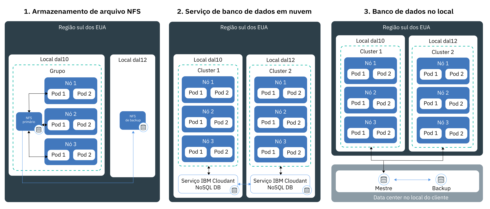

---

copyright:
  years: 2014, 2018
lastupdated: "2018-05-24"

---

{:new_window: target="_blank"}
{:shortdesc: .shortdesc}
{:screen: .screen}
{:pre: .pre}
{:table: .aria-labeledby="caption"}
{:codeblock: .codeblock}
{:tip: .tip}
{:download: .download}


# Salvando dados em seu cluster
{: #storage}
É possível persistir dados no {{site.data.keyword.containerlong}} para compartilhar dados entre instâncias de app e para proteger os seus dados de serem perdidos se um componente em seu cluster do Kubernetes falhar.


## Planejando armazenamento altamente disponível
{: #planning}

No {{site.data.keyword.containerlong_notm}}, é possível escolher entre várias opções para armazenar seus dados do aplicativo e compartilhar dados entre pods em seu cluster. No entanto, nem todas as opções de armazenamento oferecem o mesmo nível de persistência e disponibilidade em situações em que um componente em seu cluster ou um site inteiro falha.
{: shortdesc}


### Opções de armazenamento de dados não persistentes
{: #non_persistent}

É possível usar as opções de armazenamento não persistente se os dados não precisam ser armazenados persistentemente ou se os dados não precisam ser compartilhados entre as instâncias do app. As opções de armazenamento não persistente também podem ser usadas para teste de unidade de seus componentes do app ou para tentar novos recursos.
{: shortdesc}

A imagem a seguir mostra as opções de armazenamento de dados não persistentes disponíveis no {{site.data.keyword.containerlong_notm}}. Essas opções estão disponíveis para clusters grátis e padrão.
<p>
</p>

<table summary="A tabela mostra as opções de armazenamento não persistentes. As linhas devem ser lidas da esquerda para a direita, com o número da opção na coluna um, o título da opção na coluna dois e uma descrição na coluna três." style="width: 100%">
<caption>Opções de armazenamento não persistente</caption>
  <thead>
  <th>Opção</th>
  <th>Descrição</th>
  </thead>
  <tbody>
    <tr>
      <td>1. Dentro do contêiner ou pod</td>
      <td>Os contêineres e os pods são, pelo design, de curta duração e podem falhar inesperadamente. No entanto, é possível gravar dados no sistema de arquivos local do contêiner para armazenar dados em todo o ciclo de vida do contêiner. Os dados dentro de um contêiner não podem ser compartilhados com outros contêineres ou pods e são perdidos quando o contêiner trava ou é removido. Para obter mais informações, veja [Armazenando dados em um contêiner](https://docs.docker.com/storage/).</td>
    </tr>
  <tr>
    <td>2. No nó do trabalhador</td>
    <td>Cada nó do trabalhador é configurado com armazenamento primário e secundário que é determinado pelo tipo de máquina que você seleciona para o seu nó do trabalhador. O armazenamento primário é usado para armazenar dados do sistema operacional e pode ser acessado usando um [volume <code>hostPath</code> do Kubernetes ](https://kubernetes.io/docs/concepts/storage/volumes/#hostpath). O armazenamento secundário é usado para armazenar dados do `kubelet` e do mecanismo de tempo de execução do contêiner. É possível acessar o armazenamento secundário usando um [volume <code>emptyDir</code> do Kubernetes ](https://kubernetes.io/docs/concepts/storage/volumes/#emptydir)<br/><br/>Embora os volumes <code>hostPath</code> sejam usados para montar os arquivos do sistema de arquivos do nó do trabalhador em seu pod, <code>emptyDir</code> cria um diretório vazio que é designado a um pod em seu cluster. Todos os contêineres nesse pod podem ler e gravar nesse volume. Como o
volume está designado a um pod específico, os dados não podem ser compartilhados com outros pods em um conjunto de réplicas.<br/><br/><p>Um volume <code>hostPath</code> ou <code>emptyDir</code> e seus dados são removidos quando: <ul><li>O nó do trabalhador é excluído.</li><li>O nó do trabalhador é recarregado ou atualizado.</li><li>O cluster é excluído.</li><li>A conta do {{site.data.keyword.Bluemix_notm}} atinge um estado suspenso. </li></ul></p><p>Além disso, os dados em um volume <code>emptyDir</code> são removidos quando: <ul><li>O pod designado é excluído permanentemente do nó do trabalhador.</li><li>O pod designado é planejado em outro nó do trabalhador.</li></ul></p><p><strong>Nota:</strong> se o contêiner dentro do pod travar, os dados no volume ainda ficarão disponíveis no nó do trabalhador.</p></td>
    </tr>
    </tbody>
    </table>


### Opções de armazenamento de dados persistentes para alta disponibilidade
{: #persistent}

O desafio principal quando você cria apps stateful altamente disponíveis é persistir os dados entre múltiplas instâncias do app em múltiplos locais e manter os dados em sincronização sempre. Para dados altamente disponíveis, você deseja assegurar que tenha um banco de dados principal com múltiplas instâncias que são difundidas em múltiplos data centers ou mesmo em múltiplas regiões. Esse banco de dados principal deve ser replicado continuamente para manter uma fonte isolada de verdade. Todas as instâncias no cluster devem ler e gravar nesse banco de dados principal. No caso de uma instância do mestre estar inativa, outras instâncias assumem o controle da carga de trabalho para que você não experiencie o tempo de inatividade para seus apps.
{: shortdesc}

A imagem a seguir mostra as opções que você tem no {{site.data.keyword.containerlong_notm}} para tornar os dados altamente disponíveis em um cluster padrão. A opção que é certa para você depende dos fatores a seguir:
  * **O tipo de app que você tem:** por exemplo, você pode ter um app que deve armazenar dados em uma base de arquivo em vez de dentro de um banco de dados.
  * **Requisitos jurídicos de onde armazenar e rotear os dados:** por exemplo, você pode ser obrigado a armazenar e rotear dados somente nos Estados Unidos e não é possível usar um serviço que está localizado na Europa.
  * **Opções de backup e restauração:** cada opção de armazenamento vem com recursos para fazer backup e restaurar dados. Verifique se as opções de backup e restauração disponíveis atendem aos requisitos do plano de recuperação de desastres, como a frequência de backups ou os recursos de armazenamento de dados fora do seu data center primário.
  * **Replicação global:** para alta disponibilidade, você pode desejar configurar múltiplas instâncias de armazenamento que são distribuídas e replicadas entre os data centers em todo o mundo.

<br/>


<table summary="A tabela mostra as opções de armazenamento persistente. As linhas devem ser lidas da esquerda para a direita, com o número da opção na coluna um, o título da opção na coluna dois e uma descrição na coluna três.">
<caption>Opções de armazenamento persistente</caption>
  <thead>
  <th>Opção</th>
  <th>Descrição</th>
  </thead>
  <tbody>
  <tr>
  <td>1. Armazenamento de arquivo ou armazenamento de bloco do NFS</td>
  <td>Com essa opção, é possível persistir dados do app e do contêiner usando volumes persistentes do Kubernetes. Os volumes são hospedados no [Armazenamento de arquivo baseado em NFS ](https://www.ibm.com/cloud/file-storage/details) do Endurance e Performance ou no [armazenamento de bloco ](https://www.ibm.com/cloud/block-storage) que pode ser usado para apps que armazenam dados em uma base de arquivo ou como um bloco em vez de em um banco de dados. Os dados salvos no armazenamento de arquivo e bloco são criptografados em repouso.<p>O {{site.data.keyword.containershort_notm}} fornece classes de armazenamento predefinidas que definem o intervalo de tamanhos do armazenamento, o IOPS, a política de exclusão e as permissões de leitura e gravação para o volume. Para iniciar uma solicitação para armazenamento de arquivo ou armazenamento de bloco, deve-se criar um [persistent volume claim (PVC)](cs_storage.html#create). Depois que você envia um PVC, o {{site.data.keyword.containershort_notm}} provisiona dinamicamente um volume persistente que está hospedado no armazenamento de arquivo ou armazenamento de bloco baseado no NFS. [É possível montar o PVC](cs_storage.html#app_volume_mount) como um volume para a sua implementação para permitir que os contêineres leiam e gravem no volume. </p><p>Os volumes persistentes são provisionados no data center no qual o nó do trabalhador está localizado. É possível compartilhar dados entre o mesmo conjunto de réplicas ou com outras implementações no mesmo cluster. Não é possível compartilhar dados entre os clusters quando eles estão localizados em diferentes data centers ou regiões. </p><p>Por padrão,
o armazenamento e o armazenamento de bloco do NFS não são submetidos a backup automaticamente. É possível configurar um backup periódico para seu cluster usando os [mecanismos de backup e restauração](cs_storage.html#backup_restore) fornecidos. Quando um contêiner trava ou um pod é removido de um nó do trabalhador, os dados não são removidos e ainda podem ser acessados por outras implementações que montam o volume. </p><p><strong>Nota:</strong> é possível escolher ser faturado para armazenamento de compartilhamento de arquivo NFS persistente e armazenamento de bloco por hora ou mensal. Se você escolher mensal, quando remover o armazenamento persistente, ainda pagará o encargo mensal para isso, mesmo se o usou somente por um curto tempo.</p></td>
  </tr>
  <tr id="cloud-db-service">
    <td>2. Serviço de banco de dados em nuvem</td>
    <td>Com essa opção, é possível persistir dados usando um serviço de nuvem de banco de dados do {{site.data.keyword.Bluemix_notm}}, como [IBM Cloudant NoSQL DB](/docs/services/Cloudant/getting-started.html#getting-started-with-cloudant). Os dados que são armazenados com essa opção podem ser acessados em clusters, locais e regiões. <p> É possível escolher configurar uma única instância de banco de dados que todos os seus apps acessem ou [configurar múltiplas instâncias em data centers e replicação](/docs/services/Cloudant/guides/active-active.html#configuring-cloudant-nosql-db-for-cross-region-disaster-recovery) entre as instâncias para disponibilidade mais alta. No banco de dados IBM Cloudant NoSQL, os dados não são submetidos a backup automaticamente. É possível usar os [mecanismos de backup e restauração](/docs/services/Cloudant/guides/backup-cookbook.html#cloudant-nosql-db-backup-and-recovery) para proteger seus dados de uma falha do site.</p> <p> Para usar um serviço em seu cluster, deve-se [ligar o serviço do {{site.data.keyword.Bluemix_notm}} serviço](cs_integrations.html#adding_app) a um namespace em seu cluster. Ao ligar o serviço ao cluster, um segredo do Kubernetes é criado. O segredo do Kubernetes retém a informação confidencial sobre o serviço, como a URL para o serviço, seu nome do usuário e a senha. É possível montar o
segredo como um volume de segredo em seu pod e acessar o serviço usando as credenciais no segredo. Montando o volume de segredo em outros pods, também é possível compartilhar dados entre os pods. Quando um
contêiner trava ou um pod é removido de um nó do trabalhador, os dados não são removidos e ainda podem ser
acessados por outros pods que montam o volume de segredo. <p>A maioria dos serviços de banco de dados do {{site.data.keyword.Bluemix_notm}} fornecem espaço em disco para
uma pequena quantia de dados sem custo, para que você possa testar seus recursos.</p></td>
  </tr>
  <tr>
    <td>3. Banco de dados no local</td>
    <td>Se seus dados devem ser armazenados no local por razões jurídicas, é possível [configurar uma conexão VPN](cs_vpn.html#vpn) para seu banco de dados no local e usar os mecanismos de armazenamento, backup e replicação existentes em seu data center.</td>
  </tr>
  </tbody>
  </table>

{: caption="Tabela. Opções de armazenamento de dados persistentes para implementações em clusters do Kubernetes" caption-side="top"}

<br />


## Usando compartilhamentos de arquivo NFS existentes em clusters
{: #existing}

Se você tem compartilhamentos de arquivo NFS existentes em sua conta de infraestrutura do IBM Cloud (SoftLayer) que deseja usar, é possível fazer isso criando um persistent volume (PV) para seu armazenamento existente.
{:shortdesc}

Um persistent volume (PV) é um recurso do Kubernetes que representa um dispositivo de armazenamento real que é provisionado em um data center. Os volumes persistentes abstraem os detalhes de como um tipo de armazenamento específico é provisionado pelo {{site.data.keyword.Bluemix_notm}} Storage. Para montar um PV em seu cluster, deve-se solicitar armazenamento persistente para seu pod criando um persistent volume claim (PVC). O diagrama a seguir ilustra o relacionamento entre PVs e PVCs.


Conforme descrito no diagrama, para permitir o armazenamento NFS existente, deve-se criar PVs com um determinado tamanho e modo de acesso e criar um PVC que corresponda à especificação de PV. Se o PV e o PVC correspondem, eles estão ligados entre si. Somente PVCs ligados podem ser usados pelo usuário do cluster para montar o volume em uma implementação. Esse processo é referido como fornecimento estático de armazenamento persistente.

Antes de iniciar, certifique-se de que você tenha um compartilhamento de arquivo NFS existente que seja possível usar para criar seu PV. Por exemplo, se você já [criou anteriormente um PVC com uma política de classe de armazenamento `retain`](#create), é possível usar esses dados retidos no compartilhamento de arquivo NFS existente para esse novo PVC.

**Nota:** o fornecimento estático de armazenamento persistente se aplica somente a compartilhamentos de arquivo NFS existentes. Se você não tem compartilhamentos de arquivos NFS existentes, os usuários do cluster podem usar o processo de [fornecimento dinâmico](cs_storage.html#create) para incluir PVs.

Para criar um PV e um PVC correspondente, siga estas etapas.

1.  Em sua conta de infraestrutura do IBM Cloud (SoftLayer), procure o ID e o caminho do compartilhamento de arquivo NFS no qual você deseja criar seu objeto PV. Além disso, autorize o armazenamento de arquivos para as sub-redes no cluster. Essa autorização dá a seu cluster acesso ao armazenamento.
    1.  Efetue login em sua conta de infraestrutura do IBM Cloud (SoftLayer).
    2.  Clique em **Armazenamento**.
    3.  Clique em **File Storage** e, no menu **Ações**, selecione **Autorizar host**.
    4.  Selecione **Subnets**.
    5.  Na lista suspensa, selecione a sub-rede VLAN privada à qual o seu nó do trabalhador está conectado. Para localizar a sub-rede do nó do trabalhador, execute `bx cs workers <cluster_name>` e compare o `Private IP` de seu nó do trabalhador com a sub-rede que você localizou na lista suspensa.
    6.  Clique em **Enviar**.
    6.  Clique no nome do armazenamento de arquivo.
    7.  Observe o **Ponto de Montagem** campo. O campo é exibido como `<server>:/<path>`.
2.  Crie um arquivo de configuração de armazenamento para seu PV. Inclua o servidor e o caminho do campo **Ponto de montagem** do armazenamento de arquivo.

    ```
    apiVersion: v1
    kind: PersistentVolume
    metadata:
     name: mypv
    spec:
     capacity:
       storage: "20Gi"
     accessModes:
       - ReadWriteMany
     nfs:
       server: "nfslon0410b-fz.service.networklayer.com"
       path: "/IBM01SEV8491247_0908/data01"
    ```
    {: codeblock}

    <table>
    <caption>Entendendo os componentes de arquivo YAML</caption>
    <thead>
    <th colspan=2> entendendo os componentes de arquivo do YAML</th>
    </thead>
    <tbody>
    <tr>
    <td><code>name</code></td>
    <td>Insira o nome do objeto PV a ser criado.</td>
    </tr>
    <tr>
    <td><code>spec/capacity/storage</code></td>
    <td>Insira o tamanho de armazenamento do compartilhamento de arquivo NFS existente. O tamanho de armazenamento deve ser gravado em gigabytes, por exemplo, 20Gi (20 GB) ou 1000Gi (1 TB), e o tamanho deve corresponder ao tamanho do compartilhamento de arquivo existente.</td>
    </tr>
    <tr>
    <td><code>accessMode</code></td>
    <td>Os modos de acesso definem a maneira como o PVC pode ser montado em um nó do trabalhador.<ul><li>ReadWriteOnce (RWO): o PV pode ser montado em implementações somente em um único nó do trabalhador. Os contêineres em implementações que são montadas nesse PV pode ler e gravar no volume.</li><li>ReadOnlyMany (ROX): o PV pode ser montado para implementações que estão hospedadas em múltiplos nós do trabalhador. As implementações que são montadas nesse PV podem ler somente no volume.</li><li>ReadWriteMany (RWX): este PV pode ser montado para implementações que estão hospedadas em múltiplos nós do trabalhador. As implementações que são montadas nesse PV podem ler e gravar no volume.</li></ul></td>
    </tr>
    <tr>
    <td><code>spec/nfs/server</code></td>
    <td>Insira o ID do servidor de compartilhamento de arquivo NFS.</td>
    </tr>
    <tr>
    <td><code>path</code></td>
    <td>Insira o caminho para o compartilhamento de arquivo NFS no qual você deseja criar o objeto PV.</td>
    </tr>
    </tbody></table>

3.  Crie o objeto PV em seu cluster.

    ```
    Deploy/kube-config/mypv.yaml kubectl apply -f
    ```
    {: pre}

4.  Verifique se o PV é criado.

    ```
    kubectl get pv
    ```
    {: pre}

5.  Crie outro arquivo de configuração para criar seu PVC. Para que o PVC corresponda ao objeto PV que você criou anteriormente, deve-se escolher o mesmo valor para `storage` e `accessMode`. O campo `storage-class` deve estar vazio. Se algum desses campos não corresponder ao PV, um novo PV será criado automaticamente no lugar.

    ```
    kind: PersistentVolumeClaim
    apiVersion: v1
    metadata:
     name: mypvc
     annotations:
       volume.beta.kubernetes.io/storage-class: ""
    spec: accessModes:
       - ReadWriteMany
     resources:
       requests:
         storage: "20Gi"
    ```
    {: codeblock}

6.  Crie seu PVC.

    ```
    kubectl apply -f deploy/kube-config/mypvc.yaml
    ```
    {: pre}

7.  Verifique se o PVC é criado e ligado ao objeto PV. Esse processo pode levar alguns minutos.

    ```
    kubectl describe pvc mypvc
    ```
    {: pre}

    Saída de exemplo:

    ```
    Name: mypvc
    Namespace: default
    StorageClass: ""
    Status: Bound
    Volume: pvc-0d787071-3a67-11e7-aafc-eef80dd2dea2
    Labels: <none>
    Capacity: 20Gi
    Access Modes: RWX
    Events:
      FirstSeen LastSeen Count From        SubObjectPath Type Reason Message
      --------- -------- ----- ----        ------------- -------- ------ -------
      3m 3m 1 {ibm.io/ibmc-file 31898035-3011-11e7-a6a4-7a08779efd33 } Normal Provisioning External provisioner is provisioning volume for claim "default/my-persistent-volume-claim"
      3m 1m	 10 {persistentvolume-controller } Normal ExternalProvisioning cannot find provisioner "ibm.io/ibmc-file", expecting that a volume for the claim is provisioned either manually or via external software
      1m 1m 1 {ibm.io/ibmc-file 31898035-3011-11e7-a6a4-7a08779efd33 } Normal ProvisioningSucceeded	Successfully provisioned volume pvc-0d787071-3a67-11e7-aafc-eef80dd2dea2
    ```
    {: screen}


Você criou com êxito um objeto PV e o ligou a um PVC. Os usuários do cluster agora podem [montar o PVC](#app_volume_mount) para suas implementações e começar a ler e gravar no objeto PV.

<br />


## Usando o armazenamento de bloco existente em seu cluster
{: #existing_block}

Antes de iniciar, certifique-se de que tenha uma instância de armazenamento de bloco existente que possa usar para criar seu PV. Por exemplo, se anteriormente você [criou um PVC com uma política de classe de armazenamento `retain`](#create), será possível usar esses dados retidos no armazenamento de bloco existente para esse novo PVC.

**Nota**: o armazenamento de bloco é um dispositivo de modo de acesso `ReadWriteOnce`. Só é possível montá-lo em um pod em um nó do trabalhador no cluster de cada vez.

Para criar um PV e um PVC correspondente, siga estas etapas.

1.  Recupere ou gere uma chave API para sua conta de infraestrutura do IBM Cloud (SoftLayer).
    1. Efetue login no portal de infraestrutura do [IBM Cloud (SoftLayer)](https://control.softlayer.com/).
    2. Selecione **Conta**, depois **Usuários** e, em seguida, **Lista de usuários**.
    3. Localize seu ID de usuário.
    4. Na coluna **CHAVE API**, clique em **Gerar** para gerar uma chave API ou em **Visualizar** para visualizar a chave API existente.
2.  Recupere o nome de usuário da API da conta de infraestrutura do IBM Cloud (SoftLayer).
    1. No menu **Lista de usuários**, selecione seu ID de usuário.
    2. Na seção **Informações de acesso da API**, localize o seu **Nome do usuário da API**.
3.  Efetue login no plug-in da CLI da infraestrutura do IBM Cloud.
    ```
    Bx sl init
    ```
    {: pre}

4.  Escolha autenticar-se usando o nome de usuário e a chave API da conta de infraestrutura do IBM Cloud (SoftLayer).
5.  Insira o nome de usuário e a chave API recuperados nas etapas anteriores.
6.  Liste os dispositivos de armazenamento de bloco disponíveis.
    ```
    Bx sl block volume-list
    ```
    {: pre}

    Saída de exemplo:
    ```
    id         username            datacenter   storage_type              capacity_gb   bytes_used   ip_addr         lunId   active_transactions
    38642141   IBM02SEL1543159-1   dal10        endurance_block_storage   20            -            169.xx.xxx.xxx   170     0
    ```
    {: screen}

7.  Anote o `id`, `ip_addr`, `capacity_gb` e `lunId` do dispositivo de armazenamento de bloco que você deseja montar em seu cluster.
8.  Crie um arquivo de configuração para seu PV. Inclua o ID de armazenamento de bloco, o endereço IP, o tamanho e o ID do LUN que você recuperou na etapa anterior.

    ```
    apiVersion: v1
    kind: PersistentVolume
    metadata:
      name: mypv
    spec:
      capacity:
        storage: "<storage_size>"
      accessModes:
        - ReadWriteOnce
      flexVolume:
        driver: "ibm/ibmc-block"
        fsType: "<fs_type>"
        options:
          "Lun": "<lun_ID>"
          "TargetPortal": "<IP_address>"
          "VolumeID": "<volume_ID>"
          "volumeName": "<volume_name>"
      ```
      {: codeblock}

    <table>
    <caption>Entendendo os componentes de arquivo YAML</caption>
    <thead>
    <th colspan=2> entendendo os componentes de arquivo do YAML</th>
    </thead>
    <tbody>
    <tr>
    <td><code>metadata/name</code></td>
    <td>Insira o nome do PV que você deseja criar.</td>
    </tr>
    <tr>
    <td><code>spec/flexVolume/fsType</code></td> 
    <td>Insira o tipo de sistema de arquivos que está configurado para seu armazenamento de bloco existente. Escolha entre <code>ext4</code> ou <code>xfs</code>. Se você não especificar essa opção, o PV assumirá o padrão para <code>ext4</code>. Quando o fsType errado é definido, a criação de PV é bem-sucedida, mas a montagem do PV em um pod falha. </td></tr>	    
    <tr>
    <td><code>spec/capacity/storage</code></td>
    <td>Insira o tamanho da área de armazenamento do armazenamento de bloco existente recuperado na etapa anterior como <code>capacity-gb</code>. O tamanho do armazenamento deve ser gravado em gigabytes, por exemplo, 20 Gi (20 GB) ou 1000 Gi (1 TB).</td>
    </tr>
    <tr>
    <td><code>flexVolume/options/Lun</code></td>
    <td>Insira o ID do LUN para seu armazenamento de bloco recuperado na etapa anterior como <code>lunId</code>.</td>
    </tr>
    <tr>
    <td><code>flexVolume/options/TargetPortal</code></td>
    <td>Insira o endereço IP de seu armazenamento de bloco recuperado na etapa anterior como <code>ip_addr</code>. </td>
    </tr>
    <tr>
	    <td><code>flexVolume/options/VolumeId</code></td>
	    <td>Insira o ID de seu bloco de armazenamento recuperado na etapa anterior como <code>id</code>.</td>
	    </tr>
	    <tr>
		    <td><code>flexVolume/options/volumeName</code></td>
		    <td>Insira um nome para seu volume.</td>
	    </tr>
    </tbody></table>

9.  Crie o PV em seu cluster.
    ```
    Kubectl apply mypv.yaml -f
    ```
    {: pre}

10. Verifique se o PV é criado.
    ```
    kubectl get pv
    ```
    {: pre}

11. Crie outro arquivo de configuração para criar seu PVC. Para que o PVC corresponda ao PV criado anteriormente, deve-se escolher o mesmo valor para `storage` e `accessMode`. O campo `storage-class` deve estar vazio. Se algum desses campos não corresponder ao PV, um novo PV será criado automaticamente no lugar.

     ```
     kind: PersistentVolumeClaim
    apiVersion: v1
    metadata:
     name: mypvc
     annotations:
       volume.beta.kubernetes.io/storage-class: ""
     spec: accessModes:
        - ReadWriteOnce
      resources:
        requests:
          storage: "20Gi"
     ```
     {: codeblock}

12.  Crie seu PVC.
     ```
     kubectl apply -f mypvc.yaml
     ```
     {: pre}

13.  Verifique se o PVC foi criado e está ligado ao PV criado anteriormente. Esse processo pode levar alguns minutos.
     ```
     kubectl describe pvc mypvc
     ```
     {: pre}

     Saída de exemplo:

     ```
     Name: mypvc
    Namespace: default
    StorageClass: ""
     Status: Bound
     Volume: pvc-0d787071-3a67-11e7-aafc-eef80dd2dea2
     Labels: <none>
     Capacity: 20Gi
     Access Modes: RWO
     Events:
       FirstSeen LastSeen Count From        SubObjectPath Type Reason Message
       --------- -------- ----- ----        ------------- -------- ------ -------
       3m 3m 1 {ibm.io/ibmc-block 31898035-3011-11e7-a6a4-7a08779efd33 } Normal Provisioning External provisioner is provisioning volume  for claim "default/my-persistent-volume-claim"
       3m 1m	 10 {persistentvolume-controller } Normal ExternalProvisioning cannot find provisioner "ibm.io/ibmc-block", expecting that  a volume for the claim is provisioned either manually or via external software
       1m 1m 1 {ibm.io/ibmc-block 31898035-3011-11e7-a6a4-7a08779efd33 } Normal ProvisioningSucceeded	Successfully provisioned volume  pvc-0d787071-3a67-11e7-aafc-eef80dd2dea2
     ```
     {: screen}

Você criou com êxito um PV e ligou-o a um PVC. Os usuários do cluster agora podem [montar o PVC](#app_volume_mount) em suas implementações e começar a ler e gravar no PV.

<br />


## Incluindo armazenamento de arquivo ou armazenamento de bloco do NFS nos apps
{: #create}

Crie um persistent volume claim (PVC) para provisionar o armazenamento de arquivo ou armazenamento de bloco do NFS para seu cluster. Em seguida, monte essa solicitação em um persistent volume (PV) para assegurar que os dados estejam disponíveis mesmo se o pods travarem ou forem encerrados.
{:shortdesc}

O armazenamento de arquivo e o armazenamento de bloco do NFS que suportam o PV são armazenados em cluster pela IBM para fornecer alta disponibilidade para seus dados. As classes de armazenamento descrevem os tipos de ofertas de armazenamento disponíveis e definem aspectos como a política de retenção de dados, tamanho em gigabytes e IOPS quando você cria seu PV.

**Nota**: o armazenamento de bloco é um dispositivo de modo de acesso `ReadWriteOnce`. Só é possível montá-lo em um pod em um nó do trabalhador no cluster de cada vez. O armazenamento de arquivo NFS é um modo de acesso `ReadWriteMany` modo de acesso, portanto é possível montá-lo em múltiplos pods em trabalhadores dentro do cluster.

Antes de iniciar:
- Se você tiver um firewall, [permita o acesso de egresso](cs_firewall.html#pvc) para os intervalos de IP da infraestrutura do IBM Cloud (SoftLayer) dos locais em que seus clusters estão para que seja possível criar PVCs.
- Se deseja montar armazenamento de bloco para seus apps, deve-se instalar o [plug-in do {{site.data.keyword.Bluemix_notm}} Storage para armazenamento de bloco](#install_block) primeiro.

Para incluir armazenamento persistente:

1.  Revise as classes de armazenamento disponíveis. O {{site.data.keyword.containerlong}} fornece classes de armazenamento predefinidas para armazenamento de arquivo e armazenamento de bloco do NFS para que o administrador de cluster não tenha que criar nenhuma classe de armazenamento. A classe de armazenamento `ibmc-file-bronze` é a mesmo que a classe de armazenamento `padrão`. Por padrão, o armazenamento de arquivo é provisionado com um sistema de arquivos `nfs` e o armazenamento de bloco é provisionado com um sistema de arquivos `ext4`. Se você deseja provisionar armazenamento de bloco com um sistema de arquivos `XFS`, [crie sua própria classe de armazenamento customizado](#custom_storageclass). 

    ```
    kubectl get storageclasses
    ```
    {: pre}

    ```
    $ kubectl get storageclasses
    NAME                         TYPE
    default                      ibm.io/ibmc-file
    ibmc-file-bronze (default)   ibm.io/ibmc-file
    ibmc-file-custom             ibm.io/ibmc-file
    ibmc-file-gold               ibm.io/ibmc-file
    ibmc-file-retain-bronze      ibm.io/ibmc-file
    ibmc-file-retain-custom      ibm.io/ibmc-file
    ibmc-file-retain-gold        ibm.io/ibmc-file
    ibmc-file-retain-silver      ibm.io/ibmc-file
    ibmc-file-silver             ibm.io/ibmc-file
    ibmc-block-custom            ibm.io/ibmc-block
    ibmc-block-bronze            ibm.io/ibmc-block
    ibmc-block-gold              ibm.io/ibmc-block
    ibmc-block-silver            ibm.io/ibmc-block
    ibmc-block-retain-bronze     ibm.io/ibmc-block
    ibmc-block-retain-silver     ibm.io/ibmc-block
    ibmc-block-retain-gold       ibm.io/ibmc-block
    ibmc-block-retain-custom     ibm.io/ibmc-block
    ```
    {: screen}

    **Dica:** se você deseja mudar a classe de armazenamento padrão, execute `kubectl patch storageclass <storageclass> -p '{"metadata": {"annotations":{"storageclass.kubernetes.io/is-default-class":"true"}}}'` e substitua `<storageclass>` pelo nome da classe de armazenamento.

2.  Decida se deseja manter seus dados e o compartilhamento de arquivo ou o armazenamento de bloco do NFS depois de excluir o PVC.
    - Se você desejar manter seus dados, escolha uma classe de armazenamento `retain`. Quando você exclui o PVC, somente ele é excluído. O PV ainda existe no cluster e os dados nele são salvos, mas não podem ser reutilizados com outro PVC. Além disso, o arquivo NFS ou armazenamento de bloco e seus dados ainda existem em sua conta de infraestrutura do IBM Cloud (SoftLayer). Posteriormente, para acessar esses dados no cluster, crie um PVC e um PV correspondente que se refira ao seu [arquivo NFS](#existing) ou armazenamento de [bloco](#existing_block) existente. 
    - Se você deseja que o PV, os dados e seu compartilhamento de arquivo ou armazenamento de bloco do NFS sejam excluídos ao excluir o PVC, escolha uma classe de armazenamento sem `retain`.

3.  **Se escolher uma classe de armazenamento bronze, prata ou ouro**: você obterá o [armazenamento do Endurance ](https://knowledgelayer.softlayer.com/topic/endurance-storage) que define o IOPS por GB para cada classe. No entanto, é possível determinar o IOPS total escolhendo um tamanho dentro do intervalo disponível. É possível selecionar qualquer número inteiro de tamanhos de gigabyte dentro do intervalo de tamanho permitido (como 20 Gi, 256 Gi, 11854 Gi). Por exemplo, se você selecionar um compartilhamento de arquivo de 1000 Gi ou o tamanho de armazenamento de bloco na classe de armazenamento prata de 4 IOPS por GB, seu volume terá um total de 4000 IOPS. Quanto mais IOPS seu PV tem, mais rápido ele processa as operações de entrada e saída. A tabela a seguir descreve o IOPS por gigabyte e o intervalo de tamanho para cada classe de armazenamento.

    <table>
         <caption>Tabela de intervalos de tamanho de classe de armazenamento e IOPS por gigabyte</caption>
         <thead>
         <th>Classe de armazenamento</th>
         <th>IOPS por gigabyte</th>
         <th>Intervalo de tamanho em gigabytes</th>
         </thead>
         <tbody>
         <tr>
         <td>Bronze (padrão)</td>
         <td>2 IOPS/GB</td>
         <td>20-12.000 Gi</td>
         </tr>
         <tr>
         <td>Prata</td>
         <td>4 IOPS/GB</td>
         <td>20-12.000 Gi</td>
         </tr>
         <tr>
         <td>Ouro</td>
         <td>10 IOPS/GB</td>
         <td>20 - 4.000 Gi</td>
         </tr>
         </tbody></table>

    <p>**Exemplo de comando para mostrar os detalhes de uma classe de armazenamento**:</p>

    <pre class="pre"><code>kubectl describe storageclasses ibmc-file-silver</code></pre>

4.  **Se você escolher a classe de armazenamento customizada**: você obterá o [Armazenamento de desempenho ](https://knowledgelayer.softlayer.com/topic/performance-storage) e terá mais controle sobre a escolha da combinação de IOPS e tamanho. Por exemplo, se você seleciona um tamanho de 40Gi para o PVC, é possível escolher IOPS que é um múltiplo de 100 que está no intervalo de 100 a 2.000 IOPS. O IOPS que você escolhe é estático e não escala com o tamanho do armazenamento. Se você escolhe 40Gi com 100 IOPS, o IOPS total permanece 100. A tabela a seguir mostra o intervalo de IOPS que é possível escolher dependendo do tamanho selecionado.

    <table>
         <caption>Tabela de intervalos de tamanho de classe de armazenamento customizado e IOPS</caption>
         <thead>
         <th>Intervalo de tamanho em gigabytes</th>
         <th>Intervalo de IOPS em múltiplos de 100</th>
         </thead>
         <tbody>
         <tr>
         <td>20 - 39 Gi</td>
         <td>100 - 1000 IOPS</td>
         </tr>
         <tr>
         <td>40 - 79 Gi</td>
         <td>100 - 2.000 IOPS</td>
         </tr>
         <tr>
         <td>80 - 99 Gi</td>
         <td>100 - 4.000 IOPS</td>
         </tr>
         <tr>
         <td>100 - 499 Gi</td>
         <td>100 - 6.000 IOPS</td>
         </tr>
         <tr>
         <td>500 - 999 Gi</td>
         <td>100 - 10.000 IOPS</td>
         </tr>
         <tr>
         <td>1000 - 1.999 Gi</td>
         <td>100 - 20.000 IOPS</td>
         </tr>
         <tr>
         <td>2.000 - 2.999 Gi</td>
         <td>200 - 40.000 IOPS</td>
         </tr>
         <tr>
         <td>3.000 - 3.999 Gi</td>
         <td>200 - 48.000 IOPS</td>
         </tr>
         <tr>
         <td>4.000 - 7.999 Gi</td>
         <td>300 - 48.000 IOPS</td>
         </tr>
         <tr>
         <td>8.000 - 9.999 Gi</td>
         <td>500 - 48.000 IOPS</td>
         </tr>
         <tr>
         <td>10.000 - 12.000 Gi</td>
         <td>1000 - 48.000 IOPS</td>
         </tr>
         </tbody></table>

    <p>**Exemplo de comando para mostrar os detalhes para uma classe de armazenamento customizado**:</p>

    <pre class="pre"><code>kubectl describe storageclasses ibmc-file-retain-custom</code></pre>

5.  Decida se você deseja ser faturado em uma base por hora ou mensal. Por padrão, você é faturado mensalmente.

6.  Crie um arquivo de configuração para definir seu PVC e salvar a configuração como um arquivo `.yaml`.

    -  **Exemplo para classes de armazenamento bronze, prata, ouro**:
o arquivo `.yaml` a seguir cria uma solicitação que é denominada `mypvc` da classe de armazenamento `"ibmc-file-silver"`, faturada `"hourly"`, com um tamanho de gigabyte de `24Gi`. Se você desejar criar um PVC para montar o armazenamento de bloco para o seu cluster, insira `ReadWriteOnce` na seção `accessModes`.

       ```
       apiVersion: v1
       kind: PersistentVolumeClaim
       metadata:
         name: mypvc
         annotations:
           volume.beta.kubernetes.io/storage-class: "ibmc-file-silver"
         labels:
           billingType: "hourly"
       spec:
         accessModes:
           - ReadWriteMany
         resources:
           requests:
             storage: 24Gi
        ```
        {: codeblock}

    -  **Exemplo para classes de armazenamento customizado**:
o arquivo `.yaml` a seguir cria uma solicitação que é denominada `mypvc` da classe de armazenamento `ibmc-file-retain-custom`, faturada no padrão de `"monthly"`, com um tamanho de gigabyte de `45Gi` e IOPS de `"300"`. Se você desejar criar um PVC para montar o armazenamento de bloco para o seu cluster, insira `ReadWriteOnce` na seção `accessModes`.

       ```
       apiVersion: v1
       kind: PersistentVolumeClaim
       metadata:
         name: mypvc
         annotations:
           volume.beta.kubernetes.io/storage-class: "ibmc-file-retain-custom"
         labels:
           billingType: "monthly"
       spec:
         accessModes:
           - ReadWriteMany
         resources:
           requests:
             storage: 45Gi
             iops: "300"
        ```
        {: codeblock}

        <table>
        <caption>Entendendo os componentes de arquivo YAML</caption>
        <thead>
        <th colspan=2> entendendo os componentes de arquivo do YAML</th>
        </thead>
        <tbody>
        <tr>
        <td><code>metadata/name</code></td>
        <td>Insira o nome do PVC.</td>
        </tr>
        <tr>
        <td><code>metadata/annotations</code></td>
        <td>Especifique a classe de armazenamento para o PV:
          <ul>
          <li>ibmc-file-bronze / ibmc-file-retain-bronze : 2 IOPS por GB.</li>
          <li>ibmc-file-silver / ibmc-file-retain-silver: 4 IOPS por GB.</li>
          <li>ibmc-file-gold / ibmc-file-retain-gold: 10 IOPS por GB.</li>
          <li>ibmc-file-custom / ibmc-file-retain-custom: vários valores de IOPS disponíveis.</li>
          <li>ibmc-block-bronze/ibmc-block-retain-bronze: 2 IOPS por GB.</li>
          <li>ibmc-block-silver/ibmc-block-retain-silver: 4 IOPS por GB.</li>
          <li>ibmc-block-gold/ibmc-block-retain-gold: 10 IOPS por GB.</li>
          <li>ibmc-block-custom/ibmc-block-retain-custom: múltiplos valores de IOPS disponíveis.</li></ul>
          <p>Se você não especificar uma classe de armazenamento, o PV será criado com a classe de armazenamento padrão.</p><p>**Dica:** se você deseja mudar a classe de armazenamento padrão, execute <code>kubectl patch storageclass &lt;storageclass&gt; -p '{"metadata": {"annotations":{"storageclass.kubernetes.io/is-default-class":"true"}}}'</code> e substitua <code>&lt;storageclass&gt;</code> pelo nome da classe de armazenamento.</p></td>
        </tr>
        <tr>
          <td><code>metadata/labels/billingType</code></td>
          <td>Especifique a frequência para a qual sua conta de armazenamento é calculada, como "mensal" ou "por hora". O padrão é "mensal".</td>
        </tr>
        <tr>
        <td><code>spec/resources/requests/storage</code></td>
        <td>Insira o tamanho do armazenamento de arquivo, em gigabytes (Gi). Escolha um número inteiro dentro do intervalo de tamanho permitido. </br></br><strong>Nota: </strong> depois que seu armazenamento for provisionado, não será possível mudar o tamanho de seu compartilhamento de arquivo ou armazenamento de bloco do NFS. Certifique-se de especificar um tamanho que corresponda à quantia de dados que você deseja armazenar. </td>
        </tr>
        <tr>
        <td><code>spec/resources/requests/iops</code></td>
        <td>Essa opção é somente para classes de armazenamento customizadas (`ibmc-file-custom/ibmc-file-retain-custom/ibmc-block-custom/ibmc-block-retain-custom`). Especifique o IOPS total para o armazenamento, selecionando um múltiplo de 100 dentro do intervalo permitido. Para ver todas as opções, execute `kubectl describe storageclasses <storageclass>`. Se você escolher um IOPS diferente de um que esteja listado, o IOPS será arredondado para cima.</td>
        </tr>
        </tbody></table>
	
    Se você deseja usar uma classe de armazenamento customizado, crie seu PVC com o nome de classe de armazenamento correspondente, um IOPS válido e o tamanho.   
    {: tip}

7.  Crie o PVC.

    ```
    kubectl apply -f mypvc.yaml
    ```
    {: pre}

8.  Verifique se o PVC foi criado e ligado ao PV. Esse processo pode levar alguns minutos.

    ```
    kubectl describe pvc mypvc
    ```
    {: pre}

    Saída de exemplo:

    ```
    Name: mypvc
    Namespace: default
    StorageClass: ""
    Status:		Bound
    Volume:		pvc-0d787071-3a67-11e7-aafc-eef80dd2dea2
    Labels:		<none>
    Capacity:	20Gi
    Access Modes:	RWX
    Events:
      FirstSeen	LastSeen	Count	From								SubObjectPath	Type		Reason			Message
      ---------	--------	-----	----								-------------	--------	------			-------
      3m		3m		1	{ibm.io/ibmc-file 31898035-3011-11e7-a6a4-7a08779efd33 }			Normal		Provisioning		External provisioner is provisioning volume for claim "default/my-persistent-volume-claim"
      3m		1m		10	{persistentvolume-controller }							Normal		ExternalProvisioning	cannot find provisioner "ibm.io/ibmc-file", expecting that a volume for the claim is provisioned either manually or via external software
      1m		1m		1	{ibm.io/ibmc-file 31898035-3011-11e7-a6a4-7a08779efd33 }			Normal		ProvisioningSucceeded	Successfully provisioned volume pvc-0d787071-3a67-11e7-aafc-eef80dd2dea2

    ```
    {: screen}

9.  {: #app_volume_mount}Para montar o PVC para sua implementação, crie um arquivo de configuração `.yaml`.

    ```
    apiVersion: apps/v1beta1
    kind: Deployment
    metadata:
      name: <deployment_name>
      labels:
        app: <deployment_label>
    spec:
      selector:
        matchLabels:
          app: <app_name>
      template:
        metadata:
          labels:
            app: <app_name>
        spec:
          containers:
          - image: <image_name>
            name: <container_name>
            volumeMounts:
            - name: <volume_name>
              mountPath: /<file_path>
          volumes:
          - name: <volume_name>
            persistentVolumeClaim:
              claimName: <pvc_name>
    ```
    {: codeblock}

    <table>
    <caption>Entendendo os componentes de arquivo YAML</caption>
    <thead>
    <th colspan=2> entendendo os componentes de arquivo do YAML</th>
    </thead>
    <tbody>
        <tr>
    <td><code>metadata/labels/app</code></td>
    <td>Um rótulo para a implementação.</td>
      </tr>
      <tr>
        <td><code>spec/selector/matchLabels/app</code> <br/> <code>spec/template/metadata/labels/app</code></td>
        <td>Um rótulo para o seu app.</td>
      </tr>
    <tr>
    <td><code>template/metadata/labels/app</code></td>
    <td>Um rótulo para a implementação.</td>
      </tr>
    <tr>
    <td><code>spec/containers/image</code></td>
    <td>O nome da imagem que você deseja usar. Para listar as imagens disponíveis na conta do {{site.data.keyword.registryshort_notm}}, execute `bx cr image-list`.</td>
    </tr>
    <tr>
    <td><code>spec/containers/name</code></td>
    <td>O nome do contêiner que você deseja implementar em seu cluster.</td>
    </tr>
    <tr>
    <td><code>spec/containers/volumeMounts/mountPath</code></td>
    <td>O caminho absoluto do diretório no qual o volume está montado dentro do contêiner.</td>
    </tr>
    <tr>
    <td><code>spec/containers/volumeMounts/name</code></td>
    <td>O nome do volume a ser montado no pod.</td>
    </tr>
    <tr>
    <td><code>volumes/name</code></td>
    <td>O nome do volume a ser montado no pod. Geralmente, esse nome é o mesmo que <code>volumeMounts/name</code>.</td>
    </tr>
    <tr>
    <td><code>volumes/persistentVolumeClaim/claimName</code></td>
    <td>O nome do PVC que você deseja usar como seu volume. Ao montar o volume no pod, o Kubernetes identifica o PV que está ligado ao PVC e permite que o usuário leia e grave no PV.</td>
    </tr>
    </tbody></table>

10.  Crie a implementação e monte o PVC.
     ```
     kubectl apply -f <local_yaml_path>
     ```
     {: pre}

11.  Verifique se o volume foi montado com sucesso.

     ```
     kubectl describe deployment <deployment_name>
     ```
     {: pre}

     O ponto de montagem está no campo **Montagens de volume** e o volume está no campo **Volumes**.

     ```
      Volume Mounts:
          /var/run/secrets/kubernetes.io/serviceaccount from default-token-tqp61 (ro)
          /volumemount from myvol (rw)
     ...
     Volumes:
      myvol:
        Type: PersistentVolumeClaim (a reference to a PersistentVolumeClaim in the same namespace)
        ClaimName: mypvc
        ReadOnly: false
     ```
     {: screen}

{: #nonroot}
{: #enabling_root_permission}

**Permissões de NFS**: procurando documentação sobre como ativar as permissões NFS não raiz? Veja [Incluindo acesso de usuário não raiz no armazenamento de arquivo NFS](cs_troubleshoot_storage.html#nonroot).

<br />

	
## Customizando uma classe de armazenamento para armazenamento de bloco XFS
{: #custom_storageclass}

As classes de armazenamento que são predefinidas pelo {{site.data.keyword.containerlong}} provisionam o armazenamento de bloco com um sistema de arquivos `ext4` por padrão. É possível criar uma classe de armazenamento customizado para provisionar armazenamento de bloco com um sistema de arquivos `XFS`.
{: shortdesc}

Antes de iniciar: 
- [Destine a CLI do Kubernetes para o cluster](cs_cli_install.html#cs_cli_configure).
- Instale o [plug-in {{site.data.keyword.Bluemix_notm}} Storage para armazenamento de bloco](#install_block).

Para criar uma classe de armazenamento customizado: 
1. Crie um arquivo yaml de sua classe de armazenamento customizada. 
   ```
   apiVersion: storage.k8s.io/v1
   kind: StorageClass
   metadata:
     name: ibmc-block-custom-xfs
     labels:
       addonmanager.kubernetes.io/mode: Reconcile
   provisioner: ibm.io/ibmc-block
   parameters:
     type: "Performance"
     sizeIOPSRange: |-
       [20-39]Gi:[100-1000]
       [40-79]Gi:[100-2000]
       [80-99]Gi:[100-4000]
       [100-499]Gi:[100-6000]
       [500-999]Gi:[100-10000]
       [1000-1999]Gi:[100-20000]
       [2000-2999]Gi:[200-40000]
       [3000-3999]Gi:[200-48000]
       [4000-7999]Gi:[300-48000]
       [8000-9999]Gi:[500-48000]
       [10000-12000]Gi:[1000-48000]
     fsType: "xfs"
     reclaimPolicy: "Delete"
     classVersion: "2"
   ```
   {: codeblock}
   
   Se desejar manter os dados após a remoção do armazenamento de bloco de seu cluster, mude o `reclaimPolicy` para `Retain`. 
   {: tip}
   
2. Crie a classe de armazenamento em seu cluster. 
   ```
   kubectl apply -f <filepath/xfs_storageclass.yaml>
   ```
   {: pre}
       
3. Verifique se a classe de armazenamento customizado foi criada. 
   ```
   kubectl get storageclasses
   ```
   {: pre}

4. Provisione o [armazenamento de bloco XFS](#create) com sua classe de armazenamento customizado. 

<br />


## Mudando a versão de armazenamento de arquivo NFS padrão
{: #nfs_version}

A versão do armazenamento de arquivo NFS determina o protocolo que é usado para se comunicar com o servidor de armazenamento de arquivo NFS. Por padrão, todas as instâncias de armazenamento de arquivo são configuradas com o NFS versão 4. É possível mudar o PV existente para uma versão mais antiga do NFS se seu app requer uma versão específica para funcionar adequadamente.
{: shortdesc}

Para mudar a versão do NFS padrão, é possível criar uma nova classe de armazenamento para provisionar o armazenamento de arquivo dinamicamente em seu cluster ou escolher mudar um PV existente que é montado em seu pod. 

Para aplicar as atualizações de segurança mais recentes e para um melhor desempenho, use a versão do NFS padrão e não mude para uma versão mais antiga do NFS.
{: tip}

**Para criar uma classe de armazenamento customizado com a versão desejada do NFS:**
1. Crie um arquivo yaml de sua classe de armazenamento customizada. Substitua <nfs_version> pela versão do NFS que você deseja usar. Por exemplo, para provisionar o NFS versão 3.0, insira **3.0**.
   ```
   apiVersion: storage.k8s.io/v1
   kind: StorageClass
   metadata:
     name: ibmc-file-mount
     #annotations:
     #  storageclass.beta.kubernetes.io/is-default-class: "true"
     labels:
       kubernetes.io/cluster-service: "true"
   provisioner: ibm.io/ibmc-file
   parameters:
     type: "Endurance"
     iopsPerGB: "2"
     sizeRange: "[1-12000]Gi"
     reclaimPolicy: "Delete"
     classVersion: "2"
     mountOptions: nfsvers=<nfs_version>
   ```
   {: codeblock}
   
   Se desejar manter os dados após a remoção do armazenamento de bloco de seu cluster, mude o `reclaimPolicy` para `Retain`. 
   {: tip}
   
2. Crie a classe de armazenamento em seu cluster. 
   ```
   kubectl apply -f <filepath/nfsversion_storageclass.yaml>
   ```
   {: pre}
       
3. Verifique se a classe de armazenamento customizado foi criada. 
   ```
   kubectl get storageclasses
   ```
   {: pre}

4. Provisione o [arquivo de armazenamento](#create) com sua classe de armazenamento customizado. 

**Para mudar seu PV existente para usar uma versão diferente do NFS:**

1. Obtenha o PV do armazenamento de arquivo no qual você deseja mudar a versão do NFS e anote o nome do PV.
   ```
   kubectl get pv
   ```
   {: pre}

2. Inclua uma annotion para seu PV. Substitua `<version_number>` pela versão do NFS que você deseja usar. Por exemplo, para mudar para o NFS versão 3.0, insira **3**.  
   ```
   kubectl patch pv <pv_name> -p '{"metadata": {"annotations":{"volume.beta.kubernetes.io/mount-options":"vers=<version_number>"}}}'
   ```
   {: pre}
   
3. Exclua o pod que usa o armazenamento de arquivos e recrie o pod. 
   1. Salve o yaml do pod em sua máquina local.
      ```
      kubect get pod <pod_name> -o yaml > <filepath/pod.yaml>
      ```
      {: pre}
      
   2. Exclua o pod. 
      ```
      kubectl deleted pod <pod_name>
      ```
      {: pre}
   
   3. Recrie o pod. 
      ```
      kubectl apply -f <filepath/pod.yaml>
      ```
      {: pre}

4. Aguarde o pod para implementar. 
   ```
   kubectl get pods
   ```
   {: pre}
   
   O pod é totalmente implementado quando o status muda para `Running`. 

5. Efetue login em seu pod. 
   ```
   Kubectl exec -it < pod_name> sh
   ```
   {: pre}
   
6. Verifique se o armazenamento de arquivo foi montado com a versão do NFS que você especificou anteriormente. 
   ```
   mount | grep "nfs" | awk -F" |," '{ print $5, $8 }'
   ```
   {: pre}
   
   Saída de exemplo: 
   ```
   Nfs vers=3.0
   ```
   {: screen}
   
<br />


## Instalando a CLI de infraestrutura do IBM Cloud (SoftLayer)
{: #slcli}

Instale a CLI de infraestrutura do IBM Cloud (SoftLayer) para interagir com os seus recursos de infraestrutura, como o arquivo do NFS e as instâncias de armazenamento de bloco.
{: shortdesc}

Antes de iniciar, [instale o Python 3,6](https://www.python.org/downloads/).

1.  Visualize os [docs de instalação ](http://softlayer-api-python-client.readthedocs.io/en/latest/install/).

    1.  Clique no link nas etapas **Fazer download do tarball** ou **Fazer download do zipball**. Não use o `curl` comando.
    2.  Localize o pacote transferido por download, descompacte-o e navegue para o diretório.
    3.  Instale a CLI.
    
        ```
        Python3 install setup.py
        ```
        {: pre}
    
2.  Obtenha seu nome do usuário e chave API da API de infraestrutura do IBM Cloud (SoftLayer).

    1.  No [console do {{site.data.keyword.Bluemix_notm}}](https://console.bluemix.net/), expanda o menu e selecione **Infraestrutura**.
    2.  No seu perfil na barra de menus, selecione a conta de infraestrutura que você deseja usar.
    3.  Selecione **Conta** > **Usuários** > **Lista de Usuários**.
    4.  Na tabela **Usuários**, na coluna **CHAVE API**, clique em **Visualizar**. Se você não vir uma chave API, clique em **Gerar**.
    5.  Copie o nome do usuário e a chave API na janela pop-up.

3.  Configure a CLI para se conectar à sua conta de infraestrutura do IBM Cloud (SoftLayer).

    1.  Configure a CLI de infraestrutura do IBM Cloud (SoftLayer).
        ```
        Slcli configuração
        ```
        {: pre}

    2.  Preencha as informações necessárias.
    
        * **Nome do usuário**: insira o nome do usuário da API de infraestrutura do IBM Cloud (SoftLayer) que você recuperou anteriormente.
        * **Chave API ou senha**: insira a chave API da infraestrutura do IBM Cloud (SoftLayer) que você recuperou anteriormente.
        * **Terminal (public|private|custom) [ public ]**: Insira `https://api.softlayer.com/rest/v3.1`.
        * **Tempo limite [0]**: insira um valor em segundos para a CLI para esperar uma resposta da API. Um valor de `0` configura a CLI para esperar para sempre.
        
        **Exemplo**:
        
        ```
        $ slcli setup
        Username []: 1234567_user.name@example.com
        API Key or Password []:         Endpoint (public|private|custom) [public]: https://api.softlayer.com/rest/v3.1 
        Timeout [0]: 6000
        :..............:..................................................................:
        :         name : value                                                            :
        :..............:..................................................................:
        :     Username : 1234567_user.name@example.com                                    :
        :      API Key : 1111aa1111bbb22222b2b3c33333c3c3cc44d4444444444dd4444eee55e5e5e5 :
        : Endpoint URL : https://api.softlayer.com/xmlrpc/v3.1/                           :
        :      Timeout : 6000                                                             :
        :..............:..................................................................:
        Are you sure you want to write settings to "/Users/name/.softlayer"? [Y/n]: Y
        Configuration Updated Successfully
        ```
        {: screen}

Agora você está pronto para usar a CLI de infraestrutura do IBM Cloud (SoftLayer).

## Instalando o plug-in do {{site.data.keyword.Bluemix_notm}} Block Storage em seu cluster
{: #install_block}

Instale o plug-in do {{site.data.keyword.Bluemix_notm}} Block Storage com um gráfico Helm para configurar classes de armazenamento predefinidas para armazenamento de bloco. É possível usar essas classes de armazenamento para criar um PVC para provisionar armazenamento de bloco para seus apps.
{: shortdesc}

Antes de iniciar, [direcione sua CLI](cs_cli_install.html#cs_cli_configure) para o cluster no qual deseja instalar o plug-in do {{site.data.keyword.Bluemix_notm}} Block Storage.

1. Instale o [Helm](cs_integrations.html#helm) no cluster no qual deseja usar o plug-in do {{site.data.keyword.Bluemix_notm}} Block Storage.
2. Atualize o repositório do helm para recuperar a versão mais recente de todos os gráficos do helm neste repositório.
   ```
   helm repo update
   ```
   {: pre}

3. Instale o {{site.data.keyword.Bluemix_notm}} Block Storage plug-in. Quando você instala o plug-in, classes de armazenamento de bloco predefinidas são incluídas no cluster.
   ```
   Helm install ibm/ibmcloud-block-storage-plugin
   ```
   {: pre}

   Saída de exemplo:
   ```
   NAME:   bald-olm
   LAST DEPLOYED: Wed Apr 18 10:02:55 2018
   NAMESPACE: default
   STATUS: DEPLOYED

   RESOURCES:
   ==> v1beta1/DaemonSet
   NAME                           DESIRED  CURRENT  READY  UP-TO-DATE  AVAILABLE  NODE SELECTOR  AGE
   ibmcloud-block-storage-driver  0        0        0      0           0          <none>         0s

   ==> v1beta1/Deployment
   NAME                           DESIRED  CURRENT  UP-TO-DATE  AVAILABLE  AGE
   ibmcloud-block-storage-plugin  1        0        0           0          0s

   ==> v1/StorageClass
   NAME                      PROVISIONER        AGE
   ibmc-block-bronze         ibm.io/ibmc-block  0s
   ibmc-block-custom         ibm.io/ibmc-block  0s
   ibmc-block-gold           ibm.io/ibmc-block  0s
   ibmc-block-retain-bronze  ibm.io/ibmc-block  0s
   ibmc-block-retain-custom  ibm.io/ibmc-block  0s
   ibmc-block-retain-gold    ibm.io/ibmc-block  0s
   ibmc-block-retain-silver  ibm.io/ibmc-block  0s
   ibmc-block-silver         ibm.io/ibmc-block  0s

   ==> v1/ServiceAccount
   NAME                           SECRETS  AGE
   ibmcloud-block-storage-plugin  1        0s

   ==> v1beta1/ClusterRole
   NAME                           AGE
   ibmcloud-block-storage-plugin  0s

   ==> v1beta1/ClusterRoleBinding
   NAME                           AGE
   ibmcloud-block-storage-plugin  0s

   NOTES:
   Thank you for installing: ibmcloud-block-storage-plugin.   A liberação é denominado: careca-olm
   ```
   {: screen}

4. Verifique se a instalação foi bem-sucedida.
   ```
   kubectl get pod -n kube-system | grep block
   ```
   {: pre}

   Saída de exemplo:
   ```
   ibmcloud-block-storage-driver-kh4mt                              1/1       Running   0          27d       10.118.98.19   10.118.98.19
   ibmcloud-block-storage-plugin-58c5f9dc86-pbl4t                   1/1       Running   0          14d       172.21.0.204   10.118.98.19
   ```
   {: screen}
   
   A instalação é bem-sucedida quando você vê um pod `ibmcloud-block-storage-plugin` e um ou mais pods `ibmcloud-block-storage-driver`. O número de `ibmcloud-block-storage-driver` é igual ao número de nós do trabalhador em seu cluster. Todos os pods devem estar em um estado **Executando**. 

5. Verifique se as classes de armazenamento para armazenamento de bloco foram incluídas no cluster.
   ```
   kubectl get storageclasses | grep block
   ```
   {: pre}

   Saída de exemplo:
   ```
   ibmc-block-bronze            ibm.io/ibmc-block
   ibmc-block-custom            ibm.io/ibmc-block
   ibmc-block-gold              ibm.io/ibmc-block
   ibmc-block-retain-bronze     ibm.io/ibmc-block
   ibmc-block-retain-custom     ibm.io/ibmc-block
   ibmc-block-retain-gold       ibm.io/ibmc-block
   ibmc-block-retain-silver     ibm.io/ibmc-block
   ibmc-block-silver            ibm.io/ibmc-block
   ```
   {: screen}

6. Repita essas etapas para cada cluster no qual você deseja provisionar armazenamento de bloco.

Agora é possível continuar a [criar um PVC](#create) para provisionar armazenamento de bloco para seu app.

<br />


### Atualizando o plug-in do {{site.data.keyword.Bluemix_notm}} Block Storage
É possível fazer upgrade do plug-in existente do {{site.data.keyword.Bluemix_notm}} Block Storage para a versão mais recente.
{: shortdesc}

Antes de iniciar, [direcione sua CLI](cs_cli_install.html#cs_cli_configure) para o cluster.

1. Localize o nome do gráfico de helm de armazenamento de bloco que você instalou em seu cluster.
   ```
   helm ls | grep ibmcloud-block-storage-plugin
   ```
   {: pre}

   Saída de exemplo:
   ```
   myhelmchart 	1 	Mon Sep 18 15:31:40 2017	DEPLOYED	ibmcloud-block-storage-plugin-0.1.0	default
   ```
   {: screen}

2. Faça upgrade do plug-in do {{site.data.keyword.Bluemix_notm}} Block Storage para a versão mais recente.
   ```
   helm upgrade --force --recreate-pods <helm_chart_name>  ibm/ibmcloud-block-storage-plugin
   ```
   {: pre}

<br />


### Removendo o plug-in do {{site.data.keyword.Bluemix_notm}} Block Storage
Se você não quiser provisionar e usar o {{site.data.keyword.Bluemix_notm}} Block Storage para seu cluster, será possível desinstalar o gráfico de helm.
{: shortdesc}

**Nota:** a remoção do plug-in não remove os PVCs, PVs ou dados existentes. Quando você remove o plug-in, todos os pods e conjuntos de daemon relacionados são removidos do cluster. Não é possível provisionar novo armazenamento de bloco para seu cluster ou usar PVCs e PVs de armazenamento de bloco existentes depois de remover o plug-in.

Antes de iniciar, [direcione sua CLI](cs_cli_install.html#cs_cli_configure) para o cluster e certifique-se de que não tenha nenhum PVC ou PV no cluster que use armazenamento de bloco.

1. Localize o nome do gráfico de helm de armazenamento de bloco que você instalou em seu cluster.
   ```
   helm ls | grep ibmcloud-block-storage-plugin
   ```
   {: pre}

   Saída de exemplo:
   ```
   myhelmchart 	1 	Mon Sep 18 15:31:40 2017	DEPLOYED	ibmcloud-block-storage-plugin-0.1.0	default
   ```
   {: screen}

2. Exclua o plug-in do {{site.data.keyword.Bluemix_notm}} Block Storage.
   ```
   helm delete <helm_chart_name>
   ```
   {: pre}

3. Verifique se os pods de armazenamento de bloco foram removidos.
   ```
   kubectl get pod -n kube-system | grep ibmcloud-block-storage-plugin
   ```
   {: pre}
   A remoção dos pods será bem-sucedida se nenhum pod for exibido na saída da CLI.

4. Verifique se as classes de armazenamento do armazenamento de bloco foram removidas.
   ```
   kubectl get storageclasses | grep block
   ```
   {: pre}
   A remoção das classes de armazenamento será bem-sucedida se nenhuma classe de armazenamento for exibida na saída da CLI.

<br />


## Configurando soluções de backup e restauração para compartilhamentos de arquivo e armazenamento de bloco do NFS
{: #backup_restore}

Os compartilhamentos de arquivo e armazenamento de bloco são provisionados no mesmo local de seu cluster. O armazenamento é hospedado em servidores em cluster pela {{site.data.keyword.IBM_notm}} para fornecer disponibilidade no caso de um servidor ficar inativo. No entanto, os compartilhamentos de arquivo e o armazenamento de bloco não são submetidos a backup automaticamente e poderão ficar inacessíveis se o local inteiro falhar. Para proteger seus dados contra perda ou danos, será possível configurar backups periódicos que poderão ser usados para restaurar seus dados quando necessário.
{: shortdesc}

Revise as opções de backup e restauração a seguir para compartilhamentos de arquivo e armazenamento de bloco do NFS:

<dl>
  <dt>Configurar capturas instantâneas periódicas</dt>
  <dd><p>É possível configurar capturas instantâneas periódicas para seu compartilhamento de arquivo ou armazenamento de bloco do NFS, que é uma imagem somente leitura que captura o estado da instância em um momento. Para armazenar a captura instantânea, deve-se solicitar espaço de captura instantânea em seu compartilhamento de arquivo ou armazenamento de bloco do NFS. As capturas instantâneas são armazenadas na instância de armazenamento existente dentro do mesmo local. É possível restaurar dados de uma captura instantânea se um usuário acidentalmente remove dados importantes do volume. </br></br> <strong>Para criar uma captura instantânea para seu volume: </strong><ol><li>PVs de Lista existente em seu cluster. <pre class="pre"><code>kubectl get pv</code></pre></li><li>Obtenha os detalhes para o PV para o qual você deseja criar espaço de captura instantânea e anote o ID do volume, o tamanho e os IOPS. <pre class="pre"><code>kubectl describe pv &lt;pv_name&gt;</code></pre> Para armazenamento de arquivo, o ID do volume, o tamanho e o IOPS podem ser localizados na seção <strong>Labels</strong> de sua saída da CLI. Para armazenamento de bloco, o tamanho e o IOPS são mostrados na seção <strong>Labels</strong> de sua saída da CLI. Para localizar o ID do volume, revise a anotação <code>ibm.io/network-storage-id</code> de sua saída da CLI. </li><li>Crie o tamanho da captura instantânea para o volume existente com os parâmetros que você recuperou na etapa anterior. <pre class="pre"><code>slcli file snapshot-order --capacity &lt;size&gt; --tier &lt;iops&gt; &lt;volume_id&gt;</code></pre><pre class="pre"><code>slcli block snapshot-order --capacity &lt;size&gt; --tier &lt;iops&gt; &lt;volume_id&gt;</code></pre></li><li>Espere o tamanho da captura instantânea para criar. <pre class="pre"><code>slcli arquivo volume-detail &lt;volume_id&gt;</code></pre><pre class="pre"><code>slcli block volume-detail &lt;volume_id&gt;</code></pre>O tamanho da captura instantânea é provisionado com êxito quando o <strong>Snapshot Capacity (GB)</strong> em sua saída da CLI muda de 0 para o tamanho que você pediu. </li><li>Crie a captura instantânea para o volume e anote o ID da captura instantânea que é criado para você. <pre class="pre"><code>slcli file snapshot-create &lt;volume_id&gt;</code></pre><pre class="pre"><code>slcli block snapshot-create &lt;volume_id&gt;</code></pre></li><li>Verifique se a captura instantânea foi criada com êxito. <pre class="pre"><code>slcli arquivo volume-detail &lt;snapshot_id&gt;</code></pre><pre class="pre"><code>slcli block volume-detail &lt;snapshot_id&gt;</code></pre></li></ol></br><strong>Para restaurar dados por meio de uma captura instantânea para um volume existente: </strong><pre class="pre"><code>slcli file snapshot-restore -s &lt;snapshot_id&gt; &lt;volume_id&gt;</code></pre><pre class="pre"><code>slcli block snapshot-restore -s &lt;snapshot_id&gt; &lt;volume_id&gt;</code></pre></br>Para obter informações adicionais, veja:<ul><li>[Capturas instantâneas periódicas do NFS](/docs/infrastructure/FileStorage/snapshots.html)</li><li>[Capturas instantâneas periódicas do bloco](/docs/infrastructure/BlockStorage/snapshots.html#snapshots)</li></ul></p></dd>
  <dt>Replicar capturas instantâneas em outro local</dt>
 <dd><p>Para proteger seus dados contra falha de local, é possível [replicar capturas instantâneas](/docs/infrastructure/FileStorage/replication.html#working-with-replication) em uma instância de compartilhamento de arquivo ou de armazenamento de bloco do NFS que esteja configurada em outro local. Os dados podem ser replicados do armazenamento primário para o armazenamento de backup somente. Não é possível montar uma instância replicada de compartilhamento de arquivo ou de armazenamento de bloco do NFS em um cluster. Quando seu armazenamento primário falha, é possível configurar manualmente o armazenamento de backup replicado para ser o primário. Em seguida, é possível montá-lo para seu cluster. Depois que o armazenamento primário é restaurado, é possível restaurar os dados do armazenamento de backup.</p>
 <p>Para obter informações adicionais, veja:<ul><li>[Replicar capturas instantâneas para NFS](/docs/infrastructure/FileStorage/replication.html#working-with-replication)</li><li>[Replicar capturas instantâneas para Bloco](/docs/infrastructure/BlockStorage/replication.html#working-with-replication)</li></ul></p></dd>
 <dt>Armazenamento duplicado</dt>
 <dd><p>É possível duplicar sua instância de compartilhamento de arquivo ou de armazenamento de bloco do NFS no mesmo local que a instância de armazenamento original. Uma duplicata tem os mesmos dados que a instância de armazenamento original no momento em que é criada. Diferentemente de réplicas, use a duplicata como uma instância de armazenamento independente da original. Para duplicar, primeiramente configure capturas instantâneas para o volume.</p>
 <p>Para obter informações adicionais, veja:<ul><li>[Capturas instantâneas de duplicata NFS](/docs/infrastructure/FileStorage/how-to-create-duplicate-volume.html#creating-a-duplicate-file-storage)</li><li>[Capturas instantâneas de duplicata de bloco](/docs/infrastructure/BlockStorage/how-to-create-duplicate-volume.html#creating-a-duplicate-block-volume)</li></ul></p></dd>
  <dt>Backup de dados para Object Storage</dt>
  <dd><p>É possível usar a [**imagem ibm-backup-restore**](/docs/services/RegistryImages/ibm-backup-restore/index.html#ibmbackup_restore_starter) para ativar um backup e restaurar o pod em seu cluster. Esse pod contém um script para executar um backup único ou periódico para qualquer persistent volume claim (PVC) em seu cluster. Os dados são armazenados em sua instância do {{site.data.keyword.objectstoragefull}} que você configurou em um local.</p>
  <p>Para tornar seus dados ainda mais altamente disponíveis e proteger seu app de uma falha de local, configure uma segunda instância do {{site.data.keyword.objectstoragefull}} e replique os dados entre os locais. Se você precisa restaurar dados de sua instância do {{site.data.keyword.objectstoragefull}}, use o script de restauração que é fornecido com a imagem.</p></dd>
<dt>Copiar dados de e para pods e contêineres</dt>
<dd><p>É possível usar o [comando `kubectl cp` ](https://kubernetes.io/docs/reference/kubectl/overview/#cp) para copiar arquivos e diretórios de pods ou contêineres específicos ou para eles em seu cluster.</p>
<p>Antes de iniciar, [direcione sua CLI do Kubernetes](cs_cli_install.html#cs_cli_configure) para o cluster que deseja usar. Se você não especificar um contêiner com <code>-c</code>, o comando usará o primeiro contêiner disponível no pod.</p>
<p>É possível usar o comando de várias maneiras:</p>
<ul>
<li>Copiar dados de sua máquina local para um pod no cluster: <pre class="pre"><code>kubectl cp <var>&lt;local_filepath&gt;/&lt;filename&gt;</var> <var>&lt;namespace&gt;/&lt;pod&gt;:&lt;pod_filepath&gt;</var></code></pre></li>
<li>Copiar dados de um pod em seu cluster para a máquina local: <pre class="pre"><code>kubectl cp <var>&lt;namespace&gt;/&lt;pod&gt;:&lt;pod_filepath&gt;/&lt;filename&gt;</var> <var>&lt;local_filepath&gt;/&lt;filename&gt;</var></code></pre></li>
<li>Copiar dados de um pod em seu cluster para um contêiner específico em outro pod: <pre class="pre"><code>kubectl cp <var>&lt;namespace&gt;/&lt;pod&gt;:&lt;pod_filepath&gt;</var> <var>&lt;namespace&gt;/&lt;other_pod&gt;:&lt;pod_filepath&gt;</var> -c <var>&lt;container></var></code></pre></li>
</ul></dd>
  </dl>


