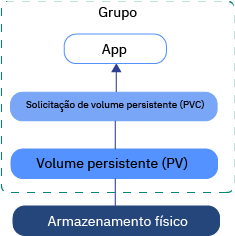
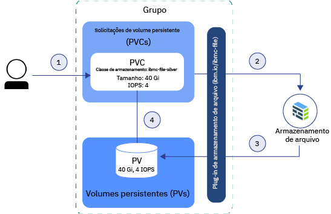
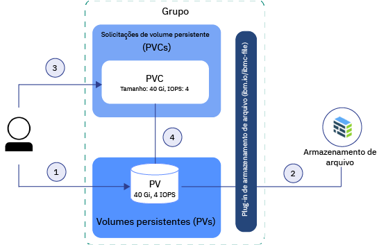

---

copyright:
  years: 2014, 2018
lastupdated: "2018-08-06"

---

{:new_window: target="_blank"}
{:shortdesc: .shortdesc}
{:screen: .screen}
{:pre: .pre}
{:table: .aria-labeledby="caption"}
{:codeblock: .codeblock}
{:tip: .tip}
{:download: .download}


# Entendendo as informações básicas de armazenamento do Kubernetes
{: #kube_concepts}

## Volumes persistentes e solicitações de volume persistente
{: #pvc_pv}

Antes de começar a provisionar o fornecimento, é importante entender os conceitos do Kubernetes de um volume persistente e de uma solicitação de volume persistente e como eles trabalham juntos em um cluster.
{: shortdesc}

A imagem a seguir mostra os componentes de armazenamento em um cluster do Kubernetes. 



- **Grupo **</br> Por padrão, cada cluster é configurado com um plug-in para [provisionar o armazenamento](cs_storage_file.html#add_file). É possível escolher instalar outros complementos, como aquele para [armazenamento de bloco](cs_storage_block.html). Para usar o armazenamento em um cluster, deve-se criar uma solicitação de volume persistente, um volume persistente e uma instância de armazenamento físico. Ao excluir o cluster, você tem a opção de excluir instâncias de armazenamento relacionadas.
- **App **</br> Para ler e gravar em sua instância de armazenamento, deve-se montar a solicitação de volume persistente (PVC) para seu app. Os diferentes tipos de armazenamento têm regras de leitura/gravação diferentes. Por exemplo, é possível montar múltiplos pods para o mesmo PVC para armazenamento de arquivo. O armazenamento de bloco é fornecido com um modo de acesso RWO (ReadWriteOnce) de maneira que seja possível montar o armazenamento em somente um pod. 
- **Solicitação de volume persistente (PVC)** </br> Um PVC é a solicitação para provisionar armazenamento persistente com um tipo e uma configuração específica. Para especificar o tipo de armazenamento persistente que você deseja, use as [Classes de armazenamento do Kubernetes](#storageclasses). O administrador de cluster pode definir classes de armazenamento ou é possível escolher dentre uma das classes de armazenamento predefinidas no {{site.data.keyword.containerlong_notm}}. Quando você cria um PVC, a solicitação é enviada para o provedor de armazenamento do {{site.data.keyword.Bluemix}}. Dependendo da configuração que está definida na classe de armazenamento, o dispositivo de armazenamento físico é pedido e provisionado em sua conta de infraestrutura do IBM Cloud (SoftLayer). Se a configuração solicitada não existir, o armazenamento não será criado. 
- **Volume persistente (PV)** </br> Um PV é uma instância de armazenamento virtual que é incluída como um volume no cluster. O PV aponta para um dispositivo de armazenamento físico em sua conta de infraestrutura do IBM Cloud (SoftLayer) e abstrai a API que é usada para se comunicar com o dispositivo de armazenamento. Para montar um PV em um app, deve-se ter um PVC correspondente. Os PVs montados aparecem como uma pasta dentro do sistema de arquivos do contêiner. 
- **Armazenamento físico** </br> Uma instância de armazenamento físico que pode ser usada para persistir seus dados. O {{site.data.keyword.containerlong_notm}} fornece alta disponibilidade para instâncias de armazenamento físico. No entanto, os dados que são armazenados em uma instância de armazenamento físico não são submetidos a backup automaticamente. Dependendo do tipo de armazenamento que você usa, existem métodos diferentes para configurar as soluções de backup e restauração. 

Para obter mais informações sobre como criar e usar PVCs, PVs e o dispositivo de armazenamento físico, consulte: 
- [ Provisionamento Dinâmico ](#dynamic_provisioning)
- [Provisionamento estático](#static_provisioning) 

## Provisionamento dinâmico
{: #dynamic_provisioning}

Use o fornecimento dinâmico se você deseja fornecer aos desenvolvedores a liberdade de provisionar o armazenamento quando eles precisam.
{: shortdesc}

** Como ele funciona? **</br>

O fornecimento dinâmico é um recurso que é nativo para o Kubernetes e que permite que um desenvolvedor de cluster peça armazenamento com um tipo e configuração predefinidos sem saber todos os detalhes sobre como provisionar o dispositivo de armazenamento físico. Para abstrair os detalhes para o tipo de armazenamento específico, o administrador de cluster deve criar [classes de armazenamento](#storageclasses) que podem ser usadas pelo desenvolvedor ou usar as classes de armazenamento que são fornecidas com os plug-ins de armazenamento do {{site.data.keyword.Bluemix}}.

Para pedir o armazenamento, deve-se criar um PVC. O PVC determina a especificação para o armazenamento que você deseja provisionar. Após o PVC ser criado, o dispositivo de armazenamento e o PV serão criados automaticamente para você.  

A imagem a seguir mostra como o armazenamento de arquivo é provisionado dinamicamente em um cluster. Esse fluxo de amostra funciona semelhantemente a outros tipos de armazenamento, como o armazenamento de bloco. 

**Fluxo de amostra para fornecimento dinâmico de armazenamento de arquivo com a classe de armazenamento prata predefinida**



1. O usuário cria um persistent volume claim (PVC) que especifica o tipo de armazenamento, a classe de armazenamento, o tamanho em gigabytes, o número de IOPS e o tipo de faturamento. A classe de armazenamento determina o tipo de armazenamento que é provisionado e os intervalos permitidos para tamanho e IOPS. A criação de um PVC em um cluster aciona automaticamente o plug-in de armazenamento para o tipo solicitado de armazenamento para provisionar armazenamento com a especificação fornecida. 
2. O dispositivo de armazenamento é pedido e provisionado automaticamente em sua conta de infraestrutura do IBM Cloud (SoftLayer). O ciclo de faturamento para seu dispositivo de armazenamento é iniciado. 
3. O plug-in de armazenamento cria automaticamente um persistent volume (PV) no cluster, um dispositivo de armazenamento virtual que aponta para o dispositivo de armazenamento real em sua conta de infraestrutura do IBM Cloud (SoftLayer). 
4. O PVC e o PV são conectados automaticamente um ao outro. O status do PVC e do PV muda para `Bound`. Agora é possível usar o PVC para montar armazenamento persistente em seu app. Se você excluir o PVC, o PV e a instância de armazenamento relacionada também serão excluídos. </br>

** Quando uso o fornecimento dinâmico? **</br>

Revise os casos de uso comuns a seguir para fornecimento dinâmico: 
1. **Provisionar armazenamento quando necessário:** em vez de pré-fornecer armazenamento persistente para desenvolvedores e pagar por armazenamento não usado, é possível fornecer aos desenvolvedores a liberdade de provisionar o armazenamento quando eles precisam. Para determinar o tipo de armazenamento que o desenvolvedor pode provisionar, é possível definir [classes de armazenamento](#storageclasses). 
2. **Automatizar a criação de PVC, PV e dispositivo de armazenamento:** você deseja provisionar e desprover automaticamente o armazenamento sem intervenção manual de um administrador de cluster. 
3. **Criar e excluir armazenamento frequentemente:** você tem um app ou configurou um pipeline de entrega contínua que cria e remove o armazenamento persistente regularmente. O armazenamento persistente que é provisionado dinamicamente com uma classe de armazenamento sem retenção pode ser removido excluindo o PVC. 

Para obter mais informações sobre como provisionar dinamicamente o armazenamento persistente, consulte: 
- [Armazenamento de arquivo](cs_storage_file.html#add_file)
- [ Bloquear armazenamento ](cs_storage_block.html#add_block)

## Provisionamento estático
{: #static_provisioning}

Se você tiver um dispositivo de armazenamento persistente existente em sua conta de infraestrutura do IBM Cloud (SoftLayer), será possível usar o fornecimento estático para tornar a instância de armazenamento disponível para seu cluster.
{: shortdesc}

** Como ele funciona? **</br>

O fornecimento estático é um recurso que é nativo para o Kubernetes e que permite que os administradores de cluster disponibilizem dispositivos de armazenamento existentes para um cluster. Como um administrador de cluster, deve-se saber os detalhes do dispositivo de armazenamento, suas configurações suportadas e opções de montagem.  

Para tornar o armazenamento existente disponível para um usuário do cluster, é necessário criar manualmente o dispositivo de armazenamento, um PV e um PVC.  

A imagem a seguir mostra como provisionar estaticamente o armazenamento de arquivo em um cluster. Este fluxo de amostra funciona de forma semelhante a outros tipos de armazenamento, como armazenamento de bloco. 

**Fluxo de amostra para fornecimento estático de armazenamento de arquivo**



1. O administrador de cluster reúne todos os detalhes sobre o dispositivo de armazenamento existente e cria um volume persistente (PV) no cluster. 
2. Com base nos detalhes de armazenamento no PV, o plug-in de armazenamento conecta o PV ao dispositivo de armazenamento em sua conta de infraestrutura do IBM Cloud (SoftLayer). 
3. O administrador de cluster ou um desenvolvedor cria um PVC. Como o PV e o dispositivo de armazenamento já existem, nenhuma classe de armazenamento é especificada no PVC. 
4. Depois que o PVC é criado, o plug-in de armazenamento tenta corresponder o PVC a um PV existente. O PVC e o PV correspondem quando os mesmos valores para o tamanho, IOPS e modo de acesso são usados no PVC e no PV. Quando o PVC e o PV correspondem, o status do PVC e do PV muda para `Bound`. Agora é possível usar o PVC para montar armazenamento persistente em seu app. Quando você exclui o PVC, o PV e a instância de armazenamento físico não são removidos. Deve-se remover o PVC, o PV e a instância de armazenamento físico separadamente.  </br>

** Quando eu utilizo fornecimento estático? **</br>

Revise os casos de uso comuns a seguir para fornecimento estático de armazenamento persistente: 
1. **Tornar os dados retidos disponíveis para o cluster:** você provisionou o armazenamento persistente com uma classe de armazenamento de retenção usando fornecimento dinâmico. Você removeu o PVC, mas o PV, o armazenamento físico na infraestrutura do IBM Cloud (SoftLayer) e os dados ainda existem. Você deseja acessar os dados retidos por meio de um app em seu cluster. 
2. **Usar um dispositivo de armazenamento existente:** você provisionou o armazenamento persistente diretamente em sua conta de infraestrutura do IBM Cloud (SoftLayer) e deseja usar esse dispositivo de armazenamento em seu cluster. 
3. **Compartilhar armazenamento persistente entre clusters na mesma zona:** você provisionou o armazenamento persistente para seu cluster. Para compartilhar a mesma instância de armazenamento persistente com outros clusters na mesma zona, deve-se criar manualmente o PV e o PVC correspondente no outro cluster. **Nota:** o compartilhamento de armazenamento persistente em clusters estará disponível somente se o cluster e a instância de armazenamento estiverem localizados na mesma zona. 
4. **Compartilhar armazenamento persistente entre namespaces no mesmo cluster:** você provisionou o armazenamento persistente em um namespace de seu cluster. Você deseja usar a mesma instância de armazenamento para um pod de app que é implementado em um namespace diferente em seu cluster. 

Para obter mais informações sobre como provisionar armazenamento estaticamente, consulte:
- [Armazenamento de arquivo](cs_storage_file.html#predefined_storageclass)
- [ Bloquear armazenamento ](cs_storage_block.html#predefined_storageclass)

## Classes de armazenamento
{: #storageclasses}

Para provisionar dinamicamente o armazenamento persistente, deve-se definir o tipo e a configuração do armazenamento que você deseja.
{: shortdesc}

Uma classe de armazenamento do Kubernetes é usada para abstrair a plataforma de armazenamento subjacente que é suportada no {{site.data.keyword.Bluemix_notm}} para que você não tenha que saber todos os detalhes sobre tamanhos suportados, IOPS ou políticas de retenção para provisionar com êxito o armazenamento persistente em um cluster. O {{site.data.keyword.containershort_notm}} fornece classes de armazenamento predefinidas para cada tipo de armazenamento que é suportado. Cada classe de armazenamento é projetada para abstrair a camada de armazenamento suportada enquanto lhe dá a opção de decidir sobre o tamanho, o IOPS e a política de retenção que você deseja. 

Para obter as especificações de classe de armazenamento predefinidas, consulte: 
- [Armazenamento de arquivo](cs_storage_file.html#storageclass_reference)
- [ Bloquear armazenamento ](cs_storage_block.html#storageclass_reference)

Não está localizando o que você procura? Também é possível criar sua própria classe de armazenamento customizada para provisionar o tipo de armazenamento desejado.
{: tip}

### Customizando uma classe de armazenamento
{: #customized_storageclass}

Se não for possível usar uma das classes de armazenamento fornecidas, será possível criar sua própria classe de armazenamento customizada.
{: shortdesc}

1. Crie uma classe de armazenamento customizada. É possível iniciar usando uma das classes de armazenamento predefinidas ou efetuar check-out de nossas classes de armazenamento customizadas de amostra. 
   - Classes de armazenamento predefinidas: 
     - [Armazenamento de arquivo](cs_storage_file.html#storageclass_reference)
     - [ Bloquear armazenamento ](cs_storage_block.html#storageclass_reference)
   - Classes de armazenamento customizado de amostra: 
     - [ Armazenamento de arquivo ](cs_storage_file.html#custom_storageclass)
     - [ Bloquear armazenamento ](cs_storage_block.html#custom_storageclass)
     
2. Crie a classe de armazenamento customizada.
   ```
   kubectl apply -f <local_file_path>
   ```
   {: pre}

3.  Verifique se a classe de armazenamento customizada foi criada.
    ```
    kubectl get storageclasses                                                        
    ```
    {: pre}

4. Crie um persistent volume claim (PVC) para provisionar dinamicamente o armazenamento com sua classe de armazenamento customizada.
   - [Armazenamento de arquivo](cs_storage_file.html#add_file)
   - [ Bloquear armazenamento ](cs_storage_block.html#add_block)
   
5. Verifique se o PVC foi criado e ligado a um volume persistente (PV). Esse processo pode levar alguns minutos para ser concluído. 
   ```
   kubectl get pvc
   ```
   {: pre}
   
### Mudando ou atualizando para uma classe de armazenamento diferente
{: #update_storageclass}

Ao provisionar dinamicamente o armazenamento persistente usando uma classe de armazenamento, você provisiona o armazenamento persistente com uma configuração específica, também referida como tipo. Esse tipo não pode ser mudado depois que seu armazenamento é provisionado. 

Se você deseja mudar o tamanho, o IOPS, o tipo ou a política de retenção para um dispositivo de armazenamento, deve-se provisionar um novo dispositivo de armazenamento e copiar seus dados do armazenamento antigo para o novo. 

1. Decida sobre o tipo de armazenamento persistente que você deseja provisionar.
   - [Armazenamento de arquivo](cs_storage_file.html#predefined_storageclass)
   - [ Bloquear armazenamento ](cs_storage_block.html#predefined_storageclass)
   
2. Crie um PVC para provisionar seu armazenamento persistente. 
   - [Armazenamento de arquivo](cs_storage_file.html#add_file)
   - [ Bloquear armazenamento ](cs_storage_block.html#add_block)
   
3. Copie os dados de seu dispositivo de armazenamento existente para o novo. Cada tipo de armazenamento é fornecido com diferentes opções para fazer backup e restaurar dados. 
   - [Armazenamento de arquivo](cs_storage_file.html#backup_restore)
   - [ Bloquear armazenamento ](cs_storage_block.html#backup_restore)
   
4. Atualize a implementação do app para referenciar o novo dispositivo de armazenamento. 
   1. Obtenha o nome do PVC que você criou anteriormente.
      ```
      kubectl get pvc
      ```
      {: pre}
      
   2. Liste a implementação em seu cluster. 
      ```
      kubectl get deployments
      ```
      {: pre}
      
   3. Obtenha o yaml de implementação para a implementação que usa o dispositivo de armazenamento persistente antigo.
      ```
      kubectl get deployment < deployment_name> -o yaml
      ```
      {: pre}
      
   4. Mude o nome do PVC na seção `spec.volumes` de sua implementação.
   5. Aplique as mudanças em sua implementação. Quando você aplica as mudanças, um novo pod é criado e o PVC que liga o PV é montado em seu pod. O pod que montou a antiga instância de armazenamento persistente é removido.
      ```
      kubectl apply -f deployment.yaml
      ```
      {: pre}
      

## Preparando o armazenamento existente para uso de múltiplas zonas com rótulos do Kubernetes
{: #multizone}

Se você atualizou seu cluster de uma zona única para um cluster de múltiplas zonas e tinha persistent volumes (PVs) existentes, inclua os rótulos de zona e região do Kubernetes em seus PVs. Os rótulos asseguram que os pods que montam esse armazenamento sejam implementados na zona em que o armazenamento persistente existe.
{:shortdesc}

**Nota:** essas etapas serão necessárias somente se você tinha PVs existentes que foram criados antes que os recursos de múltiplas zonas estivessem disponíveis. Os PVs que foram criados depois que as múltiplas zonas ficaram disponíveis já incluem os rótulos de região e zona do Kubernetes. 

Use um script para localizar todos os PVs em seu cluster e aplique os rótulos do Kubernetes `failure-domain.beta.kubernetes.io/region` e `failure-domain.beta.beta.kubernetes.io/zone`. Se o PV já tiver os rótulos, o script não sobrescreverá os valores existentes.

Antes de iniciar:
- [Destine a CLI do Kubernetes para o cluster](cs_cli_install.html#cs_cli_configure).
- Ative a [ampliação da VLAN](/docs/infrastructure/vlans/vlan-spanning.html#vlan-spanning) para a sua conta de infraestrutura do IBM Cloud (SoftLayer) para que os nós do trabalhador possam se comunicar entre si na rede privada. Para executar essa ação, você precisa da [permissão de infraestrutura](cs_users.html#infra_access) **Rede > Gerenciar rede VLAN Spanning** ou é possível solicitar ao proprietário da conta para ativá-la. Como uma alternativa à VLAN ampliada, será possível usar um Virtual Router Function (VRF) se ele estiver ativado em sua conta de infraestrutura do IBM Cloud (SoftLayer).

Para atualizar PVs existentes:

1.  Aplique os rótulos de múltiplas zonas a seus PVs executando o script. Substitua <mycluster> pelo nome de seu cluster. Quando solicitado, confirme a atualização de seus PVs.

    ```
    bash <(curl -Ls https://raw.githubusercontent.com/IBM-Cloud/kube-samples/master/file-pv-labels/apply_pv_labels.sh) <mycluster>
    ```
    {: pre}

    **Saída de exemplo**:

    ```
    Retrieving cluster storage...
    OK

    Name:			mycluster
    ID:			  myclusterID1234
    State:			normal
    ...
    Addons
    Name                   Enabled
    storage-watcher-pod    true
    basic-ingress-v2       true
    customer-storage-pod   true
    us-south
    kube-config-dal10-storage.yml
    storage.yml
    dal10\n
    The persistent volumes which do not have region and zone labels will be updated with REGION=
    us-south and ZONE=dal10. Are you sure to continue (y/n)?y
    persistentvolume "pvc-ID-123456" labeled
    persistentvolume "pvc-ID-789101" labeled
    ['failure-domain.beta.kubernetes.io/region' already has a value (us-south), and --overwrite is false, 'failure-domain.beta.kubernetes.io/zone' already has a value (dal10), and --overwrite is false]
    ['failure-domain.beta.kubernetes.io/region' already has a value (us-south), and --overwrite is false, 'failure-domain.beta.kubernetes.io/zone' already has a value (dal10), and --overwrite is false]
    \nSuccessfully applied labels to persistent volumes which did not have region and zone labels.
    ```
    {: screen}

2.  Verifique se os rótulos foram aplicados a seus PVs.

    1.  Consulte a saída do comando anterior para os IDs de PVs que foram rotulados.

        ```
        persistentvolume "pvc-ID-123456" labeled
        persistentvolume "pvc-ID-789101" labeled
        ```
        {: screen}

    2.  Revise os rótulos de região e zona para seus PVs.

        ```
        kubectl describe pv pvc-ID-123456
        ```
        {: pre}

        **Saída de exemplo**:
        ```
        Name:		pvc-ID-123456
        Labels:		CapacityGb=4
        		Datacenter=dal10
            ...
        		failure-domain.beta.kubernetes.io/region=us-south
        		failure-domain.beta.kubernetes.io/zone=dal10
            ...
        ```
        {: screen}
        
**O que vem a seguir?**

Agora que você rotulou seus PVs existentes, é possível montar o PV em seu cluster de múltiplas zonas. Consulte os links a seguir para obter mais informações. 
- Use  [ armazenamento de arquivo NFS existente ](cs_storage_file.html#existing_file)
- Use  [ armazenamento de bloco existente ](cs_storage_block.html#existing_block)
