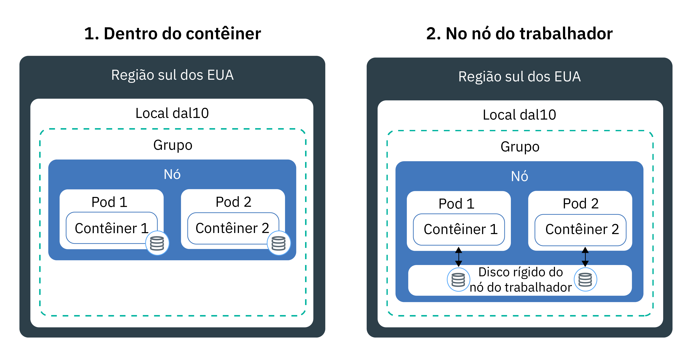
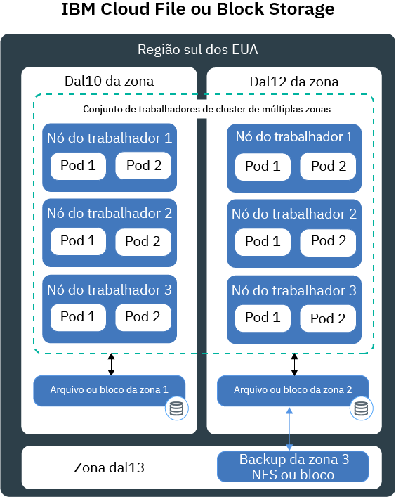
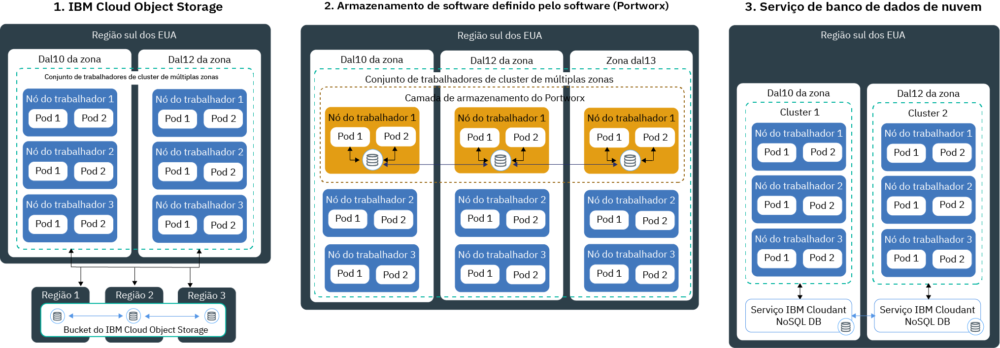

---

copyright:
  years: 2014, 2019
lastupdated: "2019-06-11"

keywords: kubernetes, iks

subcollection: containers

---

{:new_window: target="_blank"}
{:shortdesc: .shortdesc}
{:screen: .screen}
{:pre: .pre}
{:table: .aria-labeledby="caption"}
{:codeblock: .codeblock}
{:tip: .tip}
{:note: .note}
{:important: .important}
{:deprecated: .deprecated}
{:download: .download}
{:preview: .preview}

# Planejando armazenamento persistente altamente disponível
{: #storage_planning}

## Escolhendo uma solução de armazenamento
{: #choose_storage_solution}

Antes de decidir qual tipo de armazenamento é a solução correta para você, deve-se entender os requisitos do app, o tipo de dados que deseja armazenar e a frequência com que deseja acessar esses dados.
{: shortdesc}

1. Decida se seus dados devem ser armazenados permanentemente ou se seus dados podem ser removidos a qualquer momento.
   - **Armazenamento persistente:** seus dados ainda devem estar disponíveis, mesmo se o contêiner, o nó do trabalhador ou o cluster for removido. Use armazenamento persistente nos cenários a seguir:
       - Apps stateful
       - Dados de negócios principais
       - Dados que devem estar disponíveis em razão de requisitos legais, como um período de retenção definido
       - Auditoria
       - Os dados que devem ser acessados e compartilhados entre as instâncias do app
   - **Armazenamento não persistente:** seus dados podem ser removidos quando o contêiner, o nó do trabalhador ou o cluster é removido. O armazenamento não persistente é geralmente usado para registrar informações, como logs do sistema ou logs de contêiner, teste de desenvolvimento ou quando você deseja acessar dados do sistema de arquivos do host. Para localizar uma visão geral das opções de armazenamento não persistente disponíveis, consulte [Comparação de opções de armazenamento não persistente](#non_persistent_overview).

2. Se seus dados devem ser persistidos, analise se o app requer um tipo específico de armazenamento. Quando você usa um app existente, o app pode ser projetado para armazenar dados de uma das maneiras a seguir:  
   - **Em um sistema de arquivos:** os dados podem ser armazenados como um arquivo em um diretório. Por exemplo, você poderia armazenar esse arquivo em seu disco rígido local. Alguns apps requerem que os dados sejam armazenados em um sistema de arquivos específico, como `nfs` ou `ext4`, para otimizar o armazenamento de dados e atingir os objetivos de desempenho.
   - **Em um banco de dados:** os dados devem ser armazenados em um banco de dados que segue um esquema específico. Alguns apps vêm com uma interface de banco de dados que pode ser usada para armazenar dados. Por exemplo, o WordPress é otimizado para armazenar dados em um banco de dados MySQL. Nesses casos, o tipo de armazenamento é selecionado para você.

3. Se seu app não tem uma limitação no tipo de armazenamento que se deve usar, determine o tipo de dados que você deseja armazenar.
   - **Dados estruturados:** dados que podem ser armazenados em um banco de dados relacional no qual você tem uma tabela com colunas e linhas. Os dados em tabelas podem ser conectados usando chaves e geralmente são fáceis de acessar devido ao modelo de dados predefinido. Exemplos são números de telefone, números de conta, números de seguridade social ou códigos de endereçamento postal.
   - **Dados semiestruturados:** dados que não se ajustam a um banco de dados relacional, mas que vêm com algumas propriedades organizacionais que podem ser usadas para ler e analisar esses dados mais facilmente. Exemplos são arquivos de linguagem de marcações, como CSV, XML ou JSON.  
   - **Dados não estruturados:** dados que não seguem um padrão organizacional e que são tão complexos que não é possível armazená-los em um banco de dados relacional com modelos de dados predefinidos. Para acessar esses dados, você precisa de ferramentas e software avançados. Os exemplos são mensagens de e-mail, vídeos, fotos, arquivos de áudio, apresentações, dados de mídia social ou páginas da web.

   Se você tiver dados estruturados e não estruturados, tente armazenar cada tipo de dados separadamente em uma solução de armazenamento que seja projetada para esse tipo de dados. Usar uma solução de armazenamento apropriada para o seu tipo de dados facilita o acesso aos seus dados e fornece os benefícios de desempenho, escalabilidade, durabilidade e consistência.
   {: tip}

4. Analise como você deseja acessar os seus dados. As soluções de armazenamento são geralmente projetadas e otimizadas para suportar operações de leitura ou gravação.  
   - ** Somente leitura: **  seus dados são somente leitura. Você não deseja gravar ou mudar seus dados.
   - **Leitura e gravação:** você deseja ler, gravar e mudar seus dados. Para dados que são lidos e gravados, é importante entender se as operações são de leitura pesada, de gravação pesada ou balanceada.

4. Determine a frequência em que seus dados são acessados. Entender a frequência de acesso a dados pode ajudar a entender o desempenho requerido para seu armazenamento. Por exemplo, os dados que são acessados frequentemente geralmente residem em armazenamento rápido.
   - **Dados quentes:** dados que são acessados frequentemente. Casos de uso comuns são apps da web ou móveis.
   - **Dados frescos ou mornos:** dados que são acessados infrequentemente, como uma vez por mês ou menos. Os casos de uso comuns são archives, retenção de dados de curto prazo ou recuperação de desastre.
   - **Dados frios:** dados que são raramente acessados, se forem. Os casos de uso comuns são archives, backups de longo prazo, dados históricos.
   - **Dados congelados:** dados que não são acessados e que você precisa manter devido a motivos jurídicos.

   Se não for possível prever a frequência ou a frequência não seguir um padrão estrito, determine se suas cargas de trabalho são de leitura pesada, de gravação pesada ou balanceadas. Em seguida, consulte a opção de armazenamento que se ajusta à sua carga de trabalho e investigue qual camada de armazenamento fornece a flexibilidade necessária. Por exemplo, o {{site.data.keyword.cos_full_notm}} fornece uma classe de armazenamento `flex` que considera como os dados frequentes são acessados em um mês e leva em conta essa medida para otimizar seu faturamento mensal.
   {: tip}

5. Investigue se seus dados devem ser compartilhados entre múltiplas instâncias de app, zonas ou regiões.
   - **Acessar entre pods:** quando você usa volumes persistentes do Kubernetes para acessar seu armazenamento, é possível determinar o número de pods que podem montar o volume ao mesmo tempo. Algumas soluções de armazenamento, como armazenamento de bloco, podem ser acessadas somente por um pod por vez. Com outras soluções de armazenamento, é possível compartilhar o volume entre múltiplos pods.
   - **Acessar entre zonas e regiões:** você pode requerer que os seus dados estejam acessíveis entre zonas ou regiões. Algumas soluções de armazenamento, como armazenamento de arquivo e de bloco, são específicas do data center e não podem ser compartilhadas entre as zonas em uma configuração de cluster de múltiplas zonas.

   Se você desejar tornar seus dados acessíveis entre zonas ou regiões, certifique-se de consultar seu departamento jurídico para verificar se os dados podem ser armazenados em múltiplas zonas ou em um país diferente.
   {: note}

6. Entenda outras características de armazenamento que impactam sua opção.
   - **Consistência:** a garantia de que uma operação de leitura retorna a versão mais recente de um arquivo. As soluções de armazenamento podem fornecer `strong consistency` quando você tem garantia de sempre receber a versão mais recente de um arquivo ou `eventual consistency` quando a operação de leitura pode não retornar a versão mais recente. Frequentemente, você localiza uma consistência eventual em sistemas distribuídos geograficamente em que uma operação de gravação deve primeiro ser replicada em todas as instâncias.
   - **Desempenho:** o tempo que leva para concluir uma operação de leitura ou gravação.
   - **Durabilidade:** a garantia de que uma operação de gravação que está confirmada em seu armazenamento mantenha-se permanentemente e não seja corrompida ou perdida, mesmo se gigabytes ou terabytes de dados forem gravados em seu armazenamento ao mesmo tempo.
   - **Resiliência:** a capacidade de se recuperar de uma indisponibilidade e continuar as operações, mesmo se um componente de hardware ou software falhou. Por exemplo, seu armazenamento físico experimenta uma indisponibilidade de energia, uma indisponibilidade de rede ou é destruído durante um desastre natural.
   - **Disponibilidade:** a capacidade de fornecer acesso a seus dados, mesmo que um data center ou uma região esteja indisponível. A disponibilidade para seus dados é geralmente obtida pela inclusão de redundância e configuração de mecanismos de failover.
   - **Escalabilidade:** a capacidade de ampliar a capacidade e customizar o desempenho com base em suas necessidades.
   - **Criptografia:** o mascaramento de dados para evitar visibilidade quando os dados são acessados por um usuário não autorizado.

7. [Revise as soluções de armazenamento persistente disponíveis](#persistent_storage_overview) e escolha a solução que melhor se ajuste ao seu app e aos requisitos de dados.

## Comparação de Opções de Armazenamento não Persistente
{: #non_persistent_overview}

Será possível usar as opções de armazenamento não persistente se os seus dados não precisarem ser armazenados persistentemente ou se você desejar fazer teste de unidade de seus componentes de app.
{: shortdesc}

A imagem a seguir mostra as opções de armazenamento de dados não persistentes disponíveis no {{site.data.keyword.containerlong_notm}}. Essas opções estão disponíveis para clusters grátis e padrão.

<table>
<thead>
<th style="text-align:left">Características</th>
<th style="text-align:left">Dentro do contêiner</th>
<th style="text-align:left">No disco primário ou secundário do nó do trabalhador</th>
</thead>
<tbody>
<tr>
<td style="text-align:left">Capacidade Multizone</td>
<td style="text-align:left">Não</td>
<td style="text-align:left">Não</td>
</tr>
<tr>
<td style="text-align:left">Tipos de Dados</td>
<td style="text-align:left">Todos</td>
<td style="text-align:left">Todos</td>
</tr>
<tr>
<td style="text-align:left">Capacidade</td>
<td style="text-align:left">Limitada ao disco secundário disponível do nó do trabalhador. Para limitar a quantia de armazenamento secundário que é consumido por seu pod, use solicitações de recurso e limites para o [armazenamento efêmero ](https://kubernetes.io/docs/concepts/configuration/manage-compute-resources-container/#local-ephemeral-storage).</td>
<td style="text-align:left">Limitado ao espaço disponível do nó do trabalhador no disco primário (`hostPath`) ou no disco (`emptyDir`). Para limitar a quantia de armazenamento secundário que é consumido por seu pod, use solicitações de recurso e limites para o [armazenamento efêmero ](https://kubernetes.io/docs/concepts/configuration/manage-compute-resources-container/#local-ephemeral-storage).</td>
</tr>
<tr>
<td style="text-align:left">Padrão de acesso a dados</td>
<td style="text-align:left">Operações de leitura e gravação de qualquer frequência</td>
<td style="text-align:left">Operações de leitura e gravação de qualquer frequência</td>
</tr>
<tr>
<td style="text-align:left">Access</td>
<td style="text-align:left">Através do sistema de arquivos local do contêiner</td>
<td style="text-align:left"><ul style="margin:0px 0px 0px 20px; padding:0px"><li style="margin:0px; padding:0px">Por meio do [volume <code>hostPath</code> do Kubernetes ](https://kubernetes.io/docs/concepts/storage/volumes/#hostpath) para acesso ao armazenamento primário do nó do trabalhador. </li><li style="margin:0px; padding:0px">Por meio do [volume <code>emptyDir</code> do Kubernetes ](https://kubernetes.io/docs/concepts/storage/volumes/#emptydir) para acesso ao armazenamento secundário do nó do trabalhador.</li></ul></td>
</tr>
<tr>
<td style="text-align:left">Desempenho</td>
<td style="text-align:left">Alta</td>
<td style="text-align:left">Alto com latência inferior quando você usa SSD</td>
</tr>
<tr>
<td style="text-align:left">Consistência</td>
<td style="text-align:left">Forte</td>
<td style="text-align:left">Forte</td>
</tr>
<tr>
<td style="text-align:left">Resiliência</td>
<td style="text-align:left">Baixo</td>
<td style="text-align:left">Baixo</td>
</tr>
<tr>
<td style="text-align:left">Disponibilidade</td>
<td style="text-align:left">Específica para o contêiner</td>
<td style="text-align:left">Específico para o nó do trabalhador</td>
</tr>
<tr>
<td style="text-align:left">Escalabilidade</td>
<td style="text-align:left">Difícil de ampliar conforme limitado à capacidade do disco secundário do nó do trabalhador</td>
<td style="text-align:left">Difícil de ampliar conforme limitado à capacidade do disco primário e secundário do nó do trabalhador</td>
</tr>
<tr>
<td style="text-align:left">Durabilidade</td>
<td style="text-align:left">Os dados são perdidos quando o contêiner trava ou é removido. </td>
<td style="text-align:left">Os dados em volumes <code>hostPath</code> ou <code>emptyDir</code> são perdidos quando: <ul><li>O nó do trabalhador é excluído.</li><li>O nó do trabalhador é recarregado ou atualizado.</li><li>O cluster é excluído.</li><li>A conta do {{site.data.keyword.Bluemix_notm}} atinge um estado suspenso. </li></ul>

Além disso, os dados em um volume <code>emptyDir</code> são removidos quando: <ul><li>O pod designado é excluído permanentemente do nó do trabalhador.</li><li>O pod designado é planejado em outro nó do trabalhador.</li></ul>
</tr>
<tr>
<td style="text-align:left">Casos de uso comuns</td>
<td style="text-align:left"><ul style="margin:0px 0px 0px 20px; padding:0px"><li style="margin:0px; padding:0px">Cache de imagem local</li><li style="margin:0px; padding:0px">Logs do contêiner</li></ul></td>
<td style="text-align:left"><ul style="margin:0px 0px 0px 20px; padding:0px"><li style="margin:0px; padding:0px">Cache local de alto desempenho</li><li style="margin:0px; padding:0px">Acessar arquivos do sistema de arquivos do nó do trabalhador</li><li style="margin:0px; padding:0px">Testes de Unidade</li></ul></td>
</tr>
<tr>
<td style="text-align:left">Casos de uso não ideais</td>
<td style="text-align:left"><ul style="margin:0px 0px 0px 20px; padding:0px"><li style="margin:0px; padding:0px">Armazenamento de dados persistentes</li><li style="margin:0px; padding:0px">Compartilhando dados entre contêineres</li></ul></td>
<td style="text-align:left"><ul style="margin:0px 0px 0px 20px; padding:0px"><li style="margin:0px; padding:0px">Armazenamento de dados persistentes</li></ul></td>
</tr>
</tbody>
</table>

## Comparação de opções de armazenamento persistente para clusters de zona única
{: #single_zone_persistent_storage}

Se você tiver um único cluster de zona, será possível escolher entre as opções a seguir em {{site.data.keyword.containerlong_notm}} que fornecem acesso rápido aos seus dados. Para disponibilidade mais alta, use uma opção de armazenamento que seja projetada para [dados distribuídos geograficamente](#persistent_storage_overview) e, se possível, para seus requisitos, crie um cluster com múltiplas zonas.
{: shortdesc}

As opções de armazenamento de dados persistentes estão disponíveis somente para clusters padrão.
{: note}

A imagem a seguir mostra as opções que você tem no {{site.data.keyword.containerlong_notm}} para armazenar permanentemente seus dados em um único cluster.

<table>
<thead>
<th style="text-align:left">Características</th>
<th style="text-align:left">Arquivo</th>
<th style="text-align:left">Bloqueio</th>
</thead>
<tbody>
<tr>
<td style="text-align:left">Multizone-capaz</td>
<td style="text-align:left">Não, conforme específico para um data center. Os dados não podem ser compartilhados entre as zonas, a menos que você implemente sua própria replicação de dados.</td>
<td style="text-align:left">Não, conforme específico para um data center. Os dados não podem ser compartilhados entre as zonas, a menos que você implemente sua própria replicação de dados.</td>
</tr>
<tr>
<td style="text-align:left">Tipos de dados Ideal</td>
<td style="text-align:left">Todos</td>
<td style="text-align:left">Todos</td>
</tr>
<tr>
<td style="text-align:left">Padrão de uso de dados</td>
<td style="text-align:left"><ul style="margin:0px 0px 0px 20px; padding:0px"><li style="margin:0px; padding:0px">Operações de leitura/gravação aleatória</li><li style="margin:0px; padding:0px">Operações de leitura/gravação sequencial</li></ul></td>
<td style="text-align:left"><ul style="margin:0px 0px 0px 20px; padding:0px"><li style="margin:0px; padding:0px">Operações de leitura/gravação aleatória</li><li style="margin:0px; padding:0px">Cargas de trabalho de gravação intensiva</li></ul></td>
</tr>
<tr>
<td style="text-align:left">Access</td>
<td style="text-align:left">Via sistema de arquivos no volume montado</td>
<td style="text-align:left">Via sistema de arquivos no volume montado</td>
</tr>
<tr>
<td style="text-align:left">Suportadas gravações de acesso do Kubernetes</td>
<td style="text-align:left"><ul style="margin:0px 0px 0px 20px; padding:0px"><li style="margin:0px; padding:0px">ReadWriteMany (RWX)</li><li style="margin:0px; padding:0px"> ReadOnlyMany (ROX)</li><li style="margin:0px; padding:0px">ReadWriteOnce (RWO)</li></ul></td>
<td style="text-align:left"><ul style="margin:0px 0px 0px 20px; padding:0px"><li style="margin:0px; padding:0px">ReadWriteOnce (RWO)</li></ul></td>
</tr>
<tr>
<td style="text-align:left">Desempenho</td>
<td style="text-align:left">Previsível devido ao IOPS e tamanho designados. Os IOPS são compartilhados entre os pods que acessam o volume.</td>
<td style="text-align:left">Previsível devido ao IOPS e tamanho designados. Os IOPS não são compartilhados entre os pods. </td>
</tr>
<tr>
<td style="text-align:left">Consistência</td>
<td style="text-align:left">Forte</td>
<td style="text-align:left">Forte</td>
</tr>
<tr>
<td style="text-align:left">Durabilidade</td>
<td style="text-align:left">Alta</td>
<td style="text-align:left">Alta</td>
</tr>
<tr>
<td style="text-align:left">Resiliência</td>
<td style="text-align:left">Medium conforme específico para um data center. O servidor de armazenamento de arquivo é agrupado pela IBM com rede redundante.</td>
<td style="text-align:left">Medium conforme específico para um data center. O servidor de armazenamento de bloco é agrupado pela IBM com rede redundante.</td>
</tr>
<tr>
<td style="text-align:left">Disponibilidade</td>
<td style="text-align:left">Medium conforme específico para um data center.</td>
<td style="text-align:left">Medium conforme específico para um data center.</td>
</tr>
<tr>
<td style="text-align:left">Escalabilidade</td>
<td style="text-align:left">Difícil de ampliar além do data center. Não é possível mudar uma camada de armazenamento existente. </td>
<td style="text-align:left">Difícil de ampliar além do data center. Não é possível mudar uma camada de armazenamento existente.</td>
</tr>
<tr>
<td style="text-align:left">Criptografia</td>
<td style="text-align:left">Em repouso</td>
<td style="text-align:left">Em repouso</td>
</tr>
<tr>
<td style="text-align:left">Casos de uso comuns</td>
<td style="text-align:left"><ul style="margin:0px 0px 0px 20px; padding:0px"><li style="margin:0px; padding:0px">Armazenamento em Massa ou Arquivo Único</li><li style="margin:0px; padding:0px">Compartilhamento de arquivo em um cluster de zona única</li></ul></td>
<td style="text-align:left"><ul style="margin:0px 0px 0px 20px; padding:0px"><li style="margin:0px; padding:0px">Conjuntos stateful</li><li style="margin:0px; padding:0px">Armazenamento auxiliar quando você executa seu próprio banco de dados</li><li style="margin:0px; padding:0px">Acesso de alto desempenho para pods únicos</li></ul></td>
</tr>
<tr>
<td style="text-align:left">Casos de uso não ideais</td>
<td style="text-align:left"><ul style="margin:0px 0px 0px 20px; padding:0px"><li style="margin:0px; padding:0px">Clusters de múltiplas zonas</li><li style="margin:0px; padding:0px">Dados distribuídos geograficamente</li></ul></td>
<td style="text-align:left"><ul style="margin:0px 0px 0px 20px; padding:0px"><li style="margin:0px; padding:0px">Clusters de múltiplas zonas</li><li style="margin:0px; padding:0px">Dados distribuídos geograficamente</li><li style="margin:0px; padding:0px">Compartilhando dados em múltiplas instâncias do app</li></ul></td>
</tr>
</tbody>
</table>

## Comparação de opções de armazenamento persistente para clusters com múltiplas zonas
{: #persistent_storage_overview}

Se você tiver um cluster com múltiplas zonas, escolha entre as opções de armazenamento persistente a seguir para acessar seus dados de nós do trabalhador que são difundidas entre as zonas.
{: shortdesc}

As opções de armazenamento de dados persistentes estão disponíveis somente para clusters padrão.

Procurando conectar seu cluster a um banco de dados no local? Consulte [Configurando a conectividade de VPN para o cluster](/docs/containers?topic=containers-vpn#vpn).
{: tip}

A imagem a seguir mostra as opções que você tem no {{site.data.keyword.containerlong_notm}} para armazenar permanentemente seus dados em um cluster com múltiplas zonas e tornar seus dados altamente disponíveis. É possível usar essas opções em um cluster de zona única, mas é possível que não obtenha os benefícios de alta disponibilidade que seu app requer.

<table>
<thead>
<th style="text-align:left">Características</th>
<th style="text-align:left">Objeto</th>
<th style="text-align:left">SDS (Portworx)</th>
<th style="text-align:left">Banco de dados do {{site.data.keyword.Bluemix_notm}}</th>
</thead>
<tbody>
<tr>
<td style="text-align:left">Multizone-capaz</td>
<td style="text-align:left">Sim</td>
<td style="text-align:left">Sim</td>
<td style="text-align:left">Sim</td>
</tr>
<tr>
<td style="text-align:left">Tipos de dados Ideal</td>
<td style="text-align:left">Dados Semi-Estruturados e não Estruturados</td>
<td style="text-align:left">Todos</td>
<td style="text-align:left">Depende do DBaaS</td>
</tr>
<tr>
<td style="text-align:left">Padrão de uso de dados</td>
<td style="text-align:left"><ul style="margin:0px 0px 0px 20px; padding:0px"><li style="margin:0px; padding:0px">Cargas de trabalho de leitura intensiva</li><li style="margin:0px; padding:0px">Poucas ou nenhuma operação de gravação</li></ul></td>
<td style="text-align:left"><ul style="margin:0px 0px 0px 20px; padding:0px"><li style="margin:0px; padding:0px">Cargas de trabalho de gravação intensiva</li><li style="margin:0px; padding:0px">Operação de leitura e gravação aleatória</li><li style="margin:0px; padding:0px">Operações de leitura e gravação sequenciais</li></ul></td>
<td style="text-align:left"><ul style="margin:0px 0px 0px 20px; padding:0px"><li style="margin:0px; padding:0px">Cargas de trabalho de leitura/gravação intensiva</li></ul></td>
</tr>
<tr>
<td style="text-align:left">Access</td>
<td style="text-align:left">Via sistema de arquivos no volume montado (plug-in) ou via API de REST em seu app</td>
<td style="text-align:left">Por meio do sistema de arquivos no volume montado ou no acesso do cliente NFS ao volume</td>
<td style="text-align:left">Via API REST a partir de seu app</td>
</tr>
<tr>
<td style="text-align:left">Suportadas gravações de acesso do Kubernetes</td>
<td style="text-align:left"><ul style="margin:0px 0px 0px 20px; padding:0px"><li style="margin:0px; padding:0px">ReadWriteMany (RWX)</li><li style="margin:0px; padding:0px"> ReadOnlyMany (ROX)</li><li style="margin:0px; padding:0px">ReadWriteOnce (RWO)</li></ul></td>
<td style="text-align:left">Todos</td>
<td style="text-align:left"><ul style="margin:0px 0px 0px 20px; padding:0px"><li style="margin:0px; padding:0px">N/A quando acessado no app diretamente</li></ul></td>
</tr>
<tr>
<td style="text-align:left">Desempenho</td>
<td style="text-align:left">Alto para operações de leitura. Previsível devido ao IOPS e tamanho designados quando você usa máquinas não SDS.</td>
<td style="text-align:left"><ul style="margin:0px 0px 0px 20px; padding:0px"><li style="margin:0px; padding:0px">Próximo ao desempenho de bare metal para operações de leitura e gravação sequenciais quando você usa máquinas SDS. </li><li style="margin:0px; padding:0px">Fornece [perfis ](https://docs.portworx.com/portworx-install-with-kubernetes/storage-operations/create-pvcs/dynamic-provisioning/#using-dynamic-provisioning) para executar bancos de dados de alto desempenho</li><li style="margin:0px; padding:0px">Possibilidade de criar uma camada de armazenamento com perfis de desempenho diferentes dos quais seu app pode escolher.</li></ul> </td>
<td style="text-align:left">Alto, se implementado no mesmo data center que seu app.</td>
</tr>
<tr>
<td style="text-align:left">Consistência</td>
<td style="text-align:left">Eventual</td>
<td style="text-align:left">Forte</td>
<td style="text-align:left">Depende do DBaaS</td>
</tr>
<tr>
<td style="text-align:left">Durabilidade</td>
<td style="text-align:left">Muito alto, pois as fatias de dados são dispersas em um cluster de nós de
armazenamento. Cada nó armazena somente uma parte dos dados. </td>
<td style="text-align:left">Muito alto, já que três cópias de seus dados são mantidas em todos os momentos.</td>
<td style="text-align:left">Alta</td>
</tr>
<tr>
<td style="text-align:left">Resiliência</td>
<td style="text-align:left">Alta, pois as fatias de dados são dispersas em três zonas ou regiões. Médio, quando configurado somente em uma zona única.</td>
<td style="text-align:left">Alta quando configurada com replicação em três zonas. Média, quando você armazena dados em somente uma única zona.</td>
<td style="text-align:left">Depende do DBaaS e de sua configuração. </td>
</tr>
<tr>
<td style="text-align:left">Disponibilidade</td>
<td style="text-align:left">Alta devido à distribuição entre zonas ou regiões. </td>
<td style="text-align:left">Alta quando você replica dados em três nós do trabalhador em zonas diferentes.</td>
<td style="text-align:left">Alta se você configurar múltiplas instâncias. </td>
</tr>
<tr>
<td style="text-align:left">Escalabilidade</td>
<td style="text-align:left">Escalas automaticamente</td>
<td style="text-align:left">Aumente a capacidade do volume redimensionando o volume. Para aumentar a capacidade da camada de armazenamento geral, deve-se incluir os nós do trabalhador ou o armazenamento de bloco remoto. Ambos os cenários requerem monitoramento de capacidade pelo usuário. </td>
<td style="text-align:left">Escalas automaticamente</td>
</tr>
<tr>
<td style="text-align:left">Criptografia</td>
<td style="text-align:left">Em trânsito e em repouso</td>
<td style="text-align:left">Traga sua própria chave para proteger seus dados em trânsito e em repouso com o {{site.data.keyword.keymanagementservicelong_notm}}. </td>
<td style="text-align:left">Em repouso</td>
</tr>
<tr>
<td style="text-align:left">Casos de uso comuns</td>
<td style="text-align:left"><ul style="margin:0px 0px 0px 20px; padding:0px"><li style="margin:0px; padding:0px">Clusters de múltiplas zonas</li><li style="margin:0px; padding:0px">Dados distribuídos geograficamente</li><li style="margin:0px; padding:0px">Dados grandes estáticos</li><li style="margin:0px; padding:0px">Conteúdo estático de multimídia</li><li style="margin:0px; padding:0px">Apps da web</li><li style="margin:0px; padding:0px">Backups</li><li style="margin:0px; padding:0px">Archives</li></ul></td>
<td style="text-align:left"><ul style="margin:0px 0px 0px 20px; padding:0px"><li style="margin:0px; padding:0px">Conjuntos stateful</li><li style="margin:0px; padding:0px">Dados distribuídos geograficamente</li><li style="margin:0px; padding:0px">Solução de armazenamento comum ao executar apps em múltiplos provedores em nuvem</li><li style="margin:0px; padding:0px">Armazenamento auxiliar quando você executa seu próprio banco de dados</li><li style="margin:0px; padding:0px">Acesso de alto desempenho para pods únicos</li><li style="margin:0px; padding:0px">Acesso de armazenamento compartilhado entre múltiplos pods e nós do trabalhador</li></ul></td>
<td style="text-align:left"><ul style="margin:0px 0px 0px 20px; padding:0px"><li style="margin:0px; padding:0px">Clusters de múltiplas zonas</li><li style="margin:0px; padding:0px">Bancos de dados relacionais e não relacionais</li><li style="margin:0px; padding:0px">Dados distribuídos geograficamente</li></ul></td>
</tr>
<tr>
<td style="text-align:left">Casos de uso não ideais</td>
<td style="text-align:left"><ul style="margin:0px 0px 0px 20px; padding:0px"><li style="margin:0px; padding:0px">Cargas de trabalho de gravação intensiva</li><li style="margin:0px; padding:0px">Operações de gravação aleatória</li><li style="margin:0px; padding:0px">Atualizações de dados incrementais</li><li style="margin:0px; padding:0px">Bancos de dados de</li></ul></td>
<td style="text-align:left">N/A</td>
<td style="text-align:left"><ul style="margin:0px 0px 0px 20px; padding:0px"><li style="margin:0px; padding:0px">App que é projetado para gravar em um sistema de arquivos</li></ul></td>
</tr>
</tbody>
</table>
