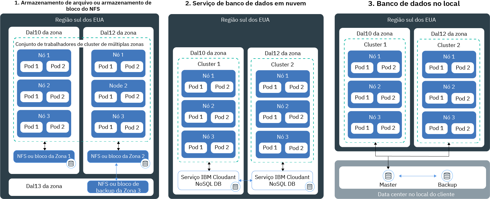

---

copyright:
  years: 2014, 2018
lastupdated: "2018-08-06"

---

{:new_window: target="_blank"}
{:shortdesc: .shortdesc}
{:screen: .screen}
{:pre: .pre}
{:table: .aria-labeledby="caption"}
{:codeblock: .codeblock}
{:tip: .tip}
{:download: .download}

# Planejando armazenamento persistente altamente disponível
{: #storage_planning}

## Opções de armazenamento de dados não persistentes
{: #non_persistent}

É possível usar as opções de armazenamento não persistente se os dados não precisam ser armazenados persistentemente ou se os dados não precisam ser compartilhados entre as instâncias do app. As opções de armazenamento não persistente também podem ser usadas para teste de unidade de seus componentes do app ou para tentar novos recursos.
{: shortdesc}

A imagem a seguir mostra as opções de armazenamento de dados não persistentes disponíveis no {{site.data.keyword.containerlong_notm}}. Essas opções estão disponíveis para clusters grátis e padrão.

<table summary="A tabela mostra as opções de armazenamento não persistentes. As linhas devem ser lidas da esquerda para a direita, com o número da opção na coluna um, o título da opção na coluna dois e uma descrição na coluna três." style="width: 100%">
<caption>Opções de armazenamento não persistente</caption>
  <thead>
  <th>Opção</th>
  <th>Descrição</th>
  </thead>
  <tbody>
    <tr>
      <td>1. Dentro do contêiner ou pod</td>
      <td>Os contêineres e os pods são, pelo design, de curta duração e podem falhar inesperadamente. No entanto, é possível gravar dados no sistema de arquivos local do contêiner para armazenar dados em todo o ciclo de vida do contêiner. Os dados dentro de um contêiner não podem ser compartilhados com outros contêineres ou pods e são perdidos quando o contêiner trava ou é removido. Para obter mais informações, veja [Armazenando dados em um contêiner](https://docs.docker.com/storage/).</td>
    </tr>
  <tr>
    <td>2. No nó do trabalhador</td>
    <td>Cada nó do trabalhador é configurado com armazenamento primário e secundário que é determinado pelo tipo de máquina que você seleciona para o seu nó do trabalhador. O armazenamento primário é usado para armazenar dados do sistema operacional e pode ser acessado usando um [volume <code>hostPath</code> do Kubernetes ](https://kubernetes.io/docs/concepts/storage/volumes/#hostpath). O armazenamento secundário é usado para armazenar dados do `kubelet` e do mecanismo de tempo de execução do contêiner. É possível acessar o armazenamento secundário usando um [volume <code>emptyDir</code> do Kubernetes ](https://kubernetes.io/docs/concepts/storage/volumes/#emptydir)  Embora os volumes <code>hostPath</code> sejam usados para montar os arquivos do sistema de arquivos do nó do trabalhador em seu pod, <code>emptyDir</code> cria um diretório vazio que é designado a um pod em seu cluster. Todos os contêineres nesse pod podem ler e gravar nesse volume. Como o
volume está designado a um pod específico, os dados não podem ser compartilhados com outros pods em um conjunto de réplicas.  
Um volume <code>hostPath</code> ou <code>emptyDir</code> e seus dados são removidos quando: <ul><li>O nó do trabalhador é excluído.</li><li>O nó do trabalhador é recarregado ou atualizado.</li><li>O cluster é excluído.</li><li>A conta do {{site.data.keyword.Bluemix_notm}} atinge um estado suspenso. </li></ul>

Além disso, os dados em um volume <code>emptyDir</code> são removidos quando: <ul><li>O pod designado é excluído permanentemente do nó do trabalhador.</li><li>O pod designado é planejado em outro nó do trabalhador.</li></ul>

<strong>Nota:</strong> se o contêiner dentro do pod travar, os dados no volume ainda ficarão disponíveis no nó do trabalhador.
</td>
    </tr>
    </tbody>
    </table>

## Opções de armazenamento de dados persistentes para alta disponibilidade
{: #persistent}

O principal desafio quando você cria apps stateful altamente disponíveis é persistir dados entre múltiplas instâncias de app em múltiplas zonas e manter os dados em sincronização sempre. Para dados altamente disponíveis, você deseja assegurar que tenha um banco de dados principal com múltiplas instâncias que são difundidas em múltiplos data centers ou mesmo em múltiplas regiões. Esse banco de dados principal deve ser replicado continuamente para manter uma fonte isolada de verdade. Todas as instâncias no cluster devem ler e gravar nesse banco de dados principal. No caso de uma instância do mestre estar inativa, outras instâncias assumem o controle da carga de trabalho para que você não experiencie o tempo de inatividade para seus apps.
{: shortdesc}

A imagem a seguir mostra as opções que você tem no {{site.data.keyword.containerlong_notm}} para tornar os dados altamente disponíveis em um cluster padrão. A opção que é certa para você depende dos fatores a seguir:
  * **O tipo de app que você tem:** por exemplo, você pode ter um app que deve armazenar dados em uma base de arquivo em vez de dentro de um banco de dados.
  * **Requisitos jurídicos de onde armazenar e rotear os dados:** por exemplo, você pode ser obrigado a armazenar e rotear dados somente nos Estados Unidos e não é possível usar um serviço que está localizado na Europa.
  * **Opções de backup e restauração:** cada opção de armazenamento vem com recursos para fazer backup e restaurar dados. Verifique se as opções de backup e restauração disponíveis atendem aos requisitos do plano de recuperação de desastres, como a frequência de backups ou os recursos de armazenamento de dados fora do seu data center primário.
  * **Replicação global:** para alta disponibilidade, você pode desejar configurar múltiplas instâncias de armazenamento que são distribuídas e replicadas entre os data centers em todo o mundo.

 

<table summary="A tabela mostra as opções de armazenamento persistente. As linhas devem ser lidas da esquerda para a direita, com o número da opção na coluna um, o título da opção na coluna dois e uma descrição na coluna três." style="width: 100%">
<caption>Opções de armazenamento persistente</caption>
  <thead>
  <th>Opção</th>
  <th>Descrição</th>
  </thead>
  <tbody>
  <tr>
  <td>1. Armazenamento NFS ou de bloco</td>
  <td>Com essa opção, é possível persistir os dados do app e do contêiner dentro da mesma zona usando volumes persistentes do Kubernetes.   <strong>Como posso provisionar o armazenamento de arquivo ou de bloco?</strong> Para provisionar armazenamento de arquivo e armazenamento de bloco em um cluster, você [usa persistent volumes (PVs) e persistent volume claims (PVCs)](cs_storage_basics.html#pvc_pv). Os PVCs e PVs são conceitos do Kubernetes que abstraem a API para provisionar o arquivo físico ou o dispositivo de armazenamento de bloco. É possível criar PVCs e PVs usando o fornecimento [dinâmico](cs_storage_basics.html#dynamic_provisioning) ou [estático](cs_storage_basics.html#static_provisioning).   <strong>Posso usar o armazenamento de arquivo ou de bloco em um cluster de múltiplas zonas?</strong>  Os dispositivos de armazenamento de arquivo e de bloco são específicos de uma zona e não podem ser compartilhados entre zonas ou regiões. Para usar esse tipo de armazenamento em um cluster, deve-se ter pelo menos um nó do trabalhador na mesma zona que seu armazenamento.   Se você [provisionar dinamicamente](cs_storage_basics.html#dynamic_provisioning) o armazenamento de arquivo e de bloco em um cluster que abrange múltiplas zonas, o armazenamento será provisionado em somente uma zona selecionada em uma base round-robin. Para provisionar armazenamento persistente em todas as zonas de seu cluster de múltiplas zonas, repita as etapas para provisionar o armazenamento dinâmico para cada zona. Por exemplo, se o seu cluster abranger as zonas `dal10`, `dal12` e `dal13`, na primeira vez em que você provisionar dinamicamente o armazenamento persistente, poderá provisionar o armazenamento em `dal10`. Crie mais dois PVCs para cobrir `dal12` e `dal13`.   <strong>E se eu desejar compartilhar dados entre zonas?</strong> Se você desejar compartilhar dados entre zonas, use um serviço de banco de dados em nuvem, como [{{site.data.keyword.cloudant_short_notm}}](/docs/services/Cloudant/getting-started.html#getting-started-with-cloudant) ou [{{site.data.keyword.cos_full_notm}}](/docs/services/cloud-object-storage/about-cos.html#about-ibm-cloud-object-storage). </td>
  </tr>
  <tr id="cloud-db-service">
    <td>2. Serviço de banco de dados em nuvem</td>
    <td>Com essa opção, é possível persistir dados usando um serviço de banco de dados do {{site.data.keyword.Bluemix_notm}}, como o [IBM Cloudant NoSQL DB](/docs/services/Cloudant/getting-started.html#getting-started-with-cloudant).   <strong>Posso usar um serviço de banco de dados em nuvem para meu cluster de múltiplas zonas?</strong> Com um serviço de banco de dados em nuvem, os dados são armazenados fora do cluster na instância de serviço especificada. A instância de serviço é provisionada em uma zona. No entanto, cada instância de serviço é fornecida com uma interface externa que pode ser usada para acessar seus dados. Quando você usa um serviço de banco de dados para um cluster de múltiplas zonas, é possível compartilhar dados entre clusters, zonas e regiões. Para tornar sua instância de serviço mais disponível, é possível escolher configurar múltiplas instâncias entre as zonas e a replicação entre as instâncias para maior disponibilidade.   <strong>Como posso incluir um serviço de banco de dados em nuvem em meu cluster?</strong> Para usar um serviço em seu cluster, deve-se [ligar o serviço do {{site.data.keyword.Bluemix_notm}} serviço](cs_integrations.html#adding_app) a um namespace em seu cluster. Ao ligar o serviço ao cluster, um segredo do Kubernetes é criado. O segredo do Kubernetes retém a informação confidencial sobre o serviço, como a URL para o serviço, seu nome do usuário e a senha. É possível montar o
segredo como um volume de segredo em seu pod e acessar o serviço usando as credenciais no segredo. Montando o volume de segredo em outros pods, também é possível compartilhar dados entre os pods. Quando um
contêiner trava ou um pod é removido de um nó do trabalhador, os dados não são removidos e ainda podem ser
acessados por outros pods que montam o volume de segredo.   A maioria dos serviços de banco de dados do {{site.data.keyword.Bluemix_notm}} fornecem espaço em disco para
uma pequena quantia de dados sem custo, para que você possa testar seus recursos.
</td>
  </tr>
  <tr>
    <td>3. Banco de dados no local</td>
    <td>Se seus dados devem ser armazenados no local por razões jurídicas, é possível [configurar uma conexão VPN](cs_vpn.html#vpn) para seu banco de dados no local e usar os mecanismos de armazenamento, backup e replicação existentes em seu data center.</td>
  </tr>
  </tbody>
  </table>

{: caption="Tabela. Opções de armazenamento de dados persistentes para implementações em clusters do Kubernetes" caption-side="top"}
