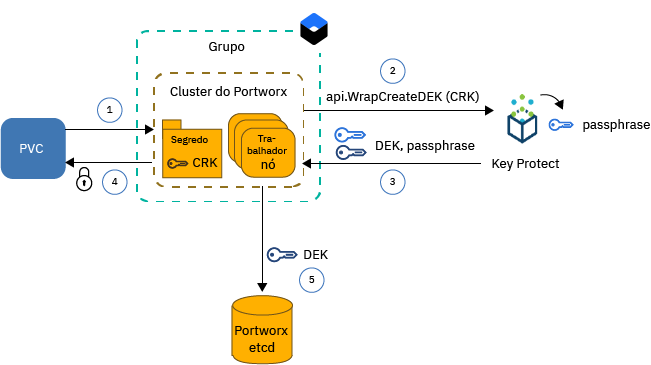
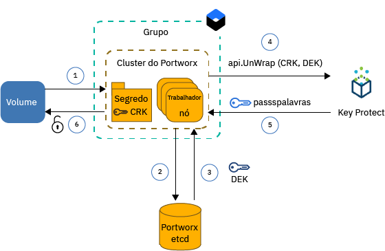

---

copyright:
  years: 2014, 2019
lastupdated: "2019-05-31"

keywords: kubernetes, iks, local persistent storage

subcollection: containers

---

{:new_window: target="_blank"}
{:shortdesc: .shortdesc}
{:screen: .screen}
{:pre: .pre}
{:table: .aria-labeledby="caption"}
{:codeblock: .codeblock}
{:tip: .tip}
{:note: .note}
{:important: .important}
{:deprecated: .deprecated}
{:download: .download}
{:preview: .preview}


# Armazenando dados em armazenamento definido pelo software (SDS) com o Portworx
{: #portworx}

O [Portworx ](https://portworx.com/products/introduction/) é uma solução de armazenamento definido por software altamente disponível que pode ser usada para gerenciar armazenamento persistente local para seus bancos de dados conteinerizados e outros apps stateful ou para compartilhar dados entre os pods em múltiplas zonas.
{: shortdesc}

**O que é armazenamento definido pelo software (SDS)?** </br>
Uma solução SDS abstrata dispositivos de armazenamento de vários tipos, tamanhos ou de diferentes fornecedores que estão conectados aos nós do trabalhador em seu cluster. Os nós do trabalhador com armazenamento disponível em discos rígidos são incluídos como um nó em um cluster de armazenamento. Nesse cluster, o armazenamento físico é virtualizado e apresentado como um conjunto de armazenamento virtual para o usuário. O cluster de armazenamento é gerenciado pelo software SDS. Se os dados devem ser armazenados no cluster de armazenamento, o software SDS decidirá onde armazenar os dados para a mais alta disponibilidade. Seu armazenamento virtual é fornecido com um conjunto comum de recursos e serviços que você pode aproveitar sem se preocupar com a arquitetura de armazenamento subjacente real.

**Como o Portworx funciona?** </br>
O Portworx agrega armazenamento disponível que está conectado a seus nós do trabalhador e cria uma camada de armazenamento persistente unificada para bancos de dados conteinerizados ou outros apps stateful que você deseja executar no cluster. Usando a replicação de volume de cada volume de nível de contêiner em múltiplos nós do trabalhador, o Portworx assegura a persistência de dados e a acessibilidade de dados entre as zonas.

O Portworx também é fornecido com recursos adicionais que podem ser usados para seus apps stateful, como capturas instantâneas de volume, criptografia de volume, isolamento e um Storage Orchestrator for Kubernetes (Stork) integrado para assegurar o posicionamento ideal de volumes no cluster. Para obter mais informações, consulte a [Documentação do Portworx ](https://docs.portworx.com/).

**Qual tipo de nó do trabalhador no {{site.data.keyword.containerlong_notm}} é o certo para o Portworx?** </br>
O {{site.data.keyword.containerlong_notm}} fornece tipos de nó do trabalhador bare metal que são otimizados para o [uso de armazenamento definido pelo software (SDS)](/docs/containers?topic=containers-planning_worker_nodes#sds) e que vêm com um ou mais discos locais brutos, não formatados e desmontados, que podem ser usados para sua camada de armazenamento do Portworx. O Portworx oferece melhor desempenho quando você usa as máquinas do nó do trabalhador SDS que vêm com a velocidade de rede de 10Gbps.

**E se eu desejar executar o Portworx em nós do trabalhador não SDS?** </br>
É possível instalar o Portworx em tipos de nó do trabalhador não SDS, mas é possível que você não obtenha os benefícios de desempenho que seu app requer. Os nós do trabalhador não SDS podem ser virtuais ou bare metal. Se você desejar usar máquinas virtuais, use um tipo de nó do trabalhador de `b2c.16x64` ou melhor. As máquinas virtuais do tipo `b3c.4x16` ou `u3c.2x4` não fornecem os recursos necessários para que o Portworx funcione corretamente. Tenha em mente que as máquinas virtuais vêm com 1000 Mbps que não são suficientes para o desempenho ideal do Portworx. As máquinas bare metal vêm com recursos de cálculo suficientes e velocidade de rede para o Portworx, mas deve-se [incluir armazenamento de bloco bruto, não formatado e desmontado](#create_block_storage) antes de poder usar essas máquinas.

**Como posso ter certeza de que meus dados são armazenados altamente disponíveis?** </br>
Você precisa de pelo menos 3 nós do trabalhador em seu cluster do Portworx para que o Portworx possa replicar seus dados entre os nós. Replicando seus dados nos nós do trabalhador, o Portworx pode assegurar que seu app stateful seja reagendado para um nó do trabalhador diferente no caso de uma falha sem perder dados. Para uma disponibilidade ainda mais alta, use um [cluster com múltiplas zonas](/docs/containers?topic=containers-ha_clusters#multizone) e replique seus volumes em nós do trabalhador SDS em 3 ou mais zonas.

**Qual topologia de volume oferece o melhor desempenho para meus pods?** </br>
Um dos maiores desafios ao executar apps stateful em um cluster é certificar-se de que seu contêiner possa ser reprogramado para outro host se o contêiner ou o host inteiro falhar. No Docker, quando um contêiner deve ser reprogramado para um host diferente, o volume não é movida para o novo host. O Portworx pode ser configurado para executar `hyper-converged` para assegurar que seus recursos de cálculo e o armazenamento sejam sempre colocados no mesmo nó do trabalhador. Quando seu app deve ser reprogramado, o Portworx move seu app para um nó do trabalhador no qual uma das suas réplicas de volume reside para assegurar a velocidade de acesso do disco local e o melhor desempenho para seu app stateful. A execução de `hyper-converged` oferece o melhor desempenho para seus pods, mas requer que o armazenamento esteja disponível em todos os nós do trabalhador em seu cluster.

Também é possível optar por usar apenas um subconjunto de nós do trabalhador para sua camada de armazenamento do Portworx. Por exemplo, você pode ter um conjunto de trabalhadores com nós do trabalhador SDS que vêm com armazenamento de bloco bruto local e outro conjunto de trabalhadores com nós do trabalhador virtual que não vêm com armazenamento local. Quando você instala o Portworx, um pod Portworx é planejado em cada nó do trabalhador em seu cluster como parte de um conjunto de daemons. Como os nós do trabalhador SDS têm armazenamento local, esses nós do trabalhador são incluídos somente na camada de armazenamento do Portworx. Os nós do trabalhador virtual não são incluídos como um nó de armazenamento por causa do armazenamento local ausente. No entanto, quando você implementa um pod de app em seu nó do trabalhador virtual, esse pod ainda pode acessar dados que são armazenados fisicamente em um nó do trabalhador SDS usando o pod do conjunto de daemons do Portworx. Essa configuração é referida como `armazenamento pesado` e oferece desempenho um pouco mais lento do que a configuração `hyper-converged` porque o nó do trabalhador virtual deve conversar com o nó do trabalhador SDS sobre a rede privada para acessar os dados.

**O que eu preciso fornecer ao Portworx?** </br>
O {{site.data.keyword.containerlong}} fornece tipos de nó do trabalhador que são otimizados para uso do SDS e que vêm com um ou mais discos locais brutos, não formatados e desmontados, que podem ser usados para armazenar seus dados. O Portworx oferece o melhor desempenho quando você usa as [máquinas do nó do trabalhador SDS](/docs/containers?topic=containers-planning_worker_nodes#sds) que vêm com a velocidade de rede de 10 Gbps. No entanto, é possível instalar o Portworx em tipos de nó do trabalhador não SDS, mas é possível que você não obtenha os benefícios de desempenho que seu app requer. Os requisitos mínimos de um nó do trabalhador para executar com êxito o Portworx incluem:
- 4 núcleos de
- 4 GB de memória
- 128GB de armazenamento não formatado bruto
- Velocidade de rede de 10

**Quais limitações devo planejar?** </br>
O Portworx está disponível para clusters padrão que são configurados com a conectividade de rede pública. Se o seu cluster não puder acessar a rede pública, como um cluster privado atrás de um firewall ou um cluster com apenas o terminal em serviço privado ativado, não será possível usar o Portworx em seu cluster, a menos que você abra todo o tráfego de rede de saída na porta TCP 443 ou ative o terminal em serviço público.


Tudo pronto? Vamos começar com a [criação de um cluster com um conjunto de trabalhadores SDS de pelo menos 3 nós do trabalhador](/docs/containers?topic=containers-clusters#clusters_ui). Se você desejar incluir nós do trabalhador não SDS em seu cluster Portworx, [inclua o armazenamento de bloco bruto](#create_block_storage) em cada nó do trabalhador. Após o seu cluster ser preparado, em seguida, [instale o gráfico Portworx Helm](#install_portworx) em seu cluster e criando seu primeiro cluster de armazenamento hiperconvergido.  

## Criando armazenamento de bloco bruto, não formatado e desmontado para nós do trabalhador não SDS
{: #create_block_storage}

O Portworx é executado melhor quando você usa tipos de nó do trabalhador que são otimizados para o [uso de armazenamento definido pelo software (SDS)](/docs/containers?topic=containers-planning_worker_nodes#sds). No entanto, se você não puder ou não desejar usar os nós do trabalhador SDS, será possível optar por instalar o Portworx em tipos de nó do trabalhador não SDS. Lembre-se de que os nós do trabalhador não SDS não são otimizados para o Portworx e podem não oferecer os benefícios de desempenho requeridos pelo seu app.
{: shortdesc}

Para incluir nós do trabalhador não SDS em seu cluster Portworx, deve-se incluir dispositivos de armazenamento de bloco brutos, não formatados e desmontados em seus nós do trabalhador usando o plug-in {{site.data.keyword.Bluemix_notm}} Block Volume Attacher. O armazenamento de bloco bruto não pode ser fornecido usando solicitações de volume persistente do Kubernetes (PVCs), pois o dispositivo de armazenamento de bloco é formatado automaticamente pelo {{site.data.keyword.containerlong_notm}}. O Portworx suporta apenas armazenamento de bloco. Os nós do trabalhador não SDS que montam o armazenamento de arquivo ou de objeto não podem ser usados para a camada de dados do Portworx.

Se você tiver os tipos de nó do trabalhador SDS em seu cluster e desejar usar esses nós do trabalhador apenas para criar sua camada de armazenamento do Portworx, será possível ignorar essa etapa completamente e continuar com [Configurando o banco de dados Portworx](#portworx_database).
{: note}

1. [ Instale o  {{site.data.keyword.Bluemix_notm}}  plug-in do Attacher de volume de bloco ](/docs/containers?topic=containers-utilities#block_storage_attacher).
2. Se você desejar incluir armazenamento de bloco com a mesma configuração em todos os seus nós do trabalhador, o [automaticamente incluirá o armazenamento de bloco](/docs/containers?topic=containers-utilities#automatic_block) com o plug-in {{site.data.keyword.Bluemix_notm}} Block Volume Attacher. Para incluir armazenamento de bloco com uma configuração diferente, inclua o armazenamento de bloco em um subconjunto de nós do trabalhador apenas ou para ter mais controle sobre o processo de fornecimento, [inclua manualmente o armazenamento de bloco](/docs/containers?topic=containers-utilities#manual_block).
3. [Conecte o armazenamento de bloco](/docs/containers?topic=containers-utilities#attach_block) aos nós do trabalhador.

## Obtendo uma licença Portworx
{: #portworx_license}

Quando você [instala o Portworx com um gráfico de Helm](#install_portworx), você obterá a edição Portworx `px-enterprise` como uma versão Trial. A versão de Avaliação fornece a funcionalidade completa do Portworx que é possível testar por 30 dias. Após a expiração da versão de Avaliação, deve-se comprar uma licença de Portworx para continuar usando o cluster Portworx.
{: shortdesc}

Para obter mais informações sobre os tipos de licença disponíveis e sobre como fazer upgrade de sua licença para teste, consulte [Licenciamento de Portworx ](https://docs.portworx.com/reference/knowledge-base/px-licensing/). Os funcionários IBM devem solicitar uma licença Portworx seguindo [este processo](https://github.ibm.com/alchemy-containers/armada-storage/blob/master/portworx/px-license.md).

## Configurando um banco de dados para metadados do Portworx
{: #portworx_database}

Configure um serviço de banco de dados do {{site.data.keyword.Bluemix_notm}}, como o [Databases for etcd](#databaseetcd) ou o [{{site.data.keyword.composeForEtcd}}](#compose) para criar um armazenamento de valor de chave para os metadados do cluster do Portworx.
{: shortdesc}

O armazenamento de valor de chave do Portworx serve como a única origem da verdade para o seu cluster Portworx. Se o armazenamento de valor de chave não estiver disponível, não será possível trabalhar com o cluster Portworx para acessar ou armazenar seus dados. Os dados existentes não são mudados ou removidos quando o banco de dados Portworx está indisponível.

### Configurando uma instância de serviço do Databases for etcd
{: #databaseetcd}

O Database for etcd é um serviço de etcd gerenciado que armazena com segurança e replica seus dados em três instâncias de armazenamento para fornecer alta disponibilidade e resiliência para seus dados. Para obter mais informações, consulte [Tutorial de introdução do Databases for etcd](/docs/services/databases-for-etcd?topic=databases-for-etcd-getting-started#getting-started).

As etapas a seguir mostram como fornecer e configurar uma instância de serviço do Databases for etcd para o Portworx.

1. Certifique-se de que você tenha a função de acesso da plataforma [`Administrator` no {{site.data.keyword.Bluemix_notm}} Identity and Access Management (IAM)](/docs/iam?topic=iam-iammanidaccser#iammanidaccser) para o serviço Databases for etcd.  

2. Fornecimento da sua instância de serviço do Databases for etcd.
   1. Abra a página [Bancos de Dados para o Catálogo etcd](https://cloud.ibm.com/catalog/services/databases-for-etcd)
   2. Insira um nome para sua instância de serviço, tal como `px-etcd`.
   3. Selecione a região na qual você deseja implementar sua instância de serviço. Para obter um desempenho ideal, escolha a região em que seu cluster está.
   4. Selecione o mesmo grupo de recursos em que seu cluster está.
   5. Use as configurações padrão para a alocação inicial de memória e disco.
   6. Escolha se você deseja usar a instância de serviço padrão do {{site.data.keyword.keymanagementserviceshort}} ou a sua própria.
   5. Revise o plano de precificação.
   6. Clique em **Criar** para iniciar a configuração de sua instância de serviço. A configuração pode levar alguns minutos para ser concluída.
3. Crie credenciais de serviço para a sua instância de serviço do Databases for etcd.
   1. Na navegação na página de detalhes do serviço, clique em **Credenciais de serviço**.
   2. Clique em **Novas credenciais**.
   3. Insira um nome para suas credenciais de serviço e clique em **Incluir**.
4. {: #databases_credentials}Recupere as credenciais de serviço e o certificado.
   1. Na coluna **Ações** na tabela de credenciais de serviço, clique em **Visualizar credenciais**.
   2. Localize a seção `grp.authentication` de suas credenciais de serviço e anote o **`username`** e **`password`**.
      Saída de exemplo para nome de usuário e senha:
      ```
      "grpc": {
      "autenticação": {
        "method": "direct",
        "password": "123a4567ab89cde09876vaa543a2bc2a10a123456bcd123456f0a7895aab1de",
        "username": "ibm_cloud_1abd2e3f_g12h_3bc4_1234_5a6bc7890ab"
      }
      ```
      {: screen}
   3. Localize a seção `composed` de suas credenciais de serviço e anote o etcd **`-- endpoints`**.  
      Saída de exemplo para  ` -- endpoints `:
      ```
      -- endpoints=https: //1ab234c5-12a1-1234-a123-123abc45cde1.123456ab78cd9ab1234a456740ab123c.databases.appdomain.cloud: 32059
      ```
      {: screen}

   4. Localize a seção `certificate` de suas credenciais de serviço e anote o **`certificate_base64`**.
      Exemplo de saída para `certificate`
      ```
      "certificado": {
        "certificate_base64": " AB0cAB1CDEaABcCEFABCDFABCD1ACB3ABCD1ab2AB0cAB0cABCDEaABCD1ABcAB1CDEaABcCEFABCDFABCD1ACB3ABCD1ab2AB0cAB1CDEaABcAB1CDEaABcCEFABCDFABCDFABCDFABCDFABCDFABCDFABCDFABCDFABCDFABCDFABCDF
      ```
      {: screen}

5. Crie um segredo do Kubernetes para seu certificado.
   1. Crie um arquivo de configuração para seu segredo.
      ```
      apiVersion: v1
      tipo: Segredo
      metadados:
        nome: px-etcd-certs
        namespace: kube-system
      tipo: Opaque
      dados:
        ca.pem: < certificate_base64 >
        client-key.pem: ""
        client.pem: ""
      ```
      {: codeblock}

   2. Crie o segredo em seu cluster.
      ```
      kubectl aplicar -f secret.yaml
      ```

6. [ Instale o Portworx em seu cluster ](#install_portworx).


### Configurando uma instância de serviço do Compose for etcd
{: #compose}

O {{site.data.keyword.composeForEtcd}} é fornecido com a opção para configurar seu banco de dados como parte de um cluster de armazenamento em nuvem que oferece alta disponibilidade e resiliência no caso de uma falha de zona. Para obter mais informações, consulte o {{site.data.keyword.composeForEtcd}} [Tutorial de introdução](/docs/services/ComposeForEtcd?topic=compose-for-etcd-getting-started-tutorial#getting-started-tutorial).
{: shortdesc}

As etapas a seguir mostram como fornecer e configurar o serviço de banco de dados do {{site.data.keyword.composeForEtcd}} para o Portworx.

1. Certifique-se de que você tenha a função [`Desenvolvedor` do Cloud Foundry para o espaço ](/docs/iam?topic=iam-mngcf#mngcf) no qual você deseja criar seu serviço de banco de dados do {{site.data.keyword.composeForEtcd}}.

2. Provisão de uma instância de serviço do  {{site.data.keyword.composeForEtcd}} .
   1. Abra a  [ página do catálogo do {{site.data.keyword.composeForEtcd}}  ](https://cloud.ibm.com/catalog/services/compose-for-etcd)
   2. Insira um nome para sua instância de serviço, tal como `px-etcd`.
   3. Selecione a região na qual você deseja implementar sua instância de serviço. Para obter um desempenho ideal, escolha a região em que seu cluster está.
   4. Selecione uma organização e um espaço do Cloud Foundry.
   5. Revise os planos de precificação e selecione aquele que você deseja.
   6. Clique em **Criar** para iniciar a configuração de sua instância de serviço. Quando a configuração for concluída, a página de detalhes do serviço será aberta.
3. {: #etcd_credentials}Recupere as credenciais de serviço do {{site.data.keyword.composeForEtcd}}.
   1. Na navegação na página de detalhes do serviço, clique em **Gerenciar**.
   2. Acesse a guia  ** Visão Geral ** .
   3. Na seção **Sequências de conexões**, selecione **Linha de comandos**.
   4. Observe o valor dos parâmetros `--endpoints` e `--user`.
      Saída de exemplo para  ` -- endpoints `:
      ```
      --endpoints=https: //portal-ssl123-34.bmix-dal-yp-12a23b5c-123a-12ab-a1b2-1a2bc3d34567.1234567890.composedb.com: 12345 ,https://portal-ssl123-35.bmix-dal-yp-12a23b5c-123a-123a-12ab-a1b2-1a2bc3d34567.1234567890.composedb.com: 12345
      ```
      {: screen}

      Saída de exemplo para `-- user`:
      ```
      -- user=root :ABCDEFGHIJKLMNOP
      ```
      {: screen}
   5. Use essas credenciais de serviço quando [instalar o Portworx em seu cluster](#install_portworx).


## Instalando o Portworx em seu Cluster
{: #install_portworx}

Instale o Portworx com um gráfico Helm. O gráfico do Helm implementa uma versão de avaliação da edição corporativa do Portworx `px-enterprise` que você pode usar por 30 dias. Além disso, o [Stork ](https://docs.portworx.com/portworx-install-with-kubernetes/storage-operations/stork/) também está instalado em seu cluster Kubernetes. Stork é o planejador de armazenamento do Portworx e permite que você colocalize os pods com seus dados e crie e restaure capturas instantâneas de volumes do Portworx.
{: shortdesc}

Procurando instruções sobre como atualizar ou remover o Portworx? Consulte  [ Atualizando Portworx ](#update_portworx)  e  [ Removendo Portworx ](#remove_portworx).
{: tip}

Antes de iniciar:
- [ Criar ou usar um cluster existente ](/docs/containers?topic=containers-clusters#clusters_ui).
- Se você desejar usar nós do trabalhador não SDS para a camada de armazenamento do Portworx, [inclua um dispositivo de armazenamento de bloco não formatado em seu nó do trabalhador não SDS](#create_block_storage).
- Crie uma [instância de serviço do {{site.data.keyword.composeForEtcd}}](#portworx_database) para armazenar a configuração e os metadados do Portworx.
- Decida se você deseja criptografar seus volumes do Portworx com o {{site.data.keyword.keymanagementservicelong_notm}}. Para criptografar seus volumes, deve-se [configurar uma instância de serviço do {{site.data.keyword.keymanagementservicelong_notm}} e armazenar suas informações de serviço em um segredo do Kubernetes](#encrypt_volumes).
- [Efetue login em sua conta. Se aplicável, direcione o grupo de recursos apropriado. Configure o contexto para o seu cluster.](/docs/containers?topic=containers-cs_cli_install#cs_cli_configure)

Para instalar o Portworx:

1.  [Siga as instruções](/docs/containers?topic=containers-helm#public_helm_install) para instalar o cliente Helm em sua máquina local e instale o servidor Helm (tiller) com uma conta do serviço em seu cluster.

2.  Verifique se o tiller está instalado com uma conta do serviço.

    ```
    kubectl get serviceaccount -n kube-system tiller
    ```
    {: pre}

    Saída de exemplo:

    ```
    NAME SECRETS AGE tiller 1 2m
    ```
    {: screen}

3. Recupere o terminal etcd, o nome do usuário e a senha do banco de dados Portworx que você configurou anteriormente. Dependendo do tipo de serviço de banco de dados que você usou, consulte [{{site.data.keyword.composeForEtcd}}](#etcd_credentials) ou [Databases for etcd](#databases_credentials).

4. Faça download do gráfico Helm do Portworx.
   ```
   git clone https://github.com/portworx/helm.git
   ```
   {: pre}

5. Abra o arquivo `values.yaml` com seu editor preferencial. Este exemplo usa o editor  ` nano ` .
   ```
   nano helm/charts/portworx/values.yaml
   ```
   {: pre}

6. Atualize os valores a seguir e salve suas mudanças.
   - **`etcdEndPoint`**: inclua o terminal de sua instância de serviço do {{site.data.keyword.composeForEtcd}} recuperado anteriormente no formato `"etcd:<etcd_endpoint1>;etcd:<etcd_endpoint2>"`. Se você tiver mais de um terminal, inclua todos os terminais e separe-os com um ponto-e-vírgula (`;`).
    - **`imageVersion`**: insira a versão mais recente do gráfico do Portworx Helm. Para localizar a versão mais recente, consulte as [ notas sobre a liberação do Portworx ](https://docs.portworx.com/reference/release-notes/).
   - **`clusterName`**: insira o nome do cluster no qual você deseja instalar o Portworx.
   - **`usedrivesAndPartitions`**: insira `true` para permitir que o Portworx localize unidades de disco rígido e partições desmontadas.
   - **`usefileSystemDrive`**: Insira `true` para permitir que o Portworx localize unidades de disco rígido desmontadas, mesmo se elas estiverem formatadas.
   - **`drives`**: insira `none` para permitir que o Portworx localize unidades de disco rígido desmontadas e não formatadas.
   - **`etcd.credentials`**: insira o nome de usuário e a senha de sua instância de serviço do {{site.data.keyword.composeForEtcd}} recuperados anteriormente no formato `<user_name>:<password>`.
   - **`etcd.certPath`**: insira o caminho no qual o certificado para sua instância de serviço de banco de dados é armazenado. Se você configurar uma instância de serviço do Databases for etcd, insira `/etc/pwx/etcdcerts`. Para  {{site.data.keyword.composeForEtcd}}, insira  ` none `.
   - **`etcd.ca`**: insira o caminho para o arquivo de autoridade de certificação (CA). Se você configurar uma instância de serviço do Databases for etcd, insira `/etc/pwx/etcdcerts/ca.pem`. Para  {{site.data.keyword.composeForEtcd}}, insira  ` none `.

   Para obter uma lista completa de parâmetros suportados, consulte a [documentação do gráfico do Helm do Portworx ](https://github.com/portworx/helm/blob/master/charts/portworx/README.md#configuration).

   Exemplo de arquivo `values.yaml` para o Databases for etcd:
   ```
   # Remova o comentário e especifique valores para essas opções de acordo com seus requisitos.

   deploymentType: oci                     # accepts "oci" or "docker"
   imageType: none                         #
   imageVersion: 2.0.2                   # Version of the PX Image.

   openshiftInstall: false # Padronizado como false para instalar o Portworx no Openshift.
   isTargetOSCoreOS: false                 # Seu S.O. de destino é o CoreOS? Padronizado como false.
   pksInstall: false                       # instalação no PKS (Pivotal Container Service)
   AKSorEKSInstall: false                  # instalação no AKS ou EKS.
   etcdEndPoint: "etcd: < etcd_endpoint1>;etcd: < etcd_endpoint2>"
                                         # o valor padrão está vazio, uma vez que requer que seja explicitamente configurado usando a opção --set de -f values.yaml.
   clusterName: <cluster_name>                # Esse é o padrão. mude-o para o nome do seu cluster.
   usefileSystemDrive: true             # true/false Instrui o PX a usar uma unidade desmontada mesmo se ela tiver um sistema de arquivos.
   usedrivesAndPartitions: true # Padronizado como false. Mude para true e o PX usará unidades e partições desmontadas.
   secretType: none                      # O padrão é None, mas pode ser AWS / KVDB / Vault.
   drives: none                          # NOTA: Essa é uma lista de unidades separadas por ";". Por exemplo: "/dev/sda;/dev/sdb;/dev/sdc" O padrão é usar o comutador -A.
   dataInterface: none                   # Nome da interface <ethX>
   managementInterface: none             # Nime da interface <ethX>
   envVars: none                         # NOTA: Essa é uma lista de variáveis de ambiente separadas por ";". Por eg: MYENV1 = myvalue1; MYENV2 = myvalue2

   stork: true                           # Use Stork https://docs.portworx.com/portworx-install-with-kubernetes/storage-operations/stork/ for hyperconvergence.
   storkVersion: 1.1.3

   customRegistryURL: registrySecret:

   lighthouse: false
   lighthouseVersion: 1.4.0

   journalDevice:

   deployOnMaster: false # Para POC apenas
   csi: false # Ativar CSI

   internalKVDB: false                   # internal KVDB
   etcd:
     credentials: <username>:<password>  # Nome de usuário e senha para autenticação ETCD no formulário user:password
     certPath: /etc/pwx/etcdcerts                      # Caminho base em que os certificados são colocados. (exemplo: se os certificados ca,crt e a chave estiverem em /etc/pwx/etcdcerts, o valor deverá ser fornecido como /etc/pwx/$
     ca: /etc/pwx/etcdcerts/ca.pem                            # Localização do arquivo de CA para a autenticação ETCD. Deve ser /path/to/server.ca
     cert: none                          # Localização do certificado para autenticação ETCD. Deve ser /path/to/server.crt
     key: none                           # Localização da chave do certificado para a autenticação ETCD Deve ser /path/to/servery.key
   consul:
     token: none                           # Valor do token ACL usado para a autenticação Consul. (exemplo: 398073a8-5091-4d9c-871a-bbbeb030d1f6)

   serviceAccount:
     hook:
       create: true
       name:
   ```
   {: codeblock}

7. Instale o gráfico Portworx Helm.
   ```
   helm install ./helm/charts/portworx/ --debug -- name portworx
   ```
   {: pre}

   Saída de exemplo:
   ```
   LAST DEPLOYED: Mon Sep 17 16:33:01 2018
   NAMESPACE: default
   STATUS: DEPLOYED

   RESOURCES:
   ==> v1/Pod(related)
   NAME                             READY  STATUS             RESTARTS  AGE
   portworx-594rw                   0/1    ContainerCreating  0         1s
   portworx-rn6wk                   0/1    ContainerCreating  0         1s
   portworx-rx9vf                   0/1    ContainerCreating  0         1s
   stork-6b99cf5579-5q6x4           0/1    ContainerCreating  0         1s
   stork-6b99cf5579-slqlr           0/1    ContainerCreating  0         1s
   stork-6b99cf5579-vz9j4           0/1    ContainerCreating  0         1s
   stork-scheduler-7dd8799cc-bl75b  0/1    ContainerCreating  0         1s
   stork-scheduler-7dd8799cc-j4rc9  0/1    ContainerCreating  0         1s
   stork-scheduler-7dd8799cc-knjwt  0/1    ContainerCreating  0         1s

   ==> v1/ConfigMap
   NAME          DATA  AGE
   stork-config  1     1s

   ==> v1/ClusterRoleBinding
   NAME                          AGE
   node-role-binding             1s
   stork-scheduler-role-binding  1s
   stork-role-binding            1s

   == >v1/ServiceAccount
   NOME SECRETS AGE
   px-conta 1 1s
   stork-conta 1 1s
   stork-scheduler-conta 1 1s

   ==> v1/ClusterRole
   NAME                    AGE
   node-get-put-list-role  1s
   stork-scheduler-role    1s
   stork-role              1s

   ==> v1/Service
   NAME              TYPE       CLUSTER-IP     EXTERNAL-IP  PORT(S)   AGE
   portworx-service  ClusterIP  172.21.50.26   <none>       9001/TCP  1s
   stork-service     ClusterIP  172.21.132.84  <none>       8099/TCP  1s

   ==> v1beta1/DaemonSet
   NAME      DESIRED  CURRENT  READY  UP-TO-DATE  AVAILABLE  NODE SELECTOR  AGE
   portworx  3        3        0      3           0          <none>         1s

   ==> v1beta1/Deployment
   NAME             DESIRED  CURRENT  UP-TO-DATE  AVAILABLE  AGE
   stork            3        3        3           0          1s
   stork-scheduler  3        3        3           0          1s

   ==> v1/StorageClass
   NAME                                    PROVISIONER                    AGE
   px-sc-repl3-iodb-512blk-snap60-15snaps  kubernetes.io/portworx-volume  1s
   px-sc-repl3-iodb-snap60-15snaps         kubernetes.io/portworx-volume  1s

   ==> v1/StorageClass
   stork-snapshot-sc  stork-snapshot  1s

   NOTAS:

   Sua liberação é denominada "portworx"
   Os pods do Portworx devem estar em execução em cada nó em seu cluster.

   O Portworx criaria um conjunto unificado de discos conectados aos seus nós do Kubernetes.
   Nenhuma ação adicional deve ser necessária e você está pronto para consumir volumes de Portworx como parte de seus requisitos de dados do aplicativo.

   Para obter informações adicionais sobre o uso do Portworx na criação de volumes, consulte
       https://docs.portworx.com/scheduler/kubernetes/preprovisioned-volumes.html

   Para volumes fornecidos dinamicamente para seus aplicativos stateful à medida que eles são executados no Kubernetes, consulte
       https://docs.portworx.com/scheduler/kubernetes/dynamic-provisioning.html

   Deseja usar o Storage Orchestration para hiperconvergência? Consulte o STork aqui. (NOTA: Este isnt é atualmente implementado como parte do gráfico de Helm)
       https://docs.portworx.com/portworx-install-with-kubernetes/storage-operations/stork/

   Consulte as soluções de aplicativo, como Cassandra, Kafka etcetera.
       https://docs.portworx.com/portworx-install-with-kubernetes/application-install-with-kubernetes/cassandra/
       https://docs.portworx.com/portworx-install-with-kubernetes/application-install-with-kubernetes/kafka-with-zookeeper/

   Para obter opções que você poderia fornecer ao instalar o Portworx em seu cluster, consulte o README.md
   ```
   {: screen}

8. Verifique se o Portworx está instalado com êxito.
   1. Liste os pods do Portworx em seu namespace `kube-system`.
      ```
      kubectl get pods -n kube-system | grep 'portworx\|stork'
      ```
      {: pre}

      Saída de exemplo:
      ```
      portworx-594rw                          1/1       Running     0          20h
      portworx-rn6wk                          1/1       Running     0          20h
      portworx-rx9vf                          1/1       Running     0          20h
      stork-6b99cf5579-5q6x4                  1/1       Running     0          20h
      stork-6b99cf5579-slqlr                  1/1       Running     0          20h
      stork-6b99cf5579-vz9j4                  1/1       Running     0          20h
      stork-scheduler-7dd8799cc-bl75b         1/1       Running     0          20h
      stork-scheduler-7dd8799cc-j4rc9         1/1       Running     0          20h
      stork-scheduler-7dd8799cc-knjwt         1/1       Running     0          20h
      ```
      {: screen}

      A instalação é bem-sucedida quando você vê um ou mais pods `portworx`, `stork` e `stork-scheduler`. O número de pods `portworx`, `stork` e `stork-scheduler` é igual ao número de nós do trabalhador que estão incluídos em seu cluster Portworx. Todos os pods devem estar em um estado **Executando**.

9. Verifique se o cluster Portworx está configurado corretamente.      
   1. Efetue login em um de seus pods `portworx` e liste o status de seu cluster Portworx.
      ```
      kubectl exec <portworx_pod> -it -n kube-system -- /opt/pwx/bin/pxctl status
      ```
      {: pre}

      Saída de exemplo:
      ```
      Status: PX is operational
      License: Trial (expires in 30 days)
      Node ID: 10.176.48.67
	      IP: 10.176.48.67
 	      Local Storage Pool: 1 pool
	      POOL	IO_PRIORITY	RAID_LEVEL	USABLE	USED	STATUS	ZONE	REGION
      	0	LOW		raid0		20 GiB	3.0 GiB	Online	dal10	us-south
      	Local Storage Devices: 1 device
      	Device	Path						Media Type		Size		Last-Scan
       	0:1	/dev/mapper/3600a09803830445455244c4a38754c66	STORAGE_MEDIUM_MAGNETIC	20 GiB		17 Sep 18 20:36 UTC
      	total							-			20 GiB
      Cluster Summary
	      Cluster ID: multizone
	      Cluster UUID: a0d287ba-be82-4aac-b81c-7e22ac49faf5
	      Scheduler: kubernetes
	      Nodes: 2 node(s) with storage (2 online), 1 node(s) without storage (1 online)
	      IP		ID		StorageNode	Used	Capacity	Status	StorageStatus	Version		Kernel			OS
	      10.184.58.11	10.184.58.11	Yes		3.0 GiB	20 GiB		Online	Up		1.5.0.0-bc1c580	4.4.0-133-generic	Ubuntu 16.04.5 LTS
	      10.176.48.67	10.176.48.67	Yes		3.0 GiB	20 GiB		Online	Up (This node)	1.5.0.0-bc1c580	4.4.0-133-generic	Ubuntu 16.04.5 LTS
	      10.176.48.83	10.176.48.83	No		0 B	0 B		Online	No Storage	1.5.0.0-bc1c580	4.4.0-133-generic	Ubuntu 16.04.5 LTS
      Global Storage Pool
	      Total Used    	:  6.0 GiB
	      Total Capacity	:  40 GiB
      ```
      {: screen}

   2. Verifique se todos os nós do trabalhador que você deseja incluir em seu cluster Portworx estão incluídos revisando a coluna **`StorageNode`** na seção **Resumo do cluster** de sua saída da CLI. Se um nó do trabalhador estiver incluído como um nó de armazenamento no cluster Portworx, esse nó do trabalhador exibirá **Sim** na coluna **`StorageNode`**. Se um nó do trabalhador não estiver incluído no cluster Portworx, o Portworx não pôde localizar o dispositivo de armazenamento de bloco bruto e não formatado que está conectado ao seu nó do trabalhador.

      Como o Portworx está em execução como um conjunto de daemons em seu cluster, os novos nós do trabalhador que você incluir em seu cluster serão inspecionados automaticamente para armazenamento de bloco bruto e incluídos na camada de dados do Portworx.
      {: note}

   3. Verifique se cada nó de armazenamento está listado com a quantidade correta de armazenamento de bloco bruto revisando a coluna **Capacidade** na seção **Resumo do Cluster** de sua saída da CLI.

   4. Revise a classificação de E/S do Portworx que foi designada aos discos que fazem parte do cluster Portworx. Durante a configuração de seu cluster do Portworx, cada disco é inspecionado para determinar o perfil de desempenho do dispositivo. A classificação de perfil depende da rapidez da rede à qual o seu nó do trabalhador está conectado e o tipo de dispositivo de armazenamento que você tem. Discos de nós do trabalhador SDS são classificados como `high`. Se você anexar discos manualmente a um nó do trabalhador virtual, esses discos serão classificados como `low` devido à velocidade de rede inferior que é fornecida com os nós do trabalhador virtual.

      ```
      kubectl exec -it <portworx_pod> -n kube-system -- /opt/pwx/bin/pxctl cluster provision-status
      ```
      {: pre}

      Saída de exemplo:
      ```
      NÓ		STATUS DO NOVO	POOL	STATUS DO CONJUNTO	IO_PRIORITY	TAMANHO	DISPONÍVEL	UTILIZ	FORNECIDAS	RESERVEFACTOR	ZONA	REGIÃO		RACK
      10.184.58.11 Para Cima		0 On-line		BAIXO		20 GiB	17 GiB		3,0 GiB	0 B		0 dal12	nós-sul	padrão
      10.176.48.67 Para Cima		0 On-line		BAIXO		20 GiB	17 GiB		3,0 GiB	0 B		0 dal10	nós-sul	padrão
      10.176.48.83 Para Cima		0 On-line		HIGH		3,5 TiB	3,5 TiB		10 GiB	0 B		0 dal10	nós-sul	padrão
      ```
      {: screen}

Ótimo! Agora que você configurou seu cluster Portworx, é possível [incluir armazenamento do seu cluster em seus apps](#add_portworx_storage).

### Atualizando o Portworx em seu Cluster
{: #update_portworx}

É possível atualizar o Portworx para a versão mais recente.
{: shortdesc}

1. Siga as etapas de 2 a 5 em [Instalando o Portworx em seu cluster](#install_portworx).

2. Localize o nome da instalação de seu gráfico do Helm do Portworx.
   ```
   helm list | grep portworx
   ```
   {: pre}

   Saída de exemplo:
   ```
   <helm_chart_name> 1 	Mon Sep 17 16:33:01 2018	DEPLOYED	portworx-1.0.0 default     
   ```
   {: screen}

3. Atualize o gráfico Helm do Portworx.
   ```
   upgrade upgrade < helm_chart_name> ./helm/charts/portworx/
   ```
   {: pre}

### Removendo o Portworx de seu Cluster
{: #remove_portworx}

Se você não desejar usar o Portworx em seu cluster, será possível desinstalar o gráfico do Helm.
{: shortdesc}

1. Localize o nome da instalação de seu gráfico do Helm do Portworx.
   ```
   helm list | grep portworx
   ```
   {: pre}

   Saída de exemplo:
   ```
   <helm_chart_name> 1 	Mon Sep 17 16:33:01 2018	DEPLOYED	portworx-1.0.0 default     
   ```
   {: screen}

2. Exclua o Portworx removendo o gráfico do Helm.
   ```
   helm delete --purge <helm_chart_name>
   ```
   {: pre}

3. Verifique se os pods do Portworx foram removidos.
   ```
   kubectl get pod -n kube-system | grep 'portworx\|stork'
   ```
   {: pre}

   A remoção dos pods será bem-sucedida se nenhum pod for exibido na saída da CLI.

## Criptografando volumes Portworx com  {{site.data.keyword.keymanagementservicelong_notm}}
{: #encrypt_volumes}

Para proteger seus dados em um volume Portworx, é possível optar por proteger seus volumes com o {{site.data.keyword.keymanagementservicelong_notm}}.
{: shortdesc}

O {{site.data.keyword.keymanagementservicelong_notm}} ajuda você a fornecer chaves criptografadas que são protegidas por módulos de segurança de hardware (HSMs) baseados em nuvem certificados pelo FIPS 140-2 Nível 2. É possível usar essas chaves para proteger de forma segura seus dados de usuários desautorizados. É possível escolher entre usar uma chave de criptografia para criptografar todos os seus volumes em um cluster ou usando uma chave de criptografia para cada volume. O Portworx usa essa chave para criptografar dados em repouso e durante o trânsito quando os dados são enviados para um nó do trabalhador diferente. Para obter mais informações, consulte [Criptografia de volume ](https://docs.portworx.com/portworx-install-with-kubernetes/storage-operations/create-pvcs/create-encrypted-pvcs/#volume-encryption). Para maior segurança, configure a criptografia por volume.

Revise as informações a seguir:
- Visão geral do [Fluxo de trabalho de criptografia de volume do Portworx](#px_encryption) com {{site.data.keyword.keymanagementservicelong_notm}} para criptografia por volume
- Visão geral do [Fluxo de trabalho de decriptografia de volume do Portworx](#decryption) com {{site.data.keyword.keymanagementservicelong_notm}} para criptografia por volume
- [Configurando a criptografia por volume](#setup_encryption) para seus volumes do Portworx.

### Fluxo de trabalho de criptografia de Portworx por volume
{: #px_encryption}

A imagem a seguir ilustra o fluxo de trabalho de criptografia no Portworx com o {{site.data.keyword.keymanagementservicelong_notm}} quando você configura a criptografia por volume.
{: shortdesc}



1. O usuário cria um PVC com uma classe de armazenamento do Portworx e solicita que o armazenamento seja criptografado.
2. O Portworx chama a {{site.data.keyword.keymanagementservicelong_notm}} API `WrapCreateDEK` para criar uma passphrase usando a chave raiz do cliente (CRK) que está armazenada no segredo do Portworx.
3. A instância de serviço do {{site.data.keyword.keymanagementservicelong_notm}} gera uma passphrase de 256 bits e agrupa a passphrase no DEK. O DEK é retornado para o cluster Portworx.
4. O cluster Portworx usa a passphrase para criptografar o volume.
5. O cluster Portworx armazena o DEK em texto sem formatação no banco de dados etcd do Portworx, associa o ID do volume ao DEK e remove a passphrase de sua memória.

### Fluxo de trabalho de decriptografia de Portworx por volume
{: #decryption}

A imagem a seguir ilustra o fluxo de trabalho de decriptografia em Portworx com {{site.data.keyword.keymanagementservicelong_notm}} quando você configurou a criptografia por volume.



1. O Kubernetes envia uma solicitação para decriptografar um volume criptografado.
2. O Portworx solicita o DEK para o volume por meio do banco de dados etcd do Portworx.
3. O etcd do Portworx consulta o DEK e retorna o DEK para o cluster Portworx.
4. O cluster Portworx chama a {{site.data.keyword.keymanagementservicelong_notm}} API `UnWrapDEK` fornecendo o DEK e a chave raiz (CRK) que está armazenada no segredo do Portworx.
5. O {{site.data.keyword.keymanagementservicelong_notm}} desagrupa o DEK para extrair a passphrase e retorná-la para o cluster Portworx.
6. O cluster Portworx usa a passphrase para decriptografar o volume. Depois que o volume é decriptografado, a passphrase é removida do cluster Portworx.  

### Configurando a criptografia por volume para seus volumes Portworx
{: #setup_encryption}

Siga estas etapas para configurar a criptografia para seus volumes Portworx com o {{site.data.keyword.keymanagementservicelong_notm}}.
{: shortdesc}

1. Certifique-se de que você tenha [designada a função de acesso da plataforma `Editor` e a função de acesso de serviço `Writer`](/docs/services/key-protect?topic=key-protect-manage-access#manage-access) no {{site.data.keyword.Bluemix_notm}} Identity and Access Management para o {{site.data.keyword.keymanagementservicelong_notm}}.

2. Crie uma instância de serviço do {{site.data.keyword.keymanagementservicelong_notm}}.
   1. Abra a  [ página do catálogo do {{site.data.keyword.keymanagementservicelong_notm}}  ](https://cloud.ibm.com/catalog/services/key-protect).
   2. No campo **Nome do serviço**, insira um nome para a sua instância de serviço.
   3. Selecione a região na qual você deseja implementar sua instância de serviço. Para obter um desempenho ideal, escolha a região em que seu cluster está.
   4. Selecione o grupo de recursos no qual está o seu cluster.
   5. Revise o plano de precificação.
   6. Clique em **Criar** para criar sua instância de serviço. Quando a criação for concluída, a página de detalhes do serviço será aberta.

3. Crie uma chave raiz do  {{site.data.keyword.keymanagementservicelong_notm}} .
   1. Na página de detalhes do serviço, selecione **Gerenciar**.
   2. Clique em **Incluir chave**.
   3. Insira o **Nome** de sua chave e selecione **Chave raiz** na lista suspensa **Tipo de chave**.
   4. Clique em  ** Criar chave **.
   5. Observe o ID da chave raiz que você criou.

4. Recupere a **GUID** de sua instância de serviço.
   ```
   ibmcloud resource service-instance <service_instance_name_or_ID>
   ```
   {: pre}

   Saída de exemplo:
   ```
   Recuperando o Portworx da instância de serviço no grupo de recursos padrão sob a conta IBM como nspies@us.ibm.com...
   OK

   Name:                  portworx   
   ID:                    crn:v1:bluemix:public:kms:us-south:a/1ab123ab3c456789cde1f1234ab1cd123:a1a2b345-1d12-12ab-a12a-1abc2d3e1234::   
   GUID:                  a1a2b345-1d12-12ab-a12a-1abc2d3e1234  
   Location:              us-south   
   Service Name:          kms   
   Service Plan Name:     tiered-pricing   
   Resource Group Name:   default   
   State:                 active   
   Type:                  service_instance   
   Sub Type:                 
   Tags:                     
   Created at:            2018-10-30T20:24:54Z   
   Updated at:            2018-10-30T20:24:54Z  
   ```
   {: screen}

5. [Crie um ID de serviço para a sua conta](/docs/iam?topic=iam-serviceids#serviceids).  

6. [Designe suas permissões de ID de serviço](/docs/iam?topic=iam-serviceidpolicy#serviceidpolicy) para a sua instância de serviço do {{site.data.keyword.keymanagementservicelong_notm}}.

7. [Crie uma chave de API para seu ID de serviço](/docs/iam?topic=iam-serviceidapikeys#serviceidapikeys). Essa chave de API é usada pelo Portworx para acessar a API do {{site.data.keyword.keymanagementservicelong_notm}}.

8. [Recupere o terminal de API do {{site.data.keyword.keymanagementservicelong_notm}}](/docs/services/key-protect?topic=key-protect-regions#regions) para a região em que você criou sua instância de serviço. Certifique-se de anotar seu terminal de API no formato `https://<api_endpoint>`.

9. Codifique o GUID do {{site.data.keyword.keymanagementservicelong_notm}}, a chave de API, a chave raiz e o terminal de API do {{site.data.keyword.keymanagementservicelong_notm}} para base64 e anote todos os valores codificados em base64. Repita esse comando para cada parâmetro para recuperar o valor codificado em base64.
   ```
   echo -n "<value>" | base64
   ```
   {: pre}

10. Crie um namespace em seu cluster que seja denominado `portworx` e permita que o Portworx acesse todos os segredos do Kubernetes que são armazenados nesse namespace.
    ```
    apiVersion: v1
    tipo: Namespace
    metadados:
      nome: portworx
    ---
    # Função para acessar os segredos do Kubernetes somente no namespace portworx
    kind: Role
    apiVersion: rbac.authorization.k8s.io/v1
    metadata:
      name: px-role
      namespace: portworx
    rules:
    - apiGroups: [""]
      resources: ["secrets"]
      verbs: ["get", "list", "create", "update", "patch"]
    ---
    # Permitir que a conta de serviço portworx acesse os segredos no namespace portworx
    kind: RoleBinding
    apiVersion: rbac.authorization.k8s.io/v1
    metadata:
      name: px-role-binding
      namespace: portworx
    subjects:
    - kind: ServiceAccount
      name: px-account
      namespace: kube-system
    roleRef:
      kind: Role
      name: px-role
      apiGroup: rbac.authorization.k8s.io
    ```
    {: codeblock}

11. Crie um segredo do Kubernetes que seja denominado `px-ibm` no namespace `portworx` de seu cluster para armazenar suas informações do {{site.data.keyword.keymanagementservicelong_notm}}.
   1. Crie um arquivo de configuração para seu segredo do Kubernetes com o conteúdo a seguir.
      ```
      apiVersion: v1
      kind: Secret
      metadata:
        name: px-ibm
        namespace: portworx
      type: Opaque
      data:
        IBM_SERVICE_API_KEY: <base64_apikey>
        IBM_INSTANCE_ID: <base64_guid>
        IBM_CUSTOMER_ROOT_KEY: <base64_rootkey>
	    IBM_BASE_URL: <base64_kp_api_endpoint>
      ```
      {: codeblock}

      <table>
      <caption>Entendendo os componentes de arquivo YAML</caption>
      <thead>
      <th colspan=2> entendendo os componentes de arquivo do YAML</th>
      </thead>
      <tbody>
      <tr>
      <td><code>metadata.name</code></td>
      <td>Insira <code>px-ibm</code> como o nome para o seu segredo do Kubernetes. Se você usar um nome diferente, o Portworx não reconhecerá o segredo durante a instalação. </td>
      </tr>
      <tr>
      <td><code> data.IBM_SERVICE_API_KEY </code></td>
      <td>Insira a chave de API do {{site.data.keyword.keymanagementservicelong_notm}} codificada em Base64 que você recuperou anteriormente. </td>
      </tr>
      <tr>
      <td><code> data.IBM_INSTANCE_ID </code></td>
      <td>Insira o GUID do {{site.data.keyword.keymanagementservicelong_notm}} codificado em Base64 que você recuperou anteriormente. </td>
      </tr>
      <tr>
      <td><code> data.IBM_CUSTOMER_ROOT_KEY </code></td>
      <td>Insira a chave raiz do {{site.data.keyword.keymanagementservicelong_notm}} codificada em Base64 que você recuperou anteriormente. </td>
      </tr>
      <tr>
      <td><code> data.IBM_BASE_URL </code></td>
      <td>Insira o terminal de API codificado em Base64 da sua instância de serviço do {{site.data.keyword.keymanagementservicelong_notm}}. </td>
      </tr>
      </tbody>
      </table>

   2. Crie o segredo no namespace `portworx` de seu cluster.
      ```
      kubectl aplicar -f secret.yaml
      ```
      {: pre}

   3. Verifique se o segredo foi criado com êxito.
      ```
      kubectl get segredos -n portworx
      ```
      {: pre}

12. Se você configurou a criptografia antes de seu Portworx instalado, agora é possível [instalar o Portworx em seu cluster](#add_portworx_storage). Para incluir criptografia em seu cluster depois de instalar o Portworx, atualize o conjunto de daemons do Portworx para incluir `"-secret_type"` e `"ibm-kp"` como argumentos adicionais para a definição de contêiner do Portworx.
   1. Atualize o conjunto de daemon Portworx.
      ```
      kubectl editar daemonset portworx -n kube-system
      ```
      {: pre}

      Exemplo de conjunto de daemon atualizado:
      ```
      containers:
       - args:
       - -c
       - testclusterid
       - -s
       - /dev/sdb
       - -x
       - kubernetes
       - -secret_type
       - ibm-kp
       name: portworx
      ```
      {: codeblock}

      Depois de editar o conjunto de daemons, os pods do Portworx são reiniciados e atualizam automaticamente o arquivo `config.json` no nó do trabalhador para refletir essa mudança.

   2. Liste os pods do Portworx em seu namespace `kube-system`.
      ```
      kubectl get pods -n kube-system | grep portworx
      ```
      {: pre}

   3. Efetue login em um dos seus pods do Portworx.
      ```
      kubectl exec -it <pod_name> -it -n kube-system
      ```
      {: pre}

   4. Navegue para o diretório  ` pwx ` .
      ```
      cd etc/pwx
      ```
      {: pre}

   5. Revise o arquivo `config.json` para verificar se `"secret_type": "ibm-kp"` está incluído na seção **segredo** de sua saída da CLI.
      ```
      cat config.json
      ```
      {: pre}

      Saída de exemplo:
      ```
      {
      "alertingurl": "",
      "clusterid": "px-kp-test",
      "dataiface": "",
      "kvdb": [
          "etcd:https: //portal-ssl748-34.bmix-dal-yp-12a2312v5-123a-44ac-b8f7-5d8ce1d123456.123456789.composedb.com: 56963",
          "etcd:https: //portal-ssl735-35.bmix-dal-yp-12a2312v5-123a-44ac-b8f7-5d8ce1d123456.12345678.composedb.com: 56963"
      ],
      "mgtiface": "",
      "password": "ABCDEFGHIJK",
      "scheduler": "kubernetes",
      "secret": {
         "cluster_secret_key": "",
         "secret_type": "ibm-kp"
      },
      "storage": {
        "devices": [
         "/dev/sdc1"
        ],
        "journal_dev": "",
        "max_storage_nodes_per_zone": 0,
        "system_metadata_dev": ""
      },
      "username": "root",
      "version": "1.0"
      }
      ```
      {: screen}

   6. Saia do pod.

Consulte como [criptografar os segredos em seu cluster Kubernetes](/docs/containers?topic=containers-encryption#keyprotect), incluindo o segredo no qual você armazenou seu {{site.data.keyword.keymanagementserviceshort}} CRK para seu cluster de armazenamento Portworx.
{: tip}

## Incluindo o armazenamento do cluster Portworx em apps
{: #add_portworx_storage}

Agora que seu cluster Portworx está configurado, é possível iniciar a criação de volumes Portworx usando o [fornecimento dinâmico do Kubernetes](/docs/containers?topic=containers-kube_concepts#dynamic_provisioning).
{: shortdesc}

### Etapa 1: criando ou usando uma classe de armazenamento existente para seu PVC
{: #create_storageclass}

Para solicitar armazenamento de seu cluster Portworx e usá-lo em seu app, deve-se iniciar com a criação ou a localização de uma classe de armazenamento que pode ser usada para fornecer um volume Portworx.
{: shortdesc}

1. Liste as classes de armazenamento disponíveis em seu cluster e verifique se é possível usar uma classe de armazenamento Portworx existente. O Portworx vem com um conjunto de classes de armazenamento padrão que são otimizadas para uso do banco de dados para compartilhar dados entre os pods.
   ```
   kubectl get storageclasses | grep portworx
   ```
   {: pre}

   Para visualizar os detalhes de uma classe de armazenamento, execute `kubectl describe storageclass <storageclass_name>`.
   {: tip}

2. Se você não desejar usar uma classe de armazenamento existente, crie um arquivo de configuração para sua nova classe de armazenamento.

   Para obter uma lista completa de opções suportadas que você pode especificar em sua classe de armazenamento, consulte [Usando o Dynamic Provisioning ](https://docs.portworx.com/portworx-install-with-kubernetes/storage-operations/create-pvcs/dynamic-provisioning/#using-dynamic-provisioning)

   ```
   kind: StorageClass
   apiVersion: storage.k8s.io/v1
   metadata:
       name: <storageclass_name>
   provisioner: kubernetes.io/portworx-volume
   parameters:
      repl: "<replication_factor>"
      secure: "<true_or_false>"
      priority_io: "<io_priority>"
      shared: "<true_or_false>"
   ```
   {: codeblock}

   <table>
   <caption>Entendendo os componentes de arquivo YAML</caption>
   <thead>
   <th colspan=2> entendendo os componentes de arquivo do YAML</th>
   </thead>
   <tbody>
   <tr>
   <td><code>metadata.name</code></td>
   <td>Insira um nome para a sua classe de armazenamento. </td>
   </tr>
   <tr>
   <td><code> parameters.repl </code></td>
   <td>Insira o número de réplicas para seus dados que você deseja armazenar em diferentes nós do trabalhador. Os números permitidos são `1`,`2` ou `3`. Por exemplo, se você inserir `3`, seus dados serão replicados em três nós do trabalhador diferentes em seu cluster Portworx. Para armazenar seus dados altamente disponíveis, use um cluster com múltiplas zonas e replique seus dados em três nós do trabalhador em diferentes zonas. <strong>Nota: </strong>deve-se ter nós do trabalhador suficientes para cumprir o requisito de replicação. Por exemplo, se você tiver dois nós do trabalhador, mas especificar três réplicas, a criação do PVC com essa classe de armazenamento falhará. </td>
   </tr>
   <tr>
   <td><code> parameters.secure </code></td>
   <td>Especifique se você deseja criptografar os dados em seu volume com o {{site.data.keyword.keymanagementservicelong_notm}}. Escolha entre as opções a seguir: <ul><li><strong>true</strong>: Insira <code>true</code> para ativar a criptografia para os volumes Portworx. Para criptografar volumes, deve-se ter uma instância de serviço do {{site.data.keyword.keymanagementservicelong_notm}} e um segredo do Kubernetes que retém sua chave raiz do cliente. Para obter mais informações sobre como configurar a criptografia para volumes Portworx, consulte [Criptografando seus volumes Portworx](#encrypt_volumes). </li><li><strong>false</strong>: quando você insere <code>false</code>, seus volumes do Portworx não são criptografados. </li></ul> Se você não especificar essa opção, seus volumes Portworx não serão criptografados por padrão. <strong>Nota:</strong> é possível optar por ativar a criptografia de volume em seu PVC, mesmo se você tiver desativado a criptografia em sua classe de armazenamento. A configuração que você faz no PVC tem precedência sobre as configurações na classe de armazenamento.  </td>
   </tr>
   <tr>
   <td><code> parameters.priority_io </code></td>
   <td>Insira a prioridade de E/S do Portworx que você deseja solicitar para seus dados. As opções disponíveis são `high`, `medium` e `low`. Durante a configuração de seu cluster do Portworx, cada disco é inspecionado para determinar o perfil de desempenho do dispositivo. A classificação de perfil depende da largura da banda da rede de seu nó do trabalhador e do tipo de dispositivo de armazenamento que você tem. Discos de nós do trabalhador SDS são classificados como `high`. Se você conectar discos manualmente a um nó do trabalhador virtual, eles serão classificados como `low` devido à velocidade de rede inferior fornecida com os nós do trabalhador virtual. </br><br> Quando você cria um PVC com uma classe de armazenamento, o número de réplicas que você especifica em <code>parameters/repl</code> tem precedência sobre a prioridade de E/S. Por exemplo, quando você especifica três réplicas que deseja armazenar em discos de alta velocidade, mas você tem apenas um nó do trabalhador com um disco de alta velocidade em seu cluster, a criação do PVC ainda é bem-sucedida. Seus dados são replicados em discos de alta velocidade e de baixa velocidade. </td>
   </tr>
   <tr>
   <td><code> parameters.shared </code></td>
   <td>Defina se você deseja permitir que múltiplos pods acessem o mesmo volume. Escolha entre as opções a seguir: <ul><li><strong>True: </strong> se você configurar essa opção como <code>true</code>, será possível acessar o mesmo volume por múltiplos pods que são distribuídos entre os nós do trabalhador em diferentes zonas. </li><li><strong>False: </strong> se você configurar essa opção como <code>false</code>, será possível acessar o volume por meio de múltiplos pods apenas se os pods forem implementados no nó do trabalhador que anexa o disco físico que faz o backup do volume. Se seu pod for implementado em um nó do trabalhador diferente, ele não poderá acessar o volume.</li></ul></td>
   </tr>
   </tbody>
   </table>

3. Crie a classe de armazenamento.
   ```
   kubectl aplicar -f storageclass.yam.yaml
   ```
   {: pre}

4. Verifique se a classe de armazenamento foi criada.
   ```
   kubectl get storageclasses
   ```
   {: pre}

### Etapa 2: Criando sua solicitação de volume persistente (PVC)
{: #create_dynamic_pvc}

Ao criar o PVC especificando a classe de armazenamento que você criou anteriormente, você fornece dinamicamente o volume persistente (PV) e o volume Portworx que bloqueia o espaço nos discos de seu cluster Portworx.
{: shortdesc}

1. Crie um arquivo de configuração para seu PVC.
   ```
   kind: PersistentVolumeClaim
   apiVersion: v1
   metadata:
      name: mypvc
   spec:
      accessModes:
        - <access_mode>
      resources:
        requests:
          storage: <size>
      storageClassName: portworx-shared-sc
    ```
    {: codeblock}

    <table>
    <caption>Entendendo os componentes de arquivo YAML</caption>
    <thead>
    <th colspan=2> entendendo os componentes de arquivo do YAML</th>
    </thead>
    <tbody>
    <tr>
    <td><code>metadata.name</code></td>
    <td>Insira um nome para seu PVC, como <code>mypvc</code>. </td>
    </tr>
    <tr>
    <td><code> spec.accessModes </code></td>
    <td>Insira o [modo de acesso Kubernetes ](https://kubernetes.io/docs/concepts/storage/persistent-volumes/#access-modes) que você deseja usar. </td>
    </tr>
    <tr>
    <td><code>resources.requests.storage</code></td>
    <td>Insira a quantia de armazenamento em gigabytes que você deseja designar do cluster Portworx. Por exemplo, para designar 2 gigabytes do seu cluster Portworx, insira `2Gi`. A quantia de armazenamento que você pode especificar é limitada pela quantia de armazenamento que está disponível em seu cluster Portworx. Se você especificou um fator de replicação em sua [classe de armazenamento](#create_storageclass) que seja maior que 1, a quantia de armazenamento que você especifica em seu PVC é reservada em múltiplos nós do trabalhador.   </td>
    </tr>
    <tr>
    <td><code> spec.storageClassName </code></td>
    <td>Insira o nome da classe de armazenamento que você escolheu ou criou anteriormente e que você deseja usar para fornecer seu PV. O arquivo YAML de exemplo usa a classe de armazenamento <code>portworx-shared-sc</code>. </td>
    </tr>
    </tbody>
    </table>

2. Crie seu PVC.
   ```
   kubectl apply -f pvc.yaml
   ```
   {: pre}

3. Verifique se o PVC foi criado e ligado a um volume persistente (PV). Esse processo pode demorar alguns minutos.
   ```
   kubectl get pvc
   ```
   {: pre}

### Etapa 3: Montando o PVC em seu app
{: #mount_pvc}

Para acessar o armazenamento do app, deve-se montar o PVC no app.
{: shortdesc}

1. Crie um arquivo de configuração para uma implementação que monta o PVC.

   Para obter dicas sobre como implementar um conjunto stateful com o Portworx, consulte [StatefulSets ](https://docs.portworx.com/portworx-install-with-kubernetes/application-install-with-kubernetes/cassandra/). A documentação do Portworx também inclui exemplos de como implementar o [Cassandra ](https://docs.portworx.com/portworx-install-with-kubernetes/application-install-with-kubernetes/cassandra/), [Kafka ](https://docs.portworx.com/portworx-install-with-kubernetes/application-install-with-kubernetes/kafka-with-zookeeper/), [ElasticSearch com o Kibana ](https://docs.portworx.com/portworx-install-with-kubernetes/application-install-with-kubernetes/elastic-search-and-kibana/) e [WordPress com MySQL ](https://docs.portworx.com/portworx-install-with-kubernetes/application-install-with-kubernetes/wordpress/).
   {: tip}

   ```
   apiVersion: apps/v1
   kind: Deployment
   metadata:
     name: <deployment_name>
     labels:
       app: <deployment_label>
   spec:
     selector:
       matchLabels:
         app: <app_name>
     template:
       metadata:
         labels:
           app: <app_name>
       spec:
         schedulerName: stork
         containers:
         - image: <image_name>
           name: <container_name>
	   securityContext:
             fsGroup: <group_ID>
           volumeMounts:
           - name: <volume_name>
             mountPath: /<file_path>
         volumes:
         - name: <volume_name>
           persistentVolumeClaim:
             claimName: <pvc_name>
   ```
   {: codeblock}

   <table>
    <caption>Entendendo os componentes de arquivo YAML</caption>
    <thead>
    <th colspan=2> entendendo os componentes de arquivo do YAML</th>
    </thead>
    <tbody>
        <tr>
    <td><code> metadata.labels.app </code></td>
    <td>Um rótulo para a implementação.</td>
      </tr>
      <tr>
        <td><code>spec.selector.matchLabels.app</code> <br/> <code>spec.template.metadata.labels.app</code></td>
        <td>Um rótulo para o seu app.</td>
      </tr>
    <tr>
    <td><code> template.metadata.labels.app </code></td>
    <td>Um rótulo para a implementação.</td>
      </tr>
    <tr>
    <td><code> spec.schedulerName </code></td>
    <td>Use o [Stork ](https://docs.portworx.com/portworx-install-with-kubernetes/storage-operations/stork/) como o planejador para o cluster Portworx. O Stork permite que você colocalize os pods com seus dados, forneça uma migração contínua de pods em caso de erros de armazenamento e torne mais fácil criar e restaurar capturas instantâneas de volumes Portworx. </td>
    </tr>
    <tr>
    <td><code> spec.containers.image </code></td>
    <td>O nome da imagem que você deseja usar. Para listar as imagens disponíveis em sua conta do {{site.data.keyword.registryshort_notm}}, execute <code>ibmcloud cr image-list</code>.</td>
    </tr>
    <tr>
    <td><code> spec.containers.name </code></td>
    <td>O nome do contêiner que você deseja implementar em seu cluster.</td>
    </tr>
    <tr>
    <td><code> spec.containers.securityContext.fsGroup </code></td>
    <td>Opcional: Para acessar seu armazenamento com um usuário não raiz, especifique o [contexto de segurança ](https://kubernetes.io/docs/tasks/configure-pod-container/security-context/) para seu pod e defina o conjunto de usuários que você deseja conceder acesso na seção `fsGroup` em sua implementação YAML. Para obter mais informações, consulte [Acessando volumes Portworx com um usuário não raiz ](https://docs.portworx.com/portworx-install-with-kubernetes/storage-operations/create-pvcs/access-via-non-root-users/). </td>
    </tr>
    <tr>
    <td><code> spec.containers.volumeMounts.mountPath </code></td>
    <td>O caminho absoluto do diretório no qual o volume está montado dentro do contêiner. Se você desejar compartilhar um volume entre apps diferentes, será possível especificar [subcaminhos do volume ](https://kubernetes.io/docs/concepts/storage/volumes/#using-subpath) para cada um de seus apps.</td>
    </tr>
    <tr>
    <td><code> spec.containers.volumeMounts.name </code></td>
    <td>O nome do volume a ser montado no pod.</td>
    </tr>
    <tr>
    <td><code> volumes.name </code></td>
    <td>O nome do volume a ser montado no pod. Geralmente, esse nome é o mesmo que <code>volumeMounts/name</code>.</td>
    </tr>
    <tr>
    <td><code> volumes.persistentVolumeClaim.claimName </code></td>
    <td>O nome do PVC que liga o PV que você deseja usar. </td>
    </tr>
    </tbody></table>

2. Crie sua implementação.
   ```
   kubectl apply -f deployment.yaml
   ```
   {: pre}

3. Verifique se o PV foi montado com êxito em seu app.

   ```
   kubectl describe deployment <deployment_name>
   ```
   {: pre}

   O ponto de montagem está no campo **Montagens de volume** e o volume está no campo **Volumes**.

   ```
    Volume Mounts:
          /var/run/secrets/kubernetes.io/serviceaccount from default-token-tqp61 (ro)
          /volumemount from myvol (rw)
   ...
   Volumes:
      myvol:
        Type: PersistentVolumeClaim (a reference to a PersistentVolumeClaim in the same namespace)
        ClaimName: mypvc
        ReadOnly: false
   ```
   {: screen}

4. Verifique se é possível gravar dados em seu cluster do Portworx.
   1. Efetue login no pod que monta seu PV.
      ```
      kubectl exec < pod_name> -it bash
      ```
      {: pre}

   2. Navegue para o caminho de montagem do volume que você definiu em sua implementação de app.
   3. Crie um arquivo de texto.
      ```
      echo "This is a test" > test.txt
      ```
      {: pre}

   4. Leia o arquivo que você criou.
      ```
      cat test.txt
      ```
      {: pre}


## Explorando outros recursos do Portworx
{: #features}

<dl>
<dt>Usando volumes Portworx existentes</dt>
<dd>Se você tiver um volume Portworx existente que você criou manualmente ou que não foi excluído automaticamente quando você excluiu o PVC, será possível fornecer estaticamente o PV correspondente e usar esse volume com seu app. Para obter mais informações, consulte [Usando volumes existentes ](https://docs.portworx.com/portworx-install-with-kubernetes/storage-operations/create-pvcs/using-preprovisioned-volumes/#using-the-portworx-volume). </dd>
<dt>Executando conjuntos stateful em Portworx</dt>
<dd>Se você tiver um app stateful que deseja implementar como um conjunto stateful em seu cluster, será possível configurar seu conjunto stateful para usar o armazenamento de seu cluster Portworx. Para obter mais informações, consulte [Criar um StatefulSet do MySQL ](https://docs.portworx.com/portworx-install-with-kubernetes/application-install-with-kubernetes/cassandra/#create-a-mysql-statefulset). </dd>
<dt>Executando seus pods hyperconverged</dt>
<dd>É possível configurar o cluster Portworx para planejar os pods no mesmo nó do trabalhador no qual o volume do pod reside. Essa configuração também é mencionada como `hyperconverged` e pode melhorar o desempenho do armazenamento de dados. Para obter mais informações, consulte [Executar pods no mesmo host que um volume ](https://docs.portworx.com/portworx-install-with-kubernetes/storage-operations/hyperconvergence/).</dd>
<dt>Criando Capturas Instantâneas de seus Volumes Portworx</dt>
<dd>É possível salvar o estado atual de um volume e seus dados criando uma captura instantânea do Portworx. As capturas instantâneas podem ser armazenadas em seu cluster Portworx local ou no Cloud. Para obter mais informações, consulte [Criar e usar capturas instantâneas locais ](https://docs.portworx.com/portworx-install-with-kubernetes/storage-operations/create-snapshots/). </dd>
	<dt>Monitorando e gerenciando o cluster Portworx com o Lighthouse</dt>
	<dd>O [Lighthouse ](https://docs.portworx.com/reference/lighthouse/) é uma ferramenta gráfica intuitiva para ajudar a gerenciar e monitorar os clusters Portworx e as capturas instantâneas do volume. Com o Lighthouse, é possível visualizar o funcionamento do cluster Portworx, incluindo o número de nós de armazenamento disponíveis, volumes e capacidade disponível, e analisar seus dados em Prometheus, Grafana ou Kibana. </dd>
</dl>

## Limpando os volumes e o cluster do Portworx
{: #portworx_cleanup}

Remova um [volume do Portworx](#remove_pvc), um [nó de armazenamento](#remove_storage_node_cluster) ou o [cluster Portworx inteiro](#remove_storage_node_cluster) se você não precisar mais dele.
{: shortdesc}

### Removendo volumes Portworx de apps
{: #remove_pvc}

Ao incluir armazenamento de seu cluster Portworx em seu app, você tem três componentes principais: a solicitação de volume persistente do Kubernetes (PVC) que solicitou o armazenamento, o volume persistente do Kubernetes (PV) que é montado em seu pod e descrito no PVC e o volume Portworx que bloqueia espaço nos discos físicos de seu cluster Portworx. Para remover o armazenamento de seu app, você deve remover todos os componentes.
{: shortdesc}

1. Liste os PVCs em seu cluster e anote o **NOME** do PVC e o nome do PV que está ligado ao PVC e é mostrado como **VOLUME**.
    ```
    kubectl get pvc
    ```
    {: pre}

    Saída de exemplo:
    ```
    NAME                  STATUS    VOLUME                                     CAPACITY   ACCESSMODES   STORAGECLASS            AGE
    px-pvc		  Bound     pvc-06886b77-102b-11e8-968a-f6612bb731fb   20Gi       RWO           px-high                 78d
    ```
    {: screen}

2. Revise o **`ReclaimPolicy`** para a classe de armazenamento.
   ```
   kubectl describe storageclass <storageclass_name>
   ```
   {: pre}

   Se a política de recuperação disser `Delete`, seu PV e os dados no armazenamento físico em seu cluster Portworx serão removidos quando você remover o PVC. Se a política de recuperação disser `Retain`, ou se você provisionou seu armazenamento sem uma classe de armazenamento, seu PV e seus dados não serão removidos quando você remover o PVC. Deve-se remover o PVC, o PV e os dados separadamente.

3. Remova quaisquer pods que montam o PVC.
   1. Liste os pods que montam o PVC.
      ```
      kubectl get pods --all-namespaces -o=jsonpath='{range .items[*]}{"\n"}{.metadata.name}{":\t"}{range .spec.volumes[*]}{.persistentVolumeClaim.claimName}{" "}{end}{end}' | grep "<pvc_name>"
      ```
      {: pre}

      Saída de exemplo:
      ```
      blockdepl-12345-prz7b: claim1-block-bronze  
      ```
      {: screen}

      Se nenhum pod é retornado em sua saída da CLI, você não tem um pod que usa o PVC.

   2. Remova o pod que usa o PVC.

      Se o pod fizer parte de uma implementação, remova a implementação.
      {: tip}

      ```
      kubectl delete pod <pod_name>
      ```
      {: pre}

   3. Verifique se o pod foi removido.
      ```
      kubectl get pods
      ```
      {: pre}

4. Remova o PVC.
   ```
   kubectl delete pvc <pvc_name>
   ```
   {: pre}

5. Revise o status de seu PV. Use o nome do PV que você recuperou anteriormente como **VOLUME**.
   ```
   kubectl get pv <pv_name>
   ```
   {: pre}

   Quando você remove o PVC, o PV que está ligado ao PVC é liberado. Dependendo de como você provisionou seu armazenamento, seu PV entrará em um estado `Deleting` se o PV for excluído automaticamente ou em um estado `Released` se o PV deverá ser excluído manualmente. **Nota**: para PVs que são excluídos automaticamente, o status pode indicar brevemente `Released` antes de ser excluído. Execute novamente o comando depois de alguns minutos para ver se o PV foi removido.

6. Se o seu PV não for excluído, remova-o manualmente.
   ```
   kubectl delete pv <pv_name>
   ```
   {: pre}

7. Verifique se o PV foi removido.
   ```
   kubectl get pv
   ```
   {: pre}

8. Verifique se o volume Portworx foi removido. Efetue login em um dos pods do Portworx em seu cluster para listar seus volumes. Para localizar os pods disponíveis do Portworx, execute `kubectl get pods -n kube-system | grep portworx`.
   ```
   kubectl exec <portworx-pod>  -it -n kube-system -- /opt/pwx/bin/pxctl volume list
   ```
   {: pre}

9. Se o seu volume Portworx não foi removido, remova-o manualmente.
   ```
   kubectl exec <portworx-pod>  -it -n kube-system -- /opt/pwx/bin/pxctl volume delete <volume_ID>
   ```
   {: pre}

### Removendo um nó do trabalhador do cluster do Portworx ou do cluster do Portworx inteiro
{: #remove_storage_node_cluster}

É possível excluir nós do trabalhador do cluster do Portworx ou remover o cluster Portworx inteiro se você não desejar usar mais o Portworx.
{: shortdesc}

A remoção do cluster Portworx remove todos os dados de seu cluster Portworx. Certifique-se de [criar uma captura instantânea para seus dados e salvar essa captura instantânea para a nuvem ](https://docs.portworx.com/portworx-install-with-kubernetes/storage-operations/create-snapshots/).
{: important}

- **Remover um nó do trabalhador do cluster Portworx:** se você desejar remover um nó do trabalhador que executa o Portworx e armazenar dados em seu cluster Portworx, deverá migrar os pods existentes para os nós do trabalhador restantes e, em seguida, desinstalar o Portworx do nó. Para obter mais informações, consulte [Desatribuição de um nó Portworx em Kubernetes ](https://docs.portworx.com/portworx-install-with-kubernetes/operate-and-maintain-on-kubernetes/uninstall/decommission-a-node/)
- **Remover o cluster Portworx inteiro:** é possível remover um cluster Portworx usando o comando [`kubectl exec <portworx-pod>  -it -n kube-system -- /opt/pwx/bin/pxctl cluster-delete` ](https://docs.portworx.com/reference/cli/#pxctl-cluster-delete) ou [desinstalando o gráfico do Helm do Portworx](#remove_portworx).

## Obtendo ajuda e suporte
{: #portworx_help}

Se você tiver algum problema com o uso do Portworx ou desejar conversar sobre as configurações do Portworx para seu caso de uso específico, poste uma pergunta no canal `portworx-on-iks` no [{{site.data.keyword.containerlong_notm}} Slack ](https://ibm-container-service.slack.com/). Efetue login no Slack usando seu IBMid. Se você não usar um IBMid para a sua conta do {{site.data.keyword.Bluemix_notm}}, [solicite um convite para esse Slack ](https://bxcs-slack-invite.mybluemix.net/).
