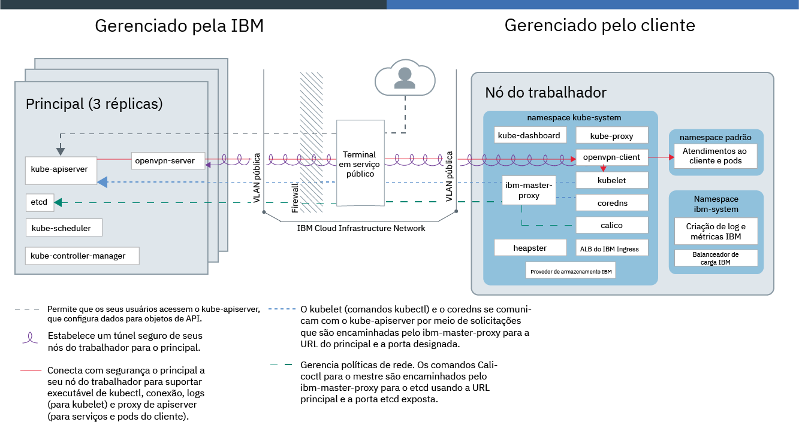
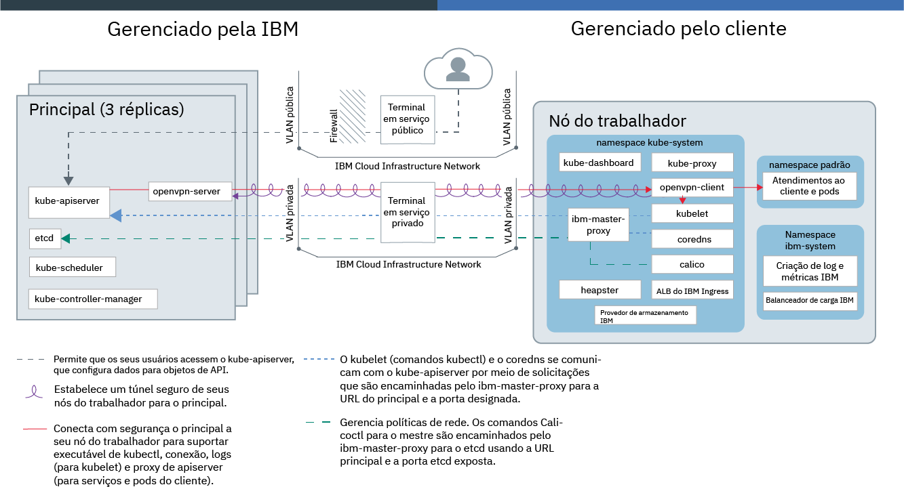

---

copyright:
  years: 2014, 2019
lastupdated: "2019-06-12"

keywords: kubernetes, iks, docker

subcollection: containers

---

{:new_window: target="_blank"}
{:shortdesc: .shortdesc}
{:screen: .screen}
{:pre: .pre}
{:table: .aria-labeledby="caption"}
{:codeblock: .codeblock}
{:tip: .tip}
{:note: .note}
{:important: .important}
{:deprecated: .deprecated}
{:download: .download}
{:preview: .preview}

# Tecnologia do {{site.data.keyword.containerlong_notm}}

Saiba mais sobre a tecnologia por trás do {{site.data.keyword.containerlong}}.
{:shortdesc}

## Contêineres do Docker
{: #docker_containers}

Construído sobre a tecnologia Linux container (LXC) existente, o projeto de software livre denominado Docker definiu modelos sobre como empacotar o software em unidades padronizadas, chamadas contêineres, que incluem todos os elementos que um app precisa para ser executado. O {{site.data.keyword.containerlong_notm}} usa o `containerd` como um tempo de execução de contêiner para implementar contêineres de imagens de contêiner do Docker em seu cluster.
{:shortdesc}

Aprenda alguns conceitos básicos do Docker:

<dl>
<dt>Image</dt>
<dd>Uma imagem de contêiner é a base para cada contêiner que você deseja executar. As imagens de contêiner são construídas por meio de um Dockerfile, um arquivo de texto que define como construir a imagem e quais artefatos de construção incluir nele, como o app, a configuração do app e suas dependências. As imagens sempre são construídas usando outras imagens, tornando-as rápidas de serem configuradas. Deixe alguém fazer a maior parte do trabalho em uma imagem e, em seguida, ajuste-a para seu uso.</dd>
<dt>Registro</dt>
<dd>Um registro de imagem é um local para armazenar, recuperar e compartilhar imagens de contêiner. As imagens que são armazenadas em um registro podem estar publicamente disponíveis (registro público) ou acessíveis por um pequeno grupo de usuários (registro privado). O {{site.data.keyword.containerlong_notm}} oferece imagens públicas, como o ibmliberty, que podem ser usadas para criar seu primeiro app conteinerizado. Quando se trata de aplicativos corporativos, use um registro privado como aquele que é fornecido no {{site.data.keyword.Bluemix_notm}} para proteger suas imagens de serem usadas por usuários não autorizados.
</dd>
<dt>Contêiner</dt>
<dd>Cada contêiner é criado de uma imagem. Um contêiner é um app empacotado com todas as suas dependências, para que o app possa ser movido entre ambientes e ser executado sem mudanças. Ao contrário de máquinas virtuais, os contêineres não virtualizam um dispositivo, seu sistema operacional e o hardware subjacente. Somente o código de app, o tempo de execução,
as ferramentas de sistema, as bibliotecas e as configurações são empacotadas dentro do contêiner. Os contêineres são executados como processos isolados em hosts de cálculo do Ubuntu e compartilham o sistema operacional do host e seus recursos de hardware. Essa abordagem torna um contêiner mais leve, móvel e eficiente do que
uma máquina virtual.</dd>
</dl>

### Benefícios chave do uso de contêineres
{: #container_benefits}

<dl>
<dt>Contêineres são ágeis</dt>
<dd>Os contêineres simplificam a administração do sistema, fornecendo ambientes padronizados para as implementações de desenvolvimento e de produção. Um tempo de execução leve permite aumentar e diminuir rapidamente a capacidade de implementações. Remova a complexidade do gerenciamento de diferentes plataformas de sistema operacional e suas infraestruturas subjacentes, usando contêineres para ajudá-lo a implementar e executar qualquer app em qualquer infraestrutura, de modo rápido e confiável.</dd>
<dt>Contêineres são pequenos</dt>
<dd>É possível ajustar vários contêineres na quantia de espaço que uma única máquina virtual requer.</dd>
<dt>Contêineres são móveis</dt>
<dd>
<ul>
  <li>Reutilize fragmentos de imagens para construir contêineres. </li>
  <li>Mova o código do app rapidamente do ambiente de preparação para o de produção.</li>
  <li>Automatize seus processos com ferramentas de entrega contínua.</li>
  </ul>
  </dd>

Saiba mais sobre [como proteger suas informações pessoais](/docs/containers?topic=containers-security#pi) quando trabalhar com imagens de contêiner.

Pronto para obter um conhecimento mais profundo do Docker? <a href="https://developer.ibm.com/courses/all/docker-essentials-a-developer-introduction/" target="_blank">Saiba como o Docker e o {{site.data.keyword.containerlong_notm}} trabalham juntos concluindo este curso.</a>

</dl>

 

## Clusters do Kubernetes
{: #kubernetes_basics}

O projeto de software livre chamado Kubernetes combina a execução de uma infraestrutura conteinerizada com cargas de trabalho de produção, contribuições de software livre e ferramentas de gerenciamento de contêiner do Docker. A infraestrutura do Kubernetes fornece uma plataforma de app isolado e seguro para gerenciar contêineres que são móveis, extensíveis e com capacidade de recuperação automática em caso de failovers.
{:shortdesc}

Aprenda alguns conceitos básicos do Kubernetes conforme mostrado no diagrama a seguir.

<dl>
<dt>Conta</dt>
<dd>Sua conta refere-se à sua conta do {{site.data.keyword.Bluemix_notm}}.</dd>

<dt>Grupo</dt>
<dd>Um cluster do Kubernetes consiste em uma ou mais hosts de cálculo que são chamadas nós do trabalhador. Os nós do trabalhador são gerenciados por um mestre do Kubernetes que controla e monitora centralmente todos os recursos
do Kubernetes no cluster. Então quando você implementa os recursos para um app conteinerizado, o mestre do Kubernetes decide em qual nó do trabalhador implementar esses recursos, levando em consideração os requisitos de implementação e a capacidade disponível no cluster. Os recursos do Kubernetes incluem serviços, implementações e pods.</dd>

<dt>Serviço</dt>
<dd>Um serviço é um recurso do Kubernetes que agrupa um conjunto de pods e fornece conectividade de rede a esses pods, sem expor o endereço IP privado real de cada pod. É possível
usar um serviço para tornar seu app disponível no cluster ou na Internet pública.
</dd>

<dt>Implementação</dt>
<dd>Uma implementação é um recurso do Kubernetes em que se pode especificar informações sobre outros recursos ou habilidades que são necessários para executar seu app, tais como serviços, armazenamento persistente ou anotações. Você documenta uma implementação em um arquivo YAML de configuração e, depois, aplica ao cluster. O mestre do Kubernetes configura os recursos e implementa os contêineres em pods nos nós do trabalhador com capacidade disponível.
  
Defina estratégias de atualização para seu aplicativo, incluindo o número de pods que deseja incluir durante uma atualização contínua e o número de pods que podem estar indisponíveis por vez. Quando você executar a uma atualização contínua, a implementação verificará se a atualização está funcionando e parará o lançamento quando falhas forem detectadas.</dd>

<dt>Pod</dt>
<dd>Cada app conteinerizado implementado em um cluster é implementado, executado e gerenciado por um recurso do Kubernetes que é chamado de pod. Os pods representam pequenas unidades implementáveis em um cluster do Kubernetes e são usados para agrupar os contêineres que devem ser tratados como uma unidade única. Na maioria dos casos, cada contêiner é implementado em seu próprio pod. No entanto, um app pode requerer que um contêiner e outros contêineres auxiliares sejam implementados em um pod para que esses contêineres possam ser direcionados usando o mesmo endereço IP privado.</dd>

<dt>App</dt>
<dd>Um app pode se referir a um app completo ou um componente de um app. Você pode implementar componentes de um app em pods separados ou nós do trabalhador separados.</dd>

Saiba mais sobre [como proteger suas informações pessoais](/docs/containers?topic=containers-security#pi) quando trabalhar com recursos do Kubernetes.

Pronto para obter um conhecimento mais profundo do Kubernetes?

<ul><li><a href="/docs/containers?topic=containers-cs_cluster_tutorial#cs_cluster_tutorial" target="_blank">Expanda seu conhecimento de terminologia com o tutorial Criando clusters</a>.</li>
<li><a href="https://developer.ibm.com/courses/all/container-kubernetes-essentials-with-ibm-cloud/" target="_blank">Saiba como o Kubernetes e o {{site.data.keyword.containerlong_notm}} trabalham juntos concluindo este curso.</a></li></ul>

</dl>

 

## Arquitetura de serviço
{: #architecture}

Em um cluster do Kubernetes que é executado no {{site.data.keyword.containerlong_notm}}, seus apps conteinerizados são hospedados em hosts de cálculo que são chamados de nós do trabalhador. Para ser mais específico, os apps são executados em pods e os pods são hospedados em nós do trabalhador. Os nós do trabalhador são gerenciados pelo mestre do Kubernetes. A configuração de comunicação entre o mestre do Kubernetes e os nós do trabalhador depende de como você configura a rede da infraestrutura do IBM Cloud (SoftLayer): uma conta com um terminal em serviço público ou uma conta ativada para VRF com terminais em serviço públicos e privados.
{: shortdesc}

A imagem a seguir mostra os componentes de seu cluster e como eles interagem em uma conta quando apenas o [terminal em serviço público está ativado](/docs/containers?topic=containers-plan_clusters#workeruser-master).

<figure>
 
 <figcaption>{{site.data.keyword.containerlong_notm}} arquitetura quando apenas o terminal em serviço público está ativado</figcaption>
</figure>

A imagem a seguir mostra os componentes de seu cluster e como eles interagem em uma conta ativada para VRF quando os [terminais em serviço público e privado são ativados](/docs/containers?topic=containers-plan_clusters#workeruser-master).

<figure>
 
 <figcaption>{{site.data.keyword.containerlong_notm}} arquitetura quando os terminais em serviço público e privado são ativados</figcaption>
</figure>

Qual é a diferença entre o mestre do Kubernetes e um nó do trabalhador? Feliz por perguntar.

<dl>
  <dt>Mestre do Kubernetes</dt>
    <dd>O mestre do Kubernetes é encarregado de gerenciar todos os recursos de cálculo, rede e armazenamento no cluster. O mestre do Kubernetes assegura que seus apps e serviços conteinerizados sejam igualmente implementados nos nós do trabalhador no cluster. Dependendo de como você configura seu aplicativo e serviços, o principal determina o nó do trabalhador que possui recursos suficientes para atender aos requisitos do aplicativo.  A tabela a seguir descreve os componentes do principal do Kubernetes.
    <table>
    <caption>Componentes do mestre do Kubernetes</caption>
    <thead>
    <th>Componente principal</th>
    <th>Descrição</th>
    </thead>
    <tbody>
    <tr>
    <td>kube-apiserver</td>
    <td>O servidor de API do Kubernetes serve como o ponto de entrada principal para todas as solicitações de gerenciamento de cluster do nó do trabalhador para o mestre do Kubernetes. O servidor de API do Kubernetes valida e processa as solicitações que mudam o estado de recursos do Kubernetes, como pods ou serviços, e armazena esse estado em etcd.</td>
    </tr>
    <tr>
    <td>openvpn-server</td>
    <td>O servidor OpenVPN funciona com o cliente OpenVPN para conectar com segurança o mestre ao nó do trabalhador. Essa conexão suporta chamadas `apiserver proxy` para seus pods e serviços e chamadas `kubectl exec`, `attach` e `logs` para o kubelet.</td>
    </tr>
    <tr>
    <td>etcd</td>
    <td>etcd é um armazenamento de valores de chaves altamente disponível que armazena o estado de todos os recursos do Kubernetes de um cluster, como serviços, implementações e pods. Os dados em etcd são submetidos a backup para uma instância de armazenamento criptografada que a IBM gerencia.</td>
    </tr>
    <tr>
    <td>kube-scheduler</td>
    <td>O planejador do Kubernetes observa os pods recém-criados e decide onde implementá-los com base na capacidade, nas necessidades de desempenho, nas restrições de política, nas especificações de antiafinidade e nos requisitos de carga de trabalho. Se não puder ser localizado nenhum nó do trabalhador que corresponda aos requisitos, o pod não será implementado
no cluster.</td>
    </tr>
    <tr>
    <td>kube-controller-manager</td>
    <td>O gerenciador de controlador do Kubernetes é um daemon que observa o estado de recursos de cluster, como conjuntos de réplicas. Quando o estado de um recurso for alterado, por exemplo, se um pod em um conjunto de réplicas ficar inativo, o gerenciador do controlador iniciará as ações de correção para atingir o estado necessário.</td>
    </tr>
    </tbody></table></dd>
  <dt>Nó do trabalhador</dt>
    <dd>Cada nó do trabalhador é uma máquina física (bare metal) ou uma máquina virtual que é executada em hardware físico no ambiente de nuvem. Ao provisionar um nó do trabalhador, você determina os recursos que estão disponíveis para os contêineres hospedados nesse nó do trabalhador. Prontos para utilização, os nós do trabalhador são configurados com um mecanismo de Docker gerenciado pela {{site.data.keyword.IBM_notm}}, recursos de cálculo separados, rede e um serviço de volume. Os recursos integrados de segurança fornecem isolamento, gerenciamento de recursos e conformidade de segurança do nó do trabalhador.  
A modificação de componentes do nó do trabalhador padrão, como `kubelet`, não é suportada e pode causar resultados inesperados.
A tabela a seguir descreve os componentes de um nó do trabalhador.
    <table>
    <caption>Componentes de nós do trabalhador</caption>
    <thead>
    <th>Componente do Worker</th>
    <th>Namespace</th>
    <th>Descrição</th>
    </thead>
    <tbody>
    <tr>
    <td>`ibm-master-proxy`</td>
    <td>kube-system</td>
    <td>O `ibm-master-proxy` encaminha solicitações do nó do trabalhador para os endereços IP das réplicas principais altamente disponíveis. Em clusters de zona única, o principal tem três réplicas em hosts separados com um endereço IP principal e um nome de domínio. Para clusters que estão em uma zona com capacidade para várias zonas, o mestre tem três réplicas que são difundidas entre as zonas. Dessa forma, cada mestre tem seu próprio endereço IP que é registrado com o DNS, com um nome de domínio para o cluster mestre inteiro.</td>
    </tr>
    <tr>
    <td>`openvpn-client`</td>
    <td>kube-system</td>
    <td>O cliente OpenVPN trabalha com o servidor OpenVPN para conectar com segurança o mestre ao nó do trabalhador. Essa conexão suporta chamadas `apiserver proxy` para seus pods e serviços e chamadas `kubectl exec`, `attach` e `logs` para o kubelet.</td>
    </tr>
    <tr>
    <td>`kubelet`</td>
    <td>kube-system</td>
    <td>O kubelet é um pod que é executado em cada nó do trabalhador e é responsável por monitorar o funcionamento de pods que são executados no nó do trabalhador e por observar os eventos que o servidor de API do Kubernetes envia. Com base nos eventos, o kubelet cria ou remove pods, assegura as análises de vivacidade e prontidão e relata de volta o status dos pods para o servidor de API do Kubernetes.</td>
    </tr>
    <tr>
    <td>`coredns`</td>
    <td>kube-system</td>
    <td>Por padrão, o Kubernetes planeja um pod CoreDNS (ou pod KubeDNS na versão 1.12 e anterior) e um serviço no cluster. Os contêineres usam automaticamente o IP do serviço DNS para resolver nomes do DNS em suas procuras para outros pods e serviços.</td>
    </tr>
    <tr>
    <td>`calico`</td>
    <td>kube-system</td>
    <td>O Calico gerencia políticas de rede para seu cluster e compreende alguns componentes conforme a seguir.
    <ul>
    <li>**`calico-cni`**: a interface de rede de contêiner do Calico (CNI) gerencia a conectividade de rede de contêineres e remove os recursos alocados quando um contêiner é excluído.</li>
    <li>**`calico-ipam`**: o Calico IPAM gerencia a designação de endereço IP para contêineres.</li>
    <li>**`calico-node`**: o nó do Calico é um contêiner que agrupa os vários componentes necessários para contêineres de rede com o Calico.</li>
    <li>**`calico-policy-controller`**: o controlador de política do Calico observa o tráfego de rede de entrada e de saída para conformidade com as políticas de rede configuradas. Se o tráfego não for permitido no cluster, o acesso ao cluster será bloqueado. O controlador de política do Calico também é usado para criar e configurar políticas de rede para um cluster.</li></ul></td>
    </tr>
    <tr>
    <td>`kube-proxy`</td>
    <td>kube-system</td>
    <td>O proxy de rede do Kubernetes é um daemon que é executado em cada nó do trabalhador e que encaminha ou balanceia a carga do tráfego de rede TCP e UDP para serviços que são executados no cluster.</td>
    </tr>
    <tr>
    <td>`kube-dashboard`</td>
    <td>kube-system</td>
    <td>O painel do Kubernetes é uma GUI baseada na web que permite que os usuários gerenciem e solucionem problemas do cluster e aplicativos em execução no cluster.</td>
    </tr>
    <tr>
    <td>`heapster`</td>
    <td>kube-system</td>
    <td>O Heapster é um agregador em todo o cluster de monitoramento e dados do evento. O pod Heapster descobre todos os nós no cluster e consulta as informações de uso do kubelet de cada nó. É possível localizar gráficos de utilização no painel do Kubernetes.</td>
    </tr>
    <tr>
    <td>ALB do Ingress</td>
    <td>kube-system</td>
    <td>O Ingresso é um serviço do Kubernetes que pode ser usado para balancear cargas de trabalho do tráfego de rede em seu cluster, encaminhando solicitações públicas ou privadas para múltiplos apps em seu cluster. Para expor seus apps por meio da rede pública ou privada, deve-se criar um recurso Ingresso para registrar seus apps com o balanceador de carga do aplicativo (ALB) de ingresso. Múltiplos apps podem então ser acessados usando uma única URL ou endereço IP.</td>
    </tr>
    <tr>
    <td>Provedor de armazenamento</td>
    <td>kube-system</td>
    <td>Cada cluster é configurado com um plug-in para provisionar armazenamento de arquivo. É possível escolher instalar outros complementos, como armazenamento de bloco.</td>
    </tr>
    <tr>
    <td>Criação de Log e Métricas</td>
    <td>ibm-system</td>
    <td>É possível usar os serviços integrados {{site.data.keyword.loganalysislong_notm}} e {{site.data.keyword.monitoringlong_notm}} para expandir seus recursos de coleção e retenção ao trabalhar com logs e métricas.</td>
    </tr>
    <tr>
    <td>Equilibrador de carga</td>
    <td>ibm-system</td>
    <td>Um balanceador de carga é um serviço do Kubernetes que pode ser usado para balancear as cargas de trabalho de tráfego de rede em seu cluster, encaminhando solicitações públicas ou privadas para um app.</td>
    </tr>
    <tr>
    <td>Pods e serviços de app</td>
    <td>padrão</td>
    <td>No namespace <code>default</code> ou em namespaces que você cria, é possível implementar apps em pods e serviços para se comunicar com esses pods.</td>
    </tr>
    </tbody></table></dd>
</dl>

Quer ver como o {{site.data.keyword.containerlong_notm}} pode ser usado com outros produtos e serviços? Confira algumas das [integrações](/docs/containers?topic=containers-supported_integrations#supported_integrations).
{: tip}

## Limitações de serviço
{: #tech_limits}

O {{site.data.keyword.containerlong_notm}} e o projeto de software livre do Kubernetes vêm com as configurações de serviço padrão e limitações para assegurar a segurança, a conveniência e a funcionalidade básica. Algumas das limitações você pode ser capaz de mudar onde anotado. Se você espera atingir as limitações do {{site.data.keyword.containerlong_notm}} a seguir, entre em contato com a equipe da IBM no [Slack interno ](https://ibm-argonauts.slack.com/messages/C4S4NUCB1) ou [externo ](https://ibm-container-service.slack.com).
{: shortdesc}

<table summary="Esta tabela contém informações sobre as limitações do {{site.data.keyword.containerlong_notm}}. As colunas são lidas da esquerda para a direita. Na primeira coluna está o tipo de limitação e, na segunda coluna, está a descrição da limitação.">
<caption>Limitações do {{site.data.keyword.containerlong_notm}}</caption>
<thead>
  <tr>
    <th>Tipo</th>
    <th>Descrição</th>
  </tr>
</thead>
<tbody>
  <tr>
    <td>Limites de taxa de API</td>
    <td>100 solicitações por 10 segundos para a API do {{site.data.keyword.containerlong_notm}} para cada endereço IP de origem exclusivo.</td>
  </tr>
  <tr>
    <td>Capacidade de nó do trabalhador</td>
    <td>Os nós do trabalhador estão disponíveis em [selecionar tipos](/docs/containers?topic=containers-planning_worker_nodes#shared_dedicated_node) de recursos de cálculo.</td>
  </tr>
  <tr>
    <td>Acesso ao host do nó do trabalhador</td>
    <td>Por segurança, não é possível usar SSH para o host de cálculo do nó do trabalhador.</td>
  </tr>
  <tr>
    <td>Número máximo de nós do trabalhador</td>
    <td>Se você planejar exceder 900 por cluster, entre em contato com a equipe da IBM no [Slack interno ](https://ibm-argonauts.slack.com/messages/C4S4NUCB1) ou [externo ](https://ibm-container-service.slack.com) primeiro.  Se você vir um limite de capacidade da infraestrutura do IBM Cloud (SoftLayer) no número de instâncias por data center ou que são ordenadas a cada mês, entre em contato com seu representante de infraestrutura do IBM Cloud (SoftLayer).</td>
  </tr>
  <tr>
    <td>Número máximo de pods</td>
    <td>110 por nó do trabalhador.  O número de pods inclui os pods `kube-system` e `ibm-system` que são executados no nó do trabalhador. Para melhor desempenho, considere limitar o número de pods que você executa por núcleo de cálculo para que não use em excesso o nó do trabalhador. Por exemplo, em um nó do trabalhador com um tipo `b3c.4x16`, é possível executar 10 pods por núcleo que usam não mais que 75% da capacidade total do nó do trabalhador.</td>
  </tr>
  <tr>
    <td>Número máximo de serviços do Kubernetes</td>
    <td>65.000 IPs por cluster no intervalo de 172.21.0.0/16 que é possível designar aos serviços do Kubernetes no cluster.</td>
  </tr>
  <tr>
    <td>Tráfego do balanceador de carga do aplicativo (ALB) do Ingress</td>
    <td>32.768 conexões por segundo.  Se o tráfego de ingresso exceder esse número, [aumente a escala do número de réplicas do ALB](/docs/containers?topic=containers-ingress#scale_albs) em seu cluster para manipular o aumento da carga de trabalho.</td>
  </tr>
  <tr>
    <td>Volumes de armazenamento</td>
    <td>Total combinado de 250 volumes do arquivo de infraestrutura do IBM Cloud (SoftLayer) e instâncias de armazenamento de bloco por conta.  Se você montar mais do que essa quantia, poderá ver uma mensagem de "falta de capacidade" quando provisionar volumes persistentes e precisará entrar em contato com o representante de infraestrutura do IBM Cloud (SoftLayer). Para ver mais perguntas mais frequentes, consulte os docs de armazenamento de [arquivo](/docs/infrastructure/FileStorage?topic=FileStorage-file-storage-faqs#how-many-volumes-can-i-provision-) e [bloco](/docs/infrastructure/BlockStorage?topic=BlockStorage-block-storage-faqs#how-many-instances-can-share-the-use-of-a-block-storage-volume-).</td>
  </tr>
</tbody>
</table>
