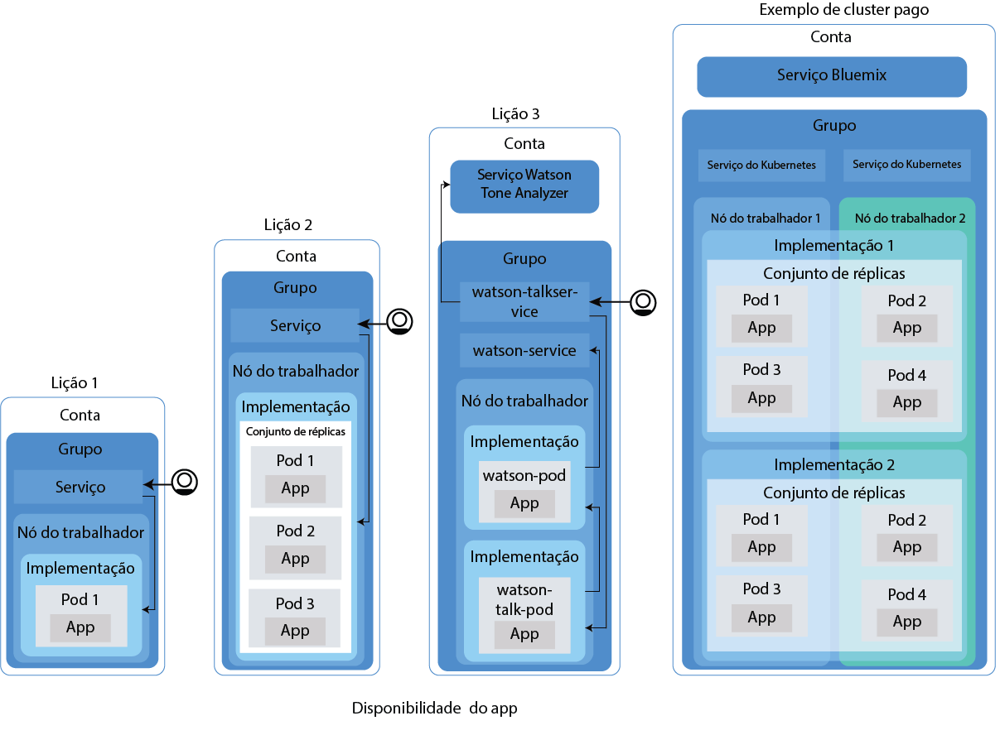
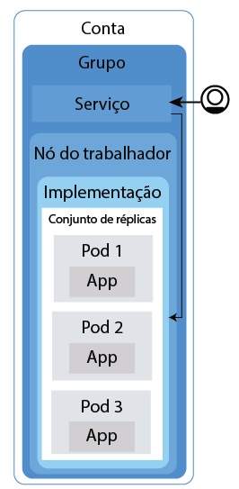
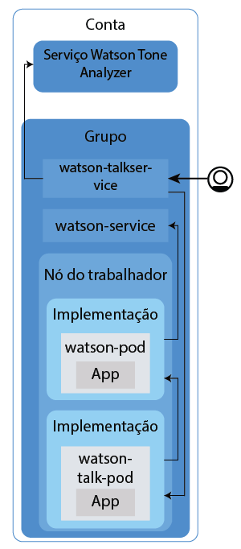

---

copyright:
  years: 2014, 2017
lastupdated: "2017-11-14"

---

{:new_window: target="blank"}
{:shortdesc: .shortdesc}
{:screen: .screen}
{:pre: .pre}
{:table: .aria-labeledby="caption"}
{:codeblock: .codeblock}
{:tip: .tip}
{:download: .download}


# Tutorial: implementando apps em clusters
{: #cs_apps_tutorial}

Este segundo tutorial continua ensinando como é possível usar o Kubernetes para implementar um app conteinerizado que alavanca o serviço {{site.data.keyword.watson}} {{site.data.keyword.toneanalyzershort}} do {{site.data.keyword.Bluemix_notm}}. Uma firma PR fictícia usa o {{site.data.keyword.watson}} para analisar seus press releases e receber feedback sobre o sinal em suas mensagens.
{:shortdesc}

Neste cenário, o desenvolvedor de app da firma PR implementa uma versão Hello World do app no cluster do Kubernetes que o administrador da rede criou no [primeiro tutorial](cs_tutorials.html#cs_cluster_tutorial).

Cada lição ensina como implementar versões progressivamente mais complicadas do mesmo app. O diagrama a seguir mostra os componentes do tutorial das implementações do app, exceto a quarta parte.



Conforme descrito no diagrama, o Kubernetes usa vários tipos diferentes de recursos para deixar seus apps funcionando em clusters. No Kubernetes, as implementações e os serviços funcionam juntos. As implementações incluem as definições para o
app, por exemplo, a imagem a ser usada para o contêiner e qual porta deve ser exposta para o app.
Ao criar uma implementação, um pod do Kubernetes será criado para cada contêiner que você definiu na
implementação. Para tornar seu app mais resiliente, é possível definir múltiplas instâncias do mesmo app em sua implementação e permitir que o Kubernetes crie automaticamente um conjunto de réplicas para você. O conjunto de réplicas monitora os pods e assegura que o número desejado de pods esteja funcionando sempre. Se um dos pods tornar-se não responsivo, o pod será recriado automaticamente.

Os serviços agrupam um conjunto de cápsulas e fornecem conexão de rede a esses pods para outros serviços no cluster sem expor o endereço IP privado real de cada pod. É possível usar os serviços do Kubernetes para tornar um app disponível para outros pods dentro do cluster ou para expor um app na Internet. Neste tutorial, você usará um serviço do Kubernetes para acessar seu app em execução na Internet usando um endereço IP público que é designado automaticamente a um nó do trabalhador e uma porta pública.

Para tornar seu app ainda mais altamente disponível, em clusters padrão, é possível criar múltiplos nós do trabalhador para executar ainda mais réplicas de seu app. Essa tarefa não é coberta neste tutorial, mas mantenha esse conceito em mente para melhorias futuras na disponibilidade de um app.

Somente uma das lições inclui a integração de um serviço do {{site.data.keyword.Bluemix_notm}} em um app, mas é possível usá-las com um app tão simples ou complexo quanto se possa imaginar.

## Objetivos

* Entender a terminologia básica do Kubernetes
* Enviar por push uma imagem para o namespace de seu registro no {{site.data.keyword.registryshort_notm}}
* Tornar um app publicamente acessível
* Implementar uma única instância de um app em um cluster usando um comando do Kubernetes e um script
* Implementar múltiplas instâncias de um app em contêineres que são recriados durante as verificações de funcionamento
* Implementar um app que use a funcionalidade de um serviço do {{site.data.keyword.Bluemix_notm}}

## Tempo Necessário

40
minutos

## Públicos

Desenvolvedores de software e administradores da rede que nunca implementaram um app em um cluster do Kubernetes antes.

## Pré-requisitos

[Tutorial: criando clusters do Kubernetes no {{site.data.keyword.containershort_notm}}](cs_tutorials.html#cs_cluster_tutorial).

## Lição 1: implementando apps de instância única em clusters do Kubernetes
{: #cs_apps_tutorial_lesson1}

Nesta lição, você implementa uma instância única do app Hello World em um
cluster. O diagrama a seguir inclui os componentes que você implementa concluindo esta lição.
{:shortdesc}


No tutorial anterior, você já tem uma conta e um cluster com um nó do trabalhador. Nesta lição, você configura uma implementação e implementa o app Hello World em um pod do Kubernetes no nó do trabalhador. Para torná-lo publicamente disponível, você cria um serviço do Kubernetes.


1.  Efetue login na CLI do {{site.data.keyword.Bluemix_notm}}. Insira suas credenciais do {{site.data.keyword.Bluemix_notm}} quando solicitadas. Para especificar uma região do {{site.data.keyword.Bluemix_notm}}, [inclua o terminal de API](cs_regions.html#bluemix_regions).

    ```
    bx login
    ```
    {: pre}

    **Nota:** se você tiver um ID federado, use `bx login --sso` para efetuar login na CLI do {{site.data.keyword.Bluemix_notm}}. Insira seu nome do usuário e use a URL fornecida na saída da CLI para recuperar sua senha descartável. Você sabe que tem um ID federado quando o login falha sem a opção `--sso` e é bem-sucedido com a opção `--sso`.

2.  Configure o contexto para o cluster em sua CLI.
    1.  Obtenha o comando para configurar a variável de ambiente e fazer download dos arquivos de configuração do Kubernetes.

        ```
        bx cs cluster-config <pr_firm_cluster>
        ```
        {: pre}

        Quando o download dos arquivos de configuração estiver concluído, será exibido um comando que poderá ser usado para configurar o caminho para o seu arquivo de configuração local do Kubernetes como uma variável de ambiente.

        Exemplo para OS X:

        ```
        export KUBECONFIG=/Users/<user_name>/.bluemix/plugins/container-service/clusters/<pr_firm_cluster>/kube-config-prod-dal10-pr_firm_cluster.yml
        ```
        {: screen}

    2.  Copie e cole o comando que é exibido em seu terminal para configurar a variável de ambiente `KUBECONFIG`.
    3.  Verifique se a variável de ambiente `KUBECONFIG` está configurada corretamente.

        Exemplo para OS X:

        ```
        echo $KUBECONFIG
        ```
        {: pre}

        Saída:

        ```
        /Users/<user_name>/.bluemix/plugins/container-service/clusters/<pr_firm_cluster>/kube-config-prod-dal10-pr_firm_cluster.yml
        ```
        {: screen}

    4.  Verifique se os comandos `kubectl` são executados adequadamente com seu cluster verificando a versão do servidor de CLI do Kubernetes.

        ```
        kubectl version  --short
        ```
        {: pre}

        Saída de exemplo:

        ```
        Versão do cliente: v1.7.4 Versão do servidor: v1.7.4
        ```
        {: screen}

3.  Inicie o Docker.
    * Se você estiver usando o Docker CE, nenhuma ação será necessária.
    * Se você estiver usando o Linux, siga a [documentação do Docker ](https://docs.docker.com/engine/admin/) para localizar instruções sobre como iniciar o Docker, dependendo da distribuição Linux usada.
    * Se estiver usando o Docker Toolbox no Windows ou OSX, será possível usar o Docker Quickstart Terminal, que inicia o Docker para você. Use o Docker Quickstart Terminal nas próximas etapas para executar os comandos do Docker e, em seguida, altere novamente para a CLI na qual a variável de sessão `KUBECONFIG` é configurada.
        * Se você estiver usando o Docker QuickStart Terminal, execute o comando de login do {{site.data.keyword.Bluemix_notm}} CLI novamente.

          ```
          bx login
          ```
          {: pre}

4.  Efetue login na CLI do {{site.data.keyword.registryshort_notm}}. **Nota**: assegure-se de que você tenha o plug-in de registro de contêiner [instalado](/docs/services/Registry/index.html#registry_cli_install).

    ```
    bx cr login
    ```
    {: pre}

    -   Se você esqueceu o seu namespace no {{site.data.keyword.registryshort_notm}}, execute o comando a seguir.

        ```
        bx cr namespace-list
        ```
        {: pre}

5.  Clone ou faça download do código-fonte do [app Hello world ](https://github.com/Osthanes/container-service-getting-started-wt) para o diretório inicial do usuário.

    ```
    git clone https://github.com/Osthanes/container-service-getting-started-wt.git
    ```
    {: pre}

    Se o repositório foi transferido por download, extraia o arquivo compactado.

    Exemplos:

    * Windows: `C:Users\<my_username>\container-service-getting-started-wt`
    * OS X: `/Users/<my_username>/container-service-getting-started-wt`

    O repositório contém três versões de um app semelhante em pastas chamadas `Stage1`, `Stage2` e `Stage3`. Cada versão contém os arquivos a seguir:
    * `Dockerfile`: as definições de construção para a imagem
    * `app.js`: o app Hello World
    * `package.json`: metadados sobre o app

6.  Navegue para o primeiro diretório de aplicativos, `Stage1`.

    ```
    cd <username_home_directory>/container-service-getting-started-wt/Stage1
    ```
    {: pre}

7.  Construa uma imagem do Docker que inclua os arquivos de app do diretório `Stage1`. Caso seja necessário fazer uma mudança no app no futuro, repita estas etapas para criar outra versão da imagem.

    1.  Construa a imagem localmente e identifique-a com o nome e a tag que você deseja usar e o namespace que você criou em {{site.data.keyword.registryshort_notm}} no tutorial anterior. Identificar a imagem com as informações de namespace indica ao Docker para onde enviar por push a imagem em uma etapa posterior. Use caracteres alfanuméricos minúsculos ou sublinhados (`_`) somente no nome da imagem. Não esqueça o ponto (`.`) no final do comando. O ponto indica ao Docker para verificar dentro do diretório atual para o Dockerfile e construir artefatos para construir a imagem.

        ```
        docker build -t registry.<region>.bluemix.net/<namespace>/hello-world:1 .
        ```
        {: pre}

        Quando a construção estiver completa, verifique se você vê a mensagem de êxito.

        ```
        Successfully built <image_id>
        ```
        {: screen}

    2.  Envie por push a imagem para o seu namespace de registro.

        ```
        docker push registry.<region>.bluemix.net/<namespace>/hello-world:1
        ```
        {: pre}

        Saída:

        ```
        The push refers to a repository [registry.<region>.bluemix.net/<namespace>/hello-world]
        ea2ded433ac8: Pushed
        894eb973f4d3: Pushed
        788906ca2c7e: Pushed
        381c97ba7dc3: Pushed
        604c78617f34: Pushed
        fa18e5ffd316: Pushed
        0a5e2b2ddeaa: Pushed
        53c779688d06: Pushed
        60a0858edcd5: Pushed
        b6ca02dfe5e6: Pushed
        1: digest: sha256:0d90cb73288113bde441ae9b8901204c212c8980d6283fbc2ae5d7cf652405
        43 size: 2398
        ```
        {: screen}

        Espere a imagem ser enviada por push antes de continuar para a próxima etapa.

    3.  Se você estiver usando o Docker Quickstart Terminal, alterne de volta para a CLI que foi usada para configurar a variável de sessão `KUBECONFIG`.

    4.  Verifique se a imagem foi incluída com êxito em seu namespace.

        ```
        bx cr images
        ```
        {: pre}

        Saída:

        ```
        Listing images...

        REPOSITORY                                  NAMESPACE   TAG       DIGEST         CREATED        SIZE     VULNERABILITY STATUS
        registry.<region>.bluemix.net/<namespace>/hello-world   <namespace>   1   0d90cb732881   1 minute ago   264 MB   OK
        ```
        {: screen}

8.  Crie uma implementação do Kubernetes denominada _hello-world-deployment_ para implementar o app em um pod em seu cluster. As implementações são usadas para gerenciar pods, que incluem instâncias conteinerizadas de um app. A
implementação a seguir implementa o app em um único pod.

    ```
    kubectl run hello-world-deployment --image=registry.<region>.bluemix.net/<namespace>/hello-world:1
    ```
    {: pre}

    Saída:

    ```
    deployment "hello-world-deployment" created
    ```
    {: screen}

    Como essa implementação cria somente uma instância do app, a implementação cria mais rapidamente do que em lições posteriores em que mais de uma instância do app é criada.

9.  Torne o app acessível ao mundo expondo a implementação como um serviço NodePort. Os serviços aplicam a rede para o app. Como o cluster tem um nó do trabalhador em vez de
vários, o balanceamento de carga entre os nós do trabalhador não é necessário. Portanto, um NodePort pode ser usado para
fornecer aos usuários acesso externo ao app. Assim como você pode expor uma porta para um app Cloud Foundry,
o NodePort exposto é a porta na qual o nó do trabalhador atende o tráfego. Em uma etapa posterior, você verá qual NodePort foi designado aleatoriamente ao serviço.

    ```
    kubectl expose deployment/hello-world-deployment --type=NodePort --port=8080 --name=hello-world-service --target-port=8080
    ```
    {: pre}

    Saída:

    ```
    service "hello-world-service" exposed
    ```
    {: screen}

    <table>
    <table summary=“Information about the expose command parameters.”>
    <caption>Tabela 1. Parâmetros de comando</caption>
    <thead>
    <th colspan=2> Mais sobre os parâmetros de exposição</th>
    </thead>
    <tbody>
    <tr>
    <td><code>expose</code></td>
    <td>Exponha um recurso como um serviço do Kubernetes e disponibilize-o publicamente para os usuários.</td>
    </tr>
    <tr>
    <td><code>deployment/<em>&lt;hello-world-deployment&gt;</em></code></td>
    <td>O tipo de recurso e o nome do recurso a serem expostos com este serviço.</td>
    </tr>
    <tr>
    <td><code>--name=<em>&lt;hello-world-service&gt;</em></code></td>
    <td>O nome do serviço.</td>
    </tr>
    <tr>
    <td><code>--port=<em>&lt;8080&gt;</em></code></td>
    <td>A porta na qual o serviço deve entregar.</td>
    </tr>
    <tr>
    <td><code>--type=NodePort</code></td>
    <td>O tipo de serviço a ser criado.</td>
    </tr>
    <tr>
    <td><code>--target-port=<em>&lt;8080&gt;</em></code></td>
    <td>A porta para a qual o serviço direciona o tráfego. Nessa instância, a porta de destino é a mesma que a porta, mas outros apps que você criar poderão diferir.</td>
    </tr>
    </tbody></table>

    Agora que todo o trabalho de implementação está pronto, é possível ver como tudo terminou.

10. Para testar seu app em um navegador, obtenha os detalhes para formar a URL.
    1.  Obtenha informações sobre o serviço para ver qual NodePort foi designado.

        ```
        kubectl describe service <hello-world-service>
        ```
        {: pre}

        Saída:

        ```
        Name:                   hello-world-service
        Namespace:              default
        Labels:                 run=hello-world-deployment
        Selector:               run=hello-world-deployment
        Type:                   NodePort
        IP:                     10.10.10.8
        Port:                   <unset> 8080/TCP
        NodePort:               <unset> 30872/TCP
        Endpoints:              172.30.171.87:8080
        Session Affinity:       None
        No events.
        ```
        {: screen}

        Os NodePorts são designados aleatoriamente quando são gerados com o comando `expose`, mas dentro de 30000-32767. Neste exemplo, o NodePort é 30872.

    2.  Obtenha o endereço IP público para o nó do trabalhador no cluster.

        ```
        bx cs workers <pr_firm_cluster>
        ```
        {: pre}

        Saída:

        ```
        Listing cluster workers...
        OK
        ID                                            Public IP        Private IP      Machine Type   State      Status
        dal10-pa10c8f571c84d4ac3b52acbf50fd11788-w1   169.47.227.138   10.171.53.188   free           normal    Ready
        ```
        {: screen}

11. Abra um navegador e verifique o app com a URL a seguir: `http://<IP_address>:<NodePort>`. Com os valores de exemplo, a URL é `http://169.47.227.138:30872`. Ao inserir essa URL em um navegador, é possível ver o texto a seguir.

    ```
    Hello world! Seu app está funcionando em um contêiner!
    ```
    {: screen}

    É possível fornecer essa URL a um colega de trabalho para tentá-la ou inseri-la no navegador do seu telefone celular, para que seja possível ver se o app Hello World está realmente disponível publicamente.

12. Ative seu painel do Kubernetes com a porta padrão 8001.
    1.  Configure o proxy com o número da porta padrão.

        ```
        kubectl proxy
        ```
         {: pre}

        ```
        Iniciando a entrega em 127.0.0.1:8001
        ```
        {: screen}

    2.  Abra a URL a seguir em um navegador da web para ver o painel do Kubernetes.

        ```
        http://localhost:8001/ui
        ```
         {: pre}

13. Na guia **Cargas de trabalho**, é possível ver os recursos que você criou. Quando tiver concluído a exploração do painel do Kubernetes, use CTRL + C para sair do comando `proxy`.

Parabéns! Você implementou sua primeira versão do app.

Muitos comandos nesta lição? Acordado. Que tal usar um script de configuração para fazer alguns dos trabalhos para você? Para usar um script de configuração para a segunda versão do app e para criar maior disponibilidade implementando múltiplas instâncias desse app, continue com a próxima lição.


## Lição 2: implementando e atualizando apps com disponibilidade mais alta
{: #cs_apps_tutorial_lesson2}

Nesta lição, você implementa três instâncias do app Hello World em um cluster para
disponibilidade mais alta do que a primeira versão do app. Disponibilidade mais alta significa que o acesso de usuário é
dividido entre as três instâncias. Quando muitos usuários estão tentando acessar a mesma instância do app, eles podem observar tempos de resposta lentos. Múltiplas instâncias podem significar tempos de resposta mais rápidos para seus usuários. Nesta lição, você também aprenderá como as verificações de funcionamento e atualizações de implementação podem trabalhar com
o Kubernetes.
{:shortdesc}

O diagrama a seguir inclui os componentes que você implementa concluindo esta lição.



No tutorial anterior, você tem a sua conta e um cluster com um nó do trabalhador. Nesta lição, você configura uma implementação e implementa três instâncias do app Hello World. Cada instância é implementada em um pod do Kubernetes como parte de um conjunto de réplicas no nó do trabalhador. Para torná-la publicamente disponível, você também cria um serviço do Kubernetes. 

Conforme definido no script de configuração, o Kubernetes pode usar uma verificação de disponibilidade para ver se um contêiner em um pod está em execução ou não. Por exemplo, essas verificações podem capturar conflitos, em que um app está em execução, mas não é possível fazer progresso. Reiniciar um contêiner que está nessa condição pode ajudar a tornar o app mais disponível apesar de erros. Então, o Kubernetes usa a verificação de prontidão para saber quando um contêiner está pronto para começar a aceitar o tráfego novamente. Um pod é considerado pronto quando seu contêiner está pronto. Quando o pod está pronto, ele é iniciado novamente. No app Stage2, a cada 15 segundos, o app atinge o tempo limite. Com uma verificação de funcionamento configurada no script de configuração, os contêineres serão recriados se a verificação de funcionamento localizar um problema com um app.

1.  Em uma CLI, navegue para o segundo diretório de aplicativos, `Stage2`. Se você estiver usando o Docker Toolbox for Windows ou OS X, use o Docker Quickstart Terminal.

  ```
  cd <username_home_directory>/container-service-getting-started-wt/Stage2
  ```
  {: pre}

2.  Construa e identifique a segunda versão do app localmente como uma imagem. Novamente, não esqueça o ponto (`.`) no final do comando.

  ```
  docker build -t registry.<region>.bluemix.net/<namespace>/hello-world:2 .
  ```
  {: pre}

  Verifique se você vê a mensagem de êxito.

  ```
  Successfully built <image_id>
  ```
  {: screen}

3.  Envie por push a segunda versão da imagem em seu namespace de registro. Espere a imagem ser enviada por push antes de continuar para a próxima etapa.

  ```
  docker push registry.<region>.bluemix.net/<namespace>/hello-world:2
  ```
  {: pre}

  Saída:

  ```
  The push refers to a repository [registry.<region>.bluemix.net/<namespace>/hello-world]
        ea2ded433ac8: Pushed
        894eb973f4d3: Pushed
        788906ca2c7e: Pushed
        381c97ba7dc3: Pushed
        604c78617f34: Pushed
        fa18e5ffd316: Pushed
        0a5e2b2ddeaa: Pushed
        53c779688d06: Pushed
        60a0858edcd5: Pushed
        b6ca02dfe5e6: Pushed
        1: digest: sha256:0d90cb73288113bde441ae9b8901204c212c8980d6283fbc2ae5d7cf652405
        43 size: 2398
  ```
  {: screen}

4.  Se você estiver usando o Docker Quickstart Terminal, alterne de volta para a CLI que foi usada para configurar a variável de sessão `KUBECONFIG`.
5.  Verifique se a imagem foi incluída com êxito em seu namespace de registro.

    ```
    bx cr images
    ```
     {: pre}

    Saída:

    ```
    Listing images...

    REPOSITORY                                 NAMESPACE  TAG  DIGEST        CREATED        SIZE     VULNERABILITY STATUS
    registry.<region>.bluemix.net/<namespace>/hello-world  <namespace>  1    0d90cb732881  30 minutes ago 264 MB   OK
    registry.<region>.bluemix.net/<namespace>/hello-world  <namespace>  2    c3b506bdf33e  1 minute ago   264 MB   OK
    ```
    {: screen}

6.  Abra o arquivo `<username_home_directory>/container-service-getting-started-wt/Stage2/healthcheck.yml` com um editor de texto. Esse script de configuração combina algumas etapas da lição anterior para criar uma implementação e um serviço ao mesmo tempo. Os desenvolvedores de app da firma PR podem usar esses scripts quando atualizações são feitas ou para solucionar problemas ao recriar os pods.

    1.  Na seção **Implementação**, observe as `replicas`. As réplicas
são o número de instâncias de seu app. Executar três instâncias torna o app mais altamente disponível
do que apenas uma instância.

        ```
        replicas: 3
        ```
        {: pre}

    2.  Atualize os detalhes para a imagem em seu namespace de registro privado.

        ```
        image: "registry.<region>.bluemix.net/<namespace>/hello-world:2"
        ```
        {: pre}

    3.  Observe que a análise de vivacidade de HTTP verifica o funcionamento do contêiner a cada 5 segundos.

        ```
        livenessProbe:
                    httpGet:
                      path: /healthz
                      port: 8080
                    initialDelaySeconds: 5
                    periodSeconds: 5
        ```
        {: codeblock}

    4.  Na seção **Serviço**, observe o `NodePort`. Em vez de gerar um NodePort aleatório como você fez na lição anterior, é possível especificar uma porta no intervalo 30000 - 32767. Esse exemplo usa 30072.

7.  Execute o script de configuração no cluster. Quando a implementação e o serviço são criados, o app fica disponível para os usuários da firma PR verem.

  ```
  kubectl apply -f <username_home_directory>/container-service-getting-started-wt/Stage2/healthcheck.yml
  ```
  {: pre}

  Saída:

  ```
  deployment "hw-demo-deployment" created
  service "hw-demo-service" created
  ```
  {: screen}

  Agora que todo o trabalho de implementação está pronto, verifique como tudo terminou. Você pode observar que como mais instâncias estão em execução, as coisas podem funcionar um pouco mais lentas.

8.  Abra um navegador e efetue check-out do app. Para formar a URL, tome o mesmo endereço IP público que você
usou na lição anterior para seu nó do trabalhador e combine-o com o NodePort que foi especificado
no script de configuração. Para obter o endereço IP público para o nó do trabalhador:

  ```
  bx cs workers <pr_firm_cluster>
  ```
  {: pre}

  Com os valores de exemplo, a URL é `http://169.47.227.138:30072`. Em um navegador, você poderá ver o texto a seguir. Se não vir este texto, não se preocupe. Este app está projetado para ficar ativo e inativo.

  ```
  Hello world! Bom trabalho em deixar o segundo estágio funcionando.
  ```
  {: screen}

  Também é possível verificar `http://169.47.227.138:30072/healthz` para obter o status.

  Para os primeiros 10 - 15 segundos, uma mensagem 200 é retornada, assim você sabe que o app está sendo executado com êxito. Após esses 15 segundos, uma mensagem de tempo limite é exibida, conforme projetada no app.

  ```
  {
    "error": "Timeout, Health check error!"
  }
  ```
  {: screen}

9.  Ative seu painel do Kubernetes com a porta padrão 8001.
    1.  Configure o proxy com o número da porta padrão.

        ```
        kubectl proxy
        ```
        {: pre}

        Saída:

        ```
        Iniciando a entrega em 127.0.0.1:8001
        ```
        {: screen}

    2.  Abra a URL a seguir em um navegador da web para ver o painel do Kubernetes.

        ```
        http://localhost:8001/ui
        ```
        {: codeblock}

10. Na guia **Cargas de trabalho**, é possível ver os recursos que você criou. Nessa guia, é possível atualizar continuamente e ver que a verificação de funcionamento está funcionando. Na seção **Pods**, é possível ver quantas vezes os pods são reiniciados quando os contêineres neles são recriados. Se acontecer de você capturar o erro a seguir no painel, esta mensagem indicará que a verificação de funcionamento capturou um problema. Aguarde alguns minutos e atualize novamente. Você verá o número de mudança de reinicializações para cada pod.

    ```
    Liveness probe failed: HTTP probe failed with statuscode: 500
    Back-off restarting failed docker container
    Error syncing pod, skipping: failed to "StartContainer" for "hw-container" with CrashLoopBackOff: "Back-off 1m20s restarting failed container=hw-container pod=hw-demo-deployment-3090568676-3s8v1_default(458320e7-059b-11e7-8941-56171be20503)"
    ```
    {: screen}

    Quando tiver concluído a exploração do painel do Kubernetes, em sua CLI, insira CTRL + C para sair do comando `proxy`.


Parabéns! A segunda versão do app foi implementada. Você teve que usar menos comandos,
aprendeu como as verificações de funcionamento trabalham e editou uma implementação, o que é ótimo! O app Hello World passou no teste para a firma PR. Agora, é possível implementar um app mais útil para a firma PR para começar a analisar os press releases.

Pronto para excluir o que você criou antes de continuar? Desta vez, é possível usar o mesmo script de configuração para excluir ambos os recursos criados.

```
kubectl delete -f <username_home_directory>/container-service-getting-started-wt/Stage2/healthcheck.yml
```
{: pre}

Saída:

```
deployment "hw-demo-deployment" deleted
service "hw-demo-service" deleted
```
{: screen}

## Lição 3: implementando e atualizando o app Watson Tone Analyzer
{: #cs_apps_tutorial_lesson3}

Nas lições anteriores, os apps foram implementados como componentes únicos em um nó do trabalhador. Nesta lição, você implementa dois componentes de um app em um cluster que usam o serviço do Watson Tone Analyzer que você incluiu em seu cluster no tutorial anterior. Separar os componentes em diferentes contêineres assegura que seja possível atualizar um sem afetar os outros. Em seguida, você atualizará o app para escalá-lo para cima com mais réplicas para torná-lo
mais altamente disponível.
{:shortdesc}

O diagrama a seguir inclui os componentes que você implementa concluindo esta lição.



No tutorial anterior, você tem a sua conta e um cluster com um nó do trabalhador. Nesta lição, você cria uma instância do serviço Watson Tone Analyzer em sua conta do {{site.data.keyword.Bluemix_notm}} e configura duas implementações, uma implementação para cada componente do app. Cada componente é implementado em um pod do Kubernetes no nó do trabalhador. Para tornar ambos os componentes publicamente disponíveis, você também cria um serviço do Kubernetes para cada componente. 


### Lição 3a: implementando o app Watson Tone Analyzer
{: #lesson3a}

1.  Em uma CLI, navegue para o terceiro diretório de aplicativos, `Stage3`. Se você estiver usando o Docker Toolbox for Windows ou OS X, use o Docker Quickstart Terminal.

  ```
  cd <username_home_directory>/container-service-getting-started-wt/Stage3
  ```
  {: pre}

2.  Construa a primeira imagem {{site.data.keyword.watson}}.

    1.  Navegue para o diretório `watson`.

        ```
        cd watson
        ```
        {: pre}

    2.  Construa e identifique a primeira parte do app localmente como uma imagem. Novamente, não esqueça o ponto (`.`) no final do comando.

        ```
        docker build -t registry.<region>.bluemix.net/<namespace>/watson .
        ```
        {: pre}

        Verifique se você vê a mensagem de êxito.

        ```
        Successfully built <image_id>
        ```
        {: screen}

    3.  Envie por push a primeira parte do app como uma imagem em seu namespace de registro privado. Espere a imagem ser enviada por push antes de continuar para a próxima etapa.

        ```
        docker push registry.<region>.bluemix.net/<namespace>/watson
        ```
        {: pre}

3.  Construa a segunda imagem {{site.data.keyword.watson}}-talk.

    1.  Navegue para o diretório `watson-talk`.

        ```
        cd <username_home_directory>/container-service-getting-started-wt/Stage3/watson-talk
        ```
        {: pre}

    2.  Construa e identifique a segunda parte do app localmente como uma imagem. Novamente, não esqueça o ponto (`.`) no final do comando.

        ```
        docker build -t registry.<region>.bluemix.net/<namespace>/watson-talk .
        ```
        {: pre}

        Verifique se você vê a mensagem de êxito.

        ```
        Successfully built <image_id>
        ```
        {: screen}

    3.  Envie por push a segunda parte do app como uma imagem em seu namespace de registro privado. Espere a imagem ser enviada por push antes de continuar para a próxima etapa.

        ```
        docker push registry.<region>.bluemix.net/<namespace>/watson-talk
        ```
        {: pre}

4.  Se você estiver usando o Docker Quickstart Terminal, alterne de volta para a CLI que foi usada para configurar a variável de sessão `KUBECONFIG`.

5.  Verifique se as imagens foram incluídas com êxito em seu namespace de registro.

    ```
    bx cr images
    ```
    {: pre}

    Saída:

    ```
    Listing images...

    REPOSITORY                                  NAMESPACE  TAG            DIGEST         CREATED         SIZE     VULNERABILITY STATUS
    registry.<region>.bluemix.net/namespace/hello-world   namespace  1              0d90cb732881   40 minutes ago  264 MB   OK
    registry.<region>.bluemix.net/namespace/hello-world   namespace  2              c3b506bdf33e   20 minutes ago  264 MB   OK
    registry.<region>.bluemix.net/namespace/watson        namespace  latest         fedbe587e174   3 minutes ago   274 MB   OK
    registry.<region>.bluemix.net/namespace/watson-talk   namespace  latest         fedbe587e174   2 minutes ago   274 MB   OK
    ```
    {: screen}

6.  Abra o arquivo `<username_home_directory>/container-service-getting-started-wt/Stage3/watson-deployment.yml` com um editor de texto. Esse script de configuração inclui uma implementação e um serviço para ambos os componentes, watson e watson-talk, do app.

    1.  Atualize os detalhes para a imagem em seu namespace de registro para ambas as implementações.

        watson:

        ```
        image: "registry.<region>.bluemix.net/namespace/watson"
        ```
        {: codeblock}

        watson-talk:

        ```
        image: "registry.<region>.bluemix.net/namespace/watson-talk"
        ```
        {: codeblock}

    2.  Na seção de volumes da implementação do watson, atualize o nome do segredo do {{site.data.keyword.watson}} {{site.data.keyword.toneanalyzershort}} criado no tutorial anterior. Montando o segredo do Kubernetes como um volume para a sua implementação, você tornará as credenciais de serviço do {{site.data.keyword.Bluemix_notm}} disponíveis para o contêiner que estiver em execução em seu pod. Os componentes do app {{site.data.keyword.watson}} neste tutorial são configurados para consultar as credenciais de serviço usando o caminho de montagem do volume.

        ```
        volumes:
                - name: service-bind-volume
                  secret:
                    defaultMode: 420
                    secretName: binding-<mytoneanalyzer>
        ```
        {: codeblock}

        Se você se esquecer como nomeou o segredo, execute o comando a seguir.

        ```
        kubectl get secrets --namespace=default
        ```
        {: pre}

    3.  Na seção do serviço watson-talk, anote o valor que está configurado para o `NodePort`. Esse exemplo usa 30080.

7.  Execute o script de configuração.

  ```
  kubectl apply -f <username_home_directory>/container-service-getting-started-wt/Stage3/watson-deployment.yml
  ```
  {: pre}

8.  Opcional: verifique se o segredo do {{site.data.keyword.watson}} {{site.data.keyword.toneanalyzershort}} está montado como um volume para o pod.

    1.  Para obter o nome de um pod do watson, execute o comando a seguir.

        ```
        kubectl get pods
        ```
        {: pre}

        Saída:

        ```
        NAME                                 READY     STATUS    RESTARTS  AGE
        watson-pod-4255222204-rdl2f          1/1       Running   0         13h
        watson-talk-pod-956939399-zlx5t      1/1       Running   0         13h
        ```
        {: screen}

    2.  Obtenha os detalhes sobre o pod e procure o nome do segredo.

        ```
        kubectl describe pod <pod_name>
        ```
        {: pre}

        Saída:

        ```
        Volumes:
          service-bind-volume:
            Type:       Secret (a volume populated by a Secret)
            SecretName: binding-mytoneanalyzer
          default-token-j9mgd:
            Type:       Secret (a volume populated by a Secret)
            SecretName: default-token-j9mgd
        ```
        {: codeblock}

9.  Abra um navegador e analise algum texto. Com o endereço IP de exemplo, o formato da URL é `http://<worker_node_IP_address>:<watson-talk-nodeport>/analyze/"<text_to_analyze>"`. Exemplo:

    ```
    http://169.47.227.138:30080/analyze/"Today is a beautiful day"
    ```
    {: codeblock}

    Em um navegador, é possível ver a resposta JSON para o texto inserido.

10. Ative seu painel do Kubernetes com a porta padrão 8001.

    1.  Configure o proxy com o número da porta padrão.

        ```
        kubectl proxy
        ```
        {: pre}

        ```
        Iniciando a entrega em 127.0.0.1:8001
        ```
        {: screen}

    2.  Abra a URL a seguir em um navegador da web para ver o painel do Kubernetes.

        ```
        http://localhost:8001/ui
        ```
        {: codeblock}

11. Na guia **Cargas de trabalho**, é possível ver os recursos que você criou. Quando tiver concluído a exploração do painel do Kubernetes, use CTRL + C para sair do comando `proxy`.

### Lição 3b. Atualizando a implementação em execução do Watson Tone Analyzer
{: #lesson3b}

Enquanto uma implementação está em execução, é possível editá-la para mudar valores no modelo de pod. Esta lição inclui atualizar a imagem que é usada.

1.  Mude o nome da imagem. A firma PR deseja testar um app diferente na mesma implementação, mas retroceder se um problema for localizado com o novo app.

    1.  Abra o script de configuração para a implementação em execução.

        ```
        kubectl edit deployment/watson-talk-pod
        ```
        {: pre}

        Dependendo do seu sistema operacional, um editor de vi ou um editor de texto se abre.

    2.  Mude o nome da imagem para a imagem ibmliberty.

        ```
        spec:
              containers:
              - image: registry.<region>.bluemix.net/ibmliberty:latest
        ```
        {: codeblock}

    3.  Salve as mudanças e saia do editor.

    4.  Aplique as mudanças no script de configuração à implementação em execução.

        ```
        kubectl rollout status deployment/watson-talk-pod
        ```
        {: pre}

        Aguarde a confirmação de que o lançamento esteja completo.

        ```
        deployment "watson-talk-pod" successfully rolled out
        ```
        {: screen}

        Quando você apresenta uma mudança, outro pod é criado e testado pelo Kubernetes. Quando o teste é bem-sucedido, o pod antigo é removido.

    5.  Se as mudanças não estiverem conforme o esperado, será possível recuperá-las. Talvez alguém na firma PR tenha feito um erro com as mudanças do app e elas precisam voltar para a implementação anterior.

        1.  Visualize os números de versão de revisão para identificar o número da implementação anterior. A revisão mais recente é o número mais alto da versão. Neste exemplo, a revisão 1 era a implementação original e a revisão 2 é a mudança de imagem feita na etapa anterior.

            ```
            kubectl rollout history deployment/watson-talk-pod
            ```
            {: pre}

            Saída:

            ```
            deployments "watson-talk-pod"
            REVISION CHANGE-CAUSE
            1          <none>
            2          <none>

            ```
            {: screen}

        2.  Execute o comando a seguir para reverter a implementação para a revisão anterior. Novamente, outro pod é criado e testado pelo Kubernetes. Quando o teste é bem-sucedido, o pod antigo é removido.

            ```
            kubectl rollout undo deployment/watson-talk-pod --to-revision=1
            ```
            {: pre}

            Saída:

            ```
            deployment "watson-talk-pod" rolled back
            ```
            {: screen}

        3.  Obtenha o nome do pod para usar na próxima etapa.

            ```
            kubectl get pods
            ```
            {: pre}

            Saída:

            ```
            NAME                              READY     STATUS    RESTARTS   AGE
            watson-talk-pod-2511517105-6tckg  1/1       Running   0          2m
            ```
            {: screen}

        4.  Visualize os detalhes do pod e verifique se a imagem foi retrocedida.

            ```
            kubectl describe pod <pod_name>
            ```
            {: pre}

            Saída:

            ```
            Image: registry.<region>.bluemix.net/namespace/watson-talk
            ```
            {: screen}

2.  Opcional: repita as mudanças para a implementação watson-pod.

[Teste seus conhecimentos e faça um teste! ](https://ibmcloud-quizzes.mybluemix.net/containers/apps_tutorial/quiz.php)

Parabéns! Você implementou o app Watson Tone Analyzer. A firma PR pode definitivamente iniciar
o uso dessa implementação do app para iniciar a análise de seus press releases.

Pronto para excluir o que você criou? É possível usar o script de configuração para excluir os recursos criados.

```
kubectl delete -f <username_home_directory>/container-service-getting-started-wt/Stage3/watson-deployment.yml
```
{: pre}

Saída:

```
deployment "watson-pod" deleted
deployment "watson-talk-pod" deleted
service "watson-service" deleted
service "watson-talk-service" deleted
```
{: screen}

Se você não deseja manter o cluster, é possível excluí-lo também.

```
bx cs cluster-rm <pr_firm_cluster>
```
{: pre}

## O que Vem a Seguir?

Tente explorar as jornadas de orquestração de contêiner no [developerWorks ](https://developer.ibm.com/code/journey/category/container-orchestration/).
