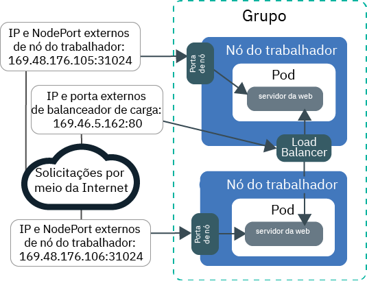
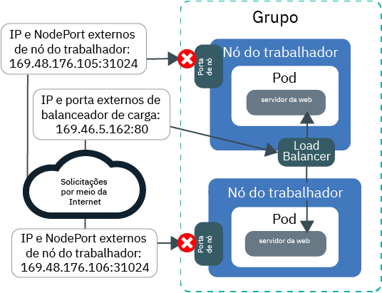
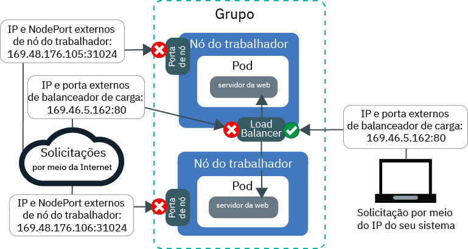
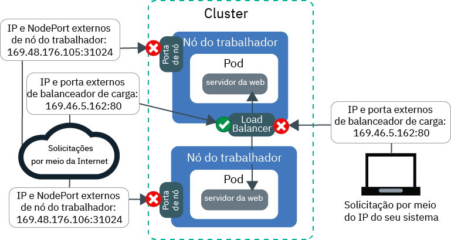

---

copyright:
  years: 2014, 2019
lastupdated: "2019-06-11"

keywords: kubernetes, iks

subcollection: containers

---

{:new_window: target="_blank"}
{:shortdesc: .shortdesc}
{:screen: .screen}
{:pre: .pre}
{:table: .aria-labeledby="caption"}
{:codeblock: .codeblock}
{:tip: .tip}
{:note: .note}
{:important: .important}
{:deprecated: .deprecated}
{:download: .download}
{:preview: .preview}


# Tutorial: usando as políticas de rede do Calico para bloquear o tráfego
{: #policy_tutorial}

Por padrão, os serviços NodePort, LoadBalancer e Ingresso do Kubernetes disponibilizam o seu app em todas as interfaces de rede de cluster pública e privada. A política padrão `allow-node-port-dnat` do Calico permite o tráfego recebido de serviços NodePort, de balanceador de carga de rede (NLB) e de balanceador de carga do aplicativo (ALB) Ingress para os pods de aplicativo que esses serviços expõem. O Kubernetes usa a conversão de endereço de rede de destino (DNAT) para encaminhar as solicitações de serviço para os pods corretos.
{: shortdesc}

No entanto, por razões de segurança, pode ser necessário permitir o tráfego para os serviços de rede somente de determinados endereços IP de origem. É possível usar as [políticas pré-DNAT do Calico  ](https://docs.projectcalico.org/v3.1/getting-started/bare-metal/policy/pre-dnat) para incluir na lista de desbloqueio ou lista de bloqueio o tráfego de/para determinados endereços IP. As políticas pré-DNAT evitam que o tráfego especificado atinja seus apps porque elas são aplicadas antes que o Kubernetes use DNAT regular para encaminhar tráfego para os pods. Ao criar políticas pré-DNAT do Calico, você escolhe se deseja incluir na lista de desbloqueio ou lista de bloqueio os endereços IP de origem. Para a maioria dos cenários, a lista de aplicativos confiáveis fornece a configuração mais segura porque todo o tráfego está bloqueado, exceto o tráfego de endereços IP de origem conhecidos e permitidos. A listagem negra é geralmente útil somente em cenários, tais como, evitar um ataque de um pequeno conjunto de endereços IP.

Neste cenário, você desempenha a função de um administrador de rede para uma firma de RP e observa algum tráfego incomum que atinge seus apps. As lições nesse tutorial o guiam na criação de um aplicativo de servidor da web de amostra, expondo-o usando um serviço de balanceador de carga de rede (NLB) e protegendo-o contra o tráfego incomum indesejado com políticas de lista de bloqueio e de desbloqueio do Calico.

## Objetivos
{: #policies_objectives}

- Aprenda a bloquear todo o tráfego recebido para todas as portas de nó, criando uma política pré-DNAT de alta ordem.
- Aprenda a permitir que os endereços IP de origem incluídos na lista de desbloqueio acessem o IP público e a porta do NLB criando uma política Pré-DNAT de baixa ordem. As políticas de ordem inferior substituem as políticas de ordem superior.
- Aprenda a bloquear o acesso de endereços IP de origem incluídos na lista de bloqueio ao IP público e à porta do NLB criando uma política Pré-DNAT de baixa ordem.

## Tempo Necessário
{: #policies_time}

1 hora

## Público
{: #policies_audience}

Este tutorial é destinado a desenvolvedores de software e administradores de rede que desejam gerenciar o tráfego de rede para um app.

## Pré-requisitos
{: #policies_prereqs}

- [Criar um cluster](/docs/containers?topic=containers-clusters#clusters_ui).
- [Destinar sua CLI para o cluster](/docs/containers?topic=containers-cs_cli_install#cs_cli_configure).
- [Instale e configure a CLI do Calico](/docs/containers?topic=containers-network_policies#cli_install).
- Assegure-se de que você tenha as políticas de acesso do {{site.data.keyword.Bluemix_notm}} IAM a seguir para o {{site.data.keyword.containerlong_notm}}:
    - [Qualquer função da plataforma](/docs/containers?topic=containers-users#platform)
    - [ A função de serviço  ** Writer **  ou  ** Manager **  ](/docs/containers?topic=containers-users#platform)

<br />


## Lição 1: implemente um aplicativo e o exponha usando um NLB
{: #lesson1}

A primeira lição mostra como seu app é exposto por meio de múltiplos endereços IP e portas e onde o tráfego público está chegando em seu cluster.
{: shortdesc}

Inicie implementando um app de servidor da web de amostra para usar em todo o tutorial. O servidor da web `echoserver` mostra os dados sobre a conexão que é feita com o cluster por meio do cliente e é possível testar o acesso ao cluster da firma de RP. Em seguida, exponha o aplicativo ao criar um serviço do balanceador de carga de rede (NLB) 1.0. Um serviço NLB 1.0 torna seu aplicativo disponível por meio do endereço IP do serviço NLB e das portas de nó dos nós do trabalhador.

Deseja usar um balanceador de carga do aplicativo Ingress (ALB)? Em vez de criar um NLB nas etapas 3 e 4, [crie um serviço para o aplicativo do servidor da web](/docs/containers?topic=containers-ingress#public_inside_1) e [um recurso do Ingress para ele](/docs/containers?topic=containers-ingress#public_inside_4). Em seguida, obtenha os IPs públicos de seus ALBs executando `ibmcloud ks albs --cluster <cluster_name>` e use esses IPs em todo o tutorial no lugar do `<loadbalancer_IP>.`
{: tip}

A imagem a seguir mostra como o aplicativo do servidor da web é exposto à Internet pela porta pública do nó e pelo NLB público no final da Lição 1:



1. Implemente o app do servidor da web de amostra. Quando uma conexão é feita com o app do servidor da web, o app responde com os cabeçalhos de HTTP que ele recebeu na conexão.
    ```
    kubectl run webserver -- image=k8s.gcr.io/echoserver: 1.10 -- replicas= 3
    ```
    {: pre}

2. Verifique se os pods de app de servidor da web têm um **STATUS** de `Running`.
    ```
    kubectl get pods -o wide
    ```
    {: pre}

    Saída de exemplo:
    ```
    NAME                         READY     STATUS    RESTARTS   AGE       IP               NODE
    webserver-855556f688-6dbsn   1/1       Running   0          1m        172.30.xxx.xxx   10.176.48.78
    webserver-855556f688-76rkp   1/1       Running   0          1m        172.30.xxx.xxx   10.176.48.78
    webserver-855556f688-xd849   1/1       Running   0          1m        172.30.xxx.xxx   10.176.48.78
    ```
    {: screen}

3. Para expor o aplicativo à Internet pública, crie um arquivo de configuração do serviço NLB 1.0 chamado `webserver-lb.yaml` em um editor de texto.
    ```
    apiVersion: v1
    tipo: Serviço
    metadados:
      etiquetas:
        executar: webserver
      nome: webserver-lb
    spec:
      tipo: LoadBalancer
      seletor:
        executar: webserver
      Portas:
      - name: webserver-port
        port: 80
        protocol: TCP
        targetPort: 8080
    ```
    {: codeblock}

4. Implemente o NLB.
    ```
    kubectl apply -f filepath/webserver-lb.yaml
    ```
    {: pre}

5. Verifique se é possível acessar publicamente o app que é exposto pelo NLB de seu computador.

    1. Obtenha o endereço **EXTERNAL-IP** público do NLB.
        ```
        kubectl get svc -o wide
        ```
        {: pre}

        Saída de exemplo:
        ```
        NAME CLUSTER-IP EXTERNAL-IP PORT(S) AGE SELECTOR webserver-lb 172.21.xxx.xxx 169.xx.xxx.xxx 80:31024/TCP 2m run=webserver
        ```
        {: screen}

    2. Crie um arquivo de texto de folha de dicas e copie o IP do NLB para ele. A folha de dicas ajuda a usar mais rapidamente os valores em lições posteriores.

    3. Verifique se é possível acessar publicamente o IP externo para o NLB.
        ```
        curl --connect-timeout 10 <loadbalancer_IP>:80
        ```
        {: pre}

        A saída de exemplo a seguir confirma que o NLB expõe seu aplicativo no endereço IP `169.1.1.1` do NLB público. O pod de app `webserver-855556f688-76rkp` recebeu a solicitação de curl:
        ```
        Hostname: webserver-855556f688-76rkp
        Pod Information:
            -no pod information available-
        Server values:
            server_version=nginx: 1.13.3 - lua: 10008
        Request Information:
            client_address=1.1.1.1
            method=GET
            real path=/
            query=
            request_version=1.1
            request_scheme=http
            request_uri=http://169.1.1.1:8080/
        Request Headers:
            accept=*/*
            host=169.1.1.1
            user-agent=curl/7.54.0
        Request Body:
            -no body in request-
        ```
        {: screen}

6. Verifique se é possível acessar publicamente o app que é exposto pela porta de nó de seu computador. Um serviço NLB torna seu aplicativo disponível por meio do endereço IP do serviço NLB e das portas de nó dos nós do trabalhador.

    1. Obtenha a porta de nó que o NLB designou aos nós do trabalhador. A porta de nó está no intervalo 30000 - 32767.
        ```
        kubectl get svc -o wide
        ```
        {: pre}

        Na saída de exemplo a seguir, a porta de nó é `31024`:
        ```
        NAME CLUSTER-IP EXTERNAL-IP PORT(S) AGE SELECTOR webserver-lb 172.21.xxx.xxx 169.xx.xxx.xxx 80:31024/TCP 2m run=webserver
        ```
        {: screen}  

    2. Obtenha o endereço **IP público** de um nó do trabalhador.
        ```
        ibmcloud ks workers --cluster <cluster_name>
        ```
        {: pre}

        Saída de exemplo:
        ```
        ID                                                 Public IP        Private IP     Machine Type        State    Status   Zone    Version   
        kube-dal10-cr18e61e63c6e94b658596ca93d087eed9-w1   169.xx.xxx.xxx   10.176.48.67   u3c.2x4.encrypted   normal   Ready    dal10   1.13.6_1513*   
        kube-dal10-cr18e61e63c6e94b658596ca93d087eed9-w2   169.xx.xxx.xxx   10.176.48.79   u3c.2x4.encrypted   normal   Ready    dal10   1.13.6_1513*   
        kube-dal10-cr18e61e63c6e94b658596ca93d087eed9-w3   169.xx.xxx.xxx   10.176.48.78   u3c.2x4.encrypted   normal   Ready    dal10   1.13.6_1513*   
        ```
        {: screen}

    3. Copie o IP público do nó do trabalhador e a porta de nó em sua folha de dicas de texto para usar em lições mais recentes.

    4. Verifique se é possível acessar o endereço IP público do nó do trabalhador por meio da porta de nó.
        ```
        curl  --connect-timeout 10 <worker_IP>:<NodePort>
        ```
        {: pre}

        A saída de exemplo a seguir confirma que a solicitação para seu app veio por meio do endereço IP privado `10.1.1.1` para o nó do trabalhador e a porta de nó `31024`. O pod de app `webserver-855556f688-xd849` recebeu a solicitação de curl:
        ```
        Hostname: webserver-855556f688-xd849
        Pod Information:
            -no pod information available-
        Server values:
            server_version=nginx: 1.13.3 - lua: 10008
        Request Information:
            client_address=1.1.1.1
            method=GET
            real path=/
            query=
            request_version=1.1
            request_scheme=http
            request_uri=http://10.1.1.1:8080/
        Request Headers:
            accept=*/*
            host=10.1.1.1:31024
            user-agent=curl/7.60.0
        Request Body:
            -no body in request-
        ```
        {: screen}

Neste momento, seu app é exposto por meio de múltiplos endereços IP e portas. A maioria desses IPs é interna para o cluster e pode ser acessada somente por meio da rede privada. Somente a porta de nó pública e a porta do NLB público são expostas à Internet pública.

Em seguida, é possível iniciar a criação e aplicação de políticas do Calico para bloquear o tráfego público.

## Lição 2: bloquear todo o tráfego recebido para todas as portas de nó
{: #lesson2}

Para proteger o cluster da firma PR, deve-se bloquear o acesso público ao serviço NLB e às portas de nó que estão expondo o aplicativo. Inicie bloqueando o acesso às portas de nó.
{: shortdesc}

A imagem a seguir mostra como o tráfego é permitido para o NLB, mas não para as portas de nó no término da Lição 2:



1. Em um editor de texto, crie uma política pré-DNAT de alta ordem chamada `deny-nodeports.yaml` para negar o tráfego TCP e UDP recebido de qualquer IP de origem para todas as portas de nó.
    ```
    apiVersion: projectcalico.org/v3
    kind: GlobalNetworkPolicy
    metadata:
      name: deny-nodeports
    spec:
      applyOnForward: true
      preDNAT: true
      ingress:
      - action: Deny destination: ports:
          - 30000:32767
            protocol: TCP
            source: {}
      - action: Deny destination: ports:
          - 30000:32767
        protocol: UDP
        source: {}
      selector: ibm.role=='worker_public'
      order: 1100
      types:
      - Entrada
    ```
    {: codeblock}

2. Aplique a política.
    - Linux:

      ```
      calicoctl apply -f filepath/deny-nodeports.yaml
      ```
      {: pre}

    - Windows e OS X:

      ```
      calicoctl apply -f filepath/deny-nodeports.yaml -- config=filepath/calicoctl.cfg
      ```
      {: pre}
  Saída de exemplo:
  ```
  Recurso (s) de 1 'GlobalNetworkPolicy' aplicado com sucesso
  ```
  {: screen}

3. Usando os valores de sua folha de dicas, verifique se não é possível acessar publicamente o endereço IP e a porta de nó públicos do nó do trabalhador.
    ```
    curl  --connect-timeout 10 <worker_IP>:<NodePort>
    ```
    {: pre}

    A conexão atinge o tempo limite porque a política do Calico que você criou está bloqueando o tráfego para as portas de nó.
    ```
    curl: (28) Tempo de conexão esgotado após 10016 milissegundos
    ```
    {: screen}

4. Mude o externalTrafficPolicy do LoadBalancer que você criou na lição anterior de `Cluster` para `Local`. `Local` garante que o IP de origem do sistema seja preservado ao fazer curl do IP externo do LoadBalancer na próxima etapa.
    ```
    kubectl patch svc webserver -p '{"spec":{"externalTrafficPolicy":"Local"}}'
    ```
    {: pre}

5. Usando o valor de sua folha de dicas, verifique se ainda é possível acessar publicamente o endereço IP externo do NLB.
    ```
    curl --connect-timeout 10 <loadbalancer_IP>:80
    ```
    {: pre}

    Saída de exemplo:
    ```
    Hostname: webserver-855556f688-76rkp
    Pod Information:
        -no pod information available-
    Server values:
        server_version=nginx: 1.13.3 - lua: 10008
    Request Information:
        client_address=1.1.1.1
        method=GET
        real path=/
        query=
        request_version=1.1
        request_scheme=http
        request_uri=http://<loadbalancer_IP>:8080/
    Request Headers:
        accept=*/*
        host=<loadbalancer_IP>
        user-agent=curl/7.54.0
    Request Body:
        -no body in request-
    ```
    {: screen}
    Na seção `Request Information` da saída, o endereço IP de origem é, por exemplo, `client_address=1.1.1.1`. O endereço IP de origem é o IP público do sistema que você está usando para executar curl. Caso contrário, se você estiver se conectando à Internet por meio de um proxy ou uma VPN, o proxy ou a VPN poderá estar obscurecendo o endereço IP real do seu sistema. Em qualquer um dos casos, o NLB considera o endereço IP de origem do seu sistema como o endereço IP do cliente.

6. Copie o endereço IP de origem do seu sistema (`client_address=1.1.1.1` na saída de etapa anterior) em sua folha de dicas para usar em lições posteriores.

Ótimo! Neste ponto, seu aplicativo é exposto à Internet pública somente por meio da porta do NLB público. O tráfego para as portas de nó público está bloqueado. Seu cluster está parcialmente bloqueado do tráfego indesejado.

Em seguida, é possível criar e aplicar políticas do Calico para incluir na lista de desbloqueio o tráfego de certos IPs de origem.

## Lição 3: permita o tráfego recebido de um IP incluído na lista de desbloqueio para o NLB
{: #lesson3}

Agora você decide bloquear completamente o tráfego para o cluster da firma PR e testar o acesso incluindo na lista de desbloqueio somente o endereço IP de seu próprio computador.
{: shortdesc}

Primeiro, além das portas de nó, deve-se bloquear todo o tráfego recebido para o NLB que está expondo o aplicativo. Em seguida, é possível criar uma política que inclua na lista de desbloqueio o endereço IP do sistema. No término da Lição 3, todo o tráfego para as portas de nó públicas e o NLB será bloqueado e somente o tráfego de seu IP do sistema incluído na lista de desbloqueio será permitido:



1. Em um editor de texto, crie uma política Pré-DNAT de alta ordem chamada `deny-lb-port-80.yaml` para negar todo o tráfego TCP e UDP recebido de qualquer IP de origem para o endereço IP e a porta do NLB. Substitua `<loadbalancer_IP>` pelo endereço IP público do NLB de sua folha de dicas.

    ```
    apiVersion: projectcalico.org/v3
    kind: GlobalNetworkPolicy
    metadata:
      name: deny-lb-port-80
    spec:
      applyOnForward: true
      preDNAT: true
      ingress:
      - ação: negar destino: redes:
          - <loadbalancer_IP>/32 portas:
          - 80
        protocol: TCP
        source: {}
      - ação: negar destino: redes:
          - <loadbalancer_IP>/32 portas:
          - 80
        protocol: UDP
        source: {}
      selector: ibm.role=='worker_public'
      order: 800
      types:
      - Entrada
    ```
    {: codeblock}

2. Aplique a política.
    - Linux:

      ```
      calicoctl apply -f filepath/deny-lb-port-80.yaml
      ```
      {: pre}

    - Windows e OS X:

      ```
      calicoctl apply -f filepath/deny-lb-port-80.yaml -- config=filepath/calicoctl.cfg
      ```
      {: pre}

3. Usando o valor de sua folha de dicas, verifique se agora não é possível acessar o endereço IP público do NLB. A conexão atinge o tempo limite porque a política do Calico criada está bloqueando o tráfego para o NLB.
    ```
    curl --connect-timeout 10 <loadbalancer_IP>:80
    ```
    {: pre}

4. Em um editor de texto, crie uma política Pré-DNAT de baixa ordem chamada `whitelist.yaml` para permitir o tráfego do IP de seu sistema para o endereço IP e a porta do NLB. Usando os valores de sua folha de dicas, substitua `<loadbalancer_IP>` pelo endereço IP público do NLB e `<client_address>` pelo endereço IP público do IP de origem de seu sistema. Se não for possível se lembrar de seu IP do sistema, será possível executar `curl ifconfig.co`.
    ```
    apiVersion: projectcalico.org/v3
    kind: GlobalNetworkPolicy
    metadata:
      name: whitelist
    spec:
      applyOnForward: true
      preDNAT: true
      ingress:
      - action: Allow
        destination:
          nets:
          - <loadbalancer_IP>/32 portas:
          - 80 protocol: TCP source: nets:
          - <client_address>/32 selector: ibm.role=='worker_public' order: 500 types:
      - Entrada
    ```
    {: codeblock}

5. Aplique a política.
    - Linux:

      ```
      calicoctl apply -f filepath/whitelist.yaml
      ```
      {: pre}

    - Windows e OS X:

      ```
      calicoctl apply -f filepath/whitelist.yaml -- config=filepath/calicoctl.cfg
      ```
      {: pre}
  O endereço IP do seu sistema está agora incluído na lista de desbloqueio.

6. Usando o valor de sua folha de dicas, verifique se agora é possível acessar o endereço IP do NLB público.
    ```
    curl --connect-timeout 10 <loadbalancer_IP>:80
    ```
    {: pre}

7. Se tiver acesso a outro sistema que tenha um endereço IP diferente, tente acessar o NLB por esse sistema.
    ```
    curl --connect-timeout 10 <loadbalancer_IP>:80
    ```
    {: pre}
    A conexão atinge o tempo limite porque o endereço IP desse sistema não está incluído na lista de desbloqueio.

Neste ponto, todo o tráfego para as portas de nó públicas e o NLB está bloqueado. Somente o tráfego de seu IP do sistema incluído na lista de desbloqueio é permitido.

## Lição 4: negue o tráfego de entrada de IPs incluídos na lista de bloqueio para o NLB
{: #lesson4}

Na lição anterior, você bloqueou todo o tráfego e incluiu na lista de desbloqueio somente alguns IPs. Esse cenário funciona bem para propósitos de teste quando você deseja limitar o acesso a somente alguns endereços IP de origem controlada. No entanto, a firma PR tem apps que precisam estar amplamente disponíveis para o público. É necessário certificar-se de que todo o tráfego seja permitido, exceto o tráfego incomum que você está vendo de alguns endereços IP. A listagem negra é útil em um cenário como este porque pode ajudar a evitar um ataque de um pequeno conjunto de endereços IP.
{: shortdesc}

Nesta lição, você testará a listagem negra bloqueando o tráfego do endereço IP de origem de seu próprio sistema. No final da Lição 4, todo o tráfego para as portas de nó públicas será bloqueado e todo o tráfego para o NLB público será permitido. Somente o tráfego do IP do sistema incluído na lista de bloqueio para o NLB será bloqueado:



1. Limpe as políticas de lista de desbloqueio que você criou na lição anterior.
    - Linux:
      ```
      calicoctl delete GlobalNetworkPolicy deny-lb-port-80
      ```
      {: pre}
      ```
      calicoctl delete GlobalNetworkPolicy whitelist
      ```
      {: pre}

    - Windows e OS X:
      ```
      calicoctl delete GlobalNetworkPolicy deny-lb-port-80 -- config=filepath/calicoctl.cfg
      ```
      {: pre}
      ```
      delete calicoctl delete GlobalNetworkPolicy whitelist -- config=filepath/calicoctl.cfg
      ```
      {: pre}

    Agora, todo o tráfego TCP e UDP recebido de qualquer IP de origem para o endereço IP e a porta do NLB é permitido novamente.

2. Para negar todo o tráfego TCP e UDP recebido do endereço IP de origem de seu sistema para o endereço IP e a porta do NLB, crie uma política Pré-DNAT de baixa ordem chamada `blacklist.yaml` em um editor de texto. Usando os valores de sua folha de dicas, substitua `<loadbalancer_IP>` pelo endereço IP público do NLB e `<client_address>` pelo endereço IP público do IP de origem de seu sistema.
  ```
  apiVersion: projectcalico.org/v3
  kind: GlobalNetworkPolicy
  metadata:
    name: blacklist
  spec:
    applyOnForward: true
    preDNAT: true
    ingress:
    - action: Deny
      destination:
        nets:
        - <loadbalancer_IP>/32
        ports:
        - 80
      protocol: TCP
      source:
        nets:
        - <client_address>/32
    - action: Deny
      destination:
        nets:
        - <loadbalancer_IP>/32
        ports:
        - 80
      protocol: UDP
      source:
        nets:
        - <client_address>/32
    selector: ibm.role=='worker_public'
    order: 500
    types:
    - Ingress
  ```
  {: codeblock}

3. Aplique a política.
    - Linux:

      ```
      calicoctl apply -f filepath/blacklist.yaml
      ```
      {: pre}

    - Windows e OS X:

      ```
      calicoctl apply -f filepath/blacklist.yaml -- config=filepath/calicoctl.cfg
      ```
      {: pre}
  O endereço IP do seu sistema está agora incluído na lista de bloqueio.

4. Usando o valor de sua folha de dicas, verifique em seu sistema se não é possível acessar o IP do NLB porque o IP do sistema está incluído na lista de bloqueio.
    ```
    curl --connect-timeout 10 <loadbalancer_IP>:80
    ```
    {: pre}
    Neste ponto, todo o tráfego para as portas de nó públicas está bloqueado e todo o tráfego para o NLB público está permitido. Somente o tráfego do IP de seu sistema incluído na lista de bloqueio para o NLB é bloqueado.

Bom trabalho! Você controlou com êxito o tráfego em seu app usando as políticas pré-DNAT do Calico para incluir na lista de bloqueio os IPs de origem.

## Lição 5: registrando o tráfego bloqueado dos IPs incluídos na lista de bloqueio para o NLB
{: #lesson5}

Na lição anterior, você incluiu na lista de bloqueio o tráfego do IP de seu sistema para o NLB. Nesta lição, será possível aprender como registrar as solicitações de tráfego negado.
{: shortdesc}

Em nosso cenário de exemplo, a firma PR na qual você trabalha deseja que você configure uma trilha de criação de log para qualquer tráfego incomum que esteja sendo continuamente negado por uma de suas políticas de rede. Para monitorar a possível ameaça de segurança, você configura a criação de log para registrar todas as vezes nas quais sua política de lista de bloqueio nega uma tentativa de ação no IP do NLB.

1. Crie uma NetworkPolicy do Calico chamada `log-denied-packets`. Essa política de log usa o mesmo seletor que a política `blacklist`, que inclui essa política na cadeia de regras Iptables do Calico. Usando um número de ordem inferior, como `300`, é possível assegurar que essa regra seja incluída na cadeia de regras de Iptables antes da política de lista de bloqueio. Os pacotes de seu IP são registrados por essa política antes de tentarem corresponder à regra de política `blacklist` e serão negados.
  ```
  apiVersion: projectcalico.org/v3
  kind: GlobalNetworkPolicy
  metadata:
    name: log-denied-packets
  spec:
    applyOnForward: true
    preDNAT: true
    ingress:
    - action: Log
      destination:
        nets:
        - <loadbalancer_IP>/32
        ports:
        - 80
      protocol: TCP
      source:
        nets:
        - <client_address>/32
    - action: Deny
      destination:
        nets:
        - <loadbalancer_IP>/32
        ports:
        - 80
      protocol: UDP
      source:
        nets:
        - <client_address>/32
    selector: ibm.role=='worker_public'
    order: 300
    types:
    - Ingress
  ```
  {: codeblock}

2. Aplique a política.
  ```
  calicoctl apply -f log-denied-packets.yaml --config=<filepath>/calicoctl.cfg
  ```
  {: pre}

3. Gere entradas de log enviando solicitações do IP de seu sistema para o IP do NLB. Esses pacotes de solicitações são registrados antes de serem negados.
  ```
  curl --connect-timeout 10 <loadbalancer_IP>:80
  ```
  {: pre}

4. Verifique as entradas de log que são gravadas no caminho `/var/log/syslog`. A entrada de log é semelhante à seguinte.
  ```
  Sep 5 14:34:40 <worker_hostname> kernel: [158271.044316] calico-packet: IN=eth1 OUT= MAC=08:00:27:d5:4e:57:0a:00:27:00:00:00:08:00 SRC=192.XXX.XX.X DST=192.XXX.XX.XX LEN=60 TOS=0x00 PREC=0x00 TTL=64 ID=52866 DF PROTO=TCP SPT=42962 DPT=22 WINDOW=29200 RES=0x00 SYN URGP=0
  ```
  {: screen}

Bom. Você configurou a criação de log para que o tráfego incluído na lista de bloqueio possa ser monitorado mais facilmente.

Se desejar limpar a lista de bloqueio e as políticas de log:
1. Limpe a política de lista de bloqueio.
    - Linux:
      ```
      delete calicoctl delete GlobalNetworkPolicy blacklist
      ```
      {: pre}

    - Windows e OS X:
      ```
      calicoctl delete GlobalNetworkPolicy blacklist --config=filepath/calicoctl.cfg
      ```
      {: pre}

2. Limpe a política de log.
    - Linux:
      ```
      calicoctl delete GlobalNetworkPolicy log-denied-packets
      ```
      {: pre}

    - Windows e OS X:
      ```
      calicoctl delete GlobalNetworkPolicy log-denied-packets --config=filepath/calicoctl.cfg
      ```
      {: pre}

## O que Vem a Seguir?
{: #whats_next}

* Leia mais sobre [como controlar o tráfego com políticas de rede](/docs/containers?topic=containers-network_policies).
* Para obter mais políticas de rede do Calico de exemplo que controlam o tráfego para e por meio do seu cluster, é possível efetuar check-out da [demo de política de estrelas ](https://docs.projectcalico.org/v3.1/getting-started/kubernetes/tutorials/stars-policy/) e da [política de rede avançada ](https://docs.projectcalico.org/v3.1/getting-started/kubernetes/tutorials/advanced-policy).
