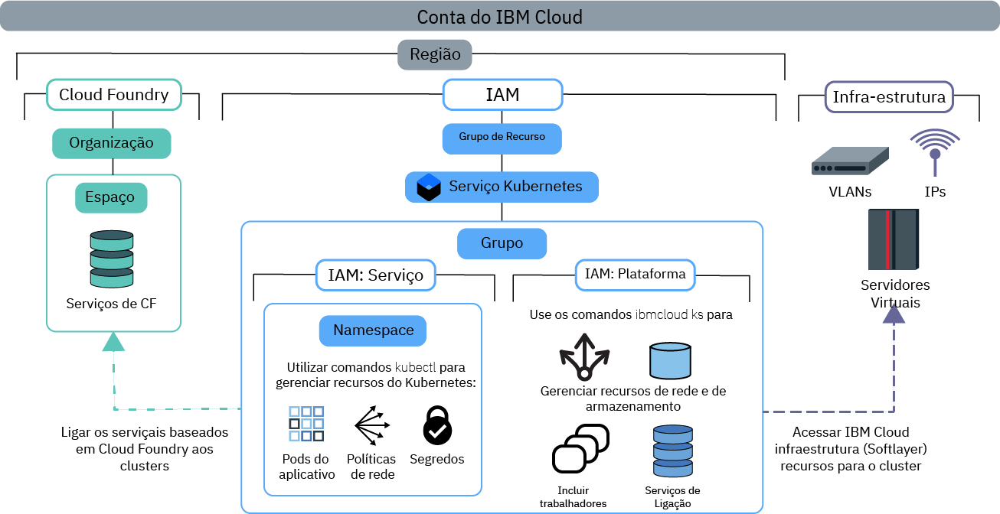

---

copyright:
  years: 2014, 2019
lastupdated: "2019-06-12"

keywords: kubernetes, iks

subcollection: containers

---

{:new_window: target="blank"}
{:shortdesc: .shortdesc}
{:screen: .screen}
{:pre: .pre}
{:table: .aria-labeledby="caption"}
{:codeblock: .codeblock}
{:tip: .tip}
{:note: .note}
{:important: .important}
{:deprecated: .deprecated}
{:download: .download}
{:preview: .preview}


# Designando acesso ao cluster
{: #users}

Como um administrador de cluster, é possível definir políticas de acesso para seu cluster do {{site.data.keyword.containerlong}} para criar diferentes níveis de acesso para diferentes usuários. Por exemplo, é possível autorizar determinados usuários a trabalhar com recursos de infraestrutura do cluster e outros a implementar somente contêineres.
{: shortdesc}

A partir de 30 de janeiro de 2019, o {{site.data.keyword.containerlong_notm}} tem uma nova maneira de autorizar usuários com o {{site.data.keyword.Bluemix_notm}} IAM: [funções de acesso ao serviço](/docs/containers?topic=containers-access_reference#service). Essas funções de serviço são usadas para conceder acesso aos recursos dentro do cluster, como namespaces do Kubernetes. Para obter mais informações, consulte o blog [Introduzindo funções de serviço e namespaces no IAM para obter controle mais granular de acesso ao cluster ](https://www.ibm.com/blogs/bluemix/2019/02/introducing-service-roles-and-namespaces-in-iam-for-more-granular-control-of-cluster-access/).
{: note}

## Entendendo políticas de acesso e funções
{: #access_policies}

As políticas de acesso determinam o nível de acesso que os usuários em sua conta do {{site.data.keyword.Bluemix_notm}} têm para os recursos em toda a plataforma {{site.data.keyword.Bluemix_notm}}. Uma política designa a um usuário uma ou mais funções que definem o escopo de acesso a um único serviço ou a um conjunto de serviços e recursos organizados juntos em um grupo de recursos. Cada serviço no {{site.data.keyword.Bluemix_notm}} pode requerer seu próprio conjunto de políticas de acesso.
{: shortdesc}

À medida que você desenvolver seu plano para gerenciar o acesso de usuário, considere as etapas gerais a seguir:
1.  [Escolher a política de acesso e a função corretas para seus usuários](#access_roles)
2.  [Designar funções de acesso a indivíduos ou grupos de usuários no {{site.data.keyword.Bluemix_notm}} IAM](#iam_individuals_groups)
3.  [Escopo do acesso do usuário às instâncias do cluster, namespaces do Kubernetes ou grupos de recursos](#resource_groups)

Depois de entender como funções, usuários e recursos em sua conta podem ser gerenciados, consulte [Configurando o acesso ao cluster](#access-checklist) para obter uma lista de verificação de como configurar o acesso.

### Escolher a política de acesso e a função corretas para seus usuários
{: #access_roles}

Deve-se definir políticas de acesso para cada usuário que trabalhe com o {{site.data.keyword.containerlong_notm}}. O escopo de uma política de acesso baseia-se em uma função ou funções definidas pelo usuário que determinam as ações que o usuário pode executar. Algumas políticas são predefinidas, mas outras podem ser customizadas. A mesma política será cumprida se o usuário fizer a solicitação por meio do console do {{site.data.keyword.containerlong_notm}} ou da CLI, mesmo quando as ações forem concluídas na infraestrutura do IBM Cloud (SoftLayer).
{: shortdesc}

A imagem a seguir mostra os diferentes tipos de permissões e funções, que a função pode executar quais tipos de ações e como as funções se relacionam entre si.



Para ver as permissões específicas do {{site.data.keyword.containerlong_notm}} por função, consulte o tópico de referência [Permissões de acesso de usuário](/docs/containers?topic=containers-access_reference).
{: tip}

<dl>
<dt><a href="#platform"> {{site.data.keyword.Bluemix_notm}}  Plataforma IAM e funções de serviço </a></dt>
<dd>O {{site.data.keyword.containerlong_notm}} usa as funções da plataforma e de serviço do {{site.data.keyword.Bluemix_notm}} Identity and Access Management (IAM) e as funções de serviço para conceder aos usuários acesso ao cluster.
<ul><li>**Plataforma**: as funções da plataforma determinam as ações que os usuários podem executar na infraestrutura do cluster usando a API do {{site.data.keyword.containerlong_notm}}, o console e a CLI (`ibmcloud ks`). As funções da plataforma não concedem acesso à API do Kubernetes. É possível configurar as políticas para essas funções por grupo de recursos, região ou instância de cluster. Embora as funções da plataforma autorizem você a executar ações de infraestrutura no cluster, elas não concedem acesso aos recursos de infraestrutura do IBM Cloud (SoftLayer). O acesso aos recursos de infraestrutura do IBM Cloud (SoftLayer) é determinado pela [chave API que está configurada para a região](#api_key). As ações de exemplo que são permitidas por funções da plataforma estão criando ou removendo clusters, ligando serviços a um cluster, gerenciando recursos de rede e de armazenamento ou incluindo nós do trabalhador extras.<br><br>Se você designar apenas funções da plataforma aos usuários, eles não poderão interagir com recursos do Kubernetes no cluster. No entanto, eles poderão ainda executar o [comando](/docs/containers?topic=containers-cli-plugin-kubernetes-service-cli#cs_cluster_config) `ibmcloud ks cluster-config`. Em seguida, é possível autorizar os usuários a executar ações selecionadas do Kubernetes usando [políticas RBAC customizadas](/docs/containers?topic=containers-users#role-binding). Você pode fazer isso se a sua organização usar atualmente as políticas RBAC customizadas para controlar o acesso de Kubernetes e planejar continuar usando o RBAC customizado em vez de funções de serviço.</li>
<li>**Serviço**: as funções de serviço concedem políticas de RBAC correspondentes do Kubernetes às que um usuário recebe em um cluster. Como tal, as funções de serviço concedem acesso à API do Kubernetes, ao painel e à CLI (`kubectl`). É possível definir o escopo da política para funções de serviço por grupo de recursos, região ou instância de cluster. Além disso, também é possível definir o escopo de funções de serviço para os espaços de nomes Kubernetes que estão em todos os clusters individuais, individuais ou regionais. Ao definir o escopo de uma função de serviço para um namespace, não é possível aplicar a política a um grupo de recursos ou designar uma função da plataforma ao mesmo tempo. As ações de exemplo que são permitidas pelas funções de serviço estão criando implementações de app, incluindo namespaces ou configurando configmaps.<br><br>Se você designar apenas funções de serviço aos usuários, eles não poderão visualizar ou interagir com nenhum recurso do {{site.data.keyword.containerlong_notm}}. Para que os usuários acessem o cluster e usem os recursos do Kubernetes do cluster, deve-se fornecer aos usuários o nome do cluster e o ID para que eles possam executar o [comando](/docs/containers?topic=containers-cli-plugin-kubernetes-service-cli#cs_cluster_config) `ibmcloud ks cluster-config` e, em seguida, [ativar o painel do Kubernetes por meio da CLI](/docs/containers?topic=containers-app#db_cli). Se você desejar que esses usuários ainda possam acessar o console de clusters do {{site.data.keyword.containerlong_notm}} e listar os clusters e outros recursos de infraestrutura por meio da CLI, dê aos usuários a função da plataforma **Visualizador**.</li></ul></dd>
<dt><a href="#role-binding"> RBAC </a></dt>
<dd>No Kubernetes, o controle de acesso baseado na função (RBAC) é uma maneira de proteger os recursos dentro de seu cluster. As funções RBAC determinam as ações do Kubernetes que os usuários podem executar nesses recursos. Cada usuário que é designado a uma função de serviço é designado automaticamente a uma função de cluster RBAC correspondente. Essa função de cluster RBAC é aplicada a um namespace específico ou a todos os namespaces, dependendo da definição de escopo da política para um namespace.</br></br>
As ações de exemplo que são permitidas pelas funções RBAC estão criando objetos como pods ou lendo logs de pod.</dd>
<dt><a href="#api_key"> Infraestrutura </a></dt>
<dd>As funções de infraestrutura permitem o acesso a seus recursos de infraestrutura do IBM Cloud (SoftLayer). Configure um usuário com a função de infraestrutura **Superusuário ** e armazene as credenciais de infraestrutura desse usuário em uma chave API. Em seguida, configure a chave API em cada região na qual você deseja criar clusters. Depois de configurar a chave API, outros usuários para os quais você concede acesso ao {{site.data.keyword.containerlong_notm}} não precisam de funções de infraestrutura porque a chave API é compartilhada para todos os usuários dentro da região. Em vez disso, as funções da plataforma do {{site.data.keyword.Bluemix_notm}} IAM determinam as ações de infraestrutura que os usuários têm permissão para executar. Se você não configurar a chave de API com a infraestrutura completa de <strong>Superusuário</strong> ou precisar conceder acesso a um dispositivo específico para os usuários, será possível [customizar permissões de infraestrutura](#infra_access). </br></br>
As ações de exemplo que são permitidas por funções de infraestrutura estão visualizando os detalhes das máquinas de nó do trabalhador do cluster ou editando os recursos de rede e armazenamento.</dd>
<dt>Cloud Foundry</dt>
<dd>Nem todos os serviços podem ser gerenciados com o {{site.data.keyword.Bluemix_notm}} IAM. Se você estiver usando um desses serviços, será possível continuar a usar as funções de usuário do Cloud Foundry para controlar o acesso a esses serviços. As funções do Cloud Foundry concedem acesso a organizações e espaços dentro da conta. Para ver a lista de serviços baseados no Cloud Foundry no {{site.data.keyword.Bluemix_notm}}, execute <code>ibmcloud service list</code>.</br></br>
As ações de exemplo que são permitidas pelas funções do Cloud Foundry estão criando uma nova instância de serviço do Cloud Foundry ou ligando uma instância de serviço do Cloud Foundry a um cluster. Para saber mais, consulte as [funções de organização e de espaço](/docs/iam?topic=iam-cfaccess) disponíveis ou as etapas para [gerenciar o acesso do Cloud Foundry](/docs/iam?topic=iam-mngcf) na documentação do {{site.data.keyword.Bluemix_notm}} IAM.</dd>
</dl>

### Designar funções de acesso a indivíduos ou grupos de usuários no {{site.data.keyword.Bluemix_notm}} IAM
{: #iam_individuals_groups}

Quando você configura políticas do {{site.data.keyword.Bluemix_notm}} IAM, é possível designar funções a um usuário individual ou a um grupo de usuários.
{: shortdesc}

<dl>
<dt>Usuários individuais</dt>
<dd>Você pode ter um usuário específico que precise de mais ou menos permissões do que o restante de sua equipe. É possível customizar permissões em uma base individual para que cada pessoa tenha as permissões que elas precisam para concluir suas tarefas. É possível designar mais de uma função do {{site.data.keyword.Bluemix_notm}} IAM a cada usuário.</dd>
<dt>Vários usuários em um grupo de acesso</dt>
<dd>É possível criar um grupo de usuários e, em seguida, designar permissões a esse grupo. Por exemplo, é possível agrupar todos os chefes de equipe e designar acesso de administrador ao grupo. Em seguida, é possível agrupar todos os desenvolvedores e designar somente acesso de gravação a esse grupo. É possível designar mais de uma função do {{site.data.keyword.Bluemix_notm}} IAM para cada grupo de acesso. Quando você designa permissões a um grupo, qualquer usuário que é incluído ou removido desse grupo é afetado. Se você incluir um usuário no grupo, ele também terá o acesso adicional. Se ele for removido, seu acesso será revogado.</dd>
</dl>

As funções do IAM do {{site.data.keyword.Bluemix_notm}} não podem ser designadas a uma conta de serviço. Em vez disso, é possível [designar funções RBAC a contas de serviço](#rbac) diretamente.
{: tip}

Deve-se também especificar se os usuários têm acesso a um cluster em um grupo de recursos, todos os clusters em um grupo de recursos ou todos os clusters em todos os grupos de recursos em sua conta.

### Defina o escopo do acesso do usuário a instâncias de cluster, namespaces ou grupos de recursos
{: #resource_groups}

No {{site.data.keyword.Bluemix_notm}} IAM, é possível designar funções de acesso de usuário a instâncias de recurso, namespaces do Kubernetes ou grupos de recursos.
{: shortdesc}

Quando você cria sua conta do {{site.data.keyword.Bluemix_notm}}, o grupo de recursos padrão é criado automaticamente. Se você não especificar um grupo de recursos quando criar o recurso, as instâncias de recurso (clusters) pertencerão ao grupo de recursos padrão. No {{site.data.keyword.Bluemix_notm}} IAM, um namespace do Kubernetes é um tipo de recurso de uma instância de recurso (cluster). Se você desejar incluir um grupo de recursos em sua conta, consulte [Boas Práticas para Configurar sua Conta](/docs/account?topic=account-account_setup) e [Configurando os Grupos de Recursos](/docs/resources?topic=resources-bp_resourcegroups#setuprgs).

<dl>
<dt>Instância de recurso</dt>
  <dd><p>Cada serviço do {{site.data.keyword.Bluemix_notm}} em sua conta é um recurso que tem instâncias. A instância difere por serviço. Por exemplo, no {{site.data.keyword.containerlong_notm}}, a instância é um cluster, mas no {{site.data.keyword.cloudcerts_long_notm}}, a instância é um certificado. Por padrão, os recursos também pertencem ao grupo de recursos padrão em sua conta. É possível designar aos usuários uma função de acesso a uma instância de recurso para os cenários a seguir.
  <ul><li>Todos os serviços do {{site.data.keyword.Bluemix_notm}} IAM em sua conta, incluindo todos os clusters no {{site.data.keyword.containerlong_notm}} e imagens no {{site.data.keyword.registrylong_notm}}.</li>
  <li>Todas as instâncias dentro de um serviço, como todos os clusters no {{site.data.keyword.containerlong_notm}}.</li>
  <li>Todas as instâncias dentro de uma região de um serviço, como todos os clusters na região **Sul dos EUA** do {{site.data.keyword.containerlong_notm}}.</li>
  <li>Para uma instância individual, como um cluster.</li></ul></dd>
<dt>Namespace do Kubernetes</dt>
  <dd><p>Como parte das instâncias de recursos do cluster no {{site.data.keyword.Bluemix_notm}} IAM, é possível designar usuários com funções de acesso de serviço aos namespaces do Kubernetes em seus clusters.</p>
  <p>Quando você designa acesso a um namespace, a política se aplica a todas as instâncias atuais e futuras do namespace em todos os clusters que você autorizar. Por exemplo, digamos que você deseja que um grupo de usuários `dev` seja capaz de implementar recursos do Kubernetes em um namespace `test` em todos os seus clusters no Norte da AP. Se você designar ao grupo de acesso `dev` a função de acesso de serviço **Gravador** para o teste de namespace do Kubernetes em todos os clusters na região Norte da AP no grupo de recursos `default`, o grupo `dev` poderá acessar o namespace `test` em qualquer cluster do Norte da AP no grupo de recursos `default` que atualmente tem ou posteriormente terá um namespace de teste.</p>
  <p class="important">Se você definir o escopo de uma função de serviço para um namespace, não será possível aplicar a política a um grupo de recursos ou designar uma função da plataforma ao mesmo tempo.</p></dd>
<dt>Grupo de Recurso</dt>
  <dd><p>É possível organizar seus recursos de conta em agrupamentos customizáveis para que seja possível designar rapidamente a indivíduos ou grupos de usuários acesso a mais de um recurso de cada vez. Os grupos de recursos podem ajudar operadores e administradores a filtrar recursos para visualizar seu uso atual, solucionar problemas e gerenciar equipes.</p>
  <p class="important">Um cluster pode ser criado em apenas um grupo de recursos que não pode ser mudado posteriormente. Se você criar um cluster no grupo de recursos incorreto, deverá excluir o cluster e recriá-lo no grupo de recursos correto. Além disso, se for necessário usar o [comando](/docs/containers-cli-plugin?topic=containers-cli-plugin-kubernetes-service-cli#cs_cluster_service_bind) `ibmcloud ks cluster-service-bind` para [integrá-lo a um serviço do {{site.data.keyword.Bluemix_notm}}](/docs/containers?topic=containers-service-binding#bind-services), esse serviço deverá estar no mesmo grupo de recursos que o cluster. Os serviços que não usam grupos de recursos como {{site.data.keyword.registrylong_notm}} ou que não precisam de ligação de serviços como {{site.data.keyword.la_full_notm}} funcionarão mesmo se o cluster estiver em um grupo de recursos diferente.</p>
  <p>Se você planeja usar o [{{site.data.keyword.monitoringlong_notm}} para métricas ](/docs/containers?topic=containers-health#view_metrics), considere fornecer nomes exclusivos de clusters em grupos de recursos e regiões em sua conta para evitar conflitos de nomenclatura de métricas. Não é possível renomear um cluster.</p>
  <p>É possível designar aos usuários uma função de acesso a um grupo de recursos para os cenários a seguir. Observe que, diferentemente das instâncias de recurso, não é possível conceder acesso a uma instância individual dentro de um grupo de recursos.</p>
  <ul><li>Todos os serviços do {{site.data.keyword.Bluemix_notm}} IAM no grupo de recursos, incluindo todos os clusters no {{site.data.keyword.containerlong_notm}} e imagens no {{site.data.keyword.registrylong_notm}}.</li>
  <li>Todas as instâncias dentro de um serviço no grupo de recursos, como todos os clusters no {{site.data.keyword.containerlong_notm}}.</li>
  <li>Todas as instâncias dentro de uma região de um serviço no grupo de recursos, como todos os clusters na região **Sul dos EUA** do {{site.data.keyword.containerlong_notm}}.</li></ul></dd>
</dl>

<br />


## Configurando o acesso ao cluster
{: #access-checklist}

Depois de [entender como as funções, os usuários e os recursos em sua conta](#access_policies) podem ser gerenciados, use a lista de verificação a seguir para configurar o acesso de usuário em seu cluster.
{: shortdesc}

<p class="tip">Não designe funções de plataforma do IAM do {{site.data.keyword.Bluemix_notm}} ao mesmo tempo que uma função de serviço. Deve-se designar funções de plataforma e de serviço separadamente.</p>

1. [Configure a chave API](#api_key) para todas as regiões e os grupos de recursos nos quais você deseja criar clusters.
2. Convide usuários para sua conta e [designe a eles as funções do {{site.data.keyword.Bluemix_notm}} IAM](#platform) para o {{site.data.keyword.containerlong_notm}}. 
3. Para permitir que os usuários liguem serviços ao cluster ou visualizem logs que são encaminhados de configurações de criação de log de cluster, [conceda aos usuários funções do Cloud Foundry](/docs/iam?topic=iam-mngcf) para a organização e o espaço nos quais os serviços estão implementados ou onde os logs são coletados.
4. Se você usar namespaces do Kubernetes para isolar os recursos dentro do cluster, conceda acesso aos namespaces [designando aos usuários as funções de serviço do {{site.data.keyword.Bluemix_notm}} IAM para os namespaces](#platform).
5. Para qualquer conjunto de ferramentas de automação, como em seu pipeline CI/CD, configure as contas de serviço e [designe às contas de serviço as permissões RBAC do Kubernetes](#rbac).
6. Para obter outras configurações avançadas para controlar o acesso a seus recursos de cluster no nível do pod, veja [Configurando a segurança do pod](/docs/containers?topic=containers-psp).

</br>

Para obter mais informações sobre como configurar sua conta e recursos, experimente este tutorial sobre as [melhores práticas para organizar usuários, equipes e aplicativos](/docs/tutorials?topic=solution-tutorials-users-teams-applications).
{: tip}

<br />


## Configurando a chave API para permitir o acesso ao portfólio de infraestrutura
{: #api_key}

Para provisionar e trabalhar com êxito com os clusters, deve-se assegurar que a sua conta do {{site.data.keyword.Bluemix_notm}} esteja configurada corretamente para acessar o portfólio da infraestrutura do IBM Cloud (SoftLayer) em cada grupo de recursos e região em que seus clusters estão.
{: shortdesc}

**Maioria de casos**: a sua conta Pré-paga do {{site.data.keyword.Bluemix_notm}} já tem acesso ao portfólio de infraestrutura do IBM Cloud (SoftLayer). Para configurar o {{site.data.keyword.containerlong_notm}} para acessar o portfólio, o **proprietário da conta** deve configurar a chave de API para a região e o grupo de recursos.

1. Efetue login no terminal como o proprietário da conta.
    ```
    ibmcloud login [ -- sso ]
    ```
    {: pre}

2. Destine o grupo de recursos no qual você deseja configurar a chave API. Se você não destinar um grupo de recursos, a chave API será configurada para o grupo de recursos padrão. Para listar os grupos de recursos disponíveis, execute `ibmcloud resource groups`.
    ```
    ibmcloud target -g <resource_group_name>
    ```
    {:pre}

3. Configure a chave API para a região e o grupo de recursos.
    ```
    ibmcloud ks api-key-reset --region <region>
    ```
    {: pre}    

4. Verifique se a chave API está configurada.
    ```
    ibmcloud ks api-key-info --cluster <cluster_name_or_ID>
    ```
    {: pre}

5. Repita para cada região e grupo de recursos no qual você deseja criar clusters.

**Opções alternativas e mais informações**: para obter maneiras diferentes de acessar o portfólio de infraestrutura do IBM Cloud (SoftLayer), consulte as seções a seguir.
* Se você não tiver certeza se a sua conta já tem acesso ao portfólio de infraestrutura do IBM Cloud (SoftLayer), veja [Entendendo o acesso ao portfólio de infraestrutura do IBM Cloud (SoftLayer)](#understand_infra).
* Se o proprietário da conta não estiver configurando a chave API, [assegure-se de que o usuário que configura a chave API tenha as permissões corretas](#owner_permissions).
* Para obter mais informações sobre como usar sua conta padrão para configurar a chave API, veja [Acessando o portfólio de infraestrutura com a sua conta Pré-paga padrão do {{site.data.keyword.Bluemix_notm}}](#default_account).
* Se você não tiver uma conta Pré-paga padrão ou precisar usar uma conta de infraestrutura do IBM Cloud (SoftLayer) diferente, veja [Acessando uma conta de infraestrutura do IBM Cloud (SoftLayer) diferente](#credentials).

### Entendendo o acesso ao portfólio de infraestrutura do IBM Cloud (SoftLayer)
{: #understand_infra}

Determine se sua conta tem acesso ao portfólio de infraestrutura do IBM Cloud (SoftLayer) e aprenda como o {{site.data.keyword.containerlong_notm}} usa a chave API para acessar o portfólio.
{: shortdesc}

**A minha conta já tem acesso ao portfólio de infraestrutura do IBM Cloud (SoftLayer)?**</br>

Para acessar o portfólio de infraestrutura do IBM Cloud (SoftLayer), você usa uma conta Pré-paga do {{site.data.keyword.Bluemix_notm}}. Se você tiver um tipo diferente de conta, visualize suas opções na tabela a seguir.

<table summary="A tabela mostra as opções de criação do cluster padrão por tipo de conta. As linhas devem ser lidas da esquerda para a direita, com a descrição da conta na coluna um e as opções para criar um cluster padrão na coluna dois.">
<caption>Opções de criação de cluster padrão por tipo de conta</caption>
  <thead>
  <th>Descrição da conta</th>
  <th>Opções para criar um cluster padrão</th>
  </thead>
  <tbody>
    <tr>
      <td>**Contas Lite** não podem provisionar clusters.</td>
      <td>[Faça upgrade da sua conta Lite para uma conta Pagamento por Uso do {{site.data.keyword.Bluemix_notm}}](/docs/account?topic=account-accounts#paygo).</td>
    </tr>
    <tr>
      <td>As contas **Pré-pagas** vêm com acesso ao portfólio de infraestrutura.</td>
      <td>É possível criar clusters padrão. Use uma chave API para configurar permissões de infraestrutura para seus clusters.</td>
    </tr>
    <tr>
      <td>As **contas de assinatura** não são configuradas com acesso ao portfólio de infraestrutura do IBM Cloud (SoftLayer).</td>
      <td><p><strong>Opção 1:</strong> [Criar uma nova conta pré-paga](/docs/account?topic=account-accounts#paygo) que é configurada com acesso ao portfólio de infraestrutura do IBM Cloud (SoftLayer). Ao escolher essa opção, você tem duas contas e faturamentos separados do {{site.data.keyword.Bluemix_notm}}.</p><p>Se você deseja continuar usando a sua conta de Assinatura, é possível usar sua nova conta pré-paga para gerar uma chave API na infraestrutura do IBM Cloud (SoftLayer). Em seguida, deve-se configurar manualmente a chave API de infraestrutura do IBM Cloud (SoftLayer) para a sua conta de Assinatura. Mantenha em mente que os recursos de infraestrutura do IBM Cloud (SoftLayer) são cobrados através de sua nova conta pré-paga.</p><p><strong>Opção 2:</strong> se você já tiver uma conta de infraestrutura do IBM Cloud (SoftLayer) existente que deseja usar, será possível configurar manualmente as credenciais de infraestrutura do IBM Cloud (SoftLayer) para sua conta do {{site.data.keyword.Bluemix_notm}}.</p><p class="note">Quando você vincula manualmente a uma conta de infraestrutura do IBM Cloud (SoftLayer), as credenciais são usadas para cada ação específica da infraestrutura do IBM Cloud (SoftLayer) em sua conta do {{site.data.keyword.Bluemix_notm}}. Deve-se assegurar que a chave API configurada possua [permissões de infraestrutura suficientes](/docs/containers?topic=containers-users#infra_access) para que os usuários possam criar e trabalhar com clusters.</p></td>
    </tr>
    <tr>
      <td>**Contas de infraestrutura do IBM Cloud (SoftLayer)**, nenhuma conta do {{site.data.keyword.Bluemix_notm}}</td>
      <td><p>[Crie uma conta Pagamento por Uso do {{site.data.keyword.Bluemix_notm}}](/docs/account?topic=account-accounts#paygo). Você tem duas contas de infraestrutura do IBM Cloud (SoftLayer) separadas e faturamento.</p><p>Por padrão, a sua nova conta do {{site.data.keyword.Bluemix_notm}} usa a nova conta de infraestrutura. Para continuar usando a conta de infraestrutura antiga, configure manualmente as credenciais.</p></td>
    </tr>
  </tbody>
  </table>

**Agora que meu portfólio de infraestrutura está configurado, como o {{site.data.keyword.containerlong_notm}} acessa o portfólio?**</br>

O {{site.data.keyword.containerlong_notm}} acessa o portfólio de infraestrutura do IBM Cloud (SoftLayer) usando uma chave API. A chave API armazena as credenciais de um usuário com acesso a uma conta de infraestrutura do IBM Cloud (SoftLayer). As chaves de API são configuradas por região dentro de um grupo de recursos e são compartilhadas por usuários nessa região.
 
Para permitir que todos os usuários acessem o portfólio da infraestrutura do IBM Cloud (SoftLayer), o usuário cujas credenciais são armazenadas na chave de API deve ter [a função de infraestrutura de **Superusuário** e a função da plataforma **Administrador** para o {{site.data.keyword.containerlong_notm}} e para o {{site.data.keyword.registryshort_notm}}](#owner_permissions) em sua conta do {{site.data.keyword.Bluemix_notm}}. Em seguida, permita que esse usuário execute a primeira ação de administrador em uma região e um grupo de recursos. As credenciais de infraestrutura do usuário são armazenadas em uma chave de API para essa região e grupo de recursos.

Outros usuários dentro da conta compartilham a chave API para acessar a infraestrutura. Quando os usuários efetuam login na conta do {{site.data.keyword.Bluemix_notm}}, um token do {{site.data.keyword.Bluemix_notm}} IAM que é baseado na chave de API é gerado para a sessão da CLI e permite que os comandos relacionados à infraestrutura sejam executados em um cluster.

Para ver o token do {{site.data.keyword.Bluemix_notm}} IAM para uma sessão da CLI, é possível executar `ibmcloud iam oauth-tokens`. Os tokens do {{site.data.keyword.Bluemix_notm}} IAM também podem ser usados para [fazer chamadas diretamente para a API do {{site.data.keyword.containerlong_notm}}](/docs/containers?topic=containers-cs_cli_install#cs_api).
{: tip}

**Se os usuários tiverem acesso ao portfólio por meio de um token do {{site.data.keyword.Bluemix_notm}} IAM, como limitar quais comandos um usuário pode executar?**

Depois de configurar o acesso ao portfólio para usuários em sua conta, é possível controlar quais ações de infraestrutura os usuários podem executar, designando a [função da plataforma](#platform) apropriada. Ao designar funções do {{site.data.keyword.Bluemix_notm}} IAM a usuários, eles ficam limitados quanto aos comandos que podem executar em um cluster. Por exemplo, como o proprietário da chave de API tem a função de infraestrutura **Superusuário**, todos os comandos relacionados à infraestrutura podem ser executados em um cluster. Mas, dependendo da função do {{site.data.keyword.Bluemix_notm}} IAM que é designada a um usuário, o usuário pode executar somente alguns desses comandos relacionados à infraestrutura.

Por exemplo, se desejar criar um cluster em uma nova região, certifique-se de que o primeiro cluster seja criado por um usuário com a função de infraestrutura **Superusuário**, como o proprietário da conta. Depois disso, é possível convidar usuários individuais ou usuários em grupos de acesso do {{site.data.keyword.Bluemix_notm}} IAM para essa região, configurando políticas de gerenciamento de plataforma para eles nessa região. Um usuário com uma função da plataforma **Visualizador** não está autorizado a incluir um nó do trabalhador. Portanto, a ação `worker-add` falha, mesmo que a chave API tenha as permissões de infraestrutura corretas. Se você mudar a função da plataforma do usuário para **Operador**, o usuário será autorizado a incluir um nó do trabalhador. A ação `worker-add` é bem-sucedida porque o usuário está autorizado e a chave de API está configurada corretamente. Não é necessário editar as permissões de infraestrutura do IBM Cloud (SoftLayer) do usuário.

Para auditar as ações que os usuários em sua conta são executadas, é possível usar [{{site.data.keyword.cloudaccesstrailshort}}](/docs/containers?topic=containers-at_events) para visualizar todos os eventos relacionados ao cluster.
{: tip}

**E se eu não desejar designar ao proprietário da chave da API ou ao proprietário de credenciais a função de infraestrutura de Superusuário?**</br>

Por motivos de conformidade, segurança ou faturamento, talvez você não queira fornecer a função de infraestrutura **Superusuário** para o usuário que configura a chave de API ou cujas credenciais são configuradas com o comando `ibmcloud ks credential-set`. No entanto, se esse usuário não tiver a função **Superusuário**, as ações relacionadas à infraestrutura, como a criação de um cluster ou o recarregamento de um nó do trabalhador, poderão falhar. Em vez de usar as funções da plataforma do {{site.data.keyword.Bluemix_notm}} IAM para controlar o acesso de infraestrutura dos usuários, deve-se [configurar permissões específicas de infraestrutura do IBM Cloud (SoftLayer)](#infra_access) para os usuários.

**O que acontece se o usuário que configurou a chave de API para uma região e um grupo de recursos deixar a empresa?**

Se o usuário estiver saindo de sua organização, o proprietário da conta do {{site.data.keyword.Bluemix_notm}} poderá remover as permissões desse usuário. No entanto, antes de remover as permissões de acesso específicas de um usuário ou remover um usuário de sua conta completamente, deve-se reconfigurar a chave de API com as credenciais de infraestrutura de outro usuário. Caso contrário, os outros usuários na conta poderão perder o acesso ao portal de infraestrutura do IBM Cloud (SoftLayer) e os comandos relacionados à infraestrutura poderão falhar. Para obter mais informações, consulte [Removendo permissões do usuário](#removing).

**Como posso bloquear meu cluster se minha chave de API se tornar comprometida?**

Se uma chave de API que está configurada para uma região e um grupo de recursos em seu cluster estiver comprometida, [exclua-a](/docs/iam?topic=iam-userapikey#delete_user_key) para que nenhuma chamada adicional possa ser feita usando a chave de API como autenticação. Para obter mais informações sobre como proteger o acesso ao servidor de API do Kubernetes, consulte o tópico de segurança [Servidor de API do Kubernetes e etcd](/docs/containers?topic=containers-security#apiserver).

**Como configurar a chave API para meu cluster?**</br>

Depende de qual tipo de conta você está usando para acessar o portfólio de infraestrutura do IBM Cloud (SoftLayer):
* [Uma conta Pré-paga do {{site.data.keyword.Bluemix_notm}} padrão](#default_account)
* [Uma conta diferente da infraestrutura do IBM Cloud (SoftLayer) que não está vinculada à sua {{site.data.keyword.Bluemix_notm}}conta Pré-paga](#credentials) padrão

### Assegurando que o proprietário das credenciais de chave API ou de infraestrutura tenha as permissões corretas
{: #owner_permissions}

Para assegurar que todas as ações relacionadas à infraestrutura possam ser concluídas com êxito no cluster, o usuário cujas credenciais você deseja configurar para a chave API devem ter as permissões adequadas.
{: shortdesc}

1. Efetue login no [console do {{site.data.keyword.Bluemix_notm}} ](https://cloud.ibm.com/).

2. Para se certificar de que todas as ações relacionadas à conta possam ser executadas com êxito, verifique se o usuário tem as funções da plataforma do {{site.data.keyword.Bluemix_notm}} IAM corretas.
    1. Na barra de menus, selecione **Gerenciar > Acesso (IAM)** e, em seguida, clique na página **Usuários**.
    2. Clique no nome do usuário para o qual deseja configurar a chave de API ou cujas credenciais deseja configurar para ela e, em seguida, clique na guia **Políticas de acesso**.
    3. Se o usuário não tiver a função da plataforma **Administrador** para todos os clusters do {{site.data.keyword.containerlong_notm}} em todas as regiões, [designe essa função da plataforma ao usuário](#platform).
    4. Se o usuário não tiver pelo menos a função da plataforma **Visualizador** para o grupo de recursos no qual você deseja configurar a chave de API, [designe essa função de grupo de recursos ao usuário](#platform).
    5. Para criar clusters, o usuário também precisa da função da plataforma **Administrador** para o {{site.data.keyword.registrylong_notm}} no nível de conta. Não limite políticas do {{site.data.keyword.registryshort_notm}} para o nível do grupo de recursos.

3. Para certificar-se de que todas as ações relacionadas à infraestrutura em seu cluster possam ser executadas com êxito, verifique se o usuário tem as políticas de acesso de infraestrutura corretas.
    1.  Na barra de menus, selecione **Gerenciar > Acesso (IAM)**.
    2.  Selecione a guia **Usuários** e clique no usuário.
    3. Na área de janela **Chaves de API**, verifique se o usuário tem uma **Chave de API de infraestrutura clássica** ou clique em **Criar uma chave de API do IBM Cloud**. Para obter mais informações, consulte [Gerenciando chaves de API de infraestrutura clássica](/docs/iam?topic=iam-classic_keys#classic_keys).
    4. Clique na guia **Infraestrutura clássica** e, em seguida, clique na guia **Permissões**.
    5. Se o usuário não tiver marcada cada categoria, será possível usar a lista suspensa **Conjuntos de permissões** para designar a função **Superusuário**. Ou é possível expandir cada categoria e dar ao usuário as [permissões de infraestrutura](/docs/containers?topic=containers-access_reference#infra) necessárias.

### Acessando o portfólio da infraestrutura com sua conta Pré-paga padrão do {{site.data.keyword.Bluemix_notm}}
{: #default_account}

Se tiver uma conta Pré-paga do {{site.data.keyword.Bluemix_notm}}, você terá acesso a um portfólio de infraestrutura do IBM Cloud (SoftLayer) vinculado por padrão. A chave API é usada para pedir recursos de infraestrutura desse portfólio de infraestrutura do IBM Cloud (SoftLayer), como novos nós do trabalhador ou VLANs.
{: shortdec}

É possível localizar o proprietário da chave de API atual executando [`ibmcloud ks api-key-info --cluster <cluster>`](/docs/containers?topic=containers-cli-plugin-kubernetes-service-cli#cs_api_key_info). Se você descobrir que precisa atualizar a chave de API que está armazenada para uma região, será possível fazer isso executando o comando [`ibmcloud ks api-key-reset --region <region>`](/docs/containers?topic=containers-cli-plugin-kubernetes-service-cli#cs_api_key_reset). Esse comando requer a política de acesso de administrador do {{site.data.keyword.containerlong_notm}} e armazena a chave API do usuário que executa esse comando na conta.

Certifique-se de que você deseja reconfigurar a chave e entenda o impacto em seu app. A chave é usada em vários locais diferentes e poderá causar mudanças radicais se ela for mudada desnecessariamente.
{: note}

** Antes de iniciar **:
- Se o proprietário da conta não estiver configurando a chave API, [assegure-se de que o usuário que configura a chave API tenha as permissões corretas](#owner_permissions).
- [Efetue login em sua conta. Se aplicável, direcione o grupo de recursos apropriado. Configure o contexto para o seu cluster.](/docs/containers?topic=containers-cs_cli_install#cs_cli_configure)

Para configurar a chave API para acessar o portfólio de infraestrutura do IBM Cloud (SoftLayer):

1.  Configure a chave API para a região e o grupo de recursos em que o cluster está.
    1.  Efetue login no terminal com o usuário cujas permissões de infraestrutura você deseja usar.
    2.  Destine o grupo de recursos no qual você deseja configurar a chave API. Se você não destinar um grupo de recursos, a chave API será configurada para o grupo de recursos padrão.
        ```
        ibmcloud target -g <resource_group_name>
        ```
        {:pre}
    4.  Configure a chave API do usuário para a região.
        ```
        ibmcloud ks api-key-reset --region <region>
        ```
        {: pre}    
    5.  Verifique se a chave API está configurada.
        ```
        ibmcloud ks api-key-info --cluster <cluster_name_or_ID>
        ```
        {: pre}

2. [Criar um cluster](/docs/containers?topic=containers-clusters). Para criar o cluster, as credenciais da chave API que você configura para a região e o grupo de recursos são usadas.

### Acessando uma conta de infraestrutura do IBM Cloud (SoftLayer) diferente
{: #credentials}

Em vez de usar a conta padrão de infraestrutura do IBM Cloud (SoftLayer) vinculada para pedir a infraestrutura para clusters em uma região, talvez seja melhor usar uma conta de infraestrutura do IBM Cloud (SoftLayer) diferente da que você já tem. É possível vincular essa conta de infraestrutura à sua conta do {{site.data.keyword.Bluemix_notm}} usando o comando [`ibmcloud ks credential-set`](/docs/containers?topic=containers-cli-plugin-kubernetes-service-cli#cs_credentials_set). As credenciais de infraestrutura do IBM Cloud (SoftLayer) são usadas em vez das credenciais de conta Pré-paga padrão que são armazenadas para a região.
{: shortdesc}

As credenciais de infraestrutura do IBM Cloud (SoftLayer) configuradas pelo comando `ibmcloud ks credential-set` persistem depois que sua sessão termina. Se você remover as credenciais de infraestrutura do IBM Cloud (SoftLayer) que foram configuradas manualmente com o comando [`ibmcloud ks credential-unset --region <region>`](/docs/containers?topic=containers-cli-plugin-kubernetes-service-cli#cs_credentials_unset), as credenciais da conta Pagamento por Uso padrão serão usadas. No entanto, essa mudança nas credenciais da conta de infraestrutura pode causar [clusters órfãos](/docs/containers?topic=containers-cs_troubleshoot_clusters#orphaned).
{: important}

** Antes de iniciar **:
- Se não estiver usando as credenciais do proprietário da conta, [assegure-se de que o usuário cujas credenciais você deseja configurar para a chave API tenha as permissões corretas](#owner_permissions).
- [Efetue login em sua conta. Se aplicável, direcione o grupo de recursos apropriado. Configure o contexto para o seu cluster.](/docs/containers?topic=containers-cs_cli_install#cs_cli_configure)

Para configurar credenciais da conta da infraestrutura para acessar o portfólio IBM Cloud Infrastructure (SoftLayer):

1. Obtenha a conta de infraestrutura que você deseja usar para acessar o portfólio de infraestrutura do IBM Cloud (SoftLayer). Você tem opções diferentes que dependem de seu [tipo de conta atual](#understand_infra).

2.  Configure as credenciais de API de infraestrutura com o usuário para a conta correta.

    1.  Obter as credenciais da API de infraestrutura do usuário. Observe que as credenciais diferem do IBMid.

        1.  No console do [{{site.data.keyword.Bluemix_notm}} ](https://cloud.ibm.com/), selecione a tabela **Gerenciar** > **Acesso (IAM)** > **Usuários** e clique no nome do usuário.

        2.  Na seção **Chaves de API**, localize ou crie uma chave de API de infraestrutura clássica.   

    2.  Configure as credenciais de API de infraestrutura a serem usadas.
        ```
        ibmcloud ks credential-set --infrastructure-username <infrastructure_API_username> --infrastructure-api-key <infrastructure_API_authentication_key> --region <region>
        ```
        {: pre}

    3. Verifique se as credenciais corretas estão configuradas.
        ```
        ibmcloud ks credential-get --region <region>
        ```
        Saída de exemplo:
        ```
        Infrastructure credentials for user name user@email.com set for resource group default.
        ```
        {: screen}

3. [Criar um cluster](/docs/containers?topic=containers-clusters). Para criar o cluster, as credenciais de infraestrutura configuradas para a região e o grupo de recursos são usadas.

4. Verifique se o seu cluster usa as credenciais de conta de infraestrutura configuradas.
  1. Abra o [console do {{site.data.keyword.containerlong_notm}} ](https://cloud.ibm.com/kubernetes/clusters) e selecione seu cluster. 
  2. Na guia Visão geral, procure um campo **Usuário de infraestrutura**. 
  3. Se vir esse campo, você não usará as credenciais de infraestrutura padrão que vêm com sua conta Pré-paga nessa região. Em vez disso, a região é configurada para usar as credenciais de conta de infraestrutura diferentes que você configurou.

<br />


## Concedendo aos usuários acesso ao seu cluster por meio do {{site.data.keyword.Bluemix_notm}} IAM
{: #platform}

Configure as políticas de acesso ao serviço e de gerenciamento de plataforma do {{site.data.keyword.Bluemix_notm}} IAM no console do [{{site.data.keyword.Bluemix_notm}}](#add_users) ou na [CLI](#add_users_cli) para que os usuários possam trabalhar com clusters no {{site.data.keyword.containerlong_notm}}. Antes de iniciar, consulte [Entendendo políticas e funções de acesso](#access_policies) para revisar quais são as políticas, a quem é possível designar políticas e a quais recursos as políticas podem ser concedidas.
{: shortdesc}

As funções do IAM do {{site.data.keyword.Bluemix_notm}} não podem ser designadas a uma conta de serviço. Em vez disso, é possível [designar funções RBAC a contas de serviço](#rbac) diretamente.
{: tip}

### Designando funções do {{site.data.keyword.Bluemix_notm}} IAM com o console
{: #add_users}

Conceda aos usuários acesso aos seus clusters, designando funções de acesso ao serviço e de gerenciamento de plataforma do {{site.data.keyword.Bluemix_notm}} IAM com o console do {{site.data.keyword.Bluemix_notm}}.
{: shortdesc}

<p class="tip">Não designe funções de plataforma ao mesmo tempo que uma função de serviço. Deve-se designar funções de plataforma e de serviço separadamente.</p>

Antes de iniciar, verifique se você está designado à função da plataforma **Administrador** para a conta do {{site.data.keyword.Bluemix_notm}} na qual você está trabalhando.

1. Efetue login no [console do {{site.data.keyword.Bluemix_notm}} ](https://cloud.ibm.com/). Na barra de menus, selecione **Gerenciar > Acesso (IAM)**.

2. Selecione os usuários individualmente ou crie um grupo de acesso de usuários.
    * **Para designar funções a um usuário individual**:
      1. Na navegação à esquerda, clique na página **Usuários** e, em seguida, clique no nome do usuário para o qual você deseja configurar permissões. Se o usuário não for mostrado, clique em **Convidar usuários** para incluí-los na conta.
      2. Clique na guia **Políticas de acesso** e, em seguida, clique em **Designar acesso**.
    * **Para designar funções a múltiplos usuários em um grupo de acesso**:
      1. Na navegação à esquerda, clique na página **Grupos de acesso**.
      2. Clique em **Criar** e forneça a seu grupo um **Nome** e uma **Descrição**. Clique em
**Criar**.
      3. Clique em **Incluir usuários** para incluir pessoas em seu grupo de acesso. Uma lista de usuários que têm acesso à sua conta é mostrada.
      4. Marque a caixa ao lado dos usuários que você deseja incluir no grupo. Uma caixa de diálogo é exibida.
      5. Clique em **Incluir no grupo**.
      6. Clique na guia  ** Políticas de acesso ** .
      7. Clique em  ** Designar acesso **.

3. Designe uma política, seja para grupos de recursos ou para instâncias de recurso. Se você desejar definir o escopo da política para um namespace, deverá designar a política para instâncias de recurso (não grupos de recursos).
  * ** Para grupos de recursos **:
    1. Clique em **Designar acesso dentro de um grupo de recursos**.
    2. Selecione o nome do grupo de recursos.
    3. Na lista suspensa **Designar acesso a um grupo de recursos**, escolha qual nível de permissão fornecer ao usuário para o próprio grupo de recursos (não os recursos dentro do grupo). Por exemplo, para permitir que os usuários vejam clusters aos quais eles têm acesso em múltiplos grupos de recursos, dê a eles a função **Visualizador** para cada grupo de recursos.
    4. Na lista **Serviços** , selecione **{{site.data.keyword.containershort_notm}}**.
    5. Na lista **Região**, selecione uma ou todas as regiões.
    6. Selecione uma função para a política.
       * **Função de acesso da plataforma**: concede acesso ao {{site.data.keyword.containerlong_notm}} para que os usuários possam gerenciar recursos de infraestrutura, como clusters, nós do trabalhador, conjuntos de trabalhadores, balanceadores de carga do aplicativo Ingress e armazenamento. Para localizar uma lista de ações suportadas por função, consulte [página de referência de funções da plataforma](/docs/containers?topic=containers-access_reference#iam_platform).
       * **Função de acesso ao serviço **: concede acesso ao Kubernetes como acesso de dentro de um cluster para que os usuários possam gerenciar os recursos do Kubernetes, como pods, implementações, serviços, serviços e namespaces. Para localizar uma lista de ações suportadas por função, consulte [página de referência de funções de serviço](/docs/containers?topic=containers-access_reference#service).<p class="note">Não é possível definir o escopo de uma função de acesso ao serviço a um namespace se você designar a função no nível do grupo de recursos. Designe o acesso a uma instância de recurso no lugar. Além disso, não designe uma função da plataforma ao mesmo tempo que designa uma função de serviço.</p>
    7. Clique em **Designar**.
    8. **Opcional**: se você designou somente uma função do serviço aos usuários, deve-se fornecer aos usuários o nome do cluster e o ID para que eles possam executar o [comando](/docs/containers?topic=containers-cli-plugin-kubernetes-service-cli#cs_cluster_config) `ibmcloud ks cluster-config` e, em seguida, [ativar o painel do Kubernetes por meio da CLI](/docs/containers?topic=containers-app#db_cli) ou, de outra forma, interagir com a API do Kubernetes. Se você desejar que esses usuários ainda possam acessar o console de clusters do {{site.data.keyword.containerlong_notm}} e listar clusters e outros recursos de infraestrutura da CLI, repita estas etapas para fornecer aos usuários a função de **Visualizador** da plataforma.
  * **Para instâncias de recurso dentro ou entre os grupos de recursos**:
    1. Clique em  ** Designar acesso a recursos **.
    2. Na lista **Serviços** , selecione **{{site.data.keyword.containershort_notm}}**.
    3. Na lista **Região**, selecione uma ou todas as regiões.
    4. Na lista **Cluster**, selecione uma ou todas as instâncias de cluster.
    5. No campo **Namespace**, insira o nome do namespace Kubernetes para o qual você deseja definir o escopo da política de _acesso de serviço_. Observe que não é possível definir o escopo de uma política de _acesso de plataforma_ a um namespace. A política concede acesso a namespaces em todos os clusters que você selecionou anteriormente, como todos os clusters em uma região. Se você desejar conceder acesso a todos os namespaces, será possível deixar o campo de namespace em branco.
    6. Selecione uma função para a política.
       *  **Função de acesso da plataforma**: concede acesso ao {{site.data.keyword.containerlong_notm}} para que os usuários possam gerenciar recursos de infraestrutura, como clusters, nós do trabalhador, conjuntos de trabalhadores, balanceadores de carga do aplicativo Ingress e armazenamento. Para localizar uma lista de ações suportadas por função, consulte [página de referência de funções da plataforma](/docs/containers?topic=containers-access_reference#iam_platform).
          * Se você designar a um usuário a função da plataforma **Administrador** para apenas um cluster, também deverá designar ao usuário a função da plataforma **Visualizador** para todos os clusters nessa região no grupo de recursos.
          * Se você tiver definido o escopo da política para um namespace, não será possível também designar a função da plataforma ao mesmo tempo. Se você também desejar que o usuário tenha uma função da plataforma, repita essas etapas, mas deixe o campo de namespace em branco e designe apenas uma função da plataforma (não designe uma função de acesso ao serviço novamente).
       * **Função de acesso ao serviço**: concede acesso ao Kubernetes conforme acessado de dentro de um cluster para que os usuários possam gerenciar recursos do Kubernetes, como pods, implementações, serviços e namespaces. Para localizar uma lista de ações suportadas por função, consulte [página de referência de funções de serviço](/docs/containers?topic=containers-access_reference#service).
    7. Clique em **Designar**.
    8. **Opcional**: se você designou somente funções do serviço aos usuários, deve-se fornecer aos usuários o nome do cluster e o ID para que eles possam executar o [comando](/docs/containers?topic=containers-cli-plugin-kubernetes-service-cli#cs_cluster_config) `ibmcloud ks cluster-config` e, em seguida, [ativar o painel do Kubernetes por meio da CLI](/docs/containers?topic=containers-app#db_cli) ou, de outra forma, interagir com a API do Kubernetes. Se você desejar que esses usuários ainda possam acessar o console de clusters do {{site.data.keyword.containerlong_notm}} e listar clusters e outros recursos de infraestrutura da CLI, repita estas etapas para fornecer aos usuários a função de **Visualizador** da plataforma.

4.  Opcional: Se você desejar que os usuários possam trabalhar com clusters em um grupo de recursos diferentes do padrão, esses usuários precisam de acesso adicional aos grupos de recursos nos quais os clusters estão. É possível designar a esses usuários pelo menos a função da plataforma **Visualizador** para grupos de recursos, se isso não tiver sido feito anteriormente.
    1.  Clique em **Designar acesso dentro de um grupo de recursos**.
    2.  Selecione o nome do grupo de recursos.
    3.  Na lista **Designar acesso a um grupo de recursos**, selecione a função **Visualizador**. Essa função permite que os usuários acessem o grupo de recursos em si, mas não os recursos dentro do grupo.
    4.  Clique em **Designar**.

5.  Para que o usuário seja incluído, as permissões RBAC devem ser sincronizadas com o cluster. O usuário que tem acesso concedido deve [ativar o painel do Kubernetes](/docs/containers?topic=containers-app#db_gui) para iniciar a sincronização. As permissões RBAC são armazenadas em cache, portanto, a sincronização pode não ser instantânea.

### Designando funções do {{site.data.keyword.Bluemix_notm}} IAM com a CLI
{: #add_users_cli}

Conceda aos usuários acesso aos seus clusters designando funções de acesso ao serviço e de gerenciamento da plataforma do {{site.data.keyword.Bluemix_notm}} IAM com a CLI.
{: shortdesc}

** Antes de iniciar **:

- Verifique se você está designado à função `cluster-admin` {{site.data.keyword.Bluemix_notm}} da plataforma IAM para a conta do {{site.data.keyword.Bluemix_notm}} na qual está trabalhando.
- Verifique se o usuário está incluído na conta. Se o usuário ainda não foi convidado, convide-o para sua conta executando `ibmcloud account user-invite <user@email.com>`.
- [Efetue login em sua conta. Se aplicável, direcione o grupo de recursos apropriado. Configure o contexto para o seu cluster.](/docs/containers?topic=containers-cs_cli_install#cs_cli_configure)
- Decida se deseja designar funções de [acesso ao serviço ou à plataforma](/docs/containers?topic=containers-users#access_policies). As etapas da CLI variam de acordo com a função de acesso que você deseja designar:
  * [Designar funções de plataforma por meio da CLI](#add_users_cli_platform)
  * [Designar funções de serviço por meio da CLI](#add_users_cli_service)

**Para designar funções da _plataforma_ {{site.data.keyword.Bluemix_notm}} IAM por meio da CLI:**
{: #add_users_cli_platform}

1.  Crie uma política de acesso do {{site.data.keyword.Bluemix_notm}} IAM para configurar permissões para o {{site.data.keyword.containerlong_notm}} (**`--service-name containers-kubernetes`**). Defina o escopo da política de acesso com base no que você deseja designar acesso.

    <table summary="A tabela descreve as áreas de acesso às quais é possível definir o escopo da política usando sinalizadores da CLI. As linhas devem ser lidas da esquerda para a direita, com o escopo na coluna um, o sinalizador da CLI na coluna dois e a descrição na coluna três.">
    <caption>Opções para definir o escopo da política de acesso</caption>
      <thead>
      <th>Scope</th>
      <th>sinalização da CLI</th>
      <th>Descrição</th>
      </thead>
      <tbody>
        <tr>
        <td>Usuário</td>
        <td>N/A</td>
        <td>É possível designar a política a um indivíduo ou grupo de usuários. Coloque esse argumento posicional imediatamente após o comando.
        <ul><li>**Usuário individual**: Insira o endereço de e-mail do usuário.</li>
        <li>**Grupo de acesso**: insira o nome do grupo de acesso de usuários. É possível criar um grupo de acesso com o comando `ibmcloud iam access-group-create`. Para listar os grupos de acesso disponíveis, execute `ibmcloud iam access-groups`. Para incluir um usuário em um grupo de acesso, execute `ibmcloud iam access-group-user-add <access_group_name> <user_email>`.</li></ul></td>
        </tr>
        <tr>
        <td>Grupo de Recurso</td>
        <td>`--resource-group-name `</td>
        <td>É possível conceder uma política para um grupo de recursos. Se você não especificar um grupo de recursos ou um ID do cluster específico, a política se aplicará a todos os clusters para todos os grupos de recursos. Para listar os grupos de recursos disponíveis, execute `ibmcloud resource groups`.</td>
        </tr>
        <tr>
        <td>Grupo</td>
        <td>` -- service-instance `</td>
        <td>É possível limitar a política a um único cluster. Para listar seus IDs de cluster, execute `ibmcloud ks clusters`. **Nota**: caso você designe a um usuário a função da plataforma **Administrador** para somente um cluster, deve-se também designar ao usuário a função da plataforma **Visualizador** para todos os clusters na região dentro do grupo de recursos.</td>
        </tr>
        <tr>
        <td>Região</td>
        <td>` -- region `</td>
        <td>É possível definir o escopo da política para aplicar a clusters em uma região específica. Se você não especificar uma região ou um ID do cluster específico, a política se aplicará a todos os clusters para todas as regiões. Para listar regiões disponíveis, execute `ibmcloud ks regions` e use o valor na coluna **Alias da região**.</td>
        </tr>
        <tr>
        <td>Atribuição</td>
        <td>` -- role `</td>
        <td>Escolha a [função da plataforma](/docs/containers?topic=containers-access_reference#iam_platform) que deseja designar. Os valores possíveis são: `Administrator`, `Operator`, `Editor` ou `Viewer`.</td>
        </tr>
      </tbody>
      </table>

    ** Comandos de exemplo **:

    *  Designar a um usuário individual a função da plataforma **Visualizador** para um cluster no grupo de recursos padrão e na região Leste dos EUA:
       ```
       ibmcloud iam user-policy-create user@email.com --resource-group-name default --service-name containers-kubernetes --region us-east --service-instance clusterID-1111aa2b2bb22bb3333c3c4444dd4ee5 --roles Viewer
       ```
       {: pre}

    *  Designe a um usuário individual o acesso de plataforma de **Administrador** para todos os clusters em um grupo de recursos `HR`:
       ```
       ibmcloud iam user-policy-create user@email.com --resource-group-name HR --service-name containers-kubernetes [--region <region>] --roles Administrator
       ```
       {: pre}

    *  Designar a um grupo de usuários `auditors` a função da plataforma **Visualizador** para todos os clusters em todos os grupos de recursos:
       ```
       ibmcloud iam access-group-policy-create auditors --service-name containers-kubernetes --roles Viewer
       ```
       {: pre}

2. Se você desejar que os usuários sejam capazes de trabalhar com clusters em um grupo de recursos diferente do padrão, eles precisarão de acesso adicional aos grupos de recursos nos quais os clusters estão. É possível designar esses usuários pelo menos à função **Visualizador** para grupos de recursos. É possível localizar o ID do grupo de recursos executando `ibmcloud resource group <resource_group_name> --id`.
    *   Para usuários individuais:
        ```
        ibmcloud iam user-policy-create <user@email.com> --resource-type resource-group --resource <resource_group_ID> --roles Viewer
        ```
        {: pre}
    *   Para grupos de acesso:
        ```
        ibmcloud iam access-group-policy-create <access_group> --resource-type resource-group --resource <resource_group_ID> --roles Viewer
        ```
        {: pre}

3.  Verifique se o usuário ou grupo de acesso tem a função da plataforma designada.
    *   Para usuários individuais:
        ```
        ibmcloud iam user-policies <user@email.com>
        ```
        {: pre}
    *   Para grupos de acesso:
        ```
        ibmcloud iam access-group-policies <access_group>
        ```
        {: pre}

<br>
<br>

**Para designar funções do _serviço_ {{site.data.keyword.Bluemix_notm}} IAM por meio da CLI:**
{: #add_users_cli_service}

1.  Obtenha as informações do usuário para o usuário individual ou grupo de acesso ao qual deseja designar a função de serviço.

    1.  Obtenha seu **ID de conta**.
        ```
        ibmcloud account show
        ```
        {: pre}
    2.  Para usuários individuais, obtenha o **userID** e o **ibmUniqueId** do usuário.
        ```
        ibmcloud account users --account-id <account_ID> --output JSON
        ```
        {: pre}
    3.  Para grupos de acesso, obtenha o **Nome** e o **ID**.
        ```
        ibmcloud iam access-groups
        ```
        {: pre}

2.  Crie um arquivo `policy.json` que defina o escopo da função de acesso ao serviço para um namespace do Kubernetes em seu cluster.

    ```
    {
        "subjects": [
            {
                "attributes": [ {
                        "name": "(iam_id|access_group_id)",
                        "value": "<user_or_group_ID>"
                    }
                ]
            }
        ],
        "roles": [
            {
                "role_id": "crn:v1:bluemix:public:iam::::serviceRole:<(Manager|Writer|Reader)>"
            }
        ],
        "resources": [
            {
                "attributes": [ {
                        "name": "accountId",
                        "value": "<account_ID>"
                    },
                    {
                        "name": "serviceName",
                        "value": "containers-kubernetes"
                    },
                    {
                        "name": "serviceInstance",
                        "value": "<cluster_ID1,cluster_ID2>"
                    },
                    {
                        "name": "namespace",
                        "value": "<namespace_name>"
                    }
                ]
            }
        ]
    }
    ```
    {: codeblock}

    <table summary="A tabela descreve os campos a serem preenchidos para o arquivo JSON. As linhas devem ser lidas da esquerda para a direita, com o escopo na coluna um, o sinalizador da CLI na coluna dois e a descrição na coluna três. ">
    <caption>Entendendo os componentes do arquivo JSON</caption>
      <thead>
      <th colspan=2>Entendendo os componentes do arquivo JSON</th>
      </thead>
      <tbody>
        <tr>
        <td>`subjects.attributes`</td>
        <td>Insira os detalhes do {{site.data.keyword.Bluemix_notm}} IAM para o usuário individual ou grupo de acesso recuperado anteriormente.
        <ul><li>Para usuários individuais, configure `iam_id` para o campo `name`. Insira o **ibmUniqueId** recuperado anteriormente para o campo `value`.</li>
        <li>Para grupos de acesso, configure `access_group_id` para o campo `name`. Insira o **ID** recuperado anteriormente para o campo `value`.</li></ul></td>
        </tr>
        <tr>
        <td>`roles.role_id`</td>
        <td>Escolha a [função de acesso ao serviço IAM](/docs/containers?topic=containers-access_reference#service) que deseja designar. Os valores possíveis são:
        <ul><li>`crn:v1:bluemix:public:iam::::serviceRole:Manager`</li>
        <li>`crn:v1:bluemix:public:iam::::serviceRole:Writer`</li>
        <li>`crn:v1:bluemix:public:iam::::serviceRole:Reader`</li></ul></td>
        </tr>
        <tr>
        <td>`resources.attributes`</td>
        <td>Configure o escopo da política para sua conta, cluster e namespace. Mantenha os campos `"name"` como no exemplo fornecido e insira determinados campos `"value"`, conforme a seguir.
        <ul><li>**Para `"accountId"`**: insira seu ID de conta do {{site.data.keyword.Bluemix_notm}} recuperado anteriormente</li>
        <li>**Para `"serviceName"`**: mantenha o nome do serviço como fornecido: `containers-kubernetes`.</li>
        <li>**Para `"serviceInstance"`**: insira seu ID do cluster. Para diversos clusters, separe com uma vírgula. Para obter o ID do seu cluster, execute `ibmcloud ks clusters`.</li>
        <li>**Para `"namespace"`**: insira um namespace do Kubernetes em seu cluster. Para listar os namespaces em seu cluster, execute `kubectl get namespaces`. <p class="note">Para designar a política de acesso a todos os namespaces em um cluster, remova toda a entrada `{"name": "namespace", "value": "<namespace_name"}`.</p></li></td>
        </tr>
      </tbody>
      </table>

3.  Aplique a política do {{site.data.keyword.Bluemix_notm}} IAM a um usuário individual ou grupo de acesso.
    *   Para usuários individuais:
        ```
        ibmcloud iam user-policy-create <user@email.com> --file <filepath>/policy.json
        ```
        {: pre}
    *   Para grupos de acesso:
        ```
        ibmcloud iam access-group-policy-create <access_group> --file <filepath>/policy.json
        ```
        {: pre}

4.  Se você designou somente funções do serviço aos usuários, deve-se fornecer aos usuários o nome do cluster e o ID para que eles possam executar o [comando](/docs/containers?topic=containers-cli-plugin-kubernetes-service-cli#cs_cluster_config) `ibmcloud ks cluster-config` e, em seguida, [ativar o painel do Kubernetes por meio da CLI](/docs/containers?topic=containers-app#db_cli) ou, de outra forma, interagir com a API do Kubernetes. Se desejar que esses usuários ainda possam acessar o console de clusters do {{site.data.keyword.containerlong_notm}} e listar clusters e outros recursos de infraestrutura por meio da CLI, [forneça a eles a função da plataforma **Visualizador**](#add_users_cli_platform).

5.  Para que as mudanças entrem em vigor, o usuário que tem acesso concedido deve atualizar a configuração do cluster. Os usuários não são incluídos nas ligações de função até que atualizem individualmente a configuração do cluster, mesmo que diversos usuários tenham sido incluídos ao mesmo tempo. Eles também não serão incluídos em uma ligação de função se tiverem uma permissão mais alta. Por exemplo, se os usuários tiverem uma função de cluster e estiverem em uma ligação de função de cluster, eles também não serão incluídos em cada ligação de função de namespace individual.
    ```
    ibmcloud ks cluster-config --cluster <cluster_name_or_id>
    ```
    {: pre}

6.  **Opcional**: verifique se o usuário foi incluído à [ligação de função RBAC ou de cluster](#role-binding) correspondente. Observe que se deve ser um administrador de cluster (função de serviço **Gerenciador** em todos os namespaces) para verificar ligações de função e ligações de função de cluster.
    Verifique a ligação de função ou a ligação de função de cluster para a função.
    *   Leitor:
        ```
        kubectl get rolebinding ibm-view -o yaml -n <namespace>
        ```
        {: pre}
    *   Gravador:
        ```
        kubectl obter rolebinding ibm-edit -o yaml -n < namespace>
        ```
        {: pre}
    *   Gerente, com escopo definido para um namespace:
        ```
        kubectl get rolebinding ibm-operate -o yaml -n <namespace>
        ```
        {: pre}
    *   Gerente, todos os namespaces:
        ```
        kubectl get clusterrolebinding ibm-admin -o yaml
        ```
        {: pre}

    **Saída de exemplo**: você obterá a saída de exemplo a seguir se designar ao usuário `user@email.com` e ao grupo de acesso `team1` a função do serviço **Leitor** e, em seguida, executar `kubectl get rolebinding ibm-view -o yaml -n default`.

    ```
    apiVersion: rbac.authorization.k8s.io/v1
    kind: RoleBinding
    metadata:
      creationTimestamp: 2018-05-23T14:34:24Z
      name: ibm-view
      namespace: default
      resourceVersion: "8192510"
      selfLink: /apis/rbac.authorization.k8s.io/v1/namespaces/default/rolebindings/ibm-view
      uid: 63f62887-5e96-11e8-8a75-b229c11ba64a
    roleRef:
      apiGroup: rbac.authorization.k8s.io
      kind: ClusterRole
      name: view
    subjects:
    - apiGroup: rbac.authorization.k8s.io
      kind: User
      name: IAM#user@email.com
    - apiGroup: rbac.authorization.k8s.io
      kind: group
      name: team1
    ```
    {: screen}

<br />


## Designando permissões de RBAC
{: #role-binding}

Use funções RBAC para definir as ações que um usuário pode executar para trabalhar com os recursos do Kubernetes em seu cluster.
{: shortdesc}

**O que são funções RBAC e de cluster?**</br>
As funções RBAC e as funções de cluster definem um conjunto de permissões de como os usuários podem interagir com recursos do Kubernetes em seu cluster. Uma função tem o escopo definido para recursos dentro de um namespace específico, como uma implementação. Uma função de cluster tem o escopo definido para recursos em todo o cluster (como nós do trabalhador) ou para recursos com escopo definido por namespace que podem ser localizados em cada namespace, como pods.

**O que são ligações de função RBAC e de cluster?**</br>
As ligações de função aplicam funções RBAC ou funções de cluster a um namespace específico. Ao usar uma ligação de função para aplicar uma função, você fornece a um usuário acesso a um recurso específico em um namespace específico. Ao usar uma ligação de função para aplicar uma função de cluster, você fornece a um usuário acesso a recursos com escopo definido por namespace que podem ser localizados em cada namespace, como pods, mas somente dentro de um namespace específico.

As ligações de função de cluster aplicam funções de cluster RBAC a todos os namespaces no cluster. Ao usar uma ligação de função de cluster para aplicar uma função de cluster, você fornece a um usuário acesso a recursos em todo o cluster (como nós do trabalhador) ou a recursos com escopo definido por namespace em cada namespace, como pods.

**Como são essas funções em meu cluster?**</br>
Se você desejar que os usuários possam interagir com recursos do Kubernetes de dentro de um cluster, deve-se designar acesso de usuário a um ou mais namespaces por meio de [funções de serviço do {{site.data.keyword.Bluemix_notm}}](#platform) IAM. Cada usuário que é designado a uma função de serviço é designado automaticamente a uma função de cluster RBAC correspondente. Essas funções de cluster RBAC são predefinidas e permitem que os usuários interajam com recursos do Kubernetes em seu cluster. Além disso, uma ligação de função é criada para aplicar a função de cluster a um namespace específico ou uma ligação de função de cluster é criada para aplicar a função de cluster a todos os namespaces.

Para saber mais sobre as ações permitidas por função RBAC, consulte o tópico de referência [Funções de serviço do {{site.data.keyword.Bluemix_notm}} IAM](/docs/containers?topic=containers-access_reference#service). Para ver as permissões que são concedidas por cada função RBAC para recursos individuais do Kubernetes, efetue o registro de saída de [Permissões de recurso do Kubernetes por função RBAC](/docs/containers?topic=containers-access_reference#rbac_ref).
{: tip}

**Posso criar funções customizadas ou funções de cluster?**
As funções de cluster `view`, `edit`, `admin` e `cluster-admin` são predefinidas e criadas automaticamente quando você designa a um usuário a função de serviço do {{site.data.keyword.Bluemix_notm}} IAM correspondente. Para conceder outras permissões do Kubernetes, é possível [criar permissões customizadas de RBAC](#rbac). As funções RBAC customizadas são adicionais e não mudam ou substituem qualquer função RBAC que você possa ter designado com funções de acesso ao serviço. Observe que para criar permissões RBAC customizadas, deve-se ter a função de acesso ao serviço **Gerenciador** do IAM que fornece a função RBAC `cluster-admin` do Kubernetes. Os outros usuários, no entanto, não precisam de uma função de acesso ao serviço do IAM, se você gerenciar suas próprias funções RBAC customizadas do Kubernetes.

Fazendo suas próprias políticas RBAC customizadas? Certifique-se de não editar as ligações de função existentes da IBM que estão no cluster ou de nomear as novas ligações de função com o mesmo nome. Qualquer mudança nas ligações de função RBAC fornecidas pela IBM é sobrescrita periodicamente. Em vez disso, crie suas próprias ligações de função.
{: tip}

**Quando eu preciso usar ligações de função de cluster e ligações de função que não estão ligadas às {{site.data.keyword.Bluemix_notm}} permissões do IAM que eu configuro?**
Você pode desejar autorizar quem pode criar e atualizar os pods em seu cluster. Com [políticas de segurança de pod](/docs/containers?topic=containers-psp#psp), é possível usar ligações de função de cluster existentes fornecidas com seu cluster ou criar suas próprias.

Você também pode desejar integrar complementos a seu cluster. Por exemplo, ao [configurar o Helm em seu cluster](/docs/containers?topic=containers-helm#public_helm_install), deve-se criar uma conta de serviço para o Tiller no namespace `kube-system` e uma ligação de função de cluster RBAC do Kubernetes para o pod `tiller-deploy`.

### Criando permissões customizadas de RBAC para usuários, grupos ou contas de serviço
{: #rbac}

As funções de cluster `view`, `edit`, `admin` e `cluster-admin` são criadas automaticamente quando você designa a função de serviço do {{site.data.keyword.Bluemix_notm}} IAM correspondente. Você precisa que suas políticas de acesso do cluster sejam mais granulares do que essas permissões predefinidas permitem? Sem problemas! É possível criar funções RBAC customizadas e funções de cluster.
{: shortdesc}

É possível designar funções RBAC customizadas e funções de cluster para usuários individuais, grupos de usuários (em clusters que executam o Kubernetes v1.11 ou mais recente) ou contas de serviço. Quando uma ligação é criada para um grupo, ela afeta qualquer usuário que é incluído ou removido desse grupo. Quando você inclui usuários em um grupo, eles obtêm os direitos de acesso do grupo, além de quaisquer direitos de acesso individuais concedidos a eles. Se ele for removido, seu acesso será revogado. Observe que não é possível incluir contas de serviço nos grupos de acesso.

Se você desejar designar acesso a um processo que é executado em pods, como uma cadeia de ferramentas de entrega contínua, será possível usar [Kubernetes `ServiceAccounts` ](https://kubernetes.io/docs/reference/access-authn-authz/service-accounts-admin/). Para seguir um tutorial que demonstra como configurar as contas de serviço para Travis e Jenkins e para designar funções RBAC customizadas para as contas de serviço, consulte o post de blog [Kubernetes `ServiceAccounts` para uso em sistemas automatizados ](https://medium.com/@jakekitchener/kubernetes-serviceaccounts-for-use-in-automated-systems-515297974982).

Para evitar mudanças de quebra, não mude as funções de cluster `view`, `edit`, `admin` e `cluster-admin`. As funções RBAC customizadas são adicionais e não mudam ou substituem quaisquer funções RBAC que você possa ter designado com as funções de acesso ao serviço do {{site.data.keyword.Bluemix_notm}} IAM.
{: important}

**Eu crio uma função ou uma função de cluster? Eu aplico isso a uma ligação de função ou a uma ligação de função de cluster?**

* **Acesso ao namespace**: para permitir que um usuário, um grupo de acesso ou uma conta de serviço acesse um recurso dentro de um namespace específico, escolha uma das combinações a seguir:
  * Criar uma função e aplicá-la a uma ligação de função. Essa opção é útil para controlar o acesso a um recurso exclusivo que existe somente em um namespace, como uma implementação de app.
  * Criar uma função de cluster e aplicá-la a uma ligação de função. Essa opção é útil para controlar o acesso a recursos gerais em um namespace, como os pods.
* **Acesso a todo o cluster**: para permitir que um usuário ou um grupo de acesso acesse recursos em todo o cluster ou em todos os namespaces, crie uma função de cluster e aplique-a com uma ligação de função de cluster. Essa opção é útil para controlar o acesso a recursos que não estão com escopo definido para namespace (como nós do trabalhador) ou recursos em todos os namespaces em seu cluster (como os pods em cada namespace).

** Antes de iniciar **:

- Destine a [CLI do Kubernetes](/docs/containers?topic=containers-cs_cli_install#cs_cli_configure) para seu cluster.
- Assegure-se de que você tenha a [função de **Gerenciador** do serviço {{site.data.keyword.Bluemix_notm}} IAM](/docs/containers?topic=containers-users#platform) para todos os namespaces.
- Para designar o acesso para usuários individuais ou para usuários em um grupo de acesso, assegure-se de que o usuário ou o grupo tenha sido designado a pelo menos uma [{{site.data.keyword.Bluemix_notm}}função da plataforma IAM](#platform) no nível de serviço do {{site.data.keyword.containerlong_notm}}.

** Para criar permissões de RBAC customizadas **:

1. Crie a função ou a função de cluster com o acesso que você deseja designar.

    1. Crie um arquivo `.yaml` para definir a função ou a função de cluster.

        ```
        kind: Role
        apiVersion: rbac.authorization.k8s.io/v1
        metadata:
          namespace: default
          name: my_role
        rules:
        - apiGroups: [""]
          resources: ["pods"]
          verbs: ["get", "watch", "list"]
        - apiGroups: ["apps", "extensions"]
          resources: ["daemonsets", "deployments"]
          verbs: ["get", "list", "watch", "create", "update", "patch", "delete"]
        ```
        {: codeblock}

        <table>
        <caption>Entendendo os componentes do YAML</caption>
          <thead>
            <th colspan=2>  entendendo os componentes do YAML</th>
          </thead>
          <tbody>
            <tr>
              <td><code>kind</code></td>
              <td>Use `Role` para conceder acesso a recursos dentro de um namespace específico. Use `ClusterRole` para conceder acesso a recursos em todo o cluster (como nós do trabalhador) ou a recursos com escopo definido por namespace (como os pods em todos os namespaces).</td>
            </tr>
            <tr>
              <td><code>apiVersion</code></td>
              <td><ul><li>Para clusters que executam o Kubernetes 1.8 ou mais recente, use `rbac.authorization.k8s.io/v1`. </li><li>Para versões anteriores, use `apiVersion: rbac.authorization.k8s.io/v1beta1`.</li></ul></td>
            </tr>
            <tr>
              <td><code>metadata.namespace</code></td>
              <td>Somente para o tipo `Role`: especifique o namespace do Kubernetes para o qual o acesso é concedido.</td>
            </tr>
            <tr>
              <td><code>metadata.name</code></td>
              <td>Nomeie a função ou função de cluster.</td>
            </tr>
            <tr>
              <td><code> rules.apiGroups </code></td>
              <td>Especifique os [grupos de APIs ](https://kubernetes.io/docs/reference/using-api/api-overview/#api-groups) do Kubernetes com os quais você deseja que os usuários possam interagir, como `"apps"`, `"batch"` ou `"extensions"`. Para acesso ao grupo principal de APIs no caminho de REST `api/v1`, deixe o grupo em branco: `[""]`.</td>
            </tr>
            <tr>
              <td><code> rules.resources </code></td>
              <td>Especifique os [tipos de recurso ](https://kubernetes.io/docs/reference/kubectl/cheatsheet/) do Kubernetes para os quais você deseja conceder acesso, como `"daemonsets"`, `"deployments"`, `"events"` ou `"ingresses"`. Se você especificar `"nodes"`, o tipo deverá ser `ClusterRole`.</td>
            </tr>
            <tr>
              <td><code> rules.verbs </code></td>
              <td>Especifique os tipos de [ações ](https://kubectl.docs.kubernetes.io/) que você deseja que os usuários possam executar, como `"get"`, `"list"`, `"describe"`, `"create"` ou `"delete"`.</td>
            </tr>
          </tbody>
        </table>

    2. Crie a função ou a função de cluster em seu cluster.

        ```
        kubectl aplicar -f my_role.yaml
        ```
        {: pre}

    3. Verifique se a função ou a função de cluster foi criada.
      * Função:
          ```
          kubectl get roles -n <namespace>
          ```
          {: pre}

      * Função de cluster:
          ```
          kubectl get clusterroles
          ```
          {: pre}

2. Ligue usuários à função ou função de cluster.

    1. Crie um arquivo `.yaml` para ligar os usuários à sua função ou função de cluster. Anote a URL exclusiva a ser usada para o nome de cada assunto.

        ```
        kind: RoleBinding
        apiVersion: rbac.authorization.k8s.io/v1
        metadata:
          name: my_role_binding
          namespace: default
        subjects:
        - kind: User name: IAM#user1@example.com apiGroup: rbac.authorization.k8s.io
        - kind: Group
          name: team1
          apiGroup: rbac.authorization.k8s.io
        - kind: ServiceAccount
          name: <service_account_name>
          namespace: <kubernetes_namespace>
        roleRef:
          kind: Role
          name: my_role
          apiGroup: rbac.authorization.k8s.io
        ```
        {: codeblock}

        <table>
        <caption>Entendendo os componentes do YAML</caption>
          <thead>
            <th colspan=2>  entendendo os componentes do YAML</th>
          </thead>
          <tbody>
            <tr>
              <td><code>kind</code></td>
              <td><ul><li>Especifique `RoleBinding` para um `Role` ou `ClusterRole` específico do namespace.</li><li>Especifique  ` ClusterRoleBinding `  para um cluster  ` ClusterRole ` em todo o cluster.</li></ul></td>
            </tr>
            <tr>
              <td><code>apiVersion</code></td>
              <td><ul><li>Para clusters que executam o Kubernetes 1.8 ou mais recente, use `rbac.authorization.k8s.io/v1`. </li><li>Para versões anteriores, use `apiVersion: rbac.authorization.k8s.io/v1beta1`.</li></ul></td>
            </tr>
            <tr>
              <td><code>metadata.namespace</code></td>
              <td><ul><li>Para o tipo `RoleBinding`: especifique o namespace do Kubernetes para o qual o acesso é concedido.</li><li>Para o tipo `ClusterRoleBinding`: não use o campo `namespace`.</li></ul></td>
            </tr>
            <tr>
              <td><code>metadata.name</code></td>
              <td>Nomeie a ligação de função ou a ligação de função de cluster.</td>
            </tr>
            <tr>
              <td><code>subjects.kind</code></td>
              <td>Especifique o tipo como um dos seguintes:
              <ul><li>`User`: ligue a função RBAC ou a função de cluster a um usuário individual em sua conta.</li>
              <li>`Grupo`: para clusters que executam o Kubernetes 1.11 ou mais recente, ligue a função RBAC ou a função de cluster a um [grupo de acesso do{{site.data.keyword.Bluemix_notm}} IAM](/docs/iam?topic=iam-groups#groups) em sua conta.</li>
              <li>`ServiceAccount`: ligue a função RBAC ou a função de cluster a uma conta de serviço em um namespace em seu cluster.</li></ul></td>
            </tr>
            <tr>
              <td><code> subjects.name </code></td>
              <td><ul><li>Para `User`: anexe o endereço de e-mail do usuário individual ao `IAM#` conforme a seguir: <code>IAM#user@email.com</code>.</li>
              <li>Para `Group`: para clusters que executam o Kubernetes 1.11 ou mais recente, especifique o nome do [grupo de acesso do {{site.data.keyword.Bluemix_notm}} IAM](/docs/iam?topic=iam-groups#groups) em sua conta.</li>
              <li>Para `ServiceAccount`: especifique o nome da conta do serviço.</li></ul></td>
            </tr>
            <tr>
              <td><code> subjects.apiGroup </code></td>
              <td><ul><li>Para  ` Usuário `  ou  ` Grupo `: use  ` rbac.authorization.k8s.io `.</li>
              <li>Para  ` ServiceAccount `: não inclua esse campo.</li></ul></td>
            </tr>
            <tr>
              <td><code> subjects.namespace </code></td>
              <td>Somente para `ServiceAccount`: especifique o nome do namespace do Kubernetes no qual a conta do serviço é implementada.</td>
            </tr>
            <tr>
              <td><code> roleRef.kind </code></td>
              <td>Insira o mesmo valor que o `kind` no arquivo `.yaml` de função: `Role` ou `ClusterRole`.</td>
            </tr>
            <tr>
              <td><code> roleRef.name </code></td>
              <td>Insira o nome do arquivo `.yaml` de função.</td>
            </tr>
            <tr>
              <td><code> roleRef.apiGroup </code></td>
              <td>Use `rbac.authorization.k8s.io`.</td>
            </tr>
          </tbody>
        </table>

    2. Crie a ligação de função ou o recurso de ligação de função de cluster em seu cluster.

        ```
        kubectl apply -f my_role_binding.yaml
        ```
        {: pre}

    3.  Verifique se a ligação foi criada.

        ```
        kubectl get rolebinding -n <namespace>
        ```
        {: pre}

3. Opcional: para cumprir o mesmo nível de acesso de usuário em outros namespaces, é possível copiar as ligações de função para essas funções ou funções de cluster para outros namespaces.
    1. Copie a ligação de função de um namespace para outro namespace.
        ```
        kubectl get rolebinding <role_binding_name> -o yaml | sed 's/<namespace_1>/<namespace_2>/g' | kubectl -n <namespace_2> create -f -
        ```
        {: pre}

        Por exemplo, para copiar a ligação de função `custom-role` do namespace `default` para o namespace `testns`:
        ```
        kubectl get rolebinding custom-role -o yaml | sed 's/default/testns/g' | kubectl -n testns create -f -
        ```
        {: pre}

    2. Verifique se a ligação de função foi copiada. Se você incluiu um grupo de acesso do {{site.data.keyword.Bluemix_notm}} IAM na ligação de função, cada usuário nesse grupo será incluído individualmente, não como um ID do grupo de acesso.
        ```
        kubectl get rolebinding -n <namespace_2>
        ```
        {: pre}

Agora que você criou e ligou uma função RBAC ou uma função de cluster customizada do Kubernetes, acompanhe os usuários. Peça-lhes para testar uma ação que eles tenham permissão para concluir devido à função, como excluir um pod.

### Ampliando permissões existentes agregando funções de cluster 
{: #rbac_aggregate}

É possível ampliar as permissões existentes de seus usuários, agregando ou combinando funções de cluster com outras funções de cluster. Quando você designa a um usuário uma função do serviço do {{site.data.keyword.Bluemix_notm}}, o usuário é incluído em uma [função de cluster RBAC do Kubernetes correspondente](/docs/containers?topic=containers-access_reference#service). No entanto, você talvez deseje permitir que determinados usuários executem operações adicionais.
{: shortdesc}

Por exemplo, um usuário com a função de cluster `admin` com escopo definido por namespace não pode usar o comando `kubectl top pods` para visualizar as métricas de pod para todos os pods no namespace. Você pode agregar uma função de cluster para que os usuários na função de cluster `admin` estejam autorizados a executar o comando `top pods`. Para obter mais informações, [consulte os docs do Kubernetes ](https://kubernetes.io/docs/reference/access-authn-authz/rbac/#aggregated-clusterroles).

**Quais são algumas operações comuns que eu posso desejar ampliar permissões para uma função de cluster padrão?**<br>
Revise [as operações que cada função de cluster RBAC padrão permite](/docs/containers?topic=containers-access_reference#rbac_ref) para obter uma boa ideia do que seus usuários podem fazer e, em seguida, comparar as operações permitidas com o que você deseja que elas sejam capazes de fazer.

Se seus usuários na mesma função de cluster encontrarem erros semelhantes ao seguinte para o mesmo tipo de operação, você talvez deseje ampliar a função de cluster para incluir essa operação.

```
Error from server (Forbidden): pods.metrics.k8s.io is forbidden: User "IAM#myname@example.com" cannot list resource "pods" in API group "metrics.k8s.io" in the namespace "mynamespace"
```
{: screen}

**Para agregar funções de cluster**:

Antes de iniciar: [Efetue login em sua conta. Se aplicável, direcione o grupo de recursos apropriado. Configure o contexto para o seu cluster.](/docs/containers?topic=containers-cs_cli_install#cs_cli_configure)

1.  Crie um arquivo YAML de função de cluster. Na seção `labels`, especifique a função de cluster existente para a qual você deseja agregar permissões. O exemplo a seguir amplia a função de cluster `admin` predefinida para permitir que os usuários executem `kubectl top pods`. Para obter mais exemplos, [consulte os docs do Kubernetes ](https://kubernetes.io/docs/reference/access-authn-authz/rbac/#aggregated-clusterroles).
    ```
    apiVersion: rbac.authorization.k8s.io/v1
    kind: ClusterRole
    metadata:
      name: view-pod-metrics
      labels:
        rbac.authorization.k8s.io/aggregate-to-admin: "true"
    rules:
    - apiGroups:
      - "metrics.k8s.io"
      resources:
      - pods
      verbs:
      - listar
    ```
    {: codeblock}
    
    <table>
    <caption>Entendendo os componentes do YAML</caption>
      <thead>
        <th colspan=2>  entendendo os componentes do YAML</th>
      </thead>
      <tbody>
        <tr>
          <td><code>metadata.name</code></td>
          <td>Insira um nome para a função de cluster. **Não** use os nomes de função de cluster predefinidos: `view`, `edit`, `admin` e `cluster-admin`.</td>
        </tr>
        <tr>
          <td><code>metadata.labels</code></td>
          <td>Inclua um rótulo que corresponda à função de cluster que você deseja agregar no formato `rbac.authorization.k8s.io/aggregate-to-<cluster_role>: "true"`. Os rótulos para as funções de cluster predefinidas são os seguintes.<ul>
          <li>Função do serviço **Gerenciador** do IAM, com escopo definido para um namespace: `rbac.authorization.k8s.io/aggregate-to-admin: "true"`</li>
          <li>Função do serviço **Gravador** do IAM: `rbac.authorization.k8s.io/aggregate-to-edit: "true"`</li>
          <li>Função do serviço **Leitor** do IAM: `rbac.authorization.k8s.io/aggregate-to-view: "true"`</li></ul></td>
        </tr>
        <tr>
          <td><code> rules.apiGroups </code></td>
          <td>Especifique os [grupos de APIs ](https://kubernetes.io/docs/reference/using-api/api-overview/#api-groups) do Kubernetes com os quais você deseja que os usuários possam interagir, como `"apps"`, `"batch"` ou `"extensions"`. Para acesso ao grupo principal de APIs no caminho de REST `api/v1`, deixe o grupo em branco: `[""]`.</td>
        </tr>
        <tr>
          <td><code> rules.resources </code></td>
          <td>Especifique os [tipos de recurso ](https://kubernetes.io/docs/reference/kubectl/cheatsheet/) do Kubernetes para os quais você deseja conceder acesso, como `"daemonsets"`, `"deployments"`, `"events"` ou `"ingresses"`.</td>
        </tr>
        <tr>
          <td><code> rules.verbs </code></td>
          <td>Especifique os tipos de [ações ](https://kubectl.docs.kubernetes.io/) que você deseja que os usuários possam executar, como `"get"`, `"list"`, `"describe"`, `"create"` ou `"delete"`.</td>
        </tr>
      </tbody>
    </table>
2.  Crie a função de cluster em seu cluster. Quaisquer usuários que tenham uma ligação de função para a função de cluster `admin` têm agora as permissões adicionais da função de cluster `view-pod-metrics`.
    ```
    kubectl apply -f <cluster_role_file.yaml>
    ```
    {: pre}
3.  Contate os usuários que têm a função de cluster `admin`. Solicite a eles para [atualizar sua configuração de cluster](/docs/containers?topic=containers-cs_cli_install#cs_cli_configure) e testar a ação, como `kubectl top pods`.


<br />


## Customizando permissões de infraestrutura
{: #infra_access}

Quando você designa a função de infraestrutura **Superusuário** ao administrador que configura a chave API ou cujas credenciais de infraestrutura estão configuradas, outros usuários dentro da conta compartilham a chave API ou credenciais para executar ações de infraestrutura. É possível, então, controlar quais ações de infraestrutura os usuários podem executar, designando a [{{site.data.keyword.Bluemix_notm}}função da plataforma IAM](#platform) apropriada. Não é necessário editar as permissões de infraestrutura do IBM Cloud (SoftLayer) do usuário.
{: shortdesc}

Por motivos de conformidade, segurança ou faturamento, talvez você não queira fornecer a função de infraestrutura **Superusuário** para o usuário que configura a chave de API ou cujas credenciais são configuradas com o comando `ibmcloud ks credential-set`. No entanto, se esse usuário não tiver a função **Superusuário**, as ações relacionadas à infraestrutura, como a criação de um cluster ou o recarregamento de um nó do trabalhador, poderão falhar. Em vez de usar as funções da plataforma do {{site.data.keyword.Bluemix_notm}} IAM para controlar o acesso de infraestrutura dos usuários, deve-se configurar permissões específicas de infraestrutura do IBM Cloud (SoftLayer) para os usuários.

Por exemplo, se sua conta não estiver ativada para VRF, seu proprietário da conta de infraestrutura do IBM Cloud (SoftLayer) deverá ativar o VLAN Spanning. O proprietário da conta também pode designar a um usuário a permissão **Rede > Gerenciar VLAN Spanning** para que o usuário possa ativar o VLAN Spanning. Para obter mais informações, consulte [VLAN Spanning para comunicação de VLAN cruzada](/docs/containers?topic=containers-subnets#basics_segmentation).

<p class="tip">Credenciais de infraestrutura já configuradas usando o comando `ibmcloud ks credential-set`? É possível verificar se as credenciais estão sem as permissões de infraestrutura sugeridas ou necessárias executando o comando [`ibmcloud ks infra-permissions-get --region <region>`](/docs/containers?topic=containers-cli-plugin-kubernetes-service-cli#infra_permissions_get). Na saída, se quaisquer permissões sugeridas ou necessárias estiverem ausentes, será possível usar as etapas nesta seção para designar o acesso necessário.</p>

Antes de iniciar, certifique-se de que você seja o proprietário da conta ou tenha **Superusuário** e todo o acesso ao dispositivo. Não é possível conceder a um usuário acesso que você não tem.

1. Efetue login no [console do {{site.data.keyword.Bluemix_notm}} ](https://cloud.ibm.com). Na barra de menus, selecione **Gerenciar > Acesso (IAM)**.

2. Clique na página **Usuários** e, em seguida, clique no nome do usuário para o qual você deseja configurar permissões.

3. Clique na guia **Infraestrutura clássica** e, em seguida, clique na guia **Permissões**.

4. Customize o acesso do usuário. As permissões que os usuários precisam dependem de quais recursos de infraestrutura eles precisam usar. Você tem duas opções para designar acesso:
    * Use a lista suspensa **Conjuntos de permissões** para designar uma das funções predefinidas a seguir. Depois de selecionar uma função, clique em  ** Configurar **.
        * **Apenas Visualização** fornece as permissões de usuário para visualizar apenas detalhes da infraestrutura.
        * **Usuário básico** fornece ao usuário algumas, mas não todas, permissões de infraestrutura.
        * **Superusuário** fornece ao usuário todas as permissões de infraestrutura.
    * Selecione permissões individuais para cada categoria. Para revisar permissões que são necessárias para executar tarefas comuns no {{site.data.keyword.containerlong_notm}}, veja [Permissões de acesso de usuário](/docs/containers?topic=containers-access_reference#infra).

5.  Clique em **Salvar**.

6.  Na guia **Dispositivo**, selecione os dispositivos aos quais conceder acesso.

    * No grupo **Selecionar tipo**, é possível conceder acesso a todos os servidores bare metal, dedicados e virtuais para que os usuários possam trabalhar com todos os [tipos de máquina para nós do trabalhador](/docs/containers?topic=containers-planning_worker_nodes#planning_worker_nodes).
    * No grupo **Ativar acesso futuro**, é possível conceder ao usuário acesso a todos os futuros servidores bare metal, dedicados e virtuais.
    * Na tabela de dispositivos, certifique-se de que os dispositivos apropriados estejam selecionados.

7. Para salvar suas mudanças, clique em  ** Configurar **.

8. **Importante**: se você está designando permissões para que um usuário possa gerenciar clusters e nós do trabalhador, deve-se designar o acesso de usuário para trabalhar com casos de suporte.
  1. Clique na guia **Políticas de acesso** e, em seguida, clique em **Designar acesso**.
  2. Clique no cartão **Designar acesso a serviços de gerenciamento de conta**.
  3. Selecione **Centro de suporte**.
  4. Para permitir que o usuário visualize, inclua e edite casos de suporte, selecione **Administrador**.
  5. Clique em **Designar**.

Reduzindo permissões? A ação pode levar alguns minutos para ser concluída.
{: tip}

<br />


## Removendo permissões de usuário
{: #removing}

Se um usuário não precisar mais de permissões de acesso específicas ou se o usuário estiver deixando sua organização, o proprietário da conta do {{site.data.keyword.Bluemix_notm}} poderá remover as permissões desse usuário.
{: shortdesc}

Antes de remover as permissões de acesso específicas de um usuário ou remover um usuário de sua conta completamente, assegure-se de que as credenciais de infraestrutura do usuário não sejam usadas para configurar a chave de API ou para o comando `ibmcloud ks credential-set`. Caso contrário, os outros usuários na conta poderão perder o acesso ao portal de infraestrutura do IBM Cloud (SoftLayer) e os comandos relacionados à infraestrutura poderão falhar.
{: important}

1. Direcione o contexto da CLI para uma região e um grupo de recursos no qual você tenha clusters.
    ```
    ibmcloud target -g <resource_group_name> -r <region>
    ```
    {: pre}

2. Verifique o proprietário do conjunto de credenciais de chave de API ou de infraestrutura para essa região e grupo de recursos.
    * Se você usar a [chave de API para acessar o portfólio de infraestrutura do IBM Cloud (SoftLayer)](#default_account):
        ```
        ibmcloud ks api-key-info --cluster <cluster_name_or_id>
        ```
        {: pre}
    * Se você configurar [credenciais de infraestrutura para acessar o portfólio de infraestrutura do IBM Cloud (SoftLayer)](#credentials):
        ```
        ibmcloud ks credential-get --region <region>
        ```
        {: pre}

3. Se o nome de usuário do usuário for retornado, use as credenciais de outro usuário para configurar as credenciais de chave de API ou de infraestrutura.

  Se o proprietário da conta não estiver configurando a chave de API ou se você não estiver configurando as credenciais de infraestrutura do proprietário da conta, [assegure-se de que o usuário que configura a chave de API ou cujas credenciais você está configurando tenha as permissões corretas](#owner_permissions).
  {: note}

    * Para reconfigurar a chave de API:
        ```
        ibmcloud ks api-key-reset --region <region>
        ```
        {: pre}
    * Para reconfigurar as credenciais de infraestrutura:
        ```
        ibmcloud ks credential-set --infrastructure-username <infrastructure_API_username> --infrastructure-api-key <infrastructure_API_authentication_key> --region <region>
        ```
        {: pre}

4. Repita essas etapas para cada combinação de grupos de recursos e regiões em que você tenha clusters.

### Removendo um usuário de sua conta
{: #remove_user}

Se um usuário em sua conta está deixando sua organização, deve-se remover permissões para esse usuário com cuidado para assegurar que os clusters ou outros recursos não fiquem órfãos. Depois disso, será possível remover o usuário de sua conta do {{site.data.keyword.Bluemix_notm}}.
{: shortdesc}

Antes de iniciar:
- [Assegure-se de que as credenciais de infraestrutura do usuário não sejam usadas para configurar a chave de API ou para o comando `ibmcloud ks credential-set`](#removing).
- Se você tiver outras instâncias de serviço em sua conta do {{site.data.keyword.Bluemix_notm}} que o usuário pode ter provisionado, verifique a documentação para esses serviços para quaisquer etapas que devem ser concluídas antes de remover o usuário da conta.

Antes de o usuário sair, o proprietário da conta do {{site.data.keyword.Bluemix_notm}} deve concluir as etapas a seguir para evitar as mudanças que afetam o processamento da mensagem no {{site.data.keyword.containerlong_notm}}.

1. Determine quais clusters o usuário criou.
    1.  Efetue login no [console do {{site.data.keyword.containerlong_notm}} ](https://cloud.ibm.com/kubernetes/clusters).
    2.  A partir da tabela, selecione seu cluster.
    3.  Na guia **Visão geral**, procure o campo **Proprietário**.

2. Para cada cluster criado pelo usuário, siga estas etapas:
    1. Verifique qual conta de infraestrutura o usuário usou para provisionar o cluster.
        1.  Na guia **Nós do trabalhador**, selecione um nó do trabalhador e anote seu **ID**.
        2.  Abra o menu  e clique em **Infraestrutura clássica**.
        3.  Na área de janela de navegação de infraestrutura, clique em **Dispositivos > Lista de dispositivos**.
        4.  Procure o ID do nó do trabalhador que você anotou anteriormente.
        5.  Se você não localizar o ID do nó do trabalhador, o nó do trabalhador não será provisionado para essa conta de infraestrutura. Alterne para uma conta de infraestrutura diferente e tente novamente.
    2. Determine o que acontece com a conta de infraestrutura que o usuário usou para provisionar os clusters depois que o usuário sair.
        * Se o usuário não tiver a conta de infraestrutura, outros usuários terão acesso a ela e ela persistirá após o usuário sair. É possível continuar trabalhando com esses clusters em sua conta. Certifique-se de que pelo menos um outro usuário tenha a [função da plataforma **Administrador**](#platform) para os clusters.
        * Se o usuário possuir a conta de infraestrutura, a conta de infraestrutura será excluída quando o usuário sair. Não é possível continuar a trabalhar com esses clusters. Para evitar que o cluster se torne órfão, o usuário deve excluir os clusters antes que o usuário saia. Se o usuário tiver saído, mas os clusters não foram excluídos, o comando `ibmcloud ks credential-set` deverá ser usado para mudar suas credenciais de infraestrutura para a conta na qual os nós do trabalhador do cluster são provisionados e excluir o cluster. Para obter mais informações, consulte [Não é possível modificar ou excluir a infraestrutura em um cluster órfão](/docs/containers?topic=containers-cs_troubleshoot_clusters#orphaned).

3. Remova o usuário da conta do {{site.data.keyword.Bluemix_notm}}.
    1. Na barra de menus, selecione **Gerenciar > Acesso (IAM)**. Em seguida, clique na página  ** Usuários ** .
    2. Clique no nome do usuário do usuário.
    3. Na entrada de tabela para o usuário, clique no **menu Ação**  **> Remover usuário**. Quando você remove um usuário, as funções da plataforma do {{site.data.keyword.Bluemix_notm}} IAM, funções do Cloud Foundry e as funções de infraestrutura do IBM Cloud (SoftLayer) são removidas automaticamente.

4.  Quando as permissões de plataforma do IAM do {{site.data.keyword.Bluemix_notm}} são removidas, as permissões do usuário também são removidas automaticamente das funções RBAC predefinidas associadas. No entanto, se você tiver criado funções RBAC ou funções de cluster customizadas, [remova o usuário dessas ligações de função RBAC ou ligações de função de cluster](#remove_custom_rbac).<p class="note">O processo de remoção de permissão do {{site.data.keyword.Bluemix_notm}} IAM é assíncrono e pode levar algum tempo para ser concluído.</p>


### Removendo permissões específicas
{: #remove_permissions}

Se você desejar remover permissões específicas para um usuário, será possível remover políticas de acesso individuais que tenham sido designadas ao usuário.
{: shortdesc}

Antes de iniciar, [assegure-se de que as credenciais de infraestrutura do usuário não sejam usadas para configurar a chave da API ou para o comando `ibmcloud ks credential-set`](#removing). Depois disso, será possível remover:
* [um usuário de um grupo de acesso](#remove_access_group)
* [permissões da plataforma do {{site.data.keyword.Bluemix_notm}} IAM de um usuário e associadas ao RBAC](#remove_iam_rbac)
* [permissões RBAC customizadas de um usuário](#remove_custom_rbac)
* [permissões do Cloud Foundry do usuário](#remove_cloud_foundry)
* [permissões de infraestrutura de um usuário](#remove_infra)

#### Remover um usuário de um grupo de acesso
{: #remove_access_group}

1. Efetue login no [console do {{site.data.keyword.Bluemix_notm}}](https://cloud.ibm.com/) Na barra de menus, selecione **Gerenciar > Acesso (IAM)**.
2. Clique na página **Usuários** e, em seguida, clique no nome do usuário do qual você deseja remover as permissões.
3. Clique na guia **Grupo de acesso**.
4. Na entrada de tabela para o grupo de acesso, clique no **menu Ações**  **> Remover usuário**. Quando o usuário é removido, quaisquer funções que foram designadas ao grupo de acesso são removidas do usuário.

#### Remova as permissões de plataforma do {{site.data.keyword.Bluemix_notm}} IAM e as permissões de RBAC predefinidas associadas
{: #remove_iam_rbac}

1. Efetue login no [console do {{site.data.keyword.Bluemix_notm}} ](https://cloud.ibm.com/). Na barra de menus, selecione **Gerenciar > Acesso (IAM)**.
2. Clique na página **Usuários** e, em seguida, clique no nome do usuário do qual você deseja remover as permissões.
3. Na entrada de tabela para o usuário, clique no **menu Ações**  **> Remover usuário**.
5. Quando as permissões de plataforma do IAM do {{site.data.keyword.Bluemix_notm}} são removidas, as permissões do usuário também são removidas automaticamente das funções RBAC predefinidas associadas. Para atualizar as funções RBAC com as mudanças, execute `ibmcloud ks cluster-config`. No entanto, se você criou [funções RBAC ou funções de cluster customizadas ](#rbac), deve-se remover o usuário dos arquivos `.yaml` para essas ligações de função RBAC ou ligações de função de cluster. Consulte as etapas para remover permissões RBAC customizadas abaixo.

#### Remover permissões RBAC customizadas
{: #remove_custom_rbac}

Se você não precisar mais de permissões RBAC customizadas, será possível removê-las.
{: shortdesc}

1. Abra o arquivo `.yaml` para a ligação de função ou ligação de função de cluster que você criou.
2. Na seção `assuntos`, remova a seção para o usuário.
3. Salve o arquivo.
4. Aplique as mudanças na ligação de função ou no recurso de ligação de função de cluster em seu cluster.
    ```
    kubectl apply -f my_role_binding.yaml
    ```
    {: pre}

#### Remover permissões do Cloud Foundry
{: #remove_cloud_foundry}

Para remover todas as permissões do Cloud Foundry de um usuário, é possível remover as funções de organização do usuário. Se você deseja somente remover a capacidade de um usuário, por exemplo, de ligar serviços em um cluster, remova somente as funções de espaço do usuário.
{: shortdesc}

1. Efetue login no  [ console do {{site.data.keyword.Bluemix_notm}}  ](https://cloud.ibm.com/). Na barra de menus, selecione **Gerenciar > Acesso (IAM)**.
2. Clique na página **Usuários** e, em seguida, clique no nome do usuário do qual você deseja remover as permissões.
3. Clique na guia  ** Acesso ao Cloud Foundry ** .
    * Para remover a função de espaço do usuário:
        1. Expanda a entrada de tabela para a organização na qual o espaço está.
        2. Na entrada de tabela para a função de espaço, clique no menu de ações e selecione **Editar função de espaço**.
        3. Exclua uma função clicando no botão Fechar.
        4. Para remover todas as funções de espaço, selecione **Nenhuma função de espaço** na lista suspensa.
        5. Clique em **Salvar função**.
    * Para remover a função de organização do usuário:
        1. Na entrada de tabela para a função de organização, clique no menu de ações e selecione **Editar função de organização**.
        3. Exclua uma função clicando no botão Fechar.
        4. Para remover todas as funções de organização, selecione **Nenhuma função de organização** na lista suspensa.
        5. Clique em **Salvar função**.

#### Remover permissões de infraestrutura do IBM Cloud (SoftLayer)
{: #remove_infra}

É possível remover as permissões de infraestrutura do IBM Cloud (SoftLayer) para um usuário usando o console do {{site.data.keyword.Bluemix_notm}}.
{: shortdesc}

1. Efetue login no [console do {{site.data.keyword.Bluemix_notm}} ](https://cloud.ibm.com/). Na barra de menus, selecione **Gerenciar > Acesso (IAM)**.
2. Clique na página **Usuários** e, em seguida, clique no nome do usuário do qual você deseja remover as permissões.
4. Clique na guia **Infraestrutura clássica** e, em seguida, clique nas guias **Permissões, dispositivos ou sub-redes VPN**.
5. Em cada guia, cancele a seleção de permissões específicas.
6. Para salvar suas mudanças, clique em **Configurar** e **Salvar**. É feito downgrade das permissões após alguns minutos.
