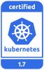

---

copyright:
  years: 2014, 2018
lastupdated: "2018-03-13"

---

{:new_window: target="_blank"}
{:shortdesc: .shortdesc}
{:screen: .screen}
{:pre: .pre}
{:table: .aria-labeledby="caption"}
{:codeblock: .codeblock}
{:tip: .tip}
{:download: .download}

# As versões do Kubernetes para {{site.data.keyword.containerlong_notm}}
{: #cs_versions}

O {{site.data.keyword.containerlong}} suporta simultaneamente múltiplas versões do Kubernetes. Quando uma versão mais recente (n) é liberada, as versões até 2 atrás (n-2) são suportadas. As versões com mais de 2 atrás do mais recente (n-3) são descontinuadas primeiro e depois não suportadas.
{:shortdesc}

As versões atuais do Kubernetes suportadas são:

- Mais recente: 1.9.3
- Padrão: 1.8.8
- Suportada: 1.7.4
- Descontinuada: 1.5.x, não suportada em 4 de abril de 2018

**Versões descontinuadas**: quando os clusters estão em execução em um Kubernetes descontinuado, você tem 30 dias para revisar e atualizar para uma versão suportada do Kubernetes antes que a versão se torne não suportada. Durante o período de descontinuação, é possível executar comandos limitados em seus clusters para incluir trabalhadores, recarregar trabalhadores e atualizar o cluster. Não é possível criar novos clusters na versão descontinuada.

**Versões não suportadas**: se você está executando os clusters em uma versão do Kubernetes que não é suportada, [revise potenciais impactos](#version_types) para atualizações e depois [atualize seu cluster](cs_cluster_update.html#update) imediatamente para continuar recebendo importantes atualizações de segurança e suporte.

Para verificar a versão do servidor, execute o comando a seguir.

```
kubectl version  --short | grep -i server
```
{: pre}

Saída de exemplo:

```
Versão do servidor: 1.8.8
```
{: screen}


## Tipos de atualização
{: #version_types}

O Kubernetes fornece estes tipos de atualização de versão:
{:shortdesc}

|Tipo de atualização|Exemplos de rótulos de versão|Atualizado por|Impacto
|-----|-----|-----|-----|
|Principal|1.x.x|Você|Mudanças de operação para clusters, incluindo scripts ou implementações.|
|Menor|x.5.x|Você|Mudanças de operação para clusters, incluindo scripts ou implementações.|
|Correção|x.x.3|IBM e você|Sem mudanças nos scripts ou implementações. A IBM atualiza os mestres automaticamente, mas você aplica correções a nós do trabalhador.|
{: caption="Impactos de atualizações do Kubernetes" caption-side="top"}

Por padrão, não será possível atualizar um mestre do Kubernetes mais de duas versões secundárias à frente. Por exemplo, se o seu mestre atual for versão 1.5 e você desejar atualizar para 1.8, deve-se atualizar para 1.7 primeiro. É possível forçar a atualização para continuar, mas atualizar mais de duas versões secundárias poderá causar resultados inesperados.
{: tip}

As informações a seguir resumem as atualizações que provavelmente têm impacto em apps implementados ao atualizar um cluster da versão anterior para uma nova versão. Revise o [log de mudanças do Kubernetes ](https://github.com/kubernetes/kubernetes/blob/master/CHANGELOG.md) para uma lista completa de mudanças nas versões do Kubernetes.

Para obter mais informações sobre o processo de atualização, veja [Atualizando clusters](cs_cluster_update.html#master) e [Atualizando nós do trabalhador](cs_cluster_update.html#worker_node).

Se você usa uma versão CLI do `kubectl` que corresponde pelo menos à versão `major.minor` de seus clusters, você pode ter resultados inesperados. Certifique-se de manter seu cluster do Kubernetes e as [versões da CLI](cs_cli_install.html#kubectl) atualizados.
{:tip}

## Versão 1.9
{: #cs_v19}

<p> O {{site.data.keyword.containerlong_notm}} é um produto certificado do Kubernetes para a versão 1.9 sob o programa de Certificação de conformidade de software do Kubernetes do CNCF. _Kubernetes® é uma marca registrada da Linux Foundation nos Estados Unidos e em outros países e é usada nos termos de uma licença da Linux Foundation._</p>

Revise as mudanças que você poderá precisar fazer quando estiver atualizando da versão anterior do Kubernetes para 1.9.

<br/>

### Atualizar antes do mestre
{: #19_before}

<table summary="Atualizações do Kubernetes para a versão 1.9">
<caption>Mudanças a serem feitas antes de atualizar o mestre para o Kubernetes 1.9</caption>
<thead>
<tr>
<th>Tipo</th>
<th>Descrição</th>
</tr>
</thead>
<tbody>
<tr>
<td>API de admissão do webhook</td>
<td>A API de admissão, que é usada quando o servidor de API chama webhooks de controle de admissão, é movida de <code>admission.v1alpha1</code> para <code>admission.v1beta1</code>. <em>Deve-se excluir quaisquer webhooks existentes antes de fazer upgrade de seu cluster</em> e atualizar os arquivos de configuração de webhook para usar a API mais recente. Essa mudança não é compatível com versões anteriores.</td>
</tr>
</tbody>
</table>

### Atualizar depois do mestre
{: #19_after}

<table summary="Atualizações do Kubernetes para a versão 1.9">
<caption>Mudanças a serem feitas depois de atualizar o mestre para o Kubernetes 1.9</caption>
<thead>
<tr>
<th>Tipo</th>
<th>Descrição</th>
</tr>
</thead>
<tbody>
<tr>
<td>Saída `kubectl`</td>
<td>Agora, quando o comando `kubectl` é usado para especificar `-o custom-columns` e a coluna não é localizada no objeto, você vê uma saída de `<none>`.<br>
Anteriormente, a operação falhava e você via a mensagem de erro `xxx is not found`. Se seus scripts dependem do comportamento anterior, atualize-os.</td>
</tr>
<tr>
<td>`kubectl patch`</td>
<td>Agora, quando nenhuma mudança é feita no recurso que é corrigido, o comando `kubectl patch` falha com `exit code 1`. Se seus scripts dependem do comportamento anterior, atualize-os.</td>
</tr>
<tr>
<td>Permissões de painel do Kubernetes</td>
<td>Os usuários precisam efetuar login no painel do Kubernetes com suas credenciais para visualizar recursos de cluster. A autorização RBAC `ClusterRoleBinding` do painel padrão do Kubernetes foi removida. Para obter instruções, veja [Ativando o painel do Kubernetes](cs_app.html#cli_dashboard).</td>
</tr>
<tr>
<td>Contaminações e tolerâncias</td>
<td>As contaminações `node.alpha.kubernetes.io/notReady` e `node.alpha.kubernetes.io/unreachable` foram mudadas para `node.kubernetes.io/not-ready` e `node.kubernetes.io/unreachable`, respectivamente.<br>
Embora as contaminações sejam atualizadas automaticamente, deve-se atualizar manualmente as tolerâncias para essas contaminações. Para cada namespace, exceto `ibm-system` e `kube-system`, determine se é necessário mudar as tolerâncias:<br>
<ul><li><code>kubectl get pods -n &lt;namespace&gt; -o yaml | grep "node.alpha.kubernetes.io/notReady" && echo "Action required"</code></li><li>
<code>kubectl get pods -n &lt;namespace&gt; -o yaml | grep "node.alpha.kubernetes.io/unreachable" && echo "Action required"</code></li></ul><br>
Se `Action required` for retornado, modifique as tolerâncias de pod de forma adequada.</td>
</tr>
<tr>
<td>API de admissão do webhook</td>
<td>Se você excluiu webhooks existente antes de atualizar o cluster, crie novos webhooks.</td>
</tr>
</tbody>
</table>


## Versão 1.8
{: #cs_v18}

<p> O {{site.data.keyword.containerlong_notm}} é um produto Kubernetes certificado para a versão 1.8 no programa CNCF Kubernetes Software Conformance Certification. _Kubernetes® é uma marca registrada da Linux Foundation nos Estados Unidos e em outros países e é usada nos termos de uma licença da Linux Foundation._</p>

Revise as mudanças que você poderá precisar fazer quando estiver atualizando da versão anterior do Kubernetes para 1.8.

<br/>

### Atualizar antes do mestre
{: #18_before}

<table summary="Atualizações do Kubernetes para versões 1.8">
<caption>Mudanças para fazer antes de atualizar o mestre para o Kubernetes 1.8</caption>
<thead>
<tr>
<th>Tipo</th>
<th>Descrição</th>
</tr>
</thead>
<tbody>
<tr>
<td>Nenhuma</td>
<td>Nenhuma mudança é necessária antes de atualizar o mestre</td>
</tr>
</tbody>
</table>

### Atualizar depois do mestre
{: #18_after}

<table summary="Atualizações do Kubernetes para versões 1.8">
<caption>Mudanças para fazer depois de atualizar o mestre para o Kubernetes 1.8</caption>
<thead>
<tr>
<th>Tipo</th>
<th>Descrição</th>
</tr>
</thead>
<tbody>
<tr>
<td>Login do painel do Kubernetes</td>
<td>A URL para acessar o painel do Kubernetes na versão 1.8 mudou e o processo de login inclui uma nova etapa de autenticação. Veja [Acessando o painel do Kubernetes](cs_app.html#cli_dashboard) para obter mais informações.</td>
</tr>
<tr>
<td>Permissões de painel do Kubernetes</td>
<td>Para forçar os usuários a efetuar login com suas credenciais para visualizar recursos de cluster na versão 1.8, remova a autorização RBAC do ClusterRoleBinding 1.7. Execute `kubectl delete clusterrolebinding -n kube-system kubernetes-dashboard`.</td>
</tr>
<tr>
<td>`kubectl delete`</td>
<td>O comando `kubectl delete` não reduz mais os objetos da API de carga de trabalho, como pods, antes de o objeto ser excluído. Se você requer a redução de escala do objeto, use [`kubectl scale` ](https://kubernetes.io/docs/reference/generated/kubectl/kubectl-commands#scale) antes de excluir o objeto.</td>
</tr>
<tr>
<td>`kubectl run`</td>
<td>O comando `kubectl run` deve usar múltiplas sinalizações para `--env` em vez de argumentos separados por vírgula. Por exemplo, execute <code>kubectl run --env &lt;x&gt;=&lt;y&gt; --env &lt;z&gt;=&lt;a&gt;</code> e não <code>kubectl run --env &lt;x&gt;=&lt;y&gt;,&lt;z&gt;=&lt;a&gt;</code>. </td>
</tr>
<tr>
<td>`kubectl stop`</td>
<td>O comando `kubectl stop` não está mais disponível.</td>
</tr>
</tbody>
</table>


## Versão 1.7
{: #cs_v17}

<p> O {{site.data.keyword.containerlong_notm}} é um produto Certified Kubernetes para a versão 1.7 no programa CNCF Kubernetes Software Conformance Certification.</p>

Revise as mudanças que você poderá precisar fazer quando estiver atualizando da versão anterior do Kubernetes para 1.7.

<br/>

### Atualizar antes do mestre
{: #17_before}

<table summary="Atualizações do Kubernetes para as versões 1.7 e 1.6">
<caption>Mudanças para fazer antes de atualizar o mestre para o Kubernetes 1.7</caption>
<thead>
<tr>
<th>Tipo</th>
<th>Descrição</th>
</tr>
</thead>
<tbody>
<tr>
<td>Armazenamento</td>
<td>Os scripts de configuração com `hostPath` e `mountPath` com o referência de diretório-pai como `../to/dir` não são permitidos. Mude os caminhos para caminhos absolutos simples, por exemplo, `/path/to/dir`.
<ol>
  <li>Determine se você precisa mudar os caminhos de armazenamento:</br>
  ```
  kubectl get pods --all-namespaces -o yaml | grep "\.\." && echo "Action required"
  ```
  </br>

  <li>Se `Ação necessária` é retornado, mude o pods para referenciar o caminho absoluto antes de atualizar todos os nós do trabalhador. Se o pod é de propriedade de outro recurso, como uma implementação, mude o [_PodSpec_ ](https://kubernetes.io/docs/api-reference/v1.7/#podspec-v1-core) dentro desse recurso.
</ol>
</td>
</tr>
</tbody>
</table>

### Atualizar depois do mestre
{: #17_after}

<table summary="Atualizações do Kubernetes para as versões 1.7 e 1.6">
<caption>Mudanças para fazer depois de atualizar o mestre para o Kubernetes 1.7</caption>
<thead>
<tr>
<th>Tipo</th>
<th>Descrição</th>
</tr>
</thead>
<tbody>
<tr>
<td>`apiVersion` de implementação</td>
<td>Depois de atualizar o cluster do Kubernetes 1.5, use `apps/v1beta1` para o campo `apiVersion` em novos arquivos YAML de `Deployment`. Continue a usar `extensions/v1beta1` para outros recursos, como `Ingress`.</td>
</tr>
<tr>
<td>kubectl</td>
<td>Após a atualização da CLI `kubectl`, estes comandos `kubectl create` devem usar múltiplas sinalizações em vez de argumentos separados por vírgula:<ul>
 <li>`Função`
 <li>`clusterrole`
 <li>`rolebinding`
 <li>`clusterrolebinding`
 <li>`secret`
 </ul>
</br>  Por exemplo, execute `kubectl create role --resource-name <x> --resource-name <y>` e não `kubectl create role --resource-name <x>,<y>`.</td>
</tr>
<tr>
<td>Network Policy</td>
<td>A anotação `net.beta.kubernetes.io/network-policy` não está mais disponível.
<ol>
  <li>Determine se você precisa mudar as políticas:</br>
  ```
  kubectl get ns -o yaml | grep "net.beta.kubernetes.io/network-policy" | grep "DefaultDeny" && echo "Action required"
  ```
  <li>Se `"Action required"` for retornado, inclua a política de rede a seguir em cada namespace do Kubernetes que foi listado:</br>

  <pre class="codeblock">
  <code>
  kubectl create -n &lt;namespace&gt; -f - &lt;&lt;EOF
  kind: NetworkPolicy
  apiVersion: networking.k8s.io/v1
  metadados:
    name: default-deny
    namespace: &lt;namespace&gt;
  spec:
    podSelector: {}
  EOF
  </code>
  </pre>

  <li> Depois de incluir a política de rede, remova a anotação `net.beta.kubernetes.io/network-policy`:
  ```
  kubectl annotate ns <namespace> --overwrite "net.beta.kubernetes.io/network-policy-"
  ```
  </li></ol>
</td></tr>
<tr>
<td>Planejamento de afinidade de Pod</td>
<td> A anotação `scheduler.alpha.kubernetes.io/affinity` está descontinuada.
<ol>
  <li>Para cada namespace, exceto `ibm-system` e `kube-system`, determine se você precisa atualizar o planejamento de afinidade de pod:</br>
  ```
  kubectl get pods -n <namespace> -o yaml | grep "scheduler.alpha.kubernetes.io/affinity" && echo "Action required"
  ```
  </br></li>
  <li>Se `"Action required"` for retornado, use o campo [_PodSpec_ ](https://kubernetes.io/docs/api-reference/v1.7/#podspec-v1-core) _affinity_ em vez da anotação `scheduler.alpha.kubernetes.io/affinity`.</li>
</ol>
</td></tr>
<tr>
<td>RBAC para `padrão` `ServiceAccount`</td>
<td><p>O `ClusterRoleBinding` do administrador para o `ServiceAccount` `default` no namespace `default` foi removido para melhorar a segurança do cluster. Os aplicativos que são executados no namespace `default` não têm mais privilégios de administrador de cluster para a API do Kubernetes e podem encontrar erros de permissão DENY de RBAC. Se seus aplicativos dependem desses privilégios, [crie os recursos de autorização RBAC](https://kubernetes.io/docs/admin/authorization/rbac/#api-overview) para seus apps.</p>
  <p>Conforme atualiza suas políticas de RBAC do app, você pode desejar reverter temporariamente para o `padrão` anterior. Copie, salve e aplique os arquivos a seguir com o comando `kubectl apply -f FILENAME`. <strong>Nota</strong>: reverter para se dar tempo para atualizar todos os recursos de aplicativos e não como uma solução a longo prazo.</p>

  <p><pre class="codeblock">
  <code>
  kind: ClusterRoleBinding
  apiVersion: rbac.authorization.k8s.io/v1
  metadata:
   name: admin-binding-nonResourceURLSs-default
  subjects:
    - kind: ServiceAccount
      name: default
      namespace: default
  roleRef:
   kind: ClusterRole
   name: admin-role-nonResourceURLSs
   apiGroup: rbac.authorization.k8s.io
  ---
  kind: ClusterRoleBinding
  apiVersion: rbac.authorization.k8s.io/v1
  metadata:
   name: admin-binding-resourceURLSs-default
  subjects:
    - kind: ServiceAccount
      name: default
      namespace: default
  roleRef:
   kind: ClusterRole
   name: admin-role-resourceURLSs
   apiGroup: rbac.authorization.k8s.io
  </code>
  </pre></p>
  </td>
</tr>
<tr>
<td>DNS do pod StatefulSet</td>
<td>Os pods StatefulSet perdem suas entradas DNS do Kubernetes depois de atualizar o mestre. Para restaurar as entradas DNS, exclua os pods StatefulSet. O Kubernetes recria os pods e restaura automaticamente as entradas DNS. Para obter mais informações, veja [Problema do Kubernetes ](https://github.com/kubernetes/kubernetes/issues/48327).</td>
</tr>
<tr>
<td>Tolerations</td>
<td>A anotação `scheduler.alpha.kubernetes.io/tolerations` não está mais disponível.
<ol>
  <li>Para cada namespace, exceto `ibm-system` e `kube-system`, determine se é necessário mudar as tolerâncias:</br>
  ```
  kubectl get pods -n <namespace> -o yaml | grep "scheduler.alpha.kubernetes.io/tolerations" && echo "Action required"
  ```
  </br>

  <li>Se `"Action required"` for retornado, use o campo [_PodSpec_ ](https://kubernetes.io/docs/api-reference/v1.7/#podspec-v1-core) _tolerations_ em vez da anotação `scheduler.alpha.kubernetes.io/tolerations`
</ol>
</td></tr>
<tr>
<td>Taints</td>
<td>A anotação `scheduler.alpha.kubernetes.io/taints` não está mais disponível.
<ol>
  <li>Determine se você precisa mudar as contaminações:</br>
  ```
  kubectl get nodes -o yaml | grep "scheduler.alpha.kubernetes.io/taints" && echo "Action required"
  ```
  <li>Se `"Action required"` é retornado, remova a anotação `scheduler.alpha.kubernetes.io/taints` para cada nó:</br>
  `kubectl annotate nodes <node> scheduler.alpha.kubernetes.io/taints-`
  <li>Inclua uma contaminação em cada nó:</br>
  `kubectl taint node <node> <taint>`
  </li></ol>
</td></tr>
</tbody>
</table>

## Archive
{: #k8s_version_archive}

### Version 1.5 (descontinuada)
{: #cs_v1-5}

A partir de 5 de março de 2018, os clusters do {{site.data.keyword.containershort_notm}} que executam o [Kubernetes versão 1.5](https://github.com/kubernetes/kubernetes/blob/master/CHANGELOG-1.5.md) estão descontinuados. Depois de 4 de abril de 2018, os clusters da versão 1.5 não podem receber atualizações de segurança ou suporte, a menos que eles sejam atualizados para a próxima versão mais recente ([Kubernetes 1.7](#cs_v17)).

[Revise o potencial impacto](cs_versions.html#cs_versions) de cada atualização de versão do Kubernetes e depois [atualize seus clusters](cs_cluster_update.html#update) imediatamente. Observe que você atualiza de uma versão para a próxima mais recente, como 1.5 para 1.7 ou 1.8 para 1.9.
