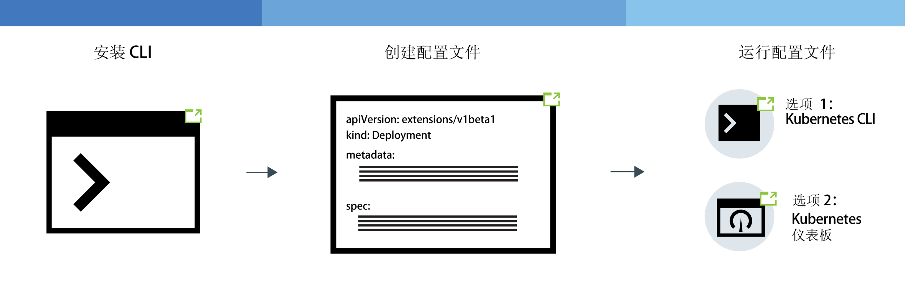
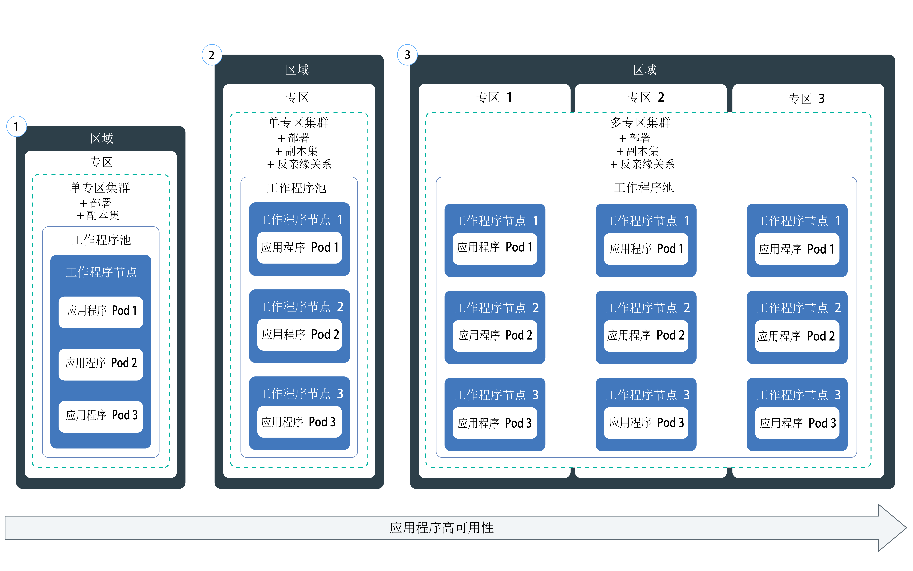

---

copyright:
  years: 2014, 2019
lastupdated: "2019-06-11"

keywords: kubernetes, iks, node.js, js, java, .net, go, flask, react, python, swift, rails, ruby, spring boot, angular

subcollection: containers

---

{:new_window: target="_blank"}
{:shortdesc: .shortdesc}
{:screen: .screen}
{:pre: .pre}
{:table: .aria-labeledby="caption"}
{:codeblock: .codeblock}
{:tip: .tip}
{:note: .note}
{:important: .important}
{:deprecated: .deprecated}
{:download: .download}
{:preview: .preview}


# 在集群中部署 Kubernetes 本机应用程序
{: #app}

您可以在 {{site.data.keyword.containerlong}} 中使用 Kubernetes 方法来部署容器中的应用程序，并确保这些应用程序始终保持启动并正常运行。例如，可以执行滚动更新以及回滚，而不给用户造成任何停机时间。
由于 Kubernetes 是一个可扩展的容器编排平台，不要求使用特定语言或应用程序，因此可以运行以您选择的语言编写的各种工作负载，例如无状态应用程序、有状态应用程序和数据处理应用程序。
{: shortdesc}

通过单击下图中的某个区域可了解用于部署应用程序的常规步骤。要首先了解基础知识吗？请试用[部署应用程序教程](/docs/containers?topic=containers-cs_apps_tutorial#cs_apps_tutorial)。


<map name="d62e18" id="d62e18">
<area href="/docs/containers?topic=containers-cs_cli_install" target="_blank" alt="安装 CLI。" title="安装 CLI。" shape="rect" coords="30, 69, 179, 209" />
<area href="https://kubernetes.io/docs/concepts/configuration/overview/" target="_blank" alt="为应用程序创建配置文件。请查看 Kubernetes 中的最佳实践。" title="为应用程序创建配置文件。请查看 Kubernetes 中的最佳实践。" shape="rect" coords="254, 64, 486, 231" />
<area href="#app_cli" target="_blank" alt="选项 1：通过 Kubernetes CLI 运行配置文件。" title="选项 1：通过 Kubernetes CLI 运行配置文件。" shape="rect" coords="544, 67, 730, 124" />
<area href="#cli_dashboard" target="_blank" alt="选项 2：在本地启动 Kubernetes 仪表板，然后运行配置文件。" title="选项 2：在本地启动 Kubernetes 仪表板，然后运行配置文件。" shape="rect" coords="544, 141, 728, 204" />
</map>

<br />


## 计划在集群中运行应用程序
{: #plan_apps}

在将应用程序部署到 {{site.data.keyword.containerlong_notm}} 集群之前，请决定要如何设置应用程序，以便可以正确访问应用程序并将其与 {{site.data.keyword.Bluemix_notm}} 中的其他服务集成。
{:shortdesc}

### 我可以为自己的应用程序创建什么类型的 Kubernetes 对象？
{: #object}

准备应用程序 YAML 文件时，您有许多选项可用于提高应用程序的可用性、性能和安全性。例如，您可以不使用单个 pod，而改为使用 Kubernetes 控制器对象来管理工作负载（例如，副本集、作业或守护程序集）。有关 pod 和控制器的更多信息，请查看 [Kubernetes 文档 ](https://kubernetes.io/docs/concepts/workloads/pods/pod-overview/)。用于管理 pod 副本集的部署是应用程序的常见用例。
{: shortdesc}

例如，要部署应用程序 pod，`kind: Deployment` 对象是一个不错的选择，因为使用该对象，可以指定副本集，从而提高 pod 的可用性。

下表描述了您可能会创建不同类型 Kubernetes 工作负载对象的原因。

|Object|描述|
| --- | --- |
|[`pod` ](https://kubernetes.io/docs/concepts/workloads/pods/pod/)|pod 是工作负载的最小可部署单元，可以容纳单个或多个容器。pod 与容器类似，也设计为可一次性使用，通常用于应用程序功能的单元测试。为了避免应用程序发生停机时间，请考虑使用 Kubernetes 控制器（例如，部署）来部署 pod。部署可帮助您管理多个 pod、副本、pod 缩放、应用等。|
|[`副本集` ](https://kubernetes.io/docs/concepts/workloads/controllers/replicaset/)|副本集可确保 pod 的多个副本同时运行，并且如果某个 pod 关闭，会重新安排一个 pod。您可以创建副本集来测试 pod 安排的工作方式，但要管理应用程序更新、应用和缩放，请改为创建部署。|
|[`部署` ](https://kubernetes.io/docs/concepts/workloads/controllers/deployment/)|部署是一种控制器，用于管理 pod 模板的 pod 或[副本集 ](https://kubernetes.io/docs/concepts/workloads/controllers/replicaset/)。您可以不使用部署来创建 pod 或副本集，以测试应用程序功能。对于生产级别的设置，请使用部署来管理应用程序更新、应用和缩放。|
|[`有状态集` ](https://kubernetes.io/docs/concepts/workloads/controllers/statefulset/)|有状态集与部署类似，也是管理 pod 副本集的控制器。但与部署不同的是，有状态集可确保 pod 具有唯一的网络身份，用于在重新安排期间保持相应 pod 的状态不变。如果要在云中运行工作负载，请尝试[将应用程序设计为无状态](/docs/containers?topic=containers-strategy#cloud_workloads)，这样服务实例可实现彼此独立，并且万一发生故障也不会导致服务中断。但是，某些应用程序（例如，数据库）必须是有状态的。对于这些情况，请考虑创建有状态集，并使用[文件](/docs/containers?topic=containers-file_storage#file_statefulset)存储器、[块](/docs/containers?topic=containers-block_storage#block_statefulset)存储器或[对象](/docs/containers?topic=containers-object_storage#cos_statefulset)存储器作为有状态集的持久性存储器。您还可以基于裸机工作程序节点来安装 [Portworx](/docs/containers?topic=containers-portworx)，然后使用 Portworx 作为高可用性软件定义的存储解决方案来管理有状态集的持久性存储器。|
|[`守护程序集` ](https://kubernetes.io/docs/concepts/workloads/controllers/daemonset/)|必须在集群中的每个工作程序节点上运行相同的 pod 时，请使用守护程序集。将工作程序节点添加到集群时，会自动安排守护程序集所管理的 pod。典型用例包括日志收集器（例如，`logstash` 或 `prometheus`），用于从每个工作程序节点收集日志，以提供对集群或应用程序的运行状况的洞察。|
|[`作业` ](https://kubernetes.io/docs/concepts/workloads/controllers/jobs-run-to-completion/)|作业可确保一个或多个 pod 成功运行至完成。您可以使用排队的作业或批处理作业来支持并行处理不同但相关的工作项，例如要呈现的特定数量的帧、要发送的电子邮件以及要转换的文件。要将作业安排为在特定时间运行，请使用 [`CronJob` ](https://kubernetes.io/docs/concepts/workloads/controllers/cron-jobs/)。|
{: caption="可以创建的 Kubernetes 工作负载对象的类型。" caption-side="top"}

### 如何向 Kubernetes 应用程序配置添加功能？
请参阅[在 YAML 文件中指定应用程序需求](#app_yaml)，以获取有关部署中可包含的内容的描述。示例包括：
* [副本集](#replicaset)
* [标签](#label)
* [亲缘关系](#affinity)
* [映像策略](#image)
* [端口](#port)
* [资源请求和限制](#resourcereq)
* [活性和就绪性探测器](#probe)
* [服务](#app-service)，用于在端口上公开应用程序服务
* [配置映射](#configmap)，用于设置容器环境变量
* [私钥](#secret)，用于设置容器环境变量
* [持久卷](#pv)，安装到容器以用于存储

### 如果我希望 Kubernetes 应用程序配置使用变量该怎么做？如何将这些变量添加到 YAML？
{: #variables}

要将变量信息添加到部署，而不是将数据硬编码到 YAML 文件中，可以使用 Kubernetes [`配置映射` ](https://kubernetes.io/docs/tasks/configure-pod-container/configure-pod-configmap/) 或[`私钥` ](https://kubernetes.io/docs/concepts/configuration/secret/) 对象。
{: shortdesc}

要使用配置映射或私钥，您需要将其安装到 pod。就在运行 pod 之前，配置映射或私钥会与 pod 组合在一起。您可以跨许多应用程序复用部署规范和映像，但要交换出定制的配置映射和私钥。尤其是私钥可能会在本地节点上占用大量存储空间，因此请相应地进行规划。

这两个资源都会定义键/值对，但这些对将用于不同的情境。

<dl>
<dt>配置映射</dt>
<dd>为部署中指定的工作负载提供非敏感配置信息。您可以通过三种主要方式来使用配置映射。<ul><li><strong>文件系统</strong>：可以将整个文件或一组变量安装到 pod。系统将根据文件中设置为该值的键名内容为每个条目创建一个文件。</li>
<li><strong>环境变量</strong>：动态设置容器规范的环境变量。</li>
<li><strong>命令行参数</strong>：设置容器规范中使用的命令行参数。</li></ul></dd>

<dt>私钥</dt>
<dd>为工作负载提供敏感信息，例如以下信息。请注意，集群的其他用户可能有权访问私钥，因此请确保您确定可以与这些用户共享私钥信息。
<ul><li><strong>个人可标识信息 (PII)</strong>：将敏感信息（例如，电子邮件地址或者公司合规性或政府法规要求的其他类型的信息）存储在私钥中。</li>
<li><strong>凭证</strong>：将密码、密钥和令牌等凭证置于私钥中，以减少意外暴露的风险。例如，[绑定服务](/docs/containers?topic=containers-service-binding#bind-services)到集群时，凭证会存储在私钥中。</li></ul></dd>
</dl>

想要使私钥更安全吗？请要求集群管理员在集群中[启用 {{site.data.keyword.keymanagementservicefull}}](/docs/containers?topic=containers-encryption#keyprotect)，以加密新私钥和现有私钥。
{: tip}

### 如何将 IBM 服务添加到应用程序（例如 Watson）？
请参阅[向应用程序添加服务](/docs/containers?topic=containers-service-binding#adding_app)。

### 该如何确保应用程序具有正确的资源？
[指定应用程序 YAML 文件](#app_yaml)时，可以将 Kubernetes 功能添加到应用程序配置，以帮助应用程序获得正确的资源。尤其是，对于 YAML 文件中定义的每个容器，[设置资源限制和请求 ](https://kubernetes.io/docs/concepts/configuration/manage-compute-resources-container/)。
{: shortdesc}

此外，集群管理员可能会设置可影响应用程序部署的资源控制，例如以下各项。
*  [资源配额 ](https://kubernetes.io/docs/concepts/policy/resource-quotas/)
*  [pod 优先级](/docs/containers?topic=containers-pod_priority#pod_priority)

### 如何访问我的应用程序？
您可以[使用 `clusterIP` 服务](/docs/containers?topic=containers-cs_network_planning#in-cluster)在集群中以专用方式访问您的应用程序。
{: shortdesc}

如果要以公共方式公开应用程序，您有不同的选项可用，具体取决于集群类型。
*  **免费集群**：可以使用 [NodePort 服务](/docs/containers?topic=containers-nodeport#nodeport)来公开应用程序。
*  **标准集群**：可以使用 [NodePort、LoadBalancer 或 Ingress 服务](/docs/containers?topic=containers-cs_network_planning#external)来公开应用程序。
*  **使用 Calico 变为专用的集群**：可以使用 [NodePort、LoadBalancer 或 Ingress 服务](/docs/containers?topic=containers-cs_network_planning#private_both_vlans)来公开应用程序。您还必须使用 Calico DNAT 前网络策略来阻止公共节点端口。
*  **仅专用 VLAN 标准集群**：可以使用 [NodePort、LoadBalancer 或 Ingress 服务 ](/docs/containers?topic=containers-cs_network_planning#plan_private_vlan)来公开应用程序。您还必须在防火墙中打开用于该服务的专用 IP 地址的端口。

### 部署应用程序后，如何监视其运行状况？
您可以为集群设置 {{site.data.keyword.Bluemix_notm}} [日志记录和监视](/docs/containers?topic=containers-health#health)。此外，还可以选择与第三方[日志记录或监视服务](/docs/containers?topic=containers-supported_integrations#health_services)集成。
{: shortdesc}

### 如何使应用程序保持最新？
如果要动态添加和除去应用程序以响应工作负载的使用情况，请参阅[缩放应用程序](/docs/containers?topic=containers-app#app_scaling)。
{: shortdesc}

如果要管理应用程序的更新，请参阅[管理滚动部署](/docs/containers?topic=containers-app#app_rolling)。

### 如何控制谁有权访问我的应用程序部署？
帐户和集群管理员可以在许多不同级别控制访问权：集群、Kubernetes 名称空间、pod 和容器。
{: shortdesc}

通过 {{site.data.keyword.Bluemix_notm}} IAM，可以在集群实例级别为各个用户、组或服务帐户分配许可权。您可以通过将用户限制为只能访问集群内的特定名称空间，从而进一步缩小集群访问范围。有关更多信息，请参阅[分配集群访问权](/docs/containers?topic=containers-users#users)。

要在 pod 级别控制访问权，可以[使用 Kubernetes RBAC 配置 pod 安全策略](/docs/containers?topic=containers-psp#psp)。

在应用程序部署 YAML 中，可以为 pod 或容器设置安全上下文。有关更多信息，请查看 [Kubernetes 文档 ](https://kubernetes.io/docs/tasks/configure-pod-container/security-context/)。

要在应用程序级别控制访问权吗？要创建无需更改应用程序代码即可随时更新的登录流，请尝试使用 [{{site.data.keyword.appid_long_notm}}](/docs/services/appid?topic=appid-getting-started)。
{: tip}

<br />


## 规划高可用性部署
{: #highly_available_apps}

设置在多个工作程序节点和集群上分发得越广泛，用户使用应用程序时遭遇停机时间的可能性就越低。
{: shortdesc}

查看以下潜在的应用程序设置（按可用性程度从低到高排序）。




1.  部署具有 n+2 个 pod，这些 pod 由单专区集群中单个节点中的副本集管理。
2.  部署具有 n+2 个 pod，这些 pod 由副本集管理并跨单专区集群的多个节点分布（反亲缘关系）。
3.  部署具有 n+2 个 pod，这些 pod 由副本集管理并在多个专区中跨多专区集群的多个节点分布（反亲缘关系）。

您还可以[使用全局负载均衡器连接不同区域中的多个集群](/docs/containers?topic=containers-ha_clusters#multiple_clusters)，以提高高可用性。

### 提高应用程序的可用性
{: #increase_availability}

请考虑以下选项以提高应用程序的可用性。
{: shortdesc}

<dl>
  <dt>使用部署和副本集来部署应用程序及其依赖项</dt>
    <dd><p>部署是一种 Kubernetes 资源，可用于声明应用程序的所有组件以及应用程序的依赖项。通过部署，您不必记下所有这些步骤，而可以将重点放在应用程序上。</p>
    <p>部署多个 pod 时，会自动为部署创建副本集；副本集用于监视这些 pod，并确保始终有指定数量的 pod 正常运行。pod 发生故障时，副本集会将无响应的 pod 替换为新的 pod。</p>
    <p>您可以使用部署来定义应用程序的更新策略，包括在滚动更新期间要添加的 pod 数，以及允许同时不可用的 pod 数。执行滚动更新时，部署将检查修订版是否有效，并在检测到故障时停止应用。</p>
    <p>通过部署，可以同时部署多个具有不同标志的修订版。例如，您可以先测试部署，然后再决定是否将其推送到生产环境。</p>
    <p>通过使用部署，可以跟踪任何已部署的修订版。如果遇到更新无法按预期运行的情况，可以使用此历史记录回滚到上一个版本。</p></dd>
  <dt>包含足够多的副本用于应用程序的工作负载，在此基础上再额外增加两个副本</dt>
    <dd>要使应用程序具有更高可用性且在出现故障时能够更快恢复，请考虑在处理预期工作负载所需最低要求的副本数基础上，再包含额外的副本。在某个 pod 崩溃且副本集尚未恢复已崩溃 pod 的情况下，额外的副本可处理工作负载。要针对同时发生两个故障的情况进行防护，请包含两个额外的副本。此设置是 N+2 模式，其中 N 是处理入局工作负载的副本数，+2 是额外两个副本。只要集群具有足够的空间，就可以拥有任意数量的 pod。</dd>
  <dt>跨多个节点分布 pod（反亲缘关系）</dt>
    <dd><p>创建部署时，各个 pod 可部署到同一工作程序节点。这称为亲缘关系或共存。为了保护应用程序不受工作程序节点故障的影响，可以在标准集群中使用 <code>podAntiAffinity</code> 选项将部署配置为跨多个工作程序节点分布 pod。可以定义两种类型的 pod 反亲缘关系：首选或必需。<p>有关更多信息，请参阅有关<a href="https://kubernetes.io/docs/concepts/configuration/assign-pod-node/" rel="external" target="_blank" title="（在新选项卡或窗口中打开）">为节点分配 pod</a> 的 Kubernetes 文档。</p>
      <p>有关应用程序部署中的亲缘关系的示例，请参阅[创建应用程序部署 YAML 文件](#app_yaml)。</p>
      </dd>
    </dd>
<dt>跨多个专区或区域分布 pod</dt>
  <dd><p>要保护应用程序不受专区故障的影响，可以在不同专区中创建多个集群，或者向多专区集群的工作程序池添加专区。多专区集群仅在[特定大城市区域](/docs/containers?topic=containers-regions-and-zones#zones)（例如，达拉斯）中可用。如果在不同专区中创建多个集群，那么必须[设置全局负载均衡器](/docs/containers?topic=containers-ha_clusters#multiple_clusters)。</p>
  <p>使用副本集并指定 pod 反亲缘关系时，Kubernetes 会跨节点分布应用程序 pod。如果节点位于多个专区中，那么 pod 会跨这些专区分布，从而提高应用程序的可用性。如果要限制应用程序仅在一个专区中运行，您可以配置 pod 亲缘关系，或者在一个专区中创建并标记工作程序池。有关更多信息，请参阅[多专区集群的高可用性](/docs/containers?topic=containers-ha_clusters#ha_clusters)。</p>
  <p><strong>在多专区集群部署中，应用程序 pod 会跨节点均匀分布吗？</strong></p>
  <p>pod 会跨专区均匀分布，但不一定会跨节点均匀分布。例如，如果有一个集群在 3 个专区中分别有 1 个节点，并且部署了包含 6 个 pod 的副本集，那么每个节点会获得 2 个 pod。但是，如果集群在 3 个专区中分别有 2 个节点，并且部署了包含 6 个 pod 的副本集，那么每个专区会安排 2 个 pod，这 2 个 pod 可能会每个节点安排 1 个，也可能 2 个 pod 都安排在一个节点上。要对安排具有更多控制权，可以[设置 pod 亲缘关系 ](https://kubernetes.io/docs/concepts/configuration/assign-pod-node)。</p>
  <p><strong>如果某个专区停止运行，如何将 pod 重新安排到其他专区中的剩余节点上？</strong></br>这取决于您在部署中使用的安排策略。如果包含[特定于节点的 pod 亲缘关系 ](https://kubernetes.io/docs/concepts/configuration/assign-pod-node/#node-affinity-beta-feature)，那么不会重新安排 pod。如果未包含此策略，那么会在其他专区中的可用工作程序节点上创建 pod，但可能不会对这些 pod 进行均衡。例如，这 2 个 pod 可能分布在 2 个可用节点上，也可能都安排到 1 个具有可用容量的节点上。与此类似，当不可用专区恢复时，不会自动删除 pod 并跨节点对这些 pod 进行重新均衡。如果要在该专区恢复后跨专区重新均衡 pod，请考虑使用 [Kubernetes Descheduler ](https://github.com/kubernetes-incubator/descheduler)。</p>
  <p><strong>提示</strong>：在多专区集群中，请尽量使每个专区的工作程序节点容量保持在 50%，以便有足够的剩余容量来保护集群不受专区故障的影响。</p>
  <p><strong>如果要跨区域分布应用程序该怎么做？</strong></br>要保护应用程序不受区域故障的影响，请在另一个区域中创建第二个集群，[设置全局负载均衡器](/docs/containers?topic=containers-ha_clusters#multiple_clusters)以连接集群，并使用部署 YAML 为应用程序部署具有 [pod 反亲缘关系 ](https://kubernetes.io/docs/concepts/configuration/assign-pod-node/) 的重复副本集。</p>
  <p><strong>如果应用程序需要持久性存储器该怎么做？</strong></p>
  <p>使用云服务，例如 [{{site.data.keyword.cloudant_short_notm}}](/docs/services/Cloudant?topic=cloudant-getting-started#getting-started) 或 [{{site.data.keyword.cos_full_notm}}](/docs/services/cloud-object-storage?topic=cloud-object-storage-about)。</p></dd>
</dl>

## 在 YAML 文件中指定应用程序需求
{: #app_yaml}

在 Kubernetes 中，您可在 YAML 文件中描述应用程序，该文件声明了 Kubernetes 对象的配置。然后，Kubernetes API 服务器会处理 YAML 文件，并在 etcd 数据存储中存储对象的配置和所需状态。Kubernetes 调度程序将工作负载安排到集群内的工作程序节点上，并考虑 YAML 文件中的规范、管理员设置的任何集群策略以及可用的集群容量。
{: shortdesc}

查看[完整 YAML 文件](https://raw.githubusercontent.com/IBM-Cloud/kube-samples/master/deploy-apps-clusters/deploy_wasliberty.yaml)的副本。然后，查看以下各部分以了解如何增强应用程序部署。

* [副本集](#replicaset)
* [标签](#label)
* [亲缘关系](#affinity)
* [映像策略](#image)
* [端口](#port)
* [资源请求和限制](#resourcereq)
* [活性和就绪性探测器](#probe)
* [服务](#app-service)，用于在端口上公开应用程序服务
* [配置映射](#configmap)，用于设置容器环境变量
* [私钥](#secret)，用于设置容器环境变量
* [持久卷](#pv)，安装到容器以用于存储
* [后续步骤](#nextsteps)
* [完整示例 YAML](#yaml-example)

<dl>
<dt>基本部署元数据</dt>
  <dd><p>将相应的 API 版本用于部署的 [Kubernetes 对象类型](#object)。API 版本将确定可供您使用的 Kubernetes 对象的受支持功能。在元数据中提供的名称是对象的名称，而不是对象的标签。与对象交互时可使用该名称，例如 `kubectl get deployment <name>`。</p>
  <p><pre class="codeblock"><code>apiVersion: apps/v1
kind: Deployment
metadata:
  name: wasliberty</code></pre></p></dd>

<dt id="replicaset">副本集</dt>
  <dd><p>要提高应用程序的可用性，可以在部署中指定副本集。在副本集内，定义要部署的应用程序实例数。副本集由 Kubernetes 部署进行管理和监视。如果一个应用程序实例停止运行，Kubernetes 会自动启动新的应用程序实例，以保持指定数量的应用程序实例。</p>
  <p><pre class="codeblock"><code>spec:
replicas: 3
        </pre></code></p></dd>

<dt id="label">标签</dt>
  <dd><p>通过[标签](/docs/containers?topic=containers-strategy#deploy_organize)，可以使用相同的 `key: value` 对来标记集群中不同类型的资源。然后，可以指定与标签匹配的选择器，以便可以基于这些其他资源进行构建。如果计划以公共方式公开应用程序，那么必须使用与服务中指定的选择器相匹配的标签。在示例中，部署 spec 使用的是与标签 `app: wasliberty` 相匹配的模板。</p>
  <p>您可以检索在集群中标注的对象，如查看 `staging` 或 `production` 组成部分。例如，列出集群中所有名称空间上具有 `env: production` 标签的所有资源。<strong>注：</strong>您需要访问所有名称空间才能运行此命令。<pre class="pre"><code>kubectl get all -l env=production --all-namespaces</code></pre></p>
  <ul><li>有关标签的更多信息，请参阅 [Kubernetes 文档 ](https://kubernetes.io/docs/concepts/overview/working-with-objects/labels/)。</li>
  <li>要将标签应用于工作程序节点，请使用标签[创建工作程序池](/docs/containers?topic=containers-add_workers#add_pool)或[更新现有工作程序池](/docs/containers?topic=containers-add_workers#worker_pool_labels)。</li>
  <li>有关更详细的示例，请参阅[使用标签将应用程序部署到特定工作程序节点](/docs/containers?topic=containers-app#node_affinity)。</li></ul>
  <p><pre class="codeblock"><code>selector:
  matchLabels:
app: wasliberty
template:
metadata:
labels:
app: wasliberty
</pre></code></p></dd>

<dt id="affinity">亲缘关系</dt>
  <dd><p>您希望对将 pod 安排在哪些工作程序节点上有更多控制权时，请指定亲缘关系（共存）。亲缘关系仅在安排时影响 pod。例如，要跨工作程序节点分布部署，而不允许 pod 安排在同一节点上，请将 <code>podAntiAffinity</code> 选项用于标准集群。可以定义两种类型的 pod 反亲缘关系：首选或必需。</p>
  <p>有关更多信息，请参阅有关<a href="https://kubernetes.io/docs/concepts/configuration/assign-pod-node/" rel="external" target="_blank" title="（在新选项卡或窗口中打开）">为节点分配 pod</a> 的 Kubernetes 文档。</p>
  <ul><li><strong>需要反亲缘关系</strong>：只能部署与工作程序节点数相等的副本数。例如，如果集群中有 3 个工作程序节点，但在 YAML 文件中定义了 5 个副本，那么仅部署 3 个副本。每个副本位于不同的工作程序节点上。剩余的 2 个副本保持暂挂状态。如果将另一个工作程序节点添加到集群，那么其中一个剩余副本将自动部署到这一新的工作程序节点。如果工作程序节点发生故障，那么该 pod 不会重新安排，因为需要亲缘关系策略。有关需要反亲缘关系的 YAML 示例，请参阅<a href="https://github.com/IBM-Cloud/kube-samples/blob/master/deploy-apps-clusters/liberty_requiredAntiAffinity.yaml" rel="external" target="_blank" title="（在新选项卡或窗口中打开）">使用需要 pod 反亲缘关系的 Liberty 应用程序</a>。</li>
  <li><strong>首选反亲缘关系</strong>：可以将 pod 部署到具有可用容量的节点，从而为工作负载提供更大的灵活性。如果可能，pod 将安排在不同的工作程序节点上。例如，如果集群中有 3 个工作程序节点具有足够的容量，那么可以在这些节点上安排 5 个副本 pod。但是，如果又向集群添加了 2 个工作程序节点，那么该亲缘关系规则并不会强制将现有节点上运行的两个额外 pod 重新安排到空闲节点上。</li>
  <li><strong>工作程序节点亲缘关系</strong>：可以将部署配置为仅在特定工作程序节点（例如，裸机）上运行。有关更多信息，请参阅[使用标签将应用程序部署到特定工作程序节点](/docs/containers?topic=containers-app#node_affinity)。</li></ul>
  <p>首选反亲缘关系的示例：</p>
  <p><pre class="codeblock"><code>spec:
      affinity:
        podAntiAffinity:
          preferredDuringSchedulingIgnoredDuringExecution:
      - weight: 100
        podAffinityTerm:
          labelSelector:
            matchExpressions:
            - key: app
              operator: In
              values:
              - wasliberty
          topologyKey: kubernetes.io/hostname</pre></code></p></dd>

<dt id="image">容器映像</dt>
  <dd>
  <p>指定要用于容器的映像、该映像的位置以及映像拉取策略。如果未指定映像标记，那么缺省情况下，会拉取标记为 `latest` 的映像。</p>
  <p>**注意**：避免将 latest 标记用于生产工作负载。如果使用的是公共存储库或共享存储库（例如，Docker Hub 或 {{site.data.keyword.registryshort_notm}}），那么您可能尚未使用最新映像测试过工作负载。</p>
  <p>例如，要列出公共 IBM 映像的标记，请执行以下操作：</p>
  <ol><li>切换到全局注册表区域。<pre class="pre"><code>ibmcloud cr region-set global</code></pre></li>
  <li>列出 IBM 映像。<pre class="pre"><code>ibmcloud cr images --include-ibm</code></pre></li></ol>
  <p>缺省 `imagePullPolicy` 设置为 `IfNotPresent`，仅当映像在本地不存在时才会拉取该映像。如果希望每次容器启动时都拉取映像，请指定 `imagePullPolicy: Always`。</p>
  <p><pre class="codeblock"><code>containers:
- name: wasliberty
  image: icr.io/ibmliberty:webProfile8
  imagePullPolicy: Always</pre></code></p></dd>

<dt id="port">用于应用程序服务的端口</dt>
  <dd><p>选择容器端口以用于打开应用程序的服务。要查看需要打开哪个端口，请参阅应用程序规范或 Dockerfile。该端口可从专用网络进行访问，但不能从公用网络连接进行访问。要以公共方式公开应用程序，那么必须创建 NodePort、LoadBalancer 或 Ingress 服务。在[创建`服务`对象](#app-service)时，可使用此相同的端口号。</p>
  <p><pre class="codeblock"><code>ports:
- containerPort: 9080</pre></code></p></dd>

<dt id="resourcereq">资源请求和限制</dt>
  <dd><p>作为集群管理员，您可以通过为集群中的每个 Kubernetes 名称空间创建一个 [<code>ResourceQuota</code> 对象 ](https://kubernetes.io/docs/concepts/policy/resource-quotas/)，确保共享该集群的团队使用的计算资源（内存和 CPU）不会超过其公平份额。如果集群管理员设置了计算资源配额，那么部署模板中的每个容器都必须指定内存和 CPU 的资源请求和限制，否则创建 pod 会失败。</p>
  <p><ol><li>检查是否为名称空间设置了资源配额。<pre class="pre"><code>kubectl get quota --namespace=<namespace></code></pre></li>
  <li>查看配额限制。<pre class="pre"><code>kubectl describe quota <quota_name> --namespace=<namespace></code></pre></li></ol></p>
  <p>即使未设置任何资源配额，您也可以在部署中包含资源请求和限制，以改进对工作程序节点资源的管理。</p><p class="note">如果容器超过其限制，容器可能会重新启动或发生故障。如果容器超过请求，那么当工作程序节点即将耗尽超过的该资源时，可能会逐出该容器的 pod。有关故障诊断的更多信息，请参阅 [pod 重新启动一再失败或 pod 被意外除去](/docs/containers?topic=containers-cs_troubleshoot_clusters#pods_fail)。</p>
  <p>**请求**：调度程序保留供容器使用的最小资源量。如果资源量等于限制，那么将保证请求。如果资源量小于限制，那么仍会保证请求，但调度程序可以使用请求和限制之间的差异来利用其他容器的资源。</p>
  <p>**限制**：容器可以使用的最大资源量。如果跨容器使用的资源总量超过工作程序节点上的可用资源量，那么会逐出容器以释放空间。为了避免逐出，请将资源请求设置为等于容器限制。如果未指定任何限制，那么缺省值为工作程序节点的容量。</p>
  <p>有关更多信息，请参阅 [Kubernetes 文档 ](https://kubernetes.io/docs/concepts/configuration/manage-compute-resources-container/)。</p>
  <p><pre class="codeblock"><code>resources:
  requests:
    memory: "512Mi"
    cpu: "500m"
  limits:
    memory: "1024Mi"
    cpu: "1000m"</pre></code></p></dd>

<dt id="probe">活性和就绪性探测器</dt>
  <dd><p>缺省情况下，Kubernetes 在 pod 中的所有容器启动后，会将流量发送到应用程序 pod，如果容器崩溃，会重新启动这些容器。但是，您可以设置运行状况检查，以提高服务流量路由的稳健性。例如，应用程序可能会有启动延迟。应用程序进程可能在整个应用程序完全就绪之前启动，这可能会影响响应，尤其是跨多个实例扩展时。通过运行状况检查，您可以让系统了解应用程序是否在运行以及是否已准备好接收请求。通过设置这两个探测器，还可以帮助避免在执行应用程序的[滚动更新](#app_rolling)时发生停机时间。您可以设置两种类型的运行状况检查：活性和就绪性探测器。</p>
  <p>**活性探测器**：设置活性探测器可检查容器是否在运行。如果该探测器失败，那么容器将重新启动。如果容器未指定活性探测器，那么该探测器会成功，因为它会假定当容器处于**正在运行**状态时即有活性。</p>
  <p>**就绪性探测器**：设置就绪性探测器可检查容器是否已准备好接收请求和外部流量。如果该探测器失败，那么会将 pod 的 IP 地址作为与该 pod 匹配的服务的可用 IP 地址除去，但不会重新启动容器。如果应用程序需要一段时间才能启动，那么设置具有初始延迟的就绪性探测器就尤其重要。在初始延迟之前，探测器不会启动，从而为容器提供启动时间。如果容器未提供就绪性探测器，那么该探测器会成功，因为它会假定当容器处于**正在运行**状态时即有活性。</p>
  <p>您可以将探测器设置为命令、HTTP 请求或 TCP 套接字。示例使用的是 HTTP 请求。为活性探测器提供比就绪性探测器长的时间。有关更多信息，请参阅 [Kubernetes 文档 ](https://kubernetes.io/docs/tasks/configure-pod-container/configure-liveness-readiness-probes/)。</p>
  <p><pre class="codeblock"><code>livenessProbe:
  httpGet:
    path: /
    port: 9080
  initialDelaySeconds: 300
  periodSeconds: 15
readinessProbe:
  httpGet:
    path: /
    port: 9080
  initialDelaySeconds: 45
  periodSeconds: 5</pre></code></p></dd>

<dt id="app-service">公开应用程序服务</dt>
  <dd><p>您可以创建用于公开应用程序的服务。在 `spec` 部分中，确保使 `port` 和 label 值与部署中使用的值相匹配。该服务将公开与标签匹配的对象，例如以下示例中的 `app: wasliberty`。</p>
  <ul><li>缺省情况下，服务会使用 [`ClusterIP ` ](https://kubernetes.io/docs/tutorials/kubernetes-basics/expose/expose-intro/)，此项使服务只可在集群内进行访问，而不能从集群外部进行访问。</li>
  <li>可以创建 NodePort、LoadBalancer 或 Ingress 服务以公共方式公开应用程序。这些服务有两个 IP：一个外部 IP 和一个内部 IP。外部 IP 上收到流量时，会将其转发到内部集群 IP。然后，流量从内部集群 IP 路由到应用程序的容器 IP。</li>
  <li>以下示例使用 `NodePort` 在集群外部公开服务。有关如何设置外部访问权的更多信息，请参阅[选择 NodePort、LoadBalancer 或 Ingress 服务](/docs/containers?topic=containers-cs_network_planning#external)。</li></ul>
  <p><pre class="codeblock"><code>apiVersion: v1
kind: Service
metadata:
name: wasliberty
labels:
app: wasliberty
spec:
  ports:
  - port: 9080
  selector:
    app: wasliberty
  type: NodePort</pre></code></p></dd>

<dt id="configmap">用于容器环境变量的配置映射</dt>
<dd><p>配置映射提供了部署工作负载的非敏感配置信息。以下示例显示如何在部署 YAML 的容器 spec 部分中，将配置映射中的值作为环境变量引用。通过引用配置映射中的值，可以将此配置信息与部署相分离，从而使容器化应用程序保持可移植。<ul><li>[帮我决定是否将 Kubernetes `配置映射`或`私钥`对象用于变量](#variables)。</li>
<li>有关使用配置映射的更多方法，请参阅 [Kubernetes 文档 ](https://kubernetes.io/docs/tasks/configure-pod-container/configure-pod-configmap/)。</li></ul></p>
<p><pre class="codeblock"><code>apiVersion: apps/v1
kind: Deployment
metadata:
name: wasliberty
spec:
replicas: 3
        template:
    ...
spec:
      ...
      containers:
      - name: wasliberty
        ...
        env:
          - name: VERSION
            valueFrom:
              configMapKeyRef:
                name: wasliberty
                key: VERSION
          - name: LANGUAGE
            valueFrom:
              configMapKeyRef:
                name: wasliberty
                key: LANGUAGE
        ...
---
apiVersion: v1
kind: ConfigMap
metadata:
  name: wasliberty
  labels:
    app: wasliberty
data:
  VERSION: "1.0"
  LANGUAGE: en</pre></code></p></dd>

  <dt id="secret">用于容器环境变量的私钥</dt>
  <dd><p>私钥提供了部署工作负载的敏感配置信息（例如，密码）。以下示例显示如何在部署 YAML 的容器 spec 部分中，将私钥中的值作为环境变量引用。您还可以将私钥安装为卷。通过引用私钥中的值，可以将此配置信息与部署相分离，从而使容器化应用程序保持可移植。<ul><li>[帮我决定是否将配置映射或私钥用于变量](#variables)。</li>
  <li>有关更多信息，请参阅[了解何时使用私钥](/docs/containers?topic=containers-encryption#secrets)。</li></ul></p>
  <p><pre class="codeblock"><code>apiVersion: apps/v1
kind: Deployment
metadata:
name: wasliberty
spec:
replicas: 3
        template:
      ...
spec:
        ...
        containers:
        - name: wasliberty
          ...
          env:
          - name: username
            valueFrom:
              secretKeyRef:
                name: wasliberty
                key: username
          - name: password
            valueFrom:
              secretKeyRef:
                name: wasliberty
                key: password
          ...
  ---
  apiVersion: v1
  kind: Secret
  metadata:
    name: wasliberty
    labels:
      app: wasliberty
  type: Opaque
  data:
    username: dXNlcm5hbWU=
    password: cGFzc3dvcmQ=</pre></code></p></dd>

<dt id="pv">用于容器存储的持久卷</dt>
<dd><p>持久卷 (PV) 与物理存储器连接，为容器工作负载提供持久性数据存储器。以下示例显示如何向应用程序添加持久性存储器。要供应持久性存储器，可创建持久卷声明 (PVC)，以描述要拥有的文件存储器的类型和大小。创建 PVC 后，将使用[动态供应](/docs/containers?topic=containers-kube_concepts#dynamic_provisioning)自动创建持久卷和物理存储器。通过在部署 YAML 中引用 PVC，存储器会自动安装到应用程序 pod。当 pod 中的容器将数据写入 `/test` 安装路径目录时，数据将存储在 NFS 文件存储器实例上。</p><ul><li>有关更多信息，请参阅[了解 Kubernetes 存储器基础知识](/docs/containers?topic=containers-kube_concepts#kube_concepts)。</li><li>有关可以供应的其他存储器类型的选项，请参阅[规划高可用性持久性存储器](/docs/containers?topic=containers-storage_planning#storage_planning)。</li></ul>
<p><pre class="codeblock"><code>apiVersion: apps/v1
kind: Deployment
metadata:
name: wasliberty
spec:
replicas: 3
        template:
    ...
spec:
      ...
      containers:
      - name: wasliberty
        ...
        volumeMounts:
        - name: pvmount
          mountPath: /test
      volumes:
      - name: pvmount
        persistentVolumeClaim:
          claimName: wasliberty
        ...
---
apiVersion: v1
kind: PersistentVolumeClaim
metadata:
  name: wasliberty
  annotations:
    volume.beta.kubernetes.io/storage-class: "ibmc-file-bronze"
  labels:
    billingType: "hourly"
    app: wasliberty
spec:
  accessModes:
    - ReadWriteMany
         resources:
           requests:
             storage: 24Gi
        </pre></code></p></dd>

<dt id="nextsteps">准备好部署应用程序了吗？</dt>
<dd><ul><li>[使用完整 YAML 的副本作为模板以开始](https://raw.githubusercontent.com/IBM-Cloud/kube-samples/master/deploy-apps-clusters/deploy_wasliberty.yaml)。</li>
<li>[通过 Kubernetes 仪表板部署应用程序](/docs/containers?topic=containers-app#app_ui)。</li>
<li>[通过 CLI 部署应用程序](/docs/containers?topic=containers-app#app_cli)。</li></ul></dd>

</dl>

### 完整示例部署 YAML
{: #yaml-example}

以下示例是[先前逐个部分讨论](#app_yaml)的部署 YAML 的副本。您还可以[从 GitHub 下载 YAML](https://raw.githubusercontent.com/IBM-Cloud/kube-samples/master/deploy-apps-clusters/deploy_wasliberty.yaml)。
{: shortdesc}

应用 YAML：

```
kubectl apply -f file.yaml [-n <namespace>]
```
{: pre}

示例 YAML：

```yaml
apiVersion: apps/v1
kind: Deployment
metadata:
  name: wasliberty
spec:
  replicas: 3
  selector:
    matchLabels:
      app: wasliberty
  template:
    metadata:
      labels:
        app: wasliberty
    spec:
      affinity:
        podAntiAffinity:
          preferredDuringSchedulingIgnoredDuringExecution:
          - weight: 100
            podAffinityTerm:
              labelSelector:
                matchExpressions:
                - key: app
                  operator: In
                  values:
                  - wasliberty
              topologyKey: kubernetes.io/hostname
      containers:
      - name: wasliberty
        image: icr.io/ibmliberty
        env:
          - name: VERSION
            valueFrom:
              configMapKeyRef:
                name: wasliberty
                key: VERSION
          - name: LANGUAGE
            valueFrom:
              configMapKeyRef:
                name: wasliberty
                key: LANGUAGE
          - name: username
            valueFrom:
              secretKeyRef:
                name: wasliberty
                key: username
          - name: password
            valueFrom:
              secretKeyRef:
                name: wasliberty
                key: password
        ports:
          - containerPort: 9080
        resources:
          requests:
            memory: "512Mi"
            cpu: "500m"
          limits:
            memory: "1024Mi"
            cpu: "1000m"
        livenessProbe:
          httpGet:
            path: /
            port: 9080
          initialDelaySeconds: 300
          periodSeconds: 15
        readinessProbe:
          httpGet:
            path: /
            port: 9080
          initialDelaySeconds: 45
          periodSeconds: 5
        volumeMounts:
        - name: pvmount
          mountPath: /test
      volumes:
      - name: pvmount
        persistentVolumeClaim:
          claimName: wasliberty
---
apiVersion: v1
kind: Service
metadata:
  name: wasliberty
  labels:
    app: wasliberty
spec:
  ports:
  - port: 9080
  selector:
    app: wasliberty
  type: NodePort
---
apiVersion: v1
kind: ConfigMap
metadata:
  name: wasliberty
  labels:
    app: wasliberty
data:
  VERSION: "1.0"
  LANGUAGE: en
---
apiVersion: v1
kind: Secret
metadata:
  name: wasliberty
  labels:
    app: wasliberty
type: Opaque
data:
  username: dXNlcm5hbWU=
  password: cGFzc3dvcmQ=
---
apiVersion: v1
kind: PersistentVolumeClaim
metadata:
  name: wasliberty
  annotations:
    volume.beta.kubernetes.io/storage-class: "ibmc-file-bronze"
  labels:
    billingType: "hourly"
    app: wasliberty
spec:
  accessModes:
    - ReadWriteMany
  resources:
    requests:
      storage: 24Gi
```
{: codeblock}

<br />


## 使用 Kustomize 管理 Kubernetes 配置文件以在多个环境中复用
{: #kustomize}

作为[十二要素 ](https://12factor.net/)（云本机应用程序）的一部分，您希望通过设置持续开发和交付管道（该管道使用版本控制的通用代码库源）使开发到生产保持一致。在代码库存储库中，存储 Kubernetes 资源配置清单文件，文件通常为 YAML 格式。可以使用 Kubernetes 项目 [Kustomize ](https://kustomize.io/) 来标准化和定制跨多个环境的部署。
{: shortdesc}

例如，可以设置基本 `kustomization` YAML 来声明 Kubernetes 对象，例如在开发、测试和生产环境中共享的部署和 PVC。接下来，可以设置单独的 `kustomization` YAML，这些 YAML 具有针对每个环境的定制配置，例如生产中的副本数多于测试。然后，这些定制的 YAML 可以覆盖共享的基本 YAML 或基于该 YAML 进行构建，以便您可以管理基本相同，而仅在进行源代码控制的一些覆盖配置方面有差异的环境。有关 Kustomize 的更多信息（例如，词汇表和常见问题），请查看 [Kustomize 文档 ](https://github.com/kubernetes-sigs/kustomize/tree/master/docs)。

开始之前：
*   [创建](/docs/containers?topic=containers-clusters#clusters_ui)或[更新](/docs/containers?topic=containers-update)为运行 Kubernetes V1.14 或更高版本的集群。
*   确保 [`kubectl` 版本](/docs/containers?topic=containers-cs_cli_install#kubectl)与集群版本相匹配。
*   [登录到您的帐户。如果适用，请将相应的资源组设定为目标。为集群设置上下文。](/docs/containers?topic=containers-cs_cli_install#cs_cli_configure)

要使用 Kustomize 设置配置文件，请执行以下操作：
1.  [安装 `kustomize` 工具 ](https://github.com/kubernetes-sigs/kustomize/blob/master/docs/INSTALL.md)。
    *   对于 MacOS，可以使用 `brew` 软件包管理器。
        ```
        brew install kustomize
        ```
        {: pre}
    *   对于 Windows，可以使用 `chocolatey` 软件包管理器。
        ```
        choco install kustomize
        ```
        {: pre}
2.  在版本控制系统中为应用程序创建目录，例如 Git。
    ```
    git init ~/<my_app>
    ```
    {: pre}
3.  为 `kustomize` [`base` ](https://github.com/kubernetes-sigs/kustomize/blob/master/docs/glossary.md#base) 目录、[`overlay`](https://github.com/kubernetes-sigs/kustomize/blob/master/docs/glossary.md#overlay) 目录和环境目录（例如，staging 和 prod）创建存储库结构。在后续步骤中，设置这些存储库以用于 `Kustomize`。
    ```
    mkdir -p ~/<my_app>/base &&
    mkdir -p ~/<my_app>/overlay &&
    mkdir -p ~/<my_app>/overlay/staging &&
    mkdir -p ~/<my_app>/overlay/prod
    ```
    {: pre}
    
    示例存储库结构：
    ```
    .
    ├── base
    └── overlay
        ├── prod
        └── staging
    ```
    {: screen}
4.  设置 `base` 存储库。
    1.  导航至 base 存储库。
        ```
        cd ~/<my_app>/base
        ```
        {: pre}
    2.  为应用程序部署创建一组初始的 Kubernetes 配置 YAML 文件。您可以使用 `wasliberty` [YAML 示例](#yaml-example)来创建部署、服务、配置映射和持久卷声明。
    3.  创建 [`kustomization` 文件 ](https://github.com/kubernetes-sigs/kustomize/blob/master/docs/kustomization.yaml)，用于指定要在环境中应用的基本配置。`kustomization` 文件必须包含存储在同一 `base` 存储库中的 Kubernetes 资源配置 YAML 的列表。在 `kustomization` 文件中，还可以添加应用于 base 存储库中所有资源 YAML 的配置，例如附加到所有资源名称的前缀或后缀，以及标签、私钥、配置映射、在其中创建所有资源的现有名称空间等。
      ```
        apiVersion: kustomize.config.k8s.io/v1beta1
        kind: Kustomization
        namespace: wasliberty
        namePrefix: kustomtest-
        nameSuffix: -v2
        commonLabels:
          app: kustomized-wasliberty
        resources:
        - deployment.yaml
        - service.yaml
        - pvc.yaml
        - configmap.yaml
        - secret.yaml
        ```
        {: codeblock}
        
        `resources` 下各 YAML 的名称必须与 `base` 存储库中其他文件的名称相匹配。您可在同一文件中包含多个配置，但在示例中，这些配置分别位于不同的文件中，例如 `deployment.yaml`、`service.yaml` 和 `pvc.yaml`。
        
    4.  使用在 `kustomization` 基本 YAML 文件中定义的配置来构建资源 YAML 文件。通过将 `kustomization` 和资源 YAML 中的配置组合在一起来构建资源。组合的 YAML 文件将在终端输出的 `stdout` 中返回。使用此相同的命令可构建对 `kustomization` YAML 进行的任何后续更改，例如添加新标签。
        ```
        kustomize build
        ```
        {: pre}
5.  使用对每个环境（例如，编译打包和生产）唯一的 `kustomization` YAML 文件来设置 overlay 存储库。
    1.  在 staging 存储库中，创建 `kustomization.yaml` 文件。添加对于编译打包唯一的任何配置（例如，标签或映像标记），或为要测试的新组件添加 YAML。
        ```
        apiVersion: kustomize.config.k8s.io/v1beta1
        kind: Kustomization
        namePrefix: staging-
        commonLabels:
          env: staging
          owner: TeamA
        bases:
        - ../../base
        patchesStrategicMerge:
        - configmap.yaml
        - new_staging_resource.yaml
        resources:
        - new_staging_resource.yaml
        ```
        {: codeblock}
        <table summary="表中第一列描述了 YAML 文件字段，第二列描述了如何填充这些字段。">
    <caption>YAML 的组成部分</caption>
        <thead>
        <th colspan=2> 了解 YAML 文件的组成部分</th>
        </thead>
        <tbody>
        <tr>
        <td><code>namePrefix</code></td>
        <td>针对要通过编译打包 `kustomization` 文件创建的每个资源，指定要附加到其名称的前缀，如 `staging-`。</td>
        </tr>
        <tr>
        <td><code>commonLabels</code></td>
        <td>添加对编译打包对象（例如，编译打包环境和负责团队）唯一的标签。</td>
        </tr>
        <tr>
        <td><code>bases</code></td>
        <td>将目录或 URL 的相对路径添加到包含基本 `kustomization` 文件的远程存储库。在此示例中，相对路径指向先前创建的 `base` 存储库中的基本 `kustomization` 文件。对于覆盖 `kustomization`，此字段是必需的。</td>
        </tr>
        <tr>
        <td><code>patchesStrategicMerge</code></td>
        <td>列出要合并到基本 `kustomization` 的资源配置 YAML 文件。您还必须将这些文件添加到 `kustomization` 文件所在的存储库，例如 `overlay/staging`。这些资源配置文件可以包含小型更改，这些更改会合并到与补丁同名的基本配置文件。该资源将获取 `base` 配置文件中的所有组成部分，以及在 `overlay` 配置文件中指定的任何其他组成部分。<br><br>如果配置是不在 base 中的新文件，那么还必须将文件名添加到 `resources` 字段中。</td>
        </tr>
        <tr>
        <td><code>resources</code></td>
        <td>列出对 staging 存储库唯一且不包含在 base 存储库中的任何资源配置 YAML 文件。请将这些文件同时包含在 `patchesStrategicMerge` 字段中，并将其添加到 `kustomization` 文件所在的存储库，例如 `overlay/staging`。</td>
        </tr>
        <tr>
        <td>其他可能的配置</td>
        <td>有关可添加到文件的更多配置，请参阅 [`kustomization` YAML 示例 ](https://github.com/kubernetes-sigs/kustomize/blob/master/docs/kustomization.yaml)。</td>
        </tr>
        </tbody></table>
    2.  构建编译打包覆盖配置文件。
        ```
        kustomize build overlay/staging
        ```
        {: pre}
    3.  重复这些步骤以创建生产覆盖 `kustomization` 及其他配置 YAML 文件。例如，可能会增加 `deployment.yaml` 中的副本数，以便生产环境可以处理更多用户请求。
    4.  复查 `kustomize` 存储库结构，以确保它包含您需要的所有 YAML 配置文件。此结构可能类似于以下示例。
        ```
        ├── base
        │   ├── configmap.yaml
        │   ├── deployment.yaml
        │   ├── kustomization.yaml
        │   ├── pvc.yaml
        │   ├── secret.yaml
        │   └── service.yaml
        └── overlay
            ├── prod
            │   ├── deployment.yaml
            │   ├── kustomization.yaml
            │   └── new_prod_resource.yaml
            └── staging
                ├── configmap.yaml
                ├── kustomization.yaml
                └── new_staging_resource.yaml
        ```
        {: screen}
6.  对要部署的环境应用 Kubernetes 资源。以下示例使用 staging 存储库。
    1.  导航至 overlay 下的 staging 目录。如果在上一步中未构建资源，请立即创建这些资源。
        ```
        cd overlay/staging && kustomize build
        ```
        {: pre}
    2.  将 Kubernetes 资源应用于集群。包含 `-k` 标志和 `kustomization` 文件所在的目录。例如，如果已经位于 staging 目录中，请包含 `../staging` 以标记该目录的路径。
        ```
        kubectl apply -k ../staging
        ```
        {: pre}
输出示例：
    ```
        configmap/staging-kustomtest-configmap-v2 created
        secret/staging-kustomtest-secret-v2 created
        service/staging-kustomtest-service-v2 created
        deployment.apps/staging-kustomtest-deployment-v2 created
        job.batch/staging-pi created
        persistentvolumeclaim/staging-kustomtest-pvc-v2 created
        ```
    3.  检查以确保应用了对于编译打包唯一的更改。例如，如果添加了 `staging-` 前缀，那么创建的 pod 和其他资源将在其名称中包含此前缀。
        ```
        kubectl get -k ../staging
        ```
        {: pre}
输出示例：
    ```
        NAME                                        DATA   AGE
        configmap/staging-kustomtest-configmap-v2   2      90s

        NAME                                  TYPE     DATA   AGE
        secret/staging-kustomtest-secret-v2   Opaque   2      90s

        NAME                                    TYPE       CLUSTER-IP      EXTERNAL-IP   PORT(S)          AGE
        service/staging-kustomtest-service-v2   NodePort   172.21.xxx.xxx   <none>        9080:30200/TCP   90s

        NAME                                               READY   UP-TO-DATE   AVAILABLE   AGE
        deployment.apps/staging-kustomtest-deployment-v2   0/3     3            0           91s

        NAME                   COMPLETIONS   DURATION   AGE
        job.batch/staging-pi   1/1           41s        2m37s

        NAME                                              STATUS    VOLUME   CAPACITY   ACCESS MODES   STORAGECLASS       AGE
        persistentvolumeclaim/staging-kustomtest-pvc-v2   Pending                                      ibmc-file-bronze   90s
        ```
        {: screen}
    4.  针对要构建的每个环境，重复上述步骤。
7.  **可选**：通过除去使用 Kustomize 应用的所有资源，清除您的环境。
    ```
    kubectl delete -k <directory>
    ```
    {: pre}
输出示例：
    ```
    configmap "staging-kustomtest-configmap-v2" deleted
    secret "staging-kustomtest-secret-v2" deleted
    service "staging-kustomtest-service-v2" deleted
    deployment.apps "staging-kustomtest-deployment-v2" deleted
    job.batch "staging-pi" deleted
    persistentvolumeclaim "staging-kustomtest-pvc-v2" deleted
    ```
    {: screen}

## 启动 Kubernetes 仪表板
{: #cli_dashboard}

在本地系统上打开 Kubernetes 仪表板，以查看有关集群及其工作程序节点的信息。
[在 {{site.data.keyword.Bluemix_notm}} 控制台中](#db_gui)，可以使用方便的一次单击按钮来访问该仪表板。[通过 CLI](#db_cli)，可以访问该仪表板或使用自动化过程中的步骤，例如针对 CI/CD 管道的步骤。
{:shortdesc}

您的集群中是否有太多资源和用户，导致 Kubernetes 仪表板的速度有些慢？对于运行 Kubernetes 1.12 或更高版本的集群，集群管理员可以通过运行 `kubectl -n kube-system scale deploy kubernetes-dashboard --replicas=3` 来缩放 `kubernetes-dashboard` 部署。
{: tip}

开始之前：
* 确保您分配有授予相应 Kubernetes RBAC 角色的[服务角色](/docs/containers?topic=containers-users#platform)，以便您可以使用 Kubernetes 资源。
* 要[通过控制台启动 Kubernetes 仪表板](#db_gui)，您必须分配有[平台角色](/docs/containers?topic=containers-users#platform)。如果您仅分配有服务角色，而没有平台角色，请[通过 CLI 启动 Kubernetes 仪表板](#db_cli)。
* [登录到您的帐户。如果适用，请将相应的资源组设定为目标。为集群设置上下文。](/docs/containers?topic=containers-cs_cli_install#cs_cli_configure)

您可以使用缺省端口或设置自己的端口来启动集群的 Kubernetes 仪表板。

**通过 {{site.data.keyword.Bluemix_notm}} 控制台启动 Kubernetes 仪表板**
{: #db_gui}

1.  登录到 [{{site.data.keyword.Bluemix_notm}} 控制台](https://cloud.ibm.com/)。
2.  在菜单栏中，选择要使用的帐户。
3.  在菜单  中，单击 **Kubernetes**。
4.  在**集群**页面上，单击要访问的集群。
5.  在集群详细信息页面中，单击 **Kubernetes 仪表板**按钮。

</br>
</br>

**通过 CLI 启动 Kubernetes 仪表板**
{: #db_cli}

1.  获取 Kubernetes 的凭证。

    ```
        kubectl config view -o jsonpath='{.users[0].user.auth-provider.config.id-token}'
        ```
    {: pre}

2.  复制输出中显示的 **id-token** 值。

3.  使用缺省端口号设置代理。

    ```
        kubectl proxy
        ```
    {: pre}

    输出示例：

    ```
        Starting to serve on 127.0.0.1:8001
        ```
    {: screen}

4.  登录到仪表板。

  1.  在浏览器中，浏览至以下 URL：

      ```
            http://localhost:8001/api/v1/namespaces/kube-system/services/https:kubernetes-dashboard:/proxy/
            ```
      {: codeblock}

  2.  在登录页面中，选择**令牌**认证方法。

  3.  接下来，将先前复制的 **id-token** 值粘贴到**令牌**字段中，然后单击**登录**。

对 Kubernetes 仪表板操作完毕后，使用 `CTRL+C` 以退出 `proxy` 命令。退出后，Kubernetes 仪表板不再可用。运行 `proxy` 命令以重新启动 Kubernetes 仪表板。

[接下来，可以通过仪表板来运行配置文件。](#app_ui)

<br />


## 使用 Kubernetes 仪表板部署应用程序
{: #app_ui}

使用 Kubernetes 仪表板将应用程序部署到集群时，部署资源会在集群中自动创建、更新和管理 pod。
有关使用仪表板的更多信息，请参阅 [Kubernetes 文档 ](https://kubernetes.io/docs/tasks/access-application-cluster/web-ui-dashboard/)。
{:shortdesc}

您的集群中是否有太多资源和用户，导致 Kubernetes 仪表板的速度有些慢？对于运行 Kubernetes 1.12 或更高版本的集群，集群管理员可以通过运行 `kubectl -n kube-system scale deploy kubernetes-dashboard --replicas=3` 来缩放 `kubernetes-dashboard` 部署。
{: tip}

开始之前：

-   [安装必需的 CLI](/docs/containers?topic=containers-cs_cli_install#cs_cli_install)。
-   [登录到您的帐户。如果适用，请将相应的资源组设定为目标。为集群设置上下文。](/docs/containers?topic=containers-cs_cli_install#cs_cli_configure)
-   确保您分配有授予相应 Kubernetes RBAC 角色的[服务角色](/docs/containers?topic=containers-users#platform)，以便您可以使用 Kubernetes 资源。
-   要[通过控制台启动 Kubernetes 仪表板](#db_gui)，您必须分配有[平台角色](/docs/containers?topic=containers-users#platform)。如果您仅分配有服务角色，而没有平台角色，请[通过 CLI 启动 Kubernetes 仪表板](#db_cli)。

要部署应用程序，请执行以下操作：

1.  在 Kubernetes [仪表板](#cli_dashboard)中，单击 **+ 创建**。
2.  通过下面两种方式之一来输入应用程序详细信息。
  * 选择**在下面指定应用程序详细信息**，然后输入详细信息。
  * 选择**上传 YAML 或 JSON 文件**以上传应用程序[配置文件 ](https://kubernetes.io/docs/tasks/inject-data-application/define-environment-variable-container/)。

  需要配置文件的相关帮助？请查看此 [YAML 文件示例 ](https://github.com/IBM-Cloud/kube-samples/blob/master/deploy-apps-clusters/deploy-ibmliberty.yaml)。在此示例中，将从美国南部区域中的 **ibmliberty** 映像部署容器。
  使用 Kubernetes 资源时，请了解有关[确保个人信息安全](/docs/containers?topic=containers-security#pi)的更多信息。
  {: tip}

3.  通过下列其中一种方式验证是否已成功部署应用程序。
  * 在 Kubernetes 仪表板中，单击**部署**。这将显示成功部署的列表。
  * 如果应用程序[公开可用](/docs/containers?topic=containers-cs_network_planning#public_access)，请浏览至 {{site.data.keyword.containerlong}} 仪表板中的集群概述页面。复制位于“集群摘要”部分中的子域，并将其粘贴到浏览器以查看应用程序。

<br />


## 使用 CLI 部署应用程序
{: #app_cli}

创建集群后，可以使用 Kubernetes CLI 将应用程序部署到该集群。
{:shortdesc}

开始之前：

-   安装必需的 [CLI](/docs/containers?topic=containers-cs_cli_install#cs_cli_install)。
-   [登录到您的帐户。如果适用，请将相应的资源组设定为目标。为集群设置上下文。](/docs/containers?topic=containers-cs_cli_install#cs_cli_configure)
-   确保您分配有授予相应 Kubernetes RBAC 角色的[服务角色](/docs/containers?topic=containers-users#platform)，以便您可以使用名称空间中的 Kubernetes 资源。

要部署应用程序，请执行以下操作：

1.  根据 [Kubernetes 最佳实践 ](https://kubernetes.io/docs/concepts/configuration/overview/) 创建配置文件。通常，配置文件包含要在 Kubernetes 中创建的每个资源的配置详细信息。脚本可能包含以下一个或多个部分：

    -   [部署 ](https://kubernetes.io/docs/concepts/workloads/controllers/deployment/)：定义 pod 和副本集的创建。pod 包含单个容器化应用程序，而副本集用于控制多个 pod 实例。

    -   [服务 ](https://kubernetes.io/docs/concepts/services-networking/service/)：使用工作程序节点或负载均衡器公共 IP 地址或公共 Ingress 路径，提供对 pod 的前端访问。

    -   [Ingress ](https://kubernetes.io/docs/concepts/services-networking/ingress/)：指定一种类型的负载均衡器，以提供用于公开访问应用程序的路径。

    使用 Kubernetes 资源时，请了解有关[确保个人信息安全](/docs/containers?topic=containers-security#pi)的更多信息。

2.  在集群上下文中运行配置文件。

    ```
    kubectl apply -f config.yaml
    ```
    {: pre}

3.  如果使用 NodePort 服务、LoadBalancer 服务或 Ingress 使应用程序公共可用，请验证您是否可以访问该应用程序。

<br />


## 使用标签将应用程序部署到特定工作程序节点
{: #node_affinity}

部署应用程序时，应用程序 pod 会不加选择地部署到集群中的各种工作程序节点。在某些情况下，您可能希望限制应用程序 pod 部署到的工作程序节点。例如，您可能希望应用程序 pod 仅部署到特定工作程序池中的工作程序节点，因为这些工作程序节点位于裸机机器上。要指定应用程序 pod 必须部署到的工作程序节点，请将亲缘关系规则添加到应用程序部署。
{:shortdesc}

开始之前：
*   [登录到您的帐户。如果适用，请将相应的资源组设定为目标。为集群设置上下文。](/docs/containers?topic=containers-cs_cli_install#cs_cli_configure)
*   确保您分配有授予相应 Kubernetes RBAC 角色的[服务角色](/docs/containers?topic=containers-users#platform)，以便您可以使用名称空间中的 Kubernetes 资源。

要将应用程序部署到特定工作程序节点，请执行以下操作：

1.  获取要将应用程序 pod 部署到的工作程序池的标识。
    ```
    ibmcloud ks worker-pools --cluster <cluster_name_or_ID>
    ```
    {: pre}

2.  列出工作程序池中的工作程序节点，并记下其中一个 **Private IP** 地址。
    ```
    ibmcloud ks workers --cluster <cluster_name_or_ID> --worker-pool <worker_pool_name_or_ID>
    ```
    {: pre}

3.  描述工作程序节点。在 **Labels** 输出中，记下工作程序池标识标签 `ibm-cloud.kubernetes.io/worker-pool-id`。

    <p class="tip">本主题中的步骤使用工作程序池标识将应用程序 pod 仅部署到该工作程序池中的工作程序节点。要使用其他标签将应用程序 pod 部署到特定工作程序节点，请改为记下此标签。例如，要将应用程序 pod 仅部署到特定专用 VLAN 上的工作程序节点，请使用 `privateVLAN=` 标签。</p>

    ```
    kubectl describe node <worker_node_private_IP>
    ```
    {: pre}

    输出示例：
    ```
    Name:               10.xxx.xx.xxx
    Roles:              <none>
    Labels:             arch=amd64
                        beta.kubernetes.io/arch=amd64
                        beta.kubernetes.io/instance-type=b3c.4x16.encrypted
                        beta.kubernetes.io/os=linux
                        failure-domain.beta.kubernetes.io/region=us-south
                        failure-domain.beta.kubernetes.io/zone=dal10
                        ibm-cloud.kubernetes.io/encrypted-docker-data=true
                        ibm-cloud.kubernetes.io/ha-worker=true
                        ibm-cloud.kubernetes.io/iaas-provider=softlayer
                        ibm-cloud.kubernetes.io/machine-type=b3c.4x16.encrypted
                        ibm-cloud.kubernetes.io/sgx-enabled=false
                        ibm-cloud.kubernetes.io/worker-pool-id=00a11aa1a11aa11a1111a1111aaa11aa-11a11a
                        ibm-cloud.kubernetes.io/worker-version=1.13.6_1534
                        kubernetes.io/hostname=10.xxx.xx.xxx
                        privateVLAN=1234567
                        publicVLAN=7654321
    Annotations:        node.alpha.kubernetes.io/ttl=0
    ...
    ```
    {: screen}

4. 向应用程序部署[添加亲缘关系规则 ](https://kubernetes.io/docs/concepts/configuration/assign-pod-node/#node-affinity-beta-feature)（针对工作程序池标识标签）。

    示例 YAML：

    ```
    apiVersion: apps/v1
    kind: Deployment
    metadata:
      name: with-node-affinity
    spec:
      template:
        spec:
          affinity:
            nodeAffinity:
              requiredDuringSchedulingIgnoredDuringExecution:
                nodeSelectorTerms:
                - matchExpressions:
                  - key: ibm-cloud.kubernetes.io/worker-pool-id
                    operator: In
                    values:
                    - <worker_pool_ID>
    ...
    ```
    {: codeblock}

    在示例 YAML 的 **affinity** 部分中，`ibm-cloud.kubernetes.io/worker-pool-id` 为 `key`，`<worker_pool_ID>` 为 `value`。

5. 应用已更新的部署配置文件。
    ```
    kubectl apply -f with-node-affinity.yaml
    ```
    {: pre}

6. 验证应用程序 pod 是否部署到正确的工作程序节点。

    1. 列出集群中的 pod。
        ```
        kubectl get pods -o wide
        ```
        {: pre}

        输出示例：
        ```
                NAME                   READY     STATUS              RESTARTS   AGE       IP               NODE
        cf-py-d7b7d94db-vp8pq  1/1       Running             0          15d       172.30.xxx.xxx   10.176.48.78
        ```
        {: screen}

    2. 在输出中，确定应用程序的 pod。记下该 pod 所在的工作程序节点的 **NODE** 专用 IP 地址。

        在上面的输出示例中，应用程序 pod `cf-py-d7b7d94db-vp8pq` 位于 IP 地址为 `10.xxx.xx.xxx` 的工作程序节点上。

    3. 列出在应用程序部署中指定的工作程序池中的工作程序节点。

        ```
        ibmcloud ks workers --cluster <cluster_name_or_ID> --worker-pool <worker_pool_name_or_ID>
        ```
        {: pre}

        输出示例：

        ```
        ID                                                 Public IP       Private IP     Machine Type      State    Status  Zone    Version
        kube-dal10-crb20b637238bb471f8b4b8b881bbb4962-w7   169.xx.xxx.xxx  10.176.48.78   b3c.4x16          normal   Ready   dal10   1.8.6_1504
        kube-dal10-crb20b637238bb471f8b4b8b881bbb4962-w8   169.xx.xxx.xxx  10.176.48.83   b3c.4x16          normal   Ready   dal10   1.8.6_1504
        kube-dal12-crb20b637238bb471f8b4b8b881bbb4962-w9   169.xx.xxx.xxx  10.176.48.69   b3c.4x16          normal   Ready   dal12   1.8.6_1504
        ```
        {: screen}

        如果基于其他因素创建了应用程序亲缘关系规则，请改为获取该因素的值。例如，要验证应用程序 pod 是否已部署到特定 VLAN 上的工作程序节点，请通过运行 `ibmcloud ks worker-get --cluster <cluster_name_or_ID> --worker <worker_ID>` 来查看工作程序节点所在的 VLAN。
        {: tip}

    4. 在输出中，验证在先前步骤中识别的具有专用 IP 地址的工作程序节点是否部署在此工作程序池中。

<br />


## 在 GPU 机器上部署应用程序
{: #gpu_app}

如果您有[裸机图形处理单元 (GPU) 机器类型](/docs/containers?topic=containers-planning_worker_nodes#planning_worker_nodes)，那么可以在工作程序节点上安排数学密集型工作负载。例如，您可以运行使用计算统一设备体系结构 (CUDA) 平台的 3D 应用程序，使处理负载在 GPU 和 CPU 上共享以提高性能。
{:shortdesc}

在以下步骤中，您将了解如何部署需要 GPU 的工作负载。您还可以[部署应用程序](#app_ui)，这些应用程序无需处理 GPU 和 CPU 上的工作负载。之后，您可能会发现使用数学密集型工作负载（例如，[此 Kubernetes 演示 ](https://github.com/pachyderm/pachyderm/tree/master/examples/ml/tensorflow) 中的 [TensorFlow ](https://www.tensorflow.org/) 机器学习框架）非常有用。

开始之前：
* [创建裸机 GPU 机器类型](/docs/containers?topic=containers-clusters#clusters_ui)。完成此过程可能需要超过一个工作日的时间。
* 确保您分配有授予相应 Kubernetes RBAC 角色的[服务角色](/docs/containers?topic=containers-users#platform)，以便您可以使用名称空间中的 Kubernetes 资源。

要在 GPU 机器上执行工作负载，请执行以下操作：
1.  创建 YAML 文件。在此示例中，`Job` YAML 管理类似批处理的工作负载的方式是，生成一个运行时间很短的 pod，该 pod 一直运行到将其安排为完成的命令成功终止。

    对于 GPU 工作负载，必须始终在 YAML 规范中提供 `resources: limits: nvidia.com/gpu` 字段。
    {: note}

    ```yaml
    apiVersion: batch/v1
    kind: Job
    metadata:
      name: nvidia-smi
      labels:
        name: nvidia-smi
    spec:
      template:
        metadata:
          labels:
            name: nvidia-smi
        spec:
          containers:
          - name: nvidia-smi
            image: nvidia/cuda:9.1-base-ubuntu16.04
            command: [ "/usr/test/nvidia-smi" ]
            imagePullPolicy: IfNotPresent
            resources:
              limits:
                nvidia.com/gpu: 2
            volumeMounts:
            - mountPath: /usr/test
              name: nvidia0
          volumes:
            - name: nvidia0
              hostPath:
                path: /usr/bin
          restartPolicy: Never
    ```
    {: codeblock}

    <table summary="表中第一列描述了 YAML 文件字段，第二列描述了如何填充这些字段。">
    <caption>YAML 的组成部分</caption>
    <thead>
    <th colspan=2> 了解 YAML 文件的组成部分</th>
    </thead>
    <tbody>
    <tr>
    <td>元数据和标签名称</td>
    <td>为作业提供名称和标签，并在文件的元数据和 `spec template` 元数据中使用相同的名称。例如，`nvidi-smi`。</td>
    </tr>
    <tr>
    <td><code>containers.image</code></td>
    <td>提供容器是其运行实例的映像。在此示例中，该值设置为使用 DockerHub CUDA 映像：<code>nvidia/cuda:9.1-base-ubuntu16.04</code></td>
    </tr>
    <tr>
    <td><code>containers.command</code></td>
    <td>指定要在容器中运行的命令。在此示例中，<code>[ "/usr/test/nvidia-smi" ]</code> 命令引用 GPU 机器上的二进制文件，因此您还必须设置卷安装。</td>
    </tr>
    <tr>
    <td><code>containers.imagePullPolicy</code></td>
    <td>要仅在映像当前不在工作程序节点上时才拉取新映像，请指定 <code>IfNotPresent</code>。</td>
    </tr>
    <tr>
    <td><code>resources.limits</code></td>
    <td>对于 GPU 机器，必须指定资源限制。Kubernetes [设备插件 ](https://kubernetes.io/docs/concepts/cluster-administration/device-plugins/) 会设置缺省资源请求以与该限制相匹配。
    <ul><li>必须将键指定为 <code>nvidia.com/gpu</code>。</li>
    <li>输入整数表示请求的 GPU 数，例如 <code>2</code>。<strong>注</strong>：容器 pod 不会共享 GPU，并且 GPU 也无法超量使用。例如，如果只有 1 个 `mg1c.16x128` 机器，那么该机器中只有 2 个 GPU，因此可以指定的最大值为 `2`。</li></ul></td>
    </tr>
    <tr>
    <td><code>volumeMounts</code></td>
    <td>对安装到容器上的卷命名，例如 <code>nvipi0</code>。指定该卷在容器上的 <code>mountPath</code>。在此示例中，路径 <code>/usr/test</code> 与作业容器命令中使用的路径相匹配。</td>
    </tr>
    <tr>
    <td><code>volumes</code></td>
    <td>对作业卷命名，例如 <code>nvia0</code>。在 GPU 工作程序节点的 <code>hostPath</code> 中，指定卷在主机上的 <code>path</code>，在此示例中为 <code>/usr/bin</code>。容器 <code>mountPath</code> 会映射到主机卷 <code>path</code>，这使此作业能够访问 GPU 工作程序节点上供容器命令运行的 NVIDIA 二进制文件。</td>
    </tr>
    </tbody></table>

2.  应用 YAML 文件。例如：

    ```
kubectl apply -f nvidia-smi.yaml
    ```
    {: pre}

3.  通过按 `nvipia-sim` 标签过滤 pod 来检查作业 pod。验证 **STATUS** 是否为 **Completed**。

    ```
kubectl get pod -a -l 'name in (nvidia-sim)'
    ```
    {: pre}

    输出示例：
    ```
    NAME                  READY     STATUS      RESTARTS   AGE
    nvidia-smi-ppkd4      0/1       Completed   0          36s
    ```
    {: screen}

4.  对 pod 执行 describe 命令，以查看 GPU 设备插件是如何安排 pod 的。
    * 在 `Limits` 和 `Requests` 字段中，确保指定的资源限制与设备插件自动设置的请求相匹配。
    * 在 Events 中，验证是否已将 pod 分配给 GPU 工作程序节点。

    ```
kubectl describe pod nvidia-smi-ppkd4
    ```
    {: pre}

    输出示例：
    ```
    Name:           nvidia-smi-ppkd4
    Namespace:      default
    ...
    Limits:
     nvidia.com/gpu:  2
    Requests:
     nvidia.com/gpu:  2
    ...
    Events:
    Type    Reason                 Age   From                     Message
    ----    ------                 ----  ----                     -------
    Normal  Scheduled              1m    default-scheduler        Successfully assigned nvidia-smi-ppkd4 to 10.xxx.xx.xxx
    ...
    ```
    {: screen}

5.  要验证作业是否使用了 GPU 来计算其工作负载，可以检查日志。从作业发出的 `[ "/usr/test/nvidia-smi" ]` 命令查询 GPU 工作程序节点上的 GPU 设备状态。

    ```
kubectl logs nvidia-sim-ppkd4
    ```
    {: pre}

    输出示例：
    ```
    +-----------------------------------------------------------------------------+
    | NVIDIA-SMI 390.12                 Driver Version: 390.12                    |
    |-------------------------------+----------------------+----------------------+
    | GPU  Name        Persistence-M| Bus-Id        Disp.A | Volatile Uncorr. ECC |
    | Fan  Temp  Perf  Pwr:Usage/Cap|         Memory-Usage | GPU-Util  Compute M. |
    |===============================+======================+======================|
    |   0  Tesla K80           Off  | 00000000:83:00.0 Off |                  Off |
    | N/A   37C    P0    57W / 149W |      0MiB / 12206MiB |      0%      Default |
    +-------------------------------+----------------------+----------------------+
    |   1  Tesla K80           Off  | 00000000:84:00.0 Off |                  Off |
    | N/A   32C    P0    63W / 149W |      0MiB / 12206MiB |      1%      Default |
    +-------------------------------+----------------------+----------------------+

    +-----------------------------------------------------------------------------+
    | Processes:                                                       GPU Memory |
    |  GPU       PID   Type   Process name                             Usage      |
    |=============================================================================|
    |  No running processes found                                                 |
    +-----------------------------------------------------------------------------+
    ```
    {: screen}

    在此示例中，您看到两个 GPU 都用于执行作业，因为这两个 GPU 均已安排在工作程序节点中。如果限制设置为 1，那么仅显示 1 个 GPU。

## 缩放应用程序
{: #app_scaling}

使用 Kubernetes，可以启用[水平 pod 自动缩放 ](https://kubernetes.io/docs/tasks/run-application/horizontal-pod-autoscale/)，以根据 CPU 来自动增加或减少应用程序的实例数。
{:shortdesc}

需要有关缩放 Cloud Foundry 应用程序的信息？请查看 [IBM Auto-Scaling for {{site.data.keyword.Bluemix_notm}}](/docs/services/Auto-Scaling?topic=Auto-Scaling%20-get-started)。要缩放工作程序节点而不是 pod？请查看[集群自动缩放器](/docs/containers?topic=containers-ca#ca)。
{: tip}

开始之前：
- [登录到您的帐户。如果适用，请将相应的资源组设定为目标。为集群设置上下文。](/docs/containers?topic=containers-cs_cli_install#cs_cli_configure)
- 必须在要自动缩放的集群中部署 heapster 监视。
- 确保您分配有授予相应 Kubernetes RBAC 角色的[服务角色](/docs/containers?topic=containers-users#platform)，以便您可以使用名称空间中的 Kubernetes 资源。

步骤：

1.  通过 CLI 将应用程序部署到集群。部署应用程序时，必须请求 CPU。


    ```
    kubectl run <app_name> --image=<image> --requests=cpu=<cpu> --expose --port=<port_number>
    ```
    {: pre}

    <table summary="表中第一列描述了 kubectl 命令选项，第二列描述了如何填充这些选项。">
    <caption>`kubectl run` 的命令组成部分</caption>
    <thead>
    <th colspan=2> 了解此命令的组成部分</th>
    </thead>
    <tbody>
    <tr>
    <td><code>--image</code></td>
    <td>要部署的应用程序。</td>
    </tr>
    <tr>
    <td><code>--request=cpu</code></td>
    <td>容器的必需 CPU，以千分之一核心数为单位指定。例如，<code>--requests=200m</code>。</td>
    </tr>
    <tr>
    <td><code>--expose</code></td>
    <td>为 true 时，创建外部服务。</td>
    </tr>
    <tr>
    <td><code>--port</code></td>
    <td>应用程序对外部可用的端口。</td>
    </tr></tbody></table>

    对于更复杂的部署，您可能需要创建[配置文件](#app_cli)。
    {: tip}

2.  创建自动缩放器并定义策略。有关使用 `kubectl autoscale` 命令的更多信息，请参阅 [Kubernetes 文档 ](https://kubernetes.io/docs/reference/generated/kubectl/kubectl-commands#autoscale)。

    ```
    kubectl autoscale deployment <deployment_name> --cpu-percent=<percentage> --min=<min_value> --max=<max_value>
    ```
    {: pre}

    <table summary="表中第一列描述了 kubectl 命令选项，第二列描述了如何填充这些选项。">
    <caption>`kubectl autoscale` 的命令组成部分</caption>
    <thead>
    <th colspan=2> 了解此命令的组成部分</th>
    </thead>
    <tbody>
    <tr>
    <td><code>--cpu-percent</code></td>
    <td>Horizontal Pod Autoscaler 保持的平均 CPU 使用率，以百分比为单位指定。</td>
    </tr>
    <tr>
    <td><code>--min</code></td>
    <td>用于保持指定 CPU 使用率百分比的最小部署 Pod 数。</td>
    </tr>
    <tr>
    <td><code>--max</code></td>
    <td>用于保持指定 CPU 使用率百分比的最大部署 Pod 数。</td>
    </tr>
    </tbody></table>


<br />


## 管理滚动部署以更新应用程序
{: #app_rolling}

您可以使用 pod 模板（例如，部署），以自动化和受控方式来为工作负载管理应用程序更改的应用。如果应用未按计划开展，那么可以将部署回滚到先前的修订版。
{:shortdesc}

要避免在滚动更新期间发生停机时间吗？请确保在部署中指定[就绪性探测器](#probe)，以便在最近更新的 pod 就绪后，继续对下一个应用程序 pod 执行应用。
{: tip}

开始之前：
*   [登录到您的帐户。如果适用，请将相应的资源组设定为目标。为集群设置上下文。](/docs/containers?topic=containers-cs_cli_install#cs_cli_configure)
*   创建[部署](#app_cli)。
*   确保您拥有授予相应 Kubernetes RBAC 角色的[服务角色](/docs/containers?topic=containers-users#platform)，以便您可以在名称空间中使用 Kubernetes 资源。

要管理应用程序的滚动更新，请执行以下操作：
1.  要确保仅在容器正在运行并准备好处理请求时将部署标记为准备就绪，请[向部署添加活性和就绪性探测器](#probe)。

2.  更新部署以包含滚动更新策略，用于指定更新期间的最大激增 pod 数和不可用 pod 数或指定 pod 的百分比。

    ```
    apiVersion: apps/v1
    kind: Deployment
    metadata:  
      name: nginx-test
    spec:
      replicas: 10
      selector:
        matchLabels:
          service: http-server
      minReadySeconds: 5
      progressDeadlineSeconds: 600
      strategy: 
        type: RollingUpdate  
        rollingUpdate:    
          maxUnavailable: 50%
          maxSurge: 2
    ...
    ```
    {: codeblock}

    <table summary="表中第一列描述了 YAML 文件字段，第二列描述了如何填充这些字段。">
    <caption>YAML 的组成部分</caption>
    <thead>
    <th colspan=2> 了解 YAML 文件的组成部分</th>
    </thead>
    <tbody>
    <tr>
    <td><code>spec.minReadySeconds</code></td>
    <td>缺省情况下，部署会一直等到 pod 标记为 `ready` 才会继续执行应用。如果您注意到尽管最新 pod 中的应用程序尚未准备就绪，部署仍继续创建 pod，请使用此字段来降低部署应用的速度。例如，如果指定 `5`，那么在 pod 处于 `ready` 状态后，部署会等待 5 秒，然后再创建下一个 pod。</td>
    </tr>
    <tr>
    <td><code>spec.progressDeadlineSeconds</code></td>
    <td>设置超时（以秒为单位），在此时间后会将部署视为失败。例如，如果未设置超时，那么当新应用程序版本有错误并立即挂起时，应用会无法继续，因为 pod 永远不会达到 `ready` 状态。如果将此超时设置为 `600` 秒，那么应用中的任何阶段在 10 分钟内未能有所进展时，会将部署标记为失败，并且应用会停止。</td>
    </tr>
    <tr>
    <td><code>spec.strategy.type</code></td>
    <td>指定 `RollingUpdate` 策略类型。</td>
    </tr>
    <tr>
    <td><code>spec.strategy.rollingUpdate.maxUnavailable</code></td>
    <td>将更新期间可以不可用的最大 pod 数设置为数字 (`2`) 或百分比 (`50%`)。通常，请使用百分比，这样如果日后更改了副本数，不必记得要更新此处的数字，除非您希望将应用限制为一次只允许一个 pod 停止运行。如果希望容量永远不低于 100%，请将此值设置为 `0%`，并指定 `spec.strategy.type.rollingUpdate.maxSurge` 参数。</td>
    </tr>
    <tr>
    <td><code>spec.strategy.rollingUpdate.maxSurge</code></td>
    <td>将应用期间部署可以使用的额外资源数设置为数字 (`2`) 或百分比 (`50%`)。例如，如果部署指定了 `10` 个副本，并且您将 `maxSurge` 设置为 `2`，那么在应用期间会创建 2 个新副本。现在，您有 12 个副本（10 个现有副本，2 个新副本）。在 2 个新副本准备就绪后，部署会将旧副本缩减为 8 个，以满足指定的 10 个副本的设置。此过程会一直持续到应用完成，此时所有 10 个副本都将运行新版本。<p class="tip">如果要执行蓝-绿即时切换样式的更新，请将 `maxSurge` 设置为 `100%`。部署会创建所有新的必需副本，然后将旧版本的副本缩减为 0。</p></td>
    </tr>
    </tbody></table>

3.  [应用 ](https://kubernetes.io/docs/concepts/workloads/controllers/deployment/#updating-a-deployment) 更改。例如，您可能希望更改初始部署中使用的映像。

    1.  获取部署名称。

        ```
        kubectl get deployments
        ```
        {: pre}

    2.  获取 pod 名称。

        ```
kubectl get pods
        ```
        {: pre}

    3.  获取在 pod 中运行的容器的名称。

        ```
        kubectl describe pod <pod_name>
        ```
        {: pre}

    4.  设置新映像以供部署使用。

        ```
        kubectl set image deployment/<deployment_name><container_name>=<image_name>
        ```
        {: pre}

    运行命令时，更改会立即应用并会记录在应用历史记录中。

4.  检查部署的状态。

    ```
    kubectl rollout status deployments/<deployment_name>
    ```
    {: pre}

    如果您注意到状态中有些内容需要一些时间来跟进，那么可以使用以下命令来暂停和恢复应用。

    ```
    kubectl rollout pause deployment <deployment_name>
    ```
    {: pre}

    ```
    kubectl rollout resume deployment <deployment_name>
    ```
    {: pre}

5.  回滚更改。
    1.  查看部署的应用历史记录，并确定上次部署的修订版号。

        ```
        kubectl rollout history deployment/<deployment_name>
        ```
        {: pre}

        **提示**：要查看特定修订版的详细信息，请包含相应的修订版号。

        ```
        kubectl rollout history deployment/<deployment_name> --revision=<number>
        ```
        {: pre}

    2.  回滚到先前的版本或指定修订版。要回滚到先前的版本，请使用以下命令。

        ```
        kubectl rollout undo deployment/<depoyment_name> --to-revision=<number>
        ```
        {: pre}

<br />

