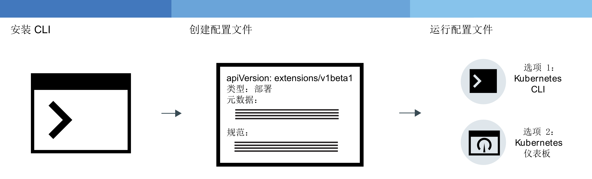
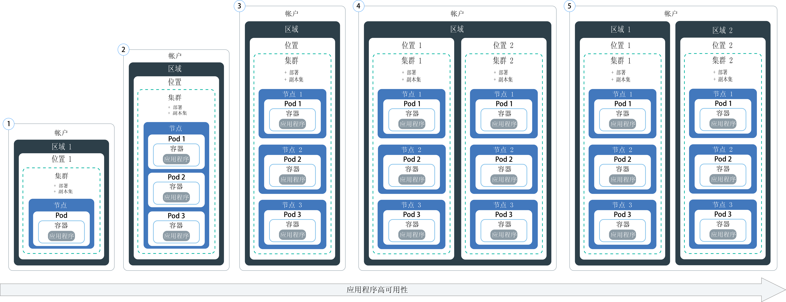
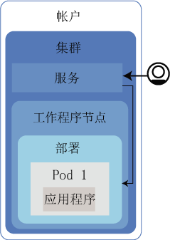

---

copyright:
  years: 2014, 2018
lastupdated: "2018-01-24"

---

{:new_window: target="_blank"}
{:shortdesc: .shortdesc}
{:screen: .screen}
{:pre: .pre}
{:table: .aria-labeledby="caption"}
{:codeblock: .codeblock}
{:tip: .tip}
{:download: .download}


# 在集群中部署应用程序
{: #app}

您可以使用 Kubernetes 方法来部署应用程序，并确保应用程序始终正常运行。例如，可以执行滚动更新以及回滚，而不给用户造成任何停机时间。
{:shortdesc}

通过单击下图中的某个区域可了解用于部署应用程序的常规步骤。


<map name="d62e18" id="d62e18">
<area href="cs_cli_install.html" target="_blank" alt="安装 CLI。" title="安装 CLI。" shape="rect" coords="30, 69, 179, 209" />
<area href="https://kubernetes.io/docs/concepts/configuration/overview/" target="_blank" alt="为应用程序创建配置文件。请查看 Kubernetes 中的最佳实践。" title="为应用程序创建配置文件。请查看 Kubernetes 中的最佳实践。" shape="rect" coords="254, 64, 486, 231" />
<area href="#app_cli" target="_blank" alt="选项 1：通过 Kubernetes CLI 运行配置文件。" title="选项 1：通过 Kubernetes CLI 运行配置文件。" shape="rect" coords="544, 67, 730, 124" />
<area href="#cli_dashboard" target="_blank" alt="选项 2：在本地启动 Kubernetes 仪表板，然后运行配置文件。" title="选项 2：在本地启动 Kubernetes 仪表板，然后运行配置文件。" shape="rect" coords="544, 141, 728, 204" />
</map>


<br />


## 规划高可用性部署
{: #highly_available_apps}

设置在多个工作程序节点和集群上分发得越广泛，用户使用应用程序时遭遇停机时间的可能性就越低。


查看以下潜在的应用程序设置（按可用性程度从低到高排序）。
{:shortdesc}



1.  部署具有 n+2 个 pod，这些 pod 由副本集管理。
2.  部署具有 n+2 个 pod，这些 pod 由副本集管理并跨同一位置的多个节点分布（反亲缘关系）。
3.  部署具有 n+2 个 pod，这些 pod 由副本集管理并跨不同位置的多个节点分布（反亲缘关系）。
4.  部署具有 n+2 个 pod，这些 pod 由副本集管理并跨不同区域的多个节点分布（反亲缘关系）。

了解有关用于提高应用程序可用性的方法的更多信息：

<dl>
<dt>使用部署和副本集来部署应用程序及其依赖项</dt>
<dd>部署是一种 Kubernetes 资源，可用于声明应用程序的所有组件以及应用程序的依赖项。通过描述单个组件，而不是写下所有必要的步骤和创建这些步骤的顺序，您可以专注于应用程序在运行时的外观。</br></br>
部署多个 pod 时，会自动为部署创建副本集；副本集用于监视这些 pod，并确保始终有所需数量的 pod 正常运行。pod 发生故障时，副本集会将无响应的 pod 替换为新的 pod。</br></br>
您可以使用部署来定义应用程序的更新策略，包括在滚动更新期间要添加的 pod 数，以及允许同时不可用的 pod 数。执行滚动更新时，部署将检查修订版是否有效，并在检测到故障时停止应用。</br></br>
部署还提供了同时部署具有不同标志的多个修订版的可能性，因此，例如您可以先测试部署，然后再决定是否将其推送到生产环境。</br></br>
每个部署都会跟踪已部署的修订版。遇到更新无法按预期运行时，可以使用此修订版历史记录回滚到上一个版本。</dd>
<dt>包含足够多的副本用于应用程序的工作负载，在此基础上再额外增加两个副本</dt>
<dd>要使应用程序具有更高可用性且在出现故障时能够更快恢复，请考虑在处理预期工作负载所需最低要求的副本数基础上，再包含额外的副本。在某个 pod 崩溃且副本集尚未恢复已崩溃 pod 的情况下，额外的副本可处理工作负载。要针对同时发生两个故障的情况进行防护，请包含两个额外的副本。此设置是 N+2 模式，其中 N 是处理入局工作负载的副本数，+2 是额外两个副本。只要集群有足够的空间用于 pod，就可以在集群中拥有尽可能多的 pod。</dd>
<dt>跨多个节点分布 pod（反亲缘关系）</dt>
<dd>创建部署时，各个 pod 可能会部署到同一工作程序节点。这种 pod 存在于相同工作程序节点上的设置称为亲缘关系或共存。为了保护应用程序不受工作程序节点故障的影响，可以使用 <strong>podAntiAffinity</strong> 选项来强制您的部署跨多个工作程序节点分布 pod。此选项仅可用于标准集群。

</br></br>
<strong>注</strong>：以下 YAML 文件强制将每个 pod 部署到不同的工作程序节点。如果定义的副本数超过集群中可用的工作程序节点数，仅会部署可以满足反亲缘关系需求的副本数。任何其他副本都将保持暂挂状态，直到向集群添加了更多工作程序节点为止。

<pre class="codeblock">
<code>apiVersion: extensions/v1beta1
kind: Deployment
metadata:
name: wasliberty
spec:
        replicas: 3
        template:
metadata:
labels:
app: wasliberty
spec:
      affinity:
        podAntiAffinity:
          preferredDuringSchedulingIgnoredDuringExecution:
          - weight: 100
            podAffinityTerm:
              labelSelector:
                matchExpressions:
                - key: app
                  operator: In
                  values:
                  - wasliberty
              topologyKey: kubernetes.io/hostname
      containers:
      - name: wasliberty
        image: registry.&lt;region&gt;.bluemix.net/ibmliberty
        ports:
        - containerPort: 9080
---
apiVersion: v1
kind: Service
metadata:
  name: wasliberty
  labels:
    app: wasliberty
spec:
  ports:
    # the port that this service should serve on
  - port: 9080
  selector:
    app: wasliberty
  type: NodePort</code></pre>

</dd>
<dt>跨多个位置或区域分布 pod</dt>
<dd>为了保护应用程序不受位置或区域故障的影响，可以在另一个位置或区域中创建第二个集群，并使用部署 YAML 来部署应用程序的重复副本集。通过在集群前端添加共享路径和负载均衡器，可以跨位置和区域分布工作负载。有关在集群之间共享路径的更多信息，请参阅<a href="cs_clusters.html#clusters" target="_blank">集群高可用性</a>。

有关更多详细信息，请查看<a href="cs_clusters.html#planning_clusters" target="_blank">高可用性部署</a>的选项。</dd>
</dl>


### 最低应用程序部署
{: #minimal_app_deployment}

免费或标准集群中的基本应用程序部署可能包含以下组件。
{:shortdesc}



要部署图中所示的最简应用程序的组件，请使用类似于以下示例的配置文件：
```
apiVersion: extensions/v1beta1
kind: Deployment
metadata:
  name: ibmliberty
spec:
  replicas: 1
  template:
    metadata:
      labels:
        app: ibmliberty
    spec:
      containers:
      - name: ibmliberty
        image: registry.<region>.bluemix.net/ibmliberty:latest
---
apiVersion: v1
kind: Service
metadata:
  name: ibmliberty-service
  labels:
    app: ibmliberty
spec:
  selector:
    run: ibmliberty
  type: NodePort
  ports:
   - protocol: TCP
     port: 9080
```
{: codeblock}

要了解有关每个组件的更多信息，请查看 [Kubernetes 基础知识](cs_tech.html#kubernetes_basics)。

<br />


## 启动 Kubernetes 仪表板
{: #cli_dashboard}

在本地系统上打开 Kubernetes 仪表板，以查看有关集群及其工作程序节点的信息。
{:shortdesc}

开始之前，请[设定 CLI 的目标](cs_cli_install.html#cs_cli_configure)为集群。此任务需要[管理员访问策略](cs_users.html#access_policies)。验证您当前的[访问策略](cs_users.html#infra_access)。

可以使用缺省端口或设置自己的端口来启动集群的 Kubernetes 仪表板。

1.  对于带有 Kubernetes V1.7.4 或更低版本主节点的集群：

    1.  使用缺省端口号设置代理。

        ```
        kubectl proxy
        ```
        {: pre}

        输出：

        ```
        Starting to serve on 127.0.0.1:8001
        ```
        {: screen}

    2.  在 Web 浏览器中打开 Kubernetes 仪表板。

        ```
        http://localhost:8001/ui
        ```
        {: codeblock}

2.  对于带有 Kubernetes V1.8.2 或更高版本主节点的集群：

    1.  获取 Kubernetes 的凭证。

        ```
        kubectl config view -o jsonpath='{.users[0].user.auth-provider.config.id-token}'
        ```
        {: pre}

    2.  复制输出中显示的 **id-token** 值。

    3.  使用缺省端口号设置代理。

        ```
        kubectl proxy
        ```
        {: pre}

        输出示例：

        ```
        Starting to serve on 127.0.0.1:8001
        ```
        {: screen}

    4.  登录到仪表板。

        1.  在浏览器中，浏览至以下 URL：

            ```
            http://localhost:8001/api/v1/namespaces/kube-system/services/https:kubernetes-dashboard:/proxy/
            ```
            {: codeblock}

        2.  在登录页面中，选择**令牌**认证方法。

        3.  接下来，将先前复制的 **id-token** 值粘贴到**令牌**字段中，然后单击**登录**。

[接下来，可以通过仪表板来运行配置文件。](#app_ui)

对 Kubernetes 仪表板操作完毕后，使用 `CTRL+C` 以退出 `proxy` 命令。退出后，Kubernetes 仪表板不再可用。运行 `proxy` 命令以重新启动 Kubernetes 仪表板。


<br />


## 创建私钥
{: #secrets}

Kubernetes 私钥是一种存储保密信息（如用户名、密码或密钥）的安全方法。
{:shortdesc}

<table>
<caption>表. 需要通过任务以私钥形式存储的文件</caption>
<thead>
<th>任务</th>
<th>要以私钥形式存储的必需文件</th>
</thead>
<tbody>
<tr>
<td>向集群添加服务</td>
<td>无。将服务绑定到集群时，会创建私钥。</td>
</tr>
<tr>
<td>可选：如果不打算使用 ingress-secret，请将 Ingress 服务配置为使用 TLS。<p><b>注</b>：缺省情况下已启用 TLS，并且已经为 TLS 连接创建私钥。


要查看缺省 TLS 私钥：
<pre>
bx cs cluster-get &gt;CLUSTER-NAME&lt; | grep "Ingress secret"
</pre>
</p>
要改为创建自己的私钥，请完成本主题中的步骤。</td>
<td>服务器证书和密钥：<code>server.crt</code> 和 <code>server.key</code></td>
<tr>
<td>创建相互认证注释。</td>
<td>CA 证书：<code>ca.crt</code></td>
</tr>
</tbody>
</table>

有关在私钥中可以存储哪些内容的更多信息，请参阅 [Kubernetes 文档](https://kubernetes.io/docs/concepts/configuration/secret/)。


要使用证书创建私钥，请执行以下操作：

1. 通过证书提供者生成认证中心 (CA) 证书和密钥。如果您有自己的域，请为您的域购买正式的 TLS 证书。如果是为了进行测试，您可以生成自签名证书。

 重要信息：请确保每个证书的 [CN](https://support.dnsimple.com/articles/what-is-common-name/) 唯一。

 必须验证客户机证书和客户机密钥，一直验证到可信根证书（在本例中为 CA 证书）。示例：

 ```
 客户机证书：由中间证书签发
 中间证书：由根证书签发
 根证书：由其自身签发
 ```
 {: codeblock}

2. 将证书创建为 Kubernetes 私钥。

   ```
 kubectl create secret generic <secretName> --from-file=<cert_file>=<cert_file>
 ```
   {: pre}

     示例：
   - TLS 连接：

     ```
 kubectl create secret tls <secretName> --from-file=tls.crt=server.crt --from-file=tls.key=server.key
 ```
     {: pre}

   - 相互认证注释：

     ```
 kubectl create secret generic <secretName> --from-file=ca.crt=ca.crt
 ```
     {: pre}

<br />


## 使用 GUI 部署应用程序
{: #app_ui}

使用 Kubernetes 仪表板将应用程序部署到集群时，会自动创建用于在集群中创建、更新和管理 pod 的部署资源。
{:shortdesc}

开始之前：

-   安装必需的 [CLI](cs_cli_install.html#cs_cli_install)。
-   [设定 CLI 的目标](cs_cli_install.html#cs_cli_configure)为集群。

要部署应用程序，请执行以下操作：

1.  [打开 Kubernetes 仪表板](#cli_dashboard)。
2.  在 Kubernetes 仪表板中，单击 **+ 创建**。
3.  选择**在下面指定应用程序详细信息**以在 GUI 上输入应用程序详细信息，或者选择**上传 YAML 或 JSON 文件**以上传应用程序[配置文件 ](https://kubernetes.io/docs/tasks/inject-data-application/define-environment-variable-container/)。使用[此示例 YAML 文件 ](https://github.com/IBM-Bluemix/kube-samples/blob/master/deploy-apps-clusters/deploy-ibmliberty.yaml) 通过美国南部区域的 **ibmliberty** 映像部署容器。
4.  在 Kubernetes 仪表板中，单击**部署**以验证部署是否已创建。
5.  如果使用 NodePort 服务、LoadBalancer 服务或 Ingress 使应用程序公共可用，请验证您是否可以访问该应用程序。

<br />


## 使用 CLI 部署应用程序
{: #app_cli}

创建集群后，可以使用 Kubernetes CLI 将应用程序部署到该集群。
{:shortdesc}

开始之前：

-   安装必需的 [CLI](cs_cli_install.html#cs_cli_install)。
-   [设定 CLI 的目标](cs_cli_install.html#cs_cli_configure)为集群。

要部署应用程序，请执行以下操作：

1.  根据 [Kubernetes 最佳实践 ](https://kubernetes.io/docs/concepts/configuration/overview/) 创建配置文件。通常，配置文件包含要在 Kubernetes 中创建的每个资源的配置详细信息。脚本可能包含以下一个或多个部分：

    -   [部署 ](https://kubernetes.io/docs/concepts/workloads/controllers/deployment/)：定义 pod 和副本集的创建。pod 包含单个容器化应用程序，而副本集用于控制多个 pod 实例。

    -   [服务 ](https://kubernetes.io/docs/concepts/services-networking/service/)：使用工作程序节点或负载均衡器公共 IP 地址或公共 Ingress 路径，提供对 pod 的前端访问。

    -   [Ingress ](https://kubernetes.io/docs/concepts/services-networking/ingress/)：指定一种类型的负载均衡器，以提供用于公开访问应用程序的路径。

2.  在集群上下文中运行配置文件。

    ```
    kubectl apply -f deployment_script_location
    ```
    {: pre}

3.  如果使用 NodePort 服务、LoadBalancer 服务或 Ingress 使应用程序公共可用，请验证您是否可以访问该应用程序。

<br />


## 扩展应用程序
{: #app_scaling}

部署能够响应应用程序需求变化以及仅在需要时使用资源的云应用程序。自动扩展会根据 CPU 来自动增加或减少应用程序的实例数。
{:shortdesc}

开始之前，请[设定 CLI 的目标](cs_cli_install.html#cs_cli_configure)为集群。

**注：**是否需要有关扩展 Cloud Foundry 应用程序的信息？请查看 [IBM Auto-Scaling for {{site.data.keyword.Bluemix_notm}}](/docs/services/Auto-Scaling/index.html)。

使用 Kubernetes，可以启用[水平 pod 自动扩展 ](https://kubernetes.io/docs/reference/generated/kubectl/kubectl-commands#autoscale) 以基于 CPU 扩展应用程序。

1.  通过 CLI 将应用程序部署到集群。部署应用程序时，必须请求 CPU。


    ```
    kubectl run <name> --image=<image> --requests=cpu=<cpu> --expose --port=<port_number>
    ```
    {: pre}

    <table>
    <thead>
    <th colspan=2> 了解此命令的组成部分</th>
    </thead>
    <tbody>
    <tr>
    <td><code>--image</code></td>
    <td>要部署的应用程序。</td>
    </tr>
    <tr>
    <td><code>--request=cpu</code></td>
    <td>容器的必需 CPU，以千分之一核心数为单位指定。例如，<code>--requests=200m</code>。</td>
    </tr>
    <tr>
    <td><code>--expose</code></td>
    <td>为 true 时，创建外部服务。</td>
    </tr>
    <tr>
    <td><code>--port</code></td>
    <td>应用程序对外部可用的端口。</td>
    </tr></tbody></table>

    **注：**对于更复杂的部署，有关更复杂的部署，可能需要创建[配置文件](#app_cli)。
2.  创建 Horizontal Pod Autoscaler，然后定义策略。有关使用 `kubectl autoscale` 命令的更多信息，请参阅 [Kubernetes 文档 ](https://kubernetes.io/docs/reference/generated/kubectl/kubectl-commands#autoscale)。

    ```
    kubectl autoscale deployment <deployment_name> --cpu-percent=<percentage> --min=<min_value> --max=<max_value>
    ```
    {: pre}

    <table>
    <thead>
    <th colspan=2> 了解此命令的组成部分</th>
    </thead>
    <tbody>
    <tr>
    <td><code>--cpu-percent</code></td>
    <td>Horizontal Pod Autoscaler 保持的平均 CPU 使用率，以百分比为单位指定。</td>
    </tr>
    <tr>
    <td><code>--min</code></td>
    <td>用于保持指定 CPU 使用率百分比的最小部署 Pod 数。</td>
    </tr>
    <tr>
    <td><code>--max</code></td>
    <td>用于保持指定 CPU 使用率百分比的最大部署 Pod 数。</td>
    </tr>
    </tbody></table>


<br />


## 管理滚动部署
{: #app_rolling}

可以通过自动和受控方式来管理如何应用您的更改。如果应用未按计划开展，那么可以将部署回滚到先前的修订版。
{:shortdesc}

开始之前，请创建[部署](#app_cli)。

1.  [应用 ](https://kubernetes.io/docs/reference/generated/kubectl/kubectl-commands#rollout) 更改。例如，您可能希望更改初始部署中使用的映像。

    1.  获取部署名称。

        ```
        kubectl get deployments
        ```
        {: pre}

    2.  获取 pod 名称。

        ```
        kubectl get pods
        ```
        {: pre}

    3.  获取在 pod 中运行的容器的名称。

        ```
        kubectl describe pod <pod_name>
        ```
        {: pre}

    4.  设置新映像以供部署使用。

        ```
        kubectl set image deployment/<deployment_name><container_name>=<image_name>
        ```
        {: pre}

    运行命令时，更改会立即应用并会记录在应用历史记录中。

2.  检查部署的状态。

    ```
    kubectl rollout status deployments/<deployment_name>
    ```
    {: pre}

3.  回滚更改。
    1.  查看部署的应用历史记录，并确定上次部署的修订版号。

        ```
        kubectl rollout history deployment/<deployment_name>
        ```
        {: pre}

        **提示**：要查看特定修订版的详细信息，请包含相应的修订版号。

        ```
        kubectl rollout history deployment/<deployment_name> --revision=<number>
        ```
        {: pre}

    2.  回滚到先前的版本或指定修订版。要回滚到先前的版本，请使用以下命令。

        ```
        kubectl rollout undo deployment/<depoyment_name> --to-revision=<number>
        ```
        {: pre}

<br />

