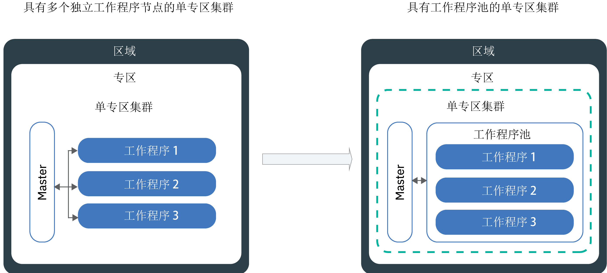

---

copyright:
  years: 2014, 2019
lastupdated: "2019-06-12"

keywords: kubernetes, iks

subcollection: containers

---

{:new_window: target="_blank"}
{:shortdesc: .shortdesc}
{:screen: .screen}
{:pre: .pre}
{:table: .aria-labeledby="caption"}
{:codeblock: .codeblock}
{:tip: .tip}
{:note: .note}
{:important: .important}
{:deprecated: .deprecated}
{:download: .download}
{:preview: .preview}


# 更新集群、工作程序节点和集群组件
{: #update}

可以通过安装更新，使 {{site.data.keyword.containerlong}} 中的 Kubernetes 集群保持最新。
{:shortdesc}

## 更新 Kubernetes 主节点
{: #master}

Kubernetes 会定期发布[主要更新、次要更新或补丁更新](/docs/containers?topic=containers-cs_versions#version_types)。更新会影响 Kubernetes 主节点中的 Kubernetes API 服务器版本或其他组件。IBM 会更新补丁版本，但主节点的主版本和次版本必须由您进行更新。
{:shortdesc}

**如何知道何时更新主节点？**</br>
更新可用时，在 {{site.data.keyword.Bluemix_notm}} 控制台和 CLI 中您会收到通知，此外还可以查看[支持的版本](/docs/containers?topic=containers-cs_versions)页面。

**主节点可以落后于最新版本多少个版本？**</br>
IBM 通常同时支持 3 个版本的 Kubernetes。只能将 Kubernetes API 服务器更新为比其当前版本高最多两个版本。

例如，如果当前 Kubernetes API 服务器的版本是 1.11，而您要更新到 1.14，那么必须先更新到 1.12。

如果集群运行的是不支持的 Kubernetes 版本，请按照[版本归档指示信息](/docs/containers?topic=containers-cs_versions#k8s_version_archive)进行操作。要避免进入不支持的状态及由此产生的操作影响，请使集群保持最新。

**工作程序节点能否运行高于主节点的版本？**</br>
工作程序节点运行的 `major.minor` Kubernetes 版本不能高于主节点。请首先[更新主节点](#update_master)至最新的 Kubernetes 版本。然后，在集群中[更新工作程序节点](#worker_node)。

工作程序节点运行的补丁版本可以高于主节点，例如特定于工作程序节点以用于安全性更新的补丁版本。

**如何应用补丁更新？**</br>
缺省情况下，主节点补丁更新会自动应用，但需要若干天时间，因此主节点补丁版本可能会在应用于主节点之前显示为可用。自动更新还会跳过运行状况欠佳或当前有操作正在执行的集群。有时，IBM 可能会对特定主节点修订包禁用自动更新，例如仅当主节点从一个次版本更新到另一个次版本时才需要的补丁。在上述任何情况下，您都可以[查看版本更改日志](/docs/containers?topic=containers-changelog)以了解任何潜在影响，并选择自行安全地使用 `ibmcloud ks cluster-update` [命令](/docs/containers?topic=containers-cli-plugin-kubernetes-service-cli#cs_cluster_update)，而无需等待应用自动更新。

与主节点不同的是，您必须为工作程序更新每个补丁版本。

**主节点更新期间会发生什么情况？**</br>
在运行 Kubernetes V1.11 或更高版本的集群中，主节点具有高可用性，有三个副本主节点 pod。主节点 pod 采用滚动更新，在此期间，一次只有一个 pod 不可用。在更新期间会有两个实例启动且正在运行，以便您可以访问和更改集群。工作程序节点、应用程序和资源会继续运行。

对于运行先前版本的 Kubernetes 的集群，更新 Kubernetes API 服务器时，该 API 服务器将停止运行约 5 到 10 分钟。在更新期间，您无法访问或更改集群。但是，不会修改集群用户已部署的工作程序节点、应用程序和资源，这些对象将继续运行。

**可以回滚更新吗？**</br>
不能，在执行更新过程后，无法将集群回滚到先前版本。请确保使用测试集群并按照指示信息来解决潜在问题，然后再更新生产主节点。

**更新主节点时可以遵循什么流程？**</br>
下图显示更新主节点时可以执行的流程。


图 1. Kubernetes 主节点更新流程图

{: #update_master}
开始之前，请确保您具有 [{{site.data.keyword.Bluemix_notm}} IAM **操作员**或**管理员**平台角色](/docs/containers?topic=containers-users#platform)。

要更新 Kubernetes 主节点的_主_版本或_次_版本，请执行以下操作：

1.  查看 [Kubernetes 更改](/docs/containers?topic=containers-cs_versions)，并对任何更新标记为_在更新主节点之前更新_。

2.  使用 [{{site.data.keyword.Bluemix_notm}} 控制台](https://cloud.ibm.com/login)或运行 CLI `ibmcloud ks cluster-update` [命令](/docs/containers?topic=containers-cli-plugin-kubernetes-service-cli#cs_cluster_update)来更新 Kubernetes API 服务器和关联的 Kubernetes 主节点组件。

3.  稍等几分钟，然后确认更新是否已完成。在 {{site.data.keyword.Bluemix_notm}} 集群仪表板上查看 Kubernetes API 服务器版本，或运行 `ibmcloud ks clusters`。

4.  安装与 Kubernetes 主节点中运行的 Kubernetes API 服务器版本相匹配的 [`kubectl cli`](/docs/containers?topic=containers-cs_cli_install#kubectl) 版本。[Kubernetes 不支持 ](https://kubernetes.io/docs/setup/version-skew-policy/) 比服务器版本高/低 2 个或更多版本 (n +/- 2) 的 `kubectl` 客户机版本。

Kubernetes API 服务器更新完成后，可以更新工作程序节点。

<br />


## 更新工作程序节点
{: #worker_node}

您收到了工作程序节点更新通知。这意味着什么呢？由于 Kubernetes API 服务器和其他 Kubernetes 主节点组件的安全性更新和补丁已到位，因此您必须确保工作程序节点保持同步。
{: shortdesc}

**更新期间应用程序会发生什么情况？**</br>
如果在更新的工作程序节点上作为部署的一部分运行应用程序，那么会将应用程序重新安排到集群中的其他工作程序节点上。这些工作程序节点可能位于其他工作程序池中，或者如果您具有独立工作程序节点，那么可能会将应用程序安排到独立工作程序节点上。要避免应用程序产生停机时间，必须确保集群中有足够的容量来执行工作负载。

**如何控制更新期间在某一时间停止运行的工作程序节点数？**</br>
如果需要所有工作程序节点都启动并运行，请考虑通过[调整工作程序池大小](/docs/containers?topic=containers-cli-plugin-kubernetes-service-cli#cs_worker_pool_resize)或[添加独立工作程序节点](/docs/containers?topic=containers-cli-plugin-kubernetes-service-cli#cs_worker_add)来添加更多工作程序节点。可以在更新完成后除去其他工作程序节点。

此外，还可以创建 Kubernetes 配置映射，用于指定在更新期间可以同时不可用的最大工作程序节点数。工作程序节点通过工作程序节点标签进行标识。可以使用 IBM 提供的标签，也可以使用已添加到工作程序节点的定制标签。

**如果选择不定义配置映射会怎样？**</br>
未定义配置映射时，将使用缺省值。缺省情况下，在更新过程中，每个集群的所有工作程序节点中最多可以有 20% 的节点不可用。

**开始之前**：
- [登录到您的帐户。如果适用，请将相应的资源组设定为目标。为集群设置上下文。](/docs/containers?topic=containers-cs_cli_install#cs_cli_configure)
- [更新 Kubernetes 主节点](#master)。工作程序节点 Kubernetes 版本不能高于在 Kubernetes 主节点中运行的 Kubernetes API 服务器版本。
- 落实在 [Kubernetes 更改](/docs/containers?topic=containers-cs_versions)中标记为_在主节点后更新_的任何更改。
- 如果要应用补丁更新，请查看 [Kubernetes 版本更改日志](/docs/containers?topic=containers-changelog#changelog)。
- 确保您具有 [{{site.data.keyword.Bluemix_notm}} IAM **操作员**或**管理员**平台角色](/docs/containers?topic=containers-users#platform)。</br>

更新工作程序节点可能会导致应用程序和服务产生停机时间。系统会对工作程序节点机器重新应用映像，并且如果数据未[存储在 pod 外部](/docs/containers?topic=containers-storage_planning#persistent_storage_overview)，那么将删除数据。
{: important}

{: #worker-up-configmap}
**创建配置映射并更新工作程序节点**：

1.  列出可用的工作程序节点，并记录其专用 IP 地址。

    ```
   ibmcloud ks workers --cluster <cluster_name_or_ID>
   ```
    {: pre}

2. 查看工作程序节点的标签。可以在 CLI 输出的 **Labels** 部分找到工作程序节点标签。每个标签都由 `NodeSelectorKey` 和 `NodeSelectorValue` 组成。
   ```
   kubectl describe node <private_worker_IP>
   ```
   {: pre}

   输出示例：
   ```
   Name:               10.184.58.3
   Roles:              <none>
   Labels:             arch=amd64
                    beta.kubernetes.io/arch=amd64
                    beta.kubernetes.io/os=linux
                    failure-domain.beta.kubernetes.io/region=us-south
                    failure-domain.beta.kubernetes.io/zone=dal12
                    ibm-cloud.kubernetes.io/encrypted-docker-data=true
                    ibm-cloud.kubernetes.io/iaas-provider=softlayer
                    ibm-cloud.kubernetes.io/machine-type=u3c.2x4.encrypted
                    kubernetes.io/hostname=10.123.45.3
                    privateVLAN=2299001
                    publicVLAN=2299012
   Annotations:        node.alpha.kubernetes.io/ttl=0
                    volumes.kubernetes.io/controller-managed-attach-detach=true
   CreationTimestamp:  Tue, 03 Apr 2018 15:26:17 -0400
   Taints:             <none>
   Unschedulable:      false
   ```
   {: screen}

3. 创建配置映射，并定义工作程序节点的不可用性规则。以下示例显示了四个检查：`zonecheck.json`、`regioncheck.json`、`defaultcheck.json` 和检查模板。可以使用这些示例检查来为特定专区中的工作程序节点定义规则 (`zonechk.json`)、为区域中的工作程序节点定义规则 (`regioncheck.json`)，或为与在配置映射中定义的任何检查不匹配的所有工作程序节点定义规则 (`defaultcheck.json`)。使用检查模板可创建自己的检查。对于每个检查，要识别工作程序节点，必须选择在上一步中检索到的其中一个工作程序节点标签。  

   对于每个检查，只能为 <code>NodeSelectorKey</code> 和 <code>NodeSelectorValue</code> 设置一个值。如果要为多个区域、专区或其他工作程序节点标签设置规则，请创建新的检查。在配置映射中最多可定义 10 个检查。如果添加更多检查，将忽略这些检查。
   {: note}

   示例：
   ```
    apiVersion: v1
    kind: ConfigMap
    metadata:
      name: ibm-cluster-update-configuration
      namespace: kube-system
    data:
     drain_timeout_seconds: "120"
     zonecheck.json: |
       {
         "MaxUnavailablePercentage": 30,
        "NodeSelectorKey": "failure-domain.beta.kubernetes.io/zone",
        "NodeSelectorValue": "dal13"
      }
    regioncheck.json: |
       {
         "MaxUnavailablePercentage": 20,
        "NodeSelectorKey": "failure-domain.beta.kubernetes.io/region",
        "NodeSelectorValue": "us-south"
      }
    defaultcheck.json: |
       {
         "MaxUnavailablePercentage": 20
      }
    <check_name>: |
      {
        "MaxUnavailablePercentage": <value_in_percentage>,
        "NodeSelectorKey": "<node_selector_key>",
        "NodeSelectorValue": "<node_selector_value>"
      }
   ```
   {: codeblock}

   <table summary="表中的第一行跨两列。其余行应从左到右阅读，其中第一列是参数，第二列是匹配的描述。">
    <caption>ConfigMap 组成部分</caption>
    <thead>
      <th colspan=2> 了解组成部分</th>
    </thead>
    <tbody>
      <tr>
        <td><code>drain_timeout_seconds</code></td>
        <td> 可选：等待[放弃 ](https://kubernetes.io/docs/tasks/administer-cluster/safely-drain-node/) 完成的超时（以秒为单位）。放弃工作程序节点可安全地从工作程序节点中除去所有现有 pod，然后将这些 pod 重新安排到集群中的其他工作程序节点上。接受的值为范围在 1 到 180 之间的整数。缺省值为 30。</td>
      </tr>
      <tr>
        <td><code>zonecheck.json</code></br><code>regioncheck.json</code></td>
        <td>两个检查，用于为一组工作程序节点定义规则，可以使用指定的 <code>NodeSelectorKey</code> 和 <code>NodeSelectorValue</code> 标识工作程序节点。<code>zonecheck.json</code> 根据工作程序节点的专区标签来识别工作程序节点，<code>regioncheck.json</code> 使用在供应期间添加到每个工作程序节点的区域标签。在此示例中，更新期间，将 <code>dal13</code> 作为其专区标签的所有工作程序节点中，可以有 30% 不可用，<code>us-south</code> 中的所有工作程序节点中，可以有 20% 不可用。</td>
      </tr>
      <tr>
        <td><code>defaultcheck.json</code></td>
        <td>如果未创建配置映射或未正确配置映射，那么会应用 Kubernetes 缺省值。缺省情况下，集群中只能有 20% 的工作程序节点同时不可用。您可以通过向配置映射添加缺省检查来覆盖缺省值。在此示例中，专区和区域检查（<code>dal13</code> 或 <code>us-south</code>）中未指定的每个工作程序节点在更新期间都可以不可用。</td>
      </tr>
      <tr>
        <td><code>MaxUnavailablePercentage</code></td>
        <td>对于指定的标签键和值，允许不可用的最大节点数，指定为百分比。工作程序节点在部署、重新装入或供应过程中会不可用。如果排队的工作程序节点超过任何定义的最大不可用百分比，那么会阻止这些节点更新。</td>
      </tr>
      <tr>
        <td><code>NodeSelectorKey</code></td>
        <td>要为其设置规则的工作程序节点的标签键。可以为 IBM 提供的缺省标签以及您创建的工作程序节点标签设置规则。<ul><li>如果要为属于一个工作程序池的工作程序节点添加规则，可以使用 <code>ibm-cloud.kubernetes.io/machine-type</code> 标签。</li><li> 如果有多个具有相同机器类型的工作程序池，请使用定制标签。</li></ul></td>
      </tr>
      <tr>
        <td><code>NodeSelectorValue</code></td>
        <td>必须为定义的规则考虑工作程序节点的标签值。</td>
      </tr>
    </tbody>
   </table>

4. 在集群中创建配置映射。
   ```
   kubectl apply -f <filepath/configmap.yaml>
   ```
   {: pre}

5.  验证配置映射是否已创建。
    ```
   kubectl get configmap --namespace kube-system
   ```
    {: pre}

6.  更新工作程序节点。

    ```
    ibmcloud ks worker-update --cluster <cluster_name_or_ID> --workers <worker_node1_ID> <worker_node2_ID>
    ```
    {: pre}

7. 可选：验证由配置映射触发的事件以及发生的任何验证错误。可以在 CLI 输出的 **Events** 部分中查看这些事件。
   ```
    kubectl describe -n kube-system cm ibm-cluster-update-configuration
    ```
   {: pre}

8. 通过复查工作程序节点的 Kubernetes 版本，确认更新是否已完成。  
   ```
kubectl get nodes
```
   {: pre}

9. 验证是否没有重复的工作程序节点。在某些情况下，较旧的集群可能会在更新后列出具有 **`NotReady`** 状态的重复工作程序节点。要除去重复项，请参阅[故障诊断](/docs/containers?topic=containers-cs_troubleshoot_clusters#cs_duplicate_nodes)。

后续步骤：
-   对其他工作程序池重复更新过程。
-   通知在集群中工作的开发者将其 `kubectl` CLI 更新到 Kubernetes 主节点的版本。
-   如果 Kubernetes 仪表板未显示利用率图形，请[删除 `kube-dashboard` pod](/docs/containers?topic=containers-cs_troubleshoot_health#cs_dashboard_graphs)。


### 在控制台中更新工作程序节点
{: #worker_up_console}

首次设置配置映射后，接着就可以使用 {{site.data.keyword.Bluemix_notm}} 控制台来更新工作程序节点。
{: shortdesc}

开始之前：
*   [设置配置映射](#worker_node)以控制工作程序节点的更新方式。
*   [更新 Kubernetes 主节点](#master)。工作程序节点 Kubernetes 版本不能高于在 Kubernetes 主节点中运行的 Kubernetes API 服务器版本。
*   落实在 [Kubernetes 更改](/docs/containers?topic=containers-cs_versions)中标记为_在主节点后更新_的任何更改。
*   如果要应用补丁更新，请查看 [Kubernetes 版本更改日志](/docs/containers?topic=containers-changelog#changelog)。
*   确保您具有 [{{site.data.keyword.Bluemix_notm}} IAM **操作员**或**管理员**平台角色](/docs/containers?topic=containers-users#platform)。</br>

更新工作程序节点可能会导致应用程序和服务产生停机时间。系统会对工作程序节点机器重新应用映像，并且如果数据未[存储在 pod 外部](/docs/containers?topic=containers-storage_planning#persistent_storage_overview)，那么将删除数据。
{: important}

要通过控制台更新工作程序节点，请执行以下操作：
1.  在 [{{site.data.keyword.Bluemix_notm}} 控制台](https://cloud.ibm.com/)菜单  中，单击 **Kubernetes**。
2.  在**集群**页面中，单击您的集群。
3.  在**工作程序节点**选项卡中，选中要更新的每个工作程序节点的对应复选框。在表标题行的上方显示有操作栏。
4.  在操作栏中，单击**更新 Kubernetes**。

<br />


## 更新机器类型
{: #machine_type}

可以通过添加新工作程序节点并除去旧工作程序节点来更新工作程序节点的机器类型。例如，如果集群具有不推荐使用的 `x1c` 或较旧的 Ubuntu 16 `x2c` 工作程序节点类型模板，请创建使用其名称中含有 `x3c` 的机器类型的 Ubuntu 18 工作程序节点。
{: shortdesc}

开始之前：
- [登录到您的帐户。如果适用，请将相应的资源组设定为目标。为集群设置上下文。](/docs/containers?topic=containers-cs_cli_install#cs_cli_configure)
- 如果是将数据存储在工作程序节点上，而没有[存储在工作程序节点外部](/docs/containers?topic=containers-storage_planning#persistent_storage_overview)，那么将删除数据。
- 确保您具有 [{{site.data.keyword.Bluemix_notm}} IAM **操作员**或**管理员**平台角色](/docs/containers?topic=containers-users#platform)。

要更新机器类型，请执行以下操作：

1. 列出可用的工作程序节点，并记录其专用 IP 地址。
   - **对于工作程序池中的工作程序节点**：
     1. 列出集群中的可用工作程序池。
        ```
        ibmcloud ks worker-pools --cluster <cluster_name_or_ID>
        ```
        {: pre}

     2. 列出工作程序池中的工作程序节点。
        ```
        ibmcloud ks workers --cluster <cluster_name_or_ID> --worker-pool <pool_name>
        ```
        {: pre}

     3. 获取工作程序节点的详细信息，并记录专区、专用和公用 VLAN 标识。
        ```
        ibmcloud ks worker-get --cluster <cluster_name_or_ID> --worker <worker_ID>
        ```
        {: pre}

   - **不推荐：对于独立工作程序节点**：
        
     1. 列出可用的工作程序节点。
        ```
   ibmcloud ks workers --cluster <cluster_name_or_ID>
   ```
        {: pre}

     2. 获取工作程序节点的详细信息，并记录专区、专用和公用 VLAN 标识。
        ```
        ibmcloud ks worker-get --cluster <cluster_name_or_ID> --worker <worker_ID>
        ```
        {: pre}

2. 列出专区中可用的机器类型。
   ```
   ibmcloud ks machine-types <zone>
   ```
   {: pre}

3. 创建具有新机器类型的工作程序节点。
   - **对于工作程序池中的工作程序节点**：
     1. 创建工作程序池，其中的工作程序节点数与要替换的节点数相同。
        ```
        ibmcloud ks worker-pool-create --name <pool_name> --cluster <cluster_name_or_ID> --machine-type <machine_type> --size-per-zone <number_of_workers_per_zone>
        ```
        {: pre}

     2. 验证工作程序池是否已创建。
        ```
        ibmcloud ks worker-pools --cluster <cluster_name_or_ID>
        ```
        {: pre}

     3. 将专区添加到先前检索到的工作程序池。添加专区时，工作程序池中定义的工作程序节点将在专区中供应，并考虑用于未来的工作负载安排。如果要跨多个专区分布工作程序节点，请选择[支持多专区的专区](/docs/containers?topic=containers-regions-and-zones#zones)。
        ```
        ibmcloud ks zone-add --zone <zone> --cluster <cluster_name_or_ID> --worker-pools <pool_name> --private-vlan <private_VLAN_ID> --public-vlan <public_VLAN_ID>
        ```
        {: pre}

   - **不推荐：对于独立工作程序节点**：
       ```
       ibmcloud ks worker-add --cluster <cluster_name> --machine-type <machine_type> --workers <number_of_worker_nodes> --private-vlan <private_VLAN_ID> --public-vlan <public_VLAN_ID>
       ```
       {: pre}

4. 等待工作程序节点进行部署。
   ```
   ibmcloud ks workers --cluster <cluster_name_or_ID>
   ```
   {: pre}

   工作程序节点的状态更改为 **Normal** 时，说明部署完成。

5. 除去旧的工作程序节点。**注**：如果要除去按月计费的机器类型（如裸机），那么仍将对整个月收费。
   - **对于工作程序池中的工作程序节点**：
     1. 除去具有旧机器类型的工作程序池。除去工作程序池将除去所有专区中该池中的所有工作程序节点。此过程可能需要几分钟才能完成。
        ```
        ibmcloud ks worker-pool-rm --worker-pool <pool_name> --cluster <cluster_name_or_ID>
        ```
        {: pre}

     2. 验证工作程序池是否已除去。
        ```
        ibmcloud ks worker-pools --cluster <cluster_name_or_ID>
        ```
        {: pre}

   - **不推荐：对于独立工作程序节点**：
      ```
      ibmcloud ks worker-rm --cluster <cluster_name> --worker <worker_node>
      ```
      {: pre}

6. 验证工作程序节点是否已从集群中除去。
   ```
   ibmcloud ks workers --cluster <cluster_name_or_ID>
   ```
   {: pre}

7. 重复这些步骤以将其他工作程序池或独立工作程序节点更新到不同的机器类型。

## 更新集群组件
{: #components}

{{site.data.keyword.containerlong_notm}} 集群随附在供应集群时自动安装的组件，例如用于日志记录的 Fluentd。缺省情况下，IBM 会自动更新这些组件。但是，您可以禁用某些组件的自动更新，而单独从主节点和工作程序节点手动更新这些组件。
{: shortdesc}

**可以独立于集群更新哪些缺省组件？**</br>
您可以选择禁用以下组件的自动更新：
* [用于日志记录的 Fluentd](#logging-up)
* [Ingress 应用程序
负载均衡器 (ALB)](#alb)

**有无法独立于集群更新的组件吗？**</br>

有。集群部署的以下受管组件和关联的资源不能更改，但为了获得特定性能优点而缩放 pod 或编辑配置映射时除外。如果尝试更改下列其中一个部署组件，其原始设置会定期复原。

* `coredns`
* `coredns-autoscaler`
* `heapster`
* `ibm-file-plugin`
* `ibm-storage-watcher`
* `ibm-keepalived-watcher`
* `kube-dns-amd64`
* `kube-dns-autoscaler`
* `kubernetes-dashboard`
* `metrics-server`
* `vpn`

您可以使用 `addonmanager.kubernetes.io/mode: Reconcile` 标签来查看这些资源。例如：

```
kubectl get deployments --all-namespaces -l addonmanager.kubernetes.io/mode=Reconcile
```
{: pre}

**可以安装其他不属于缺省组件的插件或附加组件吗？**</br>
可以。{{site.data.keyword.containerlong_notm}} 提供了其他插件和附加组件，您可以从中进行选择以向集群添加相应功能。例如，您可能希望[使用 Helm chart](/docs/containers?topic=containers-helm#public_helm_install) 来安装[块存储器插件](/docs/containers?topic=containers-block_storage#install_block)或 [strongSwan VPN](/docs/containers?topic=containers-vpn#vpn-setup)。或者，您可能希望在集群中启用 IBM 管理的附加组件，例如 [Istio](/docs/containers?topic=containers-istio) 或 [Knative](/docs/containers?topic=containers-serverless-apps-knative)。必须按照 Helm chart 自述文件中的指示信息或执行[更新受管附加组件](/docs/containers?topic=containers-managed-addons#updating-managed-add-ons)的步骤来单独更新这些 Helm chart 和附加组件。

### 管理 Fluentd 的自动更新
{: #logging-up}

为了对日志记录或过滤器配置进行更改，Fluentd 组件必须为最新版本。缺省情况下，会启用组件的自动更新。
{: shortdesc}

您可以通过以下方式来管理 Fluentd 组件的自动更新。**注**：要运行以下命令，您必须具有对集群的 [{{site.data.keyword.Bluemix_notm}} IAM **管理员**平台角色](/docs/containers?topic=containers-users#platform)。

* 通过运行 `ibmcloud ks logging-autoupdate-get --cluster <cluster_name_or_ID>` [命令](/docs/containers?topic=containers-cli-plugin-kubernetes-service-cli#cs_log_autoupdate_get)，检查是否启用了自动更新。
* 通过运行 `ibmcloud ks logging-autoupdate-disable` [命令](/docs/containers?topic=containers-cli-plugin-kubernetes-service-cli#cs_log_autoupdate_disable)来禁用自动更新。
* 如果禁用了自动更新，但您需要对配置进行更改，那么有两个选项：
    * 启用 Fluentd pod 的自动更新。
        ```
    ibmcloud ks logging-autoupdate-enable --cluster <cluster_name_or_ID>
    ```
        {: pre}
    * 使用包含 `--force-update` 选项的日志记录命令时，强制执行一次性更新。**注**：pod 会更新到最新版本的 Fluentd 组件，但 Fluentd 此后不会自动更新。
        示例命令：

        ```
    ibmcloud ks logging-config-update --cluster <cluster_name_or_ID> --id <log_config_ID> --type <log_type> --force-update
    ```
        {: pre}

### 管理 Ingress ALB 的自动更新
{: #alb}

控制何时更新 Ingress 应用程序负载均衡器 (ALB) 组件。
{: shortdesc}

更新 Ingress ALB 组件时，所有 ALB pod 中的 `nginx-ingress` 和 `ingress-auth` 容器都会更新为最新的构建版本。缺省情况下，会启用 ALB 的自动更新。更新是基于滚动方式执行的，以便 Ingress ALB 不会遇到任何停机时间。

如果禁用了自动更新，那么您应负责更新 ALB。更新可用时，您在 CLI 中运行 `ibmcloud ks albs` 或 `alb-autoupdate-get` 命令时，会收到相应通知。

更新集群的 Kubernetes 主版本或次版本时，IBM 会自动对 Ingress 部署进行必要的更改，但不会更改 Ingress ALB 的构建版本。您应负责检查最新的 Kubernetes 版本和 Ingress ALB 映像的兼容性。
{: note}

开始之前：

1. 验证 ALB 是否正在运行。
    ```
    ibmcloud ks albs
    ```
    {: pre}

2. 检查 Ingress ALB 组件自动更新的状态。
    ```
    ibmcloud ks alb-autoupdate-get --cluster <cluster_name_or_ID>
    ```
    {: pre}

    启用了自动更新时的输出示例：
    ```
    Retrieving automatic update status of application load balancer (ALB) pods in cluster mycluster...
    OK
    Automatic updates of the ALB pods are enabled in cluster mycluster
    ALBs are at the latest version in cluster mycluster
    ```
    {: screen}

    禁用了自动更新时的输出示例：
    ```
    Retrieving automatic update status of application load balancer (ALB) pods in cluster mycluster...
    OK
    Automatic updates of the ALB pods are disabled in cluster mycluster
    ALBs are not at the latest version in cluster mycluster. To view the current version, run 'ibmcloud ks albs'.
    ```
    {: screen}

3. 验证 ALB pod 的当前 **Build** 版本。
    ```
    ibmcloud ks albs --cluster <cluster_name_or_ID>
    ```
    {: pre}

    输出示例：
    ```
    ALB ID                                            Enabled   Status     Type      ALB IP          Zone    Build                           ALB VLAN ID
    private-crdf253b6025d64944ab99ed63bb4567b6-alb2   false     disabled   private   10.xxx.xx.xxx   dal10   ingress:411/ingress-auth:315*   2234947
    public-crdf253b6025d64944ab99ed63bb4567b6-alb2    true      enabled    public    169.xx.xxx.xxx  dal10   ingress:411/ingress-auth:315*   2234945

    * An update is available for the ALB pods. Review any potentially disruptive changes for the latest version before you update: https://cloud.ibm.com/docs/containers?topic=containers-update#alb
    ```
    {: screen}

您可以通过以下方式来管理 Ingress ALB 组件的自动更新。**注**：要运行以下命令，您必须具有对集群的 [{{site.data.keyword.Bluemix_notm}} IAM **编辑者**或**管理员**平台角色](/docs/containers?topic=containers-users#platform)。
* 禁用自动更新。
    ```
    ibmcloud ks alb-autoupdate-disable --cluster <cluster_name_or_ID>
    ```
    {: pre}
* 手动更新 Ingress ALB。
    1. 如果更新可用并且您希望更新 ALB，请先查看[最新版本 Ingress ALB 组件的更改日志](/docs/containers?topic=containers-cluster-add-ons-changelog#alb_changelog)，以验证是否有任何潜在中断性更改。
    2. 强制一次性更新 ALB pod。集群中的所有 ALB pod 都会更新为最新构建版本。您无法更新单个 ALB，也无法选择要将 ALB 更新到哪个构建。自动更新会保持禁用状态。
        ```
        ibmcloud ks alb-update --cluster <cluster_name_or_ID>
        ```
        {: pre}
* 如果最近更新了 ALB pod，但 ALB 的定制配置受到最新构建的影响，那么您可以将更新回滚到 ALB pod 先前运行的构建。**注**：回滚更新后，会禁用 ALB pod 的自动更新。
    ```
    ibmcloud ks alb-rollback --cluster <cluster_name_or_ID>
    ```
    {: pre}
* 重新启用自动更新。这样，每当下一个构建可用时，ALB pod 都会自动更新为最新构建。
        ```
        ibmcloud ks alb-autoupdate-enable --cluster <cluster_name_or_ID>
        ```
    {: pre}

<br />


## 更新受管附加组件
{: #addons}

通过受管 {{site.data.keyword.containerlong_notm}} 附加组件，可以轻松使用开放式源代码功能（如 Istio 或 Knative）来增强集群功能。您添加到集群的开放式源代码工具版本由 IBM 进行测试，并核准在 {{site.data.keyword.containerlong_notm}} 中使用。要将集群中启用的受管附加组件更新到最新版本，请参阅[更新受管附加组件](/docs/containers?topic=containers-managed-addons#updating-managed-add-ons)。

## 从独立工作程序节点更新到工作程序池
{: #standalone_to_workerpool}

通过引入多专区集群，可将具有相同配置（如机器类型）的工作程序节点分组到工作程序池中。创建新集群时，会自动创建名为 `default` 的工作程序池。
{: shortdesc}

可以使用工作程序池在专区之间均匀分布工作程序节点，并构建均衡的集群。均衡的集群具有更高可用性，对故障的弹性也更高。如果从专区中除去工作程序节点，那么可以重新均衡工作程序池，并自动为该专区供应新的工作程序节点。工作程序池还用于将 Kubernetes 版本更新安装到所有工作程序节点。  

如果在多专区集群可用之前创建了集群，那么工作程序节点会保持独立，而不会自动分组到工作程序池中。您必须更新这些集群才能使用工作程序池。如果未更新，那么不能将单专区集群更改为多专区集群。
{: important}

查看下图以了解从独立工作程序节点移至工作程序池时，集群设置如何更改。



开始之前：
- 确保您具有对集群的 [{{site.data.keyword.Bluemix_notm}} IAM **操作员**或**管理员**平台角色](/docs/containers?topic=containers-users#platform)。
- [登录到您的帐户。如果适用，请将相应的资源组设定为目标。为集群设置上下文。](/docs/containers?topic=containers-cs_cli_install#cs_cli_configure)

要将独立工作程序节点更新为工作程序池，请执行以下操作：

1. 列出集群中的现有独立工作程序节点，并记录 **ID**、**Machine Type** 和 **Private IP**。
   ```
   ibmcloud ks workers --cluster <cluster_name_or_ID>
   ```
   {: pre}

2. 创建工作程序池，并确定要添加到该池的机器类型和工作程序节点数。
   ```
        ibmcloud ks worker-pool-create --name <pool_name> --cluster <cluster_name_or_ID> --machine-type <machine_type> --size-per-zone <number_of_workers_per_zone>
        ```
   {: pre}

3. 列出可用专区，并确定要供应工作程序池中工作程序节点的位置。要查看供应独立工作程序节点的专区，请运行 `ibmcloud ks cluster-get --cluster <cluster_name_or_ID>`。如果要跨多个专区分布工作程序节点，请选择[支持多专区的专区](/docs/containers?topic=containers-regions-and-zones#zones)。
   ```
   ibmcloud ks zones
   ```
   {: pre}

4. 列出在上一步中选择的专区的可用 VLAN。如果在该专区中尚未有 VLAN，那么在将该专区添加到工作程序池时，会自动创建 VLAN。
   ```
   ibmcloud ks vlans --zone <zone>
   ```
   {: pre}

5. 将专区添加到工作程序池。将专区添加到工作程序池时，工作程序池中定义的工作程序节点将在专区中供应，并考虑用于未来的工作负载安排。{{site.data.keyword.containerlong}} 会自动将区域的 `failure-domain.beta.kubernetes.io/region` 标签和专区的 `failure-domain.beta.kubernetes.io/zone` 标签添加到每个工作程序节点。Kubernetes 调度程序使用这些标签在同一区域内的各个专区之间分布 pod。
   1. **将专区添加到一个工作程序池**：将 `<pool_name>` 替换为工作程序池的名称，并使用先前检索到的信息来填写集群标识、专区和 VLAN。如果在该专区中没有专用和公用 VLAN，请勿指定此选项。系统将自动创建专用和公用 VLAN。

      如果要对不同工作程序池使用不同的 VLAN，请对每个 VLAN 及其相应的工作程序池重复此命令。任何新的工作程序节点都会添加到指定的 VLAN，但不会更改任何现有工作程序节点的 VLAN。
      ```
      ibmcloud ks zone-add --zone <zone> --cluster <cluster_name_or_ID> --worker-pools <pool_name> --private-vlan <private_VLAN_ID> --public-vlan <public_VLAN_ID>
      ```
      {: pre}

   2. **将该专区添加到多个工作程序池**：将多个工作程序池添加到 `ibmcloud ks zone-add` 命令。要将一个专区添加到多个工作程序池，必须在该专区中具有现有专用和公用 VLAN。如果在该专区中没有公用和专用 VLAN，请考虑首先将该专区添加到一个工作程序池，以便创建公用和专用 VLAN。然后，可以将该专区添加到其他工作程序池。</br></br>务必将所有工作程序池中的工作程序节点供应到所有专区中，以确保集群可跨专区均衡。如果要对不同工作程序池使用不同的 VLAN，请对要用于工作程序池的 VLAN 重复此命令。如果有多个 VLAN 用于一个集群，有多个子网位于同一 VLAN 上或有一个多专区集群，那么必须针对 IBM Cloud Infrastructure (SoftLayer) 帐户启用[虚拟路由器功能 (VRF)](/docs/infrastructure/direct-link?topic=direct-link-overview-of-virtual-routing-and-forwarding-vrf-on-ibm-cloud#overview-of-virtual-routing-and-forwarding-vrf-on-ibm-cloud)，从而使工作程序节点可以在专用网络上相互通信。要启用 VRF，请[联系 IBM Cloud Infrastructure (SoftLayer) 客户代表](/docs/infrastructure/direct-link?topic=direct-link-overview-of-virtual-routing-and-forwarding-vrf-on-ibm-cloud#how-you-can-initiate-the-conversion)。如果无法或不想启用 VRF，请启用 [VLAN 生成](/docs/infrastructure/vlans?topic=vlans-vlan-spanning#vlan-spanning)。要执行此操作，您需要有**网络 > 管理网络 VLAN 生成**[基础架构许可权](/docs/containers?topic=containers-users#infra_access)，也可以请求帐户所有者来启用 VLAN 生成。要检查是否已启用 VLAN 生成，请使用 `ibmcloud ks vlan-spanning-get --region <region>` [命令](/docs/containers?topic=containers-cli-plugin-kubernetes-service-cli#cs_vlan_spanning_get)。
      ```
      ibmcloud ks zone-add --zone <zone> --cluster <cluster_name_or_ID> --worker-pools <pool_name1,pool_name2,pool_name3> --private-vlan <private_VLAN_ID> --public-vlan <public_VLAN_ID>
      ```
      {: pre}

   3. **将多个专区添加到多个工作程序池**：使用不同专区重复 `ibmcloud ks zone-add` 命令，并指定要在该专区中供应的工作程序池。通过向集群添加更多专区，可将集群从单专区集群更改为[多专区集群](/docs/containers?topic=containers-ha_clusters#multizone)。

6. 等待工作程序节点在每个专区中进行部署。
   ```
   ibmcloud ks workers --cluster <cluster_name_or_ID>
   ```
   {: pre}
   工作程序节点的状态更改为 **Normal** 时，说明部署完成。

7. 除去独立工作程序节点。如果有多个独立工作程序节点，请一次除去一个。
   1. 列出集群中的工作程序节点，并将此命令中的专用 IP 地址与在开始时检索到的专用 IP 地址进行比较，以找到独立工作程序节点。
      ```
kubectl get nodes
```
      {: pre}
   2. 在称为“封锁”的过程中将工作程序节点标记为不可安排。封锁工作程序节点后，该节点即不可用于未来的 pod 安排。请使用 `kubectl get nodes` 命令中返回的 `name`。
      ```
   kubectl cordon <worker_name>
   ```
      {: pre}
   3. 验证是否已对工作程序节点禁用了 pod 安排。
      ```
kubectl get nodes
```
      {: pre}
如果阶段状态显示为 **`SchedulingDisabled`**，说明已禁止工作程序节点用于 pod 安排。

   4. 强制从独立工作程序节点中除去 pod，并将其重新安排到剩余的未封锁独立工作程序节点以及工作程序池中的工作程序节点上。
      ```
      kubectl drain <worker_name> --ignore-daemonsets
      ```
      {: pre}
此过程可能需要几分钟时间。

   5. 除去独立工作程序节点。使用通过 `ibmcloud ks workers --cluster <cluster_name_or_ID>` 命令检索到的工作程序节点的标识。
      ```
      ibmcloud ks worker-rm --cluster <cluster_name_or_ID> --worker <worker_ID>
      ```
      {: pre}
   6. 重复这些步骤，直到除去所有独立工作程序节点。


**接下来要做什么？**</br>
现在，您已将集群更新为使用工作程序池，因此可以通过向集群添加更多专区来提高可用性。通过向集群添加更多专区，可将集群从单专区集群更改为[多专区集群](/docs/containers?topic=containers-ha_clusters#ha_clusters)。将单专区集群更改为多专区集群时，Ingress 域会从 `<cluster_name>.<region>.containers.mybluemix.net` 更改为 `<cluster_name>.<region_or_zone>.containers.appdomain.cloud`。现有 Ingress 域仍然有效，可用于向应用程序发送请求。

<br />

