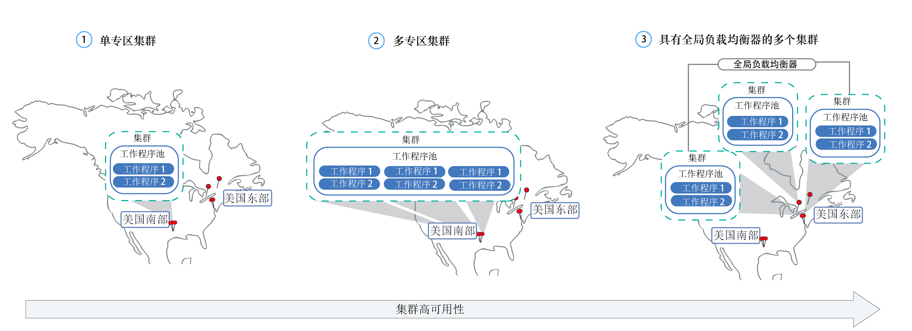
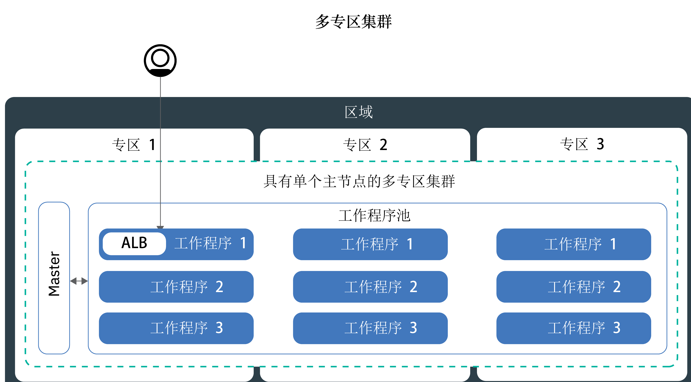

---

copyright:
  years: 2014, 2018
lastupdated: "2018-08-06"

---

{:new_window: target="_blank"}
{:shortdesc: .shortdesc}
{:screen: .screen}
{:pre: .pre}
{:table: .aria-labeledby="caption"}
{:codeblock: .codeblock}
{:tip: .tip}
{:download: .download}


# 设置集群
{: #clusters}

通过 {{site.data.keyword.containerlong}} 设计 Kubernetes 集群设置可实现最大容器可用性和集群容量。还处于准备阶段？请试用[创建 Kubernetes 集群教程](cs_tutorials.html#cs_cluster_tutorial)。
{:shortdesc}

## 在 {{site.data.keyword.containershort_notm}} 中创建多专区集群
{: #multizone}

通过 {{site.data.keyword.containerlong}}，可以创建多专区集群。使用工作程序池跨多个工作程序节点和专区分布应用程序时，用户不太可能会遇到停机时间。内置功能（如负载均衡和隔离）可在主机、网络或应用程序发生潜在专区故障时更快恢复。如果一个专区中的资源停止运行，集群工作负载仍会在其他专区中运行。
{: shortdesc}

### 等一下，专区和池究竟是什么？有什么变化？
{: #mz_changed}

**专区**（先前称为位置）是可以在其中创建 IBM Cloud 资源的数据中心。

集群现在具有称为**工作程序池**的功能，这是具有相同类型模板（例如，机器类型、CPU 和内存）的工作程序节点的集合。使用新的 `ibmcloud ks worker-pool` 命令可对集群进行更改，例如添加专区，添加工作程序节点或更新工作程序节点。

支持独立工作程序节点的先前集群设置，但不推荐使用。确保[向集群添加工作程序池](cs_clusters.html#add_pool)，然后[迁移到使用工作程序池](cs_cluster_update.html#standalone_to_workerpool)来组织工作程序节点，以取代独立工作程序节点。

### 开始之前，我需要了解哪些内容？
{: #general_reqs}

目前，您需要注意几个管理项，以确保多专区集群准备好用于工作负载。

<dl>
<dt>需要 VLAN</dt>
  <dd><p>向工作程序池添加专区时，必须定义工作程序节点连接到的专用和公用 VLAN。</p><ul><li>要检查是否在该专区中有可以使用的现有 VLAN，请运行 `ibmcloud ks vlans <zone>`。请记下 VLAN 标识，并在向工作程序池添加专区时使用这些标识。</li>
  <li>如果在该专区中没有 VLAN，那么会自动创建专用和公用 VLAN。您无需指定专用和公用 VLAN。</li></ul>
  </dd>
<dt>启用 VLAN 生成或 VRF</dt>
  <dd><p>工作程序节点必须在跨专区的专用网络上相互通信。您具有两个选项：</p>
  <ol><li>在 IBM Cloud Infrastructure (SoftLayer) 帐户中[启用 VLAN 生成](/docs/infrastructure/vlans/vlan-spanning.html#vlan-spanning)。要启用 VLAN 生成，您必须具有<strong>网络 > 管理网络 VLAN 生成</strong> > [基础架构许可权](/docs/iam/infrastructureaccess.html#infrapermission)，或者可以请求帐户所有者启用 VLAN 生成。</li>
  <li>或者，使用启用了虚拟路由器功能 (VRF) 的 IBM Cloud Infrastructure (SoftLayer) 帐户。要获取 VRF 帐户，请联系 IBM Cloud Infrastructure (SoftLayer) 支持。</li></ol></dd>
<dt>准备现有持久性卷</dt>
  <dd><p>持久性卷只能在实际存储设备所在的专区中使用。要防止多专区集群中发生意外的应用程序错误，必须将区域和专区标签应用于现有持久性卷。这些标签可帮助 kube-scheduler 确定在何处安排使用持久性卷的应用程序。运行以下命令并将 <code>&lt;mycluster&gt;</code> 替换为集群名称：</p>
  <pre class="pre"><code>bash <(curl -Ls https://raw.githubusercontent.com/IBM-Cloud/kube-samples/master/file-pv-labels/apply_pv_labels.sh) <mycluster></code></pre></dd>
<dt>只有单专区集群可用于 {{site.data.keyword.Bluemix_dedicated_notm}} 实例。</dt>
    <dd>使用 {{site.data.keyword.Bluemix_dedicated_notm}} 时，您只能创建[单专区集群](cs_clusters.html#single_zone)。设置 {{site.data.keyword.Bluemix_dedicated_notm}} 环境时，已预定义了可用专区。缺省情况下，单专区集群会设置为使用名为 `default` 的工作程序池。工作程序池将使用集群创建期间所定义的相同配置（如机器类型）的工作程序节点分组在一起。可以通过[调整现有工作程序池大小](cs_clusters.html#resize_pool)或[添加新的工作程序池](cs_clusters.html#add_pool)，向集群添加更多工作程序节点。添加工作程序池时，必须向工作程序池添加可用专区，以便工作程序可以部署到该专区中。但是，不能将其他专区添加到工作程序池。</dd>
</dl>

### 我已准备好建立多专区集群。首先该如何做？
{: #mz_gs}

首先在 [{{site.data.keyword.containershort_notm}} 控制台](https://console.bluemix.net/containers-kubernetes/clusters)中，单击**创建集群**。

可以在其中一个[多专区城市](cs_regions.html#zones)中创建集群：
* 美国南部区域中的达拉斯：dal10、dal12、dal13
* 美国东部区域中的华盛顿：wdc04、wdc06、wdc07
* 欧洲中部区域中的法兰克福：fra02、fra04、fra05
* 英国南部区域中的伦敦：lon02、lon04、lon06

**向现有集群添加专区**：

如果您在多专区城市中具有集群，那么可以向集群添加一个工作程序池，然后使用 GUI 或 CLI 将专区添加到该工作程序池。有关完成的步骤列表，请参阅[从独立工作程序节点更新到工作程序池](cs_cluster_update.html#standalone_to_workerpool)。

### 随后，目前管理集群的方式会有哪些变化？
{: #mz_new_ways}

引入工作程序池后，可以使用一组新的 API 和命令来管理集群。可以在 [CLI 文档页面](cs_cli_reference.html#cs_cli_reference)中或通过在终端中运行 `ibmcloud ks help` 来查看这些新命令。

下表比较了几种常见集群管理操作的旧方法和新方法。
<table summary="该表显示了执行多专区命令的新方法的描述。每行从左到右阅读，其中第一列是描述，第二列是旧方法，第三列是新的多专区方法。">
<caption>多专区工作程序池命令的新方法。</caption>
  <thead>
  <th>描述</th>
  <th>旧的独立工作程序节点</th>
  <th>新的多专区工作程序池</th>
  </thead>
  <tbody>
    <tr>
    <td>向集群添加工作程序节点。</td>
    <td><strong>不推荐</strong>：<code>ibmcloud ks worker-add</code> 用于添加独立工作程序节点。</td>
    <td><ul><li>要添加与现有池不同的机器类型，请创建新的工作程序池：<code>ibmcloud ks worker-pool-create</code> [命令](cs_cli_reference.html#cs_worker_pool_create)。</li>
    <li>要向现有池添加工作程序节点，请调整池中每个专区的节点数：<code>ibmcloud ks worker-pool-resize</code> [命令](cs_cli_reference.html#cs_worker_pool_resize)。</li></ul></td>
    </tr>
    <tr>
    <td>从集群中除去工作程序节点。</td>
    <td><code>ibmcloud ks worker-rm</code>，仍可以使用此命令从集群中删除有问题的工作程序节点。</td>
    <td><ul><li>如果工作程序池不均衡（例如，除去工作程序节点后），请对其进行重新均衡：<code>ibmcloud ks worker-pool-rebalance</code> [命令](cs_cli_reference.html#cs_rebalance)。</li>
    <li>要减少池中的工作程序节点数，请调整每个专区的工作程序节点数（最小值为 1）：<code>ibmcloud ks worker-pool-resize</code> [命令](cs_cli_reference.html#cs_worker_pool_resize)。</li></ul></td>
    </tr>
    <tr>
    <td>将新的 VLAN 用于工作程序节点。</td>
    <td><strong>不推荐</strong>：添加使用新的专用或公用 VLAN 的新工作程序节点：<code>ibmcloud ks worker-add</code>。</td>
    <td>将工作程序池设置为使用不同于先前所用的公用或专用 VLAN：<code>ibmcloud ks zone-network-set</code> [命令](cs_cli_reference.html#cs_zone_network_set)。</td>
    </tr>
  </tbody>
  </table>

### 如何了解有关多专区集群的更多信息？
{: #learn_more}

整个文档已针对多专区进行更新。您可能会对以下主题特别感兴趣，这些主题在引入多专区集群后进行了大幅更改：
* [设置高可用性集群](#ha_clusters)
* [规划高可用性应用程序部署](cs_app.html#highly_available_apps)
* [使用 LoadBalancer 公开多专区集群的应用程序](cs_loadbalancer.html#multi_zone_config)
* [使用 Ingress 公开应用程序](cs_ingress.html#ingress)
* 对于高可用性持久性存储器，请使用云服务，例如 [{{site.data.keyword.cloudant_short_notm}}](/docs/services/Cloudant/getting-started.html#getting-started-with-cloudant) 或 [{{site.data.keyword.cos_full_notm}}](/docs/services/cloud-object-storage/about-cos.html#about-ibm-cloud-object-storage)。

## 设置高可用性集群
{: #ha_clusters}
通过 {{site.data.keyword.containerlong}} 设计标准集群，以实现应用程序的最大可用性和容量。

跨多个工作程序节点、专区和集群分布应用程序时，用户不太可能会遇到停机时间。内置功能（例如负载均衡和隔离）可在主机、网络或应用程序发生潜在故障时更快恢复。


查看以下潜在的集群设置（按可用性程度从低到高排序）。



1. [单专区集群](#single_zone)，在一个工作程序池中具有多个工作程序节点。
2. [多专区集群](#multi_zone)，跨一个区域内的多个专区分布工作程序节点。
3. [多集群](#multiple_clusters)，跨专区或区域设置并通过全局负载均衡器连接。

### 单专区集群
{: #single_zone}

要提高应用程序的可用性，并允许在一个工作程序节点在集群中不可用时进行故障转移，请向单专区集群添加更多工作程序节点。
{: shortdesc}


缺省情况下，单专区集群会设置为使用名为 `default` 的工作程序池。工作程序池将使用集群创建期间所定义的相同配置（如机器类型）的工作程序节点分组在一起。可以通过[调整现有工作程序池大小](#resize_pool)或[添加新的工作程序池](#add_pool)，向集群添加更多工作程序节点。

添加更多工作程序节点时，可以跨多个工作程序节点分布应用程序实例。如果一个工作程序节点停止运行，可用工作程序节点上的应用程序实例会继续运行。Kubernetes 会自动重新安排不可用工作程序节点中的 pod，以确保应用程序的性能和容量。要确保 pod 均匀分布在不同工作程序节点上，请实现 [pod 亲缘关系](https://kubernetes.io/docs/concepts/configuration/assign-pod-node/#inter-pod-affinity-and-anti-affinity-beta-feature)。

**可以将单专区集群转换为多专区集群吗？**
有时可以。如果单专区集群位于[多专区大城市](cs_regions.html#zones)中，那么可以将单专区集群转换为多专区集群。要转换为多专区集群，请向集群的工作程序池[添加专区](#add_zone)。如果您有多个工作程序池，请将专区添加到所有池，以便工作程序节点在集群中保持均衡。

**必须使用多专区集群吗？**
不是。您可以根据需要创建任意数量的单专区集群。实际上，为了简化管理，或者在集群必须位于特定[单专区城市](cs_regions.html#zones)中时，您可能更愿意使用单专区集群。

### 多专区集群
{: #multi_zone}

为了保护集群不受单专区故障的影响，可以跨一个区域内的多个专区分布集群。
{: shortdesc}



您可以向集群添加更多专区，以在一个区域内跨多个专区的工作程序池中复制工作程序节点。多专区集群旨在跨工作程序节点和专区均匀安排 pod，以确保可用性和故障恢复。如果工作程序节点未跨专区均匀分布，或者其中一个专区中的容量不足，那么 Kubernetes 调度程序可能无法安排所有请求的 pod。结果，pod 可能会进入**暂挂**状态，直到有足够的容量可用为止。如果要更改缺省行为，以使 Kubernetes 调度程序在多个专区中以最佳分布方式分布 pod，请使用 `preferredDuringSchedulingIgnoredDuringExecution` [pod 亲缘关系策略](https://kubernetes.io/docs/concepts/configuration/assign-pod-node/#inter-pod-affinity-and-anti-affinity-beta-feature)。

**为什么需要工作程序节点位于 3 个专区中？**</br>
在 3 个专区中分布工作负载可确保应用程序的高可用性，以防一个或两个专区不可用的情况，同时这也使集群设置更符合成本效益。您可能会问为什么？下面是一个示例。

假设您需要具有 6 个核心的工作程序节点来处理应用程序的工作负载。要使集群的可用性更高，您具有以下选项：

- **在另一个专区中复制资源：**使用此选项时，会有 2 个工作程序节点，每个节点在每个专区中有 6 个核心，总计 12 个核心。</br>
- **在 3 个专区中分布资源：**使用此选项时，每个专区会部署 3 个核心，总容量为 9 个核心。要处理工作负载，在同一时间必须有两个专区在正常运行。如果一个专区不可用，那么其他两个专区可以处理工作负载。如果两个专区不可用，那么剩余 3 个核心将处理工作负载。每个区域部署 3 个核心意味着机器更小，从而降低了成本。</br>

**如何提高 Kubernetes 主节点的可用性？**</br>
多专区集群设置有单个 Kubernetes 主节点，该主节点在工作程序所在的大城市区域中进行供应。例如，如果工作程序位于 `dal10`、`dal12` 或 `dal13` 这三个专区中的一个或多个专区中，那么主节点会位于 Dallas 多专区大城市中。

**Kubernetes 主节点变得不可用时会发生什么情况？**</br>
Kubernetes 主节点不可用时，无法访问或更改集群。但是，已部署的工作程序节点、应用程序和资源不会修改，并且会继续运行。要保护集群不受 Kubernetes 主节点故障的影响或在多专区集群不可用的区域中保护集群，可以[设置多个集群并通过全局负载均衡器连接](#multiple_clusters)。

**如何允许用户通过公共因特网访问应用程序？**</br>
可以使用 Ingress 应用程序负载均衡器 (ALB) 或 LoadBalancer 服务来公开应用程序。缺省情况下，会自动在集群的每个专区中创建并启用公共 ALB。此外，还会自动创建并启用集群的多专区负载均衡器 (MZLB)。MZLB 运行状况检查会检查集群的每个专区中的 ALB，并根据这些运行状况检查来使 DNS 查找结果保持更新。有关更多信息，请参阅 [Ingress 服务](cs_ingress.html#planning)。

LoadBalancer 服务只需在一个专区中设置。应用程序的入局请求会从一个专区路由到其他专区中的所有应用程序实例。如果此专区变得不可用，那么可能无法通过因特网访问应用程序。考虑到单专区故障，您可以在其他专区中设置更多 LoadBalancer 服务。有关更多信息，请参阅高可用性 [LoadBalancer 服务](cs_loadbalancer.html#multi_zone_config)。

**我已创建多专区集群。为什么仍然只有一个专区？如何向集群添加专区？**</br>
如果是[使用 CLI 创建多专区集群](#clusters_cli)的，那么会创建集群，但您必须将专区添加到工作程序池才能完成该过程。要跨多个专区，集群必须位于[多专区大城市](cs_regions.html#zones)中。要向集群添加专区，并跨专区分布工作程序节点，请参阅[向集群添加专区](#add_zone)。

### 通过全局负载均衡器连接的多个集群
{: #multiple_clusters}

要保护应用程序不受 Kubernetes 主节点故障的影响以及对于多专区集群不可用的区域保护应用程序，可以在一个区域的不同专区中创建多个集群，并通过全局负载均衡器将集群连接在一起。
{: shortdesc}


要跨多个集群均衡工作负载，必须设置全局负载均衡器，并将应用程序负载均衡器 (ALB) 或 LoadBalancer 服务的 IP 地址添加到域。通过添加这些 IP 地址，可以在集群之间路由入局流量。要使全局负载均衡器检测其中一个集群是否不可用，请考虑向每个 IP 地址添加基于 ping 操作的运行状况检查。设置此检查后，DNS 提供程序会定期对添加到域的 IP 地址执行 ping 操作。如果一个 IP 地址变为不可用，那么不会再将流量发送到此 IP 地址。但是，Kubernetes 不会在可用集群中工作程序节点上自动重新启动不可用集群中的 pod。如果希望 Kubernetes 在可用集群中自动重新启动可用集群中的 pod，请考虑设置[多专区集群](#multi_zone)。

**为什么需要 3 个集群位于 3 个专区中？**</br>
类似于[在多专区集群中使用 3 个专区](#multi_zone)，您可以通过设置跨专区的 3 个集群，为应用程序提供更高可用性。此外，还可以通过购买更小的机器来处理工作负载，从而降低成本。

**如果要跨区域设置多个集群该怎么做？**</br>
可以在一个地理位置的不同区域（如美国南部和美国东部）或不同地理位置（如美国南部和欧洲中部）中设置多个集群。这两种设置为应用程序提供的可用性级别相同，但同时在数据共享和数据复制方面增加了复杂性。在大多数情况下，保持在同一地理位置中就足以满足需求。但是，如果您的用户分布在世界各地，那么最好设置用户所在的集群，以便用户在向应用程序发送请求时不会遇到很长的等待时间。

**要设置用于多个集群的全局负载均衡器，请执行以下操作：**

1. 在多个专区或区域中[创建集群](cs_clusters.html#clusters)。
2. 为 IBM Cloud Infrastructure (SoftLayer) 帐户启用 [VLAN 生成](/docs/infrastructure/vlans/vlan-spanning.html#vlan-spanning)，以便工作程序节点可以在专用网络上彼此通信。要执行此操作，您需要**网络 > 管理网络 VLAN 生成** > [基础架构许可权](cs_users.html#infra_access)，或者可以请求帐户所有者启用 VLAN 生成。作为 VLAN 生成的替代方法，如果在 IBM Cloud Infrastructure (SoftLayer) 帐户中启用了虚拟路由器功能 (VRF)，那么可以使用 VRF。
3. 在每个集群中，使用[应用程序负载均衡器 (ALB)](cs_ingress.html#ingress_expose_public) 或 [LoadBalancer 服务](cs_loadbalancer.html#config)来公开应用程序。
4. 对于每个集群，列出 ALB 或 LoadBalancer 服务的公共 IP 地址。
   - 要列出集群中所有支持公共的 ALB 的 IP 地址，请运行以下命令：
     ```
     ibmcloud ks albs --cluster <cluster_name_or_id>
     ```
     {: pre}

   - 要列出 LoadBalancer 服务的 IP 地址，请运行以下命令：
     ```
    kubectl describe service <myservice>
    ```
     {: pre}

     **LoadBalancer Ingress** IP 地址是分配给 LoadBalancer 服务的可移植 IP 地址。
4. 使用 {{site.data.keyword.Bluemix_notm}} Internet Services (CIS) 来设置全局负载均衡器，或设置自己的全局负载均衡器。
    * 使用 CIS 全局负载均衡器：
        1. 通过执行 [{{site.data.keyword.Bluemix_notm}}Internet Services (CIS) 入门](/docs/infrastructure/cis/getting-started.html#getting-started-with-ibm-cloud-internet-services-cis-)中的步骤 1-4 来设置服务。
            * 步骤 1-3 会引导您供应服务实例、添加应用程序域以及配置名称服务器。
            * 步骤 4 会将引导您创建 DNS 记录。请为收集的每个 ALB 或负载均衡器 IP 地址创建 DNS 记录。这些 DNS 记录会将应用程序域映射到所有集群 ALB 或负载均衡器，并确保在循环周期中将对应用程序域的请求转发到集群。
        2. 为 ALB 或负载均衡器[添加运行状况检查](/docs/infrastructure/cis/glb-setup.html#add-a-health-check)。可以对所有集群中的 ALB 或负载均衡器使用相同的运行状况检查，或者创建特定运行状况检查以用于特定集群。
        3. 通过添加集群的 ALB 或负载均衡器 IP，为每个集群[添加源池](/docs/infrastructure/cis/glb-setup.html#add-a-pool)。例如，如果您有 3 个集群，每个集群有 2 个 ALB，请创建 3 个源池，每个池 2 个 ALB IP 地址。为创建的每个源池添加运行状况检查。
        4. [添加全局负载均衡器](/docs/infrastructure/cis/glb-setup.html#set-up-and-configure-your-load-balancers)。
    * 使用自己的全局负载均衡器：
        1. 通过将所有支持公共的 ALB 和 LoadBalancer 服务的 IP 地址添加到域，将域配置为将入局流量路由到 ALB 或 LoadBalancer 服务。
        2. 对于每个 IP 地址，启用基于 ping 操作的运行状况检查，以便 DNS 提供程序可以检测到运行状况欠佳的 IP 地址。如果检测到运行状况欠佳的 IP 地址，那么流量不会再路由到此 IP 地址。

## 工作程序节点配置规划
{: #planning_worker_nodes}

Kubernetes 集群由分组成工作程序节点池的工作程序节点组成，并由 Kubernetes 主节点进行集中监视和管理。集群管理员决定如何设置工作程序节点的集群，以确保集群用户具备在集群中部署和运行应用程序所需的所有资源。
{:shortdesc}

创建标准集群时，会在 IBM Cloud Infrastructure (SoftLayer) 中代表您订购具有相同配置的工作程序节点，然后将其添加到集群中的缺省工作程序节点池。为每个工作程序节点分配唯一的工作程序节点标识和域名，在创建集群后，不得更改该标识和域名。

您可以选择虚拟服务器或物理（裸机）服务器。根据选择的硬件隔离级别，可以将虚拟工作程序节点设置为共享或专用节点。您还可以选择是希望工作程序节点连接到公用 VLAN 和专用 VLAN，还是仅连接到专用 VLAN。每个工作程序节点都供应有特定机器类型，用于确定部署到该工作程序节点的容器可用的 vCPU 数、内存量和磁盘空间量。
Kubernetes 限制了在一个集群中可以拥有的最大工作程序节点数。有关更多信息，请查看[工作程序节点和 pod 配额 ](https://kubernetes.io/docs/setup/cluster-large/)。

### 工作程序池
{: #worker_pools}

每个集群都设置有一个缺省工作程序池，该工作程序池将使用集群创建期间所定义的相同配置（如机器类型）的工作程序节点分组在一起。如果通过 UI 供应集群，那么可以同时选择多个专区。通过 CLI 创建的集群最初仅在一个专区中供应有一个工作程序池。在供应集群以在多个专区中均匀复制工作程序节点后，可以向工作程序池添加更多专区。例如，如果将第二个专区添加到包含 3 个工作程序节点的工作程序池，那么会向第二个专区供应 3 个工作程序节点，这样您就有总共包含 6 个工作程序节点的集群。

要支持不同专区中的工作程序之间通过专用网络进行通信，必须启用 [VLAN 生成](/docs/infrastructure/vlans/vlan-spanning.html#vlan-spanning)。要将不同的机器类型模板添加到集群，请[创建其他工作程序池](cs_cli_reference.html#cs_worker_pool_create)。

### 工作程序节点的硬件
{: #shared_dedicated_node}

在 {{site.data.keyword.Bluemix_notm}} 中创建标准集群时，可以选择将工作程序节点作为物理机器（裸机）进行供应，或作为在物理硬件上运行的虚拟机进行供应。创建免费集群时，工作程序节点会自动作为 IBM Cloud Infrastructure (SoftLayer) 帐户中的虚拟共享节点进行供应。
{:shortdesc}


查看以下信息以确定所需的工作程序池的类型。规划时，请考虑将[工作程序节点限制最小阈值](#resource_limit_node)设置为总内存容量的 10%。

<dl>
<dt>为何要使用物理机器（裸机）？</dt>
<dd><p><strong>更多计算资源</strong>：可以将工作程序节点作为单租户物理服务器（也称为裸机）进行供应。通过裸机，您可以直接访问机器上的物理资源，例如内存或 CPU。此设置无需虚拟机系统管理程序将物理资源分配给在主机上运行的虚拟机。相反，裸机机器的所有资源都仅供工作程序专用，因此您无需担心“吵闹的邻居”共享资源或降低性能。物理机器类型的本地存储器大于虚拟机，并且某些类型具有用于备份本地数据的 RAID。</p>
<p><strong>按月计费</strong>：裸机服务器比虚拟服务器更昂贵，最适用于需要更多资源和主机控制的高性能应用程序。裸机服务器按月计费。如果您在月底之前取消裸机服务器，那么仍将收取该整月的费用。订购和取消裸机服务器是通过 IBM Cloud Infrastructure (SoftLayer) 帐户进行的手动过程。完成此过程可能需要超过一个工作日的时间。</p>
<p><strong>用于启用可信计算的选项</strong>：启用“可信计算”以验证工作程序节点是否被篡改。如果在创建集群期间未启用信任，但希望日后启用，那么可以使用 `ibmcloud ks feature-enable` [命令](cs_cli_reference.html#cs_cluster_feature_enable)。启用信任后，日后无法将其禁用。可以创建不含信任的新集群。有关节点启动过程中的信任工作方式的更多信息，请参阅[具有可信计算的 {{site.data.keyword.containershort_notm}}](cs_secure.html#trusted_compute)。在运行 Kubernetes V1.9 或更高版本并具有特定裸机机器类型的集群上，可信计算可用。运行 `ibmcloud ks machine-types <zone>` [命令](cs_cli_reference.html#cs_machine_types)后，可以通过查看 **Trustable** 字段来了解哪些机器支持信任。例如，`mgXc` GPU 类型模板不支持可信计算。</p></dd>
<dt>为什么要使用虚拟机？</dt>
<dd><p>相对于裸机，使用虚拟机 (VM) 能以更具成本效益的价格获得更高灵活性、更短供应时间以及更多自动可扩展性功能。您可以将 VM 用于最通用的用例，例如测试和开发环境、编译打包和生产环境、微服务以及业务应用程序。但是，在性能方面会有所牺牲。如果需要针对 RAM 密集型、数据密集型或 GPU 密集型工作负载进行高性能计算，请使用裸机。</p>
<p><strong>确定是单租户还是多租户</strong>：创建标准虚拟集群时，必须选择是希望底层硬件由多个 {{site.data.keyword.IBM_notm}} 客户共享（多租户）还是仅供您专用（单租户）。</p>
<p>在多租户设置中，物理资源（如 CPU 和内存）在部署到同一物理硬件的所有虚拟机之间共享。要确保每个虚拟机都能独立运行，虚拟机监视器（也称为系统管理程序）会将物理资源分段成隔离的实体，并将其作为专用资源分配给虚拟机（系统管理程序隔离）。</p>
<p>在单租户设置中，所有物理资源都仅供您专用。您可以将多个工作程序节点作为虚拟机部署在同一物理主机上。与多租户设置类似，系统管理程序也会确保每个工作程序节点在可用物理资源中获得应有的份额。</p>
<p>共享节点通常比专用节点更便宜，因为底层硬件的开销由多个客户分担。但是，在决定是使用共享还是专用节点时，可能需要咨询您的法律部门，以讨论应用程序环境所需的基础架构隔离和合规性级别。</p>
<p><strong>虚拟 `u2c` 或 `b2c` 机器类型模板</strong>：这些机器使用本地磁盘（而不是存储区联网 (SAN)）来实现可靠性。可靠性优势包括在将字节序列化到本地磁盘时可提高吞吐量，以及减少因网络故障而导致的文件系统降级。这些机器类型包含用于操作系统文件系统的 25 GB 主本地磁盘存储和用于数据（例如，容器运行时和 kubelet）的 100 GB 辅助本地磁盘存储。</p>
<p><strong>如果我拥有不推荐使用的 `u1c` 或 `b1c` 机器类型该怎么办？</strong>要开始使用 `u2c` 和 `b2c` 机器类型，请[通过添加工作程序节点来更新机器类型](cs_cluster_update.html#machine_type)。</p></dd>
<dt>我可以选择哪些虚拟机和物理机器类型模板？</dt>
<dd><p>有很多！请选择最适合您用例的机器类型。请记住，一个工作程序池由属于相同类型模板的机器组成。如果要在集群中混合使用机器类型，请为每种类型模板创建单独的工作程序池。</p>
<p>机器类型因专区而变化。要查看专区中可用的机器类型，请运行 `ibmcloud ks machine-types <zone_name>`。</p>
<p><table>
<caption>{{site.data.keyword.containershort_notm}} 中的可用物理（裸机）和虚拟机类型。</caption>
<thead>
<th>名称和用例</th>
<th>核心数/内存</th>
<th>主/辅助磁盘</th>
<th>网络速度</th>
</thead>
<tbody>
<tr>
<td><strong>虚拟，u2c.2x4</strong>：对于快速测试、概念验证和其他轻型工作负载，请使用此最小大小的 VM。</td>
<td>2 / 4 GB</td>
<td>25 GB / 100 GB</td>
<td>1000 Mbps</td>
</tr>
<tr>
<td><strong>虚拟，b2c.4x16</strong>：对于测试和开发以及其他轻型工作负载，请选择此均衡的 VM。</td>
<td>4 / 16 GB</td>
<td>25 GB / 100 GB</td>
<td>1000 Mbps</td>
</tr>
<tr>
<td><strong>虚拟，b2c.16x64</strong>：对于中型工作负载，请选择此均衡的 VM。</td></td>
<td>16 / 64 GB</td>
<td>25 GB / 100 GB</td>
<td>1000 Mbps</td>
</tr>
<tr>
<td><strong>虚拟，b2c.32x128</strong>：对于中型到大型工作负载（例如，具有大量并发用户的数据库和动态 Web 站点），请选择此均衡的 VM。</td></td>
<td>32 / 128 GB</td>
<td>25 GB / 100 GB</td>
<td>1000 Mbps</td>
</tr>
<tr>
<td><strong>虚拟，b2c.56x242</strong>：对于大型工作负载（例如，具有大量并发用户的数据库和多个应用程序），请选择此均衡的 VM。</td></td>
<td>56 / 242 GB</td>
<td>25 GB / 100 GB</td>
<td>1000 Mbps</td>
</tr>
<tr>
<td><strong>RAM 密集型裸机，mr1c.28x512</strong>：最大限度提高可用于工作程序节点的 RAM。</td>
<td>28 / 512 GB</td>
<td>2 TB SATA / 960 GB SSD</td>
<td>10000 Mbps</td>
</tr>
<tr>
<td><strong>GPU 裸机，mg1c.16x128</strong>：对于数学密集型工作负载（例如，高性能计算、机器学习或 3D 应用程序），请选择此类型。此类型模板有 1 块 Tesla K80 物理卡，每块卡有 2 个图形处理单元 (GPU)，共有 2 个 GPU。</td>
<td>16 / 128 GB</td>
<td>2 TB SATA / 960 GB SSD</td>
<td>10000 Mbps</td>
</tr>
<tr>
<td><strong>GPU 裸机，mg1c.28x256</strong>：对于数学密集型工作负载（例如，高性能计算、机器学习或 3D 应用程序），请选择此类型。此类型模板有 2 块 Tesla K80 物理卡，每块卡有 2 个 GPU，共有 4 个 GPU。</td>
<td>28 / 256 GB</td>
<td>2 TB SATA / 960 GB SSD</td>
<td>10000 Mbps</td>
</tr>
<tr>
<td><strong>数据密集型裸机，md1c.16x64.4x4tb</strong>：适用于需要大量本地磁盘存储的情况，包括用于备份机器上本地存储的数据的 RAID。用于分布式文件系统、大型数据库和大数据分析工作负载等用例。</td>
<td>16 / 64 GB</td>
<td>2 个 2 TB RAID1 / 4 个 4 TB SATA RAID10</td>
<td>10000 Mbps</td>
</tr>
<tr>
<td><strong>数据密集型裸机，md1c.28x512.4x4tb</strong>：适用于需要大量本地磁盘存储的情况，包括用于备份机器上本地存储的数据的 RAID。用于分布式文件系统、大型数据库和大数据分析工作负载等用例。</td>
<td>28 / 512 GB</td>
<td>2 个 2 TB RAID1 / 4 个 4 TB SATA RAID10</td>
<td>10000 Mbps</td>
</tr>
<tr>
<td><strong>均衡裸机，mb1c.4x32</strong>：用于需要的计算资源比虚拟机所提供的计算资源更多的均衡工作负载。</td>
<td>4 / 32 GB</td>
<td>2 TB SATA / 2 TB SATA</td>
<td>10000 Mbps</td>
</tr>
<tr>
<td><strong>均衡裸机，mb1c.16x64</strong>：用于需要的计算资源比虚拟机所提供的计算资源更多的均衡工作负载。</td>
<td>16 / 64 GB</td>
<td>2 TB SATA / 960 GB SSD</td>
<td>10000 Mbps</td>
</tr>
</tbody>
</table>
</p>
</dd>
</dl>


可以使用[控制台 UI](#clusters_ui) 或 [CLI](#clusters_cli) 来部署集群。

### 工作程序节点的 VLAN 连接
{: #worker_vlan_connection}

创建集群时，每个集群都会自动通过 IBM Cloud Infrastructure (SoftLayer) 帐户连接到 VLAN。
{:shortdesc}

VLAN 会将一组工作程序节点和 pod 视为连接到同一物理连线那样进行配置。

* 公用 VLAN 上自动供应了两个子网。主公用子网确定在集群创建期间分配给工作程序节点的公共 IP 地址，可移植公用子网为 Ingress 和负载均衡器联网服务提供公共 IP 地址。
* 专用 VLAN 上也自动供应了两个子网。主专用子网确定在集群创建期间分配给工作程序节点的专用 IP 地址，可移植专用子网为 Ingress 和负载均衡器联网服务提供专用 IP 地址。

对于免费集群，缺省情况下集群的工作程序节点会在集群创建期间连接到 IBM 拥有的公用 VLAN 和专用 VLAN。

对于标准集群，首次在某个专区中创建集群时，会自动供应公用 VLAN 和专用 VLAN。对于在该专区中创建的每个后续集群，可选择要使用的 VLAN。可以将工作程序节点连接到公用 VLAN 和专用 VLAN，也可以仅连接到专用 VLAN。如果要将工作程序节点仅连接到专用 VLAN，那么可以在集群创建期间使用现有专用 VLAN 的标识，或者[创建专用 VLAN](/docs/cli/reference/softlayer/index.html#sl_vlan_create) 并使用其标识。如果工作程序节点设置为仅使用专用 VLAN，那么必须为网络连接配置备用解决方案（例如，[虚拟路由器设备](cs_vpn.html#vyatta)），以便工作程序节点可以与主节点通信。

**注**：如果有多个 VLAN 用于一个集群，或者在同一 VLAN 上有多个子网，那么必须开启 VLAN 生成，以便工作程序节点可以在专用网络上相互通信。有关指示信息，请参阅[启用或禁用 VLAN 生成](/docs/infrastructure/vlans/vlan-spanning.html#vlan-spanning)。

### 工作程序节点内存限制
{: #resource_limit_node}

{{site.data.keyword.containershort_notm}} 会对每个工作程序节点设置内存限制。在工作程序节点上运行的 pod 超过此内存限制时，将除去 pod。在 Kubernetes 中，此限制称为[硬逐出阈值 ](https://kubernetes.io/docs/tasks/administer-cluster/out-of-resource/#hard-eviction-thresholds)。
{:shortdesc}

如果需要频繁除去 pod，请向集群添加更多工作程序节点，或者对 pod 设置[资源限制 ](https://kubernetes.io/docs/concepts/configuration/manage-compute-resources-container/#resource-requests-and-limits-of-pod-and-container)。

**每台机器的最小阈值等于其总内存容量的 10%**。如果工作程序节点上的可用内存小于允许的最小阈值，那么 Kubernetes 将立即除去 pod。如果有工作程序节点可用，那么 pod 会重新安排到其他工作程序节点上。例如，如果您有一个 `b2c.4x16` 虚拟机，其总内存容量为 16 GB。如果可用内存小于 1600 MB (10%)，那么无法将新 pod 安排到此工作程序节点上，而是改为安排到其他工作程序节点上。如果没有其他工作程序节点可用，那么新 pod 将保持不安排。

要查看工作程序节点上使用的内存量，请运行 [kubectl top node ](https://kubernetes.io/docs/reference/kubectl/overview/#top)。

### 自动恢复工作程序节点
`Docker`、`kubelet`、`kube-proxy` 和 `calico` 是关键组件，这些组件必须正常运行才能拥有正常运行的 Kubernetes 工作程序节点。随着时间变化，这些组件可能会中断，这可能使工作程序节点处于非正常运行状态。非正常运行的工作程序节点会使集群总容量下降，并可能导致应用程序产生停机时间。

可以[为工作程序节点配置运行状况检查并启用自动恢复](cs_health.html#autorecovery)。如果自动恢复根据配置的检查，检测到运行状况欠佳的工作程序节点，那么自动恢复会触发更正操作，例如在工作程序节点上重装操作系统。有关自动恢复的工作方式的更多信息，请参阅[自动恢复博客 ](https://www.ibm.com/blogs/bluemix/2017/12/autorecovery-utilizes-consistent-hashing-high-availability/)。

<br />


## 使用 GUI 创建集群
{: #clusters_ui}

Kubernetes 集群的用途是定义一组资源、节点、网络和存储设备，以便使应用程序保持高可用性。要部署应用程序，必须先创建集群，并在该集群中设置工作程序节点的定义。
{:shortdesc}

**开始之前**

您必须具有试用、现买现付或预订 [{{site.data.keyword.Bluemix_notm}} 帐户](https://console.bluemix.net/registration/)。

要通过选择的硬件隔离、专区、API 版本等来完全定制集群，请创建标准集群。
{: tip}

**创建免费集群**

可以使用 1 个免费集群来熟悉 {{site.data.keyword.containershort_notm}} 的工作方式。通过免费集群，您可以了解术语，完成教程，弄清状况，然后再跃升到生产级别的标准集群。别担心，就算您拥有的是现买现付或预订帐户，也仍会获得免费集群。**注**：免费集群的生命周期为 21 天。在此时间之后，免费集群将到期，并且会删除该集群及其数据。{{site.data.keyword.Bluemix_notm}} 不会备份删除的数据，因此无法复原这些数据。请确保备份任何重要数据。

1. 在目录中，选择 **{{site.data.keyword.containershort_notm}}**。

2. 选择要在其中部署集群的区域。

3. 选择**免费**集群套餐。

4. 为集群提供名称。名称必须以字母开头，可以包含字母、数字和连字符 (-)，并且不能超过 35 个字符。集群名称和部署集群的区域构成了 Ingress 子域的标准域名。为了确保 Ingress 子域在区域内是唯一的，可能会截断 Ingress 域名中的集群名称并附加随机值。


5. 单击**创建集群**。缺省情况下，将创建包含一个工作程序节点的工作程序池。您可以在**工作程序节点**选项卡中查看工作程序节点部署的进度。完成部署后，您可以在**概述**选项卡中看到集群已就绪。

    更改创建期间分配的唯一标识或域名，会导致 Kubernetes 主节点无法管理集群。
    {: tip}

</br>

**创建标准集群**

1. 在目录中，选择 **{{site.data.keyword.containershort_notm}}**。

2. 选择要在其中部署集群的区域。要获得最佳性能，请选择物理上离您最近的区域。请记住，如果选择的是您所在国家或地区以外的专区，那么在存储数据之前可能需要法律授权。

3. 选择**标准**集群套餐。通过标准集群，您有权访问多种功能，如高可用性环境的多个工作程序节点。

4. 输入专区详细信息。

    1. 选择**单专区**或**多专区**可用性。在多专区集群中，主节点部署在支持多专区的专区中，并且集群的资源会在多个专区中进行分布。根据区域的不同，您的选择可能会受到限制。

    2. 选择要在其中托管集群的特定专区。必须选择至少一个专区，但您可以选择任意多数量的专区。如果选择多个专区，那么工作程序节点会跨您选择的专区分布，从而为您提供更高的可用性。如果仅选择 1 个专区，那么在创建该专区后，可以[向集群添加专区](#add_zone)。

    3. 从 IBM Cloud Infrastructure (SoftLayer) 帐户中选择公用 VLAN（可选）和专用 VLAN（必需）。工作程序节点使用专用 VLAN 相互通信。要与 Kubernetes 主节点通信，必须为工作程序节点配置公共连接。如果在此专区中没有公用或专用 VLAN，请使其留空。系统将自动创建公用和专用 VLAN。如果您有现有 VLAN，并且未指定公用 VLAN，请考虑配置防火墙，例如[虚拟路由器设备](/docs/infrastructure/virtual-router-appliance/about.html#about)。可以对多个集群使用相同的 VLAN。
要支持不同专区中的工作程序之间通过专用网络进行通信，必须启用 [VLAN 生成](/docs/infrastructure/vlans/vlan-spanning.html#vlan-spanning)。**注**：如果工作程序节点设置为仅使用专用 VLAN，那么必须为网络连接配置备用解决方案。

5. 配置缺省工作程序池。工作程序池是共享相同配置的成组的工作程序节点。日后，始终可以向集群添加更多工作程序池。

    1. 选择硬件隔离的类型。“虚拟”按小时计费，“裸机”按月计费。

        - **虚拟 - 专用**：工作程序节点在帐户专用的基础架构上托管。物理资源完全隔离。

        - **虚拟 - 共享**：基础架构资源（例如，系统管理程序和物理硬件）在您与其他 IBM 客户之间共享，但每个工作程序节点只能由您访问。虽然此选项更便宜，并且足以满足大多数情况，但您可能希望使用公司策略来验证性能和基础架构需求。

        - **裸机**：裸机服务器按月计费，通过与 IBM Cloud Infrastructure (SoftLayer) 进行手动交互来供应，可能需要一个工作日以上的时间才能完成。裸机最适用于需要更多资源和主机控制的高性能应用程序。对于运行 Kubernetes V1.9 或更高版本的集群，还可以选择启用[可信计算](cs_secure.html#trusted_compute)来验证工作程序节点是否被篡改。可信计算可用于精选的裸机机器类型。例如，`mgXc` GPU 类型模板不支持可信计算。如果在创建集群期间未启用信任，但希望日后启用，那么可以使用 `ibmcloud ks feature-enable` [命令](cs_cli_reference.html#cs_cluster_feature_enable)。启用信任后，日后无法将其禁用。

        确保要供应裸机机器。因为裸机机器是按月计费的，所以如果在错误下单后立即将其取消，也仍然会按整月向您收费。
        {:tip}

    2. 选择机器类型。机器类型用于定义在每个工作程序节点中设置并可供容器使用的虚拟 CPU 量、内存量和磁盘空间量。可用的裸机和虚拟机类型随部署集群的专区而变化。创建集群后，可以通过将工作程序或池添加到集群来添加不同的机器类型。

    3. 指定集群中需要的工作程序节点数。输入的工作程序数将在所选数量的专区之间进行复制。这意味着如果您有 2 个专区并选择了 3 个工作程序节点，那么会供应 6 个节点，并且每个专区中存在 3 个节点。

6. 为集群提供唯一名称。**注**：更改创建期间分配的唯一标识或域名，会导致 Kubernetes 主节点无法管理集群。

7. 为集群主节点选择 Kubernetes API 服务器版本。

8. 单击**创建集群**。这将创建具有指定工作程序数的工作程序池。您可以在**工作程序节点**选项卡中查看工作程序节点部署的进度。完成部署后，您可以在**概述**选项卡中看到集群已就绪。

**接下来要做什么？**

集群启动并开始运行后，可查看以下任务：

-   通过[向集群添加专区](#add_zone)，跨多个专区分布工作程序节点。
-   [安装 CLI 以开始使用集群。](cs_cli_install.html#cs_cli_install)
-   [在集群中部署应用程序。](cs_app.html#app_cli)
-   [在 {{site.data.keyword.Bluemix_notm}} 中设置自己的专用注册表，以存储 Docker 映像并与其他用户共享这些映像。](/docs/services/Registry/index.html)
- 如果有多个 VLAN 用于一个集群，或者在同一 VLAN 上有多个子网，那么必须[开启 VLAN 生成](/docs/infrastructure/vlans/vlan-spanning.html#vlan-spanning)，以便工作程序节点可以在专用网络上相互通信。
- 如果您有防火墙，那么可能需要[打开必要的端口](cs_firewall.html#firewall)才能使用 `ibmcloud`、`kubectl` 或 `calicotl` 命令，以允许来自集群的出站流量，或允许联网服务的入站流量。
-  使用 Kubernetes V1.10 或更高版本的集群：使用 [pod 安全策略](cs_psp.html)控制谁可以在集群中创建 pod。

<br />


## 使用 CLI 创建集群
{: #clusters_cli}

Kubernetes 集群的用途是定义一组资源、节点、网络和存储设备，以便使应用程序保持高可用性。要部署应用程序，必须先创建集群，并在该集群中设置工作程序节点的定义。
{:shortdesc}

开始之前：
- 您必须具有现买现付或预订 [{{site.data.keyword.Bluemix_notm}} 帐户](https://console.bluemix.net/registration/)，该帐户配置为[访问 IBM Cloud Infrastructure (SoftLayer) 产品服务组合](cs_troubleshoot_clusters.html#cs_credentials)。您可以创建 1 个免费集群来试用部分功能 30 天，或者创建具有所选硬件隔离的可完全定制的标准集群。
- [确保在 IBM Cloud Infrastructure (SoftLayer) 中具有最低的必需许可权来供应标准集群](cs_users.html#infra_access)。
- 安装 {{site.data.keyword.Bluemix_notm}} CLI 和 [{{site.data.keyword.containershort_notm}} 插件](cs_cli_install.html#cs_cli_install)。
- 如果有多个 VLAN 用于一个集群，或者在同一 VLAN 上有多个子网，那么必须[开启 VLAN 生成](/docs/infrastructure/vlans/vlan-spanning.html#vlan-spanning)，以便工作程序节点可以在专用网络上相互通信。

要创建集群，请执行以下操作：

1.  登录到 {{site.data.keyword.Bluemix_notm}} CLI。

    1.  登录并根据提示输入 {{site.data.keyword.Bluemix_notm}} 凭证。

        ```
        ibmcloud login
        ```
        {: pre}

        **注**：如果您有联合标识，请使用 `ibmcloud login --sso` 登录到 {{site.data.keyword.Bluemix_notm}} CLI。输入您的用户名，并使用 CLI 输出中提供的 URL 来检索一次性密码。如果不使用 `--sso` 时登录失败，而使用 `--sso` 选项时登录成功，说明您拥有的是联合标识。

    2. 如果有多个 {{site.data.keyword.Bluemix_notm}} 帐户，请选择要在其中创建 Kubernetes 集群的帐户。

    3.  如果要在先前选择的 {{site.data.keyword.Bluemix_notm}} 区域以外的区域中创建或访问 Kubernetes 集群，请运行 `ibmcloud ks region-set`。

3.  创建集群。

    1.  **标准集群**：查看可用的专区。显示的专区取决于您登录到的 {{site.data.keyword.containershort_notm}} 区域。

        **注**：要使集群跨多个专区，必须在[支持多专区的专区](cs_regions.html#zones)中创建集群。

        ```
        ibmcloud ks zones
        ```
        {: pre}

    2.  **标准集群**：选择专区并查看该专区中可用的机器类型。机器类型指定可供每个工作程序节点使用的虚拟或物理计算主机。

        -  查看**服务器类型**字段，以选择虚拟或物理（裸机）机器。
        -  **虚拟**：虚拟机按小时计费，在共享或专用硬件上供应。
        -  **物理**：裸机服务器按月计费，通过与 IBM Cloud Infrastructure (SoftLayer) 进行手动交互来供应，可能需要一个工作日以上的时间才能完成。裸机最适用于需要更多资源和主机控制的高性能应用程序。
        - **具有可信计算的物理机器**：对于运行 Kubernetes V1.9 或更高版本的裸机集群，还可以选择启用[可信计算](cs_secure.html#trusted_compute)来验证裸机工作程序节点是否被篡改。可信计算可用于精选的裸机机器类型。例如，`mgXc` GPU 类型模板不支持可信计算。如果在创建集群期间未启用信任，但希望日后启用，那么可以使用 `ibmcloud ks feature-enable` [命令](cs_cli_reference.html#cs_cluster_feature_enable)。启用信任后，日后无法将其禁用。
        -  **机器类型**：要确定需要部署的机器类型，请查看[可用工作程序节点硬件](#shared_dedicated_node)的核心、内存和存储器组合。创建集群后，可以通过[添加工作程序池](#add_pool)来添加不同的物理或虚拟机类型。

           确保要供应裸机机器。因为裸机机器是按月计费的，所以如果在错误下单后立即将其取消，也仍然会按整月向您收费。
        {:tip}

        ```
        ibmcloud ks machine-types <zone>
        ```
        {: pre}

    3.  **标准集群**：检查以确定 IBM Cloud Infrastructure (SoftLayer) 中是否已存在此帐户的公用和专用 VLAN。

        ```
        ibmcloud ks vlans <zone>
        ```
        {: pre}

        ```
        ID        Name                Number   Type      Router  
        1519999   vlan   1355     private   bcr02a.dal10  
        1519898   vlan   1357     private   bcr02a.dal10 
        1518787   vlan   1252     public   fcr02a.dal10 
        1518888   vlan   1254     public    fcr02a.dal10 
        ```
        {: screen}

        如果公用和专用 VLAN 已经存在，请记下匹配的路由器。专用 VLAN 路由器始终以 <code>bcr</code>（后端路由器）开头，而公用 VLAN 路由器始终以 <code>fcr</code>（前端路由器）开头。创建集群并指定公用和专用 VLAN 时，在这些前缀之后的数字和字母组合必须匹配。在示例输出中，任一专用 VLAN 都可以与任一公用 VLAN 一起使用，因为路由器全都包含 `02a.dal10`。

        必须将工作程序节点连接到专用 VLAN，还可以选择将工作程序节点连接到公用 VLAN。**注**：如果工作程序节点设置为仅使用专用 VLAN，那么必须为网络连接配置备用解决方案。

    4.  **免费和标准集群**：运行 `cluster-create` 命令。您可以选择免费集群（包含设置有 2 个 vCPU 和 4 GB 内存的一个工作程序节点），在 30 天后会自动删除该集群。创建标准集群时，缺省情况下会对工作程序节点磁盘进行加密，其硬件由多个 IBM 客户共享，并且会按使用小时数对其进行计费。</br>标准集群的示例。指定集群的选项：

        ```
        ibmcloud ks cluster-create --zone dal10 --machine-type b2c.4x16 --hardware <shared_or_dedicated> --public-vlan <public_VLAN_ID> --private-vlan <private_VLAN_ID> --workers 3 --name <cluster_name> --kube-version <major.minor.patch> [--disable-disk-encrypt][--trusted]
        ```
        {: pre}

        免费集群的示例。指定集群名称：

        ```
        ibmcloud ks cluster-create --name my_cluster
        ```
        {: pre}

        <table>
        <caption>cluster-create 组成部分</caption>
        <thead>
        <th colspan=2> 了解此命令的组成部分</th>
        </thead>
        <tbody>
        <tr>
        <td><code>cluster-create</code></td>
        <td>此命令在 {{site.data.keyword.Bluemix_notm}} 组织中创建集群。</td>
        </tr>
        <tr>
        <td><code>--zone <em>&lt;zone&gt;</em></code></td>
        <td>**标准集群**：将 <em>&lt;zone&gt;</em> 替换为要在其中创建集群的 {{site.data.keyword.Bluemix_notm}} 专区的标识。可用专区取决于您登录到的 {{site.data.keyword.containershort_notm}} 区域。<br></br>**注**：集群工作程序节点会部署到此专区中。要使集群跨多个专区，必须在[支持多专区的专区](cs_regions.html#zones)中创建集群。创建集群后，可以[向集群添加专区](#add_zone)。</td>
        </tr>
        <tr>
        <td><code>--machine-type <em>&lt;machine_type&gt;</em></code></td>
        <td>**标准集群**：选择机器类型。可以将工作程序节点作为虚拟机部署在共享或专用硬件上，也可以作为物理机器部署在裸机上。可用的物理和虚拟机类型随集群的部署专区而变化。有关更多信息，请参阅 `ibmcloud ks machine-type` [命令](cs_cli_reference.html#cs_machine_types)的文档。对于免费集群，无需定义机器类型。</td>
        </tr>
        <tr>
        <td><code>--hardware <em>&lt;shared_or_dedicated&gt;</em></code></td>
        <td>**标准集群（仅虚拟）**：工作程序节点的硬件隔离级别。如果希望可用的物理资源仅供您专用，请使用 dedicated，或者要允许物理资源与其他 IBM 客户共享，请使用 shared。缺省值为 shared。此值对于标准集群是可选的，且不可用于免费集群。</td>
        </tr>
        <tr>
        <td><code>--public-vlan <em>&lt;public_vlan_id&gt;</em></code></td>
        <td><ul>
          <li>**免费集群**：无需定义公用 VLAN。免费集群会自动连接到 IBM 拥有的公用 VLAN。</li>
          <li>**标准集群**：如果已经在 IBM Cloud Infrastructure (SoftLayer) 帐户中为该专区设置了公用 VLAN，请输入该公用 VLAN 的标识。如果要将工作程序节点仅连接到专用 VLAN，请不要指定此选项。**注**：如果工作程序节点设置为仅使用专用 VLAN，那么必须为网络连接配置备用解决方案。<br/><br/>
          <strong>注</strong>：专用 VLAN 路由器始终以 <code>bcr</code>（后端路由器）开头，而公用 VLAN 路由器始终以 <code>fcr</code>（前端路由器）开头。创建集群并指定公用和专用 VLAN 时，在这些前缀之后的数字和字母组合必须匹配。</li>
        </ul></td>
        </tr>
        <tr>
        <td><code>--private-vlan <em>&lt;private_vlan_id&gt;</em></code></td>
        <td><ul><li>**免费集群**：无需定义专用 VLAN。免费集群会自动连接到 IBM 拥有的专用 VLAN。</li><li>**标准集群**：如果已经在 IBM Cloud Infrastructure (SoftLayer) 帐户中为该专区设置了专用 VLAN，请输入该专用 VLAN 的标识。如果帐户中没有专用 VLAN，请不要指定此选项。{{site.data.keyword.containershort_notm}} 会自动为您创建专用 VLAN。<br/><br/><strong>注</strong>：专用 VLAN 路由器始终以 <code>bcr</code>（后端路由器）开头，而公用 VLAN 路由器始终以 <code>fcr</code>（前端路由器）开头。创建集群并指定公用和专用 VLAN 时，在这些前缀之后的数字和字母组合必须匹配。</li></ul></td>
        </tr>
        <tr>
        <td><code>--name <em>&lt;name&gt;</em></code></td>
        <td>**免费和标准集群**：将 <em>&lt;name&gt;</em> 替换为集群的名称。名称必须以字母开头，可以包含字母、数字和连字符 (-)，并且不能超过 35 个字符。集群名称和部署集群的区域构成了 Ingress 子域的标准域名。为了确保 Ingress 子域在区域内是唯一的，可能会截断 Ingress 域名中的集群名称并附加随机值。
</td>
        </tr>
        <tr>
        <td><code>--workers <em>&lt;number&gt;</em></code></td>
        <td>**标准集群**：要包含在集群中的工作程序节点数。如果未指定 <code>--workers</code> 选项，那么会创建 1 个工作程序节点。</td>
        </tr>
        <tr>
          <td><code>--kube-version <em>&lt;major.minor.patch&gt;</em></code></td>
          <td>**标准集群**：集群主节点的 Kubernetes 版本。此值是可选的。未指定版本时，会使用受支持 Kubernetes 版本的缺省值来创建集群。要查看可用版本，请运行 <code>ibmcloud ks kube-versions</code>。
</td>
        </tr>
        <tr>
        <td><code>--disable-disk-encrypt</code></td>
        <td>**免费和标准集群**：工作程序节点缺省情况下具有磁盘加密功能；[了解更多信息](cs_secure.html#encrypted_disk)。如果要禁用加密，请包括此选项。</td>
        </tr>
        <tr>
        <td><code>--trusted</code></td>
        <td>**标准裸机集群**：启用[可信计算](cs_secure.html#trusted_compute)以验证裸机工作程序节点是否被篡改。可信计算可用于精选的裸机机器类型。例如，`mgXc` GPU 类型模板不支持可信计算。如果在创建集群期间未启用信任，但希望日后启用，那么可以使用 `ibmcloud ks feature-enable` [命令](cs_cli_reference.html#cs_cluster_feature_enable)。启用信任后，日后无法将其禁用。</td>
        </tr>
        </tbody></table>

4.  验证是否请求了创建集群。

    ```
    ibmcloud ks clusters
    ```
    {: pre}

    **注**：对于虚拟机，可能需要若干分钟才能订购好工作程序节点机器，并且在帐户中设置并供应集群。裸机物理机器通过与 IBM Cloud Infrastructure (SoftLayer) 进行手动交互来供应，可能需要一个工作日以上的时间才能完成。

    当完成集群供应时，集群的状态会更改为**已部署**。

    ```
    Name         ID                                   State      Created          Workers   Zone   Version
    my_cluster   paf97e8843e29941b49c598f516de72101   deployed   20170201162433   1         mil01      1.10.5
    ```
    {: screen}

5.  检查工作程序节点的状态。

    ```
    ibmcloud ks workers <cluster_name_or_ID>
    ```
    {: pre}

    当工作程序节点已准备就绪时，状态会更改为 **normal**，而阶段状态为 **Ready**。节点阶段状态为 **Ready** 时，可以访问集群。

    **注**：为每个工作程序节点分配了唯一的工作程序节点标识和域名，在创建集群后，不得手动更改该标识和域名。更改标识或域名会阻止 Kubernetes 主节点管理集群。

    ```
    ID                                                 Public IP       Private IP      Machine Type   State    Status   Zone   Version
    kube-mil01-paf97e8843e29941b49c598f516de72101-w1   169.xx.xxx.xxx  10.xxx.xx.xxx   free           normal   Ready    mil01      1.10.5
    ```
    {: screen}

6.  将所创建的集群设置为此会话的上下文。每次使用集群时都完成这些配置步骤。
    1.  获取命令以设置环境变量并下载 Kubernetes 配置文件。

        ```
        ibmcloud ks cluster-config <cluster_name_or_ID>
        ```
        {: pre}

        配置文件下载完成后，会显示一个命令，您可以使用该命令将本地 Kubernetes 配置文件的路径设置为环境变量。

        OS X 的示例：

        ```
        export KUBECONFIG=/Users/<user_name>/.bluemix/plugins/container-service/clusters/mycluster/kube-config-prod-dal10-mycluster.yml
        ```
        {: screen}

    2.  复制并粘贴终端中显示的命令，以设置 `KUBECONFIG` 环境变量。
    3.  验证是否已正确设置 `KUBECONFIG` 环境变量。

        OS X 的示例：

        ```
        echo $KUBECONFIG
        ```
        {: pre}

        输出：

        ```
        /Users/<user_name>/.bluemix/plugins/container-service/clusters/mycluster/kube-config-prod-dal10-mycluster.yml

        

        ```
        {: screen}

7.  使用缺省端口 `8001` 启动 Kubernetes 仪表板。
    1.  使用缺省端口号设置代理。

        ```
        kubectl proxy
        ```
        {: pre}

        ```
        Starting to serve on 127.0.0.1:8001
        ```
        {: screen}

    2.  在 Web 浏览器中打开以下 URL 以查看 Kubernetes 仪表板。

        ```
        http://localhost:8001/ui
        ```
        {: codeblock}


**接下来要做什么？**

-   通过[向集群添加专区](#add_zone)，跨多个专区分布工作程序节点。
-   [在集群中部署应用程序。](cs_app.html#app_cli)
-   [使用 `kubectl` 命令行管理集群。](https://kubernetes.io/docs/reference/kubectl/overview/)
-   [在 {{site.data.keyword.Bluemix_notm}} 中设置自己的专用注册表，以存储 Docker 映像并与其他用户共享这些映像。](/docs/services/Registry/index.html)
- 如果您有防火墙，那么可能需要[打开必要的端口](cs_firewall.html#firewall)才能使用 `ibmcloud`、`kubectl` 或 `calicotl` 命令，以允许来自集群的出站流量，或允许联网服务的入站流量。
-  使用 Kubernetes V1.10 或更高版本的集群：使用 [pod 安全策略](cs_psp.html)控制谁可以在集群中创建 pod。

<br />


## 向集群添加工作程序节点和专区
{: #add_workers}

要提高应用程序的可用性，可以将工作程序节点添加到集群中的一个或多个现有专区中。为了帮助保护应用程序免受专区故障的影响，您可以向集群添加专区。
{:shortdesc}

创建集群时，会在工作程序池中供应工作程序节点。创建集群后，可以通过调整其大小或添加更多工作程序池，将更多工作程序节点添加到池。缺省情况下，工作程序池存在于一个专区中。仅在一个专区中有工作程序池的集群称为单专区集群。向集群添加更多专区时，该工作程序池会跨多个专区。具有跨多个专区分布的工作程序池的集群称为多专区集群。

如果您有多专区集群，请使其工作程序节点资源保持均衡。确保所有工作程序池跨相同专区进行分布，并通过调整池大小（而不采用添加单个节点的方式）来添加或除去工作程序。
{: tip}

以下各部分说明了如何实现：
  * [通过调整集群中现有工作程序池的大小来添加工作程序节点](#resize_pool)
  * [通过向集群添加工作程序池来添加工作程序节点](#add_pool)
  * [向集群添加专区并在跨多个专区的工作程序池中复制工作程序节点](#add_zone)
  * [不推荐：向集群添加独立工作程序节点](#standalone)


### 通过调整集群中现有工作程序池的大小来添加工作程序节点
{: #resize_pool}

您可以通过调整现有工作程序池的大小来添加或减少集群中的工作程序节点数，而不管工作程序池是位于一个专区中还是或跨多个专区分布。
{: shortdesc}

例如，假设一个集群有一个工作程序池，该工作程序池在每个专区有 3 个工作程序节点。
* 如果该集群是单专区集群，并且存在于 `dal10` 中，那么工作程序池在 `dal10` 中有 3 个工作程序节点。集群共有 3 个工作程序节点。
* 如果该集群是多专区集群，并且存在于 `dal10` 和 `dal12` 中，那么工作程序池在 `dal10` 中有 3 个工作程序节点，在 `dal12` 中有 3 个工作程序节点。集群共有 6 个工作程序节点。

请记住，裸机工作程序池是按月计费的。如果向上或向下调整大小，都会影响您当月的成本。
{: tip}

要调整工作程序池大小，请更改工作程序池在每个专区中部署的工作程序节点数：

1. 获取要调整其大小的工作程序池的名称。
    ```
    ibmcloud ks worker-pools --cluster <cluster_name_or_ID>
    ```
    {: pre}

2. 通过指定要在每个专区中部署的工作程序节点数来调整工作程序池的大小。最小值为 1。
    ```
    ibmcloud ks worker-pool-resize --cluster <cluster_name_or_ID> --worker-pool <pool_name>  --size-per-zone <number_of_workers_per_zone>
    ```
    {: pre}

3. 验证工作程序池的大小是否已调整。
    ```
    ibmcloud ks workers <cluster_name_or_ID> --worker-pool <pool_name>
    ```
    {: pre}

    两个专区（`dal10` 和 `dal12`）中的工作程序池的示例输出，此池的大小已调整为每个专区 2 个工作程序节点：
    ```
    ID                                                 Public IP        Private IP      Machine Type      State    Status  Zone    Version
    kube-dal10-crb20b637238ea471f8d4a8b881aae4962-w7   169.xx.xxx.xxx   10.xxx.xx.xxx   b2c.4x16          normal   Ready   dal10   1.8.6_1504
    kube-dal10-crb20b637238ea471f8d4a8b881aae4962-w8   169.xx.xxx.xxx   10.xxx.xx.xxx   b2c.4x16          normal   Ready   dal10   1.8.6_1504
    kube-dal12-crb20b637238ea471f8d4a8b881aae4962-w9   169.xx.xxx.xxx   10.xxx.xx.xxx   b2c.4x16          normal   Ready   dal12   1.8.6_1504
    kube-dal12-crb20b637238ea471f8d4a8b881aae4962-w10  169.xx.xxx.xxx   10.xxx.xx.xxx   b2c.4x16          normal   Ready   dal12   1.8.6_1504
    ```
    {: screen}

### 通过创建新的工作程序池来添加工作程序节点
{: #add_pool}

可以通过创建新的工作程序池，向集群添加工作程序节点。
{:shortdesc}

1. 列出可用专区，并选择要部署工作程序池中工作程序节点的专区。如果计划跨多个专区分布工作程序节点，请选择[支持多专区的专区](cs_regions.html#zones)。
   ```
   ibmcloud ks zones
   ```
   {: pre}

2. 对于每个专区，列出可用的专用和公用 VLAN。请记下要使用的专用和公用 VLAN。如果没有专用或公用 VLAN，那么在向工作程序池添加专区时，会自动创建 VLAN。
   ```
   ibmcloud ks vlans <zone>
   ```
   {: pre}

3. 创建工作程序池。对于机器类型选项，请查看 [`machine-types` 命令](cs_cli_reference.html#cs_machine_types)文档。
   ```
   ibmcloud ks worker-pool-create --name <pool_name> --cluster <cluster_name_or_ID> --machine-type <machine_type> --size-per-zone <number_of_workers_per_zone>
   ```
   {: pre}

4. 验证工作程序池是否已创建。
   ```
   ibmcloud ks worker-pools --cluster <cluster_name_or_ID>
   ```
   {: pre}

5. 缺省情况下，添加工作程序池将创建不包含专区的池。要在专区中部署工作程序节点，必须将专区添加到工作程序池。如果要跨多个专区分布工作程序节点，请对支持多专区的不同专区重复此命令。  
   ```
   ibmcloud ks zone-add --zone <zone> --cluster <cluster_name_or_ID> --worker-pools <pool_name> --private-vlan <private_VLAN_ID> --public-vlan <public_VLAN_ID>
   ```
   {: pre}

6. 验证工作程序节点是否在添加的专区中供应。
   ```
   ibmcloud ks workers <cluster_name_or_ID> --worker-pool <pool_name>
   ```
   {: pre}

   输出示例：
   ```
   ID                                                 Public IP        Private IP      Machine Type      State    Status  Zone    Version
   kube-dal10-crb20b637238ea471f8d4a8b881aae4962-w7   169.xx.xxx.xxx   10.xxx.xx.xxx   b2c.4x16          normal   Ready   dal10   1.8.6_1504
   kube-dal10-crb20b637238ea471f8d4a8b881aae4962-w8   169.xx.xxx.xxx   10.xxx.xx.xxx   b2c.4x16          normal   Ready   dal10   1.8.6_1504
   ```
   {: screen}

### 通过向工作程序池添加专区来添加工作程序节点
{: #add_zone}

可以通过向现有工作程序池添加专区，使集群跨一个区域内的多个专区。
{:shortdesc}

将专区添加到工作程序池时，将在新专区中供应工作程序池中定义的工作程序节点数，并考虑用于未来的工作负载安排。{{site.data.keyword.containerlong_notm}} 会自动将区域的 `failure-domain.beta.kubernetes.io/region` 标签和专区的 `failure-domain.beta.kubernetes.io/zone` 标签添加到每个工作程序节点。Kubernetes 调度程序使用这些标签在同一区域内的各个专区之间分布 pod。

**注**：如果集群中有多个工作程序池，请将该专区添加到所有这些工作程序池，以便工作程序节点在集群中均匀分布。

开始之前：
*  要将专区添加到工作程序池，工作程序池必须位于[支持多专区的专区](cs_regions.html#zones)中。如果工作程序池不位于支持多专区的专区中，请考虑[创建新的工作程序池](#add_pool)。
*  为 IBM Cloud Infrastructure (SoftLayer) 帐户启用 [VLAN 生成](/docs/infrastructure/vlans/vlan-spanning.html#vlan-spanning)，以便工作程序节点可以在专用网络上彼此通信。要执行此操作，您需要**网络 > 管理网络 VLAN 生成** > [基础架构许可权](cs_users.html#infra_access)，或者可以请求帐户所有者启用 VLAN 生成。作为 VLAN 生成的替代方法，如果在 IBM Cloud Infrastructure (SoftLayer) 帐户中启用了虚拟路由器功能 (VRF)，那么可以使用 VRF。

要将具有工作程序节点的专区添加到工作程序池，请执行以下操作：

1. 列出可用专区，然后选取要添加到工作程序池的专区。选择的专区必须是支持多专区的专区。
   ```
   ibmcloud ks zones
   ```
   {: pre}

2. 列出该专区中可用的 VLAN。如果没有专用或公用 VLAN，那么在向工作程序池添加专区时，会自动创建 VLAN。
   ```
   ibmcloud ks vlans <zone>
   ```
   {: pre}

3. 列出集群中的工作程序池并记下其名称。
   ```
   ibmcloud ks worker-pools --cluster <cluster_name_or_ID>
   ```
   {: pre}

4. 将专区添加到工作程序池。如果您有多个工作程序池，请将专区添加到所有工作程序池，以便在所有专区中均衡集群。将 `<pool1_id_or_name,pool2_id_or_name,...>` 替换为所有工作程序池的名称（采用逗号分隔列表形式）。</br>**注：**必须存在专用和公用 VLAN，才能将专区添加到多个工作程序池。如果在该专区中没有专用和公用 VLAN，请首先将该专区添加到一个工作程序池，以便创建专用和公用 VLAN。然后，可以通过指定创建的专用和公用 VLAN，将该专区添加到其他工作程序池。

   如果要对不同工作程序池使用不同的 VLAN，请对每个 VLAN 及其相应的工作程序池重复此命令。任何新的工作程序节点都会添加到指定的 VLAN，但不会更改任何现有工作程序节点的 VLAN。
      {: tip}
   ```
   ibmcloud ks zone-add --zone <zone> --cluster <cluster_name_or_ID> --worker-pools <pool1_name,pool2_name,...> --private-vlan <private_VLAN_ID> --public-vlan <public_VLAN_ID>
   ```
   {: pre}

5. 验证是否已将专区添加到集群。在输出的 **Worker zones** 字段中查找添加的专区。请注意，在添加的专区中供应了新的工作程序节点，因此 **Workers** 字段中的工作程序总数已增加。
    ```
    ibmcloud ks cluster-get <cluster_name_or_ID>
    ```
    {: pre}

    输出示例：
    ```
    Name:               mycluster
    ID:                 a20a637238aa471f8d4a8b881aaa4988
    State:              normal
    Created:            2018-04-19T01:49:22+0000
    Master zone:    us-south
    Worker zones:       dal10,dal12
    Master URL:         https://169.xx.xxx.xxx:21111
    Ingress subdomain:  ...
    Ingress secret:     ...
    Workers:            6
    Version:            1.8.6_1504
    ```
    {: screen}  

### 不推荐：添加独立工作程序节点
{: #standalone}

如果您的集群是在引入工作程序池之前创建的，那么可以使用不推荐的命令来添加独立工作程序节点。
{: shortdesc}

**注：**如果您的集群是在引入工作程序池后创建的，那么无法添加独立工作程序节点。您可以改为通过[创建工作程序池](#add_pool)、[调整现有工作程序池大小](#resize_pool)或[向工作程序池添加专区](#add_zone)，将工作程序节点添加到集群。

1. 列出可用专区，然后选取要添加工作程序节点的专区。
   ```
   ibmcloud ks zones
   ```
   {: pre}

2. 列出该专区中的可用 VLAN，并记下其标识。
   ```
   ibmcloud ks vlans <zone>
   ```
   {: pre}

3. 列出该专区中的可用机器类型。
   ```
   ibmcloud ks machine-types <zone>
   ```
   {: pre}

4. 向集群添加独立工作程序节点。
   ```
   ibmcloud ks worker-add --cluster <cluster_name_or_ID> --number <number_of_worker_nodes> --public-vlan <public_VLAN_ID> --private-vlan <private_VLAN_ID> --machine-type <machine_type> --hardware <shared_or_dedicated>
   ```
   {: pre}

5. 验证工作程序节点是否已创建。
   ```
   ibmcloud ks workers <cluster_name_or_ID>
   ```
   {: pre}


## 查看集群状态
{: #states}

查看 Kubernetes 集群的状态，以获取有关集群可用性和容量的信息以及可能已发生的潜在问题。
{:shortdesc}

要查看有关特定集群的信息（例如，其专区、主节点 URL、Ingress 子域、版本、所有者和监视仪表板），请使用 `ibmcloud ks cluster-get <cluster_name_or_ID>` [命令](cs_cli_reference.html#cs_cluster_get)。包含 `--showResources` 标志可查看更多集群资源，例如存储 pod 的附加组件或公共和专用 IP 的子网 VLAN。

您可以通过运行 `ibmcloud ks clusters` 命令并找到 **State** 字段，查看当前集群状态。要对集群和工作程序节点进行故障诊断，请参阅[集群故障诊断](cs_troubleshoot.html#debug_clusters)。

<table summary="每个表行都应从左到右阅读，其中第一列是集群状态，第二列是描述。">
  <caption>集群状态</caption>
   <thead>
   <th>集群状态</th>
   <th>描述</th>
   </thead>
   <tbody>
<tr>
   <td>Aborted</td>
   <td>在部署 Kubernetes 主节点之前，用户请求删除集群。在集群删除完成后，将从仪表板中除去集群。如果集群长时间卡在此状态，请开具 [{{site.data.keyword.Bluemix_notm}} 支持凭单](cs_troubleshoot.html#ts_getting_help)。</td>
   </tr>
 <tr>
     <td>Critical</td>
     <td>无法访问 Kubernetes 主节点，或者集群中的所有工作程序节点都已停止运行。</td>
    </tr>
   <tr>
     <td>Delete failed</td>
     <td>Kubernetes 主节点或至少一个工作程序节点无法删除。</td>
   </tr>
   <tr>
     <td>Deleted</td>
     <td>集群已删除，但尚未从仪表板中除去。如果集群长时间卡在此状态，请开具 [{{site.data.keyword.Bluemix_notm}} 支持凭单](cs_troubleshoot.html#ts_getting_help)。</td>
   </tr>
   <tr>
   <td>Deleting</td>
   <td>正在删除集群，并且正在拆除集群基础架构。无法访问集群。</td>
   </tr>
   <tr>
     <td>Deploy failed</td>
     <td>无法完成 Kubernetes 主节点的部署。您无法解决此状态。请通过开具 [{{site.data.keyword.Bluemix_notm}} 支持凭单](cs_troubleshoot.html#ts_getting_help)来联系 IBM Cloud 支持。</td>
   </tr>
     <tr>
       <td>Deploying</td>
       <td>Kubernetes 主节点尚未完全部署。无法访问集群。请等待集群完全部署后，再复查集群的运行状况。</td>
      </tr>
      <tr>
       <td>Normal</td>
       <td>集群中的所有工作程序节点都已启动并正在运行。您可以访问集群，并将应用程序部署到集群。此状态视为正常运行，不需要您执行操作。**注**：虽然工作程序节点可能是正常的，但其他基础架构资源（例如，[联网](cs_troubleshoot_network.html)和[存储](cs_troubleshoot_storage.html)）可能仍然需要注意。</td>
    </tr>
      <tr>
       <td>Pending</td>
       <td>Kubernetes 主节点已部署。正在供应工作程序节点，这些节点在集群中尚不可用。您可以访问集群，但无法将应用程序部署到集群。</td>
     </tr>
   <tr>
     <td>Requested</td>
     <td>发送了用于创建集群并为 Kubernetes 主节点和工作程序节点订购基础架构的请求。集群部署启动后，集群状态将更改为 <code>Deploying</code>。如果集群长时间卡在 <code>Requested</code> 状态，请开具 [{{site.data.keyword.Bluemix_notm}} 支持凭单](cs_troubleshoot.html#ts_getting_help)。</td>
   </tr>
   <tr>
     <td>Updating</td>
     <td>在 Kubernetes 主节点中运行的 Kubernetes API 服务器正在更新到新的 Kubernetes API 版本。在更新期间，您无法访问或更改集群。用户已部署的工作程序节点、应用程序和资源不会被修改，并且将继续运行。等待更新完成后，再复查集群的运行状况。</td>
   </tr>
    <tr>
       <td>Warning</td>
       <td>集群中至少有一个工作程序节点不可用，但其他工作程序节点可用，并且可以接管工作负载。</td>
    </tr>
   </tbody>
 </table>


<br />


## 除去集群
{: #remove}

对于使用现买现付帐户创建的免费和标准集群，不再需要这些集群时，必须手动将其除去，以便这些集群不再耗用资源。
{:shortdesc}

**警告：**
  - 不会为持久性存储器中的集群或数据创建备份。删除集群或持久性存储器是永久的，无法撤销。
  - 除去集群时，还会除去创建集群时自动供应的任何子网，以及使用 `ibmcloud ks cluster-subnet-create` 命令创建的任何子网。但是，如果是使用 `ibmcloud ks cluster-subnet-add 命令`以手动方式将现有子网添加到集群的，那么不会从 IBM Cloud Infrastructure (SoftLayer) 帐户中除去这些子网，并且您可以在其他集群中复用这些子网。

开始之前：
* 记下集群标识。您可能需要集群标识来调查和除去未随集群一起自动删除的相关 IBM Cloud Infrastructure (SoftLayer) 资源。
* 如果要删除持久性存储器中的数据，请[了解删除选项](cs_storage_remove.html#cleanup)。

要除去集群，请执行以下操作：

-   通过 {{site.data.keyword.Bluemix_notm}} GUI
    1.  选择集群，然后单击**更多操作...** 菜单中的**删除**。

-   通过 {{site.data.keyword.Bluemix_notm}} CLI
    1.  列出可用的集群。


        ```
        ibmcloud ks clusters
        ```
        {: pre}

    2.  删除集群。

        ```
        ibmcloud ks cluster-rm <cluster_name_or_ID>
        ```
        {: pre}

    3.  遵循提示并选择是否删除集群资源，包括容器、pod、绑定的服务、持久性存储器和私钥。
      - **持久性存储器**：持久性存储器为数据提供了高可用性。如果使用[现有文件共享](cs_storage_file.html#existing_file)创建了持久性卷申领，那么在删除集群时无法删除该文件共享。必须日后从 IBM Cloud Infrastructure (SoftLayer) 产品服务组合中手动删除此文件共享。

          **注**：受每月计费周期的影响，无法在一个月的最后一天删除持久性卷申领。如果在一个月的最后一天删除持续性卷申领，那么删除操作会保持暂挂，直到下个月开始再执行。

后续步骤：
- 运行 `ibmcloud ks cluster` 命令时，已除去的集群不再列在可用集群列表中之后，您可以复用该集群的名称。
- 如果保留子网，那么可以[在新集群中复用子网](cs_subnets.html#custom)，也可以日后从 IBM Cloud Infrastructure (SoftLayer) 产品服务组合中手动删除这些子网。
- 如果保留了持久性存储器，那么日后可以通过 {{site.data.keyword.Bluemix_notm}} GUI 中的 IBM Cloud Infrastructure (SoftLayer) 仪表板来[删除存储器](cs_storage_remove.html#cleanup)。
