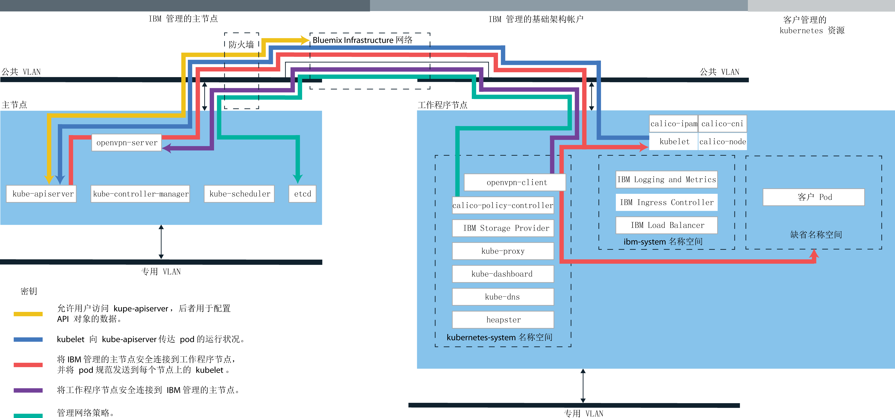

---

copyright:
  years: 2014, 2019
lastupdated: "2019-06-07"

keywords: kubernetes, iks

subcollection: containers

---

{:new_window: target="blank"}
{:shortdesc: .shortdesc}
{:screen: .screen}
{:pre: .pre}
{:table: .aria-labeledby="caption"}
{:codeblock: .codeblock}
{:tip: .tip}
{:note: .note}
{:important: .important}
{:deprecated: .deprecated}
{:download: .download}
{:preview: .preview}


# 不推荐：专用云
{: #dedicated}

不推荐在 {{site.data.keyword.Bluemix_dedicated_notm}} 中使用 {{site.data.keyword.containerlong}}。因为您无法在 {{site.data.keyword.Bluemix_dedicated_notm}} 环境中创建集群。要在 {{site.data.keyword.Bluemix_notm}} Public 中创建集群，请参阅 [{{site.data.keyword.containerlong_notm}} 入门](/docs/containers?topic=containers-getting-started)。
{: deprecated}

如果您具有 {{site.data.keyword.Bluemix_dedicated_notm}} 帐户，那么可以在专用云环境 (`https://<my-dedicated-cloud-instance>.bluemix.net`) 中部署 Kubernetes 集群，并与也在其中运行的预先选择的 {{site.data.keyword.Bluemix_notm}} 服务进行连接。
{:shortdesc}

如果您没有 {{site.data.keyword.Bluemix_dedicated_notm}} 帐户，那么可以在公共 {{site.data.keyword.Bluemix_notm}} 帐户中[开始使用 {{site.data.keyword.containerlong_notm}}](/docs/containers?topic=containers-getting-started)。

## 关于 Dedicated 云环境
{: #dedicated_environment}

使用 {{site.data.keyword.Bluemix_dedicated_notm}} 帐户，可用物理资源仅供您的集群专用，而不会与其他 {{site.data.keyword.IBM_notm}} 客户的集群共享。如果您希望对集群进行隔离，并且需要对您使用的其他 {{site.data.keyword.Bluemix_notm}} 服务进行隔离，可选择设置 {{site.data.keyword.Bluemix_dedicated_notm}} 环境。如果您没有 Dedicated 帐户，那么可以[在 {{site.data.keyword.Bluemix_notm}} Public 中创建具有专用硬件的集群](/docs/containers?topic=containers-clusters#clusters_ui)。
{: shortdesc}

使用 {{site.data.keyword.Bluemix_dedicated_notm}}，您可以在 Dedicated 控制台中或通过使用 {{site.data.keyword.containerlong_notm}} CLI 在目录中创建集群。要使用 Dedicated 控制台，您可利用自己的 IBM 标识同时登录到 Dedicated 和 Public 帐户。可以使用此双登录通过 Dedicated 控制台来访问公共集群。要使用 CLI，请使用 Dedicated 端点 (`api.<my-dedicated-cloud-instance>.bluemix.net.`) 进行登录. 然后将与 Dedicated 环境相关联的公共区域的 {{site.data.keyword.containerlong_notm}} API 端点设定为目标。

{{site.data.keyword.Bluemix_notm}} Public 和 Dedicated 之间的最显著区别如下所示。

*   在 {{site.data.keyword.Bluemix_dedicated_notm}} 中，{{site.data.keyword.IBM_notm}} 拥有并管理已部署工作程序节点、VLAN 和子网的 IBM Cloud Infrastructure (SoftLayer) 帐户。在 {{site.data.keyword.Bluemix_notm}} Public 中，您拥有 IBM Cloud Infrastructure (SoftLayer) 帐户。
*   在 {{site.data.keyword.Bluemix_dedicated_notm}} 中，将在启用 Dedicated 环境时确定 {{site.data.keyword.IBM_notm}} 管理的 IBM Cloud Infrastructure (SoftLayer) 帐户中 VLAN 和子网的规范。在 {{site.data.keyword.Bluemix_notm}} Public 中，将在创建集群时确定 VLAN 和子网的规范。

### 云环境之间集群管理的差异
{: #dedicated_env_differences}

<table>
<caption>集群管理的差异</caption>
<col width="20%">
<col width="40%">
<col width="40%">
 <thead>
 <th>区域</th>
 <th>{{site.data.keyword.Bluemix_notm}} Public</th>
 <th>{{site.data.keyword.Bluemix_dedicated_notm}}</th>
 </thead>
 <tbody>
 <tr>
 <td>集群创建</td>
 <td>创建免费集群或标准集群。</td>
 <td>创建标准集群。</td>
 </tr>
 <tr>
 <td>集群硬件和所有权</td>
 <td>在标准集群中，硬件可由其他 {{site.data.keyword.IBM_notm}} 客户共享或仅供您专用。公用和专用 VLAN 由您在 IBM Cloud Infrastructure (SoftLayer) 帐户中所拥有和管理。</td>
 <td>在 {{site.data.keyword.Bluemix_dedicated_notm}} 上的集群中，硬件始终是专用的。可用于集群创建的公用和专用 VLAN 是在设置 {{site.data.keyword.Bluemix_dedicated_notm}} 环境时预定义的，并且由 IBM 代表您拥有并进行管理。此外，还为 {{site.data.keyword.Bluemix_notm}} 环境预定义了集群创建期间可用的专区。</td>
 </tr>
 <tr>
 <td>负载均衡器和 Ingress 联网</td>
 <td>在标准集群供应期间，会自动执行以下操作。<ul><li>一个可移植的公共子网和一个可移植的专用子网将绑定到您的集群，并分配给您的 IBM Cloud Infrastructure (SoftLayer) 帐户。通过 IBM Cloud Infrastructure (SoftLayer) 帐户可以请求更多子网。</li></li><li>一个可移植公共 IP 地址用于高可用性 Ingress 应用程序负载均衡器 (ALB)，并分配了格式为 <code>&lt;cluster_name&gt;. containers.appdomain.cloud</code> 的唯一公共路径。您可以使用此路径向公众公开多个应用程序。一个可移植专用 IP 地址用于专用 ALB。</li><li>向集群分配了四个可移植公共 IP 地址和四个可移植专用 IP 地址，这些地址可用于 LoadBalancer 服务。</ul></td>
 <td>创建 Dedicated 帐户时，您会对如何公开和访问集群服务作出连接决策。要使用自己的企业 IP 范围（用户管理的 IP），您必须在[设置 {{site.data.keyword.Bluemix_dedicated_notm}} 环境](/docs/dedicated?topic=dedicated-dedicated#setupdedicated)时提供这些 IP 范围。<ul><li>缺省情况下，不会将任何可移植公共子网绑定到您在 Dedicated 帐户中创建的集群。相反，您可以灵活地选择最适合于您企业的连接模型。</li><li>创建集群后，选择要绑定的子网类型，并与集群配合使用以获取负载均衡器或 Ingress 连接。<ul><li>对于公共或专用可移植子网，可以[向集群添加子网](/docs/containers?topic=containers-subnets#subnets)</li><li>对于在 Dedicated 上线时提供给 IBM 的用户管理的 IP 地址，您可以[向集群添加用户管理的子网](#dedicated_byoip_subnets)。</li></ul></li><li>将子网绑定到集群后，将创建 Ingress ALB。仅当使用可移植公共子网时，才会创建公共 Ingress 路径。</li></ul></td>
 </tr>
 <tr>
 <td>NodePort 联网</td>
 <td>在您的工作程序节点上公开一个公共端口，并使用该工作程序节点的公共 IP 地址来公共访问集群中的服务。</td>
 <td>防火墙将阻止工作程序节点的所有公共 IP 地址。但是，对于添加到集群的 {{site.data.keyword.Bluemix_notm}} 服务，可以通过公共 IP 地址或专用 IP 地址访问 NodePort。</td>
 </tr>
 <tr>
 <td>持久性存储器</td>
 <td>使用卷的[动态供应](/docs/containers?topic=containers-kube_concepts#dynamic_provisioning)或[静态供应](/docs/containers?topic=containers-kube_concepts#static_provisioning)。</td>
 <td>使用卷的[动态供应](/docs/containers?topic=containers-kube_concepts#dynamic_provisioning)。[打开一个支持案例](/docs/get-support?topic=get-support-getting-customer-support)以请求对卷执行备份，请求从卷复原以及执行其他存储功能。</li></ul></td>
 </tr>
 <tr>
 <td>{{site.data.keyword.registryshort_notm}} 中的映像注册表 URL</td>
 <td><ul><li>美国南部和美国东部：<code>registry.ng bluemix.net</code></li><li>英国南部：<code>registry.eu-gb.bluemix.net</code></li><li>欧洲中部（法兰克福）：<code>registry.eu-de.bluemix.net</code></li><li>澳大利亚（悉尼）：<code>registry.au-syd.bluemix.net</code></li></ul></td>
 <td><ul><li>对于新名称空间，请使用为 {{site.data.keyword.Bluemix_notm}} Public 定义的基于相同区域的注册表。</li><li>对于在 {{site.data.keyword.Bluemix_dedicated_notm}} 中为单个和可缩放容器设置的名称空间，请使用 <code>registry.&lt;dedicated_domain&gt;</code></li></ul></td>
 </tr>
 <tr>
 <td>访问注册表</td>
 <td>请参阅[将专用和公共映像注册表用于 {{site.data.keyword.containerlong_notm}}](/docs/containers?topic=containers-images) 中的选项。</td>
 <td><ul><li>有关新的名称空间，请参阅[将专用和公共映像注册表用于 {{site.data.keyword.containerlong_notm}}](/docs/containers?topic=containers-images) 中的选项。</li><li>对于为单个和可缩放组设置的名称空间，请[使用令牌并创建 Kubetnetes 私钥](#cs_dedicated_tokens)以进行认证。</li></ul></td>
 </tr>
 <tr>
 <td>多专区集群</td>
 <td>通过向工作程序池添加更多专区来创建[多区域集群](/docs/containers?topic=containers-ha_clusters#multizone)。</td>
 <td>创建[单专区集群](/docs/containers?topic=containers-ha_clusters#single_zone)。设置 {{site.data.keyword.Bluemix_dedicated_notm}} 环境时，已预定义了可用专区。缺省情况下，单专区集群会设置为使用名为 `default` 的工作程序池。工作程序池将使用集群创建期间所定义的相同配置（如机器类型）的工作程序节点分组在一起。可以通过[调整现有工作程序池大小](/docs/containers?topic=containers-add_workers#resize_pool)或[添加新的工作程序池](/docs/containers?topic=containers-add_workers#add_pool)，向集群添加更多工作程序节点。添加工作程序池时，必须向工作程序池添加可用专区，以便工作程序可以部署到该专区中。但是，不能将其他专区添加到工作程序池。</td>
 </tr>
</tbody></table>
{: caption="{{site.data.keyword.Bluemix_notm}} Public 和 {{site.data.keyword.Bluemix_dedicated_notm}} 之间的功能差异" caption-side="top"}

<br />


### 服务体系结构
{: #dedicated_ov_architecture}

每个工作程序节点均设置有独立的计算资源、联网和卷服务。
{:shortdesc}

内置安全性功能提供了隔离、资源管理功能和工作程序节点安全合规性。工作程序节点使用安全 TLS 证书和 OpenVPN 连接与主节点进行通信。


*{{site.data.keyword.Bluemix_dedicated_notm}} 中的 Kubernetes 体系结构和联网情况*



<br />


## 在 Dedicated 上设置 {{site.data.keyword.containerlong_notm}}
{: #dedicated_setup}

每个 {{site.data.keyword.Bluemix_dedicated_notm}} 环境在 {{site.data.keyword.Bluemix_notm}} 中都有一个公共的客户机拥有的企业帐户。为了让 Dedicated 环境中的用户能够创建集群，管理员必须将这些用户添加到公共公司帐户中。
{:shortdesc}

开始之前：
  * [设置 {{site.data.keyword.Bluemix_dedicated_notm}} 环境](/docs/dedicated?topic=dedicated-dedicated#setupdedicated)。
  * 如果本地系统或企业网络使用代理或防火墙来控制公共因特网端点，那么必须[在防火墙中打开必需的端口和 IP 地址](/docs/containers?topic=containers-firewall#firewall)。
  * [下载 Cloud Foundry CLI ](https://github.com/cloudfoundry/cli/releases)。

要允许 {{site.data.keyword.Bluemix_dedicated_notm}} 用户访问集群，请执行以下操作：

1.  公共 {{site.data.keyword.Bluemix_notm}} 帐户的所有者必须生成 API 密钥。
    1.  登录到 {{site.data.keyword.Bluemix_dedicated_notm}} 实例的端点。输入 Public 帐户所有者的 {{site.data.keyword.Bluemix_notm}} 凭证，并在提示时选择您的帐户。

        ```
        ibmcloud login -a api.<my-dedicated-cloud-instance>.<region>.bluemix.net
        ```
        {: pre}

        如果您具有联合标识，请使用 `ibmcloud login -a api.<my-dedicated-cloud-instance>.<region>.bluemix.net --sso` 登录到 {{site.data.keyword.Bluemix_notm}} CLI。输入您的用户名，并使用 CLI 输出中提供的 URL 来检索一次性密码。如果不使用 `--sso` 时登录失败，而使用 `--sso` 选项时登录成功，说明您拥有的是联合标识。
        {: tip}

    2.  生成用于邀请用户加入公共帐户的 API 密钥。记下该 API 密钥值，Dedicated 帐户管理员在下一步中必须使用该值。

        ```
        ibmcloud iam api-key-create <key_name> -d "Key to invite users to <dedicated_account_name>"
        ```
        {: pre}

    3.  记下您要邀请用户加入到的公共帐户组织的 GUID，Dedicated 帐户管理员在下一步中必须使用该 GUID。

        ```
        ibmcloud account orgs
        ```
        {: pre}

2.  {{site.data.keyword.Bluemix_dedicated_notm}} 帐户的所有者可以邀请单个或多个用户加入您的 Public 帐户。
    1.  登录到 {{site.data.keyword.Bluemix_dedicated_notm}} 实例的端点。输入 Dedicated 帐户所有者的 {{site.data.keyword.Bluemix_notm}} 凭证，并在提示时选择您的帐户。

        ```
        ibmcloud login -a api.<my-dedicated-cloud-instance>.<region>.bluemix.net
        ```
        {: pre}

        如果您具有联合标识，请使用 `ibmcloud login -a api.<my-dedicated-cloud-instance>.<region>.bluemix.net --sso` 登录到 {{site.data.keyword.Bluemix_notm}} CLI。输入您的用户名，并使用 CLI 输出中提供的 URL 来检索一次性密码。如果不使用 `--sso` 时登录失败，而使用 `--sso` 选项时登录成功，说明您拥有的是联合标识。
        {: tip}

    2.  邀请用户加入公共帐户。
        * 要邀请单个用户，请执行以下操作：

            ```
            ibmcloud cf bluemix-admin invite-users-to-public -userid=<user_email> -apikey=<public_API_key> -public_org_id=<public_org_ID>
            ```
            {: pre}

            将 <em>&lt;user_IBMid&gt;</em> 替换为您要邀请的用户的电子邮件，将 <em>&lt;public_API_key&gt;</em> 替换为上一步中生成的 API 密钥，将 <em>&lt;public_org_ID&gt;</em> 替换为公共帐户组织的 GUID。 

        * 要邀请当前位于 Dedicated 帐户组织中的所有用户，请执行以下操作：

            ```
            ibmcloud cf bluemix-admin invite-users-to-public -organization=<dedicated_org_ID> -apikey=<public_API_key> -public_org_id=<public_org_ID>
            ```

            将 <em>&lt;dedicated_org_ID&gt;</em> 替换为 Dedicated 帐户组织标识，将 <em>&lt;public_API_key&gt;</em> 替换为上一步中生成的 API 密钥，将 <em>&lt;public_org_ID&gt;</em> 替换为公共帐户组织 GUID。 

    3.  如果某个用户存在 IBM 标识，那么该用户将自动添加到公共帐户中的指定组织。如果用户不存在 IBM 标识，那么会将邀请发送到该用户的电子邮件地址。用户接受邀请后，系统就会为该用户创建一个 IBM 标识，并且该用户将添加到公共帐户中的指定组织。

    4.  验证用户是否已添加到帐户。

        ```
        ibmcloud cf bluemix-admin invite-users-status -apikey=<public_API_key>
        ```
        {: pre}

        具有现有 IBM 标识的受邀用户的状态为 `ACTIVE`。对于没有现有 IBM 标识的受邀用户，接受邀请前其状态为 `PENDING`，接受邀请后状态为 `ACTIVE`。

3.  如果任何用户需要集群创建特权，那么您必须授予该用户“管理员”角色。

    1.  在 Public 控制台的菜单栏中，单击**管理 > 安全性 > 身份和访问权**，然后单击**用户**。

    2.  在要为其分配访问权的用户所在的行中，选择**操作**菜单，然后单击**分配访问权**。

    3.  选择**分配对资源的访问权**。

    4.  从**服务**列表中，选择 **{{site.data.keyword.containerlong}}**。

    5.  从**区域**列表中，选择**所有当前区域**或选择特定区域（如果出现提示）。

    6. 在**选择角色**下，选择“管理员”。

    7. 单击**分配**。

4.  现在，用户可以登录到 Dedicated 帐户端点以开始创建集群。

    1.  登录到 {{site.data.keyword.Bluemix_dedicated_notm}} 实例的端点。出现提示时，请输入您的 IBM 标识。

        ```
        ibmcloud login -a api.<my-dedicated-cloud-instance>.<region>.bluemix.net
        ```
        {: pre}

        如果您具有联合标识，请使用 `ibmcloud login -a api.<my-dedicated-cloud-instance>.<region>.bluemix.net --sso` 登录到 {{site.data.keyword.Bluemix_notm}} CLI。输入您的用户名，并使用 CLI 输出中提供的 URL 来检索一次性密码。如果不使用 `--sso` 时登录失败，而使用 `--sso` 选项时登录成功，说明您拥有的是联合标识。
        {: tip}

    2.  如果您是首次登录，请在提示时提供您的 Dedicated 用户标识和密码。这将对您的 Dedicated 帐户进行认证，并且会将 Dedicated 和公共帐户链接在一起。首次登录后每次再登录时，只要使用自己的 IBM 标识即可登录。有关更多信息，请参阅[将 Dedicated 标识连接到 Public IBM 标识](/docs/iam?topic=iam-connect_dedicated_id#connect_dedicated_id)。

        您必须同时登录到 Dedicated 帐户和 Public 帐户才能创建集群。如果您只想登录到 Dedicated 帐户，请在登录到 Dedicated 端点时使用 `--no-iam` 标志。
        {: note}

    3.  要在专用环境中创建或访问集群，必须设置与该环境关联的区域。**注**：不能在除 `default` 以外的资源组中创建集群。

        ```
        ibmcloud ks region-set
        ```
        {: pre}

5.  如果要取消帐户链接，那么可以将您的 IBM 标识与 Dedicated 用户标识断开连接。有关更多信息，请参阅[断开 Dedicated 标识与 Public IBM 标识的连接](/docs/iam?topic=iam-connect_dedicated_id#disconnect_id)。

    ```
    ibmcloud iam dedicated-id-disconnect
    ```
    {: pre}

<br />


## 创建集群
{: #dedicated_administering}

设计 {{site.data.keyword.Bluemix_dedicated_notm}} 集群设置以实现最大可用性和容量。
{:shortdesc}

### 使用 {{site.data.keyword.Bluemix_notm}} 控制台创建集群
{: #dedicated_creating_ui}

1. 打开 Dedicated 控制台：`https://<my-dedicated-cloud-instance>.bluemix.net`。

2. 选中**同时登录到 {{site.data.keyword.Bluemix_notm}} Public** 复选框，然后单击**登录**。

3. 按照提示使用 IBM 标识登录。如果您是首次登录到 Dedicated 帐户，请按照提示登录到 {{site.data.keyword.Bluemix_dedicated_notm}}。

4. 在目录中，选择**容器**，然后单击 **Kubernetes 集群**。

5. 配置集群详细信息。

    1. 输入**集群名称**。名称必须以字母开头，可以包含字母、数字和连字符 (-)，并且不能超过 35 个字符。请使用在各区域中唯一的名称。集群名称和部署集群的区域构成了 Ingress 子域的标准域名。为了确保 Ingress 子域在区域内是唯一的，可能会截断 Ingress 域名中的集群名称并附加随机值。

    2. 选择要在其中部署集群的**专区**。设置 {{site.data.keyword.Bluemix_dedicated_notm}} 环境时，已预定义了可用专区。

    3. 为集群主节点选择 Kubernetes API 服务器版本。

    4. 选择硬件隔离的类型。“虚拟”按小时计费，“裸机”按月计费。

        - **虚拟 - 专用**：工作程序节点在帐户专用的基础架构上托管。物理资源完全隔离。

        - **裸机**：裸机服务器按月计费，订购后由 IBM Cloud Infrastructure (SoftLayer) 手动供应，可能需要一个工作日以上的时间才能完成。裸机最适用于需要更多资源和主机控制的高性能应用程序。对于所选机器类型，还可以选择启用[可信计算](/docs/containers?topic=containers-security#trusted_compute)来验证工作程序节点是否被篡改。如果在创建集群期间未启用信任，但希望日后启用，那么可以使用 `ibmcloud ks feature-enable` [命令](/docs/containers?topic=containers-cli-plugin-kubernetes-service-cli#cs_cluster_feature_enable)。启用信任后，日后无法将其禁用。

        确保要供应裸机机器。因为裸机机器是按月计费的，所以如果在错误下单后立即将其取消，也仍然会按整月向您收费。
        {:tip}

    5. 选择**机器类型**。机器类型用于定义在每个工作程序节点中设置并可供容器使用的虚拟 CPU 量、内存量和磁盘空间量。可用的裸机和虚拟机类型随部署集群的专区而变化。有关更多信息，请参阅 `ibmcloud ks machine-type` [命令](/docs/containers?topic=containers-cli-plugin-kubernetes-service-cli#cs_machine_types)的文档。创建集群后，可以通过将工作程序节点添加到集群来添加不同的机器类型。

    6. 选择需要的**工作程序节点数**。选择 `3` 以确保集群的高可用性。

    7. 选择**公用 VLAN**（可选）和**专用 VLAN**（必需）。可用的公用和专用 VLAN 会在设置 {{site.data.keyword.Bluemix_dedicated_notm}} 环境时进行预定义。两个 VLAN 在工作程序节点之间进行通信，但公用 VLAN 还与 IBM 管理的 Kubernetes 主节点进行通信。可以对多个集群使用相同的 VLAN。
如果工作程序节点设置为仅使用专用 VLAN，那么必须通过[启用专用服务端点](/docs/containers?topic=containers-cs_network_cluster#set-up-private-se)或[配置网关设备](/docs/containers?topic=containers-plan_clusters#workeruser-master)，允许工作程序节点和集群主节点进行通信。
        {: note}

    8. 缺省情况下，已选择**加密本地磁盘**。如果选择清除该复选框，那么不会加密主机的容器运行时数据。[了解有关加密的更多信息](/docs/containers?topic=containers-security#encrypted_disk)。

6. 单击**创建集群**。您可以在**工作程序节点**选项卡中查看工作程序节点部署的进度。完成部署后，您可以在**概述**选项卡中看到集群已就绪。
    系统会为每个工作程序节点分配唯一的工作程序节点标识和域名，在创建集群后，不得手动更改该标识和域名。更改标识或域名会阻止 Kubernetes 主节点管理集群。
    {: important}

### 使用 CLI 创建集群
{: #dedicated_creating_cli}

1.  安装 {{site.data.keyword.Bluemix_notm}} CLI 和 [{{site.data.keyword.containerlong_notm}} 插件](/docs/containers?topic=containers-cs_cli_install#cs_cli_install)。
2.  登录到 {{site.data.keyword.Bluemix_dedicated_notm}} 实例的端点。在提示时输入 {{site.data.keyword.Bluemix_notm}} 凭证并选择您的帐户。

    ```
    ibmcloud login -a api.<my-dedicated-cloud-instance>.<region>.bluemix.net
    ```
    {: pre}

    如果您具有联合标识，请使用 `ibmcloud login -a api.<my-dedicated-cloud-instance>.<region>.bluemix.net --sso` 登录到 {{site.data.keyword.Bluemix_notm}} CLI。输入您的用户名，并使用 CLI 输出中提供的 URL 来检索一次性密码。如果不使用 `--sso` 时登录失败，而使用 `--sso` 选项时登录成功，说明您拥有的是联合标识。
    {: tip}

3.  将区域端点设定为目标。支持以下区域端点：
  * 达拉斯（美国南部，us-south）：`https://us-south.containers.cloud.ibm.com`
  * 法兰克福（欧洲中部，eu-de）：`https://eu-de.containers.cloud.ibm.com`
  * 伦敦（英国南部，eu-gb）：`https://eu-gb.containers.cloud.ibm.com`
  * 悉尼（亚太地区南部，au-syd）：`https://au-syd.containers.cloud.ibm.com`
  * 东京（亚太地区北部，jp-tok）：`https://jp-tok.containers.cloud.ibm.com`
  * 华盛顿（美国东部，us-east）：`https://us-east.containers.cloud.ibm.com`
  ```
  ibmcloud ks init --host <endpoint>
  ```
  {: pre}
  不能使用全局端点 `https://containers.cloud.ibm.com`。必须将区域端点设定为目标，才能创建或使用该区域中的集群。
  {: important}

4.  使用 `cluster-create` 命令创建集群。创建标准集群时，将按小时数对工作程序节点硬件的使用量计费。

    示例：

    ```
    ibmcloud ks cluster-create --zone <zone> --machine-type <machine_type> --name <cluster_name> --workers <number>
    ```
    {: pre}

    <table>
    <caption>了解此命令的组成部分</caption>
    <thead>
    <th colspan=2> 了解此命令的组成部分</th>
    </thead>
    <tbody>
    <tr>
    <td><code>cluster-create</code></td>
    <td>此命令在 {{site.data.keyword.Bluemix_notm}} 组织中创建集群。</td>
    </tr>
    <tr>
    <td><code>--zone <em>&lt;zone&gt;</em></code></td>
    <td>输入 Dedicated 环境配置为使用的 {{site.data.keyword.Bluemix_notm}} 专区标识。</td>
    </tr>
    <tr>
    <td><code>--machine-type <em>&lt;machine_type&gt;</em></code></td>
    <td>输入机器类型。可以将工作程序节点作为虚拟机部署在专用硬件上，也可以作为物理机器部署在裸机上。可用的物理和虚拟机类型随集群的部署专区而变化。有关更多信息，请参阅 `ibmcloud ks machine-type` [命令](/docs/containers?topic=containers-cli-plugin-kubernetes-service-cli#cs_machine_types)的文档。</td>
    </tr>
    <tr>
    <td><code>--public-vlan <em>&lt;machine_type&gt;</em></code></td>
    <td>输入 Dedicated 环境配置为使用的公用 VLAN 的标识。如果要将工作程序节点仅连接到专用 VLAN，请不要指定此选项。<p class="note">如果工作程序节点设置为仅使用专用 VLAN，那么必须通过[启用专用服务端点](/docs/containers?topic=containers-cs_network_cluster#set-up-private-se)或[配置网关设备](/docs/containers?topic=containers-plan_clusters#workeruser-master)，允许工作程序节点和集群主节点进行通信。</p></td>
    </tr>
    <tr>
    <td><code>--private-vlan <em>&lt;machine_type&gt;</em></code></td>
    <td>输入 Dedicated 环境配置为使用的专用 VLAN 的标识。</td>
    </tr>  
    <tr>
    <td><code>--name <em>&lt;name&gt;</em></code></td>
    <td>输入集群的名称。名称必须以字母开头，可以包含字母、数字和连字符 (-)，并且不能超过 35 个字符。请使用在各区域中唯一的名称。集群名称和部署集群的区域构成了 Ingress 子域的标准域名。为了确保 Ingress 子域在区域内是唯一的，可能会截断 Ingress 域名中的集群名称并附加随机值。
</td>
    </tr>
    <tr>
    <td><code>--workers <em>&lt;number&gt;</em></code></td>
    <td>输入要包含在集群中的工作程序节点数。如果未指定 <code>--workers</code> 选项，那么会创建一个工作程序节点。</td>
    </tr>
    <tr>
    <td><code>--kube-version <em>&lt;major.minor.patch&gt;</em></code></td>
    <td>集群主节点的 Kubernetes 版本。此值是可选的。未指定版本时，会使用受支持 Kubernetes 版本的缺省值来创建集群。要查看可用版本，请运行 <code>ibmcloud ks versions</code>。</td>
    </tr>
    <tr>
    <td><code>--disable-disk-encrypt</code></td>
    <td>缺省情况下，工作程序节点具有 AES 256 位[磁盘加密](/docs/containers?topic=containers-security#encrypted_disk)功能。如果要禁用加密，请包括此选项。</td>
    </tr>
    <tr>
    <td><code>--trusted</code></td>
    <td>启用[可信计算](/docs/containers?topic=containers-security#trusted_compute)以验证裸机工作程序节点是否被篡改。如果在创建集群期间未启用信任，但希望日后启用，那么可以使用 `ibmcloud ks feature-enable` [命令](/docs/containers?topic=containers-cli-plugin-kubernetes-service-cli#cs_cluster_feature_enable)。启用信任后，日后无法将其禁用。</td>
    </tr>
    </tbody></table>

5.  验证是否请求了创建集群。

    ```
    ibmcloud ks clusters
    ```
    {: pre}

    * 对于虚拟机，可能需要几分钟时间，才能订购好工作程序节点机器并且在帐户中设置并供应集群。裸机物理机器通过与 IBM Cloud Infrastructure (SoftLayer) 进行手动交互来供应，可能需要一个工作日以上的时间才能完成。
    * 如果看到以下错误消息，请[打开一个支持案例](/docs/get-support?topic=get-support-getting-customer-support)。
        ```
        {{site.data.keyword.Bluemix_notm}} Infrastructure 异常：无法下订单。路由器“router_name”后的资源不足，无法实现以下访客的请求：“worker_id”。 
        ```

    当完成集群供应时，集群的阶段状态会更改为 **deployed**。

    ```
    Name         ID                                   State      Created          Workers    Zone      Version     Resource Group Name
    my_cluster   paf97e8843e29941b49c598f516de72101   deployed   20170201162433   1          mil01     1.13.6      Default
    ```
    {: screen}

6.  检查工作程序节点的状态。

    ```
   ibmcloud ks workers --cluster <cluster_name_or_ID>
   ```
    {: pre}

    当工作程序节点已准备就绪时，状态会更改为 **normal**，而阶段状态为 **Ready**。节点阶段状态为 **Ready** 时，可以访问集群。

    系统会为每个工作程序节点分配唯一的工作程序节点标识和域名，在创建集群后，不得手动更改该标识和域名。更改标识或域名会阻止 Kubernetes 主节点管理集群。
    {: important}

    ```
    ID                                                 Public IP       Private IP       Machine Type   State    Status   Zone   Version
    kube-mil01-paf97e8843e29941b49c598f516de72101-w1   169.xx.xxx.xxx  10.xxx.xx.xxx    free           normal   Ready    mil01      1.13.6
    ```
    {: screen}

7.  将所创建的集群设置为此会话的上下文。每次使用集群时都完成这些配置步骤。

    1.  获取命令以设置环境变量并下载 Kubernetes 配置文件。

        ```
        ibmcloud ks cluster-config --cluster <cluster_name_or_ID>
        ```
        {: pre}

        配置文件下载完成后，会显示一个命令，您可以使用该命令将本地 Kubernetes 配置文件的路径设置为环境变量。

        OS X 的示例：

        ```
        export KUBECONFIG=/Users/<user_name>/.bluemix/plugins/container-service/clusters/<cluster_name>/kube-config-prod-dal10-<cluster_name>.yml
        ```
        {: screen}

    2.  复制并粘贴输出中的命令，以设置 `KUBECONFIG` 环境变量。
    3.  验证是否已正确设置 `KUBECONFIG` 环境变量。

        OS X 的示例：

        ```
        echo $KUBECONFIG
        ```
        {: pre}

        输出：

        ```
        /Users/<user_name>/.bluemix/plugins/container-service/clusters/<cluster_name>/kube-config-prod-dal10-<cluster_name>.yml

        

        ```
        {: screen}

8.  使用缺省端口 8001 访问 Kubernetes 仪表板。
    1.  使用缺省端口号设置代理。

        ```
        kubectl proxy
        ```
        {: pre}

        ```
        Starting to serve on 127.0.0.1:8001
        ```
        {: screen}

    2.  在 Web 浏览器中打开以下 URL 以查看 Kubernetes 仪表板。

        ```
        http://localhost:8001/ui
        ```
        {: codeblock}

### 添加工作程序节点
{: #add_workers_dedicated}

使用 {{site.data.keyword.Bluemix_dedicated_notm}} 时，您只能创建[单专区集群](/docs/containers?topic=containers-ha_clusters#single_zone)。缺省情况下，单专区集群会设置为使用名为 `default` 的工作程序池。工作程序池将使用集群创建期间所定义的相同配置（如机器类型）的工作程序节点分组在一起。可以通过[调整现有工作程序池大小](/docs/containers?topic=containers-add_workers#resize_pool)或[添加新的工作程序池](/docs/containers?topic=containers-add_workers#add_pool)，向集群添加更多工作程序节点。添加工作程序池时，必须向工作程序池添加可用专区，以便工作程序可以部署到该专区中。但是，不能将其他专区添加到工作程序池。
{: shortdesc}

### 使用专用和公共映像注册表
{: #dedicated_images}

使用容器映像时，请了解有关[确保个人信息安全](/docs/containers?topic=containers-security#pi)的更多信息。

有关新的名称空间，请参阅[将专用和公共映像注册表用于 {{site.data.keyword.containerlong_notm}}](/docs/containers?topic=containers-images) 中的选项。对于为单个和可缩放组设置的名称空间，请[使用令牌并创建 Kubetnetes 私钥](#cs_dedicated_tokens)以进行认证。

### 向集群添加子网
{: #dedicated_cluster_subnet}

通过向集群添加子网，更改可用的可移植公共 IP 地址池。有关更多信息，请参阅[向集群添加子网](/docs/containers?topic=containers-subnets#subnets)。请查看向 Dedicated 集群添加子网的下列差异。
{: shortdesc}

#### 将更多由用户管理的子网和 IP 地址添加到 Kubernetes 集群
{: #dedicated_byoip_subnets}

从要用于访问 {{site.data.keyword.containerlong_notm}} 的内部部署网络提供更多您自己的子网。您可以将这些子网中的专用 IP 地址添加到 Kubernetes 集群中的 Ingress 和 LoadBalancer 服务。根据您要使用的子网格式，以两种方式之一来配置用户管理的子网。
{: shortdesc}

需求：
- 用户管理的子网只能添加到专用 VLAN。
- 子网前缀长度限制为 /24 到 /30。例如，`203.0.113.0/24` 指定了 253 个可用的专用 IP 地址，而 `203.0.113.0/30` 指定了 1 个可用的专用 IP 地址。
- 子网中的第一个 IP 地址必须用作子网的网关。

开始之前：配置从企业网络到使用用户管理的子网的 {{site.data.keyword.Bluemix_dedicated_notm}} 网络的网络流量路由。

1. 要使用您自己的子网，请[打开一个支持案例](/docs/get-support?topic=get-support-getting-customer-support)并提供要使用的子网 CIDR 列表。**注**：根据子网 CIDR 的格式，针对内部部署和内部帐户连接管理的 ALB 和负载均衡器的方式有所不同。请参阅最后一步以了解配置差异。

2. 在 {{site.data.keyword.IBM_notm}} 供应用户管理的子网后，使子网可用于 Kubernetes 集群。

    ```
    ibmcloud ks cluster-user-subnet-add --cluster <cluster_name> --subnet-cidr <subnet_CIDR> --private-vlan <private_VLAN>
    ```
    {: pre}
    将 <em>&lt;cluster_name&gt;</em> 替换为集群的名称或标识，将 <em>&lt;subnet_CIDR&gt;</em> 替换为支持案例中提供的一个子网 CIDR，并将 <em>&lt;private_VLAN&gt;</em> 替换为可用的专用 VLAN 标识。可以通过运行 `ibmcloud ks vlans` 来查找可用专用 VLAN 的标识。

3. 验证是否已将子网添加到集群。用户提供的子网的 **User-managed** 字段为 _`true`_。

    ```
    ibmcloud ks cluster-get --showResources <cluster_name>
    ```
    {: pre}

    ```
    Subnet VLANs
    VLAN ID   Subnet CIDR         Public       User-managed
    1555503   169.xx.xxx.xxx/24   true         false
    1555505   10.xxx.xx.xxx/24    false        false
    1555505   10.xxx.xx.xxx/24    false        true
    ```
    {: screen}

4. **重要信息**：如果有多个 VLAN 用于一个集群、在同一 VLAN 上有多个子网或者有一个多专区集群，那么必须针对 IBM Cloud Infrastructure (SoftLayer) 帐户启用[虚拟路由器功能 (VRF)](/docs/infrastructure/direct-link?topic=direct-link-overview-of-virtual-routing-and-forwarding-vrf-on-ibm-cloud#overview-of-virtual-routing-and-forwarding-vrf-on-ibm-cloud)，从而使工作程序节点可以在专用网络上相互通信。要启用 VRF，请[联系 IBM Cloud Infrastructure (SoftLayer) 客户代表](/docs/infrastructure/direct-link?topic=direct-link-overview-of-virtual-routing-and-forwarding-vrf-on-ibm-cloud#how-you-can-initiate-the-conversion)。如果无法或不想启用 VRF，请启用 [VLAN 生成](/docs/infrastructure/vlans?topic=vlans-vlan-spanning#vlan-spanning)。要执行此操作，您需要有**网络 > 管理网络 VLAN 生成**[基础架构许可权](/docs/containers?topic=containers-users#infra_access)，也可以请求帐户所有者来启用 VLAN 生成。要检查是否已启用 VLAN 生成，请使用 `ibmcloud ks vlan-spanning-get --region <region>` [命令](/docs/containers?topic=containers-cli-plugin-kubernetes-service-cli#cs_vlan_spanning_get)。

5. 要配置内部部署和内部帐户连接，请在以下选项之间进行选择：
  - 如果将 10.x.x.x 专用 IP 地址范围用于子网，请使用该范围内的有效 IP，以配置与 Ingress 和负载均衡器的内部部署和内部帐户连接。有关更多信息，请参阅[使用 NodePort、LoadBalancer 或 Ingress 服务规划联网](/docs/containers?topic=containers-cs_network_planning#external)。
  - 如果未将 10.x.x.x 专用 IP 地址范围用于子网，请使用该范围内的有效 IP，以配置与 Ingress 和负载均衡器的内部部署连接。有关更多信息，请参阅[使用 NodePort、LoadBalancer 或 Ingress 服务规划联网](/docs/containers?topic=containers-cs_network_planning#external)。但是，您必须使用 IBM Cloud Infrastructure (SoftLayer) 可移植专用子网，在您的集群与其他基于 Cloud Foundry 的服务之前配置内部帐户连接。您可以使用 [`ibmcloud ks cluster-subnet-add`](/docs/containers?topic=containers-cli-plugin-kubernetes-service-cli#cs_cluster_subnet_add) 命令来创建可移植专用子网。对于此场景，集群同时具有用于内部部署连接的用户管理子网和用于内部帐户连接的 IBM Cloud Infrastructure (SoftLayer) 可移植专用子网。

### 其他集群配置
{: #dedicated_other}

查看用于其他集群配置的以下选项：
  * [管理集群访问权](/docs/containers?topic=containers-users#access_policies)
  * [更新 Kubernetes 主节点](/docs/containers?topic=containers-update#master)
  * [更新工作程序节点](/docs/containers?topic=containers-update#worker_node)
  * [配置集群日志记录](/docs/containers?topic=containers-health#logging)Dedicated 端点不支持日志启用。您必须登录到公共 {{site.data.keyword.cloud_notm}} 端点并将公共组织和空间设定为目标，才能启用日志转发。
  * [配置集群监视](/docs/containers?topic=containers-health#view_metrics)。`ibm-monitoring` 集群存在于每个 {{site.data.keyword.Bluemix_dedicated_notm}} 帐户中。此集群持续监视 Dedicated 环境中 {{site.data.keyword.containerlong_notm}} 的运行状况，检查环境的稳定性和连通性。请勿从环境中除去此集群。
  * [除去集群](/docs/containers?topic=containers-remove)

<br />


## 在集群中部署应用程序
{: #dedicated_apps}

您可以使用 Kubernetes 技术在 {{site.data.keyword.Bluemix_dedicated_notm}} 集群中部署应用程序，并确保应用程序始终正常运行。
{:shortdesc}

要在集群中部署应用程序，可以遵循[在 {{site.data.keyword.Bluemix_notm}} Public 集群中部署应用程序](/docs/containers?topic=containers-app#app)的指示信息。查看 {{site.data.keyword.Bluemix_dedicated_notm}} 集群的下列差异。

使用 Kubernetes 资源时，请了解有关[确保个人信息安全](/docs/containers?topic=containers-security#pi)的更多信息。

### 允许对应用程序进行公共访问
{: #dedicated_apps_public}

对于 {{site.data.keyword.Bluemix_dedicated_notm}} 环境，防火墙会阻止公共主 IP 地址。要使应用程序公共可用，请使用 [LoadBalancer 服务](#dedicated_apps_public_load_balancer)或 [Ingress](#dedicated_apps_public_ingress)，而不是 NodePort 服务。如果需要访问具有可移植公共 IP 地址的 LoadBalancer 服务或 Ingress，请在服务上线时向 IBM 提供企业防火墙白名单。
{: shortdesc}

#### 使用 LoadBalancer 服务类型来配置对应用程序的访问权
{: #dedicated_apps_public_load_balancer}

如果要对负载均衡器使用公共 IP 地址，请确保向 IBM 提供企业防火墙白名单，或[打开一个支持案例](/docs/get-support?topic=get-support-getting-customer-support)以配置防火墙白名单。然后遵循[使用网络负载均衡器 (NLB) 来实现基本负载均衡和 DSR 负载均衡](/docs/containers?topic=containers-loadbalancer)中的步骤进行操作。
{: shortdesc}

#### 使用 Ingress 配置对应用程序的公共访问权
{: #dedicated_apps_public_ingress}

如果要对 Ingress ALB 使用公共 IP 地址，请确保向 IBM 提供了企业防火墙白名单，或[打开一个支持案例](/docs/get-support?topic=get-support-getting-customer-support)以配置防火墙白名单。然后遵循[向公众公开应用程序](/docs/containers?topic=containers-ingress#ingress_expose_public)中的步骤进行操作。
{: shortdesc}

### 创建持久性存储器
{: #dedicated_apps_volume_claim}

要查看用于创建持久性存储器的选项，请参阅[实现高可用性的持久性数据存储器选项](/docs/containers?topic=containers-storage_planning#persistent_storage_overview)。要请求对卷执行备份、从卷复原、删除卷或者定期生成文件存储器快照，必须[打开一个支持案例](/docs/get-support?topic=get-support-getting-customer-support)。
{: shortdesc}

如果选择供应[文件存储](/docs/containers?topic=containers-file_storage#file_predefined_storageclass)，请选择非保留存储类。选择非保留存储类可帮助防止 IBM Cloud Infrastructure (SoftLayer) 中出现孤立的持久性存储器实例（只能通过打开支持案例来除去）。

## 为 {{site.data.keyword.Bluemix_dedicated_notm}} 映像注册表创建 {{site.data.keyword.registryshort_notm}} 令牌
{: #cs_dedicated_tokens}

针对用于 {{site.data.keyword.containerlong}} 集群的单个组和可扩展组的映像注册表，创建不到期的令牌。
{:shortdesc}

1.  为当前会话请求永久注册表标记。此令牌将授予对当前名称空间中的映像的访问权。
    ```
    ibmcloud cr token-add --description "<description>" --non-expiring -q
    ```
    {: pre}

2.  验证 Kubernetes 私钥。

    ```
    kubectl describe secrets
    ```
    {: pre}

    您可以使用此私钥来处理 {{site.data.keyword.containerlong}}。

3.  创建 Kubernetes 私钥以用于存储令牌信息。

    ```
    kubectl --namespace <kubernetes_namespace> create secret docker-registry <secret_name>  --docker-server=<registry_url> --docker-username=token --docker-password=<token_value> --docker-email=<docker_email>
    ```
    {: pre}

    <table>
    <caption>了解此命令的组成部分</caption>
    <thead>
    <th colspan=2> 了解此命令的组成部分</th>
    </thead>
    <tbody>
    <tr>
    <td><code>--namespace &lt;kubernetes_namespace&gt;</code></td>
    <td>必需。要使用私钥并将容器部署到的集群的 Kubernetes 名称空间。运行 <code>kubectl get namespaces</code> 可列出集群中的所有名称空间。</td>
    </tr>
    <tr>
    <td><code>&lt;secret_name&gt;</code></td>
    <td>必需。要用于映像拉取私钥的名称。</td>
    </tr>
    <tr>
    <td><code>--docker-server=&lt;registry_url&gt;</code></td>
    <td>必需。在其中设置名称空间的映像注册表的 URL：<code>registry.&lt;dedicated_domain&gt;</code></li></ul></td>
    </tr>
    <tr>
    <td><code>--docker-username=token</code></td>
    <td>必需。请勿更改此值。</td>
    </tr>
    <tr>
    <td><code>--docker-password=&lt;token_value&gt;</code></td>
    <td>必需。先前检索到的注册表令牌的值。</td>
    </tr>
    <tr>
    <td><code>--docker-email=&lt;docker-email&gt;</code></td>
    <td>必需。如果您有 Docker 电子邮件地址，请输入该地址。如果没有，请输入虚构的电子邮件地址，例如 a@b.c。此电子邮件对于创建 Kubernetes 私钥是必需的，但在创建后不会再使用此电子邮件。</td>
    </tr>
    </tbody></table>

4.  创建引用映像拉取私钥的 pod。

    1.  打开首选文本编辑器，并创建名为 `mypod.yaml` 的 pod 配置脚本。
    2.  定义要用于访问注册表的 pod 和映像拉取私钥。要使用名称空间中的专用映像，请使用以下内容：


        ```
apiVersion: v1
        kind: Pod
        metadata:
          name: <pod_name>
        spec:
          containers:
            - name: <container_name>
              image: registry.<dedicated_domain>/<my_namespace>/<my_image>:<tag>
          imagePullSecrets:
            - name: <secret_name>
        ```
        {: codeblock}

        <table>
        <caption>了解 YAML 文件的组成部分</caption>
        <thead>
        <th colspan=2> 了解 YAML 文件的组成部分</th>
        </thead>
        <tbody>
        <tr>
        <td><code>&lt;pod_name&gt;</code></td>
        <td>要创建的 pod 的名称。</td>
        </tr>
        <tr>
        <td><code>&lt;container_name&gt;</code></td>
        <td>要部署到集群的容器的名称。</td>
        </tr>
        <tr>
        <td><code>&lt;my_namespace&gt;</code></td>
        <td>存储映像的名称空间。要列出可用名称空间，请运行 `ibmcloud cr namespace-list`。</td>
        </tr>
        <td><code>&lt;my_image&gt;</code></td>
        <td>要使用的映像的名称。要列出 {{site.data.keyword.Bluemix_notm}} 帐户中的可用映像，请运行 <code>ibmcloud cr image-list</code>。</td>
        </tr>
        <tr>
        <td><code>&lt;tag&gt;</code></td>
        <td>要使用的映像的版本。如果未指定标记，那么缺省情况下会使用标记为 <strong>latest</strong> 的映像。</td>
        </tr>
        <tr>
        <td><code>&lt;secret_name&gt;</code></td>
        <td>先前创建的映像拉取私钥的名称。</td>
        </tr>
        </tbody></table>

    3.  保存更改。

    4.  在集群中创建部署。

          ```
          kubectl apply -f mypod.yaml -n <namespace>
          ```
          {: pre}
