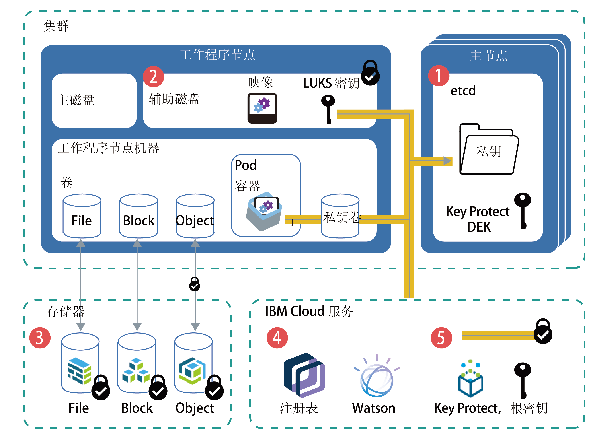

---

copyright:
  years: 2014, 2018
lastupdated: "2018-12-05"

---

{:new_window: target="_blank"}
{:shortdesc: .shortdesc}
{:screen: .screen}
{:pre: .pre}
{:table: .aria-labeledby="caption"}
{:codeblock: .codeblock}
{:tip: .tip}
{:note: .note}
{:important: .important}
{:deprecated: .deprecated}
{:download: .download}


# 保护集群中的敏感信息
{: #encryption}

保护敏感集群信息以确保数据完整性，并防止数据向未经授权的用户公开。
{: shortdesc}

您可以在集群中的不同级别上创建敏感数据，每个级别需要相应的保护。
- **集群级别：**集群配置数据存储在 Kubernetes 主节点的 etcd 组件中。在运行 Kubernetes V1.10 或更高版本的集群中，etcd 中的数据将存储在 Kubernetes 主节点的本地磁盘上，并备份到 {{site.data.keyword.cos_full_notm}}。数据在传输到 {{site.data.keyword.cos_full_notm}} 期间和处于静态时会进行加密。通过为集群[启用 {{site.data.keyword.keymanagementservicelong_notm}} 加密](cs_encrypt.html#encryption)，您可以选择对 Kubernetes 主节点的本地磁盘上的 etcd 数据启用加密。运行更低版本 Kubernetes 的集群的 etcd 数据会存储在由 IBM 管理并每天备份的加密磁盘上。
- **应用程序级别：**部署应用程序时，请勿在 YAML 配置文件、配置映射或脚本中存储保密信息，例如凭证或密钥。请改为使用 [Kubernetes 私钥 ](https://kubernetes.io/docs/concepts/configuration/secret/)。您还可以[对 Kubernetes 私钥中的数据进行加密](#keyprotect)，以防止未经授权的用户访问敏感集群信息。

有关保护集群的更多信息，请参阅 [{{site.data.keyword.containerlong_notm}} 的安全性](cs_secure.html#security)。


_图：集群中数据加密的概览图_

1.  **etcd**：etcd 是主节点的组件，用于存储 Kubernetes 资源的数据，例如对象配置 `.yaml` 文件和私钥。在运行 Kubernetes V1.10 或更高版本的集群中，etcd 中的数据将存储在 Kubernetes 主节点的本地磁盘上，并备份到 {{site.data.keyword.cos_full_notm}}。数据在传输到 {{site.data.keyword.cos_full_notm}} 期间和处于静态时会进行加密。通过为集群[启用 {{site.data.keyword.keymanagementservicelong_notm}} 加密](#keyprotect)，您可以选择对 Kubernetes 主节点的本地磁盘上的 etcd 数据启用加密。运行更低版本 Kubernetes 的集群的 etcd 数据会存储在由 IBM 管理并每天备份的加密磁盘上。将 etcd 数据发送到 pod 时，这些数据会通过 TLS 加密以确保数据保护和完整性。
2.  **工作程序节点的辅助磁盘**：工作程序节点的辅助磁盘是存储容器文件系统和本地拉取的映像的位置。该磁盘使用 LUKS 加密密钥进行加密，该密钥对于工作节点唯一，并在由 IBM 管理的 etcd 中存储为私钥。重新装入或更新工作程序节点时，会轮换使用 LUKS 密钥。
3.  **存储器**：可以选择通过[设置文件持久性存储器、块持久性存储器或对象持久性存储器](cs_storage_planning.html#persistent_storage_overview)来存储数据。IBM Cloud Infrastructure (SoftLayer) 存储实例将数据保存在加密磁盘上，因此静态数据会被加密。此外，如果选择对象存储器，那么传输中的数据也会进行加密。
4.  **{{site.data.keyword.Bluemix_notm}} 服务**：可以[将 {{site.data.keyword.Bluemix_notm}} 服务](cs_integrations.html#adding_cluster)（例如，{{site.data.keyword.registryshort_notm}} 或 {{site.data.keyword.watson}}）与集群集成。服务凭证存储在已保存在 etcd 中的私钥中，应用程序可以通过在[部署](cs_app.html#secret)中将私钥安装为卷或将私钥指定为环境变量来访问服务凭证。
5.  **{{site.data.keyword.keymanagementserviceshort}}**：在集群中[启用 {{site.data.keyword.keymanagementserviceshort}}](#keyprotect) 后，会将包装的数据加密密钥 (DEK) 存储在 etcd 中。DEK 将加密集群中的私钥，包括服务凭证和 LUKS 密钥。因为根密钥位于 {{site.data.keyword.keymanagementserviceshort}} 实例中，所以您可以控制对加密私钥的访问。有关 {{site.data.keyword.keymanagementserviceshort}} 加密如何运作的更多信息，请参阅[包络加密](/docs/services/key-protect/concepts/envelope-encryption.html#envelope-encryption)。

## 了解何时使用私钥
{: #secrets}

Kubernetes 私钥是一种存储保密信息（如用户名、密码或密钥）的安全方法。如果您需要加密保密信息，请[启用 {{site.data.keyword.keymanagementserviceshort}}](#keyprotect) 以加密私钥。有关在私钥中可以存储哪些内容的更多信息，请参阅 [Kubernetes 文档 ](https://kubernetes.io/docs/concepts/configuration/secret/)。
{:shortdesc}

查看以下需要私钥的任务。

### 向集群添加服务
{: #secrets_service}

将服务绑定到集群时，无需创建私钥来存储服务凭证。系统将自动创建私钥。有关更多信息，请参阅[向集群添加 Cloud Foundry 服务](cs_integrations.html#adding_cluster)。

### 使用 TLS 私钥加密流至应用程序的流量
{: #secrets_tls}

ALB 会对流至集群中应用程序的 HTTP 网络流量进行负载均衡。要同时对入局 HTTPS 连接进行负载均衡，可以配置 ALB 来解密网络流量，然后将已解密的请求转发到集群中公开的应用程序。有关更多信息，请参阅 [Ingress 配置文档](cs_ingress.html#public_inside_3)。

此外，如果您具有需要 HTTPS 协议且需要流量保持加密的应用程序，那么可以将单向或相互认证私钥与 `ssl-services` 注释一起使用。有关更多信息，请参阅 [Ingress 注释文档](cs_annotations.html#ssl-services)。

### 使用存储在 Kubernetes `imagePullSecret` 中的凭证访问注册表
{: #imagepullsecret}

创建集群时，会在 Kubernetes 名称空间 `default` 中自动为您创建 {{site.data.keyword.registrylong}} 凭证的私钥。但是，如果要在以下情况下部署容器，那么必须[为集群创建您自己的 imagePullSecret](cs_images.html#other)。
* 在非 `default` 的 Kubernetes 名称空间中，基于 {{site.data.keyword.registryshort_notm}} 注册表中的映像。
* 基于 {{site.data.keyword.registryshort_notm}} 注册表中存储在其他 {{site.data.keyword.Bluemix_notm}} 区域或 {{site.data.keyword.Bluemix_notm}} 帐户中的映像。
* 基于存储在 {{site.data.keyword.Bluemix_notm}} Dedicated 帐户中的映像。
* 基于存储在外部专用注册表中的映像。

<br />


## 使用 {{site.data.keyword.keymanagementserviceshort}} 对 Kubernetes 主节点的本地磁盘和私钥进行加密
{: #keyprotect}

通过在集群中将 [{{site.data.keyword.keymanagementservicefull}} ](/docs/services/key-protect/index.html#getting-started-with-key-protect) 用作 Kubernetes [密钥管理服务 (KMS) 提供程序 ](https://kubernetes.io/docs/tasks/administer-cluster/kms-provider/)，可以保护 Kubernetes 主节点中的 etcd 组件以及 Kubernetes 私钥。KMS 提供程序是 Kubernetes V1.10 和 V1.11 中的 Alpha 功能部件。
{: shortdesc}

缺省情况下，集群配置和 Kubernetes 私钥存储在 IBM 管理的 Kubernetes 主节点的 etcd 组件中。工作程序节点还具有由 IBM 管理的 LUKS 密钥（在 etcd 中存储为私钥）加密的辅助磁盘。在运行 Kubernetes V1.10 或更高版本的集群中，etcd 中的数据将存储在 Kubernetes 主节点的本地磁盘上，并备份到 {{site.data.keyword.cos_full_notm}}。数据在传输到 {{site.data.keyword.cos_full_notm}} 期间和处于静态时会进行加密。但是，在为集群启用 {{site.data.keyword.keymanagementserviceshort}} 加密之前，Kubernetes 主节点的本地磁盘上 etcd 组件中的数据不会自动进行加密。运行更低版本 Kubernetes 的集群的 etcd 数据会存储在由 IBM 管理并每天备份的加密磁盘上。

在集群中启用 {{site.data.keyword.keymanagementserviceshort}} 后，会使用您自己的根密钥来加密 etcd 中的数据，包括 LUKS 私钥。通过使用根密钥对私钥进行加密，您对敏感数据具有更多控制权。使用您自己的加密可为 etcd 数据和 Kubernetes 私钥增加一层安全性，并让您能够更详细地控制哪些用户可以访问敏感集群信息。如果您需要不可撤销地除去对 etcd 或私钥的访问权，那么可以删除根密钥。

如果删除 {{site.data.keyword.keymanagementserviceshort}} 实例中的根密钥，那么在此之后您将无法访问或除去 etcd 中的数据以及集群中私钥的数据。
{: important}

开始之前：
* [登录到您的帐户。将相应的区域和（如果适用）资源组设定为目标。设置集群的上下文](cs_cli_install.html#cs_cli_configure)。
* 通过运行 `ibmcloud ks cluster-get --cluster <cluster_name_or_ID>` 并查看 **Version** 字段，以检查集群是否运行的是 Kubernetes V1.10.8_1524、V1.11.3_1521 或更高版本。
* 确保您具有对集群的 [{{site.data.keyword.Bluemix_notm}} IAM **管理员**平台角色](cs_users.html#platform)。
* 确保为集群所在区域设置的 API 密钥有权使用 Key Protect。要检查为该区域存储其凭证的 API 密钥所有者，请运行 `ibmcloud ks api-key-info --cluster <cluster_name_or_ID>`.

要启用 {{site.data.keyword.keymanagementserviceshort}}，更新实例或更新用于加密集群中私钥的根密钥，请执行以下操作：

1.  [创建 {{site.data.keyword.keymanagementserviceshort}} 实例](/docs/services/key-protect/provision.html#provision)。

2.  获取服务实例标识。

    ```
    ibmcloud resource service-instance <kp_instance_name> | grep GUID
    ```
    {: pre}

3.  [创建根密钥](/docs/services/key-protect/create-root-keys.html#create-root-keys)。缺省情况下，会创建没有到期日期的根密钥。

    需要设置到期日期以符合内部安全策略吗？请[使用 API 创建根密钥](/docs/services/key-protect/create-root-keys.html#api)，并包含 `expirationDate` 参数。**重要信息**：在根密钥到期之前，必须重复这些步骤以将集群更新为使用新的根密钥。否则，无法对私钥进行解密。
    {: tip}

4.  记下[根密钥**标识**](/docs/services/key-protect/view-keys.html#gui)。

5.  获取实例的 [{{site.data.keyword.keymanagementserviceshort}} 端点](/docs/services/key-protect/regions.html#endpoints)。

6.  获取要为其启用 {{site.data.keyword.keymanagementserviceshort}} 的集群的名称。

    ```
    ibmcloud ks clusters
    ```
    {: pre}

7.  在集群中启用 {{site.data.keyword.keymanagementserviceshort}}。使用先前检索到的信息填写标志。

    ```
    ibmcloud ks key-protect-enable --cluster <cluster_name_or_ID> --key-protect-url <kp_endpoint> --key-protect-instance <kp_instance_ID> --crk <kp_root_key_ID>
    ```
    {: pre}

在集群中启用 {{site.data.keyword.keymanagementserviceshort}} 后，系统会使用 {{site.data.keyword.keymanagementserviceshort}} 根密钥自动对 `etcd` 中的数据、集群中创建的现有私钥和新私钥进行加密。您可以随时通过使用新的根密钥标识重复这些步骤来轮换密钥。
