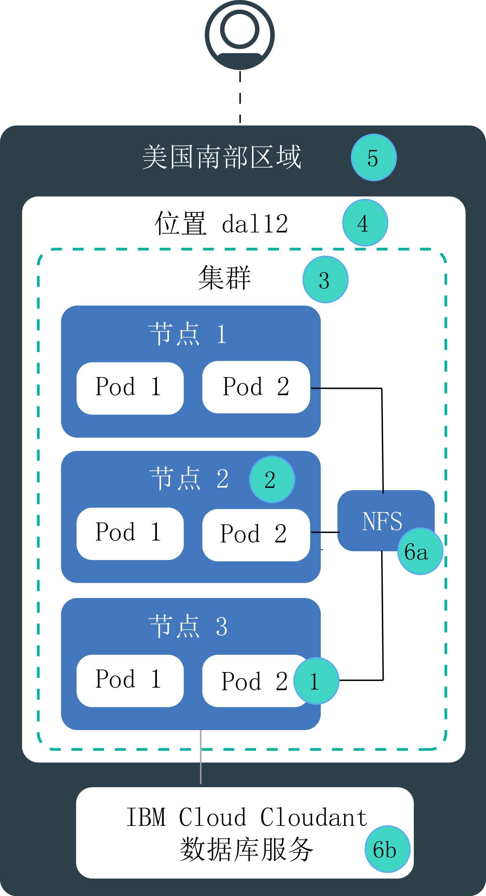

---

copyright:
  years: 2014, 2018
lastupdated: "2018-09-10"

---

{:new_window: target="_blank"}
{:shortdesc: .shortdesc}
{:screen: .screen}
{:pre: .pre}
{:table: .aria-labeledby="caption"}
{:codeblock: .codeblock}
{:tip: .tip}
{:download: .download}

# {{site.data.keyword.containerlong_notm}} 的高可用性
{: #ha}

使用内置 Kubernetes 和 {{site.data.keyword.containerlong}} 功能，使集群具有更高可用性，并在集群中的组件发生故障时保护应用程序不产生停机时间。
{: shortdesc}

高可用性是 IT 基础架构中的一个核心原则，用于保持应用程序正常启动并运行，即便在站点的一部分或整体发生故障后也不例外。高可用性的主要目的是消除 IT 基础架构中的潜在故障点。例如，可以通过添加冗余并设置故障转移机制来准备好应对一个系统发生故障的情况。

可以在 IT 基础架构的不同级别以及在集群的不同组件中实现高可用性。适合您的可用性级别取决于多个因素，例如您的业务需求、您与客户签订的“服务级别协议”以及您希望支出的费用。

## {{site.data.keyword.containerlong_notm}} 中的潜在故障点概述
{: #fault_domains} 

{{site.data.keyword.containerlong_notm}} 体系结构和基础架构旨在确保可靠性、处理等待时间短以及服务正常运行时间最长。然而，还是可能发生故障。根据您在 {{site.data.keyword.Bluemix_notm}} 中托管的服务，您可能无法容忍故障，就算故障只持续几分钟也不行。
{: shortdesc}

{{site.data.keyword.containerlong_notm}} 提供了多种方法，通过添加冗余和反亲缘关系向集群添加更多可用性。请查看下图，以了解潜在故障点以及如何消除这些故障点。

<dl>
<dt> 1. 容器或 pod 故障。</dt>
  <dd>
根据设计，容器和 pod 的生存时间短，并且可能会意外发生故障。例如，如果应用程序中发生错误，那么容器或 pod 可能会崩溃。为了使应用程序高度可用，必须确保应用程序有足够的实例来处理工作负载，另外还有其他实例用于发生故障的情况。理想情况下，这些实例分布在多个工作程序节点上，用于保护应用程序不受工作程序节点故障的影响。

  
请参阅[部署高可用性应用程序](cs_app.html#highly_available_apps)。
</dd>
<dt> 2. 工作程序节点故障。</dt>
  <dd>
工作程序节点是基于物理硬件运行的 VM。工作程序节点故障包括硬件中断，例如电源、散热或联网中断，以及 VM 本身的问题。可以通过在集群中设置多个工作程序节点来应对一个工作程序节点故障。  <strong>注：</strong>不能保证一个专区中的工作程序节点位于不同的物理计算主机上。例如，您可能有一个集群包含 3 个工作程序节点，但所有 3 个工作程序节点都是在 IBM 专区中的同一物理计算主机上创建的。如果此物理计算主机停止运行，那么您的所有工作程序节点都会停止运行。要防止发生此故障，必须在其他专区中设置另一个集群。

  
请参阅[创建包含多个工作程序节点的集群](cs_cli_reference.html#cs_cluster_create)。
</dd>
<dt> 3. 集群主节点故障。</dt>
  <dd>[Kubernetes 主节点](cs_tech.html#architecture)是用于保持集群正常启动并运行的主组件。主节点将集群资源及其配置存储在充当集群单个事实点的 etcd 数据库中。Kubernetes API 服务器是从工作程序节点到主节点的所有集群管理请求或者想要与集群资源交互时的主入口点。  如果主节点发生故障，那么工作负载将继续在工作程序节点上运行，但是无法使用 `kubectl` 命令来处理集群资源或查看集群运行状况，直至主节点中的 Kubernetes API 服务器恢复运行。如果在主节点停运期间 pod 停止运行，那么在工作程序节点可再次访问 Kubernetes API 服务器之前，将无法重新调度 pod。  在主节点停运期间，您仍可以针对 {{site.data.keyword.containerlong_notm}} API 运行 `ibmcloud ks` 命令以处理基础架构资源，例如，工作程序节点或 VLAN。如果通过向集群添加或从中除去工作程序节点来更改当前集群配置，那么在主节点恢复运行前，更改不会发生。**注**：在主节点停运期间，请勿重新启动或重新引导工作程序节点。此操作会从工作程序节点中除去 pod。因为 Kubernetes API 服务器不可用，因此无法将 pod 重新调度到集群中的其他工作程序节点。
可以在一个专区中创建多个集群，以保护应用程序不受 Kubernetes 主节点或 etcd 故障的影响。要在集群之间进行负载均衡，必须设置外部负载均衡器。  <strong>注：</strong>在一个专区中设置多个集群并不能保证工作程序节点部署在不同的物理计算主机上。要防止发生此故障，必须在其他专区中设置另一个集群。

  
请参阅[设置高可用性集群](cs_clusters_planning.html#ha_clusters)。
</dd>
<dt> 4. 专区故障。</dt>
  <dd>
专区故障会影响所有物理计算主机和 NFS 存储器。故障包括电源、散热、联网或存储中断，以及洪水、地震和飓风等自然灾害。要防止发生专区故障，必须在两个不同专区中具有集群，并通过外部负载均衡器对集群进行负载均衡。

  
请参阅[设置高可用性集群](cs_clusters_planning.html#ha_clusters)。
</dd>    
<dt> 5. 区域故障。</dt>
  <dd>
每个区域都设置有高可用性负载均衡器，可从特定于区域的 API 端点进行访问。负载均衡器用于将入局和出局请求路由到区域专区中的集群。整个区域发生故障的可能性较低。但是，要应对此故障，可以在不同区域中设置多个集群，并使用外部负载均衡器来连接这些集群。万一整个区域发生故障，另一个区域中的集群可以接管工作负载。  <strong>注：</strong>多区域集群需要多种云资源，并且根据应用程序的情况，该集群可能会十分复杂且昂贵。请检查您是否需要多区域设置，或者是否可以容忍潜在的服务中断。如果要设置多区域集群，请确保应用程序和数据可以在其他区域中托管，并且应用程序可以处理全局数据复制。

  
请参阅[设置高可用性集群](cs_clusters_planning.html#ha_clusters)。
</dd>   
<dt> 6a 和 6b. 存储器故障。</dt>
  <dd>
在有状态应用程序中，数据在保持应用程序正常启动并运行方面起着重要作用。您希望确保数据高度可用，以便可以从潜在的故障中恢复。在 {{site.data.keyword.containerlong_notm}} 中，可以从多个选项中进行选择来持久存储数据。例如，可以使用 Kubernetes 本机持久性卷来供应 NFS 存储器，也可以使用 {{site.data.keyword.Bluemix_notm}} 数据库服务来存储数据。

  
请参阅[规划高可用性数据](cs_storage_planning.html#persistent_storage_overview)。
</dd> 
</dl>
