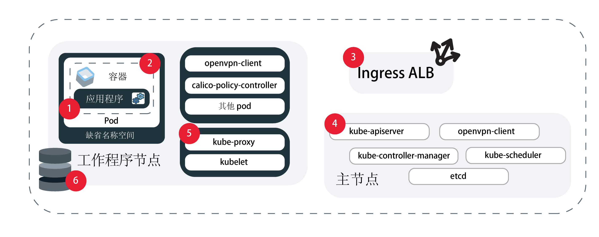

---

copyright:
  years: 2014, 2019
lastupdated: "2019-06-11"

keywords: kubernetes, iks, logmet, logs, metrics

subcollection: containers

---

{:new_window: target="_blank"}
{:shortdesc: .shortdesc}
{:screen: .screen}
{:pre: .pre}
{:table: .aria-labeledby="caption"}
{:codeblock: .codeblock}
{:tip: .tip}
{:note: .note}
{:important: .important}
{:deprecated: .deprecated}
{:download: .download}
{:preview: .preview}


# 日志记录和监视
{: #health}

在 {{site.data.keyword.containerlong}} 中设置日志记录和监视可帮助您对问题进行故障诊断，并提高 Kubernetes 集群和应用程序的运行状况和性能。
{: shortdesc}

持续监视和日志记录是检测对集群的攻击，并在发生问题时对问题进行故障诊断的关键。通过持续监视集群，可以更好地了解集群容量以及可供应用程序使用的资源的可用性。通过此洞察，您可以做好准备以保护应用程序免受停机时间的影响。**注**：要配置日志记录和监视，必须在 {{site.data.keyword.containerlong_notm}} 中使用标准集群。

## 选择日志记录解决方案
{: #logging_overview}

缺省情况下，会在本地为以下所有 {{site.data.keyword.containerlong_notm}} 集群组件生成并写入日志：工作程序节点、容器、应用程序、持久性存储器、Ingress 应用程序负载均衡器、Kubernetes API 和 `kube-system` 名称空间。有多个日志记录解决方案可用于收集、转发和查看这些日志。
{: shortdesc}

您可以根据需要收集其日志的集群组件来选择日志记录解决方案。常用实现是根据日志记录服务的分析和接口功能来选择首选的日志记录服务，例如 {{site.data.keyword.loganalysisfull}}、{{site.data.keyword.la_full}} 或第三方服务。然后，可以使用 {{site.data.keyword.cloudaccesstrailfull}} 来审计集群中的用户活动，并将集群主节点日志备份到 {{site.data.keyword.cos_full}}。**注**：要配置日志记录，必须具有标准 Kubernetes 集群。

<dl>

<dt>{{site.data.keyword.la_full_notm}}</dt>
<dd>通过将 LogDNA 作为第三方服务部署到集群来管理 pod 容器日志。要使用 {{site.data.keyword.la_full_notm}}，必须将日志记录代理程序部署到集群中的每个工作程序节点。此代理程序从所有名称空间（包括 `kube-system`）收集 pod 的 `/var/log` 目录中存储的扩展名为 `*.log` 的日志以及无扩展名文件。然后，代理程序会将这些日志转发到 {{site.data.keyword.la_full_notm}} 服务。有关该服务的更多信息，请参阅 [{{site.data.keyword.la_full_notm}}](/docs/services/Log-Analysis-with-LogDNA?topic=LogDNA-about) 文档。首先，请参阅[使用 {{site.data.keyword.loganalysisfull_notm}} with LogDNA 管理 Kubernetes 集群日志](/docs/services/Log-Analysis-with-LogDNA/tutorials?topic=LogDNA-kube#kube)。
</dd>

<dt>将 Fluentd 用于 {{site.data.keyword.loganalysisfull_notm}}</dt>
<dd><p class="deprecated">先前，可以创建日志记录配置，以将 Fluentd 集群组件收集的日志转发到 {{site.data.keyword.loganalysisfull_notm}}。从 2019 年 4 月 30 日开始，您无法供应新的 {{site.data.keyword.loganalysisshort_notm}} 实例，并且所有轻量套餐实例都会被删除。对现有高端套餐实例的支持持续到 2019 年 9 月 30 日。要继续收集集群的日志，必须设置 {{site.data.keyword.la_full_notm}}，或者更改配置以将日志转发到外部服务器。</p>
</dd>

<dt>将 Fluentd 用于外部服务器</dt>
<dd>要收集、转发和查看集群组件的日志，可以使用 Fluentd 来创建日志记录配置。创建日志记录配置时，[Fluentd ](https://www.fluentd.org/) 集群组件会从指定源的路径收集日志。然后，Fluentd 可以将这些日志转发到接受 syslog 协议的外部服务器。首先，请参阅[了解如何将集群和应用程序日志转发到 syslog](#logging)。
</dd>

<dt>{{site.data.keyword.cloudaccesstrailfull_notm}}</dt>
<dd>要监视在集群中执行的用户启动的管理活动，您可以收集审计日志并将其转发到 {{site.data.keyword.cloudaccesstrailfull_notm}}。集群会生成两种类型的 {{site.data.keyword.cloudaccesstrailshort}} 事件。<ul><li>集群管理事件会自动生成并转发到 {{site.data.keyword.cloudaccesstrailshort}}。</li>
<li>Kubernetes API 服务器审计事件会自动生成，但您必须[创建日志记录配置](#api_forward)，Fluentd 才能将这些日志转发到 {{site.data.keyword.cloudaccesstrailshort}}。</li></ul>
有关可以跟踪的 {{site.data.keyword.containerlong_notm}} 事件类型的更多信息，请参阅 [Activity Tracker 事件](/docs/containers?topic=containers-at_events)。有关服务的更多信息，请参阅 [Activity Tracker](/docs/services/cloud-activity-tracker?topic=cloud-activity-tracker-getting-started) 文档。<p class="note">目前，{{site.data.keyword.containerlong_notm}} 未配置为使用 {{site.data.keyword.at_full}}。要管理集群管理事件和 Kubernetes API 审计日志，请继续将 {{site.data.keyword.cloudaccesstrailfull_notm}} 与 Log Analysis 配合使用。</p>
</dd>

<dt>{{site.data.keyword.cos_full_notm}}</dt>
<dd>要收集、转发和查看集群 Kubernetes 主节点的日志，您可以在任意时间点拍摄要在 {{site.data.keyword.cos_full_notm}} 存储区中收集的主节点日志的快照。快照包含通过 API 服务器发送的任何内容，例如 pod 安排、部署或 RBAC 策略。
首先，请参阅[收集主节点日志](#collect_master)。</dd>

<dt>第三方服务</dt>
<dd>如果您有特殊需求，那么可以设置您自己的日志记录解决方案。在[日志记录和监视集成](/docs/containers?topic=containers-supported_integrations#health_services)中，查看可以添加到集群的第三方日志记录服务。可以从 `/var/log/pods/` 路径中收集容器日志。</dd>

</dl>

<br />


## 将集群和应用程序日志转发到 {{site.data.keyword.la_full_notm}}
{: #logdna}

通过将 LogDNA 作为第三方服务部署到集群来管理 pod 容器日志。
{: shortdesc}

要使用 {{site.data.keyword.la_full_notm}}，必须将日志记录代理程序部署到集群中的每个工作程序节点。此代理程序从所有名称空间（包括 `kube-system`）收集 pod 的 `/var/log` 目录中存储的扩展名为 `*.log` 的日志以及无扩展名文件。然后，代理程序会将这些日志转发到 {{site.data.keyword.la_full_notm}} 服务。有关该服务的更多信息，请参阅 [{{site.data.keyword.la_full_notm}}](/docs/services/Log-Analysis-with-LogDNA?topic=LogDNA-about) 文档。首先，请参阅[使用 {{site.data.keyword.loganalysisfull_notm}} with LogDNA 管理 Kubernetes 集群日志](/docs/services/Log-Analysis-with-LogDNA/tutorials?topic=LogDNA-kube#kube)。

<br />


## 不推荐：将集群、应用程序和 Kubernetes API 审计日志转发到 {{site.data.keyword.loganalysisfull_notm}}
{: #loga}

先前，可以创建日志记录配置，以将 Fluentd 集群组件收集的日志转发到 {{site.data.keyword.loganalysisfull_notm}}。自 2019 年 4 月 30 日开始，不推荐使用 {{site.data.keyword.loganalysisfull_notm}}。您无法供应新的 {{site.data.keyword.loganalysisshort_notm}} 实例，并且所有轻量套餐实例都会被删除。对现有高端套餐实例的支持持续到 2019 年 9 月 30 日。
{: deprecated}

要继续收集集群的日志，您有以下选项：
* 设置 {{site.data.keyword.la_full_notm}}。有关更多信息，请参阅[转换到 {{site.data.keyword.la_full_notm}}](/docs/services/CloudLogAnalysis?topic=cloudloganalysis-transition)。
* [更改配置以将日志转发到外部服务器](#configuring)。

有关现有 {{site.data.keyword.loganalysisshort_notm}} 实例的更多信息，请参阅 [{{site.data.keyword.loganalysisshort_notm}} 文档](/docs/services/CloudLogAnalysis?topic=cloudloganalysis-containers_kube_other_logs)。

<br />


## 将集群、应用程序和 Kubernetes API 审计日志转发到外部服务器
{: #configuring}

配置将 {{site.data.keyword.containerlong_notm}} 标准集群的日志转发到外部服务器。
{: shortdesc}

### 了解如何将日志转发到外部服务器
{: #logging}

缺省情况下，日志由集群中的 [Fluentd ](https://www.fluentd.org/) 附加组件进行收集。为集群中的源（如容器）创建日志记录配置后，Fluentd 从该源的路径中收集的日志会转发到外部服务器。系统会对摄入端口上从源到日志记录服务的流量进行加密。
{: shortdesc}

**可以为哪些源配置日志转发？**

在下图中，可以查看可为其配置日志记录的源的位置。



1. `worker`：特定于工作程序节点基础架构配置的信息。工作程序日志在 syslog 中进行捕获，并包含操作系统事件。在 `auth.log` 中，可以找到有关对操作系统发出的认证请求的信息。</br>**路径**：
    * `/var/log/syslog`
    * `/var/log/auth.log`

2. `container`：正在运行的容器记录的信息。</br>**路径**：写入 `STDOUT` 或 `STDERR` 的任何内容。

3. `application`：有关在应用程序级别发生的事件的信息。这可能是有关发生了事件（例如成功登录）的通知、有关存储器的警告或可在应用程序级别执行的其他操作。</br>**路径**：可以设置日志转发到的路径。但是，为了发送日志，必须在日志记录配置中使用绝对路径，否则无法读取日志。如果路径安装到工作程序节点上，那么可能已创建符号链接。示例：如果指定的路径为 `/usr/local/spark/work/app-0546/0/stderr`，但日志实际上会转至 `/usr/local/spark-1.0-hadoop-1.2/work/app-0546/0/stderr`，那么无法读取日志。

4. `storage`：有关集群中设置的持久性存储器的信息。存储器日志可以帮助您将问题确定仪表板和警报设置为 DevOps 管道和生产发布的一部分。**注**：路径 `/var/log/kubelet.log` 和 `/var/log/syslog` 也包含存储器日志，但这些路径中的日志由 `kubernetes` 和 `worker` 日志源进行收集。</br>**路径**：
    * `/var/log/ibmc-s3fs.log`
    * `/var/log/ibmc-block.log`

  **pod**：
    * `portworx-***`
    * `ibmcloud-block-storage-attacher-***`
    * `ibmcloud-block-storage-driver-***`
    * `ibmcloud-block-storage-plugin-***`
    * `ibmcloud-object-storage-plugin-***`

5. `kubernetes`：来自在工作程序节点的 kube-system 名称空间中所发生的 kubelet、kube-proxy 和其他 Kubernetes 事件的信息。</br>**路径**：
    * `/var/log/kubelet.log`
    * `/var/log/kube-proxy.log`
    * `/var/log/event-exporter/1..log`

6. `kube-audit`：有关发送到 Kubernetes API 服务器的集群相关操作的信息，包括时间、用户和受影响的资源。

7. `ingress`：有关通过 Ingress ALB 进入集群的网络流量的信息。</br>**路径**：
    * `/var/log/alb/ids/*.log`
    * `/var/log/alb/ids/*.err`
    * `/var/log/alb/customerlogs/*.log`
    * `/var/log/alb/customerlogs/*.err`

</br>

**有哪些配置选项？**

下表显示了配置日志记录时的不同选项及其描述。

<table>
<caption> 了解日志记录配置选项</caption>
  <thead>
    <th>选项</th>
    <th>描述</th>
  </thead>
  <tbody>
    <tr>
      <td><code><em>&lt;cluster_name_or_ID&gt;</em></code></td>
      <td>集群的名称或标识。</td>
    </tr>
    <tr>
      <td><code><em>--log_source</em></code></td>
      <td>要从中转发日志的源。接受的值为 <code>container</code>、<code>application</code>、<code>worker</code>、<code>kubernetes</code>、<code>ingress</code>、<code>storage</code> 和 <code>kube-audit</code>。此自变量支持要应用于配置的日志源的逗号分隔列表。如果未提供日志源，那么会为 <code>container</code> 和 <code>ingress</code> 日志源创建日志记录配置。</td>
    </tr>
    <tr>
      <td><code><em>--type syslog</em></code></td>
      <td>值 <code>syslog</code> 会将日志转发到外部服务器。</p>
      </dd></td>
    </tr>
    <tr>
      <td><code><em>--namespace</em></code></td>
      <td>可选：要从中转发日志的 Kubernetes 名称空间。<code>ibm-system</code> 和 <code>kube-system</code> Kubernetes 名称空间不支持日志转发。此值仅对 <code>container</code> 日志源有效。如果未指定名称空间，那么集群中的所有名称空间都将使用此配置。</td>
    </tr>
    <tr>
      <td><code><em>--hostname</em></code></td>
      <td><p>对于 {{site.data.keyword.loganalysisshort_notm}}，请使用[数据获取 URL](/docs/services/CloudLogAnalysis?topic=cloudloganalysis-log_ingestion#log_ingestion_urls)。如果未指定数据获取 URL，那么将使用在其中创建集群的区域的端点。</p>
      <p>对于 syslog，请指定日志收集器服务的主机名或 IP 地址。</p></td>
    </tr>
    <tr>
      <td><code><em>--port</em></code></td>
      <td>数据获取端口。如果未指定端口，那么将使用标准端口 <code>9091</code>。
      <p>对于 syslog，请指定日志收集器服务器的端口。如果未指定端口，那么将使用标准端口 <code>514</code>。</td>
    </tr>
    <tr>
      <td><code><em>--app-containers</em></code></td>
      <td>可选：要转发来自应用程序的日志，可以指定包含应用程序的容器的名称。可以使用逗号分隔列表来指定多个容器。如果未指定任何容器，那么会转发来自包含所提供路径的所有容器中的日志。</td>
    </tr>
    <tr>
      <td><code><em>--app-paths</em></code></td>
      <td>容器上应用程序要将日志记录到的路径。要转发源类型为 <code>application</code> 的日志，必须提供路径。要指定多个路径，请使用逗号分隔列表。示例：<code>/var/log/myApp1/*,/var/log/myApp2/*</code></td>
    </tr>
    <tr>
      <td><code><em>--syslog-protocol</em></code></td>
      <td>日志记录类型为 <code>syslog</code> 时，为传输层协议。可以使用以下协议：`udp`、`tls` 或 `tcp`。使用 <code>udp</code> 协议转发到 rsyslog 服务器时，将截断超过 1 KB 的日志。</td>
    </tr>
    <tr>
      <td><code><em>--ca-cert</em></code></td>
      <td>必需：日志记录类型为 <code>syslog</code> 且协议为 <code>tls</code> 时，包含认证中心证书的 Kubernetes 私钥名称。</td>
    </tr>
    <tr>
      <td><code><em>--verify-mode</em></code></td>
      <td>日志记录类型为 <code>syslog</code> 且协议为 <code>tls</code> 时的验证方式。支持的值为 <code>verify-peer</code> 和缺省值 <code>verify-none</code>。</td>
    </tr>
    <tr>
      <td><code><em>--skip-validation</em></code></td>
      <td>可选：跳过对指定组织和空间名称的验证。跳过验证可减少处理时间，但无效的日志记录配置将无法正确转发日志。</td>
    </tr>
  </tbody>
</table>

**由我负责使 Fluentd 保持更新吗？**

为了对日志记录或过滤器配置进行更改，Fluentd 日志记录附加组件必须为最新版本。缺省情况下，会启用附加组件的自动更新。
要禁用自动更新，请参阅[更新集群附加组件：用于日志记录的 Fluentd](/docs/containers?topic=containers-update#logging-up)。

**我能从集群中的一个源转发某些日志，但不转发其他日志吗？**

可以。例如，如果您有一个通信特别频繁的 pod，您可能希望阻止该 pod 的日志占用日志存储空间，同时仍允许转发其他 pod 的日志。要阻止转发特定 pod 的日志，请参阅[过滤日志](#filter-logs)。

<br />


### 转发集群和应用程序日志
{: #enable-forwarding}

针对集群和应用程序日志记录创建配置。您可以使用标志来区分不同的日志记录选项。
{: shortdesc}

**通过 `udp` 或 `tcp` 协议将日志转发到您自己的服务器**

1. 确保您具有 [{{site.data.keyword.Bluemix_notm}} IAM **编辑者**或**管理员**平台角色](/docs/containers?topic=containers-users#platform)。

2. 对于日志源所在的集群：[登录到您的帐户。如果适用，请将相应的资源组设定为目标。为集群设置上下文。](/docs/containers?topic=containers-cs_cli_install#cs_cli_configure)

3. 通过以下两种方式之一来设置接受 syslog 协议的服务器：
  * 设置和管理您自己的服务器，或者让提供者为您管理服务器。如果提供者为您管理服务器，请从日志记录提供者获取日志记录端点。

  * 从容器运行 syslog。例如，可以使用此[部署 .yaml 文件 ](https://github.com/IBM-Cloud/kube-samples/blob/master/deploy-apps-clusters/deploy-syslog-from-kube.yaml) 来访存在集群中运行容器的 Docker 公共映像。该映像在公共集群 IP 地址上发布端口 `514`，并使用此公共集群 IP 地址来配置 syslog 主机。

  可以通过除去 syslog 前缀，将日志作为有效 JSON 进行查看。为此，请将以下代码添加到运行 rsyslog 服务器的 <code>etc/rsyslog.conf</code> 文件的顶部：<code>$template customFormat,"%msg%\n"</br>$ActionFileDefaultTemplate customFormat</code>
  {: tip}

4. 创建日志转发配置。
    ```
    ibmcloud ks logging-config-create --cluster <cluster_name_or_ID> --logsource <log_source> --namespace <kubernetes_namespace> --hostname <log_server_hostname_or_IP> --port <log_server_port> --type syslog --app-containers <containers> --app-paths <paths_to_logs> --syslog-protocol <protocol> --skip-validation
    ```
    {: pre}

</br></br>

**通过 `tls` 协议将日志转发到您自己的服务器**

以下步骤是常规指示信息。在生产环境中使用容器之前，请确保满足所需的任何安全需求。
{: tip}

1. 确保您具有以下 [{{site.data.keyword.Bluemix_notm}} IAM 角色](/docs/containers?topic=containers-users#platform)：
    * 对集群的**编辑者**或**管理员**平台角色
    * 对 `kube-system` 名称空间的**写入者**或**管理者**服务角色

2. 对于日志源所在的集群：[登录到您的帐户。如果适用，请将相应的资源组设定为目标。为集群设置上下文。](/docs/containers?topic=containers-cs_cli_install#cs_cli_configure)

3. 通过以下两种方式之一来设置接受 syslog 协议的服务器：
  * 设置和管理您自己的服务器，或者让提供者为您管理服务器。如果提供者为您管理服务器，请从日志记录提供者获取日志记录端点。

  * 从容器运行 syslog。例如，可以使用此[部署 .yaml 文件 ](https://github.com/IBM-Cloud/kube-samples/blob/master/deploy-apps-clusters/deploy-syslog-from-kube.yaml) 来访存在集群中运行容器的 Docker 公共映像。该映像在公共集群 IP 地址上发布端口 `514`，并使用此公共集群 IP 地址来配置 syslog 主机。您需要注入相关认证中心和服务器端证书，并更新 `syslog.conf` 以在服务器上启用 `tls`。

4. 将认证中心证书保存为名为 `ca-cert` 的文件。名称必须与此完全相同。

5. 在 `kube-system` 名称空间中为 `ca-cert` 文件创建私钥。创建日志记录配置时，请将私钥名称用于 `--ca-cert` 标志。
    ```
    kubectl -n kube-system create secret generic --from-file=ca-cert
    ```
    {: pre}

6. 创建日志转发配置。
    ```
    ibmcloud ks logging-config-create --cluster <cluster name or id> --logsource <log source> --type syslog --syslog-protocol tls --hostname <ip address of syslog server> --port <port for syslog server, 514 is default> --ca-cert <secret name> --verify-mode <defaults to verify-none>
    ```
    {: pre}

### 转发 Kubernetes API 审计日志
{: #audit_enable}

要审计通过 Kubernetes API 服务器传递的任何事件，可以创建配置以将事件转发到外部服务器。
{: shortdesc}

有关 Kubernetes 审计日志的更多信息，请参阅 Kubernetes 文档中的<a href="https://kubernetes.io/docs/tasks/debug-application-cluster/audit/" target="blank">审计主题 </a>。

* 目前，缺省审计策略用于具有此日志记录配置的所有集群。
* 目前不支持过滤器。
* 每个集群只能有一个 `kube-audit` 配置，但可以通过创建日志记录配置和 Webhook，将日志转发到 {{site.data.keyword.cloudaccesstrailshort}} 和外部服务器。

* 您必须具有对集群的 [{{site.data.keyword.Bluemix_notm}} IAM **管理员**平台角色](/docs/containers?topic=containers-users#platform)。

**开始之前**

1. 设置可以转发日志的远程日志记录服务器。例如，您可以[将 Logstash 用于 Kubernetes ](https://kubernetes.io/docs/tasks/debug-application-cluster/audit/#use-logstash-to-collect-and-distribute-audit-events-from-webhook-backend) 以收集审计事件。

2. 对于要从中收集 API 服务器审计日志的集群：[登录到您的帐户。如果适用，请将相应的资源组设定为目标。为集群设置上下文。](/docs/containers?topic=containers-cs_cli_install#cs_cli_configure)

转发 Kubernetes API 审计日志：

1. 设置 Webhook。如果未在标志中提供任何信息，那么将使用缺省配置。

    ```
    ibmcloud ks apiserver-config-set audit-webhook <cluster_name_or_ID> --remoteServer <server_URL_or_IP> --caCert <CA_cert_path> --clientCert <client_cert_path> --clientKey <client_key_path>
    ```
    {: pre}

  <table>
  <caption>了解此命令的组成部分</caption>
    <thead>
      <th colspan=2> 了解此命令的组成部分</th>
    </thead>
    <tbody>
      <tr>
        <td><code><em>&lt;cluster_name_or_ID&gt;</em></code></td>
        <td>集群的名称或标识。</td>
      </tr>
      <tr>
        <td><code><em>&lt;server_URL&gt;</em></code></td>
        <td>要向其发送日志的远程日志记录服务的 URL 或 IP 地址。如果提供了不安全的服务器 URL，那么将忽略证书。</td>
      </tr>
      <tr>
        <td><code><em>&lt;CA_cert_path&gt;</em></code></td>
        <td>用于验证远程日志记录服务的 CA 证书的文件路径。</td>
      </tr>
      <tr>
        <td><code><em>&lt;client_cert_path&gt;</em></code></td>
        <td>用于向远程日志记录服务进行认证的客户机证书的文件路径。</td>
      </tr>
      <tr>
        <td><code><em>&lt;client_key_path&gt;</em></code></td>
        <td>用于连接到远程日志记录服务的相应客户机密钥的文件路径。</td>
      </tr>
    </tbody>
  </table>

2. 通过查看远程日志记录服务的 URL 来验证是否已启用日志转发。

    ```
    ibmcloud ks apiserver-config-get audit-webhook <cluster_name_or_ID>
    ```
    {: pre}

    输出示例：
    ```
        OK
    Server:			https://8.8.8.8
    ```
    {: screen}

3. 通过重新启动 Kubernetes 主节点来应用配置更新。

    ```
    ibmcloud ks apiserver-refresh --cluster <cluster_name_or_ID>
    ```
    {: pre}

4. 可选：如果要停止转发审计日志，可以禁用配置。
    1. 对于要停止从中收集 API 服务器审计日志的集群：[登录到您的帐户。如果适用，请将相应的资源组设定为目标。为集群设置上下文。](/docs/containers?topic=containers-cs_cli_install#cs_cli_configure)
    2. 禁用集群 API 服务器的 Webhook 后端配置。

        ```
        ibmcloud ks apiserver-config-unset audit-webhook <cluster_name_or_ID>
        ```
        {: pre}

    3. 通过重新启动 Kubernetes 主节点来应用配置更新。

        ```
        ibmcloud ks apiserver-refresh --cluster <cluster_name_or_ID>
        ```
        {: pre}

### 过滤转发的日志
{: #filter-logs}

可以通过过滤掉某段时间内的特定日志来选择要转发到外部服务器的日志。您可以使用标志来区分不同的过滤选项。
{: shortdesc}

<table>
<caption>了解日志过滤的选项</caption>
  <thead>
    <th colspan=2> 了解日志过滤选项</th>
  </thead>
  <tbody>
    <tr>
      <td>&lt;cluster_name_or_ID&gt;</td>
      <td>必需：要过滤其日志的集群的名称或标识。</td>
    </tr>
    <tr>
      <td><code>&lt;log_type&gt;</code></td>
      <td>要应用过滤器的日志的类型。目前支持 <code>all</code>、<code>container</code> 和 <code>host</code>。</td>
    </tr>
    <tr>
      <td><code>&lt;configs&gt;</code></td>
      <td>可选：日志记录配置标识的逗号分隔列表。如果未提供，过滤器将应用于传递到过滤器的所有集群日志记录配置。可以使用 <code>--show-matching-configs</code> 选项来查看与过滤器相匹配的日志配置。</td>
    </tr>
    <tr>
      <td><code>&lt;kubernetes_namespace&gt;</code></td>
      <td>可选：要从中转发日志的 Kubernetes 名称空间。仅当使用日志类型 <code>container</code> 时，此标志才适用。</td>
    </tr>
    <tr>
      <td><code>&lt;container_name&gt;</code></td>
      <td>可选：要从中过滤日志的容器的名称。</td>
    </tr>
    <tr>
      <td><code>&lt;logging_level&gt;</code></td>
      <td>可选：过滤掉处于指定级别及更低级别的日志。规范顺序的可接受值为 <code>fatal</code>、<code>error</code>、<code>warn/warning</code>、<code>info</code>、<code>debug</code> 和 <code>trace</code>。例如，如果过滤掉 <code>info</code> 级别的日志，那么还会过滤掉 <code>debug</code> 和 <code>trace</code>。**注**：仅当日志消息为 JSON 格式且包含 level 字段时，才能使用此标志。要以 JSON 格式显示消息，请向命令附加 <code>--json</code> 标志。</td>
    </tr>
    <tr>
      <td><code>&lt;message&gt;</code></td>
      <td>可选：过滤掉包含编写为正则表达式的指定消息的日志。</td>
    </tr>
    <tr>
      <td><code>&lt;filter_ID&gt;</code></td>
      <td>可选：日志过滤器的标识。</td>
    </tr>
    <tr>
      <td><code>--show-matching-configs</code></td>
      <td>可选：显示每个过滤器应用于的日志记录配置。</td>
    </tr>
    <tr>
      <td><code>--all</code></td>
      <td>可选：删除所有日志转发过滤器。</td>
    </tr>
  </tbody>
</table>

1. 创建日志记录过滤器。
  ```
  ibmcloud ks logging-filter-create --cluster <cluster_name_or_ID> --type <log_type> --logging-configs <configs> --namespace <kubernetes_namespace> --container <container_name> --level <logging_level> --regex-message <message>
  ```
  {: pre}

2. 查看创建的日志过滤器。

  ```
  ibmcloud ks logging-filter-get --cluster <cluster_name_or_ID> --id <filter_ID> --show-matching-configs
  ```
  {: pre}

3. 更新创建的日志过滤器。
  ```
  ibmcloud ks logging-filter-update --cluster <cluster_name_or_ID> --id <filter_ID> --type <server_type> --logging-configs <configs> --namespace <kubernetes_namespace --container <container_name> --level <logging_level> --regex-message <message>
  ```
  {: pre}

4. 删除创建的日志过滤器。

  ```
  ibmcloud ks logging-filter-rm --cluster <cluster_name_or_ID> --id <filter_ID> [--all]
  ```
  {: pre}

### 验证、更新和删除日志转发
{: #verifying-log-forwarding}

**验证**</br>
可以通过以下两种方式之一来验证配置是否正确设置：

* 列出集群中的所有日志记录配置：
      
  ```
    ibmcloud ks logging-config-get --cluster <cluster_name_or_ID>
    ```
  {: pre}

* 列出一种类型日志源的日志记录配置：
      
  ```
    ibmcloud ks logging-config-get --cluster <cluster_name_or_ID> --logsource <source>
    ```
  {: pre}

**更新**</br>
可以更新已创建的日志记录配置：
```
ibmcloud ks logging-config-update --cluster <cluster_name_or_ID> --id <log_config_id> --namespace <namespace> --type <server_type> --syslog-protocol <protocol> --logsource <source> --hostname <hostname_or_ingestion_URL> --port <port> --space <cluster_space> --org <cluster_org> --app-containers <containers> --app-paths <paths_to_logs>
```
{: pre}

**删除**</br>
可以停止集群的一个或全部日志记录配置的日志转发：


* 删除一个日志记录配置：
    ```
  ibmcloud ks logging-config-rm --cluster <cluster_name_or_ID> --id <log_config_ID>
  ```
  {: pre}

* 删除所有日志记录配置：
    ```
  ibmcloud ks logging-config-rm --cluster <my_cluster> --all
  ```
  {: pre}

<br />


## 将 Kubernetes API 审计日志转发到 {{site.data.keyword.cloudaccesstrailfull_notm}}
{: #api_forward}

Kubernetes 会自动审计通过 Kubernetes API 服务器传递的任何事件。您可以将事件转发到 {{site.data.keyword.cloudaccesstrailfull_notm}}。
{: shortdesc}

有关 Kubernetes 审计日志的更多信息，请参阅 Kubernetes 文档中的<a href="https://kubernetes.io/docs/tasks/debug-application-cluster/audit/" target="blank">审计主题 </a>。

* 目前，缺省审计策略用于具有此日志记录配置的所有集群。
* 目前不支持过滤器。
* 每个集群只能有一个 `kube-audit` 配置，但可以通过创建日志记录配置和 Webhook，将日志转发到 {{site.data.keyword.cloudaccesstrailshort}} 和外部服务器。

* 您必须具有对集群的 [{{site.data.keyword.Bluemix_notm}} IAM **管理员**平台角色](/docs/containers?topic=containers-users#platform)。

目前，{{site.data.keyword.containerlong_notm}} 未配置为使用 {{site.data.keyword.at_full}}。要管理 Kubernetes API 审计日志，请继续将 {{site.data.keyword.cloudaccesstrailfull_notm}} 与 Log Analysis 配合使用。
{: note}

**开始之前**

1. 验证许可权。如果在创建集群时指定了空间，那么帐户所有者和 {{site.data.keyword.containerlong_notm}} 密钥所有者都需要该空间的“管理者”、“开发者”或“审计员”许可权。

2. 对于要从中收集 API 服务器审计日志的集群：[登录到您的帐户。如果适用，请将相应的资源组设定为目标。为集群设置上下文。](/docs/containers?topic=containers-cs_cli_install#cs_cli_configure)

**转发日志**

1. 创建日志记录配置。

    ```
    ibmcloud ks logging-config-create --cluster <cluster_name_or_ID> --logsource kube-audit --space <cluster_space> --org <cluster_org> --hostname <ingestion_URL> --type ibm
    ```
    {: pre}

    示例命令和输出：

    ```
    ibmcloud ks logging-config-create --cluster myCluster --logsource kube-audit
    Creating logging configuration for kube-audit logs in cluster myCluster...
    OK
    Id                                     Source      Namespace   Host                                   Port     Org    Space   Server Type   Protocol  Application Containers   Paths
    14ca6a0c-5bc8-499a-b1bd-cedcf40ab850   kube-audit    -         ingest-au-syd.logging.bluemix.net✣    9091✣     -       -         ibm          -              -                  -

    ✣ Indicates the default endpoint for the {{site.data.keyword.loganalysisshort_notm}} service.

      

    ```
    {: screen}

    <table>
    <caption>了解此命令的组成部分</caption>
      <thead>
        <th colspan=2> 了解此命令的组成部分</th>
      </thead>
      <tbody>
        <tr>
          <td><code><em>&lt;cluster_name_or_ID&gt;</em></code></td>
          <td>集群的名称或标识。</td>
        </tr>
        <tr>
          <td><code><em>&lt;ingestion_URL&gt;</em></code></td>
          <td>要从中转发日志的端点。如果未指定[数据获取 URL](/docs/services/CloudLogAnalysis?topic=cloudloganalysis-log_ingestion#log_ingestion_urls)，那么将使用在其中创建集群的区域的端点。</td>
        </tr>
        <tr>
          <td><code><em>&lt;cluster_space&gt;</em></code></td>
          <td>可选：要向其发送日志的 Cloud Foundry 空间的名称。将日志转发到 {{site.data.keyword.loganalysisshort_notm}} 时，会在数据获取点中指定空间和组织。如果未指定空间，日志将发送到帐户级别。</td>
        </tr>
        <tr>
          <td><code><em>&lt;cluster_org&gt;</em></code></td>
          <td>该空间所在 Cloud Foundry 组织的名称。如果指定了空间，那么此值是必需的。</td>
        </tr>
      </tbody>
    </table>

2. 查看集群日志记录配置，以验证它是否已按预期方式实现。

    ```
    ibmcloud ks logging-config-get --cluster <cluster_name_or_ID>
    ```
    {: pre}

    示例命令和输出：
    ```
    ibmcloud ks logging-config-get --cluster myCluster
    Retrieving cluster myCluster logging configurations...
    OK
    Id                                     Source        Namespace   Host                                 Port    Org   Space   Server Type  Protocol  Application Containers   Paths
    a550d2ba-6a02-4d4d-83ef-68f7a113325c   container     *           ingest-au-syd.logging.bluemix.net✣  9091✣   -     -         ibm           -          -              -
    14ca6a0c-5bc8-499a-b1bd-cedcf40ab850   kube-audit    -           ingest-au-syd.logging.bluemix.net✣  9091✣   -     -         ibm           -          -              -       
    ```
    {: screen}

3. 要查看转发的 Kubernetes API 审计事件，请执行以下操作：
  1. 登录到 {{site.data.keyword.Bluemix_notm}} 帐户。
  2. 在目录中，在您的 {{site.data.keyword.containerlong_notm}} 实例所在的帐户下供应 {{site.data.keyword.cloudaccesstrailshort}} 服务实例。
  3. 在 {{site.data.keyword.cloudaccesstrailshort}} 仪表板的**管理**选项卡上，选择帐户或空间域。
    * **帐户日志**：集群管理事件和 Kubernetes API 服务器审计事件可在生成这些事件所在 {{site.data.keyword.Bluemix_notm}} 区域的**帐户域**中找到。
    * **空间日志**：如果在步骤 2 中配置日志记录配置时指定了空间，那么这些事件可在与供应 {{site.data.keyword.cloudaccesstrailshort}} 服务的 Cloud Foundry 空间相关联的**空间域**中找到。
  4. 单击**在 Kibana 中查看**。
  5. 设置要查看日志的时间范围。缺省值为 24 小时。
  6. 要缩小搜索范围，可以单击 `ActivityTracker_Account_Search_in_24h` 的编辑图标，然后在**可用字段**列中添加字段。

  要允许其他用户查看帐户和空间事件，请参阅[授予查看帐户事件的许可权](/docs/services/cloud-activity-tracker/how-to?topic=cloud-activity-tracker-grant_permissions#grant_permissions)。
  {: tip}

<br />


## 在 {{site.data.keyword.cos_full_notm}} 存储区中收集主节点日志
{: #collect_master}

通过 {{site.data.keyword.containerlong_notm}}，您可以获取任意时间点的主节点日志的快照，以在 {{site.data.keyword.cos_full_notm}} 存储区中进行收集。快照包含通过 API 服务器发送的任何内容，例如 pod 安排、部署或 RBAC 策略。
{: shortdesc}

由于 Kubernetes API 服务器日志会自动流式传输，因此还会自动删除这些日志，以便为新日志流入腾出空间。通过保存特定时间点的日志快照，可以更好地对问题进行故障诊断，查看使用情况差异以及查找模式，以帮助维护更安全的应用程序。

**开始之前**

* 在 {{site.data.keyword.Bluemix_notm}}“目录”中[供应 {{site.data.keyword.cos_short}} 实例](/docs/services/cloud-object-storage/basics?topic=cloud-object-storage-gs-dev)。
* 确保您具有对集群的 [{{site.data.keyword.Bluemix_notm}} IAM **管理员**平台角色](/docs/containers?topic=containers-users#platform)。

**创建快照**

1. 通过遵循[此入门教程](/docs/services/cloud-object-storage?topic=cloud-object-storage-getting-started#gs-create-buckets)以使用 {{site.data.keyword.Bluemix_notm}} 控制台来创建 Object Storage 存储区。

2. 在已创建的存储区中生成 [HMAC 服务凭证](/docs/services/cloud-object-storage/iam?topic=cloud-object-storage-service-credentials)。
  1. 在 {{site.data.keyword.cos_short}} 仪表板的**服务凭证**选项卡中，单击**新建凭证**。
  2. 为 HMAC 凭证指定`写入者`服务角色。
  3. 在**添加内联配置参数**字段中，指定 `{"HMAC":true}`。

3. 通过 CLI，发出获取主节点日志快照的请求。

  ```
  ibmcloud ks logging-collect --cluster <cluster name or ID> --cos-bucket <COS_bucket_name> --cos-endpoint <location_of_COS_bucket> --hmac-key-id <HMAC_access_key_ID> --hmac-key <HMAC_access_key>
  ```
  {: pre}

  <table>
  <caption>了解此命令的组成部分</caption>
    <thead>
      <th colspan=2> 了解此命令的组成部分</th>
    </thead>
    <tbody>
      <tr>
        <td><code>--cluster <em>&lt;cluster_name_or_ID&gt;</em></code></td>
        <td>集群的名称或标识。</td>
      </tr>
      <tr>
        <td><code>--cos-bucket <em>&lt;COS_bucket_name&gt;</em></code></td>
        <td>要用于存储日志的 {{site.data.keyword.cos_short}} 存储区的名称。</td>
      </tr>
      <tr>
        <td><code>--cos-endpoint <em>&lt;location_of_COS_bucket&gt;</em></code></td>
        <td>要存储日志的存储区的区域端点、跨区域端点或单数据中心 {{site.data.keyword.cos_short}} 端点。有关可用端点，请参阅 {{site.data.keyword.cos_short}} 文档中的[端点和存储位置](/docs/services/cloud-object-storage/basics?topic=cloud-object-storage-endpoints) 。</td>
      </tr>
      <tr>
        <td><code>--hmac-key-id <em>&lt;HMAC_access_key_ID&gt;</em></code></td>
        <td>{{site.data.keyword.cos_short}} 实例的 HMAC 凭证的唯一标识。</td>
      </tr>
      <tr>
        <td><code>--hmac-key <em>&lt;HMAC_access_key&gt;</em></code></td>
        <td>{{site.data.keyword.cos_short}} 实例的 HMAC 密钥。</td>
      </tr>
    </tbody>
  </table>

  示例命令和响应：

  ```
  ibmcloud ks logging-collect --cluster mycluster --cos-bucket mybucket --cos-endpoint s3-api.us-geo.objectstorage.softlayer.net --hmac-key-id e2e7f5c9fo0144563c418dlhi3545m86 --hmac-key c485b9b9fo4376722f692b63743e65e1705301ab051em96j
  There is no specified log type. The default master will be used.
  Submitting log collection request for master logs for cluster mycluster...
  OK
  The log collection request was successfully submitted. To view the status of the request run ibmcloud ks logging-collect-status mycluster.
  ```
  {: screen}

4. 检查请求的状态。快照可能需要一些时间才能完成，但是您可以检查以确定您的请求是否成功完成。您可以在响应中找到包含主节点日志的文件的名称，并使用 {{site.data.keyword.Bluemix_notm}} 控制台来下载该文件。

  ```
  ibmcloud ks logging-collect-status --cluster <cluster_name_or_ID>
  ```
  {: pre}

  输出示例：

  ```
  ibmcloud ks logging-collect-status --cluster mycluster
  Getting the status of the last log collection request for cluster mycluster...
  OK
  State     Start Time             Error   Log URLs
  success   2018-09-18 16:49 PDT   - s3-api.us-geo.objectstorage.softlayer.net/mybucket/master-0-0862ae70a9ae6c19845ba3pc0a2a6o56-1297318756.tgz
  s3-api.us-geo.objectstorage.softlayer.net/mybucket/master-1-0862ae70a9ae6c19845ba3pc0a2a6o56-1297318756.tgz
  s3-api.us-geo.objectstorage.softlayer.net/mybucket/master-2-0862ae70a9ae6c19845ba3pc0a2a6o56-1297318756.tgz
  ```
  {: screen}

<br />


## 选择监视解决方案
{: #view_metrics}

度量值可帮助您监视集群的运行状况和性能。您可以使用标准 Kubernetes 和容器运行时功能来监视集群和应用程序的运行状况。
**注**：仅标准集群支持监视功能。
{:shortdesc}

**IBM 会监视集群吗？**

每个 Kubernetes 主节点都由 IBM 持续监视。{{site.data.keyword.containerlong_notm}} 会自动扫描部署了 Kubernetes 主节点的每个节点，以确定是否有在 Kubernetes 中找到的漏洞，以及特定于操作系统的安全修订。如果找到了漏洞，{{site.data.keyword.containerlong_notm}} 会自动代表用户应用修订并解决漏洞，以确保保护主节点。您负责监视和分析其余集群组件的日志。

为了避免在使用度量值服务时发生冲突，请确保各个资源组和区域上的集群具有唯一名称。
{: tip}

<dl>
  <dt>{{site.data.keyword.mon_full_notm}}</dt>
    <dd>通过将 Sysdig 作为第三方服务部署到工作程序节点，以将度量值转发到 {{site.data.keyword.monitoringlong}}，从而从运营角度了解应用程序的性能和运行状况。有关更多信息，请参阅[分析在 Kubernetes 集群中部署的应用程序的度量值](/docs/services/Monitoring-with-Sysdig/tutorials?topic=Sysdig-kubernetes_cluster#kubernetes_cluster)。</dd>

  <dt>Kubernetes 仪表板</dt>
    <dd>Kubernetes 仪表板是一个管理 Web 界面，可以在其中查看工作程序节点的运行状况，查找 Kubernetes 资源，部署容器化应用程序，以及使用日志记录和监视信息对应用程序进行故障诊断。有关如何访问 Kubernetes 仪表板的更多信息，请参阅[启动 {{site.data.keyword.containerlong_notm}} 的 Kubernetes 仪表板](/docs/containers?topic=containers-app#cli_dashboard)。</dd>

  <dt>不推荐：{{site.data.keyword.Bluemix_notm}} 控制台的集群概述页面中和 <code>ibmcloud ks cluster-get</code> 输出中的度量值仪表板</dt>
    <dd>{{site.data.keyword.containerlong_notm}} 提供了有关集群的运行状况和容量以及集群资源使用情况的信息。可以使用此控制台通过 {{site.data.keyword.Bluemix_notm}} 服务绑定来横向扩展集群，使用持久性存储器以及向集群添加更多功能。要查看度量值，请转至 **Kubernetes** > **集群**仪表板，选择集群，然后单击**度量值**链接。
  <p class="deprecated">不推荐使用 {{site.data.keyword.Bluemix_notm}} 控制台的集群概述页面和 `ibmcloud ks cluster-get` 输出中度量值仪表板的链接。在 2019 年 5 月 3 日后创建的集群不会创建有度量值仪表板的链接。在 2019 年 5 月 3 日或之前创建的集群将继续具有度量值仪表板的链接。</p></dd>

  <dt>{{site.data.keyword.monitoringlong_notm}}</dt>
    <dd><p>标准集群的度量值位于创建 Kubernetes 集群时登录到的 {{site.data.keyword.Bluemix_notm}} 帐户中。如果在创建集群时指定了 {{site.data.keyword.Bluemix_notm}} 空间，那么度量值将位于该空间中。将为集群中部署的所有容器自动收集容器度量值。这些度量值会通过 Grafana 发送并使其可用。有关度量值的更多信息，请参阅[监视 {{site.data.keyword.containerlong_notm}}](/docs/services/cloud-monitoring/containers?topic=cloud-monitoring-monitoring_bmx_containers_ov#monitoring_bmx_containers_ov)。</p>
    <p>要访问 Grafana 仪表板，请转至以下某个 URL，然后选择在其中已创建集群的 {{site.data.keyword.Bluemix_notm}} 帐户或空间。</p>
    <table summary="表中第一行跨两列。其他行应从左到右阅读，其中第一列是服务器专区，第二列是要匹配的 IP 地址。">
  <caption>要为监视流量打开的 IP 地址</caption>
            <thead>
            <th>{{site.data.keyword.containerlong_notm}} 区域</th>
            <th>监视地址</th>
            <th>监视子网</th>
            </thead>
          <tbody>
            <tr>
             <td>欧洲中部</td>
             <td><code>metrics.eu-de.bluemix.net</code></td>
             <td><code>158.177.65.80/30</code></td>
            </tr>
            <tr>
             <td>英国南部</td>
             <td><code>metrics.eu-gb.bluemix.net</code></td>
             <td><code>169.50.196.136/29</code></td>
            </tr>
            <tr>
              <td>美国东部、美国南部、亚太地区北部和亚太地区南部</td>
              <td><code>metrics.ng.bluemix.net</code></td>
              <td><code>169.47.204.128/29</code></td>
             </tr>
            </tbody>
          </table> </dd>
</dl>

### 其他运行状况监视工具
{: #health_tools}

可以配置其他工具来执行更多监视功能。
<dl>
  <dt>Prometheus</dt>
    <dd>Prometheus 是一个开放式源代码监视、日志记录和警报工具，专为 Kubernetes 而设计。该工具基于 Kubernetes 日志记录信息来检索有关集群、工作程序节点和部署运行状况的详细信息。有关设置的更多信息，请参阅 [CoreOS 指示信息 ](https://github.com/coreos/prometheus-operator/tree/master/contrib/kube-prometheus)。</dd>
</dl>

<br />


## 查看集群状态
{: #states}

查看 Kubernetes 集群的状态，以获取有关集群可用性和容量的信息以及可能发生的潜在问题。
{:shortdesc}

要查看有关特定集群的信息（例如，其专区、服务端点 URL、Ingress 子域、版本和所有者），请使用 `ibmcloud ks cluster-get --cluster <cluster_name_or_ID>` [命令](/docs/containers?topic=containers-cli-plugin-kubernetes-service-cli#cs_cluster_get)。包含 `--showResources` 标志可查看更多集群资源，例如存储 pod 的附加组件或公共和专用 IP 的子网 VLAN。

您可以查看有关整个集群、IBM 管理的主节点以及工作程序节点的信息。要对集群和工作程序节点进行故障诊断，请参阅[集群故障诊断](/docs/containers?topic=containers-cs_troubleshoot#debug_clusters)。

### 集群状态
{: #states_cluster}

您可以通过运行 `ibmcloud ks clusters` 命令并找到 **State** 字段，查看当前集群状态。
{: shortdesc}

<table summary="每个表行都应从左到右阅读，其中第一列是集群状态，第二列是描述。">
  <caption>集群状态</caption>
   <thead>
   <th>集群状态</th>
   <th>描述</th>
   </thead>
   <tbody>
<tr>
   <td>`Aborted`</td>
   <td>在部署 Kubernetes 主节点之前，用户请求删除集群。在集群删除完成后，将从仪表板中除去集群。如果集群长时间卡在此状态，请打开 [{{site.data.keyword.Bluemix_notm}} 支持案例](/docs/containers?topic=containers-cs_troubleshoot#ts_getting_help)。</td>
   </tr>
 <tr>
     <td>`Critical`</td>
     <td>无法访问 Kubernetes 主节点，或者集群中的所有工作程序节点都已停止运行。</td>
    </tr>
   <tr>
     <td>`Delete failed`</td>
     <td>Kubernetes 主节点或至少一个工作程序节点无法删除。</td>
   </tr>
   <tr>
     <td>`Deleted`</td>
     <td>集群已删除，但尚未从仪表板中除去。如果集群长时间卡在此状态，请打开 [{{site.data.keyword.Bluemix_notm}} 支持案例](/docs/containers?topic=containers-cs_troubleshoot#ts_getting_help)。</td>
   </tr>
   <tr>
   <td>`Deleting`</td>
   <td>正在删除集群，并且正在拆除集群基础架构。无法访问集群。</td>
   </tr>
   <tr>
     <td>`Deploy failed`</td>
     <td>无法完成 Kubernetes 主节点的部署。您无法解决此状态。请通过打开 [{{site.data.keyword.Bluemix_notm}} 支持案例](/docs/containers?topic=containers-cs_troubleshoot#ts_getting_help)来联系 IBM Cloud 支持人员。</td>
   </tr>
     <tr>
       <td>`Deploying`</td>
       <td>Kubernetes 主节点尚未完全部署。无法访问集群。请等待集群完全部署后，再复查集群的运行状况。</td>
      </tr>
      <tr>
       <td>`Normal`</td>
       <td>集群中的所有工作程序节点都已启动并正在运行。您可以访问集群，并将应用程序部署到集群。此状态视为正常运行，不需要您执行操作。<p class="note">虽然工作程序节点可能是正常的，但其他基础架构资源（例如，[联网](/docs/containers?topic=containers-cs_troubleshoot_network)和[存储](/docs/containers?topic=containers-cs_troubleshoot_storage)）可能仍然需要注意。如果刚创建了集群，集群中由其他服务使用的某些部分（例如，Ingress 私钥或注册表映像拉取私钥）可能仍在进行中。</p></td>
    </tr>
      <tr>
       <td>`Pending`</td>
       <td>Kubernetes 主节点已部署。正在供应工作程序节点，这些节点在集群中尚不可用。您可以访问集群，但无法将应用程序部署到集群。</td>
     </tr>
   <tr>
     <td>`Requested`</td>
     <td>发送了用于创建集群并为 Kubernetes 主节点和工作程序节点订购基础架构的请求。集群部署启动后，集群状态将更改为 <code>Deploying</code>。如果集群长时间卡在 <code>Requested</code> 状态，请打开 [{{site.data.keyword.Bluemix_notm}} 支持案例](/docs/containers?topic=containers-cs_troubleshoot#ts_getting_help)。</td>
   </tr>
   <tr>
     <td>`Updating`</td>
     <td>在 Kubernetes 主节点中运行的 Kubernetes API 服务器正在更新到新的 Kubernetes API 版本。在更新期间，您无法访问或更改集群。用户已部署的工作程序节点、应用程序和资源不会被修改，并且将继续运行。等待更新完成后，再复查集群的运行状况。</td>
   </tr>
   <tr>
    <td>`Unsupported`</td>
    <td>不再支持集群运行的 [Kubernetes 版本](/docs/containers?topic=containers-cs_versions#cs_versions)。不再主动监视或报告集群的运行状况。此外，无法添加或重新装入工作程序节点。要继续接收重要的安全性更新和支持，必须更新集群。请查看[版本更新准备操作](/docs/containers?topic=containers-cs_versions#prep-up)，然后[更新集群](/docs/containers?topic=containers-update#update)，以将集群更新为支持的 Kubernetes 版本。<br><br><p class="note">无法更新比最旧受支持版本低三个或更多版本的集群。要避免此情况，可以将集群更新为比当前版本高最多两个版本的 Kubernetes 版本，例如从 1.12 更新到 1.14。此外，如果集群运行的是 V1.5、1.7 或 1.8，那么此版本落后太多，无法更新。必须改为[创建集群](/docs/containers?topic=containers-clusters#clusters)，并[部署应用程序](/docs/containers?topic=containers-app#app)至该集群。</p></td>
   </tr>
    <tr>
       <td>`Warning`</td>
       <td>集群中至少有一个工作程序节点不可用，但其他工作程序节点可用，并且可以接管工作负载。</td>
    </tr>
   </tbody>
 </table>


### 主节点状态
{: #states_master}

{{site.data.keyword.containerlong_notm}} 包含 IBM 管理的主节点（具有高可用性副本）、应用的自动安全补丁更新，以及实施的用于在发生事件时进行恢复的自动化功能。您可以通过运行 `ibmcloud ks cluster-get --cluster <cluster_name_or_ID>` 来检查集群主节点的运行状况、阶段状态和状态。
{: shortdesc} 

**主节点运行状况**<br>
**主节点运行状况**反映了主组件的状态，并在发生需要您注意的事件时通知您。运行状况可能为下列其中一项：
*   `error`：主节点不可运行。IBM 会自动收到通知，并采取行动来解决此问题。您可以继续监视运行状况，直到主节点为 `normal`。
*   `normal`：主节点正常运行。无需任何操作。
*   `unavailable`：主节点可能不可访问，这意味着某些操作（例如，调整工作程序池的大小）暂时不可用。IBM 会自动收到通知，并采取行动来解决此问题。您可以继续监视运行状况，直到主节点为 `normal`。 
*   `unsupported`：主节点运行的是不支持的 Kubernetes 版本。必须[更新集群](/docs/containers?topic=containers-update)，才能使主节点恢复为 `normal` 运行状况。

**主节点阶段状态和状态**<br>
**主节点阶段状态**提供主节点状态中正在执行哪个操作的详细信息。阶段状态包括主节点处于同一状态的时间长度的时间戳记，例如 `Ready (1 month ago)`。**主节点状态**反映的是可以在主节点上执行的可能操作的生命周期，例如 deploying、updating 和 deleting。下表中描述了每个状态。

<table summary="每个表行应从左到右阅读，其中第一列是主节点状态，第二列是描述。">
<caption>主节点状态</caption>
   <thead>
   <th>主节点状态</th>
   <th>描述</th>
   </thead>
   <tbody>
<tr>
   <td>`deployed`</td>
   <td>主节点已成功部署。检查阶段状态以验证主节点是否处于 `Ready` 状态，或者查看更新是否可用。</td>
   </tr>
 <tr>
     <td>`deploying`</td>
     <td>当前正在部署主节点。在使用集群（例如，添加工作程序节点）之前，等待状态变为 `deployed`。</td>
    </tr>
   <tr>
     <td>`deploy_failed`</td>
     <td>主节点部署失败。IBM 支持人员会收到相关通知，并努力解决此问题。查看 **Master Status** 字段以获取更多信息，或等待状态变为 `deployed`。</td>
   </tr>
   <tr>
   <td>`deleting`</td>
   <td>由于删除了集群，因此当前正在删除主节点。无法撤销删除操作。删除集群后，即无法再检查主节点状态，因为已完全除去了集群。</td>
   </tr>
     <tr>
       <td>`delete_failed`</td>
       <td>主节点删除失败。IBM 支持人员会收到相关通知，并努力解决此问题。无法通过重试删除集群来解决此问题。请改为查看 **Master Status** 字段以获取更多信息，或等待集群删除。</td>
      </tr>
      <tr>
       <td>`更新`</td>
       <td>主节点正在更新其 Kubernetes 版本。更新可能是自动应用的补丁更新，或者是通过更新集群应用的次版本或主版本。更新期间，高可用性主节点可以继续处理请求，并且应用程序工作负载和工作程序节点将继续运行。主节点更新完成后，可以[更新工作程序节点](/docs/containers?topic=containers-update#worker_node)。<br><br>
       如果更新失败，那么主节点会恢复为 `deployed` 状态，并继续运行先前的版本。IBM 支持人员会收到相关通知，并努力解决此问题。可以在 **Master Status** 字段中查看更新是否失败。</td>
    </tr>
   </tbody>
 </table>


### 工作程序节点状态
{: #states_workers}

您可以通过运行 `ibmcloud ks workers --cluster <cluster_name_or_ID` 命令并找到 **State** 和 **Status** 字段，查看当前工作程序节点状态。
{: shortdesc}

<table summary="每个表行都应从左到右阅读，其中第一列是集群状态，第二列是描述。">
  <caption>工作程序节点状态</caption>
  <thead>
  <th>工作程序节点状态</th>
  <th>描述</th>
  </thead>
  <tbody>
<tr>
    <td>`Critical`</td>
    <td>工作程序节点可能由于许多原因而进入 Critical 状态：<ul><li>对工作程序节点启动了重新引导，但并未对工作程序节点执行封锁和放弃操作。重新引导工作程序节点可能会导致 <code>containerd</code>、<code>kubelet</code>、<code>kube-proxy</code> 和 <code>calico</code> 中发生数据损坏。</li>
    <li>部署到工作程序节点的 pod 不会对[内存 ](https://kubernetes.io/docs/tasks/configure-pod-container/assign-memory-resource/) 和 [CPU ](https://kubernetes.io/docs/tasks/configure-pod-container/assign-cpu-resource/) 使用资源限制。如果没有资源限制，那么 pod 可以使用所有可用资源，这样就没有资源可供其他 pod 在此工作程序节点上运行。这一过度落实工作负载的情况会导致工作程序节点失败。</li>
    <li>在运行数百个或数千个容器一段时间后，<code>containerd</code>、<code>kubelet</code> 或 <code>calico</code> 进入了不可恢复的状态。</li>
    <li>为工作程序节点设置了虚拟路由器设备，但虚拟路由器设备已停止运行并切断了工作程序节点与 Kubernetes 主节点之间的通信。</li><li> {{site.data.keyword.containerlong_notm}} 或 IBM Cloud Infrastructure (SoftLayer) 中导致工作程序节点与 Kubernetes 主节点之间通信失败的当前网络问题。</li>
    <li>工作程序节点的容量不足。检查工作程序节点的 <strong>Status</strong>，以查看它是显示 <strong>Out of disk</strong> 还是 <strong>Out of memory</strong>。如果工作程序节点的容量不足，请考虑减少工作程序节点上的工作负载，或者向集群添加工作程序节点来帮助对工作负载进行负载均衡。</li>
    <li>设备已通过 [{{site.data.keyword.Bluemix_notm}} 控制台资源列表 ](https://cloud.ibm.com/resources) 关闭电源。打开资源列表，并在**设备**列表中找到工作程序节点标识。在“操作”菜单中，单击**打开电源**。</li></ul>
在许多情况下，[重新装入](/docs/containers?topic=containers-cli-plugin-kubernetes-service-cli#cs_worker_reload)工作程序节点可以解决此问题。重新装入工作程序节点时，最新的[补丁版本](/docs/containers?topic=containers-cs_versions#version_types)会应用于工作程序节点。主版本和次版本不会更改。在重新装入工作程序节点之前，请务必对工作程序节点执行封锁和放弃操作，以确保正常终止现有 pod 并将其重新安排到剩余的工作程序节点上。</br></br>如果重新装入工作程序节点无法解决此问题，请转至下一步以继续对工作程序节点进行故障诊断。</br></br><strong>提示：</strong>可以[为工作程序节点配置运行状况检查并启用自动恢复](/docs/containers?topic=containers-health#autorecovery)。如果自动恢复根据配置的检查，检测到运行状况欠佳的工作程序节点，那么自动恢复会触发更正操作，例如在工作程序节点上重装操作系统。有关自动恢复的工作方式的更多信息，请参阅[自动恢复博客 ](https://www.ibm.com/blogs/bluemix/2017/12/autorecovery-utilizes-consistent-hashing-high-availability/)。</td>
   </tr>
   <tr>
   <td>`已部署`</td>
   <td>已成功将更新部署到工作程序节点。在部署更新后，{{site.data.keyword.containerlong_notm}} 在工作程序节点上启动运行状况检查。在运行状况检查成功后，工作程序节点进入 <code>Normal</code> 状态。<code>Deployed</code> 状态的工作程序节点通常已准备好接收工作负载，可通过运行 <code>kubectl get nodes</code> 并确认状态显示 <code>Normal</code> 进行检查。</td>
   </tr>
    <tr>
      <td>`Deploying`</td>
      <td>更新工作程序节点的 Kubernetes 版本时，将重新部署工作程序节点以安装更新。如果重新装入或重新引导工作程序节点，那么将重新部署工作程序节点以自动安装最新的补丁版本。如果工作程序节点长时间卡在此状态，请继续执行下一步，以查看在部署期间是否发生了问题。</td>
   </tr>
      <tr>
      <td>`Normal`</td>
      <td>工作程序节点已完全供应并准备就绪，可以在集群中使用。此状态视为正常运行，不需要用户执行操作。**注**：虽然工作程序节点可能是正常的，但其他基础架构资源（例如，[联网](/docs/containers?topic=containers-cs_troubleshoot_network)和[存储](/docs/containers?topic=containers-cs_troubleshoot_storage)）可能仍然需要注意。</td>
   </tr>
 <tr>
      <td>`Provisioning`</td>
      <td>正在供应工作程序节点，该节点在集群中尚不可用。您可以在 CLI 输出的 <strong>Status</strong> 列中监视供应过程。如果工作程序节点长时间卡在此状态，请继续执行下一步，以查看在供应期间是否发生了问题。</td>
    </tr>
    <tr>
      <td>`Provision_failed`</td>
      <td>无法供应工作程序节点。继续执行下一步以找到失败的详细信息。</td>
    </tr>
 <tr>
      <td>`Reloading`</td>
      <td>正在重新装入工作程序节点，该节点在集群中不可用。您可以在 CLI 输出的 <strong>Status</strong> 列中监视重新装入过程。如果工作程序节点长时间卡在此状态，请继续执行下一步，以查看在重新装入期间是否发生了问题。</td>
     </tr>
     <tr>
      <td>`Reloading_failed`</td>
      <td>无法重新装入工作程序节点。继续执行下一步以找到失败的详细信息。</td>
    </tr>
    <tr>
      <td>`Reload_pending `</td>
      <td>发送了用于重新装入或更新工作程序节点的 Kubernetes 版本的请求。正在重新装入工作程序节点时，状态将更改为 <code>Reloading</code>。</td>
    </tr>
    <tr>
     <td>`Unknown`</td>
     <td>由于以下某种原因，Kubernetes 主节点不可访问：<ul><li>您请求了更新 Kubernetes 主节点。在更新期间无法检索到工作程序节点的状态。如果工作程序节点长时间保持此状态，即使在成功更新 Kubernetes 主节点之后也是如此，请尝试[重新装入](/docs/containers?topic=containers-cli-plugin-kubernetes-service-cli#cs_worker_reload)工作程序节点。</li><li>您可能有其他防火墙在保护工作程序节点，或者最近更改了防火墙设置。{{site.data.keyword.containerlong_notm}} 需要打开特定 IP 地址和端口，以允许工作程序节点与 Kubernetes 主节点之间进行通信。有关更多信息，请参阅[防火墙阻止工作程序节点进行连接](/docs/containers?topic=containers-cs_troubleshoot_clusters#cs_firewall)。</li><li>Kubernetes 主节点已停止运行。请通过打开 [{{site.data.keyword.Bluemix_notm}} 支持案例](/docs/containers?topic=containers-cs_troubleshoot#ts_getting_help)来联系 {{site.data.keyword.Bluemix_notm}} 支持人员。</li></ul></td>
</tr>
   <tr>
      <td>`Warning`</td>
      <td>工作程序节点将达到内存或磁盘空间的限制。您可以减少工作程序节点上的工作负载，或者向集群添加一个工作程序节点以帮助均衡工作负载。</td>
</tr>
  </tbody>
</table>


## 使用自动恢复为工作程序节点配置运行状况监视
{: #autorecovery}

自动恢复系统会使用各种检查来查询工作程序节点的运行状态。如果自动恢复根据配置的检查，检测到运行状况欠佳的工作程序节点，那么自动恢复会触发更正操作，例如在工作程序节点上重装操作系统。一次只会对一个工作程序节点执行更正操作。该工作程序节点必须成功完成更正操作后，才能对其他任何工作程序节点执行更正操作。
有关更多信息，请参阅此[自动恢复博客帖子 ](https://www.ibm.com/blogs/bluemix/2017/12/autorecovery-utilizes-consistent-hashing-high-availability/)。
{: shortdesc}

自动恢复至少需要一个正常运行的节点才能有效运行。仅在具有两个或两个以上工作程序节点的集群中，将自动恢复配置为执行主动检查。
{: note}

开始之前：
- 确保您具有以下 [{{site.data.keyword.Bluemix_notm}} IAM 角色](/docs/containers?topic=containers-users#platform)：
    - 对集群的**管理员**平台角色
    - 对 `kube-system` 名称空间的**写入者**或**管理者**服务角色
- [登录到您的帐户。如果适用，请将相应的资源组设定为目标。为集群设置上下文。](/docs/containers?topic=containers-cs_cli_install#cs_cli_configure)

要配置自动恢复，请执行以下操作：

1.  [遵循指示信息](/docs/containers?topic=containers-helm#public_helm_install)在本地计算机上安装 Helm 客户机，使用服务帐户安装 Helm 服务器 (Tiller)，然后添加 {{site.data.keyword.Bluemix_notm}} Helm 存储库。

2.  验证是否已使用服务帐户安装 Tiller。
    ```
    kubectl get serviceaccount -n kube-system | grep tiller
    ```
    {: pre}

    输出示例：
    ```
    NAME                                 SECRETS   AGE
    tiller                               1         2m
    ```
    {: screen}

3. 创建配置映射文件以通过 JSON 格式定义检查。例如，以下 YAML 文件定义了三项检查：一项 HTTP 检查和两项 Kubernetes API 服务器检查。请参阅示例 YAML 文件后面的表，以获取有关三种检查的信息以及有关这些检查的各个组成部分的信息。
</br>
   **提示**：将每项检查定义为配置映射中 `data` 部分中的唯一键。

   ```
   kind: ConfigMap
   apiVersion: v1
   metadata:
     name: ibm-worker-recovery-checks
     namespace: kube-system
   data:
     checknode.json: |
       {
         "Check":"KUBEAPI",
          "Resource":"NODE",
          "FailureThreshold":3,
          "CorrectiveAction":"RELOAD",
          "CooloffSeconds":1800,
          "IntervalSeconds":180,
          "TimeoutSeconds":10,
          "Enabled":true
        }
      checkpod.json: |
        {
          "Check":"KUBEAPI",
         "Resource":"POD",
         "PodFailureThresholdPercent":50,
         "FailureThreshold":3,
         "CorrectiveAction":"RELOAD",
         "CooloffSeconds":1800,
         "IntervalSeconds":180,
         "TimeoutSeconds":10,
         "Enabled":true
       }
     checkhttp.json: |
       {
         "Check":"HTTP",
         "FailureThreshold":3,
         "CorrectiveAction":"REBOOT",
         "CooloffSeconds":1800,
         "IntervalSeconds":180,
         "TimeoutSeconds":10,
         "Port":80,
         "ExpectedStatus":200,
         "Route":"/myhealth",
         "Enabled":false
       }
   ```
   {:codeblock}

   <table summary="了解配置映射的组成部分">
   <caption>了解配置映射的组成部分</caption>
   <thead>
   <th colspan=2> 了解配置映射的组成部分</th>
   </thead>
   <tbody>
   <tr>
   <td><code>name</code></td>
   <td>配置名称 <code>ibm-worker-recovery-checks</code> 是常量，无法更改。</td>
   </tr>
   <tr>
   <td><code>namespace</code></td>
   <td><code>kube-system</code> 名称空间是常量，无法更改。</td>
   </tr>
   <tr>
   <td><code>checknode.json</code></td>
   <td>定义 Kubernetes API 节点检查，用于检查是否每个工作程序节点都处于 <code>Ready</code> 状态。如果特定工作程序节点不处于 <code>Ready</code> 状态，那么对该工作程序节点的检查计为一次失败。示例 YAML 中的检查每 3 分钟运行一次。如果连续失败三次，将重新装入该工作程序节点。此操作相当于运行 <code>ibmcloud ks worker-reload</code>。<br></br>节点检查会一直处于启用状态，直到您将 <b>Enabled</b> 字段设置为 <code>false</code> 或除去检查。</td>
   </tr>
   <tr>
   <td><code>checkpod.json</code></td>
   <td>
定义 Kubernetes API pod 检查，用于根据分配给工作程序节点的 pod 总数来检查该工作程序节点上 <code>NotReady</code> pod 的总百分比。如果特定工作程序节点的 <code>NotReady</code> pod 的总百分比大于定义的 <code>PodFailureThresholdPercent</code>，那么对该工作程序节点的检查计为一次失败。示例 YAML 中的检查每 3 分钟运行一次。如果连续失败三次，将重新装入该工作程序节点。此操作相当于运行 <code>ibmcloud ks worker-reload</code>。例如，缺省 <code>PodFailureThresholdPercent</code>为 50%。如果 <code>NotReady</code> pod 的百分比连续三次超过 50%，那么将重新装入工作程序节点。<br></br>缺省情况下，将检查所有名称空间中的 pod。要将检查限制为仅检查指定名称空间中的 pod，请将 <code>Namespace</code> 字段添加到检查。pod 检查会一直处于启用状态，直到您将 <b>Enabled</b> 字段设置为 <code>false</code> 或除去检查。</td>
   </tr>
   <tr>
   <td><code>checkhttp.json</code></td>
   <td>定义 HTTP 检查，用于检查在工作程序节点上运行的 HTTP 服务器是否运行正常。要使用此检查，必须使用 [DaemonSet ](https://kubernetes.io/docs/concepts/workloads/controllers/daemonset/) 在集群中的每个工作程序节点上部署 HTTP 服务器。必须实现在 <code>/myhealth</code> 路径中可用并且可以验证 HTTP 服务器是否运行正常的运行状况检查。您可以通过更改 <code>Route</code> 参数来定义其他路径。如果 HTTP 服务器运行正常，那么必须返回 <code>ExpectedStatus</code> 中定义的 HTTP 响应代码。必须将 HTTP 服务器配置为侦听工作程序节点的专用 IP 地址。可以通过运行 <code>kubectl get nodes</code> 来查找专用 IP 地址。<br></br>
      例如，假设集群中有两个节点，其专用 IP 地址分别为 10.10.10.1 和 10.10.10.2。在此示例中，会对下面两个路径检查是否返回 200 HTTP 响应：<code>http://10.10.10.1:80/myhealth</code> 和 <code>http://10.10.10.2:80/myhealth</code>。
   示例 YAML 中的检查每 3 分钟运行一次。如果连续失败三次，将重新引导该工作程序节点。此操作相当于运行 <code>ibmcloud ks worker-reboot</code>。<br></br>HTTP 检查会一直处于禁用状态，直到您将 <b>Enabled</b> 字段设置为 <code>true</code>。</td>
   </tr>
   </tbody>
   </table>

   <table summary="了解检查的各个组成部分">
   <caption>了解检查的各个组成部分</caption>
   <thead>
   <th colspan=2> 了解检查的各个组成部分</th>
   </thead>
   <tbody>
   <tr>
   <td><code>Check</code></td>
   <td>输入希望自动恢复使用的检查类型。<ul><li><code>HTTP</code>：自动恢复调用在每个节点上运行的 HTTP 服务器，以确定节点是否在正常运行。</li><li><code>KUBEAPI</code>：自动恢复调用 Kubernetes API 服务器并读取工作程序节点报告的运行状态数据。</li></ul></td>
   </tr>
   <tr>
   <td><code>资源</code></td>
   <td>检查类型为 <code>KUBEAPI</code> 时，输入希望自动恢复检查的资源类型。接受的值为 <code>NODE</code> 或 <code>POD</code>。</td>
   </tr>
   <tr>
   <td><code>FailureThreshold</code></td>
   <td>输入检查连续失败次数的阈值。达到此阈值时，自动恢复会触发指定的更正操作。例如，如果值为 3 且自动恢复连续三次执行配置的检查失败，那么自动恢复会触发与检查关联的更正操作。</td>
   </tr>
   <tr>
   <td><code>PodFailureThresholdPercent</code></td>
   <td>资源类型为 <code>POD</code> 时，请输入工作程序节点上可以处于 [<strong><code>NotReady </code></strong> ](https://kubernetes.io/docs/tasks/configure-pod-container/configure-liveness-readiness-probes/#define-readiness-probes) 状态的 pod 的百分比阈值。此百分比基于安排到一个工作程序节点的 pod 总数。检查确定运行状况欠佳的 pod 百分比大于阈值时，该检查计为一次失败。</td>
   </tr>
   <tr>
   <td><code>CorrectiveAction</code></td>
   <td>输入在达到失败阈值时要运行的操作。仅当没有其他工作程序在进行修复，并且此工作程序节点距离执行上一个更正操作的时间已超过等待期时，才会运行更正操作。<ul><li><code>REBOOT</code>：重新引导工作程序节点。</li><li><code>RELOAD</code>：从干净的操作系统重新装入工作程序节点的所有必需配置。</li></ul></td>
   </tr>
   <tr>
   <td><code>CooloffSeconds</code></td>
   <td>输入自动恢复在对节点发出更正操作后，必须等待多长时间才能再次向该节点发出其他更正操作（以秒为单位）。等待期自发出更正操作时开始计算。</td>
   </tr>
   <tr>
   <td><code>IntervalSeconds</code></td>
   <td>输入连续检查的间隔秒数。例如，如果值为 180，那么自动恢复会每 3 分钟对每个节点运行一次检查。</td>
   </tr>
   <tr>
   <td><code>TimeoutSeconds</code></td>
   <td>输入在自动恢复终止调用操作之前，对数据库执行检查调用所用的最长时间（以秒为单位）。<code>TimeoutSeconds</code> 的值必须小于 <code>IntervalSeconds</code> 的值。</td>
   </tr>
   <tr>
   <td><code>端口</code></td>
   <td>检查类型为 <code>HTTP</code> 时，请输入工作程序节点上 HTTP 服务器必须绑定到的端口。此端口必须在集群中每个工作程序节点的 IP 上公开。自动恢复需要一个跨所有节点的常量端口号以用于检查服务器。将定制服务器部署到集群中时，请使用 [DaemonSet ](https://kubernetes.io/docs/concepts/workloads/controllers/daemonset/)。</td>
   </tr>
   <tr>
   <td><code>ExpectedStatus</code></td>
   <td>检查类型为 <code>HTTP</code> 时，请输入期望从检查返回的 HTTP 服务器状态。例如，值为 200 表示期望服务器返回 <code>OK</code> 响应。</td>
   </tr>
   <tr>
   <td><code>Route</code></td>
   <td>检查类型为 <code>HTTP</code> 时，请输入从 HTTP 服务器请求的路径。此值通常是在所有工作程序节点上运行的服务器的度量值路径。</td>
   </tr>
   <tr>
   <td><code>Enabled</code></td>
   <td>输入 <code>true</code> 以启用检查，或输入 <code>false</code> 以禁用检查。</td>
   </tr>
   <tr>
   <td><code>Namespace</code></td>
   <td> 可选：要将 <code>checkpod.json</code> 限制为仅检查一个名称空间中的 pod，请添加 <code>Namespace</code> 字段并输入名称空间。</td>
   </tr>
   </tbody>
   </table>

4. 在集群中创建配置映射。
    ```
    kubectl apply -f ibm-worker-recovery-checks.yaml
    ```
    {: pre}

5. 使用相应检查来验证是否已在 `kube-system` 名称空间中创建名称为 `ibm-worker-recovery-checks` 的配置映射。
    ```
    kubectl -n kube-system get cm ibm-worker-recovery-checks -o yaml
    ```
    {: pre}

6. 通过安装 `ibm-worker-recovery` Helm chart，将自动恢复部署到集群中。
    ```
    helm install --name ibm-worker-recovery iks-charts/ibm-worker-recovery  --namespace kube-system
    ```
    {: pre}

7. 过几分钟后，可以检查以下命令的输出中的 `Events` 部分，以查看自动恢复部署上的活动。
    ```
    kubectl -n kube-system describe deployment ibm-worker-recovery
    ```
    {: pre}

8. 如果未看到自动恢复部署上有活动，可以通过运行自动恢复图表定义中包含的测试来检查 Helm 部署。
    ```
helm test ibm-worker-recovery
    ```
    {: pre}
