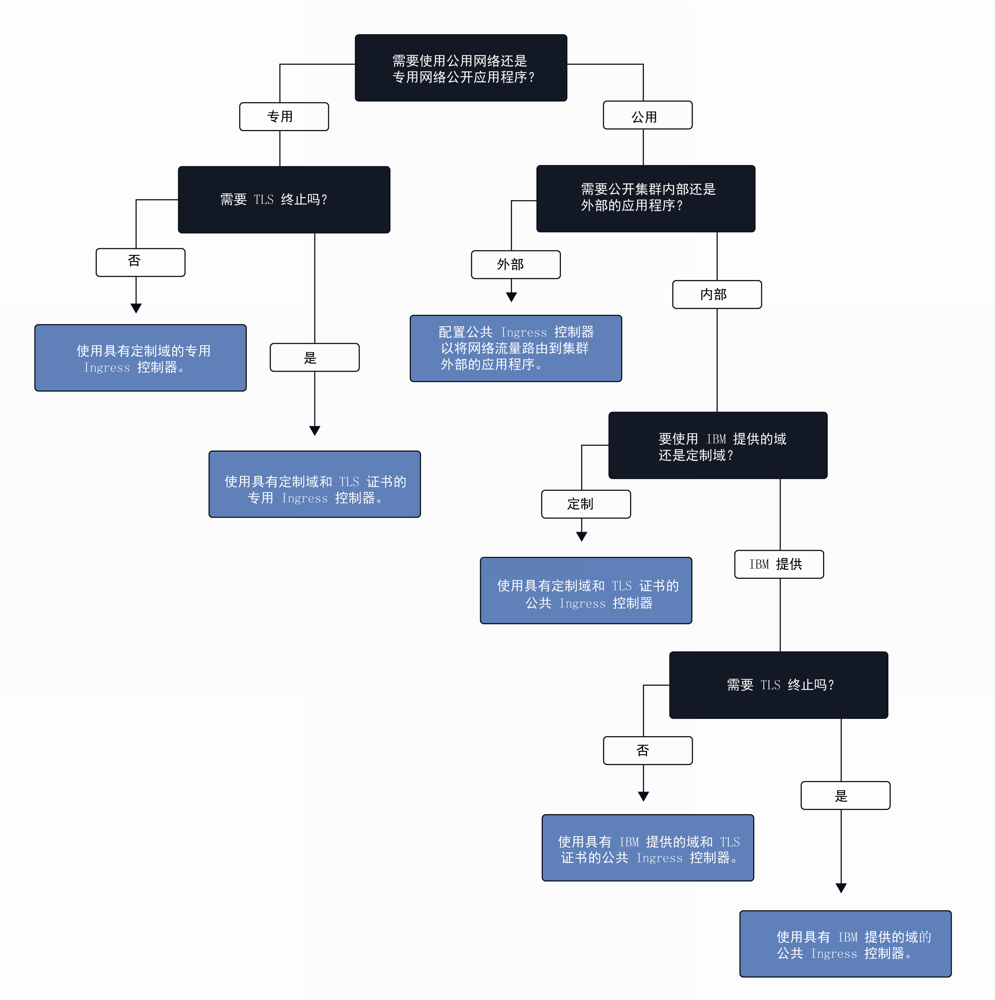

---

copyright:
  years: 2014, 2018
lastupdated: "2018-02-06"

---

{:new_window: target="_blank"}
{:shortdesc: .shortdesc}
{:screen: .screen}
{:pre: .pre}
{:table: .aria-labeledby="caption"}
{:codeblock: .codeblock}
{:tip: .tip}
{:download: .download}


# 设置 Ingress 服务
{: #ingress}

## 使用 Ingress 来配置对应用程序的访问权
{: #config}

通过创建由 IBM 提供的应用程序负载均衡器管理的 Ingress 资源，公开集群中的多个应用程序。应用程序负载均衡器是一个外部 HTTP 或 HTTPS 负载均衡器，使用安全的唯一公共或专用入口点将入局请求路由到集群内部或外部的应用程序。通过 Ingress，可以为向公众或向专用网络公开的每个应用程序定义单独的路由规则。有关 Ingress 服务的常规信息，请参阅[使用 Ingress 规划外部联网](cs_network_planning.html#ingress)。

**注**：Ingress 仅可用于标准集群，并要求集群中至少有两个工作程序节点以确保高可用性，同时要求定期进行更新。设置 Ingress 需要[管理员访问策略](cs_users.html#access_policies)。验证您当前的[访问策略](cs_users.html#infra_access)。

要为 Ingress 选择最佳配置，可以遵循以下决策树：


<map name="ingress_map" id="ingress_map">
<area href="/docs/containers/cs_ingress.html#private_ingress_no_tls" alt="使用定制域（不带 TLS）以专用方式公开应用程序" shape="rect" coords="25, 246, 187, 294"/>
<area href="/docs/containers/cs_ingress.html#private_ingress_tls" alt="使用定制域（带 TLS）以专用方式公开应用程序" shape="rect" coords="161, 337, 309, 385"/>
<area href="/docs/containers/cs_ingress.html#external_endpoint" alt="使用 IBM 提供的域或定制域（带 TLS）以公共方式公开集群外部的应用程序" shape="rect" coords="313, 229, 466, 282"/>
<area href="/docs/containers/cs_ingress.html#custom_domain_cert" alt="使用定制域（带 TLS）以公共方式公开应用程序" shape="rect" coords="365, 415, 518, 468"/>
<area href="/docs/containers/cs_ingress.html#ibm_domain" alt="使用 IBM 提供的域（不带 TLS）以公共方式公开应用程序" shape="rect" coords="414, 629, 569, 679"/>
<area href="/docs/containers/cs_ingress.html#ibm_domain_cert" alt="使用 IBM 提供的域（带 TLS）以公共方式公开应用程序" shape="rect" coords="563, 711, 716, 764"/>
</map>

<br />


## 向公众公开应用程序
{: #ingress_expose_public}

创建标准集群时，会自动启用 IBM 提供的应用程序负载均衡器并为其分配可移植公共 IP 地址和公共路径。通过 Ingress 向公众公开的每个应用程序都会分配有唯一路径，此路径会附加到公共路径，以便您可以使用唯一 URL 在集群中公共访问应用程序。要向公众公开应用程序，可以针对以下场景配置 Ingress。

-   [使用 IBM 提供的域（不带 TLS）以公共方式公开应用程序](#ibm_domain)
-   [使用 IBM 提供的域（带 TLS）以公共方式公开应用程序](#ibm_domain_cert)
-   [使用定制域（带 TLS）以公共方式公开应用程序](#custom_domain_cert)
-   [使用 IBM 提供的域或定制域（带 TLS）以公共方式公开集群外部的应用程序](#external_endpoint)

### 使用 IBM 提供的域（不带 TLS）以公共方式公开应用程序
{: #ibm_domain}

可以配置应用程序负载均衡器对集群中应用程序的入局 HTTP 网络流量进行负载均衡，并使用 IBM 提供的域从因特网访问应用程序。

开始之前：

-   如果还没有标准集群，请[创建标准集群](cs_clusters.html#clusters_ui)。
-   [设定 CLI 的目标](cs_cli_install.html#cs_cli_configure)为集群以运行 `kubectl` 命令。

要使用 IBM 提供的域来公开应用程序，请执行以下操作：

1.  [将应用程序部署到集群](cs_app.html#app_cli)。将应用程序部署到集群时，将创建一个或多个 pod 以用于在容器中运行应用程序。确保在配置文件的 metadata 部分中添加针对您的部署的标签。需要此标签才能识别运行应用程序的所有 pod，以便可以将这些 pod 包含在 Ingress 负载均衡中。
2.  针对要公开的应用程序创建 Kubernetes 服务。仅当通过集群内部的 Kubernetes 服务公开应用程序时，应用程序负载均衡器才能将该应用程序包含到 Ingress 负载均衡中。
    1.  打开首选编辑器，并创建服务配置文件，例如名为 `myservice.yaml`。
    2.  针对要向公众公开的应用程序定义应用程序负载均衡器服务。

        ```
        apiVersion: v1
        kind: Service
        metadata:
          name: <myservice>
        spec:
          selector:
            <selectorkey>: <selectorvalue>
          ports:
           - protocol: TCP
             port: 8080
        ```
        {: codeblock}

        <table>
        <caption>了解应用程序负载均衡器服务文件的组成部分</caption>
        <thead>
        <th colspan=2> 了解 YAML 文件的组成部分</th>
        </thead>
        <tbody>
        <tr>
        <td><code>name</code></td>
        <td>将 <em>&lt;myservice&gt;</em> 替换为应用程序负载均衡器服务的名称。</td>
        </tr>
        <tr>
        <td><code>selector</code></td>
        <td>输入要用于将应用程序运行所在 pod 设定为目标的标签键 (<em>&lt;selectorkey&gt;</em>) 和值 (<em>&lt;selectorvalue&gt;</em>) 对。例如，如果使用 selector <code>app: code</code>，那么在其元数据中具有此标签的所有 pod 都会包含在负载均衡中。输入将应用程序部署到集群时使用的标签。</td>
         </tr>
         <tr>
         <td><code>port</code></td>
         <td>服务侦听的端口。</td>
         </tr>
         </tbody></table>
    3.  保存更改。
    4.  在集群中创建服务。

        ```
        kubectl apply -f myservice.yaml
        ```
        {: pre}
    5.  针对要向公众公开的每个应用程序，重复上述步骤。
3.  获取集群的详细信息以查看 IBM 提供的域。将 _&lt;mycluster&gt;_ 替换为要向公众公开的应用程序部署所在集群的名称。

    ```
    bx cs cluster-get <mycluster>
    ```
    {: pre}

    CLI 输出类似于以下内容。

    ```
    Retrieving cluster <mycluster>...
    OK
    Name:    <mycluster>
    ID:    b9c6b00dc0aa487f97123440b4895f2d
    Created:  2017-04-26T19:47:08+0000
    State:    normal
    Master URL:  https://169.57.40.165:1931
    Ingress subdomain:  <ibmdomain>
    Ingress secret:  <ibmtlssecret>
    Workers:  3
    ```
    {: screen}

可以在 **Ingress subdomain** 字段中查看 IBM 提供的域。
4.  创建 Ingress 资源。Ingress 资源针对您为应用程序创建的 Kubernetes 服务定义路由规则，并由应用程序负载均衡器用于将入局网络流量路由到该服务。可以使用一个 Ingress 资源来针对多个应用程序定义路由规则，前提是每个应用程序都已通过集群内部的 Kubernetes 服务公开。
    1.  打开首选编辑器，并创建 Ingress 配置文件，例如名为 `myingress.yaml`。
    2.  在配置文件中定义 Ingress 资源，该资源使用 IBM 提供的域将入局网络流量路由到先前创建的服务。

        ```
        apiVersion: extensions/v1beta1
        kind: Ingress
        metadata:
          name: <myingressname>
        spec:
          rules:
          - host: <ibmdomain>
            http:
              paths:
              - path: /<myservicepath1>
                backend:
                  serviceName: <myservice1>
                  servicePort: 80
              - path: /<myservicepath2>
                backend:
                  serviceName: <myservice2>
                  servicePort: 80
        ```
        {: codeblock}

        <table>
        <caption>了解 Ingress 资源文件的组成部分</caption>
        <thead>
        <th colspan=2> 了解 YAML 文件的组成部分</th>
        </thead>
        <tbody>
        <tr>
        <td><code>name</code></td>
        <td>将 <em>&lt;myingressname&gt;</em> 替换为 Ingress 资源的名称。</td>
        </tr>
        <tr>
        <td><code>host</code></td>
        <td>将 <em>&lt;ibmdomain&gt;</em> 替换为上一步中 IBM 提供的 <strong>Ingress subdomain</strong> 名称。

        </br></br>
        <strong>注：</strong>不要使用 * 表示主机名，也不要将主机属性保留为空，以避免创建 Ingress 期间发生失败。</td>
        </tr>
        <tr>
        <td><code>path</code></td>
        <td>将 <em>&lt;myservicepath1&gt;</em> 替换为斜杠或应用程序正在侦听的唯一路径，以便可以将网络流量转发到应用程序。

        </br>
        对于每个 Kubernetes 服务，可以定义附加到 IBM 提供的域的单独路径，以创建应用程序的唯一路径，例如 <code>ingress_domain/myservicepath1</code>。在 Web 浏览器中输入此路径时，网络流量会路由到应用程序负载均衡器。应用程序负载均衡器会查找关联的服务，将网络流量发送到该服务，然后使用相同路径发送到运行应用程序的 pod。应用程序必须设置为侦听此路径，才能接收入局网络流量。

        </br></br>
        许多应用程序不会侦听特定路径，而是使用根路径和特定端口。在这种情况下，请将根路径定义为 <code>/</code>，并且不要为应用程序指定单独的路径。
        </br>
        示例：<ul><li>对于 <code>http://ingress_host_name/</code>，请输入 <code>/</code> 作为路径。</li><li>对于 <code>http://ingress_host_name/myservicepath</code>，请输入 <code>/myservicepath</code> 作为路径。</li></ul>
        </br>
        <strong>提示</strong>：如果要将 Ingress 配置为侦听与应用程序所侦听的路径不同的路径，那么可以使用 [rewrite 注释](cs_annotations.html#rewrite-path)来确定应用程序的正确路由。</td>
        </tr>
        <tr>
        <td><code>serviceName</code></td>
        <td>将 <em>&lt;myservice1&gt;</em> 替换为针对应用程序创建 Kubernetes 服务时使用的服务的名称。</td>
        </tr>
        <tr>
        <td><code>servicePort</code></td>
        <td>服务侦听的端口。使用针对应用程序创建 Kubernetes 服务时定义的端口。</td>
        </tr>
        </tbody></table>

    3.  为集群创建 Ingress 资源。

        ```
        kubectl apply -f myingress.yaml
        ```
        {: pre}

5.  验证 Ingress 资源是否已成功创建。将 _&lt;myingressname&gt;_ 替换为先前创建的 Ingress 资源的名称。

    ```
    kubectl describe ingress <myingressname>
    ```
    {: pre}

  **注**：可能需要几分钟时间，才能创建好 Ingress 资源并使应用程序在公共因特网上可用。
6.  在 Web 浏览器中，输入要访问的应用程序服务的 URL。

    ```
    http://<ibmdomain>/<myservicepath1>
    ```
    {: codeblock}

<br />


### 使用 IBM 提供的域（带 TLS）以公共方式公开应用程序
{: #ibm_domain_cert}

可以配置 Ingress 控件来管理应用程序的入局 TLS 连接，使用 IBM 提供的 TLS 证书解密网络流量，然后将未加密的请求转发到集群中公开的应用程序。

开始之前：

-   如果还没有标准集群，请[创建标准集群](cs_clusters.html#clusters_ui)。
-   [设定 CLI 的目标](cs_cli_install.html#cs_cli_configure)为集群以运行 `kubectl` 命令。

要使用 IBM 提供的域（带 TLS）来公开应用程序，请执行以下操作：

1.  [将应用程序部署到集群](cs_app.html#app_cli)。确保在配置文件的 metadata 部分中添加针对您的部署的标签。此标签用于识别运行应用程序的所有 pod，以便可以将这些 pod 包含在 Ingress 负载均衡中。
2.  针对要公开的应用程序创建 Kubernetes 服务。仅当通过集群内部的 Kubernetes 服务公开应用程序时，应用程序负载均衡器才能将该应用程序包含到 Ingress 负载均衡中。
    1.  打开首选编辑器，并创建服务配置文件，例如名为 `myservice.yaml`。
    2.  针对要向公众公开的应用程序定义应用程序负载均衡器服务。

        ```
        apiVersion: v1
        kind: Service
        metadata:
          name: <myservice>
        spec:
          selector:
            <selectorkey>: <selectorvalue>
          ports:
           - protocol: TCP
             port: 8080
        ```
        {: codeblock}

        <table>
        <caption>了解应用程序负载均衡器服务文件的组成部分</caption>
        <thead>
        <th colspan=2> 了解 YAML 文件的组成部分</th>
        </thead>
        <tbody>
        <tr>
        <td><code>name</code></td>
        <td>将 <em>&lt;myservice&gt;</em> 替换为应用程序负载均衡器服务的名称。</td>
        </tr>
        <tr>
        <td><code>selector</code></td>
        <td>输入要用于将应用程序运行所在 pod 设定为目标的标签键 (<em>&lt;selectorkey&gt;</em>) 和值 (<em>&lt;selectorvalue&gt;</em>) 对。例如，如果使用 selector <code>app: code</code>，那么在其元数据中具有此标签的所有 pod 都会包含在负载均衡中。输入将应用程序部署到集群时使用的标签。</td>
         </tr>
         <tr>
         <td><code>port</code></td>
         <td>服务侦听的端口。</td>
         </tr>
         </tbody></table>

    3.  保存更改。
    4.  在集群中创建服务。

        ```
        kubectl apply -f myservice.yaml
        ```
        {: pre}

    5.  针对要向公众公开的每个应用程序，重复上述步骤。

3.  查看 IBM 提供的域和 TLS 证书。将 _&lt;mycluster&gt;_ 替换为在其中部署应用程序的集群的名称。

    ```
    bx cs cluster-get <mycluster>
    ```
    {: pre}

    CLI 输出类似于以下内容。

    ```
    bx cs cluster-get <mycluster>
    Retrieving cluster <mycluster>...
    OK
    Name:    <mycluster>
    ID:    b9c6b00dc0aa487f97123440b4895f2d
    Created:  2017-04-26T19:47:08+0000
    State:    normal
    Master URL:  https://169.57.40.165:1931
    Ingress subdomain:  <ibmdomain>
    Ingress secret:  <ibmtlssecret>
    Workers:  3
    ```
    {: screen}

    可以在 **Ingress subdomain** 字段中查看 IBM 提供的域，在 **Ingress secret** 字段中查看 IBM 提供的证书。

4.  创建 Ingress 资源。Ingress 资源针对您为应用程序创建的 Kubernetes 服务定义路由规则，并由应用程序负载均衡器用于将入局网络流量路由到该服务。可以使用一个 Ingress 资源来针对多个应用程序定义路由规则，前提是每个应用程序都已通过集群内部的 Kubernetes 服务公开。
    1.  打开首选编辑器，并创建 Ingress 配置文件，例如名为 `myingress.yaml`。
    2.  在配置文件中定义 Ingress 资源，该资源使用 IBM 提供的域将入局网络流量路由到服务，并使用 IBM 提供的证书来管理 TLS 终止。对于每个服务，可以定义附加到 IBM 提供的域的单独路径，以创建应用程序的唯一路径，例如 `https://ingress_domain/myapp`。在 Web 浏览器中输入此路径时，网络流量会路由到应用程序负载均衡器。应用程序负载均衡器会查找关联的服务，并将网络流量发送到该服务，然后进一步发送到运行应用程序的 pod。

        **注**：应用程序必须侦听的是 Ingress 资源中定义的路径。否则，网络流量无法转发到该应用程序。大多数应用程序不会侦听特定路径，而是使用根路径和特定端口。在这种情况下，请将根路径定义为 `/`，并且不要为应用程序指定单独的路径。

        ```
        apiVersion: extensions/v1beta1
        kind: Ingress
        metadata:
          name: <myingressname>
        spec:
          tls:
          - hosts:
            - <ibmdomain>
            secretName: <ibmtlssecret>
          rules:
          - host: <ibmdomain>
            http:
              paths:
              - path: /<myservicepath1>
                backend:
                  serviceName: <myservice1>
                  servicePort: 80
              - path: /<myservicepath2>
                backend:
                  serviceName: <myservice2>
                  servicePort: 80
        ```
        {: codeblock}

        <table>
        <caption>了解 Ingress 资源文件的组成部分</caption>
        <thead>
        <th colspan=2> 了解 YAML 文件的组成部分</th>
        </thead>
        <tbody>
        <tr>
        <td><code>name</code></td>
        <td>将 <em>&lt;myingressname&gt;</em> 替换为 Ingress 资源的名称。</td>
        </tr>
        <tr>
        <td><code>tls/hosts</code></td>
        <td>将 <em>&lt;ibmdomain&gt;</em> 替换为上一步中 IBM 提供的 <strong>Ingress subdomain</strong> 名称。此域已配置为使用 TLS 终止。

        </br></br>
        <strong>注</strong>：不要使用 &ast; 表示主机名，也不要将主机属性保留为空，以避免创建 Ingress 期间发生失败。</td>
        </tr>
        <tr>
        <td><code>tls/secretName</code></td>
        <td>将 <em>&lt;ibmtlssecret&gt;</em> 替换为上一步中 IBM 提供的 <strong>Ingress secret</strong> 名称。此证书用于管理 TLS 终止。</tr>
        <tr>
        <td><code>host</code></td>
        <td>将 <em>&lt;ibmdomain&gt;</em> 替换为上一步中 IBM 提供的 <strong>Ingress subdomain</strong> 名称。此域已配置为使用 TLS 终止。

        </br></br>
        <strong>注</strong>：不要使用 &ast; 表示主机名，也不要将主机属性保留为空，以避免创建 Ingress 期间发生失败。</td>
        </tr>
        <tr>
        <td><code>path</code></td>
        <td>将 <em>&lt;myservicepath1&gt;</em> 替换为斜杠或应用程序正在侦听的唯一路径，以便可以将网络流量转发到应用程序。

        </br>
        对于每个 Kubernetes 服务，可以定义附加到 IBM 提供的域的单独路径，以创建应用程序的唯一路径，例如 <code>ingress_domain/myservicepath1</code>。在 Web 浏览器中输入此路径时，网络流量会路由到应用程序负载均衡器。应用程序负载均衡器会查找关联的服务，将网络流量发送到该服务，然后使用相同路径发送到运行应用程序的 pod。应用程序必须设置为侦听此路径，才能接收入局网络流量。

        </br>
        许多应用程序不会侦听特定路径，而是使用根路径和特定端口。在这种情况下，请将根路径定义为 <code>/</code>，并且不要为应用程序指定单独的路径。

        </br>
        示例：<ul><li>对于 <code>http://ingress_host_name/</code>，请输入 <code>/</code> 作为路径。</li><li>对于 <code>http://ingress_host_name/myservicepath</code>，请输入 <code>/myservicepath</code> 作为路径。</li></ul>
        <strong>提示</strong>：如果要将 Ingress 配置为侦听与应用程序所侦听的路径不同的路径，那么可以使用 [rewrite 注释](cs_annotations.html#rewrite-path)来确定应用程序的正确路由。</td>
        </tr>
        <tr>
        <td><code>serviceName</code></td>
        <td>将 <em>&lt;myservice1&gt;</em> 替换为针对应用程序创建 Kubernetes 服务时使用的服务的名称。</td>
        </tr>
        <tr>
        <td><code>servicePort</code></td>
        <td>服务侦听的端口。使用针对应用程序创建 Kubernetes 服务时定义的端口。</td>
        </tr>
        </tbody></table>

    3.  为集群创建 Ingress 资源。

        ```
        kubectl apply -f myingress.yaml
        ```
        {: pre}

5.  验证 Ingress 资源是否已成功创建。将 _&lt;myingressname&gt;_ 替换为先前创建的 Ingress 资源的名称。

    ```
    kubectl describe ingress <myingressname>
    ```
    {: pre}

    **注**：可能需要几分钟时间，才能正确创建 Ingress 资源并使应用程序在公用因特网上可用。
6.  在 Web 浏览器中，输入要访问的应用程序服务的 URL。

    ```
    https://<ibmdomain>/<myservicepath1>
    ```
    {: codeblock}

<br />


### 使用定制域（带 TLS）以公共方式公开应用程序
{: #custom_domain_cert}

使用定制域而不是 IBM 提供的域时，可以配置应用程序负载均衡器以将入局网络流量路由到集群中的应用程序，并使用您自己的 TLS 证书来管理 TLS 终止。
{:shortdesc}

开始之前：

-   如果还没有标准集群，请[创建标准集群](cs_clusters.html#clusters_ui)。
-   [设定 CLI 的目标](cs_cli_install.html#cs_cli_configure)为集群以运行 `kubectl` 命令。

要使用定制域（带 TLS）来公开应用程序，请执行以下操作：

1.  创建定制域。要创建定制域，请使用域名服务 (DNS) 提供程序来注册定制域。
2.  配置域以将入局网络流量路由到 IBM 提供的应用程序负载均衡器。在以下选项之间进行选择：
    -   通过将 IBM 提供的域指定为规范名称记录 (CNAME)，定义定制域的别名。要找到 IBM 提供的 Ingress 域，请运行 `bx cs cluster-get <mycluster>` 并查找 **Ingress subdomain** 字段。
    -   通过将 IBM 提供的应用程序负载均衡器的可移植公共 IP 地址添加为记录，将定制域映射到该 IP 地址。要查找应用程序负载均衡器的可移植公共 IP 地址，请运行 `bx cs alb-get <public_alb_ID>`.
3.  导入或创建 TLS 证书和私钥：
    * 如果您已经具有存储在 {{site.data.keyword.cloudcerts_long_notm}} 中要使用的 TLS 证书，那么可以通过运行以下命令，将其关联的私钥导入到集群：

      ```
          bx cs alb-cert-deploy --secret-name <secret_name> --cluster <cluster_name_or_ID> --cert-crn <certificate_crn>
          ```
      {: pre}

    * 如果还没有 TLS 证书，请执行以下步骤：
        1. 为域创建以 PEM 格式编码的 TLS 证书和密钥。
        2.  打开首选编辑器，并创建 Kubernetes 私钥配置文件，例如名为 `mysecret.yaml`。
        3.  定义使用您的 TLS 证书和密钥的私钥。将 <em>&lt;mytlssecret&gt;</em> 替换为您的 Kubernetes 私钥，将 <em>&lt;tls_key_filepath&gt;</em> 替换未定制 TLS 密钥文件的路径，并将 <em>&lt;tls_cert_filepath&gt;</em> 替换为定制 TLS 证书文件的路径。

            ```
        kubectl create secret tls <mytlssecret> --key <tls_key_filepath> --cert <tls_cert_filepath>
        ```
            {: pre}

        4.  保存配置文件。
        5.  为集群创建 TLS 私钥。

            ```
        kubectl apply -f mysecret.yaml
        ```
            {: pre}

4.  [将应用程序部署到集群](cs_app.html#app_cli)。将应用程序部署到集群时，将创建一个或多个 pod 以用于在容器中运行应用程序。确保在配置文件的 metadata 部分中添加针对您的部署的标签。需要此标签才能识别运行应用程序的所有 pod，以便可以将这些 pod 包含在 Ingress 负载均衡中。

5.  针对要公开的应用程序创建 Kubernetes 服务。仅当通过集群内部的 Kubernetes 服务公开应用程序时，应用程序负载均衡器才能将该应用程序包含到 Ingress 负载均衡中。

    1.  打开首选编辑器，并创建服务配置文件，例如名为 `myservice.yaml`。
    2.  针对要向公众公开的应用程序定义应用程序负载均衡器服务。

        ```
        apiVersion: v1
        kind: Service
        metadata:
          name: <myservice>
        spec:
          selector:
            <selectorkey>: <selectorvalue>
          ports:
           - protocol: TCP
             port: 8080
        ```
       {: codeblock}

        <table>
        <caption>了解应用程序负载均衡器服务文件的组成部分</caption>
        <thead>
        <th colspan=2> 了解 YAML 文件的组成部分</th>
        </thead>
        <tbody>
        <tr>
        <td><code>name</code></td>
        <td>将 <em>&lt;myservice1&gt;</em> 替换为应用程序负载均衡器服务的名称。</td>
        </tr>
        <tr>
        <td><code>selector</code></td>
        <td>输入要用于将应用程序运行所在 pod 设定为目标的标签键 (<em>&lt;selectorkey&gt;</em>) 和值 (<em>&lt;selectorvalue&gt;</em>) 对。例如，如果使用 selector <code>app: code</code>，那么在其元数据中具有此标签的所有 pod 都会包含在负载均衡中。输入将应用程序部署到集群时使用的标签。</td>
         </tr>
         <td><code>port</code></td>
         <td>服务侦听的端口。</td>
         </tbody></table>

    3.  保存更改。
    4.  在集群中创建服务。

        ```
        kubectl apply -f myservice.yaml
        ```
        {: pre}

    5.  针对要向公众公开的每个应用程序，重复上述步骤。
6.  创建 Ingress 资源。Ingress 资源针对您为应用程序创建的 Kubernetes 服务定义路由规则，并由应用程序负载均衡器用于将入局网络流量路由到该服务。可以使用一个 Ingress 资源来针对多个应用程序定义路由规则，前提是每个应用程序都已通过集群内部的 Kubernetes 服务公开。
    1.  打开首选编辑器，并创建 Ingress 配置文件，例如名为 `myingress.yaml`。
    2.  在配置文件中定义 Ingress 资源，该资源使用定制域将入局网络流量路由到服务，并使用定制证书来管理 TLS 终止。对于每个服务，可以定义附加到定制域的单独路径，以创建应用程序的唯一路径，例如 `https://mydomain/myapp`。在 Web 浏览器中输入此路径时，网络流量会路由到应用程序负载均衡器。应用程序负载均衡器会查找关联的服务，并将网络流量发送到该服务，然后进一步发送到运行应用程序的 pod。

        **注**：务必确保应用程序侦听的是 Ingress 资源中定义的路径。否则，网络流量无法转发到该应用程序。大多数应用程序不会侦听特定路径，而是使用根路径和特定端口。在这种情况下，请将根路径定义为 `/`，并且不要为应用程序指定单独的路径。

        ```
        apiVersion: extensions/v1beta1
        kind: Ingress
        metadata:
          name: <myingressname>
        spec:
          tls:
          - hosts:
            - <mycustomdomain>
            secretName: <mytlssecret>
          rules:
          - host: <mycustomdomain>
            http:
              paths:
              - path: /<myservicepath1>
                backend:
                  serviceName: <myservice1>
                  servicePort: 80
              - path: /<myservicepath2>
                backend:
                  serviceName: <myservice2>
                  servicePort: 80
        ```
        {: codeblock}

        <table>
        <caption>了解 Ingress 资源文件的组成部分</caption>
        <thead>
        <th colspan=2> 了解 YAML 文件的组成部分</th>
        </thead>
        <tbody>
        <tr>
        <td><code>name</code></td>
        <td>将 <em>&lt;myingressname&gt;</em> 替换为 Ingress 资源的名称。</td>
        </tr>
        <tr>
        <td><code>tls/hosts</code></td>
        <td>将 <em>&lt;mycustomdomain&gt;</em> 替换为要配置为使用 TLS 终止的定制域。

        </br></br>
        <strong>注</strong>：不要使用 &ast; 表示主机名，也不要将主机属性保留为空，以避免创建 Ingress 期间发生失败。</td>
        </tr>
        <tr>
        <td><code>tls/secretName</code></td>
        <td>将 <em>&lt;mytlssecret&gt;</em> 替换为先前创建的私钥的名称，此私钥用于保存定制 TLS 证书和密钥。如果已从 {{site.data.keyword.cloudcerts_short}} 导入证书，那么可以运行 <code>bx cs alb-cert-get --cluster <cluster_name_or_ID> --cert-crn <certificate_crn></code> 来查看与 TLS 证书关联的私钥。
        </tr>
        <tr>
        <td><code>host</code></td>
        <td>将 <em>&lt;mycustomdomain&gt;</em> 替换为要配置为使用 TLS 终止的定制域。

        </br></br>
        <strong>注</strong>：不要使用 &ast; 表示主机名，也不要将主机属性保留为空，以避免创建 Ingress 期间发生失败。</td>
        </tr>
        <tr>
        <td><code>path</code></td>
        <td>将 <em>&lt;myservicepath1&gt;</em> 替换为斜杠或应用程序正在侦听的唯一路径，以便可以将网络流量转发到应用程序。

        </br>
        对于每个 Kubernetes 服务，可以定义附加到 IBM 提供的域的单独路径，以创建应用程序的唯一路径，例如 <code>ingress_domain/myservicepath1</code>。在 Web 浏览器中输入此路径时，网络流量会路由到应用程序负载均衡器。应用程序负载均衡器会查找关联的服务，将网络流量发送到该服务，然后使用相同路径发送到运行应用程序的 pod。应用程序必须设置为侦听此路径，才能接收入局网络流量。

        </br>
        许多应用程序不会侦听特定路径，而是使用根路径和特定端口。在这种情况下，请将根路径定义为 <code>/</code>，并且不要为应用程序指定单独的路径。

        </br></br>
        示例：<ul><li>对于 <code>https://mycustomdomain/</code>，请输入 <code>/</code> 作为路径。</li><li>对于 <code>https://mycustomdomain/myservicepath</code>，请输入 <code>/myservicepath</code> 作为路径。</li></ul>
        <strong>提示</strong>：如果要将 Ingress 配置为侦听与应用程序所侦听的路径不同的路径，那么可以使用 [rewrite 注释](cs_annotations.html#rewrite-path)来确定应用程序的正确路由。</td>
        </tr>
        <tr>
        <td><code>serviceName</code></td>
        <td>将 <em>&lt;myservice1&gt;</em> 替换为针对应用程序创建 Kubernetes 服务时使用的服务的名称。</td>
        </tr>
        <tr>
        <td><code>servicePort</code></td>
        <td>服务侦听的端口。使用针对应用程序创建 Kubernetes 服务时定义的端口。</td>
        </tr>
        </tbody></table>

    3.  保存更改。
    4.  为集群创建 Ingress 资源。

        ```
        kubectl apply -f myingress.yaml
        ```
        {: pre}

7.  验证 Ingress 资源是否已成功创建。将 _&lt;myingressname&gt;_ 替换为先前创建的 Ingress 资源的名称。

    ```
    kubectl describe ingress <myingressname>
    ```
    {: pre}

    **注**：可能需要几分钟时间，才能正确创建 Ingress 资源并使应用程序在公用因特网上可用。


8.  通过因特网访问应用程序。
    1.  打开首选的 Web 浏览器。
    2.  输入要访问的应用程序服务的 URL。

        ```
        https://<mycustomdomain>/<myservicepath1>
        ```
        {: codeblock}

<br />


### 使用 IBM 提供的域或定制域（带 TLS）以公共方式公开集群外部的应用程序
{: #external_endpoint}

您可以配置应用程序负载均衡器，以将位于集群外部的应用程序包含到集群负载均衡中。IBM 提供的域或定制域上的入局请求会自动转发到外部应用程序。

开始之前：

-   如果还没有标准集群，请[创建标准集群](cs_clusters.html#clusters_ui)。
-   [设定 CLI 的目标](cs_cli_install.html#cs_cli_configure)为集群以运行 `kubectl` 命令。
-   确保要包含在集群负载均衡中的外部应用程序可以使用公共 IP 地址进行访问。

您可以将 IBM 提供的域上的入局网络流量路由到位于集群外部的应用程序。如果要改为使用定制域和 TLS 证书，请将 IBM 提供的域和 TLS 证书替换为[定制域和 TLS 证书](#custom_domain_cert)。

1.  配置 Kubernetes 端点以定义要包含在集群负载均衡中的应用程序的外部位置。
    1.  打开首选编辑器，并创建端点配置文件，例如名为 `myexternalendpoint.yaml`。
    2.  定义外部端点。包括所有可用于访问外部应用程序的公共 IP 地址和端口。


        ```
        kind: Endpoints
        apiVersion: v1
        metadata:
          name: <myendpointname>
        subsets:
          - addresses:
              - ip: <externalIP1>
              - ip: <externalIP2>
            ports:
              - port: <externalport>
        ```
        {: codeblock}

        <table>
        <thead>
        <th colspan=2> 了解 YAML 文件的组成部分</th>
        </thead>
        <tbody>
        <tr>
        <td><code>name</code></td>
        <td>将 <em>&lt;myendpointname&gt;</em> 替换为 Kubernetes 端点的名称。</td>
        </tr>
        <tr>
        <td><code>ip</code></td>
        <td>将 <em>&lt;externalIP&gt;</em> 替换为用于连接到外部应用程序的公共 IP 地址。</td>
         </tr>
         <td><code>port</code></td>
         <td>将 <em>&lt;externalport&gt;</em> 替换为外部应用程序侦听的端口。</td>
         </tbody></table>

    3.  保存更改。
    4.  为集群创建 Kubernetes 端点。

        ```
        kubectl apply -f myexternalendpoint.yaml
        ```
        {: pre}

2.  为集群创建 Kubernetes 服务，并将其配置为将入局请求转发到先前创建的外部端点。
    1.  打开首选编辑器，并创建服务配置文件，例如名为 `myexternalservice.yaml`。
    2.  定义应用程序负载均衡器服务。

        ```
        apiVersion: v1
        kind: Service
        metadata:
          name: <myexternalservice>
          labels:
              name: <myendpointname>
        spec:
          ports:
           - protocol: TCP
             port: 8080
        ```
        {: codeblock}

        <table>
        <caption>了解应用程序负载均衡器服务文件的组成部分</caption>
        <thead>
        <th colspan=2> 了解 YAML 文件的组成部分</th>
        </thead>
        <tbody>
        <tr>
        <td><code>metadata/name</code></td>
        <td>将 <em>&lt;myexternalservice&gt;</em> 替换为应用程序负载均衡器服务的名称。</td>
        </tr>
        <tr>
        <td><code>labels/name</code></td>
        <td>将 <em>&lt;myendpointname&gt;</em> 替换为先前创建的 Kubernetes 端点的名称。</td>
        </tr>
        <tr>
        <td><code>port</code></td>
        <td>服务侦听的端口。</td>
        </tr></tbody></table>

    3.  保存更改。
    4.  为集群创建 Kubernetes 服务。

        ```
        kubectl apply -f myexternalservice.yaml
        ```
        {: pre}

3.  查看 IBM 提供的域和 TLS 证书。将 _&lt;mycluster&gt;_ 替换为在其中部署应用程序的集群的名称。

    ```
    bx cs cluster-get <mycluster>
    ```
    {: pre}

    CLI 输出类似于以下内容。

    ```
    Retrieving cluster <mycluster>...
    OK
    Name:    <mycluster>
    ID:    b9c6b00dc0aa487f97123440b4895f2d
    Created:  2017-04-26T19:47:08+0000
    State:    normal
    Master URL:  https://169.57.40.165:1931
    Ingress subdomain:  <ibmdomain>
    Ingress secret:  <ibmtlssecret>
    Workers:  3
    ```
    {: screen}

    可以在 **Ingress subdomain** 字段中查看 IBM 提供的域，在 **Ingress secret** 字段中查看 IBM 提供的证书。

4.  创建 Ingress 资源。Ingress 资源针对您为应用程序创建的 Kubernetes 服务定义路由规则，并由应用程序负载均衡器用于将入局网络流量路由到该服务。可以使用一个 Ingress 资源来针对多个外部应用程序定义路由规则，前提是每个应用程序都已使用其外部端点通过集群内部的 Kubernetes 服务公开。
    1.  打开首选编辑器，并创建 Ingress 配置文件，例如名为 `myexternalingress.yaml`。
    2.  在配置文件中定义 Ingress 资源，该资源使用 IBM 提供的域和 TLS 证书，通过先前定义的外部端点将入局网络流量路由到外部应用程序。对于每个服务，可以定义附加到 IBM 提供的域或定制域的单独路径，以创建应用程序的唯一路径，例如 `https://ingress_domain/myapp`。在 Web 浏览器中输入此路径时，网络流量会路由到应用程序负载均衡器。应用程序负载均衡器会查找关联的服务，并将网络流量发送到该服务，然后进一步发送到外部应用程序。


        **注**：务必确保应用程序侦听的是 Ingress 资源中定义的路径。否则，网络流量无法转发到该应用程序。大多数应用程序不会侦听特定路径，而是使用根路径和特定端口。在这种情况下，请将根路径定义为 /，并且不要为应用程序指定单独的路径。

        ```
        apiVersion: extensions/v1beta1
        kind: Ingress
        metadata:
          name: <myingressname>
        spec:
          tls:
          - hosts:
            - <ibmdomain>
            secretName: <ibmtlssecret>
          rules:
          - host: <ibmdomain>
            http:
              paths:
              - path: /<myexternalservicepath1>
                backend:
                  serviceName: <myservice1>
                  servicePort: 80
              - path: /<myexternalservicepath2>
                backend:
                  serviceName: <myexternalservice2>
                  servicePort: 80
        ```
        {: codeblock}

        <table>
        <caption>了解 Ingress 资源文件的组成部分</caption>
        <thead>
        <th colspan=2> 了解 YAML 文件的组成部分</th>
        </thead>
        <tbody>
        <tr>
        <td><code>name</code></td>
        <td>将 <em>&lt;myingressname&gt;</em> 替换为 Ingress 资源的名称。</td>
        </tr>
        <tr>
        <td><code>tls/hosts</code></td>
        <td>将 <em>&lt;ibmdomain&gt;</em> 替换为上一步中 IBM 提供的 <strong>Ingress subdomain</strong> 名称。此域已配置为使用 TLS 终止。

        </br></br>
        <strong>注</strong>：不要使用 &ast; 表示主机名，也不要将主机属性保留为空，以避免创建 Ingress 期间发生失败。</td>
        </tr>
        <tr>
        <td><code>tls/secretName</code></td>
        <td>将 <em>&lt;ibmtlssecret&gt;</em> 替换为上一步中 IBM 提供的 <strong>Ingress secret</strong>。此证书用于管理 TLS 终止。</td>
        </tr>
        <tr>
        <td><code>rules/host</code></td>
        <td>将 <em>&lt;ibmdomain&gt;</em> 替换为上一步中 IBM 提供的 <strong>Ingress subdomain</strong> 名称。此域已配置为使用 TLS 终止。

        </br></br>
        <strong>注</strong>：不要使用 &ast; 表示主机名，也不要将主机属性保留为空，以避免创建 Ingress 期间发生失败。</td>
        </tr>
        <tr>
        <td><code>path</code></td>
        <td>将 <em>&lt;myexternalservicepath&gt;</em> 替换为斜杠或外部应用程序正在侦听的唯一路径，以便可以将网络流量转发到应用程序。

        </br>
        对于每个 Kubernetes 服务，可以定义附加到您的域的单独路径，以创建应用程序的唯一路径，例如 <code>https://ibmdomain/myservicepath1</code>。在 Web 浏览器中输入此路径时，网络流量会路由到应用程序负载均衡器。应用程序负载均衡器查找关联的服务，并使用相同的路径将网络流量发送到外部应用程序。应用程序必须设置为侦听此路径，才能接收入局网络流量。

        </br></br>
        许多应用程序不会侦听特定路径，而是使用根路径和特定端口。在这种情况下，请将根路径定义为 <code>/</code>，并且不要为应用程序指定单独的路径。

        </br></br>
        <strong>提示</strong>：如果要将 Ingress 配置为侦听与应用程序所侦听的路径不同的路径，那么可以使用 [rewrite 注释](cs_annotations.html#rewrite-path)来确定应用程序的正确路由。</td>
        </tr>
        <tr>
        <td><code>serviceName</code></td>
        <td>将 <em>&lt;myexternalservice&gt;</em> 替换为针对外部应用程序创建 Kubernetes 服务时使用的服务的名称。</td>
        </tr>
        <tr>
        <td><code>servicePort</code></td>
        <td>服务侦听的端口。</td>
        </tr>
        </tbody></table>

    3.  保存更改。
    4.  为集群创建 Ingress 资源。

        ```
        kubectl apply -f myexternalingress.yaml
        ```
        {: pre}

5.  验证 Ingress 资源是否已成功创建。将 _&lt;myingressname&gt;_ 替换为先前创建的 Ingress 资源的名称。

    ```
    kubectl describe ingress <myingressname>
    ```
    {: pre}

    **注**：可能需要几分钟时间，才能正确创建 Ingress 资源并使应用程序在公用因特网上可用。


6.  访问外部应用程序。
    1.  打开首选的 Web 浏览器。
    2.  输入用于访问外部应用程序的 URL。

        ```
        https://<ibmdomain>/<myexternalservicepath>
        ```
        {: codeblock}

<br />


## 向专用网络公开应用程序
{: #ingress_expose_private}

创建标准集群时，会自动创建 IBM 提供的应用程序负载均衡器并为其分配可移植专用 IP 地址和专用路径。但是，不会自动启用缺省专用应用程序负载均衡器。要向专用网络公开应用程序，请首先[启用缺省专用应用程序负载均衡器](#private_ingress)。然后，可以针对以下场景配置 Ingress。

-   [使用定制域（不带 TLS）以专用方式公开应用程序](#private_ingress_no_tls)
-   [使用定制域（带 TLS）以专用方式公开应用程序](#private_ingress_tls)

### 启用缺省专用应用程序负载均衡器
{: #private_ingress}

要能够使用缺省专用应用程序负载均衡器，必须先使用 IBM 提供的可移植专用 IP 地址或您自己的可移植专用 IP 地址来启用此负载均衡器。**注**：如果在创建集群时使用了 `--no-subnet` 标志，那么必须先添加可移植专用子网或用户管理的子网，然后才能启用专用应用程序负载均衡器。有关更多信息，请参阅[为集群请求其他子网](cs_subnets.html#request)。

开始之前：

-   如果还没有标准集群，请[创建标准集群](cs_clusters.html#clusters_ui)。
-   [设定 CLI 的目标](cs_cli_install.html#cs_cli_configure)为集群。

要使用预先分配的由 IBM 提供的可移植专用 IP 地址来启用专用应用程序负载均衡器，请执行以下操作：

1. 列示集群中的可用应用程序负载均衡器，以获取专用应用程序负载均衡器的标识。将 <em>&lt;cluser_name&gt;</em> 替换为部署了要公开的应用程序的集群的名称。

    ```
    bx cs albs --cluster <my_cluster>
    ```
    {: pre}

    专用应用程序负载均衡器的 **Status** 字段为 _disabled_。
    ```
    ALB ID                                            Enabled   Status     Type      ALB IP
    private-cr6d779503319d419ea3b4ab171d12c3b8-alb1   false     disabled   private   -
    public-cr6d779503319d419ea3b4ab171d12c3b8-alb1    true      enabled    public    169.46.63.150
    ```
    {: screen}

2. 启用专用应用程序负载均衡器。将 <em>&lt;private_ALB_ID&gt;</em> 替换为上一步的输出中专用应用程序负载均衡器的标识。

   ```
   bx cs bx cs alb-configure --albID <private_ALB_ID> --enable
   ```
   {: pre}


要使用您自己的可移植专用 IP 地址来启用专用应用程序负载均衡器，请执行以下操作：

1. 为所选 IP 地址配置用户管理的子网，以在集群的专用 VLAN 上路由流量。将 <em>&lt;cluser_name&gt;</em> 替换为部署了要公开的应用程序的集群的名称或标识，并将 <em>&lt;subnet_CIDR&gt;</em> 替换为用户管理的子网的 CIDR，将 <em>&lt;private_VLAN&gt;</em> 替换为可用的专用 VLAN 标识。可以通过运行 `bx cs vlans` 来查找可用专用 VLAN 的标识。

   ```
   bx cs cluster-user-subnet-add <cluster_name> <subnet_CIDR> <private_VLAN>
   ```
   {: pre}

2. 列示集群中的可用应用程序负载均衡器，以获取专用应用程序负载均衡器的标识。

    ```
    bx cs albs --cluster <my_cluster>
    ```
    {: pre}

    专用应用程序负载均衡器的 **Status** 字段为 _disabled_。
    ```
    ALB ID                                            Enabled   Status     Type      ALB IP
    private-cr6d779503319d419ea3b4ab171d12c3b8-alb1   false     disabled   private   -
    public-cr6d779503319d419ea3b4ab171d12c3b8-alb1    true      enabled    public    169.46.63.150
    ```
    {: screen}

3. 启用专用应用程序负载均衡器。将 <em>&lt;private_ALB_ID&gt;</em> 替换为上一步的输出中专用应用程序负载均衡器的标识，并将 <em>&lt;user_ip&gt;</em> 替换为要使用的用户管理子网中的 IP 地址。

   ```
   bx cs bx cs alb-configure --albID <private_ALB_ID> --enable --user-ip <user_ip>
   ```
   {: pre}

<br />


### 使用定制域（不带 TLS）以专用方式公开应用程序
{: #private_ingress_no_tls}

可以配置专用应用程序负载均衡器以使用定制域将入局网络流量路由到集群中的应用程序。
{:shortdesc}

开始之前，请先[启用专用应用程序负载均衡器](#private_ingress)。

要使用定制域（不带 TLS）以专用方式公开应用程序，请执行以下操作：

1.  创建定制域。要创建定制域，请使用域名服务 (DNS) 提供程序来注册定制域。

2.  通过将 IBM 提供的专用应用程序负载均衡器的可移植专用 IP 地址添加为记录，将定制域映射到该 IP 地址。要查找专用应用程序负载均衡器的可移植专用 IP 地址，请运行 `bx cs albs --cluster <cluster_name>`.

3.  [将应用程序部署到集群](cs_app.html#app_cli)。将应用程序部署到集群时，将创建一个或多个 pod 以用于在容器中运行应用程序。确保在配置文件的 metadata 部分中添加针对您的部署的标签。需要此标签才能识别运行应用程序的所有 pod，以便可以将这些 pod 包含在 Ingress 负载均衡中。

4.  针对要公开的应用程序创建 Kubernetes 服务。仅当通过集群内部的 Kubernetes 服务公开应用程序时，专用应用程序负载均衡器才能将该应用程序包含到 Ingress 负载均衡中。

    1.  打开首选编辑器，并创建服务配置文件，例如名为 `myservice.yaml`。
    2.  针对要向公众公开的应用程序定义应用程序负载均衡器服务。

        ```
        apiVersion: v1
        kind: Service
        metadata:
          name: <myservice>
        spec:
          selector:
            <selectorkey>: <selectorvalue>
          ports:
           - protocol: TCP
             port: 8080
        ```
       {: codeblock}

        <table>
        <caption>了解应用程序负载均衡器服务文件的组成部分</caption>
        <thead>
        <th colspan=2> 了解 YAML 文件的组成部分</th>
        </thead>
        <tbody>
        <tr>
        <td><code>name</code></td>
        <td>将 <em>&lt;myservice1&gt;</em> 替换为应用程序负载均衡器服务的名称。</td>
        </tr>
        <tr>
        <td><code>selector</code></td>
        <td>输入要用于将应用程序运行所在 pod 设定为目标的标签键 (<em>&lt;selectorkey&gt;</em>) 和值 (<em>&lt;selectorvalue&gt;</em>) 对。例如，如果使用 selector <code>app: code</code>，那么在其元数据中具有此标签的所有 pod 都会包含在负载均衡中。输入将应用程序部署到集群时使用的标签。</td>
         </tr>
         <td><code>port</code></td>
         <td>服务侦听的端口。</td>
         </tbody></table>

    3.  保存更改。
    4.  在集群中创建 Kubernetes 服务。

        ```
        kubectl apply -f myservice.yaml
        ```
        {: pre}

    5.  针对要向专用网络公开的每个应用程序，重复上述步骤。
7.  创建 Ingress 资源。Ingress 资源针对您为应用程序创建的 Kubernetes 服务定义路由规则，并由应用程序负载均衡器用于将入局网络流量路由到该服务。可以使用一个 Ingress 资源来针对多个应用程序定义路由规则，前提是每个应用程序都已通过集群内部的 Kubernetes 服务公开。
    1.  打开首选编辑器，并创建 Ingress 配置文件，例如名为 `myingress.yaml`。
    2.  在配置文件中定义 Ingress 资源，该资源使用定制域将入局网络流量路由到服务。对于每个服务，可以定义附加到定制域的单独路径，以创建应用程序的唯一路径，例如 `https://mydomain/myapp`。在 Web 浏览器中输入此路径时，网络流量会路由到应用程序负载均衡器。应用程序负载均衡器会查找关联的服务，并将网络流量发送到该服务，然后进一步发送到运行应用程序的 pod。

        **注**：务必确保应用程序侦听的是 Ingress 资源中定义的路径。否则，网络流量无法转发到该应用程序。大多数应用程序不会侦听特定路径，而是使用根路径和特定端口。在这种情况下，请将根路径定义为 `/`，并且不要为应用程序指定单独的路径。

        ```
        apiVersion: extensions/v1beta1
        kind: Ingress
        metadata:
          name: <myingressname>
          annotations:
            ingress.bluemix.net/ALB-ID: "<private_ALB_ID>"
        spec:
          rules:
          - host: <mycustomdomain>
            http:
              paths:
              - path: /<myservicepath1>
                backend:
                  serviceName: <myservice1>
                  servicePort: 80
              - path: /<myservicepath2>
                backend:
                  serviceName: <myservice2>
                  servicePort: 80
        ```
        {: codeblock}

        <table>
        <caption>了解 Ingress 资源文件的组成部分</caption>
        <thead>
        <th colspan=2> 了解 YAML 文件的组成部分</th>
        </thead>
        <tbody>
        <tr>
        <td><code>name</code></td>
        <td>将 <em>&lt;myingressname&gt;</em> 替换为 Ingress 资源的名称。</td>
        </tr>
        <tr>
        <td><code>ingress.bluemix.net/ALB-ID</code></td>
        <td>将 <em>&lt;private_ALB_ID&gt;</em> 替换为专用应用程序负载均衡器的标识。运行 <code>bx cs albs --cluster <my_cluster></code> 以查找应用程序负载均衡器标识。有关此 Ingress 注释的更多信息，请参阅[专用应用程序负载均衡器路由](cs_annotations.html#alb-id)。</td>
        </tr>
        <td><code>host</code></td>
        <td>将 <em>&lt;mycustomdomain&gt;</em> 替换为定制域。

        </br></br>
        <strong>注</strong>：不要使用 &ast; 表示主机名，也不要将主机属性保留为空，以避免创建 Ingress 期间发生失败。</td>
        </tr>
        <tr>
        <td><code>path</code></td>
        <td>将 <em>&lt;myservicepath1&gt;</em> 替换为斜杠或应用程序正在侦听的唯一路径，以便可以将网络流量转发到应用程序。

        </br>
        对于每个 Kubernetes 服务，可以定义附加到定制域的单独路径，以创建应用程序的唯一路径，例如 <code>custom_domain/myservicepath1</code>。在 Web 浏览器中输入此路径时，网络流量会路由到应用程序负载均衡器。应用程序负载均衡器会查找关联的服务，将网络流量发送到该服务，然后使用相同路径发送到运行应用程序的 pod。应用程序必须设置为侦听此路径，才能接收入局网络流量。

        </br>
        许多应用程序不会侦听特定路径，而是使用根路径和特定端口。在这种情况下，请将根路径定义为 <code>/</code>，并且不要为应用程序指定单独的路径。

        </br></br>
        示例：<ul><li>对于 <code>https://mycustomdomain/</code>，请输入 <code>/</code> 作为路径。</li><li>对于 <code>https://mycustomdomain/myservicepath</code>，请输入 <code>/myservicepath</code> 作为路径。</li></ul>
        <strong>提示</strong>：如果要将 Ingress 配置为侦听与应用程序所侦听的路径不同的路径，那么可以使用 [rewrite 注释](cs_annotations.html#rewrite-path)来确定应用程序的正确路由。</td>
        </tr>
        <tr>
        <td><code>serviceName</code></td>
        <td>将 <em>&lt;myservice1&gt;</em> 替换为针对应用程序创建 Kubernetes 服务时使用的服务的名称。</td>
        </tr>
        <tr>
        <td><code>servicePort</code></td>
        <td>服务侦听的端口。使用针对应用程序创建 Kubernetes 服务时定义的端口。</td>
        </tr>
        </tbody></table>

    3.  保存更改。
    4.  为集群创建 Ingress 资源。

        ```
        kubectl apply -f myingress.yaml
        ```
        {: pre}

8.  验证 Ingress 资源是否已成功创建。将 <em>&lt;myingressname&gt;</em> 替换为在上一步中创建的 Ingress 资源的名称。

    ```
    kubectl describe ingress <myingressname>
    ```
    {: pre}

    **注**：可能需要几分钟时间，才能正确创建 Ingress 资源并使应用程序可用。

9.  通过因特网访问应用程序。
    1.  打开首选的 Web 浏览器。
    2.  输入要访问的应用程序服务的 URL。

        ```
        http://<mycustomdomain>/<myservicepath1>
        ```
        {: codeblock}

<br />


### 使用定制域（带 TLS）以专用方式公开应用程序
{: #private_ingress_tls}

使用定制域时，可以使用专用应用程序负载均衡器将入局网络流量路由到集群中的应用程序，并使用您自己的 TLS 证书来管理 TLS 终止。
{:shortdesc}

开始之前，请先[启用缺省专用应用程序负载均衡器](#private_ingress)。

要使用定制域（带 TLS）以专用方式公开应用程序，请执行以下操作：

1.  创建定制域。要创建定制域，请使用域名服务 (DNS) 提供程序来注册定制域。

2.  通过将 IBM 提供的专用应用程序负载均衡器的可移植专用 IP 地址添加为记录，将定制域映射到该 IP 地址。要查找专用应用程序负载均衡器的可移植专用 IP 地址，请运行 `bx cs albs --cluster <cluster_name>`.

3.  导入或创建 TLS 证书和私钥：
    * 如果您已经具有存储在 {{site.data.keyword.cloudcerts_long_notm}} 中要使用的 TLS 证书，那么可以通过运行 `bx cs alb-cert-deploy --secret-name <secret_name> --cluster <cluster_name_or_ID> --cert-crn <certificate_crn>`.
    * 如果还没有 TLS 证书，请执行以下步骤：
        1. 为域创建以 PEM 格式编码的 TLS 证书和密钥。
        2.  打开首选编辑器，并创建 Kubernetes 私钥配置文件，例如名为 `mysecret.yaml`。
        3.  定义使用您的 TLS 证书和密钥的私钥。将 <em>&lt;mytlssecret&gt;</em> 替换为您的 Kubernetes 私钥，将 <em>&lt;tls_key_filepath&gt;</em> 替换未定制 TLS 密钥文件的路径，并将 <em>&lt;tls_cert_filepath&gt;</em> 替换为定制 TLS 证书文件的路径。

            ```
        kubectl create secret tls <mytlssecret> --key <tls_key_filepath> --cert <tls_cert_filepath>
        ```
            {: pre}

        4.  保存配置文件。
        5.  为集群创建 TLS 私钥。

            ```
        kubectl apply -f mysecret.yaml
        ```
            {: pre}

4.  [将应用程序部署到集群](cs_app.html#app_cli)。将应用程序部署到集群时，将创建一个或多个 pod 以用于在容器中运行应用程序。确保在配置文件的 metadata 部分中添加针对您的部署的标签。需要此标签才能识别运行应用程序的所有 pod，以便可以将这些 pod 包含在 Ingress 负载均衡中。

5.  针对要公开的应用程序创建 Kubernetes 服务。仅当通过集群内部的 Kubernetes 服务公开应用程序时，专用应用程序负载均衡器才能将该应用程序包含到 Ingress 负载均衡中。

    1.  打开首选编辑器，并创建服务配置文件，例如名为 `myservice.yaml`。
    2.  针对要向公众公开的应用程序定义应用程序负载均衡器服务。

        ```
        apiVersion: v1
        kind: Service
        metadata:
          name: <myservice>
        spec:
          selector:
            <selectorkey>: <selectorvalue>
          ports:
           - protocol: TCP
             port: 8080
        ```
       {: codeblock}

        <table>
        <caption>了解应用程序负载均衡器服务文件的组成部分</caption>
        <thead>
        <th colspan=2> 了解 YAML 文件的组成部分</th>
        </thead>
        <tbody>
        <tr>
        <td><code>name</code></td>
        <td>将 <em>&lt;myservice1&gt;</em> 替换为应用程序负载均衡器服务的名称。</td>
        </tr>
        <tr>
        <td><code>selector</code></td>
        <td>输入要用于将应用程序运行所在 pod 设定为目标的标签键 (<em>&lt;selectorkey&gt;</em>) 和值 (<em>&lt;selectorvalue&gt;</em>) 对。例如，如果使用 selector <code>app: code</code>，那么在其元数据中具有此标签的所有 pod 都会包含在负载均衡中。输入将应用程序部署到集群时使用的标签。</td>
         </tr>
         <td><code>port</code></td>
         <td>服务侦听的端口。</td>
         </tbody></table>

    3.  保存更改。
    4.  在集群中创建服务。

        ```
        kubectl apply -f myservice.yaml
        ```
        {: pre}

    5.  针对要在专用网络上公开的每个应用程序，重复上述步骤。
6.  创建 Ingress 资源。Ingress 资源针对您为应用程序创建的 Kubernetes 服务定义路由规则，并由应用程序负载均衡器用于将入局网络流量路由到该服务。可以使用一个 Ingress 资源来针对多个应用程序定义路由规则，前提是每个应用程序都已通过集群内部的 Kubernetes 服务公开。
    1.  打开首选编辑器，并创建 Ingress 配置文件，例如名为 `myingress.yaml`。
    2.  在配置文件中定义 Ingress 资源，该资源使用定制域将入局网络流量路由到服务，并使用定制证书来管理 TLS 终止。对于每个服务，可以定义附加到定制域的单独路径，以创建应用程序的唯一路径，例如 `https://mydomain/myapp`。在 Web 浏览器中输入此路径时，网络流量会路由到应用程序负载均衡器。应用程序负载均衡器会查找关联的服务，并将网络流量发送到该服务，然后进一步发送到运行应用程序的 pod。

        **注**：务必确保应用程序侦听的是 Ingress 资源中定义的路径。否则，网络流量无法转发到该应用程序。大多数应用程序不会侦听特定路径，而是使用根路径和特定端口。在这种情况下，请将根路径定义为 `/`，并且不要为应用程序指定单独的路径。

        ```
        apiVersion: extensions/v1beta1
        kind: Ingress
        metadata:
          name: <myingressname>
          annotations:
            ingress.bluemix.net/ALB-ID: "<private_ALB_ID>"
        spec:
          tls:
          - hosts:
            - <mycustomdomain>
            secretName: <mytlssecret>
          rules:
          - host: <mycustomdomain>
            http:
              paths:
              - path: /<myservicepath1>
                backend:
                  serviceName: <myservice1>
                  servicePort: 80
              - path: /<myservicepath2>
                backend:
                  serviceName: <myservice2>
                  servicePort: 80
        ```
        {: codeblock}

        <table>
        <caption>了解 Ingress 资源文件的组成部分</caption>
        <thead>
        <th colspan=2> 了解 YAML 文件的组成部分</th>
        </thead>
        <tbody>
        <tr>
        <td><code>name</code></td>
        <td>将 <em>&lt;myingressname&gt;</em> 替换为 Ingress 资源的名称。</td>
        </tr>
        <tr>
        <td><code>ingress.bluemix.net/ALB-ID</code></td>
        <td>将 <em>&lt;private_ALB_ID&gt;</em> 替换为专用应用程序负载均衡器的标识。运行 <code>bx cs albs --cluster <my_cluster></code> 以查找应用程序负载均衡器标识。有关此 Ingress 注释的更多信息，请参阅[专用应用程序负载均衡器路由 (ALB-ID)](cs_annotations.html#alb-id)。</td>
        </tr>
        <tr>
        <td><code>tls/hosts</code></td>
        <td>将 <em>&lt;mycustomdomain&gt;</em> 替换为要配置为使用 TLS 终止的定制域。

        </br></br>
        <strong>注</strong>：不要使用 &ast; 表示主机名，也不要将主机属性保留为空，以避免创建 Ingress 期间发生失败。</td>
        </tr>
        <tr>
        <td><code>tls/secretName</code></td>
        <td>将 <em>&lt;mytlssecret&gt;</em> 替换为先前创建的私钥的名称，此私钥用于保存定制 TLS 证书和密钥。如果已从 {{site.data.keyword.cloudcerts_short}} 导入证书，那么可以运行 <code>bx cs alb-cert-get --cluster <cluster_name_or_ID> --cert-crn <certificate_crn></code> 来查看与 TLS 证书关联的私钥。
        </tr>
        <tr>
        <td><code>host</code></td>
        <td>将 <em>&lt;mycustomdomain&gt;</em> 替换为要配置为使用 TLS 终止的定制域。

        </br></br>
        <strong>注</strong>：不要使用 &ast; 表示主机名，也不要将主机属性保留为空，以避免创建 Ingress 期间发生失败。</td>
        </tr>
        <tr>
        <td><code>path</code></td>
        <td>将 <em>&lt;myservicepath1&gt;</em> 替换为斜杠或应用程序正在侦听的唯一路径，以便可以将网络流量转发到应用程序。

        </br>
        对于每个 Kubernetes 服务，可以定义附加到 IBM 提供的域的单独路径，以创建应用程序的唯一路径，例如 <code>ingress_domain/myservicepath1</code>。在 Web 浏览器中输入此路径时，网络流量会路由到应用程序负载均衡器。应用程序负载均衡器会查找关联的服务，将网络流量发送到该服务，然后使用相同路径发送到运行应用程序的 pod。应用程序必须设置为侦听此路径，才能接收入局网络流量。

        </br>
        许多应用程序不会侦听特定路径，而是使用根路径和特定端口。在这种情况下，请将根路径定义为 <code>/</code>，并且不要为应用程序指定单独的路径。

        </br></br>
        示例：<ul><li>对于 <code>https://mycustomdomain/</code>，请输入 <code>/</code> 作为路径。</li><li>对于 <code>https://mycustomdomain/myservicepath</code>，请输入 <code>/myservicepath</code> 作为路径。</li></ul>
        <strong>提示</strong>：如果要将 Ingress 配置为侦听与应用程序所侦听的路径不同的路径，那么可以使用 [rewrite 注释](cs_annotations.html#rewrite-path)来确定应用程序的正确路由。</td>
        </tr>
        <tr>
        <td><code>serviceName</code></td>
        <td>将 <em>&lt;myservice1&gt;</em> 替换为针对应用程序创建 Kubernetes 服务时使用的服务的名称。</td>
        </tr>
        <tr>
        <td><code>servicePort</code></td>
        <td>服务侦听的端口。使用针对应用程序创建 Kubernetes 服务时定义的端口。</td>
        </tr>
        </tbody></table>

    3.  保存更改。
    4.  为集群创建 Ingress 资源。

        ```
        kubectl apply -f myingress.yaml
        ```
        {: pre}

7.  验证 Ingress 资源是否已成功创建。将 <em>&lt;myingressname&gt;</em> 替换为先前创建的 Ingress 资源的名称。

    ```
    kubectl describe ingress <myingressname>
    ```
    {: pre}

    **注**：可能需要几分钟时间，才能正确创建 Ingress 资源并使应用程序可用。

8.  通过因特网访问应用程序。
    1.  打开首选的 Web 浏览器。
    2.  输入要访问的应用程序服务的 URL。

        ```
        https://<mycustomdomain>/<myservicepath1>
        ```
        {: codeblock}

<br />


## 可选：配置应用程序负载均衡器
{: #configure_alb}

您可以使用以下选项进一步配置应用程序负载均衡器。

-   [在 Ingress 应用程序负载均衡器中打开端口](#opening_ingress_ports)
-   [在 HTTP 级别配置 SSL 协议和 SSL 密码](#ssl_protocols_ciphers)
-   [使用注释定制应用程序负载均衡器](cs_annotations.html)
{: #ingress_annotation}


### 在 Ingress 应用程序负载均衡器中打开端口
{: #opening_ingress_ports}

缺省情况下，Ingress 应用程序负载均衡器中仅公开端口 80 和 443。要公开其他端口，可以编辑 `ibm-cloud-provider-ingress-cm` 配置映射资源。

1.  为 `ibm-cloud-provider-ingress-cm` 配置映射资源创建配置文件的本地版本。添加 <code>data</code> 部分，并指定公共端口 80、443 以及要添加到配置映射文件的其他任何端口，端口之间以分号 (;) 分隔。

 注：指定端口时，还必须包括 80 和 443，以使这两个端口保持打开状态。未指定的任何端口都处于关闭状态。

 ```
 apiVersion: v1
 data:
   public-ports: "80;443;<port3>"
 kind: ConfigMap
 metadata:
   name: ibm-cloud-provider-ingress-cm
   namespace: kube-system
 ```
 {: codeblock}

 示例：
 ```
 apiVersion: v1
 data:
   public-ports: "80;443;9443"
 kind: ConfigMap
 metadata:
   name: ibm-cloud-provider-ingress-cm
   namespace: kube-system
 ```

2. 应用配置文件。

 ```
 kubectl apply -f <path/to/configmap.yaml>
 ```
 {: pre}

3. 验证是否已应用配置文件。

 ```
 kubectl describe cm ibm-cloud-provider-ingress-cm -n kube-system
 ```
 {: pre}

 输出：
 ```
 Name:        ibm-cloud-provider-ingress-cm
 Namespace:    kube-system
 Labels:        <none>
 Annotations:    <none>

 Data
 ====

  public-ports: "80;443;<port3>"
 ```
 {: codeblock}

有关配置映射资源的更多信息，请参阅 [Kubernetes 文档](https://kubernetes-v1-4.github.io/docs/user-guide/configmap/)。

### 在 HTTP 级别配置 SSL 协议和 SSL 密码
{: #ssl_protocols_ciphers}

通过编辑 `ibm-cloud-provider-ingress-cm` 配置映射，在全局 HTTP 级别启用 SSL 协议和密码。

缺省情况下，以下值用于 ssl-protocols 和 ssl-ciphers：

```
ssl-protocols : "TLSv1 TLSv1.1 TLSv1.2"
ssl-ciphers : "HIGH:!aNULL:!MD5"
```
{: codeblock}

有关这些参数的更多信息，请参阅 NGINX 文档中的 [ssl-protocols ](http://nginx.org/en/docs/http/ngx_http_ssl_module.html#ssl_protocols) 和 [ssl-ciphers ](http://nginx.org/en/docs/http/ngx_http_ssl_module.html#ssl_ciphers)。

要更改缺省值，请执行以下操作：
1. 为 ibm-cloud-provider-ingress-cm 配置映射资源创建配置文件的本地版本。

 ```
 apiVersion: v1
 data:
   ssl-protocols: "TLSv1 TLSv1.1 TLSv1.2"
   ssl-ciphers: "HIGH:!aNULL:!MD5"
 kind: ConfigMap
 metadata:
   name: ibm-cloud-provider-ingress-cm
   namespace: kube-system
 ```
 {: codeblock}

2. 应用配置文件。

 ```
 kubectl apply -f <path/to/configmap.yaml>
 ```
 {: pre}

3. 验证是否已应用配置文件。

 ```
 kubectl describe cm ibm-cloud-provider-ingress-cm -n kube-system
 ```
 {: pre}

 输出：
 ```
 Name:        ibm-cloud-provider-ingress-cm
 Namespace:    kube-system
 Labels:        <none>
 Annotations:    <none>

 Data
 ====

  ssl-protocols: "TLSv1 TLSv1.1 TLSv1.2"
  ssl-ciphers: "HIGH:!aNULL:!MD5"
 ```
 {: screen}
