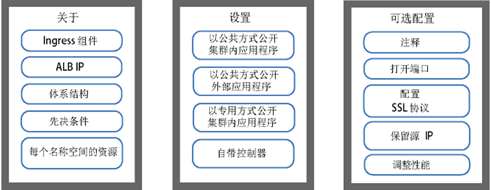
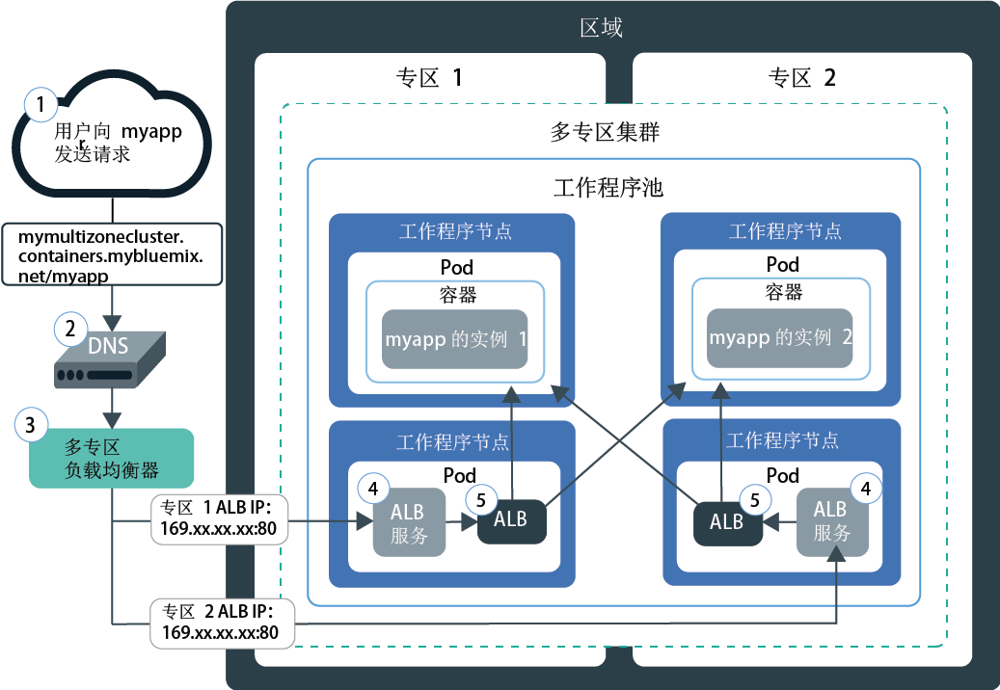
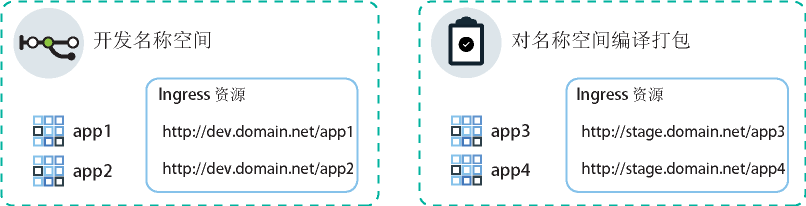
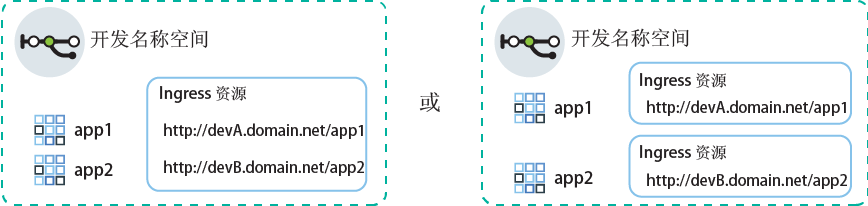

---

copyright:
  years: 2014, 2019
lastupdated: "2019-06-12"

keywords: kubernetes, iks, nginx, ingress controller

subcollection: containers

---

{:new_window: target="_blank"}
{:shortdesc: .shortdesc}
{:screen: .screen}
{:pre: .pre}
{:table: .aria-labeledby="caption"}
{:codeblock: .codeblock}
{:tip: .tip}
{:note: .note}
{:important: .important}
{:deprecated: .deprecated}
{:download: .download}
{:preview: .preview}


# 使用 Ingress 应用程序负载均衡器 (ALB) 进行 HTTPS 负载均衡
{: #ingress}

通过创建在 {{site.data.keyword.containerlong}} 中由 IBM 提供的应用程序负载均衡器管理的 Ingress 资源，公开 Kubernetes 集群中的多个应用程序。
{:shortdesc}



<map name="image-map">
    <area target="" alt="Ingress 组件" title="Ingress 组件" href="#ingress_components" coords="28,42,172,69" shape="rect">
    <area target="" alt="ALB IP" title="ALB IP" href="#ips" coords="27,79,171,104" shape="rect">
    <area target="" alt="体系结构" title="体系结构" href="#architecture-single" coords="31,114,171,140" shape="rect">
    <area target="" alt="先决条件" title="先决条件" href="#config_prereqs" coords="28,151,171,176" shape="rect">
    <area target="" alt="规划单个或多个名称空间的联网" title="规划单个或多个名称空间的联网" href="#multiple_namespaces" coords="31,191,172,229" shape="rect">
    <area target="" alt="向公众公开集群内部应用程序" title="向公众公开集群内部应用程序" href="#ingress_expose_public" coords="275,43,418,78" shape="rect">
    <area target="" alt="向公众公开集群外部应用程序" title="向公众公开集群外部应用程序" href="#external_endpoint" coords="275,94,419,128" shape="rect">
    <area target="" alt="向专用网络公开应用程序" title="向专用网络公开应用程序" href="#ingress_expose_private" coords="277,141,418,177" shape="rect">
    <area target="" alt="自带 Ingress 控制器" title="自带 Ingress 控制器" href="#user_managed" coords="278,192,416,228" shape="rect">
    <area target="" alt="使用注释定制 Ingress 资源" title="使用注释定制 Ingress 资源" href="#annotations" coords="523,44,670,73" shape="rect">
    <area target="" alt="在 Ingress ALB 中打开端口" title="在 Ingress ALB 中打开端口" href="#opening_ingress_ports" coords="521,83,669,105" shape="rect">
    <area target="" alt="在 HTTP 级别配置 SSL 协议和 SSL 密码" title="在 HTTP 级别配置 SSL 协议和 SSL 密码" href="#ssl_protocols_ciphers" coords="523,116,669,158" shape="rect">
    <area target="" alt="保留源 IP 地址" title="保留源 IP 地址" href="#preserve_source_ip" coords="522,167,671,202" shape="rect">
    <area target="" alt="调整 ALB 性能" title="调整 ALB 性能" href="#perf_tuning" coords="524,213,669,237" shape="rect">
</map>

## 样本 YAML
{: #sample_ingress}

使用这些样本 YAML 文件可快速开始指定 Ingress 资源。
{: shortdesc}

**用于通过公共方式公开应用程序的 Ingress 资源**</br>

您是否已完成以下操作？
- 部署应用程序
- 创建应用程序服务
- 选择域名和 TLS 私钥

可以使用以下部署 YAML 来创建 Ingress 资源：

```
apiVersion: extensions/v1beta1
kind: Ingress
metadata:
  name: myingressresource
spec:
  tls:
  - hosts:
    - <domain>
    secretName: <tls_secret_name>
  rules:
  - host: <domain>
    http:
      paths:
      - path: /<app1_path>
        backend:
          serviceName: <app1_service>
          servicePort: 80
      - path: /<app2_path>
        backend:
          serviceName: <app2_service>
          servicePort: 80
```
{: codeblock}

</br>

**用于通过专用方式公开应用程序的 Ingress 资源**</br>

您是否已完成以下操作？
- 启用专用 ALB
- 部署应用程序
- 创建应用程序服务
- 注册定制域名和 TLS 私钥

可以使用以下部署 YAML 来创建 Ingress 资源：

```
apiVersion: extensions/v1beta1
kind: Ingress
metadata:
  name: myingressresource
  annotations:
    ingress.bluemix.net/ALB-ID: "<private_ALB_ID_1>;<private_ALB_ID_2>"
spec:
  tls:
  - hosts:
    - <domain>
    secretName: <tls_secret_name>
  rules:
  - host: <domain>
    http:
      paths:
      - path: /<app1_path>
        backend:
          serviceName: <app1_service>
          servicePort: 80
      - path: /<app2_path>
        backend:
          serviceName: <app2_service>
          servicePort: 80
```
{: codeblock}

<br />


## 什么是 Ingress？
{: #planning}

Ingress 是一种 Kubernetes 服务，通过将公共或专用请求转发到应用程序，均衡集群中的网络流量工作负载。可以使用 Ingress 通过唯一的公共或专用路径，向公共或专用网络公开多个应用程序服务。
{:shortdesc}

### Ingress 随附了哪些组件？
{: #ingress_components}

Ingress 由三个组件组成：
<dl>
<dt>Ingress 资源</dt>
<dd>要使用 Ingress 公开应用程序，必须为应用程序创建 Kubernetes 服务，并通过定义 Ingress 资源向 Ingress 注册此服务。Ingress 资源是一种 Kubernetes 资源，定义了有关如何对应用程序的入局请求进行路由的规则。Ingress 资源还指定应用程序服务的路径，该路径附加到公共路径，以构成唯一的应用程序 URL，例如 `mycluster.us-south.containers.appdomain.cloud/myapp1`。<p class="note">从 2018 年 5 月 24 日开始，更改了新集群的 Ingress 子域格式。新的子域格式中包含的区域或专区名称是根据在其中创建集群的专区生成的。如果您具有对一致应用程序域名的管道依赖项，那么可以使用自己的定制域，而不使用 IBM 提供的 Ingress 子域。<ul><li>对于 2018 年 5 月 24 日之后创建的所有集群，将为其分配新格式的子域：<code>&lt;cluster_name&gt;.&lt;region_or_zone&gt;.containers.appdomain.cloud</code>。</li><li>2018 年 5 月 24 日之前创建的单专区集群将继续使用旧格式的已分配子域：<code>&lt;cluster_name&gt;.&lt;region&gt;.containers.mybluemix.net</code>。</li><li>如果您第一次通过[向集群添加专区](/docs/containers?topic=containers-add_workers#add_zone)来更改在 2018 年 5 月 24 日之前创建的单专区集群，那么集群将继续使用旧格式的已分配子域 <code>&lt;cluster_name&gt;.&lt;region&gt;.containers.mybluemix.net</code>，同时会为其分配使用新格式的子域 <code>&lt;cluster_name&gt;.&lt;region_or_zone&gt;.containers.appdomain.cloud</code>。可以使用其中任一种子域。</li></ul></p>**多专区集群**：Ingress 资源是全局资源，对于多专区集群，每个名称空间只需要一个 Ingress 资源。</dd>
<dt>应用程序负载均衡器 (ALB)</dt>
<dd>应用程序负载均衡器 (ALB) 是一种外部负载均衡器，用于侦听入局 HTTP、HTTPS 或 TCP 服务请求。然后，ALB 会根据 Ingress 资源中定义的规则将请求转发到相应的应用程序 pod。创建标准集群时，{{site.data.keyword.containerlong_notm}} 会自动为集群创建高可用性 ALB，并为其分配唯一公共路径。该公共路径链接到在集群创建期间供应到 IBM Cloud Infrastructure (SoftLayer) 帐户中的可移植公共 IP 地址。另外，还会自动创建缺省专用 ALB，但不会自动启用该 ALB。<br></br>**多专区集群**：向集群添加专区时，会添加一个可移植公用子网，并在该专区的子网上自动创建并启用新的公共 ALB。集群中的所有缺省公共 ALB 都共享一个公共路径，但具有不同的 IP 地址。另外，还会在每个专区中自动创建缺省专用 ALB，但不会自动将其启用。</dd>
<dt>多专区负载均衡器 (MZLB)</dt>
<dd><p>**多专区集群**：在创建多专区集群或者[向单专区集群添加专区](/docs/containers?topic=containers-add_workers#add_zone)时，将自动创建并部署 Cloudflare 多专区负载均衡器 (MZLB)，从而对于每个区域存在 1 个 MZLB。MZLB 将 ALB 的 IP 地址放在同一子域后面，并且对这些 IP 地址启用运行状况检查，以确定它们是否可用。例如，如果工作程序节点位于美国东部区域的 3 个专区中，那么子域 `yourcluster.us-east.containers.appdomain.cloud` 具有 3 个 ALB IP 地址。MZLB 运行状况检查会检查区域的每个专区中的公共 ALB IP，并根据这些运行状况检查使 DNS 查找结果保持更新。例如，如果 ALB 具有 IP 地址 `1.1.1.1`、`2.2.2.2` 和 `3.3.3.3`，那么 Ingress 子域的正常操作 DNS 查找将返回所有 3 个 IP，客户机可以随机访问其中 1 个 IP 地址。如果 IP 地址为 `3.3.3.3` 的 ALB 由于任何原因变为不可用（例如，由于专区故障），那么该专区的运行状况检查将失败，MZLB 会从子域中除去发生故障的 IP，并且 DNS 查找仅返回正常运行的 `1.1.1.1` 和 `2.2.2.2` ALB IP。子域具有 30 秒生存时间 (TTL)，因此在 30 秒后，新客户机应用程序只能访问一个可用且正常运行的 ALB IP。</p><p>在极少数情况下，30 秒 TTL 后，某些 DNS 解析器或客户机应用程序可能会继续使用不正常的 ALB IP。在客户机应用程序放弃 `3.3.3.3` IP 并尝试连接到 `1.1.1.1` 或 `2.2.2.2` 之前，这些客户机应用程序可能会遇到较长的装入时间。根据客户机浏览器或客户机应用程序设置，延迟范围从数秒到完整 TCP 超时不等。</p>
<p>MZLB 仅对使用 IBM 提供的 Ingress 子域的公共 ALB 进行负载均衡。如果仅使用了专用 ALB，那么必须手动检查 ALB 的运行状况，并更新 DNS 查找结果。如果使用的是采用定制域的公共 ALB，那么可以通过在 DNS 条目中创建 CNAME 以在 MZLB 负载均衡中包含这些 ALB，从而将请求从定制域转发到集群的 IBM 提供的 Ingress 子域。</p>
<p class="note">如果使用 Calico DNAT 前网络策略来阻止所有入局流量流至 Ingress 服务，那么还必须将用于检查 ALB 运行状况的 <a href="https://www.cloudflare.com/ips/">Cloudflare 的 IPv4 IP </a> 列入白名单。有关如何创建 Calico DNAT 前策略以将这些 IP 列入白名单的步骤，请参阅 <a href="/docs/containers?topic=containers-policy_tutorial#lesson3">Calico 网络策略教程</a>中的第 3 课。</p></dd>
</dl>

### 如何将 IP 分配给 Ingress ALB？
{: #ips}

创建标准集群时，{{site.data.keyword.containerlong_notm}} 会自动供应可移植公共子网和可移植专用子网。缺省情况下，集群会自动：
* 将可移植公用子网中的 1 个可移植公共 IP 地址用于缺省公共 Ingress ALB。
* 将可移植专用子网中的 1 个可移植专用 IP 地址用于缺省专用 Ingress ALB。
{: shortdesc}

如果您有多专区集群，那么会在每个专区中自动创建缺省公共 ALB 和缺省专用 ALB。缺省公共 ALB 的 IP 地址全部位于 IBM 为您的集群提供的同一子域后面。

可移植公共和专用 IP 地址是静态浮动 IP，不会在除去工作程序节点时更改。如果除去了工作程序节点，那么持续监视 IP 的 `Keepalived` 守护程序会自动将该工作程序上的 ALB pod 重新安排到该专区中的另一个工作程序节点。重新安排的 ALB pod 会保留相同的静态 IP 地址。在集群生命周期内，每个专区中的 ALB IP 地址不会更改。如果从集群中除去专区，那么将除去该专区的 ALB IP 地址。

要查看分配给 ALB 的 IP，可以运行以下命令。
```
     ibmcloud ks albs --cluster <cluster_name_or_id>
     ```
{: pre}

有关在专区发生故障时 ALB IP 会发生什么情况的更多信息，请参阅[多专区负载均衡器组件](#ingress_components)的定义。


### 请求如何通过 Ingress 到达单专区集群中的应用程序？
{: #architecture-single}


下图显示 Ingress 如何将通信从因特网定向到单专区集群中的应用程序：


1. 用户通过访问应用程序的 URL 向应用程序发送请求。此 URL 是已公开应用程序的公共 URL，并附加有 Ingress 资源路径，例如 `mycluster.us-south.containers.appdomain.cloud/myapp`。

2. DNS 系统服务将 URL 中的子域解析为用于公开集群中 ALB 的负载均衡器的可移植公共 IP 地址。

3. 根据解析的 IP 地址，客户机将请求发送到用于公开 ALB 的 LoadBalancer 服务。

4. LoadBalancer 服务将请求路由到 ALB。

5. ALB 会检查集群中 `myapp` 路径的路由规则是否存在。如果找到匹配的规则，那么会根据在 Ingress 资源中定义的规则，将请求转发到部署了应用程序的 pod。包的源 IP 地址将更改为运行应用程序 pod 的工作程序节点的公共 IP 地址。如果集群中部署了多个应用程序实例，那么 ALB 会在应用程序 pod 之间对请求进行负载均衡。

### 请求如何通过 Ingress 到达多专区集群中的应用程序？
{: #architecture-multi}

下图显示 Ingress 如何将通信从因特网定向到多专区集群中的应用程序：



1. 用户通过访问应用程序的 URL 向应用程序发送请求。此 URL 是已公开应用程序的公共 URL，并附加有 Ingress 资源路径，例如 `mycluster.us-south.containers.appdomain.cloud/myapp`。

2. 充当全局负载均衡器的 DNS 系统服务将 URL 中的子域解析为 MZLB 报告为运行状况正常的可用 IP 地址。MZLB 会持续检查用于公开集群的每个专区中公共 ALB 的 LoadBalancer 服务的可移植公共 IP 地址。IP 地址在循环周期中进行解析，确保请求在不同专区中运行状况正常的 ALB 之间进行均匀负载均衡。

3. 客户机向用于公开 ALB 的 LoadBalancer 服务的 IP 地址发送请求。

4. LoadBalancer 服务将请求路由到 ALB。

5. ALB 会检查集群中 `myapp` 路径的路由规则是否存在。如果找到匹配的规则，那么会根据在 Ingress 资源中定义的规则，将请求转发到部署了应用程序的 pod。软件包的源 IP 地址将更改为运行应用程序 pod 的工作程序节点的公共 IP 地址。如果集群中部署了多个应用程序实例，那么 ALB 会在跨所有专区的应用程序 pod 之间对请求进行负载均衡。

<br />


## 先决条件
{: #config_prereqs}

开始使用 Ingress 之前，请查看以下先决条件。
{:shortdesc}

**所有 Ingress 配置的先决条件：**
- Ingress 仅可用于标准集群，并要求至少每个专区有两个工作程序节点以确保高可用性，同时要求定期进行更新。如果专区中只有一个工作程序，那么 ALB 无法接收自动更新。自动更新应用于 ALB pod 时，会重新装入 pod。但是，ALB pod 具有反亲缘关系规则，可确保每个工作程序节点仅安排一个 pod，从而实现高可用性。由于一个工作程序上只有一个 ALB pod，因此该 pod 不会重新启动，这样流量就不会中断。仅当手动删除旧的 pod 时，ALB pod 才会更新为最新版本，这样才可以安排新的已更新 pod。
- 设置 Ingress 需要以下 [{{site.data.keyword.Bluemix_notm}} IAM 角色](/docs/containers?topic=containers-users#platform)：
    - 对集群的**管理员**平台角色
    - 所有名称空间中的**管理者**服务角色

**在多专区集群中使用 Ingress 的先决条件**：
 - 如果将网络流量限制为[边缘工作程序节点](/docs/containers?topic=containers-edge)，那么每个专区必须至少启用 2 个边缘工作程序节点，才可实现 Ingress pod 的高可用性。[创建边缘节点工作程序池](/docs/containers?topic=containers-add_workers#add_pool)，此池跨集群中的所有专区，并且每个专区至少有 2 个工作程序节点。
 - 如果有多个 VLAN 用于一个集群，有多个子网位于同一 VLAN 上或有一个多专区集群，那么必须针对 IBM Cloud Infrastructure (SoftLayer) 帐户启用[虚拟路由器功能 (VRF)](/docs/infrastructure/direct-link?topic=direct-link-overview-of-virtual-routing-and-forwarding-vrf-on-ibm-cloud#overview-of-virtual-routing-and-forwarding-vrf-on-ibm-cloud)，从而使工作程序节点可以在专用网络上相互通信。要启用 VRF，请[联系 IBM Cloud Infrastructure (SoftLayer) 客户代表](/docs/infrastructure/direct-link?topic=direct-link-overview-of-virtual-routing-and-forwarding-vrf-on-ibm-cloud#how-you-can-initiate-the-conversion)。如果无法或不想启用 VRF，请启用 [VLAN 生成](/docs/infrastructure/vlans?topic=vlans-vlan-spanning#vlan-spanning)。要执行此操作，您需要有**网络 > 管理网络 VLAN 生成**[基础架构许可权](/docs/containers?topic=containers-users#infra_access)，也可以请求帐户所有者来启用 VLAN 生成。要检查是否已启用 VLAN 生成，请使用 `ibmcloud ks vlan-spanning-get --region <region>` [命令](/docs/containers?topic=containers-cli-plugin-kubernetes-service-cli#cs_vlan_spanning_get)。
 - 如果某个专区发生故障，那么您可能会看到对该专区中 Ingress ALB 的请求中出现间歇性故障。

<br />


## 规划单个或多个名称空间的联网
{: #multiple_namespaces}

在有要公开的应用程序的每个名称空间中，需要一个 Ingress 资源。
{:shortdesc}

### 所有应用程序位于一个名称空间中
{: #one-ns}

如果集群中的应用程序全部位于同一名称空间中，那么需要一个 Ingress 资源，以定义在其中公开的应用程序的路由规则。例如，如果您有由服务在开发名称空间中公开的 `app1` 和 `app2`，那么可以在该名称空间中创建 Ingress 资源。该资源将 `domain.net` 指定为主机，并向 `domain.net` 注册每个应用程序侦听的路径。
{: shortdesc}


### 应用程序位于多个名称空间中
{: #multi-ns}

如果集群中的应用程序位于不同的名称空间中，那么必须为每个名称空间创建一个资源，以定义在其中公开的应用程序的规则。
{: shortdesc}

但是，一个主机名只能在一个资源中进行定义。不能在多个资源中定义同一主机名。要向同一主机名注册多个 Ingress 资源，必须使用通配符域。如果已注册通配符域（例如 `*.domain.net`），那么多个子域可以全部解析为同一主机。然后，可以在每个名称空间中创建 Ingress 资源，并在每个 Ingress 资源中指定不同的子域。


例如，假设有以下场景：
* 您有同一应用程序的两个版本 `app1` 和 `app3` 用于测试。
* 您将应用程序部署在同一集群的两个不同名称空间中：`app1` 部署在开发名称空间中，`app3` 部署在编译打包名称空间中。

要使用同一集群 ALB 来管理这两个应用程序的流量，请创建以下服务和资源：
* 在开发名称空间中创建 Kubernetes 服务，用于公开 `app1`。
* 在将主机指定为 `dev.domain.net` 的开发名称空间中创建 Ingress 资源。
* 在编译打包名称空间中创建 Kubernetes 服务，用于公开 `app3`。
* 在将主机指定为 `stage.domain.net` 的编译打包名称空间中创建 Ingress 资源。
</br>



现在，这两个 URL 会解析为同一个域，因此都由同一 ALB 进行维护。但是，由于编译打包名称空间中的资源已向 `stage` 子域注册，因此 Ingress ALB 会将来自 `stage.domain.net/app3` URL 的请求正确路由到仅 `app3`。

{: #wildcard_tls}
缺省情况下，已为集群注册 IBM 提供的 Ingress 子域通配符 `*.<cluster_name>.<region>.containers.appdomain.cloud`。IBM 提供的 TLS 证书是通配符证书，可用于通配符子域。如果要使用定制域，您必须将定制域注册为通配符域，例如 `*.custom_domain.net`。要使用 TLS，必须获取通配符证书。
{: note}

### 一个名称空间内多个域
{: #multi-domains}

在单个名称空间中，可以使用一个域来访问该名称空间中的所有应用程序。如果要对单个名称空间中的应用程序使用不同的域，请使用通配符域。如果已注册通配符域（例如 `*.mycluster.us-sous.containers.appdomain.cloud`），那么多个子域将全部解析为同一主机。然后，可以使用一个资源来指定该资源内的多个子域主机。或者，可以在该名称空间中创建多个 Ingress 资源，并在每个 Ingress 资源中指定不同的子域。
{: shortdesc}



缺省情况下，已为集群注册 IBM 提供的 Ingress 子域通配符 `*.<cluster_name>.<region>.containers.appdomain.cloud`。IBM 提供的 TLS 证书是通配符证书，可用于通配符子域。如果要使用定制域，您必须将定制域注册为通配符域，例如 `*.custom_domain.net`。要使用 TLS，必须获取通配符证书。
{: note}

<br />


## 向公众公开集群内部应用程序
{: #ingress_expose_public}

使用公共 Ingress ALB 可向公众公开集群内部应用程序。
{:shortdesc}

开始之前：

* 查看 Ingress [先决条件](#config_prereqs)。
* [登录到您的帐户。如果适用，请将相应的资源组设定为目标。为集群设置上下文。](/docs/containers?topic=containers-cs_cli_install#cs_cli_configure)

### 步骤 1：部署应用程序并创建应用程序服务
{: #public_inside_1}

首先部署应用程序，并创建 Kubernetes 服务来公开这些应用程序。
{: shortdesc}

1.  [将应用程序部署到集群](/docs/containers?topic=containers-app#app_cli)。确保在配置文件的 metadata 部分中向部署添加标签，例如 `app: code`。需要此标签才能识别运行应用程序的所有 pod，以便可以将这些 pod 包含在 Ingress 负载均衡中。

2.   针对要公开的每个应用程序创建 Kubernetes 服务。应用程序必须由 Kubernetes 服务公开才能被集群 ALB 包含在 Ingress 负载均衡中。
      1.  打开首选编辑器，并创建服务配置文件，例如名为 `myappservice.yaml`。
      2.  针对 ALB 将公开的应用程序定义服务。

          ```
          apiVersion: v1
          kind: Service
          metadata:
            name: myappservice
          spec:
            selector:
              <selector_key>: <selector_value>
            ports:
             - protocol: TCP
               port: 8080
          ```
          {: codeblock}

          <table>
          <thead>
          <th colspan=2> 了解 ALB 服务 YAML 文件的组成部分</th>
          </thead>
          <tbody>
          <tr>
          <td><code>selector</code></td>
          <td>输入要用于将运行应用程序的 pod 设定为目标的标签键 (<em>&lt;selector_key&gt;</em>) 和值 (<em>&lt;selector_value&gt;</em>) 对。要将 pod 设定为目标并将其包含在服务负载均衡中，请确保 <em>&lt;selector_key&gt;</em> 和 <em>&lt;selector_value&gt;</em> 与部署 YAML 的 <code>spec.template.metadata.labels</code> 部分中的键/值对相同。</td>
           </tr>
           <tr>
           <td><code>port</code></td>
           <td>服务侦听的端口。</td>
           </tr>
           </tbody></table>
      3.  保存更改。
      4.  在集群中创建服务。如果应用程序部署在集群中的多个名称空间中，请确保该服务部署到要公开的应用程序所在的名称空间中。

          ```
          kubectl apply -f myappservice.yaml [-n <namespace>]
          ```
          {: pre}
      5.  针对要公开的每一个应用程序，重复上述步骤。


### 步骤 2：选择应用程序域
{: #public_inside_2}

配置公共 ALB 时，可以选择可用于访问应用程序的域。
{: shortdesc}

可以使用 IBM 提供的域（例如 `mycluster-12345.us-south.containers.appdomain.cloud/myapp`）通过因特网访问应用程序。要改为使用定制域，可以设置 CNAME 记录，以将定制域映射到 IBM 提供的域，或者通过使用 ALB 公共 IP 地址的 DNS 提供程序设置 A 记录。

**要使用 IBM 提供的 Ingress 域，请执行以下操作：**

获取 IBM 提供的域。将 `<cluster_name_or_ID>` 替换为在其中部署了应用程序的集群的名称。
```
ibmcloud ks cluster-get --cluster <cluster_name_or_ID> | grep Ingress
```
{: pre}

输出示例：
```
Ingress Subdomain:      mycluster-12345.us-south.containers.appdomain.cloud
Ingress Secret:         <tls_secret>
```
{: screen}

**要使用定制域，请执行以下操作：**
1.    创建定制域。要注册定制域，请使用您的域名服务 (DNS) 提供者或 [{{site.data.keyword.Bluemix_notm}} DNS](/docs/infrastructure/dns?topic=dns-getting-started)。
      * 如果希望 Ingress 公开的应用程序位于一个集群的不同名称空间中，请将定制域注册为通配符域，例如 `*.custom_domain.net`。

2.  配置域以将入局网络流量路由到 IBM 提供的 ALB。在以下选项之间进行选择：
    -   通过将 IBM 提供的域指定为规范名称记录 (CNAME)，定义定制域的别名。要查找 IBM 提供的 Ingress 域，请运行 `ibmcloud ks cluster-get --cluster <cluster_name>` 并查找 **Ingress 子域**字段。使用 CNAME 为首选，因为 IBM 在 IBM 子域上提供自动运行状况检查并从 DNS 响应除去任何失败的 IP。
    -   通过将 IBM 提供的 ALB 的可移植公共 IP 地址添加为记录，将定制域映射到该 IP 地址。要查找 ALB 的可移植公共 IP 地址，请运行 `ibmcloud ks alb-get --albID <public_alb_ID>`。

### 步骤 3：选择 TLS 终止
{: #public_inside_3}

选择应用程序域后，可以选择是否使用 TLS 终止。
{: shortdesc}

ALB 会对流至集群中应用程序的 HTTP 网络流量进行负载均衡。要同时对入局 HTTPS 连接进行负载均衡，可以配置 ALB 来解密网络流量，然后将已解密的请求转发到集群中公开的应用程序。

* 如果使用的是 IBM 提供的 Ingress 子域，那么可以使用 IBM 提供的 TLS 证书。IBM 提供的 TLS 证书由 LetsEncrypt 签署，并由 IBM 全面管理。证书将每 90 天到期一次，并在到期前 37 天会自动更新。有关通配符 TLS 证书的信息，请参阅[此注释](#wildcard_tls)。
* 如果您使用定制域，那么可以使用自己的 TLS 证书来管理 TLS 终止。ALB 检查私钥的顺序是：首先检查应用程序所在的名称空间，然后检查 `default`，最后检查 `ibm-cert-store`。如果仅在一个名称空间中具有应用程序，那么可以在同一名称空间中导入或创建证书的 TLS 私钥。如果在多个名称空间中具有应用程序，请在 `default` 名称空间中导入或创建证书的 TLS 私钥，以便 ALB 可以在每个名称空间中访问和使用该证书。在为每个名称空间定义的 Ingress 资源中，指定位于 default 名称空间中的私钥的名称。有关通配符 TLS 证书的信息，请参阅[此注释](#wildcard_tls)。**注**：不支持包含预先共享密钥 (TLS-PSK) 的 TLS 证书。

**如果使用 IBM 提供的 Ingress 域：**

为集群获取 IBM 提供的 TLS 私钥。
```
ibmcloud ks cluster-get --cluster <cluster_name_or_ID> | grep Ingress
```
{: pre}

输出示例：
```
Ingress Subdomain:      mycluster-12345.us-south.containers.appdomain.cloud
Ingress Secret:         <tls_secret>
```
{: screen}
</br>

**如果使用定制域：**

如果要使用存储在 {{site.data.keyword.cloudcerts_long_notm}} 中的 TLS 证书，那么可以通过运行以下命令，将其关联的私钥导入到集群：

```
ibmcloud ks alb-cert-deploy --secret-name <secret_name> --cluster <cluster_name_or_ID> --cert-crn <certificate_crn>
```
{: pre}

确保创建的私钥与 IBM 提供的 Ingress 私钥不同名。通过运行 `ibmcloud ks cluster-get --cluster <cluster_name_or_ID> | grep Ingress`，可以获取 IBM 提供的 Ingress 私钥的名称。
{: note}

使用此命令导入证书时，将在名为 `ibm-cert-store` 的名称空间中创建证书私钥。然后，将在 `default` 名称空间中创建对此私钥的引用，任何名称空间中的任何 Ingress 资源都可以对其进行访问。ALB 处理请求时，会访问此引用来选取并使用 `ibm-cert-store` 名称空间中的证书私钥。

</br>

如果还没有 TLS 证书，请执行以下步骤：
1. 通过证书提供者生成认证中心 (CA) 证书和密钥。如果您有自己的域，请为您的域购买正式的 TLS 证书。请确保每个证书的 [CN ](https://support.dnsimple.com/articles/what-is-common-name/) 都是不同的。
2. 将证书和密钥转换为 Base64。
   1. 将证书和密钥编码为 Base64，并将 Base64 编码的值保存在新文件中。
      ```
      openssl base64 -in tls.key -out tls.key.base64
      ```
      {: pre}

   2. 查看证书和密钥的 Base64 编码值。
      ```
      cat tls.key.base64
      ```
      {: pre}

3. 使用证书和密钥创建私钥 YAML 文件。
     ```
     apiVersion: v1
     kind: Secret
     metadata:
       name: ssl-my-test
     type: Opaque
     data:
       tls.crt: <client_certificate>
       tls.key: <client_key>
     ```
     {: codeblock}

4. 将证书创建为 Kubernetes 私钥。
     ```
     kubectl create -f ssl-my-test
     ```
     {: pre}
     确保创建的私钥与 IBM 提供的 Ingress 私钥不同名。通过运行 `ibmcloud ks cluster-get --cluster <cluster_name_or_ID> | grep Ingress`，可以获取 IBM 提供的 Ingress 私钥的名称。
     {: note}


### 步骤 4：创建 Ingress 资源
{: #public_inside_4}

Ingress 资源定义 ALB 用于将流量路由到应用程序服务的路由规则。
{: shortdesc}

如果集群的多个名称空间中公开了应用程序，那么每个名称空间需要一个 Ingress 资源。但是，每个名称空间都必须使用不同的主机。必须注册通配符域并在每个资源中指定一个不同的子域。有关更多信息，请参阅[规划单个或多个名称空间的联网](#multiple_namespaces)。
{: note}

1. 打开首选编辑器，并创建 Ingress 配置文件，例如名为 `myingressresource.yaml`。

2. 在配置文件中定义 Ingress 资源，该资源使用 IBM 提供的域或定制域将入局网络流量路由到先前创建的服务。

    不使用 TLS 的示例 YAML：
    ```
    apiVersion: extensions/v1beta1
    kind: Ingress
    metadata:
      name: myingressresource
    spec:
      rules:
      - host: <domain>
        http:
          paths:
          - path: /<app1_path>
            backend:
              serviceName: <app1_service>
              servicePort: 80
          - path: /<app2_path>
            backend:
              serviceName: <app2_service>
              servicePort: 80
    ```
    {: codeblock}

    使用 TLS 的示例 YAML：
    ```
    apiVersion: extensions/v1beta1
    kind: Ingress
    metadata:
      name: myingressresource
    spec:
      tls:
      - hosts:
        - <domain>
        secretName: <tls_secret_name>
      rules:
      - host: <domain>
        http:
          paths:
          - path: /<app1_path>
            backend:
              serviceName: <app1_service>
              servicePort: 80
          - path: /<app2_path>
            backend:
              serviceName: <app2_service>
              servicePort: 80
    ```
    {: codeblock}

    <table>
    <thead>
    <th colspan=2> 了解 YAML 文件的组成部分</th>
    </thead>
    <tbody>
    <tr>
    <td><code>tls.hosts</code></td>
    <td>要使用 TLS，请将 <em>&lt;domain&gt;</em> 替换为 IBM 提供的 Ingress 子域或定制域。

    </br></br>
    <strong>注：</strong><ul><li>如果应用程序由服务在一个集群的不同名称空间中公开，请将通配符子域附加到该域的开头，例如 `subdomain1.custom_domain.net` 或 `subdomain1.mycluster.us-south.containers.appdomain.cloud`。请对在集群中创建的每个资源使用唯一子域。</li><li>不要使用 &ast; 表示主机，也不要将主机属性保留为空，以避免创建 Ingress 期间发生失败。</li></ul></td>
    </tr>
    <tr>
    <td><code>tls.secretName</code></td>
    <td><ul><li>如果使用 IBM 提供的 Ingress 域，请将 <em>&lt;tls_secret_name&gt;</em> 替换为 IBM 提供的 Ingress 私钥的名称。</li><li>如果使用定制域，请将 <em>&lt;tls_secret_name&gt;</em> 替换为您先前创建用于保存定制 TLS 证书和密钥的私钥。如果已从 {{site.data.keyword.cloudcerts_short}} 导入证书，那么可以运行 <code>ibmcloud ks alb-cert-get --cluster <cluster_name_or_ID> --cert-crn <certificate_crn></code> 来查看与 TLS 证书关联的私钥。</li><ul><td>
    </tr>
    <tr>
    <td><code>host</code></td>
    <td>将 <em>&lt;domain&gt;</em> 替换为 IBM 提供的 Ingress 子域或定制域。

    </br></br>
    <strong>注：</strong><ul><li>如果应用程序由服务在一个集群的不同名称空间中公开，请将通配符子域附加到该域的开头，例如 `subdomain1.custom_domain.net` 或 `subdomain1.mycluster.us-south.containers.appdomain.cloud`。请对在集群中创建的每个资源使用唯一子域。</li><li>不要使用 &ast; 表示主机，也不要将主机属性保留为空，以避免创建 Ingress 期间发生失败。</li></ul></td>
    </tr>
    <tr>
    <td><code>path</code></td>
    <td>将 <em>&lt;app_path&gt;</em> 替换为斜杠或应用程序正在侦听的路径。该路径将附加到 IBM 提供的域或定制域，以创建应用程序的唯一路径。在 Web 浏览器中输入此路径时，网络流量会路由到 ALB。ALB 会查找关联的服务，并将网络流量发送到该服务。然后，该服务会将流量转发到应用程序在其中运行的 pod。
    </br></br>
            许多应用程序不会侦听特定路径，而是使用根路径和特定端口。在这种情况下，请将根路径定义为 <code>/</code>，并且不要为应用程序指定单独的路径。
                示例：<ul><li>对于 <code>http://domain/</code>，请输入 <code>/</code> 作为路径。</li><li>对于 <code>http://domain/app1_path</code>，请输入 <code>/app1_path</code> 作为路径。</li></ul>
    </br>
    <strong>提示：</strong>要将 Ingress 配置为侦听与应用程序所侦听的路径不同的路径，可以使用 [rewrite 注释](/docs/containers?topic=containers-ingress_annotation#rewrite-path)。</td>
    </tr>
    <tr>
    <td><code>serviceName</code></td>
    <td>将 <em>&lt;app1_service&gt;</em> 和 <em>&lt;app2_service&gt;</em> 等替换为已创建用于公开应用程序的服务的名称。如果应用程序由服务在一个集群的不同名称空间中公开，请仅包含位于同一名称空间中的应用程序服务。必须为要在其中公开应用程序的每个名称空间创建一个 Ingress 资源。</td>
    </tr>
    <tr>
    <td><code>servicePort</code></td>
    <td>服务侦听的端口。使用针对应用程序创建 Kubernetes 服务时定义的端口。</td>
    </tr>
    </tbody></table>

3.  为集群创建 Ingress 资源。确保资源部署到在资源中指定的应用程序服务所在的名称空间中。

    ```
    kubectl apply -f myingressresource.yaml -n <namespace>
    ```
    {: pre}
4.   验证 Ingress 资源是否已成功创建。

      ```
      kubectl describe ingress myingressresource
      ```
      {: pre}

      1. 如果 events 中的消息描述了资源配置中的错误，请更改资源文件中的值，然后将该文件重新应用于资源。


Ingress 资源已在应用程序服务所在的名称空间中创建。此名称空间中的应用程序已向集群的 Ingress ALB 注册。

### 步骤 5：通过因特网访问应用程序
{: #public_inside_5}

在 Web 浏览器中，输入要访问的应用程序服务的 URL。
{: shortdesc}

```
https://<domain>/<app1_path>
```
{: codeblock}

如果公开了多个应用程序，请通过更改附加到该 URL 的路径来访问这些应用程序。

```
https://<domain>/<app2_path>
```
{: codeblock}

如果使用通配符域来公开不同名称空间中的应用程序，请使用其各自的子域来访问这些应用程序。

```
http://<subdomain1>.<domain>/<app1_path>
```
{: codeblock}

```
http://<subdomain2>.<domain>/<app1_path>
```
{: codeblock}


通过 Ingress 连接到应用程序时遇到问题？请尝试[调试 Ingress](/docs/containers?topic=containers-cs_troubleshoot_debug_ingress)。
{: tip}

<br />


## 向公众公开集群外部应用程序
{: #external_endpoint}

通过在公共 Ingress ALB 负载均衡中包含集群外部应用程序，可向公众公开这些应用程序。IBM 提供的域或定制域上的入局公共请求会自动转发到外部应用程序。
{: shortdesc}

开始之前：

* 查看 Ingress [先决条件](#config_prereqs)。
* 确保要包含在集群负载均衡中的外部应用程序可以使用公共 IP 地址进行访问。
* [登录到您的帐户。如果适用，请将相应的资源组设定为目标。为集群设置上下文。](/docs/containers?topic=containers-cs_cli_install#cs_cli_configure)

向公众公开集群外部应用程序：

1.  为集群创建 Kubernetes 服务，以用于将入局请求转发到将创建的外部端点。
    1.  打开首选编辑器，并创建服务配置文件，例如名为 `myexternalservice.yaml`。
    2.  针对 ALB 将公开的应用程序定义服务。

        ```
apiVersion: v1
        kind: Service
        metadata:
          name: myexternalservice
        spec:
          ports:
           - protocol: TCP
             port: 8080
        ```
        {: codeblock}

        <table>
        <caption>了解 ALB 服务文件的组成部分</caption>
        <thead>
        <th colspan=2> 了解 YAML 文件的组成部分</th>
        </thead>
        <tbody>
        <tr>
        <td><code>metadata.name</code></td>
        <td>将 <em><code>&lt;myexternalservice&gt;</code></em> 替换为服务的名称。<p>使用 Kubernetes 资源时，请了解有关[确保个人信息安全](/docs/containers?topic=containers-security#pi)的更多信息。</p></td>
        </tr>
        <tr>
        <td><code>port</code></td>
        <td>服务侦听的端口。</td>
        </tr></tbody></table>

    3.  保存更改。
    4.  为集群创建 Kubernetes 服务。

        ```
                kubectl apply -f myexternalservice.yaml
        ```
        {: pre}
2.  配置 Kubernetes 端点以定义要包含在集群负载均衡中的应用程序的外部位置。
    1.  打开首选编辑器，并创建端点配置文件，例如名为 `myexternalendpoint.yaml`。
    2.  定义外部端点。包括所有可用于访问外部应用程序的公共 IP 地址和端口。


        ```
kind: Endpoints
        apiVersion: v1
        metadata:
          name: myexternalendpoint
        subsets:
          - addresses:
              - ip: <external_IP1>
              - ip: <external_IP2>
            ports:
              - port: <external_port>
        ```
        {: codeblock}

        <table>
        <thead>
        <th colspan=2> 了解 YAML 文件的组成部分</th>
        </thead>
        <tbody>
        <tr>
        <td><code>name</code></td>
        <td>将 <em><code>&lt;myexternalendpoint&gt;</code></em> 替换为先前创建的 Kubernetes 服务的名称。</td>
        </tr>
        <tr>
        <td><code>ip</code></td>
        <td>将 <em>&lt;external_IP&gt;</em> 替换为用于连接到外部应用程序的公共 IP 地址。</td>
         </tr>
         <td><code>port</code></td>
         <td>将 <em>&lt;external_port&gt;</em> 替换为外部应用程序侦听的端口。</td>
         </tbody></table>

    3.  保存更改。
    4.  为集群创建 Kubernetes 端点。

        ```
        kubectl apply -f myexternalendpoint.yaml
        ```
        {: pre}

3. 继续执行“向公众公开集群内部应用程序”中的步骤，从[步骤 2：选择应用程序域](#public_inside_2)开始。

<br />


## 向专用网络公开应用程序
{: #ingress_expose_private}

使用专用 Ingress ALB 可将应用程序公开到专用网络。
{:shortdesc}

要使用专用 ALB，必须先启用专用 ALB。由于未向仅专用 VLAN 集群分配 IBM 提供的 Ingress 子域，因此在集群设置期间不会创建 Ingress 私钥。要将应用程序公开到专用网络，必须向定制域注册 ALB，并且（可选）导入您自己的 TLS 证书。

开始之前：
* 查看 Ingress [先决条件](#config_prereqs)。
* 在工作程序节点连接到[公用和专用 VLAN](/docs/containers?topic=containers-cs_network_planning#private_both_vlans) 或连接到[仅专用 VLAN](/docs/containers?topic=containers-cs_network_planning#plan_private_vlan) 时，查看用于规划应用程序专用访问权的选项。
    * 如果工作程序节点仅连接到专用 VLAN，那么必须配置[专用网络上可用的 DNS 服务 ](https://kubernetes.io/docs/tasks/administer-cluster/dns-custom-nameservers/)。

### 步骤 1：部署应用程序并创建应用程序服务
{: #private_1}

首先部署应用程序，并创建 Kubernetes 服务来公开这些应用程序。
{: shortdesc}

1.  [将应用程序部署到集群](/docs/containers?topic=containers-app#app_cli)。确保在配置文件的 metadata 部分中向部署添加标签，例如 `app: code`。需要此标签才能识别运行应用程序的所有 pod，以便可以将这些 pod 包含在 Ingress 负载均衡中。

2.   针对要公开的每个应用程序创建 Kubernetes 服务。应用程序必须由 Kubernetes 服务公开才能被集群 ALB 包含在 Ingress 负载均衡中。
      1.  打开首选编辑器，并创建服务配置文件，例如名为 `myappservice.yaml`。
      2.  针对 ALB 将公开的应用程序定义服务。

          ```
          apiVersion: v1
          kind: Service
          metadata:
            name: myappservice
          spec:
            selector:
              <selector_key>: <selector_value>
            ports:
             - protocol: TCP
               port: 8080
          ```
          {: codeblock}

          <table>
          <thead>
          <th colspan=2> 了解 ALB 服务 YAML 文件的组成部分</th>
          </thead>
          <tbody>
          <tr>
          <td><code>selector</code></td>
          <td>输入要用于将运行应用程序的 pod 设定为目标的标签键 (<em>&lt;selector_key&gt;</em>) 和值 (<em>&lt;selector_value&gt;</em>) 对。要将 pod 设定为目标并将其包含在服务负载均衡中，请确保 <em>&lt;selector_key&gt;</em> 和 <em>&lt;selector_value&gt;</em> 与部署 YAML 的 <code>spec.template.metadata.labels</code> 部分中的键/值对相同。</td>
           </tr>
           <tr>
           <td><code>port</code></td>
           <td>服务侦听的端口。</td>
           </tr>
           </tbody></table>
      3.  保存更改。
      4.  在集群中创建服务。如果应用程序部署在集群中的多个名称空间中，请确保该服务部署到要公开的应用程序所在的名称空间中。

          ```
          kubectl apply -f myappservice.yaml [-n <namespace>]
          ```
          {: pre}
      5.  针对要公开的每一个应用程序，重复上述步骤。


### 步骤 2：启用缺省专用 ALB
{: #private_ingress}

创建标准集群时，会在具有工作程序节点的每个专区中创建 IBM 提供的专用应用程序负载均衡器 (ALB)，并为其分配可移植专用 IP 地址和专用路径。但是，不会自动启用每个专区中的缺省专用 ALB。要使用缺省专用 ALB 对流至应用程序的专用网络流量进行负载均衡，必须先使用 IBM 提供的可移植专用 IP 地址或您自己的可移植专用 IP 地址来启用此 ALB。
{:shortdesc}

如果在创建集群时使用了 `--no-subnet` 标志，那么必须先添加可移植专用子网或用户管理的子网，然后才能启用专用 ALB。有关更多信息，请参阅[为集群请求更多子网](/docs/containers?topic=containers-subnets#request)。
{: note}

**要使用预先分配的 IBM 提供的可移植专用 IP 地址来启用缺省专用 ALB，请执行以下操作：**

1. 获取要启用的缺省专用 ALB 的标识。将 <em>&lt;cluster_name&gt;</em> 替换为部署了要公开的应用程序的集群的名称。

    ```
    ibmcloud ks albs --cluster <cluster_name>
    ```
    {: pre}

    专用 ALB 的 **Status** 字段为 _disabled_。
    ```
    ALB ID                                            Enabled   Status     Type      ALB IP          Zone    Build                          ALB VLAN ID
    private-crdf253b6025d64944ab99ed63bb4567b6-alb1   false     disabled   private   -               dal10   ingress:411/ingress-auth:315   2234947
    public-crdf253b6025d64944ab99ed63bb4567b6-alb1    true      enabled    public    169.xx.xxx.xxx  dal10   ingress:411/ingress-auth:315   2234945
    ```
    {: screen}
    在多专区集群中，ALB ID 的编号后缀指示添加 ALB 的顺序。
    * 例如，ALB `private-cr6d779503319d419aa3b4ab171d12c3b8-alb1` 的 `-alb1` 后缀指示这是创建的第一个缺省专用 ALB。它位于在其中创建集群的专区中。在以上示例中，集群是在 `dal10` 中创建的。
    * ALB `private-crb2f60e9735254ac8b20b9c1e38b649a5-alb2` 的 `-alb2` 后缀指示这是创建的第二个缺省专用 ALB。它位于添加到集群的第二个专区中。在以上示例中，第二个专区为 `dal12`。

2. 启用专用 ALB。将 <em>&lt;private_ALB_ID&gt;</em> 替换为上一步的输出中专用 ALB 的标识。

   ```
   ibmcloud ks alb-configure --albID <private_ALB_ID> --enable
   ```
   {: pre}

3. **多专区集群**：为实现高可用性，请针对每个专区中的专用 ALB 重复上述步骤。

<br>
**要使用您自己的可移植专用 IP 地址来启用专用 ALB，请执行以下操作：**

1. 为所选 IP 地址配置用户管理的子网，以在集群的专用 VLAN 上路由流量。

   ```
   ibmcloud ks cluster-user-subnet-add --cluster <cluster_name> --subnet-cidr <subnet_CIDR> --private-vlan <private_VLAN>
   ```
   {: pre}

   <table>
   <thead>
   <th colspan=2> 了解命令的组成部分</th>
   </thead>
   <tbody>
   <tr>
   <td><code>&lt;cluster_name&gt;</code></td>
   <td>要公开的应用程序部署所在集群的名称或标识。</td>
   </tr>
   <tr>
   <td><code>&lt;subnet_CIDR&gt;</code></td>
   <td>用户管理的子网的 CIDR。</td>
   </tr>
   <tr>
   <td><code>&lt;private_VLAN_ID&gt;</code></td>
   <td>可用的专用 VLAN 标识。可以通过运行 `ibmcloud ks vlans` 来查找可用专用 VLAN 的标识。</td>
   </tr>
   </tbody></table>

2. 列出集群中的可用 ALB，以获取专用 ALB 的标识。

    ```
    ibmcloud ks albs --cluster <cluster_name>
    ```
    {: pre}

    专用 ALB 的 **Status** 字段为 _disabled_。
    ```
    ALB ID                                            Enabled   Status     Type      ALB IP          Zone    Build                          ALB VLAN ID
    private-crdf253b6025d64944ab99ed63bb4567b6-alb1   false     disabled   private   -               dal10   ingress:411/ingress-auth:315   2234947
    public-crdf253b6025d64944ab99ed63bb4567b6-alb1    true      enabled    public    169.xx.xxx.xxx  dal10   ingress:411/ingress-auth:315   2234945
    ```
    {: screen}

3. 启用专用 ALB。将 <em>&lt;private_ALB_ID&gt;</em> 替换为上一步的输出中专用 ALB 的标识，并将 <em>&lt;user_IP&gt;</em> 替换为要使用的用户管理子网中的 IP 地址。

   ```
   ibmcloud ks alb-configure --albID <private_ALB_ID> --enable --user-ip <user_IP>
   ```
   {: pre}

4. **多专区集群**：为实现高可用性，请针对每个专区中的专用 ALB 重复上述步骤。

### 步骤 3：映射定制域
{: #private_3}

未向仅专用 VLAN 集群分配 IBM 提供的 Ingress 子域。因此，配置专用 ALB 时，请使用定制域来公开应用程序。
{: shortdesc}

**仅专用 VLAN 集群：**

1. 如果工作程序节点连接到仅专用 VLAN，那么必须配置您自己的[在专用网络上可用的 DNS 服务 ](https://kubernetes.io/docs/tasks/administer-cluster/dns-custom-nameservers/)。
2. 通过 DNS 提供程序创建定制域。如果希望 Ingress 公开的应用程序位于一个集群的不同名称空间中，请将定制域注册为通配符域，例如 `*.custom_domain.net`。
3. 使用专用 DNS 服务，通过将 IP 地址添加为 A 记录，将定制域映射到 ALB 的可移植专用 IP 地址。要查找 ALB 的可移植专用 IP 地址，请针对每个 ALB 运行一次 `ibmcloud ks alb-get --albID <private_alb_ID>`。

**专用和公共 VLAN 集群：**

1.    创建定制域。要注册定制域，请使用您的域名服务 (DNS) 提供者或 [{{site.data.keyword.Bluemix_notm}} DNS](/docs/infrastructure/dns?topic=dns-getting-started)。
      * 如果希望 Ingress 公开的应用程序位于一个集群的不同名称空间中，请将定制域注册为通配符域，例如 `*.custom_domain.net`。

2.  通过将 IP 地址添加为 A 记录，将定制域映射到 ALB 的可移植专用 IP 地址。要查找 ALB 的可移植专用 IP 地址，请针对每个 ALB 运行一次 `ibmcloud ks alb-get --albID <private_alb_ID>`。

### 步骤 4：选择 TLS 终止
{: #private_4}

映射定制域后，请选择是否使用 TLS 终止。
{: shortdesc}

ALB 会对流至集群中应用程序的 HTTP 网络流量进行负载均衡。要同时对入局 HTTPS 连接进行负载均衡，可以配置 ALB 来解密网络流量，然后将已解密的请求转发到集群中公开的应用程序。

由于未向仅专用 VLAN 集群分配 IBM 提供的 Ingress 域，因此在集群设置期间不会创建 Ingress 私钥。您可以使用自己的 TLS 证书来管理 TLS 终止。ALB 检查私钥的顺序是：首先检查应用程序所在的名称空间，然后检查 `default`，最后检查 `ibm-cert-store`。如果仅在一个名称空间中具有应用程序，那么可以在同一名称空间中导入或创建证书的 TLS 私钥。如果在多个名称空间中具有应用程序，请在 `default` 名称空间中导入或创建证书的 TLS 私钥，以便 ALB 可以在每个名称空间中访问和使用该证书。在为每个名称空间定义的 Ingress 资源中，指定位于 default 名称空间中的私钥的名称。有关通配符 TLS 证书的信息，请参阅[此注释](#wildcard_tls)。**注**：不支持包含预先共享密钥 (TLS-PSK) 的 TLS 证书。

如果要使用存储在 {{site.data.keyword.cloudcerts_long_notm}} 中的 TLS 证书，那么可以通过运行以下命令，将其关联的私钥导入到集群：

```
ibmcloud ks alb-cert-deploy --secret-name <secret_name> --cluster <cluster_name_or_ID> --cert-crn <certificate_crn>
```
{: pre}

使用此命令导入证书时，将在名为 `ibm-cert-store` 的名称空间中创建证书私钥。然后，将在 `default` 名称空间中创建对此私钥的引用，任何名称空间中的任何 Ingress 资源都可以对其进行访问。ALB 处理请求时，会访问此引用来选取并使用 `ibm-cert-store` 名称空间中的证书私钥。

### 步骤 5：创建 Ingress 资源
{: #private_5}

Ingress 资源定义 ALB 用于将流量路由到应用程序服务的路由规则。
{: shortdesc}

如果集群的多个名称空间中公开了应用程序，那么每个名称空间需要一个 Ingress 资源。但是，每个名称空间都必须使用不同的主机。必须注册通配符域并在每个资源中指定一个不同的子域。有关更多信息，请参阅[规划单个或多个名称空间的联网](#multiple_namespaces)。
{: note}

1. 打开首选编辑器，并创建 Ingress 配置文件，例如名为 `myingressresource.yaml`。

2.  在配置文件中定义 Ingress 资源，该资源使用定制域将入局网络流量路由到先前创建的服务。

    不使用 TLS 的示例 YAML：
    ```
    apiVersion: extensions/v1beta1
    kind: Ingress
    metadata:
      name: myingressresource
      annotations:
        ingress.bluemix.net/ALB-ID: "<private_ALB_ID_1>;<private_ALB_ID_2>"
    spec:
      rules:
      - host: <domain>
        http:
          paths:
          - path: /<app1_path>
            backend:
              serviceName: <app1_service>
              servicePort: 80
          - path: /<app2_path>
            backend:
              serviceName: <app2_service>
              servicePort: 80
    ```
    {: codeblock}

    使用 TLS 的示例 YAML：
    ```
    apiVersion: extensions/v1beta1
    kind: Ingress
    metadata:
      name: myingressresource
      annotations:
        ingress.bluemix.net/ALB-ID: "<private_ALB_ID_1>;<private_ALB_ID_2>"
    spec:
      tls:
      - hosts:
        - <domain>
        secretName: <tls_secret_name>
      rules:
      - host: <domain>
        http:
          paths:
          - path: /<app1_path>
            backend:
              serviceName: <app1_service>
              servicePort: 80
          - path: /<app2_path>
            backend:
              serviceName: <app2_service>
              servicePort: 80
    ```
    {: codeblock}

    <table>
    <thead>
    <th colspan=2> 了解 YAML 文件的组成部分</th>
    </thead>
    <tbody>
    <tr>
    <td><code>ingress.bluemix.net/ALB-ID</code></td>
    <td>将 <em>&lt;private_ALB_ID&gt;</em> 替换为专用 ALB 的标识。如果您有多专区集群且已启用多个专用 ALB，请包含每个 ALB 的标识。运行 <code>ibmcloud ks albs --cluster <my_cluster></code> 以查找 ALB 标识。有关此 Ingress 注释的更多信息，请参阅[专用应用程序负载均衡器路由](/docs/containers?topic=containers-ingress_annotation#alb-id)。</td>
    </tr>
    <tr>
    <td><code>tls.hosts</code></td>
    <td>要使用 TLS，请将 <em>&lt;domain&gt;</em> 替换为定制域。</br></br><strong>注：</strong><ul><li>如果应用程序由服务在一个集群的不同名称空间中公开，请将通配符子域附加到该域的开头，例如 `subdomain1.custom_domain.net`。请对在集群中创建的每个资源使用唯一子域。</li><li>不要使用 &ast; 表示主机，也不要将主机属性保留为空，以避免创建 Ingress 期间发生失败。</li></ul></td>
    </tr>
    <tr>
    <td><code>tls.secretName</code></td>
    <td>将 <em>&lt;tls_secret_name&gt;</em> 替换为先前创建的私钥的名称，此私钥用于保存定制 TLS 证书和密钥。如果已从 {{site.data.keyword.cloudcerts_short}} 导入证书，那么可以运行 <code>ibmcloud ks alb-cert-get --cluster <cluster_name_or_ID> --cert-crn <certificate_crn></code> 来查看与 TLS 证书关联的私钥。
    </tr>
    <tr>
    <td><code>host</code></td>
    <td>将 <em>&lt;domain&gt;</em> 替换为定制域。
    </br></br>
    <strong>注：</strong><ul><li>如果应用程序由服务在一个集群的不同名称空间中公开，请将通配符子域附加到该域的开头，例如 `subdomain1.custom_domain.net`。请对在集群中创建的每个资源使用唯一子域。</li><li>不要使用 &ast; 表示主机，也不要将主机属性保留为空，以避免创建 Ingress 期间发生失败。</li></ul></td>
    </td>
    </tr>
    <tr>
    <td><code>path</code></td>
    <td>将 <em>&lt;app_path&gt;</em> 替换为斜杠或应用程序正在侦听的路径。该路径将附加到定制域，以创建应用程序的唯一路径。在 Web 浏览器中输入此路径时，网络流量会路由到 ALB。ALB 会查找关联的服务，并将网络流量发送到该服务。然后，该服务会将流量转发到应用程序在其中运行的 pod。
    </br></br>
            许多应用程序不会侦听特定路径，而是使用根路径和特定端口。在这种情况下，请将根路径定义为 <code>/</code>，并且不要为应用程序指定单独的路径。
                示例：<ul><li>对于 <code>http://domain/</code>，请输入 <code>/</code> 作为路径。</li><li>对于 <code>http://domain/app1_path</code>，请输入 <code>/app1_path</code> 作为路径。</li></ul>
    </br>
    <strong>提示：</strong>要将 Ingress 配置为侦听与应用程序所侦听的路径不同的路径，可以使用 [rewrite 注释](/docs/containers?topic=containers-ingress_annotation#rewrite-path)。</td>
    </tr>
    <tr>
    <td><code>serviceName</code></td>
    <td>将 <em>&lt;app1_service&gt;</em> 和 <em>&lt;app2_service&gt;</em> 等替换为已创建用于公开应用程序的服务的名称。如果应用程序由服务在一个集群的不同名称空间中公开，请仅包含位于同一名称空间中的应用程序服务。必须为要在其中公开应用程序的每个名称空间创建一个 Ingress 资源。</td>
    </tr>
    <tr>
    <td><code>servicePort</code></td>
    <td>服务侦听的端口。使用针对应用程序创建 Kubernetes 服务时定义的端口。</td>
    </tr>
    </tbody></table>

3.  为集群创建 Ingress 资源。确保资源部署到在资源中指定的应用程序服务所在的名称空间中。

    ```
    kubectl apply -f myingressresource.yaml -n <namespace>
    ```
    {: pre}
4.   验证 Ingress 资源是否已成功创建。

      ```
      kubectl describe ingress myingressresource
      ```
      {: pre}

      1. 如果 events 中的消息描述了资源配置中的错误，请更改资源文件中的值，然后将该文件重新应用于资源。


Ingress 资源已在应用程序服务所在的名称空间中创建。此名称空间中的应用程序已向集群的 Ingress ALB 注册。

### 步骤 6：通过专用网络访问应用程序
{: #private_6}

1. 在访问应用程序之前，请确保可以访问 DNS 服务。
  * 公用和专用 VLAN：要使用缺省外部 DNS 提供程序，必须[配置具有公共访问权的边缘节点](/docs/containers?topic=containers-edge#edge)以及[配置虚拟路由器设备 ](https://www.ibm.com/blogs/bluemix/2017/07/kubernetes-and-bluemix-container-based-workloads-part4/)。
  * 仅限专用 VLAN：必须配置[专用网络上可用的 DNS 服务 ](https://kubernetes.io/docs/tasks/administer-cluster/dns-custom-nameservers/)。

2. 在专用网络防火墙内，在 Web 浏览器中输入应用程序服务的 URL。

```
https://<domain>/<app1_path>
```
{: codeblock}

如果公开了多个应用程序，请通过更改附加到该 URL 的路径来访问这些应用程序。

```
https://<domain>/<app2_path>
```
{: codeblock}

如果使用通配符域来公开不同名称空间中的应用程序，请使用其各自的子域来访问这些应用程序。

```
http://<subdomain1>.<domain>/<app1_path>
```
{: codeblock}

```
http://<subdomain2>.<domain>/<app1_path>
```
{: codeblock}


有关如何使用专用 ALB（带 TLS）来保护跨集群的微服务对微服务通信的全面教程，请查看[此博客帖子 ](https://medium.com/ibm-cloud/secure-microservice-to-microservice-communication-across-kubernetes-clusters-using-a-private-ecbe2a8d4fe2)。
{: tip}

<br />


## 使用注释定制 Ingress 资源
{: #annotations}

要向 Ingress 应用程序负载均衡器 (ALB) 添加功能，可以将特定于 IBM 的注释添加为 Ingress 资源中的元数据。
{: shortdesc}

开始使用一些最常用的注释。
* [redirect-to-https](/docs/containers?topic=containers-ingress_annotation#redirect-to-https)：将不安全的 HTTP 客户机请求转换为 HTTPS。
* [rewrite-path](/docs/containers?topic=containers-ingress_annotation#rewrite-path)：将入局网络流量路由到后端应用程序侦听的其他路径。
* [ssl-services](/docs/containers?topic=containers-ingress_annotation#ssl-services)：使用 TLS 加密流至需要 HTTPS 的上游应用程序的流量。
* [appid-auth](/docs/containers?topic=containers-ingress_annotation#appid-auth)：使用 {{site.data.keyword.appid_full_notm}} 向应用程序进行认证。

* [client-max-body-size](/docs/containers?topic=containers-ingress_annotation#client-max-body-size)：设置客户机可以作为请求一部分发送的主体的最大大小。

仅支持格式为 `ingress.bluemix.net/<annotation>` 的注释。有关受支持注释的完整列表，请参阅[使用注释定制 Ingress](/docs/containers?topic=containers-ingress_annotation)。不支持格式为 `ingress.kubernetes.io/<annotation>`、`kubernetes.io/<annotation>` 和 `nginx.ingress.kubernetes.io/<annotation>` 的注释。
{: note}

<br />


## 在 Ingress ALB 中打开端口
{: #opening_ingress_ports}

缺省情况下，Ingress ALB 中仅公开端口 80 和 443。要公开其他端口，可以编辑 `ibm-cloud-provider-ingress-cm` 配置映射资源。
{:shortdesc}

1. 编辑配置文件中的 `ibm-cloud-provider-ingress-cm` 配置映射资源。

    ```
    kubectl edit cm ibm-cloud-provider-ingress-cm -n kube-system
    ```
    {: pre}

2. 添加 <code>data</code> 部分，并指定公共端口 `80`、`443` 以及要公开的其他任何端口，端口之间以分号 (;) 分隔。

    缺省情况下，端口 80 和 443 已打开。如果要使 80 和 443 保持打开，那么必须在 `public-ports` 字段中包含这两个端口以及您指定的其他任何端口。未指定的任何端口都处于关闭状态。如果启用了专用 ALB，那么还必须在 `private-ports` 字段中指定要保持打开的任何端口。
    {: important}

    ```
apiVersion: v1
    data:
      public-ports: "80;443;<port3>"
      private-ports: "80;443;<port4>"
    kind: ConfigMap
    metadata:
      name: ibm-cloud-provider-ingress-cm
      namespace: kube-system
    ```
    {: codeblock}

    使端口 `80`、`443` 和 `9443` 保持打开的示例：
    ```
     apiVersion: v1
 data:
   public-ports: "80;443;9443"
 kind: ConfigMap
 metadata:
   name: ibm-cloud-provider-ingress-cm
   namespace: kube-system
 ```
    {: screen}

3. 保存配置文件。

4. 验证是否已应用配置映射更改。
  ```
   kubectl get cm ibm-cloud-provider-ingress-cm -n kube-system -o yaml
   ```
  {: pre}

5. 可选：
  * 通过使用 [`tcp-ports`](/docs/containers?topic=containers-ingress_annotation#tcp-ports) 注释打开的非标准 TCP 端口访问应用程序。
  * 将网络流量的缺省端口（对于 HTTP 为端口 80，对于 HTTPS 为端口 443）更改为使用 [`custom-port`](/docs/containers?topic=containers-ingress_annotation#custom-port) 注释打开的端口。


有关配置映射资源的更多信息，请参阅 [Kubernetes 文档](https://kubernetes.io/docs/tasks/configure-pod-container/configure-pod-configmap/)。

<br />


## 保留源 IP 地址
{: #preserve_source_ip}

缺省情况下，不会保留客户机请求的源 IP 地址。对应用程序的客户机请求发送到集群时，该请求会路由到用于公开 ALB 的 LoadBalancer 服务的 pod。如果在 LoadBalancer 服务 pod 所在的工作程序节点上不存在应用程序 pod，那么负载均衡器会将该请求转发到其他工作程序节点上的应用程序 pod。软件包的源 IP 地址将更改为运行应用程序 pod 的工作程序节点的公共 IP 地址。
{: shortdesc}

要保留客户机请求的原始源 IP 地址，可以[启用源 IP 保留 ](https://kubernetes.io/docs/tutorials/services/source-ip/#source-ip-for-services-with-typeloadbalancer)。例如，在应用程序服务器必须应用安全性和访问控制策略的情况下，保留客户机的 IP 非常有用。

如果[禁用 ALB](/docs/containers?topic=containers-cli-plugin-kubernetes-service-cli#cs_alb_configure)，那么对用于公开 ALB 的 LoadBalancer 服务进行的任何源 IP 更改都将丢失。重新启用 ALB 时，必须重新启用源 IP。
{: note}

要启用源 IP 保留，请编辑用于公开 Ingress ALB 的 LoadBalancer 服务：

1. 为单个 ALB 或集群中的所有 ALB 启用源 IP 保留。
    * 为单个 ALB 设置源 IP 保留：
        1. 获取要为其启用源 IP 的 ALB 的标识。ALB 服务的格式类似于 `public-cr18e61e63c6e94b658596ca93d087eed9-alb1`（对于公共 ALB）或 `private-cr18e61e63c6e94b658596ca93d087eed9-alb1`（对于专用 ALB）。
            ```
            kubectl get svc -n kube-system | grep alb
            ```
            {: pre}

        2. 打开用于公开 ALB 的 LoadBalancer 服务的 YAML。
            ```
            kubectl edit svc <ALB_ID> -n kube-system
            ```
            {: pre}

        3. 在 **`spec`** 下，将 **`externalTrafficPolicy`** 的值从 `Cluster` 更改为 `Local`。

        4. 保存并关闭配置文件。输出将类似于以下内容：

            ```
            service "public-cr18e61e63c6e94b658596ca93d087eed9-alb1" edited
            ```
            {: screen}
    * 要为集群中的所有公共 ALB 设置源 IP 保留，请运行以下命令：
        ```
        kubectl get svc -n kube-system | grep alb | awk '{print $1}' | grep "^public" | while read alb; do kubectl patch svc $alb -n kube-system -p '{"spec":{"externalTrafficPolicy":"Local"}}'; done
        ```
        {: pre}

        输出示例：
        ```
        "public-cr18e61e63c6e94b658596ca93d087eed9-alb1", "public-cr17e61e63c6e94b658596ca92d087eed9-alb2" patched
        ```
        {: screen}

    * 要为集群中的所有专用 ALB 设置源 IP 保留，请运行以下命令：
        ```
        kubectl get svc -n kube-system | grep alb | awk '{print $1}' | grep "^private" | while read alb; do kubectl patch svc $alb -n kube-system -p '{"spec":{"externalTrafficPolicy":"Local"}}'; done
        ```
        {: pre}

        输出示例：
        ```
        "private-cr18e61e63c6e94b658596ca93d087eed9-alb1", "private-cr17e61e63c6e94b658596ca92d087eed9-alb2" patched
        ```
        {: screen}

2. 在 ALB pod 日志中验证源 IP 是否得到保留。
    1. 获取修改的 ALB 的 pod 的标识。
        ```
kubectl get pods -n kube-system | grep alb
      ```
        {: pre}

    2. 打开该 ALB pod 的日志。验证 `client` 字段的 IP 地址是否为客户机请求 IP 地址，而不是 LoadBalancer 服务 IP 地址。
        ```
        kubectl logs <ALB_pod_ID> nginx-ingress -n kube-system
        ```
        {: pre}

3. 现在，查找发送到后端应用程序的请求的头时，可以在 `x-forwarded-for` 头中看到客户机 IP 地址。

4. 如果您不再希望保留源 IP，那么可以还原对服务进行的更改。
    * 要还原公共 ALB 的源 IP 保留，请运行以下命令：
        ```
        kubectl get svc -n kube-system | grep alb | awk '{print $1}' | grep "^public" | while read alb; do kubectl patch svc $alb -n kube-system -p '{"spec":{"externalTrafficPolicy":"Cluster"}}'; done
        ```
        {: pre}
    * 要还原专用 ALB 的源 IP 保留，请运行以下命令：
        ```
        kubectl get svc -n kube-system | grep alb | awk '{print $1}' | grep "^private" | while read alb; do kubectl patch svc $alb -n kube-system -p '{"spec":{"externalTrafficPolicy":"Cluster"}}'; done
        ```
        {: pre}

<br />


## 在 HTTP 级别配置 SSL 协议和 SSL 密码
{: #ssl_protocols_ciphers}

通过编辑 `ibm-cloud-provider-ingress-cm` 配置映射，在全局 HTTP 级别启用 SSL 协议和密码。
{:shortdesc}

为了符合 PCI 安全标准委员会的要求，在 2019 年 1 月 23 日即将推出的 Ingress ALB pod 版本更新后，Ingress 服务缺省情况下会禁用 TLS 1.0 和 1.1。更新会自动应用于所有未选择性停用自动 ALB 更新的 {{site.data.keyword.containerlong_notm}} 集群。如果连接到应用程序的客户机支持 TLS 1.2，那么无需任何操作。如果仍然有需要 TLS 1.0 或 1.1 支持的旧客户机，那么必须手动启用所需的 TLS 版本。通过执行此部分中的步骤，可以覆盖缺省设置以使用 TLS 1.1 或 1.0 协议。有关如何查看客户机用于访问应用程序的 TLS 版本的更多信息，请参阅此 [{{site.data.keyword.Bluemix_notm}} 博客帖子](https://www.ibm.com/blogs/bluemix/2018/11/ibm-cloud-kubernetes-service-alb-update-tls-1-0-and-1-1-disabled-by-default/)。
{: important}

如果指定启用的协议用于所有主机，那么仅当使用 OpenSSL 1.0.1 或更高版本时，TLSv1.1 和 TLSv1.2 参数（1.1.13 和 1.0.12）才有效。仅当使用通过 TLSv1.3 支持构建的 OpenSSL 1.1.1 时，TLSv1.3 参数 (1.13.0) 才有效。
{: note}

要编辑配置映射以启用 SSL 协议和密码，请执行以下操作：

1. 编辑配置文件中的 `ibm-cloud-provider-ingress-cm` 配置映射资源。

    ```
    kubectl edit cm ibm-cloud-provider-ingress-cm -n kube-system
    ```
    {: pre}

2. 添加 SSL 协议和密码。根据 [OpenSSL 库密码列表格式 ](https://www.openssl.org/docs/man1.0.2/apps/ciphers.html) 设置密码格式。

   ```
 apiVersion: v1
 data:
   ssl-protocols: "TLSv1 TLSv1.1 TLSv1.2"
   ssl-ciphers: "HIGH:!aNULL:!MD5"
 kind: ConfigMap
 metadata:
   name: ibm-cloud-provider-ingress-cm
   namespace: kube-system
 ```
   {: codeblock}

3. 保存配置文件。

4. 验证是否已应用配置映射更改。

   ```
   kubectl get cm ibm-cloud-provider-ingress-cm -n kube-system -o yaml
   ```
   {: pre}

<br />


## 调整 ALB 性能
{: #perf_tuning}

要优化 Ingress ALB 的性能，可以根据需要更改缺省设置。
{: shortdesc}


### 缩放 ALB
{: #scale_albs}

创建标准集群时，会在具有工作程序节点的每个专区中创建一个公共 ALB 和一个专用 ALB。每个 ALB 每秒可处理 32,768 个连接。但是，如果每秒必须处理 32,768 个以上的连接，那么可以通过创建更多 ALB 来扩展 ALB。
{: shortdesc}

例如，如果您在 `dal10` 中有工作程序节点，那么缺省公共 ALB 存在于 `dal10` 中。此缺省公共 ALB 部署为该专区中的两个工作程序节点上的两个 pod。但是，要每秒处理更多连接数，需要增加 `dal10` 中的 ALB 数。您可以在 `dal10` 中创建另一个公共 ALB。此 ALB 也会部署为 `dal10` 中的两个工作程序节点上的两个 pod。集群中的所有公共 ALB 共享 IBM 分配的同一 Ingress 子域，因此新 ALB 的 IP 地址会自动添加到 Ingress 子域。您无需更改 Ingress 资源文件。

您还可以跨更多专区扩展 ALB。创建多专区集群时，会在具有工作程序节点的每个专区中创建缺省公共 ALB。但是，最多只会在 3 个专区中创建缺省公共 ALB。例如，如果日后除去了原始 3 个专区中的一个专区，并在不同的专区中添加了工作程序，那么不会在该新专区中创建缺省公共 ALB。您可以手动创建 ALB 来处理该新专区中的连接。
{: tip}

1. 在具有工作程序节点的每个专区中，创建 ALB。
  ```
  ibmcloud ks alb-create --cluster <cluster_name_or_ID> --type <public_or_private> --zone <zone> --vlan <VLAN_ID> [--user-ip <IP_address>]
  ```
  {: pre}

  <table>
  <caption>了解此命令的组成部分</caption>
  <thead>
  <th colspan=2> 了解此命令的组成部分</th>
  </thead>
  <tbody>
  <tr>
  <td><code>--cluster &lt;cluster_name_or_ID&gt;</code></td>
  <td>集群的名称或标识。</td>
  </tr>
  <tr>
  <td><code>--type &lt;public_or_private&gt;</code></td>
  <td>ALB 的类型：<code>public</code> 或 <code>private</code>。</td>
  </tr>
  <tr>
  <td><code>--zone &lt;zone&gt;</code></td>
  <td>要在其中创建 ALB 的专区。</td>
  </tr>
  <tr>
  <td><code>--vlan &lt;VLAN_ID&gt;</code></td>
  <td>此 VLAN 必须与 ALB <code>type</code>（public 或 private）相匹配，并且必须位于要创建的 ALB 所在的 <code>zone</code> 中。要查看专区的可用 VLAN，请运行 <code>ibmcloud ks worker-get --cluster &lt;cluster_name_or_ID&gt; --worker &lt;worker_id&gt;</code>，并记下公用或专用 VLAN 的标识。</td>
  </tr>
  <tr>
  <td><code>--user-ip &lt;IP_address&gt;</code></td>
  <td>可选：要分配给 ALB 的 IP 地址。此 IP 必须位于指定的 <code>vlan</code> 上，并且必须位于要创建的 ALB 所在的 <code>zone</code> 中。有关更多信息，请参阅[查看可用的可移植公共 IP 地址](/docs/containers?topic=containers-subnets#managing_ips)。</td>
  </tr>
  </tbody>
  </table>

2. 验证在每个专区中创建的 ALB 的 **Status** 是否为 `enabled`，以及是否分配了 **ALB IP**。
    ```
    ibmcloud ks albs --cluster <cluster_name_or_ID>
    ```
    {: pre}

    集群的示例输出，其中在 `dal10` 和 `dal12` 中创建了标识为 `public-crdf253b6025d64944ab99ed63bb4567b6-alb3` 和 `public-crdf253b6025d64944ab99ed63bb4567b6-alb4` 的新公共 ALB：
    ```
    ALB ID                                            Enabled   Status     Type      ALB IP          Zone    Build                          ALB VLAN ID
    private-crdf253b6025d64944ab99ed63bb4567b6-alb1   false     disabled   private   -               dal12   ingress:411/ingress-auth:315   2294021
    private-crdf253b6025d64944ab99ed63bb4567b6-alb2   false     disabled   private   -               dal10   ingress:411/ingress-auth:315   2234947
    public-crdf253b6025d64944ab99ed63bb4567b6-alb1    true      enabled    public    169.48.228.78   dal12   ingress:411/ingress-auth:315   2294019
    public-crdf253b6025d64944ab99ed63bb4567b6-alb2    true      enabled    public    169.46.17.6     dal10   ingress:411/ingress-auth:315   2234945
    public-crdf253b6025d64944ab99ed63bb4567b6-alb3    true      enabled    public    169.49.28.09    dal12   ingress:411/ingress-auth:315   2294019
    public-crdf253b6025d64944ab99ed63bb4567b6-alb4    true      enabled    public    169.50.35.62    dal10   ingress:411/ingress-auth:315   2234945
    ```
    {: screen}

3. 对于公共 ALB 为可选：使用新 ALB 的 IP 时，验证新的 ALB 是否列在集群的由 IBM 提供的 Ingress 子域下。您可以通过运行 `ibmcloud ks cluster-get --cluster <cluster_name_or_ID>` 来查找此子域。
  ```
  nslookup <Ingress_subdomain>
  ```
  {: pre}

  输出示例：
  ```
  Non-authoritative answer:
  Name:    mycluster.us-south.containers.appdomain.cloud
  Addresses:  169.48.228.78
            169.46.17.6
            169.49.28.09
            169.50.35.62
  ```
  {: screen}

4. 如果日后决定缩减 ALB，那么可以禁用 ALB。例如，您可能希望禁用 ALB 以在工作程序节点上使用较少的计算资源。ALB 禁用后，即不会在集群中路由流量。您可以随时通过运行 `ibmcloud ks alb-configure --albID <ALB_ID> --enable` 来重新启用 ALB。
    ```
        ibmcloud ks alb-configure --albID <ALB_ID> --disable
        ```
    {: pre}


### 启用日志缓冲和清空超时
{: #access-log}

缺省情况下，Ingress ALB 记录到达的每个请求。如果环境使用频繁，那么记录到达的每个请求可能会大幅提升磁盘 I/O 利用率。为避免持续的磁盘 I/O，可以通过编辑 `ibm-cloud-provider-ingress-cm` Ingress 配置映射，针对 ALB 启用日志缓冲和清空超时。在启用缓冲时，不用针对每个日志条目执行单独的写操作，ALB 会缓冲一系列条目并在单个操作中将它们一起写入到文件。
{: shortdesc}

1. 创建并编辑配置文件中的 `ibm-cloud-provider-ingress-cm` 配置映射资源。

    ```
    kubectl edit cm ibm-cloud-provider-ingress-cm -n kube-system
    ```
    {: pre}

2. 编辑配置映射。
    1. 通过添加 `access-log-buffering` 字段并将其设置为 `"true"`，启用日志缓冲。

    2. 设置 ALB 应将缓冲区内容写入日志的阈值。
        * 时间间隔：添加 `flush-interval` 字段并将其设置为 ALB 应写入日志的频率。例如，如果使用缺省值 `5m`，那么 ALB 每 5 分钟将缓冲区内容写入一次日志。
        * 缓冲区大小：添加 `buffer-size` 字段并将其设置为在 ALB 将缓冲区内容写入日志之前可在缓冲区中保留的日志内存量。例如，如果使用缺省值 `100KB`，那么每次缓冲区的日志内容到达 100kb 时，ALB 会将缓冲区内容写入日志。
        * 时间间隔或缓冲区大小：同时设置了 `flush-interval` 和 `buffer-size` 时，ALB 根据首个满足的其中任何一个阈值参数将缓冲区内容写入到日志。

    ```
    apiVersion: v1
    kind: ConfigMap
    data:
      access-log-buffering: "true"
      flush-interval: "5m"
      buffer-size: "100KB"
    metadata:
      name: ibm-cloud-provider-ingress-cm
      ...
    ```
   {: codeblock}

3. 保存配置文件。

4. 验证已使用访问日志更改配置 ALB。

   ```
   kubectl logs -n kube-system <ALB_ID> -c nginx-ingress
   ```
   {: pre}

### 更改保持活动连接的数量或持续时间
{: #keepalive_time}

保持活动连接通过减少打开和关闭连接所需的 CPU 和网络使用量，会对性能产生重大影响。要优化 ALB 的性能，您可以更改 ALB 和客户机之间保持活动连接的最大数量以及保持活动连接可持续的时间。
{: shortdesc}

1. 编辑配置文件中的 `ibm-cloud-provider-ingress-cm` 配置映射资源。

    ```
    kubectl edit cm ibm-cloud-provider-ingress-cm -n kube-system
    ```
    {: pre}

2. 更改 `keep-alive-requests` 和 `keep-alive` 的值。
    * `keep-alive-requests`：可保持向 Ingress ALB 打开的保持活动客户机连接的数量。缺省值为 `4096`。
    * `keep-alive`：超时（以秒为单位），在此期间保持活动客户机连接将保持向 Ingress ALB 打开。缺省值为 `8s`。
   ```
   apiVersion: v1
   data:
     keep-alive-requests: "4096"
     keep-alive: "8s"
   kind: ConfigMap
   metadata:
     name: ibm-cloud-provider-ingress-cm
     namespace: kube-system
   ```
   {: codeblock}

3. 保存配置文件。

4. 验证是否已应用配置映射更改。

   ```
   kubectl get cm ibm-cloud-provider-ingress-cm -n kube-system -o yaml
   ```
   {: pre}


### 更改暂挂连接待办事项
{: #backlog}

您可以针对服务器队列中可等待的暂挂连接数量降低缺省待办事项设置。
{: shortdesc}

在 `ibm-cloud-provider-ingress-cm` Ingress 配置映射中，`backlog` 字段设置可在服务器队列中等待的暂挂连接的最大数量。缺省情况下，`backlog` 设置为 `32768`。可以通过编辑 Ingress 配置映射来覆盖缺省值。

1. 编辑配置文件中的 `ibm-cloud-provider-ingress-cm` 配置映射资源。

    ```
    kubectl edit cm ibm-cloud-provider-ingress-cm -n kube-system
    ```
    {: pre}

2. 将 `backlog` 的值从 `32768` 更改为较小的值。该值必须等于或小于 32768。

   ```
   apiVersion: v1
   data:
     backlog: "32768"
   kind: ConfigMap
   metadata:
     name: ibm-cloud-provider-ingress-cm
     namespace: kube-system
   ```
   {: codeblock}

3. 保存配置文件。

4. 验证是否已应用配置映射更改。

   ```
   kubectl get cm ibm-cloud-provider-ingress-cm -n kube-system -o yaml
   ```
   {: pre}


### 调整内核性能
{: #ingress_kernel}

要优化 Ingress ALB 的性能，您还可以[更改工作程序节点上的 Linux 内核 `sysctl` 参数](/docs/containers?topic=containers-kernel)。根据优化的内核调整自动供应工作程序节点，因此仅在具有特定性能优化需求时才更改这些设置。
{: shortdesc}

<br />


## 在 VLAN 之间移动 ALB
{: #migrate-alb-vlan}

[更改工作程序节点 VLAN 连接](/docs/containers?topic=containers-cs_network_cluster#change-vlans)时，工作程序节点会连接到新 VLAN，并分配有新的公共或专用 IP 地址。但是，ALB 无法自动迁移到新的 VLAN，原因是为 ALB 分配了属于旧 VLAN 的子网中的稳定、可移植公共或专用 IP 地址。工作程序节点与 ALB 连接到不同的 VLAN 时，ALB 无法将入局网络流量转发到工作程序节点的应用程序 pod。要将 ALB 移至其他 VLAN，必须在新 VLAN 上创建 ALB，并禁用旧 VLAN 上的 ALB。
{: shortdesc}

请注意，集群中的所有公共 ALB 都共享 IBM 分配的同一 Ingress 子域。创建新的 ALB 时，无需更改 Ingress 资源文件。

1. 获取每个专区中更改了与其之间的工作程序节点连接的新公用或专用 VLAN。
  1. 列出专区中工作程序的详细信息。
    ```
    ibmcloud ks worker-get --cluster <cluster_name_or_ID> --worker <worker_id>
    ```
    {: pre}

  2. 记下输出中公用或专用 VLAN 的 **ID** 。
    * 要创建公共 ALB，请记下公用 VLAN 标识。
    * 要创建专用 ALB，请记下专用 VLAN 标识。

  3. 对每个专区中的工作程序重复步骤 **a** 和 **b**，以便有每个专区中新的公用或专用 VLAN 的标识。

2. 在每个专区中，在新 VLAN 上创建 ALB。
  ```
  ibmcloud ks alb-create --cluster <cluster_name_or_ID> --type <public_or_private> --zone <zone> --vlan <VLAN_ID> [--user-ip <IP_address>]
  ```
  {: pre}

  <table>
  <caption>了解此命令的组成部分</caption>
  <thead>
  <th colspan=2> 了解此命令的组成部分</th>
  </thead>
  <tbody>
  <tr>
  <td><code>--cluster &lt;cluster_name_or_ID&gt;</code></td>
  <td>集群的名称或标识。</td>
  </tr>
  <tr>
  <td><code>--type &lt;public_or_private&gt;</code></td>
  <td>ALB 的类型：<code>public</code> 或 <code>private</code>。</td>
  </tr>
  <tr>
  <td><code>--zone &lt;zone&gt;</code></td>
  <td>要在其中创建 ALB 的专区。</td>
  </tr>
  <tr>
  <td><code>--vlan &lt;VLAN_ID&gt;</code></td>
  <td>此 VLAN 必须与 ALB <code>type</code>（public 或 private）相匹配，并且必须位于要创建的 ALB 所在的 <code>zone</code> 中。</td>
  </tr>
  <tr>
  <td><code>--user-ip &lt;IP_address&gt;</code></td>
  <td>可选：要分配给 ALB 的 IP 地址。此 IP 必须位于指定的 <code>vlan</code> 上，并且必须位于要创建的 ALB 所在的 <code>zone</code> 中。有关更多信息，请参阅[查看可用的可移植公共 IP 地址](/docs/containers?topic=containers-subnets#managing_ips)。</td>
  </tr>
  </tbody>
  </table>

3. 验证在每个专区中的新 VLAN 上创建的 ALB 的 **Status** 是否为 `enabled`，以及是否分配了 **ALB IP** 地址。
   ```
    ibmcloud ks albs --cluster <cluster_name_or_ID>
    ```
    {: pre}

    集群的示例输出，其中在 `dal12` 中的 VLAN `2294030` 上以及在 `dal10` 中的 VLAN `2234940` 上创建了新的公共 ALB：
    ```
    ALB ID                                            Enabled   Status     Type      ALB IP          Zone    Build                          ALB VLAN ID
    private-crdf253b6025d64944ab99ed63bb4567b6-alb1   false     disabled   private   -               dal12   ingress:411/ingress-auth:315   2294021
    private-crdf253b6025d64944ab99ed63bb4567b6-alb2   false     disabled   private   -               dal10   ingress:411/ingress-auth:315   2234947
    public-crdf253b6025d64944ab99ed63bb4567b6-alb1    true      enabled    public    169.48.228.78   dal12   ingress:411/ingress-auth:315   2294019
    public-crdf253b6025d64944ab99ed63bb4567b6-alb2    true      enabled    public    169.46.17.6     dal10   ingress:411/ingress-auth:315   2234945
    public-crdf253b6025d64944ab99ed63bb4567b6-alb3    true      enabled    public    169.49.28.09    dal12   ingress:411/ingress-auth:315   2294030
    public-crdf253b6025d64944ab99ed63bb4567b6-alb4    true      enabled    public    169.50.35.62    dal10   ingress:411/ingress-auth:315   2234940
    ```
    {: screen}

4. 禁用连接到旧 VLAN 的每个 ALB。
  ```
  ibmcloud ks alb-configure --albID <old_ALB_ID> --disable
  ```
  {: pre}

5. 验证连接到旧 VLAN 的每个 ALB 的 **Status** 是否为 `disabled`。只有连接到新 VLAN 的 ALB 才会收到入局网络流量，并与应用程序 pod 进行通信。
    ```
    ibmcloud ks albs --cluster <cluster_name_or_ID>
    ```
    {: pre}

    集群的示例输出，其中在 `dal12` 中的 VLAN `2294019` 上以及在 `dal10` 中的 VLAN `2234945` 上的缺省公共 ALB 已禁用：
    ```
    ALB ID                                            Enabled   Status     Type      ALB IP          Zone    Build
    private-crdf253b6025d64944ab99ed63bb4567b6-alb1   false     disabled   private   -               dal12   ingress:411/ingress-auth:315   2294021
    private-crdf253b6025d64944ab99ed63bb4567b6-alb2   false     disabled   private   -               dal10   ingress:411/ingress-auth:315   2234947
    public-crdf253b6025d64944ab99ed63bb4567b6-alb1    false     disabled   public    169.48.228.78   dal12   ingress:411/ingress-auth:315   2294019
    public-crdf253b6025d64944ab99ed63bb4567b6-alb2    false     disabled   public    169.46.17.6     dal10   ingress:411/ingress-auth:315   2234945
    public-crdf253b6025d64944ab99ed63bb4567b6-alb3    true      enabled    public    169.49.28.09    dal12   ingress:411/ingress-auth:315   2294030
    public-crdf253b6025d64944ab99ed63bb4567b6-alb4    true      enabled    public    169.50.35.62    dal10   ingress:411/ingress-auth:315   2234940
    ```
    {: screen}

7. 对于公共 ALB 为可选：验证新 ALB 的 IP 是否列在集群的由 IBM 提供的 Ingress 子域下。您可以通过运行 `ibmcloud ks cluster-get --cluster <cluster_name_or_ID>` 来查找此子域。
  ```
  nslookup <Ingress_subdomain>
  ```
  {: pre}

  输出示例：
  ```
  Non-authoritative answer:
  Name:    mycluster.us-south.containers.appdomain.cloud
  Addresses:  169.49.28.09
            169.50.35.62
  ```
  {: screen}

<br />


## 自带 Ingress 控制器
{: #user_managed}

使用自带 Ingress 控制器在 {{site.data.keyword.Bluemix_notm}} 上运行，并利用 IBM 提供的主机名和 TLS 证书。
{: shortdesc}

IBM 提供的 Ingress 应用程序负载均衡器 (ALB) 基于 NGINX 控制器，可以使用[定制 {{site.data.keyword.Bluemix_notm}} 注释](/docs/containers?topic=containers-ingress_annotation)对这些控制器进行配置。根据应用程序需要的内容，您可能希望配置自己的定制 Ingress 控制器。如果自带 Ingress 控制器而不是使用 IBM 提供的 Ingress ALB，那么由您负责提供控制器映像，维护控制器，更新控制器以及执行任何与安全相关的更新，以避免 Ingress 控制器受到漏洞的影响。**注**：仅支持将自带 Ingress 控制器用于提供对您的应用程序的公用外部访问权，但不支持提供专用外部访问权。

对于自带 Ingress 控制器，有 2 个选项：
* [创建网络负载均衡器 (NLB) 以公开定制 Ingress 控制器部署，然后为 NLB IP 地址创建主机名](#user_managed_nlb)。{{site.data.keyword.Bluemix_notm}} 提供主机名并负责为主机名生成和维护通配符 SSL 证书。有关 IBM 提供的 NLB DNS 主机名的更多信息，请参阅[注册 NLB 主机名](/docs/containers?topic=containers-loadbalancer#loadbalancer_hostname)。
* [禁用 IBM 提供的 ALB 部署，并使用公开了 IBM 提供的 Ingress 子域的 ALB 和 DNS 注册的 LoadBalancer 服务](#user_managed_alb)。此选项允许您利用已分配给集群的 Ingress 子域和 TLS 证书。

### 通过创建 NLB 和主机名来公开 Ingress 控制器
{: #user_managed_nlb}

创建网络负载均衡器 (NLB) 以公开定制 Ingress 控制器部署，然后为 NLB IP 地址创建主机名。
{: shortdesc}

1. 准备好 Ingress 控制器的配置文件。例如，可以使用[云通用 NGINX 社区 Ingress 控制器 ](https://github.com/kubernetes/ingress-nginx/tree/master/deploy/cloud-generic)。如果使用社区控制器，请执行以下步骤来编辑 `kustomization.yaml` 文件。
  1. 将 `namespace: ingress-nginx` 替换为 `namespace: kube-system`。
  2. 在 `commonLabels` 部分中，将 `app.kubernetes.io/name: ingress-nginx` 和 `app.kubernetes.io/part-of: ingress-nginx` 标签替换为一个 `app: ingress-nginx` 标签。

2. 部署您自己的 Ingress 控制器。例如，要使用云通用 NGINX 社区 Ingress 控制器，请运行以下命令。
    ```
    kubectl apply --kustomize . -n kube-system
    ```
    {: pre}

3. 定义负载均衡器以公开定制 Ingress 部署。
    ```
    apiVersion: v1
    kind: Service
    metadata:
      name: my-lb-svc
    spec:
      type: LoadBalancer
      selector:
        app: ingress-nginx
      ports:
       - protocol: TCP
             port: 8080
          externalTrafficPolicy: Local
        ```
    {: codeblock}

4. 在集群中创建服务。
    ```
    kubectl apply -f my-lb-svc.yaml
    ```
    {: pre}

5. 获取负载均衡器的 **EXTERNAL-IP** 地址。
   ```
    kubectl get svc my-lb-svc -n kube-system
    ```
    {: pre}

    在以下输出示例中，**EXTERNAL-IP** 为 `168.1.1.1`。
    ```
    NAME         TYPE           CLUSTER-IP       EXTERNAL-IP      PORT(S)            AGE
    my-lb-svc    LoadBalancer   172.21.xxx.xxx   168.1.1.1        80:30104/TCP       2m
    ```
    {: screen}

6. 通过创建 DNS 主机名来注册负载均衡器 IP 地址。
    ```
  ibmcloud ks nlb-dns-create --cluster <cluster_name_or_id> --ip <LB_IP>
  ```
    {: pre}

7. 验证主机名是否已创建。
  ```
  ibmcloud ks nlb-dnss --cluster <cluster_name_or_id>
  ```
  {: pre}

  输出示例：
  ```
  Hostname                                                                                IP(s)              Health Monitor   SSL Cert Status           SSL Cert Secret Name
  mycluster-a1b2cdef345678g9hi012j3kl4567890-0001.us-south.containers.appdomain.cloud     ["168.1.1.1"]      None             created                   <certificate>
  ```
  {: screen}

8. 可选：[通过创建运行状况监视器，启用对主机名的运行状况检查](/docs/containers?topic=containers-loadbalancer#loadbalancer_hostname_monitor)。

9. 部署定制 Ingress 控制器所需的其他任何资源，例如配置映射。

10. 为应用程序创建 Ingress 资源。您可以使用 Kubernetes 文档来创建 [Ingress 资源文件 ](https://kubernetes.io/docs/concepts/services-networking/ingress/) 并使用[注释 ](https://kubernetes.github.io/ingress-nginx/user-guide/nginx-configuration/annotations/)。
  <p class="tip">如果继续在一个集群中同时使用 IBM 提供的 ALB 和定制 Ingress 控制器，那么可以为 ALB 和定制控制器分别创建单独的 Ingress 资源。在[创建的仅适用于 IBM ALB 的 Ingress 资源](/docs/containers?topic=containers-ingress#ingress_expose_public)中，添加注释 <code>kubernetes.io/ingress.class: "iks-nginx"</code>。</p>

11. 使用在步骤 7 中找到的负载均衡器主机名以及在 Ingress 资源文件中指定的供应用程序侦听的路径来访问应用程序。
  ```
  https://<load_blanacer_host_name>/<app_path>
  ```
  {: codeblock}

### 使用现有负载均衡器和 Ingress 子域公开 Ingress 控制器
{: #user_managed_alb}

禁用 IBM 提供的 ALB 部署，并使用公开了 IBM 提供的 Ingress 子域的 ALB 和 DNS 注册的 LoadBalancer 服务。
{: shortdesc}

1. 获取缺省公共 ALB 的标识。公共 ALB 的格式类似于 `public-cr18e61e63c6e94b658596ca93d087eed9-alb1`。
    ```
    kubectl get svc -n kube-system | grep alb
    ```
    {: pre}

2. 禁用缺省公共 ALB。`--disable-deployment` 标志会禁用 IBM 提供的 ALB 部署，但对于 IBM 提供的 Ingress 子域或用于公开 Ingress 控制器的 LoadBalancer 服务，不会除去其 DNS 注册。
    ```
    ibmcloud ks alb-configure --albID <ALB_ID> --disable-deployment
    ```
    {: pre}

3. 准备好 Ingress 控制器的配置文件。例如，可以使用[云通用 NGINX 社区 Ingress 控制器 ](https://github.com/kubernetes/ingress-nginx/tree/master/deploy/cloud-generic)。如果使用社区控制器，请执行以下步骤来编辑 `kustomization.yaml` 文件。
  1. 将 `namespace: ingress-nginx` 替换为 `namespace: kube-system`。
  2. 在 `commonLabels` 部分中，将 `app.kubernetes.io/name: ingress-nginx` 和 `app.kubernetes.io/part-of: ingress-nginx` 标签替换为一个 `app: ingress-nginx` 标签。
  3. 在 `SERVICE_NAME` 变量中，将 `name: ingress-nginx` 替换为 `name: <ALB_ID>`。例如，步骤 1 中的 ALB 标识可能类似于 `name: public-cr18e61e63c6e94b658596ca93d087eed9-alb1`。

4. 部署您自己的 Ingress 控制器。例如，要使用云通用 NGINX 社区 Ingress 控制器，请运行以下命令。**重要信息**：要继续使用用于公开控制器的 LoadBalancer 服务以及 IBM 提供的 Ingress 子域，您的控制器必须部署在 `kubbe-system` 名称空间中。
    ```
    kubectl apply --kustomize . -n kube-system
    ```
    {: pre}

5. 获取定制 Ingress 部署上的标签。
    ```
    kubectl get deploy <ingress-controller-name> -n kube-system --show-labels
    ```
    {: pre}

    在以下输出示例中，标签值为 `ingress-nginx`：
    ```
    NAME                       DESIRED   CURRENT   UP-TO-DATE   AVAILABLE   AGE       LABELS
    nginx-ingress-controller   1         1         1            1           1m        app=ingress-nginx
    ```
    {: screen}

6. 使用步骤 1 中获取的 ALB ID，打开用于公开 IBM ALB 的 LoadBalancer 服务。
    ```
    kubectl edit svc <ALB_ID> -n kube-system
    ```
    {: pre}

7. 更新 LoadBalancer 服务以指向定制 Ingress 部署。在 `spec/selector` 下，从 `app` 标签中除去 ALB 标识，并添加在步骤 5 中获取的您自己 Ingress 控制器的标签。
    ```
    apiVersion: v1
    kind: Service
    metadata:
      ...
    spec:
      clusterIP: 172.21.xxx.xxx
      externalTrafficPolicy: Cluster
      loadBalancerIP: 169.xx.xxx.xxx
      ports:
      - name: http
        nodePort: 31070
        port: 80
        protocol: TCP
        targetPort: 80
      - name: https
        nodePort: 31854
        port: 443
        protocol: TCP
        targetPort: 443
      selector:
        app: <custom_controller_label>
      ...
    ```
    {: codeblock}
    1. 可选：缺省情况下，LoadBalancer 服务允许端口 80 和 443 上的流量。如果定制 Ingress 控制器需要一组不同的端口，请将这些端口添加到 `ports` 部分。

8. 保存并关闭配置文件。输出将类似于以下内容：
    ```
    service "public-cr18e61e63c6e94b658596ca93d087eed9-alb1" edited
    ```
    {: screen}

9. 验证 ALB 的 `Selector` 现在是否指向您的控制器。
    ```
    kubectl describe svc <ALB_ID> -n kube-system
    ```
    {: pre}

    输出示例：
    ```
    Name:                     public-cre58bff97659a4f41bc927362d5a8ee7a-alb1
    Namespace:                kube-system
    Labels:                   app=public-cre58bff97659a4f41bc927362d5a8ee7a-alb1
    Annotations:              service.kubernetes.io/ibm-ingress-controller-public=169.xx.xxx.xxx
                              service.kubernetes.io/ibm-load-balancer-cloud-provider-zone=wdc07
    Selector:                 app=ingress-nginx
    Type:                     LoadBalancer
    IP:                       172.21.xxx.xxx
    IP:                       169.xx.xxx.xxx
    LoadBalancer Ingress:     169.xx.xxx.xxx
    Port:                     port-443  443/TCP
    TargetPort:               443/TCP
    NodePort:                 port-443  30087/TCP
    Endpoints:                172.30.xxx.xxx:443
    Port:                     port-80  80/TCP
    TargetPort:               80/TCP
    NodePort:                 port-80  31865/TCP
    Endpoints:                172.30.xxx.xxx:80
    Session Affinity:         None
    External Traffic Policy:  Cluster
    Events:                   <none>
    ```
    {: screen}

10. 部署定制 Ingress 控制器所需的其他任何资源，例如配置映射。

11. 如果您有多专区集群，请对每个 ALB 重复这些步骤。

12. 如果您有多专区集群，那么必须配置运行状况检查。Cloudflare DNS 运行状况检查端点 `albhealth.<clustername>.<region>.containers.appdomain.com` 预期会收到 `200` 响应，响应中的主体为 `healthy`。如果任何运行状况检查均未设置为返回 `200` 和 `healthy`，那么运行状况检查将从 DNS 池中除去所有 ALB IP 地址。可以编辑现有运行状况检查资源，也可以创建您自己的资源。
  * 要编辑现有运行状况检查资源，请执行以下操作：
      1. 打开 `alb-health` 资源。
        ```
        kubectl edit ingress alb-health --namespace kube-system
        ```
        {: pre}
      2. 在 `metadata.annotations` 部分中，将 `ingress.bluemix.net/server-snippets` 注释名称更改为控制器支持的注释。例如，可使用 `nginx.ingress.kubernetes.io/server-snippet` 注释。不要更改服务器片段的内容。
      3. 保存并关闭文件。更改将自动应用。
  * 要创建您自己的运行状况检查资源，请确保将以下片段返回给 Cloudflare：
    ```
    { return 200 'healthy'; add_header Content-Type text/plain; }
    ```
    {: codeblock}

13. 通过执行[向公众公开集群内部的应用程序](#ingress_expose_public)中的步骤，为应用程序创建 Ingress 资源。

现在，应用程序已由定制 Ingress 控制器公开。要复原 IBM 提供的 ALB 部署，请重新启用该 ALB。该 ALB 会重新部署，并且 LoadBalancer 服务会自动重新配置为指向该 ALB。

```
ibmcloud ks alb-configure --albID <alb ID> --enable
```
{: pre}
