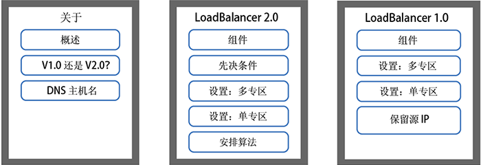
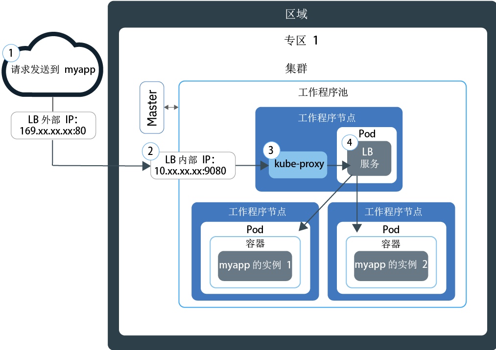
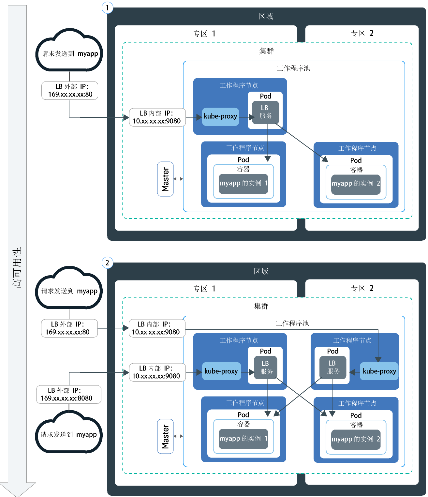
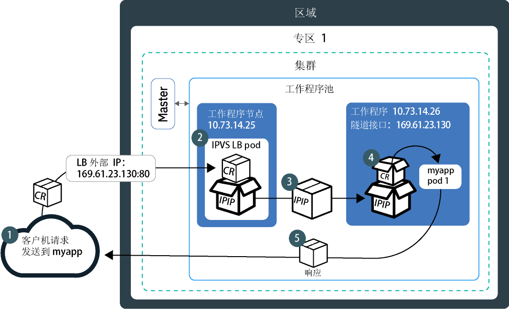

---

copyright:
  years: 2014, 2019
lastupdated: "2019-06-05"

keywords: kubernetes, iks, lb2.0, nlb, health check

subcollection: containers

---

{:new_window: target="_blank"}
{:shortdesc: .shortdesc}
{:screen: .screen}
{:pre: .pre}
{:table: .aria-labeledby="caption"}
{:codeblock: .codeblock}
{:tip: .tip}
{:note: .note}
{:important: .important}
{:deprecated: .deprecated}
{:download: .download}
{:preview: .preview}


# 使用网络负载均衡器 (NLB) 进行基本负载均衡和 DSR 负载均衡
{: #loadbalancer}

公开一个端口，并使用第 4 层网络负载均衡器 (NLB) 的可移植 IP 地址来访问容器化应用程序。
{:shortdesc}

首先，选择下列其中一个选项：


<map name="image-map">
    <area target="" alt="概述" title="概述" href="#lb_overview" coords="35,44,175,72" shape="rect">
    <area target="" alt="比较 V1.0 和 V2.0 负载均衡器" title="比较 V1.0 和 V2.0 负载均衡器" href="#comparison" coords="34,83,173,108" shape="rect">
    <area target="" alt="注册负载均衡器主机名" title="注册负载均衡器主机名" href="#loadbalancer_hostname" coords="33,119,174,146" shape="rect">
    <area target="" alt="V2.0：组件和体系结构 (Beta)" title="V2.0：组件和体系结构 (Beta)" href="#planning_ipvs" coords="273,45,420,72" shape="rect">
    <area target="" alt="V2.0：先决条件" title="V2.0：先决条件" href="#ipvs_provision" coords="277,85,417,108" shape="rect">
    <area target="" alt="V2.0：在多专区集群中设置 Load Balancer 2.0" title="V2.0：在多专区集群中设置 Load Balancer 2.0" href="#ipvs_multi_zone_config" coords="276,122,417,147" shape="rect">
    <area target="" alt="V2.0：在单专区集群中设置 Load Balancer 2.0" title="V2.0：在单专区集群中设置 Load Balancer 2.0" href="#ipvs_single_zone_config" coords="277,156,419,184" shape="rect">
    <area target="" alt="V2.0：调度算法" title="V2.0：调度算法" href="#scheduling" coords="276,196,419,220" shape="rect">
    <area target="" alt="V1.0：组件和体系结构" title="V1.0：组件和体系结构" href="#v1_planning" coords="519,47,668,74" shape="rect">
    <area target="" alt="V1.0：在多专区集群中设置 Load Balancer 1.0" title="V1.0：在多专区集群中设置 Load Balancer 1.0" href="#multi_zone_config" coords="520,85,667,110" shape="rect">
    <area target="" alt="V1.0：在单专区集群中设置 Load Balancer 1.0" title="V1.0：在单专区集群中设置 Load Balancer 1.0" href="#lb_config" coords="520,122,667,146" shape="rect">
    <area target="" alt="V1.0：启用源 IP 保留" title="V1.0：启用源 IP 保留" href="#node_affinity_tolerations" coords="519,157,667,194" shape="rect">
</map>
</br>

要快速开始使用，可以运行以下命令来创建 LoadBalancer 1.0：
```
kubectl expose deploy my-app --port=80 --target-port=8080 --type=LoadBalancer --name my-lb-svc
```
{: pre}

## 概述
{: #lb_overview}

创建标准集群时，{{site.data.keyword.containerlong}} 会自动供应可移植公共子网和可移植专用子网。
{: shortdesc}

* 可移植公用子网提供 5 个可用 IP 地址。1 个可移植公共 IP 地址由缺省[公共 Ingress ALB](/docs/containers?topic=containers-ingress) 使用。剩余 4 个可移植公共 IP 地址可用于通过创建公共网络负载均衡器 (NLB) 服务向因特网公开单个应用程序。
* 可移植专用子网提供 5 个可用 IP 地址。1 个可移植专用 IP 地址由缺省[专用 Ingress ALB](/docs/containers?topic=containers-ingress#private_ingress) 使用。剩余 4 个可移植专用 IP 地址可用于通过创建专用网络负载均衡器 (NLB) 服务向专用网络公开单个应用程序。

可移植公共和专用 IP 地址是静态浮动 IP，不会在除去工作程序节点时更改。如果除去了 NLB IP 地址所在的工作程序节点，那么持续监视该 IP 的保持活动的守护程序会自动将该 IP 移至其他工作程序节点。您可以为 NLB 分配任何端口。NLB 充当应用程序入局请求的外部入口点。要从因特网访问 NLB，可以使用 NLB 的公共 IP 地址以及分配的端口，格式为 `<IP_address>:<port>`。还可以通过向主机名注册 NLB IP 地址，从而为 NLB 创建 DNS 条目。

使用 NLB 服务公开应用程序时，该应用程序还会自动通过服务的 NodePort 可用。在集群内的每个工作程序节点的每个公共和专用 IP 地址上都可以访问 [NodePort](/docs/containers?topic=containers-nodeport)。要在使用 NLB 时阻止流至 NodePort 的流量，请参阅[控制流至网络负载均衡器 (NLB) 或 NodePort 服务的入站流量](/docs/containers?topic=containers-network_policies#block_ingress)。

<br />


## V1.0 和 V2.0 NLB 中基本负载均衡和 DSR 负载均衡的比较
{: #comparison}

创建 NLB 时，可以选择 V1.0 NLB（执行基本负载均衡）或 V2.0 NLB（执行直接服务器返回 (DSR) 负载均衡）。请注意，V2.0 NLB 处于 Beta 阶段。
{: shortdesc}

**V1.0 和 V2.0 NLB 有哪些相似之处？**

V1.0 和 V2.0 NLB 都是仅在 Linux 内核空间中生存的第 4 层负载均衡器。这两个版本都在集群内运行，并使用工作程序节点资源。因此，NLB 的可用容量始终专用于您自己的集群。此外，这两个版本的 NLB 都不会终止连接。而是会将连接转发到应用程序 pod。

**V1.0 和 V2.0 NLB 有哪些不同之处？**

客户机向应用程序发送请求时，NLB 会将请求包路由到应用程序 pod 所在的工作程序节点 IP 地址。V1.0 NLB 会使用网络地址转换 (NAT) 将请求包的源 IP 地址重写为负载均衡器 pod 所在的工作程序节点的 IP。在工作程序节点返回应用程序响应包时，会使用 NLB 所在的工作程序节点 IP。然后，NLB 必须将响应包发送到客户机。为了防止重写 IP 地址，您可以[启用源 IP 保留](#node_affinity_tolerations)。但是，源 IP 保留需要负载均衡器 pod 和应用程序 pod 在同一工作程序上运行，这样请求就不必转发给其他工作程序。为此，您必须向应用程序 pod 添加节点亲缘关系和容忍度。有关使用 V1.0 NB 进行基本负载均衡的更多信息，请参阅 [V1.0：基本负载均衡的组件和体系结构](#v1_planning)。

与 V1.0 NLB 不同，V2.0 NLB 在将请求转发到其他工作程序上的应用程序 pod 时不会使用 NAT。NLB 2.0 路由客户机请求时，会使用 IP-over-IP (IPIP) 将原始请求包封装到另一个新包中。此封装的 IPIP 包具有负载均衡器 pod 所在的工作程序节点的源 IP，这允许原始请求包保留客户机 IP 作为其源 IP 地址。然后，工作程序节点使用直接服务器返回 (DSR) 将应用程序响应包发送到客户机 IP。响应包会跳过 NLB 而直接发送到客户机，从而减少了 NLB 必须处理的流量。有关使用 V2.0 NB 进行 DSR 负载均衡的更多信息，请参阅 [V2.0：DSR 负载均衡的组件和体系结构](#planning_ipvs)。

<br />


## V1.0：基本负载均衡的组件和体系结构
{: #v1_planning}

TCP/UDP 网络负载均衡器 (NLB) 1.0 使用 Iptables（Linux 内核功能）在应用程序的各 pod 中对请求进行负载均衡。
{: shortdesc}

### 单专区集群中的流量流
{: #v1_single}

下图显示 NLB 1.0 如何将来自因特网的通信定向到单专区集群中的应用程序。
{: shortdesc}



1. 发送到应用程序的请求使用 NLB 的公共 IP 地址和工作程序节点上分配的端口。

2. 请求会自动转发到 NLB 服务的内部集群 IP 地址和端口。该内部集群 IP 地址只能在集群内部访问。

3. `kube-proxy` 将请求路由到应用程序的 NLB 服务。

4. 该请求会转发到应用程序 pod 的专用 IP 地址。请求包的源 IP 地址将更改为运行应用程序 pod 的工作程序节点的公共 IP 地址。如果集群中部署了多个应用程序实例，那么 NLB 会在应用程序 pod 之间路由请求。

### 多专区集群中的流量流
{: #v1_multi}

下图显示网络负载均衡器 (NLB) 1.0 如何将来自因特网的通信定向到多专区集群中的应用程序。
{: shortdesc}



缺省情况下，每个 NLB 1.0 仅在一个专区中进行设置。要实现高可用性，必须在具有应用程序实例的每个专区中部署一个 NLB 1.0。请求会由各个专区中的 NLB 循环处理。此外，每个 NLB 都会将请求路由到其自己的专区中的应用程序实例以及其他专区中的应用程序实例。

<br />


## V1.0：在多专区集群中设置 NLB 1.0
{: #multi_zone_config}

**开始之前**：
* 要在多个专区中创建公共网络负载均衡器 (NLB)，至少一个公用 VLAN 必须在每个专区中提供可移植子网。要在多个专区中创建专用 NLB，至少一个专用 VLAN 必须在每个专区中提供可移植子网。您可以执行[配置集群的子网](/docs/containers?topic=containers-subnets)中的步骤来添加子网。
* 如果将网络流量限制为流至边缘工作程序节点，请确保每个专区中至少启用 2 个[边缘工作程序节点](/docs/containers?topic=containers-edge#edge)，以便 NLB 能以均匀方式进行部署。
* 为 IBM Cloud Infrastructure (SoftLayer) 帐户启用 [VLAN 生成](/docs/infrastructure/vlans?topic=vlans-vlan-spanning#vlan-spanning)，以便工作程序节点可以在专用网络上彼此通信。要执行此操作，您需要有**网络 > 管理网络 VLAN 生成**[基础架构许可权](/docs/containers?topic=containers-users#infra_access)，也可以请求帐户所有者来启用 VLAN 生成。要检查是否已启用 VLAN 生成，请使用 `ibmcloud ks vlan-spanning-get --region <region>` [命令](/docs/containers?topic=containers-cli-plugin-kubernetes-service-cli#cs_vlan_spanning_get)。
* 确保您具有对 `default` 名称空间的 [{{site.data.keyword.Bluemix_notm}} IAM **写入者**或**管理者**服务角色](/docs/containers?topic=containers-users#platform)。


要在多专区集群中设置 NLB 1.0 服务，请执行以下操作：
1.  [将应用程序部署到集群](/docs/containers?topic=containers-app#app_cli)。确保在配置文件的 metadata 部分中添加针对您的部署的标签。需要此标签才能识别运行应用程序的所有 pod，以便可以将这些 pod 包含在负载均衡中。

2.  针对要向公用因特网或专用网络公开的应用程序创建 Load Balancer 服务。
  1. 创建名为 `myloadbalancer.yaml`（举例来说）的服务配置文件。
  2. 针对要公开的应用程序定义 LoadBalancer 服务。您可以指定专区、VLAN 和 IP 地址。

      ```
      apiVersion: v1
      kind: Service
      metadata:
        name: myloadbalancer
        annotations:
          service.kubernetes.io/ibm-load-balancer-cloud-provider-ip-type: <public_or_private>
          service.kubernetes.io/ibm-load-balancer-cloud-provider-zone: "<zone>"
          service.kubernetes.io/ibm-load-balancer-cloud-provider-vlan: "<vlan_id>"
      spec:
        type: LoadBalancer
        selector:
          <selector_key>: <selector_value>
        ports:
         - protocol: TCP
             port: 8080
          loadBalancerIP: <IP_address>
        ```
      {: codeblock}

      <table>
      <caption>了解 YAML 文件的组成部分</caption>
      <thead>
      <th colspan=2> 了解 YAML 文件的组成部分</th>
      </thead>
      <tbody>
      <tr>
        <td><code>service.kubernetes.io/ibm-load-balancer-cloud-provider-ip-type:</code>
          <td>用于指定 <code>private</code> 或 <code>public</code> 负载均衡器的注释。</td>
      </tr>
      <tr>
        <td><code>service.kubernetes.io/ibm-load-balancer-cloud-provider-zone:</code>
        <td>用于指定 LoadBalancer 服务部署到的专区的注释。要查看专区，请运行 <code>ibmcloud ks zones</code>。</td>
      </tr>
      <tr>
        <td>`service.kubernetes.io/ibm-load-balancer-cloud-provider-vlan:`
        <td>用于指定 LoadBalancer 服务部署到的 VLAN 的注释。要查看 VLAN，请运行 <code>ibmcloud ks vlans --zone <zone></code>。</td>
      </tr>
      <tr>
        <td><code>selector</code></td>
        <td>在应用程序部署 YAML 的 <code>spec.template.metadata.labels</code> 部分中使用的标签键 (<em>&lt;selector_key&gt;</em>) 和值 (<em>&lt;selector_value&gt;</em>)。</td>
      </tr>
      <tr>
        <td><code>port</code></td>
        <td>服务侦听的端口。</td>
      </tr>
      <tr>
        <td><code>loadBalancerIP</code></td>
        <td>可选：要创建专用负载均衡器或要将特定可移植 IP 地址用于公共负载均衡器，请指定要使用的 IP 地址。该 IP 地址必须位于在注释中指定的 VLAN 和专区上。如果未指定 IP 地址：<ul><li>如果集群位于公用 VLAN 上，那么将使用可移植的公共 IP 地址。大多数集群都位于公用 VLAN 上。</li><li>如果集群仅位于专用 VLAN 上，那么将使用可移植的专用 IP 地址。</li></ul></td>
      </tr>
      </tbody></table>

      用于创建使用 `dal12` 中专用 VLAN `2234945` 上指定 IP 地址的专用 NLB 1.0 服务的示例配置文件：

      ```
      apiVersion: v1
      kind: Service
      metadata:
        name: myloadbalancer
        annotations:
          service.kubernetes.io/ibm-load-balancer-cloud-provider-ip-type: private
          service.kubernetes.io/ibm-load-balancer-cloud-provider-zone: "dal12"
          service.kubernetes.io/ibm-load-balancer-cloud-provider-vlan: "2234945"
      spec:
        type: LoadBalancer
        selector:
          app: nginx
        ports:
         - protocol: TCP
           port: 8080
        loadBalancerIP: 172.21.xxx.xxx
      ```
      {: codeblock}

  3. 可选：通过在 `spec.loadBalancerSourceRanges` 字段中指定 IP，使 NLB 服务仅可用于有限范围的 IP 地址。`loadBalancerSourceRanges` 由集群中的 `kube-proxy` 通过工作程序节点上的 Iptables 规则来实现。有关更多信息，请参阅 [Kubernetes 文档 ](https://kubernetes.io/docs/tasks/access-application-cluster/configure-cloud-provider-firewall/)。

  4. 在集群中创建服务。

      ```
        kubectl apply -f myloadbalancer.yaml
        ```
      {: pre}

3. 验证 NLB 服务是否已成功创建。可能需要几分钟时间，才能创建该服务并使应用程序可用。

    ```
    kubectl describe service myloadbalancer
    ```
    {: pre}

    示例 CLI 输出：

    ```
    Name:                   myloadbalancer
    Namespace:              default
    Labels:                 <none>
    Selector:               app=liberty
    Type:                   LoadBalancer
    Zone:                   dal10
    IP:                     172.21.xxx.xxx
    LoadBalancer Ingress:   169.xx.xxx.xxx
    Port:                   <unset> 8080/TCP
    NodePort:               <unset> 32040/TCP
    Endpoints:              172.30.xxx.xxx:8080
    Session Affinity:       None
    Events:
      FirstSeen	LastSeen	Count	From			SubObjectPath	Type	 Reason			          Message
      ---------	--------	-----	----			-------------	----	 ------			          -------
      10s		    10s		    1	    {service-controller }	  Normal CreatingLoadBalancer	Creating load balancer
      10s		    10s		    1	    {service-controller }		Normal CreatedLoadBalancer	Created load balancer
    ```
    {: screen}

    **LoadBalancer Ingress** IP 地址是分配给 NLB 服务的可移植 IP 地址。

4.  如果创建了公共 NLB，请从因特网访问该应用程序。
    1.  打开首选的 Web 浏览器。
    2.  输入 NLB 的可移植公共 IP 地址和端口。

        ```
        http://169.xx.xxx.xxx:8080
        ```
        {: codeblock}    

5. 重复步骤 2 - 4，以在每个专区中添加一个 V1.0 NLB。    

6. 如果选择[为 NLB 1.0 服务启用源 IP 保留](#node_affinity_tolerations)，请确保通过[向应用程序 pod 添加边缘节点亲缘关系](#lb_edge_nodes)，将应用程序 pod 安排到边缘工作程序节点。应用程序 pod 必须安排到边缘节点才能接收入局请求。

7. 可选：LoadBalancer 服务还可使应用程序在服务的 NodePort 上可用。对于集群内的每个节点，在每个公共和专用 IP 地址上都可以访问 [NodePort](/docs/containers?topic=containers-nodeport)。要在使用 NLB 服务时阻止流至 NodePort 的流量，请参阅[控制流至网络负载均衡器 (NLB) 或 NodePort 服务的入站流量](/docs/containers?topic=containers-network_policies#block_ingress)。

接下来，可以[注册 NLB 主机名](#loadbalancer_hostname)。

<br />


## V1.0：在单专区集群中设置 NLB 1.0
{: #lb_config}

**开始之前**：
* 必须有可用的可移植公共或专用 IP 地址可分配给网络负载均衡器 (NLB) 服务。有关更多信息，请参阅[配置集群的子网](/docs/containers?topic=containers-subnets)。
* 确保您具有对 `default` 名称空间的 [{{site.data.keyword.Bluemix_notm}} IAM **写入者**或**管理者**服务角色](/docs/containers?topic=containers-users#platform)。

要在单专区集群中创建 NLB 1.0 服务，请执行以下操作：

1.  [将应用程序部署到集群](/docs/containers?topic=containers-app#app_cli)。确保在配置文件的 metadata 部分中添加针对您的部署的标签。需要此标签才能识别运行应用程序的所有 pod，以便可以将这些 pod 包含在负载均衡中。
2.  针对要向公用因特网或专用网络公开的应用程序创建 Load Balancer 服务。
    1.  创建名为 `myloadbalancer.yaml`（举例来说）的服务配置文件。

    2.  针对要公开的应用程序定义 LoadBalancer 服务。
        ```
        apiVersion: v1
        kind: Service
        metadata:
          name: myloadbalancer
          annotations:
            service.kubernetes.io/ibm-load-balancer-cloud-provider-ip-type: <public_or_private>
            service.kubernetes.io/ibm-load-balancer-cloud-provider-vlan: "<vlan_id>"
        spec:
          type: LoadBalancer
          selector:
            <selector_key>: <selector_value>
          ports:
           - protocol: TCP
             port: 8080
          loadBalancerIP: <IP_address>
          externalTrafficPolicy: Local
        ```
        {: codeblock}

        <table>
        <caption>了解 YAML 文件的组成部分</caption>
        <thead>
        <th colspan=2> 了解 YAML 文件的组成部分</th>
        </thead>
        <tbody>
        <tr>
          <td>`service.kubernetes.io/ibm-load-balancer-cloud-provider-ip-type:`
          <td>用于指定 <code>private</code> 或 <code>public</code> 负载均衡器的注释。</td>
        </tr>
        <tr>
          <td>`service.kubernetes.io/ibm-load-balancer-cloud-provider-vlan:`
          <td>用于指定 LoadBalancer 服务部署到的 VLAN 的注释。要查看 VLAN，请运行 <code>ibmcloud ks vlans --zone <zone></code>。</td>
        </tr>
        <tr>
          <td><code>selector</code></td>
          <td>在应用程序部署 YAML 的 <code>spec.template.metadata.labels</code> 部分中使用的标签键 (<em>&lt;selector_key&gt;</em>) 和值 (<em>&lt;selector_value&gt;</em>)。</td>
        </tr>
        <tr>
          <td><code>port</code></td>
          <td>服务侦听的端口。</td>
        </tr>
        <tr>
          <td><code>loadBalancerIP</code></td>
          <td>可选：要创建专用负载均衡器或要将特定可移植 IP 地址用于公共负载均衡器，请指定要使用的 IP 地址。该 IP 地址必须位于在注释中指定的 VLAN 上。如果未指定 IP 地址：<ul><li>如果集群位于公用 VLAN 上，那么将使用可移植的公共 IP 地址。大多数集群都位于公用 VLAN 上。</li><li>如果集群仅位于专用 VLAN 上，那么将使用可移植的专用 IP 地址。</li></ul></td>
        </tr>
        </tbody></table>

        用于创建使用专用 VLAN `2234945` 上指定 IP 地址的专用 NLB 1.0 服务的示例配置文件：

        ```
        apiVersion: v1
        kind: Service
        metadata:
          name: myloadbalancer
          annotations:
            service.kubernetes.io/ibm-load-balancer-cloud-provider-ip-type: private
            service.kubernetes.io/ibm-load-balancer-cloud-provider-vlan: "2234945"
        spec:
          type: LoadBalancer
          selector:
            app: nginx
          ports:
           - protocol: TCP
             port: 8080
          loadBalancerIP: 172.21.xxx.xxx
        ```
        {: codeblock}

    3. 可选：通过在 `spec.loadBalancerSourceRanges` 字段中指定 IP，使 NLB 服务仅可用于有限范围的 IP 地址。`loadBalancerSourceRanges` 由集群中的 `kube-proxy` 通过工作程序节点上的 Iptables 规则来实现。有关更多信息，请参阅 [Kubernetes 文档 ](https://kubernetes.io/docs/tasks/access-application-cluster/configure-cloud-provider-firewall/)。

    4.  在集群中创建服务。

        ```
        kubectl apply -f myloadbalancer.yaml
        ```
        {: pre}

3.  验证 NLB 服务是否已成功创建。可能需要几分钟时间，才能创建该服务并使应用程序可用。

    ```
    kubectl describe service myloadbalancer
    ```
    {: pre}

    示例 CLI 输出：

    ```
Name:                   myloadbalancer
    Namespace:              default
    Labels:                 <none>
    Selector:               app=liberty
    Type:                   LoadBalancer
    Location:               dal10
    IP:                     172.21.xxx.xxx
    LoadBalancer Ingress:   169.xx.xxx.xxx
    Port:                   <unset> 8080/TCP
    NodePort:               <unset> 32040/TCP
    Endpoints:              172.30.xxx.xxx:8080
    Session Affinity:       None
    Events:
      FirstSeen	LastSeen	Count	From			SubObjectPath	Type	 Reason			          Message
      ---------	--------	-----	----			-------------	----	 ------			          -------
      10s		    10s		    1	    {service-controller }	  Normal CreatingLoadBalancer	Creating load balancer
      10s		    10s		    1	    {service-controller }		Normal CreatedLoadBalancer	Created load balancer
    ```
    {: screen}

    **LoadBalancer Ingress** IP 地址是分配给 NLB 服务的可移植 IP 地址。

4.  如果创建了公共 NLB，请从因特网访问该应用程序。
    1.  打开首选的 Web 浏览器。
    2.  输入 NLB 的可移植公共 IP 地址和端口。

        ```
        http://169.xx.xxx.xxx:8080
        ```
        {: codeblock}

5. 如果选择[为 NLB 1.0 服务启用源 IP 保留](#node_affinity_tolerations)，请确保通过[向应用程序 pod 添加边缘节点亲缘关系](#lb_edge_nodes)，将应用程序 pod 安排到边缘工作程序节点。应用程序 pod 必须安排到边缘节点才能接收入局请求。

6. 可选：LoadBalancer 服务还可使应用程序在服务的 NodePort 上可用。对于集群内的每个节点，在每个公共和专用 IP 地址上都可以访问 [NodePort](/docs/containers?topic=containers-nodeport)。要在使用 NLB 服务时阻止流至 NodePort 的流量，请参阅[控制流至网络负载均衡器 (NLB) 或 NodePort 服务的入站流量](/docs/containers?topic=containers-network_policies#block_ingress)。

接下来，可以[注册 NLB 主机名](#loadbalancer_hostname)。

<br />


## V1.0：启用源 IP 保留
{: #node_affinity_tolerations}

此功能仅适用于 V1.0 网络负载均衡器 (NLB)。缺省情况下，V2.0 NLB 中会保留客户机请求的源 IP 地址。
{: note}

对应用程序的客户机请求发送到集群时，LoadBalancer 服务 pod 会收到该请求。如果在 LoadBalancer 服务 pod 所在的工作程序节点上不存在应用程序 pod，那么 NLB 会将该请求转发到其他工作程序节点上的应用程序 pod。包的源 IP 地址将更改为运行 LoadBalancer 服务 pod 的工作程序节点的公共 IP 地址。
{: shortdesc}

要保留客户机请求的原始源 IP 地址，可以为 LoadBalancer 服务[启用源 IP ](https://kubernetes.io/docs/tasks/access-application-cluster/create-external-load-balancer/#preserving-the-client-source-ip)。TCP 连接会一直连接到应用程序 pod，以便应用程序可以查看发起方的实际源 IP 地址。例如，在应用程序服务器必须应用安全性和访问控制策略的情况下，保留客户机的 IP 非常有用。

启用源 IP 后，LoadBalancer 服务 pod 必须将请求转发到仅部署到同一工作程序节点的应用程序 pod。通常，LoadBalancer 服务 pod 也会部署到应用程序 pod 所部署到的工作程序节点上。但是，在某些情况下，负载均衡器 pod 和应用程序 pod 可能未安排到同一工作程序节点上：


* 您具有有污点的边缘节点，所以只有 LoadBalancer 服务 pod 才能部署到这些节点。不允许应用程序 pod 部署到这些节点。
* 集群连接到多个公用或专用 VLAN，但应用程序 pod 可能会部署到仅连接到一个 VLAN 的工作程序节点。LoadBalancer 服务 pod 可能不会部署到这些工作程序节点，因为 NLB IP 地址连接到的 VLAN 与工作程序节点连接到的不同。

要强制将应用程序部署到 LoadBalancer 服务 pod 也可以部署到的特定工作程序节点，必须将亲缘关系规则和容忍度添加到应用程序部署。

### 添加边缘节点亲缘关系规则和容忍度
{: #lb_edge_nodes}

[将工作程序节点标注为边缘节点](/docs/containers?topic=containers-edge#edge_nodes)并且还[污染边缘节点](/docs/containers?topic=containers-edge#edge_workloads)后，LoadBalancer 服务 pod 仅部署到这些边缘节点，应用程序 pod 无法部署到边缘节点。为 NLB 服务启用源 IP 后，边缘节点上的负载均衡器 pod 无法将入局请求转发到其他工作程序节点上的应用程序 pod。
{:shortdesc}

要强制应用程序 pod 部署到边缘节点，请将边缘节点[亲缘关系规则 ](https://kubernetes.io/docs/concepts/configuration/assign-pod-node/#node-affinity-beta-feature) 和[容忍度 ](https://kubernetes.io/docs/concepts/configuration/taint-and-toleration/#concepts) 添加到应用程序部署。

具有边缘节点亲缘关系和边缘节点容忍度的示例部署 YAML 文件：

```
apiVersion: apps/v1
kind: Deployment
metadata:
  name: with-node-affinity
spec:
  selector:
    matchLabels:
      <label_name>: <label_value>
  template:
    spec:
      affinity:
        nodeAffinity:
          requiredDuringSchedulingIgnoredDuringExecution:
            nodeSelectorTerms:
            - matchExpressions:
              - key: dedicated
                operator: In
                values:
                - edge
      tolerations:
        - key: dedicated
          value: edge
...
```
{: codeblock}

**affinity** 和 **tolerations** 部分都将 `dedicated` 作为 `key`，将 `edge` 作为 `value`。

### 为多个公用或专用 VLAN 添加亲缘关系规则
{: #edge_nodes_multiple_vlans}

集群连接到多个公用或专用 VLAN 时，应用程序 pod 可能会部署到仅连接到一个 VLAN 的工作程序节点。如果 NLB IP 地址连接到的 VLAN 与这些工作程序节点连接到的不同，那么 LoadBalancer 服务 pod 不会部署到这些工作程序节点。
{:shortdesc}

启用源 IP 后，通过将亲缘关系规则添加到应用程序部署，将应用程序 pod 安排在 NLB 的 IP 地址所在 VLAN 中的工作程序节点上。

开始之前：[登录到您的帐户。如果适用，请将相应的资源组设定为目标。为集群设置上下文。](/docs/containers?topic=containers-cs_cli_install#cs_cli_configure)

1. 获取 NLB 服务的 IP 地址。在 **LoadBalancer Ingress** 字段中查找该 IP 地址。
    ```
    kubectl describe service <loadbalancer_service_name>
    ```
    {: pre}

2. 检索 NLB 服务连接到的 VLAN 标识。

    1. 列出集群的可移植公用 VLAN。
        ```
        ibmcloud ks cluster-get --cluster <cluster_name_or_ID> --showResources
        ```
        {: pre}

        输出示例：
        ```
        ...

        Subnet VLANs
        VLAN ID   Subnet CIDR       Public   User-managed
        2234947   10.xxx.xx.xxx/29  false    false
        2234945   169.36.5.xxx/29   true     false
        ```
        {: screen}

    2. 在输出的 **Subnet VLANs** 下，查找与先前检索到的 NLB IP 地址相匹配的子网 CIDR，并记下相应的 VLAN 标识。

        例如，如果 NLB 服务 IP 地址为 `169.36.5.xxx`，那么上一步的输出示例中的匹配子网为 `169.36.5.xxx/29`。该子网连接到的 VLAN 标识为 `2234945`。

3. 向上一步中记录的 VLAN 标识的应用程序部署[添加亲缘关系规则 ](https://kubernetes.io/docs/concepts/configuration/assign-pod-node/#node-affinity-beta-feature)。

    例如，如果您有多个 VLAN，但希望应用程序 pod 仅部署到 `2234945` 公用 VLAN 上的工作程序节点：

    ```
    apiVersion: apps/v1
    kind: Deployment
    metadata:
      name: with-node-affinity
    spec:
      selector:
        matchLabels:
          <label_name>: <label_value>
      template:
        spec:
          affinity:
            nodeAffinity:
              requiredDuringSchedulingIgnoredDuringExecution:
                nodeSelectorTerms:
                - matchExpressions:
                  - key: publicVLAN
                    operator: In
                    values:
                    - "2234945"
    ...
    ```
    {: codeblock}

    在示例 YAML 中，**affinity** 部分将 `publicVLAN` 作为 `key`，将 `"2234945"` 作为 `value`。

4. 应用已更新的部署配置文件。
    ```
    kubectl apply -f with-node-affinity.yaml
    ```
    {: pre}

5. 验证应用程序 pod 是否已部署到连接至指定 VLAN 的工作程序节点。

    1. 列出集群中的 pod。将 `<selector>` 替换为用于应用程序的标签。
        ```
        kubectl get pods -o wide app=<selector>
        ```
        {: pre}

        输出示例：
        ```
        NAME                   READY     STATUS              RESTARTS   AGE       IP               NODE
        cf-py-d7b7d94db-vp8pq  1/1       Running             0          15d       172.30.xxx.xxx   10.176.48.78
        ```
        {: screen}

    2. 在输出中，确定应用程序的 pod。记下该 pod 所在的工作程序节点的 **NODE** 标识。

        在上一步的输出示例中，应用程序 pod `cf-py-d7b7d94db-vp8pq` 位于工作程序节点 `10.176.48.78` 上。

    3. 列出工作程序节点的详细信息。

        ```
        kubectl describe node <worker_node_ID>
        ```
        {: pre}

        输出示例：

        ```
        Name:                   10.xxx.xx.xxx
        Role:
        Labels:                 arch=amd64
                                beta.kubernetes.io/arch=amd64
                                beta.kubernetes.io/os=linux
                                failure-domain.beta.kubernetes.io/region=us-south
                                failure-domain.beta.kubernetes.io/zone=dal10
                                ibm-cloud.kubernetes.io/encrypted-docker-data=true
                                kubernetes.io/hostname=10.xxx.xx.xxx
                                privateVLAN=2234945
                                publicVLAN=2234967
        ...
        ```
        {: screen}

    4. 在输出的 **Labels** 部分中，验证公用或专用 VLAN 是否为在先前步骤中指定的 VLAN。

<br />


## V2.0：组件和体系结构 (beta)
{: #planning_ipvs}

网络负载均衡器 (NLB) 2.0 功能处于 Beta 阶段。要使用 NLB 2.0，必须[更新集群的主节点和工作程序节点](/docs/containers?topic=containers-update)至 Kubernetes V1.12 或更高版本。
{: note}

NLB 2.0 是使用 Linux 内核的 IP 虚拟服务器 (IPVS) 的第 4 层负载均衡器。NLB 2.0 支持 TCP 和 UDP，可在多个工作程序节点前端运行，并使用 IP-over-IP (IPIP) 隧道在这些工作程序节点之间分发到达单个 NLB IP 地址的流量。

要了解有关 {{site.data.keyword.containerlong_notm}} 中可用负载均衡部署模式的更多详细信息吗？请查看此[博客帖子 ](https://www.ibm.com/blogs/bluemix/2018/10/ibm-cloud-kubernetes-service-deployment-patterns-for-maximizing-throughput-and-availability/)。
{: tip}

### 单专区集群中的流量流
{: #ipvs_single}

下图显示 NLB 2.0 如何将来自因特网的通信定向到单专区集群中的应用程序。
{: shortdesc}



1. 发送到应用程序的客户机请求使用 NLB 的公共 IP 地址和工作程序节点上分配的端口。在此示例中，NLB 具有虚拟 IP 地址 169.61.23.130，该地址当前在工作程序 10.73.14.25 中。

2. NLB 将客户机请求包（在图中标注为“CR”）封装在 IPIP 包（标注为“IPIP”）内。客户机请求包保留客户机 IP 作为其源 IP 地址。IPIP 封装包使用工作程序 10.73.14.25 IP 作为其源 IP 地址。

3. NLB 将 IPIP 包路由到应用程序 pod 所在的工作程序 10.73.14.26 上。如果集群中部署了多个应用程序实例，那么 NLB 会在部署了应用程序 pod 的工作程序之间路由请求。

4. 工作程序 10.73.14.26 对 IPIP 封装包解包，然后对客户机请求包解包。客户机请求包会转发到该工作程序节点上的应用程序 pod。

5. 然后，工作程序 10.73.14.26 使用原始请求包中的源 IP 地址（即客户机 IP），将应用程序 pod 的响应包直接返回给客户机。

### 多专区集群中的流量流
{: #ipvs_multi}

流经多专区集群的流量与[流经单专区集群的流量](#ipvs_single)遵循的路径相同。在多专区集群中，NLB 会将请求路由到其自己的专区中的应用程序实例以及其他专区中的应用程序实例。下图显示每个专区中的 V2.0 NLB 如何将来自因特网的流量定向到多专区集群中的应用程序。
{: shortdesc}


缺省情况下，每个 V2.0 NLB 仅在一个专区中进行设置。通过在具有应用程序实例的每个专区中部署一个 V2.0 NLB，可以实现更高的可用性。

<br />


## V2.0：先决条件
{: #ipvs_provision}

无法将现有 V1.0 NLB 更新为 V2.0。您必须创建新的 NLB 2.0。请注意，您可以在一个集群中同时运行 V1.0 和 V2.0 NLB。
{: shortdesc}

创建 NLB 2.0 之前，必须完成以下必备步骤。

1. [更新集群的主节点和工作程序节点](/docs/containers?topic=containers-update)至 Kubernetes V1.12 或更高版本。

2. 要允许 NLB 2.0 将请求转发到多个专区中的应用程序 pod，请开具支持案例以请求对 VLAN 进行容量聚集。此配置设置不会导致任何网络中断。
    1. 登录到 [{{site.data.keyword.Bluemix_notm}} 控制台](https://cloud.ibm.com/)。
    2. 在菜单栏中，单击**支持**，单击**管理案例**选项卡，然后单击**创建新案例**。
    3. 在案例字段中，输入以下内容：
       * 对于“支持类型”，选择**技术**。
       * 对于“类别”，选择 **VLAN 生成**。
       * 对于“主题”，输入**公用 VLAN 网络问题**。
    4. 将以下信息添加到描述：“请设置网络以允许与我的帐户关联的公用 VLAN 上进行容量聚集。此请求的引用凭单为：https://control.softlayer.com/support/tickets/63859145”。请注意，如果要允许特定 VLAN 上的容量聚集（例如，仅一个集群的公用 VLAN），那么可以在描述中指定这些 VLAN 标识。
    5. 单击**提交**。

3. 为 IBM Cloud Infrastructure (SoftLayer) 帐户启用[虚拟路由器功能 (VRF)](/docs/infrastructure/direct-link?topic=direct-link-overview-of-virtual-routing-and-forwarding-vrf-on-ibm-cloud#overview-of-virtual-routing-and-forwarding-vrf-on-ibm-cloud)。要启用 VRF，请[联系 IBM Cloud Infrastructure (SoftLayer) 客户代表](/docs/infrastructure/direct-link?topic=direct-link-overview-of-virtual-routing-and-forwarding-vrf-on-ibm-cloud#how-you-can-initiate-the-conversion)。如果无法或不想启用 VRF，请启用 [VLAN 生成](/docs/infrastructure/vlans?topic=vlans-vlan-spanning#vlan-spanning)。启用了 VRF 或 VLAN 生成后，NLB 2.0 可以将包路由到帐户中的各种子网。

4. 如果使用 [Calico DNAT 前网络策略](/docs/containers?topic=containers-network_policies#block_ingress)来管理流至 NLB 2.0 IP 地址的流量，那么必须向策略中的 `spec` 部分添加 `applyOnForward: true` 和 `doNotTrack: true` 字段，并从该部分中除去 `preDNAT: true`。`applyOnForward: true` 确保 Calico 策略应用于封装和转发的流量。`doNotTrack: true` 确保工作程序节点可以使用 DSR 将响应包直接返回给客户机，而无需跟踪连接。例如，如果使用 Calico 策略将仅从特定 IP 地址到 NLB IP 地址的流量列入白名单，那么该策略类似于以下内容：
    ```
    apiVersion: projectcalico.org/v3
    kind: GlobalNetworkPolicy
    metadata:
      name: whitelist
    spec:
      applyOnForward: true
      doNotTrack: true
      ingress:
      - action: Allow
        destination:
          nets:
          - <loadbalancer_IP>/32
          ports:
          - 80
        protocol: TCP
        source:
          nets:
          - <client_address>/32
      selector: ibm.role=='worker_public'
      order: 500
      types:
      - Ingress
        ```
    {: screen}

接下来，您可以执行[在多专区集群中设置 NLB 2.0](#ipvs_multi_zone_config) 或[在单专区集群中设置 NLB 2.0](#ipvs_single_zone_config) 中的步骤。

<br />


## V2.0：在多专区集群中设置 NLB 2.0
{: #ipvs_multi_zone_config}

**开始之前**：

* **重要信息**：完成 [NLB 2.0 先决条件](#ipvs_provision)。
* 要在多个专区中创建公共 NLB，至少一个公用 VLAN 必须在每个专区中提供可移植子网。要在多个专区中创建专用 NLB，至少一个专用 VLAN 必须在每个专区中提供可移植子网。您可以执行[配置集群的子网](/docs/containers?topic=containers-subnets)中的步骤来添加子网。
* 如果将网络流量限制为流至边缘工作程序节点，请确保每个专区中至少启用 2 个[边缘工作程序节点](/docs/containers?topic=containers-edge#edge)，以便 NLB 能以均匀方式进行部署。
* 确保您具有对 `default` 名称空间的 [{{site.data.keyword.Bluemix_notm}} IAM **写入者**或**管理者**服务角色](/docs/containers?topic=containers-users#platform)。


要在多专区集群中设置 NLB 2.0，请执行以下操作：
1.  [将应用程序部署到集群](/docs/containers?topic=containers-app#app_cli)。确保在配置文件的 metadata 部分中添加针对您的部署的标签。需要此标签才能识别运行应用程序的所有 pod，以便可以将这些 pod 包含在负载均衡中。

2.  针对要向公用因特网或专用网络公开的应用程序创建 Load Balancer 服务。
  1. 创建名为 `myloadbalancer.yaml`（举例来说）的服务配置文件。
  2. 针对要公开的应用程序定义 LoadBalancer 服务。您可以指定专区、VLAN 和 IP 地址。

      ```
      apiVersion: v1
      kind: Service
      metadata:
        name: myloadbalancer
        annotations:
          service.kubernetes.io/ibm-load-balancer-cloud-provider-ip-type: <public_or_private>
          service.kubernetes.io/ibm-load-balancer-cloud-provider-zone: "<zone>"
          service.kubernetes.io/ibm-load-balancer-cloud-provider-vlan: "<vlan_id>"
          service.kubernetes.io/ibm-load-balancer-cloud-provider-enable-features: "ipvs"
          service.kubernetes.io/ibm-load-balancer-cloud-provider-scheduler: "<algorithm>"
      spec:
        type: LoadBalancer
        selector:
          <selector_key>: <selector_value>
        ports:
         - protocol: TCP
           port: 8080
        loadBalancerIP: <IP_address>
        externalTrafficPolicy: Local
      ```
      {: codeblock}

      <table>
      <caption>了解 YAML 文件的组成部分</caption>
      <thead>
      <th colspan=2> 了解 YAML 文件的组成部分</th>
      </thead>
      <tbody>
      <tr>
        <td><code>service.kubernetes.io/ibm-load-balancer-cloud-provider-ip-type:</code>
          <td>用于指定 <code>private</code> 或 <code>public</code> 负载均衡器的注释。</td>
      </tr>
      <tr>
        <td><code>service.kubernetes.io/ibm-load-balancer-cloud-provider-zone:</code>
        <td>用于指定 LoadBalancer 服务部署到的专区的注释。要查看专区，请运行 <code>ibmcloud ks zones</code>。</td>
      </tr>
      <tr>
        <td>`service.kubernetes.io/ibm-load-balancer-cloud-provider-vlan:`
        <td>用于指定 LoadBalancer 服务部署到的 VLAN 的注释。要查看 VLAN，请运行 <code>ibmcloud ks vlans --zone <zone></code>。</td>
      </tr>
      <tr>
        <td><code>service.kubernetes.io/ibm-load-balancer-cloud-provider-enable-features: "ipvs"</code>
        <td>用于指定 V2.0 负载均衡器的注释。</td>
      </tr>
      <tr>
        <td><code>service.kubernetes.io/ibm-load-balancer-cloud-provider-scheduler:</code>
        <td>可选：用于指定调度算法的注释。接受的值为 <code>"rr"</code>（表示循环法，缺省值）或 <code>"sh"</code>（表示源散列）。有关更多信息，请参阅 [2.0：调度算法](#scheduling)。</td>
      </tr>
      <tr>
        <td><code>selector</code></td>
        <td>在应用程序部署 YAML 的 <code>spec.template.metadata.labels</code> 部分中使用的标签键 (<em>&lt;selector_key&gt;</em>) 和值 (<em>&lt;selector_value&gt;</em>)。</td>
      </tr>
      <tr>
        <td><code>port</code></td>
        <td>服务侦听的端口。</td>
      </tr>
      <tr>
        <td><code>loadBalancerIP</code></td>
        <td>可选：要创建专用 NLB 或要将特定可移植 IP 地址用于公共 NLB，请指定要使用的 IP 地址。该 IP 地址必须位于在注释中指定的专区和 VLAN 中。如果未指定 IP 地址：<ul><li>如果集群位于公用 VLAN 上，那么将使用可移植的公共 IP 地址。大多数集群都位于公用 VLAN 上。</li><li>如果集群仅位于专用 VLAN 上，那么将使用可移植的专用 IP 地址。</li></ul></td>
      </tr>
      <tr>
        <td><code>externalTrafficPolicy: Local</code></td>
        <td>设置为 <code>Local</code>。</td>
      </tr>
      </tbody></table>

      用于在 `dal12` 中创建使用循环调度算法的 NLB 2.0 服务的示例配置文件：

      ```
      apiVersion: v1
      kind: Service
      metadata:
        name: myloadbalancer
        annotations:
          service.kubernetes.io/ibm-load-balancer-cloud-provider-zone: "dal12"
          service.kubernetes.io/ibm-load-balancer-cloud-provider-enable-features: "ipvs"
          service.kubernetes.io/ibm-load-balancer-cloud-provider-scheduler: "rr"
      spec:
        type: LoadBalancer
        selector:
          app: nginx
        ports:
         - protocol: TCP
           port: 8080
        externalTrafficPolicy: Local
      ```
      {: codeblock}

  3. 可选：通过在 `spec.loadBalancerSourceRanges` 字段中指定 IP，使 NLB 服务仅可用于有限范围的 IP 地址。`loadBalancerSourceRanges` 由集群中的 `kube-proxy` 通过工作程序节点上的 Iptables 规则来实现。有关更多信息，请参阅 [Kubernetes 文档 ](https://kubernetes.io/docs/tasks/access-application-cluster/configure-cloud-provider-firewall/)。

  4. 在集群中创建服务。

      ```
        kubectl apply -f myloadbalancer.yaml
        ```
      {: pre}

3. 验证 NLB 服务是否已成功创建。这可能需要几分钟时间，才能正确创建 NLB 服务并使应用程序可用。

    ```
    kubectl describe service myloadbalancer
    ```
    {: pre}

    示例 CLI 输出：

    ```
    Name:                   myloadbalancer
    Namespace:              default
    Labels:                 <none>
    Selector:               app=liberty
    Type:                   LoadBalancer
    Zone:                   dal10
    IP:                     172.21.xxx.xxx
    LoadBalancer Ingress:   169.xx.xxx.xxx
    Port:                   <unset> 8080/TCP
    NodePort:               <unset> 32040/TCP
    Endpoints:              172.30.xxx.xxx:8080
    Session Affinity:       None
    Events:
      FirstSeen	LastSeen	Count	From			SubObjectPath	Type	 Reason			          Message
      ---------	--------	-----	----			-------------	----	 ------			          -------
      10s		    10s		    1	    {service-controller }	  Normal CreatingLoadBalancer	Creating load balancer
      10s		    10s		    1	    {service-controller }		Normal CreatedLoadBalancer	Created load balancer
    ```
    {: screen}

    **LoadBalancer Ingress** IP 地址是分配给 NLB 服务的可移植 IP 地址。

4.  如果创建了公共 NLB，请从因特网访问该应用程序。
    1.  打开首选的 Web 浏览器。
    2.  输入 NLB 的可移植公共 IP 地址和端口。

        ```
        http://169.xx.xxx.xxx:8080
        ```
        {: codeblock}

5. 要实现高可用性，请重复步骤 2 - 4，以在具有应用程序实例的每个专区中添加一个 NLB 2.0。

6. 可选：NLB 服务还可使应用程序在服务的 NodePort 上可用。对于集群内的每个节点，在每个公共和专用 IP 地址上都可以访问 [NodePort](/docs/containers?topic=containers-nodeport)。要在使用 NLB 服务时阻止流至 NodePort 的流量，请参阅[控制流至网络负载均衡器 (NLB) 或 NodePort 服务的入站流量](/docs/containers?topic=containers-network_policies#block_ingress)。

接下来，可以[注册 NLB 主机名](#loadbalancer_hostname)。

<br />


## V2.0：在单专区集群中设置 NLB 2.0
{: #ipvs_single_zone_config}

**开始之前**：

* **重要信息**：完成 [NLB 2.0 先决条件](#ipvs_provision)。
* 必须有可用的可移植公共或专用 IP 地址可分配给 NLB 服务。有关更多信息，请参阅[配置集群的子网](/docs/containers?topic=containers-subnets)。
* 确保您具有对 `default` 名称空间的 [{{site.data.keyword.Bluemix_notm}} IAM **写入者**或**管理者**服务角色](/docs/containers?topic=containers-users#platform)。

要在单专区集群中创建 NLB 2.0 服务，请执行以下操作：

1.  [将应用程序部署到集群](/docs/containers?topic=containers-app#app_cli)。确保在配置文件的 metadata 部分中添加针对您的部署的标签。需要此标签才能识别运行应用程序的所有 pod，以便可以将这些 pod 包含在负载均衡中。
2.  针对要向公用因特网或专用网络公开的应用程序创建 Load Balancer 服务。
    1.  创建名为 `myloadbalancer.yaml`（举例来说）的服务配置文件。

    2.  针对要公开的应用程序定义 LoadBalancer 2.0 服务。
        ```
        apiVersion: v1
        kind: Service
        metadata:
          name: myloadbalancer
          annotations:
            service.kubernetes.io/ibm-load-balancer-cloud-provider-ip-type: <public_or_private>
            service.kubernetes.io/ibm-load-balancer-cloud-provider-vlan: "<vlan_id>"
            service.kubernetes.io/ibm-load-balancer-cloud-provider-enable-features: "ipvs"
            service.kubernetes.io/ibm-load-balancer-cloud-provider-scheduler: "<algorithm>"
        spec:
          type: LoadBalancer
          selector:
            <selector_key>: <selector_value>
          ports:
           - protocol: TCP
             port: 8080
          loadBalancerIP: <IP_address>
          externalTrafficPolicy: Local
        ```
        {: codeblock}

        <table>
        <caption>了解 YAML 文件的组成部分</caption>
        <thead>
        <th colspan=2> 了解 YAML 文件的组成部分</th>
        </thead>
        <tbody>
        <tr>
          <td>`service.kubernetes.io/ibm-load-balancer-cloud-provider-ip-type:`
          <td>用于指定 <code>private</code> 或 <code>public</code> 负载均衡器的注释。</td>
        </tr>
        <tr>
          <td>`service.kubernetes.io/ibm-load-balancer-cloud-provider-vlan:`
          <td>可选：用于指定 LoadBalancer 服务部署到的 VLAN 的注释。要查看 VLAN，请运行 <code>ibmcloud ks vlans --zone <zone></code>。</td>
        </tr>
        <tr>
          <td><code>service.kubernetes.io/ibm-load-balancer-cloud-provider-enable-features: "ipvs"</code>
          <td>用于指定 LoadBalancer 2.0 的注释。</td>
        </tr>
        <tr>
          <td><code>service.kubernetes.io/ibm-load-balancer-cloud-provider-scheduler:</code>
          <td>可选：用于指定调度算法的注释。接受的值为 <code>"rr"</code>（表示循环法，缺省值）或 <code>"sh"</code>（表示源散列）。有关更多信息，请参阅 [2.0：调度算法](#scheduling)。</td>
        </tr>
        <tr>
          <td><code>selector</code></td>
          <td>在应用程序部署 YAML 的 <code>spec.template.metadata.labels</code> 部分中使用的标签键 (<em>&lt;selector_key&gt;</em>) 和值 (<em>&lt;selector_value&gt;</em>)。</td>
        </tr>
        <tr>
          <td><code>port</code></td>
          <td>服务侦听的端口。</td>
        </tr>
        <tr>
          <td><code>loadBalancerIP</code></td>
          <td>可选：要创建专用 NLB 或要将特定可移植 IP 地址用于公共 NLB，请指定要使用的 IP 地址。该 IP 地址必须位于在注释中指定的 VLAN 上。如果未指定 IP 地址：<ul><li>如果集群位于公用 VLAN 上，那么将使用可移植的公共 IP 地址。大多数集群都位于公用 VLAN 上。</li><li>如果集群仅位于专用 VLAN 上，那么将使用可移植的专用 IP 地址。</li></ul></td>
        </tr>
        <tr>
          <td><code>externalTrafficPolicy: Local</code></td>
          <td>设置为 <code>Local</code>。</td>
        </tr>
        </tbody></table>

    3.  可选：通过在 `spec.loadBalancerSourceRanges` 字段中指定 IP，使 NLB 服务仅可用于有限范围的 IP 地址。`loadBalancerSourceRanges` 由集群中的 `kube-proxy` 通过工作程序节点上的 Iptables 规则来实现。有关更多信息，请参阅 [Kubernetes 文档 ](https://kubernetes.io/docs/tasks/access-application-cluster/configure-cloud-provider-firewall/)。

    4.  在集群中创建服务。

        ```
        kubectl apply -f myloadbalancer.yaml
        ```
        {: pre}

3.  验证 NLB 服务是否已成功创建。可能需要几分钟时间，才能创建该服务并使应用程序可用。

    ```
    kubectl describe service myloadbalancer
    ```
    {: pre}

    示例 CLI 输出：

    ```
Name:                   myloadbalancer
    Namespace:              default
    Labels:                 <none>
    Selector:               app=liberty
    Type:                   LoadBalancer
    Location:               dal10
    IP:                     172.21.xxx.xxx
    LoadBalancer Ingress:   169.xx.xxx.xxx
    Port:                   <unset> 8080/TCP
    NodePort:               <unset> 32040/TCP
    Endpoints:              172.30.xxx.xxx:8080
    Session Affinity:       None
    Events:
      FirstSeen	LastSeen	Count	From			SubObjectPath	Type	 Reason			          Message
      ---------	--------	-----	----			-------------	----	 ------			          -------
      10s		    10s		    1	    {service-controller }	  Normal CreatingLoadBalancer	Creating load balancer
      10s		    10s		    1	    {service-controller }		Normal CreatedLoadBalancer	Created load balancer
    ```
    {: screen}

    **LoadBalancer Ingress** IP 地址是分配给 NLB 服务的可移植 IP 地址。

4.  如果创建了公共 NLB，请从因特网访问该应用程序。
    1.  打开首选的 Web 浏览器。
    2.  输入 NLB 的可移植公共 IP 地址和端口。

        ```
        http://169.xx.xxx.xxx:8080
        ```
        {: codeblock}

5. 可选：NLB 服务还可使应用程序在服务的 NodePort 上可用。对于集群内的每个节点，在每个公共和专用 IP 地址上都可以访问 [NodePort](/docs/containers?topic=containers-nodeport)。要在使用 NLB 服务时阻止流至 NodePort 的流量，请参阅[控制流至网络负载均衡器 (NLB) 或 NodePort 服务的入站流量](/docs/containers?topic=containers-network_policies#block_ingress)。

接下来，可以[注册 NLB 主机名](#loadbalancer_hostname)。

<br />


## V2.0：调度算法
{: #scheduling}

调度算法确定 NLB 2.0 如何将网络连接分配给应用程序 pod。客户机请求到达集群时，NLB 会根据调度算法将请求包路由到工作程序节点。要使用调度算法，请在 NLB 服务配置文件的调度程序注释中指定其保持活动短名称：`service.kubernetes.io/ibm-load-balancer-cloud-provider-scheduler: "rr"`。请查看以下列表以了解 {{site.data.keyword.containerlong_notm}} 中支持哪些调度算法。如果未指定调度算法，那么缺省情况下将使用循环法算法。有关更多信息，请参阅[保持活动文档 ](http://www.Keepalived.org/doc/scheduling_algorithms.html)。
{: shortdesc}

### 支持的调度算法
{: #scheduling_supported}

<dl>
<dt>循环法 (<code>rr</code>)</dt>
<dd>将连接路由到工作程序节点时，NLB 会在应用程序 pod 列表中循环，并对每个应用程序 pod 进行同等处理。循环法是 V2.0 NLB 的缺省调度算法。</dd>
<dt>源散列 (<code>sh</code>)</dt>
<dd>NLB 会基于客户机请求包的源 IP 地址生成一个散列键。然后，NLB 会在静态分配的散列表中查找该散列键，并将请求路由到用于处理该范围的散列的应用程序 pod。此算法可确保来自特定客户机的请求始终定向到同一应用程序 pod。</br>**注**：Kubernetes 使用的是 Iptables 规则，这会导致请求发送到工作程序上的随机 pod。要使用此调度算法，您必须确保每个工作程序节点仅部署一个应用程序 pod。例如，如果每个 pod 都有标签 <code>run=&lt;app_name&gt;</code>，请将以下反亲缘关系规则添加到应用程序部署的 <code>spec</code> 部分：</br><pre class="codeblock">
<code>
spec:
      affinity:
        podAntiAffinity:
          preferredDuringSchedulingIgnoredDuringExecution:
          - weight: 100
            podAffinityTerm:
              labelSelector:
                matchExpressions:
                - key: run
                  operator: In
                  values:
                  - <APP_NAME>
              topologyKey: kubernetes.io/hostname</code></pre>

您可以在[此 IBM Cloud 部署模式博客 ](https://www.ibm.com/blogs/bluemix/2018/10/ibm-cloud-kubernetes-service-deployment-patterns-4-multi-zone-cluster-app-exposed-via-loadbalancer-aggregating-whole-region-capacity/) 中找到完整的示例。</dd>
</dl>

### 不支持的调度算法
{: #scheduling_unsupported}

<dl>
<dt>目标散列 (<code>dh</code>)</dt>
<dd>包的目标（即 NLB IP 地址和端口）用于确定哪个工作程序节点处理入局请求。但是，{{site.data.keyword.containerlong_notm}} 中 NLB 的 IP 地址和端口不会更改。NLB 被迫在其所在的工作程序节点中保留该请求，因此只有一个工作程序上的应用程序 pod 处理所有入局请求。</dd>
<dt>动态连接计数算法</dt>
<dd>以下算法取决于客户机与 NLB 之间的动态连接计数。但是，由于直接服务返回 (DSR) 会阻止 NLB 2.0 pod 位于返回数据包路径中，因此 NLB 不会跟踪建立的连接。<ul>
<li>最少连接数 (<code>lc</code>)</li>
<li>基于位置的最少连接数 (<code>lblc</code>)</li>
<li>使用复制的基于位置的最少连接数 (<code>lblcr</code>)</li>
<li>从不排队 (<code>nq</code>)</li>
<li>最短期望延迟 (<code>seq</code>)</li></ul></dd>
<dt>加权的 pod 算法</dt>
<dd>以下算法取决于加权的应用程序 pod。但是，在 {{site.data.keyword.containerlong_notm}} 中，所有应用程序 pod 会分配有相同的权重以实现负载均衡。<ul>
<li>加权最少连接数 (<code>wlc</code>)</li>
<li>加权循环法 (<code>wrr</code>)</li></ul></dd></dl>

<br />


## 注册 NLB 主机名
{: #loadbalancer_hostname}

设置网络负载均衡器 (NLB) 后，可以通过创建主机名来为 NLB IP 创建 DNS 条目。您还可以设置 TCP/HTTP(S) 监视器，以对每个主机名后面的 NLB IP 地址执行运行状况检查。
{: shortdesc}

<dl>
<dt>主机名</dt>
<dd>在单专区或多专区集群中创建公共 NLB 时，可以通过为 NLB IP 地址创建主机名，向因特网公开应用程序。此外，{{site.data.keyword.Bluemix_notm}} 还负责为主机名生成和维护通配符 SSL 证书。<p>在多专区集群中，可以创建主机名，并将每个专区中的 NLB IP 地址添加到该主机名 DNS 条目。例如，如果为美国南部 3 个专区中的应用程序部署了 NLB，那么可为这 3 个 NLB IP 地址创建主机名 `mycluster-a1b2cdef345678g9hi012j3kl4567890-0001.us-south.containers.appdomain.cloud`。用户访问应用程序主机名时，客户机会随机访问其中一个 IP，并且会向相应的 NLB 发送请求。</p>
请注意，目前无法为专用 NLB 创建主机名。</dd>
<dt>运行状况检查监视器</dt>
<dd>对单个主机名后面的 NLB IP 地址启用运行状况检查，以确定这些地址是否可用。对主机名启用监视器后，监视器会对每个 NLB IP 执行运行状况检查，并根据这些运行状况检查使 DNS 查找结果保持更新。例如，如果 NLB 具有 IP 地址 `1.1.1.1`、`2.2.2.2` 和 `3.3.3.3`，那么主机名的正常操作 DNS 查找将返回所有这 3 个 IP，客户机可以随机访问其中 1 个 IP。如果 IP 地址为 `3.3.3.3` 的 NLB 由于任何原因（例如，由于专区故障）变为不可用，那么该 IP 的运行状况检查将失败，监视器会从主机名中除去发生故障的 IP，并且 DNS 查找仅返回正常运行的 `1.1.1.1` 和 `2.2.2.2` IP。</dd>
</dl>

可以通过运行以下命令来查看为集群中的 NLB IP 注册的所有主机名。
```
ibmcloud ks nlb-dnss --cluster <cluster_name_or_id>
```
{: pre}

</br>

### 向 DNS 主机名注册 NLB IP
{: #loadbalancer_hostname_dns}

通过为网络负载均衡器 (NLB) IP 地址创建主机名，向公用因特网公开应用程序。
{: shortdesc}

开始之前：
* 查看以下注意事项和限制。
  * 可以为公共 V1.0 和 V2.0 NLB 创建主机名。
  * 目前无法为专用 NLB 创建主机名。
  * 最多可以注册 128 个主机名。可以通过开具[支持案例](/docs/get-support?topic=get-support-getting-customer-support)来解除对请求的这一限制。
* [在单专区集群中为应用程序创建 NLB](#lb_config) 或[在多专区集群的每个专区中创建 NLB](#multi_zone_config)。

要为一个或多个 NLB IP 地址创建一个主机名，请执行以下操作：

1. 获取 NLB 的 **EXTERNAL-IP** 地址。如果在多专区集群的每个专区中都有公开一个应用程序的 NLB，请获取每个 NLB 的 IP。
  ```
  kubectl get svc
  ```
  {: pre}

  在以下输出示例中，NLB **EXTERNAL-IP** 为 `168.2.4.5` 和 `88.2.4.5`。
  ```
  NAME             TYPE           CLUSTER-IP       EXTERNAL-IP       PORT(S)                AGE
  lb-myapp-dal10   LoadBalancer   172.21.xxx.xxx   168.2.4.5         1883:30303/TCP         6d
  lb-myapp-dal12   LoadBalancer   172.21.xxx.xxx   88.2.4.5          1883:31303/TCP         6d
  ```
  {: screen}

2. 通过创建 DNS 主机名来注册 IP。请注意，最初只能使用一个 IP 地址来创建主机名。
  ```
  ibmcloud ks nlb-dns-create --cluster <cluster_name_or_id> --ip <NLB_IP>
  ```
  {: pre}

3. 验证主机名是否已创建。
  ```
  ibmcloud ks nlb-dnss --cluster <cluster_name_or_id>
  ```
  {: pre}

  输出示例：
  ```
  Hostname                                                                                IP(s)              Health Monitor   SSL Cert Status           SSL Cert Secret Name
  mycluster-a1b2cdef345678g9hi012j3kl4567890-0001.us-south.containers.appdomain.cloud     ["168.2.4.5"]      None             created                   <certificate>
  ```
  {: screen}

4. 如果在多专区集群的每个专区中都有公开一个应用程序的 NLB，请将其他 NLB 的 IP 添加到主机名。请注意，必须对要添加的每个 IP 地址运行以下命令。
  ```
  ibmcloud ks nlb-dns-add --cluster <cluster_name_or_id> --ip <IP_address> --nlb-host <host_name>
  ```
  {: pre}

5. 可选：通过运行 `host` 或 `ns lookup`，验证这些 IP 是否已向主机名注册。
  示例命令：
  ```
  host mycluster-a1b2cdef345678g9hi012j3kl4567890-0001.us-south.containers.appdomain.cloud
  ```
  {: pre}

  输出示例：
  ```
  mycluster-a1b2cdef345678g9hi012j3kl4567890-0001.us-south.containers.appdomain.cloud has address 88.2.4.5  
  mycluster-a1b2cdef345678g9hi012j3kl4567890-0001.us-south.containers.appdomain.cloud has address 168.2.4.5
  ```
  {: screen}

6. 在 Web 浏览器中，输入要用于通过创建的主机名来访问应用程序服务的 URL。

接下来，可以[通过创建运行状况监视器，启用对主机名的运行状况检查](#loadbalancer_hostname_monitor)。

</br>

### 了解主机名格式
{: #loadbalancer_hostname_format}

NLB 的主机名遵循格式 `<cluster_name>-<globally_unique_account_HASH>-0001.<region>.containers.appdomain.cloud`。
{: shortdesc}

例如，为 NLB 创建的主机名可能类似于 `mycluster-a1b2cdef345678g9hi012j3kl4567890-0001.us-south.containers.appdomain.cloud`。下表描述了主机名的每个组成部分。

<table>
<thead>
<th colspan=2> 了解 LB 主机名格式</th>
</thead>
<tbody>
<tr>
<td><code>&lt;cluster_name&gt;</code></td>
<td>集群的名称。
<ul><li>如果集群名称等于或少于 26 个字符，那么将包含未经修改的整个集群名称：<code>myclustername</code>。</li>
<li>如果集群名称等于或多于 26 个字符，并且集群名称在此区域中唯一，那么仅使用集群名称的前 24 个字符：<code>myveryverylongclusternam</code>。</li>
<li>如果集群名称等于或多于 26 个字符，并且在此区域中存在同名的现有集群，那么仅使用集群名称的前 17 个字符，并添加一个短划线及 6 个随机字符：<code>myveryverylongclu-ABC123</code>。</li></ul>
</td>
</tr>
<tr>
<td><code>&lt;globally_unique_account_HASH&gt;</code></td>
<td>为 {{site.data.keyword.Bluemix_notm}} 帐户创建全局唯一的 HASH。为帐户的集群中 NLB 创建的所有主机名都会使用此全局唯一的 HASH。</td>
</tr>
<tr>
<td><code>0001</code></td>
<td>
第一个和第二个字符 <code>00</code> 指示公共主机名。第三个和第四个字符（如 <code>01</code> 或其他数字）充当创建的每个主机名的计数器。</td>
</tr>
<tr>
<td><code>&lt;区域&gt;</code></td>
<td>在其中创建集群的区域。</td>
</tr>
<tr>
<td><code>containers.appdomain.cloud</code></td>
<td>{{site.data.keyword.containerlong_notm}} 主机名的子域。</td>
</tr>
</tbody>
</table>

</br>

### 通过创建运行状况监视器，启用对主机名的运行状况检查
{: #loadbalancer_hostname_monitor}

对单个主机名后面的 NLB IP 地址启用运行状况检查，以确定这些地址是否可用。
{: shortdesc}

开始之前，请[向 DNS 主机名注册 NLB IP](#loadbalancer_hostname_dns)。

1. 获取主机名的名称。在输出中，请注意，主机的监视 **Status** 为 `Unconfigured`。
  ```
  ibmcloud ks nlb-dns-monitor-ls --cluster <cluster_name_or_id>
  ```
  {: pre}

  输出示例：
  ```
  Hostname                                                                                   Status         Type    Port   Path
  mycluster-a1b2cdef345678g9hi012j3kl4567890-0001.us-south.containers.appdomain.cloud        Unconfigured   N/A     0      N/A
  ```
  {: screen}

2. 为主机名创建运行状况检查监视器。如果不包含配置参数，那么将使用缺省值。
  ```
  ibmcloud ks nlb-dns-monitor-configure --cluster <cluster_name_or_id> --nlb-host <host_name> --enable --desc <description> --type <type> --method <method> --path <path> --timeout <timeout> --retries <retries> --interval <interval> --port <port> --expected-body <expected-body> --expected-codes <expected-codes> --follows-redirects <true> --allows-insecure <true>
  ```
  {: pre}

  <table>
  <caption>了解此命令的组成部分</caption>
  <thead>
  <th colspan=2> 了解此命令的组成部分</th>
  </thead>
  <tbody>
  <tr>
  <td><code>--cluster &lt;cluster_name_or_ID&gt;</code></td>
  <td>必需：向其注册主机名的集群的名称或标识。</td>
  </tr>
  <tr>
  <td><code>--nlb-host &lt;host_name&gt;</code></td>
  <td>必需：要对其启用运行状况检查监视器的主机名。</td>
  </tr>
  <tr>
  <td><code>--enable</code></td>
  <td>必需：对主机名启用运行状况检查监视器。</td>
  </tr>
  <tr>
  <td><code>--description &lt;description&gt;</code></td>
  <td>运行状况监视器的描述。</td>
  </tr>
  <tr>
  <td><code>--type &lt;type&gt;</code></td>
  <td>要用于运行状况检查的协议：<code>HTTP</code>、<code>HTTPS</code> 或 <code>TCP</code>。缺省值：<code>HTTP</code></td>
  </tr>
  <tr>
  <td><code>--method &lt;method&gt;</code></td>
  <td>要用于运行状况检查的方法。<code>type</code> 为 <code>HTTP</code> 和 <code>HTTPS</code> 时，缺省值为 <code>GET</code>。<code>type</code> 为 <code>TCP</code> 时，缺省值为 <code>connection_established</code></td>
  </tr>
  <tr>
  <td><code>--path &lt;path&gt;</code></td>
  <td><code>type</code> 为 <code>HTTPS</code> 时：要对其执行运行状况检查的端点路径。缺省值：<code>/</code></td>
  </tr>
  <tr>
  <td><code>--timeout &lt;timeout&gt;</code></td>
  <td>超时（以秒为单位），在此时间后 IP 会被视为运行状况欠佳。缺省值：<code>5</code></td>
  </tr>
  <tr>
  <td><code>--retries &lt;retries&gt;</code></td>
  <td>超时发生时，在 IP 被视为运行状况欠佳之前重试的次数。重试会立即尝试执行。缺省值：<code>2</code></td>
  </tr>
  <tr>
  <td><code>--interval &lt;interval&gt;</code></td>
  <td>各个运行状况检查之间的时间间隔（以秒为单位）。较短的时间间隔可能会缩短故障转移时间，但会增加 IP 上的负载。缺省值：<code>60</code></td>
  </tr>
  <tr>
  <td><code>--port &lt;port&gt;</code></td>
  <td>进行运行状况检查时要连接到的端口号。<code>type</code> 为 <code>TCP</code>时，此参数是必需的。如果 <code>type</code> 为 <code>HTTP</code> 或 <code>HTTPS</code>，那么仅当对 HTTP 使用非 80 端口或对 HTTPS 使用非 443 端口时才需定义端口。对于 TCP，缺省值为 <code>0</code>。对于 HTTP，缺省值为 <code>80</code>。对于 HTTPS，缺省值为 <code>443</code>。</td>
  </tr>
  <tr>
  <td><code>--expected-body &lt;expected-body&gt;</code></td>
  <td><code>type</code> 为 <code>HTTP</code> 或 <code>HTTPS</code> 时：运行状况检查在响应主体中查找的不区分大小写的子字符串。如果找不到此字符串，那么 IP 会被视为运行状况欠佳。</td>
  </tr>
  <tr>
  <td><code>--expected-codes &lt;expected-codes&gt;</code></td>
  <td><code>type</code> 为 <code>HTTP</code> 或 <code>HTTPS</code> 时：运行状况检查在响应中查找的 HTTP 代码。如果找不到 HTTP 代码，那么 IP 会被视为运行状况欠佳。缺省值：<code>2xx</code></td>
  </tr>
  <tr>
  <td><code>--allows-insecure &lt;true&gt;</code></td>
  <td><code>type</code> 为 <code>HTTP</code> 或 <code>HTTPS</code> 时：设置为 <code>true</code> 以不验证证书。</td>
  </tr>
  <tr>
  <td><code>--follows-redirects &lt;true&gt;</code></td>
  <td><code>type</code> 为 <code>HTTP</code> 或 <code>HTTPS</code> 时：设置为 <code>true</code> 以执行 IP 返回的任何重定向。</td>
  </tr>
  </tbody>
  </table>

  示例命令：
  ```
  ibmcloud ks nlb-dns-monitor-configure --cluster mycluster --nlb-host mycluster-a1b2cdef345678g9hi012j3kl4567890-0001.us-south.containers.appdomain.cloud --enable --desc "Login page monitor" --type HTTPS --method GET --path / --timeout 5 --retries 2 --interval 60 --expected-body "healthy" --expected-codes 2xx --follows-redirects true
  ```
  {: pre}

3. 验证是否使用正确的设置配置了运行状况检查监视器。
  ```
  ibmcloud ks nlb-dns-monitor-get --cluster <cluster_name_or_id> --nlb-host <host_name>
  ```
  {: pre}

  输出示例：
  ```
  <placeholder - still want to test this one>
  ```
  {: screen}

4. 查看主机名后面的 NLB IP 的运行状况检查状态。
  ```
  ibmcloud ks nlb-dns-monitor-status --cluster <cluster_name_or_id> --nlb-host <host_name>
  ```
  {: pre}

  输出示例：
  ```
  Hostname                                                                                IP          Health Monitor   H.Monitor Status
  mycluster-a1b2cdef345678g9hi012j3kl4567890-0001.us-south.containers.appdomain.cloud     168.2.4.5   Enabled          Healthy
  mycluster-a1b2cdef345678g9hi012j3kl4567890-0001.us-south.containers.appdomain.cloud     88.2.4.5    Enabled          Healthy
  ```
  {: screen}

</br>

### 更新和除去主机名中的 IP 以及用于主机名的监视器
{: #loadbalancer_hostname_delete}

可以向已生成的主机名中添加 NLB IP 地址，也可以从这些主机名中除去 NLB IP 地址。您还可以根据需要对主机名禁用和启用运行状况检查监视器。
{: shortdesc}

**NLB IP**

如果日后在集群的其他专区中添加了更多 NLB 来公开同一应用程序，那么可以将这些 NLB IP 添加到现有主机名。请注意，必须对要添加的每个 IP 地址运行以下命令。
```
ibmcloud ks nlb-dns-add --cluster <cluster_name_or_id> --ip <IP_address> --nlb-host <host_name>
```
{: pre}

还可以除去不再希望向主机名注册的 NLB 的 IP 地址。请注意，必须对要除去的每个 IP 地址运行以下命令。如果从主机名中除去所有 IP，该主机名仍然会存在，但没有与之关联的 IP。
```
ibmcloud ks nlb-dns-rm --cluster <cluster_name_or_id> --ip <ip1,ip2> --nlb-host <host_name>
```
{: pre}

</br>

**运行状况检查监视器**

如果需要更改运行状况监视器配置，那么可以更改特定设置。请仅包含要更改的设置的标志。
```
ibmcloud ks nlb-dns-monitor-configure --cluster <cluster_name_or_id> --nlb-host <host_name> --desc <description> --type <type> --method <method> --path <path> --timeout <timeout> --retries <retries> --interval <interval> --port <port> --expected-body <expected-body> --expected-codes <expected-codes> --follows-redirects <true> --allows-insecure <true>
```
{: pre}

可以随时通过运行以下命令，对主机名禁用运行状况检查监视器：
```
ibmcloud ks nlb-dns-monitor-disable --cluster <cluster_name_or_id> --nlb-host <host_name>
```
{: pre}

要对主机名重新启用监视器，请运行以下命令：
```
ibmcloud ks nlb-dns-monitor-enable --cluster <cluster_name_or_id> --nlb-host <host_name>
```
{: pre}
